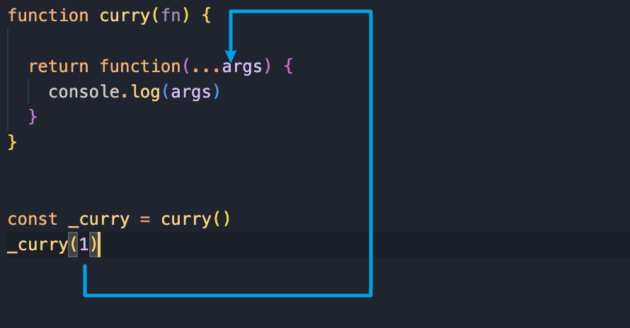
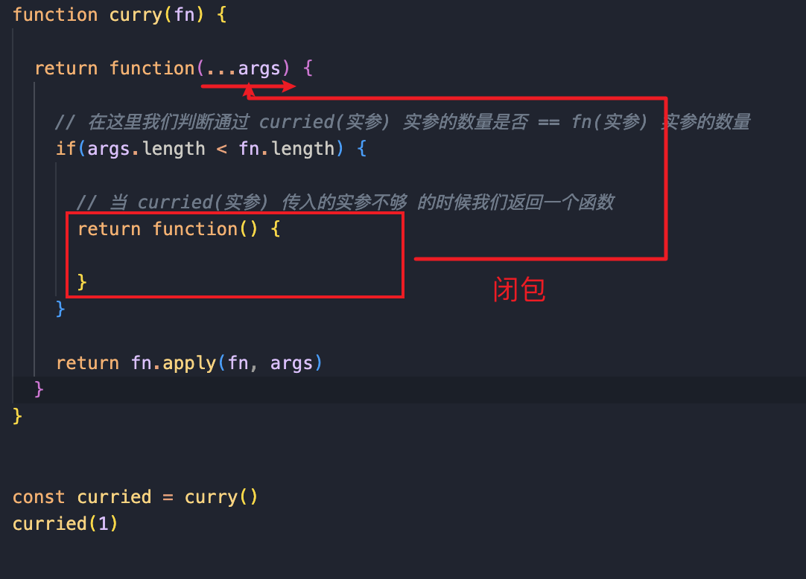

# 函数式编程
函数式编程 简称 FP 是编程范式之一

<br>

### 常用的编程范式有:
- 面向过程编程
- 面向对象编程

<br>

### 面向对象编程:
把现实世界中的事物 抽象成程序世界中的类和对象 通过封装 继承 多态来演示 事物 与 事物 之间的联系

<br>

### 函数式编程的思维方式:
把现实世界的事物和事物之间的 <font color="#C2185B">联系</font> **抽象到程序世界**(函数式编程就是对运算过程进行抽象)

- 面向对象是抽象现实生活中的<font color="#C2185B">事物</font>
- 函数式编程式对<font color="#C2185B">运算过程</font>的抽象
 
 <br>
  
**程序的本质:**  
根据输入通过某种运算获得相应的输出 程序开发过程中会涉及很多有输入和输出的函数

```js
// 我们有一个x 我们可以通过某种联系 得到结果y 联系f就是运算过程 
x -> f(联系 映射) -> y,   y = f(x)
```
    
<br>

**注意:**  
函数式编程中的函数值的不是程序中的函数(方法), 而是数学中的函数 即 映射关系 比如
```
y = sin(x)
```

x 和 y 的关系, 比如上面的公式 当x的值确定了之后y的值一定是固定的

**函数式编程中要求: 相同的输入始终要得到相同的输出(纯函数)**

<br>

### 总结:  
函数式编程用来描述 数据(函数)之间的映射

<br>

### 示例:
计算两个数的和 打印出结果
```js
// 非函数式: 一步步实现的也是面向过程的方式
let num1 = 2
let num2 = 3
let sum = num1 + num2
console.log(sum)


// 函数式: 
funciton add(n1, n2) {
  return n1 + n2
}

let sum = add(2,3)
console.log(sum)
```

当我们使用函数式编程的时候 首先要对运算过程进行抽象 我们会将运算过程抽象成 ``add(n1,n2)`` 它接收两个参数

然后经过运算后返回, 而且根据相同的输入 要有相同的输出  
当我们调用 add(2,3) 后打印结果

当我们使用函数式编程的时候 肯定会生成一些函数 这些函数可以无限的重用

<br><br>

# 函数是一等公民
英文名: first-class-function

### 特点:
- 函数可以存储在变量中
- 函数做为参数
- 函数做为返回值

在 js 中 <font color="#C2185B">函数就是一个普通的对象</font>(可以通过 new Function()来创建函数对象) 我们可以把函数存储到变量/数组中, 它可以作为另一个函数的参数和返回值  

甚至我们可以在程序运行的时候通过 ``new Function("alert(1)")`` 来构造一个新的函数  

<br>

### 函数可以存储在变量中:
```js
let fn = fucntion() {
  console.log("hello")
}

fn()
```

<br>

我们再看下 下面的示例:   
我们定义了一个对象 对象里有很多的方法

```js
// 一个示例:  
const BlogController = {
  index(posts) (return Views.index(posts)),
  show(posts) (return Views.show(posts)),
  create(attrs) (return Db.create(attrs)),
  update(posts, attrs) (return Db.update(posts, attrs)),
  destroy(posts) (return Db.destroy(posts)),
}
```

我们可以发现 index(posts) 和 View.index(posts) 有相同的地方  

也就是这两个方法的参数 和 返回值是一样的  

如果我们以后遇到了一个函数包裹了另一个函数 并且形式也相同的情况下 我们就可以认为他们是一样的函数

这时候我们就可以对下面这段代码进行优化  
上面说了 index(posts) 和 View.index(posts) 是一样的 这时候我们就可以把 View.index(posts) 赋值给index

```js
// 优化: 赋值的是方法本身不是调用调用方法后的返回值
const BlogController = {
  index: Views.index,
  show: Views.show,
  create: Db.create,
  update: Db.update,
  destroy: Db.destroy,
}
```

<br><br>

## 函数做为参数:

### 高阶函数:
- 可以把函数做为参数传递给另一个函数  
- 可以把函数做为另一个函数的返回值

<br>

### 示例: 函数做为参数 模拟forEach

**参数fn:**  
我们要对数组中的每一项做处理 但是每次调用 forEach 的时候 处理是不同的 比如:

- 打印每一项
- 将每一项赋值给页面的元素上
  
所以我们将不同的地方作为可变部分, 可以传递一个变量 这个变量就是函数
```js
function forEach(arr, fn) {
  // 拿到数组中的每一项
  for(let i = 0; i < arr.length; i++) {
    // 每次的处理方式是不同的 所以我们利用了 cb
    fn(array[i])
  }
}

// 测试:
let arr = [1,2,3]
forEach(arr, (item) => {
  console.log(item)
})
```

<br>

### 模拟 filter:
过滤数组中满足条件的元素 它内部也要对数组中的元素进行循环 把满足条件的元素存储起来 然后再返回

- 我们可能要找数组中偶数项的数据  
- 我们可能要找年龄超过18的人

所以我们要让函数变的通用, 我们需要在变化的位置传递一个函数就可以了

**参数fn:**  
fn的作用拿到成员 内部进行计算 返回过滤条件  

```js
function filter(arr, fn) {
  let results = []
  for(let i = 0; i < arr.length; i++) {

    // fn()作为条件出现在 if 里, 所以fn要返回boolean
    if(fn(array[i])) {
      results.push(arr[i])
    }
  }

  return results
}

// 测试:
let arr = [1,2,3]
let res = filter(arr, (item) => {
  return item > 2
})

console.log(res)
```

上面我们演示了函数作为参数的示例, 优点是函数作为参数可以让函数变的更加的灵活

<br>

### 示例: 函数做为返回值
一个函数生成一个函数
```js
function makeFn() {

  let msg = "hello"

  return function() {
    console.log(msg)
  }

}

let fn = makeFn()
fn()

// or

makeFn()()
```

<br>

### 实现once函数:  
给一个dom元素绑定事件 这个函数只会执行一次

<br>

**场景:**  
比如支付的时候 用户不管点击多少次按钮 我们只让他执行一次

<br>

**思路:**  
通过闭包的形式 在外层函数中缓存一个 标识 作为判断条件 节流阀


**前置理解:**  
所以我们在处理方法 和 回调的时候 最好考虑下 this 的问题 比如我们要通过 call apply 来进行调用
```js
// :
let username = "全局"


const obj = {
  username: "sam",
  say: function() {
    console.log(`say -- ${this.username} --`)
  }
}

// 通过 obj 来调用 say 的时候, 输出的sam 因为 this 是谁调用的方法 this 就是谁
obj.say()  // sam


// 如果我们将 say 交给 fn, 由 fn 直接调用的话 则 this 执行
const fn = obj.say
fn()  // undefined 不是 全局的原因是因为 username 是我们使用 let 声明的
```

<br>

```js
const obj = {
  username: "sam",
  say: function() {
    console.log(`say -- ${this.username} --`)
  }
}

const _once = once(obj.say)
_once()

function once(cb) {
  let flag = false

  return function() {
    console.log(this)  // 这里的this指向window
    if(!flag) {
      flag = false
      // 我们要拿到 cb 的返回值 所以加上return
      return cb()
    }
  }
}

/*
问题: 
  1. 为了拿掉 回调cb的返回值 所以我们在前面要加上 return

  2. 如果我们只是 cb() 的话, 我们在执行 _once() 的时候 属于直接调用 this 指向了window 而我们say方法中输出的this.username就是undefined

  一般来说我们会使用 apply 虽然我们传入的this还是指向 window
*/

// 解决方式: 使用 apply
function once(cb) {
  let flag = false

  return function() {
    if(!flag) {
      flag = false
      // 我们要拿到 cb 的返回值 所以加上return
      return cb.apply(this, arguments)
    }
  }
}
```

<br>

**本番:**  
上面是用来复习 let const this 指向的问题 下面才是这个示例想要说明的问题

```js
// 执行once会返回一个 只执行一次的函数
function once(cb) {

  // 标记: 标记cb是否被执行了 
  let done = false

  return functoin() {
    if(!done) {
      done = true

      // cb中要返回 true 或 false 用来告诉我们执行是否成功
      return cb.apply(this, arguments)
    }
  }
}


let pay = once(function(money) {
  console.log("支付了: ", money)
})

// pay接收到的是 return fucntion 也就是内层函数 内层函数并没有定义形参来接收参数 这时我们传递的5就会被arguments接收 同理我们会将argument传递给 cb回调
pay(5)
pay(5)
pay(5)
```

<br>

```js
// 获取DOM元素
let btn = document.querySelector("button")

// 我们通过 apply拿到的数据都在 args 中
let handler = once((...args) => {

  // 从中解构出e和其他数据使用呢
  let [e, params] = args
  console.log(e)
  console.log(params)

}, "参数数据")

btn.addEventListener("click", handler)


// 我们在调用once的时候传入fn回调 和 其他实参
function once(fn, ...args) {
  let flag = true

  // 因为我们是将返回的函数交给onclick做处理 所以返回的函数中可以拿到e
  return function(e) {

    if(flag) {
      // 我们将 e 和 once接收到的参数传给 fn回调
      fn.apply(this, [e, ...args])

      // 关闭节流阀
      flag = false
    }
  }
}
```

<br>

**温习下节流阀的做法:**  
```js
let flag = true
let btn = document.querySelector("button")
btn.addEventListener("click", e => {
  if(flag) {
    console.log(btn.innerHTML)
    flag = false
  }
})
```

<br><br>

## 高阶函数的意义:
函数式编程就是将运算过程抽象成函数 可以达到重用的效果

- 抽象可以帮我们屏蔽细节 只需要关注我们的目标
- 高阶函数用来抽象通用的问题

<br>

### 示例:
比如我们要循环打印数组中的所有元素

面向过程中 我们需要做for循环 控制退出条件 让变量++ 我们需要关注循环的所有细节 对循环变量的控制
```js
// 面向过程
let arr = [1,2,3]
for(let i=0; i<arr.length; i++) {
  console.log(arr[i])
}
```

<br>

而上面我们封装的forEach就是将循环的过程抽象成了函数 我们在使用forEach的时候并不需要关注循环的具体实现 不需要关注细节 我们只需要知道forEach内部帮助我们完成了循环就可以了
```js
// 高阶函数
let arr = [1,2,3]
forEach(arr, item => {
  console.log(item)
})
```

使用高阶函数 可以很灵活 抽象也可以屏蔽掉细节 我们只需要关注要实现的目标就可以了

<br>

### 模拟forEach带来的总结:
上面的部分重点在**我们可以将核心处理数据的逻辑提取出来** 通过传入回调的方式解决 其他的细节封装到函数的内部 

于是乎我们就能写出下面的代码
```js
// 成员为基本数据类型
let arr = [1,2,3,4,5]

// 封装一个each函数 通过回调实现动态 处理数据
const each = (arr, cb) => {
  for(let i = 0; i < arr.length; i++) {

    // 这里我们将成员值传递到函数中
    cb(arr[i])
  }
}

// 加工数据 让每个成员扩大10倍 预期是输出arr为[10,20,30,40,50]
each(arr, item => {
  item = item * 10
  console.log("item:", item)
})

console.log(arr)  // 结果 arr 仍然还是 [1,2,3,4,5]
```

<br>

原因, cb(arr[i]) 我们传过去的是一个基本数据类型的数据 让传入的是基本数据类型的时候 传入的是值的拷贝
```js
cb(arr[i])

function cb(item) { ... }
```

这里的 item 和 arr[i] 是没有任何关系的 所以我们修改的仅仅是 cb回调中的 item 并不是arr数组中的成员 我们应该做如下的修改

```js
// 我们将 数组本身 和 index 传过去
each(arr, (arr, index)=> {
  arr[index] = arr[index] * 10
})
```

<br>

### 常用的高阶函数:
- forEach
- map
- filter
- every
- some
- find
- reduce
- sort

上面的都需要函数作为一个参数 他们都是高阶函数

<br>

### 模拟 map:
对数组中的每一个元素进行遍历 并对每一个函数进行处理 把处理的结果存到一个新的数组中返回
```js
// fn: 用来对成员进行处理
const map = (arr, fn) => {

  let results = []

  for(let item of arr) {
    // 往数组中 推 fn处理后的结果
    results.push(fn(item))
  }

  // 返回新数组
  return results
}

// 测试:
let arr = [1,2,3]
map(arr, item => {
  return item * item
})
```

<br>

### 模拟 every:
every方法整体会返回boolean, 我们的回调fn就是拿到数据后 加工数据返回boolean
```js
// fn来检测元素是否匹配条件
const every = (arr, fn) => {
  // 假设所有的元素都是匹配条件的
  let result = true

  for(let item of arr) {
    result = fn(item)

    // 如果有一个不满足条件则直接break
    if(!result) break
  }

  return result
}


// 测试:
let arr = [11,12,13]
let res = every(arr, item => item > 10)
console.log(res)
```

<br>

### 模拟 some:
检测数组中的元素是否有一个满足条件, 我们将逻辑判断的部分交由回调处理
```js
const some = (arr, fn) => {
  // 假设所有的变量都不满足条件
  let result = false

  for(let item of arr) {
    result = fn(item)

    // 如果有一个就停止循环
    if(result) break
  }

  return result
}


// 测试
let arr = [1,2,3]
let res = some(arr, item => item % 2 == 0)
console.log(res)
```

<br><br>

# 闭包:
函数和其周围的状态(词法环境)的引用捆绑在一起形成闭包  
可以在另一个作用域中调用一个函数的内部函数并访问到该函数作用域中的成员

下面的函数中就使用到了闭包:  
```js
// 当调用 makeFn 会定义变量 msg
function makeFn() {
  let msg = "hello"
}

// 当函数执行完后 它内部的成员就会被释放掉
makeFn()


// 如果该函数中又返回了一个函数
function makeFn() {

  // 因为外部有 fn 引用这 makeFn 函数中的成员函数 所以 makeFn 中的成员 并不会被释放掉 msg 会一直被缓存
  let msg = "hello"

  // 返回了函数 并访问了外部函数中的成员 这就是闭包
  return function() {
    console.log(msg)
  }
}

// 跟上面不一样的是 当我们调用makeFn()后会返回一个函数
let fn = makeFn()
```

上面 fn变量 就引用了 makeFn中返回的函数 也就是外部对函数内部的成员有引用

当外部对函数内部有引用的时候 函数内部的成员就不能被释放 当我们调用 fn() 的时候 相当于调用了 makeFn 内部的函数 这时候会访问到 msg 变量  

也就是说 fn 和 makeFn 同处一个作用域 fn()调用了函数内部的函数 内部函数中访问了 makeFn作用域中的成员 这就是闭包

<br>

### 闭包的本质:
函数在执行的时候会放到一个执行栈上 当函数执行完毕之后会从执行栈上移除  

**但是堆上的作用域成员因为被外部引用不能释放**  因此内部函数仍然可以访问外部函数的成员

<br>

### 闭包的案例1:
比如我们要求一个数字的多少次方
```js
// 求 4 的 2 次方
Math.pow(4, 2)
Math.pow(5, 2)
```

当我们求一个数字的平方的时候 我们始终要指定 第二个参数 也就是说这个参数是不断的在变化 我们的需求是 当我们求一个数字的平方的时候 不需要传递该参数了

<br>

**需求: 生成求平方 or 3次方的函数**

<br>

**要点:**   
形参也是闭包
```js
// power: 多少次幂
function makePower(power) {

  // 求 num 的 n 次方
  return function(num) {
    return Math.pow(num, power)
  }
}


// 求平方
let power2 = makePower(2)

// 求3次方
let power3 = makePower(3)

// 求4的平方
console.log(power2(4))
```

上述的方式修改完后 我们生成的函数 就不需要指定 <font color="#C2185B">几次方</font> 的参数了

<br>

### 总结:
- 外层函数用来固定参数
- 内层函数用来灵活传参

<br>

### 闭包的案例2:
求员工的工资 基本工资 + 绩效工资 每个员工的级别不一样 基本工资和绩效工资也不一样

假设: 我们有一个函数
```js
// 1级别 工资12000 绩效2000
getSalary(12000, 2000)

// 2级别 工资15000 绩效3000
getSalary(15000, 3000)

// 2级别 工资15000 绩效4000
getSalary(15000, 4000)
```

我们发现当我们要调用求工资的函数的时候 我们都需要传入级别相对应的基本工资 

这个基本工资对同一级别的员工来说总是相同的 所以将来我们在调用 求工资的函数的时候 同一级别的调用 第一个参数会不停的重复

我们可以考虑 **为不同级别的员工去生成一个函数 避免相同的基本工资不停的重复**
```js
// 为不同级别的员工计算总工资的函数
function makeSalary(base) {

  // performance: 绩效工资
  return function(performance) {
    return base + performance
  }
}

// 分别生成了 基本工资 的函数
let salaryLevel1 = makeSalary(12000)
let salaryLevel2 = makeSalary(15000)

// 直接传入绩效工资
console.log(salaryLevel1(2000))
console.log(salaryLevel2(3000))
```

通过改造我们在未来调用的时候会方便一些 避免了相同基本工资的重复 

<font color="#C2185B">但是 每个salaryLevel1函数引用着 makeSalary 内部变量 这样占内存啊</font>

<br><br>

# 纯函数:
它是整个函数式编程的核心

<br>

### 纯函数的概念:  
<font color="#C2185B">相同的输入永远会得到相同的输出</font>, 而且没有任何可观察的副作用

```js
// 纯函数就类似数学中的函数(用来描述输入和输出之间的关系)
y = f(x)
```

<br>

### lodash是一个纯函数的功能库:    
提供了对 数组 数字 对象 字符串 函数等操作的一些方法

数组的 slice 和 splice 分别是: 纯函数 和 不纯函数

- slice: 返回数组中的指定部分 不会改变原数组
- splice: 对数组进行操作返回该数组 会改变原数组

```js
// slice
let arr = [1,2,3]

// 我们观察3次调用 slice 的结果是否是相同的
console.log(arr.slice(0))  // [1,2,3]
console.log(arr.slice(0))  // [1,2,3]
console.log(arr.slice(0))  // [1,2,3]

// 同时我们也考虑下 纯函数的定义 对相同的输入始终有相同的输出
```

我们能看到 3次输入得到的结果都是相同的 所以 slice 是一个纯函数

<br>

我们再看看 splice :
```js
console.log(arr.splice(0, 3))  // [1,2,3]
console.log(arr.splice(0, 3))  // []
console.log(arr.splice(0, 3))  // []
```

我们能看到每次调用 splice 得到的结果都是不相同的 因为每次调用它的时候 都会修改原数组

它根据相同的输入 得到的输出是不一样的 它是一个不纯的函数

<br>

### 自己实现一个纯函数:  
对于纯函数来说必须要有 输入 和 输出
```js
function getSum(n1, n2) {
  return n1 + n2
}


// 多次调用
console.log(getSum(1, 2))   // 3
console.log(getSum(1, 2))   // 3
console.log(getSum(1, 2))   // 3
```

上面根据相同的输入 始终会有相同的输出 所以我们写的是一个纯函数

<br>

函数式编程中不会保存计算中间的结果 所以变量是不可变的(无状态的) 我们可以把一个函数的执行结果交给另一个函数去处理

<br>

### 纯函数的好处:

**可缓存:**  
因为 纯函数 对相同的输入始终有相同的结果 所以可以把纯函数的结果缓存起来

比如:  
有一个函数 这个函数特别的耗时 每次调用该函数的时候 都需要等一段时间才能获取到结果 这样的话对性能来说是有影响的  

所以我们可以在这个函数在第一次执行的时候 将结果缓存起来 当我们第二次再次调用的时候 不需要等待那么长时间

<br>

#### <font color="#C2185B">_.memoize(纯函数)</font> 
lodash中的记忆函数, 它可以缓存纯函数的结果 

<br>

**返回值:** 
带有记忆功能的函数(缓存)

```js
import _ from "lodash"

// 定义一个纯函数
function getArea(r) {
  console.log("执行了")
  return Math.PI * r * r
}

// 缓存上述函数的结果
let getAreaWithMemory = _.memoize(getArea)

// 返回函数的参数 和 我们纯函数是一样的
console.log(getAreaWithMemory(5))

// 我们第一次调用的时候 输出了 执行了 但是 第二次 第三次的时候 并没有执行 console 证明之后的输出是走的函数中的缓存
console.log(getAreaWithMemory(5))
console.log(getAreaWithMemory(5))
```

<br>

### 实现 memoize 函数:  
**思路:**  
memoize方法需要接收一个 纯函数 并返回一个新的函数
```js
function memoize(fn) {

  // 利用这里的闭包部分将fn的执行结果返回在闭包中

  return function() {

  }

}
```

在 memoize 方法中需要将 fn的执行结果缓存起来 所以我们在 memoize 中定义一个 cache 对象 在该对象中缓存 fn 的执行结果

将执行结果存储起来之后我们下次再调用 函数 的时候 需要获取曾经的缓存结果 所以我们要创建一个对象

```js
function memoize(fn) {

  let cache = {
    // key: fn回调的实参 也就是内部函数中的 arguments
    // value: fn回调的执行结果
  }

  return function() {

  }

}

```

**<font color="#C2185B">cache对象的key:</font>**    
使用 回调fn的实参, 因为key的类型必须是字符串 所以我们这里使用 JSON.stringify() 来转换

<br>

**<font color="#C2185B">cache对象的value:</font>**    
value就是 fn 执行的结果

<br>

因为 fn 是第一个纯函数 纯函数的特点就是根据相同的输入会有相同的输出 所以我们可以  
- 将 fn 函数的实参 作为 key   
- 将 fn 函数的结果 作为 val

<br>

接下来 我们要在 return 的 function 中 调用 fn  
在调用之前我们要判断一下 cache 中是否已经有了 fn 的执行结果  

也就是根据 fn 的参数 去 cache 中取结果 如果取到的话执行将结果返回 如果没有取到的话 我们调用一下 fn() 并且将结果缓存起来  

上面我们说了 要将 fn 的参数作为 cache 的key  
而 我们最终调用的是 return 的 function 而这个function的参数我们最终会传递给 fn 所以我们只需要获取到 return funciton 这个 function 的参数就可以了

```js
function memoize(fn) {

  let cache = {}

  return function() {

    // 获取 cache 中的key key就是当我们调用 return function时候的实参
    let key = JSON.stringify(arguments) // 转换为字符串

    // 通过key去cache中获取 看看是否有缓存的结果
    cache[key] = cache[key] || fn.apply(fn, arguments)

    return cache[key]
  }

}


// 测试:
let getAreaWithMemory2 = memoize(getArea)
console.log(getAreaWithMemory2(5))
console.log(getAreaWithMemory2(5))
console.log(getAreaWithMemory2(5))
```

<br>

### 自己试验总结1:
- 利用了函数也是对象的方式 将 cache 对象保存在了 函数身上
- 利用了 map()
- map中的key就是 函数的参数

<br>

### 结果:
没有做到多次调用走缓存 因为没有闭包 没有引用 每次函数调用结束后 函数成员都清空了 所以每次调用都是新的

```js
// 下面这样不行 因为 函数调用之后 因为没有引用就清空了 函数的成员就没了
function query(r) {
  
  let cache = query.cache || (new Map())

  // 检查下 cache 中有没有 r 我们把函数的参数做为key
  if(cache.has(r)) {
    console.log("查看下是否走了缓存: ", cache)
    return cache.get(r)
  }

  // 没有的情况
  let res = Math.PI * r * r
  cache.set(r, res)

  // 预期第一次会走 其他的时候都不会走了
  console.log("cache: ", cache)
  return res
}

console.log(query(5))
console.log(query(5))
console.log(query(5))

/*
  每次调用 都是新的并没有走缓存
  cache:  Map(1) { 5 => 78.53981633974483 }
  78.53981633974483
  cache:  Map(1) { 5 => 78.53981633974483 }
  78.53981633974483
  cache:  Map(1) { 5 => 78.53981633974483 }
  78.53981633974483
*/
```

<br>

**自己试验总结2:**  
```js
function memoize(fn) {

  const cache = {
    // key: fn回调的实参 也就是内部函数中的 arguments
    // value: fn回调的执行结果
  }

  return function() {

    // 获取 key 的部分
    const key = JSON.stringify(arguments)

    if(!cache[key]) {
      cache[key] = fn.apply(fn, arguments)
    }

    return cache[key]

  }
}


const fn = (data) => {
  console.log("fn")
  return data * data
}

const _memoize = memoize(fn)
console.log(_memoize(10))
console.log(_memoize(10))
console.log(_memoize(10))
```

<br>

**可测试:**  
纯函数让测试更方便 因为纯函数始终有输入和输出 而单元测试就是在断言这个函数的结果 所以所有的纯函数都是可测试的函数

<br>

**并行处理:**  
在多线程环境下并行操作共享的内存数据(比如操作全局变量的时候) 很可能出现意外情况  

    多个线程同时修改同一个变量 此时这个变量的结果是什么就确定了

纯函数不需要访问共享的内存数据(纯函数式一个封闭的空间 纯函数只依赖于参数) 所以在并行环境下可以任意运行纯函数(比如 web worker 就是多线程)  

<br><br>

## 函数的副作用: 
上面我们了解了纯函数, 纯函数是对于相同的输入永远会得到相同的输出 而且没有任何可观察的副作用

这里我们研究下 什么叫做 **没有任何可观察的副作用**  

```js
// 第一个 checkAge: 不纯的
let mini = 18
function checkAge(age) {
  return age >= mini
}


// 第二个 checkAge: 纯函数
function checkAge(age) {
  // 硬编码 我们以后通过函数的柯里化解决硬编码的问题
  let mini = 18
  return age >= mini
}
```

<br>

**第一个 checkAge:**  
当 age 是 20 的时候 每次调用它的时候 每次不一样都会返回 true 因为它依赖于 全局变量 mini  

比如 mini 的值变成了 22 那么就会返回false

<br>

**第二个 checkAge:**  
我们可以将上面的函数改造成纯函数 很简单就是 第二个 checkAge 我们将 mini 放到了函数的内部 让它成为一个局部的变量 它就是一个纯函数

<br>

### 副作用:  
副作用让一个函数变的不纯(如上例) 纯函数的根据相同的输入返回相同的输出 <font color="#C2185B">如果函数依赖于外部的状态就无法保证输出相同 就会带来副作用</font>

<br>

### 副作用的来源:  
- 配置文件
- 数据库
- 获取用户的输入

所有的外部交互都有可能产生副作用  

副作用也使得方法通用性下降 不适合扩展和可重用性 同时副作用会给程序中带来安全隐患和不确定性 但是副作用不可能完全禁止  

尽可能控制他们在可控范围内发生

<br><br>

# 柯里化: 
使用 柯里化 解决上一个案例中 硬编码的问题, 上面因为函数有副作用 所以我们将 min 变量的值定义在函数的内部 使其成为一个局部变量

```js
function checkAge(age) {
  // 硬编码
  let min = 18
  return age > min
}
```

<br>

### 普通纯函数:  
解决上述硬编码的问题很简单 我们**将 min 放在 形参里就可以了** 这样它还是个纯函数 因为相同的输入有相同的输出 同时也解决了硬编码的问题
```js
function checkAge(min,age) {
  return age > min
}

// 我们经常使用的基准值 一般是 18 看看是否成年
checkAge(18, 23)
checkAge(18, 22)
checkAge(18, 25)
```

<br>

### 柯里化:  
上面如果 我们的基准值经常使用 18 的话 那么代码中18会经常的重复 之前我们在学习闭包的时候会遇到这样的问题  
  
上面怎么解决18重复的问题, 我们可以在 调用 checkAge 的时候固定下来(在外层函数中固定下来) 在返回的函数中我们再传入年龄

<br>

- **外层: 定规则, 固定值**  
- **内层: 定变量, 灵活传参**  
```js
function checkAge(min) {

  // 返回一个函数 age 为实际要比较的年龄
  return function(age) {
    return age >= min
  }

}


// 获取检查18岁的函数
let checkAge18 = checkAge(18)

// 获取检查20岁的函数
let checkAge20 = checkAge(20)

// 17 >= 18?
console.log(checkAge18(17))

// 18 >= 20?
console.log(checkAge20(18))
```

<br>

### 柯里化的概念:  
当函数有多个参数的时候 我们可以调用函数的时候 传递部分的参数(<font color="#C2185B">这部分的参数以后永远不变 </font>)  

然后让这个函数返回一个新的函数 新的函数接收剩余的参数 并返回结果 这就是函数的柯里化

<br><br>

## Lodash中的柯里化: 

### <font color="#C2185B">_.curry(fn):</font>  

**功能:**  
curry方法会创建一个函数 它接收一个或多个fn作为参数  

如果 fn回调 所需要的参数都被提供 则执行 fn 并返回执行的结果 否则继续返回该函数并等待接受剩余的参数

<br>

**参数:**  
需要柯里化的函数  

<br>

**返回值:**  
柯里化后的函数

<br>

**优点:**  
可以将多参数的函数(多元函数) 转换位 一元函数  

```js
import _ from "lodash"

// getSum函数有3个参数的时候 我们可以叫它3元函数
function getSum(a, b, c) {
  return a + b + c
}


// 柯里化可以将多元函数最终转换为1元函数
let curried = _.curry(getSum)

// 使用 curried 如果我们调用该函数的时候 传递了 getSum 的所有参数 那么它会立即调用执行
console.log(curried(1,2,3))

// 如果我们调用该函数的时候 只传递了 getSum 的部分参数 那么它会返回一个函数 用于接收 getSum 中剩下的参数
console.log(curried(1)(2)(3))

console.log(curried(1,2)(3))
```

<br>

### 案例: 柯里化的应用  
我们先思考一个问题 如果我们要判断字符串中是否有空白字符 或 提取空白字符 怎么做
```js
// 匹配字符串中的空白字符
"".match(/\s+/g)

// 匹配字符串中的数字
"".match(/\d+/g)
```

那么我们以后要是经常的提取空白字符 那么 ``"".match(/\s+/g)`` 会经常的被使用重复

我们想想上面我们学习了函数的柯里化 我们是不是可以利用柯里化将
- 重复的代码放到外层函数 
- 内部函数接收剩余参数 

这样相当于我们生成了一个 特定查询空白字符的 函数

```js
function outer(reg) {

  return inner(str) {
    return str.match(reg)
  }

}
```

上面的逻辑我们使用 lodash 中的 curry 方法实现下
```js
let match = _.curry((reg, str) => str.match(reg))
```

<br>

lodash中的curry()方法 如果一次性的传递匿名函数需要的所有参数 会直接调用获取结果 如果只传递一部分参数 会返回一个新的函数
```js
let match = _.curry((reg, str) => str.match(reg))

// 只传递 reg 返回一个专门 提取空白字符的函数
let haveSpace = match(/\s+/g)

// 只传递 reg 返回一个专门 提取数字的函数
let haveNumber = match(/\d+/g)

// 测试
console.log(haveSpace("hello world")) // [ ' ' ]
console.log(haveNumber("123abc")) // [ '123' ]
```

上面这样 我们就通过 柯里化 得到了两个具有特定功能的函数 这个函数可以在别的地方记录调用  

<br>

我们再思考下 假如我们要过滤一个数组 我们要找到数组中有空白字符的元素 怎么做?    
平时我们会调用 arr.filter() 方法 我们这里使用 curry 来封装下
```js
// 示例:
let arr = ["a b", "c_d"]
let res = arr.filter(item => item.match(/\s+/g))
console.log("res: ", res)


// fn为 条件函数 数组filter方法需要返回一个 布尔值
const filter = _.curry((fn, arr) => arr.filter(fn))

// 利用 柯里化 拿到专门过滤 空白字符的函数
const findSpace = filter(haveSpace)
console.log(findSpace(["John Connor", "John_Donne"]))
```

上面我们发现 通过柯里化我们可以将功能拆分成多个特定的小功能 方便在别的地方继续使用

<br><br>

# 柯里化的实现原理: 

### 思路:
调用 curry 的时候我们需要传递一个 纯函数fn 在调用curry方法之后会返回一个柯里化以后的函数
```js
function getSum(a,b,c) {
  return a + b + c
}


function curry(fn) {

  return function() {

  }

}
```

<br>



<br>

**我们调用 curry 返回的 curried函数 的时候有两种形式:**  
```js
const curried = curry(getSum)
```

- 参数fn需要几个参数 在调用 curried 的时候就传递几个参数 如果传入 curried 的参数个数 和 fn定义的参数个数相同的时候 那么我们会立即调用 fn 并返回它的执行结果

- 当我们调用 curried 的时候只传入 fn 所需要的部分参数 此时 curried 会返回一个新的函数 并且等待接收 fn 定义的剩下的其他参数

经过上面的分析我们知道 在调用 curried 的时候我们需要传递参数 而且传递参数的个数是不固定的 我们需要将这些参数全部的获取到 

并且要在函数内部判断下 我们调用 curried 的时候传递的参数 和 fn形参的数量是否相同

```js
// fn的形参个数可以通过 函数名.length 获取:
console.log(getSum.length)    // 3
```

```js
function curry(fn) {

  // 内部函数的 args 就是调用 curried 时候传递的实参 
  return function(...args) {
    // 判断调用curried的时候传递的实参个数 和 形参fn所需的参数个数是否相同

    // 调用 curried 的时候的实参 < fn的形参个数 这时我们要返回一个函数
    if(args.length < fn.length) {
      return function() {

      }
    }


    // 到这里说明 调用 curried 的时候的实参 >= fn的形参个数 我们指定 fn 并返回fn的执行结果
    return fn(...args)
  }

}
```

<br>

上面是一种的调用情况 下面我们考虑下另一种情况:  
调用 curried 的时候的实参 < fn的形参个数 这时我们要返回一个函数 这个函数中 我们要怎么处理?

在这里函数中我们要等待 传递的fn所需要的剩余的参数 当我们传递的剩余参数的个数 + 上次已经传递的参数个数 = fn所需的参数个数时 我们就要执行 fn

我们第一次调用 curried 的时候 就是在调用 return function 这时候我们传递了一个参数 该参数会保存在 ...args 中



而 我们在 return function 的内部又 return function 这样就会产生一个闭包 当我们调用 内部内部的function(<font color="#C2185B">目标A</font>)的时候 可以通过外层 args 来获取到 第一次调用curried时候传递的参数 1

    curried(1)

```js

const curried = curry(getSum)
// 调用 curried 传递的参数 会保存在 ...args 中
curried(1)


function curry(fn) {

  // 目标B
  // 调用 curried 传递的参数 会被记录到 args 中
  return function(...args) {

    if(args.length < fn.length) {
      

      // 目标A
      // 产生了闭包 
      return function() {

      }
    }

    // 目标C
    return fn(...args)

  }

}

function getSum(a,b,c) {
  return a + b + c
}
```

<br>

那当我们再调用 <font color="#C2185B">目标A</font> 的时候 要获取 本次 调用 <font color="#C2185B">目标A</font> 时传递的参数 也就是第二次调用的时候传递的2 3

    curried(1)(2,3)

这个 2 3 我们可以通过 <font color="#C2185B">arguments</font> 获取到 所以接下来 我们要在 <font color="#C2185B">目标A</font> 中调用 <font color="#C2185B">目标B</font>

因为当参数个数 和 fn所需的参数个数相同的时候 我们最终要调用 <font color="#C2185B">目标C </font>  
而在 <font color="#C2185B">目标B</font> 内部最终调用了 <font color="#C2185B">目标C</font> 所以在 <font color="#C2185B">目标A</font> 中调用 <font color="#C2185B">目标B</font> 就可以达到最终的目的

那如果在 <font color="#C2185B">目标A</font> 中调用 <font color="#C2185B">目标B</font> 呢 因为 <font color="#C2185B">目标B</font> 现在是匿名的 很简单 我们给它起个名字就可以了 <font color="#C2185B">(curriedFn)</font>

```js
function curry(fn) {

  // 给 目标B 起个函数名
  return function curriedFn(...args) {

    if(args.length < fn.length) {

      // 目标A
      return function() {
        
        // 在这里我们调用 目标B(curriedFn) 并返回结果
        return curriedFn(这里需要传递参数)
      }
    }

    // 目标C
    return fn(...args)
  }
}
```

我们要给 curriedFn 传递参数 如果curriedFn的形参个数 和 fn所需要的形参个数相同的话 它就会调用 <font color="#C2185B">目标C </font>

所以我们要将已得到的所有的参数准备好 传入到curriedFn中  
- 我们第一部分参数在 args 中 
- 我们第二部分在 <font color="#C2185B">目标A</font> 的形参中 <font color="#C2185B">目标A</font> 中的形参可以通过 <font color="#C2185B">arguments</font> 获取到

所以我们要将 arguments 和 args 中的参数合并起来传递给 curriedFn

```js
function curry(fn) {

  // 给 目标B 起个函数名
  return function curriedFn(...args) {

    if(args.length < fn.length) {

      // 目标A
      return function() {
        
        // 在这里我们调用 目标B(curriedFn) 并返回结果
        return curriedFn(...args.concat(Array.from(arguments))
      }
    }

    // 目标C
    return fn(...args)
  }
}
```


测试下:
```js

function getSum(a, b, c) {
  return a + b + c
}

function curry(fn) {

  // curry函数会生成一个函数 = 返回一个函数
  return function curriedFn(...args) {

    // 判断 如果内部参数接收到的参数 < fn的参数 则继续返回一个函数
    if(args.length < fn.length) {

      return function() {
        // 这时候再调用 curriedFn 后会再次进入判断逻辑 判断参数个数是否相同
        return curriedFn(...args.concat(Array.from(arguments)))

        // 这样也是可以的
        // return curriedFn(...args, ...arguments)
      }
    }

    // 否则执行 fn
    return fn(...args)

  }

}


let curried = curry(getSum)
console.log(curried(1,2,3))
console.log(curried(1)(2,3))
```

<br>

### 总结:
柯里化让我们给一个函数传递较少的参数得到一个已经 <font color="#C2185B">记住了某些固定参数 </font> 的新函数  

**这是一种对函数参数的缓存**  

让函数变的更加的灵活 让函数的粒度更小 可以把多元函数转换成一元函数 可以组合使用函数产生强大的功能

```js
// curry 接收一个纯函数做为参数 fn会有1个以上的参数哦
function curry(fn) {

  // curry函数会生成一个函数 = 返回一个函数
  return function curryFn(...args) {

    // 判断 如果内部参数接收到的参数 < fn的参数 则继续返回一个返回
    if(args.length < fn.length) {
      return function() {
        // 递归调用 第一个内层函数
        return curryFn(...args, ...arguments)
      }
    }

    // 否则执行 fn
    return fn(...args)
  }
}

// 传入一个fn做为参数 返回curried函数
const curried = curry((reg, str) => reg.test(str))

// curried函数可以传入第一个参数 作为固定值 返回一个专用函数
// 验证: 用户输入的字符是否为空
const strValidation = curried(/^s*$/g)

// 验证: 用户输入的数字的长度是否 > 6
const numValidation = curried(/^\d{0,6}$/g)

let str = "abc"
const strRes = strValidation(str)
console.log(strRes)

let num = "1233333"
const numRes = numValidation(num)
console.log(numRes)
```

<br><br>

# 函数组合
我们使用 纯函数 和 柯里化 很容易写出洋葱代码
```js
h(g(f(x)))
```

我们将 f(x) 的结果 交给 g处理 将g的结果 交给 h处理  

<br>

再比如: 获取数组的最后一个元素再转换成大写字母
```js
_.toUpper(_.first(_.reverse(arr)))
```

翻转数组之后的第一个元素就是最后一个元素 上面的样式就是洋葱代码 一层包一层 **我们使用函数式组合 就可以避免出现这样的代码**

我们使用 函数组合可以让我们把细粒度的函数重新组合生成一个新的函数

<br>

### 数据的管道:
下面的图表示程序中使用函数处理数据的过程 

给fn函数(处理数据)输入参数a 返回结果b 可以想想 a 数据通过一个管道(函数)得到了 b 数据

```js
        ----------------
- a ->        fn          - b ->
        ----------------
```

当 fn 函数比较复杂的时候 比如我们家里面的水管 特别的长 如果出现漏水的地方 我们排查起来就非常的麻烦 

这时候我们可以改造特长的管道 让它变短 变成3个 将来谁出现问题 排查起来会更容易

我们可以把 fn 拆分成多个小函数 此时多了中间运算过程产生的 m n (在函数组合的时候是不需要考虑中间结果的)

下面这张图中可以想象吧 fn 管道拆分成了 3个管道 f1 f2 f3 数据a 通过管道f3得到结果 m m再通过管道f2得到结果 n n再通过管道f1得到最终的结果b

```js
              fn
  ------------------------
  ------   ------   ------  
a → f3 → m → f2 → n → f1 → b
  ------   ------   ------  
  ------------------------
```


伪代码描述上述的图:
```js
// compose将传入的函数组成一个新的函数
fn = compose(f1, f2, f3)

// 当我们调用 fn 的时候我们只需要传入 a 不关心中间结果 直接得到b
b = fn(a)
```

<br><br>

## 函数组合的概念 compose:
如果一个函数要经过多个函数处理才能得到最终的结果 这个时候可以把中间过程的函数合并成一个函数

函数就像是数据的管道 **函数组合就是把这些管道链接起来** 让数据穿过多个管道形成最终结果

<font color="#C2185B">函数组合默认是从 右 到 左 执行, 右 → 左 </font>

```js
// 会先执行 f3 再执行 f2 再执行 f1
fn = compose(f1, f2, f3)
``` 
    
<br>

### 函数组合的演示:

**<font color="#C2185B">注意: 函数组合的时候 需要定义只有一个参数的纯函数 </font>**  

我们需要一个函数 用来组合多个函数  

compose方法要接收多个函数类型的参数 并且能将其组合成一个新的函数返回

我们简化下 我们先只考虑处理两个函数参数 f g (两节函数)

内部返回的 返回要能接收参数 因为我们上面说过函数就相当于数据处理的管道 这个管道是需要输入一个参数 并且处理完成后要返回一个结果

函数组合执行是有顺序的默认是 **从右到左** 所以我们要先执行 g

```js
function compose(f, g) {


  // compose生成的函数 会接收参数 该参数 val 会经过 g 和 f 来进行处理
  return function(value) {

    // 处理输入的数据 并返回一个结果
    return f(g(value))

  }
}
```

<br>

上面我们发现 **洋葱代码并没有减少只是将它封装起来了** 下面我们找个例子

我们使用compose 求数组中最后一个元素
```js
function compose(f, g) {
  return function(value) {
    return f(g(value))
  }
}

// 粒度小的函数: 翻转数组
function reverse(arr) {
  return arr.reverse()
}

// 获取第一个元素
function first(arr) {
  return arr[0]
}

// 通过 compose 将它们组合成一个新的函数 
// 注意顺序: 我们要先翻转数组 所以reverse要在最右边
let last = compose(first, reverse)


// 测试:
console.log(last([1,2,3]))
```

这也太麻烦了 如果但从功能实现来说是这样的 但是我们要知道我们写的这些 粒度小的功能函数 是可以任意组合的 而且任意的被调用 函数式编程最大作用就是 可以让函数最大程度的被复用

<br><br>

# Lodash中的组合函数
上面我们自己实现了下 compose 方法 但是只能传入两个函数 如果我们想把更多的函数组合起来 我们可以利用 lodash 中的函数

lodash中提供了两个组合函数 都可以组合多个函数:

<br>

### <font color="#C2185B">flow()</font>
参数fn是从左到右运行

<br>

### <font color="#C2185B">flowRight()</font>
参数fn是从右到左运行, **使用的更多一些**

<br>

### 需求:
接下来我们使用 flowRight() 解决一个问题, 我们将数组中的最后一个元素取出来并且转成大写

使用函数组合我们要先定义很多功能的部分函数 比如上面的需求 我们要准备:

- reserve()
- first()
- toUpper()

```js
import _ from "lodash"

const reverse = arr => arr.reverse()
const first = arr => arr[0]
const toUpper = str => str.toUpperCase()

/*
  调用 flowRight 将上面的函数组合起来
  新函数的功能是获取数组中最后一个成员并转成大写

  注意顺序
*/
const fn = _.flowRight(toUpper, first, reverse)

console.log(fn(["a", "b", "c"]))    // C
```

<br><br>

# 组合函数 flowRight() 的原理:

### <font color="#C2185B">flowRight()</font>
参数: 不固定的fn 任意数量的fn

调用flowRight之后会将我们传入的函数组合成新的函数 所以flowRight会返回一个函数 并且返回的函数要接收参数 也就是接收数据 它要处理数据并返回

它在处理的时候会将数据先传递给 参数函数中的最后一个(从右往左)

```js
// args接收不确定几个的 fn 
function compose(...args) {

  // compose返回的函数 接收到 value 数据 然后我们要对val进行处理
  return function(value) {


    return ????  // 我们要返回最终处理后的结果

  }
}
```

<br>

### 那我们要在 return function 内层函数中做什么呢? 返回什么呢？  
在这里我们最终要返回一个数据 返回的数据是什么?  

我们要依次调用 args 中我们传入的函数 **而且我们函数式组合默认是从右到左的执行顺序** args是参数数组 当中存的就是我们传入的纯函数

那我们要从后往前来调用这些函数的话 那我们就先要对数组进行 reverse 

```js
return args.reverse()
```

翻转之后我们就是从后往前来调用args中的每一个函数 调用的时候我们要让数组中的每一个fn对value进行处理 并且把值 <font color="#C2185B">依次累计</font> 并返回

这里我们使用数组的方式 **reduce** 

```js
return args.reverse().reduce((pre, fn) => fn(pre), 初始值??)
```
    
fn是数组中的每一个函数 通过函数处理value 当处理完成后将结果返回 当我们调用数组中第二个函数的时候 fn(pre) 处理的是上一个函数返回的结果

**<font color="#C2185B">那 pre 的初始值是多少?</font>** 我们希望初始值是第一次调用 return
function 时候传递的参数 **value** 

所以我们要设置reduce的初始值

```js
return args.reverse().reduce((pre, fn) => fn(pre), value)
```

```js
function compose(...args) {

  // 调用内部函数的时候 会传入数据
  return function(data) {

    // 我们将传入的 fn 们 反序使用 reduce 进行调用 初始值为inner函数接收到的参数
    return args.reverse().reduce((pre, fn) => fn(pre), data)
  }
}

// 箭头函数
const compose = (...args) => data => args.reverse().reduce((pre, fn) => fn(pre), data)


const reverse = arr => arr.reverse()
const first = arr => arr[0]
const toUpper = str => str.toUpperCase()

let fn = compose(toUpper, first, reverse)
console.log(fn(["a", "b", "c"]))
```

<br><br>

## 函数组合要满足的特点:
函数组合要满足 结合律 我们既可以把 g 和 h 组合 还可以把 f g 进行组合 结果都是一样的

比如我们要将 3个函数组合成一个函数
```js
let fn = compose(f, g, h)
```

我们既可以先组合 g h 也可以组合 f g 但结果都是一样的 都是等效的

```js
let associative = compose(compose(f, g), h) == compose(f, compose(g, h))
```

也就是数学中的结合律 先结合前两个数 和 先结合后两个数 结果都是一样的

```js
import _ from "lodash"

const fn = _.flowRight(_.toUpper, _.first, _.reverse)
console.log(fn(["a", "b", "c"]))    // C


// 演示结合律: 先组合 toUpper + first
const fn2 = _.flowRight(_.flowRight(_.toUpper, _.first), _.reverse)
console.log(fn2(["a", "b", "c"])) 

// 演示结合律: 先组合 first + reverse
const fn3 = _.flowRight(_.toUpper, _.flowRight(_.first, _.reverse))
console.log(fn3(["a", "b", "c"])) 
```

<br>

### 练习:
```js
function compose(...args) {
  return function(val) {
    return args.reverse().reduce((pre, fn) => {
      return fn(pre)
    }, val)
  }
}

function curry(fn) {
  return function curryFn(...args) {
    if(args.length < fn.length) {
      return function() {
        return curryFn(...args, ...arguments)
      }
    }

    return fn(...args)
  }
}

const source = {
  addForm: {
    workerCode: ""
  },
  updForm: {
    workerCode: ""
  }
}

// 需求: 将 arr 数组中取最后一个元素 并将其转换为大写 最后放入到 addForm 中
const arr = ["abcd", "sdfs", "sam"]

// 1. 翻转函数
const reverse = arr => arr.reverse()

// 2. 获取第一个元素的函数
const first = arr => arr[0]

// 3. 将元素放入到prefix对应的表单对象中
const addVal = (formPrefix, data) => {
  const form = `${formPrefix}Form`
  source[form].workerCode = data
  return source[form]
}

// 问题: 函数组合要求参数只能是一个 所以我们使用 柯里化函数来解决
const _addVal = curry(addVal)
// 生成只给addForm添加数据的函数, addFormVal 调用的时候只需要传入 data
const addFormVal = _addVal("add")

const _compose = compose(addFormVal, first, reverse)
const _addForm = _compose(arr)
console.log(_addForm)
// { workerCode: 'sam' }
```

<br><br>

## 函数组合的调试:
当我们使用函数组合的时候 如果执行的结果 和 预期的不一致怎么调试?

```js
import _ from "lodash"

const fn = _.flowRight(_.toUpper, _.first, _.reverse)
console.log(fn(["a", "b", "c"])) 
```

当上面的结果 和 预期的不一致 我们想要单独的看下 reverse 的结果 或者 first 的结果 我们需要怎么做?

<br>

### 案例:
先来回顾一下: 函数组合我们提供的局部功能函数 <font color="#C2185B">只能有一个参数</font>  

我们通过案例来调试组合函数 比如要转换形式
```js
NEVER SAY DIE --> never-say-die
```
    
<br>

### 思路:  
我们可以先根据空格对字符串进行切割 切割后再转换为小写 然后再使用join对数组中的每一个元素使用 - 分割

我们看下lodash中给我们提供的方法:   

<br>

**<font color="#C2185B">_.split</font>**  
该方法接受 2个参数 str 和 sep(分隔符) 我们上面说了 局部功能函数只能有一个参数 

所以我们要先用 柯里化的方式对其进行改造  

另外我们是在函数组合完毕后 才会传入 数据 部分 str 应该最后传入

```js
// 我们外层函数中 交换了参数的位置 目的是 调用split的时候先传入 sep
const split = _.curry((sep, str) => _.split(str, sep))

// 下面我们使用的时候 split(" ") 会返回一个接收一个参数(str) 的新函数
```

<br>

**<font color="#C2185B">_.join</font>**  
它也需要两个参数 数组 和 分隔符 所以我们还是需要改进  
```js
const join = _.curry((sep, arr) => _.join(arr, sep))
```

<br>

**<font color="#C2185B">trace</font>**  
为了调试方便 我们定义 trace 函数

在函数组合中 一个函数执行完毕后 会将结果传递给下一个函数 所以我们可以在 目标位置写一个函数 打印执行的结果 并且再返回给下一个要处理的函数

- tag: 打印结果是在哪个函数后面打印的
- v: 打印的数据
```js
const trace = _.curry((tag, v) => (console.log(tag, v), v))

// 下面调用的时候 在函数之间使用
const fn = _.flowRight(join("-"), trace("map之后打印的"), map(_.toLower), trace("split之后打印的"), split(" "))
```

<br>

上面定义好 局部函数后 我们开始组合
```js
const fn = _.flowRight(join("-"), _.toLower, split(" "))
console.log(fn("NEVER SAY DIE"))
// n-e-v-e-r-,-s-a-y-,-d-i-e
```

<br>

我们发现 上面的结果跟我们的预期差很多 那是哪个部分出现的问题呢?  

所以我们想看下 split() 的结果 如果它没有问题的话 我们要看下 toLower 的结果 这里我们就可以利用 上面定义好的 trace 函数

```js
const fn = _.flowRight(join("-"), trace("toLower之后打印的"), _.toLower, trace("split之后打印的"), split(" "))
```

split的结果是: [ 'NEVER', 'SAY', 'DIE' ]
    
没有问题

toLower的结果是: never,say,die

这里将数组转换为了 字符串 never,say,die 有问题 而我们是要将一个数组传递给join

所以我们不能使用 _.toLower 了 我们要在 toLower 的位置 遍历数组中的每一个元素 将其转换为小写 我们要使用 map

<br>

**<font color="#C2185B">_.map</font>**  
map方法也需要两个参数 arr, cb 我们要在cb中处理数组中的每一个元素 也要改造
```js
const map = _.curry((fn, arr) => _.map(arr, fn))

// 下面我们要使用的 map 的时候直接传入 toLower
map(_.toLower)
```


```js
import _ from "lodash"

// 改造函数
const split = _.curry((sep, str) => _.split(str, sep))
const join = _.curry((sep, arr) => _.join(arr, sep))
const map = _.curry((fn, arr) => _.map(arr, fn))

// 跟踪函数
const log = v => (console.log(v), v)
const trace = _.curry((tag, v) => (console.log(tag, v), v))

// 组合函数
const fn = _.flowRight(join("-"), trace("map之后打印的"), map(_.toLower), trace("split之后打印的"), split(" "))
console.log(fn("NEVER SAY DIE"))  // never-say-die
```

上面看起来还是很麻烦 因为上面我们对多参数的函数 都要进行柯里化的改造 这点就很麻烦  

下面我们会学习 lodash 中函数式编程的模块 可以改善这些问题

<br>

# Lodash中的 FP 模块
我们在函数式组合解决问题的时候 会使用到 lodash 中提供的一些方法 但是如果这些方法有多个参数的情况下 我们需要对这些方法进行柯里化的处理 我们需要重新的包装这些方法 会比较麻烦

lodash中提供了 FP 模块 里面提供了实用的对函数式编程友好的方法 提供了不可变 已经被柯里化的 函数优先 数据滞后
 
- auto-curried
- iteratee-first
- data-last

<br>

也就是说 fp 模块中的方法有别于 lodash 中提供的其他方法 都是 **函数优先 数据滞后**, 其他方法则是 **数据优先 函数滞后**

### 演示:
```js
import _ from "lodash"

// 对数组进行遍历 指定函数对成员进行处理 我们在调用 lodash中的方法的时候会要求 数据优先 函数滞后
_.map(["a", "b", "c"], _.toUpper)
// ["A", "B", "C"]

// 如果没有传递 函数 的话  会原封不动返回
_.map(["a", "b", "c"])
// ["a", "b", "c"]


// 数据优先函数滞后
_.split("hello world", " ")
```

<br>

### lodash/fp 模块提供的方法:
fp.map() 在调用的时候首先需要传递函数 然后再传入数据 这就是 fp 模块中的函数优先 数据滞后

fp.map() 是一个柯里化的函数
```js
// 取出 fp
import fp from "lodash/fp"

fp.map(fp.toUpper, ["a", "b", "c"])

// 如果我们传递了一个参数 那么它会返回一个函数等待接收剩余的参数
fp.map(fp.toUpper)(["a", "b", "c"])


// fp.split 也一样 它也是一个柯里化的函数
fp.split(" ", "hello world")
fp.split(" ")("hello world")
```

<br>

我们使用 lodash 中的 fp 模块 完成上面的案例:
```
NEVER SAY DIE -> never-say-die
```

```js
// 还必须加上 js
import fp from "lodash/fp.js"

const fn = fp.flowRight(fp.join("-"), fp.map(fp.toLower), fp.split(" "))
console.log(fn("NEVER SAY DIE"))
```

fp模块中提供的方法都是柯里化之后的 都是函数优先数据滞后的 这些方法都可以在函数组合的时候直接使用

<br>

# Lodash 的 map 和 fp模块中的 map 区别:

<br>

### 需求: 字符串数组中的所有元素 都转换成整型:

    ["23", "8", "10"]

我们会将数组中的成员 转换成整型 平时如果我们要将 字符串数字转成整型 那么会调用 parseInt 方法
```js
let str = "10"

// parseInt的第二个参数是进制 取值范围为2-36
let ret = parseInt(str, 2)
console.log(ret)  // 2
```

parseInt方法接受2个参数 字符串型数字 和 进制 进制的取值范围 2-36

<br>

如果我们使用 lodash 中的 map 方法做这件事会有以下的问题:  
```js
let res1 = _.map(["23", "8", "10"], parseInt)
console.log(res1)   // [ 23, NaN, 2 ]
```

<br>

### 原因:
- lodash中的函数式 数据优先 函数滞后  
- 当我们调用 map 方法的回调fn的时候 fn回调接收3个参数  

```js
(value, index/key, arr) => {}
```

而我们指定了 parseInt 作为 map方法的回调fn 则会出现我们会往 parseInt 方法中送 3个参数 value, index/key, arr

当 map 方法执行的时候 会遍历数组中的每一个元素 并且将每一个元素都传递给 parseInt

- 第一次 会传递3个参数
```js
parseInt("23", 0, arr)    // 10进制
```

- 第二次 会传递3个参数
```js
parseInt("8", 1, arr)     // 1进制 不支持
```

- 第三次 会传递3个参数
```js
parseInt("10", 2, arr)    // 2进制
```

上面的parseInt会接收3个参数 所以要解决上述的问题 我们只能自己封装一个parseInt 让它只接收一个参数

```js
// lodash做这件事情:
let res1 = _.map(["23", "8", "10"], parseInt)
console.log(res1)   // [ 23, NaN, 2 ]
```

<br>

**我们再看看使用 fp 模块中的map方法:**  
- fp.map() 是函数优先 数据滞后
- map函数第一个参数为 fn fn只接收一个参数 这点跟 lodash 中的函数不一样
  
```js
let res2 = fp.map(parseInt, ["23", "8", "10"])
console.log(res2)   // [ 23, 8, 10 ]
```

<br><br>

# Point Free 编程风格:
Point Free具体实现是函数组合
  
我们可以把数据处理的过程定义成与数据无关的合成运算 不需要用到代表数据的那个参数 只要把简单的运算步骤合成到一起  

在使用这种模式之前我们需要定义一些辅助的基本运算的函数

- 不需要指明处理的数据
- **只需要合成运算的过程**
- 需要定义一些辅助的基本运算函数

```js
// 我们基本运算合成一个新的函数 这个过程中我们是没有指明要处理的数据的
const fn = fp.flowRight(fp.join("-"), fp.map(_.toLower), fp.split(" "))
```

<br>

### 案例演示: Hello World -> hello_world
**函数式编程的核心:**  
就是将运算过程抽象成函数

<br>

**point free 模式:**  
就是将我们抽象出来的函数合成一个函数 这个合成的过程又是一个抽象的过程

在这里抽象的过程中依然是不用关心数据的
```js
// 非 point free 模式
function fn(word) {
  // 转换成小写 利用正则将 空格 替换成 _
  return word.toLowerCase().replace(/\s+/g, "_")
}


// point free 模式: 先转小写 再替换空格为字符串
const fp = require("lodash/fp")

// fp模块如果只传递部分参数的话会返回一个新的函数, replace接收3个 我们只传递了两个 数据没传
const fn = fp.flowRight(fp.replace(/\s+/g, "_"), fp.toLower)

// 传入要处理的数据
console.log(fn("Hello World"))
```

<br>

### 总结:
1. 先组合函数 无关数据
2. 在获取合成的函数后 我们在传入数据

<br>

### 案例: 
提取首字母 大写 以.作为分隔符
```
world wild web -> W.W.W
```

<br>

### 思路:
使用空格 对字符串进行切割 得到数组  
然后将数组的每一项转换为大写 将数组中成员的第一个字符取出  
再使用.链接数组中的成员
 
```js
import fp from "lodash/fp.js"
import _ from "lodash"

/*
  使用空格 对字符串进行切割 得到数组:
      fp.split(" ")

  然后将数组的每一项转换为大写 将数组中成员的第一个字符取出  
      fp.map(fp.toUpper)
      fp.map(fp.first)

  再使用.链接数组中的成员
      fp.join(". ")
*/
const firstLetterToUpper = fp.flowRight(fp.join(". "), fp.map(fp.first), fp.map(fp.toUpper), fp.split(" "))
console.log(firstLetterToUpper("world wild web"))
```

<br>

上面我们使用了两次map 每调用一次就会对数组进行遍历 能不能只做一次循环 也就是我们map中要做两件事情
- 转换大写
- 提取首字母

那能不能将 first 和 toUpper 合并成一个新的函数呢?  
我们可以使用 fp.flowRight() 来完成

```js
const firstLetterToUpper = fp.flowRight(
  fp.join(". "), 
  fp.map(
    fp.flowRight(
      fp.first, 
      fp.toUpper
    )
  ), 
  fp.split(" ")
)
```

<br><br>

# 函子: Functor
到目前为止我们已经学习了函数式编程的一些基础 但是我们还没有演示函数式编程中 <font color="#C2185B">如何把副作用控制在可控的范围内</font> 异常处理 异步操作等

<br><br>

## 什么是 Functor

**<font color="#C2185B">函子就是一个容器 用于包裹我们的数据 我们的数据不会从容器中取出使用 而是始终会在容器内部通过 容器的map方法来修改和使用</font>**  

<br>

**所谓的函子就单纯的理解为一个数据 只不过这个数据是在对象中的 该对象提供了操作数据的map方法 但该数据不能从对象中取出来使用**

<br>

### 容器:
包含值和值的变形关系(这个变形关系就是函数)  
容器中就包含了值 和 处理值的函数

<br>

### 函子:
是一个特殊的容器 我们可以将它想象成一个盒子(class) 盒子里面有一个值 和 会向外暴露一个方法(map) 

map方法会接收一个参数 **参数就是对值进行处理的一个函数** 它通过一个普通的对象来实现  

该对象具有 map 方法 map方法可以运行一个函数对值进行处理(变形关系)

<br>

### 要点:
- 函子中的值是不对外公布的  
- 函子对象中会公布map方法 专门用来处理 值 的函数

```js
// 函子: 是一个普通的对象 对象中会维护一个值 和 map方法
class Container {

  #value = null

  constructor(val) {
    this.#value = val
  }

  /*
    map方法: 返回 Container 实例对象

    map方法: 参数 fn 用于处理 #value 相当与 forEach等方法的回调

    map方法: 在处理#value后 最终还要返回一个新的盒子(函子)

    #value并不对外暴露 它只存在于函子中

    fn: 作用是处理值 并且把处理的结果 传递给一个新的函子
  */
  map(fn) {
    return new Container(fn(this.#value))
  }
}


// map的参数是 fn, fn接收到的是具体的val值, map方法返回的还是函子对象
let ret = new Container(5).map(x => x + 1).map(x => x * x)
console.log(ret)    // { _value: 36 }
```

<br>

**上述函数的执行过程:**  
执行过程 new Container(5)的时候创建了一个函子对象, 调用对象的map方法 我们传递了一个函数  

Container类中 map 方法中, 我们调用了 fn(this._value) 并传递进去了 this._value 它将处理的结果返回成新的函子对象

```js
return new Container(fn(this._value))
```

因为它返回了一个新的函子对象(<font color="#C2185B">相当于return this 可以链式调用</font>) 所以我们可以继续对值进行处理 因为每一个函子对象都有一个map方法

<br>

### 注意:
map方法返回的不是值 而是一个函子对象  

在新的函子对象中保存新的值 我们不会将值对外公布 如果要处理值的话我们就会向map中传递一个处理值的函数

<br>

上面每次创建函子的时候我们都需要通过 new Container(5) 去调用, 不方便我们将它封装一下 让它可以不再通过new来调用

通过静态方法修改下面的 Container类

```js
class Container {

  // of方法的作用就是返回函子对象
  static of(val) {
    return new Container(val)
  }

  constructor(val) {
    this._value = val
  }

  map(fn) {
    return Container.of(fn(this._value))
  }
}

// 静态方法
let ret = Container.of(5).map(x => x + 2).map(x => x * x)
console.log(ret)
```

我们的值始终会在函子对象里面 我们永远不会从函子中取出这个值 我们想对值进行处理的话就会调用 map 方法 如果想使用值也是在 map 方法的 fn函数里面 使用值

使用函子的时候会不停的.map链式编程 函子是具有map方法的对象

<br>

### 总结:
- 函数式编程的运算不直接操作值 而是由函子来完成  
- 函子就是一个实现了 map 契约的对象  
- 我们可以把函子想象成一个盒子 这个盒子里面封装了一个值  
- 想要处理盒子中的值 我们需要给盒子的map方法传递一个处理值的函数(纯函数) 由这个函数来对值进行处理 
- 最终 map 方法返回一个包含新值的盒子(函子)

<br>

### 问题:
假如我们在创建函子的时候传递了 undefined 或 null 那么在处理值的时候就会报错 怎么处理 空值的问题呢？

```js
import fp from "lodash/fp.js"
import _ from "lodash"


class Container {

  // of方法的作用就是返回函子对象
  static of(val) {
    return new Container(val)
  }

  constructor(val) {
    this._value = val
  }

  map(fn) {
    return Container.of(fn(this._value))
  }
}

let ret = Container.of(null).map(x => x.toUpperCase())    // 操作 因为传入了 null
```

<br><br>

# MayBe 函子: 
下面的各种函子就是上面 Container类, 只不过其内部的功能更加的丰富了些

我们看看MayBe函子

上面 我们在使用 functor 函子的时候 如果传递 null 可能会出现异常 而 MayBe 函子可以处理空值的情况

我们在编程的过程中可能会遇到很多的错误 需要对这些错误做响应的处理  

```js
外部传递空值就是一种副作用 我们可以控制这种副作用
```

我们在创建函子之后 执行map()的时候 map()方法内部会返回一个 fn处理值后的新的函子
```js
map(fn) {
  return Container.of(fn(this._value))
}
```

如果 fn(this._value) value为空的时候会抛出错误 那我们是不是可以在 fn(this._value) 之前判断下 value 是否为 null 或 undefined

<br>

### MayBe函子的作用:
就是可以对外部的空值情况做处理(**控制副作用在允许的范围**)

```js
// MayBe函子
class MayBe {

  _value = null

  constructor(val) {
    this._value = val
  }

  // 外部可以调用 静态方法of 创建 MayBe 函子
  static of(val) {
    return new MayBe(val)
  }

  // map方法接收一个函数 处理内部的值 返回一个新的函子
  map(fn) {

    // 如果 this._value 为 null 则返回一个 null 的函子 如果 this._value 有值 则返回一个 fn处理过的新的函子
    return this.isNothing() ? MayBe.of(null) : MayBe.of(fn(this._value))
  }

  // 判断 value 是否有值
  isNothing() {
    return this._value == undefined || this._value == null
  }
}


// 测试:
let ret = MayBe.of("Hello World").map(x => x.toUpperCase())
console.log(ret)  // MayBe { _value: 'HELLO WORLD' }


// 测试空值的情况:
let ret2 = MayBe.of(null).map(x => x.toUpperCase())
// 不会报错 而是返回了一个 null的函子
console.log(ret2) // MayBe { _value: null }
```

<br>

### MayBe函子的问题:
虽然我们可以处理空值的问题, 但是多次调用map的时候 哪一次map出现了空值不明确
```js
let ret3 = MayBe.of("Hello World")
    .map(x => x.toUpperCase())
    .map(x => null)   // 中途设置null
    .map(x => x.split(" "))


// 我们在执行的过程中不会抛出异常 但结果会出现null 但是哪个map出现的null 我们不知道
console.log(ret3)   // MayBe { _value: null }
```

<br><br>

# Either 函子
Either 两者中的任何一个 类似于 if ... else ... 的处理过程 异常会让函数变的不纯 **Either 函子可以用来做异常处理**

<br>

### 正常的情况下:
我们会使用 Rigth类 来包装函子, 该类中会有map方法来操作数据 和正常的函子一样

<br>

### 错误的情况下:
我们会使用 Left类 来包装函子, 该类中用于处理异常错误等情况  

因为该类的map方法会直接返回 this 所以我们会传入 {error: xxx} 对象来初始化 Left类 相当于创建了一个错误对象

<br>

**也就是说 当正确和错误的时候 我们会选择使用 Right 或者 Left**

<br>

之前我们在使用 MayBe 函子的时候 当我们传入 null 的时候 我们不会处理map的参数fn  

仅仅返回了一个 值为 null 的函子  

但是不会给出任何有效的信息 它不会告诉我们是哪块出了问题 出了什么问题

我们可以使用 Either 函子解决这个问题 当出现错误的时候 Either 函子可以给出有效的信息

<br><br>

## Either 的实现: 
我们在使用 Either 的时候 因为是 2选1 所以我们要定义两种类型 Left Right

### 先定义 Left 和 Right:
```js
class Left {

  constructor(val) {
    this._value = val
  }

  static of(val) {
    return new Left(val)
  }

  // Left中的map比较特殊 我们直接返回 this 当前对象
  map(fn) {
    return this
  }
}


class Right {

  constructor(val) {
    this._value = val
  }

  static of(val) {
    return new Right(val)
  }

  // Right类中map 和 Container类中的map是一样的
  map(fn) {
    return Right.of(fn(this._value))
  }
}


// 我们看看 r l 的输出结果
let r = Right.of(12).map(x => x + 2)
let l = Left.of(12).map(x => x + 2)

console.log(r)    // Right { _value: 14 }

// Left的map是直接返回我们传入的数据 没有做任何的处理
console.log(l)    // Left  { _value: 12 }
```

<br>

### 怎么使用 Left 和 Right 呢
**需求:**   
我们将 字符串型的对象 通过 JSON.parse() 方法来转换成真正的对象  

<br>

我们知道JSON.parse()方法当转换的json格式不正确的情况下 会抛出异常 这里我们就用  

- Left函子 处理异常
- Right函子 处理正常情况下的数据 将数据使用 函子包裹 修改数据也是通过 map 方法

```js
// 将传入的字符串 转成 JSON对象 进行返回
function parseJSON(str) {
  
  try {
    // 我们将 字符串使用JSON.parse()转换的结果交给 函子 以后都在函子的内部去处理数据 以后会调用map方法处理我们传入的值
    return Right.of(JSON.parse(str))

  } catch(err) {
    
    // 当要出现错误的时候 我们直接使用 错误对象来新建函子 Left 用于处理错误 异常时候用的 可以使用 错误对象等新建函子
    return Left.of({error: err.message})
  }
} 


// JSON格式错误下的测试:
let res = parseJSON("{name: 'sam'}")
console.log(res)
// Left { _value: { error: 'Unexpected token n in JSON at position 1' } }


// JSON格式正确下的测试:
let res2 = parseJSON('{"name": "sam"}')
console.log(res2)
// Right { _value: { name: 'sam' } }


// 使用 map 处理正确情况下的数据
let res2 = parseJSON('{"name": "sam"}')
    .map(obj => obj.name.toUpperCase())
console.log(res2)   // Right { _value: 'SAM' }
```

<br><br>

# IO 函子
到这里我们对函子有了一定的认识 我们把函子想象成一个盒子 盒子中保存了一个值 盒子的map方法可以传入一个函数 通过这个函数 对盒子中的值进行处理

<br>

IO是 input output 输入输出的意思  

IO函子和我们之前学过的函子不同 它内部的 _value 是一个函数 这里是把函数作为值来处理

_value中存储的是函数 在函子内部并没有调用这个函数 通过IO函子是延迟的执行了这些不纯的操作

IO函子可以把不纯的动作存储到 _value 中 延迟执行这个不纯的操作(惰性执行) 包装当前的操作

<br>

### 惰性执行:
通过IO函子包装了一些函数 当需要的时候再来执行这些函数 因为IO函子中存储的函数有可能是不纯的 但是通过IO函子将它们包装起来 我们当前的操作就是纯的操作
 
把不纯的操作延迟到调用的时候 交给调用者来处理 有了IO函子我们就可以把不纯的操作装进笼子里 但是这些操作最终都要执行的 但什么时机执行 我们交给调用者决定

**这很像工作当中的甩锅现象**

<br><br>

## IO函子的实现:

### IO函子中的构造器 
构造器中传入的是 fn 我们把 fn 放到了 _value 里
```js
constructor(fn) {
  this._value = fn
}
```

<br>

### IO函子中的静态方法 of
静态方法 of 接收的参数x 仍然是数据  
```js
static of(x) {
  return new IO(function() {
    return x
  })
}
```
    
在 of方法 里面会返回一个 IO函子 return new IO(fn) 调用of方法的时候会new IO我们传入的fn会在 _value 身上, _value函数包裹了我们的数据x  

当我们想要x这个值的时候 再调用IO函子中的 _value函数 就可以了

其实通过 of 方法我们能感受到 IO函子最终还是想把一个值返回 只不过IO函子内部通过一个函数将这个值包裹起来了  

IO函子它将求值的过程做了延迟处理 当我们想要x这个值的时候 再调用IO函子中的 _value函数

<br>

### **<font color="#C2185B">IO函子中的map()</font>**  
```js
map(fn) {
  // 把当前的value 和 传入的fn组合成一个新的函数
  return new IO(fp.flowRight(fn, this._value))
}
```
    

map(fn) 还是接收一个函数作为参数 在map方法里面我们调用 IO的构造函数 来创建一个 IO 的函子  

```js
return new IO(fp.flowRight(fn, this._value))
``` 

我们使用 fp 模块来组合两个函数 map的回调fn 和 _value 返回了一个新的函数 作为新的IO函子的 _value 传入了

最终返回了一个新的IO函子

```js
import fp from "lodash/fp.js"

class IO {
  // 
  constructor(fn) {
    this._value = fn
  }

  static of(x) {
    return new IO(function() {
      return x
    })
  }

  map(fn) {
    // 把当前的value 和 传入的fn组合成一个新的函数
    return new IO(fp.flowRight(fn, this._value))
  }
}


// 当调用 of 方法的时候 会将取值的过程包装到一个函数中 当我们需要的时候再来获取process
// 我们来获取 process 中的某个属性
let res = IO.of(process).map(p => p.execPath)
console.log(res)
// IO { _value: [Function (anonymous)] }

// 返回的是 IO 函子
console.log(res._value())
// 执行进程的路径: /Users/liulin/.nvm/versions/node/v17.0.1/bin/node
```

<br>

### 执行过程:  
```js
IO.of(process) == new IO(function() {return x})
```

<br>

我们会将 下面的函数保存在 _value 上
```js
function() {
  return x
}
```
    
map(p => p.execPath) p => p.execPath 就是 fn 我们会将 fn 和 _value(上面的函数) 组合成一个新的函数 保存在 _value 上

<br>

### 总结:  
IO函子内部帮我们包装了一些函数 当我们传递函数的时候 有可能函数是不纯的操作

```js
map(p => p.execPath)
```

我们不管这个函数是纯还是不纯 IO函子返回的结果肯定是纯的操作 我们调用 map 始终会返回一个IO的函子 

_value中保存的可能是不纯的函数 我们将这些不纯的操作延迟到调用的时候 也就是说我们通过 IO函子将副作用控制在了可控的范围内发生

<br><br>

# 未完待续:
等再看几遍上面的笔记 然后继续整理后续的函子 34-39 未看 
```s
https://www.bilibili.com/video/BV16a411d72j?p=34&spm_id_from=pageDriver&vd_source=66d9d28ceb1490c7b37726323336322b
``` 

<br><br>

# Lodash 函数式编程的库:
- 安装: npm i lodash
- 引入: ``const _ = require("lodash")``

<br>

#### <font color="#C2185B">_.first(arr)</font> 
获取数组中第一个元素

<br>

#### <font color="#C2185B">_.last(arr)</font> 
获取数组中最后一个元素

<br>

#### <font color="#C2185B">_.toUpper(arr)</font> 
将数组成员转换为大写

<br>

### 示例:
```js
// nodejs里面竟然可以写 import 
import _ from "lodash"
// let _ = require("lodash")

let arr = ["jack", "tom", "lucy", "kate"]

// 函数式编程的纯函数中 相同的输入要有相同的输出
console.log(_.first(arr))
console.log(_.last(arr))

// 将数组中的第一个函数转换为大写
console.log(_.toUpper(_.first(arr)))


// 返回的是数组的本身
let res = _.each(arr, (item, index, arr) => {
  console.log(item, index)
})
console.log(res)
```

