## 待整理:

### 各种源码实现
```s
https://mp.weixin.qq.com/s/OS7gTvJ2gAVCZBvU-1cAqA
```

<br><br>

# 九宫格效果
```s
https://www.bilibili.com/list/3494367522195464?sort_field=pubtime&spm_id_from=333.999.0.0&oid=875369920&bvid=BV1zN4y167Hf
```

<br><br>

# 元素的函数式排列
看完数学看它吧
```s
https://www.bilibili.com/list/666759136?tid=0&sort_field=pubtime&spm_id_from=333.999.0.0&oid=360842440&bvid=BV1H94y1B7Te
```

<br><br>

# 粒子时钟
```s
https://www.bilibili.com/list/666759136?tid=0&sort_field=pubtime&spm_id_from=333.999.0.0&oid=531004025&bvid=BV1Tu411L7jh
```

<br><br>

# 自动检测更新
```s
https://www.bilibili.com/list/666759136?tid=0&sort_field=pubtime&spm_id_from=333.999.0.0&oid=913948546&bvid=BV1AM4y1W7b8
```

<br><br>

# 粒子效果的实现
待整理: css-doodle
```s
particles.js

https://github.com/VincentGarreau/particles.js/
```

<br><br>

# 实现拼音标注
```s
https://www.bilibili.com/list/666759136?tid=0&sort_field=pubtime&spm_id_from=333.999.0.0&oid=321492135&bvid=BV1kw411Y7sr
```

<br><br>

# 声音的分析和处理: Audio Api
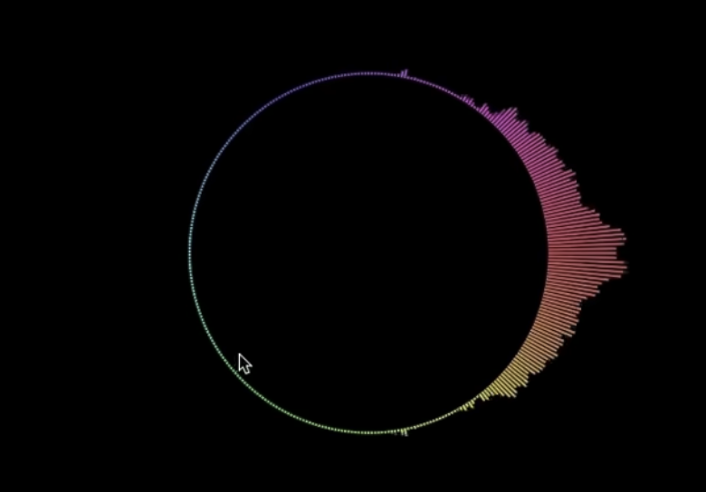

<br>

图片上的波形图会随着节奏的变化 而跟着变化 这里需要利用到 audio Api

<br>

### Audio Api:
它是专门来处理音频数据的 比如有一端声音它可能来自于一段音乐的播放 可能来自于我们的语音 它要将这个数据拿到 然后进行处理

<br>

**概念: 音频上下文 AudioContext**  
它是一个环境, 它是所有节点的集合, 这个环境来管理这些节点

<br>

**概念: 处理节点**   
一个音频数据要处理, 它会经过很多的环节 每一个环节都是一个节点

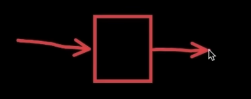

比如上图就一个一个节点 给它一段声音数据 它会将这些声音数据里边的噪音全部去掉 然后把处理过后的数据再重新输出 这就是一个节点的功能

给它一段数据 然后它给你返回一个数据 (就像一个函数一样)

在音频处理中节点可以有很多 这些节点之间进行相互的链接 上一个处理完的数据 交给下一个节点 当所有的节点处理完数据之后 我们还可以将数据交给输出设备

输出设备就会将我们处理过的声音给你展现出来

**我们这个篇章主要会用到一个分析节点** 它帮我们来分析音频数据

<br>

### 代码:
```s
https://www.bilibili.com/list/3494367331354766?sort_field=pubtime&spm_id_from=333.999.0.0&oid=364438745&bvid=BV1y94y1b79m
```

```html
<canvas></canvas>
<audio src="1.mp3" controls></audio>

<script>
  const audioEle = document.querySelector('audio')
  const cvs = document.querySelector('canvas')
  const ctx = cvs.getContext('2d')

  function initCvs() {
    const size = 500
    cvs.width = size * devicePixelRatio
    cvs.height = size * devicePixelRatio

    cvs.style.width = cvs.style.height = size + 'px'
  }
  initCvs()

  function draw(datas, maxValue) {

  } 
  // 参数2: 数组中的每一项可以取到的最大值, 该函数的作用是在canvas中画一个圆, 是由100个点组层的圆 每个点可以有长度
  // draw(new Array(100).fill(0), 255)
  // draw(new Array(100).fill(0).map(() => Math.random() * 255), 255) 这样就是一个 ☀️


  // 点击 播放音乐 的事件
  let isInit = false // 初始化只执行一次
  let analyser, buffer
  audioEle.onplay = function() {
    if (isInit) return

    // 创建音频上下文
    const audioCtx = new AudioContext()
    // 创建一个音频分析器节点
    analyser = audioCtx.createAnalyser()

    // 数组中每一个元素取值范围为 0 - 255
    // 数组的长度 长度决定了分析结果到底有多精细 越精细分析出来的数据就越多 数组的长度就越长 通过下面的属性来调控, 当我们设置为512之后 分析结果为512的一半
    analyser.fftSize = 512
    buffer = new Uint8Array(256)

    // 来源节点: 音频数据的来源 是来自音频数据的播放 还是麦克风 所以我们配置音频上下文的数据来源 创建一个音频来源
    const source = audioCtx.createMediaElementSource(audioEle)

    // 将音频节点 和 分析器节点 链接到一起 这样音频数据就会输送到分析器节点中
    source.connect(analyser)

    // 将分析器处理后的数据输出到哪, 我们用分析器节点连接上下文的输出目标
    analyser.connect(audioCtx.destination)

    isInit = true
  }


  // 为了循环调用 analyser.getByteFrequencyData()
  function update() {
    requestAnimationFrame(update)
    if (!isInit) return

    // 参数: 数组, 获取到的 频域数据
    // 在调用它的时候 它会以调用它的时间点为准 来得到一小段时间里面的数据比如10毫秒 你在这个时间点调用这个函数 那么它就得到10毫秒以内的一些音频相关数据 它会将分析的结果放到这个数组里面去
    analyser.getByteFrequencyData(buffer)

    /*
      analyser.getByteFrequencyData(): 获取的是 频域数据
      analyser.getByteTimeDomainData(): 获取的是 时域数据

      时域数据:
        是一个坐标系 横坐标表示时间, 纵坐标表示振幅(音量)
      
      频域数据:
        是一个坐标系 横坐标表示频率 纵坐标是一小段时间中不同频率的声音 这里叫做能量或者是功率

      能量和功率: 
        可以认为它是响度 响度就是人感知到的声音大小 比如同样音量的东西我们用钢琴弹出来同样的音量 和 用唢呐吹出来 人感知到的响度是不一样的

        这时我们就认为唢呐的能量 或者叫 功率 要高于钢琴, 尽管它们的音量都是一样的
    */

    draw(buffer, 255)

  }
  update()
</script>
```


<br><br>

# 音视频自动播放
B站等视频网站上的视频都能自动播放, 但是到了我们自己的网站的时候 就不行了
```html
<video autoplay></video>
```

通过js控制也没有用, 而且报错了
```html
<video autoplay></video>
<script>
  const vdo = document.querySelector('video')
  vdo.play()
</script>

<!-- 
  play方法失败了 因为用户还没有与页面进行互操作 
  它必须让用户点一下页面 有了互操作之后才能进行播放
  DOMException: play() failed because the user didnt interact with the document first
 -->
```

<br>

### 问题: 为什么B站 和 抖音不用呢?
这里就涉及到了浏览器的自动播放策略, 它是从chrome66版本开始生效的 

chrome不是不允许自动播放 但是他要满足一些条件, **如果视频是静音的 没有声音 这种情况下就允许自动播放**

父窗口如果已经有了自动播放的能力了 它可以把这个能力传递给iframe里面的子窗体 前提条件得是得同源

如果视频需要带声音 那么满足如下的3个条件中的任意一个都可以进行自动播放

1. 用户已经与当前域进行了交互(click, tap)

2. 在桌面设备上, 用户的媒体参与度指数阈值已超过, 这就意味着用户之前播放过
```s
媒体参与度:

它的值越高浏览器就会认为这个用户对这个网站上的多媒体(音视频)更感兴趣 这时浏览器就允许音视频自动播放

媒体参与度是衡量个人在网站上使用多媒体的倾向(用户对站点中的音视频有多感兴趣) 它是一个数字 可通过 chrome://media-engagement 查看

数值越高, 用户对该站点的媒体参数与越高, 就越有机会自动播放

对开发者而言:
1. 媒体参与度的计算规则无法通过技术手段更改
2. 媒体参与度的计算规则不同版本的浏览器可能会有变动
```

3. 用户已经网站添加到移动设备上的主屏幕或在桌面上安装了pwa

<br>

**媒体参数度:**  


<br>

### 实践:
我们在自动播放音视频的时候 我们要考虑两种情况, 有可能它是播放不成功的 我们要针对成功和不成功 分别写逻辑

<br>

### 方案1: 互动后播放
先尝试自动播放, 若发生异常(报错), 则引导用户进行互动操作(比如视频中心出现一个播放按钮), 然后进行播放

```html
<div class="vdo-container">
  <video src=""></video>
  <!-- 蒙层 里面有一个按钮 默认隐藏 -->
  <div class="model">
    <button class="btn">▶️</button>
  </div>
</div>

<script>
  const vdo = document.querySelector('video')
  const model = document.querySelector('.model')
  const btn = document.querySelector('.btn')

  async function play() {
    try {
      await vdo.play()
      model.style.display = 'none'
      btn.removeEventListener('click', play)
    } catch (err) {
      model.style.display = 'flex'
      btn.addEventListener('click', play)
    }
  }

  play()
</script>
```

<br>

### 方案2: 互动后出声
先静音播放, 然后根据是否能自动播放决定是否取消静音, 如果
1. 能自动播放, 取消静音
2. 不能自动播放, 引导用户进行互动操作后取消静音
```html
<script>
  const vdo = document.querySelector('video')
  const model = document.querySelector('.model')
  const btn = document.querySelector('.btn')

  async function play() {
    // 静音播放, 这样浏览器可以允许自动播放
    vdo.muted = true
    vdo.play()

    // 判断 自动允许带声音的自动播放
    const ctx = new AudioContext()
    // 如果页面允许自动播放的话 它的状态就是 running (不能则是 suspense)
    const canAutoPlay = ctx.state === 'running'
    ctx.close()

    if (canAutoPlay) {
      vdo.muted = false
      model.style.display = 'none'
      btn.removeEventListener('click', play)
    } else {
      model.style.display = 'flex'
      btn.addEventListener('click', play)
    }
  }

  play()
</script>
```


<br><br>

# 通过js设置css变量

### **<font color='#C2185B'>元素.style.setProperty(k,v)</font>**
```html
<style>
  #ball {
    width: 30px;
    height: 30px;
    
    /* 设置的变量在css的部分可以使用 */
    background-color: var(--c);

    position: absolute;
    top: 50%;
    transform: translateY(-50%);
  }
</style>
<body>
  <div id="ball"></div>
  <script>
    const ball = document.querySelector('#ball')

    // 设置 变量
    ball.style.setProperty('--c', '#333')
  </script>
</body>
```

<br><br>

# 数字字符串 格式化 (正则匹配某个位置)
```js
const str = '10000000000'
// 期待: 10,000,000,000 从右向左 每3位来个逗号
```

<br>

### 正则表达式的解决方案
使用 replace 将某个东西 替换为 ,

那我们怎么使用正则来匹配到某个位置(预期中,号的位置), 因为这是个位置 是个空字符

<br>

### 使用 前瞻运算符 (?=)
前瞻运算符 本身不消耗 任何字符 就是说我们写了前瞻之后 它不会匹配到某一个具体的字符 **它不会匹配任何一个字符**

前瞻的意思是说 我就在那个位置往前看一看 看看后边的东西满不满足规则 **满足规则就将 位置 匹配上了**

比如
```js
const str = '10000000000'
const r = str.replace(/(?=\d)/g, ',')
console.log(r)

// ,1,0,0,0,0,0,0,0,0,0,0
```

我们发现 当我们写了 ``(?=\d)`` 之后, 它就变成了 每个位置加了一个 ,

也就是说前瞻匹配到了每一个位置
```js
 ↓
' 10000000000'

// ,1,0,0,0,0,0,0,0,0,0,0
```

我们在1的前面往前看看 看看后边有没有满足 \d 这个规则, 前面有 有个1, 所以这个位置 就满足了这样的规则 这个位置就被匹配上了 将这个位置替换成了一个,

<br>

### 思考
我们要匹配的位置是 每3位来个逗号
```js
const str = '10000000000'
// d{3}+ 表示3个数字出现一次或多次 也就是3的倍数
const r = str.replace(/(?=\d{3}+$)/g, ',')
console.log(r)
// ,100,000,000,000 可能出现这样的 所以我们要去除边界 我们匹配的位置后面不能是单词边界
const r = str.replace(/(?=\B(\d{3})+$)/g, ',')
```

<br><br>

# 连续赋值的问题
```js
var a = { n: 1 }
var b = a
a.x = a = { n: 2 }

console.log(a.x)  // undefined
console.log(b.x)  // { n: 2 }
```

我们分成两个部分来看 赋值也是一个表达式 所有的运算符组合出来都是表达式

1. 给 ``a.x`` 赋值为 ``a = { n: 2 }`` 的值

2. js会先确定给哪个对象的x属性进行赋值, 所以它会先运算左边的表达式 也就是 ``a.x`` 它要定位到左边是哪个对象 目前 a 的地址 指向了 ``{ n: 1 }``

也就是要给 ``{ n: 1 }`` 对象的x属性 进行赋值 但是赋什么样的值 还不知道 **所以要计算右侧的表达式**  ``a = { n: 2 }``

这个表达式再给栈中的a赋值 赋值为一个新的对象 这样右边的表达式运算完毕

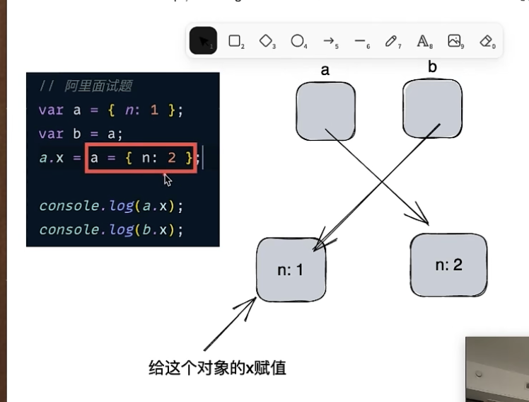

右边的表达式运算完毕之后, 一个赋值运算的表达式 运算完了后 它会将右边那个值返回 也就是 ``a = { n: 2 }`` 赋值结束后 会返回 ``{ n: 2 }``

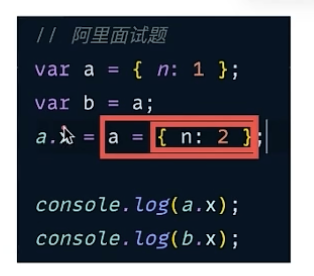

``a = { n: 2 }`` 这个表达式返回的结果就是 ``{ n: 2 }`` 这个对象的地址值 将这个地址赋值给了 a.x

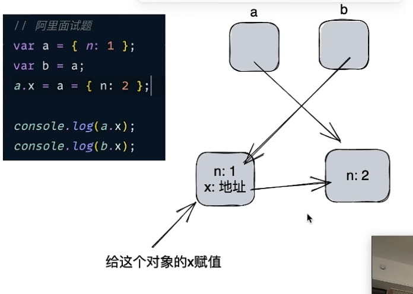

<br><br>

### 判断属性 a 在 obj 中 存在不存在
什么叫做存在 什么叫做不存在

判断属性a是否在obj上的方式有很多 比如

<br>

**方式1: 对比undefined**  
第一种判断方式可以说是最不准确的, 这种方式**判断的是属性的值**, 而不是属性本身
```js
const obj = {}

if (obj.a !== undefined) {
  console.log('存在')
} else {
  console.log('不存在')
}
```  

比如我们的a属性的值是undefined, 那是不是有a属性呢, 明显是有a属性, 它的值是undefined
```js
const obj = {
  a: undefined
}
```

<br>

**方式2: 使用 Object.keys**  
我们获取obj的所有**自有属性且可枚举**的属性名, 自有属性是说 该对象本身所拥有的不在它的原型链上

这种做法针对原型上的属性来说的时候 也不是很准确
```js
const obj = {}

if (Object.keys(obj).includes('a')) {
  console.log('存在')
} else {
  console.log('不存在')
}
```  

<br>

**方式3: 使用 hasOwnProperty**  
该方式在判断对象的**自有属性**中是否有a, **不管该属性是否是可枚举的**

这种做法针对原型上的属性来说的时候 也不是很准确
```js
const obj = {}

if (obj.hasOwnProperty('a')) {
  console.log('存在')
} else {
  console.log('不存在')
}
```  

<br>

**方式4: 使用 in**  
只要obj中可以访问到a, 都认为是存在的, 也就是说 a在原型上还是自有属性 不管是可枚举和不可枚举 只要有a 就认为是存在的

很多情况下 我们判断一个对象中是否有某个属性的时候 都是使用该方式
```js
const obj = {}

if ('a' in obj) {
  console.log('存在')
} else {
  console.log('不存在')
}
```  

<br>

上面的几种方法, 当属性a在obj中的时候 它们判断的结果都是存在
```js
const obj {
  a: 1
}

if (obj.a !== undefined) {
  console.log('存在')
} else {
  console.log('不存在')
}

// console.log(Object.keys(obj))  // []
if (Object.keys(obj).includes('a')) {
  console.log('存在')
} else {
  console.log('不存在')
}

if (obj.hasOwnProperty('a')) {
  console.log('存在')
} else {
  console.log('不存在')
}

if ('a' in obj) {
  console.log('存在')
} else {
  console.log('不存在')
}

// 方式1: 存在
// 方式2: 存在
// 方式3: 存在
// 方式4: 存在
```

但是这个a如果在obj的原型上
```js
function OBJ() {

}
OBJ.prototype.a = 1

const obj = new OBJ()

// console.log(obj.a)  // 1
if (obj.a !== undefined) {
  console.log('存在')
} else {
  console.log('不存在')
}

// console.log(Object.keys(obj))  // []
if (Object.keys(obj).includes('a')) {
  console.log('存在')
} else {
  console.log('不存在')
}

if (obj.hasOwnProperty('a')) {
  console.log('存在')
} else {
  console.log('不存在')
}

if ('a' in obj) {
  console.log('存在')
} else {
  console.log('不存在')
}

// 方式1: 存在
// 方式2: 不存在
// 方式3: 不存在
// 方式4: 存在
```

<br>

所以我们要 搞清楚 什么叫存在 什么叫不存在

<br><br>

# 零款字符
```js
const loginId = '我爱坤坤'
const loginPwd = '123123'

console.log(loginId.length) // 8

if (loginId === '我爱坤坤' && loginPwd === '123123') {
  console.log('登录成功')
} else {
  console.log('登录失败')
}
```

上面的代码应该是输出 登录成功, 但结果却是 登录失败

<br>

### 原因
我们输出下 loginId 发现 它的字符长度是8

原因就是 我爱坤坤 中 出现了我们看不见的字符 用户注册的时候 可能写了一切乱七八糟的字符在里面 但是自己写的时候就没有一些乱七八糟的字符了 所以就匹配不上

<br>

**看不见的字符: 零宽字符**  
这些字符叫做 零宽字符, 也就是 这个字符在界面上是没有任何宽度的 也叫做幽灵字符

比如下面这些 unicode编码的字符 都是零宽字符


<br>

### 零宽字符的作用:
有些语言中没有办法 比如阿拉伯语 和 印度语 它里面有些东西 它就是字符之间要有连写和不连写 可能连写出来 和 不连写出来 表达的意思是不一样的

所以它们需要有一个符号来告诉它到底是连写还是不连写, 类似这些都是不同的语言中产生的规则

<br>

### 上述的情况 怎么确定是否是用户的问题?
1. 我们可以输出这些字符的长度
2. 将这些文字放到文本文件中 使用 ``vim 文件``

<br>

### 零宽字符的技巧
数字水印, 这个水印人眼是看不见的 但它确实是存在的 比如我们有一篇文章 我们要对他进行版权保护 防止别人进行复制粘贴

其中的一个手段就是加数字水印, 我们在文本中插入一些零宽字符 这些字符按照某一种特定的方式来排列

按照某一种序列来插入一些零宽字符 这些序列对应到我们公司的名字 这个东西用户是看不见的

当用户将文字复制过去粘贴到自己的网站上 到时候打官司 维权就有用了

<br><br>

# 求一个16进制的反色
```js
const getInverseColor = (hexColor: string): string => {
  // 去掉可能存在的 # 号
  hexColor = hexColor.replace(/^#/, '')

  // 将 hex 转换为 RGB
  let r = parseInt(hexColor.substring(0, 2), 16)
  let g = parseInt(hexColor.substring(2, 4), 16)
  let b = parseInt(hexColor.substring(4, 6), 16)

  // 计算反色
  r = 255 - r
  g = 255 - g
  b = 255 - b

  // 将 RGB 转换为 hex
  const inverseColor = `#${r.toString(16).padStart(2, '0')}${g
    .toString(16)
    .padStart(2, '0')}${b.toString(16).padStart(2, '0')}`

  return inverseColor
}
const bgColorMapping = reactive<Record<string, string>>({
  procurement: '#0fa3b1',
  multipleRelay: '#b5e2fa',
  shortBreak: '#f9f7f3',
  break: '#eddea4',
  storage: '#f7a072'
})
const colorMapping = reactive<Record<string, string>>({
  procurement: getInverseColor('#0fa3b1'),
  multipleRelay: getInverseColor('#b5e2fa'),
  shortBreak: getInverseColor('#f9f7f3'),
  break: getInverseColor('#eddea4'),
  storage: getInverseColor('#f7a072')
})
```

<br><br>

# 随机函数
```js
const idioms = ['诗情画意', '南来北往', '一团和气', '落花流水']

function formatCharsArr() {
  let _arr = []
  idioms.forEach(item => {
    _arr = [..._arr, ...item]
  })
  console.log(_arr)
  // ['诗', '情', '画', '意', '南', '来', '北', '往', '一', '团', '和', '气', '落', '花', '流', '水']

  return _arr.sort(randomSort)
  // ['意', '诗', '情', '流', '南', '和', '气', '水', '来', '往', '一', '画', '团', '北', '落', '花']
}

// 随机函数
function randomSort(a, b) {
  return Math.random() > 0.5 ? -1 : 1
}
```

<br><br>

# 拖拽 回弹 和 吸附
```s
https://www.bilibili.com/video/BV1D34y167we/?p=5&spm_id_from=pageDriver&vd_source=66d9d28ceb1490c7b37726323336322b
```

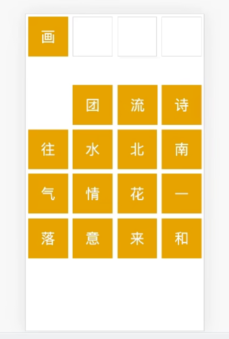

```html
<!DOCTYPE html>
<html lang="en">
<head>
  <meta charset="UTF-8">
  <meta name="viewport" content="width=device-width, initial-scale=1.0">
  <title>Document</title>
  <style>
    * {
      margin: 0;
      padding: 0;
      box-sizing: border-box;
    }

    html {
      font-size: 62.5%;
    }

    .blank-cell-group, .char-cell-group {
      display: flex;
    }

    .cell-item {
      width: 25%;
      height: 25vw;
      padding: 0.5rem;
    }

    .wrapper {
      width: 100%;
      height: 100%;
      border: 1px solid #eee;
    }

    .char-cell-group {
      margin-top: 50px;
      flex-wrap: wrap;
    }

    .char-cell-group .wrapper {
      border: none;
      background-color: orange;
      display: flex;
      justify-content: center;
      align-items: center;
      font-size: 1.8rem;
      color: #fff;
    }
  </style>
</head>
<body>
  <div id="app">
    <div class="container">
      <!-- 拖拽的目的地: 答案区 -->
      <div class="blank-cell-group">
        <!-- 
          一行4个单元格, 单元格和单元格之间有间距
          这里是cell-item是外层盒子 有padding 内层盒子是内容区, 我们通过padding来空间 单元格之间的间距
         -->
        <div class="cell-item">
          <div class="wrapper"></div>
        </div>
        <div class="cell-item">
          <div class="wrapper"></div>
        </div>
        <div class="cell-item">
          <div class="wrapper"></div>
        </div>
        <div class="cell-item">
          <div class="wrapper"></div>
        </div>
      </div>
      <!-- 被拖拽的元素: 随机字符单元格的区域 -->
      <div class="char-cell-group">
      </div>
    </div>
  </div>

  <script>
    const idioms = ['诗情画意', '南来北往', '一团和气', '落花流水']

    // 下方字符区的容器
    const oCharCellGroup = document.querySelector('.char-cell-group')

    // 上方答案区: 4个小盒子
    const oBlanks = document.querySelectorAll('.blank-cell-group .cell-item .wrapper')

    let charCollection = []
    // 里面保存着 字符盒子 的初始位置
    let charAreas = []
    // 答案区 4个盒子的坐标
    let blankAreas = []
    // 保存正确的结果的数组 { char(字), el(当前元素 因为要拿到元素的index) }
    let resArr = []

    // 下方每个字符的容器 (.wrapper元素)
    let oCharts = null

    // 保存鼠标当前的位置
    let startX = 0
    let startY = 0
    // 保存字符盒子在移动的时候 距屏幕左侧 或 上侧的距离
    let cellX = 0
    let cellY = 0
    // 保存鼠标点击字符盒子时的鼠标位置 盒子的左边框 和 鼠标在元素内点击位置 之间的距离 相当于mouseStartXAtEl & mouseStartYAtEl
    let mouseX = 0
    let mouseY = 0

    // 将 idioms 每个字符取出 组成一个数组
    function formatCharsArr() {
      let _arr = []
      idioms.forEach(item => {
        _arr = [..._arr, ...item]
      })

      // 随机排序
      return _arr.sort(randomSort)
      // ['南', '诗', '北', '气', '来', '意', '情', '一', '往', '落', '团', '花', '水', '流', '和', '画']
    }
    // 随机函数
    function randomSort(a, b) {
      return Math.random() > 0.5 ? -1 : 1
    }
    
    
    // 组织每个字符对应的html结构字符串
    function template(char, index) {
      return (`
        <div class="cell-item">
          <div class="wrapper" data-index="${index}">${char}</div>
        </div>
      `)
    }
    // 将 字符对应的html字符串 拼接到 domList 中 追加到oCharCellGroup容器里面 使用的就是innerHTML
    function render() {
      let domList = ''
      charCollection.forEach((char, index) => {
        domList += template(char, index)
      })

      oCharCellGroup.innerHTML = domList
    }

    // 给每个字的wrapper容器绑定事件
    function bindEvent() {
      let oChar = null
      for (let i = 0; i < oChars.length; i++) {
        oChar = oChars[i]

        oChar.addEventListener('touchstart', handleTouchStart)
        oChar.addEventListener('touchmove', handleTouchMove)
        oChar.addEventListener('touchend', handleTouchEnd)
      }
    }
    function handleTouchStart(e) {
      /*
        点击 字符 盒子 的时候 我们能获取的信息
        1. 鼠标点击的坐标 x y
        2. 鼠标在盒子中位置(距离) = 鼠标点击的坐标 - 盒子据屏幕左边的距离offsetLeft
        3. 字符盒子 左上角的坐标 = 鼠标点击的坐标 - 鼠标在盒子中位置(距离) 集是 字符盒子 左上角的坐标x的位置
      */

      // 为 handleTouchMove 提供的数据
      // 保存字符盒子在移动的时候 距屏幕左侧 或 上侧的距离
      cellX = this.offsetLeft
      cellY = this.offsetTop
      startX = e.touches[0].clientX
      startY = e.touches[0].clientY
      // 保存鼠标点击字符盒子时的鼠标位置 盒子的左边框 和 鼠标在元素内点击位置 之间的距离
      mouseX = startX - cellX
      mouseY = startY - cellY
       
      // 获取 盒子 的宽高
      let cellWidth = this.offsetWidth
      let cellHeight = this.offsetHeight
      // 给元素设置 宽高
      this.style.width = cellWidth / 10 + 'rem'
      this.style.height = cellHeight / 10 + 'rem'
      // 设置点击的元素为固定定位
      this.style.position = 'fixed'

      this.style.left = cellX / 10 + 'rem'
      this.style.top = cellY / 10 + 'rem'
    }
    function handleTouchMove(e) {
      e.preventDefault()
      // 移动时候鼠标的位置
      let moveX = e.touches[0].clientX
      let moveY = e.touches[0].clientY

      cellX = moveX - mouseX
      cellY = moveY - mouseY

      this.style.left = cellX / 10 + 'rem'
      this.style.top = cellY / 10 + 'rem'
    }
    
    /*
      回弹效果: touchend
        我们在初始化的时候 就要保存 每一个 字符盒子 原本的位置

      我们在渲染DOM的时候 每个DOM中就有一个index, 我们可以根据这个Index 去arrWrapper里面找该元素对应的初始位置

        <div class="cell-item" data-index="${index}">

     吸附效果: touchend
        我们拖动盒子移动的时候的坐标 我们是能获取到的
        我们要需要知道 上方答案区(4个小盒子)的坐标

        因为我们要知道 什么情况下 要进到哪一个盒子里面
    */
    // 参数: dom的集合
    function getAreas(domCollection, arrWrapper) {
      // 回弹回去的位置, 原本的位置
      let startX = 0
      let startY = 0
      let oItem = null

      for (let i = 0; i < domCollection.length; i++) {
        oItem = domCollection[i]
        startX = oItem.offsetLeft
        startY = oItem.offsetTop

        // 我们将字符盒子的位置 保存起来
        arrWrapper.push({
          startX,
          startY
        })
      }
    }

    function handleTouchEnd(e) {

      // 获取 答案盒子 的宽度和高度
      let blankWidth = oBlanks[0].offsetWidth
      let blankHeight = oBlanks[0].offsetHeight

      // 吸附逻辑:
      // 我们要拿点击的字符盒子 和 答案区的4个盒子的每一个盒子进行对比
      for (let i = 0; i <blankAreas.length; i++) {
        // 判断 resArr(答案区的4个盒子的正确结果) 中是否已经存在 字符盒子
        if (resArr[i] !== undefined) {
          // 不是undefined证明 答案区盒子里面有东西
          continue
        }

        let { startX, startY } = blankAreas[i]

        /*
          比如我们拖动第一个字符盒子 往 第一个答案盒子里面放

          这时 我们要想
          字符盒子左上角的坐标 和 答案盒子左上角坐标 存在哪种关系的时候 放字符盒子可以放入到答案盒子中

          字符盒子的左上角坐标 在 答案盒子的宽高的50%以内的时候 才能进去

          cellX: 字符盒子 的坐标
          startX: 答案盒子 的坐标

          字符盒子的右上角坐标 = 左上角x + 字符盒子的宽度
        */
        if (
          (
            cellX > startX &&
            cellX < startX + blankWidth / 2 &&
            cellY > startY &&
            cellY < startY + blankHeight / 2
          ) ||
          (
            cellX + blankWidth > startX + blankWidth / 2 &&
            cellX + blankWidth < startX + blankWidth &&
            cellY > startY &&
            cellY < startY + blankHeight / 2
          )) {
          
          setPosition(this, { startX, startY })
          return
        }
      }

      // 回弹逻辑:
      // 回弹效果的代码 是在我们的盒子 不符合答案的时候 执行的代码
      // 获取当前字符盒子上的 data-index 属性 根据该index会去 charAreas 数组中 找该盒子的初始位置
      const _index = Number(this.dataset.index)
      // 字符盒子的坐标
      const charArea = charAreas[_index]
      // 获取到盒子的原坐标后 再设置回去
      this.style.left = charArea.startX / 10 + 'rem'
      this.style.top = charArea.startY / 10 + 'rem'
    }

    // 设置 字符盒子 的位置的方法
    function setPosition(el, { startX, startY }) {
      el.style.left = startX / 10 + 'rem'
      el.style.top = startY / 10 + 'rem'
    }

    // 初始化函数
    function init() {
      charCollection = formatCharsArr()
      render()

      // render后界面才有 wrapper 容器 所以在这里获取
      oChars = document.querySelectorAll('.char-cell-group .wrapper')
      // 获取答案区4个小盒子的坐标
      getAreas(oBlanks, blankAreas)
      // 当有 oChars 之后我们再执行 getAreas
      getAreas(oChars, charAreas)
      bindEvent()
    }
    init()
  </script>
</body>
</html>
```

<br><br>

# 鼠标拖拽改变元素大小
```html
<!DOCTYPE html>
<html lang="en">
<head>
  <meta charset="UTF-8">
  <meta name="viewport" content="width=device-width, initial-scale=1.0">
  <title>Document</title>
  <style>
    .container {
      height: 100;
      margin: 0;
      position: relative;
    }
  </style>
</head>
<body>

  <div class="container"></div>
  
  <script>
    /*
      1. 根据数据画出盒子
      2. 合在在浏览器可视区域之内可任意移动
      3. 可以大于宽50高50的尺寸进行拖动大小
      4. 移动和改变大小 要把size和pos数据改变
    */
    const boxInfos = [
      {
        id: 'box-1',
        classList: ['box', 'box-1'],
        size: [100, 200],
        bgColor: 'black',
        pos: [0, 0]
      },
      {
        id: 'box-2',
        classList: ['box', 'box-2'],
        size: [150, 200],
        bgColor: 'orange',
        pos: [0, 0]
      },
      {
        id: 'box-3',
        classList: ['box', 'box-3'],
        size: [200, 100],
        bgColor: 'red',
        pos: [0, 0]
      }
    ]
    
    class DraggableBox {

      oContainer = null
      info = null
      oBox = null

      // 因为下面事件回调使用了bind, 我们解绑的时候 要保持引用 而bind返回的是一个新的函数, 没有引用 为了保持引用我们在实例上创建了如下的
      _handleMouseDownAtEl = null
      _handleMouseMoveAtWindow = null
      _handleMouseUpAtEl = this.mouseupHandler.bind(this)
      _handleScaleAtEl = null
      
      constructor(options) {
        const { el, info } = options
        this.oContainer = el
        this.info = this.processInfo(info)
        this.render()
        this.bindEvent()
      }

      processInfo(info) {
        return {
          id: info.id,
          classList: info.classList.join(' '),
          size: info.size,
          width: info.size[0],
          height: info.size[1],
          bgColor: info.bgColor,
          pos: info.pos,
          left: info.pos[0],
          top: info.pos[1]
        }
      }

      render() {
        this.oBox = this.createBox()
        this.oContainer.appendChild(this.oBox)
      }

      createBox() {
        const el = document.createElement('div')
        el.className = this.info.classList
        el.style.cssText = `
          width: ${this.info.width}px;
          height: ${this.info.height}px;
          background-color: ${this.info.bgColor};
          position: absolute;
          left: ${this.info.left}px;
          top: ${this.info.top}px;
        `
        return el
      }

      bindEvent() {
        this._handleMouseDownAtEl = this.mousedownHandler.bind(this)
        // 如果不加上bind(this), 则事件回调中的this为div, 如果加上则事件回调中的this为 实例对象
        // 给元素绑定 鼠标按下事件
        this.oBox.addEventListener('mousedown', this._handleMouseDownAtEl)
        
      }

      // MouseDown
      mousedownHandler(e) {
        console.log('鼠标按下事件')
        // 1. 页面上有3个盒子, 点击盒子 让其z-index最前
        elFocus(this.oBox)

        // 2. 区分什么时候是移动 什么时候是拖拽改变大小, 因为我们点击4个角落的时候是想改变元素的大小
        /*
          如果知道我们鼠标在元素上的位置, 知道位置后才能计算出 鼠标在元素上的哪一个位置

            鼠标当前位置 - 元素的offsetLeft = 鼠标在元素上的位置 x
            鼠标当前位置 - 元素的offsetHeight = 鼠标在元素上的位置 y

          当我们获取到在元素上的 x y 后, 我们可以通过 元素的width 和 heigt - x 和 y 得到一个值 

          比如这个值 < 10, 相当于我们计算出了元素右下角有一个可拖动的区域, 这个区域就是 10 x 10 大小的区域
        */
        // 获取鼠标在元素上的位置
        let mouseAtElPosX = e.clientX - this.oBox.offsetLeft
        let mouseAtElPosY = e.clientY - this.oBox.offsetTop

        // 获取拖拽区域的位置
        let draggableX = this.oBox.offsetWidth - mouseAtElPosX
        let draggableY = this.oBox.offsetHeight - mouseAtElPosY
        // 确定可以拖拽的区域
        if (draggableX <= 10 && draggableY <= 10) {
          // 鼠标按下的时候: 处理元素可拖拽改变大小的功能
          this.scaleEl(e)
        } else {
          // 鼠标按下的时候: 处理元素可移动的功能
          this.moveEl(mouseAtElPosX, mouseAtElPosY)
        }
      }

      // 鼠标按下的时候 执行的逻辑
      scaleEl(e) {
        console.log('拖拽改动大小')
        /*
          我们在进行拖拽改动元素大小的时候 动作会分为两个部分
          1. 点击 可拖拽区域 (元素右下角 10 x 10 的位置)
          2. 鼠标不抬起的状态下 往右下方移动鼠标

          那拖动的距离 是不是 就是 鼠标移动后的位置 - 按下鼠标时的位置
          我们拖动了多少 图形的长宽就要增加多少
        */
        const xWithMouseDown = e.clientX
        const yWithMouseDown = e.clientY

        this._handleScaleAtEl = this.elScaleHandler.bind(this, { xWithMouseDown, yWithMouseDown })

        // 给窗口绑定 鼠标移动事件
        window.addEventListener('mousemove', this._handleScaleAtEl)
        // 给元素绑定 鼠标抬起事件
        this.oBox.addEventListener('mouseup', this._handleMouseUpAtEl)
        window.addEventListener('mouseup', this._handleMouseUpAtEl)
      }
      elScaleHandler(pos, e) {
        console.log('开始拖拽')

        let x = e.clientX - pos.xWithMouseDown
        let y = e.clientY - pos.yWithMouseDown

        // 限定 最少得加 50
        let newW = this.oBox.offsetWidth + x <= 50 ? 50 : this.oBox.offsetWidth + x
        let newH = this.oBox.offsetHeight + y <= 50 ? 50 : this.oBox.offsetHeight + y

        this.oBox.style.width = newW + 'px'
        this.oBox.style.height = newH + 'px'

        // xWithMouseDown 是当前的位置 我们要实时更新当前的位置
        pos.xWithMouseDown = e.clientX
        pos.yWithMouseDown = e.clientY

        this.info.size[0] = newW
        this.info.size[1] = newH
      }

      // 鼠标按下的时候 执行的逻辑
      moveEl(mouseAtElPosX, mouseAtElPosY) {
        console.log('moveEl')
        this._handleMouseMoveAtWindow = this.mousemoveHandler.bind(this, { mouseAtElPosX, mouseAtElPosY })

        // 给 window 绑定 鼠标移动事件
        window.addEventListener('mousemove', this._handleMouseMoveAtWindow)

        // 给元素绑定 鼠标抬起事件
        this.oBox.addEventListener('mouseup', this._handleMouseUpAtEl)
      }

      // MouseMove: 窗口的移动事件
      mousemoveHandler({ mouseAtElPosX, mouseAtElPosY }, e) {
        console.log(mouseAtElPosX, mouseAtElPosY)
        // 获取鼠标在当前元素的位置
        // 获取鼠标移动时的位置
        // 两个位置相减 拿到差值 就是移动距离
        let x = e.clientX - mouseAtElPosX
        let y = e.clientY - mouseAtElPosY

        // 判断边界
        const screenWidth = document.documentElement.clientWidth || document.body.clientWidth
        const screenHeight = document.documentElement.clientHeight || document.body.clientHeight
        if (x <= 0) x = 0
        if (x >= screenWidth - this.oBox.offsetWidth) (x = screenWidth - this.oBox.offsetWidth)

        if (y <= 0) y = 0
        if (y >= screenHeight - this.oBox.offsetHeight) (y = screenHeight - this.oBox.offsetHeight)

        this.oBox.style.left = x + 'px'
        this.oBox.style.top = y + 'px'

        this.info.pos[0] = x
        this.info.pos[1] = y
      }

      // MouseUp: 元素身上的鼠标抬起事件
      mouseupHandler() {
        console.log('鼠标抬起事件')
        // 鼠标抬起的时候 解绑 window 上的 鼠标移动事件
        window.removeEventListener('mousemove', this._handleMouseMoveAtWindow)
        window.removeEventListener('mousemove', this._handleScaleAtEl)
        // 鼠标抬起的时候 解绑 元素 上的 鼠标抬起事件
        this.oBox.removeEventListener('mouseup', this._handleMouseUpAtEl)
        window.removeEventListener('mouseup', this._handleMouseUpAtEl)
      }
    }

    // 面相对象的方式完成
    const init = () => {
      boxInfos.forEach(info => {
        new DraggableBox({
          el: document.querySelector('.container'),
          info
        })
      })
    }

    init()

    // 控制 所有 盒子 z-index 等 的方法
    function elFocus(el) {
      const oBoxList = document.querySelectorAll('.box')
      oBoxList.forEach(box => {
        box.style.zIndex = 0
      })

      el.style.zIndex = 1
    }
  </script>
</body>
</html>
```

<br><br>

# map 和 parseInt
下面的输出结果的原因
```js
['1', '2', '3'].map(parseInt)
// [1, NaN, NaN]
```

<br>

### map(callback)
会将数组中的元素取出来 每个元素会执行一遍map中传入的回调 (map中的回调接收3个参数 item, index, arr), 所以这三个参数都会传递给 parseInt

我们将给parseInt传入3个参数, 而parseInt函数只能接收两个参数
1. 数组中的元素 1
2. 数组中的下标 0
3. 数组本身 ['1', '2', '3']

```js
// 第三个参数就不在意了 因为parseInt只接受两个参数
parseInt('1', 0, ['1', '2', '3'])
parseInt('2', 1, ['1', '2', '3'])
parseInt('3', 2, ['1', '2', '3'])

[
  parseInt('1', 0, ['1', '2', '3']),
  parseInt('2', 1, ['1', '2', '3']),
  parseInt('3', 2, ['1', '2', '3'])
]

// 结果[1, NaN, NaN]
// 第一个NaN: 我们给parseInt 传入了1 不在有效进制范围内 所以范围NaN
// 第二个NaN: 我们给parseInt 传入了2 但是给的值是3, 2进制中只有01 3不是有效数字, 没有找到可以转换的数字, 所以返回NaN
```

<br>

### parseInt(字符串, [进制数 2-36])
它会从字符串最开始一直往后找, 找到第一个无效的字符为止 '123abc' 找到a停止, 它的转换结果就是 123

第二个参数表示进制, 取值范围是 2 ~ 36 (10个数字 + 26个英文字母)

parseInt在查找的时候, 会找到第一个无效的字符, 而无效字符是什么取决进制, 比如 '123abc', 如果我们传入的是 ``parseInt('123abc', 36)``, 则abc也是有效数字

<br>

**第二个参数还分为3种情况:**  
1. 超出进制范围 返回 NaN
2. 0, undefined, 或者是 不填写

  - 不填的情况: 自动转换, 自动转换的规则如下

    - 如果字符串以 **0x开头**, 那么它会当成16进制转换 ``parseInt('0x123')`` 它不会转换为0, 而是将整体当成16进制转换 291

    - 如果字符串以 **0开头**, 则有可能是8进制 或者是 10进制, 则看我们写的数字是不是8进制的范围, 如果是则转换为8进制, 如果不是则转换为10进制 比如 '010' 则转换为8, 如果超过了8进制的范围 比如 '018' 则转换为10进制 18 (es5之后如果我们写的数字是0开头则当做是10进制处理, 在新的浏览器是不会有问题的)

    - 10进制的规则

3. 使用的指定的进制

<br>

### 注意点:
我们在平时使用 parseInt 的时候最好传入两个参数, ``parseInt(字符串, 10)``

<br><br>

# HTMLCollection类型 和 NodeList类型
```html
<ul class="list">
  <li class="list-item">1</li>
  <li class="list-item">2</li>
  <li class="list-item">3</li>
  <li class="list-item">4</li>
</ul>
<button>复制一份</button>
<script>
  // 获取 ul
  const list = document.getElementByClassName('list')[0]

  // 获取 ul 的子元素们
  const listItems = document.getElementByClassName('list-item')

  const btn = document.getElementsByTagName('button')[0]
  btn.onclick = function() {
    // 循环 li 们, 将每个li复制一份 再插入到ul中
    for (let i = 0; i < listItems.length; i++) {
      const cloned = listItems[i].cloneNode(true)
      list.appendChild(cloned)
    }
  }
</script>
```

上面的问题在于 我们在遍历listItems的时候, 每次执行一次克隆追加的动作后, listItems的长度就增加1了, 也就是说 listItems 是动态的

listItems是我们页面加载的时候获取的 为什么后面的长度会变呢?

<br>

### getElementByClassName 和 getElementsByTagName
这个api返回的类型是 **HTMLCollection** 一个伪数组的类型

<br>

**HTMLCollection类型的特点:**  
它是动态的, 实时的

就是将来我们页面上少了一个元素 这个伪数组的长度就自动减1了, **它会始终保持跟页面中对应元素的数量是一致的**

<br>

但是官方觉得这样是不好的 元素的集合是什么意思 它表示的是DOM的集合 但是DOM元素不一定非要显示在页面上, 我们完成可以创建一个DOM元素但仅将它保存到内存中 不加到页面上

**但是 HTMLCollection类型, 它只管页面上有多少 集合的长度就是多少**

所以这种做法就容易导致无法预期的代码, 解决方式就是使用 querySelectorAll

<br>

### querySelectorAll
这个api获取到的伪数组的集合类型就不在是 HTMLCollection类型 了 而是**NodeList类型**

<br>

**NodeList类型的特点:**  
它是静态的, 获取这行代码的时候 获取的是什么 它就是什么

<br><br>

# JS动画相关

### JS动画的实现方式
1. 计时器
2. requestAnimationFrame (RAF)
3. animation api

我们下面聊聊 1 和 2 的区别

<br>

### 计时器做动画导致的问题:
老师不太建议使用 计时器做动画, 因为计时器的计时是非常不精准的 无论是使用setTimeout 还是setInterval 我们都需要传递一个时间间隔

这个时间间隔不是我们传了多少 它就一定是多少 它会受很多很多因素的影响 由于计时不精确就会导致一些问题 都会影响到帧率
- 操作系统
- 机器硬件
- 浏览器渲染的东西


我们上面使用1 和 2两种方式做了同样的动画 让小球从左边匀速到右边, 我们仔细观察会发现

计时器做的动画, 它是会有些抖动的

因为我们浏览器的画面是一帧一帧渲染出来的 我们可以将浏览器想象成为一个绘画速度很快的画家 它每隔一小段时间就会在页面上画一遍 由于它画的太快了 所以说我们感觉上是连续的

它理想状态下一秒钟它会绘画60次 这就是一秒60帧 它会每隔16.6毫秒画一次
```s

|____|____|____|____|
```

但是由于计时器计时它不精确就算我们将它设置为16.6毫秒执行一次 它就可能会导致
```s

# 这里计时器到达时间了 但是还没画
      ↓      B
|____|____|____|____|
         ↑
         # 它要等到这个时间点才会画
```

我们看它可能在一帧里面有两次计时到达 也就是一帧中有两次改变了小球的位置 但是画的话 它只会画后面的一次

因为前一次小球的位置信息 已经被后一次所覆盖了 所以前面的一次它是没有画出来的 所以我们会感觉这个小球突然往前跳了一小段

还有一种B情况, 在B这帧中没有计时器到达 也就是会出现空针的时候 这一帧中我们什么也没干 我们会感觉这个小球在某个时间点突然停了一下 它没有画任何东西 这就是计时器做动画导致的问题

<br>

### requestAnimationFrame
它没有什么固定的时间间隔 不像计时器多少间隔时间执行一次 它会紧紧的贴着帧率走 我什么时候要画了 我先执行一次 执行完了我再画

下一次什么时候要画了 我再执行一次 执行完了我在画 也就是在每一帧渲染之前执行下我们的回调

无论是机器卡顿导致帧率变低 每一帧的时间间隔变长 它就执行的慢一点 正常的情况下16.7毫秒 那我就按照正常的时间间隔来执行 总之它是跟着帧率走的

实现的话 由于我们不这知道具体的时间间隔 那我们就要算我们可以一开始使用
```js
const start = Date.now()
```

下一次requestAnimationFrame回调执行的时候 我们将当前的时间 减去之前的计时起点 这样就得到了时间间隔
```js
const interval = Date.now() - start
```

通过时间间隔 根据我们配置的速度 就可以算出我这一次需要位移多少距离

```html
<style>
  #ball {
    width: 30px;
    height: 30px;
    background-color: red;
    position: absolute;
    top: 50%;
    transform: translateY(-50%);
  }
</style>
<body>
  <div id="ball"></div>
  <script>
    // 获取小球元素
    const ball = document.getElementById('ball');

    // 设置起点时间
    const start = Date.now();

    // 配置速度
    const speed = 0.1; // 调整这个值来控制速度

    // 配置停止条件
    const stopPosition = window.innerWidth - ball.clientWidth;

    // 动画函数
    function animate() {
      // 计算时间间隔
      const interval = Date.now() - start;

      // 计算位移距离
      const distance = speed * interval;

      // 将位移应用到小球的left属性上
      ball.style.left = distance + 'px';

      // 判断是否达到停止条件
      if (distance < stopPosition) {
        // 继续请求下一帧动画
        requestAnimationFrame(animate);
      }
    }

    // 开始动画
    animate();
  </script>
</body>
</html>
```

<br><br>

# Object(引用类型 或 基本类型)
```js
let obj = {}

// 我们直接将 obj 丢进去
Object(obj)  // 还是原对象

Object(基本数据类型) // 会转换为基本数据类型对应的包装类
```

<br><br>

# globalThis: 关键字
它是js中的一个关键字, 跟this一样直接使用

比如浏览器中的this是window, nodejs中的this是全局对象, 我们怎么判断这个this是哪个环境中的 这时就可以使用 globalThis

这个关键字在浏览器中就是window, 在node中就是global

<br><br>

# DOM绑定事件的时候 无法取消默认行为
```s
unable to preventDefault inside passvie event listener invocation
```

比如下面我们会在打开视频的时候 阻止浏览器滚动条的滚动的行为 我们会使用下面的代码
```js
window.addEventListener('wheel', wheelHandler)
function wheelHandler(e) {
  e.preventDefault()
}

// 在合适的时候 我们移除 wheelHandler 事件
window.removeEventListener('wheel', wheelHandler)
```

<br>

但是我们发现使用上面的行为, 无法阻止默认行为, 这时我们可以使用 addEventListener 的第三个参数
```js
window.addEventListener('wheel', wheelHandler, {
  passive: false
})

function wheelHandler(e) {
  e.preventDefault()
}
```

<br>

### 原因:
浏览器在滚动的时候, 哪怕我们没有监听 wheel 事件, 它也会做很多的事情 因为滚动滚动条的时候 浏览器要不停的渲染页面 它要在视口里面渲染出这个页面的不同区域 这是一件非常耗时的操作

而浏览器会对这个操作做很多的优化 不过这些优化有一个前提的条件 我们不能阻止他的默认行为 它担心我们某一个时刻突然给它阻止了默认行为 它没有办法尽情的去优化

浏览器如果说预先能够知道 我永远不会阻止他的默认行为 它就会尽情的去优化 我们需要告诉浏览器我永远不会阻止你的默认行为 就是靠 passive 配置

- true: 告诉浏览器 我不会阻止你鼠标滚轮的默认行为 你可以对滚轮事件进行彻底的优化 true是默认值

- false: 告诉浏览器 我会阻止你鼠标滚轮的默认行为
```js
window.addEventListener('wheel', wheelHandler, {
  passive: false true
})
```

<br><br>

# Flip动画
```s
https://www.bilibili.com/list/3494367522195464?sort_field=pubtime&spm_id_from=333.999.0.0&oid=831876701&bvid=BV1n34y1376s
```

它专门针对各种元素结构变化 应用的动画 正常css动画只能针对元素的样式做动画, 但是这种思路可以针对元素结构的变化做动画效果

<br>

它的实现主要是如下的4个步骤
1. first
2. last
3. invert
4. play

<br>

### first: 记录要监控的元素位置
在最开始的时候 要针对我们要监控的元素(要实现动画的元素) 我们要记录该元素的起始位置 一般是相对于视口的位置 或者是相对于页面的位置
```js
const rect = firstItem.getBoundingClientRect()
console.log(rect.top)  // 112.5 相对于视口的位置
```

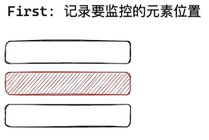

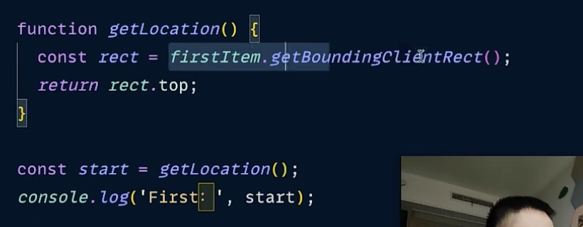

<br>

### last: 记录first中元素结构变化后的位置
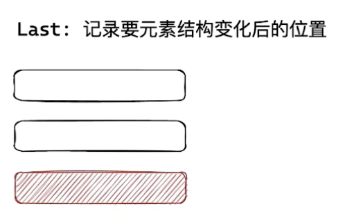

我们要记录第一步中元素变化后的位置, 比如第一步中的元素在最开始, 变化后的位置在最末尾, 那我们就要记录它在最末尾的位置

我们这步虽然能拿到元素变化后的位置, 但是这时元素其实没有渲染在页面中, 下面图中我们使用了delay函数模拟js加载阻塞了2秒, 发现只有在js执行完毕后 页面才能渲染

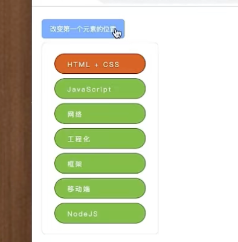
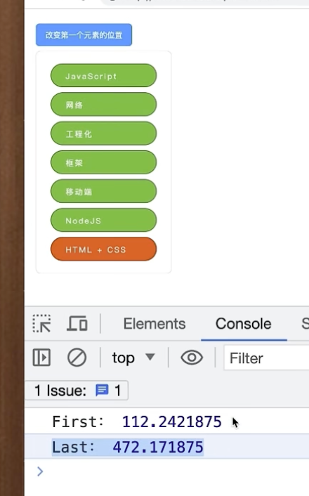

它步骤的时候 用户还看不到元素跑到最后的位置了 但是我们能算出来最后一个位置的坐标, 因为它要执行完后面的js代码

<br>

### invert: 移动元素到first的位置
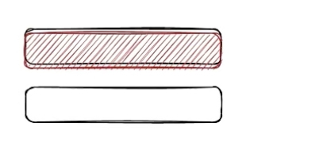

我们拿到了起始位置 和 结束位置 我们就可以算出它的偏移量 我们利用transform 我们就可以将它偏移到最开始的位置

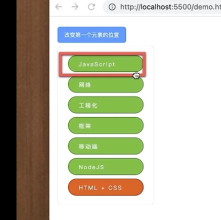
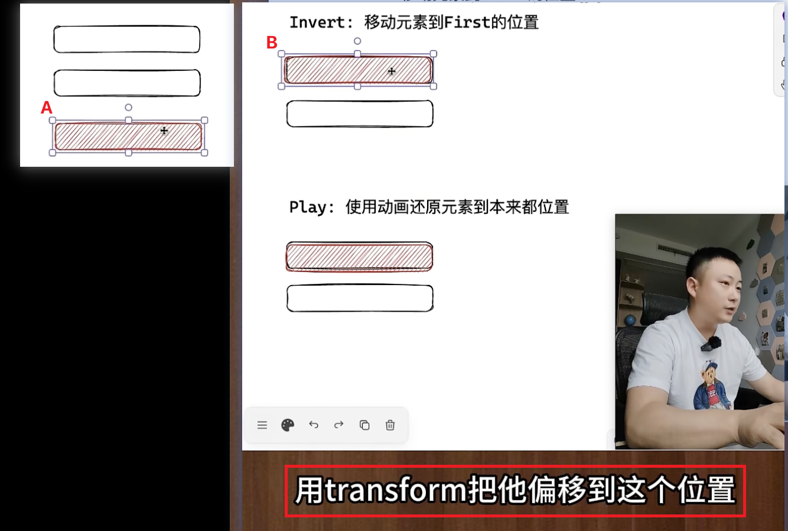


步骤2中用户还看不到元素跑到最后的位置了 但是我们能算出元素的偏移量 然后将其设置到元素的transform里面去 这样一来就可以偏移到最开始的位置了

<br>

### play: 使用动画还原元素到本来的位置
步骤3中我们使用 transform 将元素移动到了它原本的位置(第一位), 这步就是利用动画 将第一位的元素 移动回它原本的位置(最后一位)

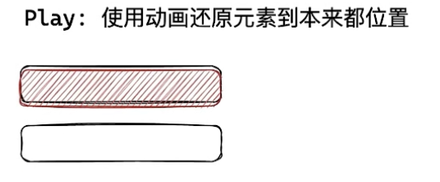
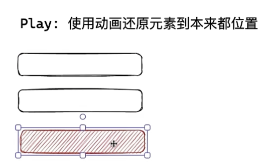
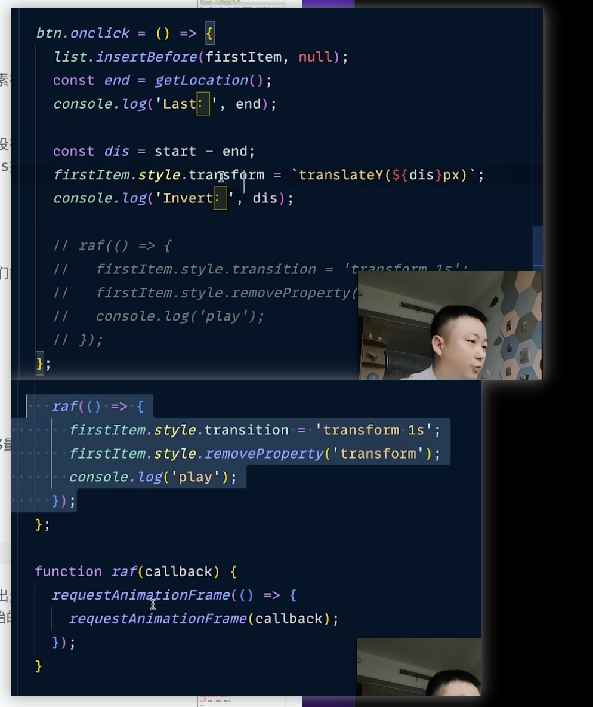

<br>

其它的元素道理是一样的 我们将这个flip动画的思路 针对每一个它可能产生动员的元素 都要进行这样的操作 这样就整个连起来了

<br><br>

# 解构中的问题
```js
var [a, b] = { a: 1, b: 2 }

// typeError: { (intermediate value)(intermediate value) } is not iterable
```

上面的代码是错误的 我们左边是数组的结构方式, 右边是一个对象, 那有什么办法让上面的代码是正确的?

<br>

对于结构 它并不要求右侧是一个数组 只要右边是可以迭代的对象就可以, 那上面的问题就变成了只要将右侧的部分变成一个可迭代对象就可以了

<br>

### 可迭代对象
满足可迭代协议, 只要一个对象 它里面有一个属性``[Symbol.iterator]``, 满足一些条件 它就是一个可迭代对象
1. 对象中有 ``[Symbol.iterator]`` 属性
2. 该属性的值为无参函数
3. 该函数要返回迭代器, 迭代器是一个对象, 每个迭代器对象中都有next方法, 每调用一次就会迭代出一个值
```js
let obj = {
  a: 1,
  b: 2,
  [Symbol.iterator]: function() {
    return 迭代器
  }
}
```

<br>

### 解构的本质
现在我们再看解构的本质, 不单单是将数组中的第一项赋值给a 数组中的第二项赋值给b
```js
const [a,b] = arr
```

它不会看右侧是否是数组, 它会调用右侧对象的[Symbol.iterator], 拿到迭代器对象, 然后调用迭代器对象的next方法 将得到的值赋值给变量a

```js
const iter = arr.[Symbol.iterator]()
const a = iter.next().value
const b = iter.next().value
```

<br>

### 解答
```js
let obj = {
  a: 1,
  b: 2,
  [Symbol.iterator]: function() {
    // let arr = [1,2]
    let arr = Object.values(this)
    const iter = arr.[Symbol.iterator]()
    return iter
  }
}


// 利用原型修改
Object.prototype[Symbol.iterator] = function() {
  return Object.values(this)[Symbol.iterator]()
}
```


<br><br>

# 利用生成器函数 比较两个字符串的大小
```s
bilibili.com/list/3494367522195464?tid=0&sort_field=pubtime&spm_id_from=333.999.0.0&oid=408039530&bvid=BV1uG41197wx
```

<br><br>

# 循环 转 递归的通用模版
```js
// 使用递归来完成 数组的求和
const arr = [1,2,3,4,5]

const arr = [1,2,3,4,5]
const calc = (arr, index = 0) => {
  // 没有东西的 就认为和是0
  if (index === arr.length) return 0
  
  // 思路: arr之和等于它第一个位置 加上后面所有元素之和 之后递归
  return arr[index] + calc(arr, index + 1)
}
console.log(calc(arr))
```

<br>

### 思路
所有的循环都是可以转成递归的
```js
// 循环
for (初始代码; 条件代码; 循环代码) {
  循环体
}
```

转成递归, 递归一定要有一个函数
```js
function m() {
  // 要保证初始代码只运行一次, 所以一开始我们就要运行初始代码
  初始代码

  // 条件代码 需要反复的运行判断, 所以我们需要一个子函数 该子函数要反复的运行 条件满足继续运行 条件不满足就退出
  function _m() {
    if(!条件代码不满足的情况) {
      return
    }
    // 条件代码满足的情况 运行循环体
    循环体

    循环代码

    // 递归的判断条件代码
    _m()
  }

  // 一开始就要将 条件代码 启动起来
  _m()
}
```

```js
const arr = [1,2,3,4,5]
// let sum = 0
// for(let i = 0; i < arr.length; i++) {
//   sum += arr[i]
// }

/*
模版
function m() {
  // 要保证初始代码只运行一次, 所以一开始我们就要运行初始代码
  初始代码

  // 条件代码 需要反复的运行判断, 所以我们需要一个子函数 该子函数要反复的运行 条件满足继续运行 条件不满足就退出
  function _m() {
    if(!条件代码不满足的情况) {
      return
    }
    // 条件代码满足的情况 运行循环体
    循环体

    循环代码

    // 递归的判断条件代码
    _m()
  }

  // 一开始就要将 条件代码 启动起来
  _m()
}
*/

function m() {
  let sum = 0
  // 初始代码
  let i = 0

  // 条件子函数
  function _m() {
    // 条件代码
    if (i >= arr.length) return

    // 循环体
    sum += arr[i]

    // 循环代码
    i++

    _m()
  }

  _m()

  console.log(sum)
}

m()
```


<br><br>

# 保留两位小数的技巧, 第三位小数位不要哦
2300.125 有这样一个数字, 我们不考虑最后一位小数, 希望这个数字保留两位小数
```js
Math.floor(2300.125 * 100) / 100


// 1. 2300.125 * 100 = 230012.5
// 2. Math.floor 向下取整 230012
// 3. / 100 = 2300.12
```

<br><br>

# 二进制 权限值
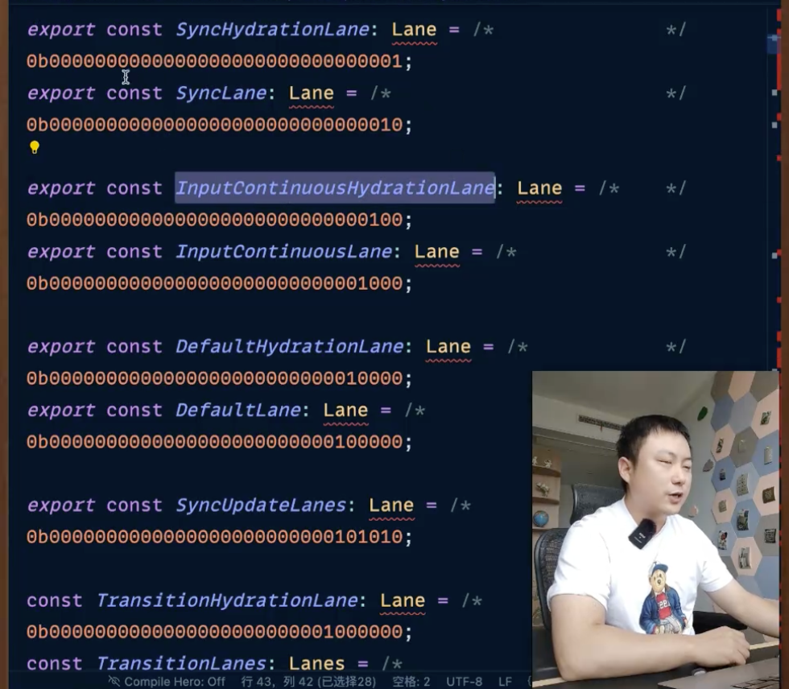

我们看上面的代码 上面的变量都是使用2进制的表示方式 我们仔细的看下这些二进制 这些二进制有这样的一种特点 

其它的位置基本上都是0, 只有某一个位置是1

上面的代码是 react fiber lane 的源码 它这样做的意义是

<br>

### 意义
比如我们整个系统里面要记录权限 我们整个系统有4种基本权限, 我们就可以定义4个变量
- 可读: ``const READ = 1``
- 可写: ``const WRITE = 2``
- 可删除: ``const DELETE = 3``
- 可创建: ``const CREATE = 4``

**问题:**  
我们使用上面的方式创建权限会有问题 

我们系统中权限之间是可以组合的, 比如有一个用户既可以读 又可以写的话 这时候这个用户的权限我们没有办法用上面的变量对应起来

如果我们要考虑组合关系的话 我们就需要定义更多的数字了 **所以我们想表达组合关系的话 就要考虑使用二进制了**

<br>

### 思路
我们有4中基本权限, 那我们就定义 **4个位置** 的2进制

- 可读: ``const READ = 0b0001``
- 可写: ``const WRITE = 0b0010``
- 可删除: ``const DELETE = 0b0100``
- 可创建: ``const CREATE = 0b1000``

不同的权限, 我们在不同的位置 将其设置为1

<br>

### 使用或运算 组合权限: 添加权限
**可读可写权限: 0b0011**  
```js
const perm = READ | WRITE

0001
0010 |
0011
```

<br>

**可读可写可删除权限: 0b0111**  
```js
const perm = READ | WRITE | DELATE

0001
0010
0100 |
0111
```

<br>

### 拿到权限值, 判断是否是可读的权限: 判断权限
可读的权限值 是第一位为1, 也就是我们不关心这个权限值 除了第一位是啥, 只要是可读的位置是1 就说明我们具备可读权限
```js
0001

???1
```

**方法:**  
我们拿到获取到的权限值 和 可读的权限值 求一个 且运算 
```js
1001  // 拿到的权限值
0001  // 可读的权限值
    &
0001
```

这样我们就能判断出 它是否包含可读权限
```js
const.log((perm & READ) === READ)
```

<br>

### 移除一个权限: 删除权限
比如我们移除可读权限
```js
const perm = READ | WRITE | DELATE
```

可读权限的最后一位是1, 我们不在意最后一位之前的数字, 我们只想将最后一位干成0
```js
0001
???1
```

我们可以使用 与运算, 放这个权限值 和 可读权限值取反后的结果做与运算
```js
???1
// 可读权限就是第一位为1, 我们拿着1110 跟上面的权限值做 & 运算 这样前第一位前面的数字都可以保留 只干掉了第一位的1
1110 

???0
```

```js
const perm = READ | WRITE | DELATE
const newPerm = perm & (~READ)
```

<br><br>

# 块级函数
```js
var a
if (true) {
  console.log(a)
  a = 5
  function a() {}
  function b() {}
  // var a = function() {} 这是可以的

  a = 0
  console.log(a)
}
console.log(a)
console.log(b)

// [Function: a]
// 0
// 5
// [Function: b]
```

上面将函数声明放到一个块级作用域里面 这种写法本身就是错的 也就是函数声明语句不能写在块级作用域中 (但是变量定义的函数可以)

<br>

开始的时候 全局会有两个变量被声明
1. a: undefined
2. b: undefined

a是因为开始的 var a

b是因为 块级中的函数b声明 会被提升到当前全局作用域的顶部, 也就是说块级作用域中我们声明了一个函数 它会提升但是提升后是undefined

进入到if后 块级作用域中也有 a 和 b 两个变量的声明 也就是说现在我们全局中有ab 块级作用域中也有ab

块级作用域中的ab就来自于块级作用域中的函数ab声明 它们被提升到了块级作用域的顶部

接下来 a = 5 将块级作用域中的函数a赋值为5

接下来执行 function a() {} 本来是不应该执行的 因为函数没有被调用, 但是在运行到一个块级作用域的函数声明语句的时候 它做了一个非常奇怪的事, 它会将块级作用域中的a 赋值给全局中的a

所以这时全局中的a的值变成了5

接下来执行 function b() {} 它会将块级作用域中的b 赋值给全局作用域中的b

然后给 块级作用域中a的赋值为0 接下来就不用说了

<br><br>

# 按键映射


拼音九键 每个键位上都有字母 我们输入23, 将字母的组合返回, 其实就是求两个数组的笛卡尔积

```js
// digits: string 数字按钮 eg 23
// 返回值 []
function keyboardMap(digits) {

}

keyboardMap('23')
```

<br>

我们将上面的问题转换一下 我们有两个数组 我们求这两个数组的笛卡尔积
```js
function _compose(arr1, arr2) {
  const result = []

  // 如果 arr1 为空 我们返回 arr2 反之亦然
  if (arr1.length === 0) return arr2
  if (arr2.length === 0) return arr1

  // 双重for 将第一个数组中的每一项 和 第二个数组的每一项 进行拼接 然后push到result中
  for (let i = 0; i < arr1.length; i++) {
    for (let j = 0; j < arr2.length; j++) {
      result.push(arr1[i] + arr2[j])
    }
  }

  return result
}
```

<br>

### 实现
```js
// digits: string 数字按钮 eg 23
// 返回值 []
function keyboardMap(digits) {

  function _compose(arr1, arr2) {
    const result = []

    // 如果 arr1 为空 我们返回 arr2 反之亦然
    if (arr1.length === 0) return arr2
    if (arr2.length === 0) return arr1

    // 双重for 将第一个数组中的每一项 和 第二个数组的每一项 进行拼接 然后push到result中
    for (let i = 0; i < arr1.length; i++) {
      for (let j = 0; j < arr2.length; j++) {
        result.push(arr1[i] + arr2[j])
      }
    }

    return result
  }

  // 按键上的字母 我们希望 按键2作为下标从map中取出它上面的字母
  const map = ['', 'abc', 'def', 'ghi', 'jkl', 'mno', 'pqrs', 'tuv', 'wxyz']

  // 将参数 23 分割成数组
  // 
  const result = digits.split('').map(it => map[it]).reduce((r, it) => _compose(r, it.split('')), [])
  // map: ['abc', 'def']

  return result

}

keyboardMap('23')
```


<br><br>

# 判断字符串是不是一个回文串
```s
abcba
```

### 思路:
我们准备两个指针 一个指向开头 一个执行末尾 左指针和右指针不断的进行比较
- a是一样的 指针继续向中间移动
- b是一样的 指针继续向中间移动
- c的时候 两个指针重叠了

在上面的例子中 就可以证明是回文串了 但是在某一些例子中 还要考虑到更多的情况
```s
abccba
  ↖↗
```

只有当右指针小于左指针的时候 就说明之前的比较已经全部完成 当这个时候就可以确定这个字符串是回文串了

<br>

### 实现:
```js
function isPalindrome(s) {
  // 定义两个指针
  let i = 0, j = s.length - 1

  // 定义验证是否是有效字符的函数
  const isValid = c => c >= 'a' && c <= 'z' || c >= '0' && c <= '9'

  // 循环进入条件 右指针 > 左指针
  while (j >= i) {
    const left = s[i].toLowerCase()
    const right = j[i].toLowerCase()
    // 标点符号的情况 如果左指针不是有效字符
    if (!isValid(left)) {

    // 如果右指针不是有效字符
    } else if (!isValid(right)) {

    // 判断左指针的字符 是不是 等于 右指针的字符 如果相等则 左指针++ 右指针--
    } else if (left === right) {
      i++
      j--
    } else {
      return false
    }
  }

  // 循环结束了 返回true
  return true
}
```

<br><br>

# emoji字符的截取
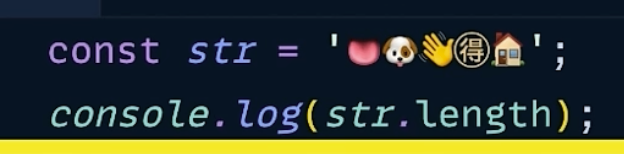

```s
https://www.bilibili.com/list/666759136?tid=0&sort_field=pubtime&spm_id_from=333.999.0.0&oid=743245780&bvid=BV1vk4y1P7zt
```

字符串在计算机中只能存数字 存不了文字 比如 a 在计算机中存的是97 asc2 编码, 我们将一个字符变到数字的过程叫做编码

每一个文字都会对应一个数字, emoji也是一样的

<br>

### 计算机在存这个数字(编码)的时候 它的内存空间占用多少呢?
这种编码的数字使用的是utf-16编码格式 那就意味着每一个字符对应的内存空间是16位的2进制 也就是两个字节

如果我们得到一个**字符串所占用的内存空间** 就是 **字符串的长度x2** 我们就能知道它占用的字节数

<br>

### 每一个数字的存储空间是16位 它能存的数字的范围是多少?
``2 ** 16``也就是 65536 也就是 0 - 65535 / 0000-ffff (16进制)

这么小的范围 如果是世界上常用的文字的话还能覆盖, 但是emoji的生僻字的话, 存不下的话就分为两个16位来存 

这里就涉及到了两个概念

**16位内存空间是基本的存储单元**, 我们叫它code unit 也叫做**码元**

而一个文字它对应的数字可能占一个16位 也有可能占用2个16位 不管占用多少位 **这个数字称之为 code point 码点**

码点表达一个字符对应的完整的数字 一个码点可能对应一个码元 也有可能对应两个码元

<br>

```js
const str = '👅🐶🖐🉐🏡'

// str.length 获取的是字符串码元的总数 而不是码点的总数 每一个emoji占两个码元 
console.log(str.length)  // 10

// 我们通过字符串的下标获取的也是 码元, str[0] 读取的是👅的第一个码元 它还有另一部分没有读出来 所以是乱码
console.log(str[0])

console.log(str.slice(0,2)) // 👅 读取了两个码元 所以正常显示
```

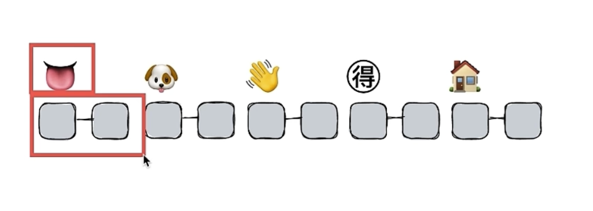

<br>

### 解决方式
无论是长度也好 读某一个字符也好 还是截取也好 我们都希望的是按照码点来进行处理 而不是码元 

那么我们就要自己去写3个函数
```js
// 码点的长度 也就是字符串实际能看到的文字的长度
String.prototype.pointLength = function() {
  let len = 0
  for (let i = 0; i < this.length; ) {
    // 拿到字符对应的码点的值
    const codePoint = this.codePointAt(i)

    // 说明该字符占用两个码元
    if (codePoint > 65535) {
      i += 2
    } else {
      i++
    }

    len++
  }

  return len
}

// 相当于 str[0] 传入下标 按照码点获取对应的文字
String.prototype.pointAt = function(index) {
  // 码点的下标
  let curIndex = 0
  for (let i = 0; i < this.length; ) {
    // 拿到字符对应的码点的值
    const codePoint = this.codePointAt(i)

    // 当前的码点下标 和 我们想要的码点下标一致
    if (curIndex === index) {
      return String.fromCodePoint(codePoint)
    }

    if (codePoint > 65535) {
      i += 2
    } else {
      i++
    }

    curIndex++
  }
}

// 按照码点来截取字符串
String.prototype.sliceByPoint = function(start = 0, end = this.pointLength()) {
  let res = ''
  for (let i = start, i < end; i++) {
    res += this.pointAt(i)
  }

  return res
}
```

<br><br>

# 正则: 密码强度的检测
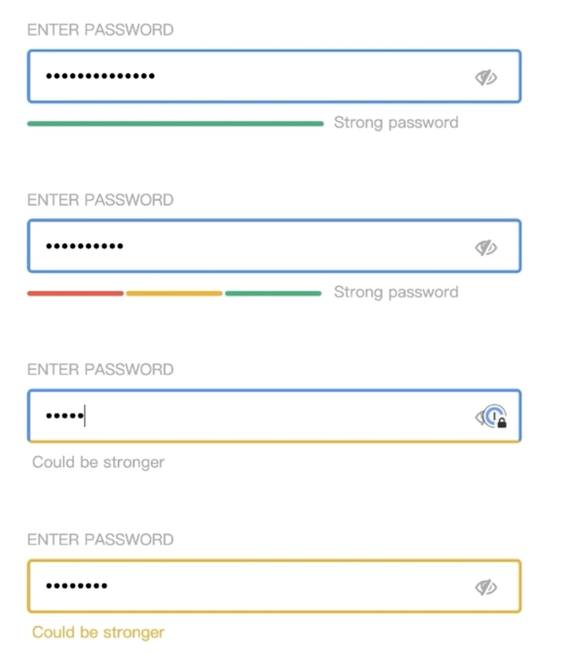

<br>

比如我们密码的要求为
1. 必须是 6 - 12 位
2. 必须包含数字 小写字母, 大写字母, 特殊字符($ @ , _ .之一)

```js
// 假设我们就下面两个要求必须有数字和小写字母 我们看看有什么样的问题
/^\d+[a-z]+$/

123abc - ok
abc123 - err
```

我们发现 abc123 也是符合要求的 但是却是验证不通过 因为正则中表达的是先出现数字再出现小写字母 上面的正则是有顺序的

<br>

### 正则是怎么匹配的
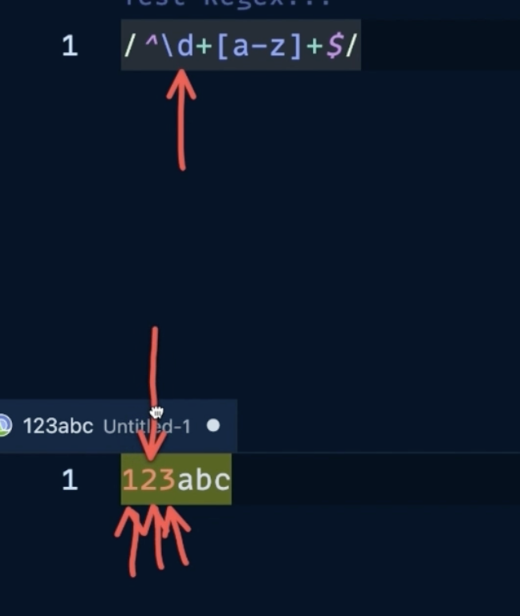

正则会先匹配数字的部分 
- 匹配1 可以
- 匹配2 可以
- 匹配3 可以

在匹配的同时 **它会更新 lastIndex 的位置**, 123匹配过了之后, lastIndex的位置就在a了

正则又开始匹配 [a-z] 这个部分, 也可以匹配上 也就是说当正则在进行匹配的时候 **它的匹配位置会依次往后移动的 这个移动的过程中叫做消耗字符 表示前面我看过了 我不用再重新看了**

正是因为这个消耗了字符 导致了顺序问题 换句话说它能不消耗字符那就好了

比如我希望的是 lastIndex 位置就在开始的位置定下来

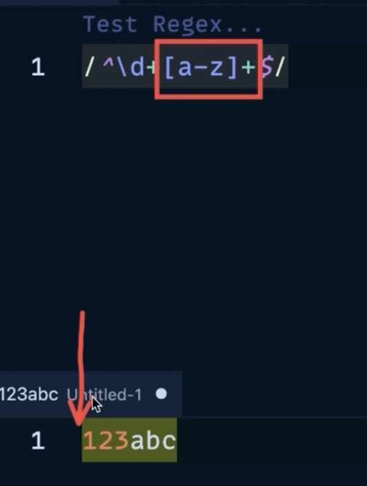

lastIndex的位置不动 我就先看 123abc 中是否有数字 我不管数字在哪 但是我在匹配的时候 lastIndex 的位置不要动 然后我们再看看有没有出现小写字母 

永远定在初始的位置

<br>

### 解决lastIndex不动的方式
这时候就要使用 前瞻运算符 ``(?=规则)``

使用它的话, 我们在匹配规则的时候 是不会消耗字符的

```js
/^(?=.*\d)(?=.*[a-z])$/

123abc
```

我们看看现在它是怎么匹配的

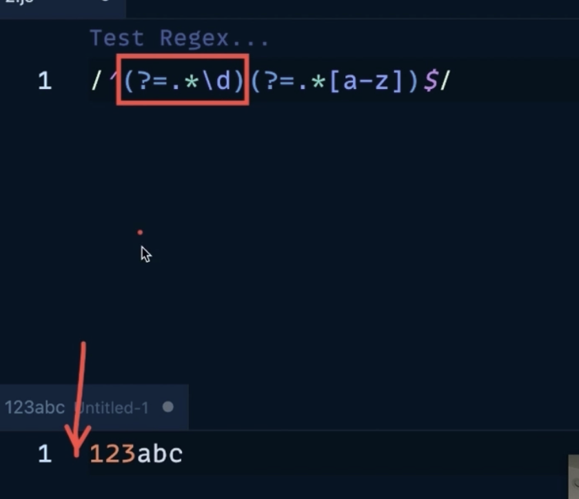

最开始指针在1的位置, 然后匹配 ``(?=.*\d)`` 这个部分, 它会看这个位置后面没有出现数字, 我们看到1, 这时我们要注意 这种匹配方式 指针的位置是不会移动的 还是在开始位置

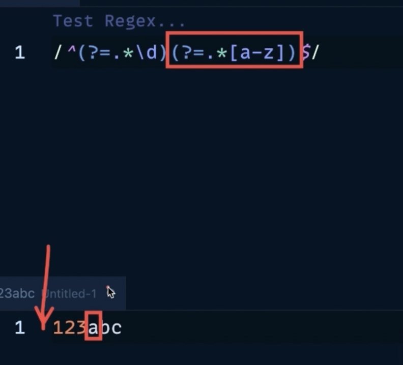

指针还是会保持在开始的位置 然后检查 ``(?=.*[a-z])`` 有没有小写字母 同样指针的位置没动

我们就可以这么写就可以了
```js
/^(?=.*\d)(?=.*[a-z]).*$/

// 这样写不管什么样的顺序都能匹配
```

<br>

### 正则:
这种方式 只要字符串中有数字 小写 大写字符就可以 

注意要写每个部分要写``.*`` ``(?=.*[A-Z])`` 不然就必须要以A开头了
```js
// 这么写  + 也可以了 因为 (?=.*\d)(?=.*[a-z])(?=.*[A-Z])(?=.*[$@,_.]) 这些都通过了 但是后面还有 .*, 它当中会包含+
/^(?=.*\d)(?=.*[a-z])(?=.*[A-Z])(?=.*[$@,_.]).*$/

// 修改如下
/^(?=.*\d)(?=.*[a-z])(?=.*[A-Z])(?=.*[$@,_.])[\da-zA-Z$@,_.]{6,12}$/
```

<br>

### 扩展:
**正向前瞻（Positive Lookahead）: X(?=Y)**  

**负向前瞻（Negative Lookahead）: X(?!Y)**  

这两种前瞻运算符不消耗字符，仅检查字符串中的某一部分是否符合特定的条件，从而在正则表达式中提供更灵活的匹配方式。

这种 ``(?<=)`` 正向后瞻 也不消耗字符


<br><br>

# 请求的取消:
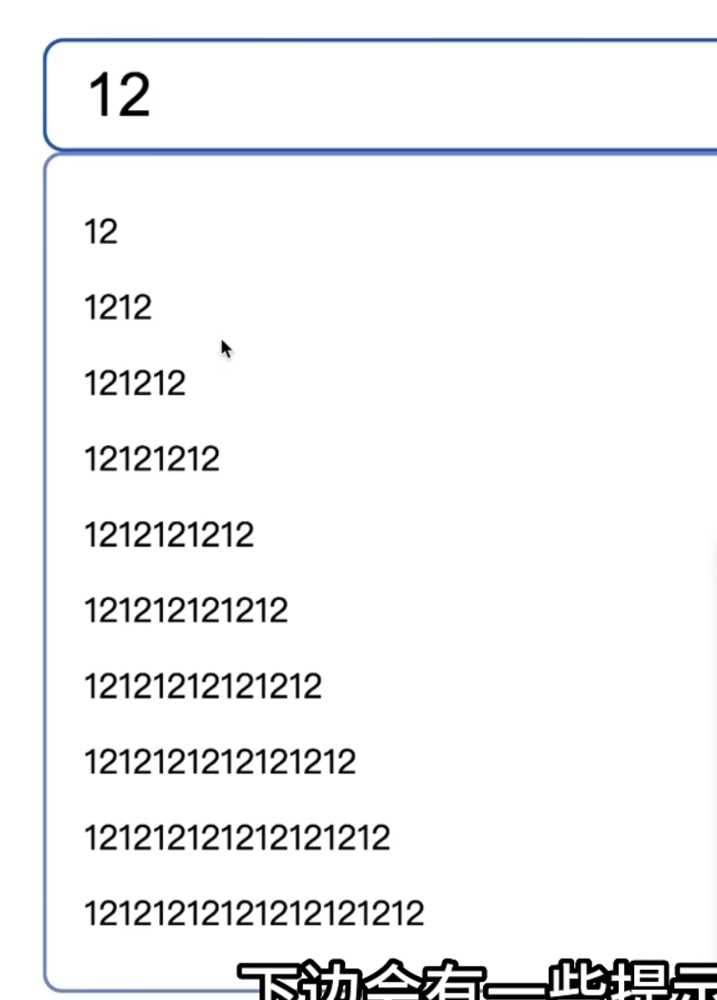

我们会在输入框中输入值, 该值会作为查询条件 去请求服务器 拿到服务器返回的搜索建议  
然后我们会调用 createSuggest 函数 将结果传入 函数就是生成一些html
```js
input.oninput = async () => {
  const list = await fetch('http://localhost:5500/api/search?key' + input.value).then(resp => resp.json())

  createSuggest(list)
}

function createSuggest(list) {
  suggest.innerHTML = list.map(it => `<span>${it}</span>`).join('')

  if (list.length > 0) {
    suggest.classList.add('active')
  } else {
    suggest.classList.remove('active')
  }
}
```

### 问题:
当我们反复的键入内容的时候, 有的时候返回的结果不符合我们的预期

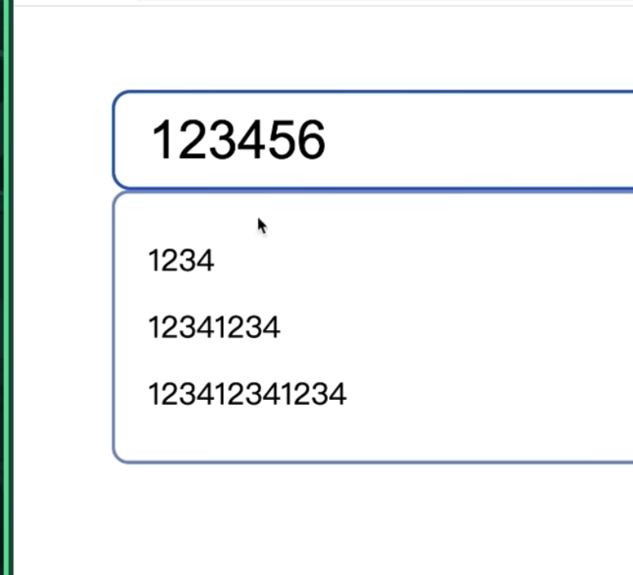

如上图正常的搜索结果应该是 123456123456, 为什么会出现1234 这个结果应该是服务器之前的返回结果

<br>

我们看下下面的图

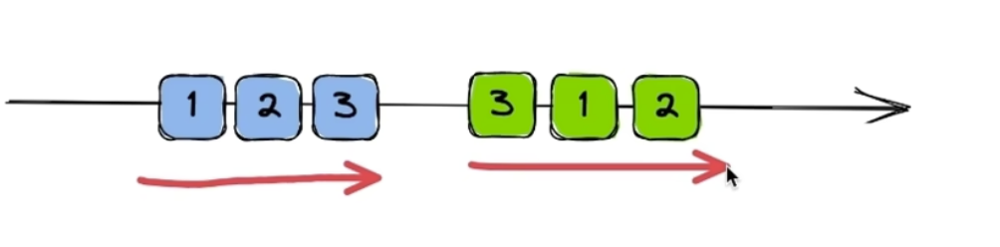

当我们输入123的时候, 它的请求顺序是没有问题的 先将1拿去查询 再把2拿去查询 再把3拿去查询, 但是服务器的请求和响应是需要时间的, **响应返回的顺序就不一定了**

有可能响应返回的顺序是 321 或者 312

input被绑定了 oninput 事件, 当我们输入123的时候, 会触发3次
- 第一次请求发出去了 等待
- 第二次请求发出去了 等待
- 第三次请求发出去了 等待

但是响应回来的时候 是3先完成的 于是在输入框中根据3进行提示, 一会1又完成了 提示就根据1进行的, 一会2又完成了 然后又根据2进行提示的

**根本原因就是请求的顺序 和 响应的顺序不一致 造成了**

<br>

### 疑问?
可以使用防抖解决这个问题么? 防抖解决不了

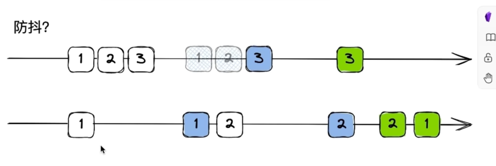

我们按了123 但是由于有防抖 每一次按键都要等一会再出发行为 再发出请求, 按了2也是需要等一会 按了3也是一样等一会再发出请求 

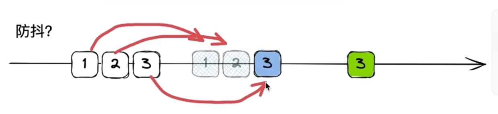

每一次等的时候 是要把之前的等待取消掉的 如果我们按了123 它最终只发了一个请求 3

因为我们拿到的响应也是根据3

但是还有下面的场景

我们先按了1, 我没有按2 然后我等了一会 1请求发出去了 这个时候恰好我又按了一下2 然后等了一会2也发出去了, 但是这个时候1的请求还有没有回来

**这又到了我们发送了2个请求, 但是响应的话 不一定是哪个先回来, 如果2的结果先回来 然后1再回来 还是会造成这个问题**

<br>

**节流也解决不了!**

节流我们发出去的只是1的请求

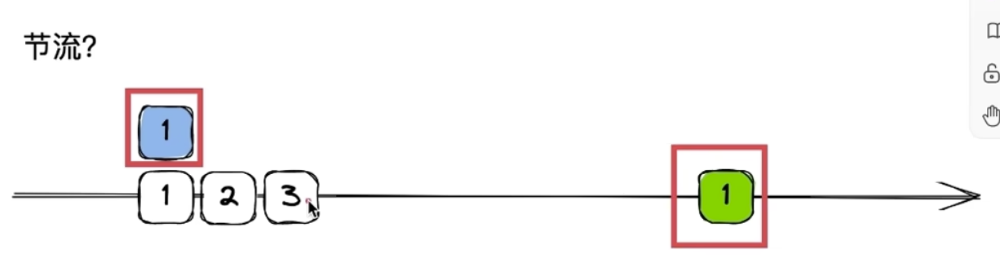

<br>

### 正确做法: 取消请求
我们发送了请求1过后, 我也不知道你后面还按不按了 我就发送请求, 但是当我后面按了2后 我现在要发2的请求了 **这时我要把之前的那个请求取消掉**

bug的根本原因在于之前的请求没有完成, 然后我们又发送了新的请求 结果响应的顺序不是按照请求的顺序

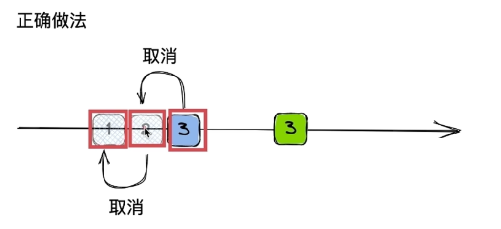

这样就可以保证最后一次到达的一定是最新的请求

<br>

### 代码部分:
fetchapi的第二个参数是配置对象 我们要使用 signal 配置项 我们要传入终止请求的信号 一旦将来终止请求的信号发生 就会关联到这个fetch 把这个fetch取消掉

后续当我们调用 controller.abort() 方法的时候 它就会向关联它的请求 传递信号, 然后将fetch取消掉

```js
const controller = null

input.oninput = async () => {

  // 3. 每次请求前, 要先取消上一次的请求 我们需要拿到上一次请求关联的控制器
  controller && controller.abort()


  // 1. 创建新的控制器
  controller = new AbortController()

  const list = await fetch('http://localhost:5500/api/search?key' + input.value, {
    // 2. 传入 signal 配置项
    signal: controller.signal

  }).then(resp => resp.json())

  createSuggest(list)
}

function createSuggest(list) {
  suggest.innerHTML = list.map(it => `<span>${it}</span>`).join('')

  if (list.length > 0) {
    suggest.classList.add('active')
  } else {
    suggest.classList.remove('active')
  }
}
```


<br><br>

# fetch: 流式读取数据
下面的代码就用来跟chartgpt进行交互 我们丢个问题, 等待chartgpt给我们的回应

但是如果我们使用 ``await res.text()`` 来等待接口给我们的回应的话, 那等待的时间就太长了, 因为它要等待所有的响应体传输结束后 才能拿到结果

因为像chartgpt这种大语言的模型 它的工作原理是一个字一个字算出来的 我们希望回应一个字 我们就在页面上响应一个字

```js
async function getResponse() {
  // res 是响应头完成后 promise 就会完成 在这个时间点我们拿不到响应体
  const res = await fetch(url, {
    method: 'POST',
    headers: {
      'Content-Type': 'application/json'
    },
    body: JSON.stringify({
      content: '讲个坤坤和马老师的故事'
    })
  })


  // 流式读取
  const reader = res.body.getReader()
  
  // 创建解码器: 解码 Uint8Array类型化数组 转成字符串
  const textDecoder = new TextDecoder()

  while (1) {
    // value: 是数据 (Uint8Array类型化数组 里面保存的这一块数据的文本编码) 调用一次 read() 就会读一小块
    const { done, value } = await reader.read()
    if (done) {
      break
    }

    // 将 Uint8Array 放进去会返回 字符串
    const str = textDecoder.decode(value)
  }
}
```

<br>

### new TextDecoder(码位流)
### new TextEncoder(文字)
可以将 码位流 转成 字节流

```js
const encoder = new TextEncode()
encoder.encode('中文字符') // Unit8Array [229, ....]

const decoder = new TextDecoder()
decoder.decode(Unit8Array) // 字符串
```

<br><br>

# 正则中需要注意的 lastIndex
```js
const reg = /^1\d{10}$/g

input.oninput = function() {
  if (reg.test(this.value)) {
    msg.style.display = 'none'
  } else {
    msg.style.display = 'block'
  }
}
```


<br>

当我们在文本框中从左到右输入电话号码的时候 正则检查没有问题 但是当我们将 13577778888 电话号码中 修改其中的一位数字的时候 就会出现问题

<br>

代码很简单, 我们监听输入框的input事件 当值发生变化的时候我们使用正则测试文本框中的值 测试通过隐藏错误 测试不通过则显示错误

<br>

### 原因:
正则对象中 我们一旦加入了 g 或 y, 这个正则对象中就会带一个属性 lastIndex

它表达的是我上一次匹配的时候 匹配到了哪个位置

比如上面我们检查的是11电话号码, 当正则匹配上我们输入的电话号码的时候, **lastIndex 就会记录为11**

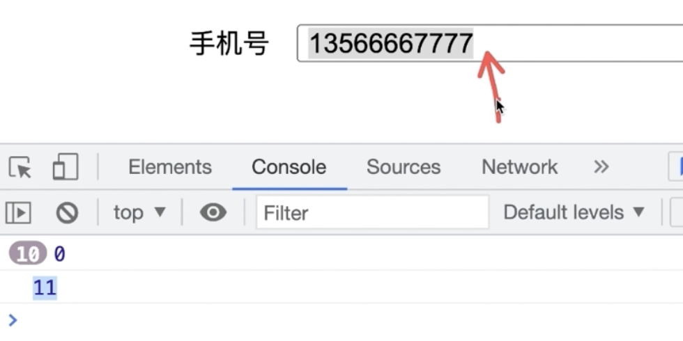

也就意味着每次我们在使用正则匹配的时候 它都是从11这个位置开始匹配的 也就是说我们这个时候改了其中的一位数字 会重新触发事件 它要开始重新匹配 但是匹配的时候它是从 lastIndex记录的位置(11) 开始匹配的

所以当我们修改了一个数字后 它就匹配不上了, **当我们匹配不上的时候 lastIndex 的值就又归0了**

<br>

### 解决方式:
1. 不要使用 g 因为只有全局匹配的模式下 lastIndex 来会生效
2. 每次创建一个新的正则对象
3. 手动的修改lastIndex
```js
input.oninput = function() {

  // 方式1: 每次创建一个新的正则对象
  // const reg = /^1\d{10}$/g

  // 方式2: 手动修改lastIndex
  reg.lastIndex = 0

  if (reg.test(this.value)) {
    msg.style.display = 'none'
  } else {
    msg.style.display = 'block'
  }
}
```

<br><br>

# 编码顺序 和 字典顺序
```js
const names = ['郭德纲', '岳云鹏', '孙越', '曹云金', '刘云天']

// 当我们不传入参数的时候 它默认会按照字符的顺序来排序
names.sort()
//  ['刘云天', '孙越', '岳云鹏', '曹云金', '郭德纲']
```

我们使用 sort() 方法排序的结果 好像不太对, 按照拼音的顺序的话 曹云金应该在前面应该它是c

为什么sort()方法排出来的顺序不一样呢, sort默认情况下它是按字符顺序, 但是很明显它不是按照拼音的顺序 **它是按照字符的编码顺序**

每一个文字有一个对应的数字编码
```js
'刘'.charCodeAt(0)
// 21016

'曹'.charCodeAt(0)
// 26361
```

但是我们期望的不是按照编码的顺序 我们希望按照的是拼音的顺序(字典里面的顺序)

字典里面的顺序我们怎么得到呢? 有的时候我们表格里面可能需要对一些文字来进行排序 我们就必须知道它们的拼音顺序

往上有一些库 它可以得到每一个字的拼音 然后用拼音字母去排序就可以了 **js中本身就给我们提供了一套api 来得到这个字典顺序**

<br>

### **<font color='#C2185B'>字符串.localCompare(字符串)</font>**
两个字符串进行比较 

```js
'刘'.localCompare('曹')
// 1
```

- 如果 刘 在字典里面出现在 曹 **之后**, 得到的就是正数
- 如果 刘 在字典里面出现在 曹 **之前**, 得到的就是负数
- 相同则为0

```js
names.sort((a, b) => a.localCompare(b))
```

<br><br>

# 使用 defer 优化白屏时间
有的时候首屏需要渲染太多的结构 它忙不过来所以处于白屏状态 这种白屏怎么解决

我们可以通过性能功能(F12)来查看 是不是render的部分占用的时间太多

<br>

### 思路
比如我们要渲染20个组件, 每个组件的渲染时间都比较长, 如果一起渲染的话 就会造成白屏

我们想组件即使再多但是用户能看到的部分就那么一些 我们可以先渲染对用户体验比较重要的组件 我们渲染必须让用户首先看到的

我们让重要的组件 出现在渲染的第一帧(一秒60帧 渲染60次), 页面第一次渲染的时候 我们就将这些重要的组件弄出来

```s
Comp 0帧 (重要组件)
Comp 0帧 (重要组件)
Comp 1帧
Comp 2帧
Comp 3帧
```

这样总的渲染时间不变 还是需要那么多时间 但是用户的感知完全是不一样的 用户很快就能看到东西了 其它的不重要的我们依次渲染就可以了

<br>

### 实现
1. 创建hooks
```js
export function useDefer(maxCount = 100) {

  // 目前渲染了多少帧
  const frameCount = ref(0)

  // 停止requestAnimationFrame
  let rafId

  // 每渲染一帧 frameCount +1
  function updateFrameCount() {
    // 在下一帧的时候+1
    rafId = requestAnimationFrame(() => {
      frameCount.value++

      if (frameCount.value >= maxCount) return

      // 递归调用 继续在下一帧的时候加1
      updateFrameCount()
    })
  }

  updateFrameCount()

  onUnMounted(() => {
    cancelAnimationFrame(rafId)
  })

  // 返回一个函数 传入第几帧 (希望第几帧渲染) 返回boolean
  return function defer(n) {

    /* 
      我们要return下面的结构
      return 目前渲染了多少帧 >= n

      比如我们n传入的是5 我要在第5帧进行渲染 那么目前是第6帧 那么就要渲染, 也就是说 5 之后的都要渲染 5之前的就不要渲染了

      那怎么知道目前渲染了多少帧?
    */

    return frameCount.value >= n
  }
}
```

2. 组件中使用 hooks
```html
<div class="container">
  <!-- 
    希望该组件在第一帧渲染 

    在第一帧的时候 defer(0) 会返回true 所以对应的组件才会被渲染
  -->
  <heavy-comp v-if="defer(0)"></heavy-comp>
  <heavy-comp v-if="defer(1)"></heavy-comp>
  <heavy-comp v-if="defer(2)"></heavy-comp>


  <!-- 我们将上面的思路写在循环中 这样这些组件就会依次渲染了-->
  <div v-for="n in 100">
    <heavy-comp v-if="defer(n)"></heavy-comp>
  </div>
</div>

<script>
  import { useDefer } from './useDefer'
  const defer = useDefer()
</script>

```

<br><br>

# JS的函数重载
比如我们有这样一个函数 我们有不同的参数 参数不同**函数的实现也不同**
```js
function getUsers(...args) {

}

getUsers()  // 得到所有的用户
getUsers(1)  // 得到第一页的用户, 默认10个用户
getUsers(1, 20)  // 得到第一页的20个用户
getUsers('张')  // 查找姓名包含张的用户
getUsers('张', '男')  // 查找姓名为张 且 性别为男的用户
```

<br>

接收多个参数的话 我们只能使用剩余参数来定义参数 通过判断长度 和 类型 如果我们不处理将所有的功能都放在一个函数中的话 函数大概会成为这样
```js
function getUsers(...args) {
  if (args.length === 0) {
    console.log('查询所有用户')
  } else if (args.length === 1) {
    if (typeof args[0] === 'string') {
      console.log('按照姓名查询用户')
    } else if (typeof args[0] === 'number') {
      console.log('按照页码和数量查询用户')
    }
  } else if (args.length === 2) {
    if (typeof args[0] === 'string' && typeof args[1] === 'string') {
      console.log('按照姓名和性别查询用户')
    } else if (typeof args[0] === 'number' && typeof args[1] === 'number') {
      console.log('按照页码和数量查询用户')
    }
  }
}
```

<br>

### 解析:
上面的问题的本质就是函数的重载 同一个函数它的参数列表不一样(数量和类型) 它就要运行不同的逻辑

<br>

jQ的作者就写过这样的代码

 
```js
import addMethod from './addMethod.js'

const search = {}

/**
 * 参数1: search对象
 * 参数2: search对象的属性名
 * 参数3: 回调 (回调中具有不同的参数)
 */
addMethod(search, 'getUsers', () => {
  console.log('查询所有用户')
})  // A

addMethod(search, 'getUsers', (name) => {
  console.log('查询所有用户')
})  // B

addMethod(search, 'getUsers', (firstName, sex) => {
  console.log('查询所有用户')
})  // C
```

后续我们调用 search.getUsers 就会运行对应的回调, 上面的模式可以给同一个属性添加不同的函数 会根据我们传入的参数的不同 调用不同的方法

<br>

#### addMethod的实现方式:
这种实现方式很巧妙但是有比较多的问题
1. 每次调用的时候特别麻烦 我们要先创建对象
2. 无法适应参数默认值的情况 (当函数参数有默认值的时候 fn.length是不包含默认值的情况的)
3. 下面的方式只能适配参数的数量, 参数的类型无法适配
```js
function addMethod(object, name, fn) {
  // 将对象中之前的属性对应的函数拿到, 第一次调用的时候 是第一次调用 addMethod 所以没有, 但是第二次调用 addMethod 的时候, 就可以拿到之前的函数B了
  const old = object[name]

  // 然后给该属性进行重新赋值 赋值为一个新的函数, 当我们调用新的函数的时候 我们会传递参数 传递的参数就会被args接收到
  object[name] = function (...args) {
    // 然后我们传递的参数的数量 args.length 和 fn的形参数 进行判断 如果匹配就调用fn
    if (args.length === fn.length) {
      return fn.apply(this, args)
    // 如果不匹配值找old 这类似递归
    } else if (typeof old === 'function') {
      return old.apply(this, args)
    }
  }
}

export default addMethod
```

<br>

### 袁老师的写法
```js
import createOverload from './overload.js'

// 获取 getUsers 函数
const getUsers = createOverload()

// 添加具体的实现: 传入一个无参实现
getUsers.addImpl(() => {
  console.log('查询所有用户')
})


// 我们传入同一个实现, 它可以接收一个参数 或 两个参数, 利用参数的默认值 完成不同的功能
const searchPage = (page, size = 10) {
  console.log('按照页码和数量查询用户')
}
getUsers.addImpl('number', searchPage)
getUsers.addImpl('number', 'number', searchPage)

 

getUsers.addImpl('string', (name) => {
  console.log('按照姓名查询用户')
})
getUsers.addImpl('string', 'string', () => {
  console.log('按照姓名和性别查询用户')
})


// 当我们使用的时候 直接调用getUsers就可以了
getUsers(1)
```

<br>

**createOverload的实现:**  
```js
function createOverload() {
  const callMap = new Map()

  // 它就是返回的getUsers, 调用该函数的时候 执行map里面对应的实现 我们要执行哪个 就看看我们给它传递的是什么了, 比如 getUsers(1)
  function overload(...args) {
    // 我们要将 参数1 转换成 number 的映射
    const key = args.map(arg => typeof arg).join(',')
    const fn = callMap.get(key)

    if (fn) {
      // 我们调用fn的时候 this一定要和overload保持一致
      return fn.apply(this, args)
    } 
    
    // 如果我们传递的参数没有对应的方法 则抛出错误
    throw new Error('no matching functon')
  }

  // addImpl的参数列表的最后一项一定是一个函数, 这个函数就是未来我们调用 getUsers的时候要执行的函数
  overload.addImpl = function(...args) {

    // 函数参数中最后一项 它一定是一个函数
    const fn = args.pop()
    // getUsers.addImpl() 这么调用什么也没有传递的话 我们默默结束
    if (fn || typeof fn !== 'function') return

    // 获取 getUsers.addImpl(参数列表) 的参数列表(上面pop了 所以是除了最后的fn剩下的参数)
    const types = args

    /*
      接下来我们要将 参数列表types 和 fn 对应起来
      我们要创建如下的结果 不同的参数列表对应不同的函数实现
      
      参数列表1: 函数1
      参数列表2: 函数2

      参数列表是类型 如: ['string', 'number'] 的数组, 我们将数组的每一项使用 , 进行拼接 就得到了一个参数列表 string,number

      我们将这个参数列表映射到函数1上
      'string,number': 函数1
      'number,number': 函数2
    */
    callMap.set(types,join(','), fn)
  }

  return overload
}

export default createOverload
```

<br><br>

# 大整数相加
两个超过整数存储范围的大正整数求和

js中能存储的最大整数为, 我们对超过这个值再进行运算就有可能不精确
```js
Number.MAX_SAFE_INTEGER

// 16位数字 千万亿
9007199254740991
```

<br>

### 思路:
小学两个数字相加
```s
123456789
    56789 +
```

1. 从后往前加, 反向循环
2. 数字要对齐, 不足的位数前面补0

```js
function sum(a: string, b: string): string {

  // 获取两个数字字符串的最大长度
  const len = Math.max(a.length, b.length)

  // 不足的位数前面补0 两个字符串的位数就一样了
  a = a.padStart(len, '0')
  b = b.padStart(len, '0')

  // 进位
  let carry = 0
  let result = ''

  // 反向循环
  for (let i = len - 1; i >= 0; i--) {
    // 从最后一位 上下开始 相加 还要加上进位 进位第一次为0
    const sum = +a[i] + +b[i] + carry

    // 我们上下两个数字相加的结果 可能是两位数, 我们只记录它的个位就可以了, 我们将个位作为结果的最后一位
    result = (sum % 10) + result // 因为是倒着算的 result 拼接的时候在后面

    if (sum > 9) {
      carry = 1
    } else {
      carry = 0
    }
    // 上面的if else还可以写成 carry = Math.floor(sum / 10)
  }

  // 循环结束后还要判断carry有没有值 如果有值则需要在结果的前面补1
  if (carry) {
    result = carry + result
  }
  return result 
}
```

<br><br>

# 模块化相关
```js
// 导出
export let count = 1
export function increase() {
  count++
}


// 导入
import { count, increase } from './moduleA'
console.log(count)  // 1

// count++ 报错: Assignment to constant variable 无法给一个常量重新赋值
// count++

increase()  // 输出2
```

<br>

### 要点:
1. 模块A中使用let关键字定义的变量, **在模块B中导入后为常量**
2. ``import { count, increase } from './moduleA'`` 这个不是解构, 这只是模块化的特殊语法 它叫做具名导入

<br>

### 问题:
```js
// 模块A导出的 count
export let count = 1
export function increase() {
  count++
}

// 模块B里导入的 count 
import { count, increase } from './moduleA'
increase()  // 输出2
```

模块A和模块B中的count竟然应用的同一块内存空间, 只有拥有同一块内存空间我们在模块B中调用increase()后才会输出2

但是js语法中基本数据类型 也就是模块A 和 模块B中的count 应该各自是各自的, 这是一个非常诡异的地方 

这样在我们使用模块的时候就会出现非常诡异的现象, 明明在模块B中我们导入的count是一个常量 是不可变的 结果我们在调用increase()之后它变化了

**明明是基本数据类型, 但是由于这样的原因, 我们在A中修改了, C中也会发生变化**

<br>

### 原因:
照成这样的原因是因为 符号绑定, 也就是c中的引用 它们共同指向同一块内存空间

<br>

### 解决方式:
我们在模块A中不要导出变量, 我们要**导出常量**

<br><br>

# 浏览器中的内存泄露点: 游离节点照成内存泄露
这个内存泄露的时机非常的诡异
```s
https://www.bilibili.com/list/666759136?tid=0&sort_field=pubtime&spm_id_from=333.999.0.0&oid=702612667&bvid=BV1Sm4y1M7EG
```

一个表单元素聚焦后消失 不会被垃圾回收, 这意味着我们做SPA的时候 会出现一些表单 切换表单就是在切换组件, 会创建大量的文本框, 用户填写表单就需要聚焦

聚焦过后用户填完了提交了表单是不是会消失 因为组件被移除了, 这样的会 不就是上面的问题么?

我们做了实现 实验结果是 当我们创建10个聚焦的文本框, 9个被回收了 只有最后一个没有被回收, 所以谷歌说这是一个不重要的bug

但是如果最后一个是富文本框 它里面有很多元素, **如果是富文本框不回收 问题就可能很大了**

用户可能觉得我在提交了帖子之后 会有些卡顿, 因为这个时候内存占用有点高了

<br>

### 解决方式:
我们可以在富文本框的后面 在创建一个小的文本框 让它聚焦

<br><br>

# 图片转base64
下面的方式是传统模式上传图片的流程

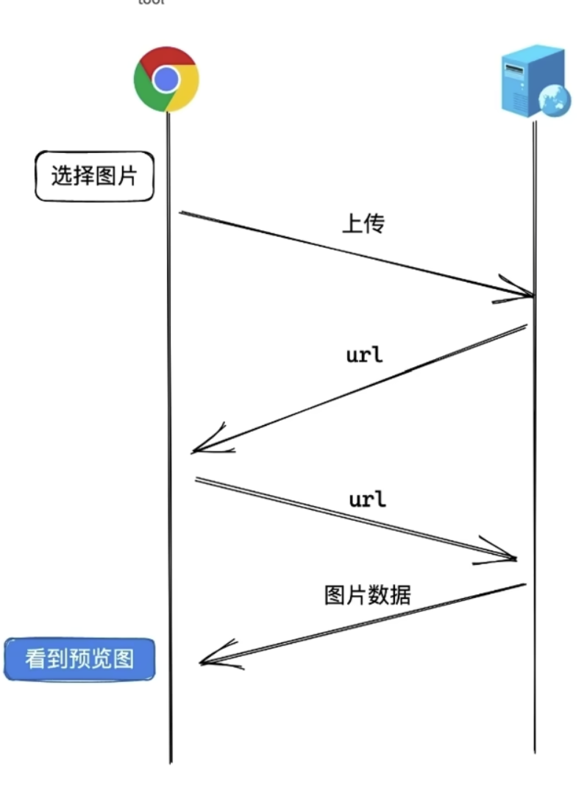

1. 客户端用户选择图片 发起ajax请求 将图片上传到服务器
2. 服务器端返回url
3. 客户端将返回的url设置到img的src上
4. 图片再次发起自发请求 请求图片
5. 服务器返回图片数据
6. img图片展示

<br>

流程没有问题 但是用户提现不太好 因为从用户选择图片 到最终看到这个预览图 走的路太长了, 现在的图片上传的流程是用户选择图片后马上就能看到图片在页面上出现了

也就是说我们要变成下面的这种模式

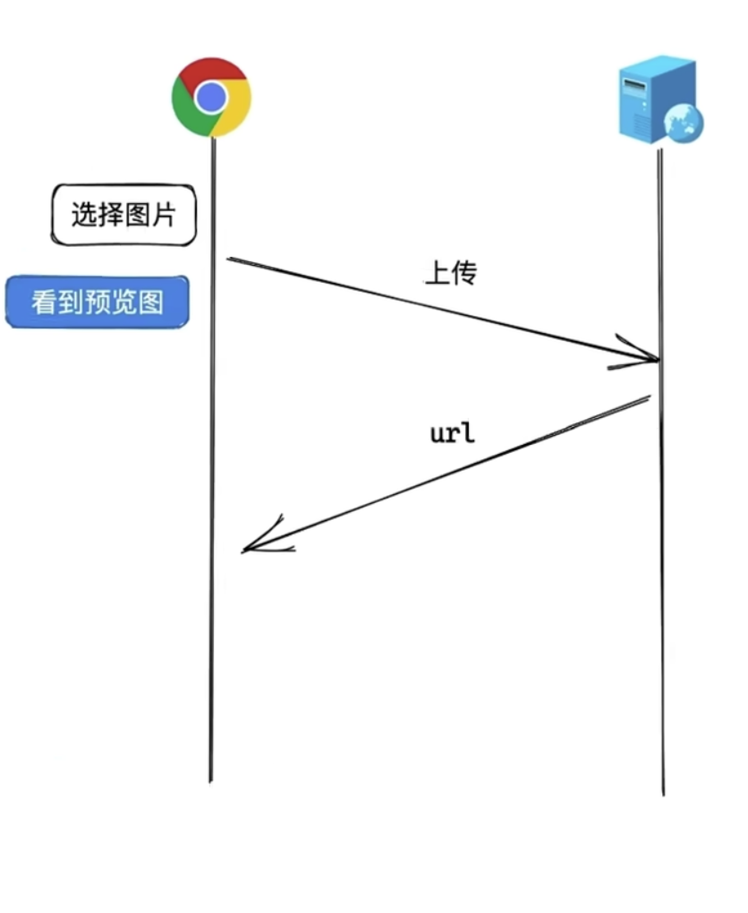

1. 用户选择图片 马上看到预览图
2. 后台该上传 拿到返回的url该怎么用怎么用 反正预览图一开始就看到了

我们不用等待上传的结果

<br>

那么怎么让才能在没有上传到服务器的情况下 我能看到这张预览图呢?

**看到预览图的关键在于拿到图片数据 url地址的目的就是拿资源的数据**, 它就是通过url来拿资源的数据

如果这个数据我们在本地就能拿到 我们就不需要去远程拿数据了

<br>

### 扩展: data url
它首先是一个url地址 这个地址中包含了数据

```s
data:[<MIME type>][;base64],<data>
```

<br>

**data: :**  
指示数据 URI 的开始

<br>

**``[<MIME type>]``:**  
表示数据的 MIME 类型。

MIME 类型是一种标准，用于表示文档、文件的性质和格式。例如，对于图像，可能是 "image/png" 或 "image/jpeg"。

<br>

**[;base64]:**  
这部分是可选的。如果存在，表示数据是通过 Base64 编码的。如果省略这部分，表示数据是纯文本。

如果我们写了base64 则数据的格式就不是字符串 而是通过base64编码后的格式

<br>

```s
base64:
  它可以将任何的二进制数据转换为纯文本的格式
  
  比如图片文件的数据这种纯二进制的 我们就没有办法使用文本来表示 这时我们就可以使用base64编码 将它转成纯文本

字符串 -> base64: btoa(字符串)
base64 -> 字符串: atob(base64)
```

重要的是 img 是引入图片 图片的格式是2进制的 所以这种图片就需要使用base64编码

<br>

**``<data>``:**  
实际的数据部分。这可能是文本内容或经过 Base64 编码的二进制数据，具体取决于前面的 ";base64" 是否存在。

```s
data:image/png;base64,iVBORw0KGgoAAAANSUhEUgAAABAAAAAQCAYAAAAf8/9hAA...
```

<br>

### 示例:
```html
<script src="url" />
```

上面的url就是为了拿数据的, 那js代码的数据, 我们url的部分除了写普通的url地址之外我们还可以写 data url

普通的url是远程拿数据, data url是本地就给你这个数据
```html
<script src="data:application/javascript, alert(123)" />
```

它没有任何的网络请求 通过src给它一个data url 数据本身就带在url里面了 它就只能能运行这个数据

有些js代码就动态生成的, 那么我们就可能动态的拼接到 数据这个部分

<br>

### 实现预览图
```js
const inp = document.querySelector('input')
inp.onchange = function(e) {
  const file = inp.files[0]
  const reader = new FileReader()
  reader.readAsDataURL(file)
  reader.onload = function(e) {
    img.src = e.target.result
  }
}
```

<br><br>

# 判断两个数字的符号是否相同
```js
(3 ^ -5) >= 0 // false 符号不同
(-3 ^ -5) >= 0 // true 符号相同
(3 ^ 5) >= 0 // true 符号相同
(3 ^ -5) >= 0 // false 符号不同
```

<br><br>

# 判断数字n是不是2的整数幂
```js
const isPowerOf2 = n => (n & (n - 1)) === 0
```

<br><br>

# 快速生成星级评分 (好评)
```js
const rate = r => '★★★★★☆☆☆☆☆'.slice(5 - r, 10 - r)

rate(0)  // '☆☆☆☆☆'
rate(1)  // '★☆☆☆☆'
rate(2)  // '★★☆☆☆'
```

<br><br>

# 根据错误信息去社区检索
```js
try {
  // any code
} catch (e) {
  location.href = `https://stackoverflow.com/search?q=js+${e.message}`
}
```

<br><br>

# 让一个数字在 1 和 0 之间来回切换
```js
let toggle = 0

toggle ^= 1  // 1
toggle ^= 1  // 0
toggle ^= 1  // 1
```

<br><br>

# 求一个数字整数部分的几种写法
```js
~~3.14 // 3
3.14 >> 0 // 3
3.14 << 0 // 3
3.14 | 0 // 3
```

<br><br>

# 求一个数字乘以2的n次幂
```js
1 << 2
```

<br><br>

# 如下代码有什么问题: IIFE技巧
下面的代码的作用就是为了注册一个事件 同时兼容各种浏览器

功能上没有问题 关键是效率上 因为每一次调用这个函数的时候 它都会经过下面的分支判断

但是没有必要每次都要经过如下的判断 当用户浏览器运行过这段代码后 进入了A分支

那就说明 这个用户以后一定是进入该分支, 也就是说用户的浏览器能使用哪种注册方式 在一开始的时候就可以确定了 无需等到每一次注册事件的时候 再去判断

所以我们可以改造如下的代码
```js
function addEvent(ele, eventName, handler) {
  if (ele.addEventListener) {
    ele.addEventListener(eventName, handler)
  } else if (ele.attachEvent) {
    ele.attachEvent('on' + eventName, handler)
  } else {
    ele['on' + eventName] = handler
  }
}
```

<br>

### 改造
通过该立即执行函数 我们在最开始的时候就可以确定 它到底支持哪种绑定事件的方式
```js
let addEvent = (() => {
  if (window.addEventListener) {
    return function(ele, eventName, handler) {
      ele.addEventListener(eventName, handler)
    }
  } else if (window.attachEvent) {
    return function(ele, eventName, handler) {
      ele.attachEvent('on' + eventName, handler)
    }
  } else {
    return function(ele, eventName, handler) {
      ele['on' + eventName] = handler
    }
  }
})()
```

这样我们后续在调用 addEvent 的时候 它就不用再经过任何的判断了

<br>

### 示例:
发出http请求 适配于浏览器和node环境
```js
function request(options) {
  if (typeof window !== 'udefined') {
    // 浏览器端的话 使用 ajax
  } else {
    // node的话 使用内置 http 模块
  }
}
```

没有必要每次请求的时候 都要进行一次判断 我们仍然可以通过上面的方式进行改造

```js
const request = (() => {
  if (typeof window !== 'udefined') {
    return function(options) {
      ajax
    }
  } else {
    return function(options) {
      http
    }
  }
})()
```

<br><br>

# 跨标签页的数据共享

## 通信方案:
1. BroadCast Channel
2. service worker
3. localStorage window.onstorage 监听
4. shared worker 定义器轮询(setInterval)
5. IndexDB 定时器轮询
6. cookie 定时器轮询
7. window.open, window.postMessage
8. websocket

<br>

```js
// 创建同一个广播频道
const channel = new BroadcastChannel('demo')

export function sendMsg(type, content) {
  channel.postMessage({
    type, content
  })
}

export function listenMsg(callback) {
  const handler = e => {
    callback && callback(e.data)
  }
  channel.addEventListener('message', handler)

  return () => {
    channel.removeEventListener('message', handler)
  }
}
```

<br>

### 注意
vue的响应式数据 没有办法克隆(因为多个标签只见他通信 数据必须在api底层被克隆) 但是代理对象是没有办法克隆的 我们可以将数据编程普通对象
```js
sendMsg('add-emp', {
  // 展开 就可以了
  ...emp.value
})
```

<br><br>

## 跨标签页的数据共享: 音乐播放案例
酷狗网站有这样的一个功能 我们在首页点击一个歌曲链接后 会打开一个新的窗口, 然后我们回到首页 再点击一个歌曲链接后, 新窗口中是新的歌曲, **它并没有再次的打开新窗口**, 而是就在原有的窗口中切换新的歌曲


<br>

### 示例: 
**A页面: 模拟首页 有歌曲链接**  
A页面为模拟首页 有歌曲链接
```html
<div>
  <span data-name='小蝌蚪找妈妈.oggl'>小蝌蚪找妈妈</span><i> > </i>
</div>
<div>
  <span data-name='白龙马.oggl'>白龙马</span><i> > </i>
</div>
<div>
  <span data-name='生日快乐.oggl'>生日快乐</span><i> > </i>
</div>

<script>
  // 给所有的链接注册点击事件
  const btns = document.querySelectorAll('i')
  for (const btn of btns) {
    btn.onclick = function() {
      // 获取自定义属性 要播放歌曲的名称
      const name = this.dataset.name

      // 通过url打开一个新页面, 并传递要播放的歌曲名
      window.open('./music.html?name=' + name, '_blank')
    }
  }
</script>
```

<br>

**B页面: 播放页**   
```html
<style>
  audio {
    display: block;
    margin: 0 auto;
  }
</style>
<body>
  <audio controls></audio>
</body>

<script>
  // 根据 音乐名 播放音乐
  function play(name) {
    const audio = document.querySelector('audio')
    audio.src = './music' + name
    audio.play()
  }

  // 获取地址栏的参数
  const params = new URLSearchParams(location.search)
  // 从参数中拿到音乐名
  const name = params.get('name')
  if (name) {
    play(name)
  }
</script>
```

<br>

### 难点:
基本的功能是实现了 我们怎么控制只打开一个新窗口呢?

<br>

### 解决方式1:
在打开一个新的窗口的时候 我们在第二个参数的位置传递一个自定义的名字
```js
// 参数2的部分 _blank -> music (自定义)
window.open('./music.html?name=' + name, 'music')
```

这样的效果就是, 第一次点击打开新的窗口, 第二次点击还是刷新第一次打开的窗口

第二个参数表示打开窗口的目标 相当于每个标签页它有一个名字 它找不到名字就会新开一个标签页 然后给它取上这个名字(music)

当我们下次再调用open方法的时候 由于这个标签页的名字已经存在了 它就会在对应名字的标签页的下边刷新页面 而不会再新增窗口了

<br>

**问题:**  
这种解决方式不太适用现在的浏览器环境了, **因为它会刷新页面**

<br>

### 解决方式2: 
```s
+-----------+
|  首页链接  |
+-----------+


      +------------+
      |  音乐播放页  |
      +------------+
```

当我们在首页中点击 链接 的时候, 我们不使用 ``window.open`` 方法去打开一个新的窗口

而是向音乐播放页发送一个消息 告诉它我要播放哪一首歌曲

音乐播放页收到这个消息 它会切换audio元素的src属性 从而实现音乐的无刷新播放

<br>

### 标签页之间的通信方式: 
**1. Window.postMessage**  
使用 window.postMessage 方法，你可以在不同的窗口之间安全地发送消息。这适用于同源和跨源通信，但需要注意安全性问题

```js
// 发送消息
window.postMessage('Hello from Page A!', 'http://example.com');

// 接收消息
window.addEventListener('message', function(event) {
  if (event.origin === 'http://example.com') {
    console.log('Received message:', event.data);
  }
});
```

<br>

**2. Broadcast Channel API**  
BroadcastChannel API **允许在同源标签页之间进行简单的通信**。这是一个基于发布/订阅模型的 API。
```js
// 发送消息
const channel = new BroadcastChannel('myChannel');
channel.postMessage('Hello from Page A!');

// 接收消息
const channel = new BroadcastChannel('myChannel');
channel.addEventListener('message', function(event) {
  console.log('Received message:', event.data);
});
```

<br>

**3. LocalStorage 或 SessionStorage:**   
通过在一个标签页中写入到 LocalStorage 或 SessionStorage，然后在另一个标签页中监听 storage 事件，可以实现一种简单的通信方式。

但是，这有一些限制，例如不能直接发送对象，而且频繁的写入可能导致性能问题。

```js
// 发送消息
localStorage.setItem('message', 'Hello from Page A!');

// 接收消息
window.addEventListener('storage', function(event) {
  if (event.key === 'message') {
    console.log('Received message:', event.newValue);
  }
});
```

<br>

**4. Shared Worker:**  
使用共享 Web Worker，可以在多个标签页之间共享一个后台线程，从而实现更高级别的通信。

```js
// 创建共享 Worker
const worker = new SharedWorker('worker.js');

// 通过端口通信
const port = worker.port;
port.postMessage('Hello from Page A!');

// 接收消息
port.addEventListener('message', function(event) {
  console.log('Received message:', event.data);
});
```

<br>

### 实现: new BroadcastChannel
不管我们有多少个标签页 只要满足两个条件 那么它们之间就可以共用一个频道
1. 同源
2. 频道名一致

**A页面和B页面, 创建相同的频道**

<br>

**A页面: 模拟首页 有歌曲链接**  
```html
<div>
  <span data-name='小蝌蚪找妈妈.oggl'>小蝌蚪找妈妈</span><i> > </i>
</div>
<div>
  <span data-name='白龙马.oggl'>白龙马</span><i> > </i>
</div>
<div>
  <span data-name='生日快乐.oggl'>生日快乐</span><i> > </i>
</div>

<script>
  // 给所有的链接注册点击事件
  const btns = document.querySelectorAll('i')

  // 创建频道
  const channel = new BroadcastChannel('music')

  for (const btn of btns) {
    btn.onclick = function() {
      // 获取自定义属性 要播放歌曲的名称
      const name = this.dataset.name

      // 判断是否有其他的标签页接收消息 (localStorage)
      const n = +localStorage.getItem('music')
      if (!isNaN(n) && n > 0) {
        // 给音乐播放页页面发送消息, 发送消息给相同频道的标签页
        channel.postMessage(name)
      } else {
        // 如果没有标签页接收消息则 打开一个新的标签页
        window.open('./music.html?name=' + name, 'music')
      }
    }
  }
</script>
```

<br>

**B页面: 播放页**   
播放页每次打开的时候我们都往localStorage中存一个标识, 打开就+1, 页面关闭就-1

由于标签页是同源所以它们的localStorage是共用的 那么首页就可以读取localStorage中的标识 首页就可以判断目前有多少个标签页
```html
<style>
  audio {
    display: block;
    margin: 0 auto;
  }
</style>
<body>
  <audio controls></audio>
</body>

<script>
  // 创建频道: 创建和A页面相同的频道
  const channel = new BroadcastChannel('music')

  // n标识当前有几个音乐播放页被打开
  const n = +localStorage.getItem('music')
  // n 没有值则赋值为0
  if (isNaN(n)) {
    n = 0
  }
  // 如果该页面被打开的话 则n++
  n++
  localStorage.setItem('music', n)

  // 接收消息
  channel.addEventListener('message', e => {
    console.log(e.data)
    play(e.data)
  })

  // 页面卸载的时候 我们要重新获取n --
  window.addEventListener('unload', () => {
    const n = +localStorage.getItem('music')

    // 确保即使在卸载页面的过程中出现异常或错误，导致 localStorage 中的 'music' 值不是有效数字，也能够安全地将 n 减去 1
    if (isNaN(n)) {
      n = 1
    }
    n--
    localStorage.setItem('music', n)
  })

  // 根据 音乐名 播放音乐
  function play(name) {
    const audio = document.querySelector('audio')
    audio.src = './music' + name
    audio.play()
  }
</script>
```

<br><br>

# 访问文件夹: showDirectoryPicker 
通过如下的地址 我们能获取到vscode的在线版本, 这个网页版本的vscode竟然能访问文件夹
```s
https://vscode.dev
```

我们以前后知道页面是可能访问文件夹的 这是用户隐私 这种信息浏览器是不会允许开发者去访问的

但是现在有新的api的出现, 可以让网页访问文件夹

<br>

### 待解决的问题
1. 如何选择文件夹
2. 如何得到文件夹中的文件 / 子文件夹
3. 如果得到文件内容
4. 如何高亮显示代码


<br>

```s
https://www.bilibili.com/list/666759136?tid=0&sort_field=pubtime&spm_id_from=333.999.0.0&oid=490570035&bvid=BV1rN411v7oQ
```

<br><br>

# 任务队列的中断 和 恢复
依次顺序执行一系列的任务, 所有的任务全部完成后可以得到每个任务的执行结果

需要返回两个方法, start用于启动任务, pause用于暂停任务, 每个任务具有原子性, 即不可中断, 只能在两个任务之间中断

```js
// tasks: 任务列表, 每个任务无参 异步的函数
function processTasks(...tasks) {
  /*
    不能使用 Promise.all(tasks) 因为要求是依次顺序执行 前一个任务执行完了 才能执行下一个任务
  */

  // 表示任务是否正在运行
  let isRunning = false

  // 任务完成后的数据
  const result = []

  // 当前执行的任务索引, 我们将它提取出来 不然每次调用start都会从头开始循环
  let i = 0


  return {
    start() {
      new Promise(async (resolve, reject) => {
        // 如果当前任务正在运行的话 我们不做任何的事儿
        if (isRunning) return

        isRunning = true

        // 依次执行任务 循环 - 遍历每一个任务数组 取出对应的任务执行
        while (i < tasks.length) {
          result.push(await tasks[i]())
          i++

          // 在每个任务执行完后 我们判断下 比如调用了pause
          if (!isRunning) return
        }

        // 循环结束后 所有的任务都结束了
        isRunning = false

        // 所有任务全部完成后我们resolve
        resolve(result)
      })
    },
    // 暂停只需要控制变量 这个变量就控制着整个逻辑是否要继续
    pause() {
      isRunning = false
    }
  }
}
```

<br><br>

# 并发任务控制

### 要点
我们在A函数中创建的promise, 但是要在B函数中决定是完成还是拒绝

```s
https://www.bilibili.com/list/666759136?tid=0&sort_field=pubtime&spm_id_from=333.999.0.0&oid=320902978&bvid=BV1Pw411i7co
```
```js
// 典型的delay延迟函数
function timeout(time) {
  return new Promise(resolve => {
    setTimeout(() => {
      resolve()
    }, time)
  })
}

// 我们需要实现的部分
class SuperTask {
  // parallelCount: 并发的数量
  // tasks: 保存目前所有待执行的任务
  // runningCount: 目前正在执行的任务数量
  constructor(parallelCount = 2) {
    this.parallelCount = parallelCount
    this.tasks = []
    this.runningCount = 0
  }

  // 添加任务
  add(task) {
    return new Promise((resolve, reject) => {
      // 添加任务: add函数中创建的promise, 但是需要由run函数中决定它是完成还是拒绝, 所以我们往队列中push的时候 不仅仅要push任务本身 还要将resolve, reject添加进去
      this.tasks.push({
        task,
        resolve,
        reject
      })
      // 执行任务
      this._run()
    })
  }

  // 执行任务
  _run() {
    // 取队列中的任务 能去几个取几个取任务的上限
    while(this.runningCount < this.parallelCount && this.tasks.length > 0) {
      const { task, resolve, reject } = this.task.shift()
      this.runningCount++
      task().then(resolve, reject).finally(() => {
        // 这个任务运行结束后 不管是成功还是失败 当前运行的任务都要减1
        this.runningCount--

        // 重新触发执行下一个任务
        this._run()
      })
    }
  }
}

const superTask = new SuperTask()

// addTask函数是二次封装, 给它一个任务 和 任务名 调用superTask实例中的add方法 传入一个函数添加一个要执行的任务, 该任务返回一个promise
function addTask(time, name) {
  superTask
    .add(() => timeout(time)).
    .then(() => {
      console.log(`任务${name}完成`)
    })
}

// 要点: 同一个时间最多只有两个任务能够执行
addTask(10000, 1)  // 10000ms后输出 任务1完成
addTask(5000, 2)  // 5000ms后输出 任务2完成
addTask(3000, 3)  // 8000ms后输出 任务3完成
addTask(4000, 4)  // 12000ms后输出 任务4完成
addTask(5000, 5)  // 15000ms后输出 任务5完成
```

<br>

### 要点: 
同一个时间最多只有两个任务能够执行

最开始的时候 执行 任务1, 执行的时间是 10秒钟  
然后又添加了任务2 要执行5秒钟  
然后有添加了任务3 要执行3秒钟

但是目前已经有两个任务正在执行了, 第三个任务只能等, 等有人空出来, 比如任务2 5s后完成, 它完成了任务3才能够执行

所以任务3的完成时间应该是任务2的5s + 任务3的3s

- 任务1 10s
- 任务2 5s
- 任务3 3s

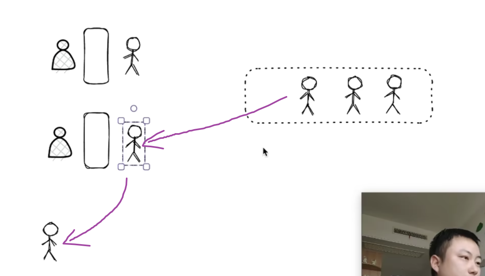

<br><br>

# 消除异步的传染性: 代数效应
```js
async function getUser() {
  return await fetch('./1.jpg')
}

async function m1() {
  const user = await getUser()
  return user
}

async function m2() {
  const user = await m1()
  return user
}

async function m3() {
  const user = await m2()
  return user
}

async function main() {
  const user = await m3()
  console.log(user)
}
```

异步是具有传染性的 getUser中调用了 fetch 需要等待 m1调用了getUser函数 它也需要等待 以此类推, m2 m3 main 都需要等待 

上面的代码没有什么问题, 但是在函数式编程中就有问题了 本来这些函数都是纯函数 结果因为异步具有传染性 导致这些函数全部变成副作用了 这在函数式编程中是不好的

<br>

### 需求: 
尽量不要改动这些函数 将异步 async await 都干掉, 也就是去掉 async await 的样子 从而保持这些函数的纯度
```js
function getUser() {
  return fetch('./1.jpg')
}

function m1() {
  const user = getUser()
  return user
}

function m2() {
  const user = m1()
  return user
}

function m3() {
  const user = m2()
  return user
}

function main() {
  const user = m3()
  console.log(user)
}
```

<br>

### 分析:
一切发生的根源在 getUser 里面的fetch, 因为 getUser 这个函数的异步导致了其它的函数都变成了异步 出现了最开始的代码一串的异步

我们要消除全是异步的问题就要从 fetch 的部分入手 让它不是异步 但是 fetch 怎么变成同步函数?

网络传输是需要时间的 这个时间是无法把它磨平的 要么就要浏览器完全阻塞 但是就卡死了 不合适

我要消除异步的同时 还不能让浏览器卡死 我们看看下面函数的调用情况

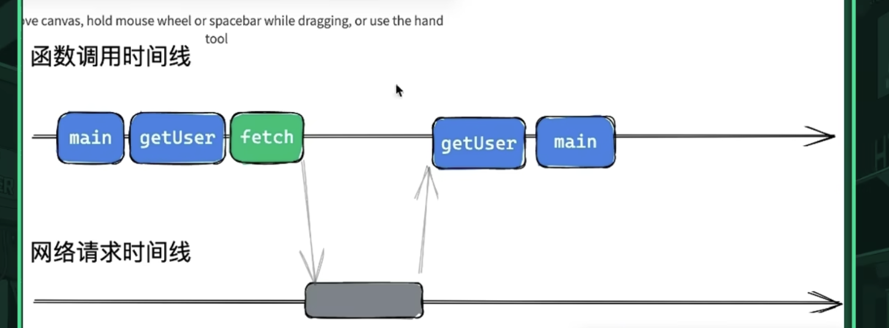

首先调用了 main 函数, 从而调用了m3 m2 m1 直到调用了getUser, getUser中又调用了fetch

fetch是需要网络传输的 因此它需要一段时间 当网络传输完成后 继续getUser
的执行 就能拿到结果了

异步传染性的体现就在 由于fetch需要等, 所以getUser也需要等待 由于getUser需要等待 main函数也需要等待

所以为了消除异步的传染性 只能在绿色的fetch部分做文章 **我们不能让fetch的部分等待**

**那不等又拿不到网络传输的结果 那就只能报错了**

于是就形成了下面的结构

<br>

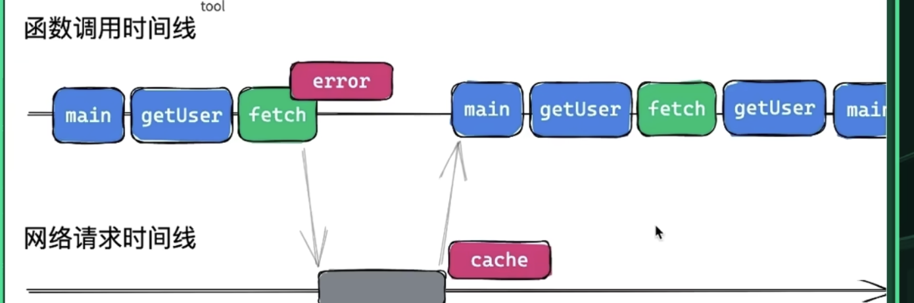

main函数经过一系列的调用 调用了getUser 

getUser中调用了fetch, 但是现在我不等待了 你爱去网络请求就去网络请求, 我们报错 因为我现在不等了 我又没有办法给你这个结果 我只能报错

报错后 所有的函数都终止了 调用栈层层的弹出 然后结束了 

但是我们最终的目的是为了拿到这个结果, 虽然我们报错了 但是网络进程还在继续, 不会停止, 它会一直请求直接拿到这个结果

拿到结果后我们将结果放入到缓存中 然后再恢复整个调用链的执行

**我们再重新调用main**  

后调用的main不是之前调用的main 重新运行了 main中再次的运行getUser - fetch - getUser - main

这次不一样了 再次运行的getUser中的fetch有这个缓存结果 这时它就可以直接交付不用等待了

这样是不是就变成同步了, 虽然上面图中整个过程会走两次
1. 第一次以错误结束
2. 第二次以成功结束

上面的两次都是同步的 没有等待, 在函数式编程环境中 函数式编程中函数都是纯函数 我们调用多次是没有问题的 我们调用100次只要你的入参是一样的 结果都是一样的

那在这种模式下 fetch函数就比较有意思了 这时的fetch函数的实现逻辑就变了

<br>

### fetch的实现逻辑

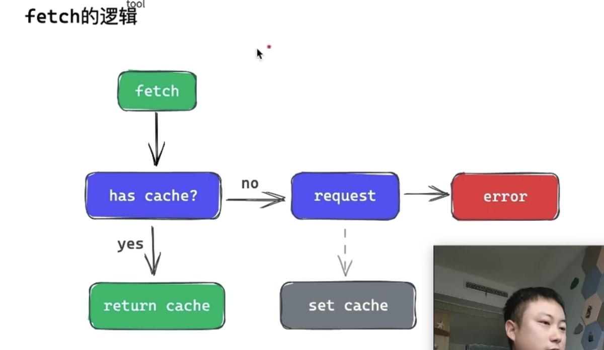

当我们调用 fetch 函数的时候 首先先判断是否有缓存 有缓存的情况下我们就交付缓存 没有缓存的话 发送请求后立刻报错

当请求完成的时候 我们set cache

这样下次调用fetch的时候 我们执行的就是 yes 的路线了

<br>

### 改造fetch
run提供一个执行环境, 我们调用main的时候 会将main放在run环境中 ``run(main)``
```js
// 提供一个执行环境.
function run(fn) {

  // 在执行入口函数前 我们需要改动环境 我们要将fetch修改
  window.fetch = function(...args) {
    if (有缓存) {
      return 交付缓存
    }

    如果没有缓存 我们要做如下的两件事
    1. 发送真实请求
    2. 保存数据
  }

  // 在环境中执行我们传入的入口函数
  fn()
}

run(main)
```

<br>

```js
// 提供一个执行环境.
function run(fn) {

  // 保存原始的fetch
  const oldFetch = window.fetch

  // 缓存
  let cache = {
    // 表示缓存的状态 pending | fulfilled | rejected
    status: 'pending',
    // 请求成功后的数据 或者是 失败后错误也保存在这里, 记录这之前请求的结果
    value: 
  }
  
  // 在执行入口函数前 我们需要改动环境 我们要将fetch修改
  window.fetch = function(...args) {
    // 表示完成了
    if (cache.status === 'fulfilled') {
      return cache.value
    // 表示之前的请求有问题 报错了
    } else if (cache.status === 'rejected') {
      throw cache.value
    }

    // 如果没有缓存 我们要做如下的两件事
    // 1. 发送真实请求, 当请求完成后设置缓存
    const ps = oldFetch(...args).then(
      res => {
        cache.status = 'fulfilled' 
        cache.value = res
      },
      err => {
        cache.status = 'rejected' 
        cache.value = err
      }
    )

    // 2. 抛出错误: 抛出一个promise
    throw ps
  }

  // 在环境中执行我们传入的入口函数
  try {
    fn()
  // 异步处理放到catch中
  } catch (err) {
    // 在某一个时间点让它恢复执行 请求结束后我们需要再次的执行入口函数
    if (err instanceof Promise) {
      // 等待promise完成 不管是成功还是失败都应该重新调用入口函数
      err.then(fn, fn).finally(() => {
        // 将 fetch 修复
        window.fetch = oldFetch
      })
    }
  }
}

run(main)
```

<br><br>

# 不要将异步代码放到表达式中 将同步代码和异步代码混合运算
```js
async function adCount(id) {
  const = count + await fetchCount(id)
  // 如上的写法 或者 [...xxx, await xxx]

  // 修改如下: 先拿到响应结果 然后再去加
  const res = await fetchCount(id)
  count += res
}

addCount(1)
addCount(2)

setTimeout(() => {
  console.log(count)  // 累计出来的是 2
})
```

问题出在 ``const = count + await fetchCount(id)`` 这句代码相当于
```s
const = count + await fetchCount(id)

# 运行 addCount(1) 
count: 0 + await

# 在等待的期间 又运行了 addCount(2), 目前的count的值还是0, 因为还在等待
count: 0 + await

# 等了一会后 运行 addCount(1)  中的await 等待结束 拿到了1
# count: 0 + 1 count: 0 + 1 的值为1


# 等了一会后 addCount(2)  中的await 等待结束 拿到了2
# count: 0 + 2 count: 0 + 2 的值为2
```

**因为等待的时候 count 的值 都是 0 +**

<br><br>

# 判断鼠标进入div时的方向
```s
https://www.bilibili.com/list/666759136?tid=0&sort_field=pubtime&spm_id_from=333.999.0.0&oid=961242271&bvid=BV1CH4y1S75F
```


- 当鼠标从下方移入到div的时候, div中的图片是向上方滚动的
- 当鼠标从右向左移入到div的时候, div中的图片是向左方滚动的

怎么判断鼠标进入div时的方向呢?

<br>

### 方式1 
我们在div四个边缘贴一些非常窄的条 我们可以监听这些条状元素鼠标进入的事件


<br>

**问题:**  
当鼠标从红色箭头位置进入的时候 本来应该是从div右侧进来的 而该方式会认定它是从上方进来的

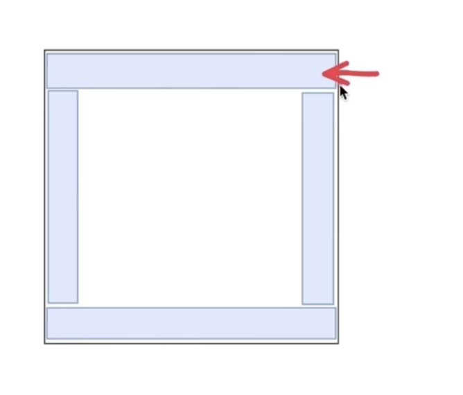

<br>

当然我们可以将条设置的非常窄 也可以减小概率, 但是又有新的问题, 就是鼠标进入的太快了 鼠标进入事件没有反应过来

鼠标进入事件没有反应过来的原因是, 因为浏览器中鼠标事件都是散列的, 计算机中都是散列的


所以当我们速度足够快的时候 这些散列的点会变的非常的稀疏 刚好就跨越了这个元素 就监听不到了

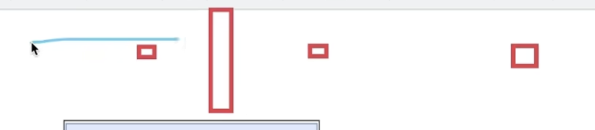


<br>

### 方式1: 推荐
什么是方向 方向的本质就是角度 比如我们平时玩的射击游戏会说 敌人在11点方向 那么以我们自己为中心就会形成一个角度

所以我们要从角度入手 于是我们可以将元素画成这个样子

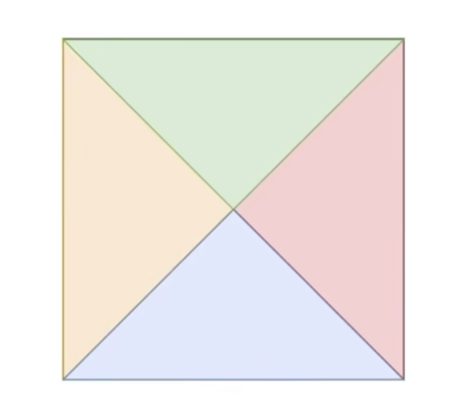

对角线一连就形成了4个区域 这4个区域有自己的角度 如果我们以x y方向为一条轴 

方向就是 某一个点到坐标轴的夹角, 我们就监听整个元素的鼠标移入, 我们鼠标移入的点 和 整个坐标系形成的夹角是多少 

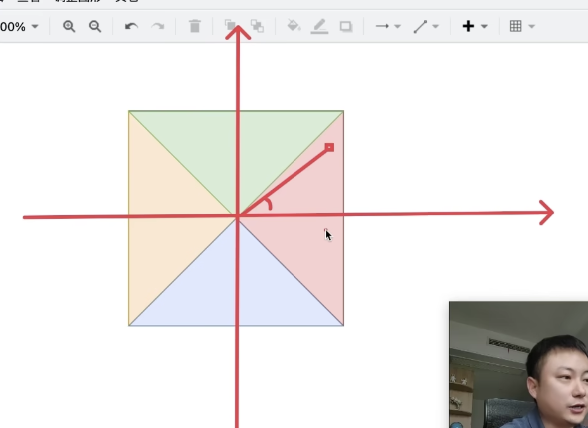

这个夹角坐落在哪一个范围之内 那么就可以判定它的方向了

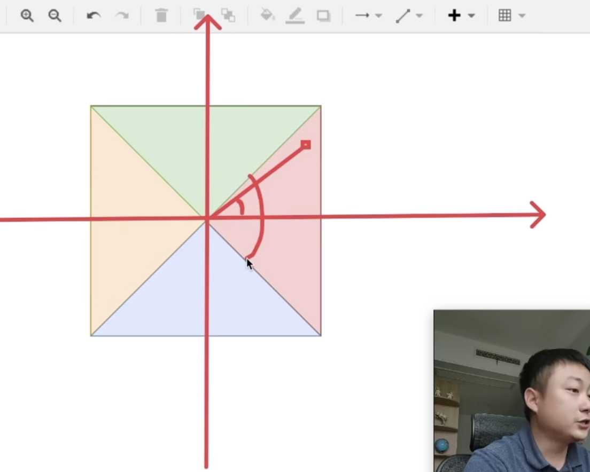

<br>

**基准角度:**  
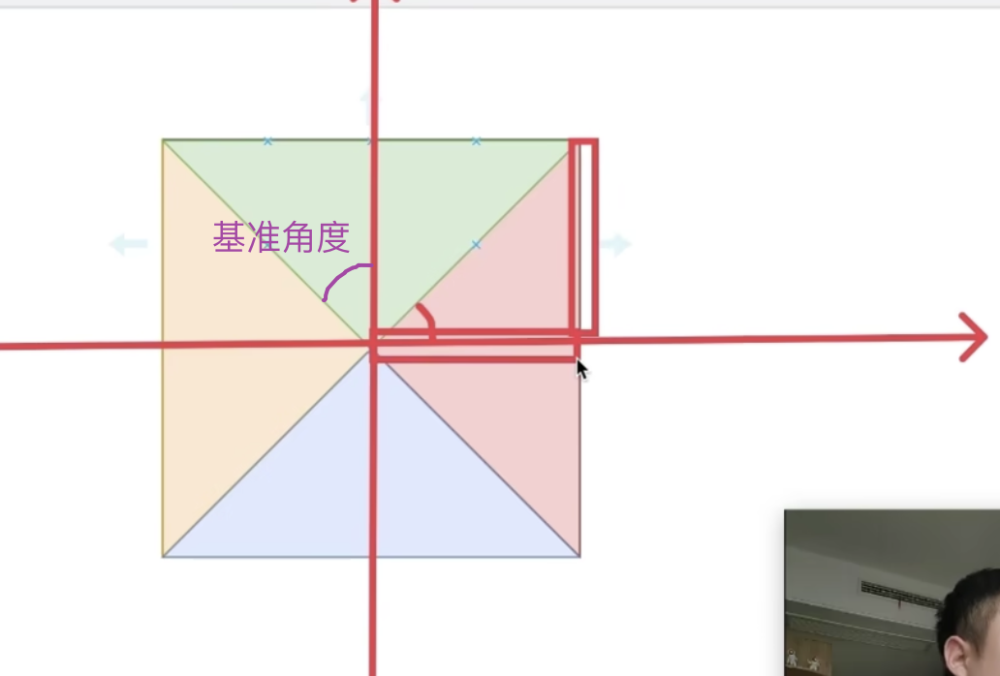

<br>

**鼠标移入的时候:**  
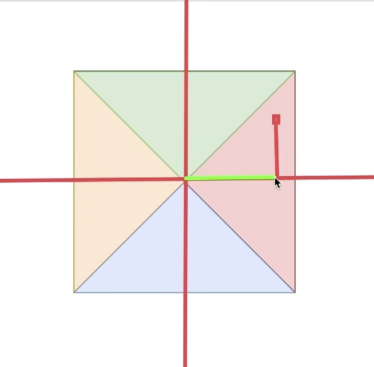

我们可以获取到 这两段距离, 知道这两端距离后 我们就能算出角度了

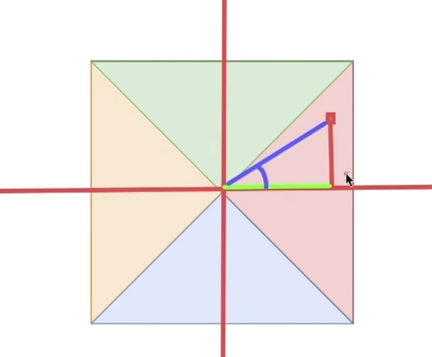

<br>

**判断这个角度坐落在哪一个区域:**  
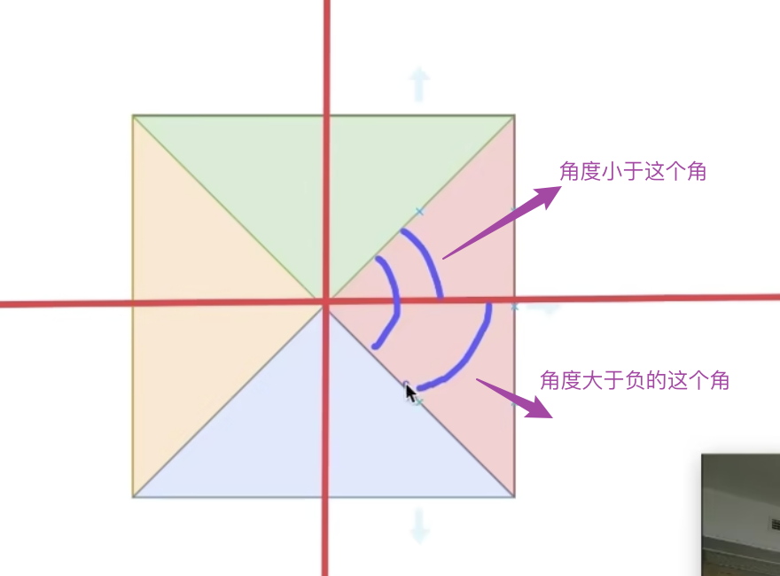

我们算出这个角度后 我们可以判断这个角度坐落在哪一个区域, 比如我们的角度坐落在右侧红色区域 就是右边

这个区域有什么样的特征? 如图

<br>

### 实现
```js
// 1. 获取 div
const container = document.querySelector('.container')

// 2. 获取容器的宽高
const rect = container.getBoundingClientRect()

// 3. 算出基准角度: 高度的一半 / 宽度的一半 这样就是正切值, 求角度的话就是反正切
const theta = Math.atan2(rect.height, rect.width)

// 4. 注册鼠标移入事件
container.addEventListener('mouseenter', (e) => {
  // 5. 获取 图10 的距离
  // 鼠标x的坐标 - 宽度的一半
  // 鼠标y的坐标 - 高度的一半
  const x = e.offsetX - rect.width / 2
  // const y = e.offsetY - rect.height / 2 因为坐标系是反着的 所以我们要这么写
  const y = rect.height / 2 - e.offsetY

  // 6. x 和 y知道后 我们就可以算出角度了 图11
  const d = Math.atan2(y, x)

  // 7. 判断这个角度坐落在哪一个区域
  if (d < theta && d >= -theta) {
    // 该情况下鼠标是从右边进入的
  } else if ( d >= theta && d < Math.PI - theta) {
    // 该情况下鼠标是从上边进入的
  } else if (d >= Math.PI - theta || d < -(Math.PI - theta)) {
    // 该情况下鼠标是从左边进入的
  } else {
    // 该情况下鼠标是从下边进入的
  }
})
```

<br><br>

# 脚本加载失败如何重试
我们不管什么样的项目 总会引入js文件 有可能是打包的时候 自动引入的 也有可能是自己手动添加的

引入的js就有可能会出现一些情况 **在用户那边加载不出来**

那这种情况怎么办? 没有太多的办法 顶多帮助用户重试几次 那

1. 什么时间重试?
2. 如何重试?

<br>

### 什么时间重试? 如何重试?
当用户加载不出来的时候重试, script标签中有一个事件叫做error事件 当用户加载不出来的时候就会触发error事件的执行

```html
<script onerror="" src="http://xxxx/1.js" />
```

但是我们不能直接添加error事件 因为这些script元素都是工程化的工具打包出来的结果 自动帮我们添加的script

因此我们希望统一处理 error 事件, 我们可以监听 window 的 error 事件, 因为所有的事件都会冒泡到window

<br>

**注意:**  
1. 我们监听window的位置 一定要再最上方

2. 因为 script 的 error 回调 也就是加载失败的时候是不会冒泡的, 包括图片 css等加载失败都不会冒泡的, 所以需要给 addEventListener 添加第3个参数 true, **让其再捕获阶段就将它捕获到**

```html
<head>
  <script>
    // 解决如何重试: 这种js加载不出来一般都是域名的问题 一般我们会提供几种备用的域名 这个域名加载不出来 那就换别的

    // 备用域名
    const domains = ['备用域名1', '备用域名2']

    // 我们有多个js文件可能会加载失败, 那么我们也要知道js文件下一次重试的时候 它重试的域名是什么
    const retry = {}

    // 解决什么时间重试: 注意位置 和 true
    window.addEventListener('error', (e) => {
      // 1. 当 js 加载失败的时候 e 是 Event 对象
      // 2. 当 js 代码报错的时候 e 是 ErrorEvent 对象
      // 3. e.target 可以看到 如果js加载失败 它是 script
      if (e.target.tagName !== 'script' e instanceof ErrorEvent) return

      // 根据目标script的src属性 我们可以创建一个 URL 对象
      const url = new URL(e.target.src)
      // url.pathname 就是出问题的js文件
      const name = url.pathname

      if (!(name in retry)) {
        // 第一次重试
        retry[name] = 0
      }

      // 所有的域名重试后 就要结束
      if (index >= domains.length) return

      // 到这里我们就可以拿到重试的下标
      const index = retry[name]
      // 通过下标我们能拿到新的域名
      const newDomain = domains[index]
      url.host = newDomain

      // 使用 document.write 阻塞页面的继续解析 在重试期间让它阻塞
      document.write(`<script src="${url}">\<\/script>`)

      // 重试的方式: 生成script元素 
      // 问题: 动态创建的script元素不会阻塞浏览器的解析 我们为了重试追加的script元素 要考虑到js文件相互依赖的问题 所以在重试期间我们希望页面是阻塞的 也就是不希望浏览器继续解析下载下面的脚本 所以我们不使用下面的代码了 而是使用上面的 document.write
      /*
        const script = document.createElement('script')
        script.src = url.toString() 
        // 这个script要插入到失败的script元素之前
        document.insertBefore(e.target)
      */
      
      retry[name]++
      
    }, true)
  </script>
</head>
<body>
  <script src="http://xxxx/1.js"></script>
</body>
```

<br>

### 要点: document.write
浏览器在解析期间 遇到它 就会阻塞后面的执行

<br><br>

# 链式调用 和 延迟执行
我们希望函数实现如下的功能
1. 可以链式调用
2. 延迟执行

```js
function arrange(name) {

}


// 调用 arrange('william') 的时候 不会发生什么事情 而要等到我们调用 execute() 的时候 才会真正的执行
arrange('william').execute()
// 输出结果: william is notified

// 调用 arrange('william') doSomething('commit') 的时候不会发生什么事情 而要等到我们调用 execute() 的时候 才会依次执行 arrange('william') 和 doSomething('commit')
arrange('william').doSomething('commit').execute()
// 输出结果: william is notified
// 输出结果: start to commit

// 我们还可以调用 wait() 遇到调用它的时候就会等待5s
arrange('william').wait(5).doSomething('commit').execute()
// 输出结果: william is notified
// 等待5s
// 输出结果: start to commit

// 不管 waitFirst 在哪里调用的 都是先等待5s 再执行
arrange('william').waitFirst(5).doSomething('commit').execute()
// 等待5s
// 输出结果: william is notified
// 输出结果: start to commit
```

我们发现不管是调用
- arrange
- do

都不会执行, 而是只有调用 execute 的时候 才会执行也就是说 arrange 和 doSomething 这些函数 只是将任务添加到队列中了 等着等到我们调用 execute 的时候 再将队列循环一遍去执行

所以我们需要先创建队列

```js
function arrange(name) {
  // 1. 创建队列
  const task = []

  // 2. 调用 arrange 的时候 往队列中push次, 我们只能push进去函数
  task.push(() => {
    console.log(`${name} is notified`)
  })

  // 执行该函数的时候 也是往队列中加入一个任务 先不执行 将来调用 execute 的时候再执行
  function doSomething(action) {
    task.push(() => {
      console.log(`Start to ${action}`)
    })

    return this
  } 

  // 执行该函数的时候 也是往队列中加入一个等待的任务 先不执行 将来调用 execute 的时候再执行 怎么描述一个等待的任务呢? 我们只能通过promise 也就是说我们往task中添加一个返回promise的函数
  function wait(sec) {
    task.push(() => new Promise(resolve => {
      setTimeout(resolve, sec * 1000)
    }))
  }

  function waitFirst(sec) {
    // unshift 将这个任务放入到队列中的第一个位置
    task.unshift(() => new Promise(resolve => {
      setTimeout(resolve, sec * 1000)
    }))

    return this
  }

  async function execute(name) {
    // 循环队列 我们对每一个函数进行等待 因为队列中的函数可能是异步的
    for (const t of tasks) {
      await t()
    }

    return this
  }


  // 调用 arrange 之后我们要返回一个对象
  return {
    doSomething,
    wait,
    waitFirst,
    execute
  }
}
```

<br><br>

# 文字转语音

<br>

### 思考:
如何将文字 转换为 音频数据, 转成音频数据后我们就可以创建一个audio元素 给它的src进行赋值

<br>

### 方法:
1. web api, 浏览器会调用操作系统的接口 但是兼容性不好 语音不统一 不同的操作系统的声音是不一样的 功能上比较弱

2. 第三方平台 (讯飞), 第三方平台会提供相对应的接口 供我们完成这样的事情

<br>

### 结构
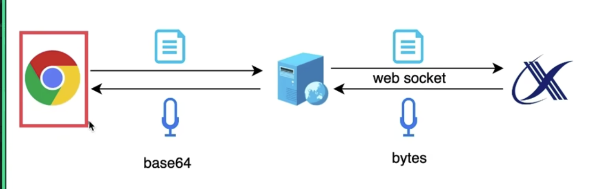

客户端会先传递一段文本到服务器, 服务器请求第三方平台 讯飞会用websocket跟我们进行通信 它会将文字转换成语音的数据传递回给我们

服务器再将数据转换成base64 传递回客户端, 有了base64之后就可以创建audio的src了

<br>

### 为什么不能客户端直传第三方的api
1. 跨域问题
2. 当我们调用第三方的接口的时候, 一般来说都要携带 app_id app_secret, oauth2, 如果这些东西放到客户端是非常不安全的

所以一般调用第三方的api, 都是通过服务器进行中转的

<br>

### 优化:
如果我们的文本量特别大的时候, 讯飞在和服务器进行交互的时候 (文本转语音) 是非常耗时的 所以我们需要优化

**1. 断句:**  
我们不可能将整个文本一起的发过去 我们需要将整段文本切割成一块块的小文本 每一次浏览器只发送只发一块小文本到服务器

断句方式: 设置一些标点符号 用标点分割, 这里有很多断句的算法要实现()[]'' 

<br>

**2. 并发:**  
我们将整个文本切割成了1小块, 我们可以一个小块一个小块的发送 但是这样的话总时间就会很长

我们选择并发的方式 可以同时将多个小块一起发送给服务器 比如每三个每三个的进行发送

<br>

**3. 缓存:**   
我们整个文本中是有重复性的文字的, 这些重复性的文字我们可以将其放入到缓存中 我们可以缓存到localStorage 中 

这样将来我们遇到同样的文字 我们就不用发送到服务器了

服务器也可以做缓存 如果有多个用户要使用我们这种语音系统的话 那么多个用户之间可能会遇到相同的文字 需要转语音

缓存到服务器的话 服务器会直接给这个语音结果 而不是再通过讯飞去请求

```s
文字md5摘要: base64
```

这样就可以**以固定长度的键保存对应的值了**

<br><br>

# 数字转中文
```js
// num为万亿以下的正整数
function toChinsesNumber(num) {
  // 1. 每四位进行分割 千万百万十万万 千百十个, 每四位进行分割的原因就在于 前四位多了个万
  let numStr = num.toString().replace(/(?=(\d{4})+$)/, ',') // ,4567,4567
  numStr = numStr.split(',').filter(Boolean) // ['4567', '4567']


  // n为4位整数 我们将这个4位整数返回它的中文表示
  const charts = ['零', '一', '二', '三', '四', '五', '六', '七', '八', '九']
  // 四位数字的单位
  const units = ['', '十', '百', '千']

  // 去掉连续零的辅助方法, 将连续的零转换为一个零
  function _handlerZero(str) {
    return str.replace(/零{2,}}/g, '零').replace(/零+$/, '')
  }
  function _transform(n) {
    if (n === '0000') {
      return charts[0]  // 零
    }
    let result = ''
    // 1. 遍历字符串
    for (let i = 0; i < n.length; i++) {
      const c = charts[+n[i]]
      let u = units[n.length - 1 - i]
      // charts[0] '零'
      if (c === charts[0]) {
        u = ''
      }
      result += c + u
    }

    result = _handlerZero(result)
    return result
  }

  const bigUnits = ['', '万', '亿']
  const result = ''
  // 2. 循环这个数组 拿到当中的一项
  for (let i = 0; i < numStr.length; i++) {
    const part = numStr[i]

    // 对每一项进行分别的转换
    const c = _transform(part)

    let u = bigUnits[numStr.length - 1 - i]

    if (c === charts[0]) {
      u = ''
    }
    result += c + u
  }

  result = _handlerZero(result)
  console.log(result)

  return result
}

console.log(toChinsesNumber(45674567))
```

<br><br>

# 高度自动过渡


当我们鼠标输入按钮后 下方弹出框的高度从0过渡到内容的高度(auto)

如果我们正常写的话是没有过渡动画效果的
```scss
.content {
  height: 0;
  transition: 0.5s;
}
.btn:hover .content {
  height: auto;
}
```

由于 0 -> auto(非数字) 数字到非数字之间是没有办法应用过渡效果的

<br>

### 解决方式1: max-height
上面没有过渡效果的原因就是因为 它们不是两个数字, 使用 max-height 将auto替换成一个很大值的
```scss
.content {
  // 哪怕容器里面有内容也看不见 因为外层的高度是0
  max-height: 0;
  transition: 0.5s;
}
.btn:hover .content {
  // 鼠标移入后 我们将容器的高度设置为一个很大的值
  max-height: 1000px;
}
```

这样两个数字之间是可以使用过度的

<br>

**问题:**  
展开的时候特别的快, 收回的时候会停顿一会再回去  

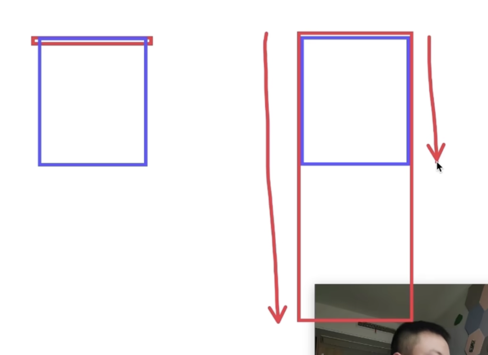

<br>

### 解决方式2: scale
内容可以看到被压缩
```scss
.detail {
  transform-origin: center top;
  transform: scaleY(0);
  transition: 0.5s;
}

.btn:hover .detail {
  transform: scaleY(1);
}
```

<br>

### 解决方式3: grid布局
我们将下面的html结构设置成1行1列的布局, 0fr - 1fr 的变换

但是有兼容性问题, 在sfari中不支持
```scss
.detail {
  display: grid;
  grid-template-rows: 0fr;
  transition: 0.5s;
}

.btn:hover .detail {
  grid-template-rows: 1fr;
}
```
```html
<div class="detail">
  <div class="content"></div>
</div>
```

<br>

### 解决方式4: js处理 flip思想
我们使用的是 flip 思路, 先让元素到达最终的状态 根据最终状态我们拿到关键的信息 然后再让它回到初始状态 然后再变到最终状态

1. 先让元素到达最终状态 获取到元素完全展开之后的高度
2. 然后让元素回到初始状态
3. 最后让元素过度到最终状态

```html
<div class="btn">
  <div class="detail"></div>
</div>
``` 
```js
// 获取 按钮
const btn = document.querySelector('.btn')

// 获取 要滑下来的元素
const detail = document.querySelector('.detail')

btn.addEventListener('mouseenter', () => {
  // 1. 先将元素的高度设置为auto 只有先设置为auto之后我们才能拿到当前元素的高度 就是让它回流让它重排让它渲染 渲染后高度就出来了
  detail.style.height = 'auto'
  const { height } = detail.getBoundingClientRect()

  // 获取到height后 我们再将元素的高度设置为0, 不用担心我们操作了两遍detail因为在执行js的过程中浏览器是来不及绘制的
  detail.style.height = 0 + 'px'

  /*
    detail.offsetHeight 强行让元素渲染
    如果不写这句的话 相当于我们连续设置两次height
    detail.style.height = 0 + 'px'
    detail.style.height = height + 'px'

    那么浏览器就会直接渲染到最终状态
    detail.style.height = height + 'px'

    它就不会渲染
    detail.style.height = 0 + 'px'

    所以我们要让它强制渲染
  */
  detail.style.transition = '0.3s'
  detail.offsetHeight

  // 然后让元素到达最终状态
  detail.style.height = height + 'px'
})
```

<br><br>

# JS避坑

### 改造 promise
```js
getUserInfo().then(userInfo => {
  getArticles(userInfo).then(atricles => {
    Promise.all(articles.map(atricle => {
      getArticleDetail(atricle).then(articleDetails => {
        console.log(articleDetails)
      })
    }))
  })
})


getUserInfo()
  .then(getArticles)
  .then(atricles => Promise.all(articles.map(atricle => getArticleDetail(atricle)))
  .then(articleDetails => {
    console.log(articleDetails)
  })
```

<br>

### 处理异常的问题
下面的这种方式能够解决错误么? 不能错误仍然存在 下面的代码的唯一作用就是将这个错误给他掩盖下去

但是等待这个错误产生严重bug的时候 调都不知道往哪调 因为它没有任何的错误信息

我们捕获错误的目的是
1. 处理错误
2. 如果不知道怎么处理 需要将错误消息显示出来 或者 上报给服务器

在软件开发中永远不要掩盖错误
```js
const getUserInfo = async () => {
  try {
    const userInfo = await fetch('api')
  } catch (err) {
    //
  }
}

// 改造
const getUserInfo = async () => {
  try {
    const userInfo = await fetch('api')
  } catch (err) {
    throw new Error(err)
  }
}
```

<br><br>

# 判断奇偶
下面的代码我们还要考虑负数的情况
```js
// 判断奇数
function isOdd(n) {
  // 只要不是一个偶数就是一个奇数
  return n % 2 !== 0

  return n % 2 === 1 || n % 2 === -1
}
```

<br><br>

# 使用 MutationObserver 实现微队列执行
```js
// fn就是我们放入微队列中执行的任务
const ob = new MutationObserver(fn)
// 创建一个文本节点
const textNode = document.createTextNode('1')
ob.observe(textNode, {
  // 观察该文本节点字符的变化 只要字符一发生变化就会执行fn回调
  characterData: true
})

// 改变字符 手动触发回调
textNode.data = '2'
```

<br><br>

# 大量任务执行的调度
运行一个耗时任务, 如果要异步执行任务 需要返回Promise

要尽快完成任务, 同时不要让页面产生卡顿, 尽量兼容更多的浏览器

runTask函数的参数是另外一个函数 它是一个任务 而且是一个耗时任务
```js
function runTask(task) {
  task()
}
```

<br>

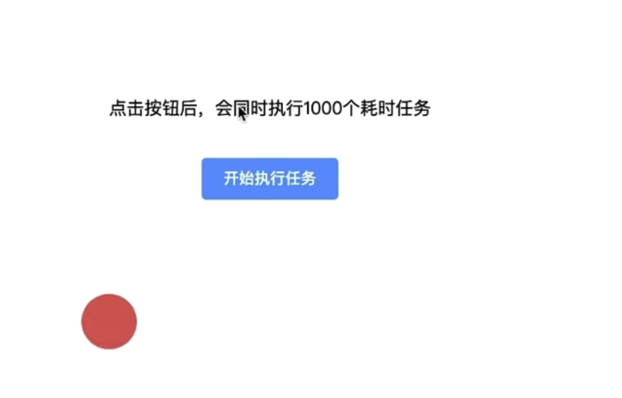

点击按钮后 **会调用1000次这个runTask函数**, 每一次都会传递一个任务进来, 我们要做的就是在runTask函数中执行task函数 我们不仅要保证该任务尽快的完成 同时还不要让页面产生卡顿 并且兼容更多的浏览器

<br> 

如果我们直接调用runTask 直接执行task函数(耗时5s的任务)的话, **就是同步执行页面会卡顿5s**

<br> 

### 异步执行 task 呢
我们将 task 放在**微任务队列中执行** 我们会发现页面**还是阻塞了** 页面还是会卡顿5s
```js
function runTask(task) {
  return new Promise(resolve => {
    Promise.resolve().then(() => {
      task()
      resolve()
    })
  })
}
```

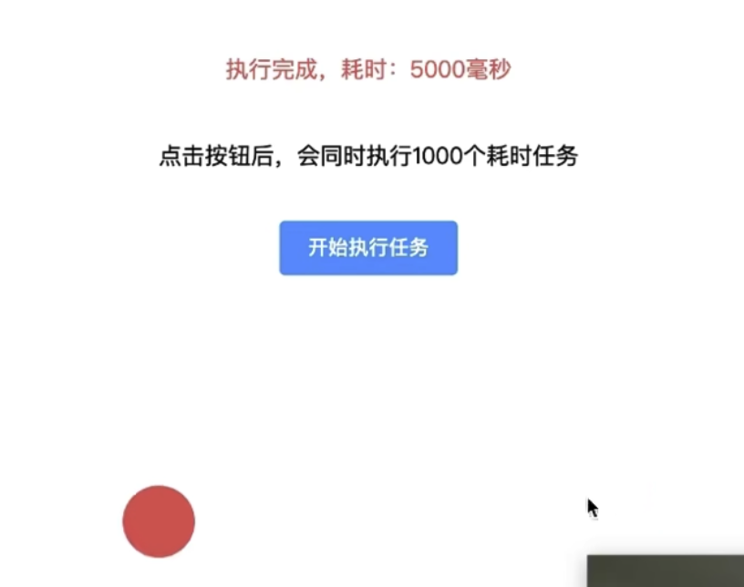

<br> 

### 为什么微任务队列还是会阻塞呢?
我们要知道事件循环是如何处理微任务的 它遇到微任务 它一定会将微任务清空 然后才会继续往后执行其他的 这就会影响到我们的渲染帧

我们的渲染帧是每16.6毫秒渲染一帧 **如果在某一帧中出现大量的微任务(1000次微任务)** 那么它会就导致这个渲染帧延后 它一定要把这个微任务全部执行完了 才会去进行渲染

也就是说耗时的微任务页面也会卡顿是么

如果一个微任务的执行时间过长，会影响到整个事件循环。如果你的任务是一个耗时较长的操作，它可能会在当前宏任务的微任务阶段占用较多时间，导致其他微任务和下一个宏任务被延迟执行，从而影响页面的渲染和响应性能。

因此，**长时间运行的微任务可能会导致页面卡顿**，因为它会阻塞事件循环的正常进行。

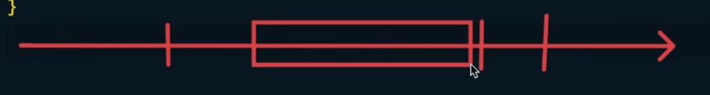

<br>

### 使用宏任务可以么?
我们会发现 页面没有阻塞但是**出现了巨大的卡顿**
```js
function runTask(task) {
  return new Promise(resolve => {
    setTimeout(() => {
      task()
      resolve()
    }, 0)
  })
}
```


<br>

我们的渲染帧是每16.6毫秒渲染一帧, 我们会产生1000次的宏任务 **但是由于宏任务不像微任务那样必须要将微任务全部执行完 才能做接下来的事儿**

宏任务是可以分散的 比如1000个宏任务 **在一帧前执行了一次宏任务 然后发现渲染时机到了 它会进行渲染 后续的宏任务会放到渲染时机之后**

<br>

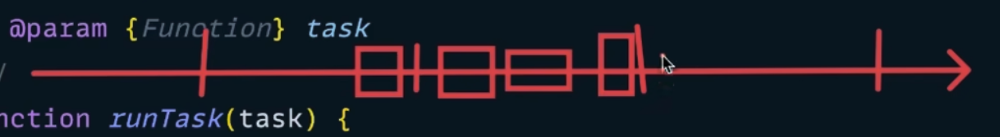

<br>

按理说这样是不会造成卡顿的 但为什么会造成卡顿呢 这就涉及到了更加深入的事件循环原理了

我们要知道事件循环本质上是一个死循环 伪代码如下
```js
for(;;) {
  取出一个宏任务
  执行宏任务
  if(渲染时机是否达到 如果不该渲染 进入下次循环) {
    该渲染的时候进行渲染
  }
}
```

问题出现在判断的位置, **什么叫做渲染时机是否到达?** w3c中没有明确的说明 这就需要各大浏览器厂商自己判断

<br>

谷歌任务 我们现在的宏任务队列里面 有很多的宏任务 一直等着 得不到执行 它会取一个折中 它会适当的延迟这个渲染时机 也就是渲染不再是16.6毫秒了 可能更长 **留给更多的时间去把这些宏任务执行了** 

**这就意味着它的帧率变小了**, 也就看到了卡顿

<br>

safari中测试的时候就不受影响很平滑没有卡顿 因为safari认为 浏览器的渲染时机就是16.6s后就要渲染, 它不管有多少个宏任务

所以这里是有浏览器差异的

<br>

### 解决方式
我们这个任务要执行还是不要执行 取决于目前这一帧还剩余多少时间 一帧16.6毫秒还剩时间了我就执行 不剩时间就推迟到下一帧执行

**补充:**  
它是每一帧渲染的时候 会执行回调 但是通过它我们能拿到当前渲染帧还有多少时间
```js
requestIdleCallback((idle) => {
  console.log(idle.timeRemaining())  // 2.2
  /*
    {
      didTimeout: (...)
      timeRemaining: f
    }
  */

  // 如果 idle.timeRemaining() 的结果大于0 说明还有时间
})
``` 

```js
// 如果任务执行了 我们就调用callback 一旦任务执行就相当于调用resolve
function _runTask(task, callback) {
  requestIdleCallback(idle => {
    // timeRemaining() 大于0 说明还有空闲时间
    if (idle.timeRemaining() > 0) {
      task()
      callback()
    } else {
      // 没有空闲时间 递归调用等待下一帧的时候再去执行
      _runTask(task, callback)
    }
  })
}

function runTask(task) {
  return new Promise(resolve => {
    _runTask(task, resolve)
  })
}
```

<br>

### requestIdleCallback的兼容性问题
safari中是没有requestIdleCallback的 safari中需要使用requestAnimationFrame
```js
function _runTask(task, callback) {
  const start = Date.now()
  requestAnimationFrame(() => {
    if (Date.now() - start < 16.6) {
      task()
      callback()
    } else {
      // 没有空闲时间 递归调用等待下一帧的时候再去执行
      _runTask(task, callback)
    }
  })
}
```

<br>

### worker的思考
我们需要想我们需要分多少个线程 比如我们分3个线程 每个线程就大概有300多个任务需要执行 执行完过后汇总到主线程

如果我们要使用多线程的话 还要保证任务重没有对dom的操作

<br><br>

# 一个函数是否标记了 async
async函数 和 正常函数的区别
- 普通函数的原型是 function
```s
[[Prototype]]: f()
```

- async函数的原型是 AsyncFunction, AsyncFunction的原型才是function
```s
[[Prototype]]: AsyncFunction
```

```js
function isAsyncFunction(fn) {
  return Object.prototype.toString.call(func) === '[object AsyncFunction]'

  // 或者 和上面是一样的
  return fn[Symbol.toStringTag] === 'AsyncFunction'
}

isAsyncFunction(() => {})
isAsyncFunction(async () => {})
```

<br><br>

# async 和 await 的问题
下面的输出顺序是什么?
```js
async function asy1() {
  console.log(1)
  await asy2()
  console.log(2)
}

asy2 = async () => {
  await setTimeout(() => {
    Promise.resolve().then(() => {
      console.log(3)
    })
    console.log(4)
  }, 0)
}

asy3 = async () => {
  Promise.resolve().then(() => {
    console.log(6)
  })
}

asy1()
console.log(7)
asy3()

/*
错 对
1  1
4  7
2  6
7  2
3  4
6  3
*/
```

<br>

### 分析:
**首先** 调用 asy1函数 它当中输出1

<br>

**然后** 调用 asy2函数 它当中首先有setTimeout, 它在0秒后会将setTimeout的回调推到宏队列, 因为setTimeout会返回一个id 所以代码相当于如下的样子
```js
asy2 = async () => {
  await setTimeout(() => {
    Promise.resolve().then(() => {
      console.log(3)
    })
    console.log(4)
  }, 0)
}

asy2 = async () => {
  await 100(timeId)
}
```

await后面如果接的不是一个promise的东西 await会将其转换 转换为如下的格式, 一个已完成的Promise
```js
await Promise.resolve(100(timeId))
```

<br>

**await关键字的作用:**   
await会等待它后面的promise完成 **一旦它是完成的promise, 它就会把await下边的代码推到微任务队列**
```js
asy2 = async () => {
  await 100(timeId)
  console.log(123)  // 它会将该行代码推到微任务队列
}
```

如果await下边没有代码则函数执行完毕, 将函数完成推到微任务队列
- 宏: setTimeout, 
- 微: 完成asy2

<br>

**然后**, await要等待asy2()函数的完成, **但是现在它还没有完成 asy2完成的操作仍然在微队列中 还没有执行**
```js
async function asy1() {
  console.log(1)
  await asy2()  // 到了这里
  console.log(2)
}
```

到这里asy1函数就结束了, 因为它要等待asy2的完成, 完成后 它后面的console.log(2)才会被推到微任务队列中执行

asy1函数运行结束了 会执行 
- console.log(7)
- asy3()

<br>

**然后**, 我们看看asy3函数 该函数就做了一件事创建一个已完成的promise 完成后运行then回调 换句话说他就是将then回调推到微任务队列
```js
asy3 = async () => {
  Promise.resolve().then(() => {
    console.log(6)
  })
}
```

- 宏: setTimeout, 
- 微: 完成asy2 console.log(6)

于是asy3结束了, 通过代码执行结束后 执行微队列, 它会取出第一个任务 asy2

asy2完成的话, 它会受它前面await关键字的影响 (await会等待asy2的完成 它一旦完成就会将下边的代码推到微队列)
```js
async function asy1() {
  console.log(1)
  await asy2()  // asy2 它完成的话
  console.log(2)
}
```

- 宏: setTimeout, 
- 微: console.log(6) console.log(2)

<br>

**然后**, 继续执行微队列中的逻辑 取出6执行 取出2执行
- 宏: setTimeout, 
- 微: 

<br>

**最后**, 微队列清空了剩下宏任务队列 运行下面的函数
```js
Promise.resolve().then(() => {
  console.log(3)
})
console.log(4)
```

它会先将 console.log(3) 加入到微队列, 那现在微队列中东西是不是马上输出3呢? 它正在执行setTimeout的回调 它会将整个的回调执行完 将执行栈清空后 才有空闲时间 看队列 所以它会输出4 然后再回头去任务队列中看 console.log(3)

<br>

### 我们再看看下面的输出顺序
```s
https://www.bilibili.com/list/666759136?tid=0&sort_field=pubtime&spm_id_from=333.999.0.0&oid=917160340&bvid=BV1Hu4y1s7oR
```
```js
async function asy1() {
  console.log(1)
  await asy2()
  console.log(2)
}

asy2 = async () => {
  await (async () => {
    await (() => {
      console.log(3)
    })()
    console.log(4)
  })()
}

asy3 = async () => {
  Promise.resolve().then(() => {
    console.log(6)
  })
}

asy1()
console.log(7)
asy3()

// 1 3 7 4 6 2
```

<br><br>

# 字符串异步封装
``getName``是异步函数, 我们调用该函数传入数字会返回 ``name+数字``
```js
getName(123).then(name => {
  console.log(name)
})

// name123
```

<br>

### 问题:
我们有这样的一个字符串 这些字符串被乱七八糟的字符分割 里面夹杂了一些数字

我们想利用上面的异步函数将数字进行替换 对当中的每一个数字都要调用上面的函数 替换成一个名字
```js
const template = `234,55-234_j24--455`
```

<br>

### 解析:
如果仅仅是一个简单的字符串替换的好说
```js
const template = '234,55-234_j24--455'

const result = template.replaceAll(/\d+/g, function(match) {
  // match: 匹配的数字
  return `name${match}`
})

console.log(result)
// name234,name55-name234_jname24--name455
```

但是问题在于我们拿到了匹配的项后需要调用 getName异步函数
```js
const result = template.replaceAll(/\d+/g, function(match) {
  // match: 匹配的数字
  return getName(match)
})
```

问题就出现在这里, **replaceAll是不支持异步的**, getName返回的promise, 但是replaceAll是不会等待的, 所以它会直接将promise对象进行拼接
```js
const template = '234,55-234_j24--455'

const result = template.replaceAll(/\d+/g, function(match) {
  return getName(match)
})

console.log(result)
// [object Promise],[object Promise]-[object Promise]_j[object Promise]--[object Promise]


function getName(val) {
  return new Promise((resolve, reject) => {
    setTimeout(() => {
      resolve(`name${val}`)
    })
  })
}
```

<br>

### 尝试1:
我们使用 match()

```js
const template = '234,55-234_j24--455'

// result为原始字符串
let result = template

const matches = template.match(/\d+/g)
console.log(matches)
// [ '234', '55', '234', '24', '455' ]

;(async () => {
  // 循环上面的数组 调用 getName
  for (const match of matches) {
    const name = await getName(match)

    // 对result 进行替换, 将234替换成getName的返回的name
    result = result.replaceAll(match, name)
  }

  console.log(result)
  // namename234,name55-namename234_jname24--4name55
})()
```

我们能看到结果是不我们想要的 出现这样的原因是因为

``234,55-234_j24--455``

- 1次循环 首先它会将 234 的部分替换成 name234 
- 2次循环 然后它会将 55 的部分替换成 name55
```s
name234,name55-234_j24--455
```
- 3次循环 由于看了上述的字符串中出现了两个234, 所以这两个234都要被替换
```s
namename234,name55-name234_j24--455
```

这就是出现问题的原因 这样写会有bug

<br>

### 尝试2:
```js
const template = '234,55-234_j24--455'

// result为原始字符串
let result = template

// 1. 匹配数字和非数字
const matches = template.match(/\d+|\D/g)
console.log(matches)
// ['234', ',',   '55', '-', '234', '_', 'j',   '24',  '-', '-',   '455']

;(async () => {
  // 2. 我们将 matches 进行映射 如果item是一个数字 那我就调用getName将item传入 如果不是数字的话原封不动将item(符号) 返回
  const handlers = matches.map(item => Number.isNaN(Number(item)) ? item : getName(item))
  console.log(handlers)
  /*
    非数字的位置 原封不动, 数字的位置是一个promise
    [
      Promise { <pending> },
      ',',
      Promise { <pending> },
      '-',
      Promise { <pending> },
      '_',
      'j',
      Promise { <pending> },
      '-',
      '-',
      Promise { <pending> }
    ]
  */

  // 3. 然后我们将 handlers 数组 放在Promise.all中, 这样promise的位置就会等待它完成 完成后就是 getName 的返回值
  let result = await Promise.all(handlers)
  result = result.join('')
  console.log(result)
  // name234,name55-name234_jname24--name455
})()


function getName(val) {
  return new Promise((resolve, reject) => {
    setTimeout(() => {
      resolve(`name${val}`)
    })
  })
}
```

上面确实解决掉了问题 但是这种异步替换的场景 有可能不仅仅是上面的问题, 那我们能不能将上面的事情写成通用的函数

```js
String.prototype.asyncReplaceAll = async function(pattern, replacer) {
  // 1. 考虑参数的合法性

  // 对第二个参数进行验证: 如果第二个参数传入的是 字符串我们调用原生的 replaceAll 方法 将正则的部分替换成 replacer
  if (typeof replacer === 'string') {
    return this.replaceAll(pattern, replacer)
  }

  if (typeof replacer !== 'function') {
    throw new TypeError('replacer需要传入字符串或者是一个函数')
  }

  // 对第一个参数进行验证: 
  /*
    参数1的目的是为了得到一个正则 但是我们传入的可能不是一个正则 比如我们传入的是字符串 或者是别的乱七八糟的玩意 所以我们对第一个参数也要进行验证

    下面的逻辑叫做参数归一化

    不管第一个参数是什么 我们将第一个参数都转换为正则
  */

  let reg
  // 如果我们传入的是是字符串 那我们将字符串变成正则
  if (typeof pattern === 'string') {
    // 它使用 replace 方法，将 pattern 中的特殊字符替换为它们的转义形式，其中 \\$& 表示将匹配到的字符替换为其转义形式。最终得到的字符串作为参数传递给 RegExp 构造函数，创建一个正则表达式对象。
    reg = new RegExp(pattern.replace(/[.*+=\-?^${}()|[\]\\]/g, '\\$&', 'g'))

  // 如果我们传入的就是正则
  } else if (pattern instanceof RegExp) {
    // 我们需要判断有没有添加global标记 也就是正则后面有没有追加g
    if (!pattern.global) {
      throw new TypeError('the pattern regexp should have the global flag set')
    }
    // 如果我们传入的是正则, 我们将该正则复制一份放入到reg中, 因为正则在匹配的过程中会改动 lastIndex 为了避免对外界传入的正则对象产生影响 我们要复制一份
    reg = new RegExp(pattern)
  
  // 如果我们传入的既不是字符串也不是正则 则报错
  } else {
    throw new TypeError('xxxx')
  }

  // 2. 
  let match

  // 定义变量记录上次匹配结束位置的下标
  let lastIndex = 0

  const res = []
  // 调用正则的exec方法将字符串传入(this就是当前的字符串, 当你调用 template.asyncReplaceAll() 时，this 在函数内部指代调用该方法的字符串对象，也就是 template。) 将执行结果放在match中 只要执行结果不为空则继续循环
  while ((match = reg.exec(this)) !== null) {
    console.log(match)
    // 我们希望拿到的是匹配的和不匹配的结果 但是上面的只拿到了匹配的项 不匹配的咋办

    // 这时我们就要借助 index 它是每一次从哪个下标开始匹配到的, 那我们思考一下 234 - 55 中间的下标范围是多少?

    // 每一次匹配过后我们就可以使用上一次结束位置的下标, 获取中间位置 也就是不匹配的字符串
    const str = this.slice(lastIndex, match.index)

    /*
    [ '234', index: 0, input: '234,55-234_j24--455', groups: undefined ]
    [ '55', index: 4, input: '234,55-234_j24--455', groups: undefined ]
    [ '234', index: 7, input: '234,55-234_j24--455', groups: undefined ]
    [ '24', index: 12, input: '234,55-234_j24--455', groups: undefined ]
    [ '455', index: 16, input: '234,55-234_j24--455', groups: undefined ]

    每次循环打印一个数组
      第一个成员就是匹配项
      第二个成员就是匹配的位置

    我们要将匹配的信息传递给第二个参数
    */
    // replacer是异步函数它返回的是promise, ps是当前位置的匹配的promise
    const ps = replacer(match[0])

    // 更新lastIndex
    lastIndex = match.index + match[0].length
    console.log(str, ps)
    res.push(str, ps)
  }

  // 末尾的情况
  const str2 = this.slice(lastIndex)
  res.push(str2)

  console.log(res)

  const finalRes = await Promise.all(res)
  console.log(finalRes)

  return finalRes.join('')
}

const template = '234,55-234_j24--455'

;(async () => {
  const result = await template.asyncReplaceAll(/\d+/g, (match) => getName(match))
  console.log(result)
})()


function getName(val) {
  return new Promise((resolve, reject) => {
    setTimeout(() => {
      resolve(`name${val}`)
    })
  })
}
```

<br><br>

# 前端水印效果
我们使用vue来进行封装

```html
<Watermark text="水印内容">
  <div>内容区</div>
</Watermark>
```

<br>

### Watermark组件

**放篡改:**  
我们需要使用 MutationObserver 来监听元素变化, 一个元素发生变化就会被这个api监听到 我们可以针对变化做一些事情
```html
<template>
  <div ref="parentRef" class="watermark-container">
    <slot></slot>
  </div>
</template>

<script setup>
import useWatermarkBg from './useWatermarkBg'
const porps = defineProps({
  text: {
    type: String,
    required: true,
    default: 'watermark'
  },
  fontSize: {
    type: Number,
    required: 40,
  },
  gap: {
    type: Number,
    required: 20,
  },
})

// dom节点
const parentRef = ref(null)

// 返回水印图片 内部使用canvas画的 将图片的数据导出, 我们只需要将这个背景图设置给内容区就可以了
const bg = useWatermarkBg(props)

let div
function resetWatermark() {
  if (!parentRef.value) {
    return
  }

  if (div) {
    div.remove()
  }

  const { size, base64 } = bg.value
  // div要作为全局变量 当每次调用该函数的时候我们都要判断 如果有则先删掉
  div = document.createElement('div')
  div.style.position = 'absolute'
  div.style.backgroundImage = `url(${base64})`
  div.style.backgroundSize = `${size}px ${size}px `
  div.style.backgroundRepeat = 'repeat'
  div.style.zIndex = 999
  div.style.inset = 0

  parentRef.value.appendChild(div)
}

onMounted(() => {
  resetWatermark()
})

// 当元素变化的时候会执行回调函数 并会注入entries对象, 哪些元素发生变化的数组
const ob = new MutationObserver((entries) => {
  // 比如我们删除parentRef它里面的子元素 修改了属性 添加了节点 都会触发该回调

  for (const entry of entries) {
    console.log(entry)
    /*
      MutationRecord: {
        type: 'childList',
        target: 被操作的节点,
        removedNodes: NodeList,
        addedNodes: NodeList
      }
    */

    // 删除节点的情况
    for (const dom of entry.removedNodes) {
      if (dom === div) {
        // 当我们删除的是水印节点的时候 我们就重新创建水印
        resetWatermark()
        return
      }
    }

    // 修改节点的情况
    if(entry.target === div) {
      resetWatermark()
      return
    }
  }
})

onMounted(() => {
  // 当元素挂载之后 我们监听 parentRef 元素
  ob.observe(parentRef.value, {
    // 配置对象中要指明我们要监听该元素的啥
    childList: true,  // 监控子节点
    subtree: true, // 监控子树
    attributes: true // 监控属性
  })
})

onUnmounted(() => {
  ob.disconnect()
})
</script>

<style>
  .watermark-container {
    position: relative;
  }
</style>
```

<br>

### useWatermarkBg
```js
import { computed } from 'vue'
export default function useWatermarkBg(props) {
  return computed(() => {
    const canvas = document.createElement('canvas')
    const devicePixelRatio = window.devicePixelRatio || 1
    const fontSize = props.fontSize * devicePixelRatio
    const font = fontSize + 'px serif'
    const ctx = canvas.getContext('2d')

    ctx.font = font
    const { width } = ctx.measureText(props.text)
    const canvasSize = Math.max(100, width) + props.gap * devicePixelRatio

    canvas.width = canvasSize
    canvas.height = canvasSize

    ctx.translate(canvas.width / 2, canvas.height / 2)
    ctx.rotate((Math.PI / 180) * -45)
    ctx.fillStyle = 'rgba(0,0,0.0.3)'
    ctx.font = font
    ctx.textAlign = 'center'
    ctx.textBaseline = 'middle'
    ctx.fillText(props.text, 0, 0)

    return {
      base64: canvas.toDataURL(),
      size: canvasSize / devicePixelRatio
    }
  })
}
```

<br><br>

# 禁用复制
我们监听document的copy事件, 禁止它的默认行为即可
```js
document.addEventListener('copy', e => {
  e.preventDefault()

  // 拿到剪切板对象, 往剪切板对象中设置数据, 比如下面用户在粘贴的时候就会粘贴上 不能复制 字样
  e.clipboardData.setData('text/palin', '不能复制')
})
```

比如我们有的网址禁用复制了, 我们可以将copy事件移除掉就可以了
1. 控制台
2. Event Listeners 选项卡
3. 找到目标事件 copy 
4. 点击remove按钮

<br><br>

# async await 的函数特点
async 包裹的函数 当我们返回return 一个任意值的时候 则该async返回一个成功的promise

当我们返回一个 return Promise.reject() 的时候 则返回一个失败的promise 很有用

```js
async getUserInfo() {
  const res = await getUserInfoApi()
  if (res.code === 200) {
    ...
    // async 中 return 一个值 则 getUserInfo 方法 会返回一个成功的promise
    return 'ok'
  } else {
    // async 中 return reject 返回一个失败的promise, 该方法用户 让调用者知道请求成功还是失败
    return Promise.reject('获取用户信息失败')
  }
},
```

**让调用者知道请求成功还是失败**

<br><br>

# 切割数组
背景是后台返回的表格数据是一次性的将所有的数据进行返回, 那么前端就需要进行分页处理, 这里就会涉及到要将 返回的数组进行切割
```js
GoodsSearchApi({
  did: this.did
  type: this.type
  min: this.min
  max: this.max
  keyword: this.keyword
}).then(res => {
  if(res.code == 0) {
    // 当获取数据成功的时候 判断数组有多少项
    if(res.data.length > 8) {
      // 假设每8项为一次加载的内容（8项一份）
      // 切割数组 ... 
    } else {
      // 小于8项 数组不需要拆分 直接赋值 直接显示
      this.goodsList = res.data
    }
  }
})

```

<br>

### 切割数组的逻辑
我们最终想要这样的结构的对象 0为key也就是索引 每8项为一组

```js
let obj = {
  0: arr[0-7]
  1: arr[8-15]
}
```

我们可以定义变量用来保存当前的key和存储数据的obj
```js
// 用来存放数组的
let obj = {}

// 用来存放数组的对象的key
let objKey = 0
```

遍历请求回来的数组数组，每8项为一份 30 / 8 = 3.75 我们要向上取整
```js
for(let i=0; i < Math.ceil(res.data.length / 8); i++) {
  /*
    我们要往对象里面 把数组切割的0-7项放入一个对象中 下方是目标
    obj[i] = res.dada.slice(0, 7)
    obj[i] = res.dada.slice(8, 15)
    obj[i] = res.dada.slice(16, 23)

    ---- 规律 8*(i+1) - 1 但是slice方法 不包括最后的索引 所以不用-1

    obj[i] = res.dada.slice(8*0, 8*(i+1))
    obj[i] = res.dada.slice(8*1, 8*(i+1))
    obj[i] = res.dada.slice(8*2, 8*(i+1))
  */
  // 这样的话 我们就将数据数组 分割成了一个对象， 也就是obj的样式 我们的数据都存在这个对象里面
  obj[i] = res.data.slice(8*i, 8*(i+1))
}
```
```js
data() {
  return {
    // 这个模拟请求回来的数据
    requestData: [
      {
        27个data
      }
    ],

    // 这个是要传递给组件的表格数据
    tableData2: [],
    
    // 这个是控制 是否加载中 的变量 和 切换请求数组的对象
    loadingInfo: {
      loading: true,
      
      // 这里需要key索引和对象搭配使用通过索引取对象中的数据数组
      obj: {},
      objKey: 0
    }
  }
},
  
// 在结构挂载的时候 绑定滚动事件
mounted() {
  window.addEventListener("scroll", this.scrollFn)
},

// 在这个周期中发送请求 将请求回来的数据进行切割 分批次放到obj中 初始化的时候放5个
created() {
  this.handleTableData()
},

// 在这个周期中销毁滚动的监视
beforeDestroy() {
  window.removeEventListener("scroll", this.scrollFn)
},


methods: {
  
  // 滚动函数
  scrollFn() {
    let windowH = window.innerHeight || document.documentElement.clientHeight || document.body.clientHeight
    let st = window.pageYOffset || document.documentElement.scrollTop || document.body.scrollTop
    let docH = document.documentElement.scrollHeight || document.body.scrollHeight
      
    // 判断key值如果key值大于obj内部属性的个数 那么就return
    if(this.loadingInfo.objKey >= Object.keys(this.loadingInfo.obj).length - 1) {
      this.loadingInfo.loading = false
      return
    }
      
    // 触底的判断 在其中让key值自增 然后往里面push接下来的5条
    if(windowH + st >= docH) {
      this.loadingInfo.objKey++
      this.tableData2 = this.tableData2.concat(this.loadingInfo.obj[this.loadingInfo.objKey])
    }
  },

  handleTableData() {
    this.loadingInfo.loading = true
    this.loadingInfo.obj = {}
    this.loadingInfo.objKey = 0
      
    // 切割数组的逻辑
    if(this.requestData.length > 5) {
      for(let i=0; i<Math.ceil(this.requestData.length / 5); i++) {
        this.loadingInfo.obj[i] = this.requestData.slice(5*i, 5*(i+1))
      }
    } else {
      this.tableData2 = this.requestData
      this.loadingInfo.loading = false
    }
  
    // 初始化让数据里面先有5条
    this.tableData2 = this.loadingInfo.obj[this.loadingInfo.objKey]
    console.log("tableData2", this.tableData2)
  },
```

<br><br>

# addEventListener第三个参数
注册的回调仅会触发一次
```js
{
  once: true
}
```

<br><br>

# 冻结对象的要点
```js
// 定义原始数据
const data = {
  name: "sam",
  age: 18
}

// 如果我们使用 freeze 的话 原始数据中的属性就也会被冻结 无法操作了
Object.freeze(data)
data.address = "china"
// 冻结后是无法操作原始对象的
console.log(data)
// {name: 'sam', age: 18}


const _data = { ...data }
// 我们冻结拷贝的对象
Object.freeze(_data)

_data.address = "china"
console.log(_data)
// {name: 'sam', age: 18} 拷贝对象无法操作了 但是原始对象仍然可以, 这就防止了如果我们冻结原始数据 导致其它位置无法使用的问题
```

<br><br>

# 判断是否是一个整数
我们可以使用parseInt方法, 对之前和之后的结果做比较 如果相等则说明是整数

- 1 转换为整数为 1
- 1.5 使用parseInt方法 结果会为1 

所以可以使用将之前和之后的结果做比较 来判断

<br><br>

# 转换整数的方式: ~~num
使用~~运算符对一个数进行操作时，它会将这个数转换为32位有符号整数（带符号的整数）并返回结果。这个操作会丢弃小数部分并保留整数部分。

~~运算符通常用于执行快速的向下取整操作，但它并不是一个常见的做法，因为它的行为可能不够明确，不易理解。在实际编码中，更好的做法是使用Math.floor()函数

```js
let num = 1.5
~~num
1


let num = 2.8
~~num
2


let num = 1.1
~~num
1
```

<br><br>

# axios的响应拦截中 将错误拦截下来了 前端怎么才能知道
axios中响应被拦截了 下面通过 code 值对响应做了处理 比如当下面的时候 我们做了提示消息的处理 同时我们 ``return Promise.reject(new Error('Error'))``

因为这里return了 代码到axios这里就截止了 并不会执行到组件中的逻辑

那组件中怎么才能拿到这里return err 接着做处理呢, 很简单 前端在请求处使用 try catch 我们在catch中接收到 拦截器这里 return 的 reject
```js
else if (res.code === RESPONSE_CODE.getResponseCode().EXCLUSIVE_ERROR.CODE) {
  vuetifyMessage.vuetifyMessage({
    visible: true,
    message: RESPONSE_CODE.getResponseCode().EXCLUSIVE_ERROR.MESSAGE || 'Error',
    type: 'error'
  })
  return Promise.reject(new Error('Error'))
}
```
```js
service.interceptors.response.use(
  /**
   * If you want to get http information such as headers or status
   * Please return  response => response
  */

  /**
   * Determine the request status by custom code
   * Here is just an example
   * You can also judge thvare status by HTTP Status Code
   */
  response => {
    let res = response.data
    debugLog('response:: ', response)
    if (
      response.request.responseType === 'blob' &&
      (response.headers['content-type'].includes(defaultSettings.downloadCsvTypeNoCharset) ||
        response.headers['content-type'] === defaultSettings.downloadJsonType ||
         response.headers['content-type'].includes(defaultSettings.downloadExcelType) ||
         response.headers['content-type'].includes(defaultSettings.downloadPdfType))
    ) {
      return response
    } else {
      // eslint-disable-next-line no-unused-vars
      if (response.request.responseType === 'blob') {
        const reader = new FileReader()
        reader.onload = e => {
          if (e.target.readyState === 2) {
            res = JSON.parse(e.target.result)
            debugLog('back:: ', res)
            if (res.code !== RESPONSE_CODE.getResponseCode().SUCCESS.CODE) {
              const err_message = getMessageByCode(res.code)
              vuetifyMessage.vuetifyMessage({
                visible: true,
                message: err_message || 'Error',
                type: 'error'
              })
              return Promise.reject(new Error(res.message || 'Error'))
            } else {
              return res
            }
          }
        }
        reader.readAsText(response.data)
      } else {
        if (res.code === RESPONSE_CODE.getResponseCode().SUCCESS.CODE || res.code === RESPONSE_CODE.getResponseCode().NO_RECORD.CODE) {
          return res
        } else if (res.code === RESPONSE_CODE.getResponseCode().LOGIN_FAILURE.CODE) {
          vuetifyMessage.vuetifyMessage({
            visible: true,
            message: RESPONSE_CODE.getResponseCode().LOGIN_FAILURE.MESSAGE || 'Error',
            type: 'error'
          })
          return Promise.reject(new Error('Error'))
        } else if (res.code === RESPONSE_CODE.getResponseCode().PASSWORD_UPDATE_FAILURE.CODE) {
          vuetifyMessage.vuetifyMessage({
            visible: true,
            message: RESPONSE_CODE.getResponseCode().PASSWORD_UPDATE_FAILURE.MESSAGE || 'Error',
            type: 'error'
          })
          return Promise.reject(new Error('Error'))
        } else if (res.code === RESPONSE_CODE.getResponseCode().PASSWORD_UPDATE_PRESENTATION.CODE) {
          localStorage.setItem('process', 'sysResetPassword')
          router.push({ path: '/changePass' })
          return Promise.reject(new Error('Error'))
        } else if (res.code === RESPONSE_CODE.getResponseCode().VALIDATOR_ERROR.CODE) {
          vuetifyMessage.vuetifyMessage({
            visible: true,
            message: RESPONSE_CODE.getResponseCode().VALIDATOR_ERROR.MESSAGE || 'Error',
            type: 'error'
          })
          return Promise.reject(new Error('Error'))
        } else if (res.code === RESPONSE_CODE.getResponseCode().EXCLUSIVE_ERROR.CODE) {
          vuetifyMessage.vuetifyMessage({
            visible: true,
            message: RESPONSE_CODE.getResponseCode().EXCLUSIVE_ERROR.MESSAGE || 'Error',
            type: 'error'
          })
          return Promise.reject(new Error('Error'))
        } else if (res.code === RESPONSE_CODE.getResponseCode().DATA_DUPLICATION_ERROR.CODE) {
          vuetifyMessage.vuetifyMessage({
            visible: true,
            message: RESPONSE_CODE.getResponseCode().DATA_DUPLICATION_ERROR.MESSAGE || 'Error',
            type: 'error'
          })
          return Promise.reject(new Error('Error'))
        } else if (res.code === RESPONSE_CODE.getResponseCode().INTERNAL_SERVER_ERROR.CODE) {
          vuetifyMessage.vuetifyMessage({
            visible: true,
            message: RESPONSE_CODE.getResponseCode().INTERNAL_SERVER_ERROR.MESSAGE,
            type: 'error',
            duration: 10000
          })
          return loginRedirect()
        } else if (res.code === RESPONSE_CODE.getResponseCode().UNLICENSED.CODE) {
          vuetifyMessage.vuetifyMessage({
            visible: true,
            message: RESPONSE_CODE.getResponseCode().UNLICENSED.MESSAGE,
            type: 'error'
          })
          return loginRedirect()
        } else {
          return loginRedirect()
        }
      }
    }
  },
  error => {
    debugLog('err' + error) // for debug
    var index
    var errorCode
    if (error !== undefined || error !== null) {
      var errorStr = error.toString()
      index = errorStr.lastIndexOf(' ')
      errorCode = errorStr.substring(index + 1)
      if (errorCode === '504') {
        vuetifyMessage.vuetifyMessage({
          visible: true,
          message: RESPONSE_CODE.getResponseCode().TIME_OUT.MESSAGE,
          type: 'error'
        })
        return Promise.reject(error)
      }
    }
    removeUserInfo()
    Cookies.remove('globalErrorArr')
    router.push('/login')
    return Promise.reject(error)
  }
)
```

<br><br>

# 将一个值转换为对应的布尔值
假设 token 是一个变量, 它可能是一个字符串、数字、对象等任何类型的值。

**我们想要将它转换为一个布尔值**
- 如果 token 存在且有值（非空） 则为 true, 
- 否则为 false

在传统的写法中, 我们可以使用三元运算符来实现：
```js
const isAuthenticated = token ? true : false;
```

<br>

双重否定运算符 !! 的作用是将一个值转换为布尔类型。

第一个 ! 将值转换为相反的布尔值（如果是真则变为假, 如果是假则变为真）

而第二个 ! 再次将其取反, 使得最终的结果和原始值的布尔表示保持一致。
```js
const isAuthenticated = !!token;
```

<br>

```js
const isLogged = token ? true : false
const isLogged = !!token
```


<br><br>

# return + 三元的书写方式
```js
return actions[type]
  ? actions[type]()
  : state
```

<br><br>

# 扩展: 位运算的使用技巧

### 位运算符的快速交换值:
```js
let a = 5;
let b = 10;

a ^= b;
b ^= a;
a ^= b;

console.log(a); // 输出: 10
console.log(b); // 输出: 5
```

<br>

### 位运算的位掩码操作:
```js
const READ_PERMISSION = 1; // 0001
const WRITE_PERMISSION = 2; // 0010
const EXECUTE_PERMISSION = 4; // 0100

let userPermission = READ_PERMISSION | WRITE_PERMISSION; // 读取和写入权限

let hasReadPermission = (userPermission & READ_PERMISSION) !== 0; // 检查是否有读取权限
```

<br>

1. 我们将代表权限的数字设置为 二进制中数位为1(开关打开)的数 如:
```js
1:  0000 0001 
2:  0000 0010 
4:  0000 0100 
8:  0000 1000 
16: 0001 0000 
32: 0010 0000
```

2. 如果我们将两个数做 位运算| 则相当于将两个二进制数组装起来 这步对于上面的案例来说 **相当于**将所有的权限存在了数组中 ``[1, 2, 4]``
```js
0000 0001  
0000 0010  |

// 结果:
0000 0011
```

3. 当我们想验证用户是否具有指定的权限时 我们可以拿 步骤2中的结果 和想检验的权限做 位运算&, **相当于**在上述的权限数组中 找某个元素
```js
// 这是步骤2中的结果
0000 0011
0000 0001 &

0000 0001
```

4. 只要是结果不为0 则说明该用户具有该权限

<br>

### 位运算的快速判断奇偶数:
- 奇数的二进制表示的最后一位为 1
- 偶数的二进制表示的最后一位为 0
```js
let num = 5;
let isEven = (num & 1) === 0; // 判断是否为偶数
```

<br><br>

# 获取两个数组中的元素的相互排列组合
```js
function combineArrays(arrays) {
  let result = []
  if (!arrays || arrays.length === 0) {
    return result
  }

  const length = arrays.length
  const maxIndex = length - 1

  const indices = new Array(length).fill(0)

  while (true) {
    const currentResult = []
    for (let i = 0; i < length; i++) {
      currentResult.push(arrays[i][indices[i]])
    }
    result.push(currentResult)

    let indexToIncrement = maxIndex
    while (indexToIncrement >= 0 &&
      indices[indexToIncrement] === arrays[indexToIncrement].length - 1) {
      indexToIncrement--
    }

    if (indexToIncrement < 0) {
      break
    }

    indices[indexToIncrement]++
    for (let i = indexToIncrement + 1; i < length; i++) {
      indices[i] = 0
    }
  }
  return result
}
```

<br><br>

# 判断一个数是否是整型
```js
let num = 1.1
let res = isInteger(num)
console.log(res)

function isInteger(obj) {
  return Math.floor(obj) == obj
} 
```

<br><br>

# 给出固定的和值, 求数组中哪些元素相加等于固定的和值
```js
const arr = [1, 2, 4, 8, 16, 32, 64, 128, 256, 512, 1024];
const target = 14;

function findElements(arr, target) {
  const results = [];
  const len = arr.length;

  function backtrack(start, sum, path) {
    if (sum === target) {
      results.push([...path]);
      return;
    }

    for (let i = start; i < len; i++) {
      const num = arr[i];

      if (sum + num > target) {
        break;
      }

      path.push(i);
      backtrack(i + 1, sum + num, path);
      path.pop();
    }
  }

  backtrack(0, 0, []);

  return results.map((indexes) => indexes.map((index) => arr[index]));
}

console.log(findElements(arr, target));
```

<br>

### 对上优化:
给出和值 返回相加元素的下标
```js
function findIndexes(arr, target) {
  const results = [];
  const len = arr.length;

  function backtrack(start, sum, path) {
    if (sum === target) {
      results.push([...path]);
      return;
    }

    for (let i = start; i < len; i++) {
      const num = arr[i];

      if (sum + num > target) {
        break;
      }

      path.push(i);
      backtrack(i + 1, sum + num, path);
      path.pop();
    }
  }

  backtrack(0, 0, []);

  return results;
}

```

<br><br>

# JS中的枚举类
```js
Object.freeze({
  A: "a"
})

static MODE = Object.freeze({
  NONE: 0,
  AREA: 1,
  STAMP: 2,
  ERASE: 3,
  FLOOR_IMG: 4,
  SELECT_GRID: 5,
  SHELF_POINT: 6,
  DEPOT_START: 7,
  DEPOT_END: 8,
  SHELF_PASSAGE: 9
});
```

<br><br>

# 验证中的位运算

### 场景描述
我们有表单项, 每个表单项都需要验证, 而验证可能不是简单的全等比较 需要经过一系列的逻辑, 这些逻辑都会被封装好一个专门验证字段信息的函数中

我们会取每一个表单项的值, 放到验证函数中, 该函数会返回一个布尔值

<br>

那假如我们有10个表单项, 当验证都通过的情况下 我们才能进行下一步操作 这时就会做这样的判断
```js
if(!field1 || !field2 || !field3 || !field4) return
```

这样条件里面就太了对么 这里介绍一种利用位运算的方式

<br>

### 提交按钮后的回调
我们在点击提交按钮的时候 会先调用验证方法

<br>

**验证方法:**  
每一个字段都会经过验证的函数 返回一个boolean  

我们每返回一个结果 就让他和 res做与运算, 与运算是是11得1, 只要全是true res的结果才会是true

这种方式避免了大量的if条件

```js
validation(data) {

  let res = true

  let {name, age} = data

  let ret1 = this.isValid(name, "name")
  res &= ret1

  let ret2 = this.isValid(age, "age")
  res &= ret2

  return res
},
```

<br>

```js
validateSearhData() {
  let valid = true // バリデーション結果フラグ
  let result // バリデーション結果
  let field // 画面項目名
  const inFrm = this.searchForm // 検索条件
  const errFm = this.searchFormError // エラーメッセージ


  // エラーメッセージを全てクリアする
  Object.keys(errFm).forEach((key) => {
    errFm[key] = null
  })


  // 处理第一个验证结果
  // ++ センターコード ++
  field = 'centerCode'
  result = new Validator().filled().exec(inFrm[field], this.$t('center'))
  errFm[field] = result.message
  valid &= result.isValid


  // 处理第二个验证结果
  // ++ 日付 ++
  field = 'workEndDate'
  result = new Validator().filled().exec(inFrm[field], this.$t('date'))
  errFm[field] = result.message
  valid &= result.isValid


  return valid
},

```

<br><br>

# 比较两个对象的内容
假如有两个对象 我们单独比较 obj1 == obj2 肯定是false 因为地址值不同 一定是false

那假如我就根据两个对象的内容来比较是否相同呢? 

我们可以利用 JSON.stringify() 来比较两个对象字符串化后的内容是否相同

```js
JSON.stringify(obj1) == JSON.stringify(obj2)
```

<br><br>

# 数组 500 内容
```js
const createAToZArray = () => {
  let arr = []
  for (let index = 65; index < 91; index++) {
    arr.push(String.fromCharCode(index))
  }
  return arr
}
const baseArr = createAToZArray()
const computedArray = ref<string[]>([])
const computeAToZArray = (index: number, arr: string[]): string[] => {
  if (index == 500) {
    return arr
  }
  let computeIndex = (index / 26) > 0 ? Math.floor(index / 26) - 1 : index - 26
  arr[index] = (arr[computeIndex] ?? '') + baseArr[index % 26]
  index++
  return computeAToZArray(index, arr)
}
const run = () => {
  console.clear()
  let arr: string[] = []
  arr = computeAToZArray(0, arr)
  console.log("computedArray.value:", arr)
}
```

<br>

# for循环的几种方式:
```js
for(开始前; 循环进行的条件; 循环一次结束后做什么) {
    // 主体代码
}
```

<br>

### 1. 普通方式:
```js
let arr = [1,2,3]

function code(arr) {
  for(let i = 0; i < arr.length; i++) {
    console.log(arr[i])
  }
}

function test() {
  console.time("calc1")
  code(arr)
  console.timeEnd("calc1")
}
```

<br>

### 2. 对上优化:
提取 arr.length 为一个固定的量, 输出速度会比上面快点
```js
function code2(arr) {

  // len = arr.length
  for(let i = 0, len = arr.length; i < len; i++) {
    console.log(arr[i])
  }

}
```

<br>

### 3. 奇葩for:
输出速度 比上面的还快

注意循环条件部分, ``item = arr[i]`` 这里的循环条件类似于
```js
if(a) { ... }  or
if(true) { ... }
```

当i++超出数组的话 获取到的就是undefined 此时才是if(false)停止循环

```js
function code3(arr) {

  for(let i = 0, item; item = arr[i]; i++) {
    console.log(item)
  }

}
```

<br>

### 4. 倒序的循环输出 要比正序的循环输出要快
其实只是因为倒序可以少用一个变量（对比下上一个例子吧）, 除开这点, 两者没有速度差别。
```js
var arr =[1,2,23,...,1000];
var i = arr.length-1;
for(;i >= 0; i--){
    //alert(i);
}
```

<br><br>

# 中奖概率为 30%

## 需求:
点击按钮 1s 后显示是否中奖(30%概率中奖)

<br>

### 1. 定义随机函数
```js
function random(min, max) {
  return Math.floor(Math.random() * (max - min + 1)) + min - 1
}
```

<br>

### 2. 30%的思路
我们把1-100 分为3段 1 - 30 30 - 60 60 - 90 这样每一个段位就是30%的概率

我们使用随机函数获取 1 - 100 之间的一个数字 如果处于 1 - 30 之间 那么就是 30% 的概率

<br>

### 3. 实现方式:

**非Promise:**  
```js
btn.addEventListener("click", function() {
  setTimeout(() => {
    // 获取一个随机数
    let n = random(1, 100)

    if(n <= 30) {
      alert("中奖")
    } else {
      alert("没中奖")
    }
  }, 1000)
})
```

<br>

**Promise:**  
```js
const p = new Promise((resolve, reject) => {
  setTimeout(() => {
    let n = random(1, 100)

    if(n <= 30) {
      resolve("中奖")
    } else {
      reject("没中奖")
    }
  })
})

p.then(
  res => console.log(res),
  failed => console.log(failed)
)
```

<br><br>

# 禁止用户输入数字以外的字符 同时数值保持千分位

```js
let inp = document.querySelector("input")

let reg = /[^0-9.]*/g
inp.addEventListener("input", function() {
  this.value = this.value.replace(reg, "")
})

inp.addEventListener("change", function() {
  this.value = Number(this.value).toLocaleString()
})


// https://www.iana.org/assignments/language-subtag-registry/language-subtag-registry
let num = 1223233.45
console.log(num.toLocaleString("zh-Hans-CN"))
```

<br><br>

# 测试网络速度
```js
data() {
  return {
    speed: 0
  }
},
async asyncData({$axios}) {
  let start = +new Date()
  let res = await $axios({
    url: "/icon.png"
  })
  let duration = (+new Date() - start) / 1000
  let fileSize = +res.headers["content-length"] / 1024
  let speed = +(fileSize / duration).toFixed(2)

  return {
    speed
  }
},
mounted() {
  console.log(this.speed)
}
```

<br><br>

# 随机数相关

## 随机取数组中的元素
0.5被选作比较的基准值是为了确保排序结果是随机的, 使得数组元素在排序过程中的位置变得随机。

如果使用其他值, 排序结果可能会有偏差, 不够随机。0.5是一个中间值, 可以在正数和负数之间产生随机性。

<br>

### **<font color="#C2185B">arr.sort(() => Math.random() - 0.5).slice(0, 5)</font>**  

```js
let arr = [
  { id:1 },
  { id:2 },
  { id:3 },
  { id:4 },
  { id:5 },
  { id:6 },
  { id:7 },
  { id:8 },
  { id:9 },
  { id:10 },
]

// 每一个元素都会过一遍回调 前后两个元素会根据 -0.5 的结果来交换位置 最后我们再截取
let res = arr.sort(() => Math.random() - 0.5).slice(0, 5)
console.log(res)

// 输出结果
0.1050677328442744
-0.2631702578335362
-0.11944201255202058
0.41943630141920796
-0.4160224648879103
-0.4998091468235186
-0.011096190494223945
-0.1409898815683881
-0.11642274030083843
```

<br><br>

## 随机函数
```js
function randomSort(a, b) {
  return Math.random() > 0.5 ? -1 : 1
}
```

<br><br>

## 随机颜色值
```js
Math.random().toStirng(16).slice(2, 6).padEnd(6, 0) // 截取出来 #ffffff 这个部分
```

<br><br>

## 随机生成字符串
toString(36): 表示为由0-9, a-z组成的的36进制字符串。

```js 
let res = getRandomString(48)
console.log(res)
console.log(res.length)

let ret = Math.random().toString(36)
console.log(ret)

function getRandomString(n) {
  let str = '';

  // 循环拼接str直到指定位置
  while (str.length < n) {
    // 得到的是 0.xxx 所以要截取
    str += Math.random().toString(36).substr(2);
  }
  
  // 结果肯定是比指定位数多 所以这里只取指定位置
  return str.substr(str.length n);
}
```

```js
Math.random().toString(36).slice(2, 8).padEnd(6, '0')

function randomString(len = 6) {
  // Math.random().toString(36) 返回的只有11位
  if (len <= 11) {
    return Math.random().toString(36).slice(2, 2 + len).padEnd(len, '0')
  } else {
    // 先产生11位的字符串 + 剩余位数产生的字符串 递归
    // 产生11位的字符串 + randmonString(len - 11)
    return randmonString(11) + randmonString(len - 11)
  }
}
```


```js
export const randomString = (len) => {
  let chars = 'ABCDEFGHJKMNPQRSTWXYZabcdefhijkmnprstwxyz123456789';
  let strLen = chars.length;
  let randomStr = '';
  for (let i = 0; i < len; i++) {
      randomStr += chars.charAt(Math.floor(Math.random() * strLen));
  }
  return randomStr;
};
```

<br><br>

## 生成指定范围随机数
```js
export const randomNum = (min, max) => Math.floor(Math.random() * (max - min + 1)) + min;

```

<br><br>

## 数组中获取随机数
```js
export const sample = arr => arr[Math.floor(Math.random() * arr.length)];

```

<br><br>

# 监控网络的状态
比如我们做了一个图片非常多的站点 而且这里边为了显示高清的图片(这些图片比较大) 如果此时此刻用户的网络状态不太好的话 可能用户都看不见

与其这样不如给它一个稍微模糊一点的图片 至少用户能看的到

比如 有的时候用户突然断网了 它自己不知道 它还在浏览我们的页面 这时我们可以在页面上增加一些提示

比如用户网络好的时候我们还可以预先加载一些资源 这些我们都涉及到了 我们怎么知道用户的网络状态呢

<br>

### navigator.connection 对象
判断 网速 延迟 网络类型
```js
{
  // 下载速度 带宽 单位是mb/s: 
  downlink: 10,
  // 浏览器识别的网络类型 取值是 2 3 4g (wifi也被识别为4g), 它不代表真实的网络类型 而是通过监控 延迟rtt 和 网速 downlink 综合判断出来的跟哪种网络类型差不多
  effectiveType: '4g',
  onchange: null,
  // 延迟: 数据包出去到回来的时间 ms 相当于 ping
  rtt: 300,
  saveData: false
}
```

<br>

### navigator.onLine boolean
当它为true的时候表示在线 false为离线

<br>

### 事件 online / offline
它是window上的事件

当用户由离线变为在线的时候 会触发该事件
```js
window.addEventListener('online')
```

<br>

### 事件 change
它是 navigator.connection 身上的事件

当网络状态发生变化的时候 2 3 4g 发生切换的时候会触发该事件, 也就是effectiveType的值发生变化的时候

```js
navigator.connection.addEventListener('change')
```

<br><br>

# 如何判断网络质量
```js
let domId = "fast"
if(/slow-2g|2g|3g/.test(navigator.connection.effectiveType) {
  domId = "slow"
}) else {
  domId = "fast"
}

document.getElementById(domId).style.display = "block"

function onConnectionChange() {
  const {rtt, downlink, effectiveType, saveData} = navigator.connection

  console.log(`有效网络连接类型: ${effectiveType}`)
  console.log(`估算的下行速度/带宽: ${downlink}Mb/s`)
  console.log(`估算的往返时间: ${rtt}ms`)
  console.log(`打开/请求数据保护模式: ${saveData}`)
}

// 监听 navigator.connection 的 change 事件
navigator.connection.addEventListener("change",onConnectionChange )
```

<br>

**<font color="#C2185B">effectiveType</font>**
值: 2g 3g 4g

wifi 5g 和 4g 和 离线 的情况下 输出也是 4g

但是离线的时候 downlink 会是 0

<br>

**<font color="#C2185B">downlink</font>**
单位: Mb

<br>

**<font color="#C2185B">rtt</font>**
请求需要的时间

<br>

**<font color="#C2185B">saveData</font>**
数据的保护模式

<br><br>

# 并发数控制

## 方式1: 
### 描述: 一回请求几次接口

```js
async function asyncPool(poolLimit, arr, iteratorFn) {

  // 存储所有的异步任务
  const ret = []

  // 存储正在执行的异步任务
  const executing = []

  // 对arr任务数组进行循环
  for(const item of arr) {

    // 调用 iteratorFn函数创建异步任务
    const p = Promise.resolve().then(() => iteratorFn(item, arr))

    // 保存新的异步任务
    ret.push(p)

    // 当poolLimit值小于或等于总任务个数时 进行并发控制
    if(poolLimit <= arr.length) {
      // 当任务完成后 从正在执行的任务数组中移除已完成的任务
      const e = p.then(() => executing.splice(executing.indexOf(e), 1))

      // 保存正在执行的异步任务
      executing.push(e) 

      // 如果执行的任务 > 限制
      if(executing.length >= poolLimit) {
        // 进来后使用 race() 方法 捕获err
        await Promise.race(executing.map(function(item) {
          return item.catch(function(err) {
            return err
          })
        }))
      }
    }
  }

  // 使用 promise.all 对err进行处理
  return Promise.all(ret.map(function(item) {
    return item.catch(function(err) {
      return err
    })
  }))
}

const timeout = (i, x) => new Promise(
  
  (resolve, reject) => {
  setTimeout(() => {
    console.log(i)

    if(i == 2000) {
      reject({err: i})
    } else {
      resolve({success: i})
    }
  }, i)

})

asyncPool(2, [1000, 1000, 1000, 1000, 1000, 1000, 1000, 1000], timeout).then(res => {
  console.log("res: ", res)
})
```

<br><br>

## 方式2:

### 描述:
前面页面中需要同时发送20个请求, 但是服务器端有限制 需要前端控制并发数 保证最多只能同时发送10个请求

<br>

### 需求:
- 最多同时执行的任务数为10个
- 当前任务执行完成后 释放队列空间 自动执行下一个任务
- 所有任务添加到任务队列后 自动开始执行任务 
```js
function createTask(i) {
  return () => {
    return new Promise((resolve, reject) => {
      // 将每次传入的 i 进行 resolve
      setTimeout(() => {
        resolve(i)
      }, 2000)
    })
  }
}


class TaskQueue {

  constructor() {
    // 设置最大并发数
    this.max = 10;

    // 存储任务
    this.taskList = []

    // 当任务全部添加完毕后自动执行
    setTimeout(() => {
      this.run()
    })
  }

  // 添加任务到队列 -- 同步方法
  addTask(task) {
    this.taskList.push(task)
  }

  // 自动执行任务队列
  run() {
    // 获取任务队列中的数量
    const length = this.taskList.length

    // 如果 length 为0 代表所有的任务完成
    if(!length) {
      return
    }

    // 大于 max 取 max 如果 任务队列的长度 < max 取队列的长度 保证并发数量不会超过10
    const min = Math.min(this.max, length)

    // 取出任务队列中的任务执行
    for(let i = 0; i < min; i++) {
      // 将max的值进行 -- 操作 开始占用一个任务的空间
      this.max--

      const task = this.taskList.shift()
      task().then(res => {
        console.log(res)
      }).catch(err => {
        console.log(err)
      }).finally(() => {
        // 上面 max-- 占用空间 现在要释放一个任务空间
        this.max++

        // 因为自动执行下面的任务
        this.run()
      })
    }
  }
}

const taskQueue = new TaskQueue()

// 初始化 20 个任务
for(let i = 0; i < 20; i++) {
  const task = createTask(i)

  // 将任务添加到 队列后自动执行
  taskQueue.addTask(task)
}
```

<br><br>

## 方式3:

### 需求:
3个为一组 看看3个中哪个先完成 3个中完成一个的话 就将这个踢出去从剩下的4个中再追加进来

```js
// url 7个
const urls = [
  "bytedance.com",
  "tencent.com",
  "alibaba.com",
  "apple.com",
  "hulu.com",
  "amazon.com",
  "microsoft.com"
]

// 需求 3个为一组 看看3个中哪个先完成 3个中完成一个的话 就将这个踢出去从剩下的4个中再追加进来

// 并发的类
class PromisePoll {
  constructor(max, fn) {
    // 最大并发数
    this.max = max
    // 自定义请求函数
    this.fn = fn

    // 并发池 让池子里面始终保持3个
    this.pool = []

    // 剩余的请求地址
    this.urls = []
  }

  start(urls) {
    this.urls = urls

    // 循环把并发池塞满 < 最大并发数就一直往里面塞
    while(this.pool.length < this.max) {

      // 拿到队列前的 url
      let url = this.urls.shift()
      this.setTask(url)
    }

    // 前3个执行完了 需要补充
    // 利用 promise.race 方法 来获取并发池中某个任务完成的信号
    let race = Promise.race(this.pool)
    this.run(race)
  }

  setTask(url) {
    if(!url) return 

    // 让 fn 执行 返回一个 task
    let task = this.fn(url)

    // 将返回的promise -- 任务 推到pool并发吃中
    this.pool.push(task)
    console.log(`${url}开始, 当前的并发数: ${this.pool.length}`)

    task.then(res => {
      // 请求结束 将 该promise任务从并发池中移除
      this.pool.splice(this.pool.indexOf(task), 1)

      console.log(`${url}结束, 当前的并发数: ${this.pool.length}`)
    })
  }

  run(race) {
    // 执行完成
    race.then(res => {
      // 每当并发池中完成一个任务 就再塞入一个任务
      // 到then里面 当前的任务说明成功了 我们就再塞进来一个
      let url = this.urls.shift()
      this.setTask(url)
      this.run(Promise.race(this.pool))
    })
  }

}

// 模拟的异步请求函数
let n = 0
let requestFn = url => {
  return new Promise(resolve => {
    setTimeout(() => {
      resolve(`任务${url}完成`)
    }, 1000 * n++)
  }).then(res => {
    console.log("外部逻辑: ", res)
  })
}
// 并发数为3
const pool = new PromisePoll(3, requestFn)

pool.start(urls)
```

<br>

## 方式4: 

### 需求:
实现一个 dispatch 函数 可以接受多个函数做为参数 每个函数作为一个任务 并返回一个promise 限制同时执行的任务次数

```js
// 每次任务是函数 返回一个 promise
type Task<T = any> = () => Promise<T>

// dispatch函数的类型定义 
// 限制同时执行的任务次数 比如我们传入5个任务 它最大执行数是3 那么只有当前3个任务执行完毕后 才会执行下一个任务
type Dispatch = (...task: Task[]) => void


// 因为我们要定义最大的执行量 这里利用了闭包 捕获 max
function createTaskDispatch(max = 5): Dispatch {

  // 没有被执行到的 tasks
  const untouchedTasks: Task[] = []

  // 声明一个函数让其消耗 untouchedTasks 队列
  // 使用防抖 保证连续调用 drainUntouchedTask 的时候只有后面的一次生效
  const drainUntouchedTask = debounce(() => {
    // 当 数组 > 0 的时候才会一个个取出执行
    while(max > 0 && untouchedTasks.length > 0) {
      // 取出一个任务来执行 当数组长度为0的时候可能会返回null 所以我们要定义 ! 表示确认不为0
      const task = untouchedTasks.shift()!

      /*
        如果我们直接执行 drainUntouchedTask 因为循环它会一直取数组中的task 拿出来执行 执行完所有的 这样起步到限制的作用 所以我们利用 max

        假设我们有10个任务 推到数组中后我们开始 drainUntouchedTask 当 drain5个的时候 max已经减为0了 那么当下一次while循环的时候 发现 max == 0 就不符合条件了 那么整个while 都会被退出

        当task()执行完后 max会加回来 当加回来后我们再次的调用 drainUntouchedTask

        请尝试将 `lib` 编译器选项更改为 es2018 或更高版
      */ 
      // 每当拿出来后 准备执行之前
      max--
      // 执行完后 将max++ 加回来
      task().finally(() => {
        max++

        // 当max加回来后 我们再次的调用 drainUntouchedTask 执行剩下的队列中的任务
      })
    }
  })

  return function dispatch(...task: Task[]): void {
    // 每当执行 dispatch 的时候 将所有的task丢进untouchedTasks
    untouchedTasks.push(...task)

    // 这样有一个问题 每当我们push的时候 都会频繁的调用drainUntouchedTask
    drainUntouchedTask()
  }
} 


// 测试用例
const dispatch = createTaskDispatch(3)

// 该函数会返回一个 promise 8秒后会打印 hello
const sayHello: Task = () => {
  return new Promise<void>((resolve) => {
    setTimeout(() => {
      console.log("hello")
      resolve()
    }, 800)
  })
}


// 版本2
const sayHello = (num: number): Task => {
  return () => {
    return new Promise<void>(resolve => {
      setTimeout(() => {
        console.log("hello", num)
        resolve()
      }, 800);
    })
  }
}

dispatch(sayHello, sayHello, sayHello, sayHello, sayHello)
```

<br><br>

# 主线程 setTimeout promise 三条路的验证:

### 验证1: **回调** 和 **setTimeout** 的优先级
我觉得如下的回调 就相当于同步 只不过是将一段逻辑封装起来在同步逻辑中进行调用而已

```js
console.log("主线程")

// 异步
setTimeout(() => console.log("setTimeout"), 0)

// 回调
function fn(cb) {
  console.log(1)
  cb()
}

// 传入匿名
fn(() => {
  console.log(2)
})

// 结果
主线程
1
2
setTimeout
```

<br>

### 验证2: 主线程 setTimeout then 的优先级
**结果:**  
- 主线程优先
- 微任务队列其次
- setTimeout最后

```js
console.log("主线程")

Promise.resolve().then(() => {
  console.log("then1")
})
Promise.resolve().then(() => {
  console.log("then2")
})
Promise.resolve().then(() => {
  console.log("then3")
  return Promise.resolve("then3")
}).then(res => {
  console.log("then4" + res)
})

setTimeout(() => console.log("setTimeout"), 1000)
```

<br>

### 验证3: promise + setTimeout 和 setTimeout 的优先级
**结果:**  
- 主线程优先
- new Promise里面是同步代码 执行了 setTimeout 这里往队列里面推了一次 而外面的 setTimeout 又推了一次

**这里就看秒数**  

比如下面 promise里面的setTimeout是2秒 所以它会比外面的setTimeout慢  

外面的setTimeout优先执行 相当于都是往 队列中 推setTimeout
```js
console.log("主线程")

// promise中是同步 都是推 setTimeout 看ms数 看谁先推进去
function fn() {
  return new Promise(resolve => {
    setTimeout(() => {
      resolve("promise")
    },2000)
  })
}

fn().then(res => {
  console.log(res)
})

setTimeout(() => console.log("setTimeout"), 1000)

// 结果:
setTimeout
promise
```

<br>

### 验证4: promise + 同步while 和 setTimeout
上面我们在 promise 中使用了 setTimeout 所以相当于都是在往 setTimeout 里面推

这里我们使用 同步 while 这样也是指定时间

<br>

**结果:**  
主线程优先   
然后等待指定秒数的 微任务队列执行完毕后 才会执行 setTimeout
```js
console.log("主线程")
    
let start = +new Date()
function fn() {
  return new Promise(resolve => {
    while(true) {
      let end = +new Date()
      if((end start) >= 5000) {
        resolve("promise")
        break
      }
    }
  })
}

fn().then(res => {
  console.log(res)
})

setTimeout(() => console.log("setTimeout"), 1000)

// 结果:
promise
setTimeout
```

<br><br>

# 微任务队列 拿到 主线程的执行结果
以下说明主线程往arr里面push后 微任务队列中可以拿到arr的结果
```js
// 主线程往 arr 中推了 0-9
let arr = []
for(let i=0; i<10; i++) {
  arr.push(i)
}

console.log("主线程")

// 微任务队列中 循环取出arr中的值
let temp = null
Promise.resolve().then(() => {
  while(true) {
    if(arr.length <= 0) break

    temp = arr.shift()
    console.log(temp)
  }

  console.log(arr)
})

// 测试用的主线程代码
console.log("主线程2")

// 结果:
主线程
主线程2

// 后面才是微任务队列中的代码
0
1
2
3
4
5
6
7
8
9
[]
```

<br><br>

# 按照数组对象中的指定字段排序
### **思路1: 在数据对象中 添加排序用的字段**
```js
let data = [
  {createTime: "2022-08-28 16:18:00"},
  {createTime: "2022-08-28 15:18:00"},
  {createTime: "2022-08-28 09:18:00"},
]

// 将日期转成时间戳 利用时间戳排序
let res = data.map(item => {
  let date = +new Date(item.createTime)
  item.flag = date

  return item
}).sort((a, b) => a.flag - b.flag)
```

<br>

### **思路2: 字符串1.localeCompare(字符串2) 比较字符串**
```js
// 利用 localeCompare 方法 对字符串进行排序
data.sort((a, b) => a.createTime.localeCompare(b.createTime))
```

<br><br>

# 模拟定时器 同步
```js
let index = 1
let start = +new Date()

while(true) {

  try {
    let end = +new Date()
    duration = end - start

    if(duration >= index * 1000) {

      index++
      num++
    }
  }
}
```

<br><br>

# 一个函数中两个 while
因为函数中是同步代码 会先跑完第一个while 然后再跑第二个while 也就是说会阻塞下面的代码执行
```js
let flag = 0

function test() {
  
  // 会将这个 循环 全部跑完后
  while(flag < 20) {
    console.log("第一个 while -----:", flag)
    flag++
  }

  // 再执行这个循环
  while(flag < 30) {
    console.log("第二个 while +++++ :", flag)
    flag++
  }

}

test()
```

```js
// 测试 一个函数中 两个 while
let flag = 0

function test() {
  

  while(true) {
    console.log("第一个 while -----:", flag)
    flag++

    // 退出循环
    if(flag == 100) break
  }

  // 这个while不会执行 因为上面一个执行完后 flag为100 不会进入到这个while
  while(flag < 30) {
    console.log("第二个 while +++++ :", flag)
    flag++
  }

}
/*
  前一个while走完 才会执行下一个while
  如果第一个while的退出条件 > 第二个while 那么第二个while可能不会执行
*/
test()
```

<br><br>

# 合并对象 指定属性其值类型为数组
```js
let strats = {}
let targets = [
  "fn",
  "say"
]


targets.forEach(name => {

  /*
    函数中接收到两个参数 p n 为
    fn的回调 和 say的回调
  */
  strats[name] = function(p, n) {

    // 第一次合并的时候 Vue.options 是空的 p没有值(空对象中哪有东西) 我们考虑n的情况
    if(n) {

      // 如果有 n 这里还有两种情况

      if(p) {
        
        // 到这里是就有 n p, 那就是说之前的options里面有该函数名 那该函数名对应的肯定是一个数组所以我们将n push到数组中
        return p.concat(n)

      } else {

        // 到这里就是 有 n 没 p, 那就是说之前的options里面没有 该函数名 那我们就将 n回调 包成一个数组 return出去 相当于 fn: [fn]
        return [n]
      }
    
    // 没 n 的情况 没有n的话 我们直接将 p return出去 将p回调 放到 options 对象中
    } else {
      return p
    }

  }
})

let options = {}

let test = {}

let test1 = {
  name: "sam",
  age: 18,
  fn: function() {
    console.log("fn-sam")
  },
  say: function() {
    console.log("我是sam")
  }
}

let test2 = {
  name: "erin",
  job: "design",
  fn: function() {
    console.log("fn-erin")
  },
  say: function() {
    console.log("我是erin")
  }
}

options = mergeOptions(test, test2)

// 创建合并选项的函数
function mergeOptions(prev, next) {
  let options = {}

  // 遍历 两个对象 这样相当于拿到了 两个对象中的 key value
  for(let key in prev) {
    mergeField(key)
  }

  for(let key in next) {
    // 这里我们要将 prev 没有合并的部分 合并
    if(!prev.hasOwnProperty(key)) {
      mergeField(key)
    }
  }

  // 我们就可以将 key value 放到 options 中 以next为准 (next中要是有就放next的) 我们将这部分操作也封装成一个方法
  function mergeField(key) {
    
    if(strats[key]) {
      // 函数调用会拿到返回值 返回值会放到options对象中 类似:[fn]
      options[key] = strats[key](prev[key], next[key])

    } else {
      options[key] = next[key] || prev[key]
    }
  }
  
  return options
}

console.log(options)

// 再次合并看看结果
options = mergeOptions(options, test1)
console.log(options)
```

<br><br>

# 拷贝数组
```js
let flushQueue = queue.slice(0)
```

<br><br>

# 主线程执行完毕后 统一刷新队列 (批处理逻辑)
我们将主线程的逻辑依次推到队列中 然后利用 setTimeout 将刷新队列的操作放到异步
```js
// 去重用
let has = {}
let data = [
  {
    id: 1,
    name: "sam"
  },
  {
    id: 1,
    name: "sam"
  },
  {
    id: 2,
    name: "erin"
  },
]

// 主线程中的任务队列
let queue = []

// 节流阀用
let pending = false

data.forEach(item => {
  if(!has[item.id]) {

    // 往队列中push
    queue.push(item)
    has[item.id] = true 

    /*
      利用节流阀逻辑 这样只会触发一次 同时也能拿到queue的最终结果
    */
    if(!pending) {
      setTimeout(() => {
        console.log("操作")
      }, 0)

      pending = true
    }
    
    
    // 如果是这样循环有几次 会触发几次 所以要使用节流阀
    /*
    setTimeout(() => {
      console.log(queue)
      console.log("操作")
    }, 0)
    */

  }
})

console.log("主线程代码1")
console.log("主线程代码2")
```

<br>

上面是使用了 setTimeout 我们还可以使用 promise
```js
export function nextTick(cb) {
  callbacks.push(cb)

  if(!waiting) {
    // 这里!!!
    Promise.resolve().then(flushCallbacks)
  }

  waiting = true
}
```

<br><br>

# new Function() 的使用方式
将传入的参数 返回一个函数

### **<font color="#C2185B">new Function(参数):</font>**  
它会返回一个函数 参数会作为返回的匿名函数的函数体

```js
let fn = new Function("参数部分")
console.log(fn)
/*
  ƒ anonymous() {
    参数部分
  }
*/


// 例如:
let fn = new Function("console.log(11)")
console.log(fn)
fn()  // 11
```

那假如我们在参数部分这么写的话 该参数会被认为是一个变量  
如果不想被认为是一个变量 我们需要 'name' 加上引号
```js
let fn = new Function("console.log(name)")
// name 会被当成变量 读不到就是空

// 不想让name作为变量的情况下
let fn = new Function("console.log('name')")
```

那 name 变量应该去哪读呢? 接下 with

<br><br>

# with(this) { 函数体中出现的变量会自动从this中找 }

### **<font color="#C2185B">with(this) { }:</font>**  
**形参:**  
我们指定 从 哪 读变量 指定后 函数体中出现变量就会从 形参中读取

我们可以把 with 函数 理解成 自执行函数  

注意下面的代码 with 函数没有调用 console.log(name) 却执行了

或者  

我们可以把 with 函数 理解成一个提供 源 的代码 起到通过 **包裹** 目标代码 给目标代码提供源的**结构** 本身不是一个函数

我们可以忽视 with() { ... } 这部分结构 但是它提供了源

```js
let source = {
  name: "sam",
  test(content) {
    console.log(content)
  }
}

// 当函数体中出现变量的情况下 我想指定从哪读变量 我就将目标传入到参数的位置
with(source) {

  // name 会自动从 source 中找
  console.log(name)   // sam
}
```

<br><br>

# new Function() + with() 结合的使用方式
我现在想根据一字符串生成一个函数 但是字符串中有变量 我想提供变量的来源

```js
// 来源
let source = {
  name: "sam"
}

// with结构: 可以不用看 只看with函数体就可以 函数体会作为 new Function 返回函数的函数体 with提供了源
let str = "with(source) { console.log(name) }"
let fn = new Function(str)
fn()


// 如果with我们传入的是this 我们也可以手动的指定this
let str = "with(this) { console.log(name) }"
let fn = new Function(str)
fn.call(source)
```

<br>

既然 with的函数体是 new Function的函数体 那么我们是不是也可以添加 return
```js
let source = {
  name: "sam",
  test(content) {
    console.log(content)

    // test()函数有返回值了
    return 1
  }
}

let str = "test(111)"

// 这里return了
str = `with(this) { return test(111) }`

let fn = new Function(str)

// 我们就可以接收返回值
let res = fn.call(source)
console.log(res)    // 1
```

<br><br>

# node环境中 ``console`` 技巧
我们有的时候 console 会提示 ``[Object]`` 这时我们可以
```js
console.dir(stack, {depth: null})
```

<br><br>

# 双向绑定原理

### 类中的this不都是指向实例  
    
- 我们给元素绑定事件 事件的回调中 this就是元素  
- getter setter 方法中的 this 指向的是 源对象
```js
defineProperty(data, key, {get, set})
// 指向参数data
```

```html
<body>  
  <input type="text" value="">
</body>

<script>
  let oInp = document.querySelector("input")

  let source = {
    defaultVal: "sam"
  }

  class Reactive {

    constructor(options = {}) {
      let {data, el} = options

      this.data = data
      this.el = el

      this.init()
      this.initEvent()
      this.walk()
    }

    init() {
      this.el.value = this.data.defaultVal
    }

    initEvent() {
      // 将实例this保存在 _this 身上
      let _this = this

      this.el.addEventListener("input", function(e) {
        // 这个this是inp
        // console.log(this)
        _this.data.defaultVal = this.value
      })
    }

    walk() {
      // 将实例保存在 instance 上 传递给set使用 不然 setter中的this指向它自己的对象
      let instance = this

      Object.keys(this.data).forEach(key => this.defineReactive(this.data, key, this.data[key], instance))
    }

    defineReactive(data, key, value, instance) {
      Object.defineProperty(data, key, {
        get() {
          return value
        },
        set(val) {
          value = val
          // 这里的this指向的是 data
          // console.log(this)
          instance.el.value = value
          console.log(instance.data.name)
        }
      })
    }
  }

  new Reactive({
    el: oInp,
    data: source
  })
</script>
```

<br>

### 更新数据刷新页面
```html
<body>   
  <h1></h1>
</body>

<script>
  let oH1 = document.querySelector("h1")
  let source = {
    name: "sam"
  }

  // 初始化 dom 中的数据
  oH1.innerHTML = source.name
  
  // 重写 source 对象 定义 getter setter
  const defineReactive = (data, key, value) => {
    Object.defineProperty(data, key, {
      get() {
        return value
      },
      set(val) {
        value = val
        // 当设置值的时候 我们可以更新dom中的数据
        oH1.innerHTML = source.name
      }
    })
  }
  Object.keys(source).forEach(key => defineReactive(source, key, source[key]))
</script>
```


<br><br>

# 将耗时任务放到微任务队列 让出主线程
有些情况下 我们主线程中 会有耗时的操作 这时会让页面卡顿 比如前端解析excel文档 当文档数据很多的情况下 前端就要卡顿

```js
// 下面模拟下 主线程的耗时操作
let start = +new Date()
let num = 0
while(true) {
  let end = +new Date()
  if((end - start) > 5000) {
    console.log("我要结束了")
    break
  }
}

console.log("我是下面的逻辑")
```

如上: 上面的会等5秒后再执行下面的逻辑 这时候我们就可以将耗时的操作 移动到微任务队列里面

```js
// 将耗时的逻辑封装起来
function consumingTimeLogic() {
  let start = +new Date()
  while(true) {
    let end = +new Date()
    if((end - start) > 5000) {
      console.log("我要结束了")
      break
    }
  }
}


// 在 promise 中 利用 setTimeout 将上面的逻辑送到微任务队列
function handleConsumingTimeLogic() {
  return new Promise(resolve => {
    setTimeout(() => {
      // 利用 promise 将 函数本身 移动到 微任务队列中执行
      resolve(consumingTimeLogic)
    }, 100)
  })
}

handleConsumingTimeLogic().then(fn => {
  // 拿到微任务队列后再调用执行
  fn()
})

// 这里不会影响到主线程中的逻辑
console.log("我是下面的逻辑")
```

<br><br>

# 文件上传
当我们使用组件库的时候 有上传的插件 如果我们用现成的插件实现起来比较简单

但是如果我们要对其做一些优化 做一些处理的话 可能使用组件的功能的这种做法就不行了

<br>

## 文件上传需要的知识点:

### <font color="#C2185B">[input type=file]</font>
**标签属性: accept**   
可选择的文件类型: "image/*"

<br>

**标签属性: multiple**    
允许用户选择多个文件

<br>

**选取的文件集合: FileList**  
通过 *this.files* 获取 是一个类数组 里面有每一个上传的 File 对象
```s
0: file
name: "1.png"
size: 88898
type: "image/png"
length: 1
```   

<br>

### 前端代码:
```html
<!-- accept: 选择的时候 允许上传什么类型  -->
文件上传<input type="file" id="file" accept="image/*">
```

<br>

### 限制上传文件大小:
js中获取 file 对象后 根据 file.size 来进行判断
```js
let file = this.files[0]

if(file.size >= 1024 * 1024) return alert("上传的图片必须在1mb以上")
```

<br>

### 限制文件的类型:
- 可以在标签中 使用 accept 属性
- js中获取 file 对象后 根据 file.type 来进行判断
```js
// 正则
if(!/(jpg|jpeg|gif|png)/i.test(file.type)) return alert("文件类型必须是指定的类型")

// includes
if(!file.type.includes("image")) return alert("文件类型必须是图片！")
```

<br>

### 缩略图功能
- 在 html 部分 预留显示缩略图的位置
- 在 js 部分使用 FileReader 读取文件 读取方式是异步读取 所以 要使用 onload 事件

<br>

### **<font color="#C2185B">reader.readAsDataURL(file)</font>**
将 file 读取成 base64 格式 url

<br>

### **<font color="#C2185B">reader.readAsArrayBuffer(file)</font>**
将 file 读取成 blob 或 buf 格式  
做 **断点上传** 或 **切片上传** 的时候经常会用到

<br>

通过 e.target 或 this.result 拿到读取后的结构 赋值给 img.src

```html
文件上传<input type="file" id="file" accept="image/*" multiple>
<div class="img-area">
  <!-预览 -->
  
</div>

<script>
  let oInput = document.getElementById("file")
  let oImg = document.getElementById("thumb")

  // 给 input 绑定 change 事件
  oInput.addEventListener("change", function() {

    // this.files 就是所有上传文件的 列表
    let file = this.files[0]
    console.log(file)

    // 如果没有选择图片则 return
    if(!file) return


    // 预览逻辑
    let reader = new FileReader()
    reader.readAsDataURL(file)
    reader.onload = function(e) {
      oImg.src = this.result
    }

  })
</script>
```

<br>

**注意:**   
上述我们获得 this.result 是 FileReader 转换后base64后的结果 这个结果不能用
```js
URL.createObjectURL() 
```

上面的方法将其转换为 urlobject 因为 该方法是用来<font color="#C2185B">转换 blob 类型</font>的  
而我们使用 readAsDataURL 后得到结构是 base64字符串
```js
// createObjectURL是将 blob 格式的数据 转换为 urlObjrct 所以下面的使用  方式不对  !!!
let url = URL.createObjectURL(this.result)  // x
```

<br>

### 优化前端页面效果 正式开始上传逻辑:
我们先优化下 页面效果
```html
<style>
.thumb-area {
  margin-top: 20px;
  width: 200px;
  height: 200px;
}

.thumb-area img {
  width: 100%;
  height: auto;
  vertical-align: bottom;
}

#file {
  display: none;
}

#upload-btn {
  outline: none;
  border: none;
  padding: 10px 20px;
  border-radius: 6px;
  font-size: 14px;
  background-color: palevioletred;
  color: #fff;

  cursor: pointer;
}

.upload-info {
  font-size: 14px;
  margin-top: 20px;
  display: none; 
}

.upload-info span {
  color: palevioletred;
}

#upload-btn.disable {
  background-color: rgb(218, 218, 218);
  color: #696969;
  cursor: not-allowed;
}
</style>


<body>
  <button id="upload-btn">文件上传</button>
  <input type="file" id="file" accept="image/*" multiple >

  <!-- 上传进度 -->
  <div class="upload-info">
    您选取的文件「 <span></span> 」正在上传中...
  </div>

  <!-- 缩略图 -->
  <div class="thumb-area">
    
  </div>
</body>
```

<br>

### 要点:
将真正的 input=file 隐藏 因为太丑 我们使用 button 按钮来模拟
```js
uploadBtn.addEventListener("click", function() {
  oInput.click()
})
```

<br>

我们给 button 绑定的 click 事件 内部模拟点击 input=file  

同时我们还要给 input=file 绑定 onchange 事件 在上传文件的时候会触发回调
```js
oInput.addEventListener("change", function(e) {
}
```

<br>

### 逻辑:
页面结构中上传进度部分开始是隐藏的 用于在响应还没有回来的时候进行展示  

当上传成功后 隐藏上传进度部分展示缩略图的结构 这时候就代表上传完成  

同时我们还要注意当一张图片在上传的时候 按钮不应该再次被点击

<br>

### 单张图片上传: 
使用 formdata 上传
```js
;(function() {

  let uploadBtn = document.querySelector("#upload-btn")
  let oInput = document.getElementById("file")

  let thumbArea = document.querySelector(".thumb-area")
  let thumbImg = thumbArea.querySelector("img")

  let infoArea = document.querySelector(".upload-info")
  let infoMsg = infoArea.querySelector("span")

  
  // 隐藏了 input=file 使用button按钮来模拟点击 input=file 
  uploadBtn.addEventListener("click", function(e) {
    e.preventDefault()
    if(this.className.includes("disable")) return
    oInput.click()

    return false
  })

  // 给 input 绑定 change 事件 当有图片上传的时候会触发这个回调
  oInput.addEventListener("change", async function(e) {
    e.preventDefault()
    // debugger
    let file = this.files[0]

    // 如果没有选择图片则 return
    if(!file) return


    // 选中文件后 展示 上传中... 的逻辑
    infoMsg.innerHTML = file.name
    infoArea.style.display = "block"

    // 当我们一张图片在上传的过程中 「文件上传」 按钮不能被点击
    uploadBtn.classList.add("disable")


    // 将选中的文件上传到服务器
    // 方案1: 基于 form-data
    let formdata = new FormData()
    // 上传文件 k v
    formdata.append("file", file)
    // 上传文件的文件名
    formdata.append("filename", file.name)


    let {data: res} = await axios({
      url: "http://127.0.0.1:3000/single1",
      method: "post",
      // headers: {
      //   "Content-Type": "multipart/form-data"
      // },
      data: formdata
    })


    if(res.code == 200) {
      
      // 展示 上传中... 的逻辑 隐藏
      infoMsg.innerHTML = ""
      infoArea.style.display = "none"

      // 展示 缩略图
      thumbImg.src = res.path
      thumbArea.style.display = "block"

      // 取消 按钮禁止点击的样式
      uploadBtn.classList.remove("disable")

    // 当 code 不是 200 的时候 也可以做响应的处理
    }

    return false
  })

})();
```

<br>

### 后台代码:
**要点:** 后台代码里面使用 ``express-fileupload`` 插件

```js
const express = require("express")
const {resolve} = require("path")
const multer = require("multer")
const cors = require("cors")
const uploader = require("express-fileupload")
const app = express()

let upload = multer({ dest: 'images' })

app.use(uploader())
app.use(cors())

app.use(express.urlencoded({extended: false}))
app.use(express.json())

// 访问静态资源文件的话 不用带 目录名 localhost:3000/case.jpg
app.use(express.static(__dirname + "/images"))

app.get("/", (req, res) => {
  res.send("我是主页哦")
})

// 前端基于 formdata 上传文件
app.post("/single1", (req, res) => {

  if(!req.files) return res.status(400).json({msg: "未上传图片"})
  
  // file是前端指定的字段名
  let {file} = req.files

  // mv() 第一个参数是 图片的保存目录 后面带文件名 xxx/xxx.js
  let filePath = resolve(__dirname, "images", `${file.name}`)
  file.mv(filePath, err => {

    if(err) return res.send({
      code: 400,
      msg: "上传失败",
      err
    }) 

    res.send({
      code: 200,
      fileName: file.name,
      path: `http://localhost:3000/${file.name}`
    })
  })
})

app.listen(3000, (req, res) => {
  console.log("已监听 3000 端口")
})
```

<br>

**注意:**   
在 vscode 起前端项目的时候 最好使用 node 或者 webpack 来起项目 不然上传文件后 会刷新页面

<br>

### 单张图片上传:
**要点: 使用 base64 上传** 

- 将用户选择的图片 使用 fileReader 读成 base64
- 使用 axios 的时候 请求头 要设置为 url编码格式
- Qs引入后 全局多了一个 Qs 对象

<br>

**注意:**   
base64图片不能太大 要切片上传

```js
headers: {
  "Content-Type": "application/x-www-form-urlencoded"
},
```

<br>

因为请求头设置了 url编码格式 请求体 要通过 Qs 将参数转换成 url编码格式

<br>

**注意:**  
一般我们会对 base64 的值进行 ``encodeURIComponent()`` 编码 这样在传输的时候 数据不会丢失
```js
let params = {
  // 这里看下
  chunk: encodeURIComponent(base64),
  filename: file.name
}

let {data: res} = await axios({
  url: "http://127.0.0.1:3000/single2",
  method: "post",
  headers: {
    "Content-Type": "application/x-www-form-urlencoded"
  },
  // headers指定的 url编码格式 我们的 data 请求体 也要通过 Qs 转换为 url编码格式
  data: Qs.stringify(params)
})
```

<br>

### 前端代码部分:
```js
oInput.addEventListener("change", async function(e) {
  e.preventDefault()
  // debugger
  let file = this.files[0]

  // 如果没有选择图片则 return
  if(!file) return

  // 选中文件后 展示 上传中... 的逻辑
  infoMsg.innerHTML = file.name
  infoArea.style.display = "block"

  // 当我们一张图片在上传的过程中 「文件上传」 按钮不能被点击
  uploadBtn.classList.add("disable")

  
  // 将选中的文件上传到服务器


  // 方案2: 把选择的文件 Base64 后 传递给服务器
  let base64 = await fileReader(file)
  
  // console.log("base64", base64)
  // 打印结果: data:image/jpeg;base64, 后面是数据

  // 将 base64 传递给后台
  // base64的post请求 需要注意请求头
  let params = {
    chunk: base64,
    filename: file.name
  }

  let {data: res} = await axios({
    url: "http://127.0.0.1:3000/single2",
    method: "post",
    headers: {
      "Content-Type": "application/x-www-form-urlencoded"
    },
    // headers指定的 url编码格式 我们的 data 请求体 也要通过 Qs 转换为 url编码格式
    data: Qs.stringify(params)
  })


  if(res.code == 200) {
    
    // 展示 上传中... 的逻辑 隐藏
    infoMsg.innerHTML = ""
    infoArea.style.display = "none"

    // 展示 缩略图
    thumbImg.src = res.path
    thumbArea.style.display = "block"

    // 取消 按钮禁止点击的样式
    uploadBtn.classList.remove("disable")
  }

  return false
})


// 因为 读取文件的这个过程也是一个异步的 所以我们封装一个 promise
function fileReader(file) {
  return new Promise((resolve, reject) => {
    let reader = new FileReader()

    // 将文件读取为 base64
    reader.readAsDataURL(file)

    reader.onload = function() {
      resolve(this.result)
    }

    reader.onerror = function(err) {
      reject(err)
    }
  })
}
```

<br>

### 后台逻辑: 
- 获取 base64 编码
- 将 base64 decodeURIComponent
- 将 base64 特有前缀去掉
- 将 base64 转换为 buf
- 调用 fs.writeFileSync() 方法将 buf 写成文件

- new SparkMD5.ArrayBuffer的使用方式不太清楚

```js
app.post("/single2", (req, res) => {
  
  // chunk就是 base64 编码
  let {chunk, filename} = req.body;
  console.log(filename)

  // chunk的处理: 转换为buffer
  chunk = decodeURIComponent(chunk);
  chunk = chunk.replace(/^data:image\/\w+;base64,/, "");
  chunk = Buffer.from(chunk, 'base64');

  // 存储文件到服务器
  // let spark = new SparkMD5.ArrayBuffer()
  let path = resolve(__dirname, "images", filename)
  // spark.append(chunk);
  fs.writeFileSync(path, chunk);

  res.send({
    code: 200,
    fileName: filename,
    path: `http://localhost:3000/${filename}`
  });
})
```

**大文件上传, 断点续传, 文件秒传 待整理**

<br><br>

## 多文件上传

### 前置知识点:
### **<font color="#C2185B">Promise.all([promise数组])</font>**

它会等所有的promise都成功返回都 才会返回结果  
返回的结果也是promise
```js
(async () => {
  let p1 = new Promise(resolve => {
    resolve("p1")
  })
  
  let p2 = new Promise(resolve => {
    resolve("p2")
  })
  
  let p3 = new Promise(resolve => {
    resolve("p3")
  })
  
  let pArr = [p1, p2, p3]

  // 它的返回值也是一个 promise 
  let res = await Promise.all(pArr)
  console.log(res)  // [ 'p1', 'p2', 'p3' ]
})()
```

我们可以使用异步读取文件然后放在 promise.all里面处理

<br>

### **<font color="#C2185B">onUploadProgress(e) {}</font>**
在 axios 里面要监控上传进度 在 配置对象中添加 onUploadProgress(e) {} 回调  

- e.loaded: 已经加载的  
- e.total: 总共要加载多少

通过这两个值就可以算出 %

```js
let {data: res} = await axios({
  url: "http://127.0.0.1:3000/single2",
  method: "post",
  headers: {
    "Content-Type": "application/x-www-form-urlencoded"
  },


  // 创建进度监测
  onUploadProgress(e) {
    // e.loaded: 已经加载的
    // e.total: 总共要加载多少
    let radio = e.loaded / e.total * 100 + "%"

    // 控制 card 下的 progress 下的 line 盒子
    card.querySelector(".line").style.width = radio
  },


  data: Qs.stringify(params)
})
```

<br>

### 前端html部分:
```html
<section class="uploadBox clearfix">
  <div class="card button">
    <input type="file" id="uploadInp" accept="image/*" multiple>
  </div>

  <div class="card">
    
    <div class="progress">
      <div class="line"></div>
    </div>
    <div class="mark"></div>
  </div>
</section>
```

<br>

**要完成的效果:**  
点击 添加图片 按钮 + ``(<div class="card button">)``  
会弹出文件选择框 选择多少文件动态创建多少 ``<div class="card">`` 结构

每个card里面还要有选择那张文件的缩略图(拿到base64的值做缩略图)

该结构上 底部有进度条 和 上面有遮罩层 进度条会随着真实的上传速度走 当上传完毕后 遮罩层消失

<br>

### 前端代码逻辑:
后台还是使用的 single2 接口

<br>

**要点:**  
- 文档碎片的利用
- Promise.all([])的利用 **重点**

我们可以将 读文件的异步过程 封装成一个 promise 方法 然后得到一个 promise 数组 利用 Promise.all() 来读取

```js
let base64List = await Promise.all(files.map(file => readerFile(file))
```

- base64上传时 请求头 和 请求体 的注意
- axios onUploadProgress() 回调的利用
```js
let uploadBox = document.querySelector(".uploadBox")
let btn = document.querySelector(".button")
let oInp = document.querySelector("#uploadInp")


// 点击 button 按钮之后 调出 文件选择框
btn.addEventListener("click", function() {
  oInp.click()
})

// 给 文件input 绑定change事件
oInp.addEventListener("change",async function() {
  // 多图上传 获取文件 类数组 列表
  let files = Array.from(this.files)


  // 如果没有选择文件 return
  if(files.length == 0) return


  // 当我们在 文件选择 弹窗里 选择多少文件 创建多少 card
  // 构建上传列表 成员是 {file: , base64: card: }
  let uploadList = []

  // 上传列表的初始化操作
  // 将选择的文件 添加到 上传列表中(该列表就是上传的参数列表)
  files.forEach((file, index) => {
    uploadList[index] = {
      file: file,
      base64: null,
      card: null
    }
  })


  // 获取 base64 和 动态创建 card
  /*
    将上传文件列表中的每一个文件 通过异步方法读成base64 我们要将10个文件都读取完了之后 统一做什么样的处理 这就需要并行处理 Promise.all() 方法

    files.map(file => readerFile(file))
    map会返回一个数组 里面全是promise: [p1, p2, ...] 
    
    Promise.all() 会等里面的promise都resolve才会返回结果
    这里的顺序还是按照files文件的顺序 这就是 Promise.all 的特点

    Promise.all()本身返回的也是 promise 所以我们用 await 接收最后的结果
  */
  let base64List = await Promise.all(files.map(file => readerFile(file)))

  // 下面我们会根据 多少base64 创建对应的node节点 每创建一次 往页面添加一次不好 回流次数太多 这里我们利用文档碎片
  let frag = document.createDocumentFragment()

  // files有多少文件 这里就会有 多少base64 数量是一一对应的
  base64List.forEach((base64, index) => {
    
    // 我们这里根据 多少base64 创建对应的 card
    let card = document.createElement("div")
    card.className = "card"

    // 添加 card 里面结构
    card.innerHTML = `
      
      <div class="progress">
        <div class="line"></div>
      </div>
      <div class="mark"></div>
    `

    // 将创建的节点 先放到文档碎片中
    frag.appendChild(card)

    // 完善上传列表
    uploadList[index].base64 = base64
    uploadList[index].card = card
  })

  // 最后都处理好了 我们将文件碎片中的node 一次性的添加到指定节点中
  uploadBox.appendChild(frag)
  

  // 按照上传列表 批量上传图片 && 监听进度
  // 使用 base64 的方法上传 注意请求头和url编码格式的请求体
  uploadList.forEach(async item => {
    let {file, base64, card} = item

    // 接口中需要 chunk 和 filename
    let params = {
      chunk: encodeURIComponent(base64),
      filename: file.name
    }

    let {data: res} = await axios({
      url: "http://127.0.0.1:3000/single2",
      method: "post",
      headers: {
        "Content-Type": "application/x-www-form-urlencoded"
      },
      // 创建进度监测
      onUploadProgress(e) {
        // e.loaded: 已经加载的
        // e.total: 总共要加载多少
        let radio = e.loaded / e.total * 100 + "%"

        // 控制 card 下的 progress 下的 line 盒子
        card.querySelector(".line").style.width = radio
      },
      // headers指定的 url编码格式 我们的 data 请求体 也要通过 Qs 转换为 url编码格式
      data: Qs.stringify(params)
    })

    // 上传成功
    if(res.code == 200) {
      let progress = card.querySelector(".progress")
      let mark = card.querySelector(".mark")

      // 隐藏
      // progress.style.display = "none"
      // mark.style.display = "none"

      // 或者移除
      card.removeChild(progress)
      card.removeChild(mark)
    }
  })

})


// 延迟函数: 目的在 delay() 方法没有执行完后 后面的逻辑不执行
function delay(ms = 500) {
  return new Promise(resolve => {
    setTimeout(resolve, ms)
  })
}

// 读取文件成 base64
function readerFile(file) {
  return new Promise((resolve, reject) => {

    let reader = new FileReader()
    reader.readAsDataURL(file)
    reader.onload = function() {
      resolve(this.result)
    }

    reader.onerror = function(err) {
      reject(err)
    }
  })
}

```

<br><br>

## 拖拽上传:
我们将文件拖到一个区域后松手 实现拖拽上传
```html
<style>
.uploadBox {
  box-sizing: border-box;
  margin: 30px auto;
  width: 300px;
  height: 200px;
  background: url('./images/upload.svg') no-repeat center center #DDD;
  background-size: 30%;
}
</style>

<div class="uploadBox" contenteditable></div>
```

<br>

### 要点:
- 将一个盒子设置为 可 **contenteditable** 状态
- 监听盒子的 ondrop 事件 当把内容放到目标区域里面的时候触发该事件

```js
let uploadBox = document.querySelector('.uploadBox');
uploadBox.ondrop = function (ev) {
  // 这个是必须的
  ev.preventDefault();

  // 获取拖拽放置到盒子中的文件
  console.log(ev.dataTransfer.files[0]);
};
```

拿到文件后 就是单张图片上传的逻辑

<br><br>

## 大文件切片上传

### 思路:
比如我们拿到了 file 对象 我们将这个file对象切成很多块 每次上传一块 直到上传完成  
后台进行合并 把上传的东西 不断地往一个文件里面append append完了之后就是一个完整的文件

<br>

### 后台要点:
```s
npm i express express-fileupload
```
    
express-fileupload 用于处理上传的file 可以看看这小工具的用法

<br>

**注意:**  
代码有问题 有的时候能上传成功 有的时候不行 参考为主

<br>

### 前端代码: 
```html
<script src="https://cdn.bootcdn.net/ajax/libs/axios/0.27.2/axios.min.js"></script>
  <script>

    // 建立提示信息 统一进行管理
    const UPLOAD_INFO = {
      "NO_FILE": "请先选择文件",
      "INVALID_TYPE": "不支持该类型的文件上传",
      "UPLOAD_FAILED": "上传失败",
      "UPLOAD_SUCCESS": "上传成功"
    }

    // 创建文件类型限制 文件类型列表(允许的列表)
    const FILE_TYPE = ["video/mp4", "video/ogg"]

    // 64k 为一个 chunk 文件切割的基本单位
    const CHUNK_SIZE = 1024 * 1024

    // 已上传了多少size (保存了当前上传了多少)
    let uploadedSize = 0
    /*
      uploadedSize < file.size 代表还有没有上传完
      uploadedSize = file.size 代表上传完了
    */


    // 上传完成后 返回的结果
    let uploadedRet = null


    // 获取各个节点
    // 进度条
    const oProgress = document.querySelector("#progress")
    const oBtn = document.querySelector("#btn")
    const oInfo = document.querySelector("#info")

    // file input
    const oFile = document.querySelector("#video")


    oBtn.addEventListener("click", async function() {
      /*
        lastModified: 1655435973258
        lastModifiedDate: Fri Jun 17 2022 12:19:33 GMT+0900 (日本標準時) {}
        name: "harrier.mp4"
        size: 31812699
        type: "video/mp4"
        webkitRelativePath: ""
      */
      // console.log(oFile.files)  // 类数组
      
      // 还可以像下面这样写 解构
      const file = oFile.files[0]
      // const {files: [file]} = oFile

      // 判断是否有文件 并做出提示
      if(!file) {
        oInfo.innerHTML = UPLOAD_INFO["NO_FILE"]
        return
      }

      // 如果不在文件类型列表里面 则
      if(!FILE_TYPE.includes(file.type)) {
        oInfo.innerHTML = UPLOAD_INFO["INVALID_TYPE"]
        return
      }

      // 走到这里证明上面的情况都抛出了 把 oInfo 清空
      oInfo.innerHTML = ""

      // 注意: file里面的size属性是非常有用的！！！
      const {name, type, size} = file
      console.log(name)

      // 创建唯一的文件名(这个写法不行)
      const fileName = new Date().getTime() + "_" + name;

      // 将 进度条的max 设置为 文件的size
      oProgress.max = size


      // 切片上传
      while (uploadedSize < size) {
        // 从 uploadedSize 开始 也就是从0开始, 截取 0 ~ chunkSize1024 * 1024 大小到一个数组中 (切到 uploadedSize + CHUNK_SIZE) 那么下一次就是从uploadedSize 截取到uploadedSize + CHUNK_SIZE 这么多 依次
        
        // fileChunk是Blob类型 比如 size 100
        const fileChunk = file.slice(uploadedSize, uploadedSize + CHUNK_SIZE)

        console.log("fileChunk", fileChunk)

        const formdata = createFormData({
          name,
          type,
          size,
          fileName,
          uploadedSize,
          file: fileChunk
        })

        try {
          // 每一次循环都要上传后 后台都会返回一个结果
          uploadedRet = await axios({
            url: "http://127.0.0.1:3333/upload",
            method: "post",
            data: formdata
          })

          // 看看每一次上传后 后台的返回结果是什么
          console.log("uploadedRet", uploadedRet.data)

        } catch(err) {
          // 上传失败
          oInfo.style.background = "black"
          oInfo.innerHTML = UPLOAD_INFO["UPLOAD_FAILED"] + err.message
          return
        }

        // 上传完成后 更新 uploadedSize 的值
        // 每次截取会返回了一个blob对象 它的size 就是截取的size
        uploadedSize += fileChunk.size

        console.log("end", uploadedSize)
        // 更新进度条
        oProgress.value = uploadedSize
      }

      // while 出来后就是上传成功 提示上传成功
      oInfo.innerHTML = UPLOAD_INFO["UPLOAD_SUCCESS"]

      // 将 file input 的 value 值 置为 空
      oFile.value = null

      // 上传成功后 动态添加视频
      createVideo(uploadedRet.data.video_url)
    })

    // 将文件的相关信息都要传递到后台 传入数据 组织一个 formdata
    function createFormData({
      name,
      type,
      size,
      fileName,
      uploadedSize,
      // 这个是我们切出来的 fileChunk
      file
    }) {

      // uploadedSize: 第一传递到后台是0 那么后台根据uploadedSize为0 会创建一个新文件(因为第一次后台并没有这个文件) 不断地往里面append
      const formdata = new FormData()
      formdata.append("name", name)
      formdata.append("type", type)
      formdata.append("size", size)
      formdata.append("fileName", fileName)
      formdata.append("uploadedSize", uploadedSize)
      formdata.append("file", file)

      return formdata
    }

    // 当上传完毕后 后台会返回一个 url 我们动态的创建 video 标签
    function createVideo(src) {
      const video = document.createElement("video")
      video.controls = true
      video.width = "500"
      video.src = src
      document.body.appendChild(video)
    }
  </script>
```

<br>

### 后台代码: 
```js
const express = require("express")

// 引入 fileloader
const uploader = require("express-fileupload")

// 取文件后缀的方法
const {extname, resolve} = require("path")

// 检查文件是否存在的方法 和 往文件里面追加的方法 写文件的方法
const {existsSync, appendFileSync, writeFileSync} = require("fs")


const FILE_TYPE = ["video/mp4", "video/ogg"]


const app = express()

app.use(express.urlencoded({extended: false}))
app.use(express.json())

// 注册 uploader
app.use(uploader())

// 如果访问 / 资源 那么久去 upload_temp 里面找
app.use("/", express.static("upload_temp"))

// 跨域处理
app.all("*", (req, res, next) => {
  res.header("Access-Control-Allow-origin", "*")
  res.header("Access-Control-Allow-Methods", "POST, GET, OPTIONS")

  next()
})

app.get("/", (req, res) => {
  res.send({
    msg: "首页信息",
    code: 0
  })
})

app.post("/upload", (req, res) => {

  // 因为前端是 while 上传的 那边上传一次 这边就会接收一次 请求体body
  /*
    {
      name: 'harrier.mp4',
      type: 'video/mp4',
      size: '31812699',
      fileName: '1656512162705_harrier.mp4',
      uploadedSize: '31784960'
    }
  */
  // console.log(req.body)

  // 解构 我们发现并没有 file, file 需要再 req.files 里面获取
  const {name, type, size, fileName, uploadedSize} = req.body

  // 获取 file 文件 这个file是上传过来的 filechunk express-uploader 帮我们处理好了
  const {file} = req.files

  /*
    {
      name: 'blob',
      data<Buffer cc c2 5f f9 2f 6a f5 22 3c 75 38 32 ac c5 5a 85 cc f7 24 7d 43 58 96 32 62 4f 95 4d 99 49 fe bd a4 7c 35 a5 de b5 35 32 7c 7a e1 14 7a 5c 92 5b a0 67 ... 65486 more bytes>,
      size: 65536,
      encoding: '7bit',
      tempFilePath: '',
      truncated: false,
      mimetype: 'application/octet-stream',
      md5: '41b4c4adcee2e7fc562c6e7d6209aa99',
      mv: [Function: mv]
    }
  */
  // file.data 就是每一个 chunk 
  // console.log(file)

  // 如果没有file
  if(!file) {
    res.send({
      code: 1001,
      msg: "no file uploaded"
    })

    return
  }

  // 虽然前端判断过类型 后台也要进行判断
  if(!FILE_TYPE.includes(type)) {
    res.send({
      code: 1002,
      msg: "the type is not allowed for uploading"
    })
    return
  }
  
  // 组织文件名 name是harrier.mp4
  const filename = fileName + extname(name)
  const filePath = resolve(__dirname, "upload_temp", filename)

  // 什么时候创建文件 不是0 证明有上传了
  if(uploadedSize != "0") {
    console.log("!=0")
    // 进来后 我们要判断 filePath 是否存在 存在做什么 不存在做什么
    // 如果没有这个文件
    if(!existsSync(filePath)) {
      // 报错 因为 != 0 的时候 说明已经上传了 但是却找不到这个文件 说明有某些原因将这个文件删掉了
      res.send({
        code: 1003,
        msg: "no file exists"
      })

      return
    }

    // 能到这个部分 代表文件存在 文件存在就往里面追加数据 file.data 就是每一个 chunk
    appendFileSync(filePath, file.data)
    res.send({
      code: 0,
      msg: "appended",
      video_url: "http//127.0.0.1:3333/" + filename
      // 返回url
    })

    return
  }

  console.log("==0 文件不存在")
  // 到这里说明 uploadedSize 为 0 说明第一次上传 说明还没有 文件 所以这里创建文件
  // 创建一个文件并写入file.data
  writeFileSync(filePath, file.data)

  // 响应
  res.send({
    code: 0,
    msg: "file is created"
  })
})

app.listen(3333, () => {
  console.log("3333端口已监听")
})
```

<br>

### express-fileupload 的使用方式: 
上传的文件 在 req.files 里面  
当我们输出这个 file 输出如下
```js
{
  name: 'blob',
  data<Buffer cc c2 5f f9 2f 6a f5 22 3c 75 38 32 ac c5 5a 85 cc f7 24 7d 43 58 96 32 62 4f 95 4d 99 49 fe bd a4 7c 35 a5 de b5 35 32 7c 7a e1 14 7a 5c 92 5b a0 67 ... 65486 more bytes>,
  size: 65536,
  encoding: '7bit',
  tempFilePath: '',
  truncated: false,
  mimetype: 'application/octet-stream',
  md5: '41b4c4adcee2e7fc562c6e7d6209aa99',
  mv: [Function: mv]
}
```

<br>

**<font color="#C2185B">name</font>**  
上传文件的名字。

<br>

**<font color="#C2185B">data</font>**  
上传文件数据, 是一个Buffer, 可以通过writeFile方法写入到本地文件中。

<br>

**<font color="#C2185B">size</font>**  
上传文件的大小, 单位为字节。

<br>

**<font color="#C2185B">tempFilePath</font>**  
临时文件路径。

<br>

**<font color="#C2185B">truncated</font>**  
表示文件是否超过大小限制。

<br>

**<font color="#C2185B">mimetype</font>**  
文件的mimetype类型。

<br>

**<font color="#C2185B">md5</font>**  
文件的MD5值, 可用于检验文件。

<br>

**<font color="#C2185B">mv</font>**  
将文件移动到服务器上其他位置的回调函数。

- filePath: 指定是上传文件的保存路径
- callback: 是回调函数用来处理判断是否上传成功并且有一个参数err表示错误对象

```js
mv(uploadPath, (err) => { ... })
```

<br>

参考资料:
https://blog.csdn.net/cnds123321/article/details/121548117

<br><br>

# 利用数组 循环记入数据 取出最大最小值
背景大概的结构为
```js
do {
  try {

  } catch(err) {

    if() {
      ...
    } else if() {
      ...
    } else {
      ...
    }

  }
} while(true)
```

我们能看到 上面的 while 循环中 有3个if判断 分别是
- network err
- timeout
- network err and timeout

<br>

### 需求:  
当 networkerr 的持续时间大于60分钟的时候 终止循环

**开始的时候:**   
我是如下的方式定义的 这样的话 第一次上传就开始设置开始时间了
有可能导致 第一次进入 networkerr 的时候 就是 >= minTime 的情况

也就是说 下面的设置方式 并不是 networkerr 的持续时间
```js
let start = +new Date()
let minTime = 60

do {
  try {

  } catch(err) {
    if(err.code == "networkerr") {
      
      let end = +new Date()
      let duration = Math.floor((end - start) / 1000) / 60

      if(duration >= minTime) break
      

    } else if() {
      ...
    } else {
      ...
    }
  }
} while(true)
```

所以利用数组 修改为下面的方式 利用了数组存值 然后取极值的方式
```js
let networkErr = []
let minTime = 60

do {
  try {

  } catch(err) {
    if(err.code == "networkerr") {
      
      let time = Math.floor(+new Date() / 1000 / 60)
      networkErr.push(time)

      let max = Math.max(...networkErr)
      let min = Math.min(...networkErr)
      let duration = max - min

      if(duration >= minTime) break
      

    } else if() {
      ...
    } else {
      ...
    }
  }
} while(true)
```

<br><br>

# 在函数实参中传递对象 给目标对象重新赋值: 
### 背景:  
源对象:  ``obj``  
新对象: ``rawStartupParameter[k]``  

<br>

**方式:**  
- 使用  ``Object.entries(obj)`` 方式 将对象转换为 [[key,value],[key,value]]  

- 遍历 新格式数组 解构出[k,v]

- 进行赋值操作 给 源对象[k] 进行赋值 如果新对象中有值 用新对象中的值 如果没有用源对象中的值
```js
let obj = {
  name: "sam",
  age: 18,
  address: "花果山"
}

Object.entries(obj).forEach(([k, v]) => {
  // 如新对象中有同名的属性 那么就用新对象中的 如果没有就使用旧对象中的
  obj[k] = rawStartupParameter[k] || v
})
```

<br>

**测试:**  
以下的3种方式都可以实现同样的功能: 
```js 
// 方式1
let res = Object.assign(systemParams, customeParams)
console.log(res)
// { name: 'erin', age: 16, address: '昌图', sex: 'female' }


// 方式2:
let res2 = {
  ...systemParams,
  ...customeParams
}
console.log(res2)
// { name: 'erin', age: 16, address: '昌图', sex: 'female' }


// 方式3:
Object.entries(systemParams).forEach(([k, v]) => {
  systemParams[k] = customeParams[k] || v
})
console.log(systemParams)
// { name: 'erin', age: 16, address: '昌图', sex: 'female' }
```

<br><br>

# 字符串汉字后面没空格 英文数字有
```js
let arr1 = ["播放", "Tales", "from", "the", "1001", "nights"]
let arr2 = ["107", "加", "139", "等于", "几"]
let arr3 = ["今天", "天气", "怎么", "样"]

function convert(arr, str="") {

  // 定义英文 和 中文的正则
  let en = /\w+/i
  let han = /\p{sc=Han}+ /u

  arr.forEach(item => {

    // 判断 英文 和 中文
    if(en.test(item)) {
      // 因为 成员前面加上 空格
      str += ` ${item}`
    } else {

      // 中文前面不加
      str += item
    }
  })


  // 利用 正则替换汉字前后的空格
  return str.replace(han, content => {
    return content.trim()
  })
}


// 方式2
function convert(arr) {
  let han = / ?\p{sc=Han}+ ?/ug
  return arr.join(" ").replace(han, content => content.trim())
}


// 方式3:
function convert(arr, str="") {

  let en = /\w+/i

  for(let i = 0; i < arr.length; i++) {
    let item = arr[i]
    item = `${item} `

    if(!en.test(item)) {
      item = item.trim()
      str += item
    } else {
      str += `${item}`
    }
  }
  
  return str
}

console.log(convert(arr2))

```

<br><br>

# 提高代码可读性: 

### 避免对 布尔变量 使用 **否定意义** 的名称: 
比如: isStarted *Vs* isNotStarted
```js
// 原代码
const isInvalidApiKey = apiKey === null
if (isInvalidApiKey) { ... }

// 改进后的代码
const isValidApiKey = apiKey != null
if (!isValidApiKey) { ... }
```

<br>

### 避免使用 **标记位** 参数: 而使用对象参数
```js
// 原代码
renderResult(true)

// 根据传入的 boolean 决定渲染哪个组件
function renderResult(isAuthenticated) {
  if (isAuthenticated) {
    return <p>App</p>
  } else {
    return <p>Please login</p>
  }
}


// 方式1: 使用对象参数:  传入一个对象
renderResult({isAuthenticated: true})

// 从参数对象中解构出属性 然后进行判断
function renderResult({isAuthenticated}) {
    if (isAuthenticated) {
        return <p>App</p>
    } else {
        return <p>Please login</p>
    }

}

// 方式2: 使用两个函数
function renderAuthenticatedApp() {
    return <p>App</p>
}

function renderUnAuthenticatedApp() {
    return <p>Please login</p>
}

isAuthenticated ? renderAuthenticatedApp() : renderUnAuthenticatedApp()
```

<br>

### 使用卫语句: 
#### **卫语句:**
把复杂的条件表达式(if else if else) 拆分成多个条件表达式  
比如一个很复杂的表达式, 嵌套了好几层的if-else语句, 将其转换为多个if语句, 实现它的逻辑, 这多条的if语句就是卫语句。

```js
if (statusCode === 200) {
    // success
} else {

    if (statusCode === 500) {
        // Internal Server Error
    } else if (statusCode === 400) {
        // Not Found
    } else {
        // Other error
    }

}


// 修改后的代码
if (statusCode === 500) {
    // Internal Server Error
}

if (statusCode === 400) {
    // Not Found
}

if (statusCode !== 200) {
    // Other error
}
```

<br>

### 优化 if 内条件: 
```js
// 之前
if (country !== 'finland' &&
    country !== 'germany' &&
    country !== 'vietnam' &&
    country !== 'russia' &&
    type !== '💣'
) {
    return Promise.reject('Not available')
}

// 将 country 统一成一个条件
const isInAvailableCountries = (
    country === 'finland' ||
    country === 'germany' ||
    country === 'vietnam' ||
    country === 'russia'
)

const hasBoom = type === '💣'

if (!isInAvailableCountries || hasBoom) {
    return Promise.reject('Not available')
}


// 最终 利用了 数组 + includes 的方式:
const availableCountries = ['finland', 'germany', 'vietnam', 'russia']

const isInAvailableCountries = availableCountries.includes(country)

const hasBoom = type === '💣'

if (!isInAvailableCountries || hasBoom) {
    return Promise.reject('Not available')
}
```

<br>

### 不可能的状态就让它不可能:
易于理解 预防出现大量bug 停止使用类似于isLoading的布尔值

```js
isLoading: true
isError: false

isLoading: false
isError: true

// imposible states
isLoading: true
isError: true


// 改进后: 
const LOADING_STATE = 'LOADING_STATE'
const ERROR_STATE = 'ERROR_STATE'

const state = LOADING_STATE
```

```js
// 例子2
const [isLoading, setIsLoading] = React.useState(false)
const [error, setError] = React.useState(null)
const [coffee, setCoffee] = React.useState(null)

function handleButtonClick() {
    setIsLoading(true)
    setError(null)
    setCoffee(null)

    getCoffee('cappuccino', 'small', 'finland', true).then(coffee => {
        setIsLoading(false)
        setError(null)
        setCoffee(coffee)
    }).catch(error => {
        setIsLoading(false)
        setError(error)
    })
}

// 改进后
const state = {
    idle: 'idle',
    loading: 'loading',
    error: 'error',
    success: 'success',
}

const [error, setError] = React.useState(null)
const [coffee, setCoffee] = React.useState(null)
const [status, setStatus] = React.useState(state.idle) 

function handleButtonClick() {
    setStatus(state.loading)

    getCoffee('cappuccino', 'small', 'finland', true).then(coffee => {
        setStatus(state.success)
        setCoffee(coffee)
    }).catch(error => {
        setStatus(state.error)
        setError(error)
    })
}
```

<br>

### 参数个数太多, 可以用对象代替:
参数顺序无关紧要 方便传递可选参数

```js
function getBox(type, size, price, color) {}
getBox('carry', undefined, 10, 'red')


// 改进后: 
function getBox(options) {
  const {type, size, price, color} = options
}

getBox({
  type: 'carry',
  price: 10,
  color: 'red'
})
```

<br>

### 使用Object.assign赋默认值:
```js
unction getBox(options) {

    options.type = options.type || 'carry'
    options.size = options.size || 'small'
    options.price = options.price || 10
    options.color = options.color || 'red'

    const {type, size, price, color} = options
}

// 改进后
function getBox(customOptions) {

    const defaults = {
        type: 'carry',
        size: 'small',
        price: 10,
        color: 'red',
    }

    // customOptions 参数对象放在后面 有的话就覆盖默认的了
    const options = Object.assign(defaults, customOptions)

    const {type, size, price, color} = options
}
```

<br>

例子2:
```js
export function getCoffee(type, size, country, hasIce) {

  type = type || 'cappuccino'
  size = size || 'small'
  country = country || 'finland'
  hasIce = hasIce || false
}


// 用以下的3种方式 改进
function getCoffee(customOptions) {
  const defaultOptions = {
    type: 'cappuccino',
    size: 'small',
    country: 'finland',
    hasIce: false
  }

  const options = Object.assign(defaultOptions, customOptions)
}


function getCoffee(options = {}) {
  const {
    type = 'cappuccino',
    size = 'small',
    country = 'finland',
    hasIce = false
  } = options
}

function getCoffee({
  type = 'cappuccino', 
  size = 'small',
  country = 'finland',
  hasIce = false
} = {}) {
}
```

<br>

### 用对象字面量替换switch语句:
```js
let drink
switch(type) {
  case 'cappuccino':
    drink = 'Cappuccino';
    break;
  case 'flatWhite':
    drink = 'Flat White';
    break;
  case 'espresso':
    drink = 'Espresso';
    break;
  default:
    drink = 'Unknown drink';
}


// 改进后
const menu = {
  'cappuccino': 'Cappuccino',
  'flatWhite': 'Flat White',
  'espresso': 'Espresso',
  'default': 'Unknown drink'
}

const drink = menu[type] || menu['default']
```

<br><br>

# 记忆函数 (缓存结果): 
第一次调用函数 缓存参数 或者 函数的结果  

在第二次调用的时候可以直接访问缓存的东西 因为我们拿到的是缓存的结果所以会提高性能优化的作用

比如: n的阶乘
```js
function factorial(n) {
  // 出口
  if(n ==0 || n == 1) return 1

  return * factorial(n-1);
}

console.time("factorial")
factorial(500)
console.timeEnd("factorial")
```
<br>

### 实现记忆函数: 
```js
let cache = {}
function factorialCache(n) {
  // 进入函数后 优先检查缓存 如果缓存中有 则使用缓存中的数据
  if(cache[n]) {
    return cache[n]
  }

  // 缓存到cache上 出口
  if(n ==0 || n == 1) {
    return (cache[0] = cache[1] = 1)
  }

  // 缓存到cache的n上
  return cache[n] = n * factorial(n-1);
}
```

<br>

### 实现通用的记忆函数:

```js
function memorize(fn) {
  
  // 利用闭包创建了 缓存
  let cache = {}

  return function() {
    let key = fn.name + "_" + [].join.call(arguments, ",")
    return cache[key] = cache[key] || fn.apply(this, arguments)
  }
}

// 调用
let factorialMemorize = memorize(factorial)
factorialMemorize(5000)
```

<br><br>

# Promise.resolve 缓存后台数据:
```js
Promise.resolve('后盾人').then(value => {     // <resolved>
  console.log(value)
})
```

<br>

有的时候我们在写单页面复应用的时候, 我们会在不同的组件里面可能会请求同一个数据, 既然是同一个数据 

那么我希望走本地的缓存 不要反复的请求后台 减少请求次数 减少服务器的压力 前台用户的访问也会变快

```js
// username 请求的用户 请求谁
function query(username) {
  return ajax('url').then(user => {   // users就是请求的数据
    return user
  })
}

// 使用封装的query函数 请求 后盾人
query('后盾人').then(user => {
  console.log(user)
})


// 现在有还有一个 1秒钟后的请求  但是 我不希望这个请求还要从后台读取 我希望它走缓存
setTimeout(() => {
    query('后盾人').then(user => {
    console.log(user)
  })
}, 1000)

```

<br>

我们先铺垫一个前提, 函数也是对象 我们也可以往函数中添加属性
```js
// 1. 我们创建一个空函数, 
function hd() {} 

// 2. 函数也是对象, 所以也可以添加属性
hd.site = 'slnn2080.com'
console.dir(hd)   // 里面有我们添加的site属性
```

修改上面的函数
```js
function query(name) {

  /*
    定义缓存: 
    我们先看看函数中有没有定义的缓存 如果没有这个属性就给它加上 是一个map类型
  */
  const cache = query.cache || (query.cache = new Map())

  // 每次取的时候 我们要检查一下 在我们的缓存中是否有这个数据 如果有直接返回出去
  if(cache.has(name)) {

    // 返出去一个成功状态的promise
    return Promise.resolve(cache.get(name))
  }

  return ajax('url').then(user => {

    // 当我们取完数据的时候 就把数据压入map中
    cache.set(name, user)   // key就是name 值为user
    return user

  })
}
```

走缓存了 实际上是没有发生异步请求的 因为return的是if里面的  

还有一个需要注意地方 因为下面的ajax的请求是异步的 需要花费时间,  
所以直接走缓存的时候 还没有取到数据 所以我们再调用的时候, 要加个延时定时器 确保先取到数据 之后再走缓存 确保从后台拿完数据再走缓存
```js
setTimeout(() => {
    query('后盾人').then(user => {
    console.log(user)
  })
}, 1000)
```

<br><br>

# 整合对象

### 需求:
我们有多个 数据数组 要整理成一个 数据数组

- sam  的所有 num 属性收集在一起
- erin 的所有 num 属性收集在一起

<br>

### 思路:
- 将多个数据 整理成一个 对象数组
- 使用filter()利用name 来找出同类别对象
- 将filter()过滤的对象中的num属性 push到一个数组中

<br>

**数据:**
```js
let data1 = [
  { name: "sam", num: 1 },
  { name: "erin", num: 2 },
  { name: "nn", num: 3 },
]

let data2 = [
  { name: "sam", num: 5 },
  { name: "erin", num: 7 },
  { name: "nn", num: 9 },
]

let data3 = [
  { name: "sam", num: 11 },
  { name: "erin", num: 55 },
  { name: "nn", num: 99 },
]
```
<br>

**要求数据格式:**
```json
[
  { "name": "sam", "num": [1,5,11] },
  { "name": "erin", "num": [2,7,55] },
  { "name": "nn", "num": [3,9,99] }
]
```

<br>

### 实现方式1: 
封装函数的方式: 我们需要传入指定类别(sam), 和所有数据源:
```js
function getTotal(type, ...args) {
  let obj = {
    name: type,
    num: []
  };

  // [].concat(...args) 将[{},{},{}]x3 合成一个 [{}x9]
  [].concat(...args).filter(item => item.name == type).forEach(item => obj.num.push(item.num))
  return obj
}

let data = getTotal("sam", data1, data2, data3)
console.log(data)
```

<br>

### 实现方式2:
整理成类的方式:  
使用方式来讲跟上面没有太多的区别 但是整理成类的方式
```js
class Integrate {

  constructor(options) {
    let {type, source} = options

    this.arr = source.length > 0
      ? [].concat(...source)
      : []

    this.type = type
    this.data = this.get()
  }

  get() {
    let obj = {
      name: this.type,
      num: []
    }
    this.arr.filter(item => item.name == this.type).forEach(item => obj.num.push(item.num))

    return obj
  }
}

let {data: res1} = new Integrate({
  type: "sam",
  source: [data1, data2, data3]
})

let {data: res2} = new Integrate({
  type: "erin",
  source: [data1, data2, data3]
})

let {data: res3} = new Integrate({
  type: "erin",
  source: [data1, data2, data3]
})

let data = [res1, res2, res3]
console.log(data)
```

<br>

### 实现方式3:
上面我们整个几个数据 需要创建几个实例 下面统一进行处理
```js
class Integrate {

  constructor(options) {
    let {type, source} = options

    this.arr = source.length > 0
      ? [].concat(...source)
      : []

    this.type = [...type]
    this.data = this.get()
  }

  get() {

    let data = []
    this.type.forEach(name => {
      let obj = {}
      obj.name = name
      obj.num = []
      
      this.arr.filter(item => item.name == name).forEach(item => obj.num.push(item.num))
      data.push(obj)
    })

    return data
  }
}

// 这里的参数都需要整理成数组的形式
let {data} = new Integrate({
  type: ["sam", "erin", "nn"],
  source: [data1, data2, data3]
})

console.log(data)
```

<br><br>

# 将代码整理成json

### 需求: 用json的方式写代码

<br>

### 思路:
- 将 要转成json的代码 写在script标签里面 ``<script data-target="content">``

- 获取该标签中的文本 利用 replace 进行正则匹配提取

- 正则使用 m 模式

```html
<script data-target="content">
let ul = document.querySelector("ul")
let checkbox = document.querySelectorAll("[type='checkbox']")
let all = document.querySelector("#all")

let total = ul.querySelectorAll("[type='checkbox']")

checkbox.forEach(el => {
  el.addEventListener("click", function() {
    let checkeds = ul.querySelectorAll(":checked")
    all.checked = checkeds.length == total.length
  })
})
</script>

<script>
  let target = document.querySelector("[data-target='content']")
  let content = target.innerHTML
  console.log(content)

  let arr = []
  content.replace(/^(.+)$/gm, (content, s1) => {
    console.log(s1)
    arr.push(s1)
  })

  console.log(JSON.stringify(arr, null, 2))
</script>
```

<br><br>

# 给数组中的对象额外添加属性

### 思路:
- 利用map()加工每一个对象
- 利用 Object.assign() 方法给该对象添加属性 
- 添加的属性 要整理成 对象的形式 {mode: true}

```js
let res = list.map(item => {
  return Object.assign(item, {mode: true})
})

let ret = list.map(item => {
  return {...item, mode: "nuxt"}
})
```

<br><br>

# reduce完成promise队列
```s
https://www.jianshu.com/p/aa6e6f2f9535  
https://www.freesion.com/article/6149611365/
```
    
<br>

```js
let arr = [1, 2, 3, 4, 5]

arr.reduce((pre, cur) => {

  // pre是一个promise所以可以.then 在中 处理 Promise.resolve() 的结果 通过 默认值参数也是确保可以进入到 p.then() 方法中
  return pre.then(() => {

    // 因为要链式调用 我们还要在 then() 方法中继续 return new Promsie
    return new Promise((resolve, reject) => {

      // 因为这里是通过的 我们可以对上一个 promise 的结果进行处理
      console.log(cur)

      // 通过还要继续 resolve()
      resolve()
    })
  })
}, Promise.resolve())


// 如果想对数据做点特殊处理 也可以在 new Promise() 中进行处理 比如1秒之后打印一次
arr.reduce((pre, cur) => {

  return pre.then(() => {
    return new Promise((resolve, reject) => {
      setTimeout(() => {
        console.log(cur)

        resolve()
      }, 1000)
    })
  })
}, Promise.resolve())
```

在 JS_NODE 笔记里面 reduce() 方法的相关地方 我也总结了份使用方式 联合做下参考
```js
function handle1(res) {
  return new Promise(resolve => {
    resolve(res + 10)
  })
}

function handle2(res) {
  return new Promise(resolve => {
    resolve(res + 20) 
  })
}

function handle3(res) {
  return new Promise(resolve => {
    resolve(res + 30)
  })
}

let arr = [handle1, handle2, handle3]

let res = arr.reduce((promise, fn) => {
  return promise.then(fn)
}, Promise.resolve(10))

// 因为我们return出来的也是 promise
res.then(ret => console.log(ret))
```

<br>

示例2:  
```js
function handler1() {
  return new Promise((resolve, reject) => {
    setTimeout(() => {
      console.log(1)
      resolve(1)
    }, 1000)
  }) 
}

function handler2() {
  return new Promise((resolve, reject) => {
    setTimeout(() => {
      console.log(2)
      resolve(2)
    }, 3000)
  }) 
}


function handler3() {
  return new Promise((resolve, reject) => {
    setTimeout(() => {
      console.log(3)
      resolve(3)
    }, 2000)
  }) 
}

// 不管是否按照 1 2 3 的顺序执行函数 结构都是 1 3 2
// handler2()
// handler1()
// handler3()


// 需求 我希望是先执行完 1 然后执行 2 最后执行 3
let arr = [handler1, handler2, handler3]

arr.reduce((pre, cur) => {
  return pre.then((res) => {    
    return cur()
  })
}, Promise.resolve())
```

<br>

示例3:
```js
let nums = []
const a1 = new Promise(res => {
  setTimeout(() => {
    nums.push(`a`)
    res(`a`)
  }, 2000)
})
const a2 = new Promise((res, rej) => {
  setTimeout(() => {
    nums.push(`a1`)
    res(`a1`)
  }, 2000)
})
const a3 = new Promise(res => {
  setTimeout(() => {
    nums.push(`a2`)
    res(`a2`)
  }, 2000)
})

const arr = [a1, a2, a3]

let ret = arr.reduce(async (pre, next) => {
  await pre
  return next
}, Promise.resolve())

ret.then(res => {
  console.log(nums)
})
```

<br><br>

# 获取图片主色调 添加到背景中 (没事可以整理一下canvas mdn)
```js
https://mp.weixin.qq.com/s/fAXiE3cVnbGCOO3-37iWwg
```

<br>

### 要点:
我们要用的图片是通过 background 属性添加的 那怎么给这个容器一个宽高呢
1. 通过 padding-top 设置对应的百分比值
2. 通过新属性aspect-ratio (safari不支持)
```css
div{
  background-size: contain;
  background-repeat: no-repeat;
  background-position: center;
  /* 2:1 panding百分比值是相对于盒子的宽度的*/
  padding-top: 50%;
}
```

<br>

### 如何获取图片的主色呢？
借助Canvas的 ctx.getImageData() 方法。

<br>

### 要点:
``img元素对象.naturalWidth `` 

获取图片的自然宽度 该宽度是图片本身的宽度 永远不会改变
width: 这个宽度可以通过css js来控制 本不是图片本身的宽度

```js
let imgSrc = "./img/img-1.png"
let imgNode = document.createElement("img")

imgNode.src = imgSrc

imgNode.onload = () => {

  // js调整一下图片的大小
  imgNode.width = 100

  console.log(imgNode.width)          // 100
  console.log(imgNode.naturalWidth)   // 1094

}
```

<br>

### 分以下几个步骤:  
- 将图片绘制到一个canvas元素上
- 获取图像所有的rgba像素点
- 取某个区域颜色的均值, 并找出这个区域最接近均值的rgba颜色, 作为该区域的主色

```js
var imgSrc = "XXXXX"
const imgEle = document.createElement('img')
const canvas = document.createElement('canvas')
imgEle.src = imgSrc
imgEle.onload = () => {
  var ctx = canvas.getContext("2d");
  var naturalImgSize = [imgEle.naturalWidth, imgEle.naturalHeight];
  canvas.width = naturalImgSize[0];
  canvas.height = naturalImgSize[1];
  
  //绘制到canvas
  ctx.drawImage(imgEle, 0, 0);
  //获取imageData: rgba像素点
  var imgData = ctx.getImageData(0, 0, canvas.width, canvas.height);
  const leftSectionData = []
  const rightSectionData = []
  const oneLineImgDataLen = canvas.width * 4;

  imgData.data.forEach((colorVal, i) => {
    if (i % onelineImgDataLen <= 0.5 * onelineImgDataLen || i % onelineImgDataLen >= 0.6 * onelineImgDataLen) {
      const inLeft = i % onelineImgDataLen <= 0.5 * onelineImgDataLen
        if (i % 4 === 0) {
          // 获取rgb均值
          const curAverageRGB = (imgData.data[i] + imgData.data[i + 1] + imgData.data[i + 2]) / 3;
          let leftOrRightRef = inLeft ? leftSectionData : rightSectionData;
          //每个数组里存四个值: 本颜色值中的r、g、b的均值, 以及r、g、b三个值。
          //均值一方面用于累加计算本区域的整体均值, 然后再跟每个均值对比拿到与整体均值最接近的项的索引, 再取该数组里的后三个值: rgb, 对应着颜色
          leftOrRightRef[leftOrRightRef.length] = [curAverageRGB, imgData.data[i], imgData.data[i + 1], imgData.data[i + 2]]
        }
      }
    })
    //generate average rgb
    const averageOfLeft = Math.round(leftSectionData.reduce((_cur, item) => {
      return _cur + item[0]
    }, 0) / leftSectionData.length)
    const averageOfRight = Math.round(rightSectionData.reduce((_cur, item) => {
      return _cur + item[0]
    }, 0) / rightSectionData.length)
    //find the most near color
    const findNearestIndex = (averageVal, arrBox) => {
      let _gapValue = Math.abs(averageVal arrBox[0])
      let _nearColorIndex = 0
      arrBox.forEach((item, index) => {
        const curGapValue = Math.abs(item averageVal)
          if (curGapValue < _gapValue) {
            _gapValue = curGapValue
            _nearColorIndex = index
          }
      })
      return _nearColorIndex
    }

    const leftNearestColor = leftSectionData[findNearestIndex(averageOfLeft, leftSectionData)]
    const rightNearestColor = rightSectionData[findNearestIndex(averageOfRight, rightSectionData)]
    console.log(leftNearestColor,rightNearestColor)
}
```

<br>

取到颜色, 实现元素的渐变: 
```js
element.style.backgroundImage = `url("XXXX"),linear-gradient(90deg,rgba(${leftNearestColor[1]},${leftNearestColor[2]},${leftNearestColor[3]},1) 0%,rgba(${rightNearestColor[1]},${rightNearestColor[2]},${rightNearestColor[3]},1) 100%`
```

<br><br>

# query参数的提取: a=1&b=2&c=3
将上面的键值对组成一个对象 如果有同名的key 就会放到一个数组中

```js
let str = "a=1&b=2&c=3&c=10&c=20"

function parseQueryStr(str) {
  // 检查
  if(!str || !str.length) return {}

  let obj = {}

  // 整理成 [a=1, b=2]
  str.split("&").forEach(item => {

    // 整理成[["a", "1"], ["b", "2"]]
    let [key, value] = item.split("=")

    // 如果obj中有 
    if(obj[key]) {
      
      // 那么就要检查其值是不是已经是数组 如果已经是 则push追加
      if(Array.isArray(obj[key])) {
        obj[key].push(value)

      // 如果不是数组 那么组织成数组的形式 添加新值
      } else {
        obj[key] = [...obj[key], value]
      }
    // 如果obj中没有 那么就组织成 a: 1 
    } else {
      obj[key] = value
    }
  })

  return obj
}

let res = parseQueryStr(str)
console.log(res)
```

这段代码很容易看出来就是做 query string 的 parse 的,  
会把 'a=1&b=2&c=3' 的字符串 parse 成 { a: 1, b: 2, c: 3 } 返回。  

如果有同名的 key 的话, 就合并到一个数组里。

<br><br>

# url参数有编码的案例: 

```js
let str = "?q=%E6%98%A5%E8%8A%82"
let str2 = "?q=春节"

const handleQuery = (url, obj={}) => {

  let reg = /[%]/g
  if(url.match(reg) != null ) {
    url = decodeURI(url)
  }
  
  url.substr(1).split("&").map(item => {
    let arr = item.split("=")
    obj[arr[0]] = arr[1]
    return obj
  })
  
  return obj
}

let res = handleQuery(str2)
console.log(res)
```

<br><br>

# 填写的数据 跳转页面消失:

### 解决方法:  
- 返回按钮使用 ``window.history.back(-1)`` 这样是回到浏览器的记忆堆中的上一个页面, 可以保留数据

- 在原来的页面中点击链接的时候可以重新打开一个窗口 可以用window.open(), 或者window.showModelDialog(), 

- 自定义弹出层, 覆盖到你的页面上, 下面放个半透明层

- 引入缓存, 比如memcache, 将内容保存到缓存中, 返回时, 从缓存中取信息, 如果非空, 则初始化页面中
```js
// 存储表单数据
function saveFormData(formData) {
  const data = JSON.stringify(formData);
  sessionStorage.setItem('formData', data);
}

// 获取表单数据
function getFormData() {
  const data = sessionStorage.getItem('formData');
  return JSON.parse(data);
}

// 页面加载时检查是否有保存的表单数据, 并填充到表单中
window.onload = function() {
  const formData = getFormData();
  if (formData) {
    // 将 formData 填充到表单中
    // ...
  }
}

```

- 借助应用服务器自身的session机制
1. 在服务器端, 将用户填写的表单数据存储在会话对象（session object）中。会话对象是服务器端用于跟踪用户会话状态的一种机制, 每个用户都有自己的会话对象。你可以将表单数据存储在会话对象中的某个属性中。
```java
protected void doPost(HttpServletRequest request, HttpServletResponse response) throws ServletException, IOException {
  // 获取表单数据
  String formData = request.getParameter("formData");
  
  // 将表单数据存储在会话对象中
  HttpSession session = request.getSession();
  session.setAttribute("formData", formData);
}

```

2. 在表单页面加载时, 从会话对象中获取之前保存的表单数据, 并将其填充到表单中。

```java
protected void doGet(HttpServletRequest request, HttpServletResponse response) throws ServletException, IOException {
  // 从会话对象中获取表单数据
  HttpSession session = request.getSession();
  String formData = (String) session.getAttribute("formData");
  
  // 将 formData 填充到表单中
  // ...
}

```

过将表单数据存储在服务器端的会话对象中, 无论用户在移动到其他页面后再返回表单页面, 服务器都会保持用户之前填写的信息。

请注意, 会话对象的存储时间通常比本地存储（如LocalStorage或SessionStorage）更长, 因为会话数据存储在服务器上。

但请确保适当管理和清理会话数据, 以避免占用过多的服务器资源。

<br><br>

# 点击对话框以外的部分关闭对话框

### 需求:
我们可以对话框外面的部分加了一层蒙版 我们点击蒙版的时候 会关闭对话框 而不要点击对象框也会关闭对话框

<br>

### **<font color="#C2185B">e.target</font>**
是绑定对象内的子元素 点什么是什么

<br>

### **<font color="#C2185B">e.currentTarget</font>**
是绑定事件的这个对象 相当于this

```html
<body class="body-wrap">
  <div class="model">

  </div>

  <script>
    let target = document.querySelector(".body-wrap")
    target.addEventListener("click", function(e) {
      console.log(e.target)
      console.log(e.currentTarget)

      console.log(e.currentTarget == this)
    })


    /*
    dialog.contains(e.target) 来判断点击事件的目标是否在对话框内部。
    
    如果点击的目标不在对话框内部, 说明点击的是对话框以外的区域, 此时我们可以执行关闭对话框的逻辑, 
    
    例如将对话框的样式设置为 display: none 来隐藏对话框。
    */
    let dialog = document.querySelector(".model");

    document.addEventListener("click", function(e) {
      if (!dialog.contains(e.target)) {
        // 点击对话框以外的区域
        // 关闭对话框的逻辑
        dialog.style.display = "none";
      }
    });

  </script>
</body>
```

<br><br>

# forEach解决异步问题:
这里面也涉及了很多的知识点 比如:

- forEach的重写
- sleep函数的定义

<br>

### 首先我们先说说 ajax异步请求 和 同步代码之间的问题:  
我们现在要请求ajax ajax是一个异步的请求 一旦出现下面的逻辑 同步的代码会先执行 我们拿不到对应的结果

以下都是伪代码
```js
const data = ajax("url", (data) => {
  return data
})

console.log(data) // 这里一定是 null 或者 undefined


// 如同这样:
setTimeout(() => {
  console.log("我是后台请求的数据")
}, 1000)

console.log("主线程")
```

那怎么才能同步的拿到代码呢？ 

<br>

### 方式1: 我们将 ajax请求 变为同步的  
### **<font color="#C2185B">async: false</font>**
我们通过配置项 将async设置为false
```js
 const data = ajax("url", {
   async: false
 }, () => {
  return data
})

console.log(data)       // 这样一定能拿到结果
```

但是又引发了另一个问题 ajax是同步的了 就意味着它会阻塞下面的代码执行  

必须等着它拿到结果后 才会执行下面的代码  

就意味了 除了我们想同步获取data的console语句 它下面的语句也会变为阻塞状态

```js
 const data = ajax("url", {
   async: false
 }, () => {
  return data
})

console.log(data)

// 123会被阻塞
console.log(123)
```

<br>

而逻辑中 123 是没必要被阻塞的 或者说 我们还想让 123 和 ajax之间是异步的关系  

也就是 console.log(data) 和 ajax 是一个部分 123 自己是一个部分

<br>

### 那怎么解决呢？ Promise  
Promise可以把异步和同步分开 比如:
```js
function test() {
  return Promise(resolve => {
    ajax("url", (data) => {
      // 我们在获取到data的时候 将data传出去
      resolve(data)
    })
  })
}

// 这样 我们可以在then里面 拿到传过来的结果
test().then((res) => {
  console.log(res)
})


console.log(123)
```

<br>

从上面的代码我们可以发现 ajax请求 和 获取data的逻辑还是同步的 因为只有调用test().then 才能到到结果

而和123的逻辑之间仍然是异步的 这就是将 逻辑分开了 分成了两个部分

<br>

而我们还可以对上面的函数 做一层封装 使用 async await 
```js
const getData = async () => {
  const data = await test()
  console.log(data)
}
getData()

console.log(123)


const query = () => {
  return new Promise(resolve => {
    setTimeout(() => {
      resolve("我是后台请求回来的数据")
    }, 1000)
  })
}

(async () => {
  let res = await query()
  console.log(res)
})()

console.log("我是主线程的代码")
```

我们会发现上面的同步和异步更加的清晰了 ajax和获取data是同步的 而getData()函数是async和下面123还是异步的

<br>

### 面试题:
```js
fun(
  [
    () => console.log("start"),
    () => sleep(1000),
    () => console.log("1"),
    () => sleep(2000),
    () => console.log("2"),
    () => sleep(3000),
    () => console.log("end")
  ]
)
```

<br>

**要求1:**   
写出fun函数 sleep函数 要求按顺序 按效果的依次输出结果

<br>

**要求2:**  
使用forEach可以办到同样的事情么？

<br>

**解析:**  
这道题的考点就是同步化解决方案 而同步化最常见的方案就是 promise async

<br>

### sleep 函数: promise版
```js
function sleep(ms) {
  return Promise(resolve => {
    setTimeout(resolve, ms)
  })
}
```

<br>

### 扩展: 同步 sleep版
```js
function sleep(a, b) {
  const begin = Date.now()
  while(true) {
    if (Date.now() - begin > 3000) break
  }
  console.log("函数执行了")
  return a + b
}
```

<br>

### 定义 fun 函数
使用普通for循环
```js
async function fun(arr) {
  for(let i=0; i<arr.length; i++) {
    // 调用函数前都用await 等一等 等待异步函数执行完后 再进行下面的逻辑
    await arr[i]()
  }
}
```

<br>

### 整理下:
```js
const sleep = (ms) => {
  return new Promise(resolve => {
    setTimeout(resolve, ms)
  })
}

const fun = async (arr) => {
  for(let i=0; i<arr.length; i++) {
    await arr[i]()
  }
}

fun(
  [
    () => console.log("start"),
    () => sleep(1000),
    () => console.log("1"),
    () => sleep(2000),
    () => console.log("2"),
    () => sleep(3000),
    () => console.log("end")
  ]
)
```

<br>

### 这里插下扩展 delay函数: 
```js
function delay(init = 0) {
  return new Promise(resolve => {
    let timer = setTimeout(() => {
      clearTimeout(timer)
      resolve()
    }, init)
  })
}

async handleChange(e) {
  let file = e.raw
  if(!file) return

  this.show = false
  let loadingIntance = Loading.service({
    ...
  })

  await delay(100)
  let data = await readFile(file)
}
```

<br><br>

### forEach无法办到和普通for循环的原因:
还是上面的案例:
```js
fun(
  [
    () => console.log("start"),
    () => sleep(1000),
    () => console.log("1"),
    () => sleep(2000),
    () => console.log("2"),
    () => sleep(3000),
    () => console.log("end")
  ]
)
```

<br>

我们使用了for循环来变量上面的数组 完成了在循环中每次循环延迟1s后的输出操作

<br>

**原因:**   
我们要是想完成 异步函数同步化的逻辑 await 必须在一个 async 函数中
```js
const fn = async () => {
  await ...
  await ...
  await ...
}
```

<br>

这样类似一个作用域中的 await 会依次执行, 而我们上面的for循环就达到了这样的目的

```js
const fun = async (arr) => {
  for(let i=0; i<arr.length; i++) {
    await arr[i]()
  }
}

// 相当于
const fun = async (arr) => {
  // for循环的逻辑不就是 多次输出么
  await arr[i]()
  await arr[i]()
  await arr[i]()
}
```

<br>

**思考:**  
同样的逻辑我们使用 forEach 可以完成么? 比如下面的代码还可以是等1s再输出一次么？
```js
async function fun(arr) {
  arr.forEach(async (fn) => {
    await fn()
  })
}
```

<br>

**<font color="#C2185B">结果: 不行!!</font>**   
我们发现是一次性的出现所有的结果 没有办法按效果(延迟)按顺序的输出

<br>

**forEach源码中的逻辑:**   
forEach的源码中是使用了 while 循环 每一次循环的最后再执行我们传入 forEach 中的回调
```js
function fun(arr) {

  arr.forEach(async (fn) => {
    await fn()
  })

}


while() {

  // 循环的最后才会执行
  callback() {
    await fn()
  }
}
```

<br>

也就是说 每一次循环都会重新执行一次回调 而不是在一个async函数里面一次性的执行所有的逻辑 相当于每一次的await fn的输出都被关在了 forEach 的回调中

这样每次的 await fn 都有了自己的作用域 每一个回调里面的await没办法和其他的await形成同步的关系了async之间都是异步的
```js
async forEachCallBack => {
  await fn()
}

async forEachCallBack => {
  await fn()
}

async forEachCallBack => {
  await fn()
}
```

<br>

那怎么解决 **我们需要重写forEach方法**
```js
Array.prototype.myForEach = async function(callback, thisArg ) {
  // 第二个参数是this指向

  // 我们先把this保存一下 谁调用的forEach
  const _arr = this

  const _isArray = Array.isArray(_arr)

  const _thisArg = thisArg ? Object(thisArg) : window

  // 调用者如果不是arr就抛出异常
  if(!_isArray) {
    throw new TypeError("必须是一个数组")
  }

  // 这里还是使用普通for循环的方式 整个函数是async
  
  for(let i=0; i<_arr.length; i++) {
    // 让callback本身是一个同步的执行流程
    await callback.call(_thisArg, _arr[i], i, _arr)
  }
}
```

<br>

### 总结:
forEach中不是不能指定异步的操作可以 我们可以理解为 

forEachCallBack 中的 逻辑是一个块 这个块里面的逻辑 可以保持 异步代码同步化
```js
forEach(async () => {
  await fn()
  await sleep(1000)
})
```

<br>

比如上面的代码 每次fn执行后会等待1s

但是如果是这种 不是一个块 可以都放在了一起 相当于在全局块下 执行异步代码同步化的话 那么 forEach 做不到 它只能管自己的回调 这种情况下我们要使用for循环来处理
```js
[
  () => console.log("start"),
  () => sleep(1000),
  () => console.log("1"),
  () => sleep(2000),
  () => console.log("2"),
  () => sleep(3000),
  () => console.log("end")
]
```

<br>

### 总结2:
```js
const p1 = new Promise(resolve => {
  setTimeout(() => {
    resolve(1)
  }, 1000)
})

const p2 = new Promise(resolve => {
  setTimeout(() => {
    resolve(2)
  }, 1000)
})

const p3 = new Promise(resolve => {
  setTimeout(() => {
    resolve(3)
  }, 1000)
})

const pArr = [p1, p2, p3]


;(async () => {
  pArr.forEach(async p => {
    console.log("test")
    let res = await p
    console.log(res)
  })
})()
/*
  我们发现类似 主线程 和 任务队列的效果 因为 forEach 是while写的 所以上面的test先会执行完毕 然后在执行回调中的逻辑
  test x 3
  1
  2
  3
*/


;(async () => {
  for(let p of pArr) {
    console.log("test")
    let res = await p
    console.log(res)
  }
})()
/*
  是不是说 要是想有交替执行的逻辑我们可以使用 for
  test
  1
  test
  2
  test
  3
*/
```

<br><br>

# 函数的柯里化 和 重写toString()
**要点: 箭头函数里面没有 arguments**  
```js
const fn = () => {
  console.log(arguments)
}
fn(1)   // 会报错
```

<br>

下面的代码 我们从 3 2 1 的顺序开始倒推
```js
function add() {

  // add(1) 传递进来的实参会在这个arguments里面
  console.log(arguments)  // 1

  let args = [...arguments]
  

  // 3. 定义 fn
  function fn() {
    // add(1)(2)传递进来的实参会在这个arguments里面
    console.log(arguments)  // 2

    // 这里我们可以将接到的参数 push到args中 同时 继续return fn 这样 add(1)(2)(3) 的3 还会被arguments接受并push到args数组中
    args.push(...arguments)
    return fn
  }


  // 2. 改写对象身上的toString()
  fn.toString = function() {
    let res = args.reduce((pre, item) => pre + item, 0)
    console.log(res)
  }

  // 1. 只有对象上才有toString方法 所以我们return 一个对象 并改写对象身上的toString()
  return fn
}

add(1)(2)(3).toString()
/*
  add(1) 调用的是 add() 拿到的是add()的返回值 fn
  add(1)(2) 调用的是 add()的返回值fn => fn(2) 
*/
```

<br><br>

# 提取query参数

### 方式1:
利用正则提取出来 name=sam 的结果集
```js
let url = "?name=sam&age=54&na=dd"

// 然后整理到一个对象里面
let obj = {}
url.match(/\w+=\w+/ig).forEach(item => {
  let arr = item.split("=")
  obj[arr[0]] = arr[1]
})


let query = "?name=sam&age=54&na=dd"

let reg = /\w+=\w+/g
let matched = query.match(reg)
console.log(matched)  // [ 'name=sam', 'age=54', 'na=dd' ]

let res = matched.map(item => item.split("="))
console.log(res)
// [ [ 'name', 'sam' ], [ 'age', '54' ], [ 'na', 'dd' ] ]

// 利用这个api
res = Object.fromEntries(res)
console.log(res)
// { name: 'sam', age: '54', na: 'dd' }


// 还可以整理成1行 但可读性不高
let res = Object.fromEntries(query.match(reg).map(item => item.split("=")))
```

<br>

### 方式2:
```js
let query = "?name=sam&age=54&na=dd"

let search = new URLSearchParams(query)
console.log(search.get("na"))
```

<br><br>

# 前后台时postman报错 编辑器报错
在日常的开发过程中 我们发送请求的数据的时候 有的时候会将js对象转成json  

那什么时候需要将js对象转成json呢？

<br>

### 场景:
有一个人测试 传对象类型的数据到后台 在编辑器里面就不会报错 但是他用postman去测试就会报错

```js 
Content-type: application/json
```

<br>

### 为什么呢？
因为编辑器或请求框架(ajax axios jquery) 对数据进行了处理

<br>

### 第一种情况: 请求头不指定格式
请求数据不指定格式, 默认就是(application/x-www-form-urlencoded) 看看后端接收参数是啥样子
```js 
{"object Object": ""}
```

<br>

### 第二种情况: 请求头指定为json格式
```js  
application/json
xhr.setRequestHeader("Content-Type": "application/json")

// 这里同时还要设置 我们传递的数据是json类型 json.stringify
```

也就是说当我们指定了请求头的格式的为json的时候 我们发送的数据的格式也必须是json

如果不指定的话 **默认就是 x-www-form-urlencoded**

<br>  

### postman中参数的类型有: 
- form-data
- x-www-form-urlencoded
- raw
- binary
- graphql

<br>

### **<font color="#C2185B">raw</font>**  
这种方式也可以成为json提交, 可能每种参数类型对应的 contentType类型 是不一样的

使用的是纯字符串上传的方式 所以在post之前可能需要将json格式的数据转换为字符串

```js 
contentType: "application/json"
data: JSON.stringify({
  org,
  msg
})

// 而 form-data 的方式就是 key-value 的提交, 数据其实是分割的
```

比如 我选择了 raw 后面的类型选择text 那么请求头中的 Content-Type: text/plain

后选择json 那么请求头中的 Content-Type: application/json

<br>

### 设置 contentType 的方式: 
```s
"Content-Type" : "application/json"
```

用于定义用户的浏览器或相关设备如何显示将要加载的数据, 或者如何处理将要加载的数据, 此属性的值可以查看 MIME 类型。

<br>

### **<font color="#C2185B">MIME</font>**  
是描述消息内容类型的因特网标准。  
MIME 消息能包含文本、图像、音频、视频以及其他应用程序专用的数据。

content-type 一般以下面的形式出现: 
```js
Content-Type: [type]/[subtype];parameter
```

<br>

**[type] 有下面的形式:**  
**<font color="#C2185B">Text</font>**  
用于标准化地表示的文本信息, 文本消息可以是多种字符集和或者多种格式的

<br>

**<font color="#C2185B">Multipart</font>**    
用于连接消息体的多个部分构成一个消息, 这些部分可以是不同类型的数据

<br>

**<font color="#C2185B">Application</font>**   
用于传输应用程序数据或者二进制数据

<br>

**<font color="#C2185B">Message</font>**   
用于包装一个E-mail消息

<br>

**<font color="#C2185B">Image</font>**   
用于传输静态图片数据

<br>

**<font color="#C2185B">Audio</font>**   
用于传输音频或者音声数据

<br>

**<font color="#C2185B">Video</font>**   
用于传输动态影像数据, 可以是与音频编辑在一起的视频数据格式。

<br>

**[subtype]** 有下面的形式:   
用于指定 type的详细形式。**"type/subtype"** 配对的集合和与此相关的参数。

下面是最经常用到的一些 MIME 类型: 
- text/html（HTML 文档）
- text/plain（纯文本）
- text/css（CSS 样式表）
- image/gif（GIF 图像）
- image/jpeg（JPG 图像）
- application/x-javascript（JavaScript 脚本）
- application/x-shockwave-flash（Flash）
- application/xwww-form-urlencoded（使用 HTTP 的 POST方法提交的表单）
- multipart/form-data（同上, 但主要用于表单提交时伴随文件上传的场合）。

<br>

### enctype属性:
规定在发送到服务器之前应该如何<font color="#C2185B">对表单数据进行编码</font>, 默认的表单数据会编码为 ``application/x-www-form-urlencoded``

<br>

**enctype的属性值有:**

**<font color="#C2185B">application/x-www-form-urlencoded</font>**   
在发送前编码所有的字符  
这应该是最常见的 POST 提交数据的方式了。  
浏览器的原生表单, 如果不设置 enctype 属性, 那么最终就会以 ``application/x-www-form-urlencoded`` 方式提交数据。

```js
Content-Type: application/x-www-form-urlencoded;charset=utf-8
title=test&sub%5B%5D=1&sub%5B%5D=2&sub%5B%5D=3
```

提交的数据按照 ``key1=val1&key2=val2`` 的方式进行编码,  
key 和 val 都进行了 URL 转码。 

大部分服务端语言都对这种方式很好的支持, 常用的如jQuery中的ajax请求, Content-Type 默认值都是 ``application/x-www-form-urlencoded;charset=utf-8``

<br>

**<font color="#C2185B">multipart/form-data</font>**  
不对字符编码 在使用包含文件上传控件的表单时 必须使用该值  
这也是常见的post请求方式, 一般用来上传文件, 各大服务器的支持也比较好。  
所以我们使用表单 上传文件 时 必须让表单的enctype属性值为 multipart/form-data

<br>

**注意:**  
以下两种方式都是浏览器原生支持的。
- application/x-www-form-urlencoded
- multipart/form-data

<br>

**<font color="#C2185B">application/json</font>**  
它可能对应的就是 raw application/json作为响应头并不陌生, 实际上, 现在很多时候也把它作为请求头

用来告诉服务端消息主体是序列化的JSON字符串, 除了低版本的IE, 基本都支持。  

除了低版本的IE都支持JSON.stringify()的方法, 服务端也有处理JSON的函数, 使用json不会有任何麻烦。

<br>

**<font color="#C2185B">text/plain</font>**  
空格转换为"+"加号, 但不对特殊字符编码

<br><br>

# postman中 post请求的 form-data、 x-www-form-urlencoded、 raw、 binary 的区别:

### **<font color="#C2185B">form-data</font>**  
等价于http请求中的 ``multipart/form-data`` 

它会将表单的数据处理为一条消息, 以标签为单元, 用分隔符分开。 既可以上传键值对, 也可以上传文件。

当上传的字段是文件时, 会有  
- **Content-Type**: 来表名文件类型  
- **content-disposition**: 用来说明字段的一些信息

由于有boundary隔离, 所以 multipart/form-data 既可以上传文件, 也可以上传键值对, 它采用了键值对的方式, 所以可以上传多个文件。

<br>

### **<font color="#C2185B">x-www-form-urlencoded</font>** 
等价于 application/x-www-from-urlencoded ,会将表单内的数据转换为键值对 比如 name=java&age = 23

<br>

### **<font color="#C2185B">raw</font>** 
可以上传任意格式的文本, 可以上传text、json、xml、html等

<br>

### **<font color="#C2185B">binary</font>**  
相当于 ``Content-Type:application/octet-stream``
从字面意思得知, 只可以上传二进制数据, 通常用来上传文件, 由于没有键值, 所以, 一次只能上传一个文件。

<br><br>

# 通过创建类 实例化该类的时候 自动给指定元素添加特殊的功能
```js
// app.js
window.addEventListener("load", () => {
  new Scroll();
  new EnviromentLinkChange();
});


// util.js
import SweetScroll from "sweet-scroll";

// 创建类的目的就是 当new该类的时候 页面上的元素就是自动的添加一些功能
export default class Scroll {
  constructor() {
    this.eventBind();
  }

  eventBind() {
    new SweetScroll({
      trigger: "a[href^='#']",
      offset: -110,
    });
  }
}
```

<br><br>

# requestAnimationFrame API (分页逻辑 分页渲染结构)

### 后端逻辑: 
组织好10w+数据 返回给前端

```js
const http = require("http)

http.craeteServer((req, res) => {
  res.writeHead(200, {
    'Access-Control-Allow-Origin': '*',
    "Access-Control-Allow-Methods": "DELETE,PUT,POST,GET,OPTIONS",
    'Access-Control-Allow-Headers': 'Content-Type'
  })

  let list = []
  let num = 0

  for(let i=0; i<100000; i++) {
    num++
    list.push({
      src: "一张图片",
      text: `我是${num}号选手`,
      id: num
    })
  }

  res.end(JSON.stringify(list))

}).listen(3000, () => {
    console.log("server is listening on 3000 port")
})
```

<br>

### 前端逻辑:
AJAX获取请求数据 封装请求函数: 
```js
const getList = () => {
  return new Promise((resolve, reject) => {
    let ajax = new XMLHttpRequest()
    ajax.open("get", "http://127.0.0.1:3000")
    ajax.send()
    ajax.onreadystatechange = function() {
      if(ajax.readyState == 4 && ajax.status == 200) {
        resolve(JSON.parse(ajax.responseText))
      }
    }
  })
}
```

<br>

### 直接渲染方法:
将我们从后端获取的10w条数据一次性的渲染到页面上 (非常耗时)

封装渲染结构的函数: 
```js
const renderList = async () => {
  const list = await getList()
  list.forEach(item => {
    const div = document.createElement("div")
    div.className = "xxx"
    div.innerHTML = `<span>${item.text}</span>`
    container.appendChild(div)
  })
}

renderList()
```

<br>

### setTimeout分页渲染:
**定义变量:**
```js
// 总数据的条数
total: list.length  

// 自定义每页显示条数 变量 
limit: 200  

// 自定义当前页 变量(初始值) 
page: 0     

// 总页数(总数据条数/每页显示条数) 
totalPage: Math.ceil(total / limit)   
```

<br>

**渲染逻辑:**  
定义分页渲染函数 利用递归 循环渲染 递归的退出条件 当前页 >= 总页数  
开启定时器 0秒间隔 分批渲染

第一次渲染前200条 第二次渲染后200条

```js
const renderList = async () => {
  const list = await getList()
  const total = list.length
  const page = 0
  const limit = 200
  const totalPage = Math.ceil(total/limit)

  const render = page => {
    if(page >= total) return
    setTimeout(() => {
      for(let i = page * limit; i  < page * limit + limit; i++) {
        const item = list[i]
        const div = document.createElement('div')
        div.className = 'sunshine'
        div.innerHTML = `<span>${item.text}</span>`
        container.appendChild(div)
      }

      render(page + 1)
    }, 0)
  }

  render(page)
}
```

<br>

### requestAnimationFrame 渲染
使用requestAnimationFrame代替setTimeout, 减少了重排的次数, 极大提高了性能, <font color="#C2185B">建议大家在渲染方面多使用requestAnimationFrame</font>

```js
const renderList = async () => {
  console.time('列表时间')
  // 获取数据
  const list = await getList()

  // 总数据条数
  const total = list.length

  // 当前页码
  const page = 0

  // pageSize: 一页显示多少条
  const limit = 200

  // 一共有多少页
  const totalPage = Math.ceil(total / limit)

  // 创建渲染函数
  const render = (page) => {
    // 如果页码比总页数大 则停止 递归的停止条件
    if (page >= totalPage) return

    // 使用requestAnimationFrame代替setTimeout 传入回调 该回调会在重绘前执行
    requestAnimationFrame(() => {

      // 循环 分页
      for (let i = page * limit; i < page * limit + limit; i++) {

        // 每一个
        const item = list[i]

        const div = document.createElement('div')
        div.className = 'sunshine'
        div.innerHTML = `
          
          <span>${item.text}</span>
        `

        container.appendChild(div)
      }

      // 递归调用
      render(page + 1)
    })
  }
  render(page)
  console.timeEnd('列表时间')
}
```

<br>

### 文档碎片 + requestAnimationFrame
**文档碎片的好处:**

之前都是每次创建一个div标签就appendChild一次,  
但是有了文档碎片可以先把1页的div标签先放进文档碎片中, 然后一次性appendChild到container中,  
这样减少了appendChild的次数, 极大提高了性能

页面只会渲染文档碎片包裹着的元素, 而不会渲染文档碎片

```js
const renderList = async () => {
  console.time('列表时间')
  const list = await getList()
  console.log(list)
  const total = list.length
  const page = 0
  const limit = 200
  const totalPage = Math.ceil(total / limit)

  const render = (page) => {
    if (page >= totalPage) return
    requestAnimationFrame(() => {

        // 创建一个文档碎片
        const fragment = document.createDocumentFragment()

        for (let i = page * limit; i < page * limit + limit; i++) {
            const item = list[i]
            const div = document.createElement('div')
            div.className = 'sunshine'
            div.innerHTML = `<span>${item.text}</span>`

            // 先塞进文档碎片
            fragment.appendChild(div)
        }

        // 一次性appendChild
        container.appendChild(fragment)
        render(page + 1)
    })
  }
  render(page)
  console.timeEnd('列表时间')
}
```

<br><br>

# 交换数组中元素的位置

### 方式1: 利用 解构
```js
let arr = [
  {id:1, name: "1"},
  {id:2, name: "2"},
  {id:3, name: "3"},
]

let [item1, item2, item3] = arr
let newArr = [item3, item1, item2]

console.dir(newArr);
```

<br>

### 方式2: 利用 位运算 - 只能是数字
位运算只能交换整数

**要点:**
num1 ^ num2 ^ num1 = num2的值 3个数结果跟最少的那个一样

```js
num1 ^ num2 ^ num1 = num2
```
    

我们把两个数的 ^ 结果保存起来

```js
let temp = num1 ^ num2
```

```js
let [num1, num2] = [1, 2]

let temp = num1 ^ num2

num1 = temp ^ num1
num2 = temp ^ num2

let arr = [num1, num2]
console.log(arr)    // [ 2, 1 ]
```

<br>

### 方式3: 利用加法 - 只能是数字
```js
var a = 5, b = 6
var a = a + b
var b = a - b
var a = a - b


var a = b + (b = a) - b
```

<br><br>

# 将数组中的元素 插入数组中指定的位置
```js 
let arr = [
  {id:1, name: "sam"},
  {id:2, name: "erin"},
  {id:3, name: "nn"},
]

/**
 * @id: 根据id找出要移动的元素
 * @delIndex: 将要 要移动的元素删除
 * @targetIndex: 将目标元素 移动到哪个元素的前面
 * @arr: 要操作的数组
*/
function changeEl(id, delIndex, targetIndex, arr) {
  let obj = arr.find((item) => {
    return item.id == id
  })

  arr.splice(delIndex, 1)
  arr.splice(1, 0, obj)
  return arr
}

changeEl(3, 2, 1, arr)
console.table(arr);
```

<br>

# once 实现原理

### 要点:
- 我们要解决 this 的问题 也就是给谁绑定的回调 this 就应该是谁 所以这里我们最好不要用 箭头函数

- 利用 节流阀 的原理 来实现 once 操作

- btn.onclick = once(handle, "hello") 由于 once() 加上了小括号 所以它一上来就会调用 这是函数的形式调用 所以once()里面的this 是window

- 上面说了 once() 会自调用 所以我们要return 一个函数 将这个函数交给 onclick 作为回调 这时这个内部函数中的this 就是元素
 
- once(callback) 的第一个参数是一个回调 我们要将this传递给这个回调 同时考虑传递多个参数的问题 我们使用的是 fn.apply()

```js 
let btn = document.querySelector("div")

function once(fn, ...args) {

  // 节流阀
  let flag = true

  // window
  console.log(this)

  return function() {
    if(flag) {
      // 这个是onclick的回调 所以这里的this是元素
      console.log(this)

      // 关闭节流阀
      flag = false

      // 解决this的问题
      fn.apply(this, args)
    }
  }
}


// 指定回调
function handle(param) {
  console.log(param)
}

// 实现
btn.onclick = once(handle, "hello")
```

<br><br>

# 合并数组

### 方式1:
```js
let arr1 = [1, 2, 3]
let arr2 = [4, 5, 6]

let arr = [...arr1, ...arr2]
console.log(arr)    // [ 1, 2, 3, 4, 5, 6 ]
```

<br>

### 方式2:
```js
let arr1 = [1, 2, 3]
let arr2 = [4, 5, 6]

let arr = [].concat(arr1, arr2)
// 或者
let arr = Array.prototype.concat.call([], arr1, arr2)
console.log(arr)
```

<br>

### 方式3:
我怎么觉得这样的方式好别扭
```js
let arr1 = [1, 2, 3]
let arr2 = [4, 5, 6]

Array.prototype.push.apply(arr1, arr2)
arr1.push.apply(arr1, arr2)
```

<br><br>

# reduce完成 promise链
reduce的请求技巧 等待上一个请求完成后 再请求下一个
```js
const host = "https://www.dydytt.net"
const uri = "/html/gndy/rihan/list_6_2.html"

// 创建 请求完整路径的数组
let pageArr = []

// 循环加工 完整的请求路径
for(let i=1; i<= 100; i++) {
  pageArr.push(host + `/html/gndy/rihan/list_6_${i}.html`)
}

// 这个arr中装着一个分类下所有的电影页面
console.log(pageArr)


// 我们要请求 pageArr 中的每一项 但是我们需要的是 在一个请求结束后再进行下一个请求
pageArr.reduce((promise, url) => {
  return promise.then(() => {
    return new Promise(async (resolve) => {
      await req(url)
      resolve()
    })
  })
}, Promise.resolve())
// 这种方式会等待上一个req请求完成后 再执行下一个请求
// promise参数就是我们的默认值 Promise.resolve()
```

<br><br>

# JavaScript 循环中使用 async/await

### 按顺序读取Promise:
假设有一个文件列表, 我们想按顺序读取并记录每个文件的内容。怎么做呢？我们可以在异步函数中使用for ... 循环。请看代码片段

```js
async function printFiles () {
  let fileNames = ['picard', 'kirk', 'geordy', 'ryker', 'worf'];

  for (const file of fileNames) {
    const contents = await fs.readFile(file, 'utf8');
    console.log(contents);
  }
}
```

<br>

**注意:**  
如果你想按顺序读取文件, 则不能使用forEach循环。

```js
async function someFunction(items) {
  items.forEach(async(i) => {
    const res = await someAPICall(i);
    console.log('<br>>', res);
  });
}


function someAPICall(param) {
  return new Promise((resolve, reject)=>{
    setTimeout(()=>{
      resolve("Resolved" + param)
    },param);
  })
}

someFunction(['3000','8000','1000','4000']);
```

在上面的代码中, 有一个名为someFunction的简单异步函数, 它接受数组作为参数, 迭代该数组并为每个数组项发出API请求（通过一个假的API函数哈哈）。  

此时, 我们希望按顺序解析API调用。希望输出打印的内容如下所示: 

```js
// 预期输出
3000
8000
1000
4000
```
    

但实际上, 我们看到的不是这样的输出, 而是以下结果

```js
// 实际输出
1000
3000
4000
8000
```

forEach循环不是按顺序进行API调用, 而是一个接一个连续地调用API, 中间不等待前一个调用完成。

这就是为什么我们得到的是第一次解析的promise。这也是我们不使用forEach循环的主要原因。

相反, 我们可以使用reduce函数来遍历数组并按顺序解析promise。来看下面这个例子。

```js
function testPromise(time) {
  return new Promise((resolve, reject) => {
    setTimeout(() => {
      console.log(`Processing ${time}`);
      resolve(time);
    }, time);
  });
}

let result = [3000,2000,1000, 4000].reduce( (accumulatorPromise, nextID) => {
  return accumulatorPromise.then(() => {
    return testPromise(nextID);
  });
}, Promise.resolve());

result.then(e => {
  console.log("All Promises Resolved !!✨")
});
```

<br>

### 并行解析Promise:
接下来, 让我们看看如何并行解析promise。  

回到第一个例子。现在我们想要并行读取, 而不是按顺序读取文件。在这种情况下, 我们不关心内容在控制台中的打印顺序。  

因此就可以将Promise.all()函数与map一起使用。

```js
async function printFiles () {
  let fileNames = ['picard', 'kirk', 'geordy', 'ryker', 'worf'];

  await Promise.all(fileNames.map(async (file) => {
    const contents = await fs.readFile(file, 'utf8');
    console.log(contents);
  }));
}
```

每个async回调函数调用都会返回一个promise, 我们将它们保存起来, 并与Prmiss.all()并行地一次性进行解析。

<br><br>
    
# 判断空对象
### 方式1: 
```js
let oo = {}
oo = JSON.stringify(oo)     // '{}'
```

### 方式2: 
```js
Object.keys(oo).length == 0
```

<br><br>

# 启发: 有趣的数据结构遍历 
```js 
let before = {
  Vmmare: ["128.203.64", "128.2.1.2"]
}

let handler = []

!function(before, handler) {
  let obj = {}
  for(let key in before) {
    obj.value = key
    obj.label = key
    obj.children = []
    before[key].forEach((item, index, arr) => {
      let childObj = {}
      childObj.value = arr[index]
      childObj.label = arr[index]
      obj.children.push(childObj)
    })
  }
  handler.push(obj)
  //return option
}(before, handler)


// 结果
const option = [
  {
    value: "Vmmare",
    label: "Vmmare",
    children: [
      {
        value: "128.203.64",
        label: "128.203.64"
      },
      {
        value: "128.2.1.2",
        label: "128.2.1.2"
      },
    ]
  }
]


// 类案例
let data = [
  {
    type: "无类型",
    store: null,
    rule: null,
    relateCode: null,
    id: 35,
    projectId: 1,
    versionId: null,
    groupId: 4,
    primaryDomainId: "rdr_examiantion",
    primaryDomainName: "影像学检查",
    secondaryDomainId: "SBS",
    secondaryDomainName: "骨扫描",
    variableName: "数据抽取时间",
    variableCode: "EMGRPID",
    examSearchCode: 0,
    examIsQuantify: 0,
    valueType: "string",
    classificationFlag: false,
  },
  {
    type: "无类型",
    store: null,
    rule: null,
    relateCode: null,
    id: 34,
    projectId: 1,
    versionId: null,
    groupId: 4,
    primaryDomainId: "rdr_examiantion",
    primaryDomainName: "影像学检查",
    secondaryDomainId: "SBS",
    secondaryDomainName: "骨扫描",
    variableName: "就诊标识",
    variableCode: "VISITNUM",
    examSearchCode: 0,
    examIsQuantify: 0,
    valueType: "string",
    classificationFlag: false,
  },
]

console.log("原始", data)

function dataForamt(data) {
  let obj = {}
  let childObj = {}
  data.forEach(item => {
    obj.primaryDomainId = item.primaryDomainId
    obj.primaryDomainName = item.primaryDomainName
    obj.name = item.primaryDomainName
    obj.children = []

    childObj.secondaryDomainId = item.secondaryDomainId
    childObj.secondaryDomainName = item.secondaryDomainName
    childObj.name = item.secondaryDomainName
    childObj.children = []

    obj.children.push(childObj)
    childObj.children.push(item)
  })

  return obj
}

let res = dataForamt(data)
console.log("修改", res);


/*
在原始的函数 dataForamt 中, 循环遍历数据并创建对象的过程存在问题。每次循环迭代时, 都会重复使用同一个 childObj 对象, 导致最后结果中所有子项都指向同一个对象。

以下是改进后的方案, 使用 Array.reduce() 方法进行数据格式化
*/
// 更新
function dataFormat(data) {
  const result = data.reduce((obj, item) => {
    const primaryDomainId = item.primaryDomainId;
    const primaryDomainName = item.primaryDomainName;
    const secondaryDomainId = item.secondaryDomainId;
    const secondaryDomainName = item.secondaryDomainName;
    
    // 查找主领域是否已存在
    let primaryDomain = obj.find(domain => domain.primaryDomainId === primaryDomainId);
    if (!primaryDomain) {
      primaryDomain = {
        primaryDomainId,
        primaryDomainName,
        name: primaryDomainName,
        children: []
      };
      obj.push(primaryDomain);
    }
    
    // 查找子领域是否已存在
    let secondaryDomain = primaryDomain.children.find(domain => domain.secondaryDomainId === secondaryDomainId);
    if (!secondaryDomain) {
      secondaryDomain = {
        secondaryDomainId,
        secondaryDomainName,
        name: secondaryDomainName,
        children: []
      };
      primaryDomain.children.push(secondaryDomain);
    }
    
    // 将数据项添加到子领域的 children 数组中
    secondaryDomain.children.push(item);
    
    return obj;
  }, []);
  
  return result;
}

let res = dataFormat(data);
console.log("修改", res);

```

<br><br>

# null和undefined 是否相等
```js
console.log(null == undefined)
//true

console.log(null === undefined)
//false
```

观察可以发现: null和undefined 两者相等, 但是当两者做全等比较时, 两者又不等。

<br>

**<font color="#C2185B">null</font>**  
Null类型, 代表"空值", 代表一个空对象指针, 使用typeof运算得到 "object", 所以你可以认为它是一个特殊的对象值。

<br>

**<font color="#C2185B">undefined</font>**  
Undefined类型, 当一个声明了一个变量未初始化时, 得到的就是undefined。 

实际上, undefined值是派生自null值的, ECMAScript标准规定对二者进行相等性测试要返回true

<br><br>

# 滚动到底部
当一个盒子内部的内容增加的时候 并且超过该盒子的高度的时候 我们希望它自动滚动到底部

```js
element.scrollTo({
  top: 100,
  left: 100,
  behavior: 'smooth'
});
```

```js
let box = ...
box.scrollTo({
  top: box.scrollHeight,
  behavior: "smooth"
})
```

<br><br>

# new Image: 

### 生成图片的3种方式:

**方式一:**  
将 img标签字符串 填入body中 innerHTML方式
```js 
function a() {
  document.getElementById("d1").innerHTML = "";
}

a();
```

<br>

**方式二:**  
创建img标签 给src属性赋值 然后appenChild
```js
function b() {
  var d1 = document.getElementById("d1");
  var img = document.createElement("img");
  img.src = "http://baike.baidu.com/cms/rc/240x112dierzhou.jpg";
  d1.appendChild(img);
}
b();
```

<br>

**方式三:**  
创建image对象
```js 
function c() {
  var cc = new Image();
  cc.src = "http://baike.baidu.com/cms/rc/240x112dierzhou.jpg";
  document.getElementById("d1").appendChild(cc);
}
c();
```

<br><br>

# try和catch的用法

### 执行规则: 
首先执行try中的代码 如果抛出异常会由catch去捕获并执行  

如果没有发生异常 catch去捕获会被忽略掉 但是不管有没有异常最后都会执行。

<br>

**<font color="#C2185B">try</font>**  
语句使你能够测试代码块中的错误。

<br>

**<font color="#C2185B">catch</font>**  
语句允许你处理错误

<br>

**<font color="#C2185B">throw</font>**  
语句允许你创建自定义错误。（抛出错误）

<br>

**<font color="#C2185B">finally</font>**  
使你能够执行代码, 在 try 和 catch 之后, 无论结果如何。

```js
try {
  代码块
  throw "字符"   //抛出错误

//抓住throw抛出的错误
} catch(参数) {      

  //处理错误并执行

} finally {

  //无论try catch结果如何还是继续执行
}
```

<br>

### 实例:
```html
<p>请输出一个 5 到 10 之间的数字:</p>
<input id="demo" type="text">
<button type="button" onclick="myFunction()">测试输入</button>
<p id="mess"></p>

<script>  
function myFunction(){
  try { 
    // 取元素的值
    var x = document.getElementById("demo").value;  

    //根据获取的值, 抛出错误
    if(x=="")    throw "值为空";       
    if(isNaN(x)) throw "不是数字";
    if(x>10)     throw "太大";
    if(x<5)      throw "太小";

  } catch(err) {

    //抓住上面throw抛出的错误, 给p标签显示
    var y = document.getElementById("mess");     
    y.innerHTML="错误: " + err + "。";

  } finally {
    document.getElementById("demo").value = "";
  }
}
 </script>
```

<br><br>

# 伪协议 与 真协议

### 真协议:
用来再因特网上的计算机之间传输数据包, 如HTTP协议, FTP协议等

<br>

### 伪协议:
是一种非标准化的协议, Javascript: 

```html
<!--通过一个链接来调用Javascript函数  -->
<a href="javascript:popUp('http://www.example.com')">Example</a>

<!--在HTML文档里通过javascript: 调用js代码的做法非常不好 -->
```

<br><br>

# 性能考虑:

### 尽量少访问 DOM 和 尽量减少标记(减少在HTML文档中写没有用的结构)
只要是查询DOM中的某些元素, 浏览器都会搜索整个DOM树, 从中查找可能匹配的元素, 我们可以尽量应用变量, 把第一次搜索到的结果保存到变量里 重复使用
```js

if(document.getELementsByTagName('a').length >  0){
  let links = document.getElementsByTagName('a');
  for(let i = 0; i<links.length; i++){  }
}

// 这里使用了两次document.getElementsByTagName('a'), 浏览器就搜索了两次DOM树
↓

let links = document.getELementsByTagName('a');
if(links.length>0){

}
```

<br><br>

# 获取视口的尺寸
不是根标签的可视区域 就是视口的大小 可以说是分辨率

正常我们的可视区域是到padding 但是它就是视口大小 不受marginpadding的影响
```js
let w = document.documentElement.clientWidth;
let h = document.documentElement.clientHeight; 
```

这个规则跟普通的clientWidth一样, 到padding 比如分辨率是1366 我加了margin50, 下面拿到的就是1266 上面拿到的就是1366

```js
let w = document.documentElement.offsetWidth
```

<br>

绝对位置: 到body距离（html和body之间的margin要清除）

原生实现: while循环不断的去累加
- body的offsetParent ->  null
- body的offsetLeft ->  0
- body的offsetHeight ->  0

缺点:  没有办法兼容border和margin
    
相对位置: 到视口的距离

原生实现: 绝对位置的实现上 减去 滚动条滚动的距离（滚动条滚动时元素滚动的距离）

<br><br>

# DOM事件流
事件流描述的是从页面中接收事件的顺序

事件发生时会在元素节点之间按照特定的顺序传播, 这个传播过程就是DOM事件流

例子: 我给div绑定了一个事件, 它的结构是这样

    Document
       ↓
      html
       ↓
      body
       ↓
      div

当我们发生click事件时 它的顺序是

    Document先接收到了点击的事件 它不会进行任何操作, 往下传播
            ↓
    Html接收到了点击事件, 一样不进行任何操作, 往下传播
            ↓
    Body接收到了点击事件, 一样不进行任何操作, 往下传播
            ↓
    Div, 这个阶段叫做 目标阶段  上述的阶段叫做捕获阶段

然后还会从 目标阶段 从底层往顶层传播 叫做冒泡阶段

<br>

- JS代码中只能执行捕获 或 冒泡其中的一个阶段
- on...的事件 和 attachEvent 只能得到冒泡事件
- 没有冒泡的事件, onblur onfocus onmouseenter onmouseleave

<br><br>

# 窗口加载事件

### DOMContentLoaded:
```js
document.addEventListener('DOMContentLoaded', function(){});
```

DOMContentLoaded 事件触发时, 仅当DOM加载完成, 不包括样式表, 图片, flash等

如果页面的图片很多的话, 从用户访问到onload触发可能需要较长的时间,交互效果就不能实现, 必然影响用户的体验, 此时用DOMContentLoaded事件比较合适  

<br><br>

# 获取一个元素对象的绝对位置:
### **<font color="#C2185B">元素对象.getBoundingClientRect()</font>**  
该方法会返回一个对象, 我们可以通过.的方式读取到内部的属性
```js
{
  width
  height
  x   // 元素左上角的坐标
  y
  top 
  bottom 
  left 
  right
  /*
    上边距离顶部的距离
    下边距离顶部的距离
    左边距离左侧的距离
    右边距离左侧的距离
  */
}
```

<br>

### 技巧:
```s
getBoundingClientRect + 滚动条滚动时元素滚动的距离 ---> 绝对位置
```

<br><br>

# style.cssText
cssText代表样式字符串, 跟ele.style.name = value功能一样, 都是用来设置元素的内联样式

<br>

### 区别:
功能是一样的, 只不过 ``ele.style.cssText`` 可以同时设置多个样式属性 而ele.style.name=value只能同时设置一个样式属性

```js
ele.style.width = '10px'
ele.style.height = '10px'
    
// 类似在写css属性一样
ele.style.cssText = `
  width:10px; 
  height:10px
`
```

一种是多行单一设置, 一种是单行多种设置。 

如果需要设置的样式属性有很多, 那么代码自然就会很多, 而且用js来覆写对象的样式是比较典型的一种销毁原样式并重建的过程, 这种销毁和重建, 都会增加浏览器的开销, 在一定程度上回消耗浏览器性能。

<br>

### 性能有优势:
但是在具体到业务上来说, 同效果配合, 不断变换样式属性达到效果目的, 这时候, 就会体现出来cssText的优势了。亲测在高端手机上没有多大差别, 在稍微低端点的手机上, ele.style.cssText=value流畅度优于ele.style.name=value。

<br>

### style.cssText 比 style.name的权重高
不过, 在设置cssText值的时候, 会有一个问题, 每次设置的cssText的值, 都会把原来的cssText的值销毁重新赋值, 也就是把原来的清除掉。所以可以用累加的形式, 

```js
ele.style.cssText+=';width:300px;height:200px;border:1px solid red;'


let arr = ["red", "green", "blue", "orange"]
let divs = document.querySelectorAll("div")
Array.from(divs).forEach((item, index) => {
  item.style.cssText += `background: ${arr[index]}; float: left`
  if(index % 2 == 0) {
    item.style.clear = "both"
  }
})
```

<br><br>

# 重新加载页面触发的事件

### pageshow事件:
事件在页面显示时触发, 无论页面是否来自缓存, 在重新加载页面中, pageshow会在load事件触发后触发

根据事件对象中的persisted来判断是否是缓存中的页面触发的pageshow事件

<br>

### pageshow onload事件的区别: 
下面三种情况都会刷新页面, 都会触发load事件
- a标签的超链接, 点完后会跳转页面
- f5刷新
- 前进后退按钮

但是火狐中, 有个特点 有个"往返缓存", 这个缓存中不仅保存着页面数据, 还保存了dom和js的状态, 实际上是将整个页面都保存在内存里, 所以此时后退按钮不能刷新页面

此时可以使用pageshow事件来触发, 这个事件在页面显示时触发, 无论页面是否来自缓存, 在重新加载页面中, pageshow会在load事件触发后触发, 根据事件对象中的persisted来判断是否是缓存中的页面触发的pageshow事件

<br>

### **注意:**
这个事件给window添加

<br>

### 事件对象: e.persisted
这个页面是否来自于缓存, 如果是true 不是false

<br>

### 总结:
我们绑定load事件是为了进行页面加载后的相关处理函数, 但是在火狐中 它会把页面缓存到内存中, 这时候我们后退页面并不会刷新内部的数据, 换句话说 假如我们重新计算刷新后的页面数据, 火狐里就不好用了

<br><br>

# document.writeln()
使用这个方法写完的东西自动换行

<br><br>

# 清空数组的技巧
赋空值 相当于将数组引向一个空对象
```js 
let hd = [1,2,3]
hd = []
```

<br>

修改长度 修改原数组 彻底清除数组的好方式
```js 
let hd = [1,2,3]
hd.length = 0
```

<br>

使用splice()
```js 
let hd = [1,2,3]

// 从0开始往后删除
hd.splice(0)
```

<br><br>

# 判断是否是数组还是对象
### Object.prototype.toString.call(目标对象)
```js 
let objRes = Object.prototype.toString.call(obj)
console.log(objRes)     // "[object Object]"

let arrRes = Object.prototype.toString.call(arr)
console.log(arrRes)     // "[object Array]"

let objRes = {}.toString.call(obj)
console.log(objRes)     // "[object Object]"
```

<br><br>

# 获取页面高度 宽度的API:
### **<font color="#C2185B">document.documentElement.clientWidth</font>**
获得的是屏幕可视区域的宽高, 不包括滚动条与工具条

<br>

### **<font color="#C2185B">document.body.clientWidth</font>**
获得的也是可视区域的宽度

document.body.clientHeight 获得的是body内容的高度 , 那么这个高度也是200px

<br>

### **<font color="#C2185B">window.innerWidth</font>**
获得的是可视区域的宽高, 但是window.innerWidth宽度包含了纵向滚动条的宽度

(IE8以及低版本浏览器不支持)

window.innerWidth document.documentElement.clientWidth 获取垂直滚动条宽度

<br>

### **<font color="#C2185B">window.outerWidth</font>**
获得的是加上工具条与滚动条窗口的宽度与高度

<br><br>

# 递归函数的定义
通过递归的形式 获取角色下所有三级权限的id 并保存到 defKeys 数组中
```js  
getLeafKeys(node, arr) {
// node用来判断是否是3级权限节点 是否为3级节点我们可以判断它是否包含children属性

// 如果该节点包含了children属性 证明它不是三级节点 如果没有children属性则证明它是三级节点

if(!node.children) {
  return arr.push(node.id)
} else {
  node.children.forEach(item => {
    this.getLeafKeys(item, arr)
  })
}
}
```

<br><br>

# 检查重复字符串
```js  
let str = "ca"

function checkStr(str) {
  let res = new Set(str)
  if(str.length === res.size) {
    return false
  } else {
    return true
  }
}

console.log(checkStr(str))


let str = "abbbc"
let o = {}
for(let i=0; i<str.length; i++) {
  if(str[i] in o) {
    o[str[i]] += 1
  } else {
    o[str[i]] = 0
  }
}
console.log(o)
let res = Object.values(o)
console.log(res);


let str = "abcc"

function checkStr(str) {
  let flag = false
  for(var i=0; i<str.length; i++) {
    for(var j=i+1; j<str.length; j++) {
      if(str[i] === str[j]) {
        flag = true
      } else {
        flag = false
      }
    }
  }

  return flag
}

let res = checkStr(str)
console.log(res);
```

<br><br>

# iframe 相关:
### 获取父网页中的iframe
```js 
myFrame = window.frames[ifname的name名或者id之类的吧].document
```

<br>

### iframe也有onload事件
```js 
let main_frame = $('.main_frame')
main_frame.on('load', function() {
  let doc = window.frames['main_frame'].document
  main_frame.css('height', `${doc.documentElement.scrollHeight}px`)
})
```

<br><br>

# postMessage的使用场景
我在做项目中的场景是 父页面有一个iframe标签 在处理iframe标签的时候 我遇到的几个问题

<br>

### 问题1:  
出现了双重垂直滚动条, iframe和页面都出现了滚动条  
当我禁用了滚动条后 发现iframe区域不能按照里面的子网页的高度更新高度

<br>

**解决办法:**  
使用了 iframe.onload事件 当iframe加载完毕之后, 读取iframe内部网页的高度然后把值设置给iframe框架
```js
let main_frame = $('.main_frame')
main_frame.on('load', function() {
  let doc = window.frames['main_frame'].document
  main_frame.css('height', `${doc.documentElement.scrollHeight}px`)
})
```

<br>

### 问题2:
iframe中的子网页中 点击按钮添加行, 导致iframe的高度发生变化, 但是没办法实时的反应给父网页

<br>

**解决办法:**  
<font color="#C2185B">给谁发信息就写谁.postMessage(数据, * | URL | / | 协议-端口/, [transfer])</font>  

它可以实现两个页面之间相互传递数据

- 它可以是父网页向iframe发送数据
- 也可以是子网页向父网页发送数据

<br>

**接收方:**
```js 
window.addEventListener('message', function(e) {
  if(e.orgin !== '目标网址') {
      return  
  }
  event.data就是数据
})
```

<br>

**发送方:**
这个是子网页(iframe里的)向父网页中发射数据, window.parent
```js 
window.parent.postMessage(data, 'https://127~:5000')
```

<br><br>

# 设置随机数范围的时候 random()*255 255就是范围

<br><br>

# 关于模块之间的数据传递
我们有的时候需要将一个模块中的数据传递到另一个模块 可以通过回调函数的方式
```js 
// A模块 在函数中创建两个函数形参 通过函数形参的方式将结果回调出去
function request(config, success, failure) {
  instance(config)
    .then(res => {

    // 通过success函数 将成功的结果回调出去
    success(res);
    })
    .catch(err => {

    // 通过failure函数 将失败的结果回调出去
    failure(err);
  })
}

// B模块接收的时候, 传入函数 形参就是A模块传递的实参
request({
  url: 'home/multidata'

  // success回调函数
  }, res => {
  // 这里可以打印 或者将结果保存在组件的data中
  console.log(res);

  // failure回调函数
  }, err => {

  // 这里就是请求失败的错误对象err是axios回调出来的
  console.log(err)
})
```

<br><br>

# 双击禁止选中文字
```js
window.getSelection 
  ? window.getSelection().removeAllRanges() 
  : document.selection.empty();
```


常规项目, 我们只需要给标签加一个onselectstart事件, return false就可以

```html
<div onselectstart="return false;" ></div>
```

**react中 用css解决 user-select:none**

<br><br>

# 让页面滚动到指定位置:
### **<font color="#C2185B">window.scroll(x, y)</font>**  
可以让窗口的滚动到指定位置  
不用加单位 直接写数字即可 window.scroll(0, 100)

<br><br>

# 节流阀:

### 要点:
当一个动画结束后再执行下一个 需要flag变量 和 回调函数搭配使用

<br>

### 节流阀目的: 
当上一个函数动画内容执行完毕, 再去执行下一个函数动画, 让事件无法连续触发

```js
// 防止轮播图按钮连续点击造成播放过快
if(flag) {flag = false} ---> 回调函数里( flag = true)
```

<br>

### 核心思路: 
利用回调函数, 添加一个变量来控制, 锁住函数 和 解锁函数 在某些条件下 关上水龙头 在某些条件下打开水龙头


```js
// 开始
let flag = true;

if (flag) {
  flag = false;
  do somethind;   
}

// 如果flag为true 进来我就给你变成false 锁住函数 然后可以做一些事情 现在就相当于水龙头已经关闭了 当再次点击的时候 你就没办法再放水了 因为是false了,if(flag) 为false了 就没办法执行里面的代码了 就没办法播放图片了

// 但不能一直不播放啊 什么情况下可以播放呢? 利用回调函数 动画执行完毕, flag = true ---> 打开水龙头 这时候我们又进入的新的开始
```

```js
let flag = true;

arrowR.addEventListener('click', function () {

  if(flag) {

    // 先给它关了 进来后先给你取反 然后执行下面的代码 
    flag = false;

    if(num >= ul.children.length-1){
      ul.style.left = 0;
      num = 0;
    }
    num++;

    // 当动画执行完毕后 我们打开节流阀
    animate(ul, -num*focusWidth, function(){
      flag = true;
    });

    circle++;
    circle %= ol.children.length;
    circleChange();
  }
});
```

<br><br>

# 克隆节点的优势:
**<font color="#C2185B">节点.cloneNode()</font>**
动态生成节点, 目前用法: 克隆 轮播图的第一张图片的节点 让它实现无缝轮播
```js
// 定义一个变量
let num = 0;

// 克隆第一张图片放到ul的最后面
let first = ul.children[0].cloneNode(true);
ul.appendChild(first);

// 完成点击按钮滚动图片的功能
arrowR.addEventListener('click', function () {
  if(num >= ul.children.length-1){
    ul.style.left = 0;
    num = 0;
  }
  num++;
  animate(ul, -num*focusWidth);
});
/*
  点击到下一张肯定需要一个变量和图片的宽度(移动距离)联系起来, 下一张就是一个变量自增1 

  无缝滚动 点击最后一张会回到第一张
  实现方式: 
  1 2 3 1
  在3的后面再放一张跟1一样的图片 当到最后一张1的时候 让ul的left直接为0

  对上面初步完善的功能进行改善
  1. 我们是在html结构里克隆的li, 这样导致了导航点多了一个
  2. 能不能让js克隆一份放在最后面呢?

  克隆第一张图片:
  1. 克隆ul第一个li cloneNode(true) true复制里面的子节点
  2. 添加到ul最后面 appendChild

  为什么使用克隆的功能小圆点并没有增加?
  因为我们克隆的方法 写在了 动态生成导航点的下面

  这种方法实现了两个功能一个是导航点不会多, 又是动态生成
*/
```

<br><br>

# 手动调用事件 元素对象.click()

### 场景:
pink轮播 自动播放的部分 实现的逻辑就是点击右侧按钮的逻辑 所以使用了元素对象.click() 这样可能就会调用这个元素对象身上的事件

比如 想让定时器自动调用一个事件
```js
let timer = setInterval(function(){
  // 手动调用点击事件
  arrowR.click();
}, 2000)
```

<br><br>

# 滚动条是谁的 body 还是 html
### chrome 认为滚动条是body的: 
```js
// body滚动条的距离
var st = document.body.scrollTop;   //chrome能获取到坐标
```

<br>

### 火狐等认为滚动条是html的
```js
// html根标签滚动条的距离
var st = document.documentElement.scrollTop;   //火狐等浏览器能获取到
var st = document.body.scrollTop || document.documentElement.scrollTop;
```

<br><br>

# 获取当前屏幕的宽度:
**<font color="#C2185B">window.innerWidth innerHeight</font>**
当前屏幕的宽度 高度 (没有单位)

<br><br>

# 禁用屏幕滚动条
```js
document.body.parentNode.style.overflowY = "hidden";
```

<br><br>

# 时间毫秒数转换
毫秒数 / 1000 转换为秒数后计算更精确些
```js
d = parseInt(总毫秒数 / 60 / 60 / 24);
h = parseInt(总毫秒数 / 60 / 60 % 24);
m = parseInt(总毫秒数 / 60 % 60);
s = parseInt(总毫秒数 % 60);

```
    
<br><br>

# 一个函数 两种情况都可以用的情况下 我们可以将 boolean值传递进去
- 当 true  是一种效果  
- 当 false 是一种效果

```js 
nextPage(false);

function nextPage(next){
  let offset = next ? -PAGE_WIDTH : PAGE_WIDTH;
} 
```

<br><br>

# 检查元素是否存在

### 使用 nodeName 来检查一个元素是否存在, nodeName的值总是返回大写字母
```js
if(eleObject.nodeName != 'IMG') { return false}
```

<br>

### 使用nodeType 来检查一个元素是否存在 元素1 属性2 文本3
```js
if(eleObject.nodeType == 3) { ... }
```

<br><br>

# this当做参数来传递
当我点击 超链接 时, 对应图片显示在 当前页面的指定位置上

<br>

### 思路:
1. 先通过getAttribute获取到``<a>``身上的 href 属性值(也就是地址)
2. 把得到的地址 保存在变量中 source
3. 再通过setAttribute设置````身上的 src 属性值

```html 
<!-- 页面结构: -->
<ul>
  <li><a href="./links/1.jpg">第一张</a></li>
  <li><a href="./links/2.jpg">第二张</a></li>
  <li><a href="./links/3.jpg">第三张</a></li>
  <li><a href="./links/4.jpg">第四张</a></li>
  <li><a href="./links/5.jpg">第五张</a></li>
</ul>


```

<br>

我做了一个函数, 想用在 ``<a>`` 的事件回调中
```js 
function showPic(obj){
  let source = obj.getAttribute('href');
  let showSite = document.getElementById('x');
  showSite.setAttribute('src', source); 
};

// 参数obj: 是<a>对象, 我要获取的是它身上的href
```

<br>

我想把这个函数 放入到 ``<a>`` 的事件回调中, 但是不知道传递什么实参进去
```js
for(let i=0; i<allA.length; i++){
  allA[i].onclick = function(){

    // showPic(obj);

    showPic(this);
    return false;
  };
}
```

事件回调函数中的this 就是每一个 ``<a>`` 标签对象, 可以把this当做实参传递进去

<br><br>

# 让系数在一个范围内 自增 自减

<br>

### 1 2 3 4 5 4 3 2 1
```js 
let num = 0;
let ratio = 0;

setInterval(function(){

  // 我们控制 系数 ratio 来实现 num++ num-的功能
  if(num == 0){
    ratio = 1
  }else if(num == 10){
    ratio = -1
  }

  num += ratio;
  console.log(num);
}, 500);
```

<br>

### num % 5   0 1 2 3 4 0 1 2 3 4
```js 
num++;
num = num % 10;
console.log(num);
```

<br><br>

# 把颜色保存在数组中, 利用下标赋值给对应的所有元素
```js 
let color = ['red', 'yellow', 'blue', 'pink']
span[i].style.color = color[i];
```

<br><br>

# 创建一个空数组, 一边往里注入信息, 一边循环往外取信息
```js 
let arr = [];

// 往数组中注入信息
setInterval(function(){
  // 先创建需要的信息
  //圆的半径
  let r = Math.random()*6+3;

  // 圆心的位置, 不能超出整个画布
  let x = Math.random()*canvas.width;
  // let y = canvas.height;  这样只能看到圆的一半
  let y = canvas.height - r;

  // 圆的颜色
  let red = Math.round(Math.random()*255)
  let green = Math.round(Math.random()*255)
  let blue = Math.round(Math.random()*255)
  // 透明度
  let alp = 1;

  // 角度 波动系数
  let deg = 0;
  // 波动系数也要随机不能为0 默认给10
  let step = Math.random()*6+10;

  // 起始位置
  let startX = x;
  let startY = y;

  // 最终
  arr.push({
    x:x,
    y:y,
    r:r,
    red:red,
    green:green,
    blue:blue,
    alp:alp,
    deg:deg,
    startX:startX,
    startY:startY,
    step:step
  });

}, 1000);
```

<br>

### 循环读取信息:
canvas循环读取信息
```js 
setInterval(function(){
  // 每次上来都先清掉
  ctx.clearRect(0,0,canvas.width,canvas.height);

  // 动画
  for(let i = 0; i<arr.length; i++){
    
    // 如果慢的话 是度数太小了
    arr[i].deg += 2;
    
    // 修改圆心: 下面这样是横向的
    /*
      arr[i].x = arr[i].startX + (arr[i].deg*Math.PI/180)*arr[i].step/2;
      arr[i].y = arr[i].startY + Math.sin(arr[i].deg*Math.PI/180 )*arr[i].step;
    */

    // 让它纵向 让x的值等于y 让y的值等于x
    arr[i].x = arr[i].startX + Math.sin(arr[i].deg*Math.PI/180 )*arr[i].step;
    arr[i].y = arr[i].startY - (arr[i].deg*Math.PI/180)*arr[i].step;

    // 到y 50的时候 消失
    if(arr[i].y <= 50){
      arr.splice(i,1);
    }
      
  }

  // 绘制
  for(let i = 0; i<arr.length; i++){
    ctx.save();

    // 随机颜色
    ctx.fillStyle = 'rgba('+arr[i].red+','+arr[i].green+','+arr[i].blue+','+arr[i].alp+')';
    ctx.beginPath();
    ctx.arc(arr[i].x,arr[i].y,arr[i].r,0,2*Math.PI);
    ctx.fill();
    ctx.restore();
  }
  // 1.上面现在这样 不是动画 只是将数组里面的信息绘制了一次 而且很有可能 定时器还没想数组里添加信息 绘制不出来
  // 绘制一次也不够啊, 其实每次都是把画布清掉重新绘制 画布清掉重新绘制, 所以在画的时候要开定时器

  // 随机生成圆 下面的值都应该是随机的 那怎么办？
  // ctx.arc(100,100,100,0,360*Math.PI/180)
  // ctx.fill();

  // 思考: 
  // 颜色随机, 位置随机

},10);
```

<br><br>

# 怎么看图片加载完成 (图片加载情况 和 开机动画关联)
```js
let count = 0

// 图片url数组
let imgUrls = [
  "www.baidu.com",
  "www.baidu.com",
  "www.baidu.com",
  "www.baidu.com",
  "www.baidu.com",
  "www.baidu.com",
]

let div = document.querySelector("div")

imgUrls.forEach(url => {

  let img = new Image()
  img.src = url

  img.onload = function() {
    count++
    div.style.width = Math.round(count / imgUrls.length) * 100 + "%"
  }
})
```

<br><br>

# 在外部创建一个变量, 用来接收内部产生的结果
在外部创建一个变量, 用来默认一个结果, 在内部得到的结果来更新外部的变量

<br>

### 应用场景1
```js 
var flag = true;

// 什么情况下 修改 flag
for(var i = 2; i<num; i++){
  if(num % i == 0){
    flag = false;
  }
}

// 根据最终的flag来做什么样的处理
if(flag){
  ...
} else {
  ...
}
```

<br>

### 应用场景2:
要点 我先默认它为选中状态, 然后对它进行判断, 更改它的状态
```js
for(i=0; i<items.length; i++){
  items[i].onclick = function(){
    // 默认它是true
    checkedAllBox.checked = true;

    for(j=0; j<items.length; j++){
      // 当某种场景下再修改它的值
      if(!items[j].checked){
        checkedAllBox.checked = false; 
        break;
    }
}
```

<br><br>

# 测试性能
```js
console.time("") 
console.timeEnd("")
```

<br><br>

# 判断滚动条是否到底
### 当满足: scrollHeight scrollTop == clientHeight
说明垂直滚动条 滚动到底了

<br><br>

### 当满足: scrollWidth scrollLeft == clientWidth
说明水平滚动条 滚动到底了

<br><br>

# 本身取反的用法
```js 
if (items[i].checked) {
  items[i].checked =false
} else {
  items[i].checked =true
}

// 优化方式
items[i].checked = !items[i].checked; 
```

<br>

# flag 和 switch配合使用:
### 场景1
```js
let flag = '';
if(event.wheelDelta){
  flag = event.wheelDelta>0?'up':'down';
}
if(event.detail){
  flag = event.detail<0?'up':'down';
}

switch(flag){
  case 'up':
  ....
  break;
  case 'down':
  break;
} 
```

<br>

### 场景2
```js
dir = event.keyCode; 
switch(dir){ }
```

<br><br>

# data-自定义属性的用法
在html标签结构中 设定标识, 配合Js应用:

<br>

**解析:**   
在html标签结构中添加了data-属性,用来动态的获取到属性值, 和网址关联在一起

<br>

### 效果: 
点哪个, 就播放对应的
```js 
<li data-flag='g'>
    <a href="javascript">精彩回顾</a>
    <div class="nav-items-bg"></div>
</li>

for(let i=0; i<lis.length; i++){
  lis[i].addEventListener('mouseenter',function(){
  let flag = this.getAttribute('data-flag');
    if(flag){
      audio.src = 'http://s8.qhimg.com/share/audio/piano1/'+flag+'4.mp3';
      audio.play();
    }
  });
}
```

<br><br>

# 改变浏览器时, 重新获取元素的高宽

### **<font color="#C2185B">window.onresize = function(){};</font>**
```js 
// 全屏么
window.onresize = function(){
  video.width = document.documentElement.clientWidth;
  video.height = document.documentElement.clientHeight controls.offsetHeight;
};
```

<br><br>

# 数学公式

### 勾股定理:
在任何一个平面直角三角形中的两直角边的平方之和一定等于斜边的平方。  
在△ABC中, ∠C=90°, 则a²+b²=c²。

<br>

### 三角函数  
- 正弦 : sin ∠A的对边比斜边  
- 余弦 : cos ∠A的临边比斜边

<br>

### 弧度值 = 角度值*PI/180

<br>

### 角度值 = 弧度值*180/PI

<br><br>

# 数组对象的去重:
```s
https://www.jianshu.com/p/7c12cbaa817b
```

```js
var arr = [
  {name: 'a',id: 1}, 
  {name: 'a',id: 2}, 
  {name: 'b',id: 3}, 
  {name: 'c',id: 4},
  {name: 'c',id: 6}, 
  {name: 'b',id: 6}, 
  {name: 'd',id: 7}
];

function deWeight() {
  for (var i = 0; i < arr.length - 1; i++) {
    for (var j = i + 1; j < arr.length; j++) {
      if (arr[i].name == arr[j].name) {
        arr.splice(j, 1);
        //因为数组长度减小1, 所以直接 j++ 会漏掉一个元素, 所以要 j--
        j--;
      }
    }
  }
  return arr;
}
var newArr = deWeight();
console.log('%c%s', 'color:red;', '方法一: es5,newArr', newArr);
```

<br>

```js
let res = []
// 我们按照id去重, 那我们就可以将 id的值作为key, 值为boolean
let has = {}

block.forEach(item => {
  // 根据从has对象里面检查 key是否为false 判断push到新数组中
  if(!has[item.id]) res.push(item)
  has[item.id] = true
})

console.log(res)
```

<br>

```js
var arr = [
  {name: 'a',id: 1}, 
  {name: 'a',id: 2}, 
  {name: 'b',id: 3}, 
  {name: 'c',id: 4},
  {name: 'c',id: 6}, 
  {name: 'b',id: 6}, 
  {name: 'd',id: 7}
];

let deWeightThree = () => {
  let map = new Map();
  for (let item of arr) {
    if (!map.has(item.name)) {
      map.set(item.name, item);
    }
  }
  return [...map.values()];
}
let newArr3 = deWeightThree();
console.log('%c%s', 'color:red;', '方法三: es6,newArr3', newArr3);
```

<br>

### 利用 filter() + indexOf() 进行的去重
```js 
let arr = ['apple', 'strawberry', 'banana', 'pear', 'apple', 'orange', 'orange', 'strawberry'];

let res = arr.filter((item, index, arr) => {
  
  // index: 当前第几轮 在这里也可以理解为该元素的在 数组中的位置
  // indexOf(): 每次都会从 0 位开始查找
  return arr.indexOf(item) == index

})

console.log(res)

```

<br>

### 利用 Set + ...
set判断是否相等是使用 === 来判断两个内容是否相同, 但是跟 === 还是有些不一样
- set会认为两个NaN是相同的值
- set会认为+0 和 -0是不同的值

set判断是否相等是使用 ``Object.is(val1, val2)``, 如果val1 和 val2是两个对象, 因为地址值不同, 它们也不是相同的

```js
function conversion(arr) {
  return [...new Set(arr)]
}

console.log(conversion(arr))
```

<br>

### 利用 indexOf()
```js
let arr = ['c', 'a', 'z', 'a', 'x', 'a', 'x', 'c', 'b', ]

let newArr = []
for(let i=0; i<arr.length; i++) {
  if(newArr.indexOf(arr[i]) == -1) {
    newArr.push(arr[i])
  }
}

console.log(newArr)
```

<br>

### 基本数据类型的数组去重
我们遍历数组, 把前一个元素取出来和后一个元素比较相等 相等的话删掉后一个
```js
for(let i=0; i<arr.length; i++) {
  for(let j=i+1; j<arr.length; j++) {
    if(arr[i] == arr[j]) {
      arr.splice(j, 1)

      // 删除后一个
      j--
    }
  }
}

console.log(arr)
```

<br>

### 对象数组去重
```js
for(let i=0; i<arr.length; i++) {
  for(let j=i+1; j<arr.length; j++) {
    if(equals(arr[i], arr[j])) {
      arr.splice(j, 1)

      // 删除后一个
      j--
    }
  }
}


const isObject = (val) => typeof val === 'object' && val !== null
function equals(val1, val2) {
  // 对于原始值直接使用 === 判断是否相等
  // 当val1和val2有一个不是对象的时候
  if (!isObject(val1) || !isObject(val2)) {
    return Object.is(val1, val2)
  }

  // 两个值都是对象的情况 比较引用地址, 如果引用地址不同的话 递归遍历
  if (val1 === val2) return true

  // 对于对象的值 我们再进行递归比较
  // 拿到两个对象的所有属性名
  const val1Keys = Object.keys(val1)
  const val2Keys = Object.keys(val2)

  // 首先比较长度
  if (val1Keys.length !== val2Keys.length) return false

  // 属性数量一样的情况下 我们循环其中的一个对象
  for (const key of val1Keys) {
    if (!val2Keys.includes(key)) return false

    const res = equals(val1[key], val2[key])
    if (!res) return false
  }
  
  return true
}
```

<br>

### 利用对象去重
```js
let has = {}
let data = [
  {
    id: 1,
    name: "sam"
  },
  {
    id: 1,
    name: "sam"
  },
  {
    id: 2,
    name: "erin"
  },
]

let queue = []

data.forEach(item => {
  if(!has[item.id]) {
    queue.push(item)
    has[item.id] = true 
  }
})

console.log(queue) // 只有 id 1 和 2 的对象
```

<br><br>

# 利用 match() 检查目标内是否有相关文本, 如果有的话进行什么样的操作
```js 
let img = document.querySelector("img")

btn.addEventListener("click", function() {
  changeImage(img)
})

function changeImage(img) {
  if(img.src.match("1.jpg")) {
    img.src = "../front/img/2.jpg"
  } else {
    img.src = "../front/img/1.jpg"
  }
}
```

<br><br>

# 读取 和 更改文本
**<font color="#C2185B">元素节点.innerHTML</font>**  
**<font color="#C2185B">元素节点.firstChild.nodeValue</font>**  

<br><br>

# 滚轮事件在多次触发时 影响用户体验 (防抖)
利用延迟定时器, 200ms后触发一个滚轮事件, 每次触发前清除上一次的定时器

```js
if(content.addEventListener){
  content.addEventListener('DOMMouseScroll',function(event){

  // 处理个问题, 当鼠标滚轮滚动时, 多次滚动只滚动一次, 触发事件时不是立即响应 而是等200ms才响应 只要触发事件在200ms之内 第二次触发的事件就会把第一次的清掉
  event = event || window.event;
  
  clearInterval(timer);
  timer = setTimeout(function(){
    fn(event);
  },200);

});
```

<br><br>

# 同时修改4张图片的位置

```js 
                          0101      0011
                        单列向下看  单列向下看
                            ↓       ↓

1, left:0   top:0           0       0
// left: 0px; top: 0px;

2, left:-w  top:0          -1       0
// left: -120px; top: 0px;

3, left:0   top:-h          0      -1
// left: 0px; top: 120px;

4  left:-w  top:-h         -1      -1
// left: -120px; top: 120px;
```

```html
<style>
  html, body {
    height: 100%;
  }

  .container {
    width: 50%;
    border: 1px solid black;
    margin: 0 auto;
    position: relative;
    height: 100%;
  }

  .item {
    width: 100px;
    height: 100px;
    background-color: brown;
    position: absolute;
  }
</style>

<div class="container">
  <div class="item">0</div>
  <div class="item">1</div>
  <div class="item">2</div>
  <div class="item">3</div>
</div>
```

```js
let divs = document.querySelectorAll(".item")
let w = 120
for(let i=0; i<divs.length; i++) {

  divs[i].style.left = -(i % 2) * w + "px"
  divs[i].style.top = Math.floor(i / 2) * w + "px"
}
```

<br><br>

# 筛选数组
筛选大于10的元素

自定义 新数组 和 自定义 新数组的下标值
```js
let arr = [2,0,6,1,77,0,52,0,25,7];
let newArr = [];

// 定义新数组的 index 初始值
let j = 0;

for(let i=0; i<arr.length; i++){
  if(arr[i] > 10){
  /* 
    newArr[i] = arr[i];

    结果:
    (9) [empty × 4, 77, empty, 52, empty, 25] 
    当i为4时, arr[4]的值为77 > 10, 会把它存到newArr[4]里 所以从第5为开始存进去的
  */

    // 也就是说新数组应该从0开始存 定义变量j = 0, 然后每存一次手动让j++一次
    newArr[j] = arr[i];
    j++;
  }
}
console.log(newArr);
```

<br><br>

### length自动检测元素的变化: 
```js
for(let i=0; i<arr.length; i++){
  if(arr[i] > 10){
    newArr[newArr.length] = arr[i];
  }
}
```
 
<br><br>

# 反转数组
```js 
let arr = ['pink', 'red', 'green', 'blue', 'purple'];
let newArr = [];

// i > 0 的时候一直循环
for(let i=arr.length-1; i>=0; i--){
  newArr[newArr.length] = arr[i]
}
```

<br><br>

# 遍历字符串
判断一个字符串'abcoefoxyozzopp'中出现次数最多的字符, 并统计其次数

<br>

### 思路:
- 利用charAt() 遍历整个字符串
- 把每个字符存储给对象, 如果对象没有该属性 就为1 有就让这个值+1 有几次加几次1
- 遍历对象, 得到最大值和该字符
(遍历字符串, 然后把每一个元素放到对象里 用属性值标记出现的次数)
```js 
let str = "abcoefoxyozzopp"

let o = {}

for(let i=0; i<str.length; i++) {
  // 取出每一个字符
  let char = str.charAt(i)

  // 判断 o对象中 是否有存储该字符 有的话 ++
  if(o[char]) {
    o[char]++

  // 没有的话 进行初始化为1
  } else {
    o[char] = 1
  }
}

console.log(o)
// { a: 1, b: 1, c: 1, o: 4, e: 1, f: 1, x: 1, y: 1, z: 2, p: 2 }

// 保存最大出现次数 会在循环中不断的赋值更新 始终保持最大值
let max = 0
let char = ""
for(let key in o) {
  if(o[key] > max) {
    // 更新 max
    max = o[key]

    // 将 最大值对应的字符 保存在 char 变量中
    char = key
  }
}

console.log(char)
// o
```

<br>

### 方式2:
```js
let str = "abcoefoxyozzopp"

// 如果 r没有c 则 r[c]++ 返回NaN 就是false 就运行了后面的表达式
;[...str].reduce((r, c) => (r[c]++ || (r[c] = 1), r), {})

// 展开写法
const res = [...str].reduce(function(r, c) {
  if (r[c]) {
    r[c]++
  } else {
    r[c] = 1
  }

  return r
}, {})
```

<br><br>

# 深拷贝:
1. JSON的序列化 和 反序列化
  1. 循环引用 会报错
  2. 函数会忽略
  3. Map结构不再是Map

2. 标签页通信 (异步)

3. 循环 + 递归

### 实现: 袁
想要写深度克隆的话 我们只需要写浅克隆就可以

**浅克隆:**  
```js
function deepClone(value) {
  // 判断 value 的类型
  // 1. 如果是value是原始类型 我们直接返回value 如果value是函数 函数没有啥好克隆的 我们直接将函数返回
  if (typeof value !== 'object' || value === null) {
    return value
  }

  // 剩下的情况 value 都是对象 (数组 和 对象)
  // result: 用来存储克隆的结果, 这个结果分为两个情况
  const result = Array.isArray(value) ? [] : {}
  
  // 使用 for in 循环 
  for (const key in value) {
    // key: 对象的属性名 数组的index
    result[key] = value[key]
  }

  return result
}
```

<br>

**深度克隆:**  
我们在 浅克隆 的基础上 加工成深度克隆
```js
function deepClone(value) {
  if (typeof value !== 'object' || value === null) {
    return value
  }

  const result = Array.isArray(value) ? [] : {}
  
  for (const key in value) {
    // 加工处!!!!!!
    result[key] = deepClone(value[key])
  }

  return result
}
```

<br>

**问题1:**   
上面的深度克隆的方式, 会将 value 原型上的属性也带上, 比如value的a属性在原型上, 并不在value对象自身上

这时我们克隆后的结果里面会带有c属性

<br>

**修改:**  
```js
function deepClone(value) {
  if (typeof value !== 'object' || value === null) {
    return value
  }

  const result = Array.isArray(value) ? [] : {}
  
  for (const key in value) {
    // 加工处!!!!!!
    if (value.hasOwnProperty(key)) {
      result[key] = deepClone(value[key])
    }
  }

  return result
}
```

<br>

**问题2:**   
我们上面克隆出来的对象是没有原型的, 如果我们要考虑它的原型问题, 我们还要继续加工
```js
function deepClone(value) {
  if (typeof value !== 'object' || value === null) {
    return value
  }

  const result = Array.isArray(value) ? [] : {}
  // 将 result 的原型 和 value 的原型保持一致
  Object.setPrototype(result, Object.getPrototypeOf(value))
  
  for (const key in value) {
    // 克隆的时候 不带上原型上的属性
    if (value.hasOwnProperty(key)) {
      result[key] = deepClone(value[key])
    }
  }

  return result
}
```


<br>

**问题3:**   
循环引用的问题, 看下面

<br>

### 实现: Pink
```js 
let obj = {
  id: 1,
  name: "sam",
  msg: {
    age: 1
  },
  color: ["pink", "red", "blue"]
}

function deepCopy(n, o) {

  for(let key in o) {

    if(checkType(o[key]) == "array") {

      // 初始化一个新的数组
      n[key] = []
      
      /*
        n[key] 是 []
        o[key] 是 ["pink", "red", "blue"]

        然后再次进来都 会遍历 ["pink", "red", "blue"]
        提示: for(let key in arr) : key是索引
        会走 else 的逻辑 取出旧数组中的key项 添加到 新数组中的key项
      */

      deepCopy(n[key], o[key])

    } else if(checkType(o[key]) == "object") {

      // 如果旧对象中的key对应的值为 对象 则在新对象中初始化一个同key对象
      n[key] = {}

      // 再次调用该函数
      deepCopy(n[key], o[key])

    // 出口: 普通值的情况下 直接赋值
    } else {
      n[key] = o[key]
    }

  }
  
}


// 工具函数
function checkType(target) {

  let info = {
    "[object Object]": "object",
    "[object Array]": "array",
    "[object Boolean]": "boolean",
    "[object Function]": "function",
    "[object String]": "string",
    "[object Number]": "number",
    "[object Null]": "null",
    "[object Undefined]": "undefined",
  }

  return info[Object.prototype.toString.call(target)]
}


let newObj = {}
deepCopy(newObj,obj)
console.log(newObj)
```

<br><br>

# 对象深拷贝
```js
export const deepClone = (obj, hash = new WeakMap()) => {
  // 日期对象直接返回一个新的日期对象
  if (obj instanceof Date){
    return new Date(obj);
  } 

  //正则对象直接返回一个新的正则对象     
  if (obj instanceof RegExp){
    return new RegExp(obj);     
  }

  //如果循环引用, 就用 weakMap 来解决
  if (hash.has(obj)){
    return hash.get(obj);
  }

  // 获取对象所有自身属性的描述
  let allDesc = Object.getOwnPropertyDescriptors(obj);

  // 遍历传入参数所有键的特性
  let cloneObj = Object.create(Object.getPrototypeOf(obj), allDesc)

  hash.set(obj, cloneObj)
  for (let key of Reflect.ownKeys(obj)) { 
    if(typeof obj[key] === 'object' && obj[key] !== null){
      cloneObj[key] = deepClone(obj[key], hash);
    } else {
      cloneObj[key] = obj[key];
    }
  }
  return cloneObj
}
```

<br>

### 深拷贝的循环引用问题
```js
const obj = {
  arr: [1,2,3],
  a: 4
}

// 对象中有一个sub 它是对象本身
obj.sub = obj
// 数组中的成员是也对象本身
obj.arr.push(obj)

console.log(obj)


// 我们需要完成的函数
function deepClone(val) {

}

const newObj = deepClone(obj)
console.log(newObj.arr !== obj.arr)  // true
console.log(newObj.sub !== obj.sub)  // true
console.log(newObj.arr[3] !== obj)  // true
console.log(newObj.arr[3] === newObj)  // true
```

现在要求我们对上面的这个对象进行深度克隆, 结果是新对象和就对象是一样的, 但它们的地址值不一样

上面的对象中涉及到了循环引用, 所以我们不能使用 JSON API 来完成这样的问题

<br>

**深拷贝代码: 但是不能解决循环引用的问题**
```js
function deepClone(val) {
  // 1. 首先判断val是不是原始值 非对象的值直接返回就好了
  if (val === null || typeof val !== 'object') {
    return val
  }

  // 2. 剩下的情况就是 当做对象统一进行处理
  const result = Array.isArray(val) ? [] : {}

  // 3. 使用 for ... in 循环 统一处理 val
  for (let key in val) {
    if (val.hasOwnProperty(key)) {
      result[key] = deepClone(val[key])
    }
  }

  return result
}
```

<br>

**修改上面的代码解决递归引用的问题:**  
```js
function deepClone(val) {
  /*
    这个map中缓存如下的结构, 某一个对象对应它克隆的结果
    xxx -> clone xxx
    xxxxx -> clone xxxxx

    如果这个对象已经克隆过了 我们就不再对它进行克隆了

    我们只要将这个对象一克隆出来 我就给你缓存起来 将来我再遇到这个对象的时候 我要得到它的克隆结果的时候 我们直接读这个缓存就完事了 就不用再一次的去把它克隆一遍

    WeakMap的key必须是对象
  */
  const cache = new WeakMap()

  function _deepClone(val) {
    // 1. 首先判断val是不是原始值 非对象的值直接返回就好了
    if (val === null || typeof val !== 'object') {
      return val
    }

    // 这里是对象的逻辑 我们在递归之前先判断下缓存中是否有这个东西
    if (cache.has(val)) {
      return cache.get(val)
    }

    // 如果缓存中没有的话 我们再做如下的操作
    
    // 2. 剩下的情况就是 当做对象统一进行处理
    const result = Array.isArray(val) ? [] : {}
    cache.set(val, result)

    // 3. 使用 for ... in 循环 统一处理 val
    for (let key in val) {
      if (val.hasOwnProperty(key)) {
        result[key] = deepClone(val[key])
      }
    }

    return result
  }

  return _deepClone(val)
}
```

<br><br>

# call的实现
第一个参数为null或者undefined时, this指向全局对象window, 值为原始值的指向该原始值的自动包装对象, 如 String、Number、Boolean

为了避免函数名与上下文(context)的属性发生冲突, 使用Symbol类型作为唯一值

- 将函数作为传入的上下文(context)属性执行
- 函数执行完成后删除该属性
- 返回执行结果

```js
Function.prototype.myCall = function(context, ...args){
  let cxt = context || window;
  //将当前被调用的方法定义在cxt.func上.(为了能以对象调用形式绑定this)
  //新建一个唯一的Symbol变量避免重复
  let func = Symbol() 
  cxt[func] = this;
  args = args ? args : []
  //以对象调用形式调用func,此时this指向cxt 也就是传入的需要绑定的this指向
  const res = args.length > 0 ? cxt[func](...args) : cxt[func]();
  //删除该方法, 不然会对传入对象造成污染（添加该方法）
  delete cxt[func];
  return res;
}
```

<br><br>

# apply的实现: 
前部分与call一样 第二个参数可以不传, 但类型必须为数组或者类数组
```js
Function.prototype.myApply = function(context,args = []){
  let cxt = context || window;
  //将当前被调用的方法定义在cxt.func上.(为了能以对象调用形式绑定this)
  //新建一个唯一的Symbol变量避免重复
  let func = Symbol()
  cxt[func] = this;
  //以对象调用形式调用func,此时this指向cxt 也就是传入的需要绑定的this指向
  const res = args.length > 0 ? cxt[func](...args) : cxt[func]();
  delete cxt[func];
  return res;
}
```

<br><br>

### bind的实现

**需要考虑:**  
bind() 除了 this 外, 还可传入多个参数 bind 创建的新函数可能传入多个参数 新函数可能被当做构造函数调用 函数可能有返回值

<br>

**实现方法:**  
bind 方法不会立即执行, 需要返回一个待执行的函数（闭包） 实现作用域绑定（apply）

参数传递（apply 的数组传参） 当作为构造函数的时候, 进行原型继承

```js
Function.prototype.myBind = function (context, ...args) {
  //新建一个变量赋值为this, 表示当前函数
  const fn = this
  //判断有没有传参进来, 若为空则赋值[]
  args = args ? args : []
  //返回一个newFn函数, 在里面调用fn
  return function newFn(...newFnArgs) {
    if (this instanceof newFn) {
      return new fn(...args, ...newFnArgs)
    }
    return fn.apply(context, [...args,...newFnArgs])
  }
}


// 测试
let name = '小王',age =17;
let obj = {
  name:'小张',
  age: this.age,
  myFun: function(from,to){
    console.log(this.name + ' 年龄 ' + this.age+'来自 '+from+'去往'+ to)
  }
}
let db = {
  name: '德玛',
  age: 99
}

//结果
obj.myFun.myCall(db,'成都','上海');     // 德玛 年龄 99  来自 成都去往上海
obj.myFun.myApply(db,['成都','上海']);      // 德玛 年龄 99  来自 成都去往上海
obj.myFun.myBind(db,'成都','上海')();       // 德玛 年龄 99  来自 成都去往上海
obj.myFun.myBind(db,['成都','上海'])();   // 德玛 年龄 99  来自 成都, 上海去往 undefined
```

<br><br>

# new的实现
一个继承自 Foo.prototype 的新对象被创建。 

使用指定的参数调用构造函数 Foo, 并将 this 绑定到新创建的对象。new Foo 等同于 new Foo(), 也就是没有指定参数列表, Foo 不带任何参数调用的情况。  

由构造函数返回的对象就是 new 表达式的结果。如果构造函数没有显式返回一个对象, 则使用步骤1创建的对象。  

一般情况下, 构造函数不返回值, 但是用户可以选择主动返回对象, 来覆盖正常的对象创建步骤
```js
function Ctor(){
    ....
}

function myNew(ctor,...args){
  if(typeof ctor !== 'function'){
    throw 'myNew function the first param must be a function';
  }
  var newObj = Object.create(ctor.prototype); //创建一个继承自ctor.prototype的新对象
  var ctorReturnResult = ctor.apply(newObj, args); //将构造函数ctor的this绑定到newObj中
  var isObject = typeof ctorReturnResult === 'object' && ctorReturnResult !== null;
  var isFunction = typeof ctorReturnResult === 'function';
  if(isObject || isFunction){
      return ctorReturnResult;
  }
  return newObj;
}

let c = myNew(Ctor);
```

<br><br>

# instanceof的实现: 
instanceof 是用来判断A是否为B的实例, 表达式为: 
  
    A instanceof B

如果A是B的实例, 则返回true,否则返回false。


instanceof 运算符用来测试一个对象在其原型链中是否存在一个构造函数的 prototype 属性。 不能检测基本数据类型, 在原型链上的结果未必准确, 不能检测null, undefined

<br>

### 实现: 
遍历左边变量的原型链, 直到找到右边变量的 prototype, 如果没有找到, 返回 false

```js
function myInstanceOf(a,b){
  let left = a.__proto__;
  let right = b.prototype;
  while(true){
    if(left == null){
      return false
    }
    if(left == right){
      return true
    }
    left = left.__proto__
  }
}

//instanceof 运算符用于判断构造函数的 prototype 属性是否出现在对象的原型链中的任何位置。
function myInstanceof(left, right) {
  let proto = Object.getPrototypeOf(left), // 获取对象的原型
  prototype = right.prototype; // 获取构造函数的 prototype 对象
  // 判断构造函数的 prototype 对象是否在对象的原型链上
  while (true) {
    if (!proto) return false;
    if (proto === prototype) return true;
    proto = Object.getPrototypeOf(proto);
  }
}
```

<br><br>

# 数字千分位分隔
```js
export const format = (n) => {
  let num = n.toString();
  let len = num.length;
  if (len <= 3) {
    return num;
  } else {
    let temp = '';
    let remainder = len % 3;
    if (remainder > 0) { // 不是3的整数倍
      return num.slice(0, remainder) + ',' + num.slice(remainder, len).match(/\d{3}/g).join(',') + temp;
    } else { // 3的整数倍
      return num.slice(0, len).match(/\d{3}/g).join(',') + temp; 
    }
  }
}
```

<br><br>

# 数组乱序
```js
export const arrScrambling = (arr) => {
  for (let i = 0; i < arr.length; i++) {
    const randomIndex = Math.round(Math.random() * (arr.length - 1 - i)) + i;
    [arr[i], arr[randomIndex]] = [arr[randomIndex], arr[i]];
  }
  return arr;
}
```

<br><br>

# 数组扁平化
```js
export const flatten = (arr) => {
let result = [];

for(let i = 0; i < arr.length; i++) {
  if(Array.isArray(arr[i])) {
    result = result.concat(flatten(arr[i]));
  } else {
    result.push(arr[i]);
  }
}
return result;
}
```

<br><br>

# 字符串首字母大写
```js
export const fistLetterUpper = (str) => {
  return str.charAt(0).toUpperCase() + str.slice(1);
};
```

<br><br>

# 手机号中间四位变成
```js
export const telFormat = (tel) => {
  tel = String(tel); 
  return tel.substr(0,3) + "****" + tel.substr(7);
};
```

<br><br>

# 驼峰命名转换成短横线命名
```js
export const getKebabCase = (str) => {
  return str.replace(/[A-Z]/g, (item) => '-' + item.toLowerCase())
}
```

<br><br>

# 短横线命名转换成驼峰命名
```js
export const getCamelCase = (str) => {
  return str.replace( /-([a-z])/g, (i, item) => item.toUpperCase())
}
```

<br><br>

# 全角转换为半角
```js
export const toCDB = (str) => {
  let result = "";
  for (let i = 0; i < str.length; i++) {
    code = str.charCodeAt(i);
    if (code >= 65281 && code <= 65374) {
      result += String.fromCharCode(str.charCodeAt(i) - 65248);
    } else if (code == 12288) {
      result += String.fromCharCode(str.charCodeAt(i) - 12288 + 32);
    } else {
      result += str.charAt(i);
    }
  }
  return result;
}

```

<br><br>

# 半角转换为全角
```js
export const toDBC = (str) => {
let result = "";
for (let i = 0; i < str.length; i++) {
  code = str.charCodeAt(i);
  if (code >= 33 && code <= 126) {
    result += String.fromCharCode(str.charCodeAt(i) + 65248);
  } else if (code == 32) {
    result += String.fromCharCode(str.charCodeAt(i) + 12288 - 32);
  } else {
    result += str.charAt(i);
  }
}
return result;
}
```

<br><br>

# 数字转化为大写金额
```js
export const digitUppercase = (n) => {
  const fraction = ['角', '分'];
  const digit = [
      '零', '壹', '贰', '叁', '肆',
      '伍', '陆', '柒', '捌', '玖'
  ];
  const unit = [
      ['元', '万', '亿'],
      ['', '拾', '佰', '仟']
  ];
  n = Math.abs(n);
  let s = '';
  for (let i = 0; i < fraction.length; i++) {
      s += (digit[Math.floor(n * 10 * Math.pow(10, i)) % 10] + fraction[i]).replace(/零./, '');
  }
  s = s || '整';
  n = Math.floor(n);
  for (let i = 0; i < unit[0].length && n > 0; i++) {
      let p = '';
      for (let j = 0; j < unit[1].length && n > 0; j++) {
          p = digit[n % 10] + unit[1][j] + p;
          n = Math.floor(n / 10);
      }
      s = p.replace(/(零.)*零$/, '').replace(/^$/, '零') + unit[0][i] + s;
  }
  return s.replace(/(零.)*零元/, '元')
      .replace(/(零.)+/g, '零')
      .replace(/^整$/, '零元整');
};
```

<br><br>

# 数字转化为中文数字
```js
export const intToChinese = (value) => {
const str = String(value);
const len = str.length-1;
const idxs = ['','十','百','千','万','十','百','千','亿','十','百','千','万','十','百','千','亿'];
const num = ['零','一','二','三','四','五','六','七','八','九'];
return str.replace(/([1-9]|0+)/g, ( $, $1, idx, full) => {
  let pos = 0;
  if($1[0] !== '0'){
    pos = len-idx;
    if(idx == 0 && $1[0] == 1 && idxs[len-idx] == '十'){
      return idxs[len-idx];
    }
    return num[$1[0]] + idxs[len-idx];
  } else {
    let left = len - idx;
    let right = len - idx + $1.length;
    if(Math.floor(right / 4) - Math.floor(left / 4) > 0){
      pos = left - left % 4;
    }
    if( pos ){
      return idxs[pos] + num[$1[0]];
    } else if( idx + $1.length >= len ){
      return '';
    }else {
      return num[$1[0]]
    }
  }
  });
}
```

<br><br>

# 存储loalStorage 
```js
export const loalStorageSet = (key, value) => {
  if (!key) return;
  if (typeof value !== 'string') {
      value = JSON.stringify(value);
  }
  window.localStorage.setItem(key, value);
};
```

<br><br>

# 获取localStorage
```js
export const loalStorageGet = (key) => {
  if (!key) return;
  return window.localStorage.getItem(key);
};
```

<br><br>

# 删除localStorage
```js
export const loalStorageRemove = (key) => {
  if (!key) return;
  window.localStorage.removeItem(key);
};
```

<br><br>

# 存储sessionStorage
```js
export const sessionStorageSet = (key, value) => {
  if (!key) return;
  if (typeof value !== 'string') {
    value = JSON.stringify(value);
  }
  window.sessionStorage.setItem(key, value)
};
```

<br>

# 获取sessionStorage
```js
export const sessionStorageGet = (key) => {
  if (!key) return;
  return window.sessionStorage.getItem(key)
};
```

<br><br>

# 删除sessionStorage
```js
export const sessionStorageRemove = (key) => {
  if (!key) return;
  window.sessionStorage.removeItem(key)
};

```

<br>

# 设置cookie
```js
export const setCookie = (key, value, expire) => {
  const d = new Date();
  d.setDate(d.getDate() + expire);
  document.cookie = `${key}=${value};expires=${d.toUTCString()}`
};


// 更新
export const setCookie = (key, value, expire) => {
  const options = {
    expires: new Date(Date.now() + expire * 24 * 60 * 60 * 1000).toUTCString(),
    path: '/',
    // 可选：设置其他cookie选项, 如domain和secure
  };
  document.cookie = `${encodeURIComponent(key)}=${encodeURIComponent(value)}; ${Object.entries(options).map(([k, v]) => `${k}=${v}`).join('; ')}`;
};
setCookie('myCookie', 'myValue', 7); // 设置名为'myCookie'的cookie, 值为'myValue', 过期时间为7天
```

<br><br>

# 读取cookie 
```js
export const getCookie = (key) => {
  const cookieStr = unescape(document.cookie);
      const arr = cookieStr.split('; ');
      let cookieValue = '';
      for (let i = 0; i < arr.length; i++) {
          const temp = arr[i].split('=');
          if (temp[0] === key) {
              cookieValue = temp[1];
              break
      }
  }
  return cookieValue
};


// 更新
export const getCookie = (key) => {
  const cookieObj = Object.fromEntries(
    document.cookie
      .split('; ')
      .map(cookie => cookie.split('='))
  );
  return cookieObj[key] ? decodeURIComponent(cookieObj[key]) : '';
};

const myCookieValue = getCookie('myCookie'); // 读取名为'myCookie'的cookie的值
console.log(myCookieValue);
```

<br><br>

# 删除cookie
```js
export const delCookie = (key) => {
  document.cookie = `${encodeURIComponent(key)}=;expires=${new Date()}`
};


// 更新:
export const delCookie = (key) => {
  document.cookie = `${encodeURIComponent(key)}=; expires=${new Date(0).toUTCString()}; path=/`;
};

setCookie('myCookie', 'myValue', 7); // 设置名为'myCookie'的cookie, 值为'myValue', 过期时间为7天
```

<br><br>

# 校验身份证号码
```js
export const checkCardNo = (value) => {
  let reg = /(^\d{15}$)|(^\d{18}$)|(^\d{17}(\d|X|x)$)/;
  return reg.test(value);
};
```

<br><br>

# 校验是否包含中文
```js
export const haveCNChars => (value) => {
  return /[\u4e00-\u9fa5]/.test(value);
}
```

<br><br>

# 校验是否为中国大陆的邮政编码 
```js
export const isPostCode = (value) => {
  return /^[1-9][0-9]{5}$/.test(value.toString());
}
```

<br><br>

# 校验是否为IPv6地址
```js
export const isIPv6 = (str) => {
  return Boolean(str.match(/:/g)?str.match(/:/g).length<=7:false && /::/.test(str)?/^([\da-f]{1,4}(:|::)){1,6}[\da-f]{1,4}$/i.test(str):/^([\da-f]{1,4}:){7}[\da-f]{1,4}$/i.test(str));
}
```

<br><br>

# 校验是否为邮箱地址
```js
export const isEmail = (value) {
  return /^[a-zA-Z0-9_-]+@[a-zA-Z0-9_-]+(\.[a-zA-Z0-9_-]+)+$/.test(value);
}
```

<br><br>

# 校验是否为中国大陆手机号
```js
export const isTel = (value) => {
  return /^1[3,4,5,6,7,8,9][0-9]{9}$/.test(value.toString());
}

```

<br><br>

# 校验是否包含emoji表情
```js
export const isEmojiCharacter = (value) => {
  value = String(value);
  for (let i = 0; i < value.length; i++) {
    const hs = value.charCodeAt(i);
    if (0xd800 <= hs && hs <= 0xdbff) {
      if (value.length > 1) {
          const ls = value.charCodeAt(i + 1);
          const uc = ((hs - 0xd800) * 0x400) + (ls - 0xdc00) + 0x10000;
          if (0x1d000 <= uc && uc <= 0x1f77f) {
              return true;
          }
      }
    } else if (value.length > 1) {
      const ls = value.charCodeAt(i + 1);
      if (ls == 0x20e3) {
          return true;
      }
    } else {
      if (0x2100 <= hs && hs <= 0x27ff) {
          return true;
      } else if (0x2B05 <= hs && hs <= 0x2b07) {
          return true;
      } else if (0x2934 <= hs && hs <= 0x2935) {
          return true;
      } else if (0x3297 <= hs && hs <= 0x3299) {
          return true;
      } else if (hs == 0xa9 || hs == 0xae || hs == 0x303d || hs == 0x3030
              || hs == 0x2b55 || hs == 0x2b1c || hs == 0x2b1b
              || hs == 0x2b50) {
          return true;
      }
    }
  }
  return false;
}


// 更新: 可以考虑使用正则表达式和 Unicode 属性来判断是否包含 Emoji 表情。
export const isEmojiCharacter = (value) => {
  const emojiRegex = /\p{Emoji}/u;
  return emojiRegex.test(value);
};

const hasEmoji = isEmojiCharacter("Hello 😀"); // true or false
console.log(hasEmoji);


// 策略模式:
class EmojiDetector {
  constructor(strategy) {
    this.strategy = strategy;
  }

  setStrategy(strategy) {
    this.strategy = strategy;
  }

  hasEmoji(value) {
    return this.strategy.hasEmoji(value);
  }
}

class RegexEmojiStrategy {
  hasEmoji(value) {
    const emojiRegex = /\p{Emoji}/u;
    return emojiRegex.test(value);
  }
}

class CustomEmojiStrategy {
  hasEmoji(value) {
    // Custom implementation to detect emojis
    // Return true or false
  }
}

// Usage
const detector = new EmojiDetector(new RegexEmojiStrategy());
const hasEmoji = detector.hasEmoji("Hello 😀"); // true or false
console.log(hasEmoji);

// Change strategy
detector.setStrategy(new CustomEmojiStrategy());
const hasCustomEmoji = detector.hasEmoji("Hello 👍"); // true or false
console.log(hasCustomEmoji);

```

<br><br>

# 获取URL参数列表
```js
export const GetRequest = () => {
  let url = location.search;
  const paramsStr = /.+\?(.+)$/.exec(url)[1]; // 将 ? 后面的字符串取出来
  const paramsArr = paramsStr.split('&'); // 将字符串以 & 分割后存到数组中
  let paramsObj = {};
  // 将 params 存到对象中
  paramsArr.forEach(param => {
    if (/=/.test(param)) { // 处理有 value 的参数
      let [key, val] = param.split('='); // 分割 key 和 value
      val = decodeURIComponent(val); // 解码
      val = /^\d+$/.test(val) ? parseFloat(val) : val; // 判断是否转为数字
      if (paramsObj.hasOwnProperty(key)) { // 如果对象有 key, 则添加一个值
        paramsObj[key] = [].concat(paramsObj[key], val);
      } else { // 如果对象没有这个 key, 创建 key 并设置值
        paramsObj[key] = val;
      }
    } else { // 处理没有 value 的参数
      paramsObj[param] = true;
    }
  })
  return paramsObj;
};


// 更新:
export const getQueryParams = () => {
  const urlParams = new URLSearchParams(window.location.search);
  const paramsObj = {};
  for (let [key, value] of urlParams) {
    if (/^\d+$/.test(value)) {
      value = parseFloat(value);
    } else {
      value = decodeURIComponent(value);
    }
    if (paramsObj.hasOwnProperty(key)) {
      paramsObj[key] = [].concat(paramsObj[key], value);
    } else {
      paramsObj[key] = value;
    }
  }
  return paramsObj;
};


const queryParams = getQueryParams();
console.log(queryParams);

```

<br><br>

# 检测URL是否有效 
```js
export const getUrlState = (URL) => {
  let xmlhttp = new ActiveXObject("microsoft.xmlhttp");
  xmlhttp.Open("GET", URL, false);
  try {
    xmlhttp.Send();
  } catch (e) {
  } finally {
    let result = xmlhttp.responseText;
    if (result) {
      if (xmlhttp.Status == 200) {
        return true;
      } else {
        return false;
      }
    } else {
      return false;
    }
  }
}
```

上述代码是使用 ActiveXObject 创建 XMLHTTP 对象, 然后发送同步请求来获取指定 URL 的状态。然而, ActiveXObject 是属于过时的技术, 不再被现代浏览器广泛支持。

为了取代该代码, 可以使用现代的 XMLHttpRequest 或 Fetch API 来实现相同的功能。

<br>

```js
export const getUrlState = (url) => {
  return new Promise((resolve) => {
    const xhr = new XMLHttpRequest();
    xhr.open("GET", url);
    xhr.onload = () => {
      resolve(xhr.status === 200);
    };
    xhr.onerror = () => {
      resolve(false);
    };
    xhr.send();
  });
};


const url = "https://www.example.com";
getUrlState(url).then((result) => {
  console.log(result); // true or false
});
```

<br><br>

# 键值对拼接成URL参数
```js
export const params2Url = (obj) => {
    let params = []
    for (let key in obj) {
      params.push(`${key}=${obj[key]}`);
    }
    return encodeURIComponent(params.join('&'))
}


// 更新
export const params2Url = (obj) => {
  const urlParams = new URLSearchParams(obj);

  // toString方法会自动编码
  return urlParams.toString();
}

const params = {
  name: "John",
  age: 25,
  city: "New York"
};

const urlQueryString = params2Url(params);
console.log(urlQueryString);
// name=John&age=25&city=New%20York
```

<br><br>

# 修改URL中的参数
```js
export const replaceParamVal => (paramName, replaceWith) {
  const oUrl = location.href.toString();
  const re = eval('/('+ paramName+'=)([^&]*)/gi');
  location.href = oUrl.replace(re,paramName+'='+replaceWith);
  return location.href;
}


// 更新:
export const replaceParamVal = (paramName, replaceWith) => {
  const urlParams = new URLSearchParams(window.location.search);
  urlParams.set(paramName, replaceWith);
  const newUrl = window.location.pathname + "?" + urlParams.toString();
  
  // 用于修改浏览器历史记录中当前状态的信息, 而不会引起页面的刷新。
  window.history.replaceState(null, null, newUrl);
  return newUrl;
}
```

<br>

### 扩展: replaceState()
三个参数

**state:**   
表示要在浏览器历史记录中保存的状态对象。

在大多数情况下, 可以将其设置为 null, 因为通常不需要在历史记录中保存额外的状态信息。

<br>

**title:**  
表示新的页面标题。

大多数浏览器目前忽略该参数, 可以将其设置为 null。

<br>

**url:**  
表示要在浏览器地址栏中显示的新 URL。

<br>

通过调用 replaceState(null, null, newUrl), 我们可以将当前页面的 URL 替换为 newUrl, 并将新的 URL 显示在浏览器地址栏中, 同时不刷新页面。

这使得我们可以更改 URL 参数、跳转到不同的页面状态, 而不会导致页面重新加载。

需要注意的是, 虽然 URL 发生了变化, 但实际的页面内容并没有重新加载。

**这意味着在使用 replaceState() 方法后, 页面中的 JavaScript、CSS 和其他资源仍然保持不变。只有 URL 发生了变化。**

使用 replaceState() 方法是一种改变 URL、更新历史记录状态的方式, 但不会引起页面的刷新或重新加载。这对于实现无刷新的页面状态变化、修改 URL 参数等情况非常有用。

<br><br>

# 删除URL中指定参数
```js
export const funcUrlDel = (name) => {
const baseUrl = location.origin + location.pathname + "?";
const query = location.search.substr(1);
  if (query.indexOf(name) > -1) {
    const obj = {};
    const arr = query.split("&");
    for (let i = 0; i < arr.length; i++) {
      arr[i] = arr[i].split("=");
      obj[arr[i][0]] = arr[i][1];
    }
    delete obj[name];
    return baseUrl + JSON.stringify(obj).replace(/[\"\{\}]/g,"").replace(/\:/g,"=").replace(/\,/g,"&");
  }
}


// 更新:
export const removeQueryParam = (name) => {
  const url = new URL(window.location.href);
  url.searchParams.delete(name);
  const newUrl = url.href;
  window.history.replaceState(null, null, newUrl);
  return newUrl;
}
```

<br><br>

# 判断是移动还是PC设备
```js
export const isMobile = () => {
  if ((navigator.userAgent.match(/(iPhone|iPod|Android|ios|iOS|iPad|Backerry|WebOS|Symbian|Windows Phone|Phone)/i))) {
    return 'mobile';
  }
    return 'desktop';
}
```

<br><br>

# 判断是否是苹果还是安卓移动设备
```js
export const isAppleMobileDevice = () => {
  let reg = /iphone|ipod|ipad|Macintosh/i;
  return reg.test(navigator.userAgent.toLowerCase());
}
```

<br><br>

# 判断是否是安卓移动设备 
```js
export const isAndroidMobileDevice = () => {
return /android/i.test(navigator.userAgent.toLowerCase());
}
```

<br><br>

# 判断是Windows还是Mac系统
```js
export const osType = () => {
  const agent = navigator.userAgent.toLowerCase();
  const isMac = /macintosh|mac os x/i.test(navigator.userAgent);
  const isWindows = agent.indexOf("win64") >= 0 || agent.indexOf("wow64") >= 0 || agent.indexOf("win32") >= 0 || agent.indexOf("wow32") >= 0;
  if (isWindows) {
      return "windows";
  }
  if(isMac){
      return "mac";
  }
}
```

<br><br>

# 判断是否是微信/QQ内置浏览器
```js
export const broswer = () => {
  const ua = navigator.userAgent.toLowerCase();
  if (ua.match(/MicroMessenger/i) == "micromessenger") {
      return "weixin";
  } else if (ua.match(/QQ/i) == "qq") {
      return "QQ";
  }
  return false;
}
```

<br><br>

# 浏览器型号和版本
```js
export const getExplorerInfo = () => {
  let t = navigator.userAgent.toLowerCase();
  return 0 <= t.indexOf("msie") ? { //ie < 11
      type: "IE",
      version: Number(t.match(/msie ([\d]+)/)[1])
  } : !!t.match(/trident\/.+?rv:(([\d.]+))/) ? { // ie 11
      type: "IE",
      version: 11
  } : 0 <= t.indexOf("edge") ? {
      type: "Edge",
      version: Number(t.match(/edge\/([\d]+)/)[1])
  } : 0 <= t.indexOf("firefox") ? {
      type: "Firefox",
      version: Number(t.match(/firefox\/([\d]+)/)[1])
  } : 0 <= t.indexOf("chrome") ? {
      type: "Chrome",
      version: Number(t.match(/chrome\/([\d]+)/)[1])
  } : 0 <= t.indexOf("opera") ? {
      type: "Opera",
      version: Number(t.match(/opera.([\d]+)/)[1])
  } : 0 <= t.indexOf("Safari") ? {
      type: "Safari",
      version: Number(t.match(/version\/([\d]+)/)[1])
  } : {
      type: t,
      version: -1
  }
}
```

<br><br>

# 滚动到页面顶部

### height - height / 8
为了在每次滚动时实现平滑的过渡效果。通过逐渐减小滚动距离, 滚动的速度会逐渐减缓, 从而实现更平滑的滚动体验。这个具体的数值可以根据需要进行调整, 以获得最佳的滚动效果。

```js
export const scrollToTop = () => {
  // 滚动条距离顶部的距离 可以确定滚动条当前所处的位置
  const height = document.documentElement.scrollTop || document.body.scrollTop;

  // 滚动条的当前位置不是0的时候 滚动回顶部 递归的终止条件是当滚动条的垂直偏移量小于等于 0 时停止滚动
  if (height > 0) {
    // 因为是递归调用 实现平滑滚动效果 函数将当前滚动条的垂直偏移量减去其自身的 1/8 这样可以逐渐将滚动条移动到页面顶部
    window.requestAnimationFrame(scrollToTop);
    window.scrollTo(0, height - height / 8);
  }
}
```

<br><br>

# 滚动到页面底部
```js
export const scrollToBottom = () => {
window.scrollTo(0, document.documentElement.clientHeight);  
}
```

<br><br>

# scrollIntoView: 滚动到指定元素区域
```js
export const smoothScroll = (element) => {
  document.querySelector(element).scrollIntoView({
    behavior: 'smooth'
  });
};
```

<br><br>

# 获取可视窗口高度
```js
export const getClientHeight = () => {
  let clientHeight = 0;

  if (document.body.clientHeight && document.documentElement.clientHeight) {
    clientHeight = (document.body.clientHeight < document.documentElement.clientHeight) ? document.body.clientHeight : document.documentElement.clientHeight;
  }
  else {
    clientHeight = (document.body.clientHeight > document.documentElement.clientHeight) ? document.body.clientHeight : document.documentElement.clientHeight;
  }
  return clientHeight;
}
```

<br><br>

# 打开浏览器全屏
```js
export const toFullScreen = () => {
  let element = document.body;
  if (element.requestFullscreen) {
    element.requestFullscreen()
  } else if (element.mozRequestFullScreen) {
    element.mozRequestFullScreen()
  } else if (element.msRequestFullscreen) {
    element.msRequestFullscreen()
  } else if (element.webkitRequestFullscreen) {
    element.webkitRequestFullScreen()
  }
}
```

<br><br>

# 退出浏览器全屏
```js
export const exitFullscreen = () => {
  if (document.exitFullscreen) {
    document.exitFullscreen()
  } else if (document.msExitFullscreen) {
    document.msExitFullscreen()
  } else if (document.mozCancelFullScreen) {
    document.mozCancelFullScreen()
  } else if (document.webkitExitFullscreen) {
    document.webkitExitFullscreen()
  }
}
```

<br><br>

# 当前时间
```js
export const nowTime = () => {
  const now = new Date();
  const year = now.getFullYear();
  const month = now.getMonth();
  const date = now.getDate() >= 10 ? now.getDate() : ('0' + now.getDate());
  const hour = now.getHours() >= 10 ? now.getHours() : ('0' + now.getHours());
  const miu = now.getMinutes() >= 10 ? now.getMinutes() : ('0' + now.getMinutes());
  const sec = now.getSeconds() >= 10 ? now.getSeconds() : ('0' + now.getSeconds());
  return +year + "年" + (month + 1) + "月" + date + "日 " + hour + ":" + miu + ":" + sec;
}
```

<br><br>

# 格式化时间
```js
export const dateFormater = (formater, time) => {
  let date = time ? new Date(time) : new Date(),
      Y = date.getFullYear() + '',
      M = date.getMonth() + 1,
      D = date.getDate(),
      H = date.getHours(),
      m = date.getMinutes(),
      s = date.getSeconds();
  return formater.replace(/YYYY|yyyy/g, Y)
      .replace(/YY|yy/g, Y.substr(2, 2))
      .replace(/MM/g,(M<10 ? '0' : '') + M)
      .replace(/DD/g,(D<10 ? '0' : '') + D)
      .replace(/HH|hh/g,(H<10 ? '0' : '') + H)
      .replace(/mm/g,(m<10 ? '0' : '') + m)
      .replace(/ss/g,(s<10 ? '0' : '') + s)
}
// dateFormater('YYYY-MM-DD HH:mm:ss')
// dateFormater('YYYYMMDDHHmmss')
```

<br><br>

# 阻止冒泡事件
```js
export const stopPropagation = (e) => { 
  e = e || window.event; 
  if(e.stopPropagation) {    // W3C阻止冒泡方法 
      e.stopPropagation(); 
  } else { 
      e.cancelBubble = true; // IE阻止冒泡方法 
  } 
} 
```

<br><br>

# 防抖函数
```js
export const debounce = (fn, wait) => {
  let timer = null;

  return function(...args) {

    if (timer) {
      clearTimeout(timer);
      timer = null;
    }

    timer = setTimeout(() => {
      fn.apply(this, args);
    }, wait);
  };
}
```

<br><br>

# 节流函数
```js
export const throttle = (fn, delay) => {
  let curTime = Date.now();

  return function() {
    let context = this,
        args = arguments,
        nowTime = Date.now();

    if (nowTime - curTime >= delay) {
      curTime = Date.now();
      return fn.apply(context, args);
    }
  };
}
```

<br><br>

# 数据类型判断
```js
export const getType = (value) => {

  // 如果传入的是 null 则返回 null
  if (value === null) {
    return value + "";
  }

  // 判断数据是引用类型的情况
  if (typeof value === "object") {
    let originType = Object.prototype.toString.call(value)
    // [object Array]

    let reg = /\[(.+)\]/
    let type = originType.match(reg)[1].split(" ")[1].toLowerCase()
    // 1: "object Array" -> [object Array][1] -> Array -> array

    return type
    
  } else {
    // 判断数据是基本数据类型的情况和函数的情况
    return typeof value;
  }
}
```

<br><br>

# 删除数组中的元素
```js
// length: 5, max-index: 4
let arr = [1,2,3,4,5]

// 要删除的元素为 3, index: 2
```

<br>

### 方式1: 利用 filter
```js
let res = arr.filter(item => item != 3)
console.log(res)
```

<br>

### 方式2: 利用 splice
```js
let index = arr.indexOf(3)
arr.splice(index, 1)
console.log(arr)
```

<br>

### 方式3: for循环
从 index 的位置开始 让后一个替换前一个 我们循环的次数是 length - 1
```js
let index = arr.indexOf(3)
for(let i = index; i < arr.length - 1; i++) {
  arr[i] = arr[i + 1]
}

// 将最后一个元素删掉
// arr[arr.length - 1] = null  不行
// delete arr[arr.length - 1]   不行
arr.length = arr.length - 1
console.log(arr)
```

<br><br>

# 排他思想
如果有同一组元素, 我们一次只想要某一个元素实现某种样式, 其它的样式是基础样式 这时需要用到循环的排他思想算法

1. 使用for循环 去掉所有元素的特殊样式 让所有元素为基础样式

2. 使用this 设置自己特有的样式

```js 
for(let i=0; i<btns.length; i++) {
  btns[i].onclick = function() {
    // 排他
    for(let i=0; i<btns.length; i++){
      btns[i].style.backgroundColor = '';
    }

    // 设置自己的样式
    this.style.backgroundColor = 'pink'
  }
}
```