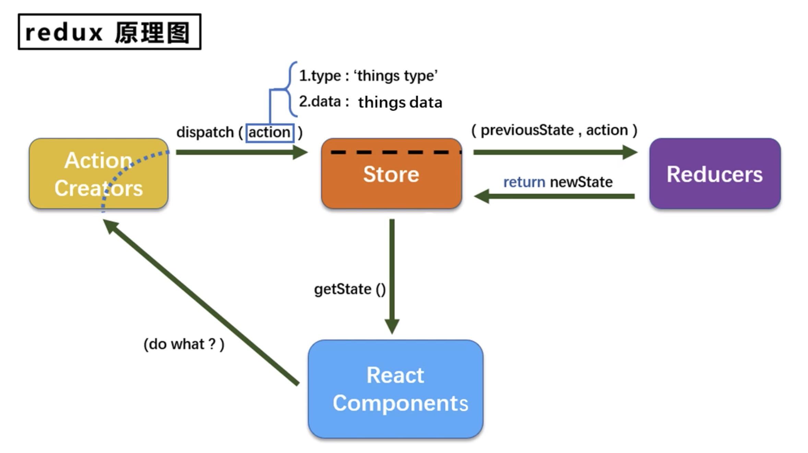
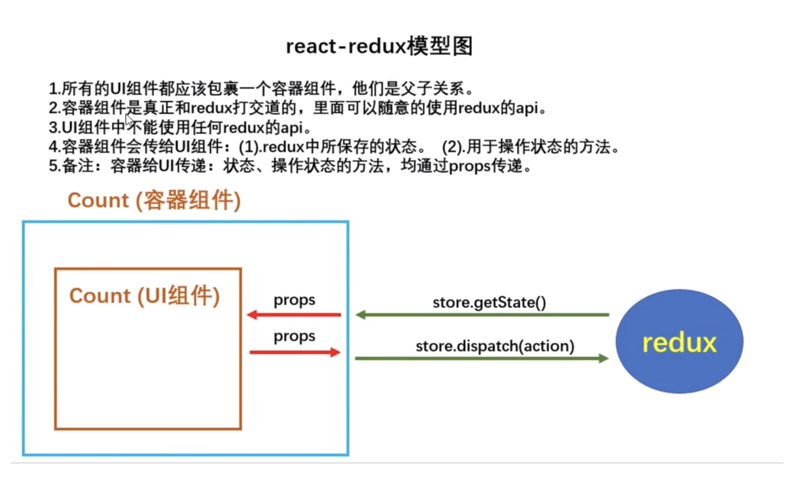

# 技巧相关部分:

### **修改对象中的属性:**   
修改对象中的属性 返回一个新的对象
```js
const newObj = {...this.state.obj, num: 2}
```

<br>

### **父组件: 更新 删除 添加数据的方法**   
我们都是利用更新state中数据, 来驱动页面的显示, 这是中心思想, 所以我们都是对state中的数据 进行更新的操作

下面中的示例中场景:  
子组件向父组件传递数据, 要利用回调 所以要求父组件向子组件传递函数 函数中都是父组件对自己的state的更新的操作

state 换个方式理解 可以理解为 data 配置项 我们定义在data配置项里面的数据 都会被实时监测

<br>

**添加数据:**   
- 获取state中的原数据
- 创建一个新对象, 用于将修改后的新对象覆盖state中的数据  
这里利用了 ...obj 将原来的数据展开, 然后前面放子组件传递过来的数据 (新添加的数据在前面)
- 通过this.setState方法更新数据
```js 
// addTodo用于给state中添加一条信息, 接收的参数是一个todo对象
addTodo = (todoObj) => {

  // 我们要获取state中的数据, 然后将新的对象放入到数据的前面
  const { todos } = this.state

  // 追加一个todos
  const newTodos = [todoObj, ...todos]

  // 更新状态
  this.setState({
    // 用新对象替换掉 state 中的对象
    todos: newTodos
  })
}
```

<br>

**更新(修改)数据:**   
- updateTodo(id, done):  
要修改的id 和 修改的内容

- 首先, 获取state中的原数据
- 然后, 用使map()遍历state中的数据, 拿到item后 判断id 找到要修改的对象 利用[...item, done:done] 对指定对象进行修改
- 最后, 更新state中的数据 用新数据对象 替换 旧数据

```js 
// updateTodo 用于更新一个todos对象
updateTodo = (id, done) => {
  // 这里需要的参数是 改的是谁, done的情况
  
  // 获取状态中的todos
  const {todos} = this.state
  
  -------
  // 这种方式相当于直接修改state中的数据 不行 我们要通过 setState() 来修改才可以 
  todos.forEach((item, index) => {
    if(item.id === id) {
      item[done] = done
    }
  })
  -------

  // 匹配处理数据
  let newTodos = todos.map((item) => {
    if(item.id === id) {
      // 如果匹配上了 我就给你返回一个新的对象, 而且done的值被我改了
      return {...item, done:done}
    } else {

      // 如果没匹配上, 原数据返给你
      return item
    }
  })

  // 更新todos
  this.setState({
    todos: newTodos
  })
}
```

<br>

**删除数据:**   
说是删除 也是创建一个新的对象, 然后用它覆盖掉state中旧的对象
- 获取state中原来的数据
- 使用filter()方法将要删除的数据过滤掉
- 更新state

```js 
// 删除 用于删除一个todo
deleteTodo = (id) => {
  // 获取原来的todos
  const {todos} = this.state

  // 从数组里面删除指定id的元素 我们可以使用数组里面的过滤 比如我们要删除002, 那么我就用filter方法, 将除了002的item返回 那是不是就相当于删除了002
  let newTodos = todos.filter((item) => {
    return item.id !== id
  })

  // 状态更新 驱动页面显示
  this.setState({
    todos: newTodos
  })
}
```

<br>

### **扩展运算符的回顾:**   

**...**   
在es6中是用来展开数组的 连接数组的
```js 
// 展开一个数组
let arr = [1,2,3,4]
console.log(...arr)     1 2 3 4


// 连接两个数组
let arr = [1,2,3]
let arr2 = [4,5,6]

let arr3 = [...arr1, ...arr2]
//  [1, 2, 3, 4, 5, 6]

  
// 函数传参 用于批量的接受参数
function sum(...args) {
  console.log(args)   // [1,2,3,4]

  // 求和
  return args.reduce((tmp, value) => {
    return tmp + value
  }, 0)
}
let res = sum(1,2,3,4)
console.log(res)


// ... 可以应用到对象上么?  所以展开运算符不能展开一个对象
let person = {name: 'sam', age: 18}
console.log(...person)   // 报错 对象上没有可遍历的接口

// 还可以用于复制一个对象, 可以在对象中使用 {...person} 这是可以的
let person = {name: 'tom', age: 18}
let person2 = {...person}


// 复制对象时 修改属性
let person = { name: 'tom', age: 18 }
let person2 = {...person, name: 'erin'}

console.log(person2)
```

<br>


### **form相关的知识点:**   
- 不指定请求方式的时候, form表单默认是get请求  
带的参数默认是query参数 /?是携带qurey参数的一种形式

- 如果表单项中没有name属性, 我们取不到用户输入的数据
```
// 没指定name属性
https://www.baidu.com/?

// 指定了name属性
https://www.baidu.com/?uname=sam&pwd=123
```

- 有 form 的情况下 我们用 onsubmit 事件来提交数据
- 原生form提交后 页面会跳转 或 刷新 数据会置空, 但是ajax不会

<br>

### **高阶函数 函数柯里化:**   
通过函数调用继续返回函数的方式, 实现多次接收参数最后统一处理参数的函数编码形式

```js 
// 需求 求3个数的和
function sum(num1, num2, num3) {
  return num1 + num2 + num3
}

let res = sum(1, 2, 3)
console.log(res)        // 6

// 上面没有用到函数的柯里化


function sum(a) {
  // sum的返回一个函数接收到一个b
  return (b) => {

    // 它继续返回函数接收到一个c
    return (c) => {

      // 这个函数做的统一处理
      return a + b + c
    }
  }
}

let result = sum(1)(2)(3)
console.log(result)


// 我们的案例其实就用到了函数的柯里化技术
saveFormData = (dataType) => {
  return (event) => {
    this.setState({
      [dataType]: event.target.value
    })
  }
}
```

<br>

**React中 事件对象 event 在 return 的内部函数中:**   
因为我们是将 return的函数交给react 所以event会被传到这个函数中

在受控组件的案例中 我们使用了受控组件的形式, 将input中的值取出来放在了state中, 然后从state中做了展示

但是上面的代码还是存在了一些的问题, 我们的案例中只是需要在state中保存uname 和 password, 假如我们的组件是一个注册功能
```js 
<input type="text" name='uname' onChange={this.saveUname}/>

saveUname = () => {}
savePassword = () => {}
```

那是不是说我们还需要定义
- saveUname
- savePassword
- saveTel
- saveMail... 

而其目的就是为了在state中保存一个值?

所以 我们要想办法 定义一个方法, 在这个方法中 写在state中保存数据的逻辑  
定义一个 saveFormData 方法

但是有问题, 我怎么告诉这个方法 我要在state中保存什么? 保存uname? password? tel? 函数能传递参数, 我们可以通过传参的形式 告诉saveFormData我们要保存什么
```html
<input type="text" name='uname' onChange={this.saveFormData('uname')}/>
```

但是又出现了一个新的问题 我们看看有什么问题
```html 
<input type="text" name='uname' onChange={this.saveFormData('uname')}/>
```

**问题1:**   
该函数react会帮我们直接调用 因为 saveFormData后面加了() 直接调用了

<br>

**问题2:**   
由于我们自己传递了参数, saveFormData('uname') 那么我们类中定义的saveFormData方法 接收到的参数就不是 event对象了

因为react在帮我们调用方法的时候会传递event, 但是我们自己传的话参数就是我们自己传递的

<br>

**问题3:**   
而且 ``onChange={this.saveFormData('uname')`` 这种形式的写法, 也会失去效果  

因为这种写法 是将saveFormData()的返回值 交给onchange做为回调 而saveFormData的返回值是undefined 所是react不会帮我们调用undefined 所以就会没效果

从上面总结的问题上来看, 我们只需要让saveFormData返回一个函数就可以了, 这样交给onChange做为回调的就不再是一个函数的返回值, 而是一个函数

```js 
  saveFormData = () => {
    return () => {}
  }

  // 我们通过实参传递进来的参数在外层形参中接收
  saveFormData = (dataType) => {
    return (event) => {
      this.setState({

        // 这里要注意, {}中的属性名其实都是'字符串'类型, 而我们需要读的是dataType这个变量, 所以要加上[]
        [dataType]: event.target.value
      })
    }
  }
```

我们是要在state中添加dataType(我们传递进来的属性名)和值 比如我们传递进来的是 'username' 但是我们如果这么写
```js
  this.setState({
    dataType: event.target.value
  })
```
相当于在 state中保存了 dataType 这个属性名 所以我们要将 dataType 改成 [dataType] 这样才能当变量去找值

<br>

**什么是高阶函数:**   
如果一个函数符合下面2个规范中的任何一个 那么该函数就是高阶函数
- 若A函数 接收的参数是一个函数, 那么A就是高阶函数
- 若A函数 调用的返回值依然是一个函数, 那么A就是高阶函数

<br>

#### 常见的高阶函数有哪些?
- Promise
  ```
  new Promise(() => {})  参数是函数  === > 高阶函数
  setTimeout(() => {})  参数是函数  === > 高阶函数
  ```

- 数组身上常见的方法都是高阶函数 map reduce forEach

<br>

**完整代码:**   
```js 
class Login extends React.Component {
    
  // 初始化状态
  state = {
    uname: '',
    password: ''
  }

  render() {
    
    return (
      <form onSubmit={this.handleSubmit}>
        用户名:<input type="text" name='uname' onChange={this.saveFormData('uname')}/>
        密&emsp;码:<input type="password" name='pwd' onChange={this.saveFormData('password')}/>
        <button>Login</button>
      </form>
    )
  }

  // 保存表单数据到state中
  saveFormData = (dataType) => {
    return (event) => {
      this.setState({
        [dataType] : event.target.value
      })
    }
  }

  handleSubmit = (e) => {
    e.preventDefault()
    const {uname, password} = this.state
    console.log(`您输入的用户名: ${uname}, 您输入的密码是: ${password}`)
  }
}

ReactDOM.render(<Login/>, document.querySelector('#app'))
```

<br>

**不用柯里化的写法:**   
```js
saveFormData = (dataType) => {
  return (event) => {
    this.setState({
      [dataType]: event.target.value
    })
  }
}

// 上面我们提到了 没办法在 saveFormData 方法中同时接到 dataType和event 因为event不是我们自己传递的 我们要用event.target.value得到input的值

// 我们将方法改成这样
saveFormData = (dataType, value) => {
  this.setState({
    [dataType]: value
  })
}

// 那怎么同时接到 dataType 和 input的值呢? 假如能接到那么方法内部就不用return函数了

// 怎么写? 
<input type="text" name='uname' onChange={这里必须交给左边一个函数}/>

onChange={(event) => {}}
// 那就给你一个函数, 而且这个函数是react帮我们调用的 那么这个回调就能收到event

// 那我在这个函数里面是不是可以调用 saveFormData
onChange={(event) => {this.saveFormData('uname', event.target.value)}}
```
以上就完成了不用函数柯里化达到的同样的效果

<br><br>

# React
官网:
```
英文官网: https://reactjs.org/
中文官网: https://react.docschina.org/
```

<br>

### **前言:**   
网页是B/S架构中最重要的信息载体, 用户看到的所有信息都需要在网页中呈现。像商品信息、用户信息、新闻列表等一系列的内容都需要通过网页的形式呈现出来。在传统的网站中用户每点一次链接就会加载出一个新的页面。

比如用户在网站的主页中看到了一个新闻的标题, 点击标题网站会跳转到一个新的页面来展示新闻的具体内容。这样就导致呈现新闻的页面是从服务器中新加载出来的, 新闻和首页是两个完全独立的页面。如果本来两个页面就没有什么太大的关系这么处理当然是没有问题的, 但有些使用场景中却不能这样。

在有些场景中, 用户在网页中发生了一些行为, 比如登录、加购物车、添加删除等操作时, 这些操作的确会使网页发生变化, 但这些变化往往非常细微, 比如购物车图标的产品数量发生了变化, 登录按钮变成了用户头像, 网页中增加或减少了一条数据等。如果仅仅因为这些小的变化就刷新了整个网页是有些划不来的。刷新整个网页一来会增加用户的等待时间, 二来也会增加服务器的压力。于是我们就有了局部刷新网页的技术。

所谓的局部刷新指的是, 当用户和网站发生交互时, 我们不再是简单的直接通过浏览器进行页面的跳转, 而是通过JS中的AJAX直接通过JS向后台服务器发送请求, 请求过程用户毫无感知。响应数据会通过回调函数返回给JS, 而不是直接返回给用户。JS中收到响应数据后, 在根据不同的结果通过DOM来完成对页面的修改。它的优点就是, 请求响应过程是异步的, 用户是无感的, 不会影响用户的其他操作。同时, 通过DOM对页面刷新时只需刷新部分页面无需整体刷新, 提高了访问速度。在服务器端, 服务器只需提供数据接口, 无需考虑页面的渲染, 在降低服务器复杂度的同时也使得服务器压力降低提高了处理请求的速度。

AJAX + DOM使得 **局部刷新** 成为了可能, 但一切似乎并不是那么的完美。发送请求加载数据问题不大, 但数据一旦加载过来问题就出现了。数据并不能直接在网页中显示。

我们需要通过DOM将数据转换为网页的中的各种节点, 这就意味着我们必须反复的操作DOM, 这其中的痛苦实在是一言难尽。

<br>

**问题:**   
一来DOM操作本身十分占用系统资源一不小心就会出现卡顿。  
二来DOM的API十分繁复, 使得各种操作并不十分的优雅。  
换句话说, 服务器的复杂度降低了, 但是前端的复杂度提高了。

于是在前端开发中就急需一个框架来帮助我们解决这个问题, 使我们可以比较轻松的根据不同的数据来快速构建用户界面(UI), 与此同时还要在构建过程中确保其流畅度(不能出现卡顿)。

于是React、Angular、Vue这些前端框架应运而生 *我们操作react 然后react替我们操作dom*

<br>

### **简介:**   
React 是一个用于构建用户界面的 JavaScript 库, 用来为现代的网络构建用户界面。  
React起源于Facebook, 由Facebook的软件工程师 Jordan Walke 开发, 2012年部署于 Instagram, 2013年开源。除此之外, React还有React Native框架, 通过它让我们可以直接使用 JavaScript 来编写原生应用。

<br>

上面说了react是用于构建用户界面(视图)的js库, 用户界面对于前端来说 就是HTML页面 或者专业一些就是构建web应用的

比如我们要在页面上展示一些学生的信息 如果利用js的话 我们大概可能分为3步
- 发送请求 获取数据
- 处理数据(过滤 整理格式)
- 操作DOM呈现页面

之前我们都是通过js jQ来完成将数据展示到页面上, 现在React来帮我们呈现页面 React是一个将数据渲染为HTML视图的开源的js库

*React的核心 你给我数据 我帮你渲染视图*

<br>

如果从 MVC 的角度来看   
React就是视图层的 V 也就是只负责视图的渲染 而并非提供完整的 M 和 C 的功能

```
那是不是说 react就是操作数据 呈现界面的
```

<br>

### 为什么要学?
- 原生js操作dom繁琐, 效率低(DOM-API 操作 UI)
- 使用js直接操作DOM 浏览器会进行大量的重绘重排
- 原生js没有组件化编码方案, 代码复用率低

```js
document.getElementById('app')
document.querySelector('#app')
```

上面的代码上体现的繁琐, 效率低, 因为我们每一次操作DOM浏览器都会重新排列和重新渲染等, 我们之前的模式都使用DOM的API去操作UI

<br>

**模块化:**   
一个大的js文件 按照功能去分成 一个个的小js文件 如果只知道模块化的话只会拆js文件

<br>

**组件化:**   
html / css / js 不仅仅js要拆 结构和样式同样要拆 不仅仅拆这3个 构成这个局部功能的图片啊 字体啊 就是页面展示的一个部分叫做一个组件 这个部分的实现是通过 图片 文字 css html js 共同实现的

<br>

**React的特点:**   
采用组件化模式, 声明式编码, 提高开发效率及组件复用率

**命令式:**   
```
1. 改变页面上一个盒子的样式 通过js或者jq拿到盒子 
2. .style的方式修改样式, 
3. 这就是命令式的编码 少做任何一步都达不到目的
```

<br>

**声明式:**   
```
通过一定的语法, 我们只是表达一下 你应该是蓝色的, 
react就帮助我们操作DOM 将盒子改成蓝色的

我们只需要描述 ui(HTML)看起来是什么样子的 就跟写html页面一样 
react负责渲染ui 并在数据变化的时候更新ui
```

```js
const jsx = (
  <div className="app">
    <h1>Hello, React!  动态变化数据: {count}</h1>
  </div>
)
```

<br>

在 **React Native** 中可以使用React语法进行移动端开发  
我们学完React之后 可以再学习一下React Native 这门技术是让前端人员通过js去编写ios和安卓应用的技术

正常我们编写安卓得用JAVA 编写ios得用OC / swift 同时我们还可以使用 react360 来开发VR技术

<br>

使用虚拟DOM + 优秀的Diffing算法 尽量减少和真实DOM的交互

**虚拟DOM(react元素):**   
```
那react是怎么影响到DOM的呢？react可以说自建了一套DOM系统 我们在对网页进行操作的时候其实操作的是react的自建的DOM系统 然后再由react把我们所有的操作在原生上实现

之前我们使用js jQ都是操作的真实的DOM
虚拟DOM是React操作的DOM 虚拟DOM没有放在页面上而是代码运行的时候放在了内存里
```

<br>

### **Js 和 React 操作数据的区别演示:**   
原生js实现 将数据渲染到页面上 这里我们使用了js操作了DOM元素, 向里面添加内容
 
**操作方式:**   
当我们要往页面上追加元素的时候 我们可以选择 appendChild 方法

两种方法的区别是:  
innerHTML:  我们往里 *添加* 的是 **字符串**   
appendChild:  我们往里 *添加* 的是 **元素节点**   

```html
<ul id="list"></ul>

<script>
  let personArr = [
    {id: '001', name:'鹿晗', age:19},
    {id: '002', name:'李现', age:18}
  ]

  // 创建内容字符串
  let htmlStr = ''
  personArr.forEach((person) => {
    htmlStr =+ `<li>${person.name} - ${person.age}</li>`
  })

  // 这里因为 htmlStr 是字符串 所以我们不能使用 ul.appendChild方法
  document.getElementById('list').innerHTML = htmlStr
</script>


<div id="area"> </div>
<script>
  let per = [
    {id: '001', name:'鹿晗', age:19},
    {id: '002', name:'李现', age:18}
  ]

  let area = document.querySelector("#area")

  per.forEach(item => {
    area.innerHTML += `
      <h3>姓名: <span class="name">${item.name}</span></h3>
      <div id="content">
        <div class="age">${item.age}</div>
      </div>
    `
  })
</script>
```

上面是只有两个人, 假如请求回来的数据是多个, 多了个李翔, 那是不是还要继续遍历 拼接然后插入到页面上, 

但是上面的做法是把原有的页面上的结构用新结构覆盖了吧 鹿晗 李现都被替换掉了 因为是innerHTML 没有一个复用的动作 所以效率很低

比如原来有100个 现在请求回来的数据多了一个 101 可页面上100个人都没有复用上

<br>

### **React高效的原因:**   
- 使用虚拟(virtual)DOM, 不总是直接操作页面真实DOM。
- DOM Diffing算法, 最小化页面重绘。

比如:  
还是 李现 和 鹿晗两个人的数据, react在拿到数据后并没有马上动真实的DOM, 它是把这两个人的数据对应成了2个虚拟DOM 随后将虚拟DOM映射到真实DOM上 当多了一个数据肖战的时候, react还是根据3条数据生成3条虚拟DOM, 

刚才的两条李现和鹿晗的虚拟DOM并没有被React丢弃 原来是2条虚拟DOM 现在是3条虚拟DOM 

随后, React开始在内部进行虚拟DOM的比较, 如果相同的话 就不在生成真实的DOM, 将不同的映射到真实的DOM中, 

相同的 被复用 不同的 虚拟DOM进行比较 不同部分再插入真实的DOM中

<br>

# react的两个版本 与 js文件夹中的文件解析
旧版本: 17  
新版本: 18

```js 
// jsx => js  or  ES6 => ES5  or  模块化
babel.min.js           

// props验证
prop-types.js

// react 核心库
react.development.js       

// react 扩展库 (react帮我们操作DOM)
react-dom.development.js    
```

<br><br>

# React的基本使用

### **js文件在文件中的引入顺序:**   
**首先, 引入 react 核心库**   
```js
// 我们只要用react 就需要引入它
react.development.js
```

**然后, 引入 react-do 用于支持react操作DOM**   
```js
// react-dom是专门用来开发网页的 如果我们开发的是手机app 那我们就不用再引入react-dom了
react-dom.development.js
```

**用于将jsx转为js**   
```
babel.min.js
```

<br>

**下载文件的方式1:**   
网站下载 页面通过script引入
```
react 核心库
https://unpkg.com/react@18.0.0/umd/react.development.js

react dom
https://unpkg.com/react-dom@18.0.0/umd/react-dom.development.js
```

<br>

**下载文件的方式2:**   
通过 npm 来下载 通过 node_modules 来引入
npm i react react-dom

```html 
<div id="app"> </div>
<script 
  src="./node_modules/react/umd/react.development.js"></script>
<script 
  src="./node_modules/react-dom/umd/react-dom.development.js"></script>
<script 
  src="./js/babel.min.js"></script>
```

<br>

### **React 和 ReactDOM 的作用:**   
我们在引入 react核心库 和 扩展库的时候 全局就会多了 *React* 和 *ReactDOM* 两个全局对象 也是两个类哦

我们可以通过 React类提供的方法来创建和操作 *react元素*

<br>

**React.createElement('标签名', {标签属性kv}, '标签内容')**   
**作用:** 创建react元素(虚拟DOM)  

我们创建的 react元素最终会转成DOM元素(通过虚拟DOM) 该方法把 创建元素 添加属性 添加方法 添加内容等柔和为一个方法了 很方便

**参数1:**   
元素名 | 组件名: html元素首字母不能大写

<br>

**参数2:**   
标签属性: 值为对象 可以为空

标签属性中可以有事件:  
当我们通过这个参数为react元素设置事件的时候 需要将事件名修改为 **驼峰命名法**   
  
标签属性中的class:  
要修改为 **className**   

<br>

**参数3:**   
元素的子元素 | 标签体内容

```js 
// 创建一个 react元素 div
const div = React.createElement("div", {
  onClick: () => { console.log(this) }  //  window
}, "我是react创建的div")

console.log(div)

/*
  $$typeof: Symbol(react.element)
  key: null
  props: {children: 'hello'}
  ref: null
  type: "div"
  _owner: null
  _store: {validated: false}
*/

// 如果我们创建的是 DOM元素 应该是这样
<div></div>


// 第三个参数以及以后得参数都是 该react元素的内容 比如上述的就是div中有两个子元素 一个是一句话 一个是一个button
const div = React.createElement(
  "div", 
  {
    onClick: () => { console.log(this) }  //  window
  }, 
  "我是react创建的div", 
  button
)
```

**注意:**   
**在react里面没有修改只有创建和替换**   
reacty元素一旦创建就不能修改 比如我们在加个id属性 不行！ 改不了 一次性的 *只能通过新创建的元素去替换*

```
不让修改的原因是 dom的操作太复杂了 修改样式 属性等api太多了
如果react也保留这些的话 那么react就和dom一样多了 react就是为了简化
```

但是不同担心性能问题 我们操作的是react元素(虚拟DOM) 我们的替换操作并不意味着在页面上真实的发生了

我们前后两次创建了 button 但是react会对比前面两次创建的对象 看看两个对象中发生了变化 它只会改发生变化的部分

```js
const btn = React.createElement("button", {}, "测试按钮")
const root = ReactDOM.createRoot(document.querySelector("#root"))
root.render(btn)

// 需求: 当点击 click 按钮的时候 让测试按钮的文件发生变化
document.querySelector("#test").addEventListener("click", function() {
  // 修改不了 只能创建一个新的去替换
  const btn = React.createElement("button", {}, "修改文字")

  // 再次渲染新的 button
  root.render(btn)
})
```

**注意:** 修改完react元素后必须重新渲染根元素 

<br><br>

### **将创建的 React元素 添加到页面节点中:**   

<br>

*------  react17 开始 ------*

**ReactDOM.render(虚拟DOM, 容器)**   
**挂载**, 将虚拟DOM节点挂载到页面上

此操作是**替换** 并不是追加 render() 会调用1 + n次

<br>

render()  
初始化调用一次 每次页面更新的时候也会调用一次
``` 
ReactDOM.render(VDOM, document.getElementById('app'))
```

<br>

**ReactDOM.unmountComponentAtNode(容器)**   
卸载组件
```js 
ReactDOM.unmountComponentAtNode(document.getElementById('app'))
```

代码示例: 
```html
<di- id="root"> </di- 
<!-- 引入react的核心库等结构 -->
<script src='../js/react.development.js'></script>
<script src="../js/react-dom.development.js"></script>
<script src="../js/babel.min.js"></script>

<!-- 这里要改写成 type='text/babel' -->
<script type='text/babel'>
  const VDOM = <h1>hello, React</h1>
  ReactDOM.render(VDOM, document.getElementById('root'))
</script>
```

*------  react 17 结束 ------*

<br>

*------  react 18 开始 ------*

在 react17 的时候 我们使用的是  
```js
ReactDOM.render(react元素, DOM节点)
```

在18中把上面的方法分成两个方法了 因为我们要渲染的时候 没必要每次都要获取次DOM节点(上面方法的参数2), 减少了操作次数 提升了点性能

<br>

**ReactDOM.createRoot(Css选择器)**   
通过css选择器 根据页面中的dom *创建 react root 元素*   
想让哪个节点为根元素 传哪个节点就可以

react root元素 就是react元素将要被插入的位置 类似 ``<div id=app><div>``

**参数:**   
Css选择器选择的DOM节点

**返回值:**   
react元素

```js
const root = ReactDOM.createRoot(document.querySelector("#root"))
```

<br>

**root.render(React元素)**   
挂载 渲染 向根元素中渲染 react元素(虚拟DOM)

*当调用render渲染页面 react会自动比较两次渲染的元素* 只在真实DOM中更新发生变化的部分

**要点:**   
根元素中的所有内容都会被删除 被我们插入了 react元素 替换  
当重复调用render()时 react会将两次的渲染结果进行比较 它会确保只修改发生变化的元素 确保对DOM做最小的修改

```js
// react元素 div
const div = React.createElement("div", {}, "hello")

// 先创建 react根元素
const root = ReactDOM.createRoot(document.querySelector("#root"))

// 通过react根元素的render方法 渲染react元素
root.render(div)
```

<br>

**root.unmount();**   
卸载

<br>

**总结:**   
- 通过 React 创建react元素
- 通过 ReactDOM 找到(或者说创建)root
- 通过 root 渲染节点

```js
// 创建节点
let node = React.createElement("div", {className: "test"}, "我是react元素")

// 找到(或者说) root
let root = ReactDOM.createRoot(document.getElementById("root"))

// 通过 root 进行挂载
root.render(node)
```

*------  react 18 ------*

<br><br>

# JSX
上面介绍的方法的核心就是用了一个 react 的 一个api 替换掉了 原生js操作dom的方法 
但是替代完了之后 其实并没有简洁多少 所以react提供一种更简洁的方式 JSX

**命令式编程:**   
我们前面说了 React.createElement() 方法 这种方法叫做命令式编程  
通过react语法 告诉react我们要创建什么元素 属性是什么 标签体是什么


**声明式编程:**   
jsx就是声明式编程  
我们可以通过下面的方式 告诉react我想要它 至于怎么创建实现的我不管

在react中可以通过 JSX 来创建react元素

```js
let node = (
  <div>我是一个div</div>
)
```

简单理解就是以结果为导向的编程。*使用JSX将我们所期望的网页结构编写出来, 然后React再根据JSX自动生成JS代码。*所以我们所编写的JSX代码, 最终都会转换为以调用React.createElement()创建元素的代码。

JSX就是React.createElement()的语法糖 他俩是一样的

<br>

**注意:**   
JSX写完了不能直接使用 需要被翻译为js代码 才能被react执行
要在react中使用jsx *必须要引入babel来完成 翻译 工作*

<br>

### **Babel 下载地址**   
作用: 翻译jsx
```
https://unpkg.com/babel-standalone@6/babel.min.js
```

```js
<script type="text/babel">
  ... 在这里编写的代码会被babel进行翻译
</script>
```

<br>

### react17 中 挂载React的方式
```html
<body>
  <div id="root"></div>

  <script type="text/babel">
    const btn = (
      <button>我是一个按钮</button>
    )

    ReactDOM.render(btn, document.querySelector("#root"))
  </script>
</body>
```

<br>

### react18 中 挂载React的方式
```html
<body>
  <div id="root"></div>

  <script type="text/babel">
    const btn = (
      <button>我是一个按钮</button>
    )

    const root = ReactDOM.createRoot(document.querySelector("#root"))
    root.render(btn)
  </script>
</body>
```

<br><br>

# JSX的注意事项
全称 Javascript XML 是react定义的一种类似于 XML 的js扩展语法 js + xml  
本质是 React.createElement(component, props, ...children)方法的*语法糖*

<br>

### **扩展: XML的简单用法**   
XML早期用于存储和传输数据  
比如 我们存个学生, 我们就可以创建下面的样式, 用于传输

```xml
<student>
  <name>TOM</name>
  <age>19</age>
</student>
```

后来我们就不使用xml去存信息了 使用JSON 因为我们真正存储的数据就是 TOM 和 19 但是结构比要存储的内容都要多

JSON
```json
"{"name":"TOM", "age":19}"
```

这样存储起来不是方便了很多么?   
但也不是说xml就完全不用了 微信公总号和开发者公众号打交道 还是使用的XML

<br>

### **JSX的语法规则:**   
**1. JSX不是一个字符串 定义虚拟DOM时, 不要写引号**   
结构可以使用小括号包裹

```js
// 没有引号
const node = (
  <div>节点</div>
)
```

<br>

**2. 在DOM模版中写js表达式时 使用{ }**   
这里要注意表达式和语句的区别, { }里面放的是js表达式 并不是语句

<br>

**3. 如果表达式是 空值 布尔值 undefined 将不会显示**   
null咋会显示呢

**4. 样式的类名指定不要用class 而是要用 className**   
react元素的属性名使用驼峰命名法
``` 
// 有一些特殊的属性名是特殊的写法
label标签的for属性 -- 需要替换成 -- htmlFor
```

<br>

**5. 内联样式要用 对象形式 style={{}}**   
style 必须使用 {} 的形式设置  
style={{key:value}} 的形式去写, 属性名使用驼峰
``` 
添加内联样式的时候 一层{ } 是写表达式
再一层{{ }}是style要求的对象形式
```

 驼峰属性名: "字符串"

```html
<h3 
  className="title" 
  style={{border: "1px solid #212121"}}
>
  React
</h3>
```

<br>

**6. 其他标签属性可以直接写在标签中**   
比如: 事件的话 如果使用 {} 传递一个函数
```jsx
const div = <div id="box" onClick = { () => {} }>
```

<br>

**7. jsx中的标签一定要闭合**   
``<input />``  或者 ``<input></input>``

<br>

**8. jsx中只能有一个根标签**   
当要创建多个标签的时候 我们外层要用一个``<div>``进行包裹

<br>

**9. 标签首字母**   
jsx中标签首字母小写开头:  
则将该标签转为html中同名元素 若html中无同名元素就报错

jsx中组件首字母大写开头:   
react就会去渲染对应的组件, 若组件没有定义 则报错

<br>

### **练习:**   

需求1: 将 你好呀 和 id 是通过变量的形式在读取 而不是写死  
需求2: 给h1应用样式 active  
需求3: 使用内联样式给span添加样式, 文字白色 背景黑色  
需求4: 在``<h1>``的下方添加``<input>``  
需求5: 根据变量渲染结构

```js 
// 标准:
const VDOM = (
  <h1 id='demo'>
    <span>你好呀</span>
  </h1>
)

// 解答1: 虚拟DOM中想使用js表达式 要是 { }
const myData = 'abcdefg'
const myId = 'test'

const VDOM = (
  <h1 id={myId}>
    <span>{myData}</span>
  </h1>
)


// 解答2: 虚拟DOM中想给标签添加class 使用className
const VDOM = (
  <h1 className='active' id={myId}>
    <span>{myData}</span>
  </h1>
)


// 解答3: 在虚拟DOM中使用内联样式 要用{{K:V}} 属性名驼峰  
const VDOM = (
  <h1 className='active' id={myId}>
    <span style={{color:'pink', backgroundColor: 'black'}}>{myData}</span>
  </h1>
)


// 解答4: JSX中只能有一个根元素 使用<div>把多个结构包裹起来
const VDOM = (
  <div>
    <h1 className='active' id={myId}>
      <span style={{color:'pink', backgroundColor: 'black'}}>{myData}</span>
    </h1>
    <input type='text' />
  </div>
)


// 解答5: 这里利用了3元表达式 前后结构使用()进行包裹
render() {
  return (
    this.flag ? (
      <div 
        style={{width: "20px", height: "20px", background: "red"}}
      >
        <h3>我是App组件</h3>
      </div>
    ) : (
      <div>
        <h3>我是默认的</h3>
      </div>
    )
  )
}
```

<br>

**技巧:  利用三元表达式 渲染不同的结构**   
当我们想渲染两个不同的结构的时候 我们可以使用三元表达式的形式的方式

    条件 ? (结构1) : (结构2)

<br>

**Jsx语法的转化过程**   
jsx仅仅是 createElement 方法的语法糖  
jsx语法被 babel插件便以为 createElement方法 最后会再次的被转化为react元素

    jsx - createElement - react元素

<br><br>

# 扩展: 虚拟DOM 和 真实DOM

### **介绍:**   
当我们通过 React 操作DOM时, 比如通过 React.createElement() 创建元素时。我们所创建的元素并不是真正的DOM对象 *而是React元素*。

这一点可以通过在控制台中打印对象来查看。React元素是React应用的最小组成部分, 通过JSX也就是React.createElement()所创建的元素都属于React元素。与浏览器的 DOM 元素不同, React 元素就是一个普通的JS对象, 且创建的开销极小。

<br>

**React元素不是DOM对象, 那为什么可以被添加到页面中去呢？**   
实际上每个React元素都会有一个对应的DOM元素, 对React元素的所有操作, 最终都会转换为对DOM元素操作, 也就是所谓的虚拟DOM。

要理解虚拟DOM, 我们需要先了解它的作用。虚拟DOM就好像我们和真实DOM之间的一个桥梁。有了虚拟DOM, 使得我们无需去操作真实的DOM元素, 只需要对React元素进行操作, 所有操作最终都会映射到真实的DOM元素上。

这不是有点多余吗？直接操作DOM不好吗？为什么要多此一举呢？原因其实很多, 这里简单举几个出来。

首先, *虚拟DOM简化了DOM操作*。凡是用过DOM的都知道Web API到底有多复杂, 各种方法, 各种属性, 数不胜数。查询的、修改的、删除的、添加的等等等等。然而在虚拟DOM将所有的操作都简化为了一种, 那就是创建！

*React元素是不可变对象, 一旦创建就不可更改。要修改元素的唯一方式就是创建一个新的元素去替换旧的元素*, 看起来虽然简单粗暴, 实则却是简化了DOM的操作。

其次, *解决DOM的兼容性问题*。DOM的兼容性是一个历史悠久的问题, 如果使用原生DOM, 总有一些API会遇到兼容性的问题。使用虚拟DOM就完美的避开了这些问题, 所有的操作都是在虚拟DOM上进行的, 而虚拟DOM是没有兼容问题的, 至于原生DOM是否兼容就不需要我们操心了, 全都交给React吧！

最后, 我们手动操作DOM时, 由于无法完全掌握全局DOM情况, 经常会出现不必要的DOM操作, 比如, 本来只需要修改一个子节点, 但却不小心修改了父节点, 导致所有的子节点都被修改。*减少不必要的DOM操作*

效果呈现上可能没有什么问题, 但是性能上确实千差万别, 修改一个节点和修改多个节点对于系统的消耗可是完全不同的。

*每当我们调用root.render()的时候* 页面就会重新渲染 react在虚拟DOM中, 引入了diff算法, *React元素在更新时会通过diff算法和之前的元素进行比较*, 然后只会对DOM做必要的更新来呈现结果。

简单来说, *就是拿新建的元素和旧的元素进行比较*, 只对发生变化的部分对DOM进行更新, 减少DOM的操作, 从而提升了性能。

<br>

### **在diff比较的时候**   
先比较之前之后两份数据的类型  
再比较之前之后里面的内容

<br>

### **特点**   
1. 本质是Object类型的对象(一般对象)
2. 虚拟DOM身上的属性比较少(轻), 真实DOM身上的属性比较多(重) 因为虚拟DOM是react内部在用, 无需真实DOM上那么多的属性 
3. 虚拟DOM最终会被React转化为真实DOM, 从内存中呈现在页面上
```html 
<div id="app"></div>
<div id="demo"></div>

<script type='text/babel'>

  // 虚拟DOM
  const VDOM = (
    <h1>
      <span>hello, react</span>
    </h1>
  )

  // 真实DOM
  const TDOM = $('demo')

  console.log(VDOM)
    // 结果
    // 好多属性了 可以debugger查看一下

  console.log(TDOM)
    // 结果
    // {$$typeof: Symbol(react.element), type: "h1", key: null, ref: null, props: {…}, …}
</script>
```

<br><br>

# DOM的diffing算法
React最大的优势就是 它不是每一次都将页面上的真实DOM做出修改 每一个真实的DOM都是对应一个虚拟DOM(react元素)的

当生成一个新的虚拟DOM树 它会和旧的虚拟DOM树 进行比较, 如果有没有变化的虚拟DOM, 那么页面上这两个虚拟DOM对应的真实DOM是没有任何改变的, 只把新增加的一条映射成新的真实DOM

``` 
虚拟DOM                               真实DOM

// 旧的虚拟DOM树
001对应的虚拟DOM    --- 复用
002对应的虚拟DOM    --- 复用


// 新的虚拟DOM树
001对应的虚拟DOM    --- 复用
002对应的虚拟DOM    --- 复用

003对应的虚拟DOM  -- 对比结果(新)   --- 渲染
```

也就是说 每次更新页面的时候 新的虚拟DOM树都会对上一次(旧)的虚拟DOM树进行对比, 看看有没有不一样的节点, 如果有 那就更新新的节点, 复用没有变化的节点

<br>

**验证上面说的对不对?**   
我们在页面中放3个结构, 结构3是一个定时器来展示的数据, 每秒更新一次  
我们先说下结果 就是 结构1 和 结构2被复用, 而结构3会更新

怎么验证:  
我们在结构2中的文本框中输入文字, 如果 每次文字都消失, 证明input每次都是新的 如果没有消失证明结构2被复用

结果: 文字没有消失

<br>

我们在看看``<span>`` 中的 ``<input>``是被复用还是每次都随着``<span>``更新

结果: 文字没有消失

**疑问:**   
不是说 diffing 算法最小的更新单位是 节点么? 那为什么不连着内部的``<input>``一起更新呢?

<br>

**答案:**   
diffing算法并不是只比较一层, 而是标签内部还有标签的时候 也会对子标签进行 新旧的虚拟DOM树对比, 如果子标签对比结果没有变化 子标签也会复用
```html
<!-- 结构1 -->
<h1>hello</h1>        

<!-- 结构2 -->
<input type="text" /> <br /><br />

<!-- 结构3 -->
<span>
  现在是: {this.state.date.toTimeString()}
  <input type="text" />
</span>
```

<br>

**验证用的代码**   
```js
class Time extends React.Component {

  // 状态里面维护着时间
  state = { date: new Date() }

  // 组件挂载开启定时器 每一次都把最新的时间放进去 state发生改变 页面就会更新
  componentDidMount() {
    setInterval(() => {
      this.setState({
        date: new Date()
      })
    }, 1000)
  }

  render() {
    return (
      <div>
        <h1>hello</h1>

        <input type="text" /> <br /><br />

        <span>
          现在是: {this.state.date.toTimeString()}
          <input type="text" />
        </span>
      </div>
    )
  }
}

ReactDOM.render(<Time />, document.querySelector('#app'))
```

<br>

### **总结:**   
diffing算法是逐层对比 最小的力度是标签

<br><br>

# 经典面试题
1. react / vue 中的key有什么作用? (key的内部原理是什么)
2. 为什么遍历列表的时候, key最好不要用index

<br>

**回答:**   
虚拟DOM中key的作用:  

简单的说:  
key是虚拟DOM对象的标识, 在更新显示的时候 Key起到了及其重要的作用

<br>

详细的说:  
当状态中的数据发生变化的时候, react会根据'新数据'生成'新的虚拟DOM' 随后React进行'新虚拟DOM'与'旧虚拟DOM'的diff比较, 比较规则如下

<br>

旧虚拟DOM中找到了与新虚拟DOM相同的key  
aa: 若虚拟DOM中的内容没有变, 直接使用之前的真实DOM  
bb: 若虚拟DOM中的内容变了, 则生成新的真实DOM 随后替换掉页面中之前的真实DOM

旧虚拟DOM中未找到与新虚拟DOM相同的key  
根据数据创建新的真实DOM 随后渲染到页面

<br>

用index作为key可能会引发的问题 (在数组的前面添加就会出现破坏顺序操作)  
若对数据进行: 逆序添加, 逆序删除等破坏顺序操作  
会产生没有必要的真实DOM更新 --- > 界面效果没问题 但效率低

如果结构中还包含输入类的DOM  
会产生错误DOM更新 --- > 界面有问题

<br>

注意:  
如果不存在对数据的逆序添加 逆序删除等破坏顺序操作  
仅用于渲染列表用于展示, 使用index作为key是没有问题的

开发中如何选择key  
最好使用每条数据的唯一标识作为key(数据的唯一标识就应该是后端给我们处理好的), 比如id 手机号, 身份证号, 学号等唯一值  
如果确定只是简单的展示数据, 用index也是可以的

<br>


### **案例:**   
我们在页面中创建一个列表 然后做一个按钮, 点击后向列表中添加小王的信息
``` 
<h3>展示人物信息</h3>

\ 添加一个小王 \      按钮

-----

小张 18     小王 20  
小李 19     小张 18 

            小李 19 
```

```js
<ul>
  {this.state.persons.map((item, index) => {
    return <li key={index}>{item.name}, {item.age}</li>
  })}
</ul>
```

**注意:**   
我们的key是用的index, 看似页面上正常显示了, 控制台也没有报错, 但是有很严重的问题 有严重的效率问题

慢动作回放 --- 使用index索引值做key

```
初始state数据:
  { id: 1, name: '小张', age: 18 },
  { id: 2, name: '小李', age: 19 }

  ↓

初始的虚拟DOM
  几条数据? 2条, 几条虚拟DOM? 2条, 先遍历的是0 后遍历的是1
  <li key={0}>{小张}, {18}</li>
  <li key={1}>{小李}, {19}</li>

  ↓

将虚拟DOM(初始的)转为真实DOM挂载到页面


更新后的数据
  { id: 3, name: '小王', age: 20 },
  { id: 1, name: '小张', age: 18 },
  { id: 2, name: '小李', age: 19 }
      // 我们点击按钮后 修改了state中的数据 小王在前面了 注意小王的id是数组的长度+1 是3

  ↓

更新数据后的虚拟DOM
  <li key={0}>{小王}, {20}</li>
  <li key={1}>{小张}, {18}</li>
  <li key={2}>{小李}, {19}</li>
      // 因为小王是新遍历的所以小王的index是0 小张1 小李是2

  ↓

旧的虚拟DOM树 和 新的虚拟DOM树进行对比
  <li key={0}>{小张}, {18}</li>     <li key={0}>{小王}, {20}</li>
  <li key={1}>{小李}, {19}</li>     <li key={1}>{小张}, {18}</li>
                                    <li key={2}>{小李}, {19}</li>
```

进行对比  
先在旧的虚拟DOM中去找key=0的, 发现key一样, 则比较内容  
然后 小王(新)因为内容不一样 被挂载到页面上

然后在找key=1的, 发现内容不一样 小张(新)被挂载到页面上
然后在找key=2的, 发现内容不一样 小李(新)被挂载到页面上

这是我们使用index带来的结果, 命名小张 和 小李是可以被复用的, 但是因为我们在数组的前面加入了小王, 原数组的顺序被打乱了 导致index的顺序发生了变化, 导致虚拟DOM因为key和内容都不一样 不能被复用

现在是3条数据, 假如有2000条数据, 我们在数组的前方加入了一条数据, 我们还使用了index作为key, 那么就会导致2000条数据没办法复用

<br>

**解决方式:**   
我们不用index作为key, 而是用数据的唯一标识作为key item.id

<br>

还是上面的案例 我们看下 使用index作为key 引发的渲染数据出错的问题
我们在每一个里面里面 都放一个``<input>``, 然后我们点击添加小王的按钮, 观察下index作为key会发生什么问题
```html
<li key={index}>{item.name}, {item.age} <input type='text' /></li>
```

<br>

**页面展示信息:**   
``` 
\ 添加小王 \

index作为key
小张, 18      \input  小张, 18 \
小李, 19      \input  小李, 19 \


id作为key
小张, 18      \input  小张, 18 \
小李, 19      \input  小李, 19 \

------

点击按钮后

index作为key
小王, 20      \input  小张, 18 \
小张, 18      \input  小李, 19 \
小李, 19      \input  空       \


id作为key
小王, 20      \input  空       \
小张, 18      \input  小张, 18 \
小李, 19      \input  小李, 19 \


使用index作为key的数据串了, id作为key的数据没有乱
```

**总结:**   
一旦结构中出现输入类的DOM节点的时候, 使用index作为key 会产生数据错乱

<br><br>

# React的小练习
动态创建一个框体, 里面显示标题和ul列表

**代码部分:**   
```js 
// 标题
let title = '前端js框架列表'

// 数据
let list = ['Angula', 'React', 'Vue']

// 创建虚拟DOM
const VDON = (
  // 在jsx中对虚拟DOM加样式, 需要使用className
  <div className='box'>

    // 在jsx中使用变量或者表达式需要使用{ }
    <h3>{title}</h3>
    <ul>
      {
        // 这里只能写表达式, 而不能写语句 我们在这里对list数组中的值进行加工 我们选择使用map方法
        list.map((item, index) => {
          return <li key={index}>{item}</li>
        })
      }
    </ul>
  </div>
)


// react17
ReactDOM.render(VDOM, document.query("#root"))

// react18
const root = ReactDOM.createRoot(document.querySelector("#root"))
root.render(VDOM)
```

<br>

### **要点:**   

**1. 在jsx中想使用变量都需要使用{ }括起来**   
{ 这里只能是表达式 不能是语句 }

<br>

**2. 表达式 和 语句的区别**   
一定注意区别 [js语句(代码)] 与 [js表达式]

**表达式:**   
一个表达式会产生一个值 可以放在任何一个需要值的地方

**下面这些都是表达式:**   
```
a
我们可以理解为a是一个变量名 我们在取变量a的值

a+b

demo(1)   
函数调用表达式

arr.map()

function test() {}
这个函数也有返回值 返回值是函数本身
```

总结: 在上面这些值的左边 定义一个const x = 能接到值的就是表达式

<br>

**下面这些都是语句:**   
```
if() { }

for() { }

switch() { }
```

<br>

**3. 在对节点或者数据进行遍历的时候我们要在DOM结构中 *使用KEY确保唯一值***   
```js 
list.map((item, index) => {
  return <li key={index}>{item}</li>
})
```

<br>

**4. react会自动帮我们遍历数组, 但是不能遍历对象**   
也就是说我们基于这点 所以使用 map 将数据整理成 如下样式 然后利用jsx的特点 自动将数组中的元素 显示在页面中
```jsx
let list = ['Angula', 'React', 'Vue']
<ul>
  {list}    // 结果: AngulaReactVue
</ul>


// 利用 map 将 ['Angula', 'React', 'Vue'] 整理为
// [<li>Angula</li>, <li>React</li>]
```

<br>

**5. react在遍历数组的时候 需要指定 key**   
当我们在jsx中显示数组中 数组中每一个元素都需要设置一个唯一key

**原因:**   
重新渲染页面时 react会*按照顺序*依次比较对应的元素 当渲染一个列表时   
如果不指定key同样也会按照顺序进行比较   
如果列表的顺序永远不发生变化 那没有问题   
*如果列表的顺序会发生变化 就会导致性能问题*

``` 
  比如我们我们在 数组前面追加新数据 就会导致之前之后的项对比的时候都不一样 所有的dom结构都会更新
```

为了解决上面的问题 react为列表设计了一个key值 key值的作用相当于id 只是无法再页面中查看 *当设置key以后 再比较元素的时候 就会比较相同的key的元素* 不再按照顺序


**注意:**   
key值在当前列表中唯一即可  
在开发中一般会采用数组的id作为key  
尽量不要用元素的index作为key 因为在数据前面添加数据的时候(索引会跟着元素的顺序的改变而改变)index 会发生变化

当元素的顺序不会发生变化的时候 用index作为key是没问题的

<br>

**6. {} 只能用来放js表达式 而不能放语句(if) 但在语句中是可以用jsx{}表达式的**   
```js
// 我们可以用if语句 来给div赋值不同的结构
let div
let lang = "en"
let name = "孙悟空"

if(lang == "en") {
  div = <div>hello, {name}</div>
} else if(lang == "cn") {
  div = <div>你好, {name}</div>
}
```

<br><br>

# jsx的条件渲染

**场景**   
我们请求数据的时候 会有一段的时间 在这段时间里为了正在用户体验我们可以定义加载动画效果 当请求数据回来后 结束loading动画 展示数据

<br>

**技巧:**   
我们都会在render函数中渲染结构 当结构比较复杂的时候 我们也可以定义方法将结构封装到方法里面 然后在render中调用

<br>

**方式:**   
```js 
state = {
  isLoading: true,
  data: []
}

course = ["Vue", "React"]

componentDidMount() {
  setTimeout(() => {
    this.setState({
      data: this.course,
      isLoading: false
    })
  }, 2000)
}

---

// if方式
const loadingData = () => {
  if(isLoading) {
    return (<div>数据加载中, 请稍后...</div>)
  }

  // 一旦符合上面的条件 因为有return 下面的就不会执行了
  return (
    <div>
      数据加载完成后, 此处显示加载后的数据
    </div>
  )
}

const VDOM = (
  <div>
    // 我们在render()函数中 可以调用方法
    { this.loadingData() }
  </div>
)

// 条件 ? (结构1) : (结构2) 方式
const loadingData = () => {
  return loading 
    ? (<div>数据加载中, 请稍后...</div>) 
    : (<div>数据加载完成后, 此处显示加载后的数据</div>)
}


export default class App extends Component {

  isLoading = false
  list = ['Angula', 'React', 'Vue']

  loadingData = () => {
    if(this.isLoading) {
      return (
        // 这里只渲染的li
        this.list.map((item,index) => {
          return (
            <li key={index}>{item}</li>
          )
        })
      )
    } else {
      return (<div>数据正在加载中...</div>)
    }
  }

  render() {
    return (
      <ul>
        {
          this.loadingData()
        }
      </ul>
    )
  }
}

// ---- 方式3 下面的方式适合 要么展示要么隐藏的情况

return isLoading && (<div>数据加载中, 请稍后...</div>)

// 它只能达到一种效果 当isLoading为true的时候展示数据加载中 但是没有办法在isLoading为false的时候展示另一种样式
```

**总结:**   
在类的方法中 和 render 中要是想使用变量或者方法的话 *都要通过this*

<br><br>

# 模块与组件, 模块化与组件化的理解
组件是react的一等公民 使用react就是在用组件  
组件标识页面中的部分功能 组合多个组件实现完整的页面功能

**特点:**   
可复用 独立 可组合 跟拼乐高似的

<br>

1. 模块 理解:   
向外提供特定功能的js程序, 一般就是一个js文件  
为什么要拆成模块, 随着业务逻辑的增加, 代码越来越多且复杂, 复用js 简化js的编写, 提供js的运行效率

2. 组件 理解: 
用来实现局部功能效果的代码和资源的集合(html css js image等)  
一个页面的功能更复杂 复用编码 简化项目编码 提高运行效率

3. 模块化  
当应用的js都以模块来编写, 这个应用就是一个模块化的应用

4. 组件化  
当应用是以多组件的方式实现, 这个应用就是一个组件化的应用

<br><br>

# 手动创建 React 项目(下面讲的是函数式编程)
我们用 npm 管理的项目 不能直接在浏览器端运行  
在我们把项目在最终交给浏览器之前必须经过打包工具 进行打包 打包之后项目才能在浏览器中进行使用

所以在这个手动的 React 项目中 我们要使用 webpack 作为打包工具来对react项目进行打包

所以我们在使用npm管理我们项目的同时 还要使用webpack 但是我们一点点的去配置webpack那么又会很麻烦 所以 react 给我们提供了一个包

<br>

**react-scripts:**   
提供了项目开发中的大部分依赖 大大的简化了项目的开发 它把包括webpack babel 测试框架 都在这个包里面集成了 有了这个包相当于我们有了react给我们自动配置好的webpack 直接用(一行webpack的配置都不用写)

<br>

**webpack主要对项目来说有两个功能:**   
1. 打包 将打包后的文件可以部署到服务器上
2. 它可以给我们提供测试服务器 devServer

<br>

**安装依赖**   
```
npm i react react-dom react-scripts
```

```json
"dependencies": {
  "react": "^18.1.0",
  "react-dom": "^18.1.0",
  "react-scripts": "^5.0.1"
}
```

<br>

**react-script 约定的项目结构:**   
必须用人家用的结构
```
| - 根目录
  | - public
    - index.html (添加标签 <div id="root">)

  | - src
    - App.js
    - index.js
```

**public:**   
里面放供外部访问的资源 比如静态图片 css js 不需要webpack打包的文件 都放在这里
index.html是必须的 它会作为我们首页的模版

<br>

**src:**   
源码目录 index.js 入口文件

<br>

*------  react 17 ------*
```js
import React from "react"
import ReactDOM from "react-dom"

import App from "./App.js"

ReactDOM.render(<App/>, document.querySelector("#root"))
```
*------  react 17 ------*

<br>

*------  react 18 ------*   

**要点:**   
在react18中 react把ReactDOM 分为两个部分

**<font color="#C2185B">react-dom/client 在浏览器渲染页面的库</font>**   
**<font color="#C2185B">react-dom/server 在服务器渲染页面的库</font>**   

这里我们希望是在浏览器端渲染 
所以我们要加载的是 react-dom/client 这里也是跟 react17 中不同的地方 

引入入口文件里面没有引入react
``` 
后面我们使用服务器端的react 那么我们就要加载 react-dom/server
如果我们只引入 react-dom 页面会报错
```

```js
// 引入 ReactDOM
import ReactDOM from "react-dom/client"

const App = (
  <div>
    <h1>这是一个React项目</h1>
    <p>我终于有了第一个React项目</p>
  </div>
)

// 获取根容器
const root = ReactDOM.createRoot(document.querySelector("#root"))
// 将App渲染到根容器
root.render(App)
```
*------  react 18 ------*


因为这里我们需要使用 react-scripts 库 不是脚手架 所以我们没办法通过 npm run start 来启动项目

通过 npm 管理的项目 必须通过webpack进行打包 打包后才能在浏览器上运行 而打包这个动作 已经在 react-scripts 库中处理好了 我们需要通过 以下的命令 来进行打包

```
npx react-scripts build
```

当我们执行这个命令后 它自动会调用webpack进行打包

```json
// 输入命令后 选择 y 会自动往package.json中添加 兼容性配置
"browserslist": {
  "production": [
    ">0.2%",
    "not dead",
    "not op_mini all"
  ],
  "development": [
    "last 1 chrome version",
    "last 1 firefox version",
    "last 1 safari version"
  ]
}
```

打包后 我们的项目中就会多了一个 build 文件夹

<br>

**访问 打包后的index.html文件**   
然后我们在 build 文件夹里 启动 index.html 就可以访问了

**问题:**   
```html
<!doctype html><html lang="en"><head><meta charset="UTF-8"><meta http-equiv="X-UA-Compatible" content="IE=edge"><meta name="viewport" content="width=device-width,initial-scale=1"><title>Document</title><script defer="defer" src="/static/js/main.ff653062.js"></script></head><body><div id="root"></div></body></html>
```

**js引入的部分的路径是:**   
```
src="/static/js/main.ff653062.js"
```

我们发现页面是空白的状态 我们现在访问的方式是通过vscode内置的服务器访问的 也就是我们的网页会被部署到vscode的内置服务器

但是正常来说我们的代码应该部署到真正的服务器上 所以上面的路径是有问题的
```
/static/js/main.ff653062.js
```

/ 表示 根目录 就是说我们的build里面的东西应该部署到服务器的根目录中 现在我们没有部署到根目录 所以路径出了问题

修改方式: 前面加个. 
```
./static/js/main.ff653062.js
```

<br>

**开发过程中 访问 html 页面内容:**   
```
npx react-scripts start
```
启动webpack的内置的测试服务器 供我们在开发阶段进行调试  
所有的项目开发完了 我们再通过 build 命令打包将项目部署到真正的服务器上

<br>

**整理到package.json里面:**   
```json
"scripts": {
  "test": "echo \"Error: no test specified\" && exit 1",
  "start": "react-scripts start",
  "build": "react-scripts build"
},

// 配置 eslint 简单代码是否符合 react 的语法规范
"eslintConfig": {
  "extends": [
    "react-app"
  ]
}
```

<br><br>

# 使用脚手架创建 React 项目
我们使用vue 和 react创建的页面叫做 SPA应用, 所以就是一个index.html文件

**使用方式:**   
**1. 全局安装(create-react-app这个库)**   
```
npm i -g create-react-app
```

**注意:**   
现在官网建议 删除全局安装的 react脚手架
```
npm uninstall -g create-react-app
```

然后使用 以下命令安装 react
```
npx create-react-app my-app 
```

通过上述命令安装的 react 是最新的 目前最新版本为:
```
"react": "^18.2.0",
"react-dom": "^18.2.0",
```

我们这套课程使用的  
旧版本为:
```
"react": "^16.8.0",
"react-dom": "^16.8.0",
```

新版本为:
```
"react": "^17.0.1",
"react-dom": "^17.0.1",
```

17版本 和 18版本之间好像没有太大的区别

<br>

**2. create-react-app 项目名 创建项目**   
脚手架是基于webpack搭建  
项目的整体技术架构为 react + webpack + es6 + eslint

使用脚手架开发的项目的特点: 模块化, 组件化, 工程化

在项目中用了webpack这种构建工具 我们写了一段代码 它能帮我们进行语法检查 压缩 兼容性处理 语法转换等等一系列自动的东西 我们就可以称之为工程化的项目

一条龙服务 代码写完了 剩下的流程自动走下去 编译 压缩等 那就是工程化的项目就像汽车的生产线 批量的生产汽车的这种

<br>

**项目文件的目录结构:**   
```js
// 依赖存放的位置
| - node_modules  

// 一般存放静态资源文件, 页面 样式 js不在这里
| - public        
  - favicon.icon ------ 网站页签图标
  - index.html -------- 主页面(用于承装各个组件)
  - logo192.png ------- logo图
  - logo512.png ------- logo图
  - manifest.json ----- 应用加壳的配置文件
  - robots.txt -------- 爬虫协议文件
```

```js
public 解释说明

index.html:
里面有很多多余的东西 我们可以删删

  // 引入网站页签图标
  // %PUBLIC_URL%: react脚手架的关键词的写法 代表public文件夹的路径 功能类似 别名
  <link rel="icon" href="%PUBLIC_URL%/favicon.ico" />
 
  // 用于配置浏览器页签 + 地址栏的颜色 这个配置只针对安卓手机浏览器 ios不可以 开发里面很少用 兼容性不是很好
  <meta name="theme-color" content="#000000" />

  // 描述网站信息的 搜索引擎在收入网站的时候 会看这里面的描述
  <meta
    name="description"
    content="Web site created using create-react-app"
  />

  // 当我们把网页 添加到主屏幕 网站在屏幕上用什么图标 受下面的控制 只支持苹果手机
  <link rel="apple-touch-icon" href="%PUBLIC_URL%/logo192.png" />


  // 应用加壳的配置文件
  /*
    对于一个手机应用来说 我们要配置应用名字 图标 访问权限 如果是应用加壳在下面的json文件里配置相关信息

    应用加壳: 
    
    前端人员写出的代码都要放在浏览器端运行 都是html文件 因为浏览器只认识js css html

    应用加壳又是什么意思? 我们按照手机的布局去写一些页面(html), 我在写完的页面上套一个安卓的壳 我们写的网站就会变成安卓手机的应用

    安卓手机上的安装包都是apk吧, 我们要是想开发安卓的手机应用必须学java, 要想开发ios应用必须用OC 或者 Swift

    就是假如我们想做客户端开发(我们属于web人员), 就要学java 和 OC等技术

    如果我们会了应用加壳技术, 我们就在写好的html页面上面加一个壳 就能生成一个.apk文件 就可以安装在安卓手机上 用户点击图标的时候其实打开了一个壳 壳里面内嵌了一个网页

    一些简单的应用可以这么做, 先找前端人员写页面, 页面写好了再套壳 加一个安卓的壳就变成安卓应用 加一个ios的壳就是ios应用
  */
  
  <link rel="manifest" href="%PUBLIC_URL%/manifest.json" />

// 爬虫协议文件, 在别人爬取我们的页面的时候, 可以定一些规矩 什么东西能爬 什么东西不能爬
robots.txt
```

```js
| - src         // 源码文件夹
  - App.css -------- App组件的样式
  - App.js --------- App组件

  - App.test.js ---- 用于给App做测试
  - index.css ------ 样式
  - index.js ------- 入口文件
  - logo.svg ------- logo图

  - reportWebVitals.js
  - 	--- 页面性能分析文件(需要web-vitals库的支持)

  - setupTests.js
    ---- 组件单元测试的文件(需要jest-dom库的支持)
```

```js 
// src 解释说明

// App是创建的组件, 名字叫做App

App.js 里面
  import 导入依赖
  export default App  导出App组件


App.test.js
  做测试用的 专门用于App 几乎不用


index.css
  通用性样式, 可以让如public文件夹中 引入index.html文件


index.js
  入口js文件  
  之前是在html文件里面引入核心库等js文件 现在是在入口文件中做操作 这里就相当于在html文件里面引入的操作

  import React from 'react';
  import ReactDOM from 'react-dom';
  import './index.css';

  // 引入App组件
  import App from './App';


  // reportWebVitals.js文件用于记录页面的性能 实现了一些页面的性能上的检测, 想要使用也要进行各种配置
  import reportWebVitals from './reportWebVitals';

  ReactDOM.render(

    // 为什么app的外侧要包裹 <React.StrictMode> 它会检查App和App内的子组件写的是否合理 比如 react的ref字符串类型的方式不推荐使用 它也会提出警告
    <React.StrictMode>
      <App />
    </React.StrictMode>,

    document.getElementById('root')
  );

  reportWebVitals();


reportWebVitals.js
  文件用于记录页面的性能 实现了一些页面的性能上的检测, 想要使用也要进行各种配置


setupTests.js
  用来做应用的整体测试的 模块拼在一起的单元测试 它是做组件测试的里面也应用了第三方的库做支持


我们只把一个组件放到 <div id='root'> 容器里面 就是App
其它组件作为App组件的子组件
```


**文件的执行顺序**   
页面启动之后, 会先来到src文件夹下的index.js 当看到``<App>``组件要渲染到root容器的时候, 就会去public里面找index.html文件中的root

但是 index.js 也没有被引入 index.html 里面啊 那是因为底层有webpack做支持

<br>

上面的完成后``<App>``组件就跑到了页面上, ``<App>``组件的样式, 是在App.js文件中通过import 引入的css文件

<br>

### React18版本的入口文字书写方式:
注意: 我们引入的是" react-dom/client"

```js
import React from "react"
import ReactDOM from "react-dom/client"
import App from "./App"

const root = ReactDOM.createRoot(document.querySelector("#root"))
root.render(<App />)


// 脚手架自带的模版
import React from 'react';
import ReactDOM from 'react-dom/client';
import './index.css';
import App from './App';
import reportWebVitals from './reportWebVitals';

const root = ReactDOM.createRoot(document.getElementById('root'));
root.render(
  <React.StrictMode>
    <App />
  </React.StrictMode>
);

// If you want to start measuring performance in your app, pass a function
// to log results (for example: reportWebVitals(console.log))
// or send to an analytics endpoint. Learn more: https://bit.ly/CRA-vitals
reportWebVitals();

```

<br><br>

# npx知识扩展
在没有npx的时候 我们想要使用react脚手架 需要先全局安装脚手架 然后通过create-react-app命令来创建项目

但是这个全局的包如果长时间不用放在那边是没有任何意义的 所以有了npx命令 有了npx 无需安装脚手架包 就可以直接使用这个包提供的命令

```
npx create-react-app 项目名
```


也可以使用如下命令 但是不推荐
```
npm init react-app 项目名初始化项目
```

<br><br>

# 图片的引入方式
一切皆模块
```js
import logo from "./logo.svg"
```

<br><br>

# 整理脚手架中的目录结构:
我们把脚手架自带的文字整理到了一个文件夹中, 我们自己创建这两个文件夹 自己在里面写文件
```
| - public
  - index.html  主页面


| - src
  | - components
  因为index.js app.js是上层文件 我们将子组件都放在这里面 每一个组件单独建立文件夹

  - index.js  
  入口文件 (相当于在html页面里面引入js文件的步骤)

  - App.js
```

```js
// 入口文件中需要做的事情
import React from 'react'
import ReactDOM from 'react-dom'

// 引入组件
import App from './App'

// 渲染App组件到页面
ReactDOM.render(<App/>, document.querySelector('#root'))
```

```js
// App组件中要做的事情

// 创建根组件 父组件
import React from 'react'

// 因为我们要继承 React.Component 所以这个文件中也要引入 React
class App extends React.Component {
  render() {
    return (
      <div>
        hello.react
      </div>
    )
  }
}

export default App  


// 这个文件的另一种写法
import React from 'react'
const {Component} = React

// 还可以这么写, react这个文件里面用了多种暴露的形式, 单独暴露和默认暴露
import React, {Component} from 'react'
import Hello from './Hello'

// 直接暴露出去 创建并暴露
export default class App extends Component {
  render() {
    return (
      <div>
        {// 这里不直接放 hello.react 也是将hello, react也作为一个组件}
        <Hello />
      </div>
    )
  }
}


// 定义Hello组件
export default function Hello() {
  return (
    <h3>hellow, react</h3>
  ) 
}
```


接下来 我要给 Hello组件 里面的文字加上css样式  
首先在 components文件夹中 创建css样式  
然后在 Hello.js组件中 使用 import './Hello.css' 引入css文件
```js
import './Hello.css'

export default function Hello() {
  return (
    <h3 className='title'>hellow, react</h3>
  ) 
}
```

```js 
// Welcome组件

import React from 'react'
import './Welcome.css'        // css文件必须在上方引入

const {Component} = React

export default class Welcome extends Component {
  render() {
    return (
      <h3 className='demo'>
        Welcome
      </h3>
    )
  }
}
```

<br>

**总结:**   
- import '.css' 必须放在上面 css样式的样式名不能重复  
因为所有的css样式都会汇总到App组件里面, 就会发生 下面的同名样式会将上面的样式覆盖掉, 为了避免这种情况的发生 我们会将样式模块化

- react中 js文件 和 jsx文件都是可以不写后缀的  
因为所有的js文件都是以.js结尾的 这样我们没有办法分清楚 什么是组件, 什么是单纯的js文件

解决办法: 组件名大写 or 组件的.js 改成 .jsx

- 我们在App组件中引入其它组件的时候  
  ```js
  import Hello from './components/Hello/Hello'
  import Welcome from './components/Welcome/Welcome'
  ```

我们写了/Hello/Hello /Welcome/Welcome 这样会比较麻烦 所以我们还可以这样, 都将子组件的js文件改成index, 这样react连index都不用写
``` 
| - components
  | - Hello
    - index.js
    - index.css
```
```js
// 这样就能找到子组件文件夹下面的index.js文件
import Welcome from './components/Welcome' 
```

<br>

# React中的scss
react中默认支持scss 只需要下载就可以
```
npm install --save node-sass
```

<br>

# 样式的模块化 - 解决样式覆盖的情况
上面的案例中 我们发现, 子组件中的css文件里, 类名不能重复

因为所有的css样式都会汇总到App组件里面, 就会发生 下面的同名样式会将上面的样式覆盖掉, 为了避免这种情况的发生 我们会将样式模块化


### **解决方式1:**   
使用less 嵌套的话 就不会出现同名覆盖的问题

<br>

### **解决方式2:样式的模块化**   
我们把index.css文件名 改成 index.module.css
``` 
index.css   --- >   index.module.css
```

我们在组件的js文件中 使用导入模块的方式导入css文件 这样所有hello相当的样式都会保存在hello对象里面
```js
import hello from './index.module.css'

// 下面使用样式的方式是 hello.title的形式
export default class Welcome extends Component {
  render() {
    return (
      {/*这里使用 样式模块.样式名的方式使用样式*/}
      <h3 className={hello.title}>
        Welcome
      </h3>
    )
  }
}
```

<br>

# 案例: 学习记录器

**html结构**   
```js
// 引入 ReactDOM
import ReactDOM from "react-dom/client"

const App = (
  <div className="logs">
    <div className="item">
      <div className="date">
        <div className="month">5月</div>
        <div className="day">23日</div>
      </div>

      <div className="content">
        <h2 className="desc">React</h2>
        <div className="time">1小时</div>
      </div>
    </div>
  </div>
)

// 获取根容器
const root = ReactDOM.createRoot(document.getElementById("root"))
// 将App渲染到根容器
root.render(App)
```

**style结构:**   
1. import "./index.css"

如果写成 import "index.css" 会被当成模块处理 会报找不到模块的错误  
**在引入样式 图片 资源的时候 我们要以 ./ 开头**   

<br>

# 组件的创建

**什么是组件**   
在React中网页被拆分为了一个一个组件, *组件是独立可复用的代码片段*。具体来说, 组件可能是页面中的一个按钮, 一个对话框, 一个弹出层等。React中定义组件的方式有两种: 基于函数的组件和基于类的组件。

本节我们先看看基于函数的组件。  

一个组件里应该包括 结构, 样式, 交互, 资源(html css js img...)  
react中组件有两种创建方式 函数式组件 和 类组件

<br>

# 函数式组件
函数组件就是一个返回 JSX 的普通函数

**约定1:**   
使用函数的方式(函数名首字母大写)创建组件 函数名就是组件标签名  
函数会被React调用 所以函数内部必须使用return 将虚拟DOM暴露出去 

<br>

**约定2:**   
函数组件必须有返回值 表示该组件的结构(JSX的DOM结构)  

<br>

**约定3:**   
如果我们返回的是null 表示不渲染任何内容

<br>


接下来我们创建函数组件 将组件渲染到页面中

*------  react17 ------*
```js
// 创建函数组件
function Demo() {
  return (
    <h2>
      我是用函数定义的组件(适用于简单的组件的定义)
    </h2>
  )

  // 或者

  return null
}

// 将组件渲染到页面
ReactDOM.render(<Demo />, app)


// 箭头函数的形式: 返回一个结构 + 函数名大写 就是函数式组件
const Hello = () => <h2>我是用函数定义的组件</h2>
```
*------  react17 ------*

<br>

*------  react18 ------*

```js
// App组件
import Item from "./components/item"

const App = () => (
  <div className="logs">
    <Item />
  </div>
)

export default App


// Item组件
const Item = () => (
  <div className="item">
    <div className="date">
      <div className="month">5月</div>
      <div className="day">23</div>
    </div>

    <div className="content">
      <h2 className="desc">React</h2>
      <div className="time">1小时</div>
    </div>
  </div>
)

export default Item


// 入口index.js文件
// 引入 ReactDOM
import ReactDOM from "react-dom/client"
import App from "./App"
import "./index.css"

// 获取根容器
const root = ReactDOM.createRoot(document.getElementById("root"))
// 将App渲染到根容器 渲染组件的时候 指定的是标签名的形式
root.render(<App />)

```

*------  react18 ------*

<br>

### **函数式组件中的特点:**   

**1. 函数组件中的this为undefined**   
正常我们直接在Demo函数中打印 this 应该是window 但是输入结果却是undefined
```js
function Demo() {
  console.log("Demo", this) // undefined

  return (
    <div>
      <h3>Demo组件</h3>
    </div>
  )
}
```

**原因:**   
因为 我们的代码要经过 babel 的翻译 (type="text/babel") 

babel在翻译完下面的东西后会开启严格模式 *严格模式中禁止 自定义的函数中的this 指向window 所以undefined*

<br>

**类和模块的内部, 默认就是严格模式, 考虑到未来所有的代码, 其实都是运行在模块之中, 所以 ES6 实际上把整个语言升级到了严格模式**   

<br>

### **执行了 ReactDOM.render(&lt;Demo /&gt;, app)之后发生了什么?**   
react会解析组件标签, 找到Demo组件  
发现组件是使用函数定义的, 随后调用该函数 将返回的虚拟DOM转为真实DOM 随后呈现在页面上


**注意:**   
1. 函数名首字母必须大写
2. 函数名必须使用标签形式
3. react中组件必须闭合
4. 组件的写法是 <Demo />


<br><br>

# 类式组件
顾名思义 通过创建类的方式创建一个组件 class的方式

**要点:**   
使用类创建一个组件必须要继承 React.Component 继承就就相当于将Component类中的代码复制到当前类了 Component中是有类组件的基础代码

**1. 类组件必须 使用 extends继承 React.Component**   
类组件应该继承 React.Component 父类 从而可以使用父类中提供的方法或属性

<br>

**2. 类组件的类名首字母要大写**   

<br>

**3. 内部必须写render() 且有返回值 返回值为JSX(结构)**   

```js
// App组件 下面的两种方式都可以
import React from "react"
import React, {Component} from "react"

class Demo extends React.Component {
class Demo extends Component {
    
  // 这个render 是用在Demo的原型对象上 供实例使用
  render() {

    // render中的this 是组件实例对象(new Demo出来的实例)
    console.log(this)

    return (
      <h3>我是类创建的组件</h3>
    )
  }
}
```

<br>

**4. 类组件中的render中的 this 为组件实例对象**   

<br>

### **类组件的 ReactDOM.render(&lt;Demo /&gt;) 做了什么**   
1. react解析组件标签, 找到了Demo组件
2. 发现组件是使用类定义的 随后new出来该类的实例(Demo类), 并通过该实例调用到原型上的render方法
3. 将render返回的虚拟DOM转为真实DOM 随后呈现在页面中

<br><br>

# 简单组件 复杂组件
如果我们的组件是 有状态(state)的 就是 复杂组件   
如果我们的组件是 没有状态的 就是简单组件(简单组件适合使用函数的方式创建)

<br><br>

# State(存放数据)
组件实例的三大核心属性之一

state: 状态   
*state是组件实例对象最重要的属性*, 值是对象(可以包含多个kv组合)
```js
state = {
  k: v
}
```

组件被称为状态机, 通过更新组件的state来更新对应的页面显示(重新渲染组件)

<br>

**<font color="#C2185B">React中的核心概念 状态驱动页面的变化</font>**   
之前我们说过学了react就把数据交给state 它会拿着数据 生成虚拟DOM 进而生成真实DOM  
相当于 Vue 中的 data data中发生了变化 页面就会更新

```
数据 -- 虚拟DOM -- 真实DOM
```

上面的数据不能随便的放 我们需要把数据放在指定位置(把数据放在 *状态* 里) *组件的状态里面存放着数据 数据的改变就会驱动页面的展示*

*状态就是数据 是组件内部私有数据 只能在组件内部使用*
state的值是一个对象 表示一个组件中可以有多个数据 放在同一对象中统一管理

<br>

### **类式组件的 state**   
作用: 组件内部定义状态

state的值并不一定要求是对象 而是因为会存放很多的数据 所以推荐是对象 状态是组件实例对象身上的(*不是组件类本身上的*, 而是组件缔造的实例对象身上的)

```js
export default class App extends Component {
  // 我们通过这样的方式定义state会在组件实例身上 
  state = {
    name: "app"
  }
}
```

<br>

**<font color="#C2185B">this.setState({要修改的数据})</font>**   
react中修改状态的指定方法

**作用:**   
1. 修改 state 
2. 更新界面 当状态中的数据改变的时候 react会更新界面

<br>

**要点:**   
状态数据 *不能直接修改或更新* 必须借助 setState 方法 

通过react指定的API修改 或者理解成更新 state中的状态 *并不是覆盖的操作* 此操作是一个合并的操作 并不是覆盖(*同名的复写, 不同名的留住*)

比如我们state中有3个属性 我们一个方法中只写了一个属性的变化 它只会更新那个我们制定的

```js 
state = {name: "sam", age:18}   

// 注意 我们传入了一个对象 对象中只有一个属性 不是覆盖 是更新 只将age的属性更新为新的了
this.setState({age:19})
```

<br>

**修改 state 中的数据的思路:**   
先取出 state 中的数据, 然后对其进行修改 再放到state中  
相当于拿了一个新的数据 修改state中的数据

```js
state = {
  count: 1
}

// 取出 修改 赋值回去
setState({
  count: this.state.count + 1
})
```

例: 先对state中的数据进行操作的时候 要先获取原数据
```js
// 获取原来的值后(this.state.count原来的值) + 1
this.setState({ count: this.state.count + 1})
```

<br>

**组件更新过程:**   
父组件重新渲染的时候 也会重新渲染子组件 **但只会渲染当前组件子树**   
当前组件及其所有子组件, 这个分叉上所有相关的子组件

也就是说当我们更新一个组件的时候 它所包含的所有子组件也会更新 后代组件也会更新

<br>
 
**思考:**   
那如果 state 中有两条数据 我修改的时候需要将两条数据都放进 setState 里面么？
不需要react内部会进行处理 它只会修改你放进来的数据 *没有放进来的不会对其进行处理*

```js
  state = { name: "sam", age: 18 }

  // 在我只想修改name的时候 用把age放进来么？  -- 不用
  this.setState({ name: "erin", age: ?? })
```

**示例:**   
```js
state = {
  name: "sam",
  age: 18
}

// 定义方法 修改state中的数据
handleClick = () => {

  // 先获取state中原有的数据 修改后赋值回到state中
  let {name} = this.state
  name = "erin"

  // 我们发现我们只赋值回了name 页面上age还是有的 也就是说这里不是替换的操作
  this.setState({
    name
  })
}

render() {
  let {name, age} = this.state
  return (
    <div className="app-wrap">
      <div>
        <h3>{name} - {age}</h3>
      </div>
      <button onClick={this.handleClick}>click</button>
    </div>
  )
}
```

**react的编程思想:**   
数据驱动视图, 数据先发生改变 驱动着页面发生更新  
也就是说 *假如有一些数据 我们不希望它是响应式的时候 就可以添加到 实例身上*
```js 
  export default class App extends Component {

    // 直接赋值的形式就是添加到组件实例的身上 通过this可以调用
    flag = true 
  }
```

*假如我们希望这个数据是响应式的* 那么我们就需要将这个数据放入到 state 中

```js 
  export default class App extends Component {
    state = {
      flag: true
    }
  }

  // 在修改state中的数据的时候 我们可能会有如下的操作
  let {flag} = this.state

  this.setState({
    // 这个flag也是个变量 所以在之前我们要先有这个变量
    flag: !flag
  })
```

**总结:**   
1. 组件中render方法中的this为组件实例对象
2. 组件自定义的方法this为undefined 如何解决?

<br>

**解决方案:**   
1. 在构造器中强制绑定this 通过函数对象的bind()
2. 在构造器外使用赋值语句 + 箭头函数
```js
// 相当于给实例身上添加放法 需要通过 this 来调用
handleClick = () => { }
```

<br><br>

# 类式组件 - state的简写方式
因为类方式创建的组件, 组件中的方法都是当事件回调来用 如果作为事件的回调用来的话, 类中的方式中的this的指向都是undefined 但是我们想解决这个问题 就又得在constructor中使用bind的方式将新函数赋值给实例对象中方法
```js 
constructor(props) {
  super(props)
  // 绑定这里的this 再将新函数赋值到 实例身上
  this.demo = this.demo.bind(this)
}
```

但我们类中的方法特别多的时候, 我们就会在构造器中写更多的 bind
```js 
constructor(props) {
  super(props)
  this.demo = this.demo.bind(this)
  this.demo1 = this.demo1.bind(this)
  this.demo2 = this.demo2.bind(this)
}
```

所以 当我们有一个属性 都是固定的 不需要通过创建实例对象后传递进来, 那么我们不需要在构造器中写
```js 
constructor(name, age) {
  this.name = name
  this.age = age

  // 这个就不需要通过new实例对象后 通过实参传递进来
  this.wheel = 4
}


// 直接在类中
class Demo {
  wheel = 4;

  constructor(name, age) {
    this.name = name
    this.age = age

    this.wheel = 4    // X 删除
  }
}
```

*类中可以直接写赋值语句, 该属性会在实例对象身上*
```js 
class Car {
  constructor(name, price) {
    this.name = name
    this.price = price
  } 

  // 类中可以直接写赋值语句 下面代码的含义是, 给Car的实例对象添加一个属性, 名为a 值为1 我并没有写在构造器的里面, 而是写在了外面, 实例对象上也有a=1
  a = 1
}
```

我们再看下我们上面的小例子  
我们就想在Weather的实例对象上追加 state 属性 它的值是一个对象 {isHot: true}
```js
class Weather extends React.Component {

  constructor(props) {
    super(props)
    this.state = { isHot: true }
        // 我们把这行代码写在外面

    this.changeWeather = this.changeWeather.bind(this)
        // 我们这行也可以删掉 那删掉后怎么解决this的问题呢?
  }


  // 我们往Weather的实例对象上 添加一个属性state 值是一个对象
  state = { isHot: true }
  

  changeWeather = () => {
    const isHot = this.state.isHot
    this.setState({
      isHot:!isHot
    })
  } 
  // 这样是不是就相当于 a = 1 的格式了? 这样写的话 changeWeather 就相当于放在 实例对象身上了 Weather的原型上已经没有changeWeather了

  // 还是有this的问题, 我们把function转成箭头函数

  render() {
    let {isHot} = this.state
    return (
      <p onClick={this.changeWeather}>今天天气: 很 '{isHot ? '炎热' : '凉爽'}'</p>
    )
  }
}
```

**完整的简写形式**   
```js 
class Weather extends React.Component {
  
  // 使用赋值语句的形式 会在实例对象上
  state = {isHot: true}

  // 使用赋值语句的形式 会在实例对象上
  changeWeather = () => {

    // 我们要先获取isHot原先的值 不能省略这不 不然就会报isHot未定义的错误
    let isHot = this.state.isHot
    this.setState({
      isHot:!isHot
    })
  }

  render() {
    const { isHot } = this.state

    return (
      <p onClick={this.changeWeather}>今天天气: 很 '{isHot ? '炎热' : '凉爽'}'</p>
    )
  }
}

ReactDOM.render(<Weather/>, document.querySelector('#app'))
```

**总结:**   
以后我们使用类创建一个组件的时候, 组件中的所有自定义方法 *都写成赋值的形式(函数表达式) 使用箭头函数*

<br>

# 有状态组件 和 无状态组件
函数组件又叫做无状态组件 类组件又叫做有状态组件 状态 state 即数据  
函数组件没有自己的状态 只负责数据展示(静)
类组件有自己的状态 负责更新ui 让页面 动 起来

```
数据 - 驱动 - 页面 - 更新
```

<br>

# 函数式组件 - state

需求: 页面上有两个按钮 点击 + 页面的数字+1 点击 - 页面的数字-1

```js
const App = () => {

  // 创建一个变量 存储数字
  let counter = 1

  // 加法的回调
  const handleInc = () => {
    counter++
  }
  const handleDec = () => {
    counter--
  }

  // 页面结构 jsx
  return (
    <div>
      <h1> {counter} </h1>
      <button onClick={handleInc}>+</button>
      <button onClick={handleDec}>-</button>
    </div>
  )
}
```

我们发现 在加减法的回调中确实修改了 counter 的值 但是页面并没有更新(return中的结果会先被渲染 而修改counter的逻辑是在回调里面 页面已经渲染了 再像上面那样修改 页面是不会发生变化的) 

在react中 当组件渲染完毕后 再修改组件中的变量 不会使组件重新渲染, 要使得组件可以受到变量的影响 必须在变量修改后对组件进行重新渲染

我们前面也说过 react元素是不能修改的 一旦创建后 开始是什么样就是什么样了

**那要是想让counter发生变化怎么办？**   
在react中只能当我们修改完 counter 变量后让组件重新渲染 这里我们就要用到这个特殊的变量 state

<br>

### **state介绍:**   
state是react提供给我们的特殊变量 react会监控state的变化 当state发生变化的时候 会自动触发组件的重新渲染 使得我们的修改可以在页面中呈现

它和props类似 都是一种存储属性的方式 但是不同点在于*state只属于当前组件 其他组件无法访 并且state是可变的* 当其发生变化后相关组件会一起 *刷新*

原理很简单, 当我们去调用setState的时候 就重新调用了下render() 结合diff算法 不用担心性能的问题

<br>

**函数中 state 的创建**   
在函数式组件中 我们需要 *通过钩子函数获取state*
 
<br>

**<font color="#C2185B">React.useState(初始值)</font>**   
要使用函数式的state 我们首先需要导入
```js
import {useState} from "react"

useState()
```

**参数:** 任意值 作为state的初始值

<br>

**返回值:** [初始值,setter函数]  
**数组中的第一个元素: 初始值**   
初始值只是用来显示数据 直接修改不会触发组件的重新渲染

**数组中的第二个元素: set函数()**   
用来修改state 修改state后会触发组件的重新渲染
并且使用函数实参中的值 作为新的state的值

我们在 set函数() 中可以直接传递 值 比如
```js
const [counter, setCounter] = useState(1)
setCounter(2)
```

```js
const res = useState(1);
console.log(res)  // [1, ƒ]


const [counter, setCounter] = useState(1);

const handleInc = () => {
  // 拿到 原值 再 加1
  setCounter(counter + 1)
}

const handleDec = () => {
  setCounter(counter - 1)
}
```

**set函数((preValue) => {})**   
set函数中还可以传递一个回调, 回调中的参数始终为state中最新的值  
这样这次调用肯定是基于前一次最新的值 避免多次修改的时候 获取到的不是最新的值

回调中的返回值 会成为新的state的值
```js
setCounter((preValue) => {
  return preValue + 1
})
```

<br>

**要点:**   
1. 只有state的值发生变化的时候 组件才会重新渲染
2. 通过setState去修改一个state时 并不表示修改当前的state 它修改的是组件下一次渲染的state的值
    ```js
      const [counter, setCounter] = useState(1);
      setCounter(counter + 1)

      // 注意: 这里修改的并不是 旧的counter的值 而是下一次渲染组件后的counter的值
    ```

3. 当state的值是一个对象的时候 修改的时候是使用新的对象替换已有的对象 这时就要考虑对象中属性的问题 比如99个属性 我们只想修改其中的一个
    ```js
    const [obj, setObj] = useState({name: "sam", age: 18});

    // 方式1
    let newObj = {...obj, name: "erin"}

    // 方式2
    let newObj = Object.assign({}, obj)
    newObj.name = "erin"

    // 加法的回调
    const handleInc = () => {
      setObj(newObj)
    }
    ```

4. setState()会触发组件的重新渲染 它是异步的 所以*当我们调用setState的时候 需要用到旧的state值时* 有可能计算错误的情况

**为了避免上述的情况我们可以给setState传递回调函数的形式修改state的值**   
 
同步: 调用完setState 组件马上就渲染了
异步: 调用完setState 组件并不是立即渲染

react有一个组件渲染的队列 当我们调用setState后 组件要重新渲染 然后它会把这个事放到队列里 它会把剩下的代码执行完毕后 回过头后再渲染 因为后面的逻辑中可以还会修改state 所以它会一直把渲染这个事往队列里面挂 直到所有的功能都执行完了 主线程都完事了 然后再从队列里面一个个的取 依次执行 有多次的话会让最后一次生效

https://www.bilibili.com/video/BV1bS4y1b7NV?p=34&spm_id_from=pageDriver

<br>

**演示:**   
```js
const [counter, setCounter] = useState(1);

const handleInc = () => {
  setCounter(2)
  setCounter(3)
  setCounter(4)
  setCounter(5)
  setCounter(6)

  // 只会渲染一次 是最后一次 如果是同步的会执行5次
}
```

<br>

# setState() 说明:

**this.setState更新数据的时候是异步的:**   
setState这个方法本身是同步的方法 只要我们调用立马在主线程上执行 但是setState引起react的后续的更新动作是异步的更新
```js
this.state = {count: 1}

this.setState({
  count: this.state.count + 1
})

// 如果在setState方法之后立即调用了console 我们发现是修改之前的值
console.log(this.state.count)   // 1
```

说明这个方法是调用了 但是状态并没有立即改变 更新数据是异步的 所以 *我们需要注意的是 后面的setState 不要依赖于前面的setState*
```js
handleClick = () => {

  // 这里我们连续的调用两次 setState 会怎么样
  this.setState({
    count: this.state.count + 1
  })

  this.setState({
    count: this.state.count + 1
  })
}
```

虽然我们调用了两次 但结果是2 也就是说 state中的count 值只加了一次  

第一次调用的时候 setState肯定是会更新为2的但是它的更新时异步的 紧接着我们再次的调用 第二次setState中的count值也是1 也就是第二次中setState 还是 1+1

虽然我们调用了2次 但是后面的setState并没有依赖于第1次的结果 也就是说并不是 拿到第一次setState的结果2 再进行+1的 我们是可以调用多次的 setState 但是只会触发一次render 也就是只会触发一次重新渲染

因为要考虑到性能 如果我们调用了一次setState就render一次 再调一次 再render一次 性能上会不好 所以 实际上它会将多次调用的setState最终合并 将最终的结果一次性的调用render方法 将最终的结果渲染到页面中

<br>

**<font color="#C2185B">推荐语法: setState(回调):</font>**   
```js
this.setState(
  // 回调1
  (state, props) => { return 状态对象 },
  // 回调2
  () => { 状态更新后立即执行的回调 }
)
``` 

上面说了 如果调用了两次setState后面的是无法基于第一次setState的结果去做一些操作的  
这种时候 我们就要使用 传递两个回调的方式

**回调1:**   
要求: 回调函数中 必须返回一个 state对象

**回调函数的参数:**   
state: 表示最新的state 总为最新的state 依赖于上次的state的结果 更应该叫 **prevState**   

props: 表示最新的props

这个方法跟普通的方式没有什么区别也是异步更新数据 但是state总是为最新的state 也就是说  
假如我们调用两次setState后 第二次setState中的state参数是最新的数据 也就是基于第一次setState的结果

```js
this.setState((state, props) => {
  // 返回值为state对象
  return {
    count: state.count + 1    // 2
  }
})

this.setState((state, props) => {
  return {
    count: state.count + 1    // 3
  }
})
```

<br>

**<font color="#C2185B">回调1的返回值:</font>**   
- 回调1的返回值要求是一个对象 该对象就是 state 对象
- 返回值对象中 如果是state中没有的属性 则会往state对象中追加
- 返回值对象中 如果有同名属性 才是修改

**需求:**   
我想完成一个受控组件 我希望表单中收录的值 在 state 对象中的一个 userInfo对象里面

<br>

案例的初始结构:
```js
export default class App extends Component {

  state = {
    userInfo: {
      username: "",
      password: ""
    }
  }

  saveInfo = (type) => {
    return e => {}
  }

  render() {
    let {username, password} = this.state.userInfo
    return (
      <div className="app">
        <h3>App组件</h3>
        <hr/>
        <ul>
          <li>用户名: 
            <input 
              value={username} 
              name="username" 
              type="text" 
              onChange={this.saveInfo("username")}/></li>

          <li>密&emsp;码: 
            <input 
              value={password} 
              name="password" 
              type="text" 
              onChange={this.saveInfo("password")}/></li>
        </ul>
      </div>
    )
  }
}
```

然后我们观察下 saveInfo() 方法内部的逻辑应该怎么写?  
如果 state 中是这样的 没有 我们不是整合到 userInfo 那么 方法中的逻辑很简单
```js
state = {
  username: "",
  password: ""
}

saveInfo = type => {
  return e => {
    this.setState({
      [type]: e.target.value
    })
  }
}
```

但是 我们有将数据 受控到 state 中的 userInfo 对象里面 同时我还要马上看到修改后的结果 那么就要采用如下的方式
```js
saveInfo = (type) => {
    return e => {
      this.setState(

        (state, props) => {

          // 取出原对象 修改里面的值
          let {userInfo} = this.state
          userInfo[type] = e.target.value

          return {
            // 将修改后的新对象 放入到state中
            userInfo
          }
        },
        () => {
          console.log(this.state)
        }
      )
    }
  }
```


```js
state = {
  user: {
    username: "",
    password: ""
  }
}

this.setState(
  (state, props) => {
    // 这里我们返回了一个 a:10
    return {
      a: 10
    }
  },
  () => {
    console.log(this.state)
    // 这里我们输入的结果为 是往 state 对象中追加了
    /*
      {
        user: {
          username: "",
          password: ""
        },
        a: 10
      }
    */
  }
)


// 如下修改方式 存在问题:
/*
  本意是修改 state.userInfo 里面的 username 或者 password 
  但是如下的修改方式会将
  user: {
    username: "",
    password: ""
  },

  替换成

  user: {
    username: "",
  },

  原本是想修改当中的某个属性 但是却整个替换掉了 user
*/
this.setState(
  (state, props) => {
    return {
      user: {
        [type]: e.target.value
      }
    }
  },
  () => {
    console.log(this.state)
  }
)
```

<br>

**回调2:**   
状态更新后立即执行的回调

<br>

**场景:**   
在状态更新(页面dom完成重新渲染)后立即执行某个操作 像不像 *this.$nextTick()*
状态更新后 并且页面重新渲染后 立即执行 比如我们要想操作dom的话 在回调中写逻辑

<br>

当状态更新后 操作dom 比如更新页面的标题
```js
this.setState(
  (state, props) => {},
  () => {
    document.title = "更新state后的标题:" + this.state.count
  }
)
```

<br>

# 事件处理

### **回顾原生js的事件处理:**   
```html
<!-- 方式1: -->
<button onclick = "alert(123)"> 点我一下 </button>

<!-- 方式2: -->
<button id="btn"> 点我一下 </button>
<script>
  const btn = document.querySelector("#btn")
  btn.onclick = function() {}
</script>

<!-- 方式3: -->
<button id="btn"> 点我一下 </button>
<script>
  const btn = document.querySelector("#btn")
  btn.addEventListener("click", function() {})
</script>
```

在原生的时候我们最常使用的就是 方式2 和 方式3 因为这种方式的优点就是将事件和标签解耦了

但是上述的方式不能在react中使用 **因为我们获取节点的时候 获取的是原生的DOM对象 然后通过原生DOM对象的方法对其进行操作**   

但是在react中我们通常操作的都是react元素 然后通过react元素映射到真是的DOM上 所以我们不建议直接获取DOM对象 因为相当于脱离了react的管理

**所以在react中只能使用 方式1** 我们要把事件通过属性的方式绑定给元素上 因为这是我们都是在JSX上操作 相当于操作的是react对象

<br>

**要点:**   
在react中 **事件需要通过元素的属性来设置** 和 原生js不同 在react中**事件名需要使用驼峰命名法**   

在react中事件的属性值 不能直接传递执行代码 **需要传递一个回调函数**   

```js
// 事件回调使用 匿名函数
const App = () => (
  <div>
    <button onClick = { () => { console.log(123) } } >
      点我一下
    </button>
  <div>
)


// 事件回调使用 预先定义的函数
const App = () => {

  // 在函数式组件中定义方法
  const handleClick = () => {
    console.log(123)
  }

  return (
    <div>
      {/*函数式组件不用加this哦*/}
      <button onClick = { handleClick } >
        点我一下
      </button>
    <div>
  )
}
```

<br>

### **事件的默认行为:**   

**<font color="#C2185B">e.preventDefault()</font>**   

比如我们给a标签绑定 点击事件 那么在触发事件的同时 a标签的默认行为也会执行 (跳转) 
```jsx
<a href="www.baidu.com" onClick={handleClick}>
```

**要点:**   
在react中无法使用 return false 取消默认行为 我们*需要使用事件对象(event)身上的方法*

react方法中的事件对象不是原生的事件对象 是经过react包装后的事件对象(也可以理解为react对象 也是对这个react包装后的事件对象的操作转换到真实的事件对象上)

由于对象进行过包装 所以在使用过程中无需去考虑兼容性问题
```js
const handleClick = (e) => {
  e.preventDefault()
}
```

<br>

**<font color="#C2185B">e.stopPropagation()</font>**   
事件的冒泡

<br>

**事件处理的总结:**   
react中通过onXxx的形式指定事件处理函数(注意大小写)  
- react使用的是自定义(合成)事件, 而不是使用的原生DOM事件
- react中的事件是通过事件委托方式处理的(委托给组件最外层的元素)

<br>

**注意:**   
我们绑定的事件其实都委托给了最外层的div 所以下面的事件回调的逻辑会被执行2次 这里可以利用阻止冒泡  
*react把原生里面的事件都重新的写了一套 为了更好的兼容性*

```jsx
// 父元素有click事件
<div className="app-wrap" onClick={this.handleClick}>
  // 子元素也有click事件
  <button onClick={this.handleClick}>click</button>
</div>


handleClick = () => {
  console.log("这里的逻辑会被执行两次")
}
```

<br>

### event的获取
我们在虚拟DOM节点上绑定事件的时候 不传递参数 类中方法的回调的默认形参为 event
react中会在事件回调中自动传入 event 事件对象

**通过 event.target 得到发生事件的DOM元素对象:**   
```html
<button onClick={this.handleInp1}>click</button>

<script>
    // 回调中的默认形参为事件对象
    handleInp1 = (e) => {
      console.log(e)
    }
</script>
```

<br>

**注意:** 不要过渡的使用ref

<br>

4. 假如我们在事件回调使用了高阶函数 也就是返回一个函数的形式的话  
*那么交给react的是函数的返回值函数* react会往拿到手的函数的形参中加入 **事件对象**   
```js
  handleClick= (参数) => {
    return (e) => {
      // 因为react拿到的是这个函数
    }
  }
```

<br>

### **练习: 点击框体改变文字**   
``<h3>今天天气很炎热</h3>`` 炎热会发生改变
```
炎热 --- 凉爽
```

**思路:**   
既然是两种情况 那我们可以定义一个标识 isHot

  当 isHot = true  炎热  
  当 isHot = false 凉爽   

我们将 isHot 放在 state 里面, 而state存放在组件的实例对象中, 

我们要将isHot放在组件的实例对象的state里面, 需要在类本身的constructor里面操作, 因为构造器的属性会反应的实例对象上

```js
class Weather extends React.Component {

  /*
    这里有一个问题, 构造器的参数写什么? 
    正常来说构造器的形参能接收到什么取决于在通过new创建实例对象的时候传递了什么样的实参

    但是这里是react帮助我们创建的new的实例 我们先传props 为什么后面会学到
  */
  constructor(props) {
    // 我们是子类 使用构造器的话 必须要带super
    super(props)

    // 初始化状态: state中需要存放很多值, 所以官方推荐使用{ }的形式
    this.state = {
      isHot: true
    }
  }

  render() {
    return (
      // 读取状态: state存放在组件的实例对象上, 而this指向实例对象, 所以我们可以通过this拿到state取出里面的isHot 来进行判断
      <h3>今天天气很{this.state.isHot ? '炎热' : '凉爽'}</h3>
    )
  }
}

ReactDOM.render(<Weather />, document.querySelector('#app'))
```

<br>

函数式组件的写法:
```js
import { useState, useEffect } from "react"

const App = () => {

  let [flag, setFlag] = useState(true)

  const handleClick = () => {
    setFlag(!flag)
  }

  return (
    <div>
      <h3>今天天气很{flag ? "炎热" : "凉爽"}</h3>
      <button onClick={handleClick}>click</button>
    </div>
  )
}

export default App
```

接下来我们想下怎么给标题添加点击事件, 然后我们对state中的isHot进行取反


**react中的事件绑定:**   
react事件绑定语法与DOM事件语法相似

**语法:**   
我们推荐直接在标签内部绑定事件
```
on + 事件名(驼峰) = {this.事件处理函数}
```

```html
<button 
onClick={this.handleClick}>click</button>
```

<br>

**注意:**   
1. *事件名必须是驼峰写法* (因为react内部对事件名进行了格式上的*重写*)
2. 回调的事件写在类中
3. 事件回调必须加上{ } 而且回调的事件名前面要加上this, 并且事件回调不要加小括号
    ```html
    <h3 onClick={this.changeWeather}>
    ```

为什么要加 { } ?  
onClick后面必须是一个函数, 因为我们写的不是原生, 想要提取变量要使用{ }


**为什么不能加():**   
```html
<h3 onClick={this.changeWeather()}>
```

上面的写法会直接被调用   
React在渲染组件的时候, 发现我们是通过类的方式创建的组件, 所以React帮我们new了实例 

调用了render 想拿到返回值就要执行 ``<h3 onClick={this.changeWeather()}>`` 里面的代码 onClick 接到的是 changeWeather的返回值

onClick = changeWeather() 

终归是一个赋值语句 我们把事件回调的返回值赋值给了onClick 因为事件回调里面没有return 所以是undefined, 结果是第一次调用了但是之后就没有作用了, 不报错的原因是react内部做了处理

而我们把()删掉就是 onClick = changeWeather 还是一个赋值语句 我们把这个函数作为onClick的回调

<br>

**为什么要加上this?**   
```html
<h3 onClick={changeWeather}>
```

假如我们不加this会报changeWeather未定义的错误, 因为我们将这个方法放入了类中, changeWeather只有通过Weather的实例对象才能调用 

所以我们要在函数的前面加上 this = > this.changeWeather

<br>

**``<h3 onClick={this.changeWeather}>``类中定义的函数产生的this的问题:**   
我们定义函数有多种方式 比如
```js
changeWeather() { ... }
changeWeather = () => { ... }
```

两种定义函数的方式有什么样的区别么？ this！！
```js
// 普通函数
changeWeather() {
  console.log(this) // 这里的this是undefined

  console.log(this.state)
  // 报错 不能从undefined上读取state
}
```

<br>

**原因:**   
因为只有通过Weather实例对象调用的changeWeather this才是组件

react在解析组件的时候 会自己帮助我们new实例 也就是说react帮我们利用实例调用的 changeWeather方法 它内部的this才是实例对象否则就是undefined

<br>

**render和constructor中的this都是实例对象为什么?**   
我们的changeWeather不是通过实例调用的
```js
<h3 onClick={this.changeWeather}> 
```

我们是通过 this.changeWeather 把方法交给了 onClick 相当于代码如下
```js
let obj = {
  fn: function() {}
}

let test = obj.fn

// 相当于我们是直接调用的 test()
test()
```

然而 点击的时候 是onClick直接调用changeWeather方法 而不是通过实例调用的 所以this的指向会是undefined(因为类中开启了严格模式)

<br>

我们是想给h3绑定事件, 从而控制isHot变量的值, 目的是驱动更新页面上的数据

但是我们上面解决了给h3如何绑定事件, 同时在绑定事件的过程中需要注意什么?  
但是也出现了一个问题, 就是我们在类中定义的方法中, 不能通过 this.state 获取到存放在state中的值, 显示是this是undefined

this出现了问题, 原因上面我们分析了 **<font color="#C2185B">是因为我们是将这个函数赋值给了onClick</font>**   
当点击的时候 changeWeather函数属于直接调用, 那么函数中的this就是undefined

<br>

**解决方式1:**   
我们在constructor中给changeWeather绑定this
```js
constructor(props) {

  super(props)
  this.state = {isHot:true}

  this.changeWeather = this.changeWeather.bind(this)
}
```

<br>

**解决方式2:**   
在类中使用 箭头函数 的形式去创建方法 箭头函数没有自己的this 所以会向外层查找
```js
const fn = () => { }
```

<br>

**类中方法this的指向的示例:**   
如果Person类中的方式是通过实例来调用的 类中的所有this指向的是实例 如果是直接调用的 类中的所有this指向的是undefined

```js 
  class Person {
    constructor(name, age) {
      this.name = name
      this.age = age
    }

    speak() {
      console.log(this)
    }
  }

  const p1 = new Person('sam', 18)

  p1.speak()    // this是实例对象 通过实例调用speak方法

  const x = p1.speak
  x()           // this是undefined
```

<br>

**为什么this的指向不一样?**   
**<font color="#C2185B">speak是放在Person原型对象上 给实例对象用 实例p1自身没有speak 调用的时候不会报错会顺着原型链找过去</font>**   
 
而 const x = p1.speak 是赋值语句 注意这里并没有调用 我把p1身上speak属性交给x  
p1身上没有speak 没关系顺着原型链找到了speak

```
p1.speak()属于实例调用
而
x()属于直接调用 
```

既然是直接调用this也应该是window 为什么是undefined呢?   
因为类中的方法都开启了 严格模式 所以类中的方法中的this指向了undefined

<br>

也就是说 类中的方法 speak() {} 是在原型对象身上 并不是在实例自身身上  
speak = () => {} 这种方式定义的方法是在组件实例自身的身上

<br>

**完整代码**   
```js 
class Weather extends React.Component {

  constructor(props) {
    super(props)
    this.state = {
      isHot: true
    }
    this.changeWeather = this.changeWeather.bind(this)
  }

  render() {
    let {isHot} = this.state
    return (
      <p onClick={this.changeWeather}>今天天气: 很 '{isHot ? '炎热' : '凉爽'}'</p>
    )
  }

  changeWeather() {
    const isHot = this.state.isHot
    this.setState({
      isHot:!isHot
    })
  }
}

ReactDOM.render(<Weather/>, document.querySelector('#app'))
```

<br>

# 组件的通信介绍
默认情况下 组件是独立且封闭的单元 默认情况下 只能使用组件自己的数据 在组件化过程中 我们将一个完整的功能拆分成多个组件 以便更好的完成整个应用的功能

而在这个过程中 多个组件之间不可避免的要共享某些数据, 为了实现这些功能 就需要打破组件的独立封闭性 让其与外界沟通 这个过程就是组件通讯

<br><br>

# props
组件的三大核心属性之一

在组件之间 父组件可以通过 props(属性) 向子组件传递数据 我们借助一个案例了解下 props

需求: 自定义用来显示一个人员信息的组件
```
姓名: Tom
性别: 女
年龄: 18

姓名: Jack
性别: 男
年龄: 17
```

我们创建一个用来显示人的信息的组件, 但是每一个组件都需要传递进去不同的信息, 用来显示在页面上, 从外部传递信息的话, 那么我们学过的state就不够用了 组件中有一个属性 叫做 **props**   

<br>

### Props的使用方式:
**<font color="#C2185B">父组件通过在 标签属性 中传递值</font>**   

我们在组件标签里面 像写 id='xxx' 的形式 往props中传递值 组件的数据都由外部决定 *组件的自身只负责做数据的呈现*

**传的值的类型: 任意**   
- 对象
- 基本
- 函数
- 组件

```js 
// Person组件
<Person name='sam' age='18' sex='男'/>
```

react在 new Person() 实例的时候就会将 name='sam'做为一组kv值, *放在子组件的props中*

<br>

**<font color="#C2185B">子组件获取父组件传递过来属性: this.props</font>**   
props是一个对象 它包含了父组件中传递的所有参数

<br>

**类式组件:**   
我们可以通过 **this.props** 对象 获取父组件传递过来的值  
比如: this.props.xxx 的形式调用
```js 
// 子组件
render() {
  // 在return的外侧 来可以通过解构赋值的方式取变量
  const {name, age, sex} = this.props
  
  return (
    <ul>
      <li>姓名: {this.props.name}</li>
      <li>性别: {this.props.sex}</li>
      <li>年龄: {this.props.age}</li>
    </ul>
  )
}

// 子组件在render中打印:  this 显示: 
props: {name: 'sam', age: '18'}
```

<br>

**函数式组件:**   
在函数式组件中 父组件传递过来的数据 可以在<font color="#C2185B">**函数的形参中接收**</font>
```js
// 父组件:
const App = () => (
  <div className="logs">
    <Item date={new Date()} desc={"学习前端"} time={"50"}/>

    {/*遍历的方式渲染*/}
    {
      list.map((item, index) => (
        <Item key={index} date={item.date} desc={item.desc} time={item.time}/>
      ))
    }
  </div>
)


// 子组件 在形参中接收父组件传递过来的数据
const Item = (props) => {

  console.log(props) // {test: '123'}

  /* 
    date.toLocaleString() 
    将时间转换成本地格式的时间 
    
    参数1: 以哪个国家的形式显示日期格式,
    参数2: {} 用于配置返回的日期中要显示的数据 
    {month: long} 代表显示的是月份 且为中文 
  */
  const month = props.date.toLocaleString("zh-CN", {month: "long"})

  const day = props.date.getDay()

  return (<div className="item">
    <div className="date">
      <div className="month">{month}</div>
      <div className="day">{day}</div>
    </div>

    <div className="content">
      <h2 className="desc">{props.desc}</h2>
      <div className="time">{props.time}</div>
    </div>
  </div>
  )

}

export default Item
```

<br>

**扩展API: <font color="#C2185B">date.toLocaleString()</font>**   
将时间转换成本地格式的时间  

参数1: 以哪个国家的形式显示日期格式  
参数2: {} 用于配置返回的日期中要显示的数据 如: {month: long} 代表显示的是月份 且为中文

```js
const month = props.date.toLocaleString("zh-CN", {month: "long"})
const day = props.date.getDay()
```
  
<br>

**使用 {...obj} 批量传递props**   
批量传递数据

```js 
<Person name='sam' age='18' sex='男'/>

// 批量往props中传递数据的示例
const p = { name: 'erin', age: 18, sex: '女' }
ReactDOM.render(<Person {...p}/>, document.querySelector('#app'))
```

```js
// 这个 p 就是我们模拟从ajax请求回来的结果
const p = { name: 'erin', age: 18, sex: '女' }

ReactDOM.render(<Person {...p}/>, document.querySelector('#app'))

render() {
  const {name, age, sex} = this.props
  
  return (
    <ul>
      // 和这里保持一致
      <li>姓名: {name}</li>     
      <li>性别: {sex}</li>
      <li>年龄: {age}</li>
    </ul>
  )
}
```

**注意:**   
...p在js中只能在对象内使用, 但是在react中可以在标签属性里面使用...展开一个对象  
但*仅适用于标签属性中的数据传递* 也就是说...对象的形式 只能在标签内部用
``` 
jsx中的 {...p} 和 原生 {...p} 是不一样的
```

<br>

**要点:**   
**子组件中不能修改父组件传递过来的props**   
**props是只读的不能修改**   
props的作用就是父元素向子元素传递数据 *父 -> 子*

传递基本数据类型的时候 我们在子组件中修改传递过来的数据会报错  

如果传递到子组件身上的是一个对象 那么在子组件中修改对象中的属性的时候 不会报错 但也不会更新页面(是不是只有修改了state中的数据才引起页面的更新)

```js
// 父组件传递了 props
render() {
  return (
    <div className="app-wrap">
      <Demo gender={this.gender}/>
    </div>
  )
}


// 子组件 通过changeData方法进行修改 我们发现报错了
// Cannot assign to read only property 'gender' of object '#<Object>'
function Demo(props) {

  function changeData() {
    console.log(props.gender)
    props.gender = "女"
  }

  return (
    <div>
      <h3>{props.gender}</h3>
      <button onClick={changeData}>click</button>
    </div>
  )
}
```

<br>

### **props的特点**   
**1. 可以给组件传递任意类型的数据 数据 对象 函数 布尔 还能传递一个标签**   
```js
// 演示1 父组件 传递一个标签
render() {
  return (
    <div className="app-wrap">
      <Demo 
        tag={<h3 style={{background: "red"}}>我是传递过来的标签</h3>} 
      />
    </div>
  )
}

// 函数式子组件
function Demo(props) {
  return (
    <div>
      {props.tag}
    </div>
  )
}


// 演示2 父组件传递一个标签
render() {
  return (
    <div className="app-wrap">
      <h3>App</h3>
      <Home tag={<a href="www.baidu.com">link</a>} />
    </div>
  )
}

// 类式子组件
render() {
  let {tag} = this.props
  return (
    <div className="home-wrap">
      <ul>
        <li>{tag}</li>
      </ul>
    </div>
  )
}
```

**2. props 是只读的对象**   
props是只读的 不能修改props中的基本属性 但是引用类型的数据倒是可以修改

<br>

**3. 如果使用的是类组件 如果写了 constructor 而是还传递了 props 那么就应该将props传递给 super 否则无法在构造函数constructor中获取到props**   

<br><br>

# props深入: children 属性:
props 的 children属性 可以完成 **插槽** 的概念

子组件挖坑 父组件填坑 在react里面 我们填坑的这个动作就可以通过 prop.children 来完成

**props.children属性:**   
当组件标签有子节点(标签体)的时候 props.children 就会有children属性
```js
// Home组件 有标签体内容 那么Home组件内 就可以通过 props.children 获取到标签体中的内容
<Home>我是内容</Home>

props:
  children: "我是内容" 
```

也就是说 我们通过标签体传递过去的 数据 就会在该组件的props.children身上
```js
// 通过组件标签体传递过去的内容
<Hello>我是子节点</Hello>

// 会在子组件的 props.children 身上
props.children = 我是子节点
```

演示下
```js
// 父组件
render() {
  return (
    <div className="app-wrap">
      <h3>父组件title: {this.state.job.backend}</h3>

      {/*Demo组件 标签体有内容*/}
      <Demo>
        <ul>
          <li>
            我是要展示的静态数据
          </li>
        </ul>
      </Demo>
    </div>
  )
}


// 子组件
const Demo = props => {
  return (
    <div>
      {props.children}
    </div>
  )
}
```

<br>

### 插槽:
子组件使用 props.children 挖坑, 父组件通过 组件标签体的位置传递数据

```js
const App = () => {

  return (
    <Child>我是结构</Child>
  )
}
// 子组件
const Child = props => (
  <div>
    {
      props.children 
      ? (props.children)
      : (
          <span>默认结构</span>
        )
    }
  </div>
)
```

**要点:**   
*props.children属性*与普通的props一样 值可以是*任意值*
- 文本 
- React元素 
- 组件
- 函数 
- 数组

我们通过 this.props.children 来调用
```js
// 文本
<Hello>文本节点</Hello>


// 标签
<Hello>
  <p>jsx作为子节点</p>
</Hello>


// 组件
<Hello>
  <Test />  这是一个组件
</Hello>


// 函数
<Hello>
  {
    // 然后我们可以通过 props.children() 调用
    () => console.log("这是一个函数子节点")
  }
</Hello>


<Home>
  // 结构
  <ul>
    <li>a</li>
    <li>b</li>
    <li>c</li>
    <li>d</li>
  </ul>
</Home>


render() {
  return (
    <div className="home-wrap">
      <h3>Home</h3>
      {
        this.props.children
      }
    </div>
  )
}

// 结果
Home
・a
・b
・c
・d
```

<br><br>

# props深入: 校验
对于组件来说 props 是外来的 我们无法保证组件使用者传入什么格式的数据  
如果我们传入的数据格式不对 就会导致组件内部报错 关键问题 组件的使用者不知道明确的错误原因

所以子组件内部有必要对父组件传递过来的props值进行校验
1. 限制标签属性的类型
2. 给标签属性定义默认值
3. 必须传的标签属性(必要性的限制)

<br>

**扩展:**   
16.xx的版本以上通过, 引用 prop-types.js 库 来对标签属性的类型进行限制 

<br>

**安装:**   
```
npm i prop-types
```

**引入:**   
```js
import PropTypes from "prop-types"
```

下面是引入下载好的js文件的讲解方式  
引入 prop-types.js 库之后 全局就会多出 PropTypes 对象 内部规则使用PropTypes全局对象
```html
<!-- 引入下方的js文件, 全局多了 PropTypes 对象 -->
<script src='../js/prop-types.js'></>
<script type='text/babel'>

</script>
```

<br>

### **类式组件中 props 校验的使用方式:**   

**定义方式1: -- 写在类的外部**   
我们给 类组件添加 propTypes 属性 在内部进行具体的规则制定  
我们在类上添加 propTypes 属性 值是一个对象

**类型 和 必要性 的限制:**   
```js
类(Person).propTypes = {

  // 类型限制
  属性名: PropTypes.string  // 类型必须是 字符串型

  // 必要性的限制
  属性名: PropTypes.string.isRequired   // 属性名必须传递

}
```

<br>

**默认性限制:**   
我们给 类组件添加 default 属性 在内部进行具体的规则制定  
我们不传递 标签属性 就会使用下面的默认值
```js
类(Person).defaultProps = {
  属性名: '默认值',
  age: 18
}
```

<br>

**定义方式2: -- static 属性**   
这样在类创建的时候 就定义了 props 的类型
```js
class Person extends Component {

    // 类型验证
  static propTypes = {
    colors: PropTypes.array
  }

  // 默认值验证
  static defaultProps = { pageSize: 10 }
  /*
    场景:
    分页组件 -- 每页显示条数
    我们在使用分页组件的时候 会需要很多的属性 比如当前页 每页显示多少条 total等
    这个每页显示多少条就可以使用默认值 因为每页显示多少条可以设置为固定的
  */
}
```

<br>

**完整代码:**   
```js 
// Person子组件
class Person extends React.Component {
  render() {
    const { name, sex, age } = this.props
    return (
      <div>
        <ul>
          <li>姓名: {name}</li>
          <li>性别: {sex}</li>
          <li>年龄: {age + 1}</li>
        </ul>
      </div>
    )
  }
}


// 对标签属性进行类型, 必要性的限制
Person.propTypes = {
  name: PropTypes.string.isRequired,
  sex: PropTypes.string,
  age: PropTypes.number
}


// 对标签属性进行默认值的设置
Person.defaultProps = {
  sex: '不男不女',
  age: 18
}


// 给Person组件传递props
const obj = { name: 'sam', age: 18, sex: '男' }
ReactDOM.render(<Person {...obj} />, document.querySelector('#app'))
```

<br>

### **函数式组件中 props 校验的使用方式:**   
函数式组件也可以对props进行类型 必须性 默认的限制  
我们 *在函数的外侧 给函数添加属性 PropTypes 和 defaultProps*

```js 
// 函数式的 Person 组件
const Person = () => { ... }

Person.propTypes = {
  name: PropTypes.string.isRequired,
  sex: PropTypes.string,
  age: PropTypes.number
}

Person.defaultProps = {
  sex: '不男不女',
  age: 18
}
```

<br>

**常见的约束规则**   
1. 常见类型:  这里也是 PropTypes.后面应该接的
    ```
    array 
    bool 
    func 
    number 
    object 
    string  
    ```


2. element   
我们还可以指定该prop属性为 React元素
    ```
    propAttr: PropTypes.element
    ```


3. 必填写项 isRequired
    ```
    colors: PropTypes.array.isRequired
    ```

4. shape({ })  指定特定的结构  
用来约束属性是一个对象时候 对其内部属性进行约束 shape函数的参数是一个对象
    ```js
    propAttr: PropTypes.shape({
      color: Protypes.string.isRequired
    })
    ```

文档:  
https://reactjs.org/docs/typechecking-with-proptypes.html

<br><br>

# 类式组件 - constructor 和 props
之前我们在使用constructor的时候我们添加过props, 现在我们就来看看props和constructor之间的关系

**总结:**   
1. **类中的构造器可以完全不写**   
2. 在写constructor和super的时候 都要传递props 不然 我们没有办法通过this.props获取到值(也就是希望不希望在构造器中通过实例(this)去访问props)


```js 
constructor(props) {
  super(props)

  /*
    我这里我们研究几个问题
    1. 我们接收到props后 不传递给super()有什么问题
    2. 类中的构造器到底有什么作用呢 要是不省略构造器的时候都要做些什么事呢
  */
  
  // 问题1的解释: 如果接了props 也在super中传了props
  constructor(props) {
    super(props)
    
    // 输入实例自身的props
    console.log(this.props)     // 有结果
  }
        
  // 如果接了props 也在super中没有传props
  constructor() {
    super()

    // 输入实例自身的props
    console.log(this.props)     // undefined
  }

  /*
    问题2的解释:
    通常在react中, 构造函数仅用于以下两种情况
    1. 通过给this.state赋值对象来初始化内部的state
    2. 为事件处理函数绑定实例
    (this.changeWeather = this.changeWeather.bind(this))
  */
}
```

<br>

**总结:**   
通常在react中, 构造函数(constructor)仅用于以下两种情况
1. 通过给this.state赋值对象来初始化内部的state
2. 为事件处理函数绑定实例

<br>

# props的相关总结
props的作用通过标签属性从组件外向组件内传递变化的数据

**注意:**   
组件内部不要修改props数据  
state是自己家里面的事 props是从外部往家里面带东西

<br>

**1. props传递数据属于标签属性形式:**   
```js 
<Person name='sam' age={18}/>
```

<br>

**2. 我们可以使用{...obj}的形式 在react中批量传递props**   
```js 
const obj = {name: 'sam', age: 18}
<Person {...obj} />
```

**3. 对于类式组件来说, react帮我们将标签属性收集到了props里**   
通过this.props获取 函数式组件的props是通过形参props调用

<br>

**4. props的限制**   
并不是说一定要对props进行限制 但是对于标准一些来说还是需要进行一些限制
**要是想使用props限制 要引入prop-types.js库 全局才会多出PropTypes对象**   

```js 
类式组件:
// 写在class里面 使用static关键字
static propTypes = {
  name: PropTypes.string.isRequired,
}

static defaultProps = {
  sex: '不男不女',
}


函数式组件:
// 写在函数的外面
构造函数名.propTypes = { }
构造函数名.defaultProps = { }
```

<br><br>

# 组件通讯的三种方式
- 父组件 - 子组件
- 子组件 - 父组件
- 兄弟组件


**父组件 传递数据给 子组件: props 来传递**   

<br>    

**子组件 传递数据给 父组件: 回调**   
**利用回调函数** 父组件提供回调 子组件调用 将要传递的数据作为回调函数的实参

**示例:**   
我们将接收到的参数 在页面上展示  
以往我们都是直接那 this.props.name 在 html 结构中展示 我们也可以 将拿到的数据 保存在state中 然后将state中数据展示到页面上

```js
// 父组件
export default class App extends Component {

  state = {
    arr: []
  }

  handleData = data => {
    this.setState({arr: data})
  }

  render() {
    const {arr} = this.state
    return (
      <div className="app">
        <h3>App组件</h3>
        <ul>
          {
            arr.map((item, index) => (
              <li key={index}>{item}</li>
            ))
          }
        </ul>
        <hr />
        <Child fn={this.handleData}/>
      </div>
    )
  }
}


// 子组件
export default class Child extends Component {

  state = {
    data: ["java", "nodejs", "vue", "react"]
  }

  componentDidMount() {
    this.props.fn(this.state.data)
  }

  render() {
    return (
      <div>
        <h3 className="child">Child</h3>
      </div>
    )
  }
}
```


**兄弟组件之间传递数据 提升状态到共同的父级:**   
将共享状态提升到最近的公共父组件中 由公共父组件管理这个状态 也就是把数据放在 A B 组件的 亲爸爸 身上

公共父组件的职责:
1. 提供共享状态
2. 提供操作共享状态的方法 -- *数据在哪 操作数据的方法就在哪*  
因为状态是组件内部的私有数据 所以父组件还要提供操作状态的方法

<br><br>

# refs
组件的三大核心属性之一

ref一般是给组件和dom节点打标记的 相当于id(也就是vue里面的ref)

- 给组件打ref属性相当于拿到了该组件的实例对象 可以通过ref调用子组件中的props state等属性
- 给dom元素打ref相当于拿到了dom元素的节点
```
这里跟 Vue 一样
```
<br>

### 案例:
点击按钮1, 提示第一个输入框中的值  
当第二个输入框失去焦点时, 提示这个输入框的值

上述案例的需求中 不管哪个需求首先我们都需要获取节点

<br>


**<font color="#C2185B">1. 字符串型的 ref ~~~ 从 this.refs 身上获取</font>**   
ref的值 input1 是字符串的类型 所以叫做字符串型 ref

组件内的标签可以定义ref属性来标识自己 然后被react收集到实例对象的refs属性(refs是一个对象)中 简单的说 用法类似 id

```js
const inp1 = this.refs.inp1
const {inp1} = this.refs

<input ref='input1'>
```

当我们在标签内部写上ref的时候, react就会将ref这组kv 收集到 实例对象的refs属性中
```
refs: {inp1: input}
```

**注意:**   
这里要注意的是 我们虽然是给虚拟DOM打上的ref标识, 但获取到的*不是虚拟DOM*, 而是该虚拟DOM转成**真实DOM后的节点**   

**字符串类型的ref已经不被react官方推荐使用了 以后可能会被废弃掉**   
因为string类型的refs存在一些问题 字符串类型的ref存在着效率上的问题, 当写多了效率就不高了

<br>

**完整代码:**   
```js
class InputComponent extends React.Component {

  render() {
    return (
      <div>
        <input ref='inp1' type="text" placeholder='点击按钮提示文字'/> 
        <button ref='btn' onClick={this.inputClick}>点击</button> 
      </div>
    )
  }

  inputClick = () => {
    
    console.log(this)

    // 解构赋值
    const {inp1} = this.refs
    console.log(inp1.value)
  }
}

ReactDOM.render(<InputComponent />, document.querySelector('#app'))
```

<br>

**<font color="#C2185B">2. 回调形式的 ref ~~~ 从 this 身上获取</font>**   
```js
<input ref={c => this.inp2 = c} type="text" />
```

ref属性的值要 **指定一个回调**, 回调中的形参currentNode就是当前节点  
我们在 当前的组件实例上添加了一个 inp2 属性 并赋值为当前的节点

我们可以试验一下 这个回调函数执行了没?
```js
// 结果 react 在执行jsx中的代码的时候 会帮我们调用 回调函数
ref = { () => { console.log('test')} }
```

我们实验一下 看看 这个函数接收到了什么参数
```js
// params是 这个使用ref属性的这个节点 <input>
ref = { (params) => { console.log(params)} }
```

所以一般我们会将参数节点 放到 this.属性 身上 就是将 DOM节点放到了 实例的一个属性身上

<br>

**整体的流程:**   
我们在页面上展示东西 肯定要new一个组件实例 react通过这个实例帮我们调用render 调用render后需要执行里面的jsx 执行jsx来到 ref=回调 这个时候就触发了这个回调的执行

react在调用这个函数的时候, 会把当前处于的节点作为参数传递进去
```jsx
// 那这里的this是谁呢? 箭头函数没有自己的this 它会往外找 会找到render render里面的this 就是组件实例
<input ref={c => this.inp2 = c} type="text" />
```

<br>

**完整代码:**   
```js  
export default class App extends Component {

  handleInp2 = () => {
    console.log(this) // App input节点在App实例上
    const {inp2} = this
    console.log(inp2.value)
  }

  render() {
    return (
      <div className="app">
        <div>
          inp2: <input ref={c => this.inp2 = c} type="text" /> <br />
          <button onClick={this.handleInp2}>click</button>
        </div>
      </div>
    )
  }
}
```

<br>

**回调ref中调用次数的问题:**   
我们来看一个比较细节的地方 回调形式的ref 的调用次数

**函数的ref 带来的可以忽略不计的问题**   
官方文档上说明: 如果ref回调函数是以内联函数的方式定义的, 在更新过程中它会被执行两次
```
前面说过 render 的执行次数是1+n次, 1是挂载, n才是更新的次数
这里说的更新过程 就是除了挂载之外的n
```

为什么会执行两次 是因为为了保证标签内部的回调中是干净的 一次null是清空 一次才是传递DOM节点

一次传入参数null  
一次传入参数DOM元素

第一次渲染的时候react会执行到ref回调 将真实DOM传递进来 调用了一次ref回调

我们点击更新按钮的时候, 状态一更改 就会驱动页面显示 怎么驱动页面显示 我们需要重新调用一次render 那就说明render又要执行一次 那么就说明ref回调也需要重新执行一次

这时react 会再次执行ref的回调, 这时这个回调就是第一次那个了 之前那个执行完了被释放了 没了 这是一个新的 
  
第二次的时候react不知道之前做了什么接收到了什么, 为了保证这个函数被完美的清空所以调用了第一次传递了一个null  然后紧接着它调用第二次才把当前的DOM节点放了进来 是为了有一个清空的动作

<br>

**官方给出的解决办法:**   
将 ref的回调函数 定义在类中 标签上通过 this.方法 的形式调用  
  但是大多情况下它是无关紧要的 直接写成内联的没什么影响
```js
// 说白了就是像vue一样 在标签里面定义方法, 然后在类里面 定义方法写逻辑
<input 
  ref={this.saveInput} 
  type="text" 
  placeholder='点击按钮提示文字' />

class InputComponent {
  saveInput = (c) => {
    this.inp1 = c;
  }
}
```

<br>

**<font color="#C2185B">3. React.createRef() 创建的ref容器 ~~~ this.refname.current</font>**   
创建 ref 容器, 调用该方法 React.createRef() 返回一个容器, 该容器可以存储被ref所标识的节点 
```js
refWrap = React.createRef()
```

在react元素上使用 ref属性 其值为 ref容器 将当前节点放入容器中
```html
<input ref={this.refWrap} type="text"/>
```

通过 this.ref容器.current 取到当前节点
我们console myRef 容器 结果是一个对象 {current: input节点}
```js
handleInp1 = () => {
  console.log(this.refWrap.current)
  console.log(this.refWrap.current.value)
}
```

**注意:**   
该容器是专人专用的 里面只能存储一个 后放进去的会覆盖前一个 要想有多个 就需要通过React.create() 创建多个ref容器


**完整代码:**   
```js
export default class App extends Component {

  inp1Wrap = React.createRef()

  handleInp1 = () => {
    console.log(this.inp1Wrap.current)
    console.log(this.inp1Wrap.current.value)
  }

  render() {
    return (
      <div className="app">
        <div>
          inp1: <input ref={this.handleInp1} type="text"/> <br />
          <button onClick={this.handleInp1}>click</button>
        </div>
      </div>
    )
  }
}
```

<br><br>

# 非受控组件 (现用现取)

包含表单的组件分类:
1. 受控组件
2. 非受控组件

<br>

### **什么是非受控组件?**   
表单中 *所有输入类的DOM的值* (text checkbox radio) 对于这些DOM节点中的值是通过现用现取的就是非受控组件

<br>

**案例:**   
定义一个包含表单的组件, 输入用户名和密码 点击登录提示输入信息  
*这个案例就是非受控组件*


**完整代码:**   
```js 
export default class App extends Component {

  refWrap = React.createRef()

  handleClick = (e) => {
    let {username, password} = this
    console.log(username.value)
    console.log(password.value)
  }

  render() {
    return (
      <div className="app">
        <div>
          用户名: 
          <input 
            ref={c => this.username = c}
            type="text" name="username"/> <br />

          密&emsp;码: 
          <input 
            ref={c => this.password = c}
            type="text" name="password"/>
        </div>
        <button onClick={this.handleClick}>click</button>
      </div>
    )
  }
}
```

<br>

# 受控组件
表单中所有输入类的DOM *随着我们的输入* 就能 *把value维护到state里面去* 等需要用的时候直接*从state里面取出来* 这就是受控组件


**小结:**   
就是获取值采用的方式(事件)不一样, 典型的vue中的v-model
- onClick就是非受控
- onChange就是受控(因为我们会把value存放到state中)

<br>

**受控组件思路:**   
html中的表单元素是可以输入的 也就是有自己的可变状态  
而 react中可变状态通常保存在state中 并且只能通过 setState 方法来修改

这样就有有思想上的冲突 html表单元素有自己的状态 而react又希望将数据的状态放在state中

解决冲突的方式  
react将state与表单元素值绑定到一起 由 state 的值来控制表单元素的值

<br>

**有点像实现v-model的感觉 实现步骤:**   

初始化 组件内部的state

react input元素上绑定 onChange 事件

input value的值从 this.state 中获取
```jsx
state = {
  username: "",
  password: ""
}

render() {
  return (
    <input 
      type="text" 
      name="username"

      value={this.state.user.username} 
      onChange={this.handleChange}
    />
  )
}
```

在组件内部定义 handleChange的回调函数
```js
handleChange = (e) => {
  this.setState({
    uname: e.target.value
  })
}
```

<br>

**如果我们将表单数据 受控到 state中的对象的话 如下**   
```js
export default class App extends Component {

  state = {
    user: {
      username: "",
      password: ""
    }
  }

  handleChange = (e) => {
    // 取出原对象
    let {user} = this.state
    // 修改其值
    user.username = e.target.value
    
    this.setState({
      // 再放进去
      user
    })

    console.log(this.state.user)


    // setState有回调的方式
    this.setState(
      // 回调1
      (state, props) => {
        let {userInfo} = this.state
        userInfo[type] = e.target.value

        return {
          userInfo
        }
      },
      // 回调2
      () => {
        console.log(this.state)
      }
    )
  }

  render() {
    return (
      <div className="app">
        <div>
          用户名: <input value={this.state.user.username} type="text" name="username" onChange={this.handleChange}/> <br />
          密&emsp;码:  <input type="text" name="password"/>
        </div>
        <button onClick={this.handleClick}>click</button>
      </div>
    )
  }
}
```

**利用一个回调处理两个值受控**   
我们利用了下面的代码形式
```js
  handleSave = (type) => {
    return (e) => {
      this.setState({
        [type]: e.target.value
      })
    }
  }

  <input type="text" name="username" onChange={this.handleSave("username")} />
```

<br>

**受控组件案例: 富文本框(textarea)**   
```js 
state = {
  text: ""
}

handleContent = (e) => {
  this.setState({text: e.target.value})
}
<textarea value={this.state.text} onChange={ this.handleContent }>
```

<br>

**受控组件案例: 下拉框(select)**   
```js
<select value={this.state.city} onChange={ this.handleContent }>
  <option value="sh"> 上海
  <option value="bj"> 北京 
</select>


state = { city: "bj" }

handleContent = (e) => {
  this.setState({text: e.target.value})
}
```


**受控组件案例: 复选框**   
因为复选框是可以选中和不选中 它操作的不是value 而是 checked
```js
<input type="checkbox" checked={ this.state.isCheck } onChange={ this.handleContent }>

state = { isCheck: false }
handleContent = (e) => {
    this.setState({isCheck: e.target.value})
}
```

<br>

**多表单元素优化步骤:**   
1. 给表单元素添加 name 属性 名称与 state 相同
2. 根据表单元素类型获取对应值

这里是通过 *target.type 和 target.name* 的方式 拿到节点的种类 和 name属性

```html
<input 
  type="text"
  name="text"
  value={this.state.text}
  onChange={this.handleForm}
/>
<script>
  const value = target.type === "checkbox" ? target.checked : target.value
  const name = target.name
  this.setState({[name]: value})
</script>
```

<br>

### 受控组件的优势:
现用现取 就是 非受控 | 随着输入维护状态 就是 受控
受控组件的优势就在于能够省略ref 建议还是写受控组件 受控式组件里面一个ref也没有用 而非受控组件里面有几个输入项就要写几个ref

<br><br>

# 评论区的练习
评论人 评论内容 发表评论 展示信息  
我分成了两个组件 评论人 评论内容 发表评论 和 展示信息

1. 我将数据放在了app父组件里面
2. 功能区组件负责收集数据 并将数据通过props函数的方法回传到 app组件中
3. app组件将收到的数据 prop传给展示组件

**要点:**   
通过三元表达式来决定渲染哪个结构
```
条件? (结构1) : (结构2)
```

```js 
// 功能区 的组件
handleContent = () => {
  let {inp, area} = this

  // 判空处理
  if(inp.value.trim() === "" || area.value.trim() === "") return alert("请输入评论人 或 评论内容") 

  // 将收集的数据整理为一个对象
  let msgObj = {
    auth: inp.value,
    content: area.value
  }

  // 调用 父组件 传递过来的函数 将整理好的数据对象进行回传
  this.props.saveData(msgObj)
}

render() {
  return (
    <div className="feature-wrapper">
      <div className="feature-commentator">
        {/*评论人的输入框*/}
        <input ref={c => this.inp = c} type="text" name="commentator" placeholder="请输入评论人"/>
      </div>
      <div className="feature-comment">
        {/*评论内容的输入框*/}
        <input ref={c => this.area = c} type="textarea" name="comment" placeholder="请输入评论内容"/>
      </div>
      <div>
        {/*发表评论按钮*/}
        <button onClick={this.handleContent}>发表评论</button>
      </div>
    </div>
  )
}
```

app组件, 状态里面要放一个个的对象
```js
state = {
  msg: []
}

// 将收到的obj对象放入msg中 msg中原有的对象将会在obj的后面
saveData = (obj) => {
  let {msg} = this.state
  this.setState({
    msg: [obj, ...msg]
  })
}

render() {
  return (
    <div className="app-wrap">
      <Feature saveData={this.saveData}/>
      <Comment msg={this.state.msg}/>
    </div>
  )
}
```

展示组件
```js
// vue中定义在data配置项里面的数据 放到了state里面
state = {
  hasContent: false
}

render() {
  return (
    <div className="comment-wrapper">
      <span className="title">评论区</span>
      <div className="comment-area">
        {
          this.props.msg.length === 0 
            ? (<div>暂无评论</div>)
            : (
              <ul>
                {
                  this.props.msg.map((item, index) => {
                    return (
                      <li key={index}>
                        <div>{item.auth}</div>
                        <span>{item.content}</span>
                      </li>
                    )
                  })
                }
              </ul>
            )
        }
      </div>
    </div>
  )
}
```

<br>

**代码优化:**   
因为上面的js逻辑都放在了 html结构里面 就显得很多清晰  
我们可以把复杂的逻辑放在 方法里 然后在 html结构中 调用方法就可以了

<br>

**注意:**   
这里我们一定要加上小括号 因为我们渲染的是返回值
```js
<div className="comment-area">
  {
    // 这样拿到的是返回值
    this.renderList()
  }
</div>

renderList = () => {
  return this.props.msg.length === 0 
    ? (<div>暂无评论</div>)
    : (
      <ul>
        {
          this.props.msg.map((item, index) => {
            return (
              <li key={index}>
                <div>{item.auth}</div>
                <span>{item.content}</span>
              </li>
            )
          })
        }
      </ul>
    )

  
  ----

  if(this.props.msg.length === 0) {
    return (
      <div>暂无评论</div>
    )
  } 

  return (
    <ul>
      {
        this.props.msg.map((item, index) => {
          return (
            <li key={index}>
              <div>{item.auth}</div>
              <span>{item.content}</span>
            </li>
          )
        })
      }
    </ul>
  )
}
```

<br>

**三元表达式的连续写法:**   
```js 
{
  isFirst
    ? <h3>欢迎使用, 输入关键字, 随后点击搜索</h3>
    : isLoading
      ? <h3>Loading...</h3>
      : err 
        ? <h3>{err}</h3>
        : users.map...
}
```

<br>

**清空文本框:**   
如果我们是用受控组件 关联着state我们将state对应的值置空

<br><br>

# 组件的生命周期
生命周期回调函数, 我们自己写了该函数, react在适合的实际帮我们调用

我们简单的说下需求:
页面有一个 ``<h3>`` 有一个``<button>``用来卸载组件, ``<h3>``每200ms会改变opacity -0.1 当到0的时候一下子opacity会改变为1, 点击``<button>``后卸载组件 我们应该怎么做?

<br>

**思路:**   
我们在 state 中创建一个opacity 然后关联到标签内部
```js
// 页面的改动是因为state中的数据发生了改变, 驱动页面的更新 更新就会调用render函数
<h3 
  style={{opacity: this.state.opacity}}
>
  React学不会怎么办?
</h3>
```

然后开启定时器 改变state中的数据, 推动页面的更新

<br>

**但是我们的定时器写在哪里比较合适?**   
首先不能直接写在类里!!!
```js
class Life {

  // 这样会报错
  setInterval(() => {}, 2000)

}
```

定义一个自定义方法?  
也不行, 我们定义的自定义方法都是事件的回调, 需要点击才能触发, 我们需要放在一个自动会被调用的函数里面

<br>

**选择一: render函数**   
我们尝试一下, 将定时器的逻辑放在的render函数里面, 发生了以下的错误  

无限递归:  
render函数会被调用1+n次, 1是组件挂载到页面上 2只要state里面的数据发生改变 页面也会再次调用render

我们将定时器放在render里面 会导致定时器越来越快因为

页面一上来 react帮我们new了一个Life实例, 通过这个实例.render就调用了定时器 定时器每隔200ms执行一次 我们在定时器中修改了状态 改了状态之后就会调render 一改状态又一个定时器就开起来了 这就是一个无限循环的递归

<br>

**选择二: componentDidMount**   
componentDidMount() 生命周期函数, 我们把定时器放在这里组件挂载到页面之后会调用一次

清除定时器的逻辑可以放在 **componentWillUnmount()** 生命周期函数里 该函数将在组件即将被销毁的时候 被调用

<br>

**生命周期中的this:**   
componentDidMount它跟render是同一个级别 componentDidMount是通过实例.的形式调用的 所以componentDidMount里面的this指向的是实例对象

所以我们在componentDidMount里可以通过this.timer的形式给定时器加上id

    this.timer =

我们在death方法里清除定时器的时候, 由于death方法是事件的回调 该函数是箭头函数加赋值形式 所以里面的this也没有问题

<br>

**完整代码:**   
```js
class Life extends React.Component {

  state = {
    opacity: 1
  }

  // 组件挂载完成
  componentDidMount() {

    // 这里不能 let timer 因为其它的声明周期函数中拿不到
    this.timer = setInterval(() => {

      // 下面这部分逻辑不能拿到定时器的外部
      let {opacity} = this.state
      opacity -= 0.1
      if(opacity<=0) {
        opacity = 1
      }

      this.setState({opacity})
    }, 200);
  }

  
  // 组件将要被卸载之前 这个钩子没有要被移除
  componentWillUnmount() {
    clearInterval(this.timer)
  }

  death = () => {
    ReactDOM.unmountComponentAtNode(document.querySelector('#app'))
  }


  render() {      
    return (
      <div>
        <h3 style={{opacity: this.state.opacity}}>React学不会怎么办?</h3>
        <button onClick={this.death}>不活了</button>
      </div>
    )
  }
}

ReactDOM.render(<Life/>, document.querySelector('#app'))
```


**总结:**   
**render()** 作用:  
我们每一个组件内部都会有一个render方法 它的作用是调用render方法 将react元素渲染到真实的dom里面

<br>

**什么时候触发render？**   
在组件实例化和存在期的时候会执行render

实例化过程中:  
当执行componentWillMount之后会执行render, 开始将节点挂载在页面上。

存在期的过程中:  
setState会导致组件的重新渲染。该函数会被调用1+n次, 1次为挂载 n为更新

<br>

**<font color="#C2185B">componentWillUnmount()</font>**   
组件即将被销毁 一般做一些收尾工作

<br>

**<font color="#C2185B">componentDidMount()</font>**   
组件被挂载完毕

<br><br>

# 生命周期(旧) 组件挂载流程
组件从创建到死亡 它会经历一些特定的阶段 react组件中包含一系列钩子函数, 会在特定的时刻调用
我们在定义组件的时候, 会在特定的生命周期回调函数中做特定的工作


### 初始化 | 挂载时 的生命周期 流程图

**挂载时:**   
```
第一次会调用  constructor(构造器)

      ↓

第二次会调用  componentWillMount() 组件将要挂载的时候会被调用
(componentWillMount 组件将要出生, 然后使用render挂载, 然后挂载完毕)
      ↓

第三次会调用  render()

      ↓

第四次会调用  componentDidMount() 组件挂载完毕的时候会被调用
```

<br>

**组件即将被卸载时会被调用**   
**componentWillUnmount()**   

<br>

### 更新时 的生命周期 流程图
在更新的时候 一共可能会有3条路线

**路线1: setState - shouldComponentUpdate**   
正常更新的路线 比如我们更新状态里面的数据, 数据一改就驱动着页面的显示  
正常更新的前提是我们真的去改了状态里面的数据然后引起的更新
```
setState()

↓

shouldComponentUpdate()   
(控制组件是否更新的'阀门')

↓

componentWillUpdate()
(组件将要更新)

↓

render()

↓

componentDidUpdate()
(组件更新完毕时调用)

↓

componentWillUnmount()
```

<br>

**<font color="#C2185B">shouldComponentUpdate: 钩子</font>**   
它是一个阀门, 之前我们说调了setState react帮我们更新状态 更新完之后帮助我们调用render其实之前我们说的不够具体

其实我们调用 setState 之后react会调用shouldComponentUpdate, react会问这个钩子 程序员调了setState我们应该不应该更新页面 或 更改状态

如果这个钩子返回的是true 那么之后的流程都能走下去 如果是否false就终止

它就像一个阀门 返回true就开启, 返回false就关闭 如果我们不写这个钩子, *它的默认返回值就是true* 如果我们返回false的话, 页面不会更新
```js
shouldComponentUpdate() {
  return false
}
```

<br>

**应用场景:**   
比如 我们可以改状态 但是我不希望页面更新 是不是就可以利用这个阀门

<br>

**路线2: forceUpdate ~ componentWillUpdate**   
**<font color="#C2185B">this.forceUpdate()</font>**   
强制更新

正常来说我们必须修改 state 中的数据 页面才会更新 会走上面的生命周期流程 但有些时候我们不改状态里面的数据, 也想更新页面 forceUpdate() 方法就是*强制更新的方法*

我们不对状态进行任何的修改 组件也能更新
强制更新就是比正常更新少走了一个环节(阀门阶段没了)

**强制更新的使用场景:**   
不想对状态修改, 然后还想更新下组件
```
forceUpdate()
(强制更新)

↓

componentWillUpdate()

↓

render()

↓

componentDidUpdate()

↓

componentWillUnmount()
```


```js
// 示例:
force = () => {
  this.forceUpdate()
}
```

<br>

**路线3: 父组件render ~ componentWillReceiveProps**   
我们在案例中做了这样的需求, 定义两个组件A 和 B   
我们在A组件中 调用了B组件, 这样AB之间就是父子关系  

然后我们在A组件中定义了按钮, 用来修改A组件中state中的数据 同时A组件中定义的state中的数据 A组件自己并没有展示

然后将该数据使用标签属性props传递给B组件, 在B组件中做了展示
```

父组件 render

↓

componentWillReceiveProps(props)
(组件将要接收参数 或者 标签属性 组件将要接收props的时候调用)

↓

shouldComponentUpdate()

↓

componentWillUpdate()

↓

render()

↓

componentDidUpdate()


↓

componentWillUnmount()
```

**componentWillReceiveProps: 钩子**   
我们点击按钮会修改A组件中state中的数据, 也就是父组件更新了state中的数据 会导致render  
一旦父组件render 就会调用子组件的 componentWillReceiveProps 生命周期

但是componentWillReceiveProps有一个坑 第一次传递的标签属性不算, 有人在网上说这个组件的名字应该改成componentWillReceiveNewProps 组件将要接收新的props

注意的是 这个钩子是接收到新的props的时候会调用 第一次的不算  
componentWillReceiveProps(props) 是可以接收到传递过来的参数的

    props: carName: '奥拓'

<br>

**<font color="#C2185B">componentWillReceiveProps(props)</font>**   
参数 props 是一个对象  
形参: props: {carname: '奥拓', age: 18}

**坑点:**   
我们在刷新页面 或者说*第一次渲染页面的时候 这个钩子不会被调用*

源代码中父组件将数据通过props传递给了子组件 父组件初次渲染 连带子组件渲染 但是子组件初次渲染的时候 componentWillReceiveProps 被没用被调用

```js  
class A extends React.Component {

  state = {
    carname: "奔驰"
  }

  changeCar = () => {
    this.setState({carname: "奥拓"})
  }

  render() {
    let {carname} = this.state
    return (
      <div>
        <h3>我是A组件</h3> 
        <button onClick={this.changeCar}>换车</button>
        <hr />

        // 我们给 B组件传递数据的时候 不能因为同名就使用es6的语法
        <B carname={carname}/> 
      </div>
    )
  }
}

class B extends React.Component {

  componentWillReceiveProps(props) {
      console.log("父子关系的组件, 父组件在render的时候, 我就被调用了")
      console.log(props)  // {carname: '奥拓', age: 18}
    }
  
  render() {
    let {carname} = this.props
    return (
      <div>
        <h3>我是B组件, 我要展示的信息是: {carname}</h3>  
      </div>
    )
  }
}
```

<br><br>

# 生命周期的总结:
生命周期的三个阶段(旧)

**1. 初始化阶段: 由ReactDOM.render()触发 --- 初次渲染**   

  1. constructor
  2. componentWillMount
  3. render
  4. componentDidMount ----------- 常用(页面一上来就做点事)

componentDidMount  
一般在这个钩子中做一些初始化的事情 比如 开启定时器 发送网络请求 订阅消息

<br>

**2. 更新阶段: 由组件内部 this.setState() 或 父组件 render 触发**   

  1. shouldComponentUpdate
  2. componentWillUpdate
  3. render
  4. componentDidUpdate

<br>

**3. 卸载组件: 由ReactDOM.unmountComponentAtNode() 触发**   
componentWillUnmount -------- 常用(一般做一些收尾的事)

componentWillUnmount  
一般在这个钩子中做一些收尾的事儿, 比如 关闭定时器 取消订阅

<br><br>

# 对比新旧生命周期
我们新版本的react讲的是17.0.1版本的, 应该也算新的了  
在新版本中还是可以用旧版本的钩子函数的 就是会有警告

<br>

**新版本中需要加前缀使用的 3个钩子**   
下面3个组件前面必须要加上 UNSAFE_前缀 而且18.x版本不能用了  
记忆方式: 所有带Will的钩子 (除了 componentWillUnmount)

- componentWillMount
- componentWillUpdate
- componentWillReceiveProps

```
UNSAFE_componentWillMount
UNSAFE_componentWillUpdate
UNSAFE_componentWillReceiveProps
```

<br>

**为什么要加上UNSAFE_**   
React正在设计异步渲染 react认为上述的三个生命周期函数是过时的  
这三个生命周期方法经常被误解和滥用, react预计 在异步渲染中 它们潜在的误用的问题可能会更大, 这三个声明周期可能在未来的版本中出现bug 尤其是在推出异步渲染之后

<br>

**挂载时:**   
挂载时的新旧对比的结果就是 componentWillMount 的消失 和 **getDerivedStateFromProps** 的到来

```
旧的生命周期                  新的生命周期

constructor                 constructor

componentWillMount(废弃)     getDerivedStateFromProps(新的)

render                      render

componentDidMount           componentDidMount
```

<br>

**更新时:**   
**getDerivedStateFromProps** 它横跨了挂载和更新
```
旧的生命周期                  新的生命周期

componentWillReceiveProps(废弃)     

                              getDerivedStateFromProps(新的)

shouldComponentUpdate         shouldComponentUpdate

componentWillUpdate(废弃)

render                        render

                              getSnapshotBeforeUpdate(新的)

componentDidUpdate            componentDidUpdate
```

<br>

**新 旧 区别**   
新的声明周期 和 旧的生命周期相比 即将废弃了3个钩子, 它又提出2个新的钩子

- getDerivedStateFromProps
- getSnapshotBeforeUpdate

上面两个钩子 官方说了 使用的情景及其罕见

<br>

# 新周期: **static getDerivedStateFromProps**   
这个钩子是任何组件在更新 挂载时都会被调用的组件

**<font color="#C2185B">static getDerivedStateFromProps(nextProps, prevState)</font>**   
从props中获取state

作用: 将传入的props映射到state上面。

该回调函数接受两个参数 (nextProps, prevState)  
nextProps: 我们在组件标签中 传递的kv
prevState: 当前组件中state的初始化值

<br>

**特点:**   
这个函数会在render前被调用  
意味着即使子组件的props没有任何变化 而父组件state发生了变化 也会导致子组件重新render这个生命周期依然会被调用 看似一个非常小的修改 缺可能导致很多隐含的问题

<br>

这个生命周期函数是为了替代componentWillReceiveProps存在的, 所以在你需要使用componentWillReceiveProps的时候, 就可以考虑使用getDerivedStateFromProps来进行替代了。

<br>

这个钩子是static修饰的 意味着它不能通过this访问到类中的属性 而是应该通过参数提供的nextProps以及prevState来进行判断, 根据新传入的props来映射到state。

<br>

需要注意的是, *如果props传入的内容不需要影响到你的state*, 那么就*需要返回一个null*, 这个返回值是必须的, 所以尽量将其写到函数的末尾。

<br>

**注意**   
- 使用这个钩子的时候 *组件必须要有state*
- 该方法前 *需要加 static 关键字*
- 该方法内部必须return null 或者 return 状态对象

<br>

**使用方法:**   
我们从获取到的props中拿到父组件传递过来的数据 和 我们自己组件中的state(子组件)的数据进行对比 如果不一样 就更新state(拿着父组件传递进来的props存到自己组件的state中)
```js 
static getDerivedStateFromProps(nextProps, prevState) {
  const {type} = nextProps;
  // 当传入的type发生变化的时候, 更新state
  if (type !== prevState.type) {

    // 我们要return一个对象
    return { type };
  }
  // 否则, 对于state不进行任何操作
  return null;
}
```

```js 
state = { count: 0 }
static getDerivedStateFromProps(props, state) {
  return null

  return { count: 199 }

  // 因为我们可以接收props 作为参数, 所以我们可以让props作为状态对象 注意我们传递的标签属性也要和state中的东西一样
  return props
}

ReactDOM.render(<Count count='199' />, document.querySelector('#app'))
```

我们把接收到的props return出去 *return的是状态对象 相当于我们将父组件传入的props当状态用了* 也就是我从props中得到了一个状态 不是我们自己写的状态 而是从props中得到的 这就是一个派生的状态

该函数横跨挂载和更新两个阶段 一旦开启该钩子所有的事情都要听props的 也就是像我们这么写
```js
static getDerivedStateFromProps(props) {
  return props
}
```

那么就是说 *我们的状态值在任何时候都取决于props 无论我们的初始化和修改都是不起作用的* 完全听props的指挥 但是官方说 派生状态会导致代码冗余 并使组件难以维护

<br>

**总结:**   
一旦我们返回了一个状态对象, 就会以这个对象为主, 页面上的相关状态以后永远也改不了了  
https://www.jianshu.com/p/50fe3fb9f7c3

<br>

**应用场景**   
即state的值在任何时候都取决于props

<br><br>

# 新周期: **getSnapshotBeforeUpdate**   
它的位置在 更新阶段 也就是 setState() 父组件render() 等更新操作之后 render()之后 触发的回调  
有点像获取快照的钩子, 因为这个钩子 *会把更新前的一个环节 传递给更新后*, 比如更新前的内容区的高度

```
                      会把更新前的数据
getSnapshotBeforeUpdate  ----->  componentDidUpdate()
```

<br>

**官方推荐的应用场景:**   
在组件发生更改之前从DOM中捕获一些信息(例如 滚动位置) 
  
*此生命周期的任何<font color="#C2185B">返回值</font>将作为参数传递给 <font color="#C2185B">componentDidUpdate()</font>*
```js
// 周期
getSnapshotBeforeUpdate() {
  return height
}

// 周期
componentDidUpdate(preProps, preState, height) {
  // 第三个参数就是 getSnapshotBeforeUpdate 返回的参数
}
```

<br>

**<font color="#C2185B">componentDidUpdate(preProps, preState, height)</font>**   
该组件会在组件更新后调用

参数:
1. 组件更新之前的props
2. 组件更新之前的state
3. getSnapshotBeforeUpdate的返回值

<br>

**注意:**   
如果你在 componentDidUpdate中立即执行了 setState, 需要额外注意的是你可能引入了死循环, 
这是因此每次 setState 都会执行到 componentDidUpdate, 然后又进行 setState, 

从而导致整个应用挂掉。如果真的需要 setState, 是<font color="#C2185B">必须放在条件中</font>的

如props中新传递过来的指定数据 和 上一次props中的数据不相等的情况下 再 setState 
```js 
componentDidUpdate(prevProps) {
  // setState必须放在if判断中
  if (this.props.userID !== prevProps.userID) {
    this.fetchData(this.props.userID);
  }
}
```

<br>

**案例:**   
我们通过一个案例来讲解一下 **getSnapshotBeforeUpdate** 的应用场景

我们有一个新闻列表, 每秒都会返回一条新的新闻, 现在的情况就是 新的新闻不断的返回 内容会不断的增加 导致我们想浏览的新闻 没办法保持在一个位置上 供我们浏览

我们希望的是 我们滚动 滚动条到一个位置后 这个滚动条的位置保持不动, 供我们浏览新闻, 新返回的数据也在增加
``` 
  ------------      我们看的是这里 这里不会动
  新的内容          新的内容会在 --- 的下方不断的增加
  新的内容
  新的内容
```

意思是持续的有新的新闻返回  那滚动条的位置就持续的往上串 保持滚动条的位置不改变  
在做案例之前 我们看下新版的 更新部分的 生命周期图
```
render

↓

getSnapshotBeforeUpdate

↓

componentDidUpdate
```

我们看下新的生命周期图中的render往下的部分 render是因为我要更新 调完render之后会调用getSnapshotBeforeUpdate 

<br>

它是<font color="#C2185B">更新之前</font>也就说<font color="#C2185B">内容还没有被放在页面上</font> 调用的getSnapshotBeforeUpdate</font>  
<font color="#C2185B">调用componentDidUpdate</font>就代表 <font color="#C2185B">内容已经更新完了已经放到页面上了</font>  

<br>

**思路:**   
getSnapshotBeforeUpdate 和 componentDidUpdate 差了一条新闻   

<br>

因为是这条新闻 渲染前 和 渲染后, 所以我们可以在两个周期中分别获取到盒子的高度 算出差值 动态决定内容区往上或者往下差多少 就能实现新的新闻不断的返回 还不影响我们看新闻


**代码部分:**   
页面在不断的更新(新的新闻会返回) 那就说明state在不断的变化, state驱动页面的更新

我们在state中定义一个数组, 然后开启定时器 不断的更新state中的数据, 我们再从state中将数据放到页面上, 驱动页面的更新

我们使用定时器来模拟 服务器返回的数据, 这样每一秒在state的数组中添加新闻 定时器我们放在 componentDidMount() 函数中 组件一挂载开启定时器

```js
class NewsList extends React.Component {

  // 初始化 state
  state = {
    newsArr: []
  }

  // 组件一挂载调用的钩子
  componentDidMount() {

    // 每隔一秒钟回来一条新闻
    setInterval(() => {

      // state中要是有对象的话 需要先取出 然后使用 获取state中新闻数据的原状态
      let { newsArr } = this.state

      // 整理一条新闻 格式: 都是新闻加个数字 不希望第一条新闻是0
      let news = '新闻' + (newsArr.length + 1)

      this.setState({
        // 我们把最新的一条新闻放在前面, 原来的新闻也不要丢放到后面 newsArr 打头的是新生成的 后面是原来的
        newsArr: [news, ...newsArr]
      })
    }, 1000)
  }
    
/*
  为了保持鼠标滚动滚动到一定位置 就不要继续滚动了 这样我能看到我们自己滚动到的位置的信息 
  新的新闻也在返回 但是不要打断我正在看的新闻12

  这种效果的实现就可以利用 getSnapshotBeforeUpdate钩子
*/
  getSnapshotBeforeUpdate() {
    
/*
在这里获取内容区的高度, 我要知道新的新闻返回之前 内容区有多高 我们给节点打上ref
这个周期中的返回值 会作为参数传递给componentDidUpdate()
*/
    return this.refs.list.scrollHeight
  }

  // componentDidUpdate它能接收3个参数 preProps, preState, height
  componentDidUpdate(preProps, preState, height) {

/*
scrollHeight: 元素整个滚动区的高度

调用componentDidUpdate代表组件已经更新完, 内容区的高度已经增加 所以我们要拿到现在的高度 然后 减去传递过来的高度

this.refs.list.scrollHeight - height 能得到一条数据的高度 30px

scrollTop: 滚动条滚动的距离 在原有的基础上 +30px
*/

    // 这里我们调整内容区往上串多少
    this.refs.list.scrollTop += this.refs.list.scrollHeight - height
/*
这个差值永远是30px 因为一条新闻 渲染前 和 渲染后 如果我们要让滚动条真的停在一个问题 就必须是+= 不能是= +=的意思是持续的有新的新闻回来  那滚动条的位置就持续的往上串

这样完成的效果就是 会停在一个位置 而新返回来的位置 会往下增加, 不会应该我们滚动到的位置
*/
  }

  render() {
    return (
      <div className='list' ref='list'>
        {
          this.state.newsArr.map((item, index) => {
            return <div className='news' key={index}>{item}</div>
          })
        }
      </div>
    )
  }
}

ReactDOM.render(<NewsList />, document.getElementById('app'))
```

<br>

**总结:**   
之前我做过一个点击删除表格中的行, 然后发现 每次点击删除按钮的时候 页面的高度发生了变化, 鼠标还需要重新去找 删除按钮的位置

跟上面的案例很像 案例中我希望滚动条的位置 在我调整后就不要再发生变化, 即使有新的数据返回也不要影响, 滚动条的位置

上面的理念是 控制滚动条的位置 在组件更新后的生命周期里面完成, 也就是说 每次组件更新 都会让滚动条保持在原位置

我们先是在 组件更新前 获取到数据没有增加的内容区高度, 组件更新后内容区的高度
```js 
// 组件更新前
getSnapshotBeforeUpdate() { 
  return this.refs.list.scrollHeight
}

// 组件更新后
componentDidUpdate(preProps, preState, height) {
  this.refs.list.scrollTop += this.refs.list.scrollHeight - height
}
```
更新后高度 - 更新前的高度 = 数据每次返回的时候 滚动条需要调整的距离
要点是 += 这样, +=的意思是持续的有新的新闻回来, 那滚动条的位置就持续的往上串

<br>

# 总结生命周期(新)

**初始化阶段**   
由ReactDOM.render()触发   ----   初次渲染
1. constructor()
2. getDerivedStateFromProps
3. render()
4. componentDidMount()       //常用

<br>

**更新阶段:**   
由组件内部this.setState() 或 父组件重新render触发
1. getDerivedStateFromProps
2. shouldComponentUpdate()
3. render()
4. getSnapshotBeforeUpdate    // 马上更新了想不想拍一个快照啊?
5. componentDidUpdate()

```
getDerivedStateFromProps 横跨 挂载 和 更新两大阶段, 我们要用这个方法的时候再调用, 但用的概率几乎很小

一旦我们用了个这个钩子, 那就意味着 我们state的状态 完全取决于 props
```

<br>

**卸载组件:**   
由ReactDOM.unmountComponentAtNode()触发
- componentWillUnmount()    //常用

<br>

**三个重要的钩子**   
1. render  
初始化渲染 或 更新渲染调用

2. componentDidMount  
开启监听 发送ajax请求

3. componentWillUnmount  
做一些收尾工作 如 清除定时器

<br>

**即将废弃的钩子:**   
1. componentWillMount
2. componentWillReceiveProps
3. componentWillUpdate

<br><br>

# 生命周期 总结2:
**组件的生命周期**   
组件从被创建到挂载到页面中运行 再到组件不用时的卸载的过程

生命周期的每个阶段总是伴随着一些方法的调用 这些方法就是生命周期的钩子函数 

<br>

**组件的生命周期作用:**   
为开发人员在不同阶段操作组件提供了时机

<br>

**生命周期的三个阶段**   
- 创建时 
- 更新时 
- 卸载时

render贯穿创建 和 更新

<br>

|创建阶段|更新阶段|卸载阶段|
|:---:|:---:|:---:|
|constructor|newprops setState forceUpdate||
|render|render||
|更新dom和refs|更新dom和refs||
|componentDidMount|componentDidUpdate|componentWillUnmount|

<br>

### **创建时(挂载阶段):**   
执行时机: 组件创建时(页面加载时) 也就是一进页面
```
constructor - render - componentDidMount
```

<br>

**constructor:** 创建组件 最先执行   
作用: 初始化state 和 为事件处理程序绑定this
 
 <br>

**render:** 每次组件渲染都会被触发  
作用: 渲染ui 不要在render中调用setState 栈溢出

<br>

**componentDidMount:** 组件挂载 完成dom渲染 后  
作用: 发送网络请求 DOM操作

<br>

### **更新时(更新阶段):**   
有三种情况会导致页面的更新  
1. newprops  
当一个页面接收到新属性的时候 会触发更新 重新渲染 当父组件更新的时候 因为我们把最新的state会传递给子组件 所以子组件也会更新

2. 调用setState的时候 会重新渲染

3. 调用forceUpdate的时候 会重新渲染 只要调用它不管状态有没有更新都会重新渲染的
```js 
handleClick = () => {
  this.forceUpdate()
}
```

<br>

### **更新阶段 钩子函数的执行顺序**   
```
render -- componentDidUpdate
```

render: 每次组件渲染都会触发  
作用: 渲染ui

<br>

**componentDidUpdate()**   
组件更新 *完成dom渲染 后 被触发* *也就是说我们可以在这个周期里面获取渲染后的最新DOM*

作用:  
1. 发送网络请求 ??? (发起网络请求也要写在if判断里面)
2. dom操作 

**注意:**   
如果在这个函数中进行setState操作 必须放在一个if条件中

```js
/*
这里可以获取渲染后的最新dom

1. 网络请求

2. 如果要调用setState更新状态 必须放在一个if条件中 不然会栈溢出 死循环
在这里我们一般判断一下更新前后的props是否相同 来决定是否调用setState更新组件
当前的props 可以通过this.props获取到

如果上一次的props 和 这一次的props不同 我再调用setState来更新状态
*/
componentDidUpdate(prevProps) {
  
  if(prevProps.count !== this.props.count) { 
      this.setState 

  /*
    发送网络请求也写在if判断里面
    既然要发送请求就是为了拿数据 拿数据就会有渲染数据的逻辑 这里也会有setState的操作
  */

  }
}
```

<br>

### **卸载时(卸载阶段)**   
执行时机: 组件从页面中消失的时候就会触发对应的钩子

**componentWillUmmount()**   
作用: 执行清理工作 比如 清理定时器等

```js
// 没什么关联的功能 就是想记录下 三元表达式 的结构渲染
return (
  <div>
    {
      this.state.count > 3 
        ? (<p>豆豆被打死了</p>)
        : (<Count count={this.state.count}>)
    }
  </div>
)

componentDidMount() {
  this.id = setInterval()
}

componentWillUnmount() {
  clearInterval(this.id)
}
```

> 不常用的生命周期函数
在旧版的生命周期中 有即将要废弃的生命周期函数
1. componentWillMount
2. componentWillReceiveProps
3. componentWillUpdate


在新版的生命周期中 
1. getDerivedStateFromProps
2. getSnapshotBeforeUpdate
3. shouldComponentUpdate

虽然是官方出来的新的钩子 但是使用场景特别的少 还可以使用其它的场景代替这两个钩子 所以不太使用

<br><br>

# 组件的复用 -- render-props 和 高阶组件(HOC) 

### **react组件复用概述**   
如果两个组件中的部分功能相似 或 相同 该如何处理

一个A页面中 **随着鼠标的移动** 页面上会打印 鼠标的坐标
一个B页面中 **随着鼠标的移动** 小猫图片会跟着鼠标一起走


**思考:**   
这两个页面中有共通的部分 我们复用的时候 需要复用什么呢？  
**复用鼠标的坐标**   

鼠标的坐标在react中的体现就是一个状态 而且这个状态还会发生变化 还有操作状态的方法

1. 复用状态
2. 复用操作state的方法

那在react中怎么进行组件逻辑的复用呢？  
我们可以通过 render props 和 高阶组件的模式 来完成组件的复用

**注意:**   
这两种方式不是新的api 而是利用react自身特点的编码技巧 演化而成的固定模式(写法)  
本来是没有这种方式的但是前人发现这种写法很好用 所以总结出来的

那怎么写代码是 render props模式 和 高阶组件的模式呢？

<br>

### **render props 模式 -- (作用域插槽)**   
**<font color="#C2185B">相当于作用域插槽, 数据在子组件, 将数据传递到父组件, 父组件根据数据来渲染UI结构</font>**   

子组件的数据 如何传递到父组件我们可以通过 函数props 的方式
  
<br>

**步骤:**   
首先, 子组件(需要复用的目标组件), 利用函数props的实参将自身内部的数据(state)传回去(父组件)

目的: 将子组件的state传递出去(因为state只能在自己的组件中使用)

<br>

然后, 父组件拿到子组件传递过来的数据 对数据进行加工 通过函数内部的返回值 返回其UI结构 

<br>

最后, 思考父组件返回的UI结构我们应该在子组件的什么位置渲染 render的return里面对吧 所以我们也要在 return 的后面调用 父组件传递过来的函数props 这样返回的UI结构就作为子组件的UI结构了是么
```js
render() {
  // 演示用:
  return (
    <div>UI结构</div>
  )

  // 我们也要在这里调用父组件的 函数props
  return this.props.fn(state)
}
```

伪代码如下:
```js
// 父组件内
handleUI = data => {
  console.log("处理数据data")

  return ("返回UI结构")
}

<Child fn={handleUI}>


// 子组件内
state = {
  point: {
    x,
    y
  }
}
render() {
  // 传递state 拿到返回值 并 渲染
  return this.props.handleUI(this.state.point)
}

```

案例中父组件的操作如下, 拿到子组件的数据 返回了一个 p结构
```js
const fn = data => {
  // data就是子组件传递回来的state
  let {x, y} = data
  return (
    <p>x的坐标为: {x}, y的坐标为: {y}</p>
  )
}
```

<br>

**思路:**   
将要复用的 state 和 操作state的方法 封装到一个组件中 作为上述的子组件  

假设 我们封装好了一个组件 ``<Mouse />`` 这里面有鼠标的状态 和 操作鼠标的方法

我们要在页面中使用鼠标组件关于鼠标状态(位置信息)和操作state的方式, 然后我们将关于鼠标的逻辑封装成了一个组件

但是又会产生新的问题 怎么复用呢？我们先思考两个问题

<br>

**1. 如何拿到 ``<Mouse />``组件中 要复用的state?**   

**父组件将函数通过props的形式传到子组件 子组件利用函数的实参将数据(state)传回父组件**   

<br>

**2. 子组件如何渲染任意的ui结构？**   
Vue中的作用域插槽: 子组件提供数据 父组件拿到数据 决定适合的ui结构 然后子组件拿props函数的返回值渲染其UI结构

<br>

**比如:**   
view1组件中的ui结构是 文本信息:  当前鼠标坐标为: x y  
view2组件中的ui结构是 小猫图片

怎么渲染指定的ui呢？

```html
<Mouse render={(mouse) => {}}>
```

我们向子组件 Mouse 传递了一个 render: 回调 形式的函数  
子组件可以通过 this.props.render(传入state) 方式调用props函数 并将数据通过实参的形式传入 然后通过这个函数prop返回值来作为要渲染UI内容

```js
// 回调中使用数据 决定渲染什么样的结构
<Mouse render={ (mouse) => (
    <p>鼠标当前位置: {mouse.x}, {mouse.y}</p>
  ) 
}/>
```
我们假如要渲染文本 我们就在return中写上p标签里面写上文本  
我们假如要渲染图片 我们就在return中写上图片

<br>

**实现步骤:**   
创建Mouse组件 在组件中提供复用的状态逻辑代码(1状态 2操作状态的方法)
```js 
// 要复用的目标组件
import React, {Component} from "react"
export default class Mouse extends Component {

  // 鼠标的位置的状态信息
  state = {
    x: 0,
    y: 0,
  }

  // 操作状态的方法 当鼠标移动的时候 状态会更新
  // 监听鼠标移动事件
  componentDidMount() {
    window.addEventListener("mousemove", this.handleMouseMove)
  }

  handleMouseMove = (e) => {
    this.setState({
      x: e.clientX,
      y: e.clientY
    })
  }

  render() {
    // 复用组件的ui结构是看父组件函数的返回值
    return this.props.render(this.state)
  }
}
```

**对上的要点:**   
父组件中定义的props函数 最终要return 一个UI结构 所以这里我们直接return this.props.函数
```js
// 这是正确的写法
render() {
  return this.props.renderDom(this.state)
}


// 这是错误的写法!!!!!!!!
render() {
  return (
    {
      // 这样写各种报错 
      this.props.renderDom(this.state)

      // 解答这么报错的原因是 外层没有套div
    }
  )
}
```


将要复用的状态(子组件中的数据)作为父组件props过来的函数的实参 暴露到组件外部
```js
class Mouse extends Component {
  // ... 省略state和操作state的方法

  render() {
    return this.props.render(this.state)
  }
}
```

<br>

父组件的代码
```js 
// app组件 在html结构中的render函数 的返回值 决定 Mouse组件渲染什么ui结构

import React, {Component} from "react"
import Mouse from "./components/Mouse"
import "./App.less"
export default class App extends Component {
  
  // 这部分逻辑是为了获取 img的高度和宽度
  state = {
    imgW: 0,
    imgH: 0
  }

  componentDidMount() {
    let {img} = this
    this.setState({
      imgW: img.clientWidth,
      imgH: img.clientHeight
    })
  }

  render() {
    return (
      <div className="app-wrap">
        {/* 直接在标签属性里面定义的函数 和 结构 */}
        {/* 文本展示 */}
        <Mouse render={mouse => {
          return (
            <p>
              鼠标位置: {mouse.x} - {mouse.y}
            </p>
          )
        }}/>


        {/* 猫捉老鼠 */}
        <Mouse render={mouse => {
          return (
            
          )
        }}/>
      </div>
    )
  }
}
```


上面我们通过父组件向子组件传递函数 父组件通过形参接收数据 根据数据通过返回值确定ui结构的方式来实现的  

但是 并不是该模式叫render props 就必须使用名为render的prop 实际上可以使用任意的prop  
上面是把prop是一个函数 并且告诉组件要渲染什么内容的技术 叫做 render porps模式

<br>

**<font color="#C2185B">推荐: props.children 代替 上述props函数的方式:</font>**   
我们通过 标签体传递过去一个匿名函数   
子组件能直接通过 this.props.children() 来调用
```js 
<Mouse>
  {
    // 这个位置是函数的返回值 是一个结构 所以要加上括号
    ({x, y} => <p>鼠标的位置是: {x} - {y} </p> )
  }
</Mouse>

// Mouse组件内部: 
this.props.children(this.state)
```

<br>

**完整的代码部分:**   
```js 
// Mouse组件
render() {
  return (
    <div>
      <h3>我是mouse组件</h3>
      <div>
        {
          this.props.children(this.state)
        }
      </div>
    </div>
  )
}


// App组件
return (
  <div className="app-wrap">
    {/* 文本展示 */}
    <Mouse>
      {
        ({x, y}) => {
          return (
            <p>
              鼠标坐标为: {x} - {y}
            </p>
          )
        }
      }
    </Mouse>
  </div>
)
```

这里我们在联想一下 context 中用法 这里其实也是使用的render props模式 并且使用的是children的模式
```js 
<Consumer>
  {
    data => <span>data表示接收到的数据</span>
  }
</Consumer>
```

<br>

### **render props 模式的优化: 校验**   
给 render props 模式添加 props 校验
```js 
// 在类的外侧 给类添加验证 必须传入一个函数
Mouse.propTypes = {
  children: PropTypes.func.isRequired
}
```

应该在组件卸载的时候 解除 mousemove 事件绑定
```js 
  componentWillUnmount() {
    window.removeEventListener("mousemove", this.handleMouseMove)
  }
```

<br>

# 高阶组件(HOC higher-order component) 实现状态逻辑复用
**目的:**   
实现状态逻辑复用, 采用 包装(装饰)模式 

所谓的包装模式, 比如说: 手机壳 
```
手机: 
    为了获取 - "保护" 功能 也就是想获取扩展的功能

手机壳: 
    为了提供 - "保护" 功能 也就是提供的扩展的功能
```

包装之后 *手机就具备了原来手机所不具备的功能 也就是拥有了扩展的功能*

*高阶组件就相当于手机壳* 通过包装组件 增强组件功能 

<br>

### 要点如下:
**1. 高阶组件是一个函数**   
**2. 高阶组件函数内部有一个 内部类**   
**3. 高阶组件的形参要求传入一个 UI结构组件**   

**4. 高阶组件的内部类 用于给UI组件提供状态(数据)**   
**5. 高阶组件内部最后要 return 内部类**   
**6. 我们创建变量接收函数的返回值 返回值就是增强功能后的组件**   

<br>

**伪代码:**   
```js
const 高阶组件 = (UI结构组件) => { 

  // 内部类 只是为了提供状态和操作状态的方法 自身不渲染ui结构 ui结构的还是 UIComponent 组件
  class 提供可复用的数据的类(内部类) extends Component {
    //
    state = { 复用的数据 }
    // 
    操作数据的方法 = () => { ... }

    render() {
      return (
        <>
          <UI结构组件 {...this.state.复用数据} {...this.props}/>
        </>
      )
    }
  }

  // 最后将内部类暴露出去
  return 提供可复用的数据的类
}

const 增强后的组件 = 高阶组件()
```

<br>

**解析:**   

*高阶组件*(HOC higher-order component)是一个函数 它的 *返回值为增强功能后的全新组件*
全新的组件可以在任意组件内被调用

1. 参数: UI结构组件  
该组件会利用 内部类所提供的数据 来渲染html结构

2. 内部类  
内部类用于给UI结构组件提供状态(可复用的数据) 将state和props通过props的形式注入到 UI结构组件中 供其渲染

3. 在内部类中的render函数里面 使用UI组件(以组件标签的形式调用该UI组件) 并在标签属性上通过props的形式给UI组件传入 state 和 props数据

<br>

**使用步骤:**   
定义UI组件 该组件用来渲染结构 UI页面
```js
// UIComponent 负责UI结构部分
import React, {Component} from "react"
export default class UIComponent extends Component {

  render() {
    // 高阶组件的内部类会向UI组件通过 props 的形式传入数据 我们根据数据渲染UI结构
    return (
      <div className="uicomponent-wrap">
        <ul>
          {
            // 利用数据来渲染的结构
            this.props.data 
              ? (
                <p>x: {this.props.data.x}, y: {this.props.data.y}</p>
              )
              : (
                <h3>没有数据...</h3>
              )
          }
        </ul>
      </div>
    )
  }
}
```

创建一个函数(外壳函数), 名称约定以 <font color="#C2185B">with开头</font>    
该函数就是一个壳, 其函数的内部类会将内部类中定义的state等数据提供给UI组件的数据

**要点:**   
形参UI组件的 形参名必须是大写(作为要渲染的组件)

<br>

在函数内部创建一个内部类, 用于提供向UI组件提供可复用的状态逻辑代码  
并在内部类的render函数中 使用传进来的UI组件来渲染结构  
通过props的形式向UI组件传递数据 最后return 内部类组件

```js
// 用于给UI组件扩展功能的函数
import React, {Component} from "react"

// 外壳组件
const withHoc = (UIComponent) => {

  // 创建内部类用来提供数据 和 操作数据的方法 对UI组件来说就是给它扩充功能
  class extendedFuncComponent extends Component {
    state = {
      x: 0,
      y: 0
    }

    savePointer = (e) => {
      this.setState({
        x: e.clientX,
        y: e.clientY
      })
    }

    componentDidMount() {
      window.addEventListener("mousemove", this.savePointer)
    }

    // 使用UI组件渲染结构
    render() {
      return (
        <>
          {/* 传递数据 */}
          <UIComponent data={this.state}/>
        </> 
      )
    }
  }

  // 最后我们将加工好的UI组件暴露出去
  return extendedFuncComponent
}

// 暴露 该函数
export default withHoc
```

在想使用该高阶组件的地方 调用该高阶组件 传入要扩展功能的组件(UIComponent) 返回值是增强后的组件 并将其渲染到页面中
```js
// App组件内
// 导入外壳函数
import EFComponent from "./components/HocComponent"
// 导入UI组件
import UIComponent from "./components/UIComponent"

// 将UI组件传入 得到扩展功能后的高阶组件
const TestComponent = EFComponent(UIComponent)


export default class App extends Component {
  render() {
    return (
      <div>
        // 调用高阶组件
        <TestComponent />
      </div>
    )
  }
}
```

<br>

**示例2:**   
```js
// App组件内部的逻辑
import React, {Component} from "react"

// 引入要渲染的ui组件
import MouseUI from "./components/MouseUI"

import "./App.less"

// 创建高阶组件
// 参数为 ui组件 我们要在这个函数内部的类组件 将状态和状态的方法 通过props传递到ui组件中
function withMouse(WrappedComponent) {

  // 这个组件中提供要复用的逻辑
  class Mouse extends Component {
    
    // 这个组件中提供状态 和 提供修改状态的逻辑
    state = {
      x: 0,
      y: 0
    }

    handleMouseMove = (e) => {
      this.setState({
        x: e.clientX,
        y: e.clientY
      })
    }

    // 控制鼠标状态的逻辑
    componentDidMount() {
      window.addEventListener("mousemove", this.handleMouseMove)
    }

    componentWillUnmount() {
      window.removeEventListener("mousemove", this.handleMouseMove)
    }


    // ui结构是通过传递进来的参数决定的
    render() {
      return (
        <WrappedComponent {...this.state}></WrappedComponent>
      )
    }
  }

  return Mouse
}


// 获取增强后的组件
// 将ui组件当做实参传递进去 得到一个新的组件 也就是加工后的组件
let MousePosition = withMouse(MouseUI)

// 将加工后的组件渲染出来
export default class App extends Component {
  render() {
    return (
      <div className="app-wrap">
        <MousePosition />
      </div>
    )
  }
}


// ui结构组件 
// 也就是我们将这个组件作为实参传递进去它就会接收到 上面传递进来的props

import React, {Component} from "react"
export default class Position extends Component {

  render() {
    return (
      <div>
        鼠标当前位置: x: ${this.props.x}, y: ${this.props.y}
      </div>
    )
  }
}


// 猫捉老鼠的组件  函数组件
// 这个组件自身是没有状态和操作状态的逻辑的 鼠标的逻辑代码封装在高阶组件里面了
import img from ""
const Cat = props => (
  
)
```

<br>

### **使用高阶组件存在的问题:**   
我们使用高阶组件多次的话 每次的组件名称是相同的

假如我们多次通过高阶组件来返回新组件的话 它们的名字都会是同一个 因为高阶组件函数的返回值 是同一个 需要参数不一样

上面的高阶组件函数 内部都是一个 class Mouse 。。。 组件 多次调用后 所有使用高阶组件的地方 在开发者工具中看的话 都会是  
``<Mouse />``  
``<Mouse />``

因为默认情况下 react是根据 组件名称作为 displayName 的
```
相当于 Vue 组件当中的 name 配置项
```

<br>

**解决方式:**   
为高阶组件 设置 displayName 便于调试时区分不同的组件

<br>

**displayName的作用:**   
用于设置调试信息(React Developer Tools信息)
它可以理解为 类身上的一个属性

<br>
 
**设置方式:**   
定义预定义函数 用于得到组件名
```js
// 获取 UI 组件的 组件名
function getDisplayName(UIComponent) {
  // 下面3个看看有哪个 没有使用默认值
  return UIComponent.displayName || UIComponent.name || "Component"
}
```

在外壳函数 return前 设置 displayName
```js 
  // App组件
  // 创建高阶组件
  function withMouse(UIComponent) {
    
    // 内部类名 Mouse
    class Mouse extends Component {
      
      ...state和操作state的方法

      render() {
        return (
          <UIComponent {...this.state}></UIComponent>
        )
      }
    }
    
    // 设置displayName 
    // 注意 WithMouse 是大写 !!!!!!!!!!
    // 因为它要作为组件的名称在开发者工具中呈现

    Mouse.displayName = `WithMouse${getDisplayName(UIComponent)}`
    return Mouse
  }

  // 预定义的函数
  function getDisplayName(UIComponent) {
    return UIComponent.displayName || UIComponent.name || "Component"
  }
```

<br>

### **高阶组件 向扩展功能后的高阶组件传递props的问题**   
问题: props丢失  

我们向 MousePosition 高阶组件 传递了 props  
MousePosition其实是 withMouse 的返回值 它的返回值是 Mouse
```
MousePosition -- withMouse -- Mouse
```

也就是说我们给 Mouse 传递了 a="1" 的props
但是 Mouse 并没有再将 prop 传递给 它的WrappedComponent组件

```js 
  let MousePosition = withMouse(MouseUI)

  export default class App extends Component {
    render() {
      return (
        <div className="app-wrap">
          <MousePosition a="1"/>
        </div>
      )
    }
  }
```

**那我们要想向高阶组件传递 prop 的时候怎么办？**   
解决方式:   
渲染 UIComponent 时 将 this.state 和 this.props 一起传递给组件
<UIComponent {...this.state} {...this.props} />

```js 
  <UIComponent {...this.state} {...this.props}>


  function withMouse(UIComponent) {

    ... 

    render() {
      return (
        <WrappedComponent {...this.state} {...this.props}>
      )
    }
  }
```

**在使用高阶组件的时候**   
不仅仅要传递 state 再传递个 props

<br>

# 组件的性能优化:
**1. 减轻state**   
*只存储跟组件渲染相关的数据* (比如 count 列表数据 loading)

**注意:**   
不用做渲染的数据 不要放在state中 比如定时器的id等  

*对于这种需要在多个方法中用到的数据 应该放在this中* 因为state中的数据越多 react在渲染的时候性能就会越低

<br> 

**2. 避免不必要的重新渲染**   
组件的更新机制 父组件更新会引起子组件也被更新 这种思路很清晰  
但是这种方式也会造成一个问题 就是如果子组件没有任何变化时 也会重新渲染

**解决方式:**   
使用钩子函数 <font color="#C2185B">shouldComponentUpdate(nextProps, nextState)</font> 内部判断组件是否应该重新渲染

**参数:**   
nextProps nextState 表示最新的(更新后)props 和 state  
这个钩子函数中 this.state this.props是更新之前的状态

**作用:**   
通过这个钩子函数的返回值决定该组件是否重新渲染 返回true重新渲染 false表示不重新渲染 false后render不会执行

**钩子函数触发时机:**   
更新阶段的钩子函数 组件重新渲染前执行 shouldComponentUpdate - render

```js
class Hello extends Component {

  shouldComponentUpdate(nextProps, nextState) {

    
    return false
  }

  shouldComponentUpdate(nextProps, nextState) {
    /*
      根据条件 决定是否重新渲染组件
      this.state 和 this.props 获得的是更新之前的state和props

      nextProps, nextState:
      则是新的props state 也就是即将要变成的 props 和 state
    */

    let flag = true
    flag = this.nextProps.msg !== nextProps.msg ? true : false
    return flag
  }

  render() {}
}
```

<br>

**案例: 避免不必要的重新渲染的案例 -- 随机数**   
我们创建一个点击按钮生成1-3随机数的功能  
同时 我们思考一下 如果这一次随机数是2 上次的也是2 那页面还用更新么？ 没有必要吧
```js
export default class App extends Component {

  state = {
    num: 0
  }

  randomNum = () => {
    let rnum = Math.floor(Math.random() * 3)

    this.setState(() => {
      return {
        num: rnum
      }
    })
  }

  // 因为两次生成的随机数可能相同 如果相同 此时没有必要重新渲染
  shouldComponentUpdate(nextProps, nextState) {

    console.log("最新state 或者说 更新后: ", nextState, "更新前的state:", this.state)

    // 判断两次的state是否相同 如果相同 没有必要更新
    if(nextState.num === this.state.num) {
      return false
    } 
    return true


    // 优化方式1
    if(nextState.num !== this.state.num) {
      return true
    } 
    return false

    // 优化方式2 我们看看下面的条件是否成立 如果成立就会是true 如果不成立就会是false 反向思维方式 要理解这个地方先看看上面的逻辑 一步一步的优化到这里
    return nextState.num !== this.state.num
  }


  render() {
    console.log("render")
    return (
      <div className="app-wrap">
        <h3>随机数: {this.state.num}</h3>
        <button onClick={this.randomNum}>重新生成</button>
      </div>
    )
  }
}
```

<br>

**当状态不在组件自身的时候 -- 通过 props 来实现**   
上面的案例中是通过 shouldComponenUpdate 生命周期中的state来阻止了不必要的页面更新 接下来我们看看 怎么通过 props 来实现

我们在子组件中 添加 shouldComponentUpdate 
```js
  class ChildrenComponent extends Component {

    // 如果前后两次的props不相同 我们就让组件更新
    shouldComponentUpdate(nextProps) {
      return nextProps.num !== this.props.num
    }
  }
```

**总结:**   
如果状态是自己的 那我们就使用 state 来做判断  
如果状态不是自己的 那我们就使用 props 来做判断

<br>

# 纯组件 React.PureComponent
上面我们为了 *避免渲染不必要的更新* 使用了 *shouldComponentUpdate* 钩子  
我们还可以在创建类组件的时候 继承 React.PureComponent 实现同样的逻辑

```js
// 这里我们没有继承 Component 而是继承了 PureComponent
class App extends React.PureComponent { ... }
```

React.Component 和 React.PureComponent 的区别就是 React.PureComponent 中以浅层对比 prop 和state 的方式来实现了该函数。

纯组件内部的对比是 shallow compare (浅层对比)

<br>

**值类型:**   
比较两个值是否相同(直接赋值即可 没有坑)
```js
let num = 0
let newNum = num

newNum = 2
console.log(num === newNum)    // false
```

如果state中有一个变量也是值类型的 那么我们可以给state中的变量直接赋值是没有坑的 比如
```js
state = { num: 0}
setState({
  num: Math.floor(Math.random() * 3)
})

// PureComponent 内部对比
最新的state.num == 上一次的state.num  // false 重新渲染组件
```


**引用类型:**   
对于 引用类型 来说 只比较对象的引用(地址)是否相同
```js
const obj = {num: 0}
const newObj = obj
newObj.num = 2
console.log(newObj === obj)  // true
```

**解析:**   
我们使用的是引用类型的数据 当我们把引用类型赋值给一个新的变量的时候 实际上obj和newObj都会指向同一个对象 不管是通过哪个变量修改了这个对象的值 改的都是同一个对象 最终我们在进行比较的时候 obj 和 newObj 还是相同的

但是这种方式用在了react的state里的时候 就会出问题 错误的写法:
```js
state = {
  obj: {num:0}
}

handleClick = () => {

  // 如果我们通过这样的形式直接修改了 state 中的数据
  const newObj = this.state.obj
  newObj.num = Math.floor(Math.random() * 3)

  // 然后将newObj赋值给了obj 其实这里他们两个是同一个对象
  this.setState(() => {
    return {
      obj: newObj
    }
  })
}

// 将来 PureComponent 内部比较的时候 拿着最新的和上一次的比较的时候
// 因为是浅比较
最新的state.obj === 上一次的state.obj   // true
```

上面就是浅对比对引用类型的影响
所以 在state 或 props 中属性值为 引用类型的时候 应该创建新数据 不要直接修改原数据
```js
// 正确的做法 创建新数据
const newObj = {...this.state.obj, num: 2}
setState({obj: newObj})

// 数组 不要使用push等直接影响原数组的方法 要使用concat slice等返回新新数组的方法
this.setState({
  list: [...this.state.list, {新数据}]
})
```

<br><br>

# 案例: ToDoList -- 结构 样式的拆分
下面大概是ToDoList的结构
``` 
\  输入框   \           组件Header

\  展示区域  \          组件List  /  组件item 
    // List里面的每一项都差不多, 所以我们把每一项也拆分成一个组件

\   已完成0 / 全部3  \  组件footer
```

我们把整个的功能分解成了 3个部分
```
Header

List + Item

Footer
```

<br>

**怎么拆分组件的技巧**   
1. 我们把所有的*页面结构都放在App组件的return()里面*
2. 将所有的class 转成 className
3. 将所有的style='' 转成 style={{ }}
```js 
  style='display:none'
  style={{display:'none'}}    这里注意 none 的引号
```

4. 关于整体的css文件怎么拆分? 我们创建App.css 将所有的样式放进去, 搭配App.js组件 我们确保功能能够完整的展示了 再去拆分

<br>

**怎么拆分结构?**   
todo-container todo-wrap 这两个包裹容器怎么办?  
包裹容器那就放在App组件里面, 只将里面的对应结构拆出去
```html 
<div className="todo-container">
  <div className="todo-wrap">


    <div className="todo-header"> </div>
    <ul className="todo-main"> </ul>
    <div className="todo-footer"> </div>


  </div>
</div>
```

我们换成这样的结构, 然后把对应结构放到对应的组件里
```html
<div className="todo-container">
  <div className="todo-wrap">

    <Header />
    <List />
    <Footer />

  </div>
</div>
```

<br>

**拆分css样式:**   
拆分css样式是很痛苦的一件事情, 假如css样式连注释也没有, 或者一个header的样式写在了css文件里的各个地方 都是需要要注意的事情

**技巧:**   
1. 公共样式可以放在App组件里面
2. 各个部分的样式带到各个子组件里面

<br><br>

# 案例: ToDoList --- 动态初始化列表

**组件:**   
```jsx
<ul className="todo-main">
  <Item/>
</ul>
```

这里我们在说的就是 主要区域的列表, 我们前面一直在说状态中的数据驱动页面的显示, 现在有一个问题, 我要展示列表项, 那列表项的数据放在哪里? 

每一个组件都有自己的状态, 那我们的列表项的数据放在哪个组件的状态里?

我们把列表项的数据, *放在App组件的state中(状态提升)*, List组件要做展示, 父子之间传递东西使用props很合适

也就是说 我们把他们要用的数据都放在App组件里面
``` 
List    拿到App中的数据做展示
Header  是往App中的state里面追加数据
```


**怎么设计todos数据结构:**   
```js
state = {
  todos: [
    {
      id:'001',
      name: '吃饭',
      done: true
    },
    {
      id:'002',
      name: '睡觉',
      done: true
    },
    {
      id:'003',
      name: '敲代码',
      done: true
    },
  ]
} 
```

我们在App组件里面定义好了 todos数据, 接下来 我们要传递给哪个子组件?   
谁做展示传递给谁吧
```js 
// <App /> 组件里面
<List todos={this.state.todos}/>


// <List /> 组件里面
// 从props中取到App组件传递过来的数据, todos数组的长度决定我们渲染几个item
const {todos} = this.props
```

<br>

**List展示数据:**   
现在我们在App的state中定义了todos的数据结构里面就是我们要做的事情
```js
state = {
  todos: [
    {
      id:'001', name: '吃饭', done: true
    },
    {
      id:'002', name: '睡觉', done: true
    },
    {
      id:'003', name: '敲代码', done: true
    }
  ]
}
```

<br>

接下来``<App />``组件 通过 props 标签属性将数据传递给了 ``<List todos={this.state.todos}/>``组件  
那么``<List>``组件就接收到了 todos 的数据 我们要通过todos的数据遍历展示内容(Item)
```js
<ul className="todo-main">
  <Item />
</ul>
```

以前我们都是通过数据直接格式化成我们想要的样子, 但现在是一个组件, 很多想要改变的内容都是在组件里面封闭的 我们格式化不了 怎么办?
```js
// 首先我们能根据 todos 来展示几个item组件 就是todos 的length

<ul className="todo-main">
  {
    // 遍历这个todos数据, 这样数组的长度 就是展示数据的条数
    todos.map((item) => {

      // 这样就根据 todos的length展示几个item key使用内部的唯一标识
      return <Item key={item.id}/>
    })
  }
</ul>
```

可是``<List>``接到的todos数据 怎么传递给``<Item>`` 因为``<Item>``要用啊
还是通过 标签属性来传递
```js 
<ul className="todo-main">
  {
    todos.map((item) => {

      return <Item key={item.id} {...item}/>

      // 下面这种方式属性少可以, 属性多的话比较麻烦, 我们可以使用上面的{...item} 语法糖
      return <Item key={item.id} id={item.id} name={item.name} done={item.done}/>
    })
  }
</ul>
```


上面``<List>``使用标签属性的方式给``<Item>``传递了数据, 接下来``<Item>``组件就要接收``<List>``传递过来的数据

Item组件内的render()中
```js 
let {name, done} = this.props

<div>
  <li>
    <label>

      <input type="checkbox" defaultChecked={done}/>
      <span>{name}</span>

    </label>

    <button 
      className="btn btn-danger" 
      style={{ display: 'none' }}>
      删除
    </button>
  </li>
</div>

// 有一个问题, 我们复选框的勾选应该根据done属性的值来决定 假如我们这么写
<input type="checkbox" checked={done}/> 会报错

// 报错信息:
index.js:1 Warning: You provided a `checked` prop to a form field without an `onChange` handler. This will render a read-only field. If the field should be mutable use `defaultChecked`. Otherwise, set either `onChange` or `readOnly`.
```

上面提示页面显示已勾选,但是不能更改状态 如果想要更改状态必须要使用 onChange
这里面先将 *checked属性 修改为 defaultChecked*
```js
// 我们先改成这样 也是有问题的
<input type="checkbox" defaultChecked={done}/>
```

**知识扩展: <font color="#C2185B">defaultChecked:</font>**   
默认是否勾选 后续是可以改的 *它只管第一次上来勾选还是不勾选* 后台的true false切换它是不起作用的

<br><br>

# 案例: ToDoList --- 通过输入框 添加todo
Header组件中在文本框中输入文字, 敲回车就会将文本放到App的state中, 然后驱动后续的展示

我们给``<input>``绑定 onKeyUp事件, 因为绑定事件的元素 和 要获取文本值的元素是同一个 所以我们可以不用给``<input>``打ref, 而是通过event.target

```js 
<input 
  type="text" 
  onKeyUp={this.handleKeyUp} 
  placeholder="请输入你的任务名称, 按回车键确认" 
/>

handleKeyUp = (e) => {
  if(e.keyCode !== 13) return
  
  // 我们已经能在这个处理函数中得到文本框的值, 现在怎么才能用 <List>组件 将值 添加到<App>组件里面去呢?
}
```

也就是说, 我们在Header中的输入得影响着App state中的数据的变化 *子传父怎么操作?*

<br>

**函数的新理解 --- 子组件向父组件传递数据**   
函数不仅仅可以用户调用 写逻辑 做功能, 以前我们的使用函数都是通过调用函数的时候传递实参, 然后在函数内容来使用实参完成逻辑和功能

函数的另一种用法可以用做传值, 两个组件中用函数来传递数据

A组件给B组件通过 <标签属性> 发送一个函数, 函数内部定义形参  
B组件使用函数, 将需要传递的数据, 当做实参传递给函数, A组件的形参就接到了B组件的数据, 从而做各种处理
```js  
  // App组件
a = (data) => {
  console.log('App:', data)
}

// 给Header组件传递一个函数
<Header a={this.a}/>
```

<br>

**组件间的通信:**   
父组件 向 子组件传递数据:  
- 父组件通过<标签属性props>来进行传递数据, 子组件通过this.props来接收数据
- 传递的数据类型 变量 函数

<br>

子组件 向 父组件传递数据:  
- 父组件通过<标签属性>来传递一个函数, 子组件调用函数通过实参的形式给父组件传递数据

<br>

**要点:**   
子组件``<Item>``中要组织好一个对象传递到父组件
```js 
// 因为父组件中的state todos=[{}, {}]的形式, 每一条数据都是一个对象, 所以我们要组织成一个对象再传递给父组件<App>

let todoObj = {
  // 确保唯一标识 我们使用了nanoid库
  id: nanoid(),

  name: target.value,

  // 要添加的事情 肯定是没有做的
  done: false
}

this.props.addTodo(todoObj)


// App组件
addTodo = (todoObj)=>{
  //获取原todos
  const {todos} = this.state

  //追加一个todo
  const newTodos = [todoObj, ...todos]

  //更新状态
  this.setState({todos:newTodos})
}


<Header addTodo={this.addTodo}/>


// header组件
handleKeyUp = (event)=>{
  //解构赋值获取keyCode,target
  const {keyCode,target} = event

  //判断是否是回车按键
  if(keyCode !== 13) return

  //添加的todo名字不能为空
  if(target.value.trim() === ''){
    alert('输入不能为空')
    return
  }

  //准备好一个todo对象
  const todoObj = {id:nanoid(),name:target.value,done:false}

  //将todoObj传递给App
  this.props.addTodo(todoObj)

  //清空输入
  target.value = ''
}
```

接下来 我们能够接到子组件传递的数据了, 那么我们就可以在父组件中的处理函数中做对应的处理
```js 
addTodo = (todoObj) => {
  // 我们要获取state中的数据, 然后将新的对象放入到数据的前面
  const { todos } = this.state

  // 追加一个todos
  const newTodos = [todoObj, ...todos]

  // 更新状态
  this.setState({
    todos: newTodos
  })

  console.log(todoObj);
}
```

<br>

# uuid
专门生成唯一标识的库 生成一个一长串全世界都唯一的标识
```
npm i uuid --save-dev

这个库有些大 还有一个
npm i nanoid
```

**使用方式:**   
在组件中 引入这个库 它里面用了分别暴露的形式 暴露了nanoid
```
import {nanoid} from 'nanoid'
```

这个nanoid是一个函数, 每一次调用这个nanoid()会生成一个字符串 这个就是唯一的标识

<br><br>

# 案例: ToDoList --- List列表项中 移入高亮 显示删除按钮
那我们给每一个item添加一个鼠标移入和移出的事件
我们要给``<Item>``里面的 li 添加事件, 那么就要在对应的组件中写逻辑
```js 
<li 
  onMouseEnter={this.handleMouse(true)} 
  onMouseLeave={this.handleMouse(false)}
>
  <label>
    <input type="checkbox" defaultChecked={done}/>
    <span>{name}</span>
  </label>
  <button 
    className="btn btn-danger" 
    style={{ display: 'none' }}>
    删除
  </button>
</li>

// 虽然是引入移出两个事件, 我们可以传递一个函数, 通过传入true 和 false来判断写移入还是移出的逻辑 但是这么写也会引发一个问题
// onMouseEnter={this.handleMouse(true)} 函数会被直接调用, 所以我们要保证handleMouse(true)返回的是一个函数

handleMouse = (flag) => {
  return (event) => {
    console.log(flag);
  }
}
```

现在我知道鼠标是进来了还是出去了, 然后我要在state中维护一个变量 标识鼠标有没有在当前的item身上
```js 
// 我们定义一个变量, 默认false 代表一上来鼠标没有在任何人身上
state = {
  mouse: false
}

// 当鼠标移入item之后, 我们就更新state中的状态
handleMouse = (flag) => {
  return (event) => {
    this.setState({
      mouse: flag
    })
  }
}

// 然后我们通过
<li 
  style={{backgroundColor: this.state.mouse ?'#eee' :''}} 
  onMouseEnter={this.handleMouse(true)} 
  onMouseLeave={this.handleMouse(false)}>

<button className="btn btn-danger" style={{ display: this.state.mouse ? 'block' : 'none' }}>删除</button>
```

```js 
// 我的做法
// 思路, 根据true写移入的逻辑, 根据false写移出的逻辑, 背景的实现都是通过添加个删除class完成

handleMouse = (flag) => {
  return (event) => {
    
    if(flag) {
      event.target.classList.add('active')
    } else {
      event.target.classList.remove('active')
    }
  }
}
```

实现上面的互动逻辑 老师和我的做法做下总结  
我的做法是:   
我的缺点感觉不是在用react的逻辑写项目, 而是在有同行的按钮显示隐藏的话, 还要再对按钮来写逻辑 相当于 我直接使用js操作css

先定义css样式, 通过原生的思路, 当移入目标和移出目标的时候 添加或删除class 

<br>

老师的做法:  
一切都是根据state状态来写逻辑, 面向state变成, 老师的做法更像在写react, 在用state驱动页面的更新

先在state中定义一个变量, 然后鼠标移入移出的时候修改这个变量的值, 然后页面上根据这个变量, 在标签内部写三元表达式

<br><br>

# 案例: ToDoList --- Item中的复选框的勾选和取消勾选
在做react开发的时候, 我们除了关注页面的效果, 还要考虑是否能引发state中数据的变化
我们这个部分, 主要处理一下, 点击复选框后, 它的状态能够同步到``<App>``组件中的状态
```js 
// Item中的复选框 如果是false 那么<App>组件中
state = {
  todos: [{done: 也是false 同步到这里}]
}
```

<br>

**完成思路:**   
所以我们要给 ``<input>`` 绑定 onChange 事件, 在这个事件的处理函数中, 我们要想办法将我们要修改哪条数据对应的id, 和checkbox的checked状态 告诉``<App>``组件 让它将state中的对应数据做出对应的修改

我们看下组件之间的关系 ``<Item>`` ``<List>`` ``<App>`` 他们3个依次是父子关系, 但是``<Item>``和``<App>``是祖孙关系, 子传父 需要层层传递

数据的id是``<List>``组件传递给``<Item>``的, checked的状态也可以通过e.target.checked来获取

整理好这些 我们就开始写逻辑
```js 
// 1. 在<Item>组件中给<input>绑定onChange事件
let {id, name, done} = this.props
  // 数据的id是<List>组件传递给<Item>的

<input 
  onChange={this.handleCheck(id)} 
  type="checkbox" 
  defaultChecked={done}
/>

// 注意: 因为我们要将id传递到处理函数中, 标签里面的函数加了小括号, 所以函数内部要使用高阶函数


// 2. 在<Item>组件定义处理onChange的处理函数
handleCheck = (id) => {
  return (e) => {

    // 这个是<App>传递过来的 用于接收我们传递的数据的函数
    this.props.updateTodo(id, e.target.checked)
  }
}


// 3. 我们通过标签属性给<List>传递一个 更新checked的函数 让它给<Item>
<List todos={this.state.todos} updateTodo={this.updateTodo}/>

// 同时 我们在<App>组件里面写逻辑
updateTodo = (id, done) => {
  // 参数: id改的是谁, done的情况
  
  // 获取状态中的todos
  const {todos} = this.state

  // 匹配处理数据
  let newTodos = todos.map((item) => {
    if(item.id === id) {
      // 如果匹配上了 我就给你返回一个新的对象, 而且done的值被我改了
      return {...item, done:done}
    } else {

      // 如果没匹配上, 原数据返给你
      return item
    }
  })

  // 更新todos
  this.setState({
    todos: newTodos
  })
}
```

<br>

**复习es6小知识:**   
```js 
let obj = {a:1, b:2}

// 复制obj 然后对里面的值不满意, 可以在后面修改
let obj2 = {...obj, b:3}

console.log(obj2)
  // {a:1, b:3}
```

**总结:**   
状态定义在哪里操作状态的方法就在哪里

<br><br>

# 案例: ToDoList --- 对props进行限制
前面我们为了更改``<App>``组件中的state, 给子组件通过标签属性传递了函数, 但是子组件应该对父组件传递过来数据进行props的类型显示

props的类型限制是子组件对传递过来的数据进行类型限制

```js 
  <Header addTodo={this.addTodo} />
  <List todos={this.state.todos} updateTodo={this.updateTodo}/>
  <Footer />
```

``<App>``给``<Header>`` 和 ``<List>``都传递props了  
接下来我们在``<Header>`` 和 ``<List>``组件中, 依次写对props进行限制的逻辑  
props类型限制是子组件中定义的

怎么对传递的标签属性进行类型以及必要性的限制?  
首先我们要借助 prop-types 库

下载这个库 并且在组件中引入
```
npm i prop-types
import PropTypes from 'prop-types'

react脚手架没有帮我们下载这个库 我们需要自己安装
```

接下来就是固定模板了  
App 给 Header 传递了一个addTodo, 我们站在Header的角度就是接收, 站在App的角度就是传递
```js 
// 对接收的props进行 类型以及必要性的限制
static propTypes = {
  addTodo: PropTypes.func.isRequired
}

// App必须给我传递一个func
```

如果``<App>``没有给``<Header>`` 和 ``<List>``传递对应的必传属性就会报错

<br><br>

# 案例: ToDoList --- 删除一个todo
这个部分我们完成点击 删除按钮后, 删除一条信息
我们在``<Item>``组件里完成相关逻辑
思路:
我们拿到要删除这个数据的id, 告诉``<App>`` 让App删除就可以了 
```js 
// id我们知道, 当初父组件传递过来的 在props里面 我们可以从props解构
let {id, name, done} = this.props
```

然后我们做点击按钮的处理函数, 在处理函数中 使用父组件传递过来的函数将id通过实参的方式传递到该函数里面
```js 
// 两种方式写法
<button onClick={()=>this.handleDelete(id)}>删除</button>
<button onClick={this.handleDelete(id)}>删除</button>

// 删除按钮的回调
handleDelete = (id) => {
  return (event) => {
    if(window.confirm('确定删除吗？')){
      this.props.deleteTodo(id)
    }
  }
}
```

我们在父组件``<App>``中定义一个通过props传递过来的函数, 目的一是让子组件传递数据供父组件来删除state中的数据
```js 
deleteTodo = (id) => {
  // 获取原来的todos
  const {todos} = this.state

  // 从数组里面删除指定id的元素 我们可以使用数组里面的过滤 比如我们要删除002, 那么我就用filter方法, 将除了002的item返回 那是不是就相当于删除了002
  let newTodos = todos.filter((item) => {
    return item.id !== id
  })

  // 状态更新 驱动页面显示
  this.setState({
    todos: newTodos
  })
}
```

这个函数要先从``<App>``组件中 传递给``<List>`` 然后再传递给``<Item>``
```js 
  // 先传递给<List>
  <List deleteTodo={this.deleteTodo} todos={this.state.todos} updateTodo={this.updateTodo}/>

  // 然后<List>从props中解构出来 传递给<Item>
  const { todos, updateTodo, deleteTodo } = this.props
  <Item key={item.id} {...item} updateTodo={updateTodo} deleteTodo={deleteTodo}/>
```

<br>

# 案例: ToDoList --- 实现底部功能 (包含 defaultValue change input checkbox 的问题)
```
□　已完成0 / 全部2    | 清除已完成任务 |
```

**需求:**   
1. 点击已完成前面的复选框, 上面的复选框都会全选上, 同时已完成后面的数字, 会根据复选框的数量进行变化

2. 点击 清除已完成任务 按钮 所有被勾选的项目都会被删除掉


<br>

**思路**   
```
已完成0 / 全部2 数字的展示
```

只要``<App>``将todos交给``<Footer>`` 那么``<Footer>``就能根据todos筛选出来有多少个打钩的, 其实就是看有多少人的done值为true

这里不是只将 数字传递过去 而是将整个对象传递过去 让Footer组件自己处理

```js 
// <App> 组件中
<Footer todos={todos} />


// <Footer> 组件中
render() {
  const {todos} = this.props

  // 获取 已完成的个数 
  // 我们需要做的就是对数组进行 条件统计 如果done为true 那么+1 我们看看数组中有多少对象的done值为true 数组身上有一个方法专门做统计的 reduce 它能对数组进行条件统计 和 条件求和 筛选最值

  // pre是上一次的返回值, 第一次没有上一次就是item, 第二次调用的时候就是第一次的返回值
  const doneCount = todos.reduce(() => {}, 0)

  let count = todos.reduce((pre, item) => {
    return pre + (item.done ?1:0)
    /* 
      第一次调用reduce因为没有上一次, pre为0 让 pre + 1
      第二次调用reduce pre 就是上一次的返回值 1 然后让pre + 1
      第三次调用reduce pre 就是上一次的返回值 2 然后让pre + 1

      那什么时候+1呢? 我们可以看下item.done
  */
  }, 0)

  // 获取 要做事项的总数
  const total = todos.length

  return ()
}

// 我们在<Footer> 组件中根据todos就能知道有多少个完成的
// 以上都是在render() {} 里面完成的逻辑 所以<span>中可以直接使用变量
<span>已完成{doneCount}</span> / 全部{total}
```

当待做事项里都打上勾之后, □　已完成 它的前面的对号也应该可以勾上
```js 
<input 
  type="checkbox" 
  checked={doneCount === total && total !== 0 ? true : false}/>
```

total !== 0 为什么?  
如果都把待办事项删掉了 那是不是doneCount === total也是true 那就会导致一个问题, 都没有待办事项了, 下面的全选还勾着

<br>

**问题:**   
这里面有一个问题, 当像上面那么写之后 □　已完成 前面的确实会根据 待做事项都被选中 它的状态也是会选中 但是有一个问题, 页面会报错
```
报错信息
  index.js:1 Warning: You provided a `checked` prop to a form field without an `onChange` handler. This will render a read-only field. If the field should be mutable use `defaultChecked`. Otherwise, set either `onChange` or `readOnly`.
```

提示 如果你写了 checked 那么页面上的 按钮的状态就不能改了, 你应该使用onChange

前面我们也出现了这个问题, 解决的办法是 写了defaultChecked, 但是defaultChecked也有问题 待办事项全选, 但是已完成前面的却没有勾选

**defaultChecked 只在第一次起作用** 看下面页面一加载后 它就会判断 count === total 肯定不等啊 所以 defaultChecked的值就被设置成了false

```js
checked={doneCount === total && total !== 0 ? true : false}
```

以后再根据判断想修改defaultChecked的值 也做不到 因为它只能生效一次 所以我们还是要使用checked

但是 我们要给它绑定 onChange 事件 也就是 复选框 勾选 和 取消勾选的回调
```js
<input 
  type="checkbox" 
  onChange={this.handleCheckAll} 
  checked={doneCount === total && total !== 0 ? true : false}/>
```

```js
// 全选checkbox的回调
handleCheckAll = (e) => {

  // 这里告诉父组件 根据<Footer>组件复选框的状态修改state中的done的值
  this.props.checkAllTodo(e.target.checked)
}


// 上面的函数是处理全选是么, 那是不是要将App组件中的所有done的值都改为true 对吧, 所以又是子传父, 还是要父组件 发一个函数过来

// App组件中
// 参数 done 是<Footer>组件传递过来值, 用于告诉父组件修改done的时候是全选还是全不选
checkAllTodo = (done)=>{
  //获取原来的todos
  const {todos} = this.state

  //加工数据
  const newTodos = todos.map((todoObj)=>{

    // 根据done来决定done的值是true 还是false
    return {...todoObj, done: done}
  })

  //更新状态
  this.setState({todos:newTodos})
}
```

清除所有已完成 逻辑
```js
// Footer组件
<button onClick={this.handleClearAllDone} className="btn btn-danger">清除已完成任务</button>

// 告诉App组件 你把所有done为true都删掉吧
handleClearAllDone = ()=>{
  this.props.clearAllDone()
}


// App组件
//clearAllDone用于清除所有已完成的
clearAllDone = ()=>{
  //获取原来的todos
  const {todos} = this.state

  //过滤数据
  // 我们还是使用filter 逆向思维 我们把done为true的 都过滤掉, 我们把done: false都交出去
  const newTodos = todos.filter((todoObj)=>{
    return !todoObj.done
  })

  //更新状态
  this.setState({todos:newTodos})
}
```

<br>

**项目总结:**   
1. 我们在react中 如果写checked 就一定要搭配onchange使用 否则这个按钮就再也不能改变了

2. 我们将数据放在哪个组件的state中?  
如果该数据是某一个组件使用, 那就放在自身的state中  
如果该数据是某一些组件使用, 那就放在它们共同的父组件中, 这也叫状态提升

3. 关于 父子之间的通信  
父组件 给 子组件 传递数据, 通过props传递  
子组件 给 父组件 传递数据: 通过props传递, 要求父提前给子传递一个函数

4. 状态在哪里, 操作状态的方法就在哪里

<br><br>

# 脚手架 - 配置代理:
react本身只关注界面, 并不包含发送ajax请求的代码, 前端应用需要通过ajax请求与后台进行交互(JSON数据), react应用中需要继承第三方ajax库(或自己封装)

**常用的ajax请求库:**   
1. jQ: 比较重, 如果需要另外引入不建议使用

2. axios: 轻量级 建议使用  
封装XmlHttoRequest对象的ajax promise风格 可以用在浏览器端和node服务器端

<br>

**案例:**   
点击按钮从服务器获取学生信息, 服务器是我们自己搭的
```
服务端接口:       http://localhost:5000/student
webpack服务器:    http://localhost:3000/
```

这不会跨域么? 是的 我们点击按钮后报了跨域的错误 跨域请求的报错信息:
```
Access to XMLHttpRequest at 'http://localhost:5000/student' from origin 'http://localhost:3000' has been blocked by CORS policy: No 'Access-Control-Allow-Origin' header is present on the requested resource.
```

<br>

跨域产生的原因是ajax引擎把响应给拦住了, 也就是说因为跨域我的ajax请求能发送但是数据回不来 那怎么解决? 我们在react脚手架里面通过代理去解决

<br>

**那什么是代理:**   
白话点, 就是自己搞不定的事情 我们找一个中间人帮我们去解决 我们目前所处的情况是这样, 我们客户端是3000的端口, 服务端是5000的端口

``` 
client: 3000            server: 5000
```

当我们一个请求从client端送出去的时候, 肯定会经过ajax引擎, ajax引擎看了下说哥们你在3000啊 你找5000是么? 行 我让你去 ajax引擎会放行这次请求

该请求会达到服务器, 当时当响应返回的时候, ajax引擎直接把响应拦在外侧了 说你别回来你走开 因为你跨域了

所谓的代理就是 出现了一个中间人, 这个中间人也是开在3000端口上的, 也就是说3000端口跑着一个脚手架, 3000端口也跑着一台微小的服务器

那我们发请求现在走的是什么样的线路?
``` 

client: 3000                         server: 5000
            |
          ajax引擎
            |
                      中间人: 3000
```

我们client:3000 会给 中间人:3000端口发请求, ajax引擎一看你在3000给3000发 行啊, 没问题 然后中间人(代理服务器)就把刚才的请求转发给5000端口的server

server:5000 给中间人:3000 的响应结果, 中间人是能收到的 因为中间人没有ajax引擎, 产生跨域的本质问题是ajax引擎把响应给拦住了 中间人是通过请求转发的形式给服务器, 没有ajax引擎所以也不存在跨域的问题

同源策略压根不限制它, 所以响应数据可以到中间人这里 回来之后中间人再把数据交给浏览器 ajax的引擎是在3000端口的, 它一看从3000端口回来的数据 回的也是3000所以会放行

<br>

### **React中配置代理有两种方式:**   

**方式1: package.json**   
仅适合建立一个代理
在package.json中的最后, 加一个"proxy": "url", 只写到端口, 不用继续往下写接口  
3000没有的资源代理会找5000要, 3000有的资源代理会直接从public中返回

```js
  // package.json文件中
  {
    ...
  },
  "proxy": "http://localhost:5000"
```

这样写之后所有发给3000端口的请求 都转发给了5000  
那是所有的请求都被转发给5000么?  不是 当我们请求的路径是public文件夹里面有的东西的时候, 代理会直接返回public中已有的资源

因为: public文件夹是脚手架帮我们开启的服务器的根路径, 3000有的资源 代理就不会再转发给5000服务器了 也就是说3000没有的再转发给5000

配置完之后 我们还要修改前端代码, 将axios中请求地址由原来发给5000端口的请求改为发给3000端口(改为同源地址改到端口号)

最开始我们要从客户端3000端口 往 服务器端5000端口 发请求  
因为我们配置了代理, 我们要往代理的端口发请求 所以要将请求地址改为代理的地址 而代理的地址其实就是和我们跑在一个端口的小型服务器
```js
// 原来:
axios.get('http://localhost:5000/student')  是直接往服务器发请求

// 现在:
axios.get('http://localhost:3000/student')  走代理往自己所在的端口号发请求
```

注意: 当我们改了package.json文件后脚手架必须重启 刚才写的这句话才奏效

<br>

### **方式2: 配置多个代理**   
react中是配置 setupProxy.js 文件

**下载:**   
```js
npm install http-proxy-middleware -D
```

建立多个代理:
```
这里我们设计了一个场景, 一个是学生信息5000端口的server, 一个是汽车信息5001端口的server

上面我们只是简单的写了下"proxy": "http://localhost:5000" 那就有一种情况, 我们需要学生和汽车的信息, 但是我们只配置了一个让代理将请求转发到哪的路径那怎么办?

如果我们是想配置两个转发目的地 那就不是在package.json里面了
```

**1. src文件夹下 创建 setupProxy.js 文件**   
react会自动找这个文件 将这个文件加到webpack的配置里面, 因为webpack里面都是用的node语法写的都是commonjs 所以我们 setupProxy.js文件中要使用commonjs的语法

我们看下前端代码:
```js
axios.get('http://localhost:3000/student')
```

去3000找student数据, 而我们的public里面没有student数据 就会走代理
```
axios.get('http://localhost:3000/cars')
```
 
去3000找cars数据

<br>

但是我们在setupProxy.js文件中 又是这么配置的代理, 也就是说请求路径中必须要有api1才会走代理
```js
const proxy = require('http-proxy-middleware')

module.exports = function(app) {
  app.use(
    proxy('/api1', {
      target: 'http://localhost:5000',
      changeOrigin: true,
      pathRewrite: {'^/api1': ''}
    }),

    // 再配置一个代理
    proxy('/api2', {
      target: 'http://localhost:5001',
      changeOrigin: true,
      pathRewrite: {'^/api2': ''}
    })
  )
}
```

上面配置好了我们也要把前端代码改成
```js
axios.get('http://localhost:3000/api1/student')
    // 如果3000没有学生数据, 就走api1所配置的代理, 这样就会访问5000下的students

axios.get('http://localhost:3000/api2/cars')
```

这样特别的灵活, 如果想走代理到5000 就写/api1 想走代理到5001 就写/api2 如果不想要代理就不写/api


**解析代理的配置文件:**   
```js
app.use(
  proxy('/api1', {  
    target: 'http://localhost:5000',
    changeOrigin: true,
    pathRewrite: {'^/api1': ''}
  })
)
```
proxy()中有两个参数:

**参数1 /api1:**   
是需要转发的请求 (所有带有/api1前缀的请求都会转发给5000) 相当于代理人的名字

**参数2 配置对象:**   
<font color="#C2185B">target: 'url'</font>  
配置转发目标地址(能返回数据的服务器地址)

<br>

<font color="#C2185B">changeOrigin: true</font>  
控制服务器接收到的请求头中host字段的值 一般将changeOrigin值设为true
```  
changeOrigin设置为true时, 服务器收到的请求头中的host为: localhost:5000
changeOrigin设置为false时, 服务器收到的请求头中的host为: localhost:3000
```

服务器是能看到我们请求的地址是什么的 如果我们是false服务器能看到我们跨域请求, 如果设置为true, 那me服务器会看到是同源请求

<br>

<font color="#C2185B">pathRewrite: {'^/api1': ''}</font>  
去除请求前缀, 保证交给后台服务器的是正常请求地址(必须配置)

<br>

**配置多个代理 代码部分 复制用**   
```js
const proxy = require('http-proxy-middleware')
module.exports = function(app) {
  app.use(
    proxy('/api1', {  
      target: 'http://localhost:5000',
      changeOrigin: true,
      pathRewrite: {'^/api1': ''}
    }),

    proxy('/api2', {
      target: 'http://localhost:5001',
      changeOrigin: true,
      pathRewrite: {'^/api2': ''}
    })
  )
}
```
<br>


**新版的 proxy 这么写**   
```js
const {createProxyMiddleware } = require('http-proxy-middleware');

module.exports = function (app) {
  app.use(
      createProxyMiddleware ('/api1', {
      target: 'http://localhost:5000',
      changeOrigin: true,
      pathRewrite: {'^/api1': ''}
    })
  )
};
```

<br>

**复习: index.js app.jsx 里都写什么**   
```js
// index.js文件中 入口文件
import React from 'react'
import ReactDOM from 'react-dom'
import App from './App'

ReactDOM.render(<App/>, document.querySelector('#root'))


// App组件中
import React, {Component} from 'react'
import axios from 'axios'

export default class App extends Component {

  getStudentData = () => {
    axios.get('url').then(res => {
      console.log(res)
    }, err => {
      console.log(err)
    })
  }

  render() {
    return (
      <div>
        <button onClick={this.getStudentData}>点我获取学生数据</button>
      </div>
    )
  }
}
```

<br>

# 案例: github搜索
在文本框输入文字后, 点击按钮 检索数据, 然后将检索到的数据展示到页面上
我们将这个案例拆成3个组件
```
  App

  Search

  展示区域
```

这个案例中使用了 Bootstrap

<br>

将静态页面拆成组件, 看看需要什么步骤:
 
1. 检查结构  
我们看看最外层结构有没有上样式, 没有的话 我们就不用带最外层的结构, 我们将其余的结构放入到

2. 将筛选出的结构放入App组件中 

3. 将class 改为 className, 将style='' 改成style={{}}

4. 将css文件也拿到App.css文件中, 并在App.js文件中引入App.css样式

5. BootStrap放在public文件夹中的css文件夹里面

6. 创建对应组件, 将结构和样式拆分到对应组件中, 组件的名字都是index.jsx

7. 在App组件中引入子组件

<br>

**注意:**   
Bootstrap库, 我们放在public文件夹中的css文件夹里面, 在public的index.html文件中引入bootstrap文件

**注意: ``<a target='_blank'>`` 和 ```` 需要其他标签属性配合使用**   

<br>

**<font color="#C2185B">a标签的注意事项:</font>**   
使用 ``<target="_blank">`` 不使用标签属性 <font color="#C2185B">rel="noreferrer"</font> 就会报错
```
rel="nofollow noopener noreferrer" 
```
 
<font color="#C2185B">rel ="noopener"</font>一般都是搭配 <font color="#C2185B">target="_blank"</font>同时使用

因为 target="_blank" 也是一个安全漏洞: 新的页面可以通过 window.opener 访问您的窗口对象, 并且它可以使用 window.opener.location = newURL 将您的页面导航至不同的网址。

新页面将与您的页面在同一个进程上运行, 如果新页面正在执行开销极大的 JavaScript, 您的页面性能可能会受影响。

noreferrer 属性则是为了兼容旧版本的浏览器, 功能是一样的。

超链接 target="blank" 要增加 rel="nofollow noopener noreferrer" 来堵住钓鱼安全漏洞。如果你在链接上使用 target="blank"属性, 并且不加上rel="noopener"属性, 那么你就让用户暴露在一个非常简单的钓鱼攻击之下。

当你浏览一个页面点击一个a标签连接 ``<a href="www.baidu.com" target="_blank">`` 跳转到另一个页面时, 

在新打开的页面(baidu)中可以通过 window.opener获取到源页面的部分控制权, 即使新打开的页面是跨域的也照样可以(例如 location 就不存在跨域问题)
  


html结构这么写会有警告:  
``<a href="https://github.com/reactjs" target="_blank">``

```
Using target="_blank" without rel="noreferrer" is a security risk: see https://html.spec.whatwg.org/multipage/links.html#link-type-noopener  react/jsx-no-target-blank
```

使用target="_blank"而不使用rel="noreferrer"会有安全风险:参见https://html.spec.whatwg.org/multipage/links.html#link-type-noopener react/jsx-no-target-blank  

<br>

**<font color="#C2185B">img标签的注意事项:</font>**   
使用 ```` 不使用标签属性 alt='' 就会报错
```js
// html结构这么写会有警告

```
```
img elements must have an alt prop, either with meaningful text, or an empty string for decorative images
```

Img元素必须有一个Alt prop, 要么是有意义的文本, 要么是用于装饰图像的空字符串  


<br>

上面完成了静态页面, 接下来的逻辑就是用户在文本框输入内容, 我们根据输入的值发起网络请求, 比如用户输入的是abc, 我们就问服务器关于abc相关的用户都有哪些呢? 然后我们完成展示

**1. 我们给按钮添加点击事件:**   
获取用户输入的值 发起请求
```js
// <Search>
// react当中获取指定节点没办法像操作DOM那样根据DOM树找到要操作的节点, 而是使用ref获取指定的节点 给元素添加ref有两种方式, 一种是标签内的回调, 一种是创建ref容器
// 1. 创建ref容器
inputRef = React.create()

// 2. 标签内回调
ref={c = this.keyWordElement = c}
this.keyWordElement.value


Search = () => {
  // 获取用户的输入
  let value = this.inputRef.current.value

  // 发送网络请求 给谁发 往哪发? 发送方式? 带什么过去?
  axios.get(`https://api.github.com/search/user?q=${value}`).then(res => {
    console.log(res.data)
  })
}
```

<br>

**2. 我们先获取文本框内用户输入的值, 然后拿着值去服务器请求数据, 然后我们做展示**   

这里我们使用了 github给我们提供的接口, 会根据我们输入的值, 返回对应的数据
```
  https://api.github.com/search/user?q=xxxxxx xxx是关键词
```

但是有一个问题, 连续请求多次后 页面直接会变成401 github就会认为你是非法请求 我们在这个案例中是这么设计的
```
  :3000                       github
  客户端                       cors解决了跨域问题
          ↘               ↗
                :5000
                服务器
```

我们在5000端口的服务器上做了两个接口, 一个接口会向github请求数据, 这个接口也会有被github定为非法请求的情况

但是我们还做了一个接口, 我们在这个接口模拟了一少部分的数据, 访问这个接口的时候会返回固定的我们模拟好的数据

<br>

**3. 接下来我们开始请求数据的逻辑**   
注意 我们在3000, 要向5000端口发送请求, 是不是跨域, 是不是要配置代理
上线的网站很少有用cors解决跨域的

配置完代理后前端代码需要改下 改成同源 代理也在跟你一个端口的位置
```js
// 本来我们要给5000发
axios.get(`http://localhost:5000/search/users?q=${value}`)

// 配置完代理后给3000发
axios.get(`http://localhost:3000/api1/search/users?q=${value}`)


// 前端代码:
Search = () => {
  // 获取用户的输入
  let value = this.inputRef.current.value
  
  // 发送网络请求 给谁发 往哪发? 发送方式? 带什么过去?
  axios.get(`http://localhost:3000/api1/search/users?q=${value}`).then(res => {
    console.log(res.data)
  })
}


// 代理
const proxy = require('http-proxy-middleware')
module.exports = function(app) {
  app.use(
    proxy('/api1', {  
      target: 'http://localhost:5000',
      changeOrigin: true,
      pathRewrite: {'^/api1': ''}
    })
  )
}
// 我们只配置到包含端口号就可以

// 服务器
app.get('/search/users', (req, res) => {
  // 获取参数
  const {q} = req.query

  // 发送请求
  axios({
    url: 'https://api.github.com/search/users',

    // 这个参数会拼接到url的后面 ?分割
    params: q
  }).then(value => {
    res.json(value.data)
  })
})

// 据说mock和axios有冲突 后端用不了
```

上面的数据已经可以请求回来, 接下来我们将数据展示在页面上,  
我们要在``<List>``组件中展示, 而我们是``<Search>``组件搜索回来的东西要交给``<List>``进行展示, 

但是``<Search>``和``<List>``是兄弟组件, 他们之间要进行沟通, 但是我们目前没有办法解决这个事情

所以我们将``<Search>``组件请求回来的数据, 给``<App>``, 然后再由``<App>``给``<List>``

注意这里, ``<App>``拿到数据放在哪里? state的吧? 所以我们要先初始化state

```js 
// App组件中

// 初始化状态
state = {users: []}

// 状态在哪操作状态的方法就在哪里
saveUsers = (users) => {
  // 请传递给我users 我好放到状态中
  this.setState({
    users
  })
}

// 将saveUsers函数给<Search>
<Search saveUsers={this.saveUsers}></Search>

// 将从Search组件里收到的数据交给<List>


// <Search>组件里面将返回的数据交给App
axios.get(`http://localhost:3000/api1/search/users?q=${value}`).then(res => {
  let { saveUsers } = this.props

  // 我们交过去的是一个数组
  saveUsers(res.data.items)
})
```


接下来我们就可以利用数据做页面的展示 有多少个结构直接遍历就好, 我们对拿到的数据进行map遍历
```js
render() {
  let {users} = this.props
  return (
    <div className="row">
      {
        // 需要展示多少个item 遍历他们
        users.map((item) => {
          return (
          // key 加在这里
          <div className="card" key={item.id}>

            <a href={item.html_url} target="_blank" rel='noreferrer'>
              
            </a>
            <p className="card-text">{item.login}</p>

          </div>
          )
        })
      }
    </div>
  )
}
```

上面完成了展示工作, 接下来我们完善一下这个案例: 

一上来 ``<List>``组件中应该有欢迎词 点击搜索按钮的时候 ``<List>``应该展示loading动画

那我们想想``<List>``组件的区域都能展示什么

1. 刚加载的时候要展示欢迎词
2. 展示loading
3. 展示数据
4. 请求失败的err提示语句

也就是说效果应该是页面刚加载完 我们``<List>``组件需要展示初次展示的欢迎词, 加载的时候展示的loading, 失败的时候的err提示

那List需要展示不同的东西, 我们一直在说state中的数据驱动着页面的展示, 我们想让List有4种不同的展示, 那就意味着我们应该有4种不同的状态数据, 根据改变这4个状态数据, 驱动页面的4种变化

比如isfirst为true我们应该展示初次欢迎词的组件, 如果isLoading为true那就应该展示Loading动画的组件

<br>

**``<Search>``组件中的逻辑:**   
那什么时候在哪里改变这些标识变量呢?   
我们在点击search按钮函数里面写逻辑 点击search按钮代表正在获取数据需要展示Loading动画 关闭欢迎词组件

所在当点击了按钮后, 在回调中我们要将isfirst改为false, isLoading改为true

数据回来后, 我们也要通知App修改状态和将请求回来的数据存放到state的users里面, 通知数据回来也不用展示loading组件了, 也将isLoading改为false等

如果我们请求数据出错了 我们还要更新状态 我们要把错误信息存在err里面
```js 
// 初始化状态
state = {
  users: [],

  // 用于标识该应用或者该页面是否是第一次打开
  isfirst: true,

  // 标识是否处于加载中
  isLoading: false,

  // 存储请求相关错误信息, 
  err: false
}
```

逻辑我们想完了接下来看看 App中我们应该定义什么样的方法 所以我们需要在App组件中定义如下的方法 并全部传递给``<Search>``
```js
saveUsers = (users) => {
  this.setState({users})
}

changeIsFirst = (isfirst) => {
  this.setState({isfirst})
}

changeIsLoading = (isLoading) => {
  this.setState({isLoading})
}

saveErr = (err) => {
  this.setState({err})
}
```

可是我们发现 每一个方法内部都是在更新状态 那我们定义一个通用的方法, 用来做这4种逻辑的处理
```js
// 参数: stateObj 请给我传递一个state obj
updateAppState = (stateObj) => {
  this.setState(
    stateObj        // stateObj本身就是一个状态对象直接丢进去
  )
}
```

```js
Search = () => {
  let value = this.inputRef.current.value
  /*
    这是点击搜索按钮后的逻辑
    获取完用户输入的值之后 马上就要发送网络请求了 我们在发送网络请求之前
    通知App组件更新状态 

    1. isFirst改为false(用于关闭欢迎词组件) 
    2. isLoading改为true(用于展示Loading动画)
  */
  this.props.updateAppState({
    isFirst: false,
    isLoading: true
  })

  axios.get(`http://localhost:3000/api1/search/users?q=${value}`).then(res => {
  
  /*
    数据回来之后 也要通知App更新状态
    1. isLoading改为false(用于关闭Loading动画)
    2. 数据回来后将请求回来的数据存放在users里面

    1. 如果请求失败将错误信息放到state中的err对象
    2. isLoading改为false(用于关闭Loading动画, 请求成功和请求失败都是请求有结果了) 
  */
    this.props.updateAppState({
      isLoading: false,
      users:res.data.items

    }, err => {
      
      this.props.updateAppState({
        isLoading: false,
        err
      })

    })
  })
}
```


``<App>``创建状态, ``<Search>``负责修改状态, ``<List>``根据App传递过来的状态做展示工作
```js
// 我们也要将 数据 传递给 <List>
<List {...this.state}></List>

// 那<List>就能接到
err isFirst isLoading users
```

上面我们已将状态维护好了, 标识什么时候展示什么画面的变量的逻辑写好了, 接下来就要考虑展示的画面


err的时候展示什么?
```
  isFirst   -- true -- 展示 欢迎 的页面
  isLoading -- true -- 展示 loading 的页面
```

```html
<!-- 这个是users回来之后才能展示的画面 -->
<div className="row">
  <!-- 我们的做判断 可以jsx里面没有办法写if语句 我们使用 三元表达式的连续写法 -->
  {
    isFirst ? <h3>欢迎使用, 输入关键字, 随后点击搜索</h3> :
    isLoading ? <h3>Loading...</h3> :
    err ? <h3>{err}</h3> : 
    users.map...
  }

  {
    <!-- 需要展示多少个item 遍历他们 -->
    users.map((item) => {
      return (
      <div className="card" key={item.id}>
        <a href={item.html_url} target="_blank" rel='noreferrer'>
          
        </a>
        <p className="card-text">{item.login}</p>
      </div>
      )
    })
  }
</div>
```

**注意:**   
state: {err} 这里我们存的是错误对象, 我们在页面上展示的也是错误对象, 这样就会报错, 因为我们不能展示一个对象, 所以我们在结构中应该展示的错误信息
```html
<h3>{err.message}</h3>
```

<br>

**技巧补充: 给自己的项目发请求**   
*如果我们站在3000给3000发请求的时候, 端口号(包含)都可以不写 直接写接口就可以*

<br>

**连续的结构赋值:**   
连续结构赋值 解出来的是最终值 也就是value
 
我给一个input绑定了ref, 我们从input中取到value值
```js
let {value} = this.inputRef.value
```

我们还可以从this上取出节点, 再取出节点上的值
```js
// 先从this上取出input节点, 然后再从节点上取值
let {inputRef:{value}} = this
```

**练习: 连续解构赋值**   
```js
let obj = { a: { b: { c: 1 } } }
console.log(obj.a.b.c)

let {a:{b:{c}}} = obj
console.log(c)
```

<br>


**练习: 链接结构赋值 + 对c重命名**   
```js
let {a:{b:{c:data}}} = obj
console.log(data)
```

<br><br>

# 消息订阅与发布技术 (兄弟组件之间通信 or 任意组件之间的通信)
这节里面我们看看兄弟组件之间怎么直接进行数据的交互  
我们开始的时候为什么把状态放到App组件里面 这四个状态是List在用, Search来操作, 由于兄弟组件之间没有办法直接通信, 然后我们把东西放在App组件里了

``` 
父子之间通信使用 <标签属性直接传递>
子父之间通信使用 父通过<标签属性传处理函数>, 子接函数将数据作为实参传过去
```

那兄弟之间怎么互相进行通信呢? 什么又是消息订阅呢?

我们先看看订阅报纸

订阅报纸:
1. 我们需要交钱, 说好地址, 说好订阅哪一种报纸
2. 我们等着收报纸 邮递员送报纸


订阅消息 和 订阅报纸 是一样的, 首先要互相商量好消息名是什么
1. 消息名   
比如两个人要是用对讲机通话最好调整成一个频段 这样互相才能收到信息

2. 发布消息  
只有发布消息, 另一边才能接收的到

**总结一下:**   
我们要先订阅消息, 别人发布这个消息的时候你才能收的到

<br>

### **消息订阅  -  发布机制  -  PubSubJS**   
它是一种机制 或者说是理念, 有很多的库去实现这种机制 PubSubJS是比较主流消息订阅与发布的JS库

**pubsub-js库的使用方式:**   
https://github.com/mroderick/PubSubJS
```
npm install pubsub-js --save
```

<br>

### **使用方式:**   

**<font color="#C2185B">订阅方:</font>**   
我们在*需要接收数据的组件*里*订阅消息*(指定消息名), 如果有人发布消息了, 就会调用回调函数中接收到  

**<font color="#C2185B">this.id = PubSub.subscribe("订阅的消息名", (msgName, data) => {})</font>**   

参数:
id: 用于关闭订阅  
msgName: 消息名 可以置换成  _  
data: 收到的数据  

```js
// 组件挂载的时候开始订阅
componentDidMount() {
  this.id = PubSub.subscribe("message", (msgName, data) => {
    console.log("msgName", msgName)
    console.log(data)
  })
}

// 组件卸载的时候取消订阅
componentWillUnmount() {
  PubSub.unsubscribe(this.id)
}
```

<br>

**<font color="#C2185B">数据发送方:</font>**   
**<font color="#C2185B">PubSub.publish("message", value)</font>**   
数据放松方: 我们在合适的逻辑中 发送消息 并要指定订阅的消息名
```js
handleChange = () => {
  let {inp} = this
  let value = inp.value
  PubSub.publish("message", value)
}
```

我们把消息的订阅和发布 应用在上面的案例中  
``<List>``订阅消息,  
``<Search>``把自己搜索出来的结果通过消息发布的形式交给``<List>``
 
我们在上面的案例中 使用一下pubsub-js库 之前是因为 没办法兄弟组件之间传递数据, 所以我们将state放在了App组件里面, 现在我们使用 消息订阅和发布的方式 完成逻辑 所以 App组件中的state, 可以删掉了
  
我们在``<List>``组件中定义这个state, 因为是List组件根据状态里面的标识变量去展示具体的信息, 直接的使用者

但是我们在List组件中定义了状态, 然后List组件内使用根据该状态展示内容, 但是谁来改变这个状态呢?

``<Search>``是执行搜索拿到数据 然后把什么时候展示什么内容(标识变量的改变的结果)交给``<List>``


``<List>``需要接收东西 它就要订阅消息, 那``<List>``组件什么时候订阅消息合适?  
组件一旦放在页面上了 就要马上订阅消息吧 componentDidMount
```js 
// 页面一加载开始订阅消息
componentDidMount() {
  PubSub.subscribe('viewData', (_, data) => {
    console.log(data);
  })
}
```
  
3. 
<List>组件订阅了消息, <Search>组件发布消息吧

**<font color="#C2185B">订阅: PubSub.subscribe('msg', (msg, data)=>{})</font>**   
**<font color="#C2185B">发布: PubSub.publish('msg', data)</font>**   

```js
// <List>组件订阅消息:
// 页面一加载开始订阅消息
componentDidMount() {
  PubSub.subscribe('viewData', (_, stateObj) => {
    // 只要给我状态对象 我就更新状态对象
    this.setState(stateObj)
  })
}


// <Search>组件发布消息
Search = () => {
  // 获取用户的输入
  let value = this.inputRef.current.value

  // 通知List组件更新状态
  PubSub.publish('viewData', {isFirst:false, isLoading:true})

  axios.get(`http://localhost:3000/api1/search/users?q=${value}`).then(
    res => {
      // 数据回来之后 也要通知List更新状态
      PubSub.publish('viewData', { users: res.data.items, isLoading: false })
    }, 
    err => {
      // 请求失败后通知List更新状态
      PubSub.publish('viewData', { err, isLoading: false })
  })
}
```

**总结**   
1. 订阅消息需要组件一挂载的时候开始订阅 componentDidMount 这里面做一些初始化的事儿 开启定时器 订阅消息

2. 函数中有一些形参不想用, 我们可以用_来占位
```js
PubSub.subscribe('viewData', (_, data) => {
  console.log(data);
})
```

3. 以后谁用状态 状态就放在谁那里, 别人想改这个状态, List订阅消息, Search发布消息来修改, List里面接到状态对象就存(修改), 别人通过发布修改

4. 什么时候订阅 什么时候取消订阅
```js 
componentDidMount() {
  this.token = PubSub.subscribe('viewData', (_, stateObj) => {
    // 只要给我状态对象 我就更新状态对象
    this.setState(stateObj)
  })
}

componentWillUnmount() {
  PubSub.Unsubscribe(this.token)
}
```

<br>

# Fetch发送请求:
以前我们使用ajax发送的请求的时候大多数都使用的jQ 和 axios, 那么能发送ajax的方式有哪些呢?
``` 
1. 创建XmlHttpRequest对象的实例对象 xhr
2. jQuery
3. axios
```

而jQuery和axios其实都是对xhr的封装(axios后端里是http的封装), jQ和axios都是第三方的组织都需要下载

其实还有一个人也能发送ajax请求, 它不是对xhr的封装, 返回的对象也是promise, 它是window的一个内置对象 有浏览器就能用 它就是fetch函数 真正项目里面用的不是很多 兼容性有问题 老版本的浏览器

<br>

**<font color="#C2185B">fetch(参数1, 参数2)</font>**   
fetch()是属于全局对象的 可以直接去调用返回的结果是一个promise对象  
响应的结果在then()方法中获取

参数:
1. url, 请求资源的服务器地址
2. 配置对象, 包括所有对请求的设置
```
method:   请求方法
headers:  自定义请求头
body:     请求体
```

<br>

**post请求 (先看下面 这仅仅是后期的知识补充)**   
```js
  fetch(url, {
    method: "POST",
    body: JSON.stringify(data),

  }).then(function(res) {
    return res.json()

  }).then(data => {
    ... 这个数据
  }).catch(function(e) {
    console.log(e)
  })
```

**我们可以直接传入参数1 url然后then中取结果 (默认get请求)**   
```js
fetch(`http://localhost:3000/api1/search/users2?q=${value}`).then(

  // 看看服务器能不能联系成功
  res => {console.log('联系服务器成功了', res)},

  // 断网了才会走失败, 不然都会联系服务器成功 即使服务器里面没有对应接口可是会走成功的回调, 只是服务器返回的信息里面, 标识着具体信息 比如404
  err => { console.log('联系服务器失败了', err)}
)
```

出现个问题, 我们发送请求 然后响应也表示成功返回, 但是我们在res中找不到数据在哪里, 这就是fetch所用的关注分离思想

**关注分离:**   
复杂的事儿拆成一步步的, 我们把一个比较复杂的事情 拆分成一块快的 不至于我们从头到尾的关注整个事情

上面的fetch可以分成, 第一步 我们先看看和服务器联系成功了没? 响应是200但是没数据的原因是, 服务器告诉你成功了

我们找服务器要东西要先联系服务器吧(不是发请求成功就把数据带回来了), 看联系上了之后我们再拿数据

<br>

**那怎么取数据?**   
then中第一个参数 res 响应结果身上有一个json(), 我们的数据就保存在这个json()方法中, log(res.json()), 它返回的是一个promise对象, 我们要是想取数据, 应该这样
```js
fetch(`http://localhost:3000/api1/search/users2?q=${value}`).then(
    res => {
      return res.json()
    },
    err => { console.log('err', err)}
  ).then(data => {
    console.log(data)
  })
```

也就是说 第一个then()里面要return res.json() 在第二个then()里面获取数据

上面的有两个then()方法, A和B  
因为 return res.json() 它是一个promise对象, 就意味着A then()的返回值也是一个promise实例对象, 这个返回值的状态和 res.json()是一样的, 也就是说res.json()返回的promise实例对象 就作为A then的返回值使用了
  
相当于把return res.json()返回的promise对象, 交给A then了, 所以A then的返回值也是一个promise对象, 状态和res.json()一样

res.json()是成功那么A的then就是成功, res.json()是失败那么A then就是失败, 所以才能

<br>

**总结:**   
使用fetch采用的是关注分离理念, 第一个then代理 询问服务器状态是否可连接, 数据要通过第一个then中的res.json()方法, 它是一个promise对象, 我们把它return出来, 数据在第二个then中获取

```js
// 先联系服务器询问状态
fetch(`http://localhost:3000/api1/search/users2?q=${value}`).then(
    res => {
      // 返回 promise对象
      return res.json()
    },
    err => { console.log('err', err)}

  // 真正的拿数据
  ).then(data => {
    console.log(data)
  })
```

上面的情况我们模拟了一下断网, 发现显示 先联系服务器成功失败, 获取数据成功 数据为undefined? 为什么都断网了还会显示获取数据成功?

我们断网了 走的是请求失败的回调, 失败的回调有返回值值为undefined

Athen中如果err返回的是一个非promise的值, 那么A then返回的promise实例状态就为成功的 值就为undefined, 所以B then中会走第一个res回调 但是这并不好, 如果是服务器链接失败 就不应该到B then里面了

<br>

**<font color="#C2185B">中断promise链: return new Promise(() => {})</font>**   
```js
A
then(
  res => {},
  err => {
    console.log(err, '服务器链接失败')

    // 这里因为失败了不想走B then了, 所以中断promise链式调用 我们返回一个初始的promise实例
    return new Promise(() => {})
  }
).
B
then(
  res => {},
  err => {}
).

// 其实我们可以在最后统一处理错误 A B then中的错误回调都不用写
catch(err => {console.log(err)})
  // catch用于统一处理错误
```

<br>

**我们使用async await 进行优化:**   
我们把上面的请求再继续优化一下, 因为我们想要获取一个promise对象成功时的结果可以使用async await, 上面需要获取两次成功的结果, 先取出一个成功的结果 发现是一个promise实例, 再用await再取一次

要点1: async加在里await最近的函数身上  
要点2: await的右侧必须是一个promise对象  
要点3: await只能等到成功的结果, 异常它不管

<br>

**由于await 只能等到成功的结果, 我们处理异常的时候要使用try catch**   
将可能出现错误的代码写在try里面, 一旦出现错误了就会到catch里
```js 
Search = async() => {
  
  // 解决错误的 try catch
  try {

    // async await 对上面的请求进行优化
    const res = await fetch(`http://localhost:3000/api1/search/users2?q=${value}`)
    // res.json() 返回的是一个promise对象
    const data = await res.json()


    console.log(data)

  } catch(err) {
    console.log(err)
  }
}
```

<br>

# 案例: Github搜索案例结束 总结
1. 设计状态的时候要考虑全面, 例如带有网络请求的组件, 要考虑请求失败怎么办
2. 解构赋值 + 重命名
3. 消息订阅与发布机制
  - 先订阅 再发布(理解: 有一种隔空对话的感觉)
  - 适用于任意组件间的通信
  - 在组件挂载 销毁的生命周期里面做订阅和取消订阅的操作

4. fetch发送请求(关注分离的设计思想)

<br>

# React路由:
我们使用Vue和React写的网页都是SPA页面, 都是单页面  

以前我们多页面应用, 会发现一个场景有10个按钮, 那就有对应的10个html文件, 而且在页面切换的过程中, 会整体的刷新页面

**SPA的理解:**   
单页Web应用(single page web application, SPA)  
整个应用只有一个完整的页面。点击页面中的链接不会刷新页面, 只会做页面的局部更新。数据都需要通过ajax请求获取, 并在前端异步展现

spa页面它的用户体验会更好 对服务器的压力更新 比如多应用的程序中 页面中可能会有相同的部分 在多应用的程序中就会被加载两次 如果是单应用的程序只需要加载一次就可以了 

为了有效的使用单个页面管理原来多页面的功能 前端路由就应运而生
前端路由的功能 就是让用户从一个视图(页面)导航到另一个视图(页面)

<br>

**react路由做了什么?**   
我们点击链接按钮后, 页面不刷新只是改变地址栏中的URI的部分, 然后路由中有一个人专门检测浏览器路径的变化, 一旦看见了变成那个URI了就会展示对应的组件

说白了 前端路由就靠浏览器地址栏中的路径, 这就是一种映射关系, 每一种URI都会对应一个组件(多页面的应用是每一个路径对应一个真实的页面)

``` 
比如 我们一上来是
127.0.0.1:5000

点击链接按钮后
127.0.0.1:5000/home
```

<br>

**路由的理解:**   
一个路由就是一个映射关系(key:value) key为路径, value是组件  
前端路由是一套映射规则 在React中 是url路径 与 组件的对应关系  

根据key 找value 使用react路由简单来说 就是配置路径 和 组件 (配对)

<br>

### **路由分类:**   

**后端路由:**   
理解:  value是function, 用来处理客户端提交的请求  
注册路由:  router.get(path, function(req, res))

工作过程:  
当node接收到一个请求时, 根据请求路径找到匹配的路由, 调用路由中的函数来处理请求, 返回响应数据

<br>

**前端路由:**   
浏览器端路由, value是component, 用于展示页面内容。
注册路由: ``<Route path="/test" component={Test}>``

工作过程:   
当浏览器的path变为/test时, 当前路由组件就会变为Test组件

<br>

**前端路由的原理:**   
```
winodw(BOM) document(DOM)
```

前端路由也要靠着一个人 它是浏览器的历史记录history 前端BOM浏览器对象身上有一个历史记录history, 

history专门用来管理浏览器路径, 历史记录, 我们可以使用history身上的API进行直接操作, 但是不是很好用 所以我们借助了一个js库来帮我们进行操作

<br>

### **不使用vue 和 react 实现不刷新页面 跳转页面**   
1. 下载 history.js 文件
2. 创建 history 对象

<br>

**方法一: 直接使用H5推出的history身上的API**   
这个方法是H5推出的 比较老的浏览器不支持这些API 可以使用方法2
```js
// 创建一个浏览器history对象
let history = History.createBrowserHistory()
```

<br>

**方法二: hash值(锚点)**   
这个方法利用了hash值, 属于锚点跳转

下面的方法都可以用产生的效果是 /的前面多出一个#  #/test1 锚点跳转不会刷新页面, 但是会留下历史记录 效果看起来不好看但是效果极佳
```js
let history = History.createHashHistory()

方法1的效果
http://127.0.0.1:5500/test1


方法2的效果
http://127.0.0.1:5500#/test1
```

<br>

**<font color="#C2185B">history.push(path)</font>**   
往浏览器的历史记录中推一条数据 当我们页面没有产生历史记录的时候, 是没有办法前进和后退的, 当我们可以点击后退的时候, 代表浏览器的历史记录里面多了一条
```js
<a 
  href="http://www.atguigu.com" 
  onclick="return push('/test1') "></a>

function push (path) {
  history.push(path)
  return false
}

// 上面我们将 /test1 推到历史记录中 一个一个往里推, 最后一个推进去的就是我们正在浏览的页面
```

<br>

**<font color="#C2185B">history.replace(path)</font>**   
也是往历史数据里面推数据, 但是是替换掉栈顶的记录

<br>

**<font color="#C2185B">history.goBack()</font>**   
后退

<br>

**<font color="#C2185B">history.goForward()</font>**   
前进

<br>

**<font color="#C2185B">history.listen((location) => { ... })</font>**   
监听地址是否变化 发生变化就会执行回调函数
参数是地址栏对象, 包含
``` 
hash: ""
pathname: "/test1"
search: ""
```

```js 
history.listen((location) => {
  console.log('请求路由路径变化了', location)
})
```

<br>

### **什么是push 什么是replace?**   

**push:**   
浏览器的历史记录是一个栈的结构, 我们结合自己的案例来说, 当我们初始页面的时候, 地址栏里 我们看下注释
``` 
3.   127.0.0.1:5500/test2               再点击又会往历史记录里面添加一条
2.   127.0.0.1:5500/test1               当我们往历史记录里面push的时候
1.   127.0.0.1:5500/前端路由的基石.html
```

上面我们能看见 栈顶是3, 栈底是1, 而栈顶的一定是我们正在看的, 当我们点击浏览器的后退按钮, 它就会让3出栈2就会露出来我们就会看到2

我们点击前进的时候 会再把3压入栈, 我们的当前页面就又是3(栈顶)

<br>

**replace:**   
我们再来看看这个, 初始页面是1, push了2次是2 3, 而replace翻译过来叫做替换, 如果我们点击replace按钮的话
``` 
  3.   127.0.0.1:5500/test2               push动作
  2.   127.0.0.1:5500/test1               push动作
  1.   127.0.0.1:5500/前端路由的基石.html  初始页面
```

当我们点击 replace按钮的时候, 我们是对栈顶的那条记录 进行了一个替换的动作

```
3.   127.0.0.1:5500/test3               replace动作 原3被替换掉
2.   127.0.0.1:5500/test1               push动作
1.   127.0.0.1:5500/前端路由的基石.html  初始页面
```

所以我们点后退按钮的时候 不会回到/test2了, 会回到/test1 因为/test2 没了被替换掉了

<br>

# react路由的基本使用: react-router
是react的一个插件库, 专门用来实现一个SPA应用, 基于react的项目基本都会用到这个库  

原理: 点击导航引起路由器变化, 路径变化被路由器检测到 进行匹配组件, 从而将组件进行展示

**react这个库有 它下属有3个子库, 分别给3种平台去用**   
1. web 给我们前端用   --  我们学习这个  **react-router-dom**   
2. 用react做原生开发react native的人使用的
3. any 在哪都能用


路由: route  
路由器: router

脚手架中并没有帮我们下载 react-router-dom

印记中文 -- 中国人维护的文档网站  
```
https://react-router.docschina.org/web/guides/philosophy
```

随着React的版本的更新 路由的使用方式也发生了很大的变化 以下我们分为两个章节讲路由 分别说下 React17 和 React18 中路由的使用方式

<br><br>

# React17 router@5 路由的使用方式:

**1. 下载:**   
```
npm i react-router-dom@5
```

<br>

**2. 引入:**   
引入我们下载好的 路由库react-router-dom
```js
import {BrowserRouter, Link} from 'react-router-dom'
```

<br>

### 路由的相关组件:

**router@5中有两种路由器 & 三个核心组件:**   

<br>

**两种路由器:**   
**<font color="#C2185B">&lt;Router&gt;(&lt;BrowserRouter&gt; / &lt;HashRouter&gt;)</font>**   

<br>

**三个路由组件:**   
**<font color="#C2185B">&lt;Router&gt;</font>**   
**<font color="#C2185B">&lt;Route&gt;</font>**   
**<font color="#C2185B">&lt;Link&gt;</font>**   

<br>

### 路由器 router 的使用方式:
路由器用来管理 路由链接   
我们的 **路由链接都应该在``<Router>``的内部**, 路由链接都交给路由器来管理

``<Router>``器分为两种, 下面的两种就相当于我们上面使用history-js库中的两种使用方式, 一种是hash模式, 一种是H5新增的模式

1. ``<BrowserRouter>`` -- history模式
2. ``<HashRouter>``  -- hash模式

当我们使用``<Router>``的时候 我们要指定使用哪一种路由器
```
使用 <BrowserRouter> 的时候 路径中 没有#
使用 <HashRouter> 的时候 路径中 会有#
```

**同时要使用选择的路由器 将整个应用包裹起来**   

也就是使用 *路由器 包裹整个应用* 我们才能使用路由功能 同时路径的改变 和 监听路径展示对应的组件也能完成 因为是使用 一个路由器管理整个应用
```html
<BrowserRouter>
  <div className="App">
    // 省略页面内容
  </div>
</BrowserRouter>
```

<br>

**技巧:**   
我们在index.js入口文件, 将整个``<App>``组件使用``<BrowserRouter>``包裹起来
```js
import {BrowserRouter, Link} from 'react-router-dom'

<BrowserRouter> 
  <App /> 
</BrowserRouter>


// 还可以这样
import {BrowserRouter as Router, Route, Link} from "react-router-dom"

// 引入 BrowserRouter 的时候 起一个别名 Router
```

### BrowserRouter 和 HashRouter 的区别
1. 底层原理不一样  
    BrowserRouter 使用的是H5的history API 不兼容IE9以下的版本
    HashRouter    使用的是URL的哈希值

2. path的表现形式不一样  
    BrowserRouter 的路径中没有# 例如 :3000/demo/test
    HashRouter    的路径中有# 例如 :3000/#/demo/test

3. 页面刷新后 使用state往路由组件传递的参数的影响    

    BrowserRouter 没有任何影响 因为state保存在history对象中, 因为保存在历史记录中 浏览器没关历史记录就不会丢失

    HashRouter    刷新后会导致路由state参数的丢失 因为HashRouter没有使用history的api没人帮我们记着参数 


4. 备注: HashRouter 可以用于解决一些路径错误相关的问题, 比如样式丢失

<br><br>

### 路由连接 Link 的使用方式: ``<Link>``

**<font color="#C2185B">路由链接: &lt;Link to&gt;</font>**   
相当于 Vue中的  ``<router-link>`` 和 ``<a>``  

上面我们用``<BrowserRouter>``包裹了整个应用 然后在内部 我们使用``<Link>``组件来达到a标签的效果

和原生HTML ``<a>`` 标签一样的功能, ``<Link>``来实现组件之间的切换


**前端路由的实现方式:**   
1. 点击导航区 影响路径的变化
2. 检测路径变化, 匹配组件

<br>

### 路由连接 Link 的属性:
**<font color="#C2185B">&lt;Link to&gt;</font>**   
``<Link to='/路径'>``, 改变路径, 请求该资源, 和href一样的功能

<br>

**<font color="#C2185B">&lt;Link children&gt;</font>**   
``<Link children='Home'>``, 可以指定标签体内容

```html 
<BrowserRouter>
  <Link className="list-group-item" to='/home'>Home</Link>
  <Link className="list-group-item" to='/about'>About</Link>
</BrowserRouter>
```

<br> 

### 一条路由 Route 的使用方式:

**<font color="#C2185B">注册路由: &lt;Route&gt;</font>**   
Route相当于 Vue中的 router-view 也就是路由的显示位置

```
<Link>  --  <router-link>
<Route>  --  <router-view>
```

**注意:**   
Link 和 Route 都要被 路由器 BrowserRouter 包裹 因为他们都要被一个路由器管理

<br>

我们会使用 ``<Route>`` 用来配置 路径 和 组件之间的映射管理, 也叫做注册路由

点击``<Link>``后会查看路径上的变化, 然后我们要实现切换到与路径匹配的组件 这里就需要通过``<Route>``组件来实现 <font color="#C2185B">它也决定我们的页面在哪个位置显示</font>

<br>

### 路由 Route 的属性:
**<font color="#C2185B">&lt;Route path&gt;</font>**   
path指定要监测的 uri 部分

<br>

**<font color="#C2185B">&lt;Route component&gt;</font>**   
当uri匹配到后 会展示指定的组件

```html
<Route path='/home' component={引入的组件} />

<Route path='/about' component={About} />
```

<br>

**<font color="#C2185B">&lt;Route exact&gt;</font>**   
开启精准匹配  
没有耽误我们页面的呈现, 我们就不开启严格匹配, 比如点击都往一个地方跳 这时候我们再开启严格匹配

只有当Link to的值 和 和 Route path 的值完全匹配的时候 才会展示该路由

<br>

**注意:**   
1. 标签内部的属性中, 不要用大写(实际上大小写是一样的), html不认识
2. ``<Link>``是改变路径, 是在url上进行拼接, 所以直接写 /about 不要写 .
3. 整个应用(页面)或者说是组件都必须用一个``<BrowserRouter>``去管理, 所以我们可以直接将``<App>``组件包裹起来

4. *不要如下操作* 下面这种就属于整个应用 用了两个 路由器去管理
```html 
<BrowserRouter>
  <Link></Link>
<BrowserRouter>

<BrowserRouter>
  <Route></Route>
<BrowserRouter>
```

<br>

**总结:**   
把页面拆分成组件的时候, 我们可以看看哪个部分变了, 将变化的部分拆分成组件  
明确好界面中的导航区 和 展示区 导航区的a标签改为Link标签 ``<Link to>``
 
展示区的route标签进行路径的匹配 ``<Route path component>``

``<App>``的最外侧包裹一个``<BrowserRouter>``或``<HashRouter>``

<br>

**常用组件的说明:**   
``<BrowserRouter>`` 应该包裹整个应用 一个React应用只需要使用一次
``<Link>`` 最终会被编译成a标签 to会成为href to的值就是pathname(location.pathname)
``<Route>``指定路由展示组件的相关信息 它写在哪里渲染出来的组件就展示在哪里

<br>

**扩展**   
www.baidu.com/#  #号后面的叫做hash值, 也叫作锚点值
```
  比如 我们把 /home 拼接到url上的时候 会是

  www.baidu.com/# + /home
  www.baidu.com/#/home
```

hash值的特点就是:  
#后面的东西都不会作为资源发送给服务器, #后面的东西都属于前台资源不会带给服务器

<br>

**代码演示:**   
已在入口文件包裹了 ``<BrowserRouter>``

```js
import React, {Component} from "react"
import {Link, Route} from "react-router-dom"
import Home from "./components/Home"
import About from "./components/About"
export default class App extends Component {

  render() {
    return (
      <div className="app">
        <h3>App组件</h3>
        <hr />
        <div className="nav">
          <Link to="/home">Home</Link> <br />
          <Link to="/about">About</Link> <br />
        </div>

        <div className="area">
          // 每个Route都是展示区 只有在匹配成功后才会展示
          <Route path="/home" component={Home} />
          <Route path="/about" component={About} />
        </div>
      </div>
    )
  }
}
```

**React-Router - V6**   
https://www.bilibili.com/read/cv15666960

<br>

### 路由的执行过程
1. 点击 link 修改了浏览器地址栏中的url
2. react路由监听到地址栏 url 的变化
3. react路由内部遍历所有 Route 组件 使用路由规则(path)与pathname进行匹配  
拿着Route path属性对应的值 去和 地址栏中pathname进行比较
4. 当路由规则path能够匹配地址栏中的pathname的时候 就展示该Route组件的内容

<br>

### 默认路由:
默认路由 就是将 path属性设置为 / 这样进入该页面后 自动会展示页面

**问题:**   
现在的路由都是点击导航菜单后展示 如何在进入页面的时候就展示组件呢

<br>

**默认路由:**   
表示进入页面时候就会匹配的理由 默认路由path为 /
```html
<Route path="/" component={home} />
```

<br>

**推荐:**   
<font color="#C2185B">给默认路由添加 exact 属性</font>

```js
// 只有当path和pathname完全匹配的时候 才会展示该路由

<Route exact path="/" component={...}>
```

<br><br>

# 路由匹配模式:
问题 当link组件的to属性值为 "/login" 时 为什么默认路由也被匹配成功? 
```html
<Link to="/login">登录页面</Link>

<Route path="/" component={Home} />    它也会被匹配
``` 
  

当我们点击 登录页面 按钮的时候 正常来讲页面就应该只显示login页面的内容
因为路径应该是 **/login** 所以只展示匹配的对应的组件内容

但是我们发现页面上不仅有 login 的内容 还有默认路由的内容 也就是说 它还匹配上了 /  
也就是说 /login 匹配了两了 / 和 /loging

<br>

**原因:**   
因为默认情况下 react的路由是模糊匹配的

<br>

### **模糊匹配规则:**   
只要 Route path的值 是以 Link to的值 开头的就会匹配成功 比如上面的例子
```
Link to: /
Route path: /login   这里就是以 / 开头 所以匹配成功
```

**再看些例子:**   
默认路由会被所有的路径匹配上 因为都是以/开头的
```
Link to: / 那么则能匹配下方所有的情况

/first 或 /first/a 或 first/a/b
```

<br>

### **精准匹配规则:**   
上面说了默认路由会匹配所有的路径 但有些情况我们不希望这种现象发生怎么处理  
比如 我们点击首页的时候 希望展示的是默认路由
但是 点击登录页面的时候 就不希望默认路由的信息出现了 只显示登录的内容

我们给Route组件添加 exact 属性 就可以让其变为 精确匹配模式

<br>

**<font color="#C2185B">&lt;Route exact path="/" component={...}&gt;</font>**   
只有 to 和 path 的值完全一样的时候 才会展示该路由

**推荐:**   
给默认路由添加 exact 属性

<br>

### 路由的模糊匹配与严格匹配的详解:
我们观察下下面的情况, 我们使用 链接按钮, 将路径修改为com/home/a/b 然后路由器监听url的变化, 如果路径为/home 我就给你映射的组件
```html 
  <MyNavLink to='/home/a/b'>Home</MyNavLink>

  <Route path='/home' component={Home} />
```

但是上面路径是 /home/a/b, 路由的匹配规则是 /home, 明明不一样为什么还会展示/home 映射的Home组件? 上面的情况就是模糊匹配

<br>

### **模糊匹配:**   
**<font color="#C2185B">以Route的属性path='home'为准</font>**, 去匹配Link组件的属性 to='/home/a/b', to可以给多但是不能少顺序不能串, 

react会将to中的home a b都拿出来 和 path中的home进行匹配, 第一位一样就返回给你组件

<br>

### **精准匹配 exact={true}**   
path 和 to的值必须一样
当我们注册路由的时候使用 exact={true} 开启精准匹配
```html
<Route exact={true} path='/about' component={About} />
```

<br>

**总结:**   
默认使用的是模糊匹配 (简单记: 输入的路径 必须包含 匹配的路径, 且顺序要一致)

开启严格匹配 ``<Route exact path='/about' component={About}>``
严格匹配不要随便开启, 需要再开 有些时候开启会导致无法继续匹配二级路由

<br><br>

# 路由组件与一般组件
我们上面的小案例当中, 我们虽然在App组件里面引入了 Home组件 和 About组件, 但是我们并没有在模版中调用组件
```html
<div>
  <Home />
</div>
```

而是通过 ``<Link to='/home'>`` 和配合 ``<Route path='/home' component={Home}>`` 的形式使用的Home组件是么?

我们自己调用的``<Home />``组价 称之为 <font color="#C2185B">一般组件</font>  

而

``<Route path='/home' component={Home}>`` 这样的情况下, Home组件就是<font color="#C2185B">路由组件</font>, 也就是说路由组件是靠路由匹配 然后展示的Home

<br>

### **一般组件:**   
我们可以通过props给``<Home>``组件传递数据, 我们传递什么 ``<Home>``组件就会搜到什么, 但是路由组件不同

<br>

## **路由组件:**   
路由组件最大的特点就是如果能匹配上路径, 路由器就会帮我们去渲染``<Home>``组件
```js 
<Route path="/" component={Home} /> 
```

而路由器在帮我们渲染组件的都会往该组件里面传递一些东西, 我们可以console.log下this.props

 
**路由器会往props中 传递以下对象:**   
- history对象
- location对象
- match对象

<br>

**总结:**   
路由组件 和 一般组件的区别:

**写法不同:**   
```
一般组件: <Home />
路由组件: <Route path component>
```

<br>

**存放位置不同:**   
```
一般组件: | - components
路由组件: | - pages
```

<br>

**接收到的props不同:**   
```
一般组件: 我们传什么组件就能收到什么
路由组件: 接收到三个固定的属性
```
```js
// history对象
history:
    action: "PUSH"
    block: ƒ block(prompt)
    createHref: ƒ createHref(location)
    go: ƒ go(n)
    goBack: ƒ goBack()
    goForward: ƒ goForward()
    length: 8
    listen: ƒ listen(listener)
    location: {pathname: "/home", search: "", hash: "", state: undefined, key: "l6x4sh"}
    push: ƒ push(path, state)
    replace: ƒ replace(path, state)


// location对象
location:
    hash: ""
    key: "l6x4sh"
    pathname: "/home"
    search: ""
    state: undefined


// match对象
match:
    isExact: true
    params: {}
    path: "/home"
    url: "/home"


// history.location 和 Localtion是一样的, 我们精简一下上面的东西, 把不经常用的删掉

// history对象
history:
    go: ƒ go(n)
    goBack: ƒ goBack()
    goForward: ƒ goForward()
    push: ƒ push(path, state)
    replace: ƒ replace(path, state)


// location对象
location:
    pathname: "/home"
    search: ""
    state: undefined


// match对象
match:
    isExact: true     // 模糊匹配还精准匹配
    params: {}
    path: "/home"
    url: "/home"
```

- history对象中有 跳转相关的方法

- location对象中有 跟 路径 和 query state参数相关的信息 
    ```
    pathname: 就是/uri的部分
    search: 向路由组件传递 search 参数的时候使用的
    state: 向路由组件传递 state 参数的时候使用的
    ```

- match对象
    ```
    params: 向路由组件传递 params 参数的时候使用的

    path
    url
    ```

<br>

# NavLink的使用
NavLink也是 router-dom 中提供的一个组件 该组件上有些属性供我们使用 当我们遇到按钮高亮的需求的时候 可以使用该组件

**引入:**   
```js
import { NavLink } from 'react-router-dom'
```


这个部分我们这个小节做一下点击导航按钮后, 按钮的高亮展示 高亮也就是给 ``<Link>`` 加一个active的类
```html
<Link className="list-group-item active" to='/home'>Home</Link>
```

如果我们要让 这个导航按钮点击后有高亮的提示 在react中, 我们不使用``<Link>``
使用 ``<NavLink>`` 它是 ``<Link>`` 的升级版


<br>

**<font color="#C2185B">&lt;NavLink&gt;</font>**   
我们使用这个标签后 点谁就给谁 就会给当前连接加上名为 **active** 的类名, 所以 类名必须是 active

<br>

**<font color="#C2185B">标签属性: &lt;NavLink activeClassName&gt;</font>**   
通过 activeClassName 指定激活时的指定类名
```html 
  <NavLink 
    activeClassName='demo' 
    className="list-group-item" 
    to='/home'>Home</NavLink>
```


**注意:**   
bootstrap的样式 权重有些高, 如果有些样式不起作用 或者有很怪的事情, 我们加上!important

<br>

### 封装 NavLink 组件
如果我们的页面上 有很多的导航链接 肯定会写出如下的代码 里面重复性的东西会比较多
```html
  <NavLink activeClassName='demo' className="list-group-item" to='/about'>About1</NavLink>

  <NavLink activeClassName='demo' className="list-group-item" to='/about'>About2</NavLink>

  <NavLink activeClassName='demo' className="list-group-item" to='/about'>About3</NavLink>

  <NavLink activeClassName='demo' className="list-group-item" to='/about'>About4</NavLink>

  <NavLink activeClassName='demo' className="list-group-item" to='/about'>About5</NavLink>
```

比如我们要求所有的导航按钮上都指定特定的demo类, 那么就意味着 页面上所有的``<NavLink>``上面都要追加上 activeClassName='demo' 标签属性 和 标签本身的样式

在真是的开发中 我们会将重复一样的部分封装起来, 接下来我们对NavLink进行一下封装

我们将 ``<NavLink>`` 封装成一个组件, ``<MyNavLink>`` 以后想写``<NavLink>``的时候 我们要写我们的封装的组件
```html 
<!-- 公共的部分我们都封装到 MyNavLink 里了 -->
<NavLink> Home </NavLink>

<MyNavLink to='去哪'> Home </MyNavLink>
```

<br>

**封装的步骤:**   
在``<MyNavLink>``组件里面 引入 NavLink
```js
import { NavLink } from 'react-router-dom'
```

MyNavLink 中 将 NavLink 暴露出去
```js 
return (
  <NavLink className="list-group-item" to='/about'>About</NavLink>
)
```

我们要需要动态的部分改掉, 固定的部分留着, 我们需要利用props, 动态的部分让使用组件的人通过props传进来, 我们从props获取然后使用

 比如 我们在想使用``<NavLink>``的位置使用我们自己定义的组件 MyNavLink 然后在组件标签中 传递属性
```js
<MyNavLink to='/home' title='Home'>
```

**MyNavLink组件中我们有两种方式接收:**   

我们把传递过来的数据从props中取出来 然后用到各个需要动态展示的位置上
```js
const {to, title} = this.props
<NavLink className="list-group-item" to={to}>{title}</NavLink>
```

当传递的属性过多的时候, 比如调用者传递了10多个标签属性 我们还可以这么写 将this.props整个放到标签属性中, 单独取出来title使用
```js
const {title} = this.props
<NavLink className="list-group-item" {...this.props}>{title}</NavLink>
```

但是我们希望NavLink怎么使用 ``<NavLink to='/home'>``Home``</NavLink>``  
我们的MyNavLink就怎么使用 ``<MyNavLink to='/home'>``Home``</MyNavLink>``

那我们就要考虑一个问题, 标签属性可以用props, 那么标签体里面的内容用什么解决呢?


**props 还可以通过标签体将内容带过去:**   
其实标签体内容也是一个特殊的标签属性 上面的标签体内容Home就算一个特殊的标签属性
```js
<NavLink to='/home'>Home</NavLink>

{to: "/home", children:'Home'}
```

当我们在标签内部 使用标签属性的方式 传递数据的时候, 我们自己指定了 key=value

但是 我们在组件标签的标签体部分 写的Home 也会在 this.props 中  
标签体的内容, 相当于我们指定了value, key是react帮我们指定的 叫children
```
children: Home
```

既然 <组件>标签体内容``</组件>`` 标签体内容也可以传递到组件里的props中那么我们就可以接着封装了

当导航按钮过多的时候, 标签属性重复的部分太多 我们选择了封装, 想将一样的部分封装起来, 不一样的部分 通过调用组件的人动态传递, 相当于我们想做一个模板
```js
<NavLink className="list-group-item" to='/home'>Home</NavLink>

// 我们想呈现的样式, 也是最终的使用方式
<MyNavLink to='/home'>Home</MyNavLink>


// MyNavLink组件内
return (
  <NavLink className="list-group-item" {...this.props}/>
)
```

props中有 to='/home' children='Home' {...this.props} 相挡雨将 props 中所有属性都放在标签属性里了

相当于我们这么写的 children用于指定标签体内容
```js
const {to, children}
<NavLink className="list-group-item" to={to}, children={children}/>
```


**总结:**   
NavLink可以实现路由链接的高亮, 可以通过acitveClassName指定样式名 标签体内容是一个特殊的标签属性 通过this.props.children可以获取组件标签体内容

<br><br>

# 解决样式丢失的问题:
我们对上面的案例提一个小需求, 在我们的资源URL前面添加公司的名字或者项目名, 形成二级路由的形式
```html 
com/home
com/yihui/home

<MyNavLink to='/atguigu/home'>Home</MyNavLink>
<MyNavLink to='/atguigu/about'>About</MyNavLink>

<Switch>
  <Route path='/atguigu/about' component={About} />
  <Route path='/atguigu/home' component={Home} />
</Switch>
```

我们多点击几次后发现样式丢了, 上面的小案例是使用bootStrap搭建的, 所以说明一个问题, bootstrap没有加载进来 就意味着有网络请求没有回来

我们看下network 却发现 bootstrap 的状态码是 200, 如果是404比较好理解, 说明我们public里面没有或者没有引入, 但是却是200

我们点击network里面的boot 观察一下 req.url 我们看下是去哪请求的

我们先看下正确的请求路径
```
req.url
localhost:3000/css/bootstrap
```

3000是一个内置的服务器(依靠devServer搭建起来的) public是3000端口服务器的根路径, 你请求啥 我给你啥, 但是你请求的东西没有 我也要给你点啥, 给的就是根路径下的index.html

脚手架里写了这样的一个配置, 如果我们请求了一个不存在的资源 那么它就会把根路径中的index.html返给你

因为我们在请求路径的前面 添加了/atguigu 点击刷新页面后boot丢失 我们看看当发生错误的时候, 它去哪请求的页面
```html
<MyNavLink to='/atguigu/home'>Home</MyNavLink>
```
```
正确的请求路径
localhost:3000/css/bootstrap

错误的请求路径
localhost:3000/aiguigu/css/bootstrap
```

虽然是错误的请求, 但是由于react内部有配置, 即使我们请求了一个不存在的资源也会将index.html返给你, 所以状态码是200 但是却没有返回boot的资源

<br>

**那什么时候样式会丢失?**   
当我们的路由路径是多层级的结构, 当页面刷新的时候, 样式就会丢失 原因就是它认为多级目录下的atguigu也是3000中的一个路径

<br>

**我们有三种解决办法:**   
1. 我们不要使用相当路径 删掉.
```html 
<link rel="stylesheet" href="./css/bootstrap.css">

删掉 .
<link rel="stylesheet" href="/css/bootstrap.css">
```

2. "%PUBLIC_URL% 代替 . 的位置 绝对路径, 该方法只适用于react脚手架
```html 
  <link rel="stylesheet" href="%PUBLIC_URL%/css/bootstrap.css">
```

3. 我就想用. 怎么办? 那么我们就在入口文件中 将 ``<BrowserRouter>`` 替换成 ``<HashRouter>``

<br><br>

# ``<Switch>``的使用
react中路由的内置组件, 用于包裹 Route组件 Switch可以提高路由匹配效率(单一匹配)
```html
<Switch>
  <Route path='/about' component={About} />
  <Route path='/home' component={Home} />
</Switch>
```

**作用:**   
如果我们不用``<Switch>``包裹路由, 那么匹配成功后 仍然会继续往下匹配
如果使用``<Switch>``包裹路由后, 匹配成功后 不会继续匹配

所以使用的时候注意 要注意 Route 组件的顺序的问题, 默认路由放在最下方

<br>

**引入:**   
```
import { Route, Switch } from 'react-router-dom'
```

<br>

我们看下下面的情况 这面上有两个链接按钮, 下面``<Route>``负责检测地址栏上的变化 匹配路径 匹配上了后展示组件, 但是一个路径匹配了两个组件Home Test, 那最终会展示谁?
```html 
<MyNavLink to='/home'>Home</>
<MyNavLink to='/about'>About</>


<Route path='/home' component={Home} />
<Route path='/about' component={About} />
<Route path='/home' component={Test} />
```

我们发现当我们点击 Home 按钮的时候 ``<Home>`` ``<About>``组件都展示出来了, 说明一个问题, Route在匹配路径的时候是从上到下的匹配 匹配到``<Home>``后不会停, 会接着向下匹配, 那当我们注册的路由特别多的时候, 就会产生效率问题

那怎么让路径匹配到一个组件后 直接展示 不要再继续向下匹配了呢? 这时候就可以使用 Switch组件

<br><br>

# ``<Redirect>``的使用
react-router-dom 中的内置组件 Redireact  
我们希望当页面打开后, 默认展示一个组件给我们查看 我们就可以使用``<Redirect>``组件

当没有能匹配上的路径时 展示的路由

<br>

**引入:**   
```js
import { Redireact } from 'react-router-dom'
```

<font color="#C2185B">&lt;Redireact&gt;组件我们放在路由的最下方, 默认展示哪个组件</font>  

<br>

### Redirect 的使用:
**<font color="#C2185B">&lt;Redirect to='/home'&gt;</font>**   
我们输入首页的时候是/ 或者/也没有 比如www.baidu.com

因为是/或者空 所以这时候react会拿'' 和 ``<Route path>`` path中的值进行比对, 但是发现没有匹配上 所以页面中没有展示任何组件

我们将``<Redirect to>``放在所有路由的最下方, 这样当都匹配不上的时候 展示``<Redirect>``指定的组件
```html
  <Switch>
    <Route exact={true} path='/about' component={About} />
    <Route path='/home' component={Home} />

    <Redirect to='home' />
  </Switch>
```

<br><br>

# 嵌套路由 (二级 + 路由)
主页面有导航区 和 展示区, 子页面里面也有导航区和展示区
```
------------------------

\about\
\home\          Home组件内容
                \news\   \message\

                - message01
                - message02
                - message03
```

那我们也需要定义news组件 和 message组件  
我们要想一下逻辑, 我是不是要看到/home, 然后我才有机会点击 news按钮 和 message按钮? 

而我们的news 和 message 都是 home的子组件  
我们在写二级路由的时候 要带着父组件的名字 ``<Link to='父/子'>``

<br>

**示例代码: Home组件**   
下面的 Link to 的地方注意 我们是 home 组件 虽然跳转到它的子组件 正常的逻辑就是 直接写子路由的路径就可以了 但是如下的写法并没有效果
```js
<Link to="/news">News</Link> <br/>
<Route path="/news" component={News} />
```

正确的书写方式应该是: 在 Home 组件跳转到它的子组件的时候 我们也要把 Home组件所处的 路径写上

```jsx
import React, {Component} from "react"
import {Route, Link, Switch} from "react-router-dom"

import News from "./News"
import Message from "./Message"

export default class Home extends Component {

  state = {
    msg: "我是Home组件"
  }

  render() {
    let {msg} = this.state
    return (
      <div>
        <h3>{msg}</h3>
        <hr/>
        {/*
          这里要写上 "/home/news"
        */}
        <div>
          <Link to="/home/news">News</Link> <br/>
          <Link to="/home/message">Message</Link>
        </div>

        <div>
          <Switch>
            {/*
              这里要写上 "/home/news"
            */}
            <Route path="/home/news" component={News} />
            <Route path="/home/message" component={Message} />
          </Switch>
        </div>
      </div>
    )
  }
}
```

我们看下逻辑 如果我们这么写了
```html 
<Link to='/home/news'>
```

每一次路由的匹配都是按照当时路由注册的先后顺序 从头走到尾进行匹配  
react会拿着 /home/news 去找一级路由的path进行匹配(一级路由先注册的)

然后会在 path中找到 /home 因为app组件就是一级路由 我们从 /home 跳转到 Home组件后 Home组件的代码里面 才会体现嵌套的二级路由
```html
<!-- app组件里的是1级路由 -->
<Switch>
  <Route path="/home" component={Home} />
  <Route path="/about" component={About} />
  <Redirect to="/home" />
</Switch>

<!-- home组件里面的是二级路由 -->
<Switch>
  <Route path="/home/news" component={News} />
  <Route path="/home/message" component={Message} />
</Switch>
```

那/home/news 和 /home 匹配么? 匹配 模糊匹配  
匹配成功了后给你展示home组件的内容 home组件中有两个 按钮 news message

我们点击了news 按钮, 修改了路径 于是乎又触发了 路由匹配  
react 又会拿着 /home/news 从一级路由开始进行匹配

会找到 path='/home' 所以我们才能看到home组件的内容, 而且home组件的内容也没有丢 展示home组件 那home组件必须要挂载

而home组件里面又注册路由了 所以接着进行匹配 所以这次真的找到 path='/home/news'了

<br>

代码部分:
```js
<li>
  <MyNavLink to='/home/news'>News</MyNavLink>
</li>
<li>
  <MyNavLink to='/home/message'>Message</MyNavLink>
</li>

<Switch>
  <Route path='/home/news' component={News}></Route>
  <Route path='/home/message' component={Message}></Route>
  <Redirect to='/home/news'></Redirect>
</Switch>
```

<br>
 
**注意:**   
每当我们点击一个路由链接的时候 要改变地址的时候 react都会从最开始注册的路由进行逐层匹配 也就是说我们点击 ``<Link>`` 会把路径改为我们指定的路径 然后紧随其后就会触发路由的匹配

路由会按照当时路由注册的顺序(一级路由 二级路由 一级路由肯定要比二级路由先注册) react会到一级以注册的路由中开始匹配(查看path)

 
比如 我们要是在二级路由中的``<Link>``里面这么写

``<Link to='/news'>`` 直接写了我们要请求的路径

那么react在看到你修改了路径后 就会按照路由注册的顺序去匹配组件
Home About是第一批注册的, react就会拿着 /news 去和 path='/about or /home' 进行匹配

发现 /news 和谁也没有匹配上就会走 Redirect

<br>

**记住:**   
路由的匹配都是按照从开始注册的路由 到 最后注册的路由匹配下去的 *我们写多级路由的时候 要带上父组件的名字*
```js
<Link to='/home/news'>
``` 

<br><br>

# 路由组件的传参

接着对上面的案例进行扩展, 点击message按钮后 展示message的内部 该内容仍然可以点击, 点击message01 展示对应的 id1的内容
``` 
三级路由

------------------------

\about\
\home\          Home组件内容
                \news\   \message\

                - message01
                - message02
                - message03

                --------

                - id: 1
                - Title: Message001     这个部分可以划分为共通组件
                - Content: 我爱你中国
```

这个组件就是用来展示信息用的, 点击按钮01 该组件就展示id1的内容, 点击按钮02 该组件就展示id2的内容, 我们创建一个 Detail 组件

**需求:**   
点击message01 展示这个 Detail 组件, 点击message02 也展示这个组件, 只是展示的内容不同
同时我希望上面message的按钮是动态生成的, 所以我们在state中定义了一份数据通过遍历的形式动态生成
```js
// message组件里面

state = {
  message: [
    {id:'01', title:'消息1'},
    {id:'02', title:'消息2'},
    {id:'03', title:'消息3'}
  ]
}

{
  message.map(item => {
    
    return (
      <li key={item.id}>

        // to因为是3级路由我们的路径要写完整 
        <Link to='/home/message/detail'>{item.title}</Link>
      </li>
      )
  })
}
```

然后我们将message01-03的共通显示区定义成一个组件
```js 
  // 共通组件 message01-03的展示区
  import React, {Component} from 'react';

  // 这里存放Content里面的内容 是每一个消息按钮要展示的详情, 这个数据是我们模拟的正常是组件一挂载我们去服务器要 正常的逻辑是 我们去服务要id为01的具体消息是什么
  // 只要你带id过来 我就给你展示对应的详情
  const data = [
    {id:'01', content:'你好中国'},
    {id:'02', content:'你好日本'},
    {id:'03', content:'你好美国'}
  ]

  export default class Detail extends Component {
    render() {

      return (
        <ul>
          <li>Id:???</li>
          <li>Title:???</li>
          <li>Content:???</li>
        </ul>
      )
    }
  }
```

既然我们要做成点击按钮后 展示共通组件的展示区, 那么我们就要使用Link组件改变路径, 注册路由展示组件, 这样我们不管点击哪个按钮都会展示 详情页面组件
```js
  return (
    <div>
      <ul>
        {
          message.map(item => {
            return <li key={item.id}><Link to='/home/message/detail'>{item.title}</Link></li>
          })
        }
      </ul>
      
      <hr/>

      <Route path='/home/message/detail' component={Detail}></Route>
    </div>
  )
```

现在我们能做到点击哪个按钮都会展示共通内容, 那我们就面临一个问题, 我要告诉共通组件展示什么内容是么 因为现在展示的内容都是一样的

那我们怎么给路由组件传递参数呢？怎么才能在跳转的时候将参数带过来呢？
我们要在点击 message01按钮的时候 将id传递到Detail组件, 然后Detail组件根据id展示对应的详情信息

以前我们发送ajax传递参数的时候 我们用几种方式
1. query
2. params
3. body :  urlencoded and json


<br> 

### 方式1: 向路由组件传递 params 参数
**params参数也可以理解为 动态参数 /:id 这样的格式**   

**1. Link to里传递参数**   
**直接就在路径中传递** 使用模板字符串拼接 使用模板字符串的时候 外层要包裹{ }
to={`/home/message/detail/${item.id}/${item.title}`}
```js
message: [
  {id:'01', title:'消息1'},
  {id:'02', title:'消息2'},
  {id:'03', title:'消息3'}
]

const {message} = this.state

message.map(item => {
  return (
    <li key={item.id}>
      <Link to='/home/message/detail/{item.id}'>{item.title}</Link>
    </li>
    )
})
```

<br>

**2. Route path处要声明接收参数**   
**/:变量名**   
```js
// Message组件
<Route path='/home/message/detail/:id/:title' component={Detail}></Route>
```

<br>

**3. 在 props.match.params 取出使用**   
上面核心还是组件间的数据传递 其实还是props, 前面也说了 路由组件的props里面有react给我们传递的对象 我们关注一下 match对象

<br>

**<font color="#C2185B">this.props.match.params.变量</font>**   
``` 
history
location
match
  > params: {id:'01', title:'消息1'}
```


那结合上面的案例 我们怎么将从props中获取到的数据 动态的渲染到页面上呢？  
思路 我们获取了id 那么我们就拿着id去data数据中查找, 这里我们使用的是数组的新方法 find
```js 
const data = [
  {id:'01', content:'你好中国'},
  {id:'02', content:'你好日本'},
  {id:'03', content:'你好美国'}
]

export default class Detail extends Component {
  render() {
    let {id, title} = this.props.match.params
    let res = data.find(item => {
      return item.id === id
    })
    console.log(res)
    return (
      <ul>
        <li>Id:{id}</li>
        <li>Title:{title}</li>
        <li>Content:{res.content}</li>
      </ul>
    )
  }
}
```

<br>

**总结:**   
我们要是想传递 params 就得这么传
```js 
<li key={item.id}>
  <Link to={`/home/message/detail/${item.id}/${item.title}`}>
    {item.title}
  </Link>
</li>
```

同时 我们注册路由的时候 声明好这个组件以后会接到一个id一个title 也就是分为两步 1直接传 2接收
```js 
  <Link to='/home/message/tom/8'>
  <Route path='/home/message/:name/:age'>

  // 使用参数
  const {name, age} = this.props.match.params
```

<br>

### 方式2: 向路由组件传递 search 参数
这种方式传递的时候会省心一点, 不用接收 使用的时候费劲一点, 有一点想ajax里面的query参数


**1. Link to里传递参数**   
**search参数: /?id=01&titele=xx**   
就是拼接成地址栏里key:value的样子 /?id=01&titele=消息01

直接就在路径中传递 使用模板字符串拼接 使用模板字符串的时候 外层要包裹{ }
```js 
<Link to={`/home/message/detail/?id=${item.id}&title=${item.title}`}>
  {item.title}
</Link>
```

<br>

**2. 不用声明接收**   
search不用声明接收 因为有？号的原因, *参数也会在props里面*

<br>

**3. 取出使用**   
**<font color="#C2185B">this.props.location.search</font>**   
获取到的结果为 查询字符串 包括 ?xxx=xxx  
```js 
let {search} = this.props.location 

// 去掉？
let xx = search.substr(1)
```

使用search传递过来的参数 因为是相当于拼接在地址栏里面 所以我们要去找location对象
```
history
location
  > search :'?id=01&title=消息1'

match
```

我们发现需要我们自己处理search参数 其实不用react-router-dom里面有这个库 我们直接引入就可以 <font color="#C2185B">不用下载</font>

<br>

**querystring 用于处理search参数:**   
```
import qs from 'querystring';
```

<br>

**<font color="#C2185B">qs.stringify(obj)</font>**   
将对象转换为urlencoded编码格式 => name=tom&age=18

<br>

**<font color="#C2185B">qs.parse(str)</font>**   
将urlencoded编码格式转换为对象 => 解析成对象

```js
let obj = {name:'tom', age:18}

// 转为 name=tom&age=18 多组key value中间使用=连接用&做分割 这种形式叫做urlencoded编码
```

**看下完整的代码**   
```js 
// 接收search参数
let {search} = this.props.location 

// search  是 ?id=01&title=消息1
let searchData = search.substr(1)

// 使用qs将urlencoded编码格式转换为对象
let {id, title} = qs.parse(searchData)


let res = data.find(item => {
  return item.id === id
})


return (
  <ul>
    <li>Id:{id}</li>
    <li>Title:{title}</li>
    <li>Content:{res.content}</li>
  </ul>
)
```

<br>

### 方式3: 向路由组件传递 state 参数
这是路由组件上独有的state属性 不要和组件中的状态state搞混了 上面我们学习两种向路由组件传递参数的方式

1. params 在地址栏中写 /tom/18  --  /:name/:age
2. search 在地址栏中写 ?name=tom&age=18 相当于 query

上面的两种方式都是在地址栏中暴露出来了, 两种方式用的都很多   
state方式不会将参数在地址栏中显示出来, 在地址栏中是隐藏的  类似body

**1. Link to里传递参数 to的对象式写法:**   
之前接触的我们都是在``<Link to=’这里面是字符串类型‘>`` 我们要是使用state传递参数的话 我们要在to={{}}写一个对象

```js
<Link to={{}} />
```

<br>

**<font color="#C2185B">to={{pathname}}:</font>**   
用于指定uri

<br>

**<font color="#C2185B">to={{state}}:</font>**   
state: {key:value}  使用state属性来传递参数

```js
  <Link 
    to={{
      pathname:'/home/message/detail', 
      state:{id:item.id, title:item.title}
    }}>
    {item.title}
  </Link>
```

<br>

**2. 无需声明接收**   
state参数无需声明接收 正常注册即可
```js
<Route path='/home/message/detail' component={Detail}></Route>
```

<br>

**3. 取出使用**   
**<font color="#C2185B">this.props.location.state.变量</font>**   
传递过来的参数也是会在 this.props 中 的的location对象中的state属性里面  

我们使用state传递参数就是location中的state属性里面 我们使用search传递参数就是location中的search属性里面 没记错吧？

state属性中已经帮我们整理为一个对象了
``` 
  history
  location
    > state: {id: name: }
  match
```

**<font color="#C2185B">this.props.location.state为空的情况:</font>**   
注意这里 当我们页面清空缓存后, 会报错, 因为所有的路由传递参数都是靠history来维护,  

如果缓存清空了 相当于没有历史记录了 所以 this.props.location.state 就是空 就会报错, 我们在后面加上个空对象, 防止页面渲染不了
```js
this.props.location.state || {}
```

**示例:**   
```js
const {id, title} = this.props.location.state || {}


// 跟上面有关系, 因为上面没有历史记录了 相当于我们从{}里面取的id 和 title 那下面就没有办法判断了不是 为了解决报错问题 我们也在后面加上 || {}
let res = data.find(item => {
  return item.id === id
}) || {}
  
return (
  <ul>
    <li>Id:{id}</li>
    <li>Title:{title}</li>
    <li>Content:{res.content}</li>
  </ul>
)
```

**总结:**   
路由连接(携带参数) :   
```js
<Link to={{ptahname:'url', state:{name:'sam'}}}>
```

注册路由:  
无需声明 正常注册即可
```js
<Route path='/demo/test'>
```

接收参数: 
```js
const {obj} = this.props.location.state || {}
```

<br><br>

# Link组件的属性 push 和 replace
前面我们了解过 push是一个压栈的过程, 可以回退, 而replace是一个替换的过程不能够回退

路由的跳转默认使用的是push模式, 那怎么开启replace模式呢?

我们在``<Link>``组件中使用属性 replace属性 replace={true}

<br>

**<font color="#C2185B">&lt;Link replace&gt;:</font>**   
开启replace模式 不会留下历史模式 没有回退

<br><br>

# 编程式路由导航
上面的案例中 不管是 home about的导航按钮还是, news message的导航按钮 实现切换都是依靠``<Link / NavLink> `是吧 如果没有路由链接根本没有办法实现路由的跳转 因为我们是通过路由链接修改的 地址


那假如现在有这样的一个需求, 页面有一张图片点击图片跳转到一个路由我们应该怎么实现  
图片不能写``<Link / NavLink>``吧 那怎么实现路由的跳转呢？

或者假如我希望展示页面3秒后, 往message组件上跳？ 那怎么实现？  
``<Link / NavLink>``这两个路由连接都需要依靠别人点击吧 我们在不依靠这两个按钮 通过代码的形式进行路由跳转就叫做编程式的路由导航

接下来我们有这样一个需求 我们在message01的后面添加两个按钮, 点击分别是push查看和replace查看消息1

``` 
  三级路由
  ------------------------

  \about\
  \home\          Home组件内容
                  \news\   \message\

                  - message01   |push|  |replace|
                  - message02
                  - message03

                  --------

                  - id: 1
                  - Title: Message001     这个部分可以划分为共通组件
                  - Content: 我爱你中国
```

那我们先添加两个按钮 然后我们给按钮绑定事件, 在回调中实现用代码的形式跳转到Detail组件
```js
<button onClick={this.replaceShow}>replace</button>

replaceShow = () => {
    // 编写一段代码 点击按钮让其跳转到Detail组件, 但是 是replace跳转 这就要借助路由组件上独有的API了
}
```

回调中的逻辑就需要借助路由组件独有的API了, 直接我们介绍过路由组件的props中有几个默认的对象, 我们这次就要借助 路由组件里history对象中的操作历史记录的对象history

```js
// history对象
history:
    go: ƒ go(n)
    goBack: ƒ goBack()
    goForward: ƒ goForward()
    push: ƒ push(path, state)
    replace: ƒ replace(path, state)


// location对象
location:
    pathname: "/home"  // 获取当前所处的路由路径
    search: ""
    state: undefined


// match对象
match:
    isExact: true     // 模糊匹配还精准匹配
    params: {}
    path: "/home"     // 获取当前所处的路由路径
    url: "/home"      // 获取当前所处的路由路径
```

我们可以从props中的histroy中使用replace方法

<br>

**<font color="#C2185B">this.props.history.replace('URL', state)</font>**   
**<font color="#C2185B">this.props.history.push('URL', state)</font>**   
当使用state传递参数的时候, 第二个参数才有用处

```js
// 注意这里我们要将id 和 title传递过去 所以我们写成高级函数的形式
<button className='btn' onClick={this.replaceShow(item.id, item.title)}>replace</button>

replaceShow = (id, title) => {
  return () => {
    const {replace} = this.props.history

    // params参数
    replace(`/home/message/detail/${id}/${title}`)

    // query参数
    replace(`/home/message/detail/?id=${item.id}&title=${item.title}`)

    // state参数
    replace(`/home/message/detail`, {id, title})
  }
}

pushShow = (id, title) => {
  return () => {
    const {push} = this.props.history
    push(`/home/message/detail/${id}/${title}`)
  }
}
```

注意: 当我们携带参数的时候, 下面注册路由的地方(Route)就要匹配声明, 和对应接收

**go: ƒ go(n)**   
指定 1 -1 前进一步 后退一步

<br>

**goBack: ƒ goBack()**   
回退

<br>

**goForward: ƒ goForward()**   
前进  

<br>

**总结:**   
编程式路由导航就是借助this.props.history身上的方法了来实现的

<br><br>

# withRouter 函数的使用
现在我们有一个需求 我们在头部的组件中加上两个按钮 用来控制回退 跟 前进  

但是有一个问题, 我们是通过this.props.history中的方法来实现前进和回退的, 但是Header组件并不是路由组件所以并没有这些方法 我们是亲自使用``<Header/>``调用的所以不是路由组件, 不是通过路由匹配的

那如何让一般组件也用上路由组件的API呢 Vue就没有这些事Vue实例上都有这些方法, 但是react就分一般组件和路由组件

<br>

**<font color="#C2185B">withRouter(一般组件)</font>**   
使用 withRouter() 传入组件 返回的组件具备路由组件特有的东西

使用 withRouter() 需要提前导入:
```js
import {withRouter} from 'react-router-dom';
```

```js
import {withRouter} from 'react-router-dom';
import Header from ""

export default withRouter(Header)
```

<br>

我们是想在 ``<Header>``组件里用到路由组件里面的API 那我们就在``<Header>``组件里面从路由对象中导入
```js 
import {withRouter} from 'react-router-dom';
```

我们使用这个函数, 把组件当做实参传递进去, 这样暴露出去的组件就会有 路由组件的功能 我们往外暴露 withRouter加工完后的东西, 或者说暴露的是withRouter函数的返回值
```js 
// 这是我们以前的写法
export default class Header extends Component { ... }

// 改成

class Header extends Component { ... }

// 暴露的时候 我们使用这个函数 将组件传递进去
export default withRouter(Header)
```


**完整代码:**   
```js 
import React, {Component} from 'react'

// 在一般组件里面 导入 withRouter
import {withRouter} from 'react-router-dom';

class Header extends Component {


  // 一般组件本身是没有 路由组件上的方法的 我们使用withRouter包裹一下
  go = () => {
    this.props.history.go(1)
  }
  back = () => {
    this.props.history.go(-1)
  }


  render() {
    return (
      <div>
        <h3>React Router Demo</h3> <button onClick={this.back}>回退</button> <button onClick={this.go}>前进</button>
      </div>
    )
  }
}

// 注意这里
export default withRouter(Header)
```

<br><br>

# <font color="#C2185B">router@6</font> 路由的使用方式:
React Router每次发布包到npm上的时候 都会发布3个
- react-router:  
路由的核心库, 提供了很多的组件 和 钩子

- react-router-dom:  
包含 react-router的所有内容 并添加了一些专门用于DOM组件 例如 ``<BrowserRouter>``

- react-router-native:  
包括 react-router所有内容 并添加一些专门用于 ReactNative API

<br>

Hooks的版本是我们需要什么导入什么 调用就能拿到结果 而之前的方式是 一股脑的往实例身上放 所以Hook是一种趋势

<br>

### 版本5 和 版本6 的区别:
- 内置组件的变化:  
移除了 ``<Switch />`` 新增了 ``<Routes />`` 等

- 语法的变化:  
component={About} 变为 element={``<About />``} 

- 新增了多个hook:  
userParams, useNavigate, useMatch等

**官方明确推荐函数式组件了**   

<br>

### 准备最开始的模版:
**App.jsx:**   
```jsx
import React from "react"

export default function App() {
  return (
    <div>App</div>
  )
}
```

**入口文件:**   
```js
import React from "react"
import ReactDOM from "react-dom"
import App from ".App"

ReactDOM.render(
  <App />,
  document.querySelector("#root")
)
```


<br>

### Router@6 的使用方式:

**安装:**   
```
npm i react-router-dom@6
```

<br>

**引入:**   
```js
import {BrowserRouter} from "react-router-dom"

ReactDOM.render(
  <BrowserRouter>
    <App />,
  </BrowserRouter>

  document.querySelector("#root")
)
```

<br>

### **编写路由链接 和 注册路由:**   
在router@5的时候 我们会使用 ``<Switch>`` 组件来包裹 ``<Route>``
```js
<Switch>
  <Route path="/home" component={Home}>
</Switch>
```
但是该组件在 router@6 中被弃用了 取而代之的是 ``<Routes>``

我们必须使用 ``<Routes>`` 来包裹 一个个的路由规则 ``<Route>``

作用和 Switch 一样 匹配一个组件成功后 就不会再继续匹配

同时 ``<Route element>`` 要使用 element标签属性替换component标签属性

```js
import {Link, Routes, Route} from "react-router-dom"

<Link to="/home">Home</Link>
<Link to="/about">About</Link>


// 注册路由
<Routes>
  <Route path="/home" element={<Home />}>
  <Route path="/about" element={<About />}>
</Routes>
```

<br>

``<Routes>``组件需要和``<Route>``组件配合使用 且为包裹状态 当url发生变化的时候 ``<Routes>``组件都会查看其所有子``<Route>``元素以找到最佳的匹配并呈现组件

<br>

``<Route>``组件相当于 if 语句 如果其路径与当前的url匹配 则呈现对应的组件

<br>

**``<Route caseSensitive>``:**   
该标签属性用于指定 匹配时是否区分大小写 默认为false

默认是不区分大小写

<br>

### **``<NavLink>``的使用方式:**   
在 router@5 中 NavLink组件当我们点击它的时候 会自动添加 active css类

如果我们想子指定高亮的类型 router@5 中我们会使用如下的方式
```html
<NavLink activeClassName="hello">
```

<br>

router@6 中要求如果我们想使用自定义的类名 就要将 className的值写成一个函数

初次渲染 和 每次点击该链接的时候 函数都会被调用  
函数还要有返回值, return 类名

传入的函数有参数 参数的类型为对象:
```js
{
  isActive: boolean
}
```
如果链接的to和url能对应上 isActive: true 否则为false

```jsx
// 原来类名都要带上
<NavLink activeClassName={({isActive}) => {
  return isActive ? "原来类名 hello" : "原来类名"
}}>

// 优化:
export default function App() {
  function computedClassName({isActive}) {
    return isActive
      ? "原来类名 hello"
      : "原来类名"
  }
}

<NavLink activeClassName={computedClassName}>Home</NavLink>
```

<br>

### **重定向的使用方式:**   
router@5的时候我们会引入 ``<Redirect>`` 组件 在6中被删除了 

我们在 router@6 中要使用 ``<Navigate>`` 组件

**引入:**   
```js
import {Navigate} from "react-router-dom"
```

**使用:**   
当我们如下的写法的时候 页面上会报错 报错信息为  
/ 路径没有对应的组件
```js
<Routes>
  <Route path="/home" element={<Home />}>
  <Route path="/about" element={<About />}>
</Routes>
```

所以我们才需要 默认路由 
```js
<Routes>
  <Route path="/home" element={<Home />}>
  <Route path="/about" element={<About />}>

  {/*
    我们在这个部分定义 当上述没有匹配到的情况下 展示什么组件
    
    还是使用 Route 
    path指定 /

    element里面 使用 <Navigate to> to属性指定去哪
  */}
  <Route path="/" element={<Navigate to="/about"/>}>
</Routes>
```

<br>

**``<Navigate to replace>``的标签属性**   

只要 Navigate 被渲染势必引起视图的切换 所以 ``<Navigate>`` 还可以单独使用

在逻辑中使用 ``<Navigate to>`` 做到 编程式导航的效果

我们完成一个小需求, 当 sum 的值变为2的时候 我们切换到 About 组件
```js
import React, {useState} from "react"
import {Navigate} from "react-router-dom"


export default function Home() {

  const [sum, setSum] = useState(1)

  return (
    <div>
      <h3>我是Home内容</h3>
      {
        sum == 2 
          ? <Navigate to="/about">
          : <h4>当前sum的值为: {sum}</h4>
      }
      <button onClick={() => setSum(2)}>
        点我将sum变为2
      </button>
    </div>
  )
}
```

<br>

### useRoutes路由表
```js
<Routes>
  <Route path="/home" element={<Home />}>
  <Route path="/about" element={<About />}>
</Routes>
```
我们能够看出 这部分的结构都是一样的 不同的就是  
path 和 element 的值不一样

我们的目标是 path element的值的部分 也就是不同的部分 然后交给某个 Hook 让它帮助我们生产 上面相同的结构

```js
<Routes>
  <Route path="□□□" element={□□□}>
  <Route path="□□□" element={□□□}>
</Routes>
```

这个Hook就是 路由表

<br>

**引入:**   
```
import {useRoutes} from "react-router-dom"
```

<br>

**注意:**  
我们我们使用了 路由表的话 我们后续需要配合 ``<Outlet>``组件来渲染后续的子路由

<br>

**<font color="#C2185B">useRoutes()的使用方式:</font>**   
参数: []{}

```js
import {useRoutes} from "react-router-dom"

function App() {

  const routes = useRoutes([
    {
      path: "/about",
      element: <About />
    },
    {
      path: "/home",
      element: <Home />
    },
    {
      // 重定向
      path:"/",
      element: <Navigate to="/home">
    }
  ])

  return (
    <div>
      { 
        // 这个routes就代替了下面的部分
        routes
      }
      {/*
      <Routes>
        <Route path="□□□" element={□□□}>
        <Route path="□□□" element={□□□}>
      </Routes>
      */}
    </div>
  )
} 
```

一般在做项目的时候 会在 src/routes 创建这个文件夹 路由规则移动到 routes 里面

```js
export default [
  {
    path: "/about",
    element: <About />
  },
  {
    path: "/home",
    element: <Home />
  },
  {
    // 重定向
    path:"/",
    element: <Navigate to="/home">
  }
]
```
```jsx
// App组件
import routes from "./routes"

function App() {

  const els = useRoutes(routes)

  return (
    <div>
      { els }
    </div>
  )
} 
```

<br>

### 嵌套路由:
嵌套路由就是 /home 页面下 还有 /news 和 /message
```
/home
  /news
  /message
```

由于 news 和 message 是 home 的子组件 所以我们需要在下方形成嵌套关系

<br>

**<font coloir="#C2185B">利用路由表的方式:</font>**  
如果使用了 路由表 那么子路由的呈现位置 就要通过 ``<Outlet />`` 组件来决定


**路由表中使用 children 属性:**   
```js
export default [
  {
    path: "/about",
    element: <About />
  },
  // 嵌套关系使用 children
  {
    path: "/home",
    element: <Home />,
    children: [
      {
        // router@5中如果不使用路由表需要带着父级路径
        path: "news",
        element: <News />
      },
      {
        path: "message",
        element: <Message />
      }
    ]
  },
  {
    // 重定向
    path:"/",
    element: <Navigate to="/home">
  }
]
```

router@5的时候我们要是写嵌套路由会使用如下的方式
```jsx
const Home = () => (
  <div>
    <NavLink to="/home/news">News</NavLink> <br>
    <NavLink to="/home/message">Message</NavLink>

    {//会在这里再注册路由 在哪注册对应的组件就会在哪个位置展示}
    <Routes>
      <Route path element>
    </Routes>
  </div>
)
```

但是由于我们使用了 路由表 所以没有办法像上面那样是用了 router@6 中 路由的使用方式更加的像 Vue

比如   
Vue中的 ``<router-view>`` 和  
React中的 ``<Outlet>``  就是一样的

<br>

**<font color="#C2185B"> &lt;Outlet&gt;</font>**   
作用: 如果我们使用 路由表 产生的路由嵌套 渲染后续的子路由的话 我们就要使用 该组件

类似: ``<router-view>``

给一个槽位 匹配后在槽位出呈现组件 而且 Link to 的位置可以不用带上父级路径
```jsx
const Home = () => (
  <div>
    <NavLink to="news">
      News
    </NavLink> <br>
    <NavLink to="message">
      Message
    </NavLink>

    {// 指定路由组件呈现的位置}
    <Outlet />
  </div>
)
```

**注意:**   
注意 嵌套路由的情况下 前面不要带 /  
写上 / 直接从根儿开始了

- /news:  
不管到底是不是嵌套路由 带上 / 就是从根路径开始  
localhost:3000/news

- ./news:  
在不破坏当前路径的前提下 加上 news  
localhost:3000/home/news 

- news 还可以缩写成 不写./
localhost:3000/home/news

```html
<NavLink to="/news">
<!-- 
  这说明 路径为变成 localhost:3000/news 
-->

<NavLink to="news">
<!-- 
  这说明 路径为变成 localhost:3000/home/news 
-->
```

<br>

我们知道 NavLink 有激活时高亮的效果 如果我们选中了 Home 也选中了 News 这时 Home 和 News 的按钮都属于激活状态 也就是显示高亮

如果我们只希望 News 高亮 Home 不要亮了 

我们可以找到 Home(父级) 的 NavLink 在上面添加属性

<br>

**``&lt;NavLink end&gt;``**   
当前路由的自己路由匹配的情况下 本身会失去高亮

<br>

**<font coloir="#C2185B">不使用路由表的方式:</font>**   
这种嵌套的话 就不用使用 ``<Outlet />``
```js
<Routes>
  <Route path="/login" element={<Login />}>

  // 嵌套路由
  <Route path="/home" element={<Home />}>
    // test1 和 test2 是 二级路由
    <Route path="/test1" element={<Test1 />} />
    <Route path="/test2" element={<Test2 />} />
  </Route>


  // Route也可以不写 element 属性 意味着这就是用于展示嵌套的路由
  <Route path="/users">
    <Route path="/xxx" element={<Demo />} />
  </Route>
</Routes>
```

<br>

### 路由的传参:

组织下 示例 结构:  
我们希望 Message 组件能够呈现
```
Message
  - 消息1
  - 消息2
  - 消息3
```

```jsx
// Message组件
import React, {useState} from "react"

export default function Message() {
  const [message] = useState([
    {
      id: "001",
      title: "消息1",
      content: "aaa"
    },
    {
      id: "002",
      title: "消息2",
      content: "bbb"
    },
  ])

  return (
    <ul>
      {
        message.map((item, index) => {
          return (
            <li key={item.id}>
              <Link to="detail">
                {item.title}
              </Link>
            </li>
          )
        })
      }
    </ul>

    <hr>

    {// 子路由页面展示的区域}
    <Outlet />
  )
}
```


当点击 消息1 的时候 呈现详情组件 详情组件能够呈现
```
- id
- 标题
- 内容
```

```jsx
// Detail组件
export default function Detail() {
  return (
    <ul>
      <li>id</li>
      <li>标题</li>
      <li>内容</li>
    </ul>
  )
}
```

Detail 是 Message 的子路由 我们还需要配置路由表
```js
export default [
  {
    path: "/about",
    element: <About />
  },
  {
    path: "/home",
    element: <Home />,
    children: [
      {
        path: "news",
        element: <News />
      },
      {
        path: "message",
        element: <Message />,
        // 配置 Message 的子路由
        children: [
          {
            path: "detail",
            element: <Detail />
          }
        ]
      }
    ]
  },
  {
    // 重定向
    path:"/",
    element: <Navigate to="/home">
  }
]
```

<br>

**params参数的传递:**   
- 使用 /detail/1/消息1/aaa 的形式传递参数
- 在路由表中声明 参数对应的变量 /:id/:title/:content
- 子组件接收参数

```js
<li key={item.id}>
  <Link to={`detail/${item.id}/${item.title}/${item.content}`}>
    {item.title}
  </Link>
</li>


children: [
  {
    path: "detail/:id/:title/:content",
    element: <Detail />
  }
]
```

在 子组件接收使用参数的时候 如果是类式组件 我们可以 通过 this.props 找到路由组件身上特有的3个对象找到我们传递的值 然后使用
```js
this.props: {
  history:
  location:
  match: 
}
```

但是 函数式 组件中 没有 this 那就是 没有 this.props 拿不到

这里我们就要借助 Hook

<br>

**<font color="#C2185B">useParams():</font**   
返回值是一个对象, 对象中有我们传递过来的数据
```jsx
// Detail组件
export default function Detail() {

  const params = useParams()
  /*
    params: {
      id:
      title:
      cocntent:
    }
  */  

  return (
    <ul>
      <li>{params.id}</li>
      <li>{params.title}</li>
      <li>{params.content}</li>
    </ul>
  )
}
```

<br>

**<font color="#C2185B">useMatch():</font**   
参数: 我们要传入 路径 而且路径要写完整

返回值:  
扩展下 这个就是 类式组件的路由组件中的 match 对象 用的不多
```js
const match = useMatch("/home/message/detail/:id/:title/:content")

{
  params: {id: title: content:},
  pathname: 
  pathnameBase:
  pattern:
}
```

<br>

**search参数的传递:**   
- ?xxx=yyy 形式传递参数
- 子组件参数
```jsx
<li key={item.id}>
  <Link to={`detail?id=${item.id}&title=${item.title}&content=${item.content}`}>
    {item.title}
  </Link>
</li>
```

<br>

**<font color="#C2185B">useSearchParams():</font**   
接收query形式的参数(react中叫 search形式)

返回值: [search参数,更新search参数的方法]

参数1: URLSearchParams{}  
我们要获取其中的值的话 需要调用该对象身上的方法
```js
// js中的该对象身上有这些方法 不知道 react 身上有没有 可以验证下
append()
delete()
has()
set()
get()
getAll()
sort()
```

参数2: setSearch()
更新我们收到的search参数 
```js
// 我们要传入 search 参数的字符串形式
setSearch("id=008&title=haha&content=xixi")
```

```jsx
// Detail组件
export default function Detail() {

  const [search, setSearch] = useSearchParams()
  /*
    search: URLSearchParams{}
  */  

  let id = search.get("id")
  let title = search.get("title")
  let content = search.get("content")

  return (
    <ul>
      <li>{id}</li>
      <li>{title}</li>
      <li>{content}</li>
    </ul>
  )
}
```

<br>

**<font color="#C2185B">useLocation():</font**   
就是 router@5 里面的 location 对象
```js
location: {
  pathname:
  search: "?xxx=yyy",
  key:
  hash:
  state: null
}
```

<br>

**state参数的传递:**   
跟 router@5 比较起来 state形式的参数传递起来比较简单 路径还是正常的路径 只需要使用 state 标签属性 值是一个对象就可以了

```jsx
<li key={item.id}>
  <Link 
    to="detail" 
    state={{
      id: item.id,
      title: item.title,
      contennt: item.content
    }}>
    {item.title}
  </Link>
</li>
```

<br>

**<font color="#C2185B">useLocation():</font**   
我们要从 location 里面读取 state 对象

```jsx
// Detail组件
export default function Detail() {

  const location= useLocation()

  // 或者连续解构赋值
  const {state:{id,title,content}} = useLocation()

  return (
    <ul>
      <li>{location.state.id}</li>
      <li>{location.state.title}</li>
      <li>{location.state.content}</li>
    </ul>
  )
}
```

<br>

### 编程式路由导航:

```js
Link      Link
NavLink   NavLink

          Navigate  
          // 有机会渲染到页面上才会引起视图的切换
```

上述都是 点 或者 被渲染到页面上 才会引起视图的切换 但是很多逻辑中 我们还要通过其他的方式 引起视图的切换 怎么办 只有使用 编程式的路由导航

router@5中我们要实现编程式的路由导航我们必须依托于 **this.props.history**  

router@6中 没有this了 怎么处理呢?

<br>

**<font color="#C2185B">useNavigate()</font>**  
我们router@5中利用 history 完成的事情 我们现在通过 该Hook的返回值 都能完成

返回值: navigate()函数

<br>

同时 router@5 里面 如果一般组件想要使用 路由组件身上独有的特性 需要使用 withRouter 但是 router@6 中没有 withRouter 了

而是只要在 一般组件中 引入了 useNavigate() 就可以实现各种跳转

<br>

**navigate()的使用方式:**  
参数1: 传入路径  
```js
// 跳转到 about 页面
navigate("/about")
```

参数2: 配置对象  
只有下述的两个属性 如果想传递params 和 search 需要直接拼在路径的位置
```js
// 跳转到 about 页面
navigate("/about", {
  replace: boolean,
  state: { }
})
```

<br>

**navigate() -- 后退 & 前进:**
```js

const navigate = useNavigate()

function back() {
  navigate(-1)
}

function forward() {
  navigate(1)
}
```


```jsx
// Message组件
import React, {useState} from "react"

import {useNavigate} from "react-router-dom"

export default function Message() {

  // 使用 useNavigate Hook
  const navigate = useNavigate()


  // 定义事件的回调
  functon showDetail() {
    // 去子路由的时候 不要带 / 不然就是 ...3000/detail
    navigate("detail")
  }

  return (
    <ul>
      {
        message.map((item, index) => {
          return (
            <li key={item.id}>
              <Link to="detail">
                {item.title}
              </Link>

              // 添加一个按钮
              <button onClick={showDetail}>查看详情</button>
            </li>
          )
        })
      }
    </ul>

    <hr>

    {// 子路由页面展示的区域}
    <Outlet />
  )
}
```

<br>

**<font color="#C2185B">useInRouterContext()</font>**  
如果在 ``<Router>`` 的上下文中呈现 则 useInRouterContext() 返回true 否则返回 false

我们在 入口文件中 使用 路由器包裹了整个 App 组件
```js
ReactDOM.render(
  <BrowserRouter>
    <App />
  </BrowserRouter>
)
```
那我们就可以说 app 组件 连同它所有的子组件都是出于路由器的上下文环境中

说白了 如果返回 true 就说明我们的app应用已经被 路由器包裹了

只要是 app的子组件 输出该 Hook 的返回值都为 true

<br>

场景: 如果我们是第三方组件的封装者 我们需要知道别人是不是在路由的环境下使用我们的组件的 我们就可以使用

<br>

**<font color="#C2185B">useNavigationType()</font>**  
返回当前的导航类型(用户是如何来到当前页面的)

返回值:  
- POP
- PUSH
- REPLACE

pop是指在浏览器中直接打开了这个路由组件(比如刷新页面)

<br>

**<font color="#C2185B">useOutlet()</font>**  
用来呈现当前组件中要渲染的嵌套路由
```js
const res = useOutlet()
console.log(res)

// 如果嵌套路由没有挂载 则res为null
// 如果嵌套路由已经挂载 则展示嵌套的路由对象
{
  key: null
  props: {},
  ref: null,
  type: {},
  _owner: 
  _store: {}
}
```

<br>

**<font color="#C2185B">useResolvePath()</font>**  
给定一个 URL 值 解析其中的 path search hash值
```js

console.log(useResolvePath("/user?id=001&name=tom#hash"))

{
  pathname: "/user",
  search: "?id=001&name=tom",
  hash: "#hash"
}
```

<br><br>

# redux
学习文档: 
```
http://www.redux.org.cn
```

redux 和 react 之间没有什么联系 redux就是一个团队的作品 在react里面用的比较多 能帮我们管理状态


### **redux是什么？**   
redux是一个专门用于做 状态管理 的js库 (不是react插件库)  
它可以用在react angular vue等项目中, 但基本与react配合使用

<br>

**作用:**   
集中式管理 react 应用中多个组件共享的状态

<br>

### **什么情况下需要使用redux**   
1. 某个组件的状态 需要让其他组件可以随时拿到(共享)
2. 一个组件需要改变另一个组件的状态(通信)
 
A组件的状态交给B组件, B组件把收到的状态作为自己的状态
A组件里面的状态改了 由于是B组件接到自己用的 所以A改了得画 B也会改

A组件也可以将状态交给redux B组件直接去取 或者说B组件也不用有自己的状态 AB公用redux里面的状态

<br>

**总体原则:**   
能不用就不用 如果不用比较吃力才考虑使用

如果没有大量的组件要共享的情况下 就不用使用redux很深层次的组件要传递数据的时候 我们就可以用redux

<br>

下面的情况如果我们选择用redux就很好解决了
``` 
下面是App组件内部的组件关系

App
  > A

  > B
    > C
      > D
      > F

  > E
```

**需求1:**   
B组件的状态 E组件要用 有几种方式

1. 父组件逐层传递  
B组件的状态交给App 通过App再传递给E组件

2. 消息订阅 与 发布  
E组件里面进行消息的订阅 B组件里面发送消息 E组件就能收到 消息的订阅和发布适合任意组件之间的交互

<br>

**需求2:**   
D组件的状态 A B C E F组件都要用  
D组件了里面有一个对象 {a:1, b:2, c:3} 现在 a b属性A B C E F都要用 这就有一些共享的感觉了ab属性其它组件都要用

1. 我们也可以通过逐层传递 传递到App组件 但是太麻烦了我们要需要传递函数 然后再由App发送到其它的组件

2. 我们还可以 A里订阅 B里订阅 CEF都订阅 D组件发布消息别人也能接收到 也麻烦是么

3. **redux解决上面的需求** redux是独立于App组件之外的

<br>

现在的需求是 D组件中的对象{a:1, b:2, c:3}  ab 其它的组件都要使用, 我们就可以将D组件的ab属性交给redux来管理 redux帮我们存着ab

将{a:1, b:2}交给redux后 D组件本身就不用再存着{a:1, b:2}了 把那些人人都要用的交给redux其它组件谁要是想要使用redux中的数据, 可以直接去取

```
                      redux
                    {a:1, b:2}

App
  > A
                        ↑  交给redux后 D组件本身就不用存a:1, b:2了
  > B
    > C
      > D: {c:3}
      > F

  > E
```

<br><br>

# redux的工作流程图 原理图:
这是一个组件 Count 求和   有点像计算器的案例:

一上来页面会展示一句话 当前求和为0 然后有一个下拉框 下拉框里面可以选择数字, 下拉框的右侧 有 加减乘除四个按钮

比如我们可以选择2 然后点击 + 就是+2
```
当前求和: 0

下拉框    | + |   | - |   | x |   | / |   
  1
  2
  3
```

如果我们只有一个组件, 那完全可以在自己的组件里面定义state, state中的数据变化就会驱动页面的变化是吧
```js
const {count} = this.state
this.setState({count:count+2})
```

这是在自己的组件里面我们可以这么做, 但现在我们要使用redux了,  
我们的状态都要放在redux里面 比如我们选择了2 点了+ 那就要想办法通知redux去把值+2  

<br>

### **<font color="#C2185B">Redux 原理图:</font>**   

```                  
                    action: {
dispatch(action)      动作类型: 'things type'
                      操作数据: 'things data'
                    }
      ↑            ↘
                     ↘
Action Creators        ↘
    Reducers          Store   → (previousState, action) → 
(包装成actions对象)                                      ↓
                        ↑    ↖                      Reducers
                        ↑      ↖                       ↓
        ↖               ↑             ←        (return newState)
    (do what？)     getState()
            ↖           ↑
                  React Components
```

**<font color="#C2185B">React Components:</font>**   
React组件

<br>

**<font color="#C2185B">do what:</font>**   
做什么 

<br>

**<font color="#C2185B">Action Creators:</font>**   
专门创建 Action 对象的部分  本质就是一个对象 跳过该步也可以 但是可能为了管理 所以专门有这么一个部分

在这里我们要做的事情就是包装成一个action对象  
action对象在redux中叫做动作对象 它包含里本次动作的类型 以及 本次操作的数据
```js
action: {
  动作类型: 'things type'   字符串
  操作数据: 'things data'
}
```
   
<br>

**<font color="#C2185B">store.dispatch(action)</font>**   
将包装好的action对象分发给store

<br>

**<font color="#C2185B">Store</font>**   
调度者相当于十字路口的交警 它负责分发不负责干活

<br>
  
**<font color="#C2185B">previousState</font>**   
这里的state不是指组件内部的 state对象 而是保存在 store 中的一个数据

之前在redux中保存的数据  
图里面的previousState 指的是第二次 因为必须有了一次之后我才能知道之前的状态吧

初始化的时候   
previousState第一次的是时候是undefined
action的type初始化的值是 @@init@@   data的初始化值压根就没有

<br>

**<font color="#C2185B">Reducers</font>**   
真正加工状态的人 它主要负责两件事  
初始化状态  初始化状态它只做一次  
加工状态

<br>

**<font color="#C2185B">store.getState()</font>**   
组件中使用这个方法得到store中加工完的新数据

<br>

### **看完原理图 我们再想想 怎么告诉redux呢？**   
首先从React Component开始 要走上面的图里面的 (do what) 这条线 这里主要将我们要做的事情 告诉 Action Creators 让它创建一个action对象

**action对象:**   
里面包含了两个属性
1. 动作的类型: 告诉redux我们要+2 +就是动作的类型
2. 操作的数据: 2就是数据

既然我们已经在组件中(React Components)明确要做什么了 这个时候我们就把+2的这件事 告诉 Action Creators(行动的创造者)

<br>

然后我们通过 sotre.dispatch(action) 函数将动作对象交给了Store(指挥者)  

比如我们本意是+1 然后Action Creators就知道这哥们要+1 然后它会创建一个动作对象类型是+ 数据是1

然后它会把动作对象继续往下交, 交给一个能操作状态的人 这个人必须要得到动作对象 这个人才知道怎么工作 如果我们不告诉这个人类型 数据 他怎么知道怎么工作 比如我们不告诉他是+还是- -多少他就不知道怎么工作了

我们通过dispatch的调用就将action对象交给了store  
store是一个指挥者本身不干活 store会把action对象和之前的状态(previousState)交给 Reducers

Reducers会帮我们修改状态(比如+3) +3是必须在原来的基础上+3吧 那就要知道原来的状态是多少是么？ -- previousState

Reducers会将加工完的状态return newState(新状态)返回给store   
算完的新状态会在store里面, 组件需要调用getState()方法从store中获取到新的加工完的状态

<br>

**我们对上面的案例整体的捋顺一下:**   

页面有加有减 比如我们+2, 这个事就被 Action Creators 知道了  
Action Creators 就制造了一个动作对象 action 动作的类型是+ 数据是2   
Action Creators 就是将我们要做的事情 包装成了一个动作对象 分发到store  

store 会将组件之前的状态和action动作对象交给 Reducers   
Reducers 拿到两个参数后 将更新好的新状态返回给 store

store将新状态放在自己这里, 等到组件调用 getState() 获取 更新后的状态

<br>

**我们再对上面的原理图捋顺一下:**   

我们可以把整个图想象成一个餐厅
```
  React Components :  客人
  Action Creators :  服务员
  Store :  老板
  Reducers :  后厨团队
```

客人点餐  ---  
  
  服务员 拿出点餐的机器 写上蛋炒饭一份 她按下发送 将客人的要求包装成 点餐对象 type是点餐 data是蛋炒饭  ---

    老板收到信息后 将点餐对象 发送到后厨 第一次由于还没有前状态 我们传递的是undefined  ---

      后厨看到undefined就会明白这个人是第一次点餐 然后就做好了蛋炒饭放在了老板的台子上  ---

        客人取回来吃  

<br>

**redux的三个核心概念:**   

**<font color="#C2185B">action: 动作对象</font>**   
包含两个属性
type:  标识属性 值为字符串 唯一 必要属性  
data:  数据属性 值为任意类型  可选属性
```js
{
  type:'ADD_STUDENT', 
  data:{
    name:'tom', age:18
  }
}
```

<br>

**<font color="#C2185B">reducer</font>**   
用于 <font color="#C2185B">初始化状态</font> 和 <font color="#C2185B">加工状态</font>  
加工时 根据旧的state 和 action 产生新的state的纯函数

<br>

**<font color="#C2185B">store</font>**   
将state action reducer联系在一起的对象

<br>

**如何得到此对象？**   
1. import {createStore} from 'redux'
2. import reducer from './reducers'
3. const store = createStore(reducer)

<br>

**此对象的功能**   
1. getState() 得到state
2. dispatch(action) 分发action 触发reducer调用 产生新的state
3. subscribe(listener) 注册监听 当产生了新的state时 自动调用

<br><br>

# 案例: 计算器
我们通过一个案例来了解一下redux的API, 我们先看一下我们要做出来的效果

```
当前求和: 0

下拉框    | + |   | - |   | x |   | / |   
  1
  2
  3
```

下拉框是用来选择数值的  
increment if odd 是用来做判断的 当总和的值是 奇数的时候我们才能+  
increment async  异步的加法 等等再加

我们先看看用react的方式写一下上面的案例

<br>

**要点:**   
- 组件之间的样式 比如A组件的margin-top我们要在各自的组件内部写css样式控制
- 我们在render函数里面查看节点 注意节点是否会被渲染 要不就是undefined 或者 null

- react中要获取节点的话是用 ref
```
c => this.变量名 = c
myRef = React.createRef()  /  this.myRef.current
```

<br>

下面的代码中我们写了4个方法 我们还可以通过传入不同的type值 定义一个方法
```js
import React, {Component} from 'react'
import './index.css'

export default class Count extends Component {

  // 我们需要更改状态才能引起页面的更新
  state = {
    count: 0 
  }

  // 加法
  increment = () => {
    // 获取用户输入
    let value = this.selectNumber.value
    
    // 获取原来的状态值
    let {count} = this.state

    count += Number(value)
    this.setState({count})
  }

  // 减法
  decrement = () => {
    let value = this.selectNumber.value
    let {count} = this.state

    count -= Number(value)
    this.setState({count})
  }

  // 奇数再加
  oddIncrement = () => {
    let value = this.selectNumber.value
    let {count} = this.state

    if(count % 2 !== 0) {  // Expected '===' and instead saw '=='  eqeqeq
      count += Number(value)
      this.setState({count})
    }
  }

  // 异步加
  asyncIncrement = () => {
    let value = this.selectNumber.value
    let {count} = this.state

    setTimeout(() => {
      this.setState({count:count+value*1})
    }, 500)
  }


  render() {

    // 之所以这打印 select 为null 是因为还有没渲染呢
    // console.log(this.selectRef.current)

    let {count} = this.state
    return (
      <div className='count'>
        <h3>当前求和为: <span>{count}</span></h3>
        <hr/>

        <select ref={ c => this.selectNumber = c } name="number" id="number">
          <option value="0">请选择基数</option>
          <option value="1">1</option>
          <option value="2">2</option>
          <option value="3">3</option>
        </select>
        <hr/>
        <button onClick={this.increment}>+</button>&emsp;
        <button onClick={this.decrement}>-</button>&emsp;
        <button onClick={this.oddIncrement}>奇数再加</button>&emsp;
        <button onClick={this.asyncIncrement}>异步的加</button>
      </div>
    )
  }
}
```

<br>

### 使用 Redux 精简版本 对上面的案例进行修改
<font color="#C2185B">redux文件夹必须放在 **src目录** 下 不然会报错</font>

这节里面我们先 省略掉 Action Creators 的环节(组织actions对象的环节) 加工下上述的案例

<br>

**要点1: redux只有一个 store**   
**要点2: 每个组件对应一个 reducer文件**   
我们要到redux原理图的时候会发现 叫做 Reducers 为什么后面还有s呢  因为

比如 有一个A组件 A想把自己的状态交给redux 那就要为A组件构建一个reducer
比如 有一个B组件 B想把自己的状态交给redux 那也要给B组件构建一个reducer

所以当有组件想将数据交给 redux 管理的时候 首先就要为该组件创建一个 reducer 文件
比如: count组件要将数据交给 redux 管理 那么就要有 count组件对应的reduce文件: count_reducer.js

<br>

**redux目录结构:**   
```
| - redux     src下创建 redux 目录 里面存放redux的相关文件
  - store.js
  - count_reducer.js
```

<br>

### **redux 的使用:**   
**安装 redux**   
```
npm i redux

视频的版本: redux@4.0.5 
最新的版本: redux@4.2.0  -- 2022/09/23
```

**两个版本的 redux 的使用方式不一样**   

**注意:当我们将组件的某个数据交给 redux 后, 组件自身就不要再存储该数据了, 从前从state中取数据使用 现在可以从redux中取数据使用**   

<br>

### **<font color="#C2185B">store的创建方式: redux@4.0.5版本:</font>**   
**创建store.js文件, 用于创建 store 对象**   

**引入:**   
我们从 redux 包中 引入 **createStore** 方法 用于创建 store  

```js
import {createStore} from 'redux'
```

<br>

**<font color="#C2185B">createStore(为某组件服务的reducer文件)</font>**   
**参数:**   
组件的reducer文件, 比如A组件要将数据交给redux 首先我们要给A组件创建reducer文件 参数就是这个reducer文件

<br>

- 引入 某组件的reducer文件
- 将其传入到 createStore() 方法中

```js
import {createStore} from "redux"
import  component1Reducer from "./component1_reducer"

const store = createStore(component1Reducer)

export default store
```

<br>

### **<font color="#C2185B">store的创建方式: redux@4.2.0版本:</font>**   
createStore在新版本中弃用了 如果不想带有删除线 我们需要用以下的方式导入创建store的方法
```js
import {legacy_createStore as createStore} from 'redux'
```

通过 createStore 创建 store

<br>

或者使用 RTK 的 configureStore 方法创建 store  
或者使用 Redux Toolkit

<br>

### **<font color="#C2185B">reducer的创建方式:</font>**   
reducer 能处理两件事情:
- 初始化状态
- 加工状态

既然store会将 action 对象 和 prevState 交给 reducer, reducer处理后会返回newState 能接收参数且有返回值 说明 <font color="#C2185B">reducer是一个函数</font>

```js
function xxxReducer(prevState, action) {

  return newState
}
```

<br>

**创建 count_reducer.js 文件 并初始化 state:**   
该文件是为了创建一个为count组件服务的 **reducer** 它的本质**就是一个函数**   
最后将该函数暴露出去
```js
export default function countReducer(preState, action) {

  
}
```

**在函数中应该有什么逻辑?**   
- 我们要根据 action 对象中的type 和 data 知道要做什么事情  
type对应的动作 我们得知道要加还是要减吧

- 我们要根据 type 最对应的逻辑处理  
比如 increment 应该做什么样的事情 这里比较像 Vue中 dispatch的参数1方法 要求 action 和 mutation中一一对应的感觉
 
- 我们使用 switch case 来处理匹配type的逻辑, default负责初始化部分的逻辑  
当store.js文件一加载 store会自动帮我们调用reducer文件 进行状态的初始化, 这时会走default逻辑让我们拿到初始值

```js
export default function component1Reducer(prevState, action) {
  // 如果 prevState 为 undefined 则说明是初始状态 我们设置初始值 default处返回做初始化操作
  if(!prevState) prevState = 0

  let {type, data} = action

  switch(type) {
    case "increment":
      return prevState + data

    default:
      // default返回初始值
      return prevState
  }
}


// default处还可以这么改 推荐
const init = 0
export default function component1Reducer(prevState = init, action) {

  let {type, data} = action

  switch(type) {
    case "increment":
      return prevState + data

    default:
      return prevState
  }
}
```

<br>

**第一次reducer初始化时, prevState 和 action 的值:**   
```js
prevState: undefined,
action: {
  type:  @@redux/INITv.2.q.c.3.o
  data:  undefined
}
```

<br>

**reducer中应该注意的事情:**   
- reducer相当于 mutation 里面最好放简单逻辑 比如异步加, 偶数加等复杂逻辑不要放在 reducer 中

- reducer要中的操作 最终要有返回值 当我们使用 switch case 的时候我们使用 return 替换掉 break 因为return可以直接返回结果  
当有 偶数加 或者 异步加的逻辑 可以在组件内部处理好在合适的逻辑处 调用 dispatch 这时再通知reducer处理操作
    ```
    原因: 
    reducer函数是一个纯函数, 它只负责最最基本的事情, 不管其他的细节
    ```

- 在 store.js 文件加载的时候 会自动调用 reducer 文件 这时会走 default 逻辑做初始化处理 这种情况下 reducer函数接收到的prevState参数是 undefined

<br>

### **<font color="#C2185B">页面中使用 Redux 中的数据:</font>**   
上面 关于 redux 的逻辑已经都写完了 但是页面中的代码我们应该怎么修改？ 
原先的页面逻辑都是从组件自身的state中读取数据 修改数据 现在组件自身已经将数据交给了redux来进行管理 那我们怎么获取store中的数据呢?

<br>

**组件中想要获取 redux 中的数据 首先要引入store**   
```js
import store from '../redux/store'
```

<br>

**<font color="#C2185B">store.getState()</font>**   
用于获取store中保存的属性

返回值: store中保存的数据  
组件一加载 store 就会调用reducers中的函数 用于让我们获得初始值

<br>

### **<font color="#C2185B">页面中通知 Redux 修改store中的数据:</font>**   

**1. 封装 action 对象**   
**2. store.dispatch(action) 将action对象发送给 reducer**   

<br>

**<font color="#C2185B">store.dispatch(action)</font>**   
将动作对象整理好送给store 由store交给reducers处理  
所以我们在 加法的函数中这么写 将我们要干什么 操作什么数据 打包成对象对象, 通知redux来修改
```js
increment = () => {
  let value = this.selectNumber.value
  
  // 组织好 action 对象
  let action = {
    type: 'increment',
    data: value*1
  }
  store.dispatch(action)
}
```

**注意:**   
type的值要和 reducer 中定义的一致

<br>

### **<font color="#C2185B">处理修改redux中的数据后更新页面:</font>**   
组件自身的state数据 我们是通过 this.setState 来修改state的数据 使用这个api会产生两个效果 修改数据 和 重新render

但是redux中的状态的修改 默认是不会触发页面的更新的 它只是帮我们管理状态而已

<br>

**<font color="#C2185B">store.subscribe(() => {})</font>**   
监测redux中的状态是否发生改变 如果改变则触发回调
```js
store.subscribe(() => {
  // 我们这么做 传入空对象代表什么也不更新 只是想触发render
  this.setState({})
})
```

**该方法有两处使用的位置**   

<br>

**位置1:**   
组件内部的 componentDidMount() 周期中
```js
componentDidMount() {

  store.subscribe(() => {
    this.setState({})
  })

}
```

<br>

**位置2:**   
入口文件的下方 避免每一个组件都要写 监测的方法 只要redux中的数据发生了变化直接重新渲染整个 App
```js
import React from 'react'
  import ReactDOM from 'react-dom'
  import { BrowserRouter } from 'react-router-dom'
  import store from './redux/store'

  import App from './App'

  // 只要redux中的数据发生变化 我直接渲染整个App组件
  store.subscribe(() => {
    ReactDOM.render(<BrowserRouter><App /></BrowserRouter>, document.querySelector('#root'))
  })
```

这样不会有性能的问题么? **不会因为有虚拟DOM** 不会引起大面积的重排重绘

<br>

**精简版的redux的完整代码:**   
```js
// Count组件
import React, {Component} from 'react'

// 引入store 用于获取redux中的状态
import store from '../redux/store'

import './index.css'

export default class Count extends Component {


  // 我们将交给redux的属性从组件内部的state中删除, 但是组件可以有自己的状态属性
  // state = { count: 0 }
  state = { carName: 'Benz' }


  // 下面的逻辑我们在index.js入口文件里面写了:
  /*
    组件一挂载就检测redux中状态的变化 只要发生变化 就调用render
    componentDidMount() {

      // 只要redux中的任意状态发生变化 都会执行该回调
      store.subscribe(() => {

        // 我们这么做 传入空对象代表什么也不更新 只是想触发render
        this.setState({})
      })
    }
  */
  

  // 加法
  increment = () => {
    // 获取用户输入
    let value = this.selectNumber.value
    
    // 通知redux加value
    let action = {
      type: 'increment',
      data: value*1
    }
    store.dispatch(action)
  }

  // 减法
  decrement = () => {
    let value = this.selectNumber.value

    let action = {
      type: 'decrement',
      data: value * 1
    }
    store.dispatch(action)
  }

  // 奇数再加
  oddIncrement = () => {
    let value = this.selectNumber.value
    let count = store.getState()

    if(count % 2 !== 0) {

      let action = {
        type: 'increment',
        data: value * 1
      }
      store.dispatch(action)
    }
  }

  // 异步加
  asyncIncrement = () => {
    let value = this.selectNumber.value

    setTimeout(() => {
      let action = {
        type: 'increment',
        data: value * 1
      }
      store.dispatch(action)
    }, 500)
  }


  render() {

    // 这里就不能从自身的state中获取count了 因为已经交给了redux来管理
    // let {count} = this.state
    return (
      <div className='count'>

        {/* 我们使用store.getState()API来获取 初始值, 初始值的得来是store帮我们调用的reducer里面的函数 */}
        <h3>当前求和为: <span>{store.getState()}</span></h3>

        <hr/>
        <select ref={ c => this.selectNumber = c } name="number" id="number">
          <option value="0">请选择基数</option>
          <option value="1">1</option>
          <option value="2">2</option>
          <option value="3">3</option>
        </select>
        <hr/>
        <button onClick={this.increment}>+</button>&emsp;
        <button onClick={this.decrement}>-</button>&emsp;
        <button onClick={this.oddIncrement}>奇数再加</button>&emsp;
        <button onClick={this.asyncIncrement}>异步的加</button>
      </div>
    )
  }
}
```
  
<br>

**自己写的案例:**   
redux中保存的数组 我们页面实现添加删除的逻辑

store.js文件:
```js
import {createStore} from "redux"
import  component1Reducer from "./component1_reducer"

const store = createStore(component1Reducer)

export default store
```

component1Reducer.js文件
```js
// component1组件 放入到 redux 中一个列表
let init = ["redux1", "redux2", "redux3", "redux4", "redux5"]

export default function component1Reducer(prevState = init, action) {
  let {type, data} = action

  switch(type) {
    case "add":
      return [...prevState, data]
    case "del":
      return prevState.filter((item,index) => index !== data)

    default:
      return prevState
  }
}
```

component1.jsx文件
```js
import React, {Component} from "react"
import store from "../../redux/store"

export default class Component1 extends Component {


  // 当redux发生变化 会触发回调
  componentDidMount() {
    store.subscribe(() => {
      this.setState({})
    })
  }


  add = () => {

    let action = {
      type: "add",
      data: "new data 1"
    }

    store.dispatch(action)
  }

  del = (index) => {

    return () => {

      let action = {
        type: "del",
        data: index
      }

      store.dispatch(action)
    }
  }

  render() {
    let list = store.getState()
    return (
      <div>
        <h3>Component1组件</h3>
        <hr/>
        <div>
          <button onClick={this.add}>添加数据</button>
        </div>
        <ul>
          {
            list.map((item, index) => {
              return (
                <li key={index}>{item} -- <button onClick={this.del(index)}>删除数据</button></li>
              )
            })
          }
        </ul>
      </div>
    ) 
  }
}
```

<br>

**遗留问题: 点击删除按钮会触发多次的回调**   

<br>

### **多个reducer的使用方式:**   
```
https://blog.csdn.net/weixin_38937732/article/details/124679570
https://www.csdn.net/tags/Mtjacg1sMTI1NDYtYmxvZwO0O0OO0O0O.html
```

**步骤1: 先各自创建自己的 xxxReducer.js 文件**   

<br>

**步骤2: 在创建汇总用的 reducer.js 文件**   
引入: combineReducers
```js
import {combineReducers} from 'redux';
```
引入 各个组件的reducer文件
```js
import component2Reducer from "./component2_reducer"
import component1Reducer from "./component1_reducer"
```

调用 combineReducers() 方法将 各个组件的reducer放进入 并暴露出去
```js
import {combineReducers} from 'redux';

import component2Reducer from "./component2_reducer"
import component1Reducer from "./component1_reducer"

const roducers = combineReducers({
  component1Reducer,
  component2Reducer
})

export default roducers
```

<br>

**步骤3: 在store.js文件中引入 汇总的 reducer.js 文件 并传入createStore(reducers)**   
```js
import {createStore} from "redux"
import reducers from "./reducer"

const store = createStore(reducers)

export default store
```

<br>

**组件内使用 redux 中的文件:**   
因为引入了多个组件中要保存到 store 中的数据 所以这时 store.getState() 的返回值是一个对象 对象中保存着各个组件中对应的数据
```js
let storeState = store.getState()
console.log("storeState:", storeState)

storeState: {
  component1Reducer: 该reducer中保存的数据,
  component2Reducer: 该reducer中保存的数据
}
```

**注意: store中的key为 暴露出来的reducer的函数名**   

<br><br>

# 案例: 计数器 Redux 完整版本
上面我们做的案例是redux的精简版本, 为什么这么说？  
从原理图上 我们能知道 应该是由 组件 --- Action Creators 让 Action Creators创建 action对象, 在精简版本中 我们是自己在组件的方法内部组织的action对象 并传入到dispatch中

现在我们要添加 Action Creators
```
Action Creators 相当于 Vue中的 Actions
Reducer 相当于 Vue中的 Mutation
```

<br>

**要点:**   
每一个组件都有自己的 Action Creator 且
每一个组件都有自己的 Reducer

<br>

### **组织 Action Creator 的步骤:**   
**1. redux文件夹中 创建 count_action.js 文件**   
该文件是为count组件服务的 Action Creators 该文件专门为Count组件生产action对象
``` 
| - src
  | - redux
    - store.js
    - count_reducer.js
    - count_action.js
```

<br>

**2. 在 count_action.js 文件中创建方法来生成 action 对象的方法**   
我们有几种操作？或者说有几种type类型？有几种类型的方法就定义几个函数  
那我们就根据行为创建一个个的函数 调用加的返回就返回加的action对象 并暴露出去
```js
export function  createIncrementAction(data) {
  return {type:'increment', data}
}

export function  createDecrementAction(data) {
  return {type:'decrement', data}
}
```

<br>

**3. 组件中我们在要使用action对象的地方 调用我们刚才写好的方法创建action对象**   
首先要引入 我们的 count_action.js 从中拿到我们的方法
```jsx
import {createIncrementAction, createDecrementAction} from "../../redux/count_action"

increment = () => {
  // 获取用户输入
  let value = this.selectNumber.value
  
  // 通知redux加value
  let action = {
    type: 'increment',
    data: value*1
  }
  store.dispatch(action)


  // 将上面的方式修改为:
  store.dispatch(createIncrementAction(value))
}
```

<br>

### action type值的问题
由于我们定义的 action对象中的 type属性的值 都是字符串 而且在多个文件之间都要使用
action creators要使用 reducer文件要使用, 所以极有可能出现拼写错误 匹配不上

我们把这些方法名最好定义为常量 组织一个文件 定义一个 常量模块
我们在redux文件夹里面再定义一个 constant.js 文件 

<br>

**优点:**   
不容易出错 和 方便管理
``` 
| - redux
  - store.js
  - count_reducer.js
  - count_action.js

  - constant.js    用于放置常量


// 该模块是用于定义action对象中type类型的常量值
export const INCREMENT = 'increment'
export const DECREMENT = 'decrement'
```

<br><br>

# redux 中的 异步 action creators
上面我们按照原理图上 由action creators来创建动作对象, 并通过count_action.js文件中定义的好的方法 在组件中调用返回 action 对象

然后组件中使用 store.dispatch(action) 来通知store对我们的对象进行下一步的处理

上面的环节中在action creators创建的动作对象, 由于方法返回的是一个一般对象 object类型的 我们叫它 同步action 而action还可以有第二种类型 <font color="#C2185B">异步action</font>

<br>

### **action的两种类型:**   
**同步action:**   
在 xxx_action.js文件中 方法的返回值 是一个对象 称之为 同步action

<br>


**异步action:**   
在 xxx_action.js文件中 方法的返回值 是一个函数 称之为 异步action

```js 
// 同步action
function  createDecrementAction(data) {
  return {type:'decrement', data}
}


// 异步action
createIncrementAsyncAction = (data, time) => {
  // 返回一个函数 返回的函数在中间件的作用下 会被store自动调用 这时会传入dispatch
  return (dispatch) => {
    // 异步action中都会调用同步action 用于创建 action对象
  }
}
```

异步action由于它返回的是一个函数, 只有函数中才可以封装异步方法 所以叫做异步action
**也就是说要实现 异步Action 必须配合创建 Action Creators**   

<br>

**注意:**   
组件内部会如下调用方式 获取 action 对象
```js
store.dispatch(createIncrementAction(value))
```

createIncrementAction(value)返回的就是一个 普通的js对象, 但是当为异步actions时 我们返回的是一个函数


store默认是不接受函数的, 如果直接这么操作 则会报错, 如果我们要想使用 异步actions 则需要引入中间件 <font color="#C2185B">redux-thunk</font>  

<br>

**redux-thunk的作用:**   
store会将在将action对象送往reducer之前会调用 异步action返回的函数  
也就是告诉store一会过来一个函数 你别拒绝 帮我调用就可以

如果我们交给 store 的是一个普通对象 会交给 reducer
如果我们交给 store 的是一个函数 store会帮我们先调用该函数

```
npm i redux-thunk@2.3.0
```

<br>

### **redux-thunk的使用方式 -- 异步action需要**   
在store.js文件中 引入下载好的中间件
```js
import thunk from 'redux-thunk'
```

再从redux身上引入 applyMiddleware(执行中间件)
```js
import {createStore, applyMiddleware} from 'redux'
```

使用 applyMiddleware() 执行我们下载好的中间件 并在创建store对象的时候当做第二个参数传递进去
```js
const store = createStore(countReducer, applyMiddleware(thunk))
```

要使用异步action的时候 store.js文件中的代码
```js
import {createStore, applyMiddleware} from 'redux'
import thunk from 'redux-thunk'
import countReducer from './count_reducer'

const store = createStore(countReducer, applyMiddleware(thunk))
export default store
```

当在store.js文件中配置好中间件后, store当接收到一个函数的时候 就会自动调用这个函数 并传递进去一个dispatch方法
```js
export const createIncrementAsyncAction = (data, time) => {

  // 由于下面的函数是store调用的 所以会传递进去一个dispatch方法
  return (dispatch) => {
    setTimeout(() => {
      dispatch(createIncrementAction(data))
    }, time)
  }
}
```

<br>

### **异步action的应用场景:**   
上面的案例中我们是在组件内部创建了 异步的加 的方法  
也就是在组件内部等了500ms之后再调用 store.dispatch 通知了store修改状态(异步任务有可能是一个ajax回调)

当我们不想在组件内部做异步的逻辑的时候 就可以将异步的逻辑放在action里面进行  
这个时候我们就必须要借助异步action才能实现 也就是说我们的action不是一个普通的对象了 而是一个函数

我们可以这么理解:   
我们把组件当做是客人  
action creators当做是服务员 

现在有两种方式可以让菜上的慢一些:
1. 客人磨成会(组件里面等500ms 定时器的操作)
2. 告诉服务员一份蛋炒饭5分钟后上来, 那等500ms就不是由客人做的了 是服务员做的

<br>

**首先, count_action.js 文件中 异步action 的代码**   
```js
createIncrementAsyncAction = (data, time) => {
  // 返回一个函数
  return (dispatch) => {

    // 函数内部书写 异步逻辑
    setTimeout(()=>{

      dispatch(createIncrementAction(data))

    }, time) 

  }
}
```


**异步Action Creators --- Store --- Reducer 的逻辑**   
组件内部:
```js 
asyncIncrement = () => {
  let value = this.selectNumber.value
  store.dispatch(createIncrementAsyncAction(value*1, 500))
}
```

组件内部使用 store.dispatch() 方法 用于通知redux修改数据  
参数为: action动作对象  

我们这里传入的参数是 异步action createIncrementAsyncAction

<br>

Action Creators内部:
```js
export const createIncrementAsyncAction = (data, time) => {
  return (dispatch) => {
    setTimeout(() => {
      // 这里再调用同步action获取 action对象
      dispatch(createIncrementAction(data))
    }, time)
  }
}
```

<br>

**注意:异步action需要一个中间件**   
组件内部 使用 store.dispatch() 推到 store 的是一个函数, 但是store要求接收到的数据类型 必须是一个 object 这样才能分析交给 reducer 来更新数据

但是我们推到 store 里的是一个函数 所以会报错
Actions must be plain objects use custom middleware for async actions

报错解析: 
action必须是一个一般对象 请你使用一个中间件来使用异步action

  
也就是我们必须要使用一个中间件
异步action需要一个中间件, 中间件会跟store对象对话, 请store允许 可以给store传递一个函数 
  
中间件跟store说 你不用给reducer 请在接收到函数的时候 帮忙执行一下这个函数
  

store文件中
当我们使用了中间件之后 当我们发送给store一个函数的时候 就不会报错了, 而是store帮我们先调用这个函数 执行内部逻辑的时候 触发 真正的

  dispatch(createIncrementAction(data))

这样才会走正常的流程, store也能拿到一个object的对象 能够交给reducer来处理


**总结:**   
1. 明确: 延迟的动作不想交给组件自身 想交给action
2. 何时需要异步action:  想要对状态进行操作 但是具体的数据靠异步任务返回

3. 具体编码
- 下载中间件 并配置在store中 npm i redux-thunk
- 创建action的函数 不再返回一般对象 而是一个函数 该函数中写异步任务
- 异步任务有结果后 分发一个同步的action去真正操作数据

4. *异步action不是必须要写的 完全可以自己等待异步任务的结果 再去分发同步action*

<br><br>

# react-redux的理解
真实开发中 facebook 发现很多编码人员都喜欢在react中使用 redux库来进行集中的状态管理, 但是react和redux是两个团队开发得结果, react发现这点它自己推出了一个库 就是react-redux  
react-redux是facebook出品的react的插件库 使用了这个插件库我们就能更加方便和轻松的使用redux

<br>

### **react-redux 模型图:**   


<br>

**react-redux库 把组件分为两类:**   
1. 容器组件   
可以随意和redux打交道 可以使用任何redux的api (store上的api)

2. UI组件   
UI组件只负责做界面的呈现, 不能使用任何redux的api

<br>

**react-redux认为:**   
所有的UI组件的外侧都应是一个容器组件  
容器组件 包裹着 UI组件 它们是父子关系

<font color="#C2185B">容器组件是真正和redux打交道的</font> 里面可以随意的使用redux的api UI组件中不能使用任何redux的api

<br>

**容器组件会传给UI组件2种东西:**   
1. redux中所保存的状态
2. 用于操作状态的方法

<br>
 
UI组件是负责做呈现的 写页面的 绑定用户的各种事件的 也就是说界面的呈现以及监听都是在UI组件里面写的

那我是不是要在监听里面操作redux吧 但是UI组件又没有操作redux的api 那么只能麻烦父组件 比如我们想初始化展示 当前求和的0

UI组件不能自己去找redux 我们要让容器组件去redux里面把0取出来 父亲再通过props的形式再传递给UI组件

UI组件负责: 展示redux里面的状态 根据用户的行为操作redux里面的状态

<br>

**备注**   
容器给UI传递:  redux状态 操作redux状态的方法 均通过props传递

``` 

      Count(容器组件)
+--------------------------+
|                          |
|     Count(UI组件)         |
|   +--------------+       |
|   |              | props |         store.getState()
|   |              | < -- >|   < ---------------------- >   Redux
|   |              | 父子间 |      store.dispatch(action)
|   |              |       |
|   |              |       |
|   +--------------+       |
|                          |
+--------------------------+

```

所有跟redux打交道的都要交给容器组件 容器组件获取到redux的数据后通过props传递给UI组件去做展示

容器组件会传递给UI组件操作状态的方法 我们没有调用redux相关的api 我们只是调用了容器组件传递给UI组件的函数 然后父亲去操作redux

总感觉 react-redux 不想让我们在展示页面的组件里面随意的去写redux相关的东西 是不是担心redux跟项目的耦合度太高 担心redux以后不维护 我们修改起来特别的麻烦

<br>

# 连接容器组件与UI组件
容器组件 和 UI组件的目录结构
``` 
| - src
  | - components    UI组件的文件夹
    | - Count       Count UI组件

  | - container     容器组件的文件夹
    | - Count       Count UI组件的容器组件
```

我们创建好UI组件(内部不能用关于redux的代码)同时也创建好容器组件

<br>

### **容器组件的定义:**   
容器组件是一个桥梁  
```
UI组件  ---  容器组件  ---  redux
```

容器组件的左手边是UI组件 右手边是redux 它是一个很重要的东西 <font color="#C2185">它需要借助react-redux去生成 容器组件不能自己创建</font>


它是一个桥梁 我们要引入左手边 和 右手边的东西


**1. 安装 react-redux**   
```
npm i react-redux@7.2.2
```

<br>

**2. 创建容器组件:**   
```
| - src
  | - container
    - Count
```

我们创建 Count 的容器组件, 相当于我们要做 Count组件和Redux的交互定义

<br>

**3. 处理左手: 引入UI组件**   
在 /src/container/Count.jsx中
```js
// 引入左手边的UI组件
import CountUI from '../../components/Count'
```

<br>

**4. 引入容器组件: 链接左手**   
从react-redux上引入 connect 用于连接容器组件
和redux(store)
```js 
import {connect} from 'react-redux'
```

使用 connect()() 创建一个跟 UI组件 建立好链接的 容器组件

**<font color="#C2185B">const 容器组件 = connect()(UI组件)</font>**   
参数: UI组件  
返回值: UI组件的容器组件

```js
// 容器组件和UI组件连接在一起了
const CountContainer = connect()(CountUI)
```

容器组件和redux的链接方式在下面

<br>

**5. 将容器组件暴露出去**   
```js
export default CountContainer
```

<br>

**上述部分的完整代码:**   
```js
import CountUI from "../../components/Count"
import {content} from "react-redux"

const CountContainer = content()(CountUI)

export default CountContainer
```

<br>

**App组件中应该渲染的是UI组件还是容器组件?**   
我们的结构是 容器组件包裹着UI组件吧 那我们就*应该在页面渲染容器组件* 

容器组件一渲染由于UI组件是容器组件的子组件 子组件也会出来

所以我们在``<App>``组件里面 要挂载的是 ``<CountContainer>``容器组件
```js
// App组件中
// 由于是默认暴露我们可以自己起名字 这里起了Count
import Count from './containers/Count'

<div className='container'>
  App...
  {/*我们这里渲染的是容器组件*/}
  <Count/>
</div>
```

<br>

**6. 处理容器组件和redux的链接:**   
容器组件用于连接左手的(容器组件)和右手的(redux的store)

**容器组件和store的链接方式:**   
在 使用容器组件 的组件里

- 引入 store 文件
- 通过props方式 将 store 注入到容器组件中
```js
// Count为容器组件
<Count store={store}/>
```

```js
// App组件

import React, {Component} from 'react'

// App组件中引入 store
import store from './redux/store'
import Count from './containers/Count'

export default class App extends Component {
  render() {
    return (
      <div className='container'>
        App...

        {/*在这里我们使用props的形式 引入 store 也就是右手连接*/}
        <Count store={store}/>

      </div>
    )
  }
}
```

<br>

### react-redux的基本使用
上一节中我们完成了 容器组件 连接UI组件和Redux的操作

```js
connent()(UIComponent)

<Count store={store}>
```

<br>

我们先验证一下 CountContainer组件和Count组件是不是父子关系, 从代码的角度上看并不能体现出他们两个是父子关系
```js
// 这并不能看出是不是父子关系
const CountContainer = connect()(CountUI)
```

我们可以借助开发者工具可以观察到父子关系

<br>

**验证容器组件 和 UI组件之间的关系:**   
我们回过头在看一下react-redux的模型图:  

容器组件 要给UI组件传递:

- redux中所保存的状态
- 用于操作状态的方法

由于他们是父子关系 可以借助props来进行传递 props都是一组组的key: value

正常的流程是 我要打开容器组件 然后在UI组件的标签里面 使用props的形式传递数据

**但是。。。。。。容器组件长下面的样子 UI组件标签在哪?**   
```js
import CountUI from "../../components/Count"
import {content} from "react-redux"

export default = content()(CountUI)
```

我们没有机会写 ``<Count a=1>`` 这样的代码 怎么办?

<br>

### 容器组件 将 Redux的数据 和 操作数据的方法 传递给UI组件的方式:

我们回到 容器组件 中

**<font color="#C2185">connect(fn1, fn2)(UI组件)</font>**   
该方式用于 容器组件 给 UI组件 传递数据

**参数fn1:**   
函数中必须有返回值, 返回值作为状态 传递给UI组件的状态

返回值必须为对象 {key:vlaue}
```js
function fn1() {
  return {
    a: 1
  }
}

const CountContainer = connect(fn1, fn2)(CountUI)

// 上述代码 相当于: <Count a={1} />
```

**参数fn1的形参:**   
state就是redux中的数据  
react-redux帮我们调用 fn1 的时候会自动将 state 传入
```js
function fn1(state) {
  return {
    // 将 store 中保存的数据交给 UI组件
    attrName: state
  }
}
```

**参数fn1的作用:**   
将state变成props传递给UI组件

<br>

**<font color="#C2185B">fn1推荐的函数名: mapStateToProps</font>**   


<br>

**参数fn2:**   
函数中必须有返回值 返回值为对象 对象中是操作状态的方法
```js
function fn2() {
  return {
    // 组件内传入的实参我们可以通过形参接收到
    increment() {},
    decrement() {}
  }
}
```

**参数fn2的形参:**   
dispatch就是store的dispatch方法
```js
function fn2(dispatch) { ... }
```

这样组件内部就可以通过 props 调用我们定义的方法
```js
// UI组件内部
increment = () => {
  const {value} = this.selectNumber

  this.props.increment(value)
}

// 容器组件 fn2
function fn2(dispatch) {
  return {
    // 组件内传入的实参我们可以通过形参接收到
    increment(value) {

      // 我们可以导入 Actions Creator 创建action对象
      dispatch(createIncrementAction(value))
    }
  }
}
```

<br>

**<font color="#C2185B">fn2推荐的函数名: mapDispatchToProps</font>**   

<br>

**整理逻辑:**   
在 connent(fn1, fn2)(UIComponent) 里面 

我们通过 fn1形参state 利用返回值(对象) 将store中保存的数据 通过props的方式传入到UI组件中

<br>

我们通过 fn2形参dispatch 利用返回值(对象) 将对象中的方法 通过props的方式传入到UI组件中

fn2返回值对象中的方法里 才是使用 dispatch 和 actionCreators配置操作redux的逻辑 

组件内通过 props调用方法的时候只是将组件内的数据 通过实参传递到了fn2中

<br>

### 整理代码:
```js
// 容器组件
import CountUI from '../../components/Count'
import {connect} from 'react-redux'


// 引入 创建动作对象的js文件
import {createIncrementAction, createDecrementAction, createIncrementAsyncAction} from '../../redux/count_action'


// 定义向UI组件传递数据的参数1
function uiData(state) {
  console.log(state)
  return {count:state}
}

// 定义想UI组件传递 操作状态的 方法 参数2
function mapDispatchToProps(dispatch) {
  return {
    increment: (value) => {
      dispatch(
        createIncrementAction(value)
      )
    },
    decrement: (value) => {
      dispatch(
        createDecrementAction(value)
      )
    },
    asyncAdd: (value, time) => {
      console.log(value, time);
      dispatch(
        createIncrementAsyncAction(value, time)
      )
    }
  }
}


// 创建容器组件
const CountContainer = connect(uiData, uiMethod)(CountUI)
export default CountContainer
```

<br>

**总结:**   
**容器组件 向 UI组件传递 的store中的数据 在UI组件中通过 this.props 获取**   

<br>

**UI组件:**   
不能使用任何redux的api 只负责页面的呈现 交互等

**容器组件:**   
负责和redux通信 将结果交给UI组件

<br>

# 优化: 简写 mapDispatchToProps (content fn2)
从这个小节开始我们对上面react-redux中的代码进行优化, 我们先从connect()()的fn2开始

**代码书写格式上的优化:**   
看上去是方便写了 但是可读性 和 规整方面不高啊
```js 
// 之间我们是定义了两个函数
function fn1() { }
function fn2() { }

connect(fn1, fn2)(UIcomponent)

// ==优化成== >

export default connect(
  () => {}, 
  () => {}
)(UIcomponent)
```

<br>

**API层次上的优化:**   
mapDispatchToProps (它也是fn2) 它提供了给我们简写的方式

mapDispatchToProps 可以写成function 也可以写成{K:V}
```js 
// function的形式
dispatch => (
  {
    increment: (value) => {
      dispatch(
        createIncrementAction(value)
      )
    },
    decrement: (value) => {
      dispatch(
        createDecrementAction(value)
      )
    }
  }
)


// {} 的简写形式
{
  increment: createIncrementAction
  decrement: createDecrementAction
}
```
createIncrementAction 是 count_action.js 文件中的 用于创建action对象的方法 我们把这个方法提供给UI组件, 

UI组件会将数据 给createIncrementAction的形参 用于创建对象 而 react-redux 会自动帮我们调用dispatch 在创建好action对象后 将对象分发的store

<br><br>

# 优化: provider组件的使用
我们在入口js文件里面使用 store.subscribe(回调) 用来监听 redux 中的数据变化, 好让我们重新的渲染App组件

```js
// 监测redux中的状态的改变 如果redux的状态发生了改变 那么就重新渲染App组件
store.subscribe(() => {
  ReactDOM.render(<BrowserRouter><App /></BrowserRouter>, document.querySelector('#root'))
})
```

**优化: store.subscribe() 不用了**   
在我们使用 react-redux 之后
我们就可以将上面的 store.subscribe() 部分的逻辑删掉了 

因为使用了react-redux之后不用我们自己监测了  
监测redux中的数据变化 当我们调用了connect()()后 就默认拥有了监测redux中状态改变的能力

<br>

**优化:  容器组件**   
我们再想想容器组件里面的 store 是怎么得到的？  
是通过容器组件的上层组件App 用props的形式将引入的store传递进去的吧
```js
import store from './redux/store'
<Count store={store}/>
```

那假如页面中还有别的组件 也需要传递 store 而且数量很多 而且每一个组件都是容器组件的话 我们是不是要传递很多遍 怎么办？

那有没有办法 我写一行 就会找到应用里面所有的容器组件 都把store给他们传递过去呢？

<br>

**Provider组件的使用**   
该组件会将store对象 添加给每一个需要store的容器组件

入口文件index.js文件中   
分别从 react-redux 身上 引入 store Provider组件
```js 
import {Provider} from 'react-redux'
import store from './redux/store'

  // 我们将所有容器组件都需要使用的store交给 Provider Provider 会自动分析整个应用里面的容器组件 把store精准的传递给需要store的容器组件

  ReactDOM.render(

    // 我们将store交给Provider组件 然后将整个<App>包裹起来
    <Provider store={store}>
      <BrowserRouter><App /></BrowserRouter>
    </Provider>, 

    document.querySelector('#root')
  )


  // App组件中 也不用通过这种形式传递store了
  // <Count store={store}/>
  <Count/>
```

<br>

**总结:**   
App的上层文件 竟然是 index.js的入口文件

<br>

# 优化: 整合UI组件和容器组件
这节里面我们主要看下怎么从文件层面对应用来进行优化

我们学习了react-redux 它的要求是一个组件要拆分成容器组件和UI组件

比如 我们页面中有80个组件, 但是其中20个组件要跟redux打交道 那是不是要将这20个组件拆分成20个组件

在实际开发得时候 我们通常会将 容器文件 和 组件文件做一个整合 不用拆成两个文件来写
我们可以将她们两个写成下面的样子

比如下面是一个jsx文件 但是里面定义了两个组件 一个UI 一个容器 我们在容器组件里面调用了UI组件 并*将容器组件暴露出去*: 

那我们的项目中应该怎么写呢？ 也一样 我们要注意几点
- import都放在上面
- 我们默认暴露的是容器组件

```js
import {connect} from 'react-redux'
import React, {Component} from 'react'

import {createIncrementAction, createDecrementAction, createIncrementAsyncAction} from '../../redux/count_action'

// 定义UI组件
class Count extends Component { }

// 创建容器组件 将容器组件暴露出去
export default connect()(Count)
```


**总结:**   
我们看看这3小节我们都做什么怎么样的一个优化

1. 容器组件和UI组件混成一个组件
2. 无需自己给容器组件传递store, 给``<App>``包裹一个``<Provider store={store}>``即可

3. 使用了react-redux后也不用再自己监测redux中状态的改变了, 容器组件可以自动完成这个工作

4. mapDispatchToProps也可以简单的写成一个对象

5. 一个组件要和redux 打交道 要经过哪几步  
定义好UI组件 --- 不暴露    
引入connect生成一个容器组件 并暴露 写法如下  
```js
    connect(
      state => ({key:value}),
      {key: xxxAction}
    )(UI组件)
```
在UI组件中通过this.props.xxx 读取和操作状态

<br>

# redux - 数据共享
这里开始我们研究下如何借助redux来完整多个组件之间的数据共享

上面的案例中 我们始终用了一个组件和redux来进行交互 而实际上多组件的时候才是需要redux的时候

比如:  
Count组件 把 求和的那个和 放在redux里  
Person组件 把 学生的信息 放在redux里

这样Count组件可以 使用 Person组件 里的数据 而Person组件也可以使用Count保存在redux中的数据 这才是多组件之间的数据共享

<br>

**整理 redux文件夹中的结构**   
因为每一个组件都要有自己的action 和 reducer所以当组件特别多的时候 我们就要整理成下面的结构 方便我们管理
```
| - src
  | - redux
    | - actions
    | - reducers
  
  - store.js
  - constant.js
```

接下来我们创建一个 Person 组件 保存一堆人的数据 将这些数据交给redux去管理
``` 
| - src
  | - containers
    | - Count
    | - Person
```


我们再来看下新的需求 我们希望 Count组件能够展示自己的组件内容外, 展示一堆人的信息  

Person组件能够展示自己的组件内容外, 求和的和
``` 
Count

        redux (Count的和  Person一堆人的数组[])

Person  
```


Person组件我们准备好了 因为逻辑很简单就没有写  

同时 我们还要为Person组件创建一套属于它的redux 因为我们每次添加的学生信息要放在redux中才能引起页面的显示变化

分析:  redux文件夹中 都应该有什么样的变化

<br>

**store.js文件 用不用有什么变化？**   
一个项目只有一个store 但是 我们之前创建store对象的时候传入的厨师是count组件的厨师
```js
const store = createStore(countReducer, applyMiddleware(thunk))

// 那Person组件的厨师怎么传入？
```

<br>

**constant.js文件 用不用有什么变化？**   
这里面定义的是 action活动对象中的type 代表作什么事情吧 我们添加一个
```js
export const ADD_PERSON = 'add_person'


// 接下来 创建 Person组件的action
import {ADD_PERSON} from '../constant'
export const createAddPersonAction = data => ({type:ADD_PERSON, data})

import {ADD_PERSON} from '../constant'

let initState = [
  {id: '001', name: 'sam', age: 18}
]

export default function personReducer(preState=initState, action) {
  let {type, data} = action

  switch(type) {
    case ADD_PERSON:
      return [data, ...preState]
    default:
      return preState
  }
}
```

<br>

**store 和 redux 中的问题**   
当只有一个组件的时候 我知道redux中保存的数据是 这个组件交过去的 我们使用的时候从redux中取的也是这个组件的存进行的数据

``` 
  A组件        redux
            A组件的数据
```

当有多个组件都要在redux中存放数据的时候 问题  
每一个组件都要有自己的reducer 多个组件怎么在store中挂载reducer
```js   
// 目前我们只挂载了一个count组件的reducer
const store = createStore(countReducer, applyMiddleware(thunk))
```

我们读取数据的时候怎么知道读的是什么？因为都是通过getState()来获取数据 当多个组件都往redux中放数据的时候 里面就是乱七八糟的

<br>

**redux 中的数据结构**   
当多个组件都在redux存放数据的时候, 为了能取出我们指定想要的数据 redux中的数据必须有结构

当有多个reducer工作的时候代表redux要管理多组状态 所以redux中的数据结构是一个对象 对象里每一个组件存放的状态都是以key:value来存储的 我们可以根据key来取出value

*也就是说redux中所保存的数据结构必须是一个对象*
``` 
   redux

{
  count: 0,
  person: []
}
```

<br>

**为了整理redux管理多个reducer的问题, 我们需要在store中对多个组件的reducer进行合并, 合并的前提是 从 redux 中导出**   

<br>

**import {combineReducers} from 'redux'**   

我们要使用 combineReducers({redux中保存的总状态对象}) 这个函数 合并多个reducer

参数:  
参数是一个对象 我们在combineReducers里面传入的对象 就是redux中帮我们保存的总状态对象

这个对象中要写一组组的key
数据变量名: 初始化、加工这个数据的reducer

看看store.js中的完整代码:
```js
// store.js文件

// 引入 createStore 专门用来创建 store
import {createStore, applyMiddleware, combineReducers} from 'redux'

// 引入redux-thunk 用于支持异步action
import thunk from 'redux-thunk'

// 引入 为count组件服务的 reducer.js
import countReducer from './reducers/count'
import personReducer from './reducers/person'

// 用于合并多组 组件的reducer 并组织成一个redux中保存数据的对象 便于我们通过key取到value
const allReducers = combineReducers({
  he:countReducer,
  rens:personReducer
})

// 创建一个store对象
// 这里我们传入的时候 也不要传入一个reducer 而是传入一个all
const store = createStore(allReducers, applyMiddleware(thunk))

// 把store暴露出去
export default store
```


A组件从redux中读取B组件的数据  
B组件从redux中读取A组件的数据  

那该怎么实现呢？  
读取redux中的数据是容器组件干的事情, 我们可以在映射数据的fn1参数中读取数据, 这样数据就会在UI组件的props中
```js
// Count组件展示Person组件存在redux中的数据
<h3>Count组件, 下方组件总人数为{this.props.rens}人</h3>

export default connect(

  // 我们是通过容器组件和redux进行交互 fn1是映射数据 我们在容器组件里读取数据 UI组件能从props中获取数据
  state => ({ count:state.he, rens:state.rens.length}), 
  fn2
)(UI组件)
```

**总结:**   
1. 定义一个Person组件 和 Count组件通过redux共享数据
2. 为Person组件编写 reducer action 配置constant常量
3. 重点:  Person和reducer 和 count的reducer要使用combineReducers进行合并 合并后的总状态是一个对象!!!
4. 交给store的是总reducer 最后注意在组件中取出状态的时候 记得 取到位

<br>

# Redux Toolkit的使用方式
一般在 react18中会使用此方式, 最新版本的 redux 中如果还使用 createStore 来创建 store 的话 会有删除线的提示

最新版本中推荐使用 reduxjs/toolkit 包来替换 createStore 

这个reduxjs/toolkit对之前redux的使用做了很多的简化

<br>

**安装:**   
```
npm i @reduxjs/toolkit

视频中版本: 
@reduxjs/toolkit@1.8.1 react-redux@8.1.0
``` 

<br>

**store的创建:**   
```
| - src
  | - store
    | - modules  reducer函数
      - counter.js

    - index.js   创建store
```

<br>

/src/store/index.js
```js
// 导入 configureStore
import {configureStore} from "@reduxjs/toolkit"

import counter from "./modules/counter"

// 暴露
export default configureStore({
  // 使用 reducer 配置项 传入 reducer文件导出的reducer
  reducer: {
    counter
  }
})
```

<br>

**reducer的创建:**   
```
/src/store/modules/counter.js  
```
reducer相当于vuex中的modules模块呢

toolkit中会通过 createSlice() 创建reducer

<br>

**<font color="#C2185B">createSlice({配置对象})</font>**   
 
<font color="#C2185B">配置项: name</font>   
相当于 Vuex 中的 命名空间  


在通过 dispatch(action) 执行reducer更新状态的时候 

该name配置项会做为action type的前缀 会自动追加上去 避免模块之间的冲突

<br>

<font color="#C2185B">配置项: initalState</font>   
reducer中的初始化数据

类型: 对象

<br>

<font color="#C2185B">配置项: reducers</font>   

作用:  
- 定义更新状态的函数
- 后期组件内 dispatch 的时候 这里定义的函数会做为 action type的方法名

类型: 对象

定义在这里的函数的参数:
- state:  
能获取到 store 中的数据

- action:  
就是动作对象
```js
{
  type: "counter/add",
  data: undefind
}
```


```js
// 导入 createSlice 
import {createSlice} from "@reduxjs/toolkit"

// 创建 reducer
const counter = createSlice({
  name: "counter",
  initalState: {
    count: 0
  },
  // dispatch会到这里
  reducers: {
    add(state, action) {
      console.log(state, action)

      // 修改 state 中的数据 因为新版的redux数据是响应式的 所以不用使用以前的方式 需要拿新状态 替换掉 老状态 我们这里可以直接修改
      state.count++
    }
  }
})

// 导出 action 函数 add 目的在组件中使用该函数更新状态
export const {add} = counter.actions

// 只将 reducer 导出 所以要 .
export default counter.reducer
```

<br>

上面我们配置好了 store 和 reducer 接下来需要 react-redux

后面还是通过 react-redux 来操作状态数据的

<br>

**组件内的使用方式:**   

```js
import {useDispatch, useSelecrot} from "react-redux"

import {add} from "./store/modules/counter"

function App() {
  // 导入 dispatch 函数
  const dispatch = useDispatch()

  // 拿到 store 中的数据 state.counter中的counter是模块名
  const {count} = useSelecrot(state => state.counter)

  return (
    <div className="app">
      <div>{count}</div>

      // 点击的时候执行状态的更改
      <button onClick={() => {
        // 传入 reducer 中定义的 add 函数 并执行
        dispatch(add())
      }}>click</button>
    </div>
  )
}
```

<br>

**异步actions的定义:**   
之前我们要使用异步action需要使用 thunk 的中间件 现在该中间件已经集成到了 @reduxjs/toolkit 包中

reducer文件中
```js
// 导入 createSlice 
import {createSlice} from "@reduxjs/toolkit"

// 创建 reducer
const counter = createSlice({
  name: "counter",
  initalState: {
    count: 0
  },
  // dispatch会到这里
  reducers: {
    add(state, action) {
      console.log(state, action)
      state.count++
    },

    // 定义减1的函数
    sub(state) {
      state.count--
    }
  }
})

export const {add, sub} = counter.actions

// 定义异步action 里面调用了同步的sub()
export const subAsync = payload => {
  // getState获取store中的数据用
  return async (dispatch, getState) => {
    
    setTimeout(() => {
      dispatch(sub())
    }, 3000)
  }
}

export default counter.reducer
```

<br><br>

# 纯函数
我们在添加一个人的时候 使用的是下面的方式 包括前面的逻辑很多都是用下面的方式

```js 
switch(type) {
  case ADD_PERSON:
    return [data, ...preState]

  default:
    return preState
}
```

我们很少用push()等方法 为什么不用操作数组的这些方法呢？前面加 后面插 里面删除一个人的方法呢？
```js
  // preState是之前的状态 那我这么写行不行 我觉得没问题啊

  preState.unshift(data)
  return preState
```

但是我们发现 我们使用unshift()方法添加一个人的时候 是添加进去了 但是页面却没有显示

因为在redux的底层做了一个判断 如果我们返回的preState 和之前的preState是一样的 我们就不进行页面的更新

redux比较的是preState的地址值 我们使用push等方法往数组里面追加数据 对象本身的地址值并没有发生变化

而

```js
  return [data, ...preState]
```

则是拿到preState中的一堆人展开 放到了一个 新新新数组里面

所以我们发现 我们在react 和 redux里面很少使用 push系列的方法 一般都是弄出一个新的数组 和 对象出来

<br>

**纯函数的定义:**   
它是一类特别的函数 只要是有同样的输入(实参) 必定得到同样的输出(返回)

比如:  
我们调用demo传入1 返回1  传入2 返回2 
```
demo(1) = 1   demo(2) = 2
```

它就是一个纯函数

但是 比如 好久之后 我们传入1 返回9 那么demo就不是一个纯函数

因为同样的输入(1) 并没有得到同样的输出1 反而是9 函数传入的函数一样 返回的不也一定应该一样么？

不是纯函数的demo:
```js
function demo(a) {
  return Math.random() + a
}
```

这样前一秒 和 后一秒调用demo 我们传入的a是一样的 但是结果就不一样了吧

**纯函数必须遵守以下一些约束:**   

**1. 不得改写参数数据**   
```js 
function demo(a) {

  // 函数内部不能改写参数数据 如下的话 函数不纯了
  a = 9

  return Math.random() + a
}
```

我们上面的reducer案例也是 preState 是一个参数数据吧 假如我们这样

preState.push(data) 它会影响原数组吧 我们是不是把preState给改了 这就属于改写参数数据了

<br>

**2. 不会产生任何副作用 例如网络请求 输入和输出设备**   
网络请求 可能数据一断网就没了 所以纯函数中不能发送网络请求 不靠谱的事纯函数里面不能做

<br>

**3. 不能调用 Date.now() 或者 Math.random() 等不纯的方法**   
redux的reducer函数必须是一个纯函数

注意这里不能这么写 这样会导致preState被改写了 personReducer就不是一个纯函数了 就会导致redux不能识别状态的改变
```js
preState.unshift(data)

//应该这么写
return [data, ...preState]
```

<br>

# redux开发者工具
我们自己的写的组件 或者 组件少的时候还好 我们自己知道redux中保存的是什么 结构是什么样的 当这个项目是多人开发得时候 我们怎么知道 或维护 或管理 redux中的数据呢？

redux中也有开发者工具  
redux的开发者工具需要一些代码的操作 和 一个库的配合才能起作用

**下载:**   
```
npm i redux-devtools-extension
```

我们要在 store.js 文件中 做编码操作

store.js文件中 引入上面下载的库 并且 从中拿到 composeWithDevTools
```js 
import {composeWithDevTools} from 'redux-devtools-extension'
```

在创建 store对象的createStore({}, 第二个参数) 的第二个参数的位置 执行composeWithDevTools就可以了
```js 
const store = createStore(allReducers, composeWithDevTools())


// 但是 我们第二个参数的位置上 已经写了一个执行中间件的代码了 那我们放在那里？
const store = createStore(allReducers, applyMiddleware(thunk))

// 如果我们已经有一个参数的情况下 那么我就把这个参数作为composeWithDevTools的参数传递进去
const store = createStore(allReducers, composeWithDevTools(applyMiddleware(thunk)))
```
  
<br><br>

# 修改上面案例中不合理的一些问题
**store.js 文件**   
我们在这个文件里做了一些 合并reducer的操作, 当我们的项目有40多个组件的话 那是不是说明store.js文件中 有40多个引入的操作 那这个文件就有些太大了

一般reducer的合并工作 都会在一个js文件里面进行 合并后 再引入store文件

**总结:**   
store文件中不引入任何的reducer 只引入一个汇总之后的结果

我们在 redux文件夹中创建一个index.js 该文件用于汇总所有的reducer为一个总的reducer

<br>

**总结:**   
所有变量名字要规范, 尽量触发对象的简写形式   
reducers文件夹中 编写index.js专门用于汇总并暴露所有的reducer

<br>

# 将上面的案例 打包 & 服务器的包
```
npm run build
```

打包之后的东西就不能右键用live server查看了 它们需要部署到服务器上运行

**有两种方式:**   
1. 我们自己使用nodejs搭一个服务器
2. 使用一个库 serve

这个库的功能是让我们以指定的文件夹快速的开启一台服务器

<br>

**全局安装:**
```
npm i serve -g
```

然后进入到打包后的文件夹 开启终端 输入 serve 命令
```
serve -s dist
```

假如我们现在在test文件夹里 想让a做为根目录开启一台服务器 我们可以输入 两种方式都可以
```
serve a
serve ./a

| - test
  | - a
```

<br>

**http-server:**  
```
npm i http-server -g
```

然后进入目标文件夹输入如下命令:
```
http-server
```

<br>

# 扩展的知识体系: -- setState
这节我们来说说setState的扩展用法

<br>

### **setState的第一种写法: 对象式的setState**   
**<font color="#C2185B">setState(参数1, 参数2)</font>**   

**参数1:**   
传入一个对象, 这个对象也叫做 状态改变对象 因为这个对象是用来改变状态的

**参数2[可选参数]:**   
传入一个回调, 该回调在状态更新完毕并且界面也更新后(render调用后)才被调用  
比如我们可以在回调中读取state修改后的值

<br>

**这里面有一个点 react的界面更新时异步的:**   
setState是一个同步的方法 只要我们调用立马在主线程上执行 但是setState引起react的后续的更新动作是异步的更新 比如 我们看下下面代码的执行顺序
```js
state = {
  count: 0
}

add = () => {
  const {count} = this.state
  this.setState({
    count : count + 1
  })
  console.log('setState后面的输出', this.state.count);
}
```

我们会发现 先是0 后是1 说明setState方法是异步更新 如果我们在add的逻辑里想要拿到我们修改后的值 我们就需要在回调里写逻辑

<br>

### **setState的第二种写法: 函数式的setState**   

**<font color="#C2185B">setState(参数1, 参数2)</font>**   
**参数1:**   
传入一个函数, 这个函数的返回值为状态被修改之后的对象, 就也可以说状态改变对象作为函数的返回值了 这个参数函数是可以接到state 和 props的
```js
this.setState((state, props) => { ... })
```

**参数2[可选参数]:**   
传入一个回调, 该回调在状态更新完毕并且界面也更新后(render调用后)才被调用 比如我们可以在回调中读取state修改后的值

```js
// 函数式的setState可以不用获取原来的值
this.setState((state, props) => {

  // 返回一个对象
  return {count:state.count+1}

}, ()=>{
  console.log(this.state)
})

// 简写: 
this.setState(state => ({count: state.count+1}))
// 因为返回是一个对象 我们要用()包裹{}
```

<br>

**总结:**   
不管是对象式 还是 函数式都是对第一个参数而言, 第2个参数就是更新后的回调  
使用原则: 如果新状态不依赖原状态 --- 使用对象方式
```js 
  // 不管原来状态中的数据是多少 直接改成99
  this.setState({count:99})
      // 不用获取原状态 在原状态的基础上进行操作的时候 叫做 不依赖
```

如果新状态依赖于原状态 --- 使用函数式  
如果需要在setState()执行后获取最新的状态数据 要在第二个callback函数中读取

<br>

# 扩展的知识体系 -- lazyLoad
如果我们的项目特别大 组件特别多 懒加载这件事是必须要做的  
用的时候我再加载你 不用不加载

在react中懒加载用的最多的就是路由组件的懒加载 当我们在点击``<Link>``按钮的时候, 是将所有的路由组件全部的请求回来 假如我们有几百个路由组件 也是一样的一起请求回来

那是不是我们应该是点哪个``<Link>``按钮 请求回来对应的内容比较好一些


### **路由组件的懒加载:**   
我们找到引入路由组件的组件, 也就是路由组件的父组件

**从react中引入 Laz y函数:**   
```js
import React, {Component, lazy} from 'react'
```

**参数:**   
传入回调: 
```js
lazy(() => import('./Home'))
```
<br>

import的使用方式 有两种:
```js
// import可以这么如下使用
import ''
import('./Home')   
```

<br>

修改路由组件的引入方式, 使用定义变量的形式
```js
import Home from './Home'
import About from './About'

// 改成

const Home = lazy(() => import('./Home'))
const Home = lazy(() => import('./About'))
```

<br>

### **懒加载组件的优化:**   
react考虑到当网速慢 懒加载的组件迟迟不返回的时候 我们要使用``<Suspense fallback=...>`` 中的fallback给我们指定一个组件

<br>

**<font color="#C2185B">&lt;Suspense fallback={&lt;组件&gt;}&gt;</font>**   
**引入:**   
```js
import React, {Component, lazy, Suspense} from 'react'
```

<br>

**使用:**   
使用 ``<Suspense fallback={}>`` 组件将 Route组件 包裹起来
```js
<Suspense fallback={<h1>加载中...</h1>}>

<Suspense fallback={<Loading />}>
  <Route path='/home' component={Home} />
  <Route path='/about' component={About} />
</Suspense>
```

利用``<Suspense fallback={组件}>``可以让用户的体验更好, 当请求过慢的时候我们可以定义一个动画加载的组件 放到fallback里面

fallback={组件}中的组件不能用懒加载的形式, 只能正常引入 因为Suspense组件渲染的组件必须提前就位

<br>

# 扩展的知识体系 -- react Hooks
Hook是React 17.0版本增加的新特性/新语法, react推出了一些hook 所以叫做hooks

函数组件的使用, 因为整个的数据(state), 操作的方法(一些事件回调), DOM结构 素有的都在函数内部, 所以利用作用域的原因 整个函数中可以直接使用变量, 随意定义变量 随意定义方法, 方法的定义 函数声明式就可以 也没有需要注意this的方法 使用起来比较方便和舒服

比如上面的定义的数据 下面DOM结构中直接拿着变量使用就可以

<br>

**作用:**   
可以让你在函数组件中使用 state 以及其他的 React 特性

之前我们讲过函数式组件, 函数式组件最大的问题就是没有this 没有实例对象 函数里面的this是undefined 导致了函数式组件不能使用state refs 生命周期 之前我们说函数式的组件只能定义一些很简单的组件

<br>

### **三个常用的Hook**   

**<font color="#C2185B">useState(参数1, 参数2)</font>**   
使用的时候需要从 react 从引入

**作用:**   
让函数组件也能拥有state, 来存放数据  
该方法会返回一个数组, 数组中第一个元素时state 第一个元素时操作state的方法

```js
const [count, setCount] = React.useState(state的初始值)
```

整个函数组件也会被调用1+n次, 1为初始的渲染, n为每次数据变化该组件都会被重新渲染, 但内部的state中的数据, react底层会做缓存处理 不会因为函数的再次调用被覆盖


```js
// state的初始化的时候我们在函数组件内部 定义为0
const [age, setAge] = React.useState(0)

// 如果函数再次被调用那么下面的结果会被覆盖为0, 但是事实上并没有 因为react底层做了处理
function add() {
  setAge(age+1)     age应该是1
}
```

当要往state中存放多个数据的时候 就要写多次的React.useState()
```js
const [name, setName] = React.useState('sam')
const [age, setAge] = React.useState(18)
```

**注意:**   
修改state的方法 并不是一个回调 而是直接可以调用的一个函数 我们通过将要修改的结构通过实参的形式传递进去
```js
// 直接传递进去state的最新的结果 这个内置函数就会将state修改为erin
setName("erin")

// 还可以利用 解构出来的第一个元素也就是state的值
const [count, setCount] = React.useState()
setName(count + 1)
```


<br>

**参数2的解析:**   
修改数据的方法有两种方式

**方式1: setName(新数据)**   
参数直接是新的数据
```js
// 该函数为 react html 中点击按钮后的回调
function changeName() {

  // 下面的setName 和 setAge为修改解构出来修改状态的方法
  setName('tom')
  setAge(age+1)
}
```

<br>

**方式2: setName(回调)**   
参数是一个回调 回调的参数是保存在state中的数据, 函数需要返回一个新的数据, 内部用其覆盖原来的状态值
```js
function changeName() {
  setAge(age => age+1)
}
```

```js
function Demo() {

  // a是一个数组 里面只包含了两个元素 第一个元素时状态 第二个就是更新状态的方法 它是一个内置的函数 可以更新第一个元素 也就是状态
  const a = React.useState(state的初始值)

  // 这里我们使用结构赋值
  const [count, setCount] = React.useState(0)
  
  // setCount的第一种方式
  function add() {
    setCount(count + 1)
  }

  // setCount的第二种方式
  function add() {
    setCount((value) => {return newValue})
    setCount(value => newValue)
  }

  return (
    <div> 
      <h2>当前求和为:{count}</h2>
      <button onClick={add}>点击+1</button>
    </div>
  )
}
```
 
<br>

**<font color="#C2185B">React.useEffect(回调, [数组])</font>**   
**作用:**   
在函数式组件里面使用 有 watch 和 **生命周期钩子** 的效果

**使用:**   

**参数1:**   
回调函数 **当state中的属性发生变化的时候触发回调**   

<br>

**参数2:**   
数组 **用于定义监视state中的哪个属性**   

<br>

**参数2的传递有几种情况:**   
- 不传参数2:  
所有的状态发生改变的时候(监测state中所有的数据) 都会执行回调 它会执行 1+n 次 初始化一次 只要更新还会继续调用该回调

- 传入参数2, 传入 []:  
则谁也不监测

- 传入参数2, 数组中传入要监视的state中的数据 [count,number]  
当监测的数据发生变化时 会触发该回调

```js 
const App = () => {

  let [count, setCount] = useState(0)
  
  useEffect(() => {
    console.log("state中的数据发生了变化")
  }, [] | 不传 | [count])

  const handleClick = () => {
    setCount(count + 1)
  }


  return (
    <div>
      <h3>我是函数式组件 -- {count}</h3>
      <button onClick={handleClick}>click</button>
    </div>
  )
}
```

**相当于生命周期技巧:**   
- 不传参数2:  
相当于 componentDidMount() 和 componentDidUpdate()
  
- 传参数2, 传入空数组 []  
相当于 componentDidMount()

- 参数1 返回一个函数的话 返回的函数   
相当于 componentWillUnmount()

如果我们想使用 componentWillUnmount() 生命周期的话 需要 参数1 返回一个函数 参数1返回的函数 就相当于 componentWillUnmount()

<br>

**示例: componentDidMount的用法**   
```js
React.useEffect(() => {
  setInterval(() => {
    setCount(count => count+1)
  }, 1000)
}, [])
```

<br>

**示例: componentWillUnmount的用法**   
```js
  React.useEffect(() => {
    let timer = setInterval(() => {
      setCount(count => count+1)
    }, 1000)


    // 这个函数相当于 componentWillUnmount()
    return () => {
      clearInterval(timer)
    }

  }, [])
```

<br>

生命周期中能干的时候 都可以在函数中的hook使用:  
比如:   
发送ajax 设置订阅 / 启动定时器 / 手动修改真是的DOM(极其罕见)

**副作用:return一个函数来消除**   

<br>

**<font color="#C2185B">React.useRef()</font>**   
Ref Hook
我们在类式组件中 可以直接在 DOM结构中给节点打ref, 那函数式组件中怎么使用呢？

**使用方式:**   
**1. 创建 ref 容器**   
```js
const myRef = React.useRef()
```

**2. 给DOM节点打ref**   
```html
<input type="text" ref={myRef}/></p>
```

**3. 值的读取**   
```js
myRef.current.value
```

**要点: 专人专用**   

<br>

# 扩展的知识体系 -- Fragment
Fragment 英语含义 :  碎片

我们的DOM结构如果想是多级的结构 那么结构中的外围必须要包裹一个<div> 那可能会造成一个问题 感觉没用的层级包裹的太多了

```html 
// 真是的DOM结构中可能会是这个样子的
<div id='root'>
  <div>                           ---- App的外层div
    <div>                         ---- Fdemo的外层div
      <input type="text"/>
      <input type="text"/>
    </div>
  </div>
</div>
```

<br>

### **``<Fragment>``**   
我们借助Fragment就能解决这个问题 来解决无关没用的div  


``<Fragment key>``组件只有一个标签属性, key

**引入:**   
```js
import React, {Component, Fragment} from 'react'
```

当我们不得不 包裹一个标签的时候 我们不用div 使用Fragment 最终编译后这个``<Fragment>``会被react丢掉

```html 
<Fragment>
  <h3>Fragment</h3>
</Fragment>

<!-- 最终就是一个 -->
<h3>Fragment</h3>
```

**技巧:**   
``<></>`` 这种空标签也能达到和Fragment一样的效果

<br>

**区别:**   
在遍历一堆结构的时候 我们会需要唯一标识 key 我们使用 ``<Fragment key={1}>`` 可以指定标识 空标签不可以 空标签不能写任何的属性

<br>

**总结:**   
如果我们的结构需要参与遍历的时候 我们就使用Fragment 或者也可以使用空标签

<br>

# 扩展的知识体系 -- Context
用于组件之间通信的一种方式, 这种方式常用语【祖组件】和【后代组件】间的通信

``` 
  A >
    B >
      C > 
        D
```

Context就适合于 A 和 C D 之间的通信, A 和 B 之间也可以 但是有更简单的方式 props  
组件的实例对象身上有 props / refs / state 这3个对象我们都使用过, 组件身上还有一个对象就是 context

<br>

### **context的使用方式:**   

**1. 创建 context 容器对象**   
**<font color="#C2185B">React.createContext()</font>**   

这个对象必须要放在一个公共区域(A B C组件都能访问到的位置) 我们可以定义在 类式组件的外侧 比如import的下方  

**接收的变量首字母要大写**   

```js
// 在类外侧声明
const UserNameContext = React.createContext()

class A extends Component { }
```

<br>

**2. 在调用子组件的时候 使用 context容器对象.Provider 将子组件包裹起来**   
**<font color="#C2185B">context容器对象.Provider组件</font>**   

``<context容器对象.Provider>``它是一个组件

再给组件传递值的时候使用该context对象标签里的value属性传递
```js
<UserNameContext.Provider value={this.state.name}>
  <B/>
</UserNameContext.Provider>

// 或者 

const {Provider} = UserNameContext
<Provider  value={this.state.name}>
  <B/>
</Provider>
```

当传递多组数据的时候, 我们的value值可以是一个对象
```js
<UserNameContext.Provider value={{name:name, age:age}}>
```

这样使用context对象标签包裹起来之后B组件 以及B组件中调用的C组件都能收到到我们传递过去的数据了 但是后代组件中 谁声明 谁使用

<br>

**3. 后代组件读取数据 需要声明 我要用(谁用谁举手)**   

**使用数据方式一: 只适用于接收数据的组件是类式组件**   
**static contextType**   
```js
// 子组件
class C extends Component {

  // 使用静态属性的方式 将context 容器对象赋值给 contextType
  static contextType = UserNameContext
  
  render() {
    return (
      <div className='small'>
        <h2>我是C组件</h2>
        // this.context 就是传递的数据
        <h3>我从A组件中接收到的用户名是: {this.context}</h3>
      </div>
    )
  }
}
```

<br>

**使用数据方式二: 函数组件 与 类组件都可以**   
**context容器对象.Consumer**   

``<context容器对象.Consumer>``  
使用context容器对象身上的Consumer属性 标签体的位置写函数 函数的形参value就是接收到的值  
函数内部的返回值则作为要展示的UI结构

```js
<context容器对象.Consumer>
  {
    data => (
      UI结构
    )
  }
<context容器对象.Consumer>
```

**示例:**   
```js
// 使用Provider包裹子组件的 父组件
class A extends Component {
  state = {name:'sam'}
  render() {
    return (
      <div className='big'>
        <h2>我是A组件</h2>
        <h3>我的用户名是: {this.state.name}</h3>
        <hr/>

        // 包裹的子组件 子组件里调用的后代组件只要声明都能收到
        <UserNameContext.Provider value={this.state.name}>
          <B/>
        </UserNameContext.Provider>
        
      </div>
    )
  }
}
  
// 举手的后代组件
class C extends Component {
  static contextType = UserNameContext
  render() {
    return (
      <div className='small'>
        <h2>我是C组件</h2>
        <h3>我从A组件中接收到的用户名是: {this.context}</h3>
      </div>
    )
  }
}


// 函数式组件
function C() {

  return (
    <div className='small'>
      <h2>我是C组件</h2>
      <h3>我从A组件中接收到的用户名是: 

        <UserNameContext.Consumer>
          {
            (value) => {
              return (
                // 还可以包一个span
                value
              )
            }
          }
        </UserNameContext.Consumer>

      </h3>
    </div>
  )
}

// 相当于 我从A组件中接收到的用户名是: value
```

**总结:**   
只要是想用context传递数据 那么一定要引入 context对象的Provider   
至于需不需要使用Consumer 那要看是不是有函数式的组件

<br>

# 另一个老师的讲解: Context
App组件要传递数据给Child组件 该如何处理 这种情况我们需要层层传递
```
App - Node - SubNode - Child
```

更好的姿势就是使用 Context 它的作用就是 跨组件传递数据(比如: 主题 语言等数据)   
有了Context我们就可以从App组件直接传递给Child组件

这两个组件都是用在了 html结构中 provider包裹最外层的div consumer调用在想用数据的位置

<br>

### **使用步骤:**   

调用 React.createContext() 创建context容器 拿到Provider(提供数据) 和 Consumer(消费数据) 两个组件
```js
const { Provider, Consumer } = React.createContext()
```

这两个组件一个是提供数据的(数据的发出方) 一个是使用数据的(数据的接收方)

<br>

使用 Provider 组件作为父节点  一般情况下 我们会使用 Provider 包裹整个 app html部分
```js
render() {
  return (
    <Provider value={data}>
      // 包裹 app 组件
      <div className="app">
        <Node />
      </div>
    </Provider>
  )
}  
```

<br>

在 Provider 组件标签中通过 value="数据"   
``<Provider value={data}>`` 必须是value provider是提供数据 就是通过value标签属性来传递

<br>


调用 Consumer 组件接收数据 在 Consumer 组件中 通过回调函数的参数 就能得到数据
```js
// 下面返回了 jsx 结构 
<Consumer>
  { data => <span> data参数表示接收到的数据-- {data} } </span>
</Consumer>
```

**完整代码:**   
父组件通过 ``<Provider>`` 传递数据  
子组件通过 ``<Consumer>`` 里面返回函数 通过 data 形参来接收数据
```js
class App extends Component {
  render() {
    return (
      <Provider value={data}>
        <div className="app">
          <Child />
        </div>
      </Provider>
    )
  }
}
    
class Child extends Component {
  render() {
    return (
      <div className="child">
        <Consumer>
            {
              data => {
                return (
                  <span>{data}</span>
                )
              }
            }
        </Consumer>
      </div>
    )
  }
}
    
export default App
```

<br>

# 扩展的知识体系 -- PureComponent
这节我们讲一下组件的优化

我们先说下案例:  
我们定义了父子组件, 父组件中有state, 我们将state中的数据(carName)传递给了子组件 在子组件中做了展示

那我点击父组件中的点我换车 更改了父组件中的state中的数据 我们传递给子组件中的数据变还是不变？ 

会

我们点击按钮后 触发了更新父组件的状态 父组件中的状态只要一更新, 父组件就会帮我们调render  
一调render 我们使用props给子组件传递的数据就会重新传递 所以子组件中的信息也会更新

但我们思考一个问题 假如我们的页面是这样的 父子组件吧 我们现在并没有向子组件传递数据 只是调用了子组件, 当我更新父组件的状态的时候 父组件肯定调用render, 但是子组件也会重新渲染(不太合理 因为子组件并没有用父组件中的数据)

```html
<Parent>
  <Child />
</Parent>
```

虽然不合理但也能说的通 因为我们父组件毕竟调用render了, 父组件中的子组件也肯定会随之被解析 综上


### **Component的2个问题**   
1. 只要执行setState(), 即使不改变状态数据, 组件也会重新render() ==> 效率低

2. 只当前组件重新render(), 就会自动重新render子组件, 纵使子组件没有用到父组件的任何数据 ==> 效率低    
这么说的前提最好是, 当子组件没有使用父组件的任何数据的时候

<br>

**效率高的做法:**   
只有当组件的state或props数据发生改变时才重新render()  

<br>

**原因:**   
Component中的shouldComponentUpdate()总是返回true

<br>

**我们利用 阀门 来达到这一点**   
根本原因在于 假如我们没有更新state中的数据 那么就没必要render是么 而shouldComponentUpdate生命周期函数就是这样的一个功能    
return true 更新  
return false 不更新

那我是不是只需要判断 现在state中的数据 和 要更新成的数据 是否相等 如果相等说明 没必要更新是么？  
我们看下生命周期的顺序 shouldComponentUpdate 在render的前面
``` 
setState()
shouldComponentUpdate()  
componentWillUpdate()
render()
componentDidUpdate()
```

我们尝试解决一下上面说的两个问题  
this.setState({}) 我们这样操作后不要调render了, 因为state中的数据 并没有更改


**<font color="#C2185B">shouldComponentUpdate(nextProps, nextState)</font>**   
**参数:**   
nextProps: 即将要变成的目标props  
nextState: 即将要变成的目标state  

注意它们是目标还没有更新呢

<br>

这个周期是一个控制组件更新的阀门 如果这个函数不做特殊的处理永远返回true 默认的返回值
```js
shouldComponentUpdate(nextProps, nextState) {

  if(this.state.carName === nextState.carName) {
    return false
  } else {
    return true
  }
    
}

// 子组件中 也应该进行判断
shouldComponentUpdate(nextProps, nextState) {
  
  // 因为是子组件 我们看的是props
  if(this.props.carName === nextProps.carName) {
    return false
  } else {
    return true
  }

  // 简写
  return !this.props.carName === nextProps.carName
  // 如果相等返回false
}
```

上面判断的是一个属性 但state或者props中的属性特别多的时候怎么处理呢？一个个写么？

<br>

**<font color="#C2185B">PureComponent</font>**   
在实际开发中 我们会使用 PureComponent   
它能帮我们重写阀门里面的对比逻辑 自己会判断现在的props和state和即将要改成的props和state是否一样 一样就不render

我们在创建类式组件的时候都是写的什么？
```js
import React, {Component} from 'react'
export default class Parent extends Component { }
```

现在改成
```js
import React, {PureComponent} from 'react'
export default class Parent extends PureComponent { }
```

<br>

**PureComponent中的一点点问题:**   
假如我们这么修改的state
```js
// 正常我们这么改state, 页面是可以render的 因为state前后两次结果不一样
this.setState({carName: '马巴赫'})
        

// 假如我们这么改 页面却没有render
const obj = this.state
obj.carName = '马巴赫'
this.setState(obj)
```

原因正常的方式 我们传递的是一个新的对象
下面的方式我们传递的是同一个对象 地址值一样 我们在原对象上做了修改

PureComponent在底层做了一个浅对比 它没有看对象里面的东西变没变 <font color="#C2185B">它只看的是地址值</font> 如果对象没有发生变化 shouldComponentUpdate 都是返回false

<br>

# 扩展的知识体系 -- 错误边界 Error boundary
我们在写前台代码的时候经常会有这种情况根据后端返回来的数据, 遍历生成对应的结构

但这一切都建立在 后台返回的数据类型是和前台的代码匹配的 比如users是一个数组 我们对users.map来遍历, 但如果后端给你返回的users里是字符串 你怎么办？页面崩掉 整个页面都是报错信息

我们在做项目的时候肯定会有很多问题 有一些问题很可能出现在与后台对接的时候, 但是我们展示页面的时候不能后代显示的数据不正常 我直接给用户看的是报错的页面吧 比如服务器崩溃了 后台对接数据出错了 undefined引起的报错等等

<br>

### **错误边界:**   
我们不可能对所有的情况都做预先的判断 所以我们要选择错误边界  
比如 现在 A组件里有B组件, B组件出错了 但是我让A组件渲染出来 同时B组件的位置 出现一句话 网络繁忙请稍后重试

所谓的错误边界就是不要因为一个子组件的错误, 影响整个页面都出不来 为什么要做错误边界呢？ 我把这个错误控制在一定的范围之内 比如 
```html 
  <A>
    // 需要做逻辑处理的是B组件 我们找到容易出错的C组件的父组件
    <B>
      <C></C>     C组件出错 就限制在c组件 不要让错误影响到AB组件
    </B>
  </A>
```


### **错误边界的使用:**   
我们需要在父组件中做一些处理 而不是出错的子组件里面
或者说 在容易发生错误的组件的父组件里面 做一些逻辑


**注意:**   
错误边界只适用于生产环境 <font color="#C2185B">不适合开发环境</font>, 开发环境中能看到一下效果, 麻烦还得告诉我们报错

我们的项目经过一个build打包 错误边界就生效了


**错误边界的使用:**   
1. 当子组件发生错误后, 会调用父组件的 **getDerivedStateFromError** 生命周期函数

2. 父组件中初始化state 
```js
state = {hasError:''}
```

当getDerivedStateFromError被调用的时候 return state对象
```js
return {hasError:err}
```

这样就相当于通过getDerivedStateFromError修改了state对象 页面就会重新render

3. 结构中 根据 state里的 hasError 做判断
```js 
// 如果有问题展示 提示语句或404页面 如果没有问题展示组件
{this.state.hasError ? <h2>网络错误请稍后重试</h2> : <Child />}
```

<br>

**<font color="#C2185B">static getDerivedStateFromError(err) {}</font>**   
如果该组件(父组件)的子组件出现了任何的报错 都会调用这个钩子函数  
而且调用的时候它会把错误传递进来  
- 该方法前要使用static 关键字
- 该方法必须要return 一个状态对象
```js
static getDerivedStateFromError(err) {
  
  // 我们要先初始化状态对象 如果子组件有错误就会给state对象传递err 然后出发页面更新
  return {hasError:err}
}
```

<br>

**<font color="#C2185B">componentDidCatch(err) {}</font>**   
如果组件在渲染的过程当中由于子组件出现了问题 引发了一些错误 就会调用下面的函数  
我们一般在这个回调里面 统计错误的次数 反馈给服务器用于通知编码人员进行bug的解决
```js 
  componentDidCatch(err) {
    console.log('子组件出错了')
    console.log(err)
  }
```

两个生命周期函数配合使用一个告诉前台用户 一个通知后台人员 和 编码人员

<br>

**总结:**   
1. 只能捕获后代组件生命周期产生的错误, 不能捕获自己组件产生的错误和其他组件在合成事件、定时器中产生的错误
2. 只能是生命周期函数(render函数也是生命周期)函数
3. 只能捕获后台组件的错误 不能是自己

<br>

# 组件之间的通信方式 总结

**组件之间的关系:**   
1. 父子组件
2. 兄弟组件(也叫做: 非嵌套组件)
3. 祖孙组件(也叫做: 跨级组件)

<br>

**我们学过的通信方式:**   
1. props:   
children props  
render props

2. 消息订阅-发布:   
pubs-sub

3. 集中式管理:  
redux

4. conText:  
生产者-消费者模式

<br>

**搭配方式:**   
父子组件: props

兄弟组件: 消息订阅-发布、集中式管理

祖孙组件(跨级组件): 消息订阅-发布、集中式管理、conText(开发用的少, 封装插件用的多)

<br>

# React 移动端的适配

**rem适配方案**   
```js
function adapter() {
  const dip = document.documentElement.clientWidth
  const rootFontSize = dip / 10
  document.documentElement.style.fontSize = rootFontSize + 'px'
}
adapter()
window.onresize = adapter
```

<br>

**引入js文件**   
一般在成型的项目中 有一个utils文件夹 或者 tools文件夹
```
| - src
  | - utils
    - rem.js    // 我们将上面的函数 放进去
```

这个js文件无需暴露 让它参与一次运行就可以 我们随便在一个js文件中引入 我们可以在index.js引入
```js
// 一引入就会执行
import './utils/rem' 
```

<br>

**安装:**   
postcss-px2rem 能将px转成rem 但是有前提它要知道设计稿有多宽
```
npm i postcss-px2rem react-app-rewired customize-cra
```

<br>

**根目录下建立 config-overrides.js 内容如下**   

```js
const {override, addPostcssPlugins} = require('customize-cra')
module.exports = override(
  // 此处是375是设计稿宽度
  addPostcssPlugins([require('postcss-px2rem')({remUnit:375/10})])
)
```

<br>

**修改 package.json 启动命令**   
```js
  "start": "react-scripts start",
+   "start": "react-app-rewired start",
  "build": "react-scripts build",
+   "build": "react-app-rewired build",
  "test": "react-scripts test",
+   "test": "react-app-rewired test",
```

```js
// 配置具体的修改规则
const { override, fixBabelImports, addLessLoader, addPostcssPlugins } = require('customize-cra')

module.exports = override(
  fixBabelImports('import', {
    libraryName: 'antd-mobile',
    libraryDirectory: 'es',
    style: true,       // 更改主题
    // style: 'css',   // 按需引入
  }),

  // 更改主题
  addLessLoader({
    lessOptions: {
      javascriptEnabled: true,

      // 修改存储主题颜色的变量值
      // modifyVars: { '@primary-color': 'red' }
    }
  }),

  // 375是设计稿
  addPostcssPlugins([require('postcss-px2rem')({remUnit:375/10})])
);
```

<br>

# 移动端案例:
我们做一个登陆的小案例

输入手机号  
输入验证码  
验证码有倒计时  
拿着手机号 验证码给后台  
登录  
登录后会往个人中心跳  

这个案例中有两个组件 Login 和 User

<br>

**案例第一步 重置样式 和 搭建路由**   
重置样式:   
我们在这个网站上复制的css  
https://github.com/jgthms/minireset.css

上面的样式是公共样式我们可以放在public文件夹里面 创建reset.css文件不能用less 因为该文件是直接引入到index.html里面的
```html 
<link rel="stylesheet" href="%PUBLIC_URL%/css/reset.css">
```

<br>

**搭建路由**   
index.js入口文件中
```js
import {BrowserRouter} from 'react-router-dom'
<BrowserRouter> <App /> </BrowserRouter>
```

<br>

App.jsx中进行路由的匹配你什么路径我给你展示什么样的组件  
这就是不需要导航区的项目 只要符合要求自然而然的让你看
```js
import {Switch, Route} from 'react-router-dom'

<Switch>
  <Route path='/login' component={Login} />
  <Route path='/user' component={User} />
</Switch>

// 这里我以为Route组件必须和Link组件搭配使用呢 老师的动作是在地址栏输入网址对应跳到这个组件 就是没有做首页的展示 用输入网址的形式做跳转
```

**在真实的项目开发中并不会直接在App组件里面写N条``<Route>``而是会创建一个js文件专门统一的管理路由配置**   
```
| - src
    | - config      该文件夹里都是配置的文件 比如网络请求 路由配置等
      - routes.js
```

```js
// 该文件专门用于统一管理路由
import Login from '../pages/Login'
import User from '../pages/User'

const routes = [
  // 这里是一个个的路由配置对象 每一个路由都有两个信息 path 和 component
  {
    path: '/login',
    component: Login
  },
  {
    path: '/user',
    component: User
  }
]
export default routes
```

然后App组件中 引入routes文件 然后遍历routes中导出的路由配置对象routes
```js 
import routes from './config/routes'

<Switch>
  {
    routes.map((item, index) => {
      return (
        <Route key={index} path={item.path} component={item.component} />

        <Route key={index} {...item} />
      )
    })
  }

  // 没有路由匹配的时候自动往 login 页面跳转
  <Redirect to='/login'></Redirect>
</Switch>
```

<br>

**案例第二步 怼页面**   
我们使用antd-mobile来开发移动端的页面 用到哪个说说哪个

<br>

**<font color="#C2185B">&lt;NavBar&gt;组件</font>**   
**mode:**   
dark light 颜色模式 深(主题颜色) 浅

**icon={``<Icon type="left" />``}**   
导航图标

```js
<NavBar
  mode="light"
  icon={<Icon type="left" />}
  onLeftClick={() => console.log('onLeftClick')}
  rightContent={[
    <Icon key="0" type="search" style={{ marginRight: '16px' }} />,
    <Icon key="1" type="ellipsis" />,
  ]}
>NavBar</NavBar>
```

<br>

**<font color="#C2185B">文本框&lt;InputItem&gt;**   
{...getFieldProps('autofocus')} 最早是出现在antd里面的 用于获取当前的input里面的值 我们可以使用ref 或者 受控组件的形式

clear 加了这个属性 文本框有快速清空的功能
```js
<InputItem
  {...getFieldProps('autofocus')}
  clear
  placeholder="auto focus"
  ref={el => this.autoFocusInst = el}
>标题</InputItem>
```

<br>

**antd 中的felx**   
案例中我们想让获取验证码和 input在一行 我们可以拿个div给他们包裹起来开启flex

<br>

**antd的默认颜色**   
我们要是想重置框架里面的css默认颜色的话 我们可以创建一个公共的css样式 public --- index.css 
```css
  /* 我们在这里对整个项目的颜色进行重置, 比如antd的body色是淡淡的灰 我们要白色 */
  body, html {
    background:white !important;
  }
```

然后在index.html文件中 引入css样式 %%这样引入

<br>

**antd里面的弹窗样式**   
轻提示

<br>

**antd使用了 componentWillReceiveProps 即将废弃的API**   
这个解决不了 antd-mobile还没来得及修正

引入 Toast 组件
```js
Toast.fail('Load failed !!!', 1, true);  // 相当于 alert 第几个参数是几秒消失

if(!tel) return Toast.fail('请输入合法的手机号', 3)
if(!code) return Toast.fail('请输入合法的验证码', 3)
```

还有 放置触摸穿透 mask 参数 true 防止

<br>

**onTouchEnd**   
移动端的点击事件

<br>

**该案例做成受控组件**   
我们想给input框绑定onChange事件 这样可以通过e.target拿到输入的值, 但是由于该input框是antd的组件  
对于原生的input框: onChange指定的回调 我们是通过 e.target.value 取值  
对于组件的input框: onChange指定的回调 能够直接的拿到输入的值
```js 
  state = {
    tel:'',
    code:''
  }

  savaData = (type) => {
    return (value) => {
      this.setState({[type]:value})
    }
  }

  // 这样用户输入的值能够实时的到state中
```

<br>

**输入校验:**   
1. 可以进行实时校验(一般是PC端)
2. 可以进行失去焦点校验, 当手机的输入框失去焦点的时候我们再校验
3. 可以进行统一校验, 当点击登录的时候
    
我们做成受控组件的时候 合法的数据我们再收集到state中 不合法的不收集  
既然我们要做正则的校验 那肯定要写很多的正则表达式, 我们会在 config 文件夹里面创建 reg.js 用于放正则的常量
```
| - config
  - reg.js
```
```js
export const codeReg = /^\d{6}$/


savaData = (type) => {
  return (value) => {
    if(type === 'tel' && telReg.test(value)) {
      this.setState({[type]:value})
    } 
    else if(type === 'code' && codeReg.test(value)) {
      this.setState({[type]:value})
    } 
    else {
      this.setState({[type]:''})
    }
  }
}

// 还可以这么写
if(type === 'tel' && !telReg.test(value)) value = ''
else if(type === 'code' && !codeReg.test(value))  value = ''
else {
  this.setState({[type]:value})
}

// type是tel 且校验未通过 值为空
```

<br>

**登录逻辑:**   
我们点击登录按钮的时候同样也要校验数据是否正确 上面的校验只是针对能否保存到state中  
但是在登录的校验里我们只需要判断value是否为空就可以 因为存到state中的数据一定是合法的

这里 用户输入的值有两种情况 1 value为空undefined 2手机号不合法 在移动端里面我们遵从一次性的提示文字  
我们可以提示 请输入合法的手机号
```js
const {tel, code} = this.state;

  // 完善前:  属于多次提示 用户每输错一个 改一个 下面错的话还提示 发送请求前的验证
  // if(!tel) return Toast.fail('请输入合法的手机号', 2)
  // if(!code) return Toast.fail('请输入合法的验证码', 2)

  // 完善下: 统一提示 不然多次提示 用户体验不好
  // 这个this是实例对象 我们在实例对象身上维护两个变量 默认没有错误
  this.telErr = false
  this.codeErr = false

  // 当不对的时候 将我们维护的变量修改为 true
  if(!tel) this.telErr = true
  if(!code) this.codeErr = false

  // 利用三元 动态 拼接 错误提示信息
  let errMsg = '请输入合法的'
  errMsg += this.telErr ? '手机号' : '' 
  errMsg += this.codeErr ? '验证码' : '' 

  if(this.telErr || this.codeErr) Toast.fail(errMsg, 2)

```

这个逻辑中我们使用了统一提示的方式  
出现错误了我们不提示 我们只是把标识错误的变量设置为true 到底有什么错误我们拼接出来 统一判断 统一提示

<br>

**获取验证码:**   
在真实开发中如果有详细的文档说明 会有点完验证码之后多久能再点

这个部分需要完成的逻辑如下  
点击验证码之前要判断 手机号是否合法  
点击验证码要禁止按钮的再次点击 并显示禁止的状态  
点击验证码要有倒计时提示  

解析:   
倒计时的提示:   
页面想要不断更新 显示倒计时 说明 state中的数据一直在变化 所以驱动着页面的更新所以我们要初始化一个time的变量  
-开启定时器 取state中的值重新赋值回去
```js 
state = {
  tel:'',
  code:'',
  time: 10
}
```

按钮的点击:  
什么时候能点 什么时候不能点 我们也要在state中初始化一个变量 canClick  
这个变量可以标识按钮是否能点 还能根据这个变量做样式 和 倒计时数字是否展示  

一旦触发点击回调首先要将canClick的值改为false 定时器关闭的时候再重置回来


下面还包括了样式的展示 和 文字是否展示的功能都是根据canClick变量来的  

这种方式很常见
```js
state = {
  tel:'',
  code:'',
  time: 10,
  canClick: true  // 标识按钮能否点击
}

// 验证码的逻辑
getCode = () => {
  const {canClick, tel} = this.state

  // 如果不能点 停掉逻辑 第一次肯定能进来的因为是true
  if(!canClick) {
    return
  }

  // 如果手机号为空 或者没输入 或者输入不对
  if(!tel) {
    Toast.fail('请输入合法的手机号', 2)
    return
  }

  // 让按钮不可点击
  this.setState({canClick: false})

  // 开启定时器 更新事件
  this.timer = setInterval(() => {

    // 获取原来的时间 -1 赋值回去
    this.setState((state) => ({time: state.time-1}))

    // 如果时间小于0 清除定时器 让按钮能再次点击 在定时器里每次需要拿最新的时间
    if(this.state.time <= 0) {
      clearInterval(this.timer)

      // 时间还要归位
      this.setState({canClick: true, time: 10})
    }
  }, 1000)
  console.log('发送请求')
}

// 解决样式问题
<button 
  className={this.state.canClick ? 'code-btn' : 'code-btn disable'} 
>获取验证码
</button>
```

<br>

**disabled**   
可以从视觉效果上呈现不能点击的状态 同时让onclick事件不起作用  
但是disabled 不能禁止 ontouchend 事件  
pc端的都行 但是移动端不行  
移动端的解决方法:   
pointer-events: none  
让任何一个元素失去事件

在事件的回调中 根据变量 做判断 如果变量为false 则return

<br>

**登录发送请求**   
我们拿到验证码 手机号开始发送请求 给谁发 用什么方式 带什么参数都会在接口文档里面

完整的验证码发送过程:   
比如我们做的教育系统  
教育系统服务器    

短信服务商:  
在联通 移动批量买短信接口 帮我们发短信的人  
比如容联云通讯  

短信运营商:   
移动 电信 联通 只有他们才能往外发短信
``` 
  我们的过程是

     教育系统服务器
  (程序员开发得东西)

        教育系统web页面

                    短信服务商

                                    短信运营商
```

短信服务商在 短信运营商 花钱买了些接口(授权 然后它们就能调用联通机房的机器发短信) 短信服务商再加工润色下再将服务卖给教育系统

短信服务商 没有验证码服务 都卖给 短信服务商了


教育系统web页面 的页面上有一个按钮 获取验证码 在用户点击了获取验证码后

教育系统web页面 就会给 教育系统服务器 发送请求 告诉服务器有人想要验证码  
教育系统服务器就拿到了 手机号  
然后  
教育系统服务器会生成 验证码 验证码是服务器生成的  

教育系统服务器会生成验证码后找到短信服务商 然后给短信服务商提供 手机号 和 验证码 短信服务商 拿着手机号 验证码 去找联通 让他们发

<br>

**获取验证码 发送请求的逻辑**   

<br><br>

# 扩展
react中的 ``<a>``标签必须使用href 不写就会有警告 href的属性不能是javascript:; 和 #, 因为react底层有eslint 它进行了语法检查

<br>

我们可以这样让eslint不检查下一行代码 eslint会找以eslint开头的然后执行注释里面的规则
```js
  {/* eslint-disable-next-line */}
  <a href="javascript:;">获取验证码</a>
```

在vue react中能不用``<a>``就不要用它 我们可以用button也能实现同样的效果

<br>

**技巧**   
在真实开发中只要是涉及验证码类的操作一会能点一会不能点 倒计时能点 设计两个变量特别的好time canClick

<br>

# postman 测试接口
在真实开发中 我们在发送请求之前都会测试接口 也叫做 接口联调  
我们要确保接口是可用的开发当中一定会用到的  

postman不仅仅可以测试http请求 tcp也能测试 udp也能测试  

```
请求方式: 
get     查
post    增
put     改
delete  删
```

服务器返回的数据不是那么简单 我要一个人 就给我一个人的信息 它会给我数据的同时带点其它的东西 比如
```js 
  {
    'code': 20001
    'data': {}
    'message': '手机号为空 验证码下发失败'
    ‘success’: false
  }
```

code是服务器跟程序员约定好的东西 20001 是错误

<br>

使用方式:   
1. 点击 + 
2. 选择请求方式 和 输入请求地址 点击 send 发送

<br>

**发送参数:**   
- 选择 params 选项卡 发送的query参数 ?name=sam  
- params格式的参数 直接在url后面拼接 com/tom/12  
- 选择 body 选项卡 是携带请求体参数  
- body选项卡下面是请求体参数的编码形式  
- none form-data x-www-urlencoded raw binay graphQL  
- 当我们想携带 请求体参数 的时候 选择 x-www-urlencoded  

```js 
  // axios携带query参数
  axios({
    method:'post',

    // 携带params参数在url上写
    url:'xxx/sam'

    // query参数
    params: {
      name: 'sam'
    }
  })

  // axios携带params参数要在url上拼接 com/tom/12
```

当我们这个接口测试通过了 我们主要测接口 和 携带什么类型的参数过去 服务器能返回结果 测试通过后可以保存这个项目 创建一个集合 保存到这里

<br>

# 请求相关

**请求方式:**   
HTTP有8大请求 但常用的是4个 分别对应的 查 增 改 删:   
GET POST PUT DELETE


**请求参数:**   
常用的有三种:  
query:  
查询字符串参数

params:  
参数

body:  
请求体参数

假如URL接口已经确定 我们需要决定的就是用什么方式发请求 携带哪种类型的参数从理论上来讲 请求方式和请求参数的类型可以混搭


<br>

**axios发送请求 携带参数**   
query参数:  
在params属性中写  
```js
params: {name:'sam', age:18}
```

<br>

params参数:  
在url后面拼接, 完全在url体现 url/sam/18
后端接口要对应的顺序接收 /url/:name/:age

<br>

body参数:  
在data属性中写
```js
data:{name:'sam'}
```

<br>

### axios get请求 携带各种参数的示例
GET请求不能携带请求体参数 它没请求体
```js
// axios发送get请求 不携带参数
axios({
  url:'localhost:8080/test1',
  method: 'GET',
}).then(res => {console.log(res.data)})

    // axios发送的请求拿回的结果在res.data上


// axios发送get请求 携带query参数
axios({
  url:'localhost:8080/test1',
  method: 'GET',

  // query参数, 此处写的params但是携带的参数类型叫做query
  params: {name:'sam', age:18}

}).then(res => {console.log(res.data)})


// 简写get请求带参数的形式
axios.get('url', {params: {name:sam}})


// axios发送get请求 携带params参数 
axios({

  // params要在url的后面/ / 的形式拼接
  url:'localhost:8080/test1/老刘/女/18',
  method: 'GET',

}).then(res => {console.log(res.data)})
```


**axios post请求 携带各种参数的示例:**   
post请求可以携带 query 和 params参数   
post请求不支持简写形式携带query参数  

post请求最为推荐使用的的参数类型:  请求体参数  
post请求发送body参数 使用data属性, 简写形式第二个参数位置传递{name:'sam'}  

axios发送post请求 使用body参数 默认的编码类型是 json  
也就是说我们的data里面写的数据 会被编译为json对象

```js
// axios发送post请求 携带query参数
axios({
  url:'localhost:8080/test1',
  method: 'POST',

  // query参数, 此处写的params但是携带的参数类型叫做query
  params: {name:'sam', age:18}

}).then(res => {console.log(res.data)})


// axios发送post请求 携带params参数 
axios({

  // params要在url的后面/ / 的形式拼接
  url:'localhost:8080/test1/老刘/女/18',
  method: 'POST',

}).then(res => {console.log(res.data)})


// axios发送post请求 携带body参数 
axios({

  url:'localhost:8080/test1',
  method: 'POST',

  // body参数使用data属性 - data的值如果是对象, 请求体参数自动使用json编码
  data: { name: 'sam', age: 18 }
  // data的值如果是字符串, 请求体参数自动使用urlencoded编码
  data: 'name=sam&age=18'

}).then(res => {console.log(res.data)})
```

**请求体参数的两个编码格式:**   
1. json
2. urlencoded

query参数 和 params参数 这两种类型的参数都是体现在url上的 都是经过url上的编码(跟乱码似的 为了更好的兼容性 转为一种特殊的编码)

使用post发送的body参数  
- data的值如果是对象, 请求体参数自动使用json编码
- data的值如果是字符串, 请求体参数自动使用urlencoded编码

<br>

**总结:**   
形如下面格式的参数叫做 urlencoded 参数:   
com?name=sam&age=18 

从理论上讲 一次请求的参数 可以通过3种形式携带 但一般不这么做  
有请求体的请求(post put delete) 一般使用 body参数形式

<br>

# React中使用Mock
```
npm install mockjs
import Mock from 'mockjs'
```

<br>


# React中less的使用:
**1. 下载:**   
```
npm i react-app-rewired customize-cra
npm i babel-plugin-import
npm i less@3.12.2 less-loader@7.1.0
```


<br>

**2. 配置 package.json 文件**   
```js
  "start": "react-scripts start",
+   "start": "react-app-rewired start",
  "build": "react-scripts build",
+   "build": "react-app-rewired build",
  "test": "react-scripts test",
+   "test": "react-app-rewired test",
```


<br>

**3. 根目录创建 config-overrides.js 文件**   
如果想要配置主题颜色 解开下面的注释, 现在的状态已经可以使用less了
```js
  const { override, fixBabelImports, addLessLoader } = require('customize-cra')

  module.exports = override(
    fixBabelImports('import', {
      libraryName: 'antd-mobile',
      libraryDirectory: 'es',
      style: true,       // 更改主题
      // style: 'css',   // 按需引入
    }),

    // 更改主题
    addLessLoader({
      lessOptions: {
        javascriptEnabled: true,

        // 修改存储主题颜色的变量值
        // modifyVars: { '@primary-color': 'red' }
      }
    })
  );
```

**注意:**   
我们要引入的是less  
我们要将easy less的插件禁用

<br>

