# React: 函数式
react版本: 18.0

<br>

## 前言:
网页是B/S架构中最重要的信息载体, 用户看到的所有信息都需要在网页中呈现。像商品信息, 用户信息, 新闻列表等一系列的内容都需要通过网页的形式呈现出来。

在传统的网站中用户每点一次链接就会加载出一个新的页面。

比如用户在网站的主页中看到了一个新闻的标题, 点击标题, 网站会跳转到一个新的页面来展示新闻的具体内容。

这样就导致呈现新闻的页面是从服务器中新加载出来的, 新闻和首页是两个完全独立的页面。如果本来两个页面就没有什么太大的关系这么处理当然是没有问题的, 但有些使用场景中却不能这样。

在有些场景中, 用户在网页中发生了一些行为, 比如登录, 加购物车, 添加删除等操作时, 这些操作的确会使网页发生变化, 但这些变化往往非常细微

比如购物车图标的产品数量发生了变化, 登录按钮变成了用户头像, 网页中增加或减少了一条数据等。如果仅仅因为这些小的变化就刷新了整个网页是有些划不来的。

刷新整个网页一来会增加用户的等待时间, 二来也会增加服务器的压力。于是我们就有了局部刷新网页的技术。

<br>

所谓的局部刷新指的是, 当用户和网站发生交互时, 我们不再是简单的直接通过浏览器进行页面的跳转, 而是通过JS中的AJAX直接通过JS向后台服务器发送请求, 请求过程用户毫无感知。

响应数据会通过回调函数返回给JS, 而不是直接返回给用户。JS中收到响应数据后, 在根据不同的结果通过DOM来完成对页面的修改。

它的优点就是, 请求响应过程是异步的, 用户是无感的, 不会影响用户的其他操作。同时, 通过DOM对页面刷新时只需刷新部分页面无需整体刷新, 提高了访问速度。

在服务器端, 服务器只需提供数据接口, 无需考虑页面的渲染, 在降低服务器复杂度的同时也使得服务器压力降低提高了处理请求的速度。

AJAX + DOM使得 **局部刷新** 成为了可能, 但一切似乎并不是那么的完美。发送请求加载数据问题不大, 但数据一旦加载过来问题就出现了。数据并不能直接在网页中显示。

我们需要通过DOM将数据转换为网页的中的各种节点, **这就意味着我们必须反复的操作DOM**, 这其中的痛苦实在是一言难尽。

<br>

### 问题:   
1. DOM操作本身十分占用系统资源一不小心就会出现卡顿。  
2. DOM的API十分复杂, 使得各种操作并不十分的优雅。  

换句话说, 服务器的复杂度降低了, 但是前端的复杂度提高了。

<br>

于是在前端开发中就急需一个框架来帮助我们解决这个问题, 使我们可以比较轻松的根据不同的数据来快速构建用户界面(UI), 与此同时还要在构建过程中确保其流畅度(不能出现卡顿)。

于是React, Angular, Vue这些前端框架应运而生, 拿React来说, 我们操作react 然后react替我们操作dom

<br><br>

## React简介
React 是一个用于构建用户界面的 JavaScript 库, 用来为现代的网络构建用户界面。React起源于Facebook, 由Facebook的软件工程师 Jordan Walke 开发, 2012年部署于 Instagram, 2013年开源。

除此之外, React还有React Native框架, 通过它让我们可以直接使用 JavaScript 来编写原生应用(让我们的react直接开发ios 安卓上的应用)。

**React就是代替DOM的**

```s
    -操作虚拟DOM->   -React操作DOM->  
我们             React             DOM
```

<br>

### React的特点: 
- 虚拟DOM
- 声明式
- 基于组件
- 支持服务器端渲染
- 快速、简单、易学

<br><br>

# React版: Hello World
React的常规开发方式并不是通过浏览器引入外部js脚本来使用, 但在入门阶段我们暂且先使用这种方式来简单体会一下React。

<br>

## 网页版React前置要求:
使用React开发Web项目, 我们需要引入两个js脚本: 
- react.development.js: react 是react核心库, 只要使用react就必须要引入

- react-dom.development.js: react-dom 是react的dom包, 使用react开发web应用时必须引入

```s
https://unpkg.com/react@18.0.0/umd/react.development.js

https://unpkg.com/react-dom@18.0.0/umd/react-dom.development.js
```

<br>

### 复习: 简单的操作DOM
需求: 通过DOM向页面添加一个div
```html
<div id="root"></div>
<script>
  // 1. 创建一个div
  const div = document.createElement("div")
  // 2. 给div添加内容
  div.innerHTML = "我是一个div"
  // 3. 获取 root 节点
  const root = document.querySelector("#root")
  // 4. 向root节点中添加div
  root.appendChild(div)
</script>
```

<br>

### 预习: 通过 React 操作DOM
```html
<!DOCTYPE html>
<html lang="en">
<head>
  
  <!-- React核心库 -->
  <script src="./assets/js/react.development.js"></script>

  <!-- React的DOM库: 网页开发必备 -->
  <script src="./assets/js/react-dom.developments.js"></script>

</head>
<body>

<div id="root"></div>
<script>
// 1. 创建 react元素 div
const div = React.createElement("div", {}, "我是React元素Div")

// 2. 获取根元素对应的react元素 (涉及到DOM操作的时候 要使用 ReactDOM 包)
const root = ReactDOM.createRoot(document.querySelector("#root"))

// 3. 将 div 渲染到 根元素 root 中 (此时的div 和 root 都是react元素)
root.render(div)

</script>
</body>
</html>
```

<br>

### **<font color="#C2185B">React.createElement('标签名', {标签属性kv}, '标签内容')</font>**   
创建react元素(虚拟DOM)  

我们创建的 react元素最终会转成DOM元素(通过虚拟DOM) 该方法把 创建元素 添加属性 添加方法 添加内容等柔和为一个方法了 很方便

<br>

**参数:**   
1. 元素名 | 组件名 (html元素首字母不能大写)

2. 标签属性: 值为对象 可以为空  
  - 标签属性中可以有事件, 当我们通过这个参数为react元素设置事件的时候 需要将事件名修改为 **驼峰命名法**   
  - 标签属性中的class -> **className** 

3. 元素的子元素 | 标签体内容

```js 
// 创建一个 react元素 div
const div = React.createElement("div", {
  onClick: () => { console.log(this) }  //  window
}, "我是react创建的div")


// 注意我们创建的 react 元素
console.log(div)

/*
  $$typeof: Symbol(react.element)
  key: null
  props: {children: 'hello'}
  ref: null
  type: "div"
  _owner: null
  _store: {validated: false}
*/
```

<br>

```html
<div id="root">
  <div>
    我是react创建的div
    <button>按钮</button>
  </div>
</div>
```

<br>

**第三个参数以及以后得参数都是 该react元素的内容**  
比如上述的就是div中有两个子元素:
- 标签体: 我是react创建的div
- button

```jsx
// 创建一个react button 元素
const button = React.createElment("button", {}, "按钮")


// 在设置事件的时候 事件名要改成驼峰命名法, class要修改为className
const div = React.createElement(
  "div", 
  {
    className: "container",
    onClick: () => { console.log(this) }  //  window
  }, 
  "我是react创建的div", 
  button
)

const root = ReactDOM.createRoot(document.querySelector("#root"))
root.render(div)
```

<br>

### 注意:
**在react里面没有修改只有创建和替换**   

reacty元素一旦创建就不能修改 比如我们在加个id属性 不行！改不了 一次性的 **只能通过新创建的元素去替换**

不让修改的原因是 dom的操作太复杂了 修改样式 属性等api太多了, 如果react也保留这些的话 那么react就和dom一样多了 react就是为了简化

<br>

但是不同担心性能问题 我们操作的是react元素(虚拟DOM) 我们的替换操作并不意味着在页面上真实的发生了

我们前后两次创建了 button 但是react会对比前面两次创建的对象 看看两个对象中发生了变化 **它只会改发生变化的部分**

```js
const btn = React.createElement("button", {}, "测试按钮")
const root = ReactDOM.createRoot(document.querySelector("#root"))
root.render(btn)

// 需求: 当点击 click 按钮的时候 让测试按钮的文件发生变化
document.querySelector("#test").addEventListener("click", function() {
  // 修改不了上面的button 只能创建一个新的去替换
  const btn = React.createElement("button", {}, "修改文字")

  // 修改React元素后 需要再次渲染
  root.render(btn)
})
```

<br>

**注意:**  
修改完react元素后必须重新渲染根元素 

<br>

### **<font color="#C2185B">ReactDOM.createRoot(Css选择器)</font>**   
通过css选择器 根据页面中的dom **创建 react root 元素** , 或者说根据我们传入的节点创建该节点对应的React元素

想让哪个节点为根元素 传哪个节点就可以  
react root元素 就是react元素将要被插入的位置 类似 ``<div id=app><div>``

用来创建React的根容器, 容器用来放置React元素

<br>

**参数:**   
Css选择器选择的DOM节点

<br>

**返回值:**   
react元素

```js
const root = ReactDOM.createRoot(document.querySelector("#root"))
```

<br>

### **<font color="#C2185B">root.render(React元素)</font>**   
挂载 渲染 向根元素中渲染 react元素(虚拟DOM)

**当调用render渲染页面 react会自动比较两次渲染的元素** 只在真实DOM中更新发生变化的部分

不会修改容器节点(只会修改容器的子节点)。可以在不覆盖现有子节点的情况下, 将组件插入已有的 DOM 节点中。

<br>

**要点:**   
**根元素中的所有内容都会被删除** 被我们插入了 react元素 替换  

当重复调用render()时 react会将两次的渲染结果进行比较 它会确保只修改发生变化的元素 确保对DOM做最小的修改

```js
// react元素 div
const div = React.createElement("div", {}, "hello")

// 先创建 react根元素
const root = ReactDOM.createRoot(document.querySelector("#root"))

// 通过react根元素的render方法 渲染react元素
root.render(div)
```

<br>

**<font color="#C2185B">root.unmount()</font>**   
卸载

<br>

### 总结:
- 通过 React 创建react元素
- 通过 ReactDOM 找到(或者说创建)root
- 通过 root 渲染节点

```js
// 创建节点
let node = React.createElement("div", {className: "test"}, "我是react元素")

// 找到(或者说) root
let root = ReactDOM.createRoot(document.getElementById("root"))

// 通过 root 进行挂载
root.render(node)
```

<br><br>

# JSX
上面介绍的方法的核心就是用了一个 react 的 一个api 替换掉了 原生js操作dom的方法 

但是替代完了之后 其实并没有简洁多少 所以react提供一种更简洁的方式 JSX

<br>

### 命令式编程:
我们前面说了 React.createElement() 方法 这种方法叫做命令式编程  

通过react语法 告诉react我们要创建什么元素 属性是什么 标签体是什么

<br>

### 声明式编程:
jsx就是声明式编程  

我们可以通过下面的方式 告诉react我想要它 至于怎么创建实现的我不管

在react中可以通过 JSX 来创建react元素

```js
let node = (
  <div>我是一个div</div>
)
```

<br>

简单理解就是以结果为导向的编程。**使用JSX将我们所期望的网页结构编写出来, 然后React再根据JSX自动生成JS代码。**  

所以我们所编写的JSX代码, 最终都会转换为以调用React.createElement()创建元素的代码。**JSX就是React.createElement()的语法糖 他俩是一样的**

<br>

### 注意:
JSX写完了不能直接使用 需要被翻译为js代码 才能被react执行

要在react中使用jsx **必须要引入babel来完成 翻译 工作**

<br>

### Babel 下载地址   
翻译jsx
```s
https://unpkg.com/babel-standalone@6/babel.min.js
```

<br>

### 使用方式:
1. 引入 babel js 文件
2. script标签添加type属性
3. 使用jsx语法

```js
<script type="text/babel">
  ... 在这里编写的代码会被babel进行翻译
</script>
```

<br><br>

## JSX的注意事项
全称 Javascript XML 是react定义的一种类似于 XML 的js扩展语法 js + xml  

本质是 React.createElement(component, props, ...children)方法的**语法糖**

<br>

```html
<head>
  <title>Jsx</title>
  <!-- React核心库 -->
  <script src="./assets/js/react.development.js"></script>
  <!-- React的DOM库: 网页开发必备 -->
  <script src="./assets/js/react-dom.developments.js"></script>
  <!-- 引入Babel 编译Jsx -->
  <script src="./assets/js/babel-standalone@6.26.0_babel.min.js"></script>
</head>
<body>
<div id="root"></div>

<script type="text/babel">
  const div = (
   <div>我是div</div>
  )
  const root = ReactDOM.createRoot(document.querySelector("#root"))
  root.render(div)
</script>
</body>
```

<br>

### 扩展: XML的简单用法   
XML早期用于存储和传输数据  
比如 我们存个学生, 我们就可以创建下面的样式, 用于传输

```xml
<student>
  <name>TOM</name>
  <age>19</age>
</student>
```

<br>

后来我们就不使用xml去存信息了 使用JSON 因为我们真正存储的数据就是 TOM 和 19 但是结构比要存储的内容都要多

<br>

**JSON:**
```json
"{"name":"TOM", "age":19}"
```

这样存储起来不是方便了很多么? 但也不是说xml就完全不用了 微信公总号和开发者公众号打交道 还是使用的XML

<br><br>

## JSX的语法规则:   
### 1. JSX不是一个字符串 定义虚拟DOM时, 不要写引号
结构可以使用小括号包裹

```js
// 没有引号
const node = (
  <div>节点</div>
)
```

<br>

### 2. 在Jsx模版中写js表达式时 使用{ }
这里要注意表达式和语句的区别, { }里面放的是js表达式 并不是语句

**表达式: 有值的就叫做表达式**

<br>

### 3. 如果表达式是 空值(null) 布尔值 undefined 将不会显示
但是 NaN 会显示

<br>

### 4. 样式的类名指定不要用class 而是要用 className
react元素的属性名使用驼峰命名法
```html
<label for>

<!-- 修改为: -->
<label htmlFor>
```

<br>

### 5. 内联样式要用 对象形式 style={{}}
style 必须使用 {} 对象的形式设置, ``style={{key:value}}`` 的形式去写, 属性名使用驼峰

添加内联样式的时候 一层{ } 是写表达式, 再一层{{ }}是style要求的对象形式, 驼峰属性名: "字符串"

```html
<h3 
  className="title" 
  style={{border: "1px solid #212121"}}
>
  React
</h3>
```

<br>

### 6. 其他标签属性可以直接写在标签中
比如: 事件的话 如果使用 {} 传递一个函数
```jsx
const div = <div id="box" onClick = { () => {} }>
```

<br>

### 7. jsx中的标签一定要闭合
``<input />``  或者 ``<input></input>``

<br>

### 8. jsx中只能有一个根标签
当要创建多个标签的时候 我们外层要用一个``<div>`` 跟Vue一样

<br>

### 9. 标签首字母
- jsx中标签首字母小写开头: 则将该标签转为html中同名元素 若html中无同名元素就报错

- jsx中组件首字母大写开头: react就会去渲染对应的组件, 若组件没有定义 则报错

<br>

### 练习: 动态创建模版内容
```html
<script type="text/babel">

const flag = true

// 动态决定模版结构
let div

if (flag) {
  div = (
    <div>我是 if div</div>
  )
} else {
  div = (
    <div>我是 else div</div>
  )
}

</script>
```

<br>

### 练习:   
- 需求1: 将 你好呀 和 id 是通过变量的形式在读取 而不是写死  
- 需求2: 给h1应用样式 active  
- 需求3: 使用内联样式给span添加样式, 文字白色 背景黑色  
- 需求4: 在``<h1>``的下方添加``<input>``  
- 需求5: 根据变量渲染结构

```js 
// 标准:
const VDOM = (
  <h1 id='demo'>
    <span>你好呀</span>
  </h1>
)

// 解答1: 虚拟DOM中想使用js表达式 要是 { }
const myData = 'abcdefg'
const myId = 'test'

const VDOM = (
  <h1 id={myId}>
    <span>{myData}</span>
  </h1>
)


// 解答2: 虚拟DOM中想给标签添加class 使用className
const VDOM = (
  <h1 className='active' id={myId}>
    <span>{myData}</span>
  </h1>
)


// 解答3: 在虚拟DOM中使用内联样式 要用{{K:V}} 属性名驼峰  
const VDOM = (
  <h1 className='active' id={myId}>
    <span style={{color:'pink', backgroundColor: 'black'}}>{myData}</span>
  </h1>
)


// 解答4: JSX中只能有一个根元素 使用<div>把多个结构包裹起来
const VDOM = (
  <div>
    <h1 className='active' id={myId}>
      <span style={{color:'pink', backgroundColor: 'black'}}>{myData}</span>
    </h1>
    <input type='text' />
  </div>
)


// 解答5: 这里利用了3元表达式 前后结构使用()进行包裹
render() {
  return (
    this.flag ? (
      <div 
        style={{width: "20px", height: "20px", background: "red"}}
      >
        <h3>我是App组件</h3>
      </div>
    ) : (
      <div>
        <h3>我是默认的</h3>
      </div>
    )
  )
}
```

<br>

### 技巧: 利用三元表达式 渲染不同的结构
当我们想渲染两个不同的结构的时候 我们可以使用三元表达式的形式的方式

```js
const div = 条件 ? (结构1) : (结构2)
```

<br>

### JSX: 会自动将数组中的元素在页面中展开显示
jsx会将数组中的元素展现在 div 中, 且中间没有 , 号 连接
```js
const arr = [1,2,3]
const div = (
  <div>{ arr }</div>
)


const div = (
  <ul>
    {
      // 组织上面的 123数组 变成 jsx元素数组
      arr.map((el, index) => <li key={ index }>{ el }</li>)
    }
  </ul>
)
```

<br>

### Jsx语法的转化过程
jsx仅仅是 createElement 方法的语法糖   
jsx语法被 babel插件便以为 createElement方法 最后会再次的被转化为react元素

```s
jsx - createElement - react元素
```

<br><br>

# 虚拟DOM 和 真实DOM

### 介绍:   
当我们通过 React 操作DOM时, 比如通过 ``React.createElement()`` 创建元素时。我们所创建的元素并不是真正的DOM对象 **而是React元素**。

这一点可以通过在控制台中打印对象来查看。React元素是React应用的最小组成部分, 通过JSX也就是React.createElement()所创建的元素都属于React元素。

与浏览器的 DOM 元素不同, React 元素就是一个普通的JS对象, 且创建的开销极小。

<br>

**React元素不是DOM对象, 那为什么可以被添加到页面中去呢？**   
实际上每个React元素都会有一个对应的DOM元素, 对React元素的所有操作, 最终都会转换为对DOM元素操作, 也就是所谓的虚拟DOM。

<br>

要理解虚拟DOM, 我们需要先了解它的作用。虚拟DOM就好像我们和真实DOM之间的一个桥梁。有了虚拟DOM, 使得我们无需去操作真实的DOM元素, 只需要对React元素进行操作, 所有操作最终都会映射到真实的DOM元素上。

这不是有点多余吗？  
直接操作DOM不好吗？为什么要多此一举呢？原因其实很多, 这里简单举几个出来。

<br>

首先, **虚拟DOM简化了DOM操作**。凡是用过DOM的都知道Web API到底有多复杂, 各种方法, 各种属性, 数不胜数。查询的, 修改的, 删除的, 添加的等等等等。然而在虚拟DOM将所有的操作都简化为了一种, 那就是创建！

**React元素是不可变对象, 一旦创建就不可更改。要修改元素的唯一方式就是创建一个新的元素去替换旧的元素**, 看起来虽然简单粗暴, 实则却是简化了DOM的操作。

<br>

其次, **解决DOM的兼容性问题**。DOM的兼容性是一个历史悠久的问题, 如果使用原生DOM, 总有一些API会遇到兼容性的问题。使用虚拟DOM就完美的避开了这些问题, 所有的操作都是在虚拟DOM上进行的, 而虚拟DOM是没有兼容问题的, 至于原生DOM是否兼容就不需要我们操心了, 全都交给React吧！

<br>

最后, 我们手动操作DOM时, 由于无法完全掌握全局DOM情况, 经常会出现不必要的DOM操作, 比如, 本来只需要修改一个子节点, 但却不小心修改了父节点, 导致所有的子节点都被修改。**减少不必要的DOM操作**

<br>

效果呈现上可能没有什么问题, 但是性能上确实千差万别, 修改一个节点和修改多个节点对于系统的消耗可是完全不同的。

**每当我们调用root.render()的时候** 页面就会重新渲染 

react在虚拟DOM中, 引入了diff算法, **React元素在更新时会通过diff算法将新旧元素进行比较**, 然后只会对DOM做必要的更新来呈现结果。

简单来说, **就是拿新建的元素和旧的元素进行比较**, 只对发生变化的部分对DOM进行更新, 减少DOM的操作, 从而提升了性能。

<br>

### 在diff比较的时候   
- 先比较之前之后两份数据的类型  
- 再比较之前之后里面的内容

<br>

### 虚拟DOM的特点   
1. 本质是Object类型的对象(一般对象)

2. 虚拟DOM身上的属性比较少(轻), 真实DOM身上的属性比较多(重) 因为虚拟DOM是react内部在用, 无需真实DOM上那么多的属性 

3. 虚拟DOM最终会被React转化为真实DOM, 从内存中呈现在页面上
```html 
<div id="app"></div>
<div id="demo"></div>

<script type='text/babel'>

  // 虚拟DOM
  const VDOM = (
    <h1>
      <span>hello, react</span>
    </h1>
  )

  // 真实DOM
  const TDOM = $('demo')

  console.log(VDOM)
    // 结果
    // 好多属性了 可以debugger查看一下

  console.log(TDOM)
  // 结果
  {
    $$typeof: Symbol(react.element), 
    type: "h1", 
    key: null, 
    ref: null, 
    props: {…}, …
  }
</script>
```

<br><br>

# DOM的diffing算法
React最大的优势就是 它不是每一次都将页面上的真实DOM做出修改 每一个真实的DOM都是对应一个虚拟DOM(react元素)的

当生成一个新的虚拟DOM树 它会和旧的虚拟DOM树 进行比较, 如果有没有变化的虚拟DOM, 那么页面上这两个虚拟DOM对应的真实DOM是没有任何改变的, 只把新增加的一条映射成新的真实DOM

```s
虚拟DOM                真实DOM

# 旧的虚拟DOM树
001对应的虚拟DOM    --- 复用
002对应的虚拟DOM    --- 复用


# 新的虚拟DOM树
001对应的虚拟DOM    --- 复用
002对应的虚拟DOM    --- 复用

003对应的虚拟DOM    --- 对比结果(新) --- 渲染
```

<br>

也就是说 每次更新页面的时候 新的虚拟DOM树都会对上一次(旧)的虚拟DOM树进行对比, 看看有没有不一样的节点, 如果有 那就更新新的节点, 复用没有变化的节点

<br>

### 验证上面说的对不对 
我们在页面中放3个结构, 结构3是一个定时器来展示的数据, 每秒更新一次  
我们先说下结果 就是 结构1 和 结构2被复用, 而结构3会更新

<br>

**怎么验证?**  
我们在结构2中的文本框中输入文字, 如果 每次文字都消失, 证明input每次都是新的 如果没有消失证明结构2被复用

结果: 文字没有消失

<br>

我们在看看``<span>`` 中的 ``<input>``是被复用还是每次都随着``<span>``更新

结果: 文字没有消失

<br>

**疑问?**    
不是说 diffing 算法最小的更新单位是 节点么? 那为什么不连着内部的``<input>``一起更新呢?

<br>

**答案:**   
diffing算法并不是只比较一层, 而是标签内部还有标签的时候 也会对子标签进行 新旧的虚拟DOM树对比, 如果子标签对比结果没有变化 子标签也会复用
```html
<!-- 结构1 -->
<h1>hello</h1>        

<!-- 结构2 -->
<input type="text" /> <br /><br />

<!-- 结构3 -->
<span>
  现在是: {this.state.date.toTimeString()}
  <input type="text" />
</span>
```

<br>

**验证用的代码**   
```js
class Time extends React.Component {

  // 状态里面维护着时间
  state = { date: new Date() }

  // 组件挂载开启定时器 每一次都把最新的时间放进去 state发生改变 页面就会更新
  componentDidMount() {
    setInterval(() => {
      this.setState({
        date: new Date()
      })
    }, 1000)
  }

  render() {
    return (
      <div>
        <h1>hello</h1>

        <input type="text" /> <br /><br />

        <span>
          现在是: {this.state.date.toTimeString()}
          <input type="text" />
        </span>
      </div>
    )
  }
}

ReactDOM.render(<Time />, document.querySelector('#app'))
```

<br>

### 总结:   
diffing算法是逐层对比 最小的力度是标签

<br><br>

# 经典面试题
1. react / vue 中的key有什么作用? (key的内部原理是什么)
2. 为什么遍历列表的时候, key最好不要用index

<br>

### 回答: 虚拟DOM中key的作用

**简单的说:**  
key是虚拟DOM对象的标识, 在更新显示的时候 Key起到了及其重要的作用

<br>

**详细的说:**   
当状态中的数据发生变化的时候, react会根据'新数据'生成'新的虚拟DOM' 随后React进行'新虚拟DOM'与'旧虚拟DOM'的diff比较, 比较规则如下

<br>

**旧虚拟DOM中找到了与新虚拟DOM相同的key**   
- aa: 若虚拟DOM中的内容没有变, 直接使用之前的真实DOM  
- bb: 若虚拟DOM中的内容变了, 则生成新的真实DOM 随后替换掉页面中之前的真实DOM

<br>

**旧虚拟DOM中未找到与新虚拟DOM相同的key**   
根据数据创建新的真实DOM 随后渲染到页面

<br>

**用index作为key可能会引发的问题 (在数组的前面添加就会出现破坏顺序操作)**  
- 若对数据进行: 逆序添加, 逆序删除等破坏顺序操作 
``` 
会产生没有必要的真实DOM更新 --- > 界面效果没问题 但效率低
```

- 如果结构中还包含输入类的DOM  
```
会产生错误DOM更新 --- > 界面有问题
```

<br>

### 注意:  
如果不存在对数据的逆序添加 逆序删除等破坏顺序操作 仅用于渲染列表用于展示, 使用index作为key是没有问题的

<br>

### 开发中如何选择key?
最好使用每条数据的唯一标识作为key(数据的唯一标识就应该是后端给我们处理好的), 比如id 手机号, 身份证号, 学号等唯一值  

如果确定只是简单的展示数据, 用index也是可以的

<br><br>

# 非脚手架版: React 项目 (手动)
脚手架版: 通过 create-react-app 来进行创建 但是这个不分我们不用该命令创建项目

<br>

我们用 npm 管理的项目 不能直接在浏览器端运行  

在我们把项目在最终交给浏览器之前必须经过打包工具 进行打包 打包之后项目才能在浏览器中进行使用

所以在这个手动的 React 项目中 我们要使用 **webpack** 作为打包工具来对react项目进行打包

所以我们在使用npm管理我们项目的同时 还要使用webpack 但是我们一点点的去配置webpack那么又会很麻烦 所以 react 给我们提供了一个包

<br>

### react-scripts 包:
该包内部给我们提供了 react 的开发环境 和 相关依赖 大大的简化了项目的开发 它把包括webpack babel 测试框架 都在这个包里面集成了 有了这个包相当于我们有了react给我们自动配置好的webpack 直接用(**一行webpack的配置都不用写**)

<br>

### webpack主要对项目来说有两个功能:
1. 打包: 将打包后的文件可以部署到服务器上
2. 提供测试服务器: devServer

<br>

### 创建 手动React项目

**安装依赖**   
安装了3个包
```
npm i react react-dom react-scripts
```

```json
"dependencies": {
  "react": "^18.1.0",
  "react-dom": "^18.1.0",
  "react-scripts": "^5.0.1"
}
```

<br>

**组织 react-script 约定的项目目录结构:**   
必须用人家用的结构
```
| - 根目录
  | - public
    - index.html (添加标签 <div id="root">)

  | - src
    - App.js
    - index.js
```

<br>

**public:**   
里面放供外部访问的资源 比如静态图片 css js 不需要webpack打包的文件 都放在这里

index.html是必须的 react在编译的时候会以该index.html作为模版 然后生成 index.html 文件

<br>

**src:**   
源码目录 index.js 入口文件

<br>

### index入口文件中的逻辑:
在react18中 在我们引入 react-dom 的时候 有一些变化, react把ReactDOM 分为两个部分:

<br>

1. **<font color="#C2185B">react-dom/client 在浏览器渲染页面的库</font>**   

2. **<font color="#C2185B">react-dom/server 在服务器渲染页面的库</font>**  

<br>

这里我们希望是在浏览器端渲染, 所以我们要加载的是 react-dom/client 这里也是跟 react17 中不同的地方 

后面我们使用服务器端的react 那么我们就要加载 react-dom/server, 如果我们只引入 react-dom 页面会报错

<br>

**使用方式:**
1. 入口文件中引入 ReactDOM
2. 引入App组件
3. 通过 ReactDOM.createRoot 来获取根React元素
4. 通过 root 调用 render 方法 渲染组件 需要传入 ``<App />``
5. 通过 npx react-scripts start 命令 在开发阶段进行测试
6. 通过 npx react-scripts build 对我们的项目进行打包

```js
// 1. 引用react-dom
import ReactDOM from "react-dom/client"

// 2. 引入App组件
import App from "./App"

// 3. 获取页面根元素容器 并渲染App组件
ReactDOM
  .createRoot(document.querySelector("#root"))
  .render(<App />)

/*
  1. 入口文件并没有引入 React
  2. 我们渲染组件的时候 渲染的是 <App />
*/
```

<br>

### 项目启动命令 (打包):
因为这里我们需要使用 react-scripts 库 不是脚手架 所以我们没办法通过 npm run start 来启动项目

通过 npm 管理的项目 必须通过webpack进行打包 打包后才能在浏览器上运行 而打包这个动作 已经在 react-scripts 库中处理好了 我们需要通过 以下的命令 来进行打包

```js
// 当我们执行这个命令后 它自动会调用webpack进行打包
npx react-scripts build
```

<br>

输入命令后 选择 y **会自动往package.json中添加 兼容性配置**, 打包后 我们的项目中就会多了一个 build 文件夹
```json
// 输入命令后 选择 y 会自动往package.json中添加 兼容性配置
"browserslist": {
  "production": [
    ">0.2%",
    "not dead",
    "not op_mini all"
  ],
  "development": [
    "last 1 chrome version",
    "last 1 firefox version",
    "last 1 safari version"
  ]
}
```

<br>

### 访问打包后 dist 下面页面:
然后我们在 build 文件夹里 启动 index.html 就可以访问了

<br>

**问题:**   
```html
<!doctype html><html lang="en"><head><meta charset="UTF-8"><meta http-equiv="X-UA-Compatible" content="IE=edge"><meta name="viewport" content="width=device-width,initial-scale=1"><title>Document</title><script defer="defer" src="/static/js/main.ff653062.js"></script></head><body><div id="root"></div></body></html>
```

<br>

**js引入的部分的路径是:**   
```
src="/static/js/main.ff653062.js"
```

我们发现页面是空白的状态 我们现在访问的方式是通过vscode内置的服务器访问的 也就是我们的网页会被部署到vscode的内置服务器

但是正常来说我们的代码应该部署到真正的服务器上 所以上面的路径是有问题的
```js
// /static/js/main.ff653062.js
<script defer="defer" src="/static/js/main.ff653062.js"></script>
```

<br>

/ 表示 根目录 就是说我们的build里面的东西应该部署到服务器的根目录中 现在我们没有部署到根目录 所以路径出了问题

<br>

**修改方式: 前面加个.**
```
./static/js/main.ff653062.js
```

<br>

**开发过程中 使用如下的命令开启测试服务器:**   
```
npx react-scripts start
```
启动webpack的内置的测试服务器 供我们在开发阶段进行调试 所有的项目开发完了 我们再通过 build 命令打包将项目部署到真正的服务器上

<br>

**整理到package.json里面:**   
```json
"scripts": {
  "test": "echo \"Error: no test specified\" && exit 1",
  "start": "react-scripts start",
  "build": "react-scripts build"
},

// 配置 eslint 简单代码是否符合 react 的语法规范
"eslintConfig": {
  "extends": [
    "react-app"
  ]
}
```

<br><br>

# 案例: 学习记录器

**html结构**   
```js
// 引入 ReactDOM
import ReactDOM from "react-dom/client"

const App = (
  <div className="logs">
    <div className="item">
      <div className="date">
        <div className="month">5月</div>
        <div className="day">23日</div>
      </div>

      <div className="content">
        <h2 className="desc">React</h2>
        <div className="time">1小时</div>
      </div>
    </div>
  </div>
)

// 获取根容器
const root = ReactDOM.createRoot(document.getElementById("root"))
// 将App渲染到根容器
root.render(App)
```

<br>

**style结构:**   
```
import "./index.css"
```

如果写成 import "index.css" 会被当成模块处理 会报找不到模块的错误  
**在引入样式 图片 资源的时候 我们要以 ./ 开头**   

<br><br>

# 案例: 学习记录器

### 组件部分  
```js
// 在引入样式 图片 资源的时候 我们要以 ./ 开头 不然会被当成模块来进行处理
import "./App.css"

const App = () => (
  <div className="logs-wrap">
    {/* 日志项的容器 */}
    <div className="item">
      {/* 左侧: 日期部分的容器 */}
      <div className="date">
        <div className="month">4月</div>
        <div className="day">19</div>
      </div>
      {/* 右侧: 日志内容的容器 */}
      <div className="content">
        <h2 className="desc">学习react</h2>
        <div className="time">40分钟</div>
      </div>
    </div>
  </div>
)

export default App
```

<br>

### 样式部分:
样式部分需要通过 ``import "./index.css"`` 在组件中引入
```css
* {
  padding: 0;
  margin: 0;
  box-sizing: border-box;
}

body {
  background: #dfdfdf;
}

/* 外层容器的样式 */
.logs-wrap {
  padding: 20px;
  width: 800px;
  margin: 50px auto;
  background: #eae287;
  border-radius: 10px;
  box-shadow: 0 0 10px rgba(0,0,0,0.2);
}

/* 设置 日志项 item 的样式 */
.item {
  display: flex;
  background: #fcbf49;
  border-radius: 10px;
  box-shadow: 0 0 10px rgba(0,0,0,0.2);
  padding: 6px;
}

.item + .item {
  margin-top: 20px;
}

/* 左侧日期部分 */
.date {
  width: 90px;
  background: #fff;
  border-radius: 10px;
  font-weight: bold;
  text-align: center;
  overflow: hidden;
}

/* 设置月份效果 */
.month {
  height: 30px;
  line-height: 30px;
  background: #d62828;
  color: #fff;
  font-size: 18px;
}

/* 设置日期效果 */
.day {
  height: 60px;
  line-height: 60px;
  font-size: 40px;
}

.content {
  flex: auto;
  text-align: center;
  font-weight: bold;
  display: flex;
  flex-direction: column;
  justify-content: center;
}

.desc {
  font-size: 20px;
  color: #212121;
}

.time {
  color: #d62828;
  margin-top: 10px;
}
```

<br>

### 注意:
如果写成 import "index.css" 会被当成模块处理 会报找不到模块的错误  

**在引入样式 图片 资源的时候 我们要以 ./ 开头**   

<br><br>

# 函数式组件
函数组件就是一个返回 JSX 的普通函数

<br>

### 约定1:
使用函数的方式(**函数名首字母大写**)创建组件 函数名就是组件标签名  

函数会被React调用 所以函数内部必须使用return 将虚拟DOM暴露出去 

<br>

### 约定2:
**函数组件必须有返回值** 表示该组件的结构(JSX的DOM结构)  

<br>

### 约定3:
如果我们返回的是null 表示不渲染任何内容

<br>

接下来我们创建函数组件 将组件渲染到页面中

<br>

### React18: 创建函数式组件
```js
// App组件
import Item from "./components/item"

const App = () => (
  <div className="logs">
    <Item />
  </div>
)

export default App


// Item组件
const Item = () => (
  <div className="item">
    <div className="date">
      <div className="month">5月</div>
      <div className="day">23</div>
    </div>

    <div className="content">
      <h2 className="desc">React</h2>
      <div className="time">1小时</div>
    </div>
  </div>
)

export default Item


// 入口index.js文件
// 引入 ReactDOM
import ReactDOM from "react-dom/client"
import App from "./App"
import "./index.css"

// 获取根容器
const root = ReactDOM.createRoot(document.getElementById("root"))

// 将App渲染到根容器 渲染组件的时候 指定的是标签名的形式
root.render(<App />)

```

<br>

### 函数式组件中的特点:   
**函数组件中的 this 为undefined**   

正常我们直接在Demo函数中打印 this 应该是window 但是输入结果却是undefined

```js
function Demo() {
  console.log("Demo", this) // undefined

  return (
    <div>
      <h3>Demo组件</h3>
    </div>
  )
}
```

<br>

### undefined原因:
因为 我们的代码要经过 babel 的翻译 (type="text/babel") 

babel在翻译完下面的东西后会开启严格模式 **严格模式中禁止 自定义的函数中的this 指向window 所以undefined**

<br>

**类和模块的内部, 默认就是严格模式, 考虑到未来所有的代码, 其实都是运行在模块之中, 所以 ES6 实际上把整个语言升级到了严格模式**   

<br><br>

# 事件

### 回顾: 原生js的事件处理
```html
<!-- 方式1: 原生方式下代码逻辑可以直接写在引号中 -->
<button onclick = "alert(123)"> 点我一下 </button>

<!-- 方式2: -->
<button id="btn"> 点我一下 </button>
<script>
  const btn = document.querySelector("#btn")
  btn.onclick = function() {}
</script>

<!-- 方式3: -->
<button id="btn"> 点我一下 </button>
<script>
  const btn = document.querySelector("#btn")
  btn.addEventListener("click", function() {})
</script>
```

<br>

在原生的时候我们最常使用的就是 方式2 和 方式3 因为这种方式的优点就是将事件和标签解耦了

但是上述的方式不能在react中使用 **因为我们获取节点的时候 获取的是原生的DOM对象 然后通过原生DOM对象的方法对其进行操作**   

但是在react中我们通常操作的都是react元素 然后通过react元素映射到真是的DOM上 所以我们不建议直接获取DOM对象 因为相当于脱离了react的管理

**所以在react中只能使用 方式1** 我们要把事件通过属性的方式绑定给元素上 因为这是我们都是在JSX上操作 相当于操作的是react对象

<br>

### 要点: 
在react中 **事件需要通过元素的属性的方式来绑定给元素** 和 原生js不同 在react中**事件名需要使用驼峰命名法**   

<br>

### 事件回调的绑定
1. 在标签中直接定义 回调函数, 当我们要写js代码的时候 就需要使用 {}

```js
// 事件回调使用 匿名函数
const App = () => (
  <div>
    <button onClick = { () => { console.log(123) } } >
      点我一下
    </button>
  <div>
)
```

2. 在类中定义方法 标签中指定方法名
```jsx
// 事件回调使用 预先定义的函数
const App = () => {

  // 在函数式组件中定义方法
  const handleClick = () => {
    console.log(123)
  }

  return (
    <div>
      {/* 函数式组件不用加this哦 */}
      <button onClick = { handleClick } >
        点我一下
      </button>
    <div>
  )
}
```

<br><br>

## 事件对象

### 取消默认行为:
### **<font color="#C2185B">e.preventDefault()</font>**   
比如我们给a标签绑定 点击事件 那么在触发事件的同时 a标签的默认行为也会执行 (跳转) 
```jsx
<a href="www.baidu.com" onClick={handleClick}>
```

<br>

**要点:**   
在react中无法使用 return false 取消默认行为 我们**需要使用事件对象(event)身上的方法**

react方法中的事件对象不是原生的事件对象 是经过react包装后的事件对象(也可以理解为react对象 也是对这个react包装后的事件对象的操作转换到真实的事件对象上)

由于对象进行过包装 所以在使用过程中无需去考虑兼容性问题
```js
const handleClick = (e) => {
  e.preventDefault()
}
```

<br>

### 取消冒泡:
### **<font color="#C2185B">e.stopPropagation()</font>**   
事件的冒泡

<br>

### 事件处理的总结:
react中通过onXxx的形式指定事件处理函数(注意大小写)  
- react使用的是自定义(合成)事件, 而不是使用的原生DOM事件
- react中的事件是通过事件委托方式处理的(委托给组件最外层的元素)

<br>

**注意:**   
我们绑定的事件其实都委托给了最外层的div 所以下面的事件回调的逻辑会被执行2次 这里可以利用阻止冒泡  

**react把原生里面的事件都重新的写了一套 为了更好的兼容性**

```jsx
{/* 父元素有click事件 */}
<div className="app-wrap" onClick={this.handleClick}>
  {/* 子元素也有click事件 */}
  <button onClick={this.handleClick}>click</button>
</div>


handleClick = () => {
  console.log("这里的逻辑会被执行两次")
}
```

<br>

### event事件对象的获取
我们在虚拟DOM节点上绑定事件的时候 不传递参数 类中方法的回调的默认形参为 event

react中会在事件回调中自动传入 event 事件对象

<br>

**通过 event.target 得到发生事件的DOM元素对象:**   
```html
<button onClick={this.handleInp1}>click</button>

<script>
  // 回调中的默认形参为事件对象
  handleInp1 = (e) => {
    console.log(e)
  }
</script>
```

<br>

**高阶函数中的事件对象:**  
假如我们在事件回调使用了高阶函数 也就是返回一个函数的形式的话  

**那么交给react的是函数的返回值函数** react会往拿到手的函数的形参中加入 **事件对象**   

```js
handleClick= (参数) => {
  return (e) => {
    // 因为react拿到的是这个函数
  }
}
```

<br><br>

# Props: (父 -> 子)
在组件之间 父组件可以通过 标签属性 的方式 向子组件传递数据 我们传递到子组件中的数据 

子组件需要通过 **函数式组件的形参props来接收**, 数据会被封装到 props形参对象 中

```js
const App = () => (
  <div className="logs-wrap">
    <Item num={123} />
  </div>
)


const Item = (props) => {

  console.log("props", props)  // {num: 123}

  // 渲染结构
  return (
    结构...
  )
}
```

<br>

## 要点: 子组件中不能修改父组件传递过来的props
**props是只读的不能修改**, props的作用就是父元素向子元素传递数据 

**父 -> 子**

- 父组件传递基本数据类型的时候 我们在子组件中修改传递过来的数据会报错  

- 父组件传递引用类型数据的时候 子组件中修改对象中的属性 **不会报错 但也不会更新页面**(是不是只有修改了state中的数据才引起页面的更新)

<br><br>

## props深入: children属性
props 的 children属性 可以完成 **插槽** 的概念

子组件挖坑 父组件填坑 在react里面 我们填坑的这个动作就可以通过 prop.children 来完成

<br>

### props.children属性:   
当我们使用子组件的时候, 我们给组件标签写了标签体时(子节点)的时候, 子组件的props身上就会有children属性
```js
/*
  父组件使用 Home组件时 指定了标签体

  那么Home组件内 就可以通过 props.children 获取到标签体中的内容
*/
<Home>我是内容</Home>


// 子组件的props属性
props:
  children: "我是内容" 
```

<br>

也就是说 我们通过标签体传递过去的 数据 就会在该组件的props.children身上

```js
// 通过组件标签体传递过去的内容
<Hello>我是子节点</Hello>

// 会在子组件的 props.children 身上
props.children = 我是子节点
```

<br>

**示例:**  
```js
// 父组件
render() {
  return (
    <div className="app-wrap">
      <h3>父组件title: {this.state.job.backend}</h3>

      {/*Demo组件 标签体有内容*/}
      <Demo>
        <ul>
          <li>
            我是要展示的静态数据
          </li>
        </ul>
      </Demo>
    </div>
  )
}


// 子组件
const Demo = props => {
  return (
    <div>
      {props.children}
    </div>
  )
}
```

<br>

### 插槽:
子组件使用 props.children 挖坑, 父组件通过 组件标签体的位置传递数据

```js
const App = () => {

  return (
    <Child>我是结构</Child>
  )
}


// 子组件
const Child = props => (
  <div>
    {
      props.children 
      ? (props.children)
      : (
          <span>默认结构</span>
        )
    }
  </div>
)
```

<br>

### 要点:
**props.children属性** 与 普通的props一样 值可以是**任意值**
- 文本 
- React元素 
- 组件
- 函数 
- 数组

我们通过 this.props.children 来调用
```js
// 文本
<Hello>文本节点</Hello>


// 标签
<Hello>
  <p>jsx作为子节点</p>
</Hello>


// 组件
<Hello>
  <Test />  这是一个组件
</Hello>


// 函数
<Hello>
  {
    // 然后我们可以通过 props.children() 调用
    () => console.log("这是一个函数子节点")
  }
</Hello>


<Home>
  // 结构
  <ul>
    <li>a</li>
    <li>b</li>
    <li>c</li>
    <li>d</li>
  </ul>
</Home>


render() {
  return (
    <div className="home-wrap">
      <h3>Home</h3>
      {
        this.props.children
      }
    </div>
  )
}

// 结果
Home
・a
・b
・c
・d
```

<br><br>

### 函数式组件中 props 校验的使用方式:   
函数式组件也可以对props进行类型 必须性 默认的限制  
我们 **在函数的外侧 给函数添加属性 PropTypes 和 defaultProps**

```js 
// 函数式的 Person 组件
const Person = () => { ... }

Person.propTypes = {
  name: PropTypes.string.isRequired,
  sex: PropTypes.string,
  age: PropTypes.number
}

Person.defaultProps = {
  sex: '不男不女',
  age: 18
}
```

<br>

### 常见的约束规则:
1. 常见类型:  这里也是 PropTypes.后面应该接的
```
array 
bool 
func 
number 
object 
string  
```

2. element, 我们还可以指定该prop属性为 React元素
```
propAttr: PropTypes.element
```

3. 必填写项 isRequired
```
colors: PropTypes.array.isRequired
```

4. shape({ })  指定特定的结构, 用来约束属性是一个对象时候 对其内部属性进行约束 shape函数的参数是一个对象
```js
propAttr: PropTypes.shape({
  color: Protypes.string.isRequired
})
```

<br>

### 文档:  
```s
https://reactjs.org/docs/typechecking-with-proptypes.html
```

<br><br>

# 日志案例: props传参
我们将上面的案例拆分成了个个组件

### 父组件传递参数到子组件
```js
const App = () => {

  const date = [
    {
      id: 1,
      date: new Date(2022, 9, 1),
      desc: "学习九阳神功",
      time: 30
    },
    {
      id: 2,
      date: new Date(2022, 10, 2),
      desc: "学习降龙十八掌",
      time: 20
    },
    {
      id: 3,
      date: new Date(2022, 11, 3),
      desc: "学习凌波微步",
      time: 30
    }
  ]

  const dataStruture = () => date.map((item, index) => (
    <Item data ={ item } key={ item.id } />
  ))

  return (
    <div className="logs-wrap">
      { dataStruture() }
    </div>
  )
}
```

<br>

### 子组件拿到props中的数据进行展示
```js
const Item = (props) => {

  const { data: { date, desc, time } } = props

   const month = date.toLocaleString("zh-CN", {month: "long"})

  const day = date.getDate()

  // 渲染结构
  return (
    <div className="item">
      {/* 左侧: 日期部分的容器 */}
      <div className="date">
        <div className="month">{ month }</div>
        <div className="day">{ day }</div>
      </div>
      {/* 右侧: 日志内容的容器 */}
      <div className="content">
        <h2 className="desc">{ desc }</h2>
        <div className="time">{ time }分钟</div>
      </div>
    </div>
  )
}
```

<br>

### 问题:
展示效果如下 
```s
------
| 10 |
------
| 1  |
------

------
| 11 |
------
| 2  |
------

------
| 0  |
-----
| 3  |
------
```

我们父组件传递的数据格式为:
```js
const date = [
  new Date(2022, 10, 1),
  new Date(2023, 11, 2),
  new Date(2024, 12, 3),
]
```

<br>

**问题1:**  
我们要知道js的Date对象中的月份是从0开始的, 也就是说我们写的10月份 它其实应该是 11月份

如果我们想要展示 10 11 12 月份数据 则我们定义Date的时候要 - 1, 而我们的子组件在获取数据的时候 要 + 1
```js
const date = [
  new Date(2022, 9, 1),
  new Date(2023, 10, 2),
  new Date(2024, 11, 3),
]

<div className="month">{ date.getMonth() + 1}</div>
```

- 定义数据时 月份-1
- 使用数据时 月份+1

<br>

**问题2:**  
月份的问题 我们使用数据渲染出来的结果如下 月份的位置上是一个十一月

```js
------
| 11 |
------
| 2  |
------

---------
| 十一月 |
---------
| 2     |
---------
```

<br>

**处理该问题:**  
Date对象中有一个 toLocaleString 的方法

<br>

### **<font color="#C2185B">date.toLocaleString()</font>**   
将时间转换成本地格式的时间  

<br>

**参数1:**  
以哪个国家的形式显示日期格式  

<br>

**参数2: {}**  
用于配置toLocaleString方法返回的日期中 要显示的数据, 如: 我们让返回的时间中只展示月份, {month: long} 

long: 中文展示

```js
const month = props.date.toLocaleString("zh-CN", {month: "long"})

---------
| 十一月 |
---------
| 2     |
---------

const month = props.date.toLocaleString("zh-CN", {month: "numeric"})
---------
| 11月   |
---------
| 2     |
---------
```

<br>

### 阶段性代码整理:
App组件
```js
const App = () => {

  const date = [
    new Date(2022, 9, 1),
    new Date(2022, 10, 2),
    new Date(2022, 11, 3),
  ]
  return (
    <div className="logs-wrap">
      {
        date.map((item, index) => (
          <Item date={ item } key={ index } />
        ))
      }
    </div>
  )
}
```

<br>

Item组件
```js
const Item = (props) => {

  const { date } = props

   const month = date.toLocaleString("zh-CN", {month: "long"})

  const day = date.getDate()

  // 渲染结构
  return (
    <div className="item">
      {/* 左侧: 日期部分的容器 */}
      <div className="date">
        <div className="month">{ month }</div>
        <div className="day">{ day }</div>
      </div>
      
      ...

    </div>
  )
}
```

<br><br>

# state
state是react提供给我们的特殊变量 react会监控state的变化 当state发生变化的时候 会自动触发组件的重新渲染 使得我们的修改可以在页面中呈现

它和props类似 都是一种存储属性的方式 但是不同点在于

- props是别的组件传递过来的
- state只属于当前组件 其他组件无法访

并且state是可变的, 当state中的数据发生变化后相关组件会一起 **刷新**

原理很简单, 当我们去调用setState的时候 就重新调用了下render() 结合diff算法 不用担心性能的问题

<br>

如果数据没有定义在state中 那么当组件渲染完毕后 后续我们修改这个变量的值 该次修改操作不会使组件重新渲染

要使得组件可以受到变量的影响 必须在变量值修改后对组件重新渲染

<br>

## 函数式组件: state
在函数式组件中 我们需要 **通过钩子函数获取state**  

我们定义在state中的数据 在变化的时候 组件才会更新 这里跟vue 的 data配置项一样 只有定义在data配置项中的数据 才能是响应式的

state就是一个变量 只是这个变量在react中进行了注册 react会监控这个变量的变化 当state发生变化 会自动触发组件的重新渲染 使得我们的修改可以在页面中呈现
 
<br>

### **<font color="#C2185B">React.useState(初始值)</font>**   
要使用函数式的state 我们首先需要从 react 导入useState  

让函数组件也能拥有state, 来存放数据  

该方法会返回一个数组, 数组中第一个元素是state 第一个元素是操作state的方法

整个函数组件也会被调用1+n次, 1为初始的渲染, n为每次数据变化该组件都会被重新渲染, **但内部的state中的数据, react底层会做缓存处理 不会因为函数的再次调用被覆盖**

```js
import { useState } from "react"

const [初始值的变量, 操作初始值的方法] = useState(初始值)
```

<br>

**初始值的变量:**  
第一个参数会作为我们存放在state中的初始值

```js
const [count, setCount] = useState(1)
```

<br>

**操作初始值的方法:**  
操作初始值的方法也就是 setCount 函数, 它修改state数据有两种形式

1. setCount(新数据), 我们直接传入新的数据, 比如将state中的1修改为2
```js
// 直接传入新数据
setCount(2)
```

2. setCount(回调), 回调中的参数就是数据count, 函数需要返回一个新的数据, 内部用其覆盖原来的状态值
```js
setCount(count => count + 1)
```

<br>

**返回值:**  
返回值类型数组, 可以解构出 ``[初始值, 初始值的setter函数]``
  
<br>

- 初始值: 初始值只是用来显示数据 **直接修改不会触发组件的重新渲染**

- 初始值setter: 用来修改state **修改state后会触发组件的重新渲染**, 并且使用setter函数实参中的值 作为新的state的值

<br>

**示例:**  
```js
const App = () => {
  // 需求: 点击 + 数字增加 点击 - 数字减少

  // 在 state 中定义 number
  let [number, setNumber] = useState(1)

  const calcFn = flag => {
    return () => {

      // 加法操作
      if (flag) {

        // 方式1: 得是前加加哦 直接传入新值
        setNumber(++number)
        // 方式2: 跟上面没什么区别
        setNumber(number + 1)
        // 方式3: 函数形式
        setNumber(number => number + 1)

      // 减法操作
      } else {
        ...
      }
    }
  }

  return (
    <div className="app">
      <h1>{ number }</h1>
      <div className="btn-wrap">
        <button onClick={calcFn(true)}>+</button>
        <button onClick={calcFn(false)}>-</button>
      </div>
    </div>
  )
}


// state中保存的是对象的演示
let [user, setUser] = useState({
  name: "sam"
})

// 修改对象中的一个变量
setUser({...user, name: "erin"})


// 将整个对象替换为新值
const newO = { name: "nn" }
setUser(newO)
```

<br>

### 初始值的setter 解析:
setter函数的参数
1. 新的数据, 该数据会替换掉初始值
2. 回调函数

<br>

### **<font color="#C2185B">setter((preVal) => {})</font>**   

**作用:**  
修改state中的状态

<br>

**参数: preVal**  
现在state中最新的值, 使用它肯定是基于前一次最新的值 **避免多次修改的时候 获取到的不是最新的值**

回调函数执行时 react会将最新的state值作用参数传递到setter函数的参数中

<br>

**注意:**  
setter函数没有第二个回调参数, 我们在类式组件中的setState方法是可以传入第二个参数用做于输出更新state中的值

但是在函数式组件中我们不能传入第二个回调参数

useState()和useReducer()钩子的状态更新不支持第二个回调参数。要在呈现后执行副作用, 可以在组件体中使用useEffect()声明它。

<br>

**返回值:**  
返回值会成为新的state的值
```js
setCounter((preVal) => {
  return preVal + 1
})
```

<br>

### 要点:
1. 只有state的值发生变化的时候 组件才会重新渲染

2. 通过setState去修改一个state时 并不表示修改当前的state 它修改的是组件下一次渲染的state的值 (因为更新是异步的)
```js
const [counter, setCounter] = useState(1);

// 注意: 这里修改的并不是 旧的counter的值 而是下一次渲染组件后的counter的值
setCounter(counter + 1)
```

3. 如果直接修改旧的state对象 由于对象还是那个对象 所以修改不会生效
```js
const [user, setUser] = userState({
  name: "孙悟空"
})

user.name = "猪八戒"
// 这样我们修改的还是旧对象, 地址值没有发生变化 react不会重新render, 我们最好不要直接修改旧的state中的值 一是没有办法重新渲染, 二是后续从中拿变量的话可能会出现各种问题
setUser(user)
```

4. 当state的初始值是一个对象的时候 修改的时候是使用新的对象替换已有的对象 这时就要考虑对象中属性的问题 比如99个属性 我们只想修改其中的一个
```js
const [obj, setObj] = useState({name: "sam", age: 18});

// 方式1
let newObj = {...obj, name: "erin"}

// 方式2
let newObj = Object.assign({}, obj)
newObj.name = "erin"

// 加法的回调
const handleInc = () => {
  setObj(newObj)
}

/*
  注意:
    类式组件中的this.setState({}) 我们传入的对象 它只会更改变化的部分 这点和函数式的setter函数不一样 

    函数式的setter 当我们传入一个新对象的时候 新对象会替换掉旧对象, 比如旧对象中有2个属性, 新对象中有一个属性, 那么我们调用setter后 state中就剩一个属性了
*/
```

5. ``setCount(count + 1)`` 我们调用该函数的时候 修改的不是 count 的值, count的值是没变的, 从下面的代码我们也能看出来 count 是用 const 来声明的, **setCount它修改的是页面下一次渲染时的值**
```js
const [count, setCount] = useState(1)
setCount(count + 1)
```

6. setState()会触发组件的重新渲染 它是异步的 所以 **当我们调用setState的时候 需要用到旧的state值时** 有可能计算错误的情况 **为了避免上述的情况我们可以给setState传递回调函数的形式修改state的值** 也就是说当我们的逻辑中后一次的结果需要基于前一次的修改结果的时候 我们要使用回调参数 
  - 同步: 调用完setState 组件马上就渲染了
  - 异步: 调用完setState 组件并不是立即渲染

<br>

**解释:**  
react有一个组件渲染的队列 当我们调用setState后 组件要重新渲染 然后它会把这个事放到队列里 它会把剩下的代码执行完毕后 回过头后再渲染 

因为后面的逻辑中可以还会修改state 所以它会一直把渲染这个事往队列里面挂 直到所有的功能都执行完了 主线程都完事了 然后再从队列里面一个个的取 依次执行 有多次的话会让最后一次生效

```s
https://www.bilibili.com/video/BV1bS4y1b7NV?p=34&spm_id_from=pageDriver
```

<br>

**演示:**   
```js
console.log("组件重新渲染了")

const [counter, setCounter] = useState(1);

const handleInc = () => {
  setCounter(2)
  setCounter(3)
  setCounter(4)
  setCounter(5)
  setCounter(6)

  // setState 是异步执行的 并不是我们调用一次就重新让渲染一次 它只会渲染最后一次结果 所以页面上直接看到的就是6 如果是同步的话 组件重新渲染了 会打印5次
}
```

<br><br>

# Ref: useRef()
React中所有的操作默认都是在React元素上进行, 然后再通过虚拟DOM应用到真实页面上的。这样做的好处我们不在赘述。

虽然如此, 在React中依然为我们提供了可以直接访问原生DOM对象的方式。ref就是干这个事的。

<br>

### 获取DOM的两种方式:
1. 可以使用传统的document来对DOM进行操作
2. 直接从React处获取DOM对象

<br>

### Ref作用:
用来获取真实DOM对象的引用

<br>

### useRef()的使用方式:
首先我们需要使用useRef()这个钩子函数获取一个对象, 这个对象就是一个容器, React会自动将DOM对象传递到容器中的current属性里。

<br>

**返回值:**  
它返回的是一个普通的js对象, 我们直接创建一个带有current属性的js对象 也可以代替useRef() 

```js
{
  current: ""
}
```

区别在于 我们自己创建的对象 当组件重新渲染的时候 每次都会创建一个新的对象

而useRef()钩子可以确保每次组件在重新渲染的时候获取到的都是同一个对象

当我们需要一个对象不会因为组件的重新渲染而改变时 我们就需要用useRef

<br>

1. 引入 useRef 钩子

2. 在函数值组件中 调用该钩子函数拿到Ref容器
```js
const divRef = useRef()
```

3. 在jsx模版中使用 ref={Ref容器} 的方式, 将节点放入到容器中

4. 后续我们通过 Ref容器获取到存储在内部的元素节点, divRef.current 就是节点

```js
const App = () => {

  // 1. 创建Ref容器
  const divRef = useRef()


  const test = () => {
    // 3. 在后续的逻辑中 通过 Ref容器 拿到元素节点
    console.log(divRef)
  }

  return (
    <div className="app">
      {/* 2. 在DOM节点上使用 ref 标签属性 */}
      <div ref={ divRef } className="btn-wrap">
        <button onClick={test}>Test</button>
      </div>
    </div>
  )
}
```

<br>

### 技巧:
我们做定时器逻辑的时候 会将定时器的返回值放在 this.timer 上, 但是函数式组件中没有this, 我们将timer放在哪里?

**答案: 创建一个ref对象, 放在ref对象上**

<br>

```jsx
import { useState, useRef } from "react";

function Timer() {

  const [isRunning, setIsRunning] = useState(false);

  const [time, setTime] = useState(0);

  // 创建一个ref对象
  const intervalRef = useRef(null);

  const startTimer = () => {
    setIsRunning(true);

    // 将 Interval 的返回值 放在 ref对象上
    intervalRef.current = setInterval(() => {
      setTime(prevTime => prevTime + 1);
    }, 1000);
  };

  const stopTimer = () => {
    setIsRunning(false);

    // 清理时 清理的也是ref对象
    clearInterval(intervalRef.current);
  };

  return (
    <div>
      <div>Time: {time}</div>
      <button onClick={isRunning ? stopTimer : startTimer}>
        {isRunning ? "Stop" : "Start"}
      </button>
    </div>
  );
}

export default Timer;
```

<br>

**要点:**  
intervalRef: 一个ref对象, 用来引用定时器的ID, 以便后面停止定时器时使用。

在使用setInterval或setTimeout等定时器函数时, 会返回一个定时器ID。这个ID可以用来在未来的某个时刻停止定时器。

通常, **我们会将这个ID保存到某个变量中**, 以便在需要停止定时器时使用。但是, 在React组件中, 如果将定时器ID保存在普通的变量中, 可能会导致一些问题。

因为React的状态更新机制是异步的, 所以在一个useState钩子中更新状态后, 该状态值并不会立即改变, 而是在稍后的某个时间点才会更新。

这就意味着, 如果我们将定时器ID保存在一个普通变量中, 可能会导致定时器ID过期, 无法停止定时器。

**为了解决这个问题, 我们可以使用useRef钩子来保存定时器ID。**

**useRef创建的引用对象在组件重新渲染时不会被重置, 因此可以保证定时器ID一直是最新的。**

具体来说, 在使用setInterval函数开启定时器时, 可以将返回值保存到一个useRef创建的引用对象中。

然后, 在需要停止定时器时, 可以通过引用对象中保存的ID来停止定时器。这样就能够避免定时器ID过期的问题。

<br><br>

## 函数式组件中的use系列钩子函数
使用 useState 系列的函数的时候 有两件事情需要注意
1. React中的 use系列 只能用于函数组件 或 自定义钩子函数

2. use系列 只能**直接**在函数组件内部调用, 不要在别的内部事件回调等函数中调用

3. use系列要在函数内的顶层作用域 并不是要求要写在函数内的首行 而且react建议将一组逻辑的state写在一起

<br><br>

## webstorm中创建模版的快捷键
1. 创建函数式组件: rsc / rsi(带props的)
2. 创建类式组件: rcc

<br><br>

# 插槽

### props.children
我们在子组件的标签体写的内容, 会存放在子组件的props.children里面 

```js
<Card>hello world</Card>

// props.children: hello world
```

<br>

### 要点1: { } 嵌入 模版字符串
```js
<div className={ `card ${ className }` }>
```

<br>

### 要点2: 插槽的使用方式
1. 父组件内通过子组件Card的标签体传递数据
```js
const App = () => {

  const [date, setDate] = useState([ 数据 ])

  // 根据数据创建结构
  const dataStruture = () => date.map((item, index) => (
    <Item data ={ item } key={ item.id } />
  ))

  return (
    <Card className="logs-wrap">
      { dataStruture() }
    </Card>
  )
}
```

2. 子组件内通过 props.children 占位
```js
const Card = props => {
  const { children, className } = props
  /*
    props: {
      children: [{}, {}, {}],
      className: "logs-wrap"
    }
  */
  
  return (
    <div className={ `card ${ className }` }>
      {/* 占位 */}
      { children }
    </div>
  );
};
```

<br>

### 要点3: 父组件将通用样式 className 传递到子组件中

<br>

### 要点4: 将公共样式封装在Card组件中 使用插槽的形式包裹内容
相当于我们实现了 ``<v-container>``
```js
import React from 'react';
import "./Card.css"

const Card = props => {
  console.log(props)
  /*
    props: {
      children: [{}, {}, {}],
      className: "logs-wrap"
    }
  */
  const { children, className } = props
  return (
    <div className={ `card ${ className }` }>
      { children }
    </div>
  );
};

export default Card;
```

```css
/* 只有公共样式 */
.card {
  border-radius: 10px;
  box-shadow: 0 0 10px rgba(0,0,0,0.2);
}

.card + .card {
  margin-top: 10px;
}
```

<br><br>

# 日志案例: 添加学习项
我们要将效果做成下面的样子

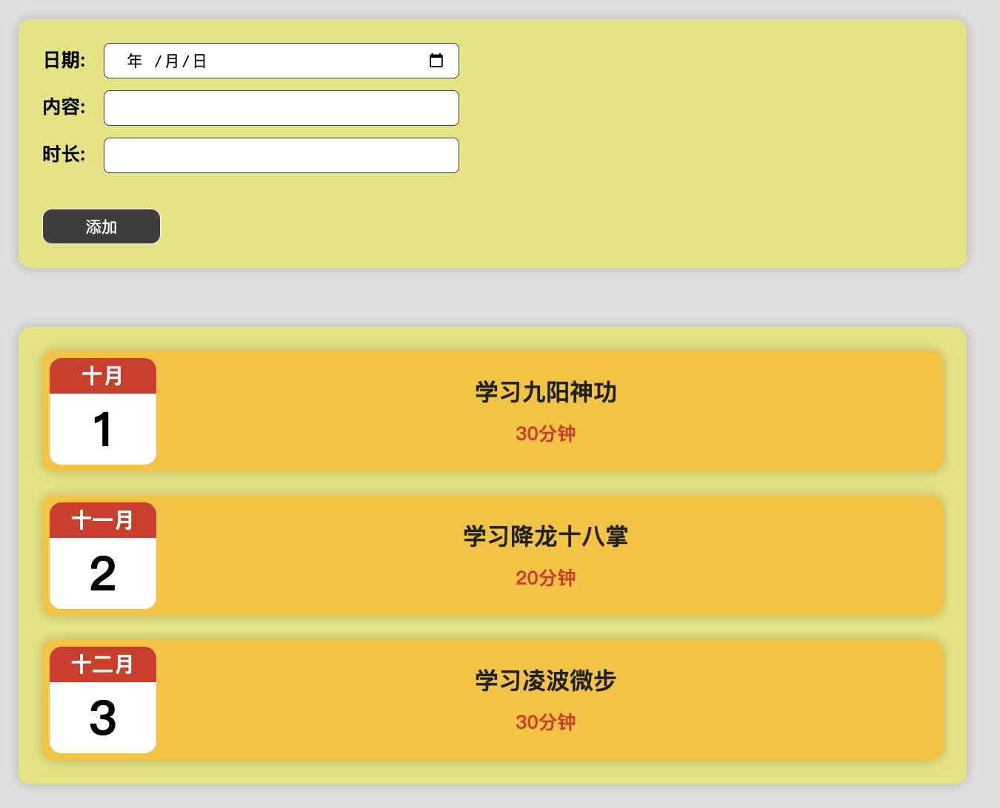

<br>

### 要点: change & input 事件

**change 事件:**   
change 事件会在 input 元素的值发生**改变并且失去焦点时触发**。这意味着 change 事件会等到用户完成输入并离开输入框时才触发。

<br>

**input 事件:**  
input 事件则是在 input 元素的值发生改变时实时触发。无论用户是否失去焦点, 只要用户输入内容, input 事件就会立即触发。

<br>

**问题:**  
我在react中写上onchange事件后 只要用户输入一次就触发一次 相当于实时监控的 为什么?

<br>

**回答:**  
因为你的事件处理函数中有更新状态的逻辑。

在 React 中, 通过给 input 元素的 onChange 属性绑定事件处理函数, 每当用户输入内容时, 事件处理函数会被调用。在事件处理函数中, 如果你更新了组件的状态(使用 setState 或类似的机制), 那么组件会重新渲染, 从而导致事件处理函数被再次调用。

如果你只想在用户完成输入并失去焦点时触发事件, 可以将事件处理逻辑与状态更新逻辑分离开来。你可以在事件处理函数中暂时存储用户输入的值, 然后在失去焦点的事件(例如 onBlur)中进行状态更新。

```js
import React, { useState } from 'react';

function MyComponent() {
  const [inputValue, setInputValue] = useState('');

  const handleInputChange = (event) => {
    // 暂时存储用户输入的值
    setInputValue(event.target.value);
  };

  const handleBlur = () => {
    // 用户失去焦点时进行处理
    // 在这里可以根据 inputValue 做相应的操作
    console.log('输入完成: ', inputValue);
  };

  return (
    <div>
      <input
        type="text"
        value={inputValue}
        onChange={handleInputChange}
        onBlur={handleBlur}
      />
    </div>
  );
}
```

<br>

### Form表单组件: 受控组件 + 双向绑定
1. input.number: 用户只能输入数字, 但获取的结果仍然是字符串
2. input.date: 用户选择日期, 但获取的结果仍然是字符串
3. onchange事件本意是用户输入失去焦点后触发, 但是因为我们内部调用了setState方法, 导致onchange重置 变为实时监控

4. **state的setter方法 尽可能的时候 函数式参数吧 直接赋值毛病好多啊**

5. 在react中我们会对表单进行双向绑定 value + change
```js
const LogsForm = props => {

  const { dataHandler } = props

  const [formData, setFormData] = useState({
    // 字符串: 2023-02-27
    date: "",
    desc: "",
    time: ""
  })


  // 将3个表单项的用户输入同步到 state 中
  const collectFormData = e => {
    const type = e.target.name
    // 单独处理下date
    /*
    这里因为input.date的入力项我们修改为双向绑定的逻辑, 所以input.date的值的是 2023-02-27格式的字符串 所以我们不能在子组件中组装成new Date的格式 不然表单项无法正常显示

    if (type === "date") {
      const date = new Date(e.target.value)
      setFormData({ ...formData, [type]: date })
    } else {
      setFormData({ ...formData, [type]: e.target.value })
    }
    */

    setFormData({ ...formData, [type]: e.target.value })
  }


  // 检查用户输入是否为空
  const checkForm = () => {
    return Object.values(formData).every(item => item !== "")
  }


  // 提交表单后 重置表单项, 前提是表单项的值和state中属性是一一对应的
  const resetForm = () => {

    // 这里如果我们不使用函数式的参数 会有问题 说是setState是异步渲染的 如果我们不使用函数式的参数 则修改会等到下一次界面更新才会更改
    setFormData(prevState => {
      const postReset = {}
      for(let key in prevState) {
        postReset[key] = ""
      }

      return postReset
    })
  }


  /*
    1. 点击添加按钮 触发回调
    2. checkForm检查表单项是否为空
    3. 执行 父组件 props 传递过来的函数 将表单组件的数据回传给父组件
  */
  const add = e => {
    console.log("add", checkForm())
    e.preventDefault()
    if (checkForm()) {
      // 将数据传递给父组件
      dataHandler(formData)
      resetForm()
    }
  }

  return (
    <form>
      <div className="form-item">
        <label htmlFor="date">日期: </label>
        <input
          name="date"
          type="date"
          id="date"
          value={ formData.date }
          onChange={ collectFormData } />
      </div>
      <div className="form-item">
        <label htmlFor="desc">内容: </label>
        <input
          name="desc"
          type="text"
          id="desc"
          value={ formData.desc }
          onChange={ collectFormData } />
      </div>
      <div className="form-item">
        <label htmlFor="time">时长: </label>
        <input
          name="time"
          type="number"
          id="time"
          value={ formData.time }
          onChange={ collectFormData } />
      </div>
      <div className="form-item">
        <button className="btn" onClick={ add }>添加</button>
      </div>
    </form>
  );
};

export default LogsForm;
```

<br>

### 父组件:

**单一职责:**  
每个组件只负责自己的事, 比如给数据添加id的动作 应该是在存储数据的时候做 所以我们在app组件里面完成添加id的动作

```js
/// 引入 Item 组件
import Item from "./components/Item"
import Card from "./components/Card"
import LogsForm from "./components/LogsForm"
import { useState } from "react"
import { nanoid } from "nanoid"

// 在引入样式 图片 资源的时候 我们要以 ./ 开头 不然会被当成模块来进行处理
import "./App.css"

const App = () => {


  // 使用了 nanoid() 定义id的值
  const [date, setDate] = useState([
    {
      id: nanoid(),
      date: new Date(2022, 9, 1),
      desc: "学习九阳神功",
      time: 30
    },
    {
      id: nanoid(),
      date: new Date(2022, 10, 2),
      desc: "学习降龙十八掌",
      time: 20
    },
    {
      id: nanoid(),
      date: new Date(2022, 11, 3),
      desc: "学习凌波微步",
      time: 30
    }
  ])


  // 拿到子组件的数据 处理函数
  const dataHandler = data => {
    data.id = nanoid()
    data.date = new Date(data.date)
    // 拿到子组件的数据后添加到 state 中
    setDate(prevState => {
      console.log(prevState)
      return [data, ...prevState]
    })
  }


  // 根据数据创建结构: 日志区域
  const datastructure = () => date.map((item, index) => (
    <Item data ={ item } key={ item.id } />
  ))

  return (
    <div>
      <Card className="logs-wrap">
        <LogsForm
          dataHandler={ dataHandler } />
      </Card>

      <Card className="logs-wrap">
        { datastructure() }
      </Card>
    </div>
  )
}

export default App
```

<br>

### 技巧: 封装useState提供setter函数
```js
const [formData, setFormData] = useState({
  date: "",
  desc: "",
  time: ""
});


// 封装 setFormData 传入state中想要修改的key value
const updateFormData = (key, value) => {
  setFormData((prevFormData) => ({
    ...prevFormData,
    [key]: value
  }));
};


const handleDateChange = (event) => {
  const date = new Date(event.target.value);
  updateFormData("date", date);
};

const collectFormData = (event) => {
  const type = event.target.name;
  const value = event.target.value;

  if (type === "date") {
    handleDateChange(event);
  } else {
    updateFormData(type, value);
  }
};
```

<br>

## 日志案例: 追加 删除 和 提醒功能
1. 子组件将数据id传递给父组件
2. 父组件拿到id 过滤state 删除数据

<br>

### 子组件
```js
const { data: { id, date, desc, time }, delHandler } = props

const del = (id) => {
  return () => {
    const flag = confirm(`您是否确认要删除id为: ${id} 的数据`)
    if (flag) delHandler(id)
  }
}

return (
    <div className="item">
      ...
      {/* 右侧: 编辑部分 */}
      <div className="edit">
        <button
          id="delBtn" data-id={ id }
          onClick={ del(id) }
        >删除</button>
      </div>
    </div>
  )
```

<br>

### 父组件
```js
const delHandler = (id) => {

  // 方式1:
  const postDel = date.filter(item => item.id !== id)

  setDate(postDel)


  // 方式2: 根据index删除
  setDate(prevState => [...prevState].splice(index, 1))
}

return (
  <div>
    <Card className="logs-wrap">
      <LogsForm
        dataHandler={ dataHandler }
      />
    </Card>

    <Card className="logs-wrap">
      {
        date.length === 0
          ? <span>小主已经没有数据了</span>
          : datastructure()
      }
    </Card>
  </div>
)
```

<br><br>

## 日志案例: 模态框组件

### v-if逻辑实现原理:
1. 定义 state 变量
2. 使用 boolean && 组件的方式 注意``{}`` 因为我们写的是js

```js
const [modelVisible, setModelVisible] = useState(false)

return (
  {/* 模态框 */}
  { modelVisible && <ConfirmModel /> }
)
```

<br>

### 类似子组件emit自定义事件, 父组件绑定自定义事件并指定处理回调
或者说 父组件中的逻辑 交由子组件来执行

比如我们在父组件中定义要执行的逻辑, 该逻辑肯定是被封装为函数对么
```js
// 父组件: 当用户点击 确定 后执行的逻辑
const onConfirm = () => {
  delHandler(id)
  setModelVisible(prevState => false)
}
```

我们将这个函数交给子组件
```js
<ConfirmModel
  onConfirm={ onConfirm }
/>
```

这样子组件就拿到了这个函数, 什么时候执行 就看子组件中的操作了 这是不是就相当于 子组件来执行父组件中的逻辑

```js
// 子组件: click的事件回调为 父组件中的函数
<button
  onClick={ props.onConfirm }
>确认</button>
```

<br>

### 整体逻辑:
1. 点击 删除 按钮展示对话框
2. 父组件中定义 用户点击对话中的确定 和 取消按钮后的执行逻辑
 - onConfirm
 - onCancel

3. 将上面的两个函数通过props传递给子组件
4. 子组件在点击按钮的时候 将事件回调指定为上述的两个函数

```js
import ConfirmModel from "../components/ConfirmModel"
import {useState} from "react";

const Item = (props) => {

  const { data: { id, date, desc, time }, delHandler } = props

   const month = date.toLocaleString("zh-CN", {month: "long"})

  const day = date.getDate()


  // 控制模态框的变量
  const [modelVisible, setModelVisible] = useState(false)


  // 点击删除按钮 展示对话框
  const del = () => {
    setModelVisible(prevState => true)
  }


  // 因为模态框显示与否的状态数据在该组件 我们将控制state的方法传入到 模态框组件中 也就是父组件的逻辑交由子组件执行
  // 展示对话框后: 确认 对应 逻辑
  const onConfirm = () => {
    delHandler(id)
    setModelVisible(prevState => false)
  }
  // 展示对话框后: 删除 对应 逻辑
  const onCancel = () => {
    setModelVisible(prevState => false)
  }


  // 渲染结构
  return (
    <div className="item">
      ... 

      {/* 模态框 */}
      {
        // v-if 逻辑:
        modelVisible &&
          <ConfirmModel
            confirmText="该操作不可恢复, 您确认么?"
            onConfirm={ onConfirm }
            onCancel={ onCancel }
          /> }
    </div>
  )
}

export default Item
```

<br><br>

## 日志案例: 遮罩层组件:
我们的对话框组件展示后, 为了不让用户点击对话框之外的按钮 我们可以在对话框组件的后面放一个遮罩层

也就是说 我们**将 对话框组件 放入到 遮罩层组件中**

<br>

### 遮罩层组件:
```js
// 遮罩层组件
import "./BackDrop.css"

import React from 'react';

const BackDrop = props => {
  return (
    <div className="back-drop">
      {
        // 这里要渲染标签体
        props.children
      }
    </div>
  );
};

export default BackDrop;
```
```css
/* 遮罩层样式 */
.back-drop {
  /* 不要用absolute */
  position: fixed;
  top: 0;
  bottom: 0;
  left: 0;
  right: 0;
  background: rgba(0,0,0, .3);

  z-index: 999;
}
```

<br>

### 验证:
我们的遮罩层如果是根据上面的样式设置的话, 只能盖住视口的高度

但是如果下层元素的内容超过视口高度的话, 则我们的遮罩层就盖不住了

<br>

**方式1:**  
我们可以让下层元素进行 ``overflow: hidden`` 不让其有溢出部分

<br>

**方式2:**  
禁止全局body的滚动条

使用 JavaScript 或状态管理库（如 React 的状态管理）来设置一个标志, 指示是否展开了餐品详情。

根据该标志, 您可以使用 JavaScript 来动态添加一个 CSS 类名到 ``<body>`` 元素上, 该类名可以控制滚动条的样式。

使用 CSS 来定义针对具有该类名的 <body> 元素的样式, 并禁用滚动条。可以使用 overflow: hidden; 属性来实现这一点
```js
import React, { useState, useEffect } from 'react';
import './App.scss';

const App = () => {
  const [isDetailOpen, setIsDetailOpen] = useState(false);

  useEffect(() => {
    if (isDetailOpen) {
      document.body.classList.add('no-scroll');
    } else {
      document.body.classList.remove('no-scroll');
    }
  }, [isDetailOpen]);

  const toggleDetail = () => {
    setIsDetailOpen(!isDetailOpen);
  };

  return (
    <div className="app">
      <button onClick={toggleDetail}>Toggle Detail</button>

      {isDetailOpen && (
        <div className="detail-wrap">
          {/* 餐品详情内容 */}
        </div>
      )}
    </div>
  );
};

export default App;
```

CSS 文件中的样式: 

```css
.no-scroll {
  overflow: hidden;
}
```

通过点击按钮来切换 isDetailOpen 状态的值。根据 isDetailOpen 的值, 我们使用 useEffect 钩子来添加或移除 ``<body>`` 元素上的 no-scroll 类名。当 no-scroll 类名存在时, 将禁用 ``<body>`` 元素上的滚动条。

<br>

### 对话框组件
```js
import "./ConfirmModel.css"

import React, {useState} from 'react';
import BackDrop from "./BackDrop";

const ConfirmModel = props => {

  return (
    // 将对话框组件放入到遮罩层组件中
    <BackDrop>
      <div className="model-wrap">
        <div className="model-content">
          { props.confirmText }
        </div>
        <div className="btn-wrap">
          <button
            className="btn"
            onClick={ props.onConfirm }
          >确认</button>
          <button
            className="btn"
            onClick={ props.onCancel }
          >取消</button>
        </div>
      </div>
    </BackDrop>
  );
};

export default ConfirmModel;
```

<br>

### 点击遮罩层取消对话框
对话框组件会接收到两个函数
- onConfirm
- onCancel

它们是父组件控制对话框是否展示的两个函数 它们会传递到子组件中去
```js
// 父组件中的方法
const clearCartHandler = () => {
  setConfirmVisible(true)
}

const onConfirm = () => {
  removeCart()
  setConfirmVisible(false)
}
const onCancel = () => {
  setConfirmVisible(false)
}


{/* 清空购物车的对话框 */}
{
  confirmVisible && (
    <Confirm
      onConfirm={ onConfirm }
      onCancel={ onCancel }
      confirmText="您确认要清空购物车么?"
    />
  )
}
```

<br>

**Confirm子组件:**  
当我们点击确认按钮的时候 onClick 是会冒泡到 Backdrop 组件上的

所以我们给 Backdrop 组件传入了 onClick事件 通过props

```js
const Confirm = props => {
  return (
    // 将当前组件的样式 传递 Backdrop组件
    <Backdrop
      onClick={ props.onCancel }
      className="backdrop-zindex"
    >
      <div className="model-wrap">
        <div className="model-content">
          { props.confirmText }
        </div>
        <div className="model-btn">
          <button
            onClick={ props.onConfirm }
          >确认</button>
          <button
            onClick={ props.onCancel }
          >取消</button>
        </div>
      </div>
    </Backdrop>
  );
};
```

<br>


**Backdrop组件中:**  
通过 ``<div {...props}>`` 将 onClick 传递到 div 上

这样当我们点击遮罩层的时候 也会触发onClick事件 并且执行的就是点击遮罩层关闭对话框的逻辑
```js
const Backdrop = props => {
  // 3. 创建传送门 传入组件内容, 遮罩层节点 并return出去
  return ReactDOM.createPortal(
    (
      <div
        { ...props }
        className={`backdrop-wrap ${props.className}`}>
        { props.children }
      </div>
    ),
    backdropRoot
  );
};
```

<br><br>

# 传送门: Portal (日志案例)
我们上面有一个问题, 正常我们的 对话框 组件在我的印象中应该放在和根组件平级的结构 也就是和 root 平级 这样不会出现层级问题

而我们上面的案例中 我们是将 遮罩层 + 对话框组件放入了 Item 一个子组件里面 这样会照成很多诡异的状况发生

<br>

我们期望的是对话框组件 和 root 组件平级, 但是如果我们真的将对话框组件拿到root组件中的话, 上面的逻辑比如 确定 和 取消的回调传递的问题 就不好办了

<br>

**怎么办呢？React为我们提供了一个"传送门"可以将元素传送到指定的位置上。**

<br>

### Portal的用法:
组件默认会作为父组件的后代渲染到页面中 但是有些情况下 这种方式会带来一些问题

通过protal可以将组件渲染到页面中的指定位置

<br>

1. 在index.html模版中添加一个新的元素
```html
<body>
  <div id="root"></div>
  <!-- 专门渲染遮罩层 -->
  <div id="portal"></div>
</body>
```

2. 修改Backdrop组件: 我们想将哪个组件传送到指定位置 就修改哪个组件

3. Backdrop组件中 导入 ReactDOM 
```js
// 不用从 client 中引入 直接从 react-dom 中引入
import ReactDOM from "react-dom";
```

```js
// 遮罩层组件
import "./BackDrop.css"

import React from 'react';

// 引入 ReactDOM 它身上有传送门的方法
import ReactDOM from "react-dom";

// 获取 backdrop 根元素: 也就是将组件传送到哪里
const backdropRoot = document.querySelector("#portal")

const BackDrop = props => {
  return (
    // 下面的结构是要被传送的 下面的结构要传递到 html模版中的 #portal 容器中 也就是 backdropRoot 中
    <div className="back-drop">
      {
        props.children
      }
    </div>
  );
};

export default BackDrop;
```

4. 创建传送门 将指定结构 传送到 指定位置
```js
// 遮罩层组件
import "./BackDrop.css"

import React from 'react';

// 引入 ReactDOM 它身上有传送门的方法
import ReactDOM from "react-dom";

// 获取 backdrop 根元素: 也就是将组件传送到哪里
const backdropRoot = document.querySelector("#portal")


const BackDrop = props => {
  // 创建传送门: 参数1 传谁, 参数2 传哪
  return ReactDOM.createPortal(
    // 参数1:
    <div className="back-drop">
      { props.children }
    </div>,
    // 参数2:
    backdropRoot
  )
};

export default BackDrop;
```

<br>

### 效果:
当我们点击 删除按钮的时候 遮罩层组件就会被传送到 ``<div id="portal"></div>`` 容器中

<br>

### 总结:
1. 创建根元素
2. 使用 ReactDOM.createPortal 返回组件就可以了

<br><br>

## 日志案例: 
这个部分我们来完成下 日志案例 中的过滤功能 我们需要按照年份来进行过滤

我们会在案例中添加一个下拉框 来用来选择年份 比如我们只看2022年的数据

<br>

### 思路:
1. 父组件将源数据传递给子组件 让子组件筛选出所有的年份 用作下拉框展示
2. 子组件将用户选择出来的year传回父组件
3. 父组件根据传回的年份 过滤源数据

<br>

### 父组件:
```js
// 引入 Item 组件
import Item from "./components/Item"
import Card from "./components/Card"
import LogsForm from "./components/LogsForm"
import FilterData from "./components/FilterData"
import { useState } from "react"
import { nanoid } from "nanoid"

// 在引入样式 图片 资源的时候 我们要以 ./ 开头 不然会被当成模块来进行处理
import "./App.css"

const App = () => {

  const [date, setDate] = useState([
    {
      id: nanoid(),
      date: new Date(2021, 9, 1),
      desc: "学习九阳神功",
      time: 30
    },
    {
      id: nanoid(),
      date: new Date(2022, 10, 2),
      desc: "学习降龙十八掌",
      time: 20
    },
    {
      id: nanoid(),
      date: new Date(2023, 11, 3),
      desc: "学习凌波微步",
      time: 30
    }
  ])


  // 拿到子组件的数据 处理函数
  const dataHandler = data => {
    data.date = new Date(data.date)
    data.id = nanoid()
    // 拿到子组件的数据后添加到 state 中
    setDate(prevState => {
      return [data, ...prevState]
    })
  }

  // 处理删除的逻辑
  const delHandler = (id) => {
    const postDel = date.filter(item => item.id !== id)

    setDate(postDel)
  }


  // 处理用户选择了下拉框的年份的逻辑
  const selectedHandler = (year) => {
    const res = _date.filter(item => String(item.date.getFullYear()) === year)
    if (res && res.length > 0) {
      setDate(res)
    }
  }

  // 根据数据创建结构: 日志区域
  const datastructure = () => date.map((item, index) => (
    <Item data ={ item } key={ item.id } delHandler={ delHandler }/>
  ))

  return (
    <div>
      <Card className="logs-wrap">
        <LogsForm
          dataHandler={ dataHandler }
        />
      </Card>

      <Card className="logs-wrap">
        <FilterData
          dates={ date }
          selectedHandler={selectedHandler}
        />
        {
          date.length === 0
            ? <span className="no-logs">小主已经没有数据了</span>
            : datastructure()
        }
      </Card>
    </div>
  )
}

export default App
```

<br>

### 下拉框组件:
```js
import React, {useState} from 'react';
import "./FilterData.css"
const FilterData = props => {


  // 获取父组件中传递过来的全数据, 便于我们筛选出来全部的年份
  const dates = [ ...props.dates ]
  const getYears = (dates) => dates.map(item => item.date.getFullYear()).sort((a, b) => a - b)
  const _years = getYears(dates)


  // 双向绑定: 将用户选择的下拉项维持到state中, 便于动态的更新select下拉框默认展示的值
  const [selectedYear, setSelectedYear] = useState("")
  const selectHandler = e => {
    // 1. 将用户选择的值 传回父组件
    props.selectedHandler(e.target.value)
    // 2. 更新双向绑定的下拉框的value值
    setSelectedYear(e.target.value)
  }

  return (
    <div className="filter-wrap">
      {/* select元素上添加value属性 是react框架中特有的行为 默认html中select是没有value属性的 */}
      <select
        name="year" id="year"
        onChange={ selectHandler }
        value={ selectedYear }
      >
        <option value="">请选择年份...</option>
        {
          _years.map((item, index) => {
            return (
              <option
                key={index}
                value={item}
              >{`${item} 年`}</option>
            )
          })
        }
      </select>
    </div>
  );
};

export default FilterData;
```

<br>

### 遗留问题1:
我想加上当用户在下拉框中选择 ``请选择年份...`` 的时候 要恢复全数据

这里我想备份 state 中的数据 date

```js
const [date, setDate] = useState([
  {
    id: nanoid(),
    date: new Date(2021, 9, 1),
    desc: "学习九阳神功",
    time: 30
  },
  ...
])
```

<br>

**尝试1:**  
```js
const _date = JSON.parse(JSON.stringify(date))
```

不行因为我们的数据中有 日期对象, 当我们通过 JSON.stringify来转化的时候, 会将日期对象还原为字符串, 我们后续虽然再次通过 parse方法来还原 但是 date的值仍然是字符串

<br>

**尝试2: 后续看到 useEffect 之后 看看**  
```js
const _date = [...date]

// 或者是其他深拷贝的方法
```

但是不行 我的数据date是 useState 中的数据
如果我使用 ``const _date = [...date]`` 的方式 来进行赋值

后续我调用setDate来修改date的时候 _date 中的数据也会发生改变 可能是因为我们重新渲染组件了吧

<br>

chatGPT建议:
```js
import { useState, useEffect } from 'react';

const YourComponent = () => {
  const [date, setDate] = useState([1, 2, 3]);
  const [backupDate, setBackupDate] = useState([]);

  useEffect(() => {
    // 在组件挂载时创建备份数据
    setBackupDate(JSON.parse(JSON.stringify(date)));
  }, []);

  const updateDate = () => {
    const updatedDate = [...date];
    updatedDate.push(4);
    setDate(updatedDate);
  };

  return (
    <div>
      <button onClick={updateDate}>Update Date</button>
      <p>Date: {date.join(', ')}</p>
      <p>Backup Date: {backupDate.join(', ')}</p>
    </div>
  );
};

export default YourComponent;
```

我们在组件挂载时使用useEffect钩子创建了一个备份数据, 并将其存储在backupDate状态中。这里使用了深拷贝的方法, 即通过将状态数据转换为JSON字符串, 然后再将其解析回JavaScript对象, 从而创建了一个全新的副本。

当调用updateDate函数更新date状态时, backupDate保持不变, 因为它是在组件挂载时创建的独立副本。

这种方式可以确保备份数据的不变性, 即使状态数据发生变化。请注意, 在实际应用中, 深拷贝可能会对性能产生一定的影响, 因此请根据实际需求进行评估和优化。

<br>

我想知道的是 setState方法的调用 不会让组件重新执行componentMounted的方法么

<br>

当你调用setState方法更新组件的状态时, React会重新渲染组件并执行相应的生命周期方法, 包括componentDidMount(在首次渲染时执行)和componentDidUpdate(在更新时执行)。

在函数组件中, 使用useState来管理状态, 每次调用setState会触发组件的重新渲染。

如果你希望在组件挂载时执行某些逻辑, 并且不希望在后续状态更新时再次执行该逻辑, 可以通过使用useEffect钩子的依赖数组(第二个参数)来控制。

```js
import { useState, useEffect } from 'react';

const YourComponent = () => {
  const [data, setData] = useState([]);

  useEffect(() => {
    // 在组件挂载时执行逻辑
    fetchData();
  }, []); // 传递空数组作为依赖项, 表示只在组件挂载时执行一次

  const fetchData = () => {
    // 获取数据的逻辑
    // ...

    setData(data); // 更新状态
  };

  return (
    <div>
      {/* 组件的内容 */}
    </div>
  );
};

export default YourComponent;
```

<br>

在上述示例中, 通过将空数组作为useEffect的依赖项传递, fetchData函数只在组件挂载时执行一次。当调用setData更新状态时, 不会再次触发fetchData函数的执行。

请注意, 如果setData更新状态的值依赖于其他变量或状态, 你需要将这些变量或状态添加到依赖数组中, 以确保在它们发生变化时重新执行逻辑。如果依赖数组为空, useEffect中的逻辑只会在组件挂载和卸载时执行一次。如果依赖数组中包含依赖项, 那么当依赖项发生变化时, 逻辑会被触发。

<br>

fetchData();只会执行一次是么 不管我们如何调用setState

<br>

是的, fetchData()函数在这种情况下只会在组件挂载时执行一次, 不会受到后续的setState调用的影响。

当你将空数组[]作为useEffect的依赖项传递时, 这意味着该useEffect只在组件挂载和卸载时执行。也就是说, 它仅在组件初始化阶段执行一次。

即使后续调用了setState更新了组件的状态, 也不会再次触发该useEffect。因此, fetchData()函数只会在组件挂载时执行一次, 不受后续的setState调用的影响。

这是因为空依赖数组告诉React, 该useEffect不依赖于任何变量或状态的更新, 因此不需要在这些变量或状态发生变化时重新执行。它只依赖于组件的挂载和卸载。

如果你希望在特定状态或变量发生变化时执行逻辑, 可以将相应的依赖项添加到依赖数组中。这样, 当依赖项发生变化时, useEffect会重新执行。

<br><br>

# React脚手架:

### 创建项目:
```js
npx create-react-app 项目名
```

<br>

### 项目结构:
```js
├─ node_modules

├─ public
  ├─ favicon.ico
  ├─ index.html
  ├─ logo192.png
  ├─ logo512.png
  ├─ manifest.json
  // 搜索引擎爬虫的配置文件
  ├─ robots.txt

├─ src
  ├─ App.css
  ├─ App.js
  ├─ App.test.js
  ├─ index.css
  ├─ index.js
  ├─ logo.svg
  ├─ reportWebVitals.js
  ├─ setupTests.js		

├─ package.json
```

<br>

### package.json
```js
"dependencies": {
  "@testing-library/jest-dom": "^5.16.5",
  "@testing-library/react": "^13.4.0",
  "@testing-library/user-event": "^13.5.0",
  "react": "^18.2.0",
  "react-dom": "^18.2.0",
  "react-scripts": "5.0.1",

  // 性能统计包
  "web-vitals": "^2.1.4"
},
"scripts": {
  "start": "react-scripts start",
  "build": "react-scripts build",

  // 单元测试
  "test": "react-scripts test",

  // 慎用(不可逆): 暴露webpack的相关配置, 当我们必须手动修改webpack的配置时 可以执行该命令 完成个性化配置
  "eject": "react-scripts eject"
},

// 语法检查配置
"eslintConfig": {
  "extends": [
    "react-app",
    "react-app/jest"
  ]
},
```

<br>

### public/index.html
``%PUBLIC_URL%``表示一个变量 代表静态文件夹路径, 也就是**public目录**
```html
<link rel="icon" href="%PUBLIC_URL%/favicon.ico" />
```

<br>

### ``<React.StrictMode>``
React内置组件, 作用为使用严格模式渲染React元素

```js
import React from 'react';
import ReactDOM from 'react-dom/client';
import App from './App';

const root = ReactDOM.createRoot(document.getElementById('root'));
root.render(
  <React.StrictMode>
    <App />
  </React.StrictMode>
);
```

<br><br>

# 内联样式 和 样式表


## 内联样式:

### 1. 直接写在标签属性上
```js

function App() {
  return (
    <div className="App">
      <div
        style={{ backgroundColor: "#c2185b" }}
      >
        我是App组件的内容
      </div>
    </div>
  );
}
```

<br>

### 2. 提取到组件内部 定义样式对象
```js
function App() {

  // 样式对象
  const wrapStyle = {
    backgroundColor: "#c2185b"
  }

  return (
    <div className="App">
      <div
        style={ wrapStyle }
      >
        我是App组件的内容
      </div>
    </div>
  );
}
```

<br>

### 3. 结合state, 通过js控制样式
```js
function App() {

  const [defaultBorder, setDefaultBorder] = useState(false)

  const wrapStyle = {
    // 通过state中的布尔值 来决定边框的颜色
    border: `1px solid ${defaultBorder ? "red" : "blue"}`,
    padding: "20px"
  }

  return (
    <div className="App">
      <div style={ wrapStyle }>
        我是App组件的内容
      </div>
    </div>
  );
}
```

<br><br>

## 样式表
大范围应用样式的时候 需要采用样式表, 我们可以定义css样式 然后在组件中导入使用

<br>

### 1. 组件中引入外部定义的css文件
```css
.wrap {
  border: 1px solid #C2185B;
  padding: 20px;
}
```

```js
import "./App.css"

return (
  <div className="App">
    <div className="wrap">
      我是App组件的内容
    </div>
  </div>
);
```

<br>

### 2. 通过js动态给标签添加 类名
```js
import "./App.css"

function App() {

  const [defaultBorder, setDefaultBorder] = useState(false)

  // 通过3元表达式动态决定添加哪个类名
  return (
    <div className="App">
      <div className={ defaultBorder ? "wrap" : "wrap2" }>
        我是App组件的内容
      </div>
    </div>
  );
}
```

<br><br>

## 样式的作用域
上面我们会通过 ``import "./App.css"`` 的方式引入样式表

该种方式引入的样式表并不是只作用于当前的组件, 而是**只要我们通过 import 引入的样式, 所有组件都能看到**

<br>

### 问题: 样式覆盖
既然我们通过 import 引入的样式所有的组件都能用, 那么必然就会产生样式覆盖的问题

后引入的样式会生效

<br>

**index.js**
```js
// index.css是先引入的, 而App.css在App组件中 所以App.css是后引入的 
import "index.css"
import App from "./App"
```

<br><br>

## CSS Module: 
以模块化的方式使用css样式, 避免类名重复的问题

<br>

### 作用: 
解决import导入的样式没有作用域的问题

<br>

### 使用:
1. css样式文件起名为: ``xxx.module.css``
```css
.wrap {
  border: 1px solid #C2185B;
  padding: 20px;
}
```

2. 组件中引入css样式模块文件
```js
import styles from "./App.module.css"
```

3. 通过 ``styles.css样式文件中的类名`` 为标签添加类名
```js
return (
  <div className="App">
    <div className={ styles.wrap }>
      我是App组件的内容
    </div>
  </div>
);
```

<br>

### 技巧: 动态类名
```js
const isActive = true;
const className = isActive ? styles.active : styles.inactive;

<div className={className}>Dynamic Class</div>
```

<br><br>

# Fragment组件
我们之前说过 我们的react组件里面有且只能有一个根元素, 比如下面必须有一个div
```js
return (
  <div>
    <Component1 />
    <Component2 />
    <Component3 />
  </div>
)
```

### 为什么这么要求呢?
因为我们的jsx最终会转换成一个react元素 如果我们没有外部的div根元素, 那么直接就是 Component123 三个元素, 这时候咋办

<br>

### 解决方式: 使用 ``<React.Fragment>`` 组件
它类似 vue 中的 template 标签

``<Fragment>`` 组件不会在最终渲染的 HTML 中创建额外的 DOM 节点, 它只是作为一个占位符存在。

```js
return (
  <React.Fragment>
    <Component1 />
    <Component2 />
    <Component3 />
  </React.Fragment>
);
```

<br>

### Fragment组件的原理: 自定义 Fragment 组件
我们定义一个 Fragment 组件 我们希望该组件 它作为其他组件的容器 同时它又不会返回多余的根元素div

```js
// 我们期望 Fragment 组件不要返回根元素div 因为多层结构它很多余 
const Fragment = props => {
  return (
    <div>
      ...
    </div>
  )
}
```

<br>

我们可以将上面的结构修改为如下:  
我们直接 ``return props.children`` 这样它只会返回子元素 而不会返回根元素 div
```js
const Fragment = props => {
  return props.children
}
```

<br>

### Fragment语法糖
我们可以直接使用如下的方式
```js
return (
  <>
  </>
)
```

<br><br>

# 案例: 订餐应用

## 项目的整体架构
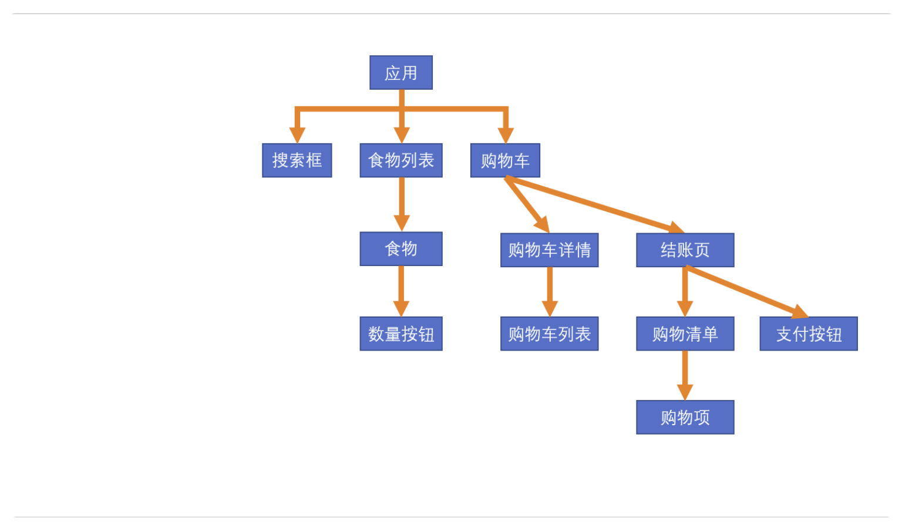

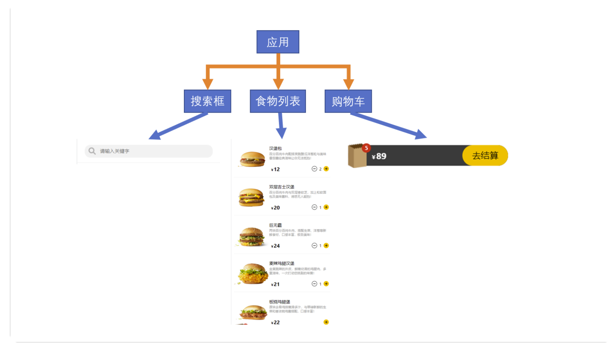

<br><br>

## 项目适配: rem
移动端的项目因为视口的原因, 比如 iphone12 的视口为 390px, 那我们如果给元素设置width为390px 则直接可以撑满屏幕

但是不同设备的视口是不同的 比如 iphonexr 这个设备的宽度就是 414px, 所以如果我们仍然使用上面的 390px, 则屏幕是缺了一块的

所以在开发移动端设备的时候我们的像素就没有办法写死了 因为设备的视口的宽度是不同的

<br>

所以我们要做适配, 我们要将 px -> rem

<br>

### 适配步骤:
1. 通用的样式文件中 将 html 的字体修改为 100px
```css
/* 项目通用的样式 */
* {
  box-sizing: border-box;
  margin: 0;
  padding: 0;
}

html {
  font-size: 100px;
}

html, body, #root {
  height: 100vh;
}
```

2. 使用 像素 / 100 的方式计算出每个元素的rem值
```css
.app-wrap {
  width: 3.75rem;
  background: #C2185B;
}
```

3. 在 index.js 入口文件中 使用js完成适配操作
```js
import React from 'react';
import ReactDOM from 'react-dom/client';
import App from './App';
// 引入项目通用样式
import "./index.css"

const root = ReactDOM.createRoot(document.getElementById('root'));
root.render(
  <React.StrictMode>
    <App />
  </React.StrictMode>
);


// 适配函数
function adapter() {
  const dpi = document.documentElement.clientWidth

  // 375为设计稿宽度
  const hfs = dpi * 100 / 375
  document.documentElement.style.fontSize = hfs + "px"
}

adapter()

window.addEventListener("resize", adapter)
```

<br>

### 注意: rem的使用
1. 因为我们设置了 html 的字体为 100px 所以其他的组件元素都要重写 fs

2. 元素宽度 字体大小 间距 可以使用 rem 作为单位

3. 边框不建议使用 rem 单位 进行设置

<br><br>

## React: Scss的使用
React中是天生支持Scss的, 所以我们只需要安装好 scss依赖 就可以在react项目中使用scss的语法

```s
npm i sass
```

<br><br>

## React: html body #root
```css
html, body, #root {
  height: 100vh;
}
```

<br><br>

## 汉堡案例: 字体图标
```s
https://fontawesome.com/

https://fontawesome.com/docs/web/use-with/react/
```

<br>

### 使用方式:
1. 安装依赖
```s
# svg库
npm i --save @fortawesome/fontawesome-svg-core

# 两个免费使用的图表字体库
npm i --save @fortawesome/free-solid-svg-icons
npm i --save @fortawesome/free-regular-svg-icons

# 提供的字体图标的react组件
npm i --save @fortawesome/react-fontawesome@latest
```

2. 在网站上搜索要使用的图标 选择 free 选项卡 (免费的)
```s
https://fontawesome.com/icons
```

3. 点击我们要使用图标字体(+号按钮) 观察 class类名部分 用于找到该字体对应的组件名
```html
<!-- fa-plus = faPlus = 组件名 -->
<i class="fa-solid fa-plus">
```

4. 在组件内从 @fontawesome/react-fontawesome 内部引入如下的两个组件
```js
import { FontAwesomeIcon } from "@fontawesome/react-fontawesome"

import { faPlus } from "@fontawesome/react-fontawesome"
```

5. 加号按钮的使用方式如下
```js
// 使用的是FontAwesomeIcon组件, faPlus作为icon的属性传入
<FontAwesomeIcon icon={ faPlus }>
```

<br><br>

## 汉堡案例: App组件

### App组件中的数据

**列表数据:**
我们整个应用是关于订汉堡的一个app, 汉堡数据我们放在哪里?

1. 搜索框需要用到 列表数据
2. 购物车组件需要用到 列表数据
3. 汉堡展示列表组件 需要用来列表

所以我们要将列表数据提升到它们3个的父组件内使用 也就是App组件

```js
[
  {
    id: '1',
    title: '汉堡包',
    desc: '百分百纯牛肉配搭爽脆酸瓜洋葱粒与美味番茄酱经典滋味让你无法抵挡！',
    price: 12,
    // 商品数量
    amount: 0,
    img: '/imgs/1.png'
  },
]

// 导入列表数据
import MealsData from "./data/mealsData"

const [hamburgers, setHamburgers] = useState(MealsData)
```

<br>

**购物车数据:**  
我们点击页面上的 加号按钮 相当于往购物车中添加一条数据, 同时别的组件也需要用到购物车数据 所以我们将购物车数据也放在App组件内

- 总价格
- 总数据
- 商品 []

```js
{
  // 购物车中的商品们, 每一个商品会作为一个数组中的一个对象
  items: [], 
  totalAmount: 0,  // 总数量
  totalPrice: 0  // 总价格
}


const [cartData, setCartData] = useState({
  items: [],
  totalAmount: 0,
  totalPrice: 0
})
```

<br>

### 购物车数据 - 加减按钮
数据在哪操作数据的方法就在哪

我们点击 + - 按钮的时候实际上就是在操作购物车中的数据, 所以我们 + - 按钮的真正逻辑 也会存放在 App 组件中

然后我们就将 该逻辑 通过props的方式传递搭配 Counter组件中

<br>

### 版本1:
App中的方法要经过层层传递 然后才能到Counter中 我们先完成这个复杂的传递过程

```s
App
↓
Meals
↓
MealItem
↓
Counter
```

<br>

**+按钮对应逻辑:**
```js
// 购物车的数据结构:
const [cartData, setCartData] = useState({
  items: [],
  totalAmount: 0,
  totalPrice: 0
})
```

定义 insertCartItem 方法 完成向购物车数据中追加一条商品 

参数: hamburger  
为列表数组中的其中的一个对象 有id 和 amount

- 商品会追加到 items 数组中
- 每次追加或者删除都需要修改 cartData 中的 totalAmount 和 totalPrice

<br>

1. 先对 state 中的数据进行浅复制, 后续我们都会操作这个浅复制后的对象, 最后setState这个浅复制的对象, 相当于汇总

2. 添加商品到购物车之前要先查看要添加的商品是否在购物车中
  - 如果在, 则只修该商品的数量
  - 如果不在, 则将商品添加到购物车中

```js
const insertCartItem = hamburger => {

  // 1. 浅复制对象
  const _cartData = { ...cartData }

  // 2. 判断要添加的商品是否在购物车中
  const cartItem =  _cartData.items.find(item => item.id === hamburger.id)

  // 如果没有则添加到items中
  if (!cartItem) {
    hamburger.amount = 1
    _cartData.items.push(hamburger)


  // 购物车中已经存在该商品
  } else {
    hamburger.amount += 1
  }

  // 增加总数量: 它不管怎样都是 +1
  _cartData.totalAmount += 1

  // 增加总金额: 在原有的基础上追加新商品的金额
  _cartData.totalPrice += hamburger.price

  // 最后: setState
  setCartData(_cartData)
}
```

<br>

**-按钮对应逻辑:**  
因为只要能点击 -按钮 说明购物车中一定有商品 则内部逻辑就不用判断 items中是否有该商品的逻辑了

1. 浅复制state
2. 让该商品的数量-1
3. 如果商品的数量为0 则从items中删除该商品对象
4. 修改总金额 和 总数量
5. setState

```js
const delCartItem = (hamburger) => {

  // 1. 浅复制 state 中的数据 统一操作
  const _cartData = { ...cartData }

  // 2. 让该商品的数量 -1
  hamburger.amount -= 1

  // 3. 检查商品数量是否为0, 如果为0 需要从购物车移除该商品
  if (hamburger.amount <= 0) {
    _cartData.items = _cartData.items.filter(item => item.id !== hamburger.id)
  }

  // 4. 修改商品的总数量 和 总金额
  _cartData.totalPrice -= hamburger.price
  _cartData.totalAmount -= 1

  setCartData(_cartData)
}
```

<br>

### 处理方法的层层传递
App组件将 添加 和 删除 的方法传递给 Meals组件
```js
<Meals
  hamburgers={ hamburgers }
  onInsert={ insertCartItem }
  onDel={ delCartItem }
/>
```

<br>

Meals组件不用 将事件继续向下传递给MealItem组件
```js
<MealItem
  hamburger={ item }
  key= { item.id }
  onInsert={ onInsert }
  onDel={ onDel }
/>
```

<br>

MealItem组件, 因为一个商品对象的数据 在MealItem组件中, **所以这里利用闭包将数据传入到方法(预备)**, 这样Counter组件就不用再传入数据了
```js
<Counter
  amount={ hamburger.amount }

  // 传入回调, 利用闭包, 将hamburger提前传入
  onInsert={ () => onInsert(hamburger) }
  onDel={ () => onDel(hamburger) }
/>
```

<br>

Counter组件在按钮的回调中直接调用传入的方法即可 不用再组织数据了 因为数据在上层已经处理完毕

```js
const addHandler = () => {
  props.onInsert()
}

const delHandler = () => {
  props.onDel()
}
```

<br>

### 版本2: 使用 Context修改
这个部分看不明白的话 先看后面关于 Context 部分的讲解

<br>

1. 创建 Context 容器
```js
// /src/context/CartDataOperatorContext.js 这相当于一个store
import React from "react"

// 1. 创建 Context 容器 并传入共享数据
const CartDataOperatorContext = React.createContext(null)

// 2. 对外暴露 Context 容器
export default CartDataOperatorContext
```

<br>

2. App组件中指定向后台组件提供什么数据(方法)
```js
import React, {useState} from 'react';

// 导入Context容器
import CartDataOperatorContext from "./context/CartDataOperatorContext";


const App = () => {

  const insertCartItem = hamburger => {

    ...
  }


  const delCartItem = (hamburger) => {
    ...
  }

  return (
    // 向所有的后代组件提供了 两个方法
    <CartDataOperatorContext.Provider value={{insertCartItem, delCartItem}}>
      <div className="app-wrap">
        <Meals
          hamburgers={ hamburgers }
        />
      </div>
    </CartDataOperatorContext.Provider>
  );
};

export default App;
```

3. Counter组件中使用App组件提供的方法
```js
// 引入 Context容器
import CartDataOperatorContext from "../context/CartDataOperatorContext";

const Counter = props => {

  const { hamburger } = props

  // 获取 Context 提供的添加和删除购物车数据的方法
  const {insertCartItem, delCartItem } = useContext(CartDataOperatorContext)


  const addHandler = () => {
    insertCartItem(hamburger)
  }

  const delHandler = () => {
    delCartItem(hamburger)
  }

  return (
    <div className="counter-wrap">
      {
        hamburger.amount && hamburger.amount > 0
          ? (
            <>
              <button
                className="btn dec-btn"
                onClick={ delHandler }
              >-</button>
              <span className="number">{ hamburger.amount }</span>
            </>
          )
          : null
      }
      <button
        className="btn inc-btn"
        onClick={ addHandler }
      >+</button>
    </div>
  );
};
```

<br>

### App组件代码部分:
```js
import React, {useState} from 'react';

// 导入样式
import "./App.scss"
// 导入列表数据
import MEALS_DATA from "./data/mealsData"

// 导入Context容器
import CartDataOperatorContext from "./context/CartDataOperatorContext";

// 导入组件
import Meals from "./views/Meals/Meals";
import Search from "./components/Search";
import Cart from "./components/Cart";
import CartDetails from "./components/CartDetails";
import Order from "./components/Order";
import Confirm from "./components/Confirm";


const App = () => {

  // 创建state用来存储 列表数据
  const [hamburgers, setHamburgers] = useState(MEALS_DATA)


  // 创建state用来存储 购物车数据
  const [cartData, setCartData] = useState({
    items: [],
    totalAmount: 0,
    totalPrice: 0
  })

  // 添加: 向购物车中追加数据
  // 参数 hamburger : 就是要添加到购物车内的商品, 也是列表数据中的一个对象
  const insertCartItem = hamburger => {

    // 先对 state 中的 cartData 进行浅复制, 一会我们操作整理这个浅赋值的对象, 最后统一 setCartData(浅复制的对象) 即可
    const _cartData = { ...cartData }

    /*
      先看看要添加的商品是否在购物车中
        - 如果 不在, 则将商品添加到购物车中
        - 如果 在, 则只修改商品的数量
    */
    // cartItem仅作用判断使用:
    const cartItem =  _cartData.items.find(item => item.id === hamburger.id)

    // 如果没有则添加到items中
    if (!cartItem) {
      // 将传递进来的要添加的商品的数量修改为1
      hamburger.amount = 1
      _cartData.items.push(hamburger)


    // 购物车中已经存在该商品
    } else {
      // 将传递进来的要添加的商品的数量+1
      hamburger.amount += 1
    }

    // 增加总数量: 它不管怎样都是 +1
    _cartData.totalAmount += 1

    // 增加总金额: 在原有的基础上追加新商品的金额
    _cartData.totalPrice += hamburger.price

    // 最后: setState
    setCartData(_cartData)
  }


  /*
    删除: 向购物车中删除数据
    只要能点击 - 按钮 说明购物车中一定有商品
  */
  const delCartItem = (hamburger) => {

    // 1. 浅复制 state 中的数据 统一操作
    const _cartData = { ...cartData }

    // 2. 让该商品的数量 -1
    hamburger.amount -= 1

    // 3. 检查商品数量是否为0, 如果为0 需要从购物车移除该商品
    if (hamburger.amount <= 0) {
      _cartData.items = _cartData.items.filter(item => item.id !== hamburger.id)
    }

    // 4. 修改商品的总数量 和 总金额
    _cartData.totalPrice -= hamburger.price
    _cartData.totalAmount -= 1

    setCartData(_cartData)
  }


  // 处理搜索的回调
  const filterHamburgers = name => {
    const _hamburgers = MEALS_DATA.filter(item => item.title.includes(name))
    setHamburgers(_hamburgers)
  }

  // 点击购物车Bar 展示餐品详情组件
  const [detailVisible, setDetailVisible] = useState(false)

  const cartBarController = () => {
    setDetailVisible(!detailVisible)
  }


  // 清空购物车的功能
  const removeCart = () => {
    const _cartData = { ...cartData }
    _cartData.items.forEach(item => delete item.amount)
    _cartData.items = []
    _cartData.totalAmount = 0
    _cartData.totalPrice = 0

    setCartData(_cartData)
    setDetailVisible(false)
  }


  // 控制订单页面的显示或隐藏
  const [orderVisible, setOrderVisible] = useState(false)

  const orderController = () => {
    setOrderVisible(true)
  }

  // 关闭订单页面
  const closeOrder = () => {
    setOrderVisible(false)
  }

  return (
    <CartDataOperatorContext.Provider value={{insertCartItem, delCartItem}}>
      <div className="app-wrap">
        <Search
          onSearch={filterHamburgers}
        />
        <Meals
          hamburgers={ hamburgers }
        />
        <Cart
          cartData={ cartData }
          cartBarController={ cartBarController }
          orderController={ orderController }
        />

        {
          // 当 detailVisible 为true 的时候我们再显示 餐品详情组件
          detailVisible && (
            <CartDetails
              cartData={ cartData }
              removeCart={ removeCart }
            />
          )
        }

        {/* 订单页面 */}
        {
          orderVisible && (
            <Order
              cartData={ cartData }
              closeOrder={ closeOrder }
            />
          )
        }
      </div>
    </CartDataOperatorContext.Provider>
  );
};

export default App;
```

<br><br>

## 汉堡案例: 加减购物车按钮组件
我们目标需要做成如下的方式
```s
- number +
```

<br>

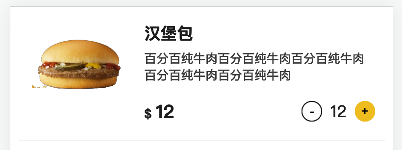

<br>

### 要求:
- 当有数字的时候 展示 ``- number +``
- 当没有数字的时候 展示 ``-``

<br>

number的部分肯定是父组件传递过来的 我们可以根据是否有 number 来决定是否渲染 ``- number`` 的部分

<br>

### v-if逻辑:
也就是说我们需要使用 ``v-if`` 的逻辑, 在react中为: 
```js
表达式 && (html结构)

// 当有多个html结构时我们使用如下的方式:
表达式 && (
  <>
    多个结构
    多个结构
  </>
)
```

<br>

**错误示例:**   
我们下面是希望使用类似 v-if 的逻辑, 当条件满足的时候再渲染结构

条件为 **有 amount** 同时 **amount 不为0** 的时候展示 减号按钮 和 数字部分

```js
const Counter = props => {
  console.log(typeof props.amount)
  return (
    <div className="counter-wrap">
      {
        // 有 amount 同时 amount 不为0 的时候展示 减号按钮 和 数字部分
        props.amount && props.amount > 0 && (
          <>
            <button className="btn dec-btn">-</button>
            <span className="number">{ props.amount }</span>
          </>
        )
      }
      <button className="btn inc-btn">+</button>
    </div>
  );
};
```

我们发现上面页面的效果是 ``0 和 加号按钮``

<br>

**原因:**  
在 React 中, 0 是有效的子元素, 它会被渲染为文本节点显示在页面上。以下是一个简单的代码示例来展示 0 作为有效子元素的情况: 

```js
import React from 'react';

const App = () => {
  return (
    <div>
      {0}
    </div>
  );
};

export default App;
```

在上面的代码中, {0} 被直接放置在 ``<div>`` 元素中, 作为其子元素。当组件渲染时, 0 将以文本形式显示在页面上。

虽然在 JavaScript 中, 数字 0 被视为 falsy 值, 但在 React 的 JSX 中, 它仍然被视为有效的子元素, 会被渲染到 DOM 中。

<br>

**修改: 表达式 && (结构) -> 三元表达式**
```js
const Counter = props => {
  console.log(typeof props.amount)
  return (
    <div className="counter-wrap">
      {
        // 有 amount 同时 amount 不为0 的时候展示 减号按钮 和 数字部分
        props.amount && props.amount > 0 
          ? (
            <>
              <button className="btn dec-btn">-</button>
              <span className="number">{ props.amount }</span>
            </>
          )
          : null
      }
      <button className="btn inc-btn">+</button>
    </div>
  );
};
```

<br>

### 加号按钮逻辑
当我们点击 + 的时候 会往购物车里面添加一个商品, 当购物车中已经有一件商品的时候 我们再点加号则应该展示2

<br>

### 购物车数据问题:
加的本质就是将商品加入到购物车中, 那就应该有一个地方用来存储购物车数据

那存储购物车中数据的结构应该放在哪里? App组件

<br>

### Counter组件代码部分:
```js
import React from 'react';
import "./Counter.scss"

const Counter = props => {

  // 添加购物车的回调
  const addHandler = () => {
    props.onInsert()
  }

  const delHandler = () => {
    props.onDel()
  }

  return (
    <div className="counter-wrap">
      {
        // 有 amount 同时 amount 不为0 的时候展示 减号按钮 和 数字部分
        props.amount && props.amount > 0
          ? (
            <>
              <button
                className="btn dec-btn"
                onClick={ delHandler }
              >-</button>
              <span className="number">{ props.amount }</span>
            </>
          )
          : null
      }
      <button
        className="btn inc-btn"
        onClick={ addHandler }
      >+</button>
    </div>
  );
};

export default Counter;
```

<br><br>

## 汉堡案例: 汉堡列表组件

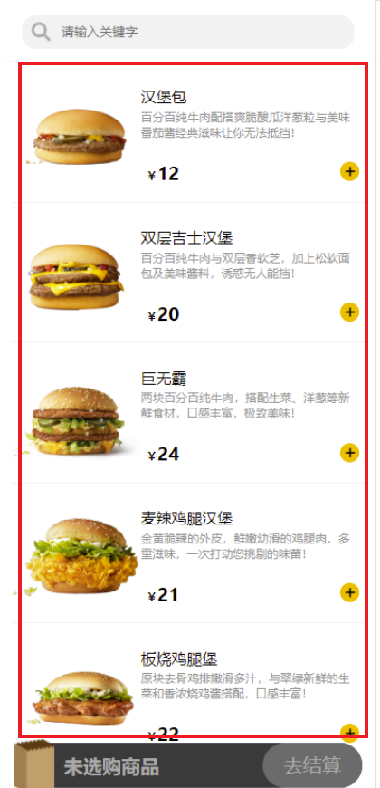

<br>

### 结构:
整个列表组件为 Meals组件, 里面有一个个的Item组件 大致的组件关系如下
```html
<Meals>
  <MealItem>
```

<br><br>

## Meals组件:

### 列表数据问题:
Meals组件是渲染汉堡包列表的组件, 那我们首先思考一个问题 列表数据我们放在哪里

1. 搜索框需要用到 列表数据
2. 购物车组件需要用到 列表数据

所以我们要将列表数据提升到它们3个的父组件内使用 也就是App组件

<br>

### 滚动条设置为指定元素:
当我们的 MealItem 组件多的时候 屏幕上就会出现滚动条

```js
const Meals = props => {
  return (
    <div className="meals-wrap">
      <MealItem />
      <MealItem />
      <MealItem />
      <MealItem />
      <MealItem />
    </div>
  );
};
```

<br>

如果我们没有指定的话 滚动条是 body 的, 也就是说现在的情况是整体从 body 上溢出了

如果我们不想将滚动条设置给body 那么只能设置给 Meals组件的.meals-wrap

如果我们要想将 滚动条 设置为 meals-wrap 的话, 那么我们就需要给 meals-wrap 它设置一个高度

它的高度应该和屏幕的高度一致 我们使用如下的方式 将meals-wrap容器设置为何屏幕一边高

```scss
.meals-wrap {
  position: absolute;
  top: 0;
  bottom: 0;
  // 验证用: background: red;

  // 将滚动条添加到该元素上
  overflow: auto;
}
```

<br>

### Meals组件代码部分:
```js
import React from 'react';

import MealItem from "./components/MealItem";
import "./Meals.scss"

const Meals = props => {
  const { hamburgers, onInsert, onDel } = props
  return (
    <div className="meals-wrap">
      {
        hamburgers.map(item => (
          <MealItem
            hamburger={ item }
            key= { item.id }
            onInsert={ onInsert }
            onDel={ onDel }
          />
        ))
      }
    </div>
  );
};

export default Meals;
```

<br><br>

## MealItem组件
数据列表中 每一个item项

### MealItem组件的代码部分:
```js
import React from 'react';
import "./MealItem.scss"

import Counter from "../../../components/Counter";

const MealItem = props => {
  const { hamburger, onInsert, onDel } = props
  return (
    <div className="meal-item-wrap">
      {/* 汉堡图片区域 */}
      <div className="img">
        
      </div>
      {/* 汉堡详情区域 */}
      <div className="desc">
        <h3>{ hamburger.title }</h3>
        <p>{ hamburger.desc }</p>
        <div className="other">
          {/* 价格区域 */}
          <div className="price">
            <span className="icon">$ </span> { hamburger.price }
          </div>
          {/* 按钮区域 */}
          <Counter
            amount={ hamburger.amount }
            onInsert={ () => onInsert(hamburger) }
            onDel={ () => onDel(hamburger) }
          />
        </div>
      </div>
    </div>
  );
};

export default MealItem;
```

<br><br>

# Context: 任意组件之间的通信
上面的案例中有一个问题 就是App组件中的一个方法要经过层层传递 传递到后代组件中
```s
App
↓
Meals
↓
MealItem
↓
Counter
```

这样做实现太麻烦了, 因为一个方法Meals, MealItem 都不会使用, 然而我们的方法却还需要经过它们

<br>

### props的问题:
在React中组件间的数据通信是通过props进行的, 父组件给子组件设置props, 子组件给后代组件设置props, props在组件间自上向下（父传子）的逐层传递数据。

但并不是所有的数据都适合这种传递方式, **有些数据需要在多个组件中共同使用**, 如果还通过props一层一层传递, 麻烦自不必多说。

<br>

### Context作用:
**Context为我们提供了一种在不同组件间共享数据的方式**, 它不再拘泥于props刻板的逐层传递

而是在外层组件中统一设置, 设置后内层所有的组件都可以访问到Context中所存储的数据。

换句话说, Context类似于JS中的全局作用域, 可以将一些公共数据设置到一个同一个Context中, 使得所有的组件都可以访问到这些数据。

<br>

### Context使用方式:
Context类似全局作用域, 它内部的数据 所有组件都可见, 但是我们也不要将所有的数据都放在 Context中

不当的使用会导致我们的数据很乱 而且组件和数据会发生耦合 组件会依赖该数据 这时我们再考虑复用的问题就没有那么方便了

在合适的场景再使用它

<br>

**1. src/context/contextTest.js 创建context文件目录, 作为专门存储数据的区域**  
contextTest.js相当于一个公共的存储空间 我们可以将多个组件中都需要访问的数据统一的存储到一个Context中

这样无需通过props逐层传递 即可使组件访问到这些数据

<br>

### **<font color='#C2185B'>React.crateContext(数据)</font>**  
创建 Context容器, 并指定数据, 这里指定的数据为默认值

一般我们都是在App组件中使用Provider来指定数据, 所以这里可以传null

<br>

**返回值:**  
Context容器

<br>

**注意:**  
一般我们不会直接使用 初始化容器中我们指定的数据, 一般我们的数据都是在App组件中

<br>

**2. 暴露我们创建的 Contxt容器**
```js
 import React from "react"

 // 1. 创建 Context 容器 并传入共享数据
 const demoContextContainer = React.createContext({
   name: "sam",
   age: 18
 })

 // 2. 对外暴露 Context 容器
 export default demoContextContainer
```

<br>

**3. 在目标组件中引入 上面我们创建的 Context容器**  
哪个组件需要context中的数据, 我们就在哪个组件中引入Context容器

比如我们导入 DemoContext
```js
// 引入 Context容器
import DemoContext from "../context/demoContext";
```

<br>
<font color='#C2185B'>引入的Context容器首字母必须大写 因为要当组件使用</font>

<br>

**4. 使用方式1: 使用 ``<DemoContext.Consumer>`` 组件 获取存放在Context容器中的数据**  
当我们暴露出来Context容器后 容器自身上就有Consumer属性 它是react提供的组件

<br>

### **<font color='#C2185B'>``<DemoContext.Consumer>``</font>**
Context容器中数据的消费者, 在目标组件中使用, 该组件中可以获取到定义在Contxt容器中的数据
```js
<DemoContext.Consumer>
  {
    (data) => {}
  }
</DemoContext.Consumer>
```

<br>

<font color='#C2185B'>该组件中必须在标签体的位置传入一个函数</font>

传入函数后函数就会被调用, react会将我们创建的context容器中保存的数据传入到函数的形参中

<br>

```js
const ContextTest = () => {
  return (
    <DemoContext.Consumer>
      {
        (data) => {
          return (
            // 访问 context 中的数据
            <div>{data.name}</div>
          )
        }
      }
    </DemoContext.Consumer>
  )
};
```

<br>

**5. 使用方式2: 使用context钩子函数**

### **<font color='#C2185B'>useContxt(创建的Context容器)</font>**  
获取Context中保存的数据

<br>

```js
// 1. 引入 Context容器
import DemoContext from "../context/demoContext";

const ContextTest = () => {

  // 2. 使用钩子函数获取Contxt中保存的数据
  const data = useContext(DemoContext)

  return (
    <div> { data.name } </div>
  )
};
```

<br>

### 利用Contxt容器: 提供组件中的数据, 任意组件可访问该数据

### **<font color='#C2185B'>``<DemoContext.Provider value={数据}>``</font>**  
数据的生产者, 我们可以使用该组件指定 或者说定义 Context容器中的数据, 供该组件的子组件访问

比如我们可以在App组件中 引入Contxt容器, 然后通过 ``<DemoContext.Provider value>`` value属性值来指定 App组件中定义的数据 供其他组件访问

<br>

**<font color='#C2185B'>这才是我们Context使用的正确方式, 在App组件中指定要提供的数据</font>**

<br>

```js
<DemoContext.Provider value={ state中的数据 }>
  <A />
  <B />
  <C />
</DemoContext.Provider>
```

这样 ABC 组件中就可以通过 useContext 拿到它指定的数据了

<br>

### 示例:
App组件使用 DemoContext.Provider 提供数据
```js
// 1. 引入 Context 容器
import DemoContext from "./context/demoContext";


const App = () => {

  // 2. 定义数据
  const [testData, setTestData] = useState(false)

  return (
    // 3. 向 DemoContext.Provider 子组件提供数据
    <DemoContext.Provider value={ testData }>
      <div className="app-wrap">
        <ContextTest />
      </div>
    </DemoContext.Provider>
  );
};
```

<br>

ContextTest组件使用数据
```js
// 1. 引入 Context容器
import DemoContext from "../context/demoContext";

const ContextTest = () => {

  // 2. 使用钩子函数获取Contxt中保存的数据
  const data = useContext(DemoContext)
  console.log(data)

  return (
    <div> { data + "" } </div>
  )
};
```

<br>

### 场景:
跨组件传递数据

<br><br>

## 汉堡案例: 搜索框组件
我们在搜索框里面输入数据, 将有关键字的数据过滤出来

<br>

### 实现: 
1. Search组件将用户输入传递到父组件中
```js
import React, {useState} from 'react';
import "./Search.scss"

const Search = props => {

  const { onSearch } = props

  const changeHandler = e => {
    const keyword = e.target.value.trim()
    onSearch(keyword)
  }

  return (
    <div className="search-wrap">
      <input
        type="text" placeholder="请输入关键字"
        onChange={ changeHandler }
      />
    </div>
  );
};

export default Search;
```

2. App组件定义回调通过props传入到子组件中 用于过滤在App组件中定义的数据
```js

import MEALS_DATA from "./data/mealsData"

const [hamburgers, setHamburgers] = useState(MEALS_DATA)

const filterHamburgers = name => {

  // 注意: 这里我们使用的不是state中的数据进行过滤的
  const _hamburgers = MEALS_DATA.filter(item => item.title.includes(name))
  setHamburgers(_hamburgers)
}
```

<br>

### 要点:
上面我们通过 name 关键字来过滤数组的时候 我们使用了 

``MEALS_DATA.filter()``

当我们使用 MEALS_DATA 数据源进行过滤的时候, 我们发现页面效果是正常的

<br>

如果我们使用 state 中的 hamburgers 数据源进行过滤

``hamburgers.filter()``

则页面效果就会出现问题 一片空白

<br>

### 原因:
由于 useState 异步更新状态的特性, 导致在 filterHamburgers 方法中立即调用 hamburgers.filter 时, hamburgers 的值可能还没有被更新为最新的值。
 
当组件首次渲染时, useState 定义的状态变量 hamburgers 会被初始化为 MEALS_DATA。然后, 当你调用 setHamburgers 来更新 hamburgers 的值时, 它并不会立即生效, 而是在 React 下一次渲染时才会更新。

比如我们的案例中 我们search组件使用的是 onchange 方法

它因为setState的重新渲染的原因 是实时触发的, 所以当我们输入第一个字母的时候 就会触发回调 

会去拿着 h 关键字去从 时, hamburgers 过滤数据

但是setState的逻辑是异步更新的, 而不是实时会看到最终的结果, 所以我们后续在通过 "汉堡" 搜索的时候, 它仍然返回的是 h 关键字搜索出来的空数组

因为他要等待react下一次更新的时候 才会渲染正确的值

<br>

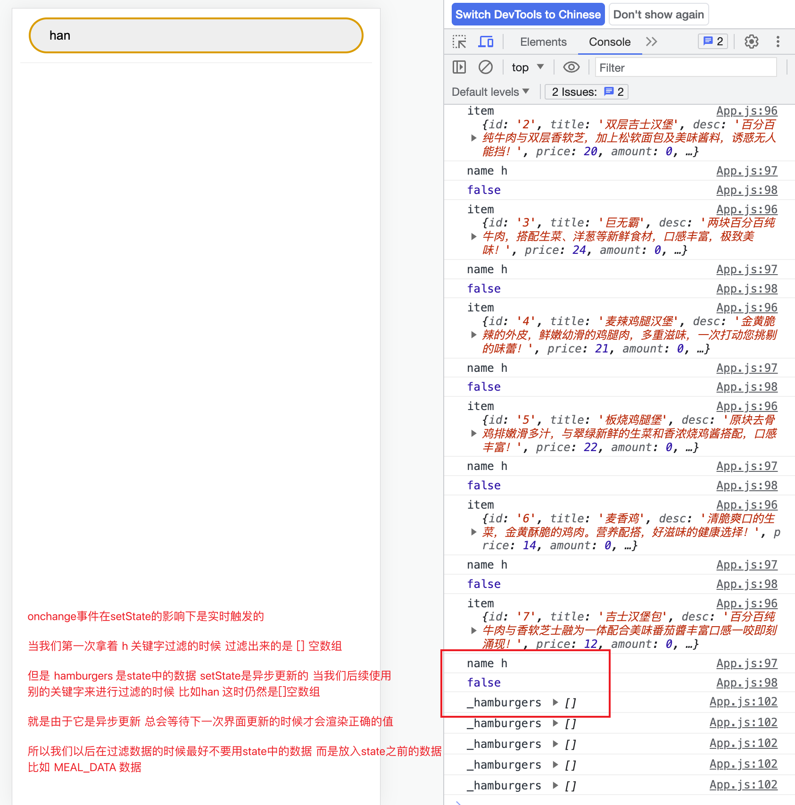

<br>

### ChatGPT的解决方式:
为了解决这个问题, 你可以通过使用 useEffect 钩子监听 hamburgers 的变化, 并在 hamburgers 更新后执行过滤操作, 确保使用的是最新的 hamburgers 值进行过滤。
```js
import React, { useState, useEffect } from 'react';

// ...

const App = () => {
  const [hamburgers, setHamburgers] = useState(MEALS_DATA);
  const [filteredHamburgers, setFilteredHamburgers] = useState(hamburgers);

  useEffect(() => {
    setFilteredHamburgers(hamburgers);
  }, [hamburgers]);

  const filterHamburgers = name => {
    const filtered = hamburgers.filter(item => item.title.includes(name));
    setHamburgers(filtered);
  };

  // ...

  return (
    // ...
  );
};

export default App;
```

在上述代码中, 我们使用了 useEffect 钩子来监听 hamburgers 的变化。每当 hamburgers 更新时, useEffect 会执行回调函数, 将最新的 hamburgers 值赋给 filteredHamburgers, 以便正确显示过滤后的结果。

这样, 在每次触发 onChange 事件时, filterHamburgers 方法会更新 hamburgers 的值, 并触发 useEffect 中的回调函数, 从而确保 filteredHamburgers 使用的是最新的过滤结果。

<br><br>

## 汉堡案例: 购物车组件

### 观察:
我们发现购物车的条 和 结账页面的条 几乎是一样的

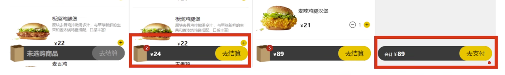

<br>

但是上面的情况是做成1个组件未必比做成2个组件要方便很多 所以这里我们分两个组件来做

<br>

### public/imgs & assets/imgs
public中的图片 一般都不会在我们的项目中, 它会存放在静态资源服务器中

而 assets/imgs 中的图片是跟我们的组件关联在一起的

所以一般要放在public中的图片都属于静态资源 我们可以放在public中 但是未来一定会在第三方存储 或者 静态资源服务器里

而跟我们组件相关联的图片 应该放在assets目录里面

<br>

### 访问 assets/imgs 下的资源问题
我们上面访问 /public/imgs 下的图片我们可以通过 ``"/imgs/01.png"`` 的方式访问

但是 /src/assets/imgs 我们是通过服务器路径访问不到的 它等于是一个私有的目录

所以当我们有资源放在assets目录下的时候 我们要将该图片当做是模块进行引入

```js
import IconImg from "./assets/imgs/01.png"


```

<br>

### 购物车条的两种状态
**1. 当购物车没有商品的时候**
1. 购物袋右上角没有 数量提示点
2. 没有金额
3. 金额区域展示 未选购商品
4. 去结算按钮 灰色 且 不能点击

<br>

**2. 当购物车有商品的时候**
1. 购物袋右上角有 数量提示点
2. 有金额
3. 金额区域展示 金额
4. 去结算按钮 黄色 且 能点击

<br>

我们使用 v-if 和 三元 来做

```js
import React from 'react';
import "./Cart.scss"

const Cart = (props) => {

  // 获取 购物车 中的信息
  const { cartData } = props

  return (
    <div className="cart-wrap">
      {/* 购物包区域 */}
      <div className="bag-icon">
        
        {

          // v-if 如果没有选择商品 则不显示数量点
          cartData.totalAmount > 0 && (
            <div className="icon-amount">{ cartData.totalAmount }</div>
          )
        }
      </div>
      {/* 价格区域 */}
      {/* 三元: 如果没有选择商品 我们给一个没有商品时展示的样式 */}
      <div className={`${ cartData.totalAmount > 0 ? "price" : "price no-price"}`}>
        {
          // 三元: 根据总数量来判断展示哪种结构
          cartData.totalAmount > 0
            ? (
              <>
                <span>$ </span> { cartData.totalPrice }
              </>
            )
            : (
            "未选购商品"
          )
        }
      </div>
      {/* 按钮区域 */}
      {/* 三元: 根据总数量展示 */}
      <div className="btn">
        <button
          className={`${ cartData.totalAmount > 0 ? "" : "no-active"}`}
          disabled={ cartData.totalAmount <= 0 }
          onClick={settleHandler}
        >去结算</button>
      </div>
    </div>
  )
};

export default Cart;
```

<br><br>

## 汉堡案例: 遮罩层
我们点击购物车区域的时候 应该展示购物车内商品的列表

这时为了防止用户点击购物车列表之外的区域 我们要在购物车列表的后面添加遮罩层

```s
后面区域
↓
遮罩层
↓
购物车列表
```

<br>

### 回顾遮罩层的创建方式:
1. index.html 中 创建 遮罩层的节点, 到时将遮罩层通过传送门传送到遮罩层节点中
```html
<body>
  <div id="root"></div>
  <div id="backdrop-wrap"></div>
</body>
```

2. 创建 遮罩层组件 (注意我们给遮罩层扩展了样式)
```css
.backdrop-wrap {
  position: fixed;
  left: 0;
  right: 0;
  bottom: 0;
  top: 0;
  background: rgba(0,0,0, .3);

  /* 确保我们的遮罩层在第一层上方 本案例中 购物车条为 99 */
  z-index: 9;
}
```
```js
import React from 'react';

// 1. 导入ReactDOM
import ReactDOM from "react-dom";
import "./Backdrop.scss"

// 2. 获取 遮罩层节点
const backdropRoot = document.querySelector("#backdrop-wrap")

const Backdrop = props => {
  // 3. 创建传送门 传入组件内容, 遮罩层节点 并return出去
  return ReactDOM.createPortal(
    (
      // 扩展下样式 如果有额外的样式我们可以通过props传入
      <div 
        { ...props }
        className={`backdrop-wrap ${props.className}`}
      >
        { props.children }
      </div>
    ),
    backdropRoot
  );
};

export default Backdrop;
```

3. 使用遮罩层组件 我们要 **将 某个组件 放入到 遮罩层组件中 作为遮罩层的标签体内容**

<br><br>

## 汉堡案例: 购物车详情

### 购物车详情组件 要放入 遮罩层中
```js
import React from 'react';
import "./CartDetails.scss"
import Backdrop from "./Backdrop";

const CartDetails = () => {
  return (
    // 遮罩层
    <Backdrop>
      {/* 购物车详情内容 */}
      <div className="cart-details-wrap">

      </div>
    </Backdrop>
  );
};

export default CartDetails;
```

<br>

### 购物车详情组件: 展示内容
我们使用 MealItem组件 来渲染购物车列表中的数据
```js
<div className="detail-list">
  {
    items.map(item => {
      return (
        <MealItem hamburger={ item } key={item.id}/>
      )
    })
  }
</div>
```

<br>

### 购物车详情组件: 样式
这里要关注的就是 我们让哪个元素出现滚动条 就使用 ``overflow: auto;`` 这个元素必须有固定的高度

当内容溢出的时候 就可以有滚动条了

```scss
.cart-details-wrap {
  font-size: 0.16rem;
  width: 100%;

  // 让它的高度根据内容可变 最大70%
  max-height: 6rem;
  background: #fff;

  // 设置 左右上方的圆角
  border-top-left-radius: 0.2rem;
  border-top-right-radius: 0.2rem;

  padding: 0.2rem;

  position: absolute;
  // 让购物车列表靠下对齐
  bottom: 0;

  // 让出购物车条的高度
  padding-bottom: 0.7rem;

  // 只有加上这两句后 滚动条才会出现在 餐品详情组件中
  display: flex;
  flex-direction: column;

  .details-header {
    display: flex;
    justify-content: space-between;
    align-items: center;
  }

  .clear-btn {
    color: #797979;
    cursor: pointer;
    .content {
      margin-left: 0.08rem;
    }
  }

  .detail-list {
    // 当内容溢出的时候在该元素上添加滚动条
    overflow: auto;
  }
}
```

<br>

### 购物车详情组件: 展示和隐藏
购物车详情组件是需要通过 点击 购物车bar 来控制是否显示 购物车详情组件

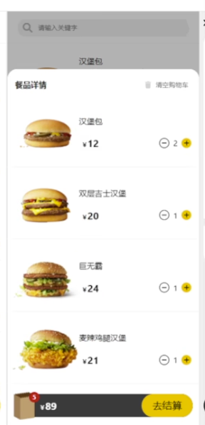

<br>

我们在state中定一个属性 用来控制该组件的显示和隐藏

<br>

**App组件:**
```js
import React, {useState} from 'react';

// 导入样式
import "./App.scss"
// 导入列表数据
import MEALS_DATA from "./data/mealsData"

// 导入Context容器
import CartDataOperatorContext from "./context/CartDataOperatorContext";

// 导入组件
import Meals from "./views/Meals/Meals";
import Search from "./components/Search";
import Cart from "./components/Cart";
import CartDetails from "./components/CartDetails";


const App = () => {

  ...

  // 点击购物车Bar 展示餐品详情组件
  const [detailVisible, setDetailVisible] = useState(false)

  const cartBarController = () => {
    setDetailVisible(!detailVisible)
  }

  return (
    <CartDataOperatorContext.Provider value={{insertCartItem, delCartItem}}>
      <div className="app-wrap">
        
        ...

        {/* 点击CartBar的时候会将点击结果传回app组件 */}
        <Cart
          cartData={ cartData }
          cartBarController={ cartBarController }
        />

        {
          // 当 detailVisible 为true 的时候我们再显示 餐品详情组件
          detailVisible && (
            <CartDetails
              cartData={ cartData }
            />
          )
        }
      </div>
    </CartDataOperatorContext.Provider>
  );
};

export default App;
```

<br>

**Cart组件:**  
我们给整个组件绑定了CartBarClickHandler事件, 相当于事件委托

然后通过className来判断我们点击的是哪个目标 是否触发回调

```js
import React from 'react';
import "./Cart.scss"

const Cart = (props) => {

  // 获取 购物车 中的信息
  const { cartData, cartBarController } = props


  // 点击结算按钮的回调
  const settleHandler = () => {
    console.log("settleHandler")
  }


  // 用户点击 购物车Bar 的回调
  const CartBarClickHandler = e => {
    const els = ["img", "price no-price", "price"]
    const flag = els.includes(e.target.className)

    if (flag) cartBarController()
  }

  return (
    <div
      className="cart-wrap"
      onClick={ CartBarClickHandler }
    >
      {/* 购物包区域 */}
      <div className="bag-icon">
        
        ...
      </div>
      {/* 价格区域 */}
      <div>
        ...
      </div>
      {/* 按钮区域 */}
      <div className="btn">
        <button>去结算</button>
      </div>
    </div>
  )
};

export default Cart;
```

<br>

### 购物车详情代码部分:
```js
import React, {useState} from 'react';
import "./CartDetails.scss"
import Backdrop from "./Backdrop";
import Meals from "../views/Meals/Meals";
import MealItem from "../views/Meals/components/MealItem";
import Confirm from "./Confirm";

const CartDetails = props => {

  // 获取购物车中的数据
  const { cartData: { items }, removeCart } = props


  // 清空购物车的确认提示框
  const [confirmVisible, setConfirmVisible] = useState(false)
  // 清空购物车的事件回调
  const clearCartHandler = () => {
    setConfirmVisible(true)
  }

  const onConfirm = () => {
    removeCart()
    setConfirmVisible(false)
  }
  const onCancel = () => {
    setConfirmVisible(false)
  }

  return (
    <>
      <Backdrop>
        <div className="cart-details-wrap">
          {/* 购物车详情: 头部区域 */}
          <header className="details-header">
            <h3>餐品详情</h3>
            <div
              className="clear-btn"
              onClick={ clearCartHandler }
            >
              <span className="icon">×</span>
              <span className="content">清空购物车</span>
            </div>
          </header>
          {/* 使用 MealItem 组件 渲染购物车中的数据 */}
          <div className="detail-list">
            {
              items.map(item => {
                return (
                  <MealItem hamburger={ item } key={item.id}/>
                )
              })
            }
          </div>
        </div>
      </Backdrop>

      {/* 清空购物车的对话框 */}
      {
        confirmVisible && (
          <Confirm
            onConfirm={ onConfirm }
            onCancel={ onCancel }
            confirmText="您确认要清空购物车么?"
          />
        )
      }
    </>
  );
};

export default CartDetails;
```

<br>

### 清空购物车提醒对话框组件: 
```js
import React from 'react';
import "./Confirm.scss"
import Backdrop from "./Backdrop";

const Confirm = props => {
  return (
    // 将当前组件的样式 传递 Backdrop组件 用来调整遮罩层的z-index
    <Backdrop className="backdrop-zindex">
      <div className="model-wrap">
        <div className="model-content">
          { props.confirmText }
        </div>
        <div className="model-btn">
          <button
            onClick={ props.onConfirm }
          >确认</button>
          <button
            onClick={ props.onCancel }
          >取消</button>
        </div>
      </div>
    </Backdrop>
  );
};

export default Confirm;
```

<br>

### 购物车详情组件: 清空购物车
1. CartDetails组件内 点击 清空购物车 按钮 展示提醒对话框组件

2. CartDetails组件内 设置操作 提醒对话框组件 显示 和 隐藏 的变量

3. CartDetails组件内 设置 提醒对话框组件内的 确认 和 取消 按钮的逻辑回调 通过props传递给对话框组件

4. 当点击取消的时候关闭对话框组件 当点击确认的时候调用App组件的回调 清空购物车

```js
import React, {useState} from 'react';
import "./CartDetails.scss"
import Backdrop from "./Backdrop";
import Meals from "../views/Meals/Meals";
import MealItem from "../views/Meals/components/MealItem";
import Confirm from "./Confirm";

const CartDetails = props => {

  // 获取购物车中的数据
  const { cartData: { items }, removeCart } = props


  // 清空购物车的确认提示框
  const [confirmVisible, setConfirmVisible] = useState(false)

  // 清空购物车的事件回调
  const clearCartHandler = () => {
    setConfirmVisible(true)
  }

  const onConfirm = () => {
    removeCart()
    setConfirmVisible(false)
  }
  const onCancel = () => {
    setConfirmVisible(false)
  }

  return (
    <>
      ...

      {/* 清空购物车的对话框 */}
      {
        confirmVisible && (
          <Confirm
            onConfirm={ onConfirm }
            onCancel={ onCancel }
            confirmText="您确认要清空购物车么?"
          />
        )
      }
    </>
  );
};

export default CartDetails;
```

<br>

**App组件:**  
```js
const removeCart = () => {
  // 浅复制对象
  const _cartData = { ...cartData }

  _cartData.items.forEach(item => delete item.amount)

  _cartData.items = []
  _cartData.totalAmount = 0
  _cartData.totalPrice = 0

  setCartData(_cartData)
  setDetailVisible(false)
}
```

<br>

**注意:**  
最开始清空购物车的逻辑我是这么写的, 我直接将 items 置换成 []
```js
const removeCart = () => {
  const _carData = { 
    items: [],
    totalAmount: 0,
    totalPrice: 0
  }
  
  setCartData(_carData)
  setDetailVisible(false)
}
```

上面的写法导致了一个问题, 就是当我清空购物车后 商品列表上还有 ``- 1 +`` 

正常当我清空购物车后 商品列表上应该只有 ``+``

<br>

**原因:**  
创建了一个新的 _cartData 对象, 并设置了空的购物车数据。但是在这个逻辑中, 您没有确保 items 数组中的每个商品对象也被更新为新的对象。

因此, 当您在渲染 CartDetails 组件时, 之前的商品对象仍然保留在 items 数组中, 导致在页面上显示旧的商品数量。

在第二个逻辑中, 您使用了浅复制对象的方式创建 _cartData, 并删除了每个商品对象的 amount 属性。这确保了每个商品对象都是新的对象, 而不是之前的对象的引用。

因此, 当您设置新的购物车数据时, 页面上不会显示旧的商品数量。

<br>

**总结:**  
当我们的数据结构为 ``[{},{},{}]`` 而且我们使用该数据结构渲染页面之后

我们想清空这个数组, 最好不用 ``items = []`` 的这种方式

因为这种方式相当于将 items 指向了另一个对象, 而原有的``{}``中的数据 还被别的地方引用着

所以导致了当我们替换了 items 之后, 页面上仍然被渲染为旧数据 就是因为 ``{}`` 被页面引用着 使用了里面的数据

<br>

### 购物车代码部分:
```js
import React from 'react';
import "./Cart.scss"

const Cart = (props) => {

  // 获取 购物车 中的信息
  const { cartData, cartBarController, orderController } = props


  // 点击结算按钮的回调
  const settleHandler = () => {
    console.log("点击去结算时我们看看 cartData 里面有啥", cartData)
    orderController()
  }


  // 用户点击 购物车Bar 的回调
  const CartBarClickHandler = e => {
    const els = ["img", "price no-price", "price"]
    const flag = els.includes(e.target.className)

    if (flag) cartBarController()
  }

  return (
    <div
      className="cart-wrap"
      onClick={ CartBarClickHandler }
    >
      {/* 购物包区域 */}
      <div className="bag-icon">
        
        {
          cartData.totalAmount > 0 && (
            <div className="icon-amount">{ cartData.totalAmount }</div>
          )
        }
      </div>
      {/* 价格区域 */}
      <div className={`${ cartData.totalAmount > 0 ? "price" : "price no-price"}`}>
        {
          cartData.totalAmount > 0
            ? (
              <>
                <span>$ </span> { cartData.totalPrice }
              </>
            )
            : (
            "未选购商品"
          )
        }
      </div>
      {/* 按钮区域 */}
      <div className="btn">
        <button
          className={`${ cartData.totalAmount > 0 ? "" : "no-active"}`}
          disabled={ cartData.totalAmount <= 0 }
          onClick={settleHandler}
        >去结算</button>
      </div>
    </div>
  )
};

export default Cart;
```

<br><br>

## 汉堡案例: 订单页面
我们点击去结算按钮后 就会展示订单页面 它已出现后会覆盖掉整个App

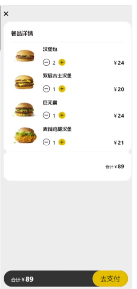

<br>

因为它属于顶层的DOM结构, 我们也可以同 **传送门** 的方式, 将组件传送到 index.html 中指定的节点上

```html
<body>
  <div id="root"></div>
  <div id="backdrop-wrap"></div>
  <div id="order-wrap"></div>
</body>
```

<br>

### 订单页面代码:
```js
import React from 'react';
import ReactDOM from "react-dom";
import "./Order.scss"

import OrderItem from "./OrderItem";

// 传送用: 获取 html 中订单弹出层的目标节点
const orderRoot = document.querySelector("#order-wrap")

const Order = props => {
  // 获取 购物车数据 和 关闭弹出层的方法
  const { closeOrder, cartData } = props

  // 关闭订单页面
  const closeHandler = () => {
    closeOrder()
  }

  return ReactDOM.createPortal(
    (
      <div className="order-wrap">
        {/* 关闭按钮区域 */}
        <div
          className="close-btn"
          onClick={ closeHandler }
        >
          <span>×</span>
        </div>
        <div className="order-main">
          <header>
            <h3>餐品详情</h3>
          </header>
          <div className="list">
            {
              cartData.items.length > 0
                ? (
                  cartData.items.map(item => {
                    return (
                      <OrderItem
                        key={item.id}
                        hamburger={item}
                      />
                    )
                  })
                )
                : (
                  "没有数据了哦"
                )

            }
          </div>
          <footer>
            <span className="total">合计: </span>
            <span className="prefix">$</span>
            <span className="price">{ cartData.totalPrice }</span>
          </footer>
        </div>
      </div>
    ),
    orderRoot
  )
};

export default Order;
```
```scss
.order-wrap {
  font-size: 0.16rem;
  position: absolute;
  top: 0;
  left: 0;
  right: 0;
  bottom: 0;
  z-index: 999;
  background: #eee;

  padding: 0.2rem;

  .close-btn {
    width: 0.3rem;
    height: 0.3rem;
    display: flex;
    justify-content: center;
    align-items: center;
    font-weight: bold;
    font-size: 0.25rem;
  }

  .order-main {
    background: #fff;
    border-radius: 0.2rem;
    padding: 0.2rem;
    margin-top: 0.2rem;
    //max-height: 70%;
    //overflow: auto;

    header {
      height: 0.5rem;
      display: flex;
      border-bottom: 1px solid #eee;
      align-items: center;
    }

    .list {
      padding: 0.1rem 0;
      height: 5rem;
      overflow: auto;
    }

    footer {
      height: 0.5rem;
      display: flex;
      justify-content: right;
      align-items: center;
      border-top: 1px solid #eee;
      padding-top: 0.1rem;

      .total {
        font-weight: bold;
        margin-right: 0.15rem;
      }
      .prefix {
        font-size: 0.16rem;
        margin-right: 0.05rem;
      }
      .price {
        font-size: 0.24rem;
      }
    }
  }
}
```

<br>

### 订单项:
```js
import React from 'react';
import "./OrderItem.scss"
import Counter from "./Counter";

const OrderItem = props => {

  const { hamburger } = props
  
  return (
    <div className="order-item-wrap">
      <div className="img-area">
        
      </div>
      <div className="detail-area">
        <h3 className="title">{ hamburger.title }</h3>
        <div className="content">
          <div className="operator">
            {/* 复用了 Counter 按钮部分的组件 */}
            <Counter hamburger={ hamburger }/>
          </div>
          <div className="price">{ hamburger.price * hamburger.amount }</div>
        </div>
      </div>
    </div>
  );
};

export default OrderItem;
```

```scss
.order-item-wrap {
  display: flex;
  align-items: center;
  border-bottom: 1px #eee dashed;

  .img-area {
    flex: 2;
    margin-right: 0.1rem;

    img {
      width: 100%;
    }
  }

  .detail-area {
    flex: 4;

    .title {
      margin-bottom: 0.2rem;
    }

    .content {
      display: flex;
      justify-content: space-between;
      padding-right: 0.1rem;

      .price {
        font-weight: bold;
        font-size: 0.18rem;

        &:before {
          content: "$";
          font-size: 0.14rem;
          margin-right: 0.05rem;
        }
      }

      .operator {
        display: flex;
        align-items: center;

        .btn {
          width: 0.2rem;
          height: 0.2rem;
          border-radius: 50%;
          border: none;
          background: #fff;
          cursor: pointer;
        }

        .number {
          font-size: 0.16rem;
          color: #212121;
          padding: 0 0.08rem;
        }

        .dec-btn {
          border: 1px solid #212121;
        }

        .inc-btn {
          background: #FBC02D;
        }
      }
    }
  }

  & + .order-item-wrap {
    margin-top: 0.2rem;
  }
}
```

<br><br>

# Effect: 副作用
上面我们的案例大致是完成了 但还遗留了很多的问题 比如

### 问题:
当我们向购物车中添加商品的时候 商品会在购物车中显示 在购物车中我们是可以调整商品的数量的 当我们点击 ``-`` 将商品都删除的时候

购物车应该消失不显示

<br>

同样的问题也存在在订单页面 当我们在结账界面调整商品的数量 当都为0的时候

结账页面也应该消失不显示

<br>

### 处理方式:
我们在某些事件的回调中 添加了 商品数量 的判断 根据商品数量我们判断是否应该显示购物车

逻辑是好用的 但是还有更好的方式

<br>

**要做的事:**  
当我们增加商品数量的时候 购物车会重新渲染, 我们希望要做的事就是 当购物车重新被渲染的时候

我们就去检查一下购物车当中商品的数量 

如果商品的数量为0 意味着购物车中的商品已经清空 我们就将购物车显示与否的变量设置为false 让它不显示

<br>

### 项目回顾:
App组件**定义是否展示 购物车 的变量**
```js
const [detailVisible, setDetailVisible] = useState(false)
```

App组件使用了 v-if 的模式 根据这个变量我们控制购物车是否展示
```js
detailVisible && (
  <CartDetails
    cartData={ cartData }
    removeCart={ removeCart }
  />
)
```

当我们点击 购物车条(Cart组件) 会触发 ``cartBarController`` 方法

Cart组件会通知App组件来修改 detailVisible 变量, 用于控制购物车的展示

<br>

### 组件什么时候会重新渲染?
组件在react中就是一个函数, 组件的重新渲染就是函数的再次执行

组件每次重新渲染 组件的函数体就会重新执行

既然这样我们想要完成上面的功能, 也就是在组件每次重新渲染的时候 检查一下商品的总数量

如果商品总数量为0: 则修改 detailVisible 为 false

<br>

是不是在函数体中加一个判断就可以了, 比如我们在App组件的函数体中加上下面的逻辑
```js
// 函数体里直接这么写:

/*
  监视: 在组件每次重新渲染的时候 检查一下商品的总数量
    如果商品总数量为0: 则修改 detailVisible 为 false
*/
if (cartData.totalAmount === 0) {
  setDetailVisible(false)
}
```

<br>

我们会发现报错了, 太多的重渲染
```s
Error: Too many re-renders Reacts limits the number of renders to prvenet an infinite loop
```

实际上我们写了一个死循环, 我们的App是一个函数式组件 它的特点就是组件每次渲染函数体就会重新执行

当我们的购物车中没有商品的时候 就会执行 setState函数 导致组件重新渲染 再次渲染那再次执行 就是死循环

<br>

### 注意:
我们不能在组件函数体中直接调用 setState 方法, 也就是我们不能在函数体当中直接修改state的值

<br><br>

## Effect介绍:
React组件有部分逻辑都可以直接编写到组件的函数体中的, 像是对数组调用filter、map等方法, 像是判断某个组件是否显示等。

但是有一部分逻辑如果直接写在函数体中, 会影响到组件的渲染, 这部分会产生"副作用"的代码, **是一定不能直接写在函数体中**

<br>

**例如:**   
如果直接将修改state的逻辑编写到组件之中 就会导致组件不断的循环渲染 直至调用次数过多内存溢出

<br>

### 什么能写在函数体中 什么不能写?
主要看我们组件的作用 组件最大的作用就是生成jsx

所以我们就要看我们写在函数体中的逻辑和生成jsx有没有关系
- 有关系就可以写
- 没有关系就不可以写

比如setState就不能写

<br>

### React.StrictMode:
当我们使用了该标签的时候 会导致一些生命周期等函数执行两次

```js
root.render(
  <React.StrictMode>
    <App />
  </React.StrictMode>
)
```

<br>

编写React组件时, 我们要极力的避免组件中出现那些会产生"副作用"的代码。

同时, 如果你的React使用了严格模式, 也就是在React中使用了React.StrictMode标签 它会进入react自身的严格模式

**那么React会非常"智能"的去检查你的组件中是否写有副作用的代码**, 当然这个智能是加了引号的, 我们来看看React官网的文档是如何说明的:

```s
Strict mode can’t automatically detect side effects for you, but it can help you spot them by making them a little more deterministic. This is done by intentionally double-invoking the following functions:

- Class component constructor, render, and shouldComponentUpdate methods

- Class component static getDerivedStateFromProps method

- Function component bodies

- State updater functions (the first argument to setState)

- Functions passed to useState, useMemo, or useReducer
```

<br>

上文的关键字叫做 **"double-invoking"** 即重复调用, 这句话是什么意思呢？大概意思就是,

React并不能自动替你发现副作用, 但是它会想办法让它显现出来, 从而让你发现它。

<br>

**那么它是怎么让你发现副作用的呢？**  
React的严格模式, **在处于开发模式下**, 会主动的重复调用一些函数, 以使副作用显现。

<br>

**<font color='#C2185B'>所以在处于开发模式且开启了React严格模式时, 这些函数会被调用两次</font>**

- 类组件的 constructor, render, 和 shouldComponentUpdate 方法

- 类组件的静态方法 getDerivedStateFromProps

- 函数组件的函数体

- 参数为函数的setState

- 参数为函数的useState, useMemo, or useReducer

<br>

重复的调用会使副作用更容易凸显出来, 你可以尝试着在函数组件的函数体中调用一个``console.log``你会发现它会执行两次

如果你的浏览器中安装了React Developer Tools, 第二次调用会显示为灰色。

<br>

### 哪些代码不能直接写在组件内部呢？
比如:
- 获取数据
- 记录日志
- 检查登录
- 设置定时器等

简单来说, 就是那些和组件渲染无关, 但却有可能对组件产生副作用的代码。

<br><br>

## Effect引入
上面我们抛出了一个问题 我们不能再函数体中直接写setState 这样会进入死循环

```js
import "./App.scss"
import {useState} from "react";

function App() {
  
  const [count, setCount] = useState(0)
  
  // 直接在函数体中调用setState
  setCount(0)
  
  return (
    <div className="app-wrap">
      我是App组件
    </div>
  );
}

export default App;
```

<br>

**死循环:**  
当我们在函数体中直接调用 setState 的时候, 就会触发 ``Too many re-renders``

<br>

**疑问:**  
我们上面使用的是 ``setCount(0)`` 以前我们不是说过 当新的state的值 和 旧的state的值 相同时 不是不会触发组件的重新渲染么

上面我们调用setState设置的是0 该值和初始值一致为什么还是会触发组件的重新渲染呢?

<br>

### setState的执行流程:
我们这里说的是函数式组件中的setState 和 类式组件中的不一样

<br>

当我们调用 setCount() 时候 它底层是找ReactDOM中的 dispatchSetDate()  

<br>

**dispatchSetDate()的逻辑:**  
它会做如下的逻辑

<br>

**1. 先去判断 组件当前处于什么状态 (react组件存在两种状态)**  
- 渲染阶段
- 非渲染阶段(渲染完了)

<br>

**如果处于渲染阶段的时候:**   
它不会检查state的值是否相同 (相同则不会重新渲染组件)

也就是说当我们在渲染阶段调用setState的时候 它会直接将操作放入队列等待渲染

<br>

比如上面死循环的例子 setCount(0) 在渲染阶段 因为函数还没有执行完呢

函数只有执行完return将DOM渲染到页面上了 才算是是直接完毕
 
```js
function App() {
  
  const [count, setCount] = useState(0)
  
  // setCount在这里执行 到这 所以是在渲染阶段
  setCount(0)
  
  return (
    <div className="app-wrap">
      我是App组件
    </div>
  );
}

export default App;
```

所以在函数体中直接调用的setState它是处于渲染阶段的 而渲染阶段是不会检查state的值是否相同的 它会直接将操作推到渲染队列中

<br>

**<font color='#C2185B'>也就是说我们不能在渲染阶段调用 setState</font>**

<br>

**如果处于非渲染阶段的时候(渲染已经结束):**  
这个阶段就是在事件回调中调用setState, 比如我们点击按钮的时候 组件已经渲染完毕了

<br>

它会检查state的值是否相同

- 如果值不相同, 则将组件推到渲染队列 进行重新渲染
- 如果值相同, 则不会组件重新渲染
  - 如果值相同 react会在一些情况下会继续执行当前组件的渲染 **但是这个渲染不会触发其子组件的渲染 同时这次渲染不会产生实际的效果**

<br>

**重渲染说明:**  
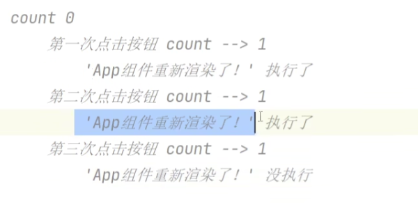

<br>

我们发现:

- 第一次点击按钮 count 由 0 - 1 组件重新渲染

- 第二次点击按钮 count 由 1 - 1 组件重新渲染

- 第三次点击按钮 count 由 1 - 1 组件没有重新渲染

<br>

为什么不是第二次点击按钮 就不重新渲染了 **为什么要等到第三次的时候才不重新渲染呢?**

<br>

**解答: 这是react的一种设计**    
第二次虽然react判断两个值一样了 两个值都是1 但是react会继续将当前组件的渲染执行 但是这次执行比较特殊

它就是执行下 它不会将其渲染到DOM树上 不会产生任何的实际效果 同时它只是渲染组件本身 子组件是不会渲染的

<br>

**非渲染阶段 state的新值和旧值相同时 会发生 **

**<font color='#C2185B'>或者说值在第一次相同的时候</font>**

<br><br>

## Effect使用
如果我们就是想在 函数体(渲染阶段)中写setState的逻辑 **怎么办?** 

<br>

上面报错的原因就是因为我们在函数体中写了 setState 它是在渲染阶段执行的 该阶段执行setState的时候不会检查 state的新值和旧值是否相同

直接会将重新渲染组件的操作推到队列中等待执行

为了解决这个问题我们其实不通过新的api 自己也可以解决 比如我们使用 setTimeout 

```js
function App() {
  
  const [count, setCount] = useState(0)
  
  // setCount放在setTimeout里面执行不会报错
  setTime(() => {
    setCount(1)
  }, 1000)
  
  return (
    <div className="app-wrap">
      我是App组件
    </div>
  );
}

export default App;
```

<br>

而其实我们的React中已经给我提供好了 解决这个问题的方式 也就是 ``useEffect()``

<br>

Effect的翻译过来就是副作用, **<font color='#C2185B'>专门用来处理那些不能直接写在组件内部的代码</font>**

<br>

### **<font color='#C2185B'>useEffect(() => {})</font>**  
在函数式组件里面使用 有 watch 和 **生命周期钩子** 的效果

参数函数其实是在组件渲染后执行(也就是虚拟DOM都比较晚了 它才会执行 类似nextTick)

它的执行时机是在渲染完毕的阶段

<br>

**参数:**
1. 函数, 它将会在组件渲染完毕后执行
2. 数组, 用于定义监视state中的哪个属性

<br>

**使用场景:**  
我们可以将那些会产生副作用的代码编写到useEffect中

它就相当于上面的setTimeout, 将渲染阶段的逻辑拿到渲染后执行 这样可以避免这些代码影响到组件的渲染

<br>

### 参数1的情况:
我们会传入一个回调函数, 该回调函数会在渲染完毕的阶段触发执行

<br>

**返回值:**  
它也叫做清理函数 它会在**下次effect执行前**调用

我们可以在这个函数中 做一些工作来清楚上次effect执行所带来的影响

```js
useEffect(() => {
  return () => {}
})


// 示例:
let timer = useRef(null)

useEffect(() => {

  // 正常我们会在这里清除上一个定时器
  // clearTimeout(timer.current)

  timer.current = setTimeout(() => {
    console.log("effect执行了")
    onSearch(keyword)
  }, 1000)


  // 清理函数: 我们可以将清理定时器的逻辑放在这里 和上面相同
  return () => {
    clearTimeout(timer.current)
  }
}, [keyword])
```


<br>

### 参数2的情况:
**1. 不传参数2:**  
**监测state中所有的数据**, 所有的状态发生改变的时候(组件重新渲染完毕后), 都会执行回调 

它会执行 1+n 次 **初始化自动执行回调一次** 只要组件更新还会继续调用该回调
```js
// 初始化 + 后续setState 都会执行回调函数
useEffect(() => {})


// 比如 我们在回调函数中调用了setCount 则它会执行两次
const [count, setCount] = useState(0)

// 直接在函数体中调用setState
useEffect(() => {
  setCount(1)
  console.log(count)
  /*
    输出两次:
      初始化时候输出: 0
      更新时候输出: 1
  */
})
```

<br>

**2. 传入空数组: 则谁也不监测**  
如果依赖项设置为空数组, effect只会在组件初始化的时候执行一次
```js
useEffect(() => {}, [])
```

<br>

**3. 传入数组且数组中指明state中的属性:**  
当监测的数据发生变化时 会触发该回调 **<font color='#C2185B'>类似Watch</font>**
```js
useEffect(() => {}, [count,number])
```

<br>

通常, 我们会将useEffect回调中使用的所有变化设置为 数组中的依赖项

这样一来可以确保这些值发生变化的时候, 会触发Effect的执行 确保我们能拿到最新最准的值

```js
const a = 10

useEffect(() => {

  console.log(a)

}, [a也要加入到监视中])

/*
  不管是 上面示例中的 a, 还有state中的值 和 函数 最好都加入到监视中 (当然state中的变量可以加入但不要修改)
  
  上面的示例中 useEffect中通过console 访问到外层的a了

  useEffect相当于外部组件函数中的嵌套函数 嵌套函数一旦创建完成后闭包就成立了 所以内层函数就可以访问到外层的a

  当我们的组件重新渲染后 组件的函数就重新调用了 这时可能会产生一个新的a a的值可能会发生变化 

  如果我们不把a加入监视 内层函数中使用的a很可能就是旧的值 不是最新的变量a
*/

// 示例: 汉堡案例
const a = 10
useEffect(() => {
  console.log(a)

  if(ctx.totalAmount === 0) {
    setShowDetails(false)
  }
}, [a, ctx, setShowDetails])

/*
  这样我们就能确保 a ctx setShowDetails 会是最新的值
*/
```

<br>

像setXxx等setState方法 是由useState()钩子函数生成的

useState()会确保组件的每次渲染都会获取到相同的setState()对象, 也就是每次组件重新渲染我们使用的setXxx等方法始终会是同一个

所以setXxx方法 放不放在监视数组中都可以

<br>

**注意, 该模式中的useEffect回调也会在初始化的时候默认执行一次, 后续才会当监视的对象发生变化后再次执行**

<br>

**注意:**
1. 不要监视了count 又在回调中修改count 会死循环
```js
useEffect(() => {
  setCount(2)
}, [count])
```

2. 不要在useEffect的回调中 每次修改为不一样的值
```js
useEffect(() => {
  // 每次都不一样 会无限的重新渲染
  setDetailVisible(!detailVisible)
})
```

<br>

### 对应的生命周期:
如果你熟悉 React class 的生命周期函数, 你可以把 useEffect Hook 看做
- componentDidMount
- componentDidUpdate
- componentWillUnmount

<br>

**componentDidMount & componentDidUpdate: 不传第二个参数**  
```js
useEffect(() => {})
```

<br>

**componentDidMount: 传入空数组**   
回调只会只会在组件挂载时执行一次
```js
useEffect(() => {}, [])
```

<br>

**componentWillUnmount: 需要参数函数返回一个函数 + 空数组**  
返回的函数中相当于componentWillUnmount   

**<font color='#C2185B'>我们可以在返回的函数中消除一些副作用</font>**

它也叫做清理函数, 它会在下次Effect执行前调用

```js
// 注意传入空数组
useEffect(() => {

  // 返回的函数中相当于 componentWillUnmount
  return () => {

  }
}, [])


// 示例:
let timer = useRef(null)

React.useEffect(() => {
  timer.current = setInterval(() => {
    setCount(count => count+1)
  }, 1000)


  // 这个函数相当于 componentWillUnmount()
  return () => {
    clearInterval(timer.current)
  }

}, [])
```

<br>

### 解决输出state值的问题
我在写react的时候 很习惯在通过setState修改state的值之后看看state最新的状态是什么 比如

```js
// 定义 state 
const [count, setCount] = useState(0)

// 按钮回调
const clickHandler = () => {
  // 修改state的值之后 我们看看state最新值的情况
  setCount(1)
  console.log(count)   // 输出0
}
```

因为setState是一个异步操作 当你调用 setCount(1) 来更新 count 的值时, React 并不会立即更新 count 的值, 而是将更新操作加入队列, 并在稍后的某个时刻才会执行更新。

因此, 在 console.log(count) 语句执行时, 更新操作尚未完成, count 的值仍然是上一次的值, 即 0。

<br>

使用useEffect解决

<br><br>

## 优化汉堡案例: 监视购物车中商品数量的变化
我们可以监视购物车中商品数量的变化 如果数量为0 可以关闭购物车Bar的打开状态

<br>

我们在app组件中添加如下的逻辑
```js
/*
  监视: 在组件每次重新渲染的时候 检查一下商品的总数量
    如果商品总数量为0: 则修改 detailVisible 为 false
*/
useEffect(() => {
  if (cartData.totalAmount <= 0) {
    // CartBar
    setDetailVisible(false)
    // Order
    setOrderVisible(false)
  }
}, [cartData.totalAmount])
```

<br><br>

## 优化汉堡案例: 搜索组件修改为 受控 + useEffect
之前我们的搜索组件并不是受控组件, 它是实时的将用户输入的数据 直接传回App组件 进行过滤

```js
const { onSearch } = props

const changeHandler = e => {
  const keyword = e.target.value.trim()
  onSearch(keyword)
}
```

<br>

现在我们可以将其修改为受控组件
1. 通过 change事件 将用户输入同步到 state中
2. 通过 绑定input.value 属性 将state的数据显示在input中 双向绑定
3. 通过监视keyword的变化调用 onSearch(keyword)

```js
const Search = props => {

  const { onSearch } = props

  // 双向绑定: 页面输入流入state, state中的值渲染到页面
  const [keyword, setKeyword] = useState("")

  const changeHandler = e => {
    setKeyword(e.target.value.trim())
  }


  // 当keyword发生变化的时候调用 onSearch
  useEffect(() => {
    onSearch(keyword)
  }, [keyword])

  return (
    <div className="search-wrap">
      <input
        type="text" placeholder="请输入关键字"
        onChange={ changeHandler }
        value={ keyword }
      />
    </div>
  );
};
```

<br>

### 再次优化: 防抖
上面的逻辑我们是监视 keyword 的变化, 但是有一个问题 只要是keyword发生变化 回调就会触发一次 这样太频繁了 如果是向服务器发请求的话 请求次数就太多了

<br>

比如我们想输入汉堡包, 但是当我们输入h的时候就会触发回调的执行

<br>

### 目标: 降低数据过滤的次数
我们希望的是用户输入完了后 我们再过滤 用户输入的过程中 不要过滤

比如用户在1秒内一直输入 我就不进行过滤, 如果用户超过1秒没有打字 我就可以认为用户输入完了 我们再进行过滤, 当用户停止输入动作1秒后 我们才进行过滤

<br>

### React中防抖的实现:

**要点:**  
1. 函数式组件 + useEffect 本身构成了闭包
2. timer的值最好的useRef:  
这是因为 timer 是一个在组件渲染之间需要保持持久性的值。使用 useRef 可以确保在每次渲染时保持相同的引用, 而不会创建新的变量。
```js
const Search = () => {

  let timer = useRef(null)

  useEffect(() => {

  }, [keyword])
}
```

3. useEffect参数回调返回一个函数的形式 清楚副作用

<br>

**逻辑:**  
每次调用useEffect会创建一个定时器, 它会先清空上一个定时器, 然后执行setTimeout

如果再次点击则会重新执行创建定时器

<br>

```js
import "./Search.scss"
import {useEffect, useRef, useState} from "react";

// 非受控组件的书写方式:
/*const Search = props => {

  const { onSearch } = props

  const changeHandler = e => {
    const keyword = e.target.value.trim()
    onSearch(keyword)
  }

  return (
    <div className="search-wrap">
      <input
        type="text" placeholder="请输入关键字"
        onChange={ changeHandler }
      />
    </div>
  );
};*/


// 受控组件的书写方式:
const Search = props => {

  const { onSearch } = props

  const [keyword, setKeyword] = useState("")

  const changeHandler = e => {
    setKeyword(e.target.value.trim())
  }


  let timer = useRef(null)

  useEffect(() => {

    timer.current = setTimeout(() => {
      onSearch(keyword)
    }, 1000)


    // 清除副作用: 该回调会在下次effect执行前调用
    // 保留最新的定时器, 所以关闭上一个定时器
    return () => {
      clearTimeout(timer.current)
    }
  }, [keyword])


  return (
    <div className="search-wrap">
      <input
        type="text" placeholder="请输入关键字"
        onChange={ changeHandler }
        value={ keyword }
      />
    </div>
  );
};


export default Search;
```

<br>

不用在外层定义 timer 如下的写法也可以
```js
useEffect(() => {
  // 在里面定义timer
  const timer = setTimeout(() => {
    console.log("effect执行了")
    onSearch(keyword)
  }, 1000)


  // 这里拿到的timer就是上面的
  return () => {
    console.log("timer", timer)
    clearTimeout(timer)
  }
}, [keyword])
```

timer 的引用是相同的, 因此在清理函数中使用 clearTimeout(timer) 是有效的。

在你提供的代码中, timer 是一个局部变量, 每次 useEffect 执行时都会重新声明和赋值。由于闭包的原因, 清理函数中的 timer 会捕获并保留了正确的计时器引用, 所以 clearTimeout(timer) 可以正常清除计时器。

因此, 你的代码中的清理函数是正确的, 会清除正确的计时器引用, 而不是作用域中的 timer 变量。

<br>

### 总结:
在React中使用防抖的步骤非常的简单
1. 在 useEffect 中定义定时器
2. 在 useEffect 参数函数的返回函数中 取消定时器

<br><br>

# useReducer
在React的函数组件中, 我们可以通过useState()来创建state。

这种创建state的方式会给我们返回两个东西state和setState()
- state用来读取数据
- setState()用来设置修改数据。

<br>

但是这种方式也存在着一些不足, 因为所有的修改state的方式都必须通过setState()来进行, 如果遇到一些复杂度比较高的state时, 这种方式似乎就变得不是那么的优雅。

<br>

### 举例:
之前的《汉堡到家》的练习中, App.js中有一个state叫做cartData用来存储购物车数据。但是这个数据本身是比较复杂的, 它包括了多个属性：

```js
const [cartData, setCartData] = useState({
  items: [],
  totalAmount: 0,
  totalPrice: 0
});
```

<br>

同时购物车, 也需要多个操作方法, 像是添加食物、删除食物、清除购物车, 而useState()只给我们提供了一个setCartData()方法

所以我们不得不在继续创建出三个不同的方法以实现出不同的功能：

- addItem
- removeItem
- clearCart

```js
const addItem = (meal) => {
  const newCart = {...cartData};
  if (newCart.items.indexOf(meal) === -1) {
      newCart.items.push(meal);
      meal.amount = 1;
  } else {
      meal.amount += 1;
  }
  newCart.totalAmount += 1;
  newCart.totalPrice += meal.price;
  setCartData(newCart);
};

const removeItem = (meal) => {
  const newCart = {...cartData};
  meal.amount -= 1;
  if (meal.amount === 0) {
      newCart.items.splice(newCart.items.indexOf(meal), 1);
  }
  newCart.totalAmount -= 1;
  newCart.totalPrice -= meal.price;
  setCartData(newCart);
};

const clearCart = () => {
  const newCart = {...cartData};
  newCart.items.forEach(item => delete item.amount);
  newCart.items = [];
  newCart.totalAmount = 0;
  newCart.totalPrice = 0;
  setCartData(newCart);
};
```

<br>

也就是说上面的state的数据 和 封装操作state数据的三个方法 都是购物车相关的 它们表示的是同一组功能

现在我们的三个操作state的方法 和 state的定义 在函数体中的任意位置 零零散散

**当我们的代码复杂度高了 函数组件的函数体逻辑就会非常的多 都定义在函数体内就太乱了**

<br>

**问题:**  
这三个函数定义在了App.js中, 是操作cartData的三个函数。就这带来一些问题, 首先, 三个方法都是操作cartData的

但是它们被定义在App.js中和其他的函数混杂在了一起, 维护起来并不方便。

其次, 三个方法并不是App.js自己调用, 而是通过Context传递给其他组件调用, 由于是三个函数所以我们不得不在Context中分别传递三个属性, 也不方便。

再有, 如果后期我需要再添加新的功能, 依然不可避免的要定义新的函数, 并且修改Context。总之, 就是各种不便利, 这种不便还会随着项目复杂的提升而增加。

<br>

**解决方式: 使用 Reducer**

<br><br>

## Reducer介绍
为了解决复杂State带来的不便, React为我们提供了一个新的使用State的方式。

Reducer横空出世, reduce单词中文意味减少, 而**reducer我觉得可以翻译为"当你的state的过于复杂时, 你就可以使用的可以对state进行整合的工具"**

当然这是个玩笑话, **个人认为Reducer可以翻译为"整合器", 它的作用就是将那些和同一个state相关的所有函数都整合到一起, 方便在组件中进行调用。**

当然工具都有其使用场景, Reducer也不例外, 它只适用于那些比较复杂的state, 对于简单的state使用Reducer只能是徒增烦恼。

<br><br>

## useReducer使用:
它的作用就是将修改state的操作 统一封装到 reducer 中 方便管理

<br>

### **<font color='#C2185B'>useReducer(reducer, initialArg, init)</font>**
我们通过 useReducer **创建的也是 state** 和 操作state, 功能和useState的功能相似

<br>

### 参数: reducer (mutations)
我们会将所有操作state的方法 定义在reducer函数内部

<br>

类型: 函数  
**对于当前state的所有操作 都应该在该函数中定义**, 该函数的**返回值会成为state的新值**

<br>

**reducer: (state, action) => {}**  
reducer在执行的时候 会收到两个参数

- state: 当前最新的state (和setState回调参数的形参是一样的)

- action: 类型对象, 对象属性随便定义 它只是dispatcher发送过来的实参
```js
{
  type: "ADD",
  value: 1
}
```

```js
(state, action) => {

  // 修改state的逻辑都会定义在这里
  const ADD = () => {
    return state + data
  }

  const SUB = () => {
    return state - data
  }

  const conditions = {
    ADD,
    SUB
  }


  // reducer最后的返回值会作为最新的state
  return conditions[type] && conditions[type]() || state
}
```

<br>

**注意:**  
reducer函数中最后一定要有返回值, 该返回值会作为最新的state

<br>

### 参数: initialArg (state的初始值)
作用与useState中的初始值一样, 通过该参数指定state的初始值

<br>

### useReducer返回值:
类型: 数组
```js
[初始值变量,dispatcher]


const [count, countDispatcher] = useReducer(
  () => {},  // 修改state用的函数
  1          // 初始值
)
```

<br>

- 初始值的变量 (初始值就是state)

- 修改变量时的**派发器**: 相当于actions  
通过派发器发送指令, 调用reducer中定义的函数 来修改state的数据

<br>

**图解:**  
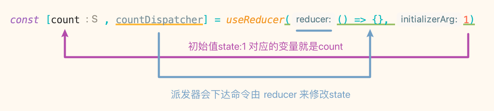

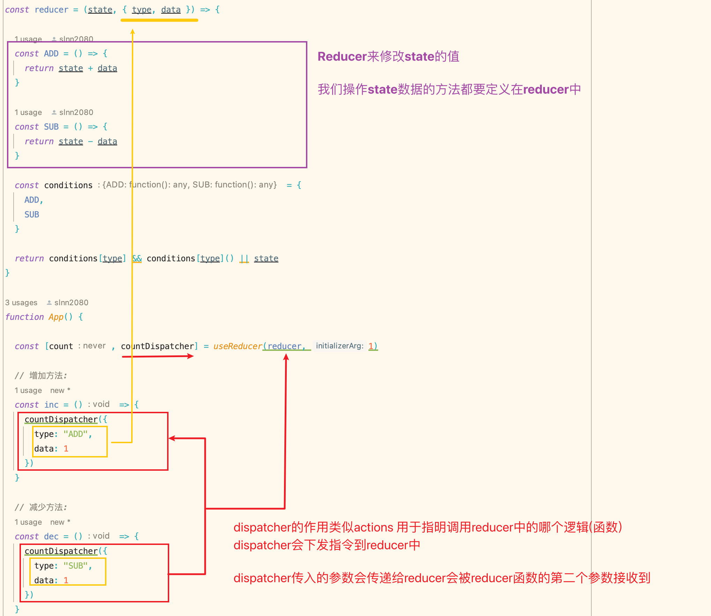

<br>

### 总结:
它的使用特别像Vuex中的actions 和 mutation

<br>

目的是也大致相同都是将修改state的操作封装到mutations中 由我们的actions指定我们执行mutations中的哪个逻辑 从而修改state的值

<br>

### 注意:
reducer函数一般会写在组件外, 防止组件重新渲染的时候会重复创建调用

<br>

### 示例:
```js
import "./App.scss"
import {useEffect, useReducer, useState} from "react";


// 为了避免reducer会重复创建, 通常reducer会定义到组件的外部
const reducer = (state, { type, data }) => {

  const ADD = () => {
    return state + data
  }

  const SUB = () => {
    return state - data
  }

  const conditions = {
    ADD,
    SUB
  }

  // reducer中必须返回一个值 作为state的新值, 如果没有匹配返回原state
  return conditions[type] && conditions[type]() || state
}


// App组件
function App() {

  const [count, countDispatcher] = useReducer(reducer, 1)


  // 增加方法:
  const inc = () => {
    countDispatcher({
      type: "ADD",
      data: 1
    })
  }

  // 减少方法:
  const dec = () => {
    countDispatcher({
      type: "SUB",
      data: 1
    })
  }

  return (
    <div className="app-wrap">
      <div style={
        {
          padding: "20px",
          border: "1px solid #eee"
        }
      }>
        <button onClick={inc}>+</button>  { count }  <button onClick={dec}>-</button>
      </div>
    </div>
  );
}

export default App;
```

<br><br>

## 优化: 汉堡案例 使用 useReducer
我们的项目中app组件中 cartData 和 操作cartData的方法太乱了 这里我们将它们整合到reducer中

<br>

### 1. 将reducer的逻辑提取到文件中
也就是将操作state的方法单独提取到一个文件中

```js
const reducer = (state, action) => {

  // 定义修改 cartData 的各种方法
  // 添加cartData:
  const insertCartItem = hamburger => {

    const _cartData = { ...state }

    const cartItem =  _cartData.items.find(item => item.id === hamburger.id)

    if (!cartItem) {
      hamburger.amount = 1
      _cartData.items.push(hamburger)
    } else {
      hamburger.amount += 1
    }

    _cartData.totalAmount += 1
    _cartData.totalPrice += hamburger.price

    action.callback && action.callback()
    return _cartData
  }


  // 删除cartData:
  const delCartItem = hamburger => {

    const _cartData = { ...state }

    hamburger.amount -= 1

    if (hamburger.amount <= 0) {
      _cartData.items = _cartData.items.filter(item => item.id !== hamburger.id)
    }

    _cartData.totalPrice -= hamburger.price
    _cartData.totalAmount -= 1

    action.callback && action.callback()
    return _cartData
  }


  // 清空购物车的方法
  const removeCart = () => {

    const _cartData = { ...state }

    _cartData.items.forEach(item => delete item.amount)
    _cartData.items = []
    _cartData.totalAmount = 0
    _cartData.totalPrice = 0

    action.callback && action.callback()
    return _cartData
  }

  const conditions = {
    removeCart,
    delCartItem,
    insertCartItem
  }

  return (conditions[action.type] && conditions[action.type](action.data)) || state
}

export default reducer
```

<br>

### 2. App组件中使用useReducer
```js
import cartDataReducer from "./reducer/cartDataReducer"


const App = () => {

  ...


  // 使用 useReducer 定义 state
  const [cartData, cartDataDispatcher] = useReducer(cartDataReducer, {
    items: [],
    totalAmount: 0,
    totalPrice: 0
  })

  
  // 添加: 购物车的方法
  const insertCartItem = hamburger => {
    cartDataDispatcher({
      type: "insertCartItem",
      data: hamburger
    })
  }


  // 删除: 购物车的方法
  const delCartItem = (hamburger) => {
    cartDataDispatcher({
      type: "delCartItem",
      data: hamburger
    })
  }


  // 清空: 购物车的方法
  const removeCart = () => {
    cartDataDispatcher({
      type: "removeCart",

      // 通过回调函数 在reducer中修改了state后 我们将外部逻辑传进去执行
      callback: () => setDetailVisible(false)
    })
  }


  ...

  return (
    /*
      我们这里还可以直接传入 cartDataDispatcher
      
      比如:
        <CartDataOperatorContext.Provider value={ cartDataDispatcher }>

      这样子组件直接调用 cartDataDispatcher 就可以了
    */
    <CartDataOperatorContext.Provider value={{insertCartItem, delCartItem}}>
      ...
    </CartDataOperatorContext.Provider>
  );
};
```

<br><br>

# React.memo