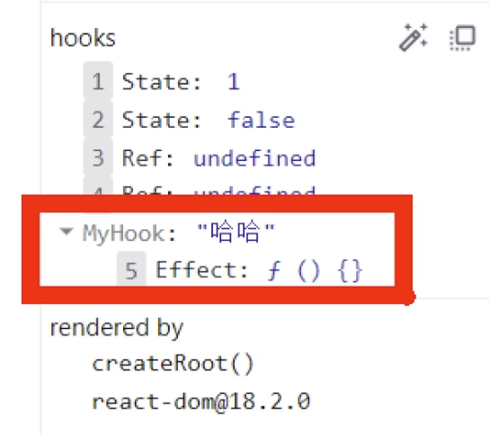

# React: 函数式
react版本: 18.0

<br>

## 前言:
网页是B/S架构中最重要的信息载体, 用户看到的所有信息都需要在网页中呈现。像商品信息, 用户信息, 新闻列表等一系列的内容都需要通过网页的形式呈现出来。

在传统的网站中用户每点一次链接就会加载出一个新的页面。

比如用户在网站的主页中看到了一个新闻的标题, 点击标题, 网站会跳转到一个新的页面来展示新闻的具体内容。

这样就导致呈现新闻的页面是从服务器中新加载出来的, 新闻和首页是两个完全独立的页面。如果本来两个页面就没有什么太大的关系这么处理当然是没有问题的, 但有些使用场景中却不能这样。

在有些场景中, 用户在网页中发生了一些行为, 比如登录, 加购物车, 添加删除等操作时, 这些操作的确会使网页发生变化, 但这些变化往往非常细微

比如购物车图标的产品数量发生了变化, 登录按钮变成了用户头像, 网页中增加或减少了一条数据等。如果仅仅因为这些小的变化就刷新了整个网页是有些划不来的。

刷新整个网页一来会增加用户的等待时间, 二来也会增加服务器的压力。于是我们就有了局部刷新网页的技术。

<br>

所谓的局部刷新指的是, 当用户和网站发生交互时, 我们不再是简单的直接通过浏览器进行页面的跳转, 而是通过JS中的AJAX直接通过JS向后台服务器发送请求, 请求过程用户毫无感知。

响应数据会通过回调函数返回给JS, 而不是直接返回给用户。JS中收到响应数据后, 在根据不同的结果通过DOM来完成对页面的修改。

它的优点就是, 请求响应过程是异步的, 用户是无感的, 不会影响用户的其他操作。同时, 通过DOM对页面刷新时只需刷新部分页面无需整体刷新, 提高了访问速度。

在服务器端, 服务器只需提供数据接口, 无需考虑页面的渲染, 在降低服务器复杂度的同时也使得服务器压力降低提高了处理请求的速度。

AJAX + DOM使得 **局部刷新** 成为了可能, 但一切似乎并不是那么的完美。发送请求加载数据问题不大, 但数据一旦加载过来问题就出现了。数据并不能直接在网页中显示。

我们需要通过DOM将数据转换为网页的中的各种节点, **这就意味着我们必须反复的操作DOM**, 这其中的痛苦实在是一言难尽。

<br>

### 问题:   
1. DOM操作本身十分占用系统资源一不小心就会出现卡顿。  
2. DOM的API十分复杂, 使得各种操作并不十分的优雅。  

换句话说, 服务器的复杂度降低了, 但是前端的复杂度提高了。

<br>

于是在前端开发中就急需一个框架来帮助我们解决这个问题, 使我们可以比较轻松的根据不同的数据来快速构建用户界面(UI), 与此同时还要在构建过程中确保其流畅度(不能出现卡顿)。

于是React, Angular, Vue这些前端框架应运而生, 拿React来说, 我们操作react 然后react替我们操作dom

<br><br>

## React简介
React 是一个用于构建用户界面的 JavaScript 库, 用来为现代的网络构建用户界面。React起源于Facebook, 由Facebook的软件工程师 Jordan Walke 开发, 2012年部署于 Instagram, 2013年开源。

除此之外, React还有React Native框架, 通过它让我们可以直接使用 JavaScript 来编写原生应用(让我们的react直接开发ios 安卓上的应用)。

**React就是代替DOM的**  

```s
    -操作虚拟DOM->   -React操作DOM->  
我们             React             DOM
```

<br>

### React的特点: 
- 虚拟DOM
- 声明式
- 基于组件
- 支持服务器端渲染
- 快速、简单、易学

<br><br>

# React版: Hello World
React的常规开发方式并不是通过浏览器引入外部js脚本来使用, 但在入门阶段我们暂且先使用这种方式来简单体会一下React。

<br>

## 网页版React前置要求:
使用React开发Web项目, 我们需要引入两个js脚本: 
- react.development.js: react 是react核心库, 只要使用react就必须要引入

- react-dom.development.js: react-dom 是react的dom包, 使用react开发web应用时必须引入

```s
https://unpkg.com/react@18.0.0/umd/react.development.js

https://unpkg.com/react-dom@18.0.0/umd/react-dom.development.js
```

<br>

### 复习: 简单的操作DOM
需求: 通过DOM向页面添加一个div
```html
<div id="root"></div>
<script>
  // 1. 创建一个div
  const div = document.createElement("div")
  // 2. 给div添加内容
  div.innerHTML = "我是一个div"
  // 3. 获取 root 节点
  const root = document.querySelector("#root")
  // 4. 向root节点中添加div
  root.appendChild(div)
</script>
```

<br>

### 预习: 通过 React 操作DOM
```html
<!DOCTYPE html>
<html lang="en">
<head>
  
  <!-- React核心库 -->
  <script src="./assets/js/react.development.js"></script>

  <!-- React的DOM库: 网页开发必备 -->
  <script src="./assets/js/react-dom.developments.js"></script>

</head>
<body>

<div id="root"></div>
<script>
// 1. 创建 react元素 div
const div = React.createElement("div", {}, "我是React元素Div")

// 2. 获取根元素对应的react元素 (涉及到DOM操作的时候 要使用 ReactDOM 包)
const root = ReactDOM.createRoot(document.querySelector("#root"))

// 3. 将 div 渲染到 根元素 root 中 (此时的div 和 root 都是react元素)
root.render(div)

</script>
</body>
</html>
```

<br>

### **<font color="#C2185B">React.createElement('标签名', {标签属性kv}, '标签内容')</font>**   
创建react元素(虚拟DOM)  

我们创建的 react元素最终会转成DOM元素(通过虚拟DOM) 该方法把 创建元素 添加属性 添加方法 添加内容等柔和为一个方法了 很方便

<br>

**参数:**   
1. 元素名 | 组件名 (html元素首字母不能大写)

2. 标签属性: 值为对象 可以为空  
  - 标签属性中可以有事件, 当我们通过这个参数为react元素设置事件的时候 需要将事件名修改为 **驼峰命名法**   
  - 标签属性中的class -> **className** 

3. 元素的子元素 | 标签体内容

```js 
// 创建一个 react元素 div
const div = React.createElement("div", {
  onClick: () => { console.log(this) }  //  window
}, "我是react创建的div")


// 注意我们创建的 react 元素
console.log(div)

/*
  $$typeof: Symbol(react.element)
  key: null
  props: {children: 'hello'}
  ref: null
  type: "div"
  _owner: null
  _store: {validated: false}
*/
```

<br>

```html
<div id="root">
  <div>
    我是react创建的div
    <button>按钮</button>
  </div>
</div>
```

<br>

**第三个参数以及以后得参数都是 该react元素的内容**  
比如上述的就是div中有两个子元素:
- 标签体: 我是react创建的div
- button

```jsx
// 创建一个react button 元素
const button = React.createElment("button", {}, "按钮")


// 在设置事件的时候 事件名要改成驼峰命名法, class要修改为className
const div = React.createElement(
  "div", 
  {
    className: "container",
    onClick: () => { console.log(this) }  //  window
  }, 
  "我是react创建的div", 
  button
)

const root = ReactDOM.createRoot(document.querySelector("#root"))
root.render(div)
```

<br>

### 注意:
**在react里面没有修改只有创建和替换**   

reacty元素一旦创建就不能修改 比如我们在加个id属性 不行！改不了 一次性的 **只能通过新创建的元素去替换**  

不让修改的原因是 dom的操作太复杂了 修改样式 属性等api太多了, 如果react也保留这些的话 那么react就和dom一样多了 react就是为了简化

<br>

但是不同担心性能问题 我们操作的是react元素(虚拟DOM) 我们的替换操作并不意味着在页面上真实的发生了

我们前后两次创建了 button 但是react会对比前面两次创建的对象 看看两个对象中发生了变化 **它只会改发生变化的部分**  

```js
const btn = React.createElement("button", {}, "测试按钮")
const root = ReactDOM.createRoot(document.querySelector("#root"))
root.render(btn)

// 需求: 当点击 click 按钮的时候 让测试按钮的文件发生变化
document.querySelector("#test").addEventListener("click", function() {
  // 修改不了上面的button 只能创建一个新的去替换
  const btn = React.createElement("button", {}, "修改文字")

  // 修改React元素后 需要再次渲染
  root.render(btn)
})
```

<br>

**注意:**  
修改完react元素后必须重新渲染根元素 

<br>

### **<font color="#C2185B">ReactDOM.createRoot(Css选择器)</font>**   
通过css选择器 根据页面中的dom **创建 react root 元素** , 或者说根据我们传入的节点创建该节点对应的React元素

想让哪个节点为根元素 传哪个节点就可以  
react root元素 就是react元素将要被插入的位置 类似 ``<div id=app><div>``

用来创建React的根容器, 容器用来放置React元素

<br>

**参数:**   
Css选择器选择的DOM节点

<br>

**返回值:**   
react元素

```js
const root = ReactDOM.createRoot(document.querySelector("#root"))
```

<br>

### **<font color="#C2185B">root.render(React元素)</font>**   
挂载 渲染 向根元素中渲染 react元素(虚拟DOM)

**当调用render渲染页面 react会自动比较两次渲染的元素** 只在真实DOM中更新发生变化的部分

不会修改容器节点(只会修改容器的子节点)。可以在不覆盖现有子节点的情况下, 将组件插入已有的 DOM 节点中。

<br>

**要点:**   
**根元素中的所有内容都会被删除** 被我们插入了 react元素 替换  

当重复调用render()时 react会将两次的渲染结果进行比较 它会确保只修改发生变化的元素 确保对DOM做最小的修改

```js
// react元素 div
const div = React.createElement("div", {}, "hello")

// 先创建 react根元素
const root = ReactDOM.createRoot(document.querySelector("#root"))

// 通过react根元素的render方法 渲染react元素
root.render(div)
```

<br>

**<font color="#C2185B">root.unmount()</font>**   
卸载

<br>

### 总结:
- 通过 React 创建react元素
- 通过 ReactDOM 找到(或者说创建)root
- 通过 root 渲染节点

```js
// 创建节点
let node = React.createElement("div", {className: "test"}, "我是react元素")

// 找到(或者说) root
let root = ReactDOM.createRoot(document.getElementById("root"))

// 通过 root 进行挂载
root.render(node)
```

<br><br>

# JSX
上面介绍的方法的核心就是用了一个 react 的 一个api 替换掉了 原生js操作dom的方法 

但是替代完了之后 其实并没有简洁多少 所以react提供一种更简洁的方式 JSX

<br>

### 命令式编程:
我们前面说了 React.createElement() 方法 这种方法叫做命令式编程  

通过react语法 告诉react我们要创建什么元素 属性是什么 标签体是什么

<br>

### 声明式编程:
jsx就是声明式编程  

我们可以通过下面的方式 告诉react我想要它 至于怎么创建实现的我不管

在react中可以通过 JSX 来创建react元素

```js
let node = (
  <div>我是一个div</div>
)
```

<br>

简单理解就是以结果为导向的编程。**使用JSX将我们所期望的网页结构编写出来, 然后React再根据JSX自动生成JS代码。**  

所以我们所编写的JSX代码, 最终都会转换为以调用React.createElement()创建元素的代码。**JSX就是React.createElement()的语法糖 他俩是一样的**  

<br>

### 注意:
JSX写完了不能直接使用 需要被翻译为js代码 才能被react执行

要在react中使用jsx **必须要引入babel来完成 翻译 工作**  

<br>

### Babel 下载地址   
翻译jsx
```s
https://unpkg.com/babel-standalone@6/babel.min.js
```

<br>

### 使用方式:
1. 引入 babel js 文件
2. script标签添加type属性
3. 使用jsx语法

```js
<script type="text/babel">
  ... 在这里编写的代码会被babel进行翻译
</script>
```

<br><br>

## JSX的注意事项
全称 Javascript XML 是react定义的一种类似于 XML 的js扩展语法 js + xml  

本质是 React.createElement(component, props, ...children)方法的**语法糖**  

<br>

```html
<head>
  <title>Jsx</title>
  <!-- React核心库 -->
  <script src="./assets/js/react.development.js"></script>
  <!-- React的DOM库: 网页开发必备 -->
  <script src="./assets/js/react-dom.developments.js"></script>
  <!-- 引入Babel 编译Jsx -->
  <script src="./assets/js/babel-standalone@6.26.0_babel.min.js"></script>
</head>
<body>
<div id="root"></div>

<script type="text/babel">
  const div = (
   <div>我是div</div>
  )
  const root = ReactDOM.createRoot(document.querySelector("#root"))
  root.render(div)
</script>
</body>
```

<br>

### 扩展: XML的简单用法   
XML早期用于存储和传输数据  
比如 我们存个学生, 我们就可以创建下面的样式, 用于传输

```xml
<student>
  <name>TOM</name>
  <age>19</age>
</student>
```

<br>

后来我们就不使用xml去存信息了 使用JSON 因为我们真正存储的数据就是 TOM 和 19 但是结构比要存储的内容都要多

<br>

**JSON:**  
```json
"{"name":"TOM", "age":19}"
```

这样存储起来不是方便了很多么? 但也不是说xml就完全不用了 微信公总号和开发者公众号打交道 还是使用的XML

<br><br>

## JSX的语法规则:   
### 1. JSX不是一个字符串 定义虚拟DOM时, 不要写引号
结构可以使用小括号包裹

```js
// 没有引号
const node = (
  <div>节点</div>
)
```

<br>

### 2. 在Jsx模版中写js表达式时 使用{ }
这里要注意表达式和语句的区别, { }里面放的是js表达式 并不是语句

**表达式: 有值的就叫做表达式**  

<br>

### 3. 如果表达式是 空值(null) 布尔值 undefined 将不会显示
但是 NaN 会显示

<br>

### 4. 样式的类名指定不要用class 而是要用 className
react元素的属性名使用驼峰命名法
```html
<label for>

<!-- 修改为: -->
<label htmlFor>
```

<br>

### 5. 内联样式要用 对象形式 style={{}}
style 必须使用 {} 对象的形式设置, ``style={{key:value}}`` 的形式去写, 属性名使用驼峰

添加内联样式的时候 一层{ } 是写表达式, 再一层{{ }}是style要求的对象形式, 驼峰属性名: "字符串"

```html
<h3 
  className="title" 
  style={{border: "1px solid #212121"}}
>
  React
</h3>
```

<br>

### 6. 其他标签属性可以直接写在标签中
比如: 事件的话 如果使用 {} 传递一个函数
```jsx
const div = <div id="box" onClick = { () => {} }>
```

<br>

### 7. jsx中的标签一定要闭合
``<input />``  或者 ``<input></input>``

<br>

### 8. jsx中只能有一个根标签
当要创建多个标签的时候 我们外层要用一个``<div>`` 跟Vue一样

<br>

### 9. 标签首字母
- jsx中标签首字母小写开头: 则将该标签转为html中同名元素 若html中无同名元素就报错

- jsx中组件首字母大写开头: react就会去渲染对应的组件, 若组件没有定义 则报错

<br>

### 练习: 动态创建模版内容
```html
<script type="text/babel">

const flag = true

// 动态决定模版结构
let div

if (flag) {
  div = (
    <div>我是 if div</div>
  )
} else {
  div = (
    <div>我是 else div</div>
  )
}

</script>
```

<br>

### 练习:   
- 需求1: 将 你好呀 和 id 是通过变量的形式在读取 而不是写死  
- 需求2: 给h1应用样式 active  
- 需求3: 使用内联样式给span添加样式, 文字白色 背景黑色  
- 需求4: 在``<h1>``的下方添加``<input>``  
- 需求5: 根据变量渲染结构

```js 
// 标准:
const VDOM = (
  <h1 id='demo'>
    <span>你好呀</span>
  </h1>
)

// 解答1: 虚拟DOM中想使用js表达式 要是 { }
const myData = 'abcdefg'
const myId = 'test'

const VDOM = (
  <h1 id={myId}>
    <span>{myData}</span>
  </h1>
)


// 解答2: 虚拟DOM中想给标签添加class 使用className
const VDOM = (
  <h1 className='active' id={myId}>
    <span>{myData}</span>
  </h1>
)


// 解答3: 在虚拟DOM中使用内联样式 要用{{K:V}} 属性名驼峰  
const VDOM = (
  <h1 className='active' id={myId}>
    <span style={{color:'pink', backgroundColor: 'black'}}>{myData}</span>
  </h1>
)


// 解答4: JSX中只能有一个根元素 使用<div>把多个结构包裹起来
const VDOM = (
  <div>
    <h1 className='active' id={myId}>
      <span style={{color:'pink', backgroundColor: 'black'}}>{myData}</span>
    </h1>
    <input type='text' />
  </div>
)


// 解答5: 这里利用了3元表达式 前后结构使用()进行包裹
render() {
  return (
    this.flag ? (
      <div 
        style={{width: "20px", height: "20px", background: "red"}}
      >
        <h3>我是App组件</h3>
      </div>
    ) : (
      <div>
        <h3>我是默认的</h3>
      </div>
    )
  )
}
```

<br>

### 技巧: 利用三元表达式 渲染不同的结构
当我们想渲染两个不同的结构的时候 我们可以使用三元表达式的形式的方式

```js
const div = 条件 ? (结构1) : (结构2)
```

<br>

### JSX: 会自动将数组中的元素在页面中展开显示
jsx会将数组中的元素展现在 div 中, 且中间没有 , 号 连接
```js
const arr = [1,2,3]
const div = (
  <div>{ arr }</div>
)


const div = (
  <ul>
    {
      // 组织上面的 123数组 变成 jsx元素数组
      arr.map((el, index) => <li key={ index }>{ el }</li>)
    }
  </ul>
)
```

<br>

### Jsx语法的转化过程
jsx仅仅是 createElement 方法的语法糖   
jsx语法被 babel插件便以为 createElement方法 最后会再次的被转化为react元素

```s
jsx - createElement - react元素
```

<br><br>

# 虚拟DOM 和 真实DOM

### 介绍:   
当我们通过 React 操作DOM时, 比如通过 ``React.createElement()`` 创建元素时。我们所创建的元素并不是真正的DOM对象 **而是React元素**。

这一点可以通过在控制台中打印对象来查看。React元素是React应用的最小组成部分, 通过JSX也就是React.createElement()所创建的元素都属于React元素。

与浏览器的 DOM 元素不同, React 元素就是一个普通的JS对象, 且创建的开销极小。

<br>

**React元素不是DOM对象, 那为什么可以被添加到页面中去呢？**   
实际上每个React元素都会有一个对应的DOM元素, 对React元素的所有操作, 最终都会转换为对DOM元素操作, 也就是所谓的虚拟DOM。

<br>

要理解虚拟DOM, 我们需要先了解它的作用。虚拟DOM就好像我们和真实DOM之间的一个桥梁。有了虚拟DOM, 使得我们无需去操作真实的DOM元素, 只需要对React元素进行操作, 所有操作最终都会映射到真实的DOM元素上。

这不是有点多余吗？  
直接操作DOM不好吗？为什么要多此一举呢？原因其实很多, 这里简单举几个出来。

<br>

首先, **虚拟DOM简化了DOM操作**。凡是用过DOM的都知道Web API到底有多复杂, 各种方法, 各种属性, 数不胜数。查询的, 修改的, 删除的, 添加的等等等等。然而在虚拟DOM将所有的操作都简化为了一种, 那就是创建！

**React元素是不可变对象, 一旦创建就不可更改。要修改元素的唯一方式就是创建一个新的元素去替换旧的元素**, 看起来虽然简单粗暴, 实则却是简化了DOM的操作。

<br>

其次, **解决DOM的兼容性问题**。DOM的兼容性是一个历史悠久的问题, 如果使用原生DOM, 总有一些API会遇到兼容性的问题。使用虚拟DOM就完美的避开了这些问题, 所有的操作都是在虚拟DOM上进行的, 而虚拟DOM是没有兼容问题的, 至于原生DOM是否兼容就不需要我们操心了, 全都交给React吧！

<br>

最后, 我们手动操作DOM时, 由于无法完全掌握全局DOM情况, 经常会出现不必要的DOM操作, 比如, 本来只需要修改一个子节点, 但却不小心修改了父节点, 导致所有的子节点都被修改。**减少不必要的DOM操作**  

<br>

效果呈现上可能没有什么问题, 但是性能上确实千差万别, 修改一个节点和修改多个节点对于系统的消耗可是完全不同的。

**每当我们调用root.render()的时候** 页面就会重新渲染 

react在虚拟DOM中, 引入了diff算法, **React元素在更新时会通过diff算法将新旧元素进行比较**, 然后只会对DOM做必要的更新来呈现结果。

简单来说, **就是拿新建的元素和旧的元素进行比较**, 只对发生变化的部分对DOM进行更新, 减少DOM的操作, 从而提升了性能。

<br>

### 在diff比较的时候   
- 先比较之前之后两份数据的类型  
- 再比较之前之后里面的内容

<br>

### 虚拟DOM的特点   
1. 本质是Object类型的对象(一般对象)

2. 虚拟DOM身上的属性比较少(轻), 真实DOM身上的属性比较多(重) 因为虚拟DOM是react内部在用, 无需真实DOM上那么多的属性 

3. 虚拟DOM最终会被React转化为真实DOM, 从内存中呈现在页面上
```html 
<div id="app"></div>
<div id="demo"></div>

<script type='text/babel'>

  // 虚拟DOM
  const VDOM = (
    <h1>
      <span>hello, react</span>
    </h1>
  )

  // 真实DOM
  const TDOM = $('demo')

  console.log(VDOM)
    // 结果
    // 好多属性了 可以debugger查看一下

  console.log(TDOM)
  // 结果
  {
    $$typeof: Symbol(react.element), 
    type: "h1", 
    key: null, 
    ref: null, 
    props: {…}, …
  }
</script>
```

<br><br>

# DOM的diffing算法
React最大的优势就是 它不是每一次都将页面上的真实DOM做出修改 每一个真实的DOM都是对应一个虚拟DOM(react元素)的

当生成一个新的虚拟DOM树 它会和旧的虚拟DOM树 进行比较, 如果有没有变化的虚拟DOM, 那么页面上这两个虚拟DOM对应的真实DOM是没有任何改变的, 只把新增加的一条映射成新的真实DOM

```s
虚拟DOM                真实DOM

# 旧的虚拟DOM树
001对应的虚拟DOM    --- 复用
002对应的虚拟DOM    --- 复用


# 新的虚拟DOM树
001对应的虚拟DOM    --- 复用
002对应的虚拟DOM    --- 复用

003对应的虚拟DOM    --- 对比结果(新) --- 渲染
```

<br>

也就是说 每次更新页面的时候 新的虚拟DOM树都会对上一次(旧)的虚拟DOM树进行对比, 看看有没有不一样的节点, 如果有 那就更新新的节点, 复用没有变化的节点

<br>

### 验证上面说的对不对 
我们在页面中放3个结构, 结构3是一个定时器来展示的数据, 每秒更新一次  
我们先说下结果 就是 结构1 和 结构2被复用, 而结构3会更新

<br>

**怎么验证?**  
我们在结构2中的文本框中输入文字, 如果 每次文字都消失, 证明input每次都是新的 如果没有消失证明结构2被复用

结果: 文字没有消失

<br>

我们在看看``<span>`` 中的 ``<input>``是被复用还是每次都随着``<span>``更新

结果: 文字没有消失

<br>

**疑问?**    
不是说 diffing 算法最小的更新单位是 节点么? 那为什么不连着内部的``<input>``一起更新呢?

<br>

**答案:**   
diffing算法并不是只比较一层, 而是标签内部还有标签的时候 也会对子标签进行 新旧的虚拟DOM树对比, 如果子标签对比结果没有变化 子标签也会复用
```html
<!-- 结构1 -->
<h1>hello</h1>        

<!-- 结构2 -->
<input type="text" /> <br /><br />

<!-- 结构3 -->
<span>
  现在是: {this.state.date.toTimeString()}
  <input type="text" />
</span>
```

<br>

**验证用的代码**   
```js
class Time extends React.Component {

  // 状态里面维护着时间
  state = { date: new Date() }

  // 组件挂载开启定时器 每一次都把最新的时间放进去 state发生改变 页面就会更新
  componentDidMount() {
    setInterval(() => {
      this.setState({
        date: new Date()
      })
    }, 1000)
  }

  render() {
    return (
      <div>
        <h1>hello</h1>

        <input type="text" /> <br /><br />

        <span>
          现在是: {this.state.date.toTimeString()}
          <input type="text" />
        </span>
      </div>
    )
  }
}

ReactDOM.render(<Time />, document.querySelector('#app'))
```

<br>

### 总结:   
diffing算法是逐层对比 最小的力度是标签

<br><br>

# 经典面试题
1. react / vue 中的key有什么作用? (key的内部原理是什么)
2. 为什么遍历列表的时候, key最好不要用index

<br>

### 回答: 虚拟DOM中key的作用

**简单的说:**  
key是虚拟DOM对象的标识, 在更新显示的时候 Key起到了及其重要的作用

<br>

**详细的说:**   
当状态中的数据发生变化的时候, react会根据'新数据'生成'新的虚拟DOM' 随后React进行'新虚拟DOM'与'旧虚拟DOM'的diff比较, 比较规则如下

<br>

**旧虚拟DOM中找到了与新虚拟DOM相同的key**   
- aa: 若虚拟DOM中的内容没有变, 直接使用之前的真实DOM  
- bb: 若虚拟DOM中的内容变了, 则生成新的真实DOM 随后替换掉页面中之前的真实DOM

<br>

**旧虚拟DOM中未找到与新虚拟DOM相同的key**   
根据数据创建新的真实DOM 随后渲染到页面

<br>

**用index作为key可能会引发的问题 (在数组的前面添加就会出现破坏顺序操作)**  
- 若对数据进行: 逆序添加, 逆序删除等破坏顺序操作 
``` 
会产生没有必要的真实DOM更新 --- > 界面效果没问题 但效率低
```

- 如果结构中还包含输入类的DOM  
```
会产生错误DOM更新 --- > 界面有问题
```

<br>

### 注意:  
如果不存在对数据的逆序添加 逆序删除等破坏顺序操作 仅用于渲染列表用于展示, 使用index作为key是没有问题的

<br>

### 开发中如何选择key?
最好使用每条数据的唯一标识作为key(数据的唯一标识就应该是后端给我们处理好的), 比如id 手机号, 身份证号, 学号等唯一值  

如果确定只是简单的展示数据, 用index也是可以的

<br><br>

# 非脚手架版: React 项目 (手动)
脚手架版: 通过 create-react-app 来进行创建 但是这个不分我们不用该命令创建项目

<br>

我们用 npm 管理的项目 不能直接在浏览器端运行  

在我们把项目在最终交给浏览器之前必须经过打包工具 进行打包 打包之后项目才能在浏览器中进行使用

所以在这个手动的 React 项目中 我们要使用 **webpack** 作为打包工具来对react项目进行打包

所以我们在使用npm管理我们项目的同时 还要使用webpack 但是我们一点点的去配置webpack那么又会很麻烦 所以 react 给我们提供了一个包

<br>

### react-scripts 包:
该包内部给我们提供了 react 的开发环境 和 相关依赖 大大的简化了项目的开发 它把包括webpack babel 测试框架 都在这个包里面集成了 有了这个包相当于我们有了react给我们自动配置好的webpack 直接用(**一行webpack的配置都不用写**)

<br>

### webpack主要对项目来说有两个功能:
1. 打包: 将打包后的文件可以部署到服务器上
2. 提供测试服务器: devServer

<br>

### 创建 手动React项目

**安装依赖**   
安装了3个包
```
npm i react react-dom react-scripts
```

```json
"dependencies": {
  "react": "^18.1.0",
  "react-dom": "^18.1.0",
  "react-scripts": "^5.0.1"
}
```

<br>

**组织 react-script 约定的项目目录结构:**   
必须用人家用的结构
```
| - 根目录
  | - public
    - index.html (添加标签 <div id="root">)

  | - src
    - App.js
    - index.js
```

<br>

**public:**   
里面放供外部访问的资源 比如静态图片 css js 不需要webpack打包的文件 都放在这里

index.html是必须的 react在编译的时候会以该index.html作为模版 然后生成 index.html 文件

<br>

**src:**   
源码目录 index.js 入口文件

<br>

### index入口文件中的逻辑:
在react18中 在我们引入 react-dom 的时候 有一些变化, react把ReactDOM 分为两个部分:

<br>

1. **<font color="#C2185B">react-dom/client 在浏览器渲染页面的库</font>**   

2. **<font color="#C2185B">react-dom/server 在服务器渲染页面的库</font>**  

<br>

这里我们希望是在浏览器端渲染, 所以我们要加载的是 react-dom/client 这里也是跟 react17 中不同的地方 

后面我们使用服务器端的react 那么我们就要加载 react-dom/server, 如果我们只引入 react-dom 页面会报错

<br>

**使用方式:**  
1. 入口文件中引入 ReactDOM
2. 引入App组件
3. 通过 ReactDOM.createRoot 来获取根React元素
4. 通过 root 调用 render 方法 渲染组件 需要传入 ``<App />``
5. 通过 npx react-scripts start 命令 在开发阶段进行测试
6. 通过 npx react-scripts build 对我们的项目进行打包

```js
// 1. 引用react-dom
import ReactDOM from "react-dom/client"

// 2. 引入App组件
import App from "./App"

// 3. 获取页面根元素容器 并渲染App组件
ReactDOM
  .createRoot(document.querySelector("#root"))
  .render(<App />)

/*
  1. 入口文件并没有引入 React
  2. 我们渲染组件的时候 渲染的是 <App />
*/
```

<br>

### 项目启动命令 (打包):
因为这里我们需要使用 react-scripts 库 不是脚手架 所以我们没办法通过 npm run start 来启动项目

通过 npm 管理的项目 必须通过webpack进行打包 打包后才能在浏览器上运行 而打包这个动作 已经在 react-scripts 库中处理好了 我们需要通过 以下的命令 来进行打包

```js
// 当我们执行这个命令后 它自动会调用webpack进行打包
npx react-scripts build
```

<br>

输入命令后 选择 y **会自动往package.json中添加 兼容性配置**, 打包后 我们的项目中就会多了一个 build 文件夹
```json
// 输入命令后 选择 y 会自动往package.json中添加 兼容性配置
"browserslist": {
  "production": [
    ">0.2%",
    "not dead",
    "not op_mini all"
  ],
  "development": [
    "last 1 chrome version",
    "last 1 firefox version",
    "last 1 safari version"
  ]
}
```

<br>

### 访问打包后 dist 下面页面:
然后我们在 build 文件夹里 启动 index.html 就可以访问了

<br>

**问题:**   
```html
<!doctype html><html lang="en"><head><meta charset="UTF-8"><meta http-equiv="X-UA-Compatible" content="IE=edge"><meta name="viewport" content="width=device-width,initial-scale=1"><title>Document</title><script defer="defer" src="/static/js/main.ff653062.js"></script></head><body><div id="root"></div></body></html>
```

<br>

**js引入的部分的路径是:**   
```
src="/static/js/main.ff653062.js"
```

我们发现页面是空白的状态 我们现在访问的方式是通过vscode内置的服务器访问的 也就是我们的网页会被部署到vscode的内置服务器

但是正常来说我们的代码应该部署到真正的服务器上 所以上面的路径是有问题的
```js
// /static/js/main.ff653062.js
<script defer="defer" src="/static/js/main.ff653062.js"></script>
```

<br>

/ 表示 根目录 就是说我们的build里面的东西应该部署到服务器的根目录中 现在我们没有部署到根目录 所以路径出了问题

<br>

**修改方式: 前面加个.**  
```
./static/js/main.ff653062.js
```

<br>

**开发过程中 使用如下的命令开启测试服务器:**   
```
npx react-scripts start
```
启动webpack的内置的测试服务器 供我们在开发阶段进行调试 所有的项目开发完了 我们再通过 build 命令打包将项目部署到真正的服务器上

<br>

**整理到package.json里面:**   
```json
"scripts": {
  "test": "echo \"Error: no test specified\" && exit 1",
  "start": "react-scripts start",
  "build": "react-scripts build"
},

// 配置 eslint 简单代码是否符合 react 的语法规范
"eslintConfig": {
  "extends": [
    "react-app"
  ]
}
```

<br><br>

# 案例: 学习记录器

**html结构**   
```js
// 引入 ReactDOM
import ReactDOM from "react-dom/client"

const App = (
  <div className="logs">
    <div className="item">
      <div className="date">
        <div className="month">5月</div>
        <div className="day">23日</div>
      </div>

      <div className="content">
        <h2 className="desc">React</h2>
        <div className="time">1小时</div>
      </div>
    </div>
  </div>
)

// 获取根容器
const root = ReactDOM.createRoot(document.getElementById("root"))
// 将App渲染到根容器
root.render(App)
```

<br>

**style结构:**   
```
import "./index.css"
```

如果写成 import "index.css" 会被当成模块处理 会报找不到模块的错误  
**在引入样式 图片 资源的时候 我们要以 ./ 开头**   

<br><br>

# 案例: 学习记录器

### 组件部分  
```js
// 在引入样式 图片 资源的时候 我们要以 ./ 开头 不然会被当成模块来进行处理
import "./App.css"

const App = () => (
  <div className="logs-wrap">
    {/* 日志项的容器 */}
    <div className="item">
      {/* 左侧: 日期部分的容器 */}
      <div className="date">
        <div className="month">4月</div>
        <div className="day">19</div>
      </div>
      {/* 右侧: 日志内容的容器 */}
      <div className="content">
        <h2 className="desc">学习react</h2>
        <div className="time">40分钟</div>
      </div>
    </div>
  </div>
)

export default App
```

<br>

### 样式部分:
样式部分需要通过 ``import "./index.css"`` 在组件中引入
```css
* {
  padding: 0;
  margin: 0;
  box-sizing: border-box;
}

body {
  background: #dfdfdf;
}

/* 外层容器的样式 */
.logs-wrap {
  padding: 20px;
  width: 800px;
  margin: 50px auto;
  background: #eae287;
  border-radius: 10px;
  box-shadow: 0 0 10px rgba(0,0,0,0.2);
}

/* 设置 日志项 item 的样式 */
.item {
  display: flex;
  background: #fcbf49;
  border-radius: 10px;
  box-shadow: 0 0 10px rgba(0,0,0,0.2);
  padding: 6px;
}

.item + .item {
  margin-top: 20px;
}

/* 左侧日期部分 */
.date {
  width: 90px;
  background: #fff;
  border-radius: 10px;
  font-weight: bold;
  text-align: center;
  overflow: hidden;
}

/* 设置月份效果 */
.month {
  height: 30px;
  line-height: 30px;
  background: #d62828;
  color: #fff;
  font-size: 18px;
}

/* 设置日期效果 */
.day {
  height: 60px;
  line-height: 60px;
  font-size: 40px;
}

.content {
  flex: auto;
  text-align: center;
  font-weight: bold;
  display: flex;
  flex-direction: column;
  justify-content: center;
}

.desc {
  font-size: 20px;
  color: #212121;
}

.time {
  color: #d62828;
  margin-top: 10px;
}
```

<br>

### 注意:
如果写成 import "index.css" 会被当成模块处理 会报找不到模块的错误  

**在引入样式 图片 资源的时候 我们要以 ./ 开头**   

<br><br>

# 函数式组件
函数组件就是一个返回 JSX 的普通函数

<br>

### 约定1:
使用函数的方式(**函数名首字母大写**)创建组件 函数名就是组件标签名  

函数会被React调用 所以函数内部必须使用return 将虚拟DOM暴露出去 

<br>

### 约定2:
**函数组件必须有返回值** 表示该组件的结构(JSX的DOM结构)  

<br>

### 约定3:
如果我们返回的是null 表示不渲染任何内容

<br>

接下来我们创建函数组件 将组件渲染到页面中

<br>

### React18: 创建函数式组件
```js
// App组件
import Item from "./components/item"

const App = () => (
  <div className="logs">
    <Item />
  </div>
)

export default App


// Item组件
const Item = () => (
  <div className="item">
    <div className="date">
      <div className="month">5月</div>
      <div className="day">23</div>
    </div>

    <div className="content">
      <h2 className="desc">React</h2>
      <div className="time">1小时</div>
    </div>
  </div>
)

export default Item


// 入口index.js文件
// 引入 ReactDOM
import ReactDOM from "react-dom/client"
import App from "./App"
import "./index.css"

// 获取根容器
const root = ReactDOM.createRoot(document.getElementById("root"))

// 将App渲染到根容器 渲染组件的时候 指定的是标签名的形式
root.render(<App />)

```

<br>

### 函数式组件中的特点:   
**函数组件中的 this 为undefined**   

正常我们直接在Demo函数中打印 this 应该是window 但是输入结果却是undefined

```js
function Demo() {
  console.log("Demo", this) // undefined

  return (
    <div>
      <h3>Demo组件</h3>
    </div>
  )
}
```

<br>

### undefined原因:
因为 我们的代码要经过 babel 的翻译 (type="text/babel") 

babel在翻译完下面的东西后会开启严格模式 **严格模式中禁止 自定义的函数中的this 指向window 所以undefined**  

<br>

**类和模块的内部, 默认就是严格模式, 考虑到未来所有的代码, 其实都是运行在模块之中, 所以 ES6 实际上把整个语言升级到了严格模式**   

<br><br>

# 事件

### 回顾: 原生js的事件处理
```html
<!-- 方式1: 原生方式下代码逻辑可以直接写在引号中 -->
<button onclick = "alert(123)"> 点我一下 </button>

<!-- 方式2: -->
<button id="btn"> 点我一下 </button>
<script>
  const btn = document.querySelector("#btn")
  btn.onclick = function() {}
</script>

<!-- 方式3: -->
<button id="btn"> 点我一下 </button>
<script>
  const btn = document.querySelector("#btn")
  btn.addEventListener("click", function() {})
</script>
```

<br>

在原生的时候我们最常使用的就是 方式2 和 方式3 因为这种方式的优点就是将事件和标签解耦了

但是上述的方式不能在react中使用 **因为我们获取节点的时候 获取的是原生的DOM对象 然后通过原生DOM对象的方法对其进行操作**   

但是在react中我们通常操作的都是react元素 然后通过react元素映射到真是的DOM上 所以我们不建议直接获取DOM对象 因为相当于脱离了react的管理

**所以在react中只能使用 方式1** 我们要把事件通过属性的方式绑定给元素上 因为这是我们都是在JSX上操作 相当于操作的是react对象

<br>

### 要点: 
在react中 **事件需要通过元素的属性的方式来绑定给元素** 和 原生js不同 在react中**事件名需要使用驼峰命名法**   

<br>

### 事件回调的绑定
1. 在标签中直接定义 回调函数, 当我们要写js代码的时候 就需要使用 {}

```js
// 事件回调使用 匿名函数
const App = () => (
  <div>
    <button onClick = { () => { console.log(123) } } >
      点我一下
    </button>
  <div>
)
```

2. 在类中定义方法 标签中指定方法名
```jsx
// 事件回调使用 预先定义的函数
const App = () => {

  // 在函数式组件中定义方法
  const handleClick = () => {
    console.log(123)
  }

  return (
    <div>
      {/* 函数式组件不用加this哦 */}
      <button onClick = { handleClick } >
        点我一下
      </button>
    <div>
  )
}
```

<br><br>

## 事件对象

### 取消默认行为:
### **<font color="#C2185B">e.preventDefault()</font>**   
比如我们给a标签绑定 点击事件 那么在触发事件的同时 a标签的默认行为也会执行 (跳转) 
```jsx
<a href="www.baidu.com" onClick={handleClick}>
```

<br>

**要点:**   
在react中无法使用 return false 取消默认行为 我们**需要使用事件对象(event)身上的方法**  

react方法中的事件对象不是原生的事件对象 是经过react包装后的事件对象(也可以理解为react对象 也是对这个react包装后的事件对象的操作转换到真实的事件对象上)

由于对象进行过包装 所以在使用过程中无需去考虑兼容性问题
```js
const handleClick = (e) => {
  e.preventDefault()
}
```

<br>

### 取消冒泡:
### **<font color="#C2185B">e.stopPropagation()</font>**   
事件的冒泡

<br>

### 事件处理的总结:
react中通过onXxx的形式指定事件处理函数(注意大小写)  
- react使用的是自定义(合成)事件, 而不是使用的原生DOM事件
- react中的事件是通过事件委托方式处理的(委托给组件最外层的元素)

<br>

**注意:**   
我们绑定的事件其实都委托给了最外层的div 所以下面的事件回调的逻辑会被执行2次 这里可以利用阻止冒泡  

**react把原生里面的事件都重新的写了一套 为了更好的兼容性**  

```jsx
{/* 父元素有click事件 */}
<div className="app-wrap" onClick={this.handleClick}>
  {/* 子元素也有click事件 */}
  <button onClick={this.handleClick}>click</button>
</div>


handleClick = () => {
  console.log("这里的逻辑会被执行两次")
}
```

<br>

### event事件对象的获取
我们在虚拟DOM节点上绑定事件的时候 不传递参数 类中方法的回调的默认形参为 event

react中会在事件回调中自动传入 event 事件对象

<br>

**通过 event.target 得到发生事件的DOM元素对象:**   
```html
<button onClick={this.handleInp1}>click</button>

<script>
  // 回调中的默认形参为事件对象
  handleInp1 = (e) => {
    console.log(e)
  }
</script>
```

<br>

**高阶函数中的事件对象:**  
假如我们在事件回调使用了高阶函数 也就是返回一个函数的形式的话  

**那么交给react的是函数的返回值函数** react会往拿到手的函数的形参中加入 **事件对象**   

```js
handleClick= (参数) => {
  return (e) => {
    // 因为react拿到的是这个函数
  }
}
```

<br><br>

# Props: (父 -> 子)
在组件之间 父组件可以通过 标签属性 的方式 向子组件传递数据 我们传递到子组件中的数据 

子组件需要通过 **函数式组件的形参props来接收**, 数据会被封装到 props形参对象 中

```js
const App = () => (
  <div className="logs-wrap">
    <Item num={123} />
  </div>
)


const Item = (props) => {

  console.log("props", props)  // {num: 123}

  // 渲染结构
  return (
    结构...
  )
}
```

<br>

## 要点: 子组件中不能修改父组件传递过来的props
**props是只读的不能修改**, props的作用就是父元素向子元素传递数据 

**父 -> 子**  

- 父组件传递基本数据类型的时候 我们在子组件中修改传递过来的数据会报错  

- 父组件传递引用类型数据的时候 子组件中修改对象中的属性 **不会报错 但也不会更新页面**(是不是只有修改了state中的数据才引起页面的更新)

<br><br>

## props深入: children属性
props 的 children属性 可以完成 **插槽** 的概念

子组件挖坑 父组件填坑 在react里面 我们填坑的这个动作就可以通过 prop.children 来完成

<br>

### props.children属性:   
当我们使用子组件的时候, 我们给组件标签写了标签体时(子节点)的时候, 子组件的props身上就会有children属性
```js
/*
  父组件使用 Home组件时 指定了标签体

  那么Home组件内 就可以通过 props.children 获取到标签体中的内容
*/
<Home>我是内容</Home>


// 子组件的props属性
props:
  children: "我是内容" 
```

<br>

也就是说 我们通过标签体传递过去的 数据 就会在该组件的props.children身上

```js
// 通过组件标签体传递过去的内容
<Hello>我是子节点</Hello>

// 会在子组件的 props.children 身上
props.children = 我是子节点
```

<br>

**示例:**  
```js
// 父组件
render() {
  return (
    <div className="app-wrap">
      <h3>父组件title: {this.state.job.backend}</h3>

      {/*Demo组件 标签体有内容*/}
      <Demo>
        <ul>
          <li>
            我是要展示的静态数据
          </li>
        </ul>
      </Demo>
    </div>
  )
}


// 子组件
const Demo = props => {
  return (
    <div>
      {props.children}
    </div>
  )
}
```

<br>

### 插槽:
子组件使用 props.children 挖坑, 父组件通过 组件标签体的位置传递数据

```js
const App = () => {

  return (
    <Child>我是结构</Child>
  )
}


// 子组件
const Child = props => (
  <div>
    {
      props.children 
      ? (props.children)
      : (
          <span>默认结构</span>
        )
    }
  </div>
)
```

<br>

### 要点:
**props.children属性** 与 普通的props一样 值可以是**任意值**  
- 文本 
- React元素 
- 组件
- 函数 
- 数组

我们通过 this.props.children 来调用
```js
// 文本
<Hello>文本节点</Hello>


// 标签
<Hello>
  <p>jsx作为子节点</p>
</Hello>


// 组件
<Hello>
  <Test />  这是一个组件
</Hello>


// 函数
<Hello>
  {
    // 然后我们可以通过 props.children() 调用
    () => console.log("这是一个函数子节点")
  }
</Hello>


<Home>
  // 结构
  <ul>
    <li>a</li>
    <li>b</li>
    <li>c</li>
    <li>d</li>
  </ul>
</Home>


render() {
  return (
    <div className="home-wrap">
      <h3>Home</h3>
      {
        this.props.children
      }
    </div>
  )
}

// 结果
Home
・a
・b
・c
・d
```

<br><br>

### 函数式组件中 props 校验的使用方式:   
函数式组件也可以对props进行类型 必须性 默认的限制  
我们 **在函数的外侧 给函数添加属性 PropTypes 和 defaultProps**  

```js 
// 函数式的 Person 组件
const Person = () => { ... }

Person.propTypes = {
  name: PropTypes.string.isRequired,
  sex: PropTypes.string,
  age: PropTypes.number
}

Person.defaultProps = {
  sex: '不男不女',
  age: 18
}
```

<br>

### 常见的约束规则:
1. 常见类型:  这里也是 PropTypes.后面应该接的
```
array 
bool 
func 
number 
object 
string  
```

2. element, 我们还可以指定该prop属性为 React元素
```
propAttr: PropTypes.element
```

3. 必填写项 isRequired
```
colors: PropTypes.array.isRequired
```

4. shape({ })  指定特定的结构, 用来约束属性是一个对象时候 对其内部属性进行约束 shape函数的参数是一个对象
```js
propAttr: PropTypes.shape({
  color: Protypes.string.isRequired
})
```

<br>

### 文档:  
```s
https://reactjs.org/docs/typechecking-with-proptypes.html
```

<br><br>

# 日志案例: props传参
我们将上面的案例拆分成了个个组件

### 父组件传递参数到子组件
```js
const App = () => {

  const date = [
    {
      id: 1,
      date: new Date(2022, 9, 1),
      desc: "学习九阳神功",
      time: 30
    },
    {
      id: 2,
      date: new Date(2022, 10, 2),
      desc: "学习降龙十八掌",
      time: 20
    },
    {
      id: 3,
      date: new Date(2022, 11, 3),
      desc: "学习凌波微步",
      time: 30
    }
  ]

  const dataStruture = () => date.map((item, index) => (
    <Item data ={ item } key={ item.id } />
  ))

  return (
    <div className="logs-wrap">
      { dataStruture() }
    </div>
  )
}
```

<br>

### 子组件拿到props中的数据进行展示
```js
const Item = (props) => {

  const { data: { date, desc, time } } = props

   const month = date.toLocaleString("zh-CN", {month: "long"})

  const day = date.getDate()

  // 渲染结构
  return (
    <div className="item">
      {/* 左侧: 日期部分的容器 */}
      <div className="date">
        <div className="month">{ month }</div>
        <div className="day">{ day }</div>
      </div>
      {/* 右侧: 日志内容的容器 */}
      <div className="content">
        <h2 className="desc">{ desc }</h2>
        <div className="time">{ time }分钟</div>
      </div>
    </div>
  )
}
```

<br>

### 问题:
展示效果如下 
```s
------
| 10 |
------
| 1  |
------

------
| 11 |
------
| 2  |
------

------
| 0  |
-----
| 3  |
------
```

我们父组件传递的数据格式为:
```js
const date = [
  new Date(2022, 10, 1),
  new Date(2023, 11, 2),
  new Date(2024, 12, 3),
]
```

<br>

**问题1:**  
我们要知道js的Date对象中的月份是从0开始的, 也就是说我们写的10月份 它其实应该是 11月份

如果我们想要展示 10 11 12 月份数据 则我们定义Date的时候要 - 1, 而我们的子组件在获取数据的时候 要 + 1
```js
const date = [
  new Date(2022, 9, 1),
  new Date(2023, 10, 2),
  new Date(2024, 11, 3),
]

<div className="month">{ date.getMonth() + 1}</div>
```

- 定义数据时 月份-1
- 使用数据时 月份+1

<br>

**问题2:**  
月份的问题 我们使用数据渲染出来的结果如下 月份的位置上是一个十一月

```js
------
| 11 |
------
| 2  |
------

---------
| 十一月 |
---------
| 2     |
---------
```

<br>

**处理该问题:**  
Date对象中有一个 toLocaleString 的方法

<br>

### **<font color="#C2185B">date.toLocaleString()</font>**   
将时间转换成本地格式的时间  

<br>

**参数1:**  
以哪个国家的形式显示日期格式  

<br>

**参数2: {}**  
用于配置toLocaleString方法返回的日期中 要显示的数据, 如: 我们让返回的时间中只展示月份, {month: long} 

long: 中文展示

```js
const month = props.date.toLocaleString("zh-CN", {month: "long"})

---------
| 十一月 |
---------
| 2     |
---------

const month = props.date.toLocaleString("zh-CN", {month: "numeric"})
---------
| 11月   |
---------
| 2     |
---------
```

<br>

### 阶段性代码整理:
App组件
```js
const App = () => {

  const date = [
    new Date(2022, 9, 1),
    new Date(2022, 10, 2),
    new Date(2022, 11, 3),
  ]
  return (
    <div className="logs-wrap">
      {
        date.map((item, index) => (
          <Item date={ item } key={ index } />
        ))
      }
    </div>
  )
}
```

<br>

Item组件
```js
const Item = (props) => {

  const { date } = props

   const month = date.toLocaleString("zh-CN", {month: "long"})

  const day = date.getDate()

  // 渲染结构
  return (
    <div className="item">
      {/* 左侧: 日期部分的容器 */}
      <div className="date">
        <div className="month">{ month }</div>
        <div className="day">{ day }</div>
      </div>
      
      ...

    </div>
  )
}
```

<br><br>

# state
state是react提供给我们的特殊变量 react会监控state的变化 当state发生变化的时候 会自动触发组件的重新渲染 使得我们的修改可以在页面中呈现

它和props类似 都是一种存储属性的方式 但是不同点在于

- props是别的组件传递过来的
- state只属于当前组件 其他组件无法访

并且state是可变的, 当state中的数据发生变化后相关组件会一起 **刷新**  

原理很简单, 当我们去调用setState的时候 就重新调用了下render() 结合diff算法 不用担心性能的问题

<br>

如果数据没有定义在state中 那么当组件渲染完毕后 后续我们修改这个变量的值 该次修改操作不会使组件重新渲染

要使得组件可以受到变量的影响 必须在变量值修改后对组件重新渲染

<br>

## 函数式组件: state
在函数式组件中 我们需要 **通过钩子函数获取state**  

我们定义在state中的数据 在变化的时候 组件才会更新 这里跟vue 的 data配置项一样 只有定义在data配置项中的数据 才能是响应式的

state就是一个变量 只是这个变量在react中进行了注册 react会监控这个变量的变化 当state发生变化 会自动触发组件的重新渲染 使得我们的修改可以在页面中呈现
 
<br>

### **<font color="#C2185B">React.useState(初始值)</font>**   
要使用函数式的state 我们首先需要从 react 导入useState  

让函数组件也能拥有state, 来存放数据  

该方法会返回一个数组, 数组中第一个元素是state 第一个元素是操作state的方法

整个函数组件也会被调用1+n次, 1为初始的渲染, n为每次数据变化该组件都会被重新渲染, **但内部的state中的数据, react底层会做缓存处理 不会因为函数的再次调用被覆盖**  

```js
import { useState } from "react"

const [初始值的变量, 操作初始值的方法] = useState(初始值)
```

<br>

**初始值的变量:**  
第一个参数会作为我们存放在state中的初始值

```js
const [count, setCount] = useState(1)
```

<br>

**操作初始值的方法:**  
操作初始值的方法也就是 setCount 函数, 它修改state数据有两种形式

1. setCount(新数据), 我们直接传入新的数据, 比如将state中的1修改为2
```js
// 直接传入新数据
setCount(2)
```

2. setCount(回调), 回调中的参数就是数据count, 函数需要返回一个新的数据, 内部用其覆盖原来的状态值
```js
setCount(count => count + 1)
```

<br>

**返回值:**  
返回值类型数组, 可以解构出 ``[初始值, 初始值的setter函数]``
  
<br>

- 初始值: 初始值只是用来显示数据 **直接修改不会触发组件的重新渲染**  

- 初始值setter: 用来修改state **修改state后会触发组件的重新渲染**, 并且使用setter函数实参中的值 作为新的state的值

<br>

**示例:**  
```js
const App = () => {
  // 需求: 点击 + 数字增加 点击 - 数字减少

  // 在 state 中定义 number
  let [number, setNumber] = useState(1)

  const calcFn = flag => {
    return () => {

      // 加法操作
      if (flag) {

        // 方式1: 得是前加加哦 直接传入新值
        setNumber(++number)
        // 方式2: 跟上面没什么区别
        setNumber(number + 1)
        // 方式3: 函数形式
        setNumber(number => number + 1)

      // 减法操作
      } else {
        ...
      }
    }
  }

  return (
    <div className="app">
      <h1>{ number }</h1>
      <div className="btn-wrap">
        <button onClick={calcFn(true)}>+</button>
        <button onClick={calcFn(false)}>-</button>
      </div>
    </div>
  )
}


// state中保存的是对象的演示
let [user, setUser] = useState({
  name: "sam"
})

// 修改对象中的一个变量
setUser({...user, name: "erin"})


// 将整个对象替换为新值
const newO = { name: "nn" }
setUser(newO)
```

<br>

### 初始值的setter 解析:
setter函数的参数
1. 新的数据, 该数据会替换掉初始值
2. 回调函数

<br>

### **<font color="#C2185B">setter((preVal) => {})</font>**   

**作用:**  
修改state中的状态

<br>

**参数: preVal**  
现在state中最新的值, 使用它肯定是基于前一次最新的值 **避免多次修改的时候 获取到的不是最新的值**  

回调函数执行时 react会将最新的state值作用参数传递到setter函数的参数中

<br>

**注意:**  
setter函数没有第二个回调参数, 我们在类式组件中的setState方法是可以传入第二个参数用做于输出更新state中的值

但是在函数式组件中我们不能传入第二个回调参数

useState()和useReducer()钩子的状态更新不支持第二个回调参数。要在呈现后执行副作用, 可以在组件体中使用useEffect()声明它。

<br>

**返回值:**  
返回值会成为新的state的值
```js
setCounter((preVal) => {
  return preVal + 1
})
```

<br>

### 要点:
1. 只有state的值发生变化的时候 组件才会重新渲染

2. 通过setState去修改一个state时 并不表示修改当前的state 它修改的是组件下一次渲染的state的值 (因为更新是异步的)
```js
const [counter, setCounter] = useState(1);

// 注意: 这里修改的并不是 旧的counter的值 而是下一次渲染组件后的counter的值
setCounter(counter + 1)
```

3. 如果直接修改旧的state对象 由于对象还是那个对象 所以修改不会生效
```js
const [user, setUser] = userState({
  name: "孙悟空"
})

user.name = "猪八戒"
// 这样我们修改的还是旧对象, 地址值没有发生变化 react不会重新render, 我们最好不要直接修改旧的state中的值 一是没有办法重新渲染, 二是后续从中拿变量的话可能会出现各种问题
setUser(user)
```

4. 当state的初始值是一个对象的时候 修改的时候是使用新的对象替换已有的对象 这时就要考虑对象中属性的问题 比如99个属性 我们只想修改其中的一个
```js
const [obj, setObj] = useState({name: "sam", age: 18});

// 方式1
let newObj = {...obj, name: "erin"}

// 方式2
let newObj = Object.assign({}, obj)
newObj.name = "erin"

// 加法的回调
const handleInc = () => {
  setObj(newObj)
}

/*
  注意:
    类式组件中的this.setState({}) 我们传入的对象 它只会更改变化的部分 这点和函数式的setter函数不一样 

    函数式的setter 当我们传入一个新对象的时候 新对象会替换掉旧对象, 比如旧对象中有2个属性, 新对象中有一个属性, 那么我们调用setter后 state中就剩一个属性了
*/
```

5. ``setCount(count + 1)`` 我们调用该函数的时候 修改的不是 count 的值, count的值是没变的, 从下面的代码我们也能看出来 count 是用 const 来声明的, **setCount它修改的是页面下一次渲染时的值**  
```js
const [count, setCount] = useState(1)
setCount(count + 1)
```

6. setState()会触发组件的重新渲染 它是异步的 所以 **当我们调用setState的时候 需要用到旧的state值时** 有可能计算错误的情况 **为了避免上述的情况我们可以给setState传递回调函数的形式修改state的值** 也就是说当我们的逻辑中后一次的结果需要基于前一次的修改结果的时候 我们要使用回调参数 
  - 同步: 调用完setState 组件马上就渲染了
  - 异步: 调用完setState 组件并不是立即渲染

<br>

**解释:**  
react有一个组件渲染的队列 当我们调用setState后 组件要重新渲染 然后它会把这个事放到队列里 它会把剩下的代码执行完毕后 回过头后再渲染 

因为后面的逻辑中可以还会修改state 所以它会一直把渲染这个事往队列里面挂 直到所有的功能都执行完了 主线程都完事了 然后再从队列里面一个个的取 依次执行 有多次的话会让最后一次生效

```s
https://www.bilibili.com/video/BV1bS4y1b7NV?p=34&spm_id_from=pageDriver
```

<br>

**演示:**   
```js
console.log("组件重新渲染了")

const [counter, setCounter] = useState(1);

const handleInc = () => {
  setCounter(2)
  setCounter(3)
  setCounter(4)
  setCounter(5)
  setCounter(6)

  // setState 是异步执行的 并不是我们调用一次就重新让渲染一次 它只会渲染最后一次结果 所以页面上直接看到的就是6 如果是同步的话 组件重新渲染了 会打印5次
}
```

<br><br>

# Ref: useRef()
React中所有的操作默认都是在React元素上进行, 然后再通过虚拟DOM应用到真实页面上的。这样做的好处我们不在赘述。

虽然如此, 在React中依然为我们提供了可以直接访问原生DOM对象的方式。ref就是干这个事的。

<br>

### 获取DOM的两种方式:
1. 可以使用传统的document来对DOM进行操作
2. 直接从React处获取DOM对象

<br>

### Ref作用:
用来获取真实DOM对象的引用

创建一个引用对象, 该对象不会因为组件重新渲染而发生变化 **等于我们创建一个固定的对象**

<br>

### useRef()的使用方式:
首先我们需要使用useRef()这个钩子函数获取一个对象, 这个对象就是一个容器, React会自动将DOM对象传递到容器中的current属性里。

<br>

**返回值:**  
它返回的是一个普通的js对象, 我们直接创建一个带有current属性的js对象 也可以代替useRef() 

```js
{
  current: ""
}
```

区别在于 我们自己创建的对象 当组件重新渲染的时候 每次都会创建一个新的对象

而useRef()钩子可以确保每次组件在重新渲染的时候获取到的都是同一个对象

当我们需要一个对象不会因为组件的重新渲染而改变时 我们就需要用useRef

<br>

1. 引入 useRef 钩子

2. 在函数值组件中 调用该钩子函数拿到Ref容器
```js
const divRef = useRef()
```

3. 在jsx模版中使用 ref={Ref容器} 的方式, 将节点放入到容器中

4. 后续我们通过 Ref容器获取到存储在内部的元素节点, divRef.current 就是节点

```js
const App = () => {

  // 1. 创建Ref容器
  const divRef = useRef()


  const test = () => {
    // 3. 在后续的逻辑中 通过 Ref容器 拿到元素节点
    console.log(divRef)
  }

  return (
    <div className="app">
      {/* 2. 在DOM节点上使用 ref 标签属性 */}
      <div ref={ divRef } className="btn-wrap">
        <button onClick={test}>Test</button>
      </div>
    </div>
  )
}
```

<br>

### 技巧:
我们做定时器逻辑的时候 会将定时器的返回值放在 this.timer 上, 但是函数式组件中没有this, 我们将timer放在哪里?

**答案: 创建一个ref对象, 放在ref对象上**  

<br>

```jsx
import { useState, useRef } from "react";

function Timer() {

  const [isRunning, setIsRunning] = useState(false);

  const [time, setTime] = useState(0);

  // 创建一个ref对象
  const intervalRef = useRef(null);

  const startTimer = () => {
    setIsRunning(true);

    // 将 Interval 的返回值 放在 ref对象上
    intervalRef.current = setInterval(() => {
      setTime(prevTime => prevTime + 1);
    }, 1000);
  };

  const stopTimer = () => {
    setIsRunning(false);

    // 清理时 清理的也是ref对象
    clearInterval(intervalRef.current);
  };

  return (
    <div>
      <div>Time: {time}</div>
      <button onClick={isRunning ? stopTimer : startTimer}>
        {isRunning ? "Stop" : "Start"}
      </button>
    </div>
  );
}

export default Timer;
```

<br>

**要点:**  
intervalRef: 一个ref对象, 用来引用定时器的ID, 以便后面停止定时器时使用。

在使用setInterval或setTimeout等定时器函数时, 会返回一个定时器ID。这个ID可以用来在未来的某个时刻停止定时器。

通常, **我们会将这个ID保存到某个变量中**, 以便在需要停止定时器时使用。但是, 在React组件中, 如果将定时器ID保存在普通的变量中, 可能会导致一些问题。

因为React的状态更新机制是异步的, 所以在一个useState钩子中更新状态后, 该状态值并不会立即改变, 而是在稍后的某个时间点才会更新。

这就意味着, 如果我们将定时器ID保存在一个普通变量中, 可能会导致定时器ID过期, 无法停止定时器。

**为了解决这个问题, 我们可以使用useRef钩子来保存定时器ID。**  

**useRef创建的引用对象在组件重新渲染时不会被重置, 因此可以保证定时器ID一直是最新的。**  

具体来说, 在使用setInterval函数开启定时器时, 可以将返回值保存到一个useRef创建的引用对象中。

然后, 在需要停止定时器时, 可以通过引用对象中保存的ID来停止定时器。这样就能够避免定时器ID过期的问题。

<br><br>

## 函数式组件中的use系列钩子函数
使用 useState 系列的函数的时候 有两件事情需要注意
1. React中的 use系列 只能用于函数组件 或 自定义钩子函数

2. use系列 只能**直接**在函数组件内部调用, 不要在别的内部事件回调等函数中调用

3. use系列要在函数内的顶层作用域 并不是要求要写在函数内的首行 而且react建议将一组逻辑的state写在一起

<br><br>

## webstorm中创建模版的快捷键
1. 创建函数式组件: rsc / rsi(带props的)
2. 创建类式组件: rcc

<br><br>

# 插槽

### props.children
我们在子组件的标签体写的内容, 会存放在子组件的props.children里面 

```js
<Card>hello world</Card>

// props.children: hello world
```

<br>

### 要点1: { } 嵌入 模版字符串
```js
<div className={ `card ${ className }` }>
```

<br>

### 要点2: 插槽的使用方式
1. 父组件内通过子组件Card的标签体传递数据
```js
const App = () => {

  const [date, setDate] = useState([ 数据 ])

  // 根据数据创建结构
  const dataStruture = () => date.map((item, index) => (
    <Item data ={ item } key={ item.id } />
  ))

  return (
    <Card className="logs-wrap">
      { dataStruture() }
    </Card>
  )
}
```

2. 子组件内通过 props.children 占位
```js
const Card = props => {
  const { children, className } = props
  /*
    props: {
      children: [{}, {}, {}],
      className: "logs-wrap"
    }
  */
  
  return (
    <div className={ `card ${ className }` }>
      {/* 占位 */}
      { children }
    </div>
  );
};
```

<br>

### 要点3: 父组件将通用样式 className 传递到子组件中

<br>

### 要点4: 将公共样式封装在Card组件中 使用插槽的形式包裹内容
相当于我们实现了 ``<v-container>``
```js
import React from 'react';
import "./Card.css"

const Card = props => {
  console.log(props)
  /*
    props: {
      children: [{}, {}, {}],
      className: "logs-wrap"
    }
  */
  const { children, className } = props
  return (
    <div className={ `card ${ className }` }>
      { children }
    </div>
  );
};

export default Card;
```

```css
/* 只有公共样式 */
.card {
  border-radius: 10px;
  box-shadow: 0 0 10px rgba(0,0,0,0.2);
}

.card + .card {
  margin-top: 10px;
}
```

<br><br>

# 日志案例: 添加学习项
我们要将效果做成下面的样子


<br>

### 要点: change & input 事件

**change 事件:**   
change 事件会在 input 元素的值发生**改变并且失去焦点时触发**。这意味着 change 事件会等到用户完成输入并离开输入框时才触发。

<br>

**input 事件:**  
input 事件则是在 input 元素的值发生改变时实时触发。无论用户是否失去焦点, 只要用户输入内容, input 事件就会立即触发。

<br>

**问题:**  
我在react中写上onchange事件后 只要用户输入一次就触发一次 相当于实时监控的 为什么?

<br>

**回答:**  
因为你的事件处理函数中有更新状态的逻辑。

在 React 中, 通过给 input 元素的 onChange 属性绑定事件处理函数, 每当用户输入内容时, 事件处理函数会被调用。在事件处理函数中, 如果你更新了组件的状态(使用 setState 或类似的机制), 那么组件会重新渲染, 从而导致事件处理函数被再次调用。

如果你只想在用户完成输入并失去焦点时触发事件, 可以将事件处理逻辑与状态更新逻辑分离开来。你可以在事件处理函数中暂时存储用户输入的值, 然后在失去焦点的事件(例如 onBlur)中进行状态更新。

```js
import React, { useState } from 'react';

function MyComponent() {
  const [inputValue, setInputValue] = useState('');

  const handleInputChange = (event) => {
    // 暂时存储用户输入的值
    setInputValue(event.target.value);
  };

  const handleBlur = () => {
    // 用户失去焦点时进行处理
    // 在这里可以根据 inputValue 做相应的操作
    console.log('输入完成: ', inputValue);
  };

  return (
    <div>
      <input
        type="text"
        value={inputValue}
        onChange={handleInputChange}
        onBlur={handleBlur}
      />
    </div>
  );
}
```

<br>

### Form表单组件: 受控组件 + 双向绑定
1. input.number: 用户只能输入数字, 但获取的结果仍然是字符串
2. input.date: 用户选择日期, 但获取的结果仍然是字符串
3. onchange事件本意是用户输入失去焦点后触发, 但是因为我们内部调用了setState方法, 导致onchange重置 变为实时监控

4. **state的setter方法 尽可能的时候 函数式参数吧 直接赋值毛病好多啊**  

5. 在react中我们会对表单进行双向绑定 value + change
```js
const LogsForm = props => {

  const { dataHandler } = props

  const [formData, setFormData] = useState({
    // 字符串: 2023-02-27
    date: "",
    desc: "",
    time: ""
  })


  // 将3个表单项的用户输入同步到 state 中
  const collectFormData = e => {
    const type = e.target.name
    // 单独处理下date
    /*
    这里因为input.date的入力项我们修改为双向绑定的逻辑, 所以input.date的值的是 2023-02-27格式的字符串 所以我们不能在子组件中组装成new Date的格式 不然表单项无法正常显示

    if (type === "date") {
      const date = new Date(e.target.value)
      setFormData({ ...formData, [type]: date })
    } else {
      setFormData({ ...formData, [type]: e.target.value })
    }
    */

    setFormData({ ...formData, [type]: e.target.value })
  }


  // 检查用户输入是否为空
  const checkForm = () => {
    return Object.values(formData).every(item => item !== "")
  }


  // 提交表单后 重置表单项, 前提是表单项的值和state中属性是一一对应的
  const resetForm = () => {

    // 这里如果我们不使用函数式的参数 会有问题 说是setState是异步渲染的 如果我们不使用函数式的参数 则修改会等到下一次界面更新才会更改
    setFormData(prevState => {
      const postReset = {}
      for(let key in prevState) {
        postReset[key] = ""
      }

      return postReset
    })
  }


  /*
    1. 点击添加按钮 触发回调
    2. checkForm检查表单项是否为空
    3. 执行 父组件 props 传递过来的函数 将表单组件的数据回传给父组件
  */
  const add = e => {
    console.log("add", checkForm())
    e.preventDefault()
    if (checkForm()) {
      // 将数据传递给父组件
      dataHandler(formData)
      resetForm()
    }
  }

  return (
    <form>
      <div className="form-item">
        <label htmlFor="date">日期: </label>
        <input
          name="date"
          type="date"
          id="date"
          value={ formData.date }
          onChange={ collectFormData } />
      </div>
      <div className="form-item">
        <label htmlFor="desc">内容: </label>
        <input
          name="desc"
          type="text"
          id="desc"
          value={ formData.desc }
          onChange={ collectFormData } />
      </div>
      <div className="form-item">
        <label htmlFor="time">时长: </label>
        <input
          name="time"
          type="number"
          id="time"
          value={ formData.time }
          onChange={ collectFormData } />
      </div>
      <div className="form-item">
        <button className="btn" onClick={ add }>添加</button>
      </div>
    </form>
  );
};

export default LogsForm;
```

<br>

### 父组件:

**单一职责:**  
每个组件只负责自己的事, 比如给数据添加id的动作 应该是在存储数据的时候做 所以我们在app组件里面完成添加id的动作

```js
/// 引入 Item 组件
import Item from "./components/Item"
import Card from "./components/Card"
import LogsForm from "./components/LogsForm"
import { useState } from "react"
import { nanoid } from "nanoid"

// 在引入样式 图片 资源的时候 我们要以 ./ 开头 不然会被当成模块来进行处理
import "./App.css"

const App = () => {


  // 使用了 nanoid() 定义id的值
  const [date, setDate] = useState([
    {
      id: nanoid(),
      date: new Date(2022, 9, 1),
      desc: "学习九阳神功",
      time: 30
    },
    {
      id: nanoid(),
      date: new Date(2022, 10, 2),
      desc: "学习降龙十八掌",
      time: 20
    },
    {
      id: nanoid(),
      date: new Date(2022, 11, 3),
      desc: "学习凌波微步",
      time: 30
    }
  ])


  // 拿到子组件的数据 处理函数
  const dataHandler = data => {
    data.id = nanoid()
    data.date = new Date(data.date)
    // 拿到子组件的数据后添加到 state 中
    setDate(prevState => {
      console.log(prevState)
      return [data, ...prevState]
    })
  }


  // 根据数据创建结构: 日志区域
  const datastructure = () => date.map((item, index) => (
    <Item data ={ item } key={ item.id } />
  ))

  return (
    <div>
      <Card className="logs-wrap">
        <LogsForm
          dataHandler={ dataHandler } />
      </Card>

      <Card className="logs-wrap">
        { datastructure() }
      </Card>
    </div>
  )
}

export default App
```

<br>

### 技巧: 封装useState提供setter函数
```js
const [formData, setFormData] = useState({
  date: "",
  desc: "",
  time: ""
});


// 封装 setFormData 传入state中想要修改的key value
const updateFormData = (key, value) => {
  setFormData((prevFormData) => ({
    ...prevFormData,
    [key]: value
  }));
};


const handleDateChange = (event) => {
  const date = new Date(event.target.value);
  updateFormData("date", date);
};

const collectFormData = (event) => {
  const type = event.target.name;
  const value = event.target.value;

  if (type === "date") {
    handleDateChange(event);
  } else {
    updateFormData(type, value);
  }
};
```

<br>

## 日志案例: 追加 删除 和 提醒功能
1. 子组件将数据id传递给父组件
2. 父组件拿到id 过滤state 删除数据

<br>

### 子组件
```js
const { data: { id, date, desc, time }, delHandler } = props

const del = (id) => {
  return () => {
    const flag = confirm(`您是否确认要删除id为: ${id} 的数据`)
    if (flag) delHandler(id)
  }
}

return (
    <div className="item">
      ...
      {/* 右侧: 编辑部分 */}
      <div className="edit">
        <button
          id="delBtn" data-id={ id }
          onClick={ del(id) }
        >删除</button>
      </div>
    </div>
  )
```

<br>

### 父组件
```js
const delHandler = (id) => {

  // 方式1:
  const postDel = date.filter(item => item.id !== id)

  setDate(postDel)


  // 方式2: 根据index删除
  setDate(prevState => [...prevState].splice(index, 1))
}

return (
  <div>
    <Card className="logs-wrap">
      <LogsForm
        dataHandler={ dataHandler }
      />
    </Card>

    <Card className="logs-wrap">
      {
        date.length === 0
          ? <span>小主已经没有数据了</span>
          : datastructure()
      }
    </Card>
  </div>
)
```

<br><br>

## 日志案例: 模态框组件

### v-if逻辑实现原理:
1. 定义 state 变量
2. 使用 boolean && 组件的方式 注意``{}`` 因为我们写的是js

```js
const [modelVisible, setModelVisible] = useState(false)

return (
  {/* 模态框 */}
  { modelVisible && <ConfirmModel /> }
)
```

<br>

### 类似子组件emit自定义事件, 父组件绑定自定义事件并指定处理回调
或者说 父组件中的逻辑 交由子组件来执行

比如我们在父组件中定义要执行的逻辑, 该逻辑肯定是被封装为函数对么
```js
// 父组件: 当用户点击 确定 后执行的逻辑
const onConfirm = () => {
  delHandler(id)
  setModelVisible(prevState => false)
}
```

我们将这个函数交给子组件
```js
<ConfirmModel
  onConfirm={ onConfirm }
/>
```

这样子组件就拿到了这个函数, 什么时候执行 就看子组件中的操作了 这是不是就相当于 子组件来执行父组件中的逻辑

```js
// 子组件: click的事件回调为 父组件中的函数
<button
  onClick={ props.onConfirm }
>确认</button>
```

<br>

### 整体逻辑:
1. 点击 删除 按钮展示对话框
2. 父组件中定义 用户点击对话中的确定 和 取消按钮后的执行逻辑
 - onConfirm
 - onCancel

3. 将上面的两个函数通过props传递给子组件
4. 子组件在点击按钮的时候 将事件回调指定为上述的两个函数

```js
import ConfirmModel from "../components/ConfirmModel"
import {useState} from "react";

const Item = (props) => {

  const { data: { id, date, desc, time }, delHandler } = props

   const month = date.toLocaleString("zh-CN", {month: "long"})

  const day = date.getDate()


  // 控制模态框的变量
  const [modelVisible, setModelVisible] = useState(false)


  // 点击删除按钮 展示对话框
  const del = () => {
    setModelVisible(prevState => true)
  }


  // 因为模态框显示与否的状态数据在该组件 我们将控制state的方法传入到 模态框组件中 也就是父组件的逻辑交由子组件执行
  // 展示对话框后: 确认 对应 逻辑
  const onConfirm = () => {
    delHandler(id)
    setModelVisible(prevState => false)
  }
  // 展示对话框后: 删除 对应 逻辑
  const onCancel = () => {
    setModelVisible(prevState => false)
  }


  // 渲染结构
  return (
    <div className="item">
      ... 

      {/* 模态框 */}
      {
        // v-if 逻辑:
        modelVisible &&
          <ConfirmModel
            confirmText="该操作不可恢复, 您确认么?"
            onConfirm={ onConfirm }
            onCancel={ onCancel }
          /> }
    </div>
  )
}

export default Item
```

<br><br>

## 日志案例: 遮罩层组件:
我们的对话框组件展示后, 为了不让用户点击对话框之外的按钮 我们可以在对话框组件的后面放一个遮罩层

也就是说 我们**将 对话框组件 放入到 遮罩层组件中**  

<br>

### 遮罩层组件:
```js
// 遮罩层组件
import "./BackDrop.css"

import React from 'react';

const BackDrop = props => {
  return (
    <div className="back-drop">
      {
        // 这里要渲染标签体
        props.children
      }
    </div>
  );
};

export default BackDrop;
```
```css
/* 遮罩层样式 */
.back-drop {
  /* 不要用absolute */
  position: fixed;
  top: 0;
  bottom: 0;
  left: 0;
  right: 0;
  background: rgba(0,0,0, .3);

  z-index: 999;
}
```

<br>

### 验证:
我们的遮罩层如果是根据上面的样式设置的话, 只能盖住视口的高度

但是如果下层元素的内容超过视口高度的话, 则我们的遮罩层就盖不住了

<br>

**方式1:**  
我们可以让下层元素进行 ``overflow: hidden`` 不让其有溢出部分

<br>

**方式2:**  
禁止全局body的滚动条

使用 JavaScript 或状态管理库(如 React 的状态管理)来设置一个标志, 指示是否展开了餐品详情。

根据该标志, 您可以使用 JavaScript 来动态添加一个 CSS 类名到 ``<body>`` 元素上, 该类名可以控制滚动条的样式。

使用 CSS 来定义针对具有该类名的 <body> 元素的样式, 并禁用滚动条。可以使用 overflow: hidden; 属性来实现这一点
```js
import React, { useState, useEffect } from 'react';
import './App.scss';

const App = () => {
  const [isDetailOpen, setIsDetailOpen] = useState(false);

  useEffect(() => {
    if (isDetailOpen) {
      document.body.classList.add('no-scroll');
    } else {
      document.body.classList.remove('no-scroll');
    }
  }, [isDetailOpen]);

  const toggleDetail = () => {
    setIsDetailOpen(!isDetailOpen);
  };

  return (
    <div className="app">
      <button onClick={toggleDetail}>Toggle Detail</button>

      {isDetailOpen && (
        <div className="detail-wrap">
          {/* 餐品详情内容 */}
        </div>
      )}
    </div>
  );
};

export default App;
```

CSS 文件中的样式: 

```css
.no-scroll {
  overflow: hidden;
}
```

通过点击按钮来切换 isDetailOpen 状态的值。根据 isDetailOpen 的值, 我们使用 useEffect 钩子来添加或移除 ``<body>`` 元素上的 no-scroll 类名。当 no-scroll 类名存在时, 将禁用 ``<body>`` 元素上的滚动条。

<br>

### 对话框组件
```js
import "./ConfirmModel.css"

import React, {useState} from 'react';
import BackDrop from "./BackDrop";

const ConfirmModel = props => {

  return (
    // 将对话框组件放入到遮罩层组件中
    <BackDrop>
      <div className="model-wrap">
        <div className="model-content">
          { props.confirmText }
        </div>
        <div className="btn-wrap">
          <button
            className="btn"
            onClick={ props.onConfirm }
          >确认</button>
          <button
            className="btn"
            onClick={ props.onCancel }
          >取消</button>
        </div>
      </div>
    </BackDrop>
  );
};

export default ConfirmModel;
```

<br>

### 点击遮罩层取消对话框
对话框组件会接收到两个函数
- onConfirm
- onCancel

它们是父组件控制对话框是否展示的两个函数 它们会传递到子组件中去
```js
// 父组件中的方法
const clearCartHandler = () => {
  setConfirmVisible(true)
}

const onConfirm = () => {
  removeCart()
  setConfirmVisible(false)
}
const onCancel = () => {
  setConfirmVisible(false)
}


{/* 清空购物车的对话框 */}
{
  confirmVisible && (
    <Confirm
      onConfirm={ onConfirm }
      onCancel={ onCancel }
      confirmText="您确认要清空购物车么?"
    />
  )
}
```

<br>

**Confirm子组件:**  
当我们点击确认按钮的时候 onClick 是会冒泡到 Backdrop 组件上的

所以我们给 Backdrop 组件传入了 onClick事件 通过props

```js
const Confirm = props => {
  return (
    // 将当前组件的样式 传递 Backdrop组件
    <Backdrop
      onClick={ props.onCancel }
      className="backdrop-zindex"
    >
      <div className="model-wrap">
        <div className="model-content">
          { props.confirmText }
        </div>
        <div className="model-btn">
          <button
            onClick={ props.onConfirm }
          >确认</button>
          <button
            onClick={ props.onCancel }
          >取消</button>
        </div>
      </div>
    </Backdrop>
  );
};
```

<br>


**Backdrop组件中:**  
通过 ``<div {...props}>`` 将 onClick 传递到 div 上

这样当我们点击遮罩层的时候 也会触发onClick事件 并且执行的就是点击遮罩层关闭对话框的逻辑
```js
const Backdrop = props => {
  // 3. 创建传送门 传入组件内容, 遮罩层节点 并return出去
  return ReactDOM.createPortal(
    (
      <div
        { ...props }
        className={`backdrop-wrap ${props.className}`}>
        { props.children }
      </div>
    ),
    backdropRoot
  );
};
```

<br><br>

# 传送门: Portal (日志案例)
我们上面有一个问题, 正常我们的 对话框 组件在我的印象中应该放在和根组件平级的结构 也就是和 root 平级 这样不会出现层级问题

而我们上面的案例中 我们是将 遮罩层 + 对话框组件放入了 Item 一个子组件里面 这样会照成很多诡异的状况发生

<br>

我们期望的是对话框组件 和 root 组件平级, 但是如果我们真的将对话框组件拿到root组件中的话, 上面的逻辑比如 确定 和 取消的回调传递的问题 就不好办了

<br>

**怎么办呢？React为我们提供了一个"传送门"可以将元素传送到指定的位置上。**  

<br>

### Portal的用法:
组件默认会作为父组件的后代渲染到页面中 但是有些情况下 这种方式会带来一些问题

通过protal可以将组件渲染到页面中的指定位置

<br>

1. 在index.html模版中添加一个新的元素
```html
<body>
  <div id="root"></div>
  <!-- 专门渲染遮罩层 -->
  <div id="portal"></div>
</body>
```

2. 修改Backdrop组件: 我们想将哪个组件传送到指定位置 就修改哪个组件

3. Backdrop组件中 导入 ReactDOM 
```js
// 不用从 client 中引入 直接从 react-dom 中引入
import ReactDOM from "react-dom";
```

```js
// 遮罩层组件
import "./BackDrop.css"

import React from 'react';

// 引入 ReactDOM 它身上有传送门的方法
import ReactDOM from "react-dom";

// 获取 backdrop 根元素: 也就是将组件传送到哪里
const backdropRoot = document.querySelector("#portal")

const BackDrop = props => {
  return (
    // 下面的结构是要被传送的 下面的结构要传递到 html模版中的 #portal 容器中 也就是 backdropRoot 中
    <div className="back-drop">
      {
        props.children
      }
    </div>
  );
};

export default BackDrop;
```

4. 创建传送门 将指定结构 传送到 指定位置
```js
// 遮罩层组件
import "./BackDrop.css"

import React from 'react';

// 引入 ReactDOM 它身上有传送门的方法
import ReactDOM from "react-dom";

// 获取 backdrop 根元素: 也就是将组件传送到哪里
const backdropRoot = document.querySelector("#portal")


const BackDrop = props => {
  // 创建传送门: 参数1 传谁, 参数2 传哪
  return ReactDOM.createPortal(
    // 参数1:
    <div className="back-drop">
      { props.children }
    </div>,
    // 参数2:
    backdropRoot
  )
};

export default BackDrop;
```

<br>

### 效果:
当我们点击 删除按钮的时候 遮罩层组件就会被传送到 ``<div id="portal"></div>`` 容器中

<br>

### 总结:
1. 创建根元素
2. 使用 ReactDOM.createPortal 返回组件就可以了

<br><br>

## 日志案例: 
这个部分我们来完成下 日志案例 中的过滤功能 我们需要按照年份来进行过滤

我们会在案例中添加一个下拉框 来用来选择年份 比如我们只看2022年的数据

<br>

### 思路:
1. 父组件将源数据传递给子组件 让子组件筛选出所有的年份 用作下拉框展示
2. 子组件将用户选择出来的year传回父组件
3. 父组件根据传回的年份 过滤源数据

<br>

### 父组件:
```js
// 引入 Item 组件
import Item from "./components/Item"
import Card from "./components/Card"
import LogsForm from "./components/LogsForm"
import FilterData from "./components/FilterData"
import { useState } from "react"
import { nanoid } from "nanoid"

// 在引入样式 图片 资源的时候 我们要以 ./ 开头 不然会被当成模块来进行处理
import "./App.css"

const App = () => {

  const [date, setDate] = useState([
    {
      id: nanoid(),
      date: new Date(2021, 9, 1),
      desc: "学习九阳神功",
      time: 30
    },
    {
      id: nanoid(),
      date: new Date(2022, 10, 2),
      desc: "学习降龙十八掌",
      time: 20
    },
    {
      id: nanoid(),
      date: new Date(2023, 11, 3),
      desc: "学习凌波微步",
      time: 30
    }
  ])


  // 拿到子组件的数据 处理函数
  const dataHandler = data => {
    data.date = new Date(data.date)
    data.id = nanoid()
    // 拿到子组件的数据后添加到 state 中
    setDate(prevState => {
      return [data, ...prevState]
    })
  }

  // 处理删除的逻辑
  const delHandler = (id) => {
    const postDel = date.filter(item => item.id !== id)

    setDate(postDel)
  }


  // 处理用户选择了下拉框的年份的逻辑
  const selectedHandler = (year) => {
    const res = _date.filter(item => String(item.date.getFullYear()) === year)
    if (res && res.length > 0) {
      setDate(res)
    }
  }

  // 根据数据创建结构: 日志区域
  const datastructure = () => date.map((item, index) => (
    <Item data ={ item } key={ item.id } delHandler={ delHandler }/>
  ))

  return (
    <div>
      <Card className="logs-wrap">
        <LogsForm
          dataHandler={ dataHandler }
        />
      </Card>

      <Card className="logs-wrap">
        <FilterData
          dates={ date }
          selectedHandler={selectedHandler}
        />
        {
          date.length === 0
            ? <span className="no-logs">小主已经没有数据了</span>
            : datastructure()
        }
      </Card>
    </div>
  )
}

export default App
```

<br>

### 下拉框组件:
```js
import React, {useState} from 'react';
import "./FilterData.css"
const FilterData = props => {


  // 获取父组件中传递过来的全数据, 便于我们筛选出来全部的年份
  const dates = [ ...props.dates ]
  const getYears = (dates) => dates.map(item => item.date.getFullYear()).sort((a, b) => a - b)
  const _years = getYears(dates)


  // 双向绑定: 将用户选择的下拉项维持到state中, 便于动态的更新select下拉框默认展示的值
  const [selectedYear, setSelectedYear] = useState("")
  const selectHandler = e => {
    // 1. 将用户选择的值 传回父组件
    props.selectedHandler(e.target.value)
    // 2. 更新双向绑定的下拉框的value值
    setSelectedYear(e.target.value)
  }

  return (
    <div className="filter-wrap">
      {/* select元素上添加value属性 是react框架中特有的行为 默认html中select是没有value属性的 */}
      <select
        name="year" id="year"
        onChange={ selectHandler }
        value={ selectedYear }
      >
        <option value="">请选择年份...</option>
        {
          _years.map((item, index) => {
            return (
              <option
                key={index}
                value={item}
              >{`${item} 年`}</option>
            )
          })
        }
      </select>
    </div>
  );
};

export default FilterData;
```

<br>

### 遗留问题1:
我想加上当用户在下拉框中选择 ``请选择年份...`` 的时候 要恢复全数据

这里我想备份 state 中的数据 date

```js
const [date, setDate] = useState([
  {
    id: nanoid(),
    date: new Date(2021, 9, 1),
    desc: "学习九阳神功",
    time: 30
  },
  ...
])
```

<br>

**尝试1:**  
```js
const _date = JSON.parse(JSON.stringify(date))
```

不行因为我们的数据中有 日期对象, 当我们通过 JSON.stringify来转化的时候, 会将日期对象还原为字符串, 我们后续虽然再次通过 parse方法来还原 但是 date的值仍然是字符串

<br>

**尝试2: 后续看到 useEffect 之后 看看**  
```js
const _date = [...date]

// 或者是其他深拷贝的方法
```

但是不行 我的数据date是 useState 中的数据
如果我使用 ``const _date = [...date]`` 的方式 来进行赋值

后续我调用setDate来修改date的时候 _date 中的数据也会发生改变 可能是因为我们重新渲染组件了吧

<br>

chatGPT建议:
```js
import { useState, useEffect } from 'react';

const YourComponent = () => {
  const [date, setDate] = useState([1, 2, 3]);
  const [backupDate, setBackupDate] = useState([]);

  useEffect(() => {
    // 在组件挂载时创建备份数据
    setBackupDate(JSON.parse(JSON.stringify(date)));
  }, []);

  const updateDate = () => {
    const updatedDate = [...date];
    updatedDate.push(4);
    setDate(updatedDate);
  };

  return (
    <div>
      <button onClick={updateDate}>Update Date</button>
      <p>Date: {date.join(', ')}</p>
      <p>Backup Date: {backupDate.join(', ')}</p>
    </div>
  );
};

export default YourComponent;
```

我们在组件挂载时使用useEffect钩子创建了一个备份数据, 并将其存储在backupDate状态中。这里使用了深拷贝的方法, 即通过将状态数据转换为JSON字符串, 然后再将其解析回JavaScript对象, 从而创建了一个全新的副本。

当调用updateDate函数更新date状态时, backupDate保持不变, 因为它是在组件挂载时创建的独立副本。

这种方式可以确保备份数据的不变性, 即使状态数据发生变化。请注意, 在实际应用中, 深拷贝可能会对性能产生一定的影响, 因此请根据实际需求进行评估和优化。

<br>

我想知道的是 setState方法的调用 不会让组件重新执行componentMounted的方法么

<br>

当你调用setState方法更新组件的状态时, React会重新渲染组件并执行相应的生命周期方法, 包括componentDidMount(在首次渲染时执行)和componentDidUpdate(在更新时执行)。

在函数组件中, 使用useState来管理状态, 每次调用setState会触发组件的重新渲染。

如果你希望在组件挂载时执行某些逻辑, 并且不希望在后续状态更新时再次执行该逻辑, 可以通过使用useEffect钩子的依赖数组(第二个参数)来控制。

```js
import { useState, useEffect } from 'react';

const YourComponent = () => {
  const [data, setData] = useState([]);

  useEffect(() => {
    // 在组件挂载时执行逻辑
    fetchData();
  }, []); // 传递空数组作为依赖项, 表示只在组件挂载时执行一次

  const fetchData = () => {
    // 获取数据的逻辑
    // ...

    setData(data); // 更新状态
  };

  return (
    <div>
      {/* 组件的内容 */}
    </div>
  );
};

export default YourComponent;
```

<br>

在上述示例中, 通过将空数组作为useEffect的依赖项传递, fetchData函数只在组件挂载时执行一次。当调用setData更新状态时, 不会再次触发fetchData函数的执行。

请注意, 如果setData更新状态的值依赖于其他变量或状态, 你需要将这些变量或状态添加到依赖数组中, 以确保在它们发生变化时重新执行逻辑。如果依赖数组为空, useEffect中的逻辑只会在组件挂载和卸载时执行一次。如果依赖数组中包含依赖项, 那么当依赖项发生变化时, 逻辑会被触发。

<br>

fetchData();只会执行一次是么 不管我们如何调用setState

<br>

是的, fetchData()函数在这种情况下只会在组件挂载时执行一次, 不会受到后续的setState调用的影响。

当你将空数组[]作为useEffect的依赖项传递时, 这意味着该useEffect只在组件挂载和卸载时执行。也就是说, 它仅在组件初始化阶段执行一次。

即使后续调用了setState更新了组件的状态, 也不会再次触发该useEffect。因此, fetchData()函数只会在组件挂载时执行一次, 不受后续的setState调用的影响。

这是因为空依赖数组告诉React, 该useEffect不依赖于任何变量或状态的更新, 因此不需要在这些变量或状态发生变化时重新执行。它只依赖于组件的挂载和卸载。

如果你希望在特定状态或变量发生变化时执行逻辑, 可以将相应的依赖项添加到依赖数组中。这样, 当依赖项发生变化时, useEffect会重新执行。

<br><br>

# React脚手架:

### 创建项目:
```js
npx create-react-app 项目名
```

<br>

### 项目结构:
```js
├─ node_modules

├─ public
  ├─ favicon.ico
  ├─ index.html
  ├─ logo192.png
  ├─ logo512.png
  ├─ manifest.json
  // 搜索引擎爬虫的配置文件
  ├─ robots.txt

├─ src
  ├─ App.css
  ├─ App.js
  ├─ App.test.js
  ├─ index.css
  ├─ index.js
  ├─ logo.svg
  ├─ reportWebVitals.js
  ├─ setupTests.js		

├─ package.json
```

<br>

### package.json
```js
"dependencies": {
  "@testing-library/jest-dom": "^5.16.5",
  "@testing-library/react": "^13.4.0",
  "@testing-library/user-event": "^13.5.0",
  "react": "^18.2.0",
  "react-dom": "^18.2.0",
  "react-scripts": "5.0.1",

  // 性能统计包
  "web-vitals": "^2.1.4"
},
"scripts": {
  "start": "react-scripts start",
  "build": "react-scripts build",

  // 单元测试
  "test": "react-scripts test",

  // 慎用(不可逆): 暴露webpack的相关配置, 当我们必须手动修改webpack的配置时 可以执行该命令 完成个性化配置
  "eject": "react-scripts eject"
},

// 语法检查配置
"eslintConfig": {
  "extends": [
    "react-app",
    "react-app/jest"
  ]
},
```

<br>

### public/index.html
``%PUBLIC_URL%``表示一个变量 代表静态文件夹路径, 也就是**public目录**  
```html
<link rel="icon" href="%PUBLIC_URL%/favicon.ico" />
```

<br>

### ``<React.StrictMode>``
React内置组件, 作用为使用严格模式渲染React元素

```js
import React from 'react';
import ReactDOM from 'react-dom/client';
import App from './App';

const root = ReactDOM.createRoot(document.getElementById('root'));
root.render(
  <React.StrictMode>
    <App />
  </React.StrictMode>
);
```

<br><br>

# 内联样式 和 样式表


## 内联样式:

### 1. 直接写在标签属性上
```js

function App() {
  return (
    <div className="App">
      <div
        style={{ backgroundColor: "#c2185b" }}
      >
        我是App组件的内容
      </div>
    </div>
  );
}
```

<br>

### 2. 提取到组件内部 定义样式对象
```js
function App() {

  // 样式对象
  const wrapStyle = {
    backgroundColor: "#c2185b"
  }

  return (
    <div className="App">
      <div
        style={ wrapStyle }
      >
        我是App组件的内容
      </div>
    </div>
  );
}
```

<br>

### 3. 结合state, 通过js控制样式
```js
function App() {

  const [defaultBorder, setDefaultBorder] = useState(false)

  const wrapStyle = {
    // 通过state中的布尔值 来决定边框的颜色
    border: `1px solid ${defaultBorder ? "red" : "blue"}`,
    padding: "20px"
  }

  return (
    <div className="App">
      <div style={ wrapStyle }>
        我是App组件的内容
      </div>
    </div>
  );
}
```

<br><br>

## 样式表
大范围应用样式的时候 需要采用样式表, 我们可以定义css样式 然后在组件中导入使用

<br>

### 1. 组件中引入外部定义的css文件
```css
.wrap {
  border: 1px solid #C2185B;
  padding: 20px;
}
```

```js
import "./App.css"

return (
  <div className="App">
    <div className="wrap">
      我是App组件的内容
    </div>
  </div>
);
```

<br>

### 2. 通过js动态给标签添加 类名
```js
import "./App.css"

function App() {

  const [defaultBorder, setDefaultBorder] = useState(false)

  // 通过3元表达式动态决定添加哪个类名
  return (
    <div className="App">
      <div className={ defaultBorder ? "wrap" : "wrap2" }>
        我是App组件的内容
      </div>
    </div>
  );
}
```

<br><br>

## 样式的作用域
上面我们会通过 ``import "./App.css"`` 的方式引入样式表

该种方式引入的样式表并不是只作用于当前的组件, 而是**只要我们通过 import 引入的样式, 所有组件都能看到**  

<br>

### 问题: 样式覆盖
既然我们通过 import 引入的样式所有的组件都能用, 那么必然就会产生样式覆盖的问题

后引入的样式会生效

<br>

**index.js**  
```js
// index.css是先引入的, 而App.css在App组件中 所以App.css是后引入的 
import "index.css"
import App from "./App"
```

<br><br>

## CSS Module: 
以模块化的方式使用css样式, 避免类名重复的问题

<br>

### 作用: 
解决import导入的样式没有作用域的问题

<br>

### 使用:
1. css样式文件起名为: ``xxx.module.css``
```css
.wrap {
  border: 1px solid #C2185B;
  padding: 20px;
}
```

2. 组件中引入css样式模块文件
```js
import styles from "./App.module.css"
```

3. 通过 ``styles.css样式文件中的类名`` 为标签添加类名
```js
return (
  <div className="App">
    <div className={ styles.wrap }>
      我是App组件的内容
    </div>
  </div>
);
```

<br>

### 技巧: 动态类名
```js
const isActive = true;
const className = isActive ? styles.active : styles.inactive;

<div className={className}>Dynamic Class</div>
```

<br><br>

# Fragment组件
我们之前说过 我们的react组件里面有且只能有一个根元素, 比如下面必须有一个div
```js
return (
  <div>
    <Component1 />
    <Component2 />
    <Component3 />
  </div>
)
```

### 为什么这么要求呢?
因为我们的jsx最终会转换成一个react元素 如果我们没有外部的div根元素, 那么直接就是 Component123 三个元素, 这时候咋办

<br>

### 解决方式: 使用 ``<React.Fragment>`` 组件
它类似 vue 中的 template 标签

``<Fragment>`` 组件不会在最终渲染的 HTML 中创建额外的 DOM 节点, 它只是作为一个占位符存在。

```js
return (
  <React.Fragment>
    <Component1 />
    <Component2 />
    <Component3 />
  </React.Fragment>
);
```

<br>

### Fragment组件的原理: 自定义 Fragment 组件
我们定义一个 Fragment 组件 我们希望该组件 它作为其他组件的容器 同时它又不会返回多余的根元素div

```js
// 我们期望 Fragment 组件不要返回根元素div 因为多层结构它很多余 
const Fragment = props => {
  return (
    <div>
      ...
    </div>
  )
}
```

<br>

我们可以将上面的结构修改为如下:  
我们直接 ``return props.children`` 这样它只会返回子元素 而不会返回根元素 div
```js
const Fragment = props => {
  return props.children
}
```

<br>

### Fragment语法糖
我们可以直接使用如下的方式
```js
return (
  <>
  </>
)
```

<br><br>

# 案例: 订餐应用

## 项目的整体架构


<br><br>

## 项目适配: rem
移动端的项目因为视口的原因, 比如 iphone12 的视口为 390px, 那我们如果给元素设置width为390px 则直接可以撑满屏幕

但是不同设备的视口是不同的 比如 iphonexr 这个设备的宽度就是 414px, 所以如果我们仍然使用上面的 390px, 则屏幕是缺了一块的

所以在开发移动端设备的时候我们的像素就没有办法写死了 因为设备的视口的宽度是不同的

<br>

所以我们要做适配, 我们要将 px -> rem

<br>

### 适配步骤:
1. 通用的样式文件中 将 html 的字体修改为 100px
```css
/* 项目通用的样式 */
* {
  box-sizing: border-box;
  margin: 0;
  padding: 0;
}

html {
  font-size: 100px;
}

html, body, #root {
  height: 100vh;
}
```

2. 使用 像素 / 100 的方式计算出每个元素的rem值
```css
.app-wrap {
  width: 3.75rem;
  background: #C2185B;
}
```

3. 在 index.js 入口文件中 使用js完成适配操作
```js
import React from 'react';
import ReactDOM from 'react-dom/client';
import App from './App';
// 引入项目通用样式
import "./index.css"

const root = ReactDOM.createRoot(document.getElementById('root'));
root.render(
  <React.StrictMode>
    <App />
  </React.StrictMode>
);


// 适配函数
function adapter() {
  const dpi = document.documentElement.clientWidth

  // 375为设计稿宽度
  const hfs = dpi * 100 / 375
  document.documentElement.style.fontSize = hfs + "px"
}

adapter()

window.addEventListener("resize", adapter)
```

<br>

### 注意: rem的使用
1. 因为我们设置了 html 的字体为 100px 所以其他的组件元素都要重写 fs

2. 元素宽度 字体大小 间距 可以使用 rem 作为单位

3. 边框不建议使用 rem 单位 进行设置

<br><br>

## React: Scss的使用
React中是天生支持Scss的, 所以我们只需要安装好 scss依赖 就可以在react项目中使用scss的语法

```s
npm i sass
```

<br><br>

## React: html body #root
```css
html, body, #root {
  height: 100vh;
}
```

<br><br>

## 汉堡案例: 字体图标
```s
https://fontawesome.com/

https://fontawesome.com/docs/web/use-with/react/
```

<br>

### 使用方式:
1. 安装依赖
```s
# svg库
npm i --save @fortawesome/fontawesome-svg-core

# 两个免费使用的图表字体库
npm i --save @fortawesome/free-solid-svg-icons
npm i --save @fortawesome/free-regular-svg-icons

# 提供的字体图标的react组件
npm i --save @fortawesome/react-fontawesome@latest
```

2. 在网站上搜索要使用的图标 选择 free 选项卡 (免费的)
```s
https://fontawesome.com/icons
```

3. 点击我们要使用图标字体(+号按钮) 观察 class类名部分 用于找到该字体对应的组件名
```html
<!-- fa-plus = faPlus = 组件名 -->
<i class="fa-solid fa-plus">
```

4. 在组件内从 @fontawesome/react-fontawesome 内部引入如下的两个组件
```js
import { FontAwesomeIcon } from "@fontawesome/react-fontawesome"

import { faPlus } from "@fontawesome/react-fontawesome"
```

5. 加号按钮的使用方式如下
```js
// 使用的是FontAwesomeIcon组件, faPlus作为icon的属性传入
<FontAwesomeIcon icon={ faPlus }>
```

<br><br>

## 汉堡案例: App组件

### App组件中的数据

**列表数据:**  
我们整个应用是关于订汉堡的一个app, 汉堡数据我们放在哪里?

1. 搜索框需要用到 列表数据
2. 购物车组件需要用到 列表数据
3. 汉堡展示列表组件 需要用来列表

所以我们要将列表数据提升到它们3个的父组件内使用 也就是App组件

```js
[
  {
    id: '1',
    title: '汉堡包',
    desc: '百分百纯牛肉配搭爽脆酸瓜洋葱粒与美味番茄酱经典滋味让你无法抵挡！',
    price: 12,
    // 商品数量
    amount: 0,
    img: '/imgs/1.png'
  },
]

// 导入列表数据
import MealsData from "./data/mealsData"

const [hamburgers, setHamburgers] = useState(MealsData)
```

<br>

**购物车数据:**  
我们点击页面上的 加号按钮 相当于往购物车中添加一条数据, 同时别的组件也需要用到购物车数据 所以我们将购物车数据也放在App组件内

- 总价格
- 总数据
- 商品 []

```js
{
  // 购物车中的商品们, 每一个商品会作为一个数组中的一个对象
  items: [], 
  totalAmount: 0,  // 总数量
  totalPrice: 0  // 总价格
}


const [cartData, setCartData] = useState({
  items: [],
  totalAmount: 0,
  totalPrice: 0
})
```

<br>

### 购物车数据 - 加减按钮
数据在哪操作数据的方法就在哪

我们点击 + - 按钮的时候实际上就是在操作购物车中的数据, 所以我们 + - 按钮的真正逻辑 也会存放在 App 组件中

然后我们就将 该逻辑 通过props的方式传递搭配 Counter组件中

<br>

### 版本1:
App中的方法要经过层层传递 然后才能到Counter中 我们先完成这个复杂的传递过程

```s
App
↓
Meals
↓
MealItem
↓
Counter
```

<br>

**+按钮对应逻辑:**  
```js
// 购物车的数据结构:
const [cartData, setCartData] = useState({
  items: [],
  totalAmount: 0,
  totalPrice: 0
})
```

定义 insertCartItem 方法 完成向购物车数据中追加一条商品 

参数: hamburger  
为列表数组中的其中的一个对象 有id 和 amount

- 商品会追加到 items 数组中
- 每次追加或者删除都需要修改 cartData 中的 totalAmount 和 totalPrice

<br>

1. 先对 state 中的数据进行浅复制, 后续我们都会操作这个浅复制后的对象, 最后setState这个浅复制的对象, 相当于汇总

2. 添加商品到购物车之前要先查看要添加的商品是否在购物车中
  - 如果在, 则只修该商品的数量
  - 如果不在, 则将商品添加到购物车中

```js
const insertCartItem = hamburger => {

  // 1. 浅复制对象
  const _cartData = { ...cartData }

  // 2. 判断要添加的商品是否在购物车中
  const cartItem =  _cartData.items.find(item => item.id === hamburger.id)

  // 如果没有则添加到items中
  if (!cartItem) {
    hamburger.amount = 1
    _cartData.items.push(hamburger)


  // 购物车中已经存在该商品
  } else {
    hamburger.amount += 1
  }

  // 增加总数量: 它不管怎样都是 +1
  _cartData.totalAmount += 1

  // 增加总金额: 在原有的基础上追加新商品的金额
  _cartData.totalPrice += hamburger.price

  // 最后: setState
  setCartData(_cartData)
}
```

<br>

**-按钮对应逻辑:**  
因为只要能点击 -按钮 说明购物车中一定有商品 则内部逻辑就不用判断 items中是否有该商品的逻辑了

1. 浅复制state
2. 让该商品的数量-1
3. 如果商品的数量为0 则从items中删除该商品对象
4. 修改总金额 和 总数量
5. setState

```js
const delCartItem = (hamburger) => {

  // 1. 浅复制 state 中的数据 统一操作
  const _cartData = { ...cartData }

  // 2. 让该商品的数量 -1
  hamburger.amount -= 1

  // 3. 检查商品数量是否为0, 如果为0 需要从购物车移除该商品
  if (hamburger.amount <= 0) {
    _cartData.items = _cartData.items.filter(item => item.id !== hamburger.id)
  }

  // 4. 修改商品的总数量 和 总金额
  _cartData.totalPrice -= hamburger.price
  _cartData.totalAmount -= 1

  setCartData(_cartData)
}
```

<br>

### 处理方法的层层传递
App组件将 添加 和 删除 的方法传递给 Meals组件
```js
<Meals
  hamburgers={ hamburgers }
  onInsert={ insertCartItem }
  onDel={ delCartItem }
/>
```

<br>

Meals组件不用 将事件继续向下传递给MealItem组件
```js
<MealItem
  hamburger={ item }
  key= { item.id }
  onInsert={ onInsert }
  onDel={ onDel }
/>
```

<br>

MealItem组件, 因为一个商品对象的数据 在MealItem组件中, **所以这里利用闭包将数据传入到方法(预备)**, 这样Counter组件就不用再传入数据了
```js
<Counter
  amount={ hamburger.amount }

  // 传入回调, 利用闭包, 将hamburger提前传入
  onInsert={ () => onInsert(hamburger) }
  onDel={ () => onDel(hamburger) }
/>
```

<br>

Counter组件在按钮的回调中直接调用传入的方法即可 不用再组织数据了 因为数据在上层已经处理完毕

```js
const addHandler = () => {
  props.onInsert()
}

const delHandler = () => {
  props.onDel()
}
```

<br>

### 版本2: 使用 Context修改
这个部分看不明白的话 先看后面关于 Context 部分的讲解

<br>

1. 创建 Context 容器
```js
// /src/context/CartDataOperatorContext.js 这相当于一个store
import React from "react"

// 1. 创建 Context 容器 并传入共享数据
const CartDataOperatorContext = React.createContext(null)

// 2. 对外暴露 Context 容器
export default CartDataOperatorContext
```

<br>

2. App组件中指定向后台组件提供什么数据(方法)
```js
import React, {useState} from 'react';

// 导入Context容器
import CartDataOperatorContext from "./context/CartDataOperatorContext";


const App = () => {

  const insertCartItem = hamburger => {

    ...
  }


  const delCartItem = (hamburger) => {
    ...
  }

  return (
    // 向所有的后代组件提供了 两个方法
    <CartDataOperatorContext.Provider value={{insertCartItem, delCartItem}}>
      <div className="app-wrap">
        <Meals
          hamburgers={ hamburgers }
        />
      </div>
    </CartDataOperatorContext.Provider>
  );
};

export default App;
```

3. Counter组件中使用App组件提供的方法
```js
// 引入 Context容器
import CartDataOperatorContext from "../context/CartDataOperatorContext";

const Counter = props => {

  const { hamburger } = props

  // 获取 Context 提供的添加和删除购物车数据的方法
  const {insertCartItem, delCartItem } = useContext(CartDataOperatorContext)


  const addHandler = () => {
    insertCartItem(hamburger)
  }

  const delHandler = () => {
    delCartItem(hamburger)
  }

  return (
    <div className="counter-wrap">
      {
        hamburger.amount && hamburger.amount > 0
          ? (
            <>
              <button
                className="btn dec-btn"
                onClick={ delHandler }
              >-</button>
              <span className="number">{ hamburger.amount }</span>
            </>
          )
          : null
      }
      <button
        className="btn inc-btn"
        onClick={ addHandler }
      >+</button>
    </div>
  );
};
```

<br>

### App组件代码部分:
```js
import React, {useState} from 'react';

// 导入样式
import "./App.scss"
// 导入列表数据
import MEALS_DATA from "./data/mealsData"

// 导入Context容器
import CartDataOperatorContext from "./context/CartDataOperatorContext";

// 导入组件
import Meals from "./views/Meals/Meals";
import Search from "./components/Search";
import Cart from "./components/Cart";
import CartDetails from "./components/CartDetails";
import Order from "./components/Order";
import Confirm from "./components/Confirm";


const App = () => {

  // 创建state用来存储 列表数据
  const [hamburgers, setHamburgers] = useState(MEALS_DATA)


  // 创建state用来存储 购物车数据
  const [cartData, setCartData] = useState({
    items: [],
    totalAmount: 0,
    totalPrice: 0
  })

  // 添加: 向购物车中追加数据
  // 参数 hamburger : 就是要添加到购物车内的商品, 也是列表数据中的一个对象
  const insertCartItem = hamburger => {

    // 先对 state 中的 cartData 进行浅复制, 一会我们操作整理这个浅赋值的对象, 最后统一 setCartData(浅复制的对象) 即可
    const _cartData = { ...cartData }

    /*
      先看看要添加的商品是否在购物车中
        - 如果 不在, 则将商品添加到购物车中
        - 如果 在, 则只修改商品的数量
    */
    // cartItem仅作用判断使用:
    const cartItem =  _cartData.items.find(item => item.id === hamburger.id)

    // 如果没有则添加到items中
    if (!cartItem) {
      // 将传递进来的要添加的商品的数量修改为1
      hamburger.amount = 1
      _cartData.items.push(hamburger)


    // 购物车中已经存在该商品
    } else {
      // 将传递进来的要添加的商品的数量+1
      hamburger.amount += 1
    }

    // 增加总数量: 它不管怎样都是 +1
    _cartData.totalAmount += 1

    // 增加总金额: 在原有的基础上追加新商品的金额
    _cartData.totalPrice += hamburger.price

    // 最后: setState
    setCartData(_cartData)
  }


  /*
    删除: 向购物车中删除数据
    只要能点击 - 按钮 说明购物车中一定有商品
  */
  const delCartItem = (hamburger) => {

    // 1. 浅复制 state 中的数据 统一操作
    const _cartData = { ...cartData }

    // 2. 让该商品的数量 -1
    hamburger.amount -= 1

    // 3. 检查商品数量是否为0, 如果为0 需要从购物车移除该商品
    if (hamburger.amount <= 0) {
      _cartData.items = _cartData.items.filter(item => item.id !== hamburger.id)
    }

    // 4. 修改商品的总数量 和 总金额
    _cartData.totalPrice -= hamburger.price
    _cartData.totalAmount -= 1

    setCartData(_cartData)
  }


  // 处理搜索的回调
  const filterHamburgers = name => {
    const _hamburgers = MEALS_DATA.filter(item => item.title.includes(name))
    setHamburgers(_hamburgers)
  }

  // 点击购物车Bar 展示餐品详情组件
  const [detailVisible, setDetailVisible] = useState(false)

  const cartBarController = () => {
    setDetailVisible(!detailVisible)
  }


  // 清空购物车的功能
  const removeCart = () => {
    const _cartData = { ...cartData }
    _cartData.items.forEach(item => delete item.amount)
    _cartData.items = []
    _cartData.totalAmount = 0
    _cartData.totalPrice = 0

    setCartData(_cartData)
    setDetailVisible(false)
  }


  // 控制订单页面的显示或隐藏
  const [orderVisible, setOrderVisible] = useState(false)

  const orderController = () => {
    setOrderVisible(true)
  }

  // 关闭订单页面
  const closeOrder = () => {
    setOrderVisible(false)
  }

  return (
    <CartDataOperatorContext.Provider value={{insertCartItem, delCartItem}}>
      <div className="app-wrap">
        <Search
          onSearch={filterHamburgers}
        />
        <Meals
          hamburgers={ hamburgers }
        />
        <Cart
          cartData={ cartData }
          cartBarController={ cartBarController }
          orderController={ orderController }
        />

        {
          // 当 detailVisible 为true 的时候我们再显示 餐品详情组件
          detailVisible && (
            <CartDetails
              cartData={ cartData }
              removeCart={ removeCart }
            />
          )
        }

        {/* 订单页面 */}
        {
          orderVisible && (
            <Order
              cartData={ cartData }
              closeOrder={ closeOrder }
            />
          )
        }
      </div>
    </CartDataOperatorContext.Provider>
  );
};

export default App;
```

<br><br>

## 汉堡案例: 加减购物车按钮组件
我们目标需要做成如下的方式
```s
- number +
```

<br>


<br>

### 要求:
- 当有数字的时候 展示 ``- number +``
- 当没有数字的时候 展示 ``-``

<br>

number的部分肯定是父组件传递过来的 我们可以根据是否有 number 来决定是否渲染 ``- number`` 的部分

<br>

### v-if逻辑:
也就是说我们需要使用 ``v-if`` 的逻辑, 在react中为: 
```js
表达式 && (html结构)

// 当有多个html结构时我们使用如下的方式:
表达式 && (
  <>
    多个结构
    多个结构
  </>
)
```

<br>

**错误示例:**   
我们下面是希望使用类似 v-if 的逻辑, 当条件满足的时候再渲染结构

条件为 **有 amount** 同时 **amount 不为0** 的时候展示 减号按钮 和 数字部分

```js
const Counter = props => {
  console.log(typeof props.amount)
  return (
    <div className="counter-wrap">
      {
        // 有 amount 同时 amount 不为0 的时候展示 减号按钮 和 数字部分
        props.amount && props.amount > 0 && (
          <>
            <button className="btn dec-btn">-</button>
            <span className="number">{ props.amount }</span>
          </>
        )
      }
      <button className="btn inc-btn">+</button>
    </div>
  );
};
```

我们发现上面页面的效果是 ``0 和 加号按钮``

<br>

**原因:**  
在 React 中, 0 是有效的子元素, 它会被渲染为文本节点显示在页面上。以下是一个简单的代码示例来展示 0 作为有效子元素的情况: 

```js
import React from 'react';

const App = () => {
  return (
    <div>
      {0}
    </div>
  );
};

export default App;
```

在上面的代码中, {0} 被直接放置在 ``<div>`` 元素中, 作为其子元素。当组件渲染时, 0 将以文本形式显示在页面上。

虽然在 JavaScript 中, 数字 0 被视为 falsy 值, 但在 React 的 JSX 中, 它仍然被视为有效的子元素, 会被渲染到 DOM 中。

<br>

**修改: 表达式 && (结构) -> 三元表达式**  
```js
const Counter = props => {
  console.log(typeof props.amount)
  return (
    <div className="counter-wrap">
      {
        // 有 amount 同时 amount 不为0 的时候展示 减号按钮 和 数字部分
        props.amount && props.amount > 0 
          ? (
            <>
              <button className="btn dec-btn">-</button>
              <span className="number">{ props.amount }</span>
            </>
          )
          : null
      }
      <button className="btn inc-btn">+</button>
    </div>
  );
};
```

<br>

### 加号按钮逻辑
当我们点击 + 的时候 会往购物车里面添加一个商品, 当购物车中已经有一件商品的时候 我们再点加号则应该展示2

<br>

### 购物车数据问题:
加的本质就是将商品加入到购物车中, 那就应该有一个地方用来存储购物车数据

那存储购物车中数据的结构应该放在哪里? App组件

<br>

### Counter组件代码部分:
```js
import React from 'react';
import "./Counter.scss"

const Counter = props => {

  // 添加购物车的回调
  const addHandler = () => {
    props.onInsert()
  }

  const delHandler = () => {
    props.onDel()
  }

  return (
    <div className="counter-wrap">
      {
        // 有 amount 同时 amount 不为0 的时候展示 减号按钮 和 数字部分
        props.amount && props.amount > 0
          ? (
            <>
              <button
                className="btn dec-btn"
                onClick={ delHandler }
              >-</button>
              <span className="number">{ props.amount }</span>
            </>
          )
          : null
      }
      <button
        className="btn inc-btn"
        onClick={ addHandler }
      >+</button>
    </div>
  );
};

export default Counter;
```

<br><br>

## 汉堡案例: 汉堡列表组件


<br>

### 结构:
整个列表组件为 Meals组件, 里面有一个个的Item组件 大致的组件关系如下
```html
<Meals>
  <MealItem>
```

<br><br>

## Meals组件:

### 列表数据问题:
Meals组件是渲染汉堡包列表的组件, 那我们首先思考一个问题 列表数据我们放在哪里

1. 搜索框需要用到 列表数据
2. 购物车组件需要用到 列表数据

所以我们要将列表数据提升到它们3个的父组件内使用 也就是App组件

<br>

### 滚动条设置为指定元素:
当我们的 MealItem 组件多的时候 屏幕上就会出现滚动条

```js
const Meals = props => {
  return (
    <div className="meals-wrap">
      <MealItem />
      <MealItem />
      <MealItem />
      <MealItem />
      <MealItem />
    </div>
  );
};
```

<br>

如果我们没有指定的话 滚动条是 body 的, 也就是说现在的情况是整体从 body 上溢出了

如果我们不想将滚动条设置给body 那么只能设置给 Meals组件的.meals-wrap

如果我们要想将 滚动条 设置为 meals-wrap 的话, 那么我们就需要给 meals-wrap 它设置一个高度

它的高度应该和屏幕的高度一致 我们使用如下的方式 将meals-wrap容器设置为何屏幕一边高

```scss
.meals-wrap {
  position: absolute;
  top: 0;
  bottom: 0;
  // 验证用: background: red;

  // 将滚动条添加到该元素上
  overflow: auto;
}
```

<br>

### Meals组件代码部分:
```js
import React from 'react';

import MealItem from "./components/MealItem";
import "./Meals.scss"

const Meals = props => {
  const { hamburgers, onInsert, onDel } = props
  return (
    <div className="meals-wrap">
      {
        hamburgers.map(item => (
          <MealItem
            hamburger={ item }
            key= { item.id }
            onInsert={ onInsert }
            onDel={ onDel }
          />
        ))
      }
    </div>
  );
};

export default Meals;
```

<br><br>

## MealItem组件
数据列表中 每一个item项

### MealItem组件的代码部分:
```js
import React from 'react';
import "./MealItem.scss"

import Counter from "../../../components/Counter";

const MealItem = props => {
  const { hamburger, onInsert, onDel } = props
  return (
    <div className="meal-item-wrap">
      {/* 汉堡图片区域 */}
      <div className="img">
        
      </div>
      {/* 汉堡详情区域 */}
      <div className="desc">
        <h3>{ hamburger.title }</h3>
        <p>{ hamburger.desc }</p>
        <div className="other">
          {/* 价格区域 */}
          <div className="price">
            <span className="icon">$ </span> { hamburger.price }
          </div>
          {/* 按钮区域 */}
          <Counter
            amount={ hamburger.amount }
            onInsert={ () => onInsert(hamburger) }
            onDel={ () => onDel(hamburger) }
          />
        </div>
      </div>
    </div>
  );
};

export default MealItem;
```

<br><br>

# Context: 任意组件之间的通信
上面的案例中有一个问题 就是App组件中的一个方法要经过层层传递 传递到后代组件中
```s
App
↓
Meals
↓
MealItem
↓
Counter
```

这样做实现太麻烦了, 因为一个方法Meals, MealItem 都不会使用, 然而我们的方法却还需要经过它们

<br>

### props的问题:
在React中组件间的数据通信是通过props进行的, 父组件给子组件设置props, 子组件给后代组件设置props, props在组件间自上向下(父传子)的逐层传递数据。

但并不是所有的数据都适合这种传递方式, **有些数据需要在多个组件中共同使用**, 如果还通过props一层一层传递, 麻烦自不必多说。

<br>

### Context作用:
**Context为我们提供了一种在不同组件间共享数据的方式**, 它不再拘泥于props刻板的逐层传递

而是在外层组件中统一设置, 设置后内层所有的组件都可以访问到Context中所存储的数据。

换句话说, Context类似于JS中的全局作用域, 可以将一些公共数据设置到一个同一个Context中, 使得所有的组件都可以访问到这些数据。

<br>

### Context使用方式:
Context类似全局作用域, 它内部的数据 所有组件都可见, 但是我们也不要将所有的数据都放在 Context中

不当的使用会导致我们的数据很乱 而且组件和数据会发生耦合 组件会依赖该数据 这时我们再考虑复用的问题就没有那么方便了

在合适的场景再使用它

<br>

**1. src/context/contextTest.js 创建context文件目录, 作为专门存储数据的区域**  
contextTest.js相当于一个公共的存储空间 我们可以将多个组件中都需要访问的数据统一的存储到一个Context中

这样无需通过props逐层传递 即可使组件访问到这些数据

<br>

### **<font color='#C2185B'>React.crateContext(数据)</font>**  
创建 Context容器, 并指定数据, 这里指定的数据为默认值

一般我们都是在App组件中使用Provider来指定数据, 所以这里可以传null

<br>

**返回值:**  
Context容器

<br>

**注意:**  
一般我们不会直接使用 初始化容器中我们指定的数据, 一般我们的数据都是在App组件中

<br>

**2. 暴露我们创建的 Contxt容器**  
```js
 import React from "react"

 // 1. 创建 Context 容器 并传入共享数据
 const demoContextContainer = React.createContext({
   name: "sam",
   age: 18
 })

 // 2. 对外暴露 Context 容器
 export default demoContextContainer
```

<br>

**3. 在目标组件中引入 上面我们创建的 Context容器**  
哪个组件需要context中的数据, 我们就在哪个组件中引入Context容器

比如我们导入 DemoContext
```js
// 引入 Context容器
import DemoContext from "../context/demoContext";
```

<br>
<font color='#C2185B'>引入的Context容器首字母必须大写 因为要当组件使用</font>

<br>

**4. 使用方式1: 使用 ``<DemoContext.Consumer>`` 组件 获取存放在Context容器中的数据**  
当我们暴露出来Context容器后 容器自身上就有Consumer属性 它是react提供的组件

<br>

### **<font color='#C2185B'>``<DemoContext.Consumer>``</font>**  
Context容器中数据的消费者, 在目标组件中使用, 该组件中可以获取到定义在Contxt容器中的数据
```js
<DemoContext.Consumer>
  {
    (data) => {}
  }
</DemoContext.Consumer>
```

<br>

<font color='#C2185B'>该组件中必须在标签体的位置传入一个函数</font>

传入函数后函数就会被调用, react会将我们创建的context容器中保存的数据传入到函数的形参中

<br>

```js
const ContextTest = () => {
  return (
    <DemoContext.Consumer>
      {
        (data) => {
          return (
            // 访问 context 中的数据
            <div>{data.name}</div>
          )
        }
      }
    </DemoContext.Consumer>
  )
};
```

<br>

**5. 使用方式2: 使用context钩子函数**  

### **<font color='#C2185B'>useContxt(创建的Context容器)</font>**  
获取Context中保存的数据

<br>

```js
// 1. 引入 Context容器
import DemoContext from "../context/demoContext";

const ContextTest = () => {

  // 2. 使用钩子函数获取Contxt中保存的数据
  const data = useContext(DemoContext)

  return (
    <div> { data.name } </div>
  )
};
```

<br>

### 利用Contxt容器: 提供组件中的数据, 任意组件可访问该数据

### **<font color='#C2185B'>``<DemoContext.Provider value={数据}>``</font>**  
数据的生产者, 我们可以使用该组件指定 或者说定义 Context容器中的数据, 供该组件的子组件访问

比如我们可以在App组件中 引入Contxt容器, 然后通过 ``<DemoContext.Provider value>`` value属性值来指定 App组件中定义的数据 供其他组件访问

<br>

**<font color='#C2185B'>这才是我们Context使用的正确方式, 在App组件中指定要提供的数据</font>**  

<br>

```js
<DemoContext.Provider value={ state中的数据 }>
  <A />
  <B />
  <C />
</DemoContext.Provider>
```

这样 ABC 组件中就可以通过 useContext 拿到它指定的数据了

<br>

### 示例:
App组件使用 DemoContext.Provider 提供数据
```js
// 1. 引入 Context 容器
import DemoContext from "./context/demoContext";


const App = () => {

  // 2. 定义数据
  const [testData, setTestData] = useState(false)

  return (
    // 3. 向 DemoContext.Provider 子组件提供数据
    <DemoContext.Provider value={ testData }>
      <div className="app-wrap">
        <ContextTest />
      </div>
    </DemoContext.Provider>
  );
};
```

<br>

ContextTest组件使用数据
```js
// 1. 引入 Context容器
import DemoContext from "../context/demoContext";

const ContextTest = () => {

  // 2. 使用钩子函数获取Contxt中保存的数据
  const data = useContext(DemoContext)
  console.log(data)

  return (
    <div> { data + "" } </div>
  )
};
```

<br>

### 场景:
跨组件传递数据

<br><br>

## 汉堡案例: 搜索框组件
我们在搜索框里面输入数据, 将有关键字的数据过滤出来

<br>

### 实现: 
1. Search组件将用户输入传递到父组件中
```js
import React, {useState} from 'react';
import "./Search.scss"

const Search = props => {

  const { onSearch } = props

  const changeHandler = e => {
    const keyword = e.target.value.trim()
    onSearch(keyword)
  }

  return (
    <div className="search-wrap">
      <input
        type="text" placeholder="请输入关键字"
        onChange={ changeHandler }
      />
    </div>
  );
};

export default Search;
```

2. App组件定义回调通过props传入到子组件中 用于过滤在App组件中定义的数据
```js

import MEALS_DATA from "./data/mealsData"

const [hamburgers, setHamburgers] = useState(MEALS_DATA)

const filterHamburgers = name => {

  // 注意: 这里我们使用的不是state中的数据进行过滤的
  const _hamburgers = MEALS_DATA.filter(item => item.title.includes(name))
  setHamburgers(_hamburgers)
}
```

<br>

### 要点:
上面我们通过 name 关键字来过滤数组的时候 我们使用了 

``MEALS_DATA.filter()``

当我们使用 MEALS_DATA 数据源进行过滤的时候, 我们发现页面效果是正常的

<br>

如果我们使用 state 中的 hamburgers 数据源进行过滤

``hamburgers.filter()``

则页面效果就会出现问题 一片空白

<br>

### 原因:
由于 useState 异步更新状态的特性, 导致在 filterHamburgers 方法中立即调用 hamburgers.filter 时, hamburgers 的值可能还没有被更新为最新的值。
 
当组件首次渲染时, useState 定义的状态变量 hamburgers 会被初始化为 MEALS_DATA。然后, 当你调用 setHamburgers 来更新 hamburgers 的值时, 它并不会立即生效, 而是在 React 下一次渲染时才会更新。

比如我们的案例中 我们search组件使用的是 onchange 方法

它因为setState的重新渲染的原因 是实时触发的, 所以当我们输入第一个字母的时候 就会触发回调 

会去拿着 h 关键字去从 时, hamburgers 过滤数据

但是setState的逻辑是异步更新的, 而不是实时会看到最终的结果, 所以我们后续在通过 "汉堡" 搜索的时候, 它仍然返回的是 h 关键字搜索出来的空数组

因为他要等待react下一次更新的时候 才会渲染正确的值

<br>


<br>

### ChatGPT的解决方式:
为了解决这个问题, 你可以通过使用 useEffect 钩子监听 hamburgers 的变化, 并在 hamburgers 更新后执行过滤操作, 确保使用的是最新的 hamburgers 值进行过滤。
```js
import React, { useState, useEffect } from 'react';

// ...

const App = () => {
  const [hamburgers, setHamburgers] = useState(MEALS_DATA);
  const [filteredHamburgers, setFilteredHamburgers] = useState(hamburgers);

  useEffect(() => {
    setFilteredHamburgers(hamburgers);
  }, [hamburgers]);

  const filterHamburgers = name => {
    const filtered = hamburgers.filter(item => item.title.includes(name));
    setHamburgers(filtered);
  };

  // ...

  return (
    // ...
  );
};

export default App;
```

在上述代码中, 我们使用了 useEffect 钩子来监听 hamburgers 的变化。每当 hamburgers 更新时, useEffect 会执行回调函数, 将最新的 hamburgers 值赋给 filteredHamburgers, 以便正确显示过滤后的结果。

这样, 在每次触发 onChange 事件时, filterHamburgers 方法会更新 hamburgers 的值, 并触发 useEffect 中的回调函数, 从而确保 filteredHamburgers 使用的是最新的过滤结果。

<br><br>

## 汉堡案例: 购物车组件

### 观察:
我们发现购物车的条 和 结账页面的条 几乎是一样的


<br>

但是上面的情况是做成1个组件未必比做成2个组件要方便很多 所以这里我们分两个组件来做

<br>

### public/imgs & assets/imgs
public中的图片 一般都不会在我们的项目中, 它会存放在静态资源服务器中

而 assets/imgs 中的图片是跟我们的组件关联在一起的

所以一般要放在public中的图片都属于静态资源 我们可以放在public中 但是未来一定会在第三方存储 或者 静态资源服务器里

而跟我们组件相关联的图片 应该放在assets目录里面

<br>

### 访问 assets/imgs 下的资源问题
我们上面访问 /public/imgs 下的图片我们可以通过 ``"/imgs/01.png"`` 的方式访问

但是 /src/assets/imgs 我们是通过服务器路径访问不到的 它等于是一个私有的目录

所以当我们有资源放在assets目录下的时候 我们要将该图片当做是模块进行引入

```js
import IconImg from "./assets/imgs/01.png"


```

<br>

### 购物车条的两种状态
**1. 当购物车没有商品的时候**  
1. 购物袋右上角没有 数量提示点
2. 没有金额
3. 金额区域展示 未选购商品
4. 去结算按钮 灰色 且 不能点击

<br>

**2. 当购物车有商品的时候**  
1. 购物袋右上角有 数量提示点
2. 有金额
3. 金额区域展示 金额
4. 去结算按钮 黄色 且 能点击

<br>

我们使用 v-if 和 三元 来做

```js
import React from 'react';
import "./Cart.scss"

const Cart = (props) => {

  // 获取 购物车 中的信息
  const { cartData } = props

  return (
    <div className="cart-wrap">
      {/* 购物包区域 */}
      <div className="bag-icon">
        
        {

          // v-if 如果没有选择商品 则不显示数量点
          cartData.totalAmount > 0 && (
            <div className="icon-amount">{ cartData.totalAmount }</div>
          )
        }
      </div>
      {/* 价格区域 */}
      {/* 三元: 如果没有选择商品 我们给一个没有商品时展示的样式 */}
      <div className={`${ cartData.totalAmount > 0 ? "price" : "price no-price"}`}>
        {
          // 三元: 根据总数量来判断展示哪种结构
          cartData.totalAmount > 0
            ? (
              <>
                <span>$ </span> { cartData.totalPrice }
              </>
            )
            : (
            "未选购商品"
          )
        }
      </div>
      {/* 按钮区域 */}
      {/* 三元: 根据总数量展示 */}
      <div className="btn">
        <button
          className={`${ cartData.totalAmount > 0 ? "" : "no-active"}`}
          disabled={ cartData.totalAmount <= 0 }
          onClick={settleHandler}
        >去结算</button>
      </div>
    </div>
  )
};

export default Cart;
```

<br><br>

## 汉堡案例: 遮罩层
我们点击购物车区域的时候 应该展示购物车内商品的列表

这时为了防止用户点击购物车列表之外的区域 我们要在购物车列表的后面添加遮罩层

```s
后面区域
↓
遮罩层
↓
购物车列表
```

<br>

### 回顾遮罩层的创建方式:
1. index.html 中 创建 遮罩层的节点, 到时将遮罩层通过传送门传送到遮罩层节点中
```html
<body>
  <div id="root"></div>
  <div id="backdrop-wrap"></div>
</body>
```

2. 创建 遮罩层组件 (注意我们给遮罩层扩展了样式)
```css
.backdrop-wrap {
  position: fixed;
  left: 0;
  right: 0;
  bottom: 0;
  top: 0;
  background: rgba(0,0,0, .3);

  /* 确保我们的遮罩层在第一层上方 本案例中 购物车条为 99 */
  z-index: 9;
}
```
```js
import React from 'react';

// 1. 导入ReactDOM
import ReactDOM from "react-dom";
import "./Backdrop.scss"

// 2. 获取 遮罩层节点
const backdropRoot = document.querySelector("#backdrop-wrap")

const Backdrop = props => {
  // 3. 创建传送门 传入组件内容, 遮罩层节点 并return出去
  return ReactDOM.createPortal(
    (
      // 扩展下样式 如果有额外的样式我们可以通过props传入
      <div 
        { ...props }
        className={`backdrop-wrap ${props.className}`}
      >
        { props.children }
      </div>
    ),
    backdropRoot
  );
};

export default Backdrop;
```

3. 使用遮罩层组件 我们要 **将 某个组件 放入到 遮罩层组件中 作为遮罩层的标签体内容**  

<br><br>

## 汉堡案例: 购物车详情

### 购物车详情组件 要放入 遮罩层中
```js
import React from 'react';
import "./CartDetails.scss"
import Backdrop from "./Backdrop";

const CartDetails = () => {
  return (
    // 遮罩层
    <Backdrop>
      {/* 购物车详情内容 */}
      <div className="cart-details-wrap">

      </div>
    </Backdrop>
  );
};

export default CartDetails;
```

<br>

### 购物车详情组件: 展示内容
我们使用 MealItem组件 来渲染购物车列表中的数据
```js
<div className="detail-list">
  {
    items.map(item => {
      return (
        <MealItem hamburger={ item } key={item.id}/>
      )
    })
  }
</div>
```

<br>

### 购物车详情组件: 样式
这里要关注的就是 我们让哪个元素出现滚动条 就使用 ``overflow: auto;`` 这个元素必须有固定的高度

当内容溢出的时候 就可以有滚动条了

```scss
.cart-details-wrap {
  font-size: 0.16rem;
  width: 100%;

  // 让它的高度根据内容可变 最大70%
  max-height: 6rem;
  background: #fff;

  // 设置 左右上方的圆角
  border-top-left-radius: 0.2rem;
  border-top-right-radius: 0.2rem;

  padding: 0.2rem;

  position: absolute;
  // 让购物车列表靠下对齐
  bottom: 0;

  // 让出购物车条的高度
  padding-bottom: 0.7rem;

  // 只有加上这两句后 滚动条才会出现在 餐品详情组件中
  display: flex;
  flex-direction: column;

  .details-header {
    display: flex;
    justify-content: space-between;
    align-items: center;
  }

  .clear-btn {
    color: #797979;
    cursor: pointer;
    .content {
      margin-left: 0.08rem;
    }
  }

  .detail-list {
    // 当内容溢出的时候在该元素上添加滚动条
    overflow: auto;
  }
}
```

<br>

### 购物车详情组件: 展示和隐藏
购物车详情组件是需要通过 点击 购物车bar 来控制是否显示 购物车详情组件


<br>

我们在state中定一个属性 用来控制该组件的显示和隐藏

<br>

**App组件:**  
```js
import React, {useState} from 'react';

// 导入样式
import "./App.scss"
// 导入列表数据
import MEALS_DATA from "./data/mealsData"

// 导入Context容器
import CartDataOperatorContext from "./context/CartDataOperatorContext";

// 导入组件
import Meals from "./views/Meals/Meals";
import Search from "./components/Search";
import Cart from "./components/Cart";
import CartDetails from "./components/CartDetails";


const App = () => {

  ...

  // 点击购物车Bar 展示餐品详情组件
  const [detailVisible, setDetailVisible] = useState(false)

  const cartBarController = () => {
    setDetailVisible(!detailVisible)
  }

  return (
    <CartDataOperatorContext.Provider value={{insertCartItem, delCartItem}}>
      <div className="app-wrap">
        
        ...

        {/* 点击CartBar的时候会将点击结果传回app组件 */}
        <Cart
          cartData={ cartData }
          cartBarController={ cartBarController }
        />

        {
          // 当 detailVisible 为true 的时候我们再显示 餐品详情组件
          detailVisible && (
            <CartDetails
              cartData={ cartData }
            />
          )
        }
      </div>
    </CartDataOperatorContext.Provider>
  );
};

export default App;
```

<br>

**Cart组件:**  
我们给整个组件绑定了CartBarClickHandler事件, 相当于事件委托

然后通过className来判断我们点击的是哪个目标 是否触发回调

```js
import React from 'react';
import "./Cart.scss"

const Cart = (props) => {

  // 获取 购物车 中的信息
  const { cartData, cartBarController } = props


  // 点击结算按钮的回调
  const settleHandler = () => {
    console.log("settleHandler")
  }


  // 用户点击 购物车Bar 的回调
  const CartBarClickHandler = e => {
    const els = ["img", "price no-price", "price"]
    const flag = els.includes(e.target.className)

    if (flag) cartBarController()
  }

  return (
    <div
      className="cart-wrap"
      onClick={ CartBarClickHandler }
    >
      {/* 购物包区域 */}
      <div className="bag-icon">
        
        ...
      </div>
      {/* 价格区域 */}
      <div>
        ...
      </div>
      {/* 按钮区域 */}
      <div className="btn">
        <button>去结算</button>
      </div>
    </div>
  )
};

export default Cart;
```

<br>

### 购物车详情代码部分:
```js
import React, {useState} from 'react';
import "./CartDetails.scss"
import Backdrop from "./Backdrop";
import Meals from "../views/Meals/Meals";
import MealItem from "../views/Meals/components/MealItem";
import Confirm from "./Confirm";

const CartDetails = props => {

  // 获取购物车中的数据
  const { cartData: { items }, removeCart } = props


  // 清空购物车的确认提示框
  const [confirmVisible, setConfirmVisible] = useState(false)
  // 清空购物车的事件回调
  const clearCartHandler = () => {
    setConfirmVisible(true)
  }

  const onConfirm = () => {
    removeCart()
    setConfirmVisible(false)
  }
  const onCancel = () => {
    setConfirmVisible(false)
  }

  return (
    <>
      <Backdrop>
        <div className="cart-details-wrap">
          {/* 购物车详情: 头部区域 */}
          <header className="details-header">
            <h3>餐品详情</h3>
            <div
              className="clear-btn"
              onClick={ clearCartHandler }
            >
              <span className="icon">×</span>
              <span className="content">清空购物车</span>
            </div>
          </header>
          {/* 使用 MealItem 组件 渲染购物车中的数据 */}
          <div className="detail-list">
            {
              items.map(item => {
                return (
                  <MealItem hamburger={ item } key={item.id}/>
                )
              })
            }
          </div>
        </div>
      </Backdrop>

      {/* 清空购物车的对话框 */}
      {
        confirmVisible && (
          <Confirm
            onConfirm={ onConfirm }
            onCancel={ onCancel }
            confirmText="您确认要清空购物车么?"
          />
        )
      }
    </>
  );
};

export default CartDetails;
```

<br>

### 清空购物车提醒对话框组件: 
```js
import React from 'react';
import "./Confirm.scss"
import Backdrop from "./Backdrop";

const Confirm = props => {
  return (
    // 将当前组件的样式 传递 Backdrop组件 用来调整遮罩层的z-index
    <Backdrop className="backdrop-zindex">
      <div className="model-wrap">
        <div className="model-content">
          { props.confirmText }
        </div>
        <div className="model-btn">
          <button
            onClick={ props.onConfirm }
          >确认</button>
          <button
            onClick={ props.onCancel }
          >取消</button>
        </div>
      </div>
    </Backdrop>
  );
};

export default Confirm;
```

<br>

### 购物车详情组件: 清空购物车
1. CartDetails组件内 点击 清空购物车 按钮 展示提醒对话框组件

2. CartDetails组件内 设置操作 提醒对话框组件 显示 和 隐藏 的变量

3. CartDetails组件内 设置 提醒对话框组件内的 确认 和 取消 按钮的逻辑回调 通过props传递给对话框组件

4. 当点击取消的时候关闭对话框组件 当点击确认的时候调用App组件的回调 清空购物车

```js
import React, {useState} from 'react';
import "./CartDetails.scss"
import Backdrop from "./Backdrop";
import Meals from "../views/Meals/Meals";
import MealItem from "../views/Meals/components/MealItem";
import Confirm from "./Confirm";

const CartDetails = props => {

  // 获取购物车中的数据
  const { cartData: { items }, removeCart } = props


  // 清空购物车的确认提示框
  const [confirmVisible, setConfirmVisible] = useState(false)

  // 清空购物车的事件回调
  const clearCartHandler = () => {
    setConfirmVisible(true)
  }

  const onConfirm = () => {
    removeCart()
    setConfirmVisible(false)
  }
  const onCancel = () => {
    setConfirmVisible(false)
  }

  return (
    <>
      ...

      {/* 清空购物车的对话框 */}
      {
        confirmVisible && (
          <Confirm
            onConfirm={ onConfirm }
            onCancel={ onCancel }
            confirmText="您确认要清空购物车么?"
          />
        )
      }
    </>
  );
};

export default CartDetails;
```

<br>

**App组件:**  
```js
const removeCart = () => {
  // 浅复制对象
  const _cartData = { ...cartData }

  _cartData.items.forEach(item => delete item.amount)

  _cartData.items = []
  _cartData.totalAmount = 0
  _cartData.totalPrice = 0

  setCartData(_cartData)
  setDetailVisible(false)
}
```

<br>

**注意:**  
最开始清空购物车的逻辑我是这么写的, 我直接将 items 置换成 []
```js
const removeCart = () => {
  const _carData = { 
    items: [],
    totalAmount: 0,
    totalPrice: 0
  }
  
  setCartData(_carData)
  setDetailVisible(false)
}
```

上面的写法导致了一个问题, 就是当我清空购物车后 商品列表上还有 ``- 1 +`` 

正常当我清空购物车后 商品列表上应该只有 ``+``

<br>

**原因:**  
创建了一个新的 _cartData 对象, 并设置了空的购物车数据。但是在这个逻辑中, 您没有确保 items 数组中的每个商品对象也被更新为新的对象。

因此, 当您在渲染 CartDetails 组件时, 之前的商品对象仍然保留在 items 数组中, 导致在页面上显示旧的商品数量。

在第二个逻辑中, 您使用了浅复制对象的方式创建 _cartData, 并删除了每个商品对象的 amount 属性。这确保了每个商品对象都是新的对象, 而不是之前的对象的引用。

因此, 当您设置新的购物车数据时, 页面上不会显示旧的商品数量。

<br>

**总结:**  
当我们的数据结构为 ``[{},{},{}]`` 而且我们使用该数据结构渲染页面之后

我们想清空这个数组, 最好不用 ``items = []`` 的这种方式

因为这种方式相当于将 items 指向了另一个对象, 而原有的``{}``中的数据 还被别的地方引用着

所以导致了当我们替换了 items 之后, 页面上仍然被渲染为旧数据 就是因为 ``{}`` 被页面引用着 使用了里面的数据

<br>

### 购物车代码部分:
```js
import React from 'react';
import "./Cart.scss"

const Cart = (props) => {

  // 获取 购物车 中的信息
  const { cartData, cartBarController, orderController } = props


  // 点击结算按钮的回调
  const settleHandler = () => {
    console.log("点击去结算时我们看看 cartData 里面有啥", cartData)
    orderController()
  }


  // 用户点击 购物车Bar 的回调
  const CartBarClickHandler = e => {
    const els = ["img", "price no-price", "price"]
    const flag = els.includes(e.target.className)

    if (flag) cartBarController()
  }

  return (
    <div
      className="cart-wrap"
      onClick={ CartBarClickHandler }
    >
      {/* 购物包区域 */}
      <div className="bag-icon">
        
        {
          cartData.totalAmount > 0 && (
            <div className="icon-amount">{ cartData.totalAmount }</div>
          )
        }
      </div>
      {/* 价格区域 */}
      <div className={`${ cartData.totalAmount > 0 ? "price" : "price no-price"}`}>
        {
          cartData.totalAmount > 0
            ? (
              <>
                <span>$ </span> { cartData.totalPrice }
              </>
            )
            : (
            "未选购商品"
          )
        }
      </div>
      {/* 按钮区域 */}
      <div className="btn">
        <button
          className={`${ cartData.totalAmount > 0 ? "" : "no-active"}`}
          disabled={ cartData.totalAmount <= 0 }
          onClick={settleHandler}
        >去结算</button>
      </div>
    </div>
  )
};

export default Cart;
```

<br><br>

## 汉堡案例: 订单页面
我们点击去结算按钮后 就会展示订单页面 它已出现后会覆盖掉整个App


<br>

因为它属于顶层的DOM结构, 我们也可以同 **传送门** 的方式, 将组件传送到 index.html 中指定的节点上

```html
<body>
  <div id="root"></div>
  <div id="backdrop-wrap"></div>
  <div id="order-wrap"></div>
</body>
```

<br>

### 订单页面代码:
```js
import React from 'react';
import ReactDOM from "react-dom";
import "./Order.scss"

import OrderItem from "./OrderItem";

// 传送用: 获取 html 中订单弹出层的目标节点
const orderRoot = document.querySelector("#order-wrap")

const Order = props => {
  // 获取 购物车数据 和 关闭弹出层的方法
  const { closeOrder, cartData } = props

  // 关闭订单页面
  const closeHandler = () => {
    closeOrder()
  }

  return ReactDOM.createPortal(
    (
      <div className="order-wrap">
        {/* 关闭按钮区域 */}
        <div
          className="close-btn"
          onClick={ closeHandler }
        >
          <span>×</span>
        </div>
        <div className="order-main">
          <header>
            <h3>餐品详情</h3>
          </header>
          <div className="list">
            {
              cartData.items.length > 0
                ? (
                  cartData.items.map(item => {
                    return (
                      <OrderItem
                        key={item.id}
                        hamburger={item}
                      />
                    )
                  })
                )
                : (
                  "没有数据了哦"
                )

            }
          </div>
          <footer>
            <span className="total">合计: </span>
            <span className="prefix">$</span>
            <span className="price">{ cartData.totalPrice }</span>
          </footer>
        </div>
      </div>
    ),
    orderRoot
  )
};

export default Order;
```
```scss
.order-wrap {
  font-size: 0.16rem;
  position: absolute;
  top: 0;
  left: 0;
  right: 0;
  bottom: 0;
  z-index: 999;
  background: #eee;

  padding: 0.2rem;

  .close-btn {
    width: 0.3rem;
    height: 0.3rem;
    display: flex;
    justify-content: center;
    align-items: center;
    font-weight: bold;
    font-size: 0.25rem;
  }

  .order-main {
    background: #fff;
    border-radius: 0.2rem;
    padding: 0.2rem;
    margin-top: 0.2rem;
    //max-height: 70%;
    //overflow: auto;

    header {
      height: 0.5rem;
      display: flex;
      border-bottom: 1px solid #eee;
      align-items: center;
    }

    .list {
      padding: 0.1rem 0;
      height: 5rem;
      overflow: auto;
    }

    footer {
      height: 0.5rem;
      display: flex;
      justify-content: right;
      align-items: center;
      border-top: 1px solid #eee;
      padding-top: 0.1rem;

      .total {
        font-weight: bold;
        margin-right: 0.15rem;
      }
      .prefix {
        font-size: 0.16rem;
        margin-right: 0.05rem;
      }
      .price {
        font-size: 0.24rem;
      }
    }
  }
}
```

<br>

### 订单项:
```js
import React from 'react';
import "./OrderItem.scss"
import Counter from "./Counter";

const OrderItem = props => {

  const { hamburger } = props
  
  return (
    <div className="order-item-wrap">
      <div className="img-area">
        
      </div>
      <div className="detail-area">
        <h3 className="title">{ hamburger.title }</h3>
        <div className="content">
          <div className="operator">
            {/* 复用了 Counter 按钮部分的组件 */}
            <Counter hamburger={ hamburger }/>
          </div>
          <div className="price">{ hamburger.price * hamburger.amount }</div>
        </div>
      </div>
    </div>
  );
};

export default OrderItem;
```

```scss
.order-item-wrap {
  display: flex;
  align-items: center;
  border-bottom: 1px #eee dashed;

  .img-area {
    flex: 2;
    margin-right: 0.1rem;

    img {
      width: 100%;
    }
  }

  .detail-area {
    flex: 4;

    .title {
      margin-bottom: 0.2rem;
    }

    .content {
      display: flex;
      justify-content: space-between;
      padding-right: 0.1rem;

      .price {
        font-weight: bold;
        font-size: 0.18rem;

        &:before {
          content: "$";
          font-size: 0.14rem;
          margin-right: 0.05rem;
        }
      }

      .operator {
        display: flex;
        align-items: center;

        .btn {
          width: 0.2rem;
          height: 0.2rem;
          border-radius: 50%;
          border: none;
          background: #fff;
          cursor: pointer;
        }

        .number {
          font-size: 0.16rem;
          color: #212121;
          padding: 0 0.08rem;
        }

        .dec-btn {
          border: 1px solid #212121;
        }

        .inc-btn {
          background: #FBC02D;
        }
      }
    }
  }

  & + .order-item-wrap {
    margin-top: 0.2rem;
  }
}
```

<br><br>

# Effect: 副作用
上面我们的案例大致是完成了 但还遗留了很多的问题 比如

### 问题:
当我们向购物车中添加商品的时候 商品会在购物车中显示 在购物车中我们是可以调整商品的数量的 当我们点击 ``-`` 将商品都删除的时候

购物车应该消失不显示

<br>

同样的问题也存在在订单页面 当我们在结账界面调整商品的数量 当都为0的时候

结账页面也应该消失不显示

<br>

### 处理方式:
我们在某些事件的回调中 添加了 商品数量 的判断 根据商品数量我们判断是否应该显示购物车

逻辑是好用的 但是还有更好的方式

<br>

**要做的事:**  
当我们增加商品数量的时候 购物车会重新渲染, 我们希望要做的事就是 当购物车重新被渲染的时候

我们就去检查一下购物车当中商品的数量 

如果商品的数量为0 意味着购物车中的商品已经清空 我们就将购物车显示与否的变量设置为false 让它不显示

<br>

### 项目回顾:
App组件**定义是否展示 购物车 的变量**  
```js
const [detailVisible, setDetailVisible] = useState(false)
```

App组件使用了 v-if 的模式 根据这个变量我们控制购物车是否展示
```js
detailVisible && (
  <CartDetails
    cartData={ cartData }
    removeCart={ removeCart }
  />
)
```

当我们点击 购物车条(Cart组件) 会触发 ``cartBarController`` 方法

Cart组件会通知App组件来修改 detailVisible 变量, 用于控制购物车的展示

<br>

### 组件什么时候会重新渲染?
组件在react中就是一个函数, 组件的重新渲染就是函数的再次执行

组件每次重新渲染 组件的函数体就会重新执行

既然这样我们想要完成上面的功能, 也就是在组件每次重新渲染的时候 检查一下商品的总数量

如果商品总数量为0: 则修改 detailVisible 为 false

<br>

是不是在函数体中加一个判断就可以了, 比如我们在App组件的函数体中加上下面的逻辑
```js
// 函数体里直接这么写:

/*
  监视: 在组件每次重新渲染的时候 检查一下商品的总数量
    如果商品总数量为0: 则修改 detailVisible 为 false
*/
if (cartData.totalAmount === 0) {
  setDetailVisible(false)
}
```

<br>

我们会发现报错了, 太多的重渲染
```s
Error: Too many re-renders Reacts limits the number of renders to prvenet an infinite loop
```

实际上我们写了一个死循环, 我们的App是一个函数式组件 它的特点就是组件每次渲染函数体就会重新执行

当我们的购物车中没有商品的时候 就会执行 setState函数 导致组件重新渲染 再次渲染那再次执行 就是死循环

<br>

### 注意:
我们不能在组件函数体中直接调用 setState 方法, 也就是我们不能在函数体当中直接修改state的值

<br><br>

## Effect介绍:
React组件有部分逻辑都可以直接编写到组件的函数体中的, 像是对数组调用filter、map等方法, 像是判断某个组件是否显示等。

但是有一部分逻辑如果直接写在函数体中, 会影响到组件的渲染, 这部分会产生"副作用"的代码, **是一定不能直接写在函数体中**  

<br>

**例如:**   
如果直接将修改state的逻辑编写到组件之中 就会导致组件不断的循环渲染 直至调用次数过多内存溢出

<br>

### 什么能写在函数体中 什么不能写?
主要看我们组件的作用 组件最大的作用就是生成jsx

所以我们就要看我们写在函数体中的逻辑和生成jsx有没有关系
- 有关系就可以写
- 没有关系就不可以写

比如setState就不能写

<br>

### React.StrictMode:
当我们使用了该标签的时候 会导致一些生命周期等函数执行两次

```js
root.render(
  <React.StrictMode>
    <App />
  </React.StrictMode>
)
```

<br>

编写React组件时, 我们要极力的避免组件中出现那些会产生"副作用"的代码。

同时, 如果你的React使用了严格模式, 也就是在React中使用了React.StrictMode标签 它会进入react自身的严格模式

**那么React会非常"智能"的去检查你的组件中是否写有副作用的代码**, 当然这个智能是加了引号的, 我们来看看React官网的文档是如何说明的:

```s
Strict mode can’t automatically detect side effects for you, but it can help you spot them by making them a little more deterministic. This is done by intentionally double-invoking the following functions:

- Class component constructor, render, and shouldComponentUpdate methods

- Class component static getDerivedStateFromProps method

- Function component bodies

- State updater functions (the first argument to setState)

- Functions passed to useState, useMemo, or useReducer
```

<br>

上文的关键字叫做 **"double-invoking"** 即重复调用, 这句话是什么意思呢？大概意思就是,

React并不能自动替你发现副作用, 但是它会想办法让它显现出来, 从而让你发现它。

<br>

**那么它是怎么让你发现副作用的呢？**  
React的严格模式, **在处于开发模式下**, 会主动的重复调用一些函数, 以使副作用显现。

<br>

**<font color='#C2185B'>所以在处于开发模式且开启了React严格模式时, 这些函数会被调用两次</font>**  

- 类组件的 constructor, render, 和 shouldComponentUpdate 方法

- 类组件的静态方法 getDerivedStateFromProps

- 函数组件的函数体

- 参数为函数的setState

- 参数为函数的useState, useMemo, or useReducer

<br>

重复的调用会使副作用更容易凸显出来, 你可以尝试着在函数组件的函数体中调用一个``console.log``你会发现它会执行两次

如果你的浏览器中安装了React Developer Tools, 第二次调用会显示为灰色。

<br>

### 哪些代码不能直接写在组件内部呢？
比如:
- 获取数据
- 记录日志
- 检查登录
- 设置定时器等

简单来说, 就是那些和组件渲染无关, 但却有可能对组件产生副作用的代码。

<br><br>

## Effect引入
上面我们抛出了一个问题 我们不能再函数体中直接写setState 这样会进入死循环

```js
import "./App.scss"
import {useState} from "react";

function App() {
  
  const [count, setCount] = useState(0)
  
  // 直接在函数体中调用setState
  setCount(0)
  
  return (
    <div className="app-wrap">
      我是App组件
    </div>
  );
}

export default App;
```

<br>

**死循环:**  
当我们在函数体中直接调用 setState 的时候, 就会触发 ``Too many re-renders``

<br>

**疑问:**  
我们上面使用的是 ``setCount(0)`` 以前我们不是说过 当新的state的值 和 旧的state的值 相同时 不是不会触发组件的重新渲染么

上面我们调用setState设置的是0 该值和初始值一致为什么还是会触发组件的重新渲染呢?

<br>

### setState的执行流程:
我们这里说的是函数式组件中的setState 和 类式组件中的不一样

<br>

当我们调用 setCount() 时候 它底层是找ReactDOM中的 dispatchSetDate()  

<br>

**dispatchSetDate()的逻辑:**  
它会做如下的逻辑

<br>

**1. 先去判断 组件当前处于什么状态 (react组件存在两种状态)**  
- 渲染阶段
- 非渲染阶段(渲染完了)

<br>

**如果处于渲染阶段的时候:**   
它不会检查state的值是否相同 (相同则不会重新渲染组件)

也就是说当我们在渲染阶段调用setState的时候 它会直接将操作放入队列等待渲染

<br>

比如上面死循环的例子 setCount(0) 在渲染阶段 因为函数还没有执行完呢

函数只有执行完return将DOM渲染到页面上了 才算是是直接完毕
 
```js
function App() {
  
  const [count, setCount] = useState(0)
  
  // setCount在这里执行 到这 所以是在渲染阶段
  setCount(0)
  
  return (
    <div className="app-wrap">
      我是App组件
    </div>
  );
}

export default App;
```

所以在函数体中直接调用的setState它是处于渲染阶段的 而渲染阶段是不会检查state的值是否相同的 它会直接将操作推到渲染队列中

<br>

**<font color='#C2185B'>也就是说我们不能在渲染阶段调用 setState</font>**  

<br>

**如果处于非渲染阶段的时候(渲染已经结束):**  
这个阶段就是在事件回调中调用setState, 比如我们点击按钮的时候 组件已经渲染完毕了

<br>

它会检查state的值是否相同

- 如果值不相同, 则将组件推到渲染队列 进行重新渲染
- 如果值相同, 则不会组件重新渲染
  - 如果值相同 react会在一些情况下会继续执行当前组件的渲染 **但是这个渲染不会触发其子组件的渲染 同时这次渲染不会产生实际的效果**  

<br>

**重渲染说明:**  


<br>

我们发现:

- 第一次点击按钮 count 由 0 - 1 组件重新渲染

- 第二次点击按钮 count 由 1 - 1 组件重新渲染

- 第三次点击按钮 count 由 1 - 1 组件没有重新渲染

<br>

为什么不是第二次点击按钮 就不重新渲染了 **为什么要等到第三次的时候才不重新渲染呢?**  

<br>

**解答: 这是react的一种设计**    
第二次虽然react判断两个值一样了 两个值都是1 但是react会继续将当前组件的渲染执行 但是这次执行比较特殊

它就是执行下 它不会将其渲染到DOM树上 不会产生任何的实际效果 同时它只是渲染组件本身 子组件是不会渲染的

<br>

**非渲染阶段 state的新值和旧值相同时 会发生 **  

**<font color='#C2185B'>或者说值在第一次相同的时候</font>**  

<br><br>

## Effect使用
如果我们就是想在 函数体(渲染阶段)中写setState的逻辑 **怎么办?** 

<br>

上面报错的原因就是因为我们在函数体中写了 setState 它是在渲染阶段执行的 该阶段执行setState的时候不会检查 state的新值和旧值是否相同

直接会将重新渲染组件的操作推到队列中等待执行

为了解决这个问题我们其实不通过新的api 自己也可以解决 比如我们使用 setTimeout 

```js
function App() {
  
  const [count, setCount] = useState(0)
  
  // setCount放在setTimeout里面执行不会报错
  setTime(() => {
    setCount(1)
  }, 1000)
  
  return (
    <div className="app-wrap">
      我是App组件
    </div>
  );
}

export default App;
```

<br>

而其实我们的React中已经给我提供好了 解决这个问题的方式 也就是 ``useEffect()``

<br>

Effect的翻译过来就是副作用, **<font color='#C2185B'>专门用来处理那些不能直接写在组件内部的代码</font>**  

<br>

### **<font color='#C2185B'>useEffect(() => {})</font>**  
在函数式组件里面使用 有 watch 和 **生命周期钩子** 的效果

参数函数其实是在组件渲染后执行(也就是虚拟DOM都比较晚了 它才会执行 类似nextTick)

它的执行时机是在渲染完毕的阶段

<br>

**参数:**  
1. 函数, 它将会在组件渲染完毕后执行
2. 数组, 用于定义监视state中的哪个属性

<br>

**使用场景:**  
我们可以将那些会产生副作用的代码编写到useEffect中

它就相当于上面的setTimeout, 将渲染阶段的逻辑拿到渲染后执行 这样可以避免这些代码影响到组件的渲染

<br>

### 参数1的情况:
我们会传入一个回调函数, 该回调函数会在渲染完毕的阶段触发执行

<br>

**返回值:**  
它也叫做清理函数 它会在**下次effect执行前**调用

我们可以在这个函数中 做一些工作来清楚上次effect执行所带来的影响

```js
useEffect(() => {
  return () => {}
})


// 示例:
let timer = useRef(null)

useEffect(() => {

  // 正常我们会在这里清除上一个定时器
  // clearTimeout(timer.current)

  timer.current = setTimeout(() => {
    console.log("effect执行了")
    onSearch(keyword)
  }, 1000)


  // 清理函数: 我们可以将清理定时器的逻辑放在这里 和上面相同
  return () => {
    clearTimeout(timer.current)
  }
}, [keyword])
```


<br>

### 参数2的情况:
**1. 不传参数2:**  
**监测state中所有的数据**, 所有的状态发生改变的时候(组件重新渲染完毕后), 都会执行回调 

它会执行 1+n 次 **初始化自动执行回调一次** 只要组件更新还会继续调用该回调
```js
// 初始化 + 后续setState 都会执行回调函数
useEffect(() => {})


// 比如 我们在回调函数中调用了setCount 则它会执行两次
const [count, setCount] = useState(0)

// 直接在函数体中调用setState
useEffect(() => {
  setCount(1)
  console.log(count)
  /*
    输出两次:
      初始化时候输出: 0
      更新时候输出: 1
  */
})
```

<br>

**2. 传入空数组: 则谁也不监测**  
如果依赖项设置为空数组, effect只会在组件初始化的时候执行一次
```js
useEffect(() => {}, [])
```

<br>

**3. 传入数组且数组中指明state中的属性:**  
当监测的数据发生变化时 会触发该回调 **<font color='#C2185B'>类似Watch</font>**  
```js
useEffect(() => {}, [count,number])
```

<br>

通常, 我们会将useEffect回调中使用的所有变化设置为 数组中的依赖项

这样一来可以确保这些值发生变化的时候, 会触发Effect的执行 确保我们能拿到最新最准的值

```js
const a = 10

useEffect(() => {

  console.log(a)

}, [a也要加入到监视中])

/*
  不管是 上面示例中的 a, 还有state中的值 和 函数 最好都加入到监视中 (当然state中的变量可以加入但不要修改)
  
  上面的示例中 useEffect中通过console 访问到外层的a了

  useEffect相当于外部组件函数中的嵌套函数 嵌套函数一旦创建完成后闭包就成立了 所以内层函数就可以访问到外层的a

  当我们的组件重新渲染后 组件的函数就重新调用了 这时可能会产生一个新的a a的值可能会发生变化 

  如果我们不把a加入监视 内层函数中使用的a很可能就是旧的值 不是最新的变量a
*/

// 示例: 汉堡案例
const a = 10
useEffect(() => {
  console.log(a)

  if(ctx.totalAmount === 0) {
    setShowDetails(false)
  }
}, [a, ctx, setShowDetails])

/*
  这样我们就能确保 a ctx setShowDetails 会是最新的值
*/
```

<br>

像setXxx等setState方法 是由useState()钩子函数生成的

useState()会确保组件的每次渲染都会获取到相同的setState()对象, 也就是每次组件重新渲染我们使用的setXxx等方法始终会是同一个

所以setXxx方法 放不放在监视数组中都可以

<br>

**注意, 该模式中的useEffect回调也会在初始化的时候默认执行一次, 后续才会当监视的对象发生变化后再次执行**  

<br>

**注意:**  
1. 不要监视了count 又在回调中修改count 会死循环
```js
useEffect(() => {
  setCount(2)
}, [count])
```

2. 不要在useEffect的回调中 每次修改为不一样的值
```js
useEffect(() => {
  // 每次都不一样 会无限的重新渲染
  setDetailVisible(!detailVisible)
})
```

<br>

### 对应的生命周期:
如果你熟悉 React class 的生命周期函数, 你可以把 useEffect Hook 看做
- componentDidMount
- componentDidUpdate
- componentWillUnmount

<br>

**componentDidMount & componentDidUpdate: 不传第二个参数**  
```js
useEffect(() => {})
```

<br>

**componentDidMount: 传入空数组**   
回调只会只会在组件挂载时执行一次
```js
useEffect(() => {}, [])
```

<br>

**componentWillUnmount: 需要参数函数返回一个函数 + 空数组**  
返回的函数中相当于componentWillUnmount   

**<font color='#C2185B'>我们可以在返回的函数中消除一些副作用</font>**  

它也叫做清理函数, 它会在下次Effect执行前调用

```js
// 注意传入空数组
useEffect(() => {

  // 返回的函数中相当于 componentWillUnmount
  return () => {

  }
}, [])


// 示例:
let timer = useRef(null)

React.useEffect(() => {
  timer.current = setInterval(() => {
    setCount(count => count+1)
  }, 1000)


  // 这个函数相当于 componentWillUnmount()
  return () => {
    clearInterval(timer.current)
  }

}, [])
```

<br>

### 解决输出state值的问题
我在写react的时候 很习惯在通过setState修改state的值之后看看state最新的状态是什么 比如

```js
// 定义 state 
const [count, setCount] = useState(0)

// 按钮回调
const clickHandler = () => {
  // 修改state的值之后 我们看看state最新值的情况
  setCount(1)
  console.log(count)   // 输出0
}
```

因为setState是一个异步操作 当你调用 setCount(1) 来更新 count 的值时, React 并不会立即更新 count 的值, 而是将更新操作加入队列, 并在稍后的某个时刻才会执行更新。

因此, 在 console.log(count) 语句执行时, 更新操作尚未完成, count 的值仍然是上一次的值, 即 0。

<br>

使用useEffect解决

<br><br>

## 优化汉堡案例: 监视购物车中商品数量的变化
我们可以监视购物车中商品数量的变化 如果数量为0 可以关闭购物车Bar的打开状态

<br>

我们在app组件中添加如下的逻辑
```js
/*
  监视: 在组件每次重新渲染的时候 检查一下商品的总数量
    如果商品总数量为0: 则修改 detailVisible 为 false
*/
useEffect(() => {
  if (cartData.totalAmount <= 0) {
    // CartBar
    setDetailVisible(false)
    // Order
    setOrderVisible(false)
  }
}, [cartData.totalAmount])
```

<br><br>

## 优化汉堡案例: 搜索组件修改为 受控 + useEffect
之前我们的搜索组件并不是受控组件, 它是实时的将用户输入的数据 直接传回App组件 进行过滤

```js
const { onSearch } = props

const changeHandler = e => {
  const keyword = e.target.value.trim()
  onSearch(keyword)
}
```

<br>

现在我们可以将其修改为受控组件
1. 通过 change事件 将用户输入同步到 state中
2. 通过 绑定input.value 属性 将state的数据显示在input中 双向绑定
3. 通过监视keyword的变化调用 onSearch(keyword)

```js
const Search = props => {

  const { onSearch } = props

  // 双向绑定: 页面输入流入state, state中的值渲染到页面
  const [keyword, setKeyword] = useState("")

  const changeHandler = e => {
    setKeyword(e.target.value.trim())
  }


  // 当keyword发生变化的时候调用 onSearch
  useEffect(() => {
    onSearch(keyword)
  }, [keyword])

  return (
    <div className="search-wrap">
      <input
        type="text" placeholder="请输入关键字"
        onChange={ changeHandler }
        value={ keyword }
      />
    </div>
  );
};
```

<br>

### 再次优化: 防抖
上面的逻辑我们是监视 keyword 的变化, 但是有一个问题 只要是keyword发生变化 回调就会触发一次 这样太频繁了 如果是向服务器发请求的话 请求次数就太多了

<br>

比如我们想输入汉堡包, 但是当我们输入h的时候就会触发回调的执行

<br>

### 目标: 降低数据过滤的次数
我们希望的是用户输入完了后 我们再过滤 用户输入的过程中 不要过滤

比如用户在1秒内一直输入 我就不进行过滤, 如果用户超过1秒没有打字 我就可以认为用户输入完了 我们再进行过滤, 当用户停止输入动作1秒后 我们才进行过滤

<br>

### React中防抖的实现:

**要点:**  
1. 函数式组件 + useEffect 本身构成了闭包
2. timer的值最好的useRef:  
这是因为 timer 是一个在组件渲染之间需要保持持久性的值。使用 useRef 可以确保在每次渲染时保持相同的引用, 而不会创建新的变量。
```js
const Search = () => {

  let timer = useRef(null)

  useEffect(() => {

  }, [keyword])
}
```

3. useEffect参数回调返回一个函数的形式 清楚副作用

<br>

**逻辑:**  
每次调用useEffect会创建一个定时器, 它会先清空上一个定时器, 然后执行setTimeout

如果再次点击则会重新执行创建定时器

<br>

```js
import "./Search.scss"
import {useEffect, useRef, useState} from "react";

// 非受控组件的书写方式:
/*const Search = props => {

  const { onSearch } = props

  const changeHandler = e => {
    const keyword = e.target.value.trim()
    onSearch(keyword)
  }

  return (
    <div className="search-wrap">
      <input
        type="text" placeholder="请输入关键字"
        onChange={ changeHandler }
      />
    </div>
  );
};*/


// 受控组件的书写方式:
const Search = props => {

  const { onSearch } = props

  const [keyword, setKeyword] = useState("")

  const changeHandler = e => {
    setKeyword(e.target.value.trim())
  }


  let timer = useRef(null)

  useEffect(() => {

    timer.current = setTimeout(() => {
      onSearch(keyword)
    }, 1000)


    // 清除副作用: 该回调会在下次effect执行前调用
    // 保留最新的定时器, 所以关闭上一个定时器
    return () => {
      clearTimeout(timer.current)
    }
  }, [keyword])


  return (
    <div className="search-wrap">
      <input
        type="text" placeholder="请输入关键字"
        onChange={ changeHandler }
        value={ keyword }
      />
    </div>
  );
};


export default Search;
```

<br>

不用在外层定义 timer 如下的写法也可以
```js
useEffect(() => {
  // 在里面定义timer
  const timer = setTimeout(() => {
    console.log("effect执行了")
    onSearch(keyword)
  }, 1000)


  // 这里拿到的timer就是上面的
  return () => {
    console.log("timer", timer)
    clearTimeout(timer)
  }
}, [keyword])
```

timer 的引用是相同的, 因此在清理函数中使用 clearTimeout(timer) 是有效的。

在你提供的代码中, timer 是一个局部变量, 每次 useEffect 执行时都会重新声明和赋值。由于闭包的原因, 清理函数中的 timer 会捕获并保留了正确的计时器引用, 所以 clearTimeout(timer) 可以正常清除计时器。

因此, 你的代码中的清理函数是正确的, 会清除正确的计时器引用, 而不是作用域中的 timer 变量。

<br>

### 总结:
在React中使用防抖的步骤非常的简单
1. 在 useEffect 中定义定时器
2. 在 useEffect 参数函数的返回函数中 取消定时器

<br><br>

# useReducer
在React的函数组件中, 我们可以通过useState()来创建state。

这种创建state的方式会给我们返回两个东西state和setState()
- state用来读取数据
- setState()用来设置修改数据。

<br>

但是这种方式也存在着一些不足, 因为所有的修改state的方式都必须通过setState()来进行, 如果遇到一些复杂度比较高的state时, 这种方式似乎就变得不是那么的优雅。

<br>

### 举例:
之前的《汉堡到家》的练习中, App.js中有一个state叫做cartData用来存储购物车数据。但是这个数据本身是比较复杂的, 它包括了多个属性: 

```js
const [cartData, setCartData] = useState({
  items: [],
  totalAmount: 0,
  totalPrice: 0
});
```

<br>

同时购物车, 也需要多个操作方法, 像是添加食物、删除食物、清除购物车, 而useState()只给我们提供了一个setCartData()方法

所以我们不得不在继续创建出三个不同的方法以实现出不同的功能: 

- addItem
- removeItem
- clearCart

```js
const addItem = (meal) => {
  const newCart = {...cartData};
  if (newCart.items.indexOf(meal) === -1) {
      newCart.items.push(meal);
      meal.amount = 1;
  } else {
      meal.amount += 1;
  }
  newCart.totalAmount += 1;
  newCart.totalPrice += meal.price;
  setCartData(newCart);
};

const removeItem = (meal) => {
  const newCart = {...cartData};
  meal.amount -= 1;
  if (meal.amount === 0) {
      newCart.items.splice(newCart.items.indexOf(meal), 1);
  }
  newCart.totalAmount -= 1;
  newCart.totalPrice -= meal.price;
  setCartData(newCart);
};

const clearCart = () => {
  const newCart = {...cartData};
  newCart.items.forEach(item => delete item.amount);
  newCart.items = [];
  newCart.totalAmount = 0;
  newCart.totalPrice = 0;
  setCartData(newCart);
};
```

<br>

也就是说上面的state的数据 和 封装操作state数据的三个方法 都是购物车相关的 它们表示的是同一组功能

现在我们的三个操作state的方法 和 state的定义 在函数体中的任意位置 零零散散

**当我们的代码复杂度高了 函数组件的函数体逻辑就会非常的多 都定义在函数体内就太乱了**  

<br>

**问题:**  
这三个函数定义在了App.js中, 是操作cartData的三个函数。就这带来一些问题, 首先, 三个方法都是操作cartData的

但是它们被定义在App.js中和其他的函数混杂在了一起, 维护起来并不方便。

其次, 三个方法并不是App.js自己调用, 而是通过Context传递给其他组件调用, 由于是三个函数所以我们不得不在Context中分别传递三个属性, 也不方便。

再有, 如果后期我需要再添加新的功能, 依然不可避免的要定义新的函数, 并且修改Context。总之, 就是各种不便利, 这种不便还会随着项目复杂的提升而增加。

<br>

**解决方式: 使用 Reducer**  

<br><br>

## Reducer介绍
为了解决复杂State带来的不便, React为我们提供了一个新的使用State的方式。

Reducer横空出世, reduce单词中文意味减少, 而**reducer我觉得可以翻译为"当你的state的过于复杂时, 你就可以使用的可以对state进行整合的工具"**  

当然这是个玩笑话, **个人认为Reducer可以翻译为"整合器", 它的作用就是将那些和同一个state相关的所有函数都整合到一起, 方便在组件中进行调用。**  

当然工具都有其使用场景, Reducer也不例外, 它只适用于那些比较复杂的state, 对于简单的state使用Reducer只能是徒增烦恼。

<br><br>

## useReducer使用:
它的作用就是将修改state的操作 统一封装到 reducer 中 方便管理

<br>

### **<font color='#C2185B'>useReducer(reducer, initialArg, init)</font>**  
我们通过 useReducer **创建的也是 state** 和 操作state, 功能和useState的功能相似

<br>

### 参数: reducer (mutations)
我们会将所有操作state的方法 定义在reducer函数内部

<br>

类型: 函数  
**对于当前state的所有操作 都应该在该函数中定义**, 该函数的**返回值会成为state的新值**  

<br>

**reducer: (state, action) => {}**  
reducer在执行的时候 会收到两个参数

- state: 当前最新的state (和setState回调参数的形参是一样的)

- action: 类型对象, 对象属性随便定义 它只是dispatcher发送过来的实参
```js
{
  type: "ADD",
  value: 1
}
```

```js
(state, action) => {

  // 修改state的逻辑都会定义在这里
  const ADD = () => {
    return state + data
  }

  const SUB = () => {
    return state - data
  }

  const conditions = {
    ADD,
    SUB
  }


  // reducer最后的返回值会作为最新的state
  return conditions[type] && conditions[type]() || state
}
```

<br>

**注意:**  
reducer函数中最后一定要有返回值, 该返回值会作为最新的state

<br>

### 参数: initialArg (state的初始值)
作用与useState中的初始值一样, 通过该参数指定state的初始值

<br>

### useReducer返回值:
类型: 数组
```js
[初始值变量,dispatcher]


const [count, countDispatcher] = useReducer(
  () => {},  // 修改state用的函数
  1          // 初始值
)
```

<br>

- 初始值的变量 (初始值就是state)

- 修改变量时的**派发器**: 相当于actions  
通过派发器发送指令, 调用reducer中定义的函数 来修改state的数据

<br>

**图解:**  


<br>

### 总结:
它的使用特别像Vuex中的actions 和 mutation

<br>

目的是也大致相同都是将修改state的操作封装到mutations中 由我们的actions指定我们执行mutations中的哪个逻辑 从而修改state的值

<br>

### 注意:
reducer函数一般会写在组件外, 防止组件重新渲染的时候会重复创建调用

<br>

### 示例:
```js
import "./App.scss"
import {useEffect, useReducer, useState} from "react";


// 为了避免reducer会重复创建, 通常reducer会定义到组件的外部
const reducer = (state, { type, data }) => {

  const ADD = () => {
    return state + data
  }

  const SUB = () => {
    return state - data
  }

  const conditions = {
    ADD,
    SUB
  }

  // reducer中必须返回一个值 作为state的新值, 如果没有匹配返回原state
  return conditions[type] && conditions[type]() || state
}


// App组件
function App() {

  const [count, countDispatcher] = useReducer(reducer, 1)


  // 增加方法:
  const inc = () => {
    countDispatcher({
      type: "ADD",
      data: 1
    })
  }

  // 减少方法:
  const dec = () => {
    countDispatcher({
      type: "SUB",
      data: 1
    })
  }

  return (
    <div className="app-wrap">
      <div style={
        {
          padding: "20px",
          border: "1px solid #eee"
        }
      }>
        <button onClick={inc}>+</button>  { count }  <button onClick={dec}>-</button>
      </div>
    </div>
  );
}

export default App;
```

<br><br>

## 优化: 汉堡案例 使用 useReducer
我们的项目中app组件中 cartData 和 操作cartData的方法太乱了 这里我们将它们整合到reducer中

<br>

### 1. 将reducer的逻辑提取到文件中
也就是将操作state的方法单独提取到一个文件中

```js
const reducer = (state, action) => {

  // 定义修改 cartData 的各种方法
  // 添加cartData:
  const insertCartItem = hamburger => {

    const _cartData = { ...state }

    const cartItem =  _cartData.items.find(item => item.id === hamburger.id)

    if (!cartItem) {
      hamburger.amount = 1
      _cartData.items.push(hamburger)
    } else {
      hamburger.amount += 1
    }

    _cartData.totalAmount += 1
    _cartData.totalPrice += hamburger.price

    action.callback && action.callback()
    return _cartData
  }


  // 删除cartData:
  const delCartItem = hamburger => {

    const _cartData = { ...state }

    hamburger.amount -= 1

    if (hamburger.amount <= 0) {
      _cartData.items = _cartData.items.filter(item => item.id !== hamburger.id)
    }

    _cartData.totalPrice -= hamburger.price
    _cartData.totalAmount -= 1

    action.callback && action.callback()
    return _cartData
  }


  // 清空购物车的方法
  const removeCart = () => {

    const _cartData = { ...state }

    _cartData.items.forEach(item => delete item.amount)
    _cartData.items = []
    _cartData.totalAmount = 0
    _cartData.totalPrice = 0

    action.callback && action.callback()
    return _cartData
  }

  const conditions = {
    removeCart,
    delCartItem,
    insertCartItem
  }

  return (conditions[action.type] && conditions[action.type](action.data)) || state
}

export default reducer
```

<br>

### 2. App组件中使用useReducer
```js
import cartDataReducer from "./reducer/cartDataReducer"


const App = () => {

  ...


  // 使用 useReducer 定义 state
  const [cartData, cartDataDispatcher] = useReducer(cartDataReducer, {
    items: [],
    totalAmount: 0,
    totalPrice: 0
  })

  
  // 添加: 购物车的方法
  const insertCartItem = hamburger => {
    cartDataDispatcher({
      type: "insertCartItem",
      data: hamburger
    })
  }


  // 删除: 购物车的方法
  const delCartItem = (hamburger) => {
    cartDataDispatcher({
      type: "delCartItem",
      data: hamburger
    })
  }


  // 清空: 购物车的方法
  const removeCart = () => {
    cartDataDispatcher({
      type: "removeCart",

      // 通过回调函数 在reducer中修改了state后 我们将外部逻辑传进去执行
      callback: () => setDetailVisible(false)
    })
  }


  ...

  return (
    /*
      我们这里还可以直接传入 cartDataDispatcher
      
      比如:
        <CartDataOperatorContext.Provider value={ cartDataDispatcher }>

      这样子组件直接调用 cartDataDispatcher 就可以了
    */
    <CartDataOperatorContext.Provider value={{insertCartItem, delCartItem}}>
      ...
    </CartDataOperatorContext.Provider>
  );
};
```

<br><br>

# React.memo
React组件会在两种情况下发生重新渲染。

- 第一种, 当组件自身的state发生变化时。
- 第二种, 当组件的父组件重新渲染时。

第一种情况下的重新渲染无可厚非, state都变了, 组件自然应该重新进行渲染。

但是第二种情况似乎并不是总那么的必要。比如我们的子组件没有自己的state, 没有props 只是渲染固定的结构 它每次渲染的结果都是相同的

这样的组件就没有必要跟着父组件一起渲染, 这种渲染不会体现到DOM, 因为虚拟DOM没有发生改变 子组件只是重新执行了下 并没有真正的渲染, 但如果组件内容太多 也会浪费性能

<br><br>

## React.memo: 函数式组件专用
它会对我们的函数式组件进行缓存 (本质就是一个高阶函数)

避免组件的重新渲染

<br>

### 使用方式:
使用方式很简单

**<font color='#C2185B'>React.memo(组件)</font>**  
它是一个高阶组件接收一个组件做为参数 它会返回一个包装后的组件

<br>

**包装后的新组件具有如下的功能:**  
包装后的组件 **只有props发生变化后** 才会触发该组件的重新渲染 否则总是返回缓存中的结果


```js
// App组件:
import "./App.scss"
import {useState} from "react";
import A from "./A";

function App() {
  console.log("App组件渲染了")
  const [count, setCount] = useState(1)

  const clickHandler = flag => {
    return e => {
      if (flag) {
        setCount(count + 1)
      } else {
        setCount(count - 1)
      }
    }
  }

  return (
    <div className="app-wrap">
      <button onClick={ clickHandler(true) }>+</button>
      <span>{ count }</span>
      <button onClick={ clickHandler(false) }>-</button>

      <hr/>

      {/* 没有往A组件中传递props */}
      <A />
    </div>
  );
}

export default App;


// A组件: 因为没有props 且使用了React.memo 当props不发生变化的时候 A组件不会重新渲染 而是走的缓存
const A = () => {
  return (
    <div>我是A组件</div>
  )
}


// 我们传入A组件 返回增强后的A组件
export default React.memo(A)
```

<br><br>

# useCallback()
我们有两个组件, App组件 和 A组件
- App组件中有计数器, 点击按钮 增加数字

<br>

### 需求:
在A组件中创建一个按钮, 点击A组件中的按钮, 让App组件中的数字增加

也就是在子组件A中修改App父组件中的state

<br>

### 思路:
将App组件的 clickHandler 通过props传递给 A组件

<br>

### 代码:

**App组件:**  
```js
import "./App.scss"
import {useState} from "react";
import A from "./A";

function App() {

  const [count, setCount] = useState(1)

  const clickHandler = flag => {
    return e => {
      if (flag) {
        setCount(count + 1)
      } else {
        setCount(count - 1)
      }
    }
  }

  return (
    <div className="app-wrap">
      <button onClick={ clickHandler(true) }>+</button>
      <span>{ count }</span>
      <button onClick={ clickHandler(false) }>-</button>

      <hr/>

      <A clickHandler = { clickHandler }/>
    </div>
  );
}

export default App;
```

<br>

**A组件:**  
```js
import React from 'react';

const A = (props) => {
  return (
    <div>
      <button onClick={ props.clickHandler(true) }>增加: App组件中的count</button>
    </div>
  );
};

export default A;
```

<br>

上面A组件确实使用了 React.memo 但是App组件传递了props 所以每次App组件渲染的时候 A组件也会跟着渲染

<br>

### A组件使用了React.memo却重新渲染的原因:
A组件中通过 props.clickHandler 函数 修改了 父组件中的state 导致了父组件重新渲染

<br>

**什么叫重新渲染?** 

重新渲染就是App组件中的所有代码重新执行了一遍

App组件中的 clickHandler 会重新执行 响应函数重新创建了 那么传递给A组件的回调函数也变了

clickHandler变了相同于每次App组件重新渲染的时候 我们传递个子组件A的props也发生变化了

props发生变化了 A组件就会重新渲染 这时候 React.memo 就没有意义了

<br>

### **<font color='#C2185B'>useCallback(回调, [])</font>**  
用来创建react中的回调函数

useCallback是一个用于优化性能的Hook。它的作用是返回一个记忆化的回调函数, 该回调函数仅在依赖项发生变化时才会重新创建。

这有助于避免不必要的函数创建和组件重新渲染。

<br>

**推荐: 传入参数2 [] / [指明依赖项]**  
一定要将回调函数中使用到的所有变量(主要是外部变量) 都设置到依赖项中

<br>

**以前的回调函数:**  
```js
 const clickHandler = () => { ... }
```

<br>

**现在的回调函数:**  
```js
const clickHandler = useCallback(() => { ... })
```

<br>

也就是使用 useCallback 包裹了下 以往的回调

<br>

### 参数:
**1. 回调**  
该回调会根据参数2依赖数组 决定该回调是否需要重新渲染

<br>

**2. 依赖数组:**   
跟useEffect的依赖数组一样


一般我们会将回调中用到的所有变量都放到依赖数组中, 使得变量发生变化的时候函数可以刷新

<br>

**举例:**  
```js
let num = 1

const clickHandler = useCallback(() => {
  console.log(num + 1)
})
```

前提: 如果num的值会根据某些情况发生变化 比如变成3

- 没有使用 useCallback 的时候 当num变成3的时候 我们会输出4

- 使用了 useCallback(callback, []) 我们传入了空数组, 传入了空数组则说明该回调只会在初始化的时候创建一次, 它内部的num一直都会是1, 后续我们的numer变成3后 回调仍然会输出1 所以我们最好将回调中用到的变量都放在依赖数组中

<br>

**参数2的说明:**  
在useCallback的依赖数组中, 我们通常传递那些可能会在回调函数中使用的  **外部变量** 状态或属性。

这样, 当这些依赖项发生变化时, useCallback会重新创建回调函数。

<br>

**回调中的形参用添加到依赖项中么?**  
```js
const clickHandler = useCallback(flag => {
  return e => {
    if (flag) {
      setCount(count + 1);
    } else {
      setCount(count - 1);
    }
  };
}, []);
```

像上面的 形参flag 是作为参数传递给clickHandler函数的。

每次调用clickHandler时, 都会创建一个新的回调函数, 并且flag的值会在每次调用时被捕获和保存。

因此, flag的值在回调函数内部是稳定的, 并不会随着组件的重新渲染而变化。

由于flag是一个稳定的值, 并且不依赖于组件的状态或属性, 所以不需要将它包含在依赖数组中。

将空数组作为useCallback的依赖项, 确保回调函数只会在组件的初始渲染时创建一次, 并且在后续渲染中保持不变。

<br>

- 如果我们传入了依赖, 那么只有当依赖发生变化的时候 才会重新创建新的函数 

- 如果依赖数组没有发生变化 那么它就不会重新创建新的函数

可以将状态、属性或其他回调函数作为依赖项。

<br>

这意味着, 如果在组件重新渲染时, 依赖项没有变化, 那么使用useCallback返回的回调函数将保持不变。

这对于将回调函数传递给子组件或作为事件处理程序传递给DOM元素非常有用。通过记忆化回调函数, 可以确保只有在依赖项发生变化时, 相关的组件才会重新渲染, 从而提高性能。

<br>

**参数2的3种情况:**  
- 不传递参数2: 则每次组件渲染都会重新创建新的函数

- 传入有值的依赖数组: 当依赖项发生变化的时候才会重新创建新的函数

- 传入[]: 则回调函数只会在组件的初始渲染时创建一次, 并在后续渲染中保持不变。这在回调函数不依赖于任何值的情况下是非常有用的。

<br>

### 注意:
- 数组中的每个元素都应是稳定的引用(例如, 不应该是匿名函数或内联定义的对象), 以确保依赖项比较的准确性。否则, 由于每次渲染时创建的新引用, useCallback将认为依赖项已经发生变化, 导致回调函数的不必要重新创建。

- 对于每个依赖项, 应该仅包含需要在回调函数中访问或使用的值。避免在依赖项数组中包含不相关的值, 这样会增加不必要的重新创建回调函数的次数。

<br>

### 作用:
它创建的回调函数 不会在组件重新渲染时 重新创建

<br>

### 回到React.memo的的小案例:
如果我们将clickHandler通过 useCallback 函数创建回调 则将它通过props传递到A组件的时候

不会因为父组件的重新渲染导致 clickHandler 重新创建 导致A组件明明使用了React.memo却还是重新渲染了的问题

<br><br>

# Fetch API
**Fetch是浏览器中自带的一种发送请求的方式**, 它是Ajax的升级版, 相较于Ajax来说它使用起来更加方便, 代码也更加简洁清晰。

<br>

## fetch api的使用
用来向服务器发送请求 加载数据, 是Ajax的升级版

<br>

### **<font color='#C2185B'>fetch(url, options)</font>**  

<br>

**返回值:**  
promise, res表示响应信息

<br>

<font color='#C2185B'>res.json()</font>   
该方法可以将响应的json 直接转换为 js对象

```js
const res = await fetch(url)

{
  // 可以根据该值判断响应是否成功
  ok: true,
  body: { ... },
  headers: { }
  status: 200,
  statusText: "ok",
  type: "cors",
  url: "http://localhost:8080/student"
}


// 获取json数据
const data = await res.json()
```

<br>

### post请求:
- 使用 body 配置项 携带, 注意要使用 JSON.stringify 转换

- 设置 headers 配置项, 设置请求体格式
```js
headers: {
  "Content-type": "application/json"
}
```

<br><br>

## React中请求数据:

### 请求数据的时机:
组件初始化需要向服务器发送请求来加载数据, 相当于我们仅需在 mounted 周期中加载数据是一样的

组件因为state的变化会自动被调用重新渲染组件, 这里我们的数据并不需要重复加载

<br>

### 什么时候初始化?
我们使用 useEffect 传入空数组, 这样回调内的逻辑只会在组件初始化的时候调用一次, 除非我们刷新页面

```js
useEffect(() => {}, [])
```

<br>

### useState & useEffect的注意点:
**1. useState的初始值不要设置为 null**  
一般我们会给state一个初始值, 后续当我们请求回来数据之后再重新赋值

但是这个初始值不要设置为null 这样页面渲染的时候会报错

<br>

**2. 我们不能直接在 useEffect的回调前加上 async** 会报错

```s
Warning: useEffect must not return anything besides a function, which is used for clean-up.

It looks like you wrote useEffect(async () => ...) or returned a Promise. Instead, write the async function inside your effect and call it immediately:
```

在React中, useEffect钩子中不能直接使用async和await关键字, 因为useEffect要求回调函数是一个同步函数或返回一个清理函数。

警告信息指出, 在useEffect(async () => ...)中使用了async关键字, 它返回了一个Promise。

而react中要求 useEffect 只能返回一个清理函数

<br>

### 解决方式:
我们将请求的动作封装成函数 在useEffect中调用

1. 创建初始的state 设置为[]
2. 定义请求数据的方法
  1. 使用 fetch 获取数据
  2. 将数据保存到state中
3. useEffect中调用请求数据的方法

```js
// 1. 创建初始的state
const [studs, setStuds] = useState([])

// 2. 定义请求数据的方法
const getStusList = async (options = {}) => {
  const { url } = options

  // 使用 fetch 获取数据
  const res = await fetch(url)
  const { data: { list } } = await res.json()
  console.log(list)
  // {code: 200, msg: 'OK', data: { list: [} }

  // 将数据保存到state中
  setStuds(list)
}

// 2. 使用 useEffect 确保组件初始化时请求数据
useEffect(() => {
  // 3. useEffect中调用请求数据的方法
  getStusList({
    url: "http://localhost:8080/student"
  })
}, [])
```

<br>

**提示:**  
我们不用在外侧定义请求函数 还可以使用立即执行函数
```js
(async () => {})()
```

<br><br>

## 优化: 加入页面提示数据加载中...
1. 观察state数据的变化也使用了 useEffect
2. 定义了延迟函数 模拟请求慢

```js
import "./App.scss"
import Student from "./components/Student";
import {useEffect, useState} from "react";

function App() {

  // 定义延时函数
  const delay = () => {
    return new Promise(resolve => {
      setTimeout(resolve, 3000)
    })
  }

  // 1. 创建初始的state
  const [studs, setStuds] = useState([])

  // 2. 定义请求数据的方法
  const getStudsList = async (options = {}) => {
    const { url } = options

    // 发起请求前将loading设置为true 表示加载中
    setLoading(true)

    // 模拟数据请求延时 3000 ms
    await delay()

    const res = await fetch(url)
    const { data: { list } } = await res.json()
    setStuds(list)

    // 获取数据后将loading设置为false 表示数据加载完毕
    setLoading(false)
  }

  useEffect(() => {
    getStudsList({
      url: "http://localhost:8080/student"
    })
  }, [])

  // loading ... false: 已完成数据加载 true: 数据加载中
  const [loading, setLoading] = useState(true)


  // 观察 loading 的变化
  useEffect(() => {
    console.log("loading -- ", loading)
  }, [loading])


  return (
    <div className="app-wrap">
      {
        // 根据loading状态渲染对应的结构
        loading ? (
          <div>数据正在加载中...</div>
        ) : (
          <Student studs={studs} />
        )
      }
    </div>
  );
}

export default App;
```

<br><br>

## 优化: 请求出错
比如我们的请求url写错了

1. fetch处就会出现错误
2. 我们最好使用 res.ok 来判断请求是否成功
3. res.ok 的 else 中我们抛出错误 让catch接收到

```js
try {
  // 如果请求出错就会在该行报错
  const res = await fetch(url)

  // 判断请求是否加载成功 (因为请求会出错)
  if(res.ok) {
    const { data: { list } } = await res.json()
    setStuds(list)
    
  // 请求失败的话我们抛出错误 会在catch中被接收到
  } else {
    throw new Error("请求数据失败...")
  }
  
} catch (e) {
  setErrorPage(true)
  
// 无论请求是否失败都要将loading设置为false
} finally {
  setLoading(false)
}
```

<br>

### 定义错误信息 根据错误信息展示页面内容
```js
const [errorPage, setErrorPage] = useState(false)

return (
  <div className="app-wrap">
    {
      (loading && !errorPage)
        ? <div>数据正在加载中...</div>
        : null
    }
    {
      (!loading && !errorPage)
        ? <Student studs={studs} />
        : null
    }
    { errorPage && <div>数据请求失败...</div>}
  </div>
);
```

<br>

### 整体代码:
```js
import "./App.scss"
import Student from "./components/Student";
import {useEffect, useState} from "react";

function App() {

  // 定义延时函数
  const delay = () => {
    return new Promise(resolve => {
      setTimeout(resolve, 3000)
    })
  }

  // 1. 创建初始的state
  const [studs, setStuds] = useState([])

  // 2. 定义请求数据的方法
  const getStudsList = async (options = {}) => {
    const { url } = options


    // 重置逻辑
    setLoading(true)
    setErrorPage(false)

    try {
      // 如果请求出错就会在该行报错
      const res = await fetch(url)

      // 判断请求是否加载成功 (因为请求会出错)
      if(res.ok) {
        const { data: { list } } = await res.json()
        setStuds(list)

      // 请求失败的话我们抛出错误 会在catch中被接收到
      } else {
        throw new Error("请求数据失败...")
      }

    } catch (e) {
      setErrorPage(true)

    // 无论请求是否失败都要将loading设置为false
    } finally {
      setLoading(false)
    }
  }

  useEffect(() => {
    getStudsList({
      url: "http://localhost:8080/student"
    })
  }, [])

  const [loading, setLoading] = useState(true)

  const [errorPage, setErrorPage] = useState(false)

  return (
    <div className="app-wrap">
      {
        (loading && !errorPage)
          ? <div>数据正在加载中...</div>
          : null
      }
      {
        (!loading && !errorPage)
          ? <Student studs={studs} />
          : null
      }
      { errorPage && <div>数据请求失败...</div>}
    </div>
  );
}

export default App;
```

<br><br>

## 优化: 上述案例
1. 请求函数使用 useCallback 来定义

```js
// 要点: 传入一个空数组: 该回调仅会创建一次
const getStudsList = useCallback(getStudsList, [])
```

<br>

2. 封装fetch api, 我们的目的是一个接口对应一个api方法 而不是直接使用 fetch api 去写所有接口的方法

```js
// 请求学生列表的接口
const getStudsListApi = useCallback( (url, ops) => {
  return new Promise(async (resolve, reject) => {

    try {
      const res = await fetch(url, ops)
      const {data: {list}} = await res.json()
      resolve(list)
    } catch (e) {
      reject(new Error("请求数据失败"))
    }

  })
}, [])


// 使用上面封装好的api, 在逻辑中进行调用
const getStudsList = useCallback(async () => {
  // 请求前初始化 标识参数
  setLoading(true)
  setErrorPage(false)


  // 调用接口方法: 使用 try catch 处理请求错误的情况
  try {
    const list = await getStudsListApi(
    "http://localhost:8080/student",
    {
      method: "get"
    })
    setStuds(list)
  } catch (e) {
    setErrorPage(true)
  } finally {
    setLoading(false)
  }

}, [getStudsListApi])


// delete请求函数: 根据id删除对应的学生信息
const removeStudByIdApi = useCallback( (url, ops) => {
  return new Promise(async (resolve, reject) => {
    try {
      const res = await fetch(url, ops)
      const { msg } = await res.json()
      resolve(msg)
    } catch (e) {
      reject(new Error("请求数据失败"))
    }
  })
}, [])

const removeStudById = async id => {
  const msg = await removeStudByIdApi(
  `http://localhost:8080/student/${id}`,
  { method: "delete" }
  )
}
```

<br>

### 要点:
使用 try catch 来捕获异常
1. await fetch(url, ops) 会抛出异常
2. 使用 try catch 分别使用 resolve reject 去处理不同情况

<br><br>

## 扩展: async await

### 场景描述:
App组件中定义了 请求列表数据的方法
```js
const getStudsList = useCallback(async () => {
  ...

  const list = await getStudsListApi(
    "http://localhost:8080/student",
    {
      method: "get"
    })
    setStuds(list)
    
  ...
}, [getStudsListApi])
```

<br>

Student子组件中定义了 删除指定id学生信息的方法
```js
const removeStudById = async id => {

  ... 

  const msg = await removeStudByIdApi(
  `http://localhost:8080/student/${id}`,
  { method: "delete" }
  )
}
```

<br>

然后我们要在点击 [删除] 按钮 对应的回调中分别调用上面的两个逻辑
- 根据id删除学生数据: removeStudById
- 删除学生数据后, 刷新表格信息: getStudsList
```js
// 删除按钮回调:
const delHandler = id => {
  return async () => {
    await removeStudById(id)
    await getStudsList()
  }
}
```

<br>

### 问题:
我发现当 delHandler 中 如果没有使用 await 页面效果不正常 第一次点击按钮学生没有删除 第二次点击按钮学生才删除

发现可能是 removeStudById 和 getStudsList 先后的执行顺序有问题

<br>

当我们使用了 await 的时候就符合了预期

<br>

### 疑惑:
removeStudById 和 getStudsList 方法并没有返回Promise 在我的印象中 这两个函数都不是异步函数 为什么可以使用await 应该是await没有任何用处才对

<br>

### 解答:
因为 removeStudById 和 getStudsList 和被async 修饰的函数 它们就是异步方法

所以我们没有明确的在 removeStudById 和 getStudsList 函数中 写 ``return 异步 | Promise`` 的逻辑

但是 async 的返回值就相当于返回了 return new Promise

没有明确指明返回什么 就相当于返回了 undefined

<br>

所以我们在 delHandler 函数中 使用await来使 removeStudById 和 getStudsList 变为同步执行的逻辑
```js
// 删除按钮回调:
const delHandler = id => {
  return async () => {
    await removeStudById(id)
    await getStudsList()
  }
}
```

<br><br>

## 追加功能: 点击按钮刷新列表
App组件中定义 按钮, 并指定回调

回调中调用 getStudsList 方法即可
```js
const clickHandler = () => {
  getStudsList()
}
```

<br><br>

## 追加功能: 点击删除按钮 删除数据
Student组件中在表格的每一行中添加了删除按钮, 点击删除按钮 删除该行数据

<br>

### 逻辑:
1. App组件使用 Context 将 请求列表数据的方法 传递给子组件
```js
// Context
import React from "react"

const StudContext = React.createContext(null)

export default StudContext


// App组件:
<StudContext.Provider value={{getStudsList}}>
  <div className="app-wrap">
    
    ... 

    {
      (!loading && !errorPage)
        ? <Student studs={studs} />
        : null
    }
    
    ...

  </div>
</StudContext.Provider>
```

<br>

2. Student组件 点击 [删除] 按钮 发起删除请求, 删除后重新渲染列表

```js
const Student = props => {

  // 获取Context中保存的刷新列表的函数
  const { getStudsList } = useContext(StudContext)

  // delete请求函数: 根据id删除对应的学生信息
  const removeStudByIdApi = useCallback( (url, ops) => {
    return new Promise(async (resolve, reject) => {
      try {
        const res = await fetch(url, ops)
        const { msg } = await res.json()
        resolve(msg)
      } catch (e) {
        reject(new Error("请求数据失败"))
      }
    })
  }, [])


  // 基于api封装删除的方法
  const removeStudById = async id => {
    const msg = await removeStudByIdApi(
    `http://localhost:8080/student/${id}`,
    { method: "delete" }
    )
  }


  // 删除按钮回调: 因为removeStudById 和 getStudsList 都是async修饰的函数 所以他们都是异步的 所以我们可以使用 await 来对它们进行包裹
  const delHandler = id => {
    return async () => {
      await removeStudById(id)
      await getStudsList()
    }
  }
}


// server
router.delete("/student/:id", (req, res) => {

  studentSource = studentSource.filter(item => item.id !== req.params.id)

  res.send({
    code: 200,
    msg: "DELETE - OK",
    data: null
  })
})
```

<br><br>

## 追加功能: 添加学生信息

### 后台逻辑:
```js
// 添加学生信息的接口
router.post("/student", (req, res) => {
  // 从响应体中拿到前台传递过来嘚瑟护具  
  const { name, age, gender } = req.body

  // 封装成 Person 对象
  const temp = new Person(name, age, gender)

  // 添加到Person数组中
  studentSource.push(temp)

  res.send({
    code: 200,
    msg: "save - OK",
    data: null
  })
})
```

<br>

### 前台逻辑:

### 封装添加操作的 fetch api
**要点:**  
1. 使用 fetch 请求 要手动添加 headers 
2. headers中的key要参照请求头F12中的写法
3. body请求体要使用JSON.stringify来进行转换
```js
// 封装保存学生信息的api
const saveStudApi = useCallback((url, ops = {}) => {
  return new Promise(async (resolve, reject) => {
    try {
      const res = await fetch(url, ops)
      const { msg } = res.json()
      resolve(msg)
    } catch (e) {
      resolve(new Error("保存数据失败"))
    }
  })
})

// 保存学生信息的方法:
const saveStud = async () => {
  const res = await saveStudApi(
    "http://localhost:8080/student",
    {
      method: "post",
      headers: {
        "Content-Type": "application/json"
      },
      body: JSON.stringify(stud)
    }
  )
}
```

<br>

**注意:**  
上面 saveStud 方法并没有使用 useCallback 这时候是没有问题的 因为组件每次重新渲染 都会重新创建 saveStud 方法

它内部的 ``body: stud`` stud 实时都是最新的

<br>

如果我们使用了useCallback, 且没有传入第二个参数 

则我们的 stud 就是state的初始值 后续用户输入同步到state的时候 

saveStud中的stud对象的值仍然是state的初始值

```js
const saveStud = useCallback(async () => {
  const res = await saveStudApi(
    "http://localhost:8080/student",
    {
      method: "post",
      headers: {
        "Content-Type": "application/json"
      },
      body: JSON.stringify(stud)
    }
  )
})
```

<br>

**解决方式:**  
我们使用 useCallback 之后, 回调中的所有外部变量都需要在 依赖数组中定义

```js
const saveStud = useCallback(async () => {
  const res = await saveStudApi(
    "http://localhost:8080/student",
    {
      method: "post",
      headers: {
        "Content-Type": "application/json"
      },
      body: JSON.stringify(stud)
    }
  )

// 注意这里!!!!!!!!!!
}, [stud])
```

<br>

### 逻辑:
1. StudentForm组件将表单输入同步到state中
```js
const [stud, setStud] = useState({
  name: "",
  age: "",
  gender: ""
})

// 受控组件的典型写法:
const collectionForm = (e) => {
  const type = e.target.name
  const _stud = { ...stud }
  _stud[type] = e.target.value.trim()

  setStud(_stud)

  /*
    领一种写法:
    const type = e.target.name
    setStud(prevState => {
      return {...prevState, [type]: e.target.value.trim()}
    )
  */
}

<form className="form-wrap">
  <div>姓名: <input
    name="name"
    type="text"
    value={stud.name}
    onChange={ collectionForm }
  /></div>
  <div>年龄: <input
    name="age"
    type="text"
    value={stud.age}
    onChange={ collectionForm }
  /></div>
  <div>性别: <input
    name="gender"
    type="text"
    value={stud.gender}
    onChange={ collectionForm }
  /></div>
  <div>
    <button type="button"
      onClick={ submitHandler }
    >提交</button>
  </div>
</form>
```

2. 用户点击提交按钮 发起请求 保存学生信息
```js
const submitHandler = async () => {
  // 调用接口
  await saveStud()
  // 重新获取学生列表
  await getStudsList()
  // 重置表单
  resetForm()
}
```

<br>

### 前端完整代码:
```js
import React, {useCallback, useContext, useEffect, useState} from 'react';
import "./StudentForm.scss"
import StudContext from "../context/studContext";
const StudentForm = () => {
  
  // 获取App组件中提供的刷新列表的方法
  const { getStudsList } = useContext(StudContext)
  
  // 表单的state
  const [stud, setStud] = useState({
    name: "",
    age: "",
    gender: ""
  })

  // 重置表单数据的方法
  const resetForm = () => {
     const _stud = { ...stud }
    for (let key in _stud) {
      _stud[key] = ""
    }

    setStud(_stud)
  }


  // 受控组件的典型写法:
  const collectionForm = (e) => {
    const type = e.target.name
    const _stud = { ...stud }
    _stud[type] = e.target.value.trim()

    setStud(_stud)

    /*
      领一种写法:
      const type = e.target.name
      setStud(prevState => {
        return {...prevState, [type]: e.target.value.trim()}
      )
    */
  }


  // 使用 useEffect 观察state的变化
  useEffect(() => {
    // console.log(stud)
  }, [stud])


  // 封装保存学生信息的api
  const saveStudApi = useCallback((url, ops = {}) => {
    return new Promise(async (resolve, reject) => {
      try {
        const res = await fetch(url, ops)
        const { msg } = res.json()
        resolve(msg)
      } catch (e) {
        resolve(new Error("保存数据失败"))
      }
    })
  })

  // 保存学生信息的方法:
  const saveStud = async () => {
    const res = await saveStudApi(
      "http://localhost:8080/student",
      {
        method: "post",
        headers: {
          "Content-Type": "application/json"
        },
        body: JSON.stringify(stud)
      }
    )
  }


  // 提交逻辑
  const submitHandler = async () => {
    await saveStud()
    await getStudsList()
    resetForm()
  }

  return (
    <form className="form-wrap">
      <div>姓名: <input
        name="name"
        type="text"
        value={stud.name}
        onChange={ collectionForm }
      /></div>
      <div>年龄: <input
        name="age"
        type="text"
        value={stud.age}
        onChange={ collectionForm }
      /></div>
      <div>性别: <input
        name="gender"
        type="text"
        value={stud.gender}
        onChange={ collectionForm }
      /></div>
      <div>
        <button type="button"
          onClick={ submitHandler }
        >提交</button>
      </div>
    </form>
  );
};

export default StudentForm;
```

<br><br>

## 追加功能: 修改学生信息

### 后台逻辑:
1. 使用 put 
2. 拿到前端传递过来的id 从数据源中找到对应学生对象, 修改对象的属性
```js
router.put("/student", (req, res) => {
  const { name, age, gender, id } = req.body

  const stud = studentSource.find(item => item.id === id)
  stud.name = name
  stud.age = age
  stud.gender = gender

  res.send({
    code: 200,
    msg: "modify - OK",
    data: null
  })
})
```

<br>

### 前端逻辑:


<br>

**需求:**  
- 点击 修改 按钮后, 将tr中的项由 文本 -> input框

- 点击 取消 由 input框 -> 文本

- 点击 确定 提交最新的学生信息 发送请求交由服务器处理

<br>

### 文本 -> input框:
既然有两种结构, 需要通过点击 [修改] 按钮来控制 展示哪种结构, 那么我们需要做如下的事情

<br>

**1. 文本框 和 input框展示哪个?**  
定义 currentId state, 当我们点击修改按钮的时候 将当前行的id 设置给 currentId

html部分根据 currentId === item.id 来做判断
- 如果相同 则展示 input框结构
- 如果不同 则展示 文本结构

<br>

**2. 按钮部分是展示 [删除][修改] 还是 [取消][确定]**  
这里我们可以定义一个变量 isEdit state 当我们点击修改按钮的时候 将该变量的值修改为true

按钮部分 根据 isEdit 来展示对应的结构

```js
// 根据currentId 将当前行的结构 文本 -> input框
const [currentId, setCurrentId] = useState(0)

// 根据是否是编辑状态展示不同的按钮
const [isEdit, setIsEdit] = useState(false)


// 修改按钮的回调
const modifyHandler = (id) => {
  return () => {

    // 将 文本 -> 文本框
    setCurrentId(id)

    // 将是否是编辑状态 -> 是
    setIsEdit(true)

    ...
  }
}


{
props.studs.map(item => {
  return (
    <tr key= {item.id} >
      <td>
        {
          currentId === item.id ? (
            <input
              type="text"
              name="name"
              value={editForm.name} onChange={updCollectHandler}
            />
          ) : (
            <span>{ item.name }</span>
          )
        }
      </td>
      <td className="btn-area">
        <button onClick={ delHandler(item.id) }>删除</button>
        {
          isEdit ? (
            <>
              <button
                onClick={ cancelHandler }>取消</button>
              <button
                onClick={ confirmHandler }>确定</button>
            </>
          ) : (
            <button onClick={ modifyHandler(item.id) }>修改</button>
          )
        }
      </td>
      ...
    </tr>
  )
})
}
```

<br>

**3. 收集该行修改后的数据**  
当我们点击 [修改] 按钮后, 该行会变成input框 我们要收集用户输入的数据

1. 将用户输入的数据 和 editForm 进行双向绑定
```js
// 定义 editForm state
const [editForm, setEditForm] = useState({
  name: "",
  age: "",
  gender: ""
})

// 定义双向绑定的处理函数
const updCollectHandler = (e) => {
  const type = e.target.name
  setEditForm(prevState => {
    return {
      ...prevState,
      [type]: e.target.value.trim()
    }
  })
}
```

2. 为了展示点击 [修改] 按钮后, 在input框中展示初始值 
  1. 根据按钮修改按钮时传入的参数id, 从数据源中根据id找到该学生的信息
  2. 将该学生的信息 设置到 editForm 中
```js
const modifyHandler = (id) => {
  return () => {

    // 将 文本 -> 文本框
    setCurrentId(id)

    // 将是否是编辑状态 -> 是
    setIsEdit(true)

    // 根据id从数据源中找到指定的学生项
    const _studs = [ ...props.studs ]
    const target = _studs.find(item => item.id === id)

    // 将指定的学生项信息设置给editForm 让文本框显示对应的内容
    if (target) {
      setEditForm(prevState => {
        return {...prevState, ...target}
      })
    }
  }
}
```

<br>

**4. 点击取消 恢复到正常状态**  
```js
const cancelHandler = () => {
  setCurrentId(-1)
  setIsEdit(false)
  resetForm()
}
```  

<br>

**5. 点击确定 发送修改请求**  
```js
// 封装修改学生的api
const modifyStudApi = useCallback((url, ops = {}) => {
  return new Promise(async (resolve, reject) => {
    try {
      const res = await fetch(url, ops)
      const { msg } = res.json()
      resolve(msg)
    } catch (e) {
      resolve(new Error("修改数据失败"))
    }
  })
}, [])

// 修改学生信息的方法:
const modifyStud = async () => {
  const res = await modifyStudApi(
    "http://localhost:8080/student",
    {
      method: "put",
      headers: {
        "Content-Type": "application/json"
      },
      body: JSON.stringify(editForm)
    }
  )
}


// 确定按钮回调
const confirmHandler = async () => {
  await modifyStud()
  setCurrentId(-1)
  resetForm()
  getStudsList()
}
```

<br><br>

# 自定义hooks
上节课中我编写的React代码, 仅仅是增加了一个加载数据的功能, 我们就需要向App.js中引入了三个state和一个钩子函数: 

```js
const [stuData, setStuData] = useState([]);
const [loading, setLoading] = useState(false);
const [error, setError] = useState(null);
useEffect(()=>{
  const fetchData = async () => {
    try{
      setLoading(true);
      setError(null);
      const res = await fetch('http://localhost:1337/api/students');
      if(res.ok){
        const data = await res.json();
        setStuData(data.data);
      }else{
        throw new Error('数据加载失败！');
      }
    }catch (e){
      setError(e);
    }finally {
      setLoading(false);
    }
  };
  fetchData();
}, []);
```

<br>

也就是说很多页面的很多请求 都需要完成上面的逻辑
- 在请求前 重置标识信息
- 当请求出错怎么办
- 请求最后我们需要设置loading状态
- 重新刷新列表数据

很繁琐

<br><br>

## 自定义钩子函数的使用
React中的钩子函数只能在函数组件或自定义钩子中使用 (或者说钩子只能在顶层作用域使用)

<br>

### 使用场景:
当我们想将React的各种钩子函数提取到一个公共区域 使各个组件可以导入使用 这时我们就可以使用 钩子函数

说白了 自定义钩子就是调用其它钩子的地方, 自定义钩子中可以调用其它的钩子函数

或者说自定义钩子可以封装其它的钩子函数 和 提取组件中的重复代码

<br>

**总结:**  
自定义钩子就是普通的逻辑封装 只不过我们的自定义钩子中可以使用其它的钩子 

同时可以通过return将自定义钩子中的数据对外暴露

<br>

### 概述: 只是命令区别
自定义钩子其实就是一个普通函数 **只是它的名字需要使用use开头**  

<br>

### 使用:
1. 定义一个函数 并导出 export default
2. 定义的函数要以use开头
3. 定义的函数中可以使用其它的钩子
4. 定义的函数中 最后要使用return 将结果对外暴露 这样外部组件引入时可以使用返回值 ``const { isLoading, isError, data, fetchData } = useFetch()``
5. 自定义钩子可以传入参数 ``useFetch(参数)``

<br>

### 封装通用的请求钩子 (有问题版)
```js
// 注意要导出
export default function useFetch(options = {}) {

  // cb的作用是提供给外部的一个接口, 供外部插入逻辑使用
  let { uri, ops, cb } = options


  // 默认值处理
  const baseUrl = "http://localhost:8080/api"

  const defaultOps = {
    method: "get",
    headers: {
      "Content-type": "application.json"
    }
  }

  const url = baseUrl + uri
  ops = Object.assign(defaultOps, ops)


  // 存储数据的state
  const [data, setData] = useState([])

  // 是否正在加载中
  const [isLoading, setIsLoading] = useState(false)

  // 是否有错误
  const [isError, setIsError] = useState(false)

  // 使用fetch请求数据
  const fetchData = useCallback(() => {
    try {
      setIsLoading(true)
      setError(null)

      // 请求数据
      const res = await fetch(url, ops)
      if(!res.ok) throw new Error("数据加载失败...")

      const _data = await res.json()
      setData(_data)

      // 外部插入逻辑
      cb && cb()

    } catch (e) {
      setIsError(e)
    } finally {
      setIsLoading(false)
    }
  }, [])


  // 将钩子函数中的变量暴露出去
  return {
    isLoading, isError, data, fetchData
  }
}


// App组件中使用自定义钩子
const { isLoading, isError, data, fetchData } = useFetch({
  uri: "/student",
  ops: {
    method: "post",
    body: JSON.stringify(data)
  },
  cb: ctx.fetchData
})
```

<br>

### 注意:
上面我们将请求体 body 也配置到了 useFetch 自定义钩子中

但这里有问题 自定义钩子 是函数式组件(App) 一加载的时候会自动调用的

如果我们将body也设置到自定义钩子中 组件一加载的时候 表单里面还没有值呢

所以我们的body只能在 fetchData 调用的时候传入body

<br>

### 封装通用的请求钩子 (无问题版)
```js
// 注意要导出
export default function useFetch(options = {}) {

  // cb的作用是提供给外部的一个接口, 供外部插入逻辑使用
  let { uri, ops, cb } = options


  // 默认值处理
  const baseUrl = "http://localhost:8080/api"

  const defaultOps = {
    method: "get",
    headers: {
      "Content-type": "application.json"
    }
  }

  const url = baseUrl + uri
  ops = Object.assign(defaultOps, ops)


  // 存储数据的state
  const [data, setData] = useState([])

  // 是否正在加载中
  const [isLoading, setIsLoading] = useState(false)

  // 是否有错误
  const [isError, setIsError] = useState(false)


  // !!! 使用fetch请求数据: 在该方法中传入 formData !!!
  const fetchData = useCallback((body) => {
    try {
      setIsLoading(true)
      setError(null)

      // 请求数据
      // 判断下 请求方式 看看是否要添加body
      const methods = ["post", "put"]
      if (methods.includes(ops.method)) {
        ops.body = body
      }
      const res = await fetch(url, ops)
      if(!res.ok) throw new Error("数据加载失败...")

      const _data = await res.json()
      setData(_data)

      // 外部插入逻辑
      cb && cb()

    } catch (e) {
      setIsError(e)
    } finally {
      setIsLoading(false)
    }
  }, [])


  // 将钩子函数中的变量暴露出去
  return {
    isLoading, isError, data, fetchData
  }
}


// App组件中使用自定义钩子
const { isLoading, isError, data, fetchData } = useFetch({
  uri: "/student",
  ops: {
    method: "post",
    // 不能在这里传入 这时的formData是空的
    // body: JSON.stringify(data)
  },
  cb: ctx.fetchData
})


// 某事件的回调: 比如添加按钮
const saveHandler = () => {
  fetchData(这里再传入formData)
}
```

<br><br>

# Redux
一个专为JS应用设计的可预期的状态容器, 它是一个稳定的 安全的 状态管理器

<br>

**状态(State): 状态的改变会促使组件发生变化**  
state直译过来就是状态, 使用React这么久了, 对于state我们已经是非常的熟悉了。

state不过就是一个变量, 一个用来记录(组件)状态的变量。组件可以根据不同的状态值切换为不同的显示

比如, 用户登录和没登录看到页面应该是不同的, 那么用户的登录与否就应该是一个状态。

再比如, 数据加载与否, 显示的界面也应该不同, 那么数据本身就是一个状态。**换句话说, 状态控制了页面的如何显示。**  

但是需要注意的是, 状态并不是React中或其他类似框架中独有的。

所有的编程语言, 都有状态, 所有的编程语言都会根据不同的状态去执行不同的逻辑, 这是一定的。所以状态是什么, 状态就是一个变量, 用以记录程序执行的情况。

<br>

**容器(Container)**  
容器当然是用来装东西的, 状态容器即用来存储状态的容器。

状态多了, 自然需要一个东西来存储, 但是容器的功能却不是仅仅能存储状态

它实则是一个**状态的管理器, 除了存储状态外, 它还可以用来对state进行查询、修改等所有操作**  

(编程语言中容器几乎都是这个意思, 其作用无非就是对某个东西进行增删改查)

<br>

**可预测(Predictable)**  
我们在组件内部使用 useState 创建一个状态的时候会返回一个setState方法, 该方法就是不可预期的

我们在setState中传递什么 它就会拿着新值直接去修改state, 比如我们state中保存的是
```js
number: 1
```

但是我们``setState("hello")``, 我们期望的是一个数字但是我将它修改为了字符串 这种行为是可以的 也就是React不会管我们到底是否修改了原有数据的类型

<br>

**可预测指:**  
Redux中的state都是通过容器去管理的 我们会在容器中做配置

我们可以在容器的方法中对state做各种限制 比如我们可以检查state的类型, 限制值的范围

当我们做了这些设置后 我们的state就变为可预期的了 我们的变化是可控的

<br>

我们在对state进行各种操作时, 其结果是一定的。

即以相同的顺序对state执行相同的操作会得到相同的结果。

简单来说, Redux中对状态所有的操作都封装到了容器内部, 外部只能通过调用容器提供的方法来操作state, 而不能直接修改state。

这就意味着外部对state的操作都被容器所限制, 对state的操作都在容器的掌控之中, 也就是可预测。

<br><br>

## 为什么Redux?
问: 不对啊？React中不是已经有state了吗？为什么还要整出一个Redux来作为状态管理器呢？

答: state应付简单值还可以, 如果值比较复杂的话并不是很方便。

问: 复杂值可以用useReducer嘛！

答: 的确可以啊！但无论是state还是useReducer, state在传递起来还是不方便, 自上至下一层一层的传递并不方便啊！

问: 那不是还有context吗？

答: 的确使用context可以解决state的传递的问题, 但依然是简单的数据尚可, 如果数据结构过于复杂会使得context变得异常的庞大, 不方便维护。

<br>

Redux可以理解为是reducer和context的结合体, 使用Redux即可管理复杂的state, 又可以在不同的组件间方便的共享传递state。

当然, Redux主要使用场景依然是大型应用, 大型应用中状态比较复杂, 如果只是使用reducer和context, 开发起来并不是那么的便利, 此时一个有一个功能强大的状态管理器就变得尤为的重要。

<br>

### state + context 的场景:
context是可以为不同层次的子组件传递它内部提供的数据 但是context中的数据 仍然是在各个组件中的

为什么?

因为我们会在 App组件中定义state, 然后将state放入到context中

在A组件定义state 然后将state放入到context中

state其实还是在各个组件内部的

<br>

### redux的思想:
上面的方式 state 太分散了 state太多也不好管理 redux希望的是将state整合到一起 集中的进行管理

<br>

### redux的使用场景:
state在组件本身使用是没有问题的 **但是有一些state是要在整个的应用中使用**  

<br><br>

## Redux的使用: 普通网页版 (简单使用)
你需要先明确一点Redux是JS应用的状态容器, 它并不是只能在React使用, 而是可以应用到任意的JS应用中(包括前端JS, 和服务器中Node.js)。

总之, 凡是JS中需要管理的状态的Redux都可以胜任。

<br>

### 原生网页版计数器:
```html
<!doctype html>
<html lang="en">
<head>
  ...
</head>
<body>
  <button id="btn01">减少</button>
  <span id="counter">1</span>
  <button id="btn02">增加</button>

  <script>
    // 获取元素
    const btn01 = document.getElementById('btn01');
    const btn02 = document.getElementById('btn02');
    const counterSpan = document.getElementById('counter');
    
    // state
    let count = 1;
    
    
    // 事件回调
    btn01.addEventListener('click', ()=>{
      count--;
      // 问题: 每次修改count 我们要同时修改span dom
      counterSpan.innerText = count;
    });

    btn02.addEventListener('click', ()=>{
      count++;
      // 问题: 每次修改count 我们要同时修改span dom
      counterSpan.innerText = count;
    });
  </script>
</body>
</html>
```

上述代码中count就是一个状态, 只是这个状态没有专门的管理器, 它的所有操作都在事件的响应函数中进行处理, **这种状态就是不可预测的状态**  

**因为在任何的函数中都可以对这个状态进行修改**, 没有任何安全限制。

<br>

**问题:**  
上面我们每次修改count 都要手动的修改span的内容 换句话说我们的state和span是手动绑定的 没有让它们自动的关联到一起

而且重复性的代码很多, **我们期望的就是当我们的state修改的时候 span的内容可以自动更改**  

<br>

### 1. 引入redux核心包:
当我们引入核心包后, 全局中就会多出一个 Redux全局对象
```js
<script src="https://unpkg.com/redux@4.2.0/dist/redux.js"></script>
```

<br>

### 2. 创建reducer整合函数:
这里跟上面讲的 useReducer 一样, 我们会创建一个reducer, 它的作用就是将所有修改state的操作封装到一起

然后我们通过dispatch来派发到reducer中对应的处理函数 从而进行修改state

<br>

**示例:**  
我们通过 reducer 整合了两种对state的操作
- ADD
- SUB

<br>

**要点:**  
reducer中的处理函数要返回一个值, 该值会作为state的最新的值

当state我们初始化的时候是一个对象的话, 那reducer函数中的返回值, 也要考虑对象中其它属性的情况

我们有两种修改方式:
```js
// state为
state: {
  count: 1,
  age: 18
}


// 返回方式1:
return {
  ...state,
  count: state.count - data
}


// 返回方式2:
const _state = { ...state }
_state.count = _state.count - data
return _state
```

<br>

**代码:**  
```js
function reducer(state, action) {

  /*
    action.type: 根据action中的type值 判断我们要执行哪种操作

    action.data: 数据
  */
  const { type, data } = action

  // 定义要对state进行的操作, return的值就是state的最新值
  const ADD = () => {
    // 因为return的值会作为state的新值, 当state为对象且有其它属性的属性, 我们也要考虑其他的属性的问题
    return {
      ...state,
      count: state.count - data
    }
  }

  const SUB = () => {
    // 因为return的值会作为state的新值, 当state为对象且有其它属性的属性, 我们也要考虑其他的属性的问题
    const _state = { ...state }
    _state.count = _state.count - data
    return _state
  }

  const actions = {
    ADD,
    SUB
  }

  return actions[type]
    ? actions[type]()
    : state
}
```

<br>

### 3. 通过reducer对象创建store
store就是状态容器

<br>

### **<font color='#C2185B'>Redux.createStore(reducer, stateInitVal)</font>**  
创建store

<br>

**参数: reducer**  
我们传入reducer之后, 当我们后续dispatch的时候 它会触发reducer中的函数 执行对应的逻辑

<br>

**参数: stateInitVal**  
它就是state的初始值, **必须指定初始值**  

<br>

state的初始值可以在两个地方指定:
- Redux.createStore() 中指定初始值
- reducer函数中指定初始值
```js
// 我们在reducer的形参中指明初始值
function reducer(state = {}, action) { ... }
```

<br>

### reducer函数

<br>

### 4. 对store中的state进行订阅
我们上面的简单计数器的期望就是当state发生变化的时候 span的内容可以更新

所以我们就要对store进行订阅, 也就是当我们的store中的state发生变化的时候 它会自动执行某一段代码

<br>

### **<font color='#C2185B'>store.subscribe(callback)</font>**  
当store中的state发生变化的之后 callback就会执行

```js
const counterSpan = document.getElementById('counter');

store.subscribe(() => {
  const { count } = store.getState()
  // 当state发生变化的时候 动态的设置span的值
  counterSpan.innerHTML = count
})
```

<br>

### 5. 通过dispatch派发state的操作指令

### **<font color='#C2185B'>store.dispatch(action)</font>**  
通过store对象调用dispatch 发送指令到reducer中 执行修改state的操作

```js
const btn01 = document.getElementById('btn01');
btn01.addEventListener('click', ()=>{
  store.dispatch({
    type: "SUB",
    data: 1
  })
});
```

<br>

### state的基本API:

### **<font color='#C2185B'>store.getState()</font>**  
获取在store中保存的state

比如我们初始化的时候传入的是对象, 那么getState的结果就是这个对象
```js
{
  count: 1,
  age: 18
}
```

<br>

- store.dispatch
- store.getState
- store.subscribe

<br>

### 总结: Redux的使用过程
1. 创建 reducer 整合函数
2. 根据 reducer 创建store: **Redux.createStore(reducer, 初始值)**  
3. 通过store调用dispatch
4. 订阅store中state的变化

<br>

### 问题:
上面我们简单的介绍了下Redux的使用方式, 但是上面的方式 其实跟useReducer差不多, 而且我们对state的操作都定义在了 reducer函数中

那么当我们的state越来越复杂的时候 reducer就会越来越大, 也就是说上面的DEMO中使用 redux 的方式并不完美

<br>

1. 如果state过于复杂 就会百年的非常难以维护

2. state每次操作时, 都需要对其进行复制 然后再去修改 (为了将state中没有修改的值 不动), 如果state中有3层对象, 那么每层对象都需要进行复制 超麻烦

3. reducer中的方法 方法名都是常量, 维护起来比较困难

<br>

### 解决问题1:
可以通过对state分组来解决这个问题 比如创建多个reducer 然后将其合并成一个

<br>

### 剩下两个问题解决不了

<br><br>

# 回顾: React: 使用Redux (旧版)

<br>

### 安装:
当我们需要在React中使用Redux时, 我们除了需要引入Redux核心库外, 还需要引入react-redux库, 以使React和redux适配
```js
npm install -S redux react-redux
```

<br>

### 定义复杂的state
```js
{
  name:'孙悟空', 
  age:18, 
  gender:'男', 
  address:'花果山'
}
```

<br>

### 创建reducer
reducer的编写和之前的案例并没有本质的区别, 只是这次的数据和操作方法变得复杂了一些。

当需要修改name属性时, dispatch需要传递一个有两个属性的action

action的type应该是字符串”SET_NAME”, payload应该是要修改的新名字

比如要将名字修改为猪八戒, 则dispatch需要传递这样一个对象``{type:'SET_NAME',payload:'猪八戒'}``。

```js
const reducer = (state = {
  name: '孙悟空',
  age: 18,
  gender: '男',
  address: '花果山'
}, action) => {
  switch (action.type) {
    case 'SET_NAME':
      return {
        ...state,
        name: action.payload
      };
    case 'SET_AGE':
      return {
        ...state,
        age: action.payload
      };
    case 'SET_ADDRESS':
      return {
        ...state,
        address: action.payload
      };
    case 'SET_GENDER':
      return {
        ...state,
        gender: action.payload
      };
    default :
      return state
  }
};
```

<br>

### 创建store:
创建store和前例并无差异, 传递reducer进行构建即可。


```js
const store = createStore(reducer);
```

<br>

### 从 react-redux 中引入provider:
我们在index.js文件中 使用 Provider 组件将store注入给App组件

创建store后, **需要引入react-redux中提供的Provider组件**  

将其设置到所有组件的最外层, 并且将刚刚创建的store设置为组件的store属性

只有这样才能使得Redux中的数据能被所有的组件访问到。

```js
const root = ReactDOM.createRoot(document.getElementById('root'));
root.render(
  <Provider store={store}>
    <App/>
  </Provider>
);
```

<br>

### 访问数据: 获取state
react-redux还为我们提供一个钩子函数useSelector, 用于获取Redux中存储的数据

<br>

### **<font color='#C2185B'>useSelector(state => state)</font>**  

<br>

**参数:**  
```js
// 表示直接将整个state作为返回值返回
(state) => state

// 形参: state, 最新的state(prevState)
// 回调返回值: 会作为useSelector的返回值返回 
```

<br>

```js
// 回调返回的是state, 也就是整个state, 那么stu就代表整个state
const stu = useSelector(state => state);
```

```html
<p>
  {stu.name} -- {stu.age} -- {stu.gender} -- {stu.address}
</p>
```

<br>

### 操作数据(修改state): 获取dispatch
useDispatch同样是react-redux提供的钩子函数, 用来获取redux的派发器, 对state的所有操作都需要通过派发器来进行。

<br>

### **<font color='#C2185B'>const dispatch = useDispatch()</font>**  

<br>

```js
dispatch({type:'SET_NAME', payload:'猪八戒'})
dispatch({type:'SET_AGE', payload:28})
dispatch({type:'SET_GENDER', payload:'女'})
dispatch({type:'SET_ADDRESS', payload:'高老庄'})
```

<br>

### 完整代码:
```js
import ReactDOM from 'react-dom/client';
import {Provider, useDispatch, useSelector} from "react-redux";
import {createStore} from "redux";

const reducer = (state = {
  name: '孙悟空',
  age: 18,
  gender: '男',
  address: '花果山'
}, action) => {
  switch (action.type) {
    case 'SET_NAME':
      return {
        ...state,
        name: action.payload
      };
    case 'SET_AGE':
      return {
        ...state,
        age: action.payload
      };
    case 'SET_ADDRESS':
      return {
        ...state,
        address: action.payload
      };
    case 'SET_GENDER':
      return {
        ...state,
        gender: action.payload
      };
    default :
      return state
    }
};

const store = createStore(reducer);

const App = () =>{
  const stu = useSelector(state => state);
  const dispatch = useDispatch();
  return (
    <div>
      <p>
        {stu.name} -- {stu.age} -- {stu.gender} -- {stu.address}
      </p>
      <div>
        <button onClick={()=>{dispatch({type:'SET_NAME', payload:'猪八戒'})}}>改name</button>
        <button onClick={()=>{dispatch({type:'SET_AGE', payload:28})}}>改age</button>
        <button onClick={()=>{dispatch({type:'SET_GENDER', payload:'女'})}}>改gender</button>
        <button onClick={()=>{dispatch({type:'SET_ADDRESS', payload:'高老庄'})}}>改address</button>
      </div>
    </div>
  )
};


const root = ReactDOM.createRoot(document.getElementById('root'));
root.render(
  <div>
    <Provider store={store}>
      <App/>
    </Provider>
  </div>

);
```

<br><br>

## Redux: 复杂的store带来的问题
上例中的数据结构已经变得复杂, 但是距离真实项目还有一定的差距。因为Redux的核心思想是所有的state都应该存储到同一个仓库中

所以只有一个学生数据确实显得有点单薄, 现在将数据变得复杂一些, 出来学生数据外, 还增加了一个学校的信息, 于是state的结构变成了这样: 

```js
{
  stu:{
    name: '孙悟空',
    age: 18,
    gender: '男',
    address: '花果山' 
  },
  school:{
    name:'花果山一小',
    address:'花果山大街1号'
  }
}
```

<br>

数据结构变得复杂了, 我们需要对代码进行修改, 首先看reducer: 

```js
const reducer = (state = {
  stu: {
    name: '孙悟空',
    age: 18,
    gender: '男',
    address: '花果山'
  },
  school: {
    name: '花果山一小',
    address: '花果山大街1号'
  }

}, action) => {
  switch (action.type) {
    case 'SET_NAME':

    // 嵌套层级的展开
    return {
      ...state,
      stu: {
        ...state.stu,
        name: action.payload
      }
    };
    case 'SET_AGE':
    return {
      ...state,
      stu: {
        ...state.stu,
        age: action.payload
      }
    };
    case 'SET_ADDRESS':
    return {
      ...state,
      stu: {
        ...state.stu,
        address: action.payload
      }
    };
    case 'SET_GENDER':
    return {
      ...state,
      stu: {
        ...state.stu,
        gender: action.payload
      }
    };
    case 'SET_SCHOOL_NAME':
    return {
      ...state,
      school: {
        ...state.school,
        name:action.payload
      }
    };
    case 'SET_SCHOOL_ADDRESS':
    return {
      ...state,
      school: {
        ...state.school,
        address: action.payload
      }
    }
    default :
    return state;
  }
};
```

<br>

数据层次变多了, 我们在操作数据时也变得复杂了, 比如修改name的逻辑变成了这样: 

```js
case 'SET_NAME':
  return {
    ...state,
    stu: {
      ...state.stu,
      name: action.payload
    }
  };
```

同时数据加载的逻辑也要修改, 之前我们是将整个state返回, 现在我们需要根据不同情况获取state, 比如获取学生信息要这么写: 

```js
const stu = useSelector(state => state.stu);
```

获取学生信息:
```js
const school = useSelector(state => state.school);
```

<br>

## Redux: 多个Reducer(多个模块)
上边的案例的写法存在一个非常严重的问题！将所有的代码都写到一个reducer中, 会使得这个reducer变得无比庞大

现在只有学生和学校两个信息。如果数据在多一些, 操作方法也会随之增多, reducer会越来越庞大变得难以维护

Redux中是允许我们创建多个reducer的, 所以上例中的reducer我们可以根据它的数据和功能进行拆分, **拆分为两个reducer**  

```js
const stuReducer = (state = {
  name: '孙悟空',
  age: 18,
  gender: '男',
  address: '花果山'
}, action) => {
  switch (action.type) {
    case 'SET_NAME':
      return {
        ...state,
        name: action.payload
      };
    case 'SET_AGE':
      return {
        ...state,
        age: action.payload
      };
    case 'SET_ADDRESS':
      return {
        ...state,
        address: action.payload
      };
    case 'SET_GENDER':
      return {
        ...state,
        gender: action.payload
      };
    default :
      return state;
  }
};


const schoolReducer = (state = {
  name: '花果山一小',
  address: '花果山大街1号'
}, action) => {
    switch (action.type) {
    case 'SET_SCHOOL_NAME':
      return {
        ...state,
        name: action.payload
      };
    case 'SET_SCHOOL_ADDRESS':
      return {
        ...state,
        address: action.payload
      };
    default :
      eturn state;
  }
};
```

<br>

### 相当于分了模块
修改后reducer被拆分为了stuReducer和schoolReducer

拆分后在编写每个reducer时, 只需要考虑当前的state数据, 不再需要对无关的数据进行复制等操作, 简化了reducer的编写。

于此同时将不同的功能编写到了不同的reducer中, 降低了代码间的耦合, 方便对代码进行维护。

<br>

### 整合多个reducer
拆分后, 还需要使用Redux为我们提供的函数combineReducer将多个reducer进行合并

**合并后才能传递进createStore来创建store**  

<br>

### **<font color='#C2185B'>combineReducers({多个reducer})</font>**  

<br>

**参数:**  
对象

```js
// 比如我们有两种数据stu和school, 属性名就命名为stu和school, stu指向stuReducer, school指向schoolReducer。
const reducer = combineReducers({
  stu:stuReducer,
  school:schoolReducer
});

const store = createStore(reducer);
```

<br>

### 多个reducer读取数据:
读取数据时, 直接通过state.stu读取学生数据, 通过state.school读取学校数据。

```js
const stu = useSelector(state => state.stu);

const school = useSelector(state => state.school);
```

<br><br>

# Redex: RTK (redux tookit)
redux工具包

RTK可以帮助我们处理使用Redux过程中的重复性工作, 简化Redux中的各种操作。

<br>

### 安装依赖:
安装, 无论是RTK还是Redux, 在React中使用时react-redux都是必不可少, 所以使用RTK依然需要安装两个包

```js
npm install react-redux @reduxjs/toolkit -S

"@reduxjs/toolkit": "^1.9.5",
   
"react": "^18.2.0",
"react-dom": "^18.2.0",
"react-redux": "^8.1.1",
```

<br><br>

# 使用RTK

### 创建目录:
```s
/src/store/index.js
```

<br><br>

## 使用RTK构建Store: 创建reducer & 创建 action对象

### **<font color='#C2185B'>createSlice({配置对象})</font>**  
创建切片对象 (reducer)

我们的reducer可以看做一个是一个模块, createSlice 就是创建其中的一个reducer(模块), 比如

- 创建一个关于老师的reducer 切片
- 创建一个关于学生的reducer 切片

最后将这些切片**最后合成一个完整的reducer** (相当于上面我们多个模块最后合成为一个reducers一样)

这样我们每一个reducer(模块) 之间都是相互独立的

<br>

**引入:**  
```js
import { createSlice } from "@reduxjs/toolkit";
```

<br>

**参数: 配置对象**  
通过对象不同的属性来指定它的配置  
```js
const studentReducer = createSlice({
  // 定义切片的名称: 后续在我们通过action创建器创建action对象的时候 name的值会作为action对象中type属性的前缀 
  // 如: type: 'studentReducer/setName'
  name: "",

  // 当前reducer的初始state
  initialState: {

  },

  // 之前我们定义在reducer函数中操作state的方法 都要定义在这里, 相当于 mutations !!!
  reducers: {
    setName(state, action) {
      ...
    }
  }
})


// studentReducer 就是返回的切片对象
```

<br>

**initialState的两种形式:**  
initialState是用来定义当前模块的初始state的, 它的值的形式有两种 对象 和 回调

```js
// 回调中的返回值是什么 state就是什么
initialState: () => {
  const token = localStorage.getItem("token") || ""

  const user = JSON.parse(localStorage.getItem("user")) || null

  return {
    isLogged: false,
    token,
    user
  }
}
```

<br>

**setName(state, action)修改状态的方法的要点:**  
我们定义在 reducers配置项 中的方法 都是修改状态的 同时都会接收到两个参数

- state
- action: 它是由action构建函数生成的 结构为
```js
{
  type: 
  payload: 
}
```

<br>

**形参state:**  
它还是prevState, 不同的是 在RTK中它是代理对象

代理对象的好处就是 我们可以直接修改state中的要修改的属性 再也不必考虑其它没有修改的属性怎么处理的问题

也就是说我们避免了下面的代码
```js
return {
  ...state,
  name: "nn"
}
```

<br>

因为是代理对象 所以我们可以直接修改要修改的属性就可以, **没有修改的属性 RTK是不会动的**  

```js
reducers: {
  setName(state, action) {
    state.name = action.payload
  }
}
```

<br>

**返回值: 切片对象**  
createSlice()返回的切片对象可以自动帮我们生成 action 

<br>

### 创建action对象:

### **<font color='#C2185B'>切片对象.actions</font>**  
actions属性中封装了一些函数, **这些函数是用来创建action对象的**  

action对象指的是 在初始化reducer切片的时候 我们调用了 createSlice() 方法

在该方法中我们传入了配置对象

在配置对象中 reducers配置项中 我们定义了很多操作state的方法 reducers配置项就相当于mutations

在每一个操作state的方法中 都会有action形参, 该形参以往是我们自己定义的普通对象

但是在RTK中 我们可以通过 **切片对象.actions** 对象中封装的专门创建action对象的方法

来创建各个修改state方法对应的action对象

<br>

```js
{
  setName: actionCreator(), 
  setAge: actionCreator()
}


// 获取 setName 和 setAge 函数
const { setName, setAge } = studentReducer.actions
```

<br>

**返回值:**  
studentReducer.actions 内部承装的是 setName 和 setAge 方法的action对象的创建器

**换句话说 我们拿到的这两个方法就是用来生成action对象的**  

<br>

**示例:**  
```js
import { createSlice } from "@reduxjs/toolkit";


const studentReducer = createSlice({
  // 当前切片名
  name: "studentReducer",

  // state
  initialState: {
    name: "sam",
    age: 18,
    gender: "man"
  },

  // mutations
  reducers: {
    setName(state, action) {
      state.name = action.payload
    },

    setAge(state, action) {
      state.age = action.payload
    }
  }
})
```

<br>

创建setName方法中的action对象
```js
// 1. 从 studentReducer.actions 拿到 setName action构建器
const { setName, setAge } = studentReducer.actions


// 2. 调用 setName构建器 获取action对象
const setNameAction = setName("参数")

/*
  setNameAction: {
    type: 'studentReducer/setName',
    payload: '参数'
  }
*/
```

<br>

**切片对象.actions的好处:**  
避免了我们手动创建action对象, 我们只需要调用对应的action构建器

<br>

**创建的action对象的内部结构:**  
```js
{
  type: "name/reducers配置项中的函数名",
  payload: ""
}
```

<br><br>

## 使用RTK构建Store: 通过切片创建store

### **<font color='#C2185B'>configureStore({配置对象})</font>**  
创建store对象 

<br>

**返回值:**  
store对象

```js
import { configureStore, combineReducers } from '@reduxjs/toolkit';


// 单个reducer:
const store = configureStore({
  // reducer: 配置store中要使用哪些reducer
  reducer: 切片对象.reducer
})


// 多个reducer方式1: reducer配置项为一个对象 (常用)
// 单个reducer:
const store = configureStore({
  reducer: {
    studentReducer: 切片对象.reducer,
    teacherReducer: 切片对象.reducer,
  }
})


// 多个reducer方式2: 使用 combineReducers
// 1. 导入多个切片对象
import reducer1 from './reducer1';
import reducer2 from './reducer2';

// 2. 合并多个 reducer
const rootReducer = combineReducers({
  reducer1: reducer1.reducer,
  reducer2: reducer2.reducer,
});

const store = configureStore({
  reducer: rootReducer,
});
```

<br>

### **<font color='#C2185B'>切片对象.reducer</font>**  
该属性用来生成reducer对象

通过 createSlice 创建的切片对象会自动生成 reducer 函数, 并将其存储在 .reducer 属性中

<br>

当我们创建了切片对象后 通过 ``切片对象.属性`` 的方式 可以获取到 RTK自动生成的 action 和 reducer 对象

- 切片对象.actions
- 切片对象.reducer

<br><br>

## 使用RTK构建Store: 导出action对象 和 store
```js
export {
  nameAction, ageAction
}

export default store
```

<br>

### 总结:
1. 从 @reduxjs/toolkit 导入创建reducer(模块) 和 store 的方法
```js
import {configureStore, createSlice} from "@reduxjs/toolkit";
```

2. 通过 createSlice 创建reducer(模块)
```js
// 返回切片对象
const studentReducer = createSlice({
  name: "",
  initialState: { ... },
  reducers: {
    ... 各种操作state的方法 方法内不需要return
  }
})
```

3. 通过 切片对象.actions 获取 action对象构建器函数
```js
const { setName, setAge } = studentReducer.actions
```

4. 通过 configureStore({}) 方法创建store
```js
const store = configureStore({
  reducer: {
    // 使用 切片对象.reducer 指明reducer
    studentReducer: studentReducer.reducer
  }
})
```

5. 对外暴露store 和 action对象生成器函数
```js
// 将它们暴露出去 让外部调用生成action对象 方便传入参数
export {
  setName, setAge
}

export default store
```

<br><br>

## 使用store:

### 1. 入口文件中 使用 Provider 组件 将store 注入到App组件中
```js
import React from 'react';
import ReactDOM from 'react-dom/client';
import App from './App';


import {Provider} from "react-redux";
import store from "./store/index"


const root = ReactDOM.createRoot(document.getElementById('root'));
root.render(
  <Provider store={store}>
    <App />
  </Provider>
);
```

<br>

### 2. 组件中 **获取** store中指定模块中的state
```js
import {useSelector} from "react-redux";
```

<br>

### **<font color='#C2185B'>useSelector(state => state.模块名)</font>**  
用来加载state中的数据

<br>

**注意:**  
模块名为创建store的configureStore方法中的配置项中指明的key
```js
const store = configureStore({
  reducer: {

    // ↓ 是这个key
    studentReducer: studentReducer.reducer
  }
})
```

<br>

**回调中的state:**  
它是整体的state, 整体的state中可能包含若干个模块中的state 

```js
const studentState = useSelector(state => state.studentReducer)
// {"name":"sam","age":18,"gender":"man"}
```

<br>

### 3. 组件中 **修改** state中的数据

### **<font color='#C2185B'>useDispatch</font>** 
获取 派发器 对象

<br>

```js
import {useDispatch, useSelector} from "react-redux";

const dispatch = useDispatch()
```

<br>

### **<font color='#C2185B'>dispatch(action对象)</font>**  
我们通过获取的派发器对象, 调用派发器对象传入 action对象

调用会发自动派发到定义在reducer中的修改state的函数 相当于 actions - commit - mutations

```js
// 导入store中的action构建函数
import { setName, setAge } from "./store/index"

// 按钮的回调
const setNameHandler = () => {
  dispatch(setName("nn"))
  dispatch(setAge(6))
}
```

<br>

**扩展: action对象可以自己创建**   
也行, 但是我们通过 setName action对象构建器生成 方便
```js
dispatch({
  type: "模块名/reducer中的方法名",
  payload: "参数"
})
```

<br>

### 流程图:


<br>

### 该部分完整代码:
**store/index.js**  
```js
import {configureStore, createSlice} from "@reduxjs/toolkit";

// 创建学生reducer切片 (等价于react-redux中的reducer)
const studentReducer = createSlice({
  // 当前切片名
  name: "studentReducer",

  // 当前切片的state的初始值
  initialState: {
    name: "sam",
    age: 18,
    gender: "man"
  },

  // 指定state的各种操作, 可以直接在对象中添加对state操作的方法, 当我们对state修改的时候 它会自动调用这些方法
  reducers: {
    setName(state, action) {
      /*
        形参state是一个代理对象 并不是真的state对象 我们可以直接修改 不用再像之前似的 我们还要考虑state中其他属性 避免了如下的写法
        return {
          ...state,
          name: "nn"
        }

        因为是代理对象 所以我们可以直接修改要修改的属性就可以, 没有修改的属性 RTK是不会动的
      */
      state.name = action.payload
    },

    setAge(state, action) {
      state.age = action.payload
    }
  }
})

// 获取 setName 和 setAge action对象生成函数函数
const { setName, setAge } = studentReducer.actions
// console.log(studentReducer.actions)
// {setName: ƒ, setAge: ƒ}

// const nameAction = setName("nn")
// console.log(nameAction)
// {type: 'studentReducer/setName', payload: '参数'}

// const ageAction = setAge(6)


// 通过 reducer切片创建 store
const store = configureStore({
  reducer: {
    studentReducer: studentReducer.reducer
  }
})


// 最后将 action 对象构建函数 和 store 导出
export {
  setName, setAge
}

export default store
```

<br>

**入口文件:**  
```js
import React from 'react';
import ReactDOM from 'react-dom/client';
import App from './App';

import store from "./store/index"
import {Provider} from "react-redux";

const root = ReactDOM.createRoot(document.getElementById('root'));
root.render(
  <Provider store={store}>
    <App />
  </Provider>
);
```

<br>

**App.js**  
```js
import "./App.scss"
import {useDispatch, useSelector} from "react-redux";
import { setName, setAge } from "./store/index"

function App() {

  // 获取指定模块中的state
  const studentState = useSelector(state => state.studentReducer)


  // 获取派发器
  const dispatch = useDispatch()


  // 修改name的按钮的回调
  const setNameHandler = () => {
    // 调用派发器 并传入action对象
    dispatch(setName("nn"))
    dispatch(setAge(6))
  }


  return (
    <div className="app-wrap">
      <div>
        {
          JSON.stringify(studentState)
        }
      </div>
      <div>
        <button
          onClick={ setNameHandler }
        >修改name</button>
      </div>
    </div>
  );
}

export default App;
```

<br><br>

## RTK: 创建多个模块(reducer) 

### 目录结构:
```s
| - src
  | - store
    | - modules
      - schoolReducer.js
      - studentReducer.js
    - index.js
```

<br>

### studentReducer.js
```js
import {createSlice} from "@reduxjs/toolkit";

// 1. 定义reducer
const studentSlice = createSlice({
  name: "student",
  initialState: {
    name: "sam",
    age: 18
  },
  reducers: {
    setName(state, action) {
      state.name = action.payload
    },
    setAge(state, action) {
      state.age = action.payload
    }
  }
})


// 2. 获取action对象生成器:
const { setName, setAge } = studentSlice.actions


// 3. 将模块 和 action构建器 暴露出去
export {
  setName, setAge
}

export default studentSlice
``` 

<br>

### schoolReducer.js
```js
import {createSlice} from "@reduxjs/toolkit";

// 1. 定义reducer
const schoolSlice = createSlice({
  name: "school",
  initialState: {
    schoolName: "八中",
    address: "白山"
  },
  reducers: {
    setSchoolName(state, action) {
      state.schoolName = action.payload
    },
    setSchoolAddress(state, action) {
      state.address = action.payload
    }
  }
})


// 2. 获取action对象生成器:
const { setSchoolName, setSchoolAddress } = schoolSlice.actions


// 3. 将模块 和 action构建器 暴露出去
export {
  setSchoolName, setSchoolAddress
}

export default schoolSlice
```

<br>

### store/index.js
```js
import { configureStore } from "@reduxjs/toolkit";

// 1. 引入学生模块
import studentReducer from "./modules/studentReducer";
// 2. 引入学校模块
import schoolReducer from "./modules/schoolReducer";


// 创建store, 注册模块
const store = configureStore({
  reducer: {
    studentReducer: studentReducer.reducer,
    schoolReducer: schoolReducer.reducer
  }
})

export default store
```

<br>

### 入口文件:
```js
import React from 'react';
import ReactDOM from 'react-dom/client';
import App from './App';

import store from "./store/index"
import {Provider} from "react-redux";

const root = ReactDOM.createRoot(document.getElementById('root'));
root.render(
  <Provider store={store}>
    <App />
  </Provider>
);
```

<br>

### 组件内:
```js
import "./App.scss"
import {useDispatch, useSelector} from "react-redux";

// 导入各个模块的action对象构建器
import { setName, setAge } from "./store/modules/studentReducer"
import { setSchoolName, setSchoolAddress } from "./store/modules/schoolReducer"

function App() {

  // 获取各个模块中的state
  const studentState = useSelector(state => state.studentReducer)
  const schoolState = useSelector(state => state.schoolReducer)

  /*
  也可以
  const {studentReducer: studentState, schoolReducer: schoolState} = useSelector(state => state)
  */

  // 获取派发器
  const dispatch = useDispatch()

  const changeHandler = () => {
    // 修改state中的数据
    dispatch(setName("erin"))
    dispatch(setSchoolName("东北师范人文学院"))
  }

  return (
    <div className="app-wrap">
      <div>
        { JSON.stringify(studentState) }
      </div>
      <div>
        { JSON.stringify(schoolState) }
      </div>
      <div>
        <button
          onClick={ changeHandler }
        >change</button>
      </div>
    </div>
  );
}

export default App;
```

<br><br>

# RTKQ (RTK Query): 

### 场景:
上面案例中的state都是在本地创建的 真实的开发场景中 我们的state中的数据 可能都是从服务器获取的

这样的话我们就需要使用一些 ajax / axios / fetch 的工具来发起请求 完成和服务器的交互

<br>

而我们的 **RTKQ 就是redux中给我们提供的一种发送请求的方式** 它将所有发送请求当中考虑到的问题都涉及到了

举个简单的例子, 我们使用RTKQ发送请求返回的结果中封装了很多请求的状态 比如
- isLoading
- isSuccess 等

我们可以很方便的使用这些状态做判断, 另外 它内部还提供了类似缓存的功能

<br><br>

## 发起请求时 需要的问题:
我们网页在加载数据的时候 都会有几个问题:

<br>

### 1. 根据请求时的不同状态 我们需要展示对应的提示组件 
比如数据正在加载中 请求正在发送中等等

<br>

### 2. 减少对相同数据重复发送请求
比如我们有一个列表 这里面的数据是不会发生变化的, 当我们第二次再访问该页面的时候 这页数据就不用重新加载了 没有必要再次发送请求 利用缓存

<br>

### 3. 使用乐观更新, 提升用户体验
我们的数据加载有成功 有失败

<br>

**乐观更新:**   
只有数据加载成功的时候 我们再显示数据, 如果数据没有加载成功 我们还是保持原有的数据 

避免我们数据没有加载成功 我们旧的数据也没有了 导致用户看到了一个错误的页面 优化用户体验

- 成功的时候 更新页面
- 失败的时候 不进行处理 不会动旧的数据 可以展示一些提示信息

<br>

### 4. 在用户与UI交互的时候 管理缓存的生命周期

**缓存的生命周期:**   
我们需要使用缓存来缓存数据 比如我们减少请求发送的次数 没必要的请求我们就不发了

但是我们也不能老不发 比如后台数据都更新了 我们还不发请求 导致用户看到的都是旧的数据

**所以我们要在数据发生变化的时候 我们也要自动的重新加载数据**  

<br>

比如我们上面做的DEMO 我们添加了学生信息后 如果我们不在逻辑中手动调用再次请求列表的api的话

页面是不会发生变化的 这就是手动刷新 这也是缓存的生命周期 该用的时候 我们要使用缓存 不该使用过的时候 就不要用

<br><br>

## 问题:
我们上面的各种例子中使用 fetch 来封装的请求api 有的问题我们处理了 有的问题我们并没有处理 比如缓存 和 缓存的生命周期

<br>

所以Redux工具包就替我们想到了这些问题 它给我们提供了一个工具 解决了上面的所有的问题

**这个工具包就是 RTKQ, 作用就是发送请求的工具**  

也像是我们自己封装的fetchData, 不过这里是redux给我们提供的钩子

<br><br>

## RTKQ的使用:
RTKQ已经集成在了RTK里面 当我们安装了RTK之后 就有了RTKQ

它使用方式和redux的思想是一样的 我们在使用redux的时候 我们创建的是一个个reducer切片

我们使用RTKQ的时候 我们创建的是一个个api的切片, API对象是RTKQ的核心对象(API对象就是发送请求的对象)

我们会先构建一个API对象, 之后我们所有请求的发送都是通过API对象来进行的

所以我们要是想使用RTKQ我们就要先学习如何创建API对象

<br>

### 1. 创建 api 对象 并 导出 请求方法对应的钩子函数 和 api对象
RTKQ的api对象 跟store也有关系 所以一般我们也会放在store所在的目录下
```s
/src/store/apiSlice/studentApi.js
```

<br>

### **<font color='#C2185B'>const studentApi = createApi({配置对象})</font>**  
用来创建RTKQ中的 **API对象**  

RTKQ中所有的核心功能都需要通过API对象来完成

<br>

**导入:**  
我们从下面的路径中导入 createApi
```js
// 该路径下的createApi会自动帮我们生成请求方法对应的钩子函数
import {createApi, fetchBaseQuery} from "@reduxjs/toolkit/dist/query/react";

// /dist/query/react
```

<br>

**返回值:**  
创建好的api对象, 比如上面的 studentApi

api对象创建好后, api对象会根据我们在createApi的配置对象中的endpoints配置项中定义的各种请求方法 **自动生成对应的钩子函数** 封装在 api对象中

<br>

**api对象中封装的请求钩子函数的命名规则:**  
通过 请求方法对应的钩子函数 我们可以向服务器发送请求

```s
use + 请求方法(首字母大写) + 请求类别

# 查询操作请求类别: Query
# 修改操作请求类别: Mutation

# 示例: 请求方法 -> 请求方法对应的钩子函数
getStudents -> useGetStudentsQuery
```

```js
// 结构api对象中封装的钩子函数
const { useGetStudentsQuery } = studentApi
```

<br>

**参数: createApi的配置对象**  
```js
{
  // api对象的唯一标识
  reducerPath: "",

  // 指定发送请求使用的工具: 工具中提供了默认方式 fetchBaseQuery()
  baseQuery: fetchBaseQuery({
    // 基础请求地址: baseurl 不写接口部分
    baseUrl: "http://localhost:8080",
  }),

  // 在返回的对象中 定义各种请求方法
  endpoints(build) { return { ... } }
}
```

<br>

### createApi配置对象属性详解:

**配置项: reducerPath**  
api对象的唯一标识, 默认值: api

作用和createSlice中的name是一样的, 不能和其它的 api对象 或 reducer 重复
```js
createApi({
  reducerPath: "student"

  ...
})
```

<br>

**配置项: baseQuery**  
指定发送请求使用的工具

RTKQ中默认提供了工具函数 ``fetchBaseQuery({配置对象})`` 它是对fetch做的简单的封装 同样该工具函数中需要传入一个配置对象


```js
createApi({
  ...
  baseQuery: fetchBaseQuery({
    // 基础请求地址: 注意是base, 也就是不用写接口部分
    baseUrl: "http://localhost:8080",

    /*
      给所有的请求相关方法设置请求头信息, 它的值是一个函数 返回值成为我们的公共请求头信息

      形参1: headers: 请求头
      在fetchBaseQuery中默认就设置了一些请求头 所以我们要往里面追加新的请求头配置

      形参2: 对象, 当中的getState就是用来获取当前的state对象的, 它获取的是所有的state
      {
        endpoint:,
        extra: undefined,
        getState: f,
        type: query
      }
    */
    prepareHeaders: (headers, {getState}) => {

      const auth = getState().auth

      if (auth.token) {
        // 在原有头的基础上扩展新的请求头信息
        headers.set("Authorization", auth.token)
      }

      // 没有token则返回原有的headers
      return headers
    }
  }),
})
```

<br>

**配置项: endpoints(build) { ... }**  
类型: 方法

studentApi对象中我们会封装关于学生的所有类型的请求(增删改查), 其中一种功能就是一个端点

<br>

比如:
- 查询一组学生 是一个端点
- 查询一个学生 是一个端点
- 修改学生信息 是一个端点

也就是说 endpoints 方法中指明了各种请求功能

<br>

<font color='#C2185B'>endpoints的形参build:</font>  
请求构建器 通过build 设置请求的相关信息, build里面封装了操作类别, 比如:

- 查询类别: 使用 build.query({配置对象})
- 修改类别: 使用 build.mutation({配置对象})**包括 修改 删除 添加 使用** 
```s
build.query中的配置对象用来配置 该请求方法相关的信息 类似axios({配置对象})
```

<br>

<font color='#C2185B'>endpoints的返回值:</font>   

**endpoints方法需要一个返回一个对象**  

该对象中要指明api对象中封装了哪些请求方法 也就是请求方法我们会定义在这个对象中
```js
endpoints(build) {
  return {
    // 定义 获取所有学生信息
    getStudents: build.query({
      // 配置对象中传入 query() 方法 用来指明请求的子路径(接口) 方法中返回字符串作为接口路径
      query() {
        return "/student"
      }
    }),

    // 定义 根据id获取指定的学生信息
    getStudentById: build.query(),

    // 定义 修改学生信息
    // updateStudent: build.mutation()
  }
}
```

<br>

**<font color='#C2185B'>build.query({配置项})</font>**   
```js
{
  // 配置 uri 接口地址
  // 形参params可以接收到我们通过请求钩子传递过来的参数
  query(params) {
    return "/student"
  },

  // 用来响应数据的格式: 类似axios响应拦截 我们可以直接处理响应结果 直接返回服务器的数据
  transformErrorResponse(baseQueryReturnValue, meta, arg) {

    baseQueryReturnValue: 服务器的响应数据
    meta: {
      request: 请求对象,
      response: 响应对象
    }

    // 比如 我们直接返回服务器中list的部分, 这样我们的list就会装在请求钩子函数的返回值的data属性中 直接由
    // data: {data: {list: []}} -> data: [list数组]
    return baseQueryReturnValue.data.list
  }
}
```

<br>

**配置项 query(参数) 方法:**  
当我们调用 请求的钩子函数 发起请求时, 可以传入参数 参数的参数在 query(参数) 中就可以接收到

```js
useGetStudentByIdQuery("001")
↓
getStudentById: build.query({
  // 这里就可以接收到
  query(id) {
    // 返回接口地址
    return `/student/${id}`
  }
}),
```

<br>

- query方法的返回值:
  - 字符串: 表示get请求, 指定uri接口地址
  - 对象: 表示其它请求, 
  ```js
  query(id) {
    return {
      // uri接口地址
      url: `/student/${id}`,
      // 指定请求方式
      method: "delete"
    }
  }
  ```

<br>

**示例代码:**  
```js
// 创建Api对象
import {createApi, fetchBaseQuery} from "@reduxjs/toolkit/dist/query/react";

const studentApi = createApi({
  // 配置项1:
  reducerPath: "studentApi",

  // 配置项2:
  baseQuery: fetchBaseQuery({
    baseUrl: "http://localhost:8080",
  }),

  // 配置项3
  endpoints(build) {
    return {
      getStudents: build.query({
        query() {
          return "/student"
        }
      }),
      // getStudentById: build.query(),
      // updateStudent: build.mutation()
    }
  }
})


// 导出 api对象 和 请求方法对应的钩子函数
const { useGetStudentsQuery } = studentApi

export {
  useGetStudentsQuery
}

export default studentApi
```

<br>

**<font color='#C2185B'>build.mutation({配置项})</font>**   
跟 build.query 差不多一样

```js
{
  // mutation也是通过query配置方法 配置请求的基本信息
  query(params) {
    return {
      url: "指定uri接口地址",
      method: "指定请求方式"
    }
  },

  transformErrorResponse(baseQueryReturnValue, meta, arg) {

    ... 
  }
}
```

<br>

### build.query() 对应的 请求钩子函数 的返回值:
useGetStudentsQuery返回的是一个包含多个属性和方法的对象 比如
- isSuccess
- isLoading
- data
- refetch

<br>

### build.mutation() 对应的 请求钩子函数 的返回值:
它返回的是一个数组, 数组中有两个东西
- 操作的触发器
- 结果集
```js
const [操作的触发器, 结果集] useDelStudentMutaion()
```

<br>

**触发器:**  
函数, 当我们调用触发器的时候 就会完成删除的功能

参数id会传递到 build.mutation 对应的请求方法中
```js
触发器函数(id)
```

<br>

**结果集:**  
它存储操作成功后返回的结果 跟query类别返回的差不多
- data
- isSuccess 等

<br>

### 2. 使用 studentApi 的两种方式
1. 通过 store 使用 api对象
2. 不通过 store, 使用 api 对象   
只用RTKQ发送请求 不和store发生关系, 只当做是普通的请求工具

<br>

### 方式1: 通过store
**1. 创建store:**  
我们通过store的目的在于 可以将请求回来的数据保存到state中

/src/store/index.js
```js
// 创建store
import {configureStore} from "@reduxjs/toolkit";

// 引入API对象
import studentApi from "./apiSlice/studentApi";


const store = configureStore({
  
})

export default store
```

<br>

**2. 在配置对象中 配置api对象**  

1. 通过 reducer模块配置项 配置 api对象
  - 模块名: studentApi.reducerPath
  - 模块值: studentApi.reducer

2. 使用 middleware 配置项配置中间件: 可以store增加扩展的功能, 我们配置的中间件是使得缓存生效

```js
const store = configureStore({

  // 配置项1:
  reducer: {
    /*
      指定api对象的唯一名

      因为我们在创建api对象的时候 设置了reducerPath 
      
      reducerPath就是api对象的唯一名 我们可以使用它
    */
    [studentApi.reducerPath]: studentApi.reducer

  },


  /*
    getDefaultMiddleware():
      会返回store中所有的默认的中间件数组
      
      然后通过 concat() 将我们api对象中自动生成的中间件 加入到已有的中间件数组中

    加入多个中间件
      .concat(studentApi.middleware)
      .concat(schoolApi.middleware)
  */
  // 配置项2: 将api对象中自动生成的中间件加入到store中
  middleware: getDefaultMiddleware => getDefaultMiddleware().concat(studentApi.middleware)
})
```

<br>

**3. 在入口文件中 将store注入组件内部**  
```js
import React from 'react';
import ReactDOM from 'react-dom/client';
import App from './App';

import {Provider} from "react-redux";
import store from "./store";

const root = ReactDOM.createRoot(document.getElementById('root'));
root.render(
  <Provider store={store}>
    <App />
  </Provider>
);
```

<br><br>

# 组件中使用 Api对象发送请求: 查询

## 1. 从studentApi.js中导入 请求方法的钩子函数
```js
import {useGetStudentsQuery} from "./store/apiSlice/studentApi";
```

<br><br>

## 2. 使用 useGetStudentsQuery 钩子函数发送请求  
### **<font color='#C2185B'>useGetStudentsQuery</font>**  
该方法会返回一个对象, 请求过程中的相关数据都在该对象中存储

<br>

### 常用的的属性:
- isLoading (不常用, 仅表示初次加载的情况)
- isFetching: (常用, 类似我们自定义的loading)
- isSuccess
- isError
- data

<br><br>

## 查询: useGetStudentsQuery 的返回值详解
**useGetStudentsQuery返回的是一个包含多个属性和方法的对象**  

<br>

```s
# 状态为: pending
{
  "status": "pending",
  # 没有初始化
  "isUninitialized": false,
  "isLoading": true,
  "isSuccess": false,
  "isError": false,
  "isFetching": true
}

# 状态为: pending
{
  "status": "pending",
  "endpointName": "getStudents",
  "requestId": "RtkUiBYR0CfuI9ksdfIyV",
  "startedTimeStamp": 1689001644651,

  # 请求是否还没有发送
  "isUninitialized": false,
  "isLoading": true,
  "isSuccess": false,
  "isError": false,
  "isFetching": true
}

# 当状态为 fulfilled 的时候 会返回真正的数据
{
  # 请求的状态: fulfilled 加载完毕
  "status": "fulfilled",
  "endpointName": "getStudents",
  "requestId": "mOoZJVe90_rhsDI8i_7ne",
  "startedTimeStamp": 1689001504484, 

  # 最新加载到的数据
  "data": {
    "code": 200,
    "msg": "GET - OK",
    "data": { 数据... }
  },

  "fulfilledTimeStamp": 1689001504505,
  "isUninitialized": false,

  # 数据是否第一次加载, 只有在数据一上来刚刚加载的时候才会返回true, 比如当我们点击refetch重新加载数据的时候 该值就不会变了 仅仅是第一次类似 defaultValue
  "isLoading": false,

  # 数据是否成功加载, 请求是否成功
  "isSuccess": true,

  # 是否有错误
  "isError": false,

  # 当前参数的最新数据
  "currentData": { 数据... }

  # 数据是否在加载, true正在加载, 比如当状态为 fulfilled 的时候 就会是false 表示加载完毕
  "isFetching": false,

  # 对象: 有错误的时候才存在
  error: { ... },

  # 重要: refetch用于
  refetch: f
}
```

<br>

当我们调用 useGetStudentsQuery 之后 我们输出它的返回值 会发现 控制台上输出了3次 输出结果在上面

输出了3次 说明组件渲染了3次(请求只发送了一次)

而且每次返回的对象的内容都不一样, 其实我们可能不用关心这点 但也记录下吧

<br>

### 返回对象中的: data 和 currentData
- data: 永远是最新的数据, 不用考虑任何事情
```s
这里有点难理解, 说是最新的数据 不如说是当最新的请求发送后 data中存储的是上次的数据, 因为最新的数据来没有回来呢
```

- currentData: useGetStudentsQuery(参数) 该钩子是可以传递参数的, 当我们传递1的时候 请求回到的是跟1相关的数据, 当我们传递2的时候 参数变了 currentData里面1的数据就清空的 保留2最新的数据, **当参数发送变化的时候 它的值会是undefined**

<br>

**使用场景:**  
汉堡到家中我们有搜索工作 我们会拿着关键字, 向服务器发送请求, 根据关键字获取对应的数据

我们发送请求 和 等待响应 这里需要一个时间是么 比如我们的请求过500ms才回来 我们要等待500ms

那么我们等待的时候 页面怎么处理?
1. 找一个loading图标 转转转
2. 显示旧的数据

<br>

这样就涉及到我们使用哪个data了
- 如果我们要展示以前的数据 我们就使用 data
- 如果我们loading图标 我们就使用 currentData 因为当我们的请求参数发生变化的时候 currentData就是undefined 数据就不显示了 我们判断就可以了

<br>

### 返回对象中的: refetch函数
用来重新加载数据 当我们直接调用 refetch的时候, 会重新加载数据 (会忽略缓存 重新向服务器发送请求加载数据)

我们通过它可以手动的控制数据的重新加载, 但是它不能传递参数, 类似之前想的 refetch(1) 1会不会传递到 useGetStudentByIdQuery(1) 中

不可以的, refetch不能传递参数

<br>

```js
refetch()
```

<br>

**示例:**  
```js
const {　isSuccess, isLoading, data, refetch　} = useGetStudentsQuery()

const refetchTestHandler = () => {
  refetch()
}

<div>
  <button onClick={ refetchTestHandler }>Test</button>
</div>
```

<br>

**refetch()的返回值:**   
它返回一个 pending 状态的promise
```js
const res = refetch()
// res 就是 pending 状态的promise
```

所以我们可以使用 await 来接收成功时的结果, 该结果和 useGetStudentsQuery 返回的对象完全一致
```js
const { data, isSuccess } = await refetch()
```

<br>

```js
import { useGetStudentsQuery } from 'your-api-library';

function MyComponent() {
  const { data, refetch } = useGetStudentsQuery();

  const handleButtonClick = async () => {
    // 在按钮的回调函数中使用 refetch 方法重新发起查询请求
    await refetch();
    // 数据已经更新, 可以继续处理
    console.log(data);
  };

  return (
    <div>
      <button onClick={handleButtonClick}>重新查询</button>

      {data && (
        <ul>
          {data.students.map((student) => (
            <li key={student.id}>{student.name}</li>
          ))}
        </ul>
      )}
    </div>
  );
}
```

<br>

**思考:**  
我们的 请求钩子写在顶层的作用域 useGetStudentByIdQuery

也我们的state一旦改变页面就会刷新, 而函数组件体中的内容就会重新执行 那么请求就会重新发送

我们利用state, 是不是可以间接的触发 useGetStudentByIdQuery请求的重新发送
```js
// 定义 state
const [studId, setStudId] = useState("")

// 让 state 和 请求钩子 关联在一起
const res = useGetStudentByIdQuery(studId)


// 按钮回调中修改 state 的值, 让它根据state去请求
const refetchTestHandler = () => {
  res.refetch("96910751851")
}
const refetchTestHandler2 = () => {
  setStudId("96910751851")
}
```

<br><br>

## 查询: useGetStudentsQuery 的参数详解
我们知道 useGetStudentsQuery(参数) 我们传入的参数 会在api对象的配置文件中的 
```js
build.query({
  // 参数可以在这里接收到
  query(参数) {

  }
})
```

<br>

### **<font color='#C2185B'>useGetStudentsQuery(参数1, 参数2)</font>**

**参数1:**   
我们传入参数 可以放到 url 上, 也可以放在body作用请求体

<br>

**参数2:**  
请求的配置对象

- build.query中的配置可以理解为该方法层面的全局, 调用该方法的人 都享受它里面的配置 等于是默认配置

- 参数2的配置: 属于当前请求的配置, 更细粒化的配置, 私人定制

<br>

```js
{
  // result: {包含isSuccess的那个对象} 函数返回什么 我们的结果中就有什么
  selectFromResult: result => result,


  // 设置轮询间隔, 默认值0
  pollingInterval: 0,

  // 是否跳过当前请求 默认值为false
  skip: false,

  // 设置是否每次都重新加载数据 false 就是不是每次都重新加载数据 换句话说就是使用缓存
  refetchOnMountOrArgChange: false,

  // 是否在重新获取焦点时 重载数据
  refetchOnFocus: false,
  refetchOnReconnect: false
}
```

**selectFromResult: 对整个结果集过滤**   
用来指定 useGetStudentsQuery 返回的结果, useGetStudentsQuery本来会返回一个对象, 该对象中有上面我们说过的那些属性 和 方法 (isSuccess等)

有的时候我们不想要那么多, 或者我们需要对这个对象中的属性改名 我们可以通过 这个函数来解决

<br>

**示例:**  
我们处理下 返回的data中的数据
```js
const [students, setStudents] = useState([])

const {　isSuccess, isLoading, data, refetch　} = useGetStudentsQuery(null, {
    selectFromResult: result => {

      if (result.data) {
        result.data = result.data.filter(stud => stud.id == "96910751851")
      }

      return result
    }
})
console.log(data)
```

<br>

**pollingInterval: 毫秒**   
轮询 隔段时间发一次请求, 如果为0则表示不轮询

- 2000: 每隔2s浏览器自动向服务器发送一次请求

<br>

**skip: 默认值false**  
是否跳过当次请求

有的时候 我们不需要发送请求 我们就可以传递第二个参数 设置 skip

```js
const { data } = useGetStudentByIdQuery
(props.studId, {
  // 有id的时候为修改 (不跳), 没id的时候为添加 (跳过) 
  skip: !props.studId
})
```

<br>

**refetchOnMountOrArgChange: false**  
翻译 是否在组件挂载的时候重新加载数据

默认值为false表示使用缓存, true每次都重新加载数据

<br>

值:  
- 布尔值: 是否使用缓存
- 数字: 2, 表示缓存时间为2秒, 组件卸载超过2秒则发起新的请求

<br>

**refetchOnFocus: 默认false**  
是否在重新获取焦点时 重载数据

比如我们现在在A页面 我们换到另一个页面 后回到A页面 这时候是否需要重新发送请求 获取最新数据

比如用户离开这个页面挺长时间了 为了确保用户看到的是最新的数据, 我们就可以使用这个

```js
# 这个功能需要配置store

// 创建store
import {configureStore} from "@reduxjs/toolkit";
import studentApi from "./apiSlice/studentApi";
import {setupListeners} from "@reduxjs/toolkit/query";

const store = configureStore({

  reducer: {
    [studentApi.reducerPath]: studentApi.reducer
  },

  // 配置中间件
  middleware: getDefaultMiddleware => getDefaultMiddleware().concat(studentApi.middleware)
})


// 设置后 RTK 将会支持两个属性
// 1. refetchOnFocus
// 2. refetchOnReconnect
setupListeners(store.dispatch)

export default store
```

<br>

**refetchOnReconnect: 默认false**  
是否在重新连接后 重载数据 (重新发送请求)

<br><br>

## 请求回来的数据的使用问题:
useGetStudentsQuery 是一个钩子函数 它应该在组件的顶层作用域中使用

例如在函数组件的主体部分中。这是因为钩子函数需要在 React 组件中被调用, 并且它会通过 React 的生命周期来管理状态和副作用。

<br>

### 1. 数据是异步请求的:
因为我们的数据是异步请求的, 在使用数据的时候 我们要判断数据是不是已经存在了 

已经存在的状态下我们再使用它

<br>

**使用 isSuccess 来判断:**  
```js
<div>
  {
    isLoading && <p>数据正在加载中...</p>
  }
</div>
<div>
  {
    // 使用 isSuccess 来进行判断
    isSuccess && data.data.list.map(item => {
      return (
        <div key={item.id}>
          { item.name } - { item.age }
        </div>
      )
    })
  }
</div>
```

<br>

**失败的想法:**  
我们上面说 useGetStudentsQuery 会导致页面重新渲染3次 那我就想 我是不是可以放在 useEffect钩子里面执行

类似vue我们在mounted里面调用这样它不就只执行一次 且因为是在组件渲染初执行的 我是不是可以保证数据已经有了

这样我是不是就可以不用通过 isSuccess 来进行判断了

<br>

1. useGetStudentsQuery 只能在顶层作用域 或 自定义钩子里面使用 如下的使用方式不行
```js
useEffect(() => {
  const { data, isSuccess } = useGetStudentsQuery()
}, [])
```

2. 即使上面的方式可以 我们是不是也需要定义一个变量 通过该变量保证数据回来后我们再使用
```js
// 下面的方式不行
const [pageInfo, setPageInfo] = useState({
  status: false,
  list: null
})

useEffect(() => {
  const { data, isSuccess } = useGetStudentsQuery()
  const _pageInfo = { ...pageInfo }
  _pageInfo.status = isSuccess
  _pageInfo.list = data.data.list
}, [])
```

3. 同理 useGetStudentsQuery 不能在按钮的回调中使用 比如我们点击哪个按钮 然后发起请求 这样是不行的

<br>

### 2. useGetStudentsQuery方法不适合连续解构  
比如我们服务器返回的数据格式为
```js
data: {
  {
    data: {
      list: []
    }
  }
}
```

最外层的data是useGetStudentsQuery的返回值中 我们服务器响应的数据 会存放在最外面的data下

然后我们可能就会这么写, 但是不行 因为上面我们输入useGetStudentsQuery的返回值会渲染3次 其中两次是属于 pending状态, 也就是说 我们解构最外层的data的时候 就是undefined

```js
{data: {data: {list}}}
```

<br>

它可能只适用于在作用域顶层调用吧
```js
function App() {

  // 基于 api 对象: 获取学生列表信息
  const { isSuccess, isLoading, data } = useGetStudentsQuery()
  console.log(data)

  return (
    <div className="app-wrap">
    </div>
  );
}

export default App;
```

<br>

### 3. 按钮回调中使用 useGetStudentsQuery (可以参数上面的思考)
我们上面知道useGetStudentsQuery只能在函数顶层作用域中调用 比如我们想在按钮回调中使用 useGetStudentsQuery 是不可以的

```js
const modifyHandler = (id) => {
  return async () => {

    ...

    // 下面的方式会报错
    const { data: studentData, isSuccess } = useGetStudentByIdQuery(id)
    
    console.log(studentData)
  }
}
```

<br>

那么它就不能在按钮的回调中使用, 如果我们想在按钮的回调中完成逻辑 可以尝试如下的方式

<br>

**按钮回调V1: 如下方式必须点击按钮两次才能拿到数据**    
在使用 refetch() 方法时, 它是一个异步操作, 它会返回一个 Promise 对象。

在 await refetch() 之后, 你确实可以访问最新的数据。但是, 在同一次按钮点击事件中, studentData 不会立即更新

因为在 console.log(data) 中访问的是 studentData 的旧值。
```js
// 使用 ref 保存id
const idRef = useRef(null)

const { data: studentData, refetch, isSuccess } = useGetStudentByIdQuery(idRef.current)


// 修改按钮的回调
const modifyHandler = (id) => {
  return async () => {

    // 给ref设置id
    idRef.current = id
   
    ...

    // 使用 refetch 再次发起请求 并 使用 await 确保我们拿到了数据
    const { data, isSuccess } = await refetch()

    if(isSuccess) {
      console.log(data)
    }
  }
}
```

<br>

**按钮回调V2: 对上面的修改 也是为了能在回调中拿到数据**  
回调中可以正常拿到数据 但是报错了
```s
A component is changing an uncontrolled input to be controlled. This is likely caused by the value changing from undefined to a defined value, which should not happen. Decide between using a controlled or uncontrolled input element for the lifetime of the component.
```    

<br>

```js
// 将 学生id设置为 state
const [studId, setStudId] = useState(0)

// 使用 api对象发起请求
const { data, isSuccess, refetch } = useGetStudentByIdQuery(studId)

// 修改按钮的回调: 修改id
const modifyHandler = (id) => {
  return async () => {
    // 将 文本 -> 文本框
    setCurrentId(id)
    setStudId(id)
    // 将是否是编辑状态 -> 是
    setIsEdit(true)
  }
}


// 监视id的变化 通过 refetch 再次发起请求, 通过res结构出来isSuccess 判断状态
useEffect(() => {
  refetch().then(({ isSuccess, data }) => {
    const temp = { ...editForm }

    const source = data.data
    if(source) {
      temp.name = source.name
      temp.age = source.age
      temp.gender = source.gender

      setEditForm(temp)
    }
  })
}, [studId])
```

<br>

**<font color='#C2185B'>在按钮回调中使用 useGetStudentByIdQuery 目前做不到 待更新...</font>**  

<br>

### 4. 使用 useGetStudentsQuery 请求回来的数据保存到 state 中的方式
1. useGetStudentByIdQuery是异步的 数据返回需要时间 和正常逻辑有时间差 所以我们没有办法在 函数体中直接使用 它返回的数据 data

2. 因为没有办法使用 我们可以通过 useEffect 监听 isSuccess 的变化 当它为true的时候 我们将数据设置到 state中
```js
const { data, isSuccess, refetch } = useGetStudentByIdQuery(studId)

// 监听 isSuccess 当成功的时候 我们在将请求回来的数据设置到state中
useEffect(() => {
  if(isSuccess) {
    setEditForm(data.data)
  }
}, [isSuccess])
```

<br>

### 整体代码:
```js
import "./App.scss"
import {useGetStudentsQuery} from "./store/apiSlice/studentApi";

function App() {

  // 调用api查询数据
  const { data, isSuccess, isLoading } = useGetStudentsQuery()

  // 加载数据是异步的请求 我们需要判断当响应回来后我们再对数据进行操作
  return (
    <div className="app-wrap">
      App组件
      <div>
        {
          isLoading && <p>数据正在加载中...</p>
        }
      </div>
      <div>
        {
          isSuccess && data.data.list.map(item => {
            return (
              <div key={item.id}>
                { item.name } - { item.age }
              </div>
            )
          })
        }
      </div>
    </div>
  );
}

export default App;
```

<br><br>

# 组件中使用 Api对象发送请求: 增删改

<br><br>

# RTKQ: 页面加载时请求数据
1. 直接在组件内部的顶层作用域中 使用 api对象 发送请求

2. 使用数据的时候 要配合 isSuccess 来确保数据在返回之后再使用

```js
function App() {

  // 基于 api 对象: 获取学生列表信息
  const {　isSuccess, isLoading, data: list　} = useGetStudentsQuery()

  return (
    <div className="app-wrap">
      {
        isSuccess && <Student studs={ list } />
      }
      <StudentForm />
    </div>
  );
}

export default App;
```

<br><br>

# RTKQ: 点击 [修改] 按钮, 获取指定学生的数据


<br>

这是上面学生列表的案例, 当我们点击 [修改] 按钮的时候, 表格中的每个单元格 会变成 input框

<br>

**注意:**  
input中的回显数据是前端处理的, 我们能看到在修改按钮的回调中 我们传入了id

根据id去数据源中找到对应的学生信息, 然后设置给关联的表单 从而做到的回显数据
```js
const modifyHandler = (id) => {
  return () => {
    // 将 文本 -> 文本框
    setCurrentId(id)

    // 将是否是编辑状态 -> 是
    setIsEdit(true)

    // 根据id从数据源中找到指定的学生项
    const _studs = [ ...props.studs ]
    const target = _studs.find(item => item.id === id)
    // 将指定的学生项信息设置给editForm 让文本框显示对应的内容
    if (target) {
      setEditForm(prevState => {
        return {...prevState, ...target}
      })
    }
  }
}
```

<br>

### 问题:
如果我们的项目是多用户使用的 多个人可以同时使用这个项目 这时候就会发生问题

- A修改了数据
- B没有刷新页面 **使用的还是旧的数据**  

<br>

也就是说 以我们上面的逻辑 当我们点击 [修改] 按钮的时候 使用的不是最新的数据


<br>

### 解决方案:
我们希望的是 当我们点击 [修改] 按钮时 我们发起请求 这样我们表单中回显的数据就是数据库中最新的数据

<br>

### 使用方式:
1. 组件顶层作用域使用 useGetStudentByIdQuery(id) 发起请求

2. 因为 useGetStudentByIdQuery 是异步, 所以我们使用 useEffect 监视 isSuccess 来判断数据是否回来了 

3. 当为true的时候我们将请求回来的数据 设置到state中

```js
const { data: { data: studentData }, isSuccess, refetch } = useGetStudentByIdQuery("7359826393")

// 监听 isSuccess 当成功的时候 我们在将请求回来的数据设置到state中
useEffect(() => {
  if(isSuccess) {
    setEditForm(prevState => {
      return {
        ...prevState,
        ...studentData
      }
    })
  }
}, [isSuccess])
```

<br>

### RTKQ: 发起请求时 携带query参数(url)
1. api对象配置文件 endpoints配置项中定义新的请求方法, query里面声明id参数
```js
endpoints(build) {
  return {
    
    ...
    
    getStudentById: build.query({
      query(id) {
        // 返回接口地址
        return `/student/${id}`
      }
    }),
  }
}
```

2. 组件内使用 请求钩子函数发送请求的时候 传入数据
```js
// 我们传入了 id
const { data: { data: studentData }, isSuccess, refetch } = useGetStudentByIdQuery("7359826393")
```


```js
const clickHandler = (id) => {
  // 换RTKQ
  const {data, isSuccess} = useGetxxxById(id)
}
```

<br><br>

# RTKQ: 缓存
上面案例中 我们点击 [修改] 按钮之后会根据id向服务器发送请求 获取最新的学生数据

当我们第二次点击 [修改] 按钮的时候 这时候它没有发送请求 而是直接从缓存中读取数据 有了这个特点之后 就可以避免我们发送重复的请求

<br>

也就是说 **<font color='#C2185B'>只有第一次点的时候回发送请求</font>**
- 第一次点击 [修改] 发送请求, 将数据缓存起来
- 第二次点击 [修改] 从缓存中 读取数据

<br>

**疑问:**  
还是上面说到的 多用户的应用 如果我们在使用缓存数据的时候 另一个用户修改了数据 怎么办

<br>

也就是说我们需要用缓存 但是缓存不要永久的生效 我们的缓存数据需要有 有效期, 一旦超过有效期则重新发送请求 请求最新的数据

<br><br>

## 缓存的配置:
我们在 api对象的配置文件中, 每一个请求方法都有自己的缓存设置 比如
- getStudentById: 有它自己的缓存
- getStudents: 有它自己的缓存 

也就是说缓存的配置是请求方法级别的

<br>

### endpoints配置项 - build.query(): keepUnusedDataFor配置项
配置项中为每一个请求方法配置缓存时间, 单位 秒

<br>

**<font color='#C2185B'>keepUnusedDataFor: 0</font>**  
翻译过来就是 没有被使用的数据, 我们通过该配置项设置缓存的时间

默认60秒

<br>

**缓存时间的解释说明:**  
当我们点击 [修改] 按钮, 数据被表单使用了, 这个时候不涉及到缓存

当我们的数据没有被使用的时候, 从这个时间点开始计时, 当过了我们设置的缓存时间后 开始重新发送请求

比如我们点击 [取消] 按钮, 这时表单组件被卸载, 数据没有被使用, 这个时间段如果超过5秒 则缓存失效

<br>

- 0: 没有缓存, 每一次都会重新的发送请求
- 5: 没有使用数据的时间(组件卸载数据就没有被使用) 超过5秒 则缓存失效

```js
const studentApi = createApi({
  // 配置1:
  reducerPath: "studentApi",

  // 配置2:
  baseQuery: fetchBaseQuery({
    baseUrl: "http://localhost:8080",
  }),

  // 配置3:
  endpoints(build) {
    return {
      // 每个请求方法都有自己的缓存时间
      getStudents: build.query({
        
        // 配置请求信息等 如 url method body
        query() {
          return "/student"
        },

        // 返回响应数据的格式设置
        transformResponse(baseQueryReturnValue, meta, arg) {
          return baseQueryReturnValue.data.list
        }

         // 缓存时间的设置
         keepUnusedDataFor: 0,
      }),
      ...
    }
  }
})
```

<br><br>

# 组件中使用 Api对象发送请求: 删除
如果我们要在RTKQ中使用 删除功能的api, 同样也需要先在 api对象的配置文件进行配置

<br>

## 配置:
- 查询我们使用的是 **<font color='#C2185B'>build.query({ ... })</font>** 

- 修改等操作我们使用的是 **<font color='#C2185B'>build.mutation({ ... })</font>** 

处理我们使用的类别不一样, 当中的配置方法使用的都是大同小异的

```js
const studentApi = createApi({
  // 配置1:
  reducerPath: "studentApi",

  // 配置2:
  baseQuery: fetchBaseQuery({
    baseUrl: "http://localhost:8080",
  }),

  // 配置3:
  endpoints(build) {
    return {
      // 删除 修改等操作需要使用 mutation类别
      delStudentById: build.mutation({
        // query中返回对象 设置该次请求的详细信息
        query(id) {
          return {
            url: `/student/${id}`,
            method: "delete"
          }
        }
      })
    }
  }
})


const { 
  useGetStudentsQuery, 
  useDelStudentByIdMutation,
  delStudentById
} = studentApi

export {
  useGetStudentsQuery,
  useGetStudentByIdQuery,
  useDelStudentByIdMutation
}

export default studentApi
```

<br><br>

## 使用: useDelStudentByIdMutation

### 1. 导入
```js
import { useDelStudentByIdMutaion } from "../store/apiSlice/studentApi";
```

<br>

### 2. useDelStudentByIdMutation的返回值
返回值的类型为数组 数组中有两个东西
1. 操作触发器
2. 结果集

<br>

### **<font color='#C2185B'>const [触发器,结果集] = useDelStudentByIdMutaion()</font>**

- 触发器函数: 当我们调用触发器函数的时候 会触发删除api的执行 (触发器函数的返回值是promise)

- 结果集: 和上面我们说的 isLoading isSuccess 返回的对象差不多

<br>

```js
const [delStudent, result] = useDelStudentByIdMutation()

// 按钮回调
const delHandler = id => {
  return async () => {

    // 在合适的位置调用触发器函数 执行删除api请求
    const res = delStudent(id)
    console.log("res:", JSON.stringify(res, null, 2))
    /*
    res: {
      "arg": {
        "type": "mutation",
        "endpointName": "delStudentById",
        "originalArgs": "57731045553",
        "track": true
      },
      "requestId": "pO7PJ-ld-Ua4iF1RKiORY"
    }
    */
    console.log("result:", JSON.stringify(result, null, 2))
    /*
    result: {
      "requestId": "ObhwS3XUrpbMVDeTKCbpN",
      "status": "fulfilled",
      "endpointName": "delStudentById",
      "startedTimeStamp": 1689596622899,
      "data": {
        "code": 200,
        "msg": "DELETE - OK",
        "data": null
      },
      "fulfilledTimeStamp": 1689596622910,
      "isUninitialized": false,
      "isLoading": false,
      "isSuccess": true,
      "isError": false,
      "originalArgs": "610995109658"
    }
    */


    // 触发器函数返回的是promise所以我们可以使用await, 结构出来的data就是服务器返回的响应体
    const { data } = delStudent(id)
  }
}
```

<br><br>

# 组件中使用 Api对象发送请求: 添加 和 修改

<br>

## 配置:
- 添加操作我们同样使用 **<font color='#C2185B'>build.mutation({ ... })</font>** 

<br>

**要点:**  
RTKQ会自动将请求体中的 对象 转换为 JSON, 这点跟axios一样

```js
const studentApi = createApi({
  // 配置1:
  reducerPath: "studentApi",

  // 配置2:
  baseQuery: fetchBaseQuery({
    baseUrl: "http://localhost:8080",
  }),

  // 配置3:
  endpoints(build) {
    return {
      // 删除 修改等操作需要使用 mutation类别
      addStudent: build.mutation({
        // query中返回对象 设置该次请求的详细信息
        query(stud) {
          return {
            url: `/student`,
            method: "post",
            // 因为可以自动转换为json 所以我们直接传入对象就可以
            body: stud
          }
        }
      }),

      updateStudent: build.mutation({
        query(stud) {
          return {
            url: `/student/${stud.id}`,
            method: "put",
            body: stud
          }
        }
      }),
    }
  }
})


const { 
  useGetStudentsQuery, 
  useDelStudentByIdMutation,
  useDelStudentByIdMutation,
  useAddStudentMutation,
  useUpdateStudentMutation
} = studentApi

export {
  useGetStudentsQuery,
  useGetStudentByIdQuery,
  useDelStudentByIdMutation,
  useAddStudentMutation,
  useUpdateStudentMutation
}

export default studentApi
```

<br><br>

## 使用: useAddStudentMutation, useUpdateStudentMutation

### 1. 导入
```js
import { useAddStudentMutation, useUpdateStudentMutation } from "../store/apiSlice/studentApi";
```

<br>

### 2. useAddStudentMutation 的返回值
返回值的类型为数组 数组中有两个东西
1. 触发器函数 (触发器函数的返回值是promise)
2. 结果集

跟上面的一致

<br><br>

# RTKQ: 数据标签(tag)
我们可以给每一个api对象中的 **查询方法** 打一个标签

打上标签后, 我们可以在每一个 **修改方法(mutation)**, 我们可以让标签失效

这样当我们的标签失效后 它会自动触发那些失效标签对应的请求, 让它们重新发起请求 加载最新的数据

<br>

### 问题回溯:
我们修改了学生信息 数据库中的数据为 sam -> 18, 但是页面上的数据 存在两个问题:

1. 一览表中仍然是修改之前的数据 sam -> 20
2. 点击[修改] 会根据id重新发起请求, 但因为使用的是缓存数据, 所以导致回显数据仍然是 sam -> 20

当我们修改完后 浏览器仍然使用的是缓存中的数据, 如果我们不手动刷新的话数据是不会发生变化, 缓存应该是该有的时候有 不该有的时候 应该让它失效

<br><br>

## 配置 api对象

### 1. 在 createApi 方法中 配置 tagTypes 配置项
该配置项的作用是 预定义一组标签, 预定义的标签可以在 请求方法中使用

```js
import {createApi, fetchBaseQuery} from "@reduxjs/toolkit/dist/query/react";

const studentApi = createApi({
  // 配置1:
  reducerPath: "studentApi",

  // 配置2:
  baseQuery: fetchBaseQuery({
    baseUrl: "http://localhost:8080",
  }),

  // 配置3: 添加标签, 指定api对象中的标签列表 相当于预定义一些标签
  tagTypes: ["student", "teacher", "person"],

  // 配置4:
  endpoints(build) { return { } }
})


const { useGetStudentsQuery, useGetStudentByIdQuery, useDelStudentByIdMutation } = studentApi

export {
  useGetStudentsQuery,
  useGetStudentByIdQuery,
  useDelStudentByIdMutation
}

export default studentApi
```

<br>

### 2. 在请求api方法中 使用预定义标签 给请求方法打标签 (providesTags)

我们可以每个请求方法 打上一个标签, 这样在 增删改请求方法中可以使标签失效 一旦标签失效 则请求方法会重新发送请求 获取最新的数据, **不用我们手动调用请求列表的api加载最新数据**  

以往如果我们删除 修改数据后 会手动调用api 获取最新的列表 以便展示最新的时候

当我们使用标签模式后 当标签失效, 则会自动请求最新的数据

<br>

我们可以给一个请求方法打上多个标签, 当有任意一个标签失效后 该请求都会重新发送

```js
import {createApi, fetchBaseQuery} from "@reduxjs/toolkit/dist/query/react";


const studentApi = createApi({
  reducerPath: "studentApi",

  baseQuery: fetchBaseQuery({
    // 基础请求地址: 注意是base, 也就是不用写接口部分
    baseUrl: "http://localhost:8080",
  }),

  // 添加标签: 
  tagTypes: ["student", "teacher", "person"],

  endpoints(build) {

    return {
      getStudents: build.query({
        // 设置该请求方法的标签: 从预定义标签列表中选择, 这样就相当于我们给 getStudents方法设置了一个标签, 可以给一个请求方法指定两个标签, 当student标签失效后 getStudents方法会重新发起请求 加载数据, 当teacher标签失效后 它也会重新加载数据
        providesTags: ["student"],

        query() {
          return "/student"
        }
      }),

      // 删除指定学生的api
      delStudentById: build.mutation({
        query(id) {
          return {
            url: `/student/${id}`,
            method: "delete"
          }
        },
        // 当我们调用 delStudentById 删除学生 会自动使 带有 student标签的请求方法请求回来的数据失效, 标签失效后 标签对应的方法就会重新执行 就会重新加载
        invalidatesTags: ["student"]
      })
    }
  }
})
```

<br>

### 3. 在修改等api方法中 让请求方法打的标签失效 (invalidatesTags)
代码在上面

同样我们可以在 mutation对应的请求方法中 让多个标签失效
```js
invalidatesTags: ["student", "teacher"]
```

<br>

### 扩展: build.query类别中请求方法中的 providesTags值的格式
### **<font color='#C2185B'>providesTags: 数组</font>**   
我们直接指定标签名

<br>

### **<font color='#C2185B'>providesTags: 回调函数</font>**   

回调函数的返回值应该是一个数组

```js
// result: 查询方法返回的结果
// err: 错误对象
// args: query(id)方法中的形参 也可以在该回到中接收到
providesTags: (result, err, id) => [
  {
    type: "标签名",
    id
  }
]
```

<br>

### 扩展: build.mutation类别中请求方法中的 invalidatesTags值的格式

### **<font color='#C2185B'>invalidatesTags: 回调函数</font>**   

```js
// result: 查询方法返回的结果
// err: 错误对象
// args: query(id)方法中的形参 也可以在该回到中接收到
providesTags: (result, err, args) => [
  {
    type: "标签名",
    id: args.id
  }
]
```

<br>

通过上述扩展中介绍的回调函数的形式, 可以让指定标签中的指定id失效 什么意思?

上面我们在
- build.query请求方法中设置了 ["tag"]
- build.mutation请求方法中让 ["tag"] 失效

这样 build.query 类别的请求方法 会重新发送请求获取最新的数据

但是通过数组来指定标签 和 让标签失效的方式 打击范围太大了

我们可以使用上面扩展的方法 回调形式, 做更细粒度的控制, 让指定tag中的指定id学生对应的信息的标签失效

<br>

### 总结:
1. 每一个请求方法 都应该打上标签, 这样在标签失效的时候 所有的请求方法都会请求最新的数据

2. 每一个mutation类别的方法 都应该让指定的标签失效

<br>

### 未整理:
标签相关的部分 有一部分没有整理, 这部分内容关系标签的失效范围 等真的用到RTKQ看看
```s
https://www.bilibili.com/video/BV1bS4y1b7NV/?p=112&spm_id_from=pageDriver&vd_source=66d9d28ceb1490c7b37726323336322b
```

<br>

### 完整代码:
```js
// 创建Api对象
// import {createApi} from "@reduxjs/toolkit/dist/query
// 我们要导入/react目录下的 它会自动的生命钩子函数 上面的路径下的方法没有钩子
// // import {createApi} from "@reduxjs/toolkit/dist/query/react


import {createApi, fetchBaseQuery} from "@reduxjs/toolkit/dist/query/react";


/*
  参数: 配置对象

*/
const studentApi = createApi({
  // api对象的唯一标识: (默认值: api) 作用和createSlice中的name是一样的, 不能和其它的api对象 或 reducer 重复
  reducerPath: "studentApi",

  // 指定发送请求使用的工具: 默认方式RTKQ中提供了fetchBaseQuery工具(函数) 它是对fetch做的简单的封装 可以直接用它发送请求
  baseQuery: fetchBaseQuery({
    // 基础请求地址: 注意是base, 也就是不用写接口部分
    baseUrl: "http://localhost:8080",
  }),

  // 添加标签: 指定api对象中的标签列表, 预定义一些标签
  tagTypes: ["student", "teacher", "person"],

  // baseQuery指定的是整体的查询信息 studentApi对象中我们会封装关于学生的所有类型的请求, 其中一个功能就是一个端点 比如查询一组学生是一个端点 查询一个学生是一个端点 修改学生是一个端点 也就是说 endpoints 是指明各种请求功能的 它是一个方法
  endpoints(build) {

    // 参数: build 请求构建器, 通过build 设置请求的相关信息

    // 它需要一个对象作为返回值, 在返回的对象中我们要指明api对象中封装了哪些请求方法 我们给api对象添加方法 我们想实现什么功能就添加什么方法
    return {
      // 获取所有的学生信息 build里面封装了操作类别 比如查询就是query() 查一组或者查一个都是query 比如修改 删除 添加 都是mutation()  参数: 配置对象 配置这一次的查询信息 类似axios({配置对象})
      getStudents: build.query({
        // 设置该请求方法的标签: 从预定义标签列表中选择, 这样就相当于我们给 getStudents方法设置了一个标签, 可以给一个请求方法指定两个标签, 当student标签失效后 getStudents方法会重新发起请求 加载数据, 当teacher标签失效后 它也会重新加载数据
        providesTags: ["student"],

        // 指明一个方法 query() 用来指明请求子路径(接口) 返回字符串作为接口路径
        query() {
          return "/student"
        }
      }),
      getStudentById: build.query({
        query(id) {
          // 返回接口地址
          return `/student/${id}`
        },
      }),
      // 删除指定学生的api
      delStudentById: build.mutation({
        // query中返回对象 设置该次请求的详细信息
        query(id) {
          return {
            url: `/student/${id}`,
            method: "delete"
          }
        },
        // 当我们调用 delStudentById 删除学生 会自动使 带有 student标签的请求方法请求回来的数据失效, 标签失效后 标签对应的方法就会重新执行 就会重新加载
        invalidatesTags: ["student"]
      })
    }
  }
})


const { useGetStudentsQuery, useGetStudentByIdQuery, useDelStudentByIdMutation } = studentApi

export {
  useGetStudentsQuery,
  useGetStudentByIdQuery,
  useDelStudentByIdMutation
}

export default studentApi
```

<br><br>

# 路由
React Router为我们提供一种被称为客户端路由的东西, 通过客户端路由可以将URL地址和React组件进行映射, 当URL地址发生变化时, 它会根据设置自动的切换到指定组件。

并且这种切换完全不依赖于服务器。换句话说, 在用户看来浏览器的地址栏确实发生了变化, 但是这一变化并不由服务器处理, 而是通过客户端路由进行切换。

<br><br>

# 路由: router@5
router@5 版本应该是主要使用在 react17 版本中

<br>

### 作用:
router可以将url地址和组件进行映射, 当用户访问某个地址时, 与其对应的组件会自动挂载

<br>

### 1. 安装依赖:
react router有两个包, 我们要安装的是 浏览器环境下的 dom 包
- 一个是原生环境下使用的 (native)
- 一个是在浏览器环境下使用的 (dom)

```s
npm install react-router-dom@5 -S
```

<br>

### 2. 导入router
在入口文件中 将router引入项目
```js
import React from 'react';
import ReactDOM from 'react-dom/client';
import App from './App';

import { BrowserRouter } from "react-router-dom"

const root = ReactDOM.createRoot(document.getElementById('root'));
root.render(
  <BrowserRouter>
    <App />
  </BrowserRouter>
);
```

<br><br>

## Route标签: 将路由和组件进行映射
相当于 router-view 

我们的组件会展示到 Route标签的位置 当url满足条件的时候 会展示对应的组件

<br>

### **<font color='#C2185B'>``<Route path="/" component={ Home } exact>``</font>**  
当访问根路径的时候 展示Home组件

- path: 映射的url地址
- component: 要挂载的组件
- exact: 可选, 默认false, 精准匹配
- render: 要挂载的组件, 值为回调函数 ``(routeProps) => <标签 />`` render 和 component 选择一个
- children: 标签体

<br>

**注意:**  
Route在默认情况并不是严格匹配, 只要url地址头部和path一致 组件就会挂载, 不会检查子路径

<br>

path相当于使用正则检查url, 是否以path指定的值开头, 如果是则匹配成功

带来的问题就是, 比如:
- 访问 / 会展示 Home 组件 没问题
- 访问 /about 会展示 Home 和 About 组件

因为 /about 中的/匹配到了 Home组件, 只要是url中匹配到了组件 那么对应的组件就会挂载

**上面的情况可以使用 exact属性来解决**

<br>

### Route: component标签属性
用来指定路由匹配后 被挂载的组件, 直接传递组件变量 **router内部会自动创建组件并传递一些参数**

<br>

### 编程式路由: 向目标组件传递的参数
```js
// 打印子组件的props
console.log(JSON.stringify(props, null, 2))

{
  // 历史记录
  "history": {
    "length": 36,
    "action": "POP",
    "block": f,
    "createHref": f,
    "go": f,
    "goBack": f,
    "goForward": f,
    "listen": f,
    // 跳转页面: 可以回退
    "push": f,
    // 替换页面: 不可以回退到前一条页面
    "replace": f,
    "location": {
      "pathname": "/",
      "search": "",
      "hash": "",
      "state": null,
      "key": "gp529y"
    }
  },

  // 地址信息
  "location": {
    "pathname": "/",
    // ?查询字符串
    "search": "",
    "hash": "",
    // 接收父组件的state, 也是传递数据的一种方式
    "state": null,
    "key": "gp529y"
  },

  // 通过url匹配到的信息, 类似vue中的matcher
  "match": {
    // Route设置的path值
    "path": "/",
    // 匹配到的路径
    "url": "/",
    // 检查路径是否完全匹配, 也就是说检查是否有多余的子路径, 跟Route标签中的exact是没有关系的
    "isExact": true,
    // 动态参数: /student/:id
    "params": {}
  }
}
```

<br>

### **<font color='#C2185B'>props.history.push({})</font>**
跳转页面

```js
props.history.push({
  pathname: "/student/2",
  // 传递state
  state: { name: "sam"}
})
```

<br>

### Route: path标签属性:

**1. 通过 path属性 传递动态参数:**
1. Route path声明动态参数变量
```js
<Route exact path="/about/:id" component={ About } />
```

2. Link标签跳转时传递动态参数
```js
<Link
  exact
  to="/about/1"   // here
>关于</Link>
```

3. About组件中通过 props.match.params 使用
```js
const Index = (props) => {

  const { match: { params }} = props
  console.log(params)

  return (
    <div className="about-wrap">
      我是About组件
    </div>
  );
};
```

<br>

**2. 通过 path属性 接收路径未匹配的情况**
```js
<Switch>
  <Route path="/home" component={Home} />
  <Route path="/about" component={About} />
  <Route path="/*">
    <div>路径错误</div>
  </Route>
</Switch>
```

<br>

### Route: render标签属性
区别与 component属性, 是另一种 url <-> 组件 之间的映射方式

上面我们通过 component 做了 url 和 组件之间的映射 我们将 类变量作为 component属性的值

```js
<Route path="/" component={ Home } />
```

因为不是 jsx 所以我们没有办法给Home组件通过标签属性的方式 给Home传递参数(数据) 比如我们希望Home组件在渲染的时候 能使用我们传入的属性 component就做不到, 所以react给我们提供了 **render属性**

<br>

**render属性作用:**  
指定我们要挂载的组件, **值类型: 回调函数**, 回调函数的返回值最终会被挂载, 所以我们可以返回一个jsx(类似函数式组件最后返回一个结构)

```js
// 父组件
<div className="view-area">
  <Route 
    exact 
    path="/" 
    render={ () => <Home name="sam" /> } />
</div>


// 子组件在渲染的时候 就可以使用 name
const Index = props => {
  console.log(props)
  return (
    <div className="home-wrap">
      我是Home组件, { props.name }
    </div>
  );
};
```

<br>

**问题:**  
我们使用 ``<Route component={ Home }>`` 挂载(映射)组件的时候, component会自动将一些路由组件特有的参数传入到 Home 组件中 (match, location, history)

但是我们使用 render 挂载路由的组件的时候 render不会自动传递路由组件特有的参数

它需要通过 render的值 回调函数的参数来传递
```js
render = { 
  (routeProps) => <Home name="sam" { ...routeProps } />
}
```

```js
// 父组件
<div className="view-area">
  <Route 
    exact 
    path="/" 
    render={ 
      (routeProps) => <Home name="sam" { ...routeProps }/>
    } />
</div>
```

<br>

### Route: children标签属性
通过 children 标签属性 指定被挂载的组件

<br>

**使用方式有2种:**  
1. 和render类似, children的值为 回调函数 
```s
使用children的回调函数的方式 挂载的组件 无论url和path是否匹配 children指定的组件都会被挂载, 也就是说 path好像没有用了
```

2. children的值为 jsx, 我们可以直接传入组件标签, 这个比较合理, 当path和url匹配的时候 Home组件就会被挂载, 注意通过该方式挂载的组件 没有路由组件特有的参数 (但是可以通过钩子函数来获取)
```js
// 父组件
<Route
  exact
  path="/"
  children={ <Home> }
/>


{ /* 使用children的挂载组件还可以使用这种方式 和上面的方式一样 */}
<Route path="/">
  <Home />
</Route>
```

<br>

### **<font color='#C2185B'>useRouteMatch()</font>**  
获取路由特有参数中的 match对象

<br>

### **<font color='#C2185B'>useLocation()</font>**  
获取路由特有参数中的 location对象

<br>

### **<font color='#C2185B'>useHistory()</font>**  
获取路由特有参数中的 history对象

<br>

### **<font color='#C2185B'>useParams()</font>**  
获取动态参数对象
1. Route标签中的path声明动态参数变量
2. Link或者编程式导航传递数据
3. useParams()来进行获取

```js
const match = useRouteMatch()
console.log(match)

const location = useLocation()
console.log(location)

const history = useHistory()
console.log(history)


// 父组件
<Route exact path="/home/:name" component={ Home } />
<Link to="/home/sam">主页</Link>

// 子组件
const params = useParams()
console.log(params) // {name: sam}
```

<br>

### 总结:
无论我们通过哪种方式挂载的组件 我们都可以使用上述的钩子函数来获取路由组件中特有的参数
- component
- render
- children 使用方式2

<br><br>

## Link标签: 路由页面的跳转
它相当于一个a标签

<br>

**注意:**  
在使用router的时候一定不要使用a标签创建超链接 因为a标签会刷新页面向服务器发起请求

<br>

### 作用:
当用户点击链接的时候 让页面进行跳转

<br>

### **<font color='#C2185B'>``<Link to="/路径">``</font>**  

<br><br>

## NavLink标签: 路由页面的跳转

### **<font color='#C2185B'>``<NavLink to="/路径" activeClassName="类名" exact>``</font>**  
当链接处于激活状态下的时候, 链接会挂上指定类名的样式

- to: 相当于 href
- activeClassName: 指定激活时的类名
- activeStyle: 指定激活时的内联样式
- exact: 布尔值 默认false, 开启精准匹配

如果不开启exact 会发生了Route匹配规则同样的问题

<br><br>

## 两种 Router
- BrowserRouter
- HashRouter

这两种路由模式在开发的过程是没有任何区别的 它们区别主要是在项目部署后的区别


<br>

### BrowserRouter:
直接通过url地址进行组件的跳转

**url格式:**  
```s
localhost:3030/about
```

<br>

### HashRouter:
url地址中 # 后面的内容就是hash值

<br>

**url格式:**  
```s
localhost:3030/#/about
```

<br>

### 项目部署:
项目在开发的过程中 我们的项目是在webpack的服务器上 但在项目开发完毕后 项目上线我们会部署到真实的服务器上 比如Nginx

我们开发完毕后 会将项目build打包, 项目的dist文件夹中的文件统统的粘贴到服务器的根路径下

换句话说我们的项目最终都是要通过nginx服务器来访问的

<br>

### 使用 BrowserRouter 问题:
当我们通过真实的服务器访问项目的时候, 不能刷新页面当刷新页面的时候会报404的错误

<br>

**原因:**  
我们react框架内 通过超链接进行跳转 都是通过Link标签实现的 这时候的跳转是没有经过服务器的, 完全是在内存中在客户端进行跳转

但是当刷新页面或通过普通链接进行跳转时, 这时会向服务器发生请求

比如我们在 localhost:3030/about 路径下刷新页面的时候 这时就相当于向服务器发起请求, 去在服务器的根路径中找 /about 这个资源

因为服务器的根目录下并没有 /about 资源所以会发生404错误 (因为这时的请求并没有经过react-router)

<br>

### 解决方案:
1. 使用 HashRouter
```s
因为 HashRouter 是通过hash地址控制的 服务器并不会处理地址栏中的hash值 这个值它不管

服务器不会判断hash值, 所以使用hash模式后 请求将会由react-router处理 不会经过服务器
```

2. 修改服务器的配置, 将所有请求都转发到 index.html
```s
也就是说我们不管请求 /about 还是 /news 都转给index.html

相当于又转交给了react
```
```s
# nginx的修改
server {
  location / {
    root html;
    # index index.html
    # 访问任何的url地址都转发到 index.html 上
    try_files $uri /index.html;
  }
}
```

<br><br>

## 路由的嵌套
嵌套路由书写方式也有两种

### 方式1: 使用Route标签进行嵌套
- 当外层path 和 url 匹配的时候 会展示 About组件

- 内层path写路径的时候要带上父路径, 这样我们访问 /about/news的时候 就会展示对应的二级路由, 这时即会展示about组件 也会展示 news组件
```js
// 这种方式利用了 children 属性的变体写法 挂载组件, 当path和url匹配的时候 会展示 标签体中的组件
<Route path="/about">
  <About />
  <Route path="/about/news">
    <News />
  </Route>
</Route>
```

<br>

### 方式2: 二级路由也是通过 Route标签来指定 path要带上父级路径
```js
<Route path="/about" component={ About } />
<Route path="/about/news" component={ News } />
```

<br>

### 要点: Route标签就是 router-view 它控制组件展示在哪里
当我们使用方式2选择子路由组件的时候 父路由 和 子路由 在一个层级上 是这样的效果


<br>

我们要点标题上说了 Route标签就是 router-view 它控制组件展示在哪里 所以我们还可以将 子路由Route标签定义在 About组件内部 是这样的效果

```js
const Index = (props) => {
  return (
    <div className="about-wrap">
      我是About组件

      <div className="view-area">
        {/* 子级路由 */}
        <Route path="/about/news" component={ News } />
      </div>
    </div>
  );
};
```


<br>

### 优化: 
我们上面将子级路由定义在 父组件的里面, 子级路由上的path属性 连带上了父级路径 ``path="/about/news"``

这里有一个问题, 我们必须明确的知道父级路径是什么, 我们现在想将父级路径的部分动态化

<br>

**要点:**  
match.path 就是父级路径
```js
const Index = (props) => {

  const { path: parentPath } = useRouteMatch()
  // match.path就是父级路径

  return (
    <div className="about-wrap">
      我是About组件

      <div className="view-area">
        <Route path={`${parentPath}/news`} component={ News } />
      </div>
    </div>
  );
};
```

<br><br>

# Prompt组件
类似输入框的表单组件有一个问题, 比如我们在表单组件中输入了一些信息

当我们点击别的链接 跳转到别的页面之后 再返回来表单组件中的数据就丢失了

所以我们就有一些功能在用户跳转之前给用户一些提示 比如提示对话框之类的

<br>

React中给我们提供了一个 ``<Prompt message />`` 组件

### **<font color='#C2185B'>``<Prompt message when/>``</font>**
当我们离开表单页面的时候 会有消息提示框出现

```js
// 当用户输入内容的时候 有提示框功能 当用户没有输入内容的时候 没有提示框功能
const Index = (props) => {
  const [isPrompt, setIsPrompt] = useState(false)


  return (
    <div className="form-wrap">
      我是form组件
      <Prompt
        when={ isPrompt }
        message="您确认要离开表单页面么?" />
      <input 
        type="text"
        onChange={e => setIsPrompt(e.target.value.trim().length !== 0)}
      />
    </div>
  );
};
```

当我们离开该页面的时候 就会出现**浏览器自带的确认提示框**
- 点击确定则离开该页面
- 点击取消则留在该页面

<br>

**属性: message**  
确认提示框的文本

<br>

**属性: when**  
boolean类型, 当它为true的时候 有提示框功能, 当为false的时候组件没有提示框的功能

<br><br>

# Redirect组件
重定向标签组件

<br>

### **<font color='#C2185B'>``<Redirect to>``</font>**  

**作用:**  
使用标签的形式进行跳转页面   

相当于我们使用 push replace 方法跳转页面 只不过我们这里是通过标签来进行跳转的

<br>

**属性: push**  
默认情况下 redirect是使用 replace 的方式进行页面的跳转的

我们可以添加 push标签属性, 这样就可以使用 push的方式进行页面的跳转

```js
<Redirect to='/form' push>
```

<br>

**属性: to**  
重定向到页面
```js
<Redirect to='/form'>
```

<br>

**属性: from**  
当访问from指定的path时, 重定向到to指向的path
```js
<Redirect from="/abc" to='/form'>
```

<br>

### 使用方式1:
直接写在组件中 当进入该组件的时候 就会自动跳转到 Redirect指定的组件

```js
// About组件
const Index = (props) => {

  // 该组件一旦渲染就会重定向到 form组件
  return (
    <div className="about-wrap">
      我是About组件

      <Redirect to="/form">

      <div className="view-area">
        <Route path={`${parentPath}/news`} component={ News } />
      </div>
    </div>
  );
};
```

<br>

### 使用方式2:
我们使用 Redirect 来垫底
```js
<Switch>
  <Route path='/home/news' component={News} />
  <Route path='/home/message' component={Message}></Route>
  <Redirect to='/home/news'></Redirect>
</Switch>
```

<br>

### 使用方式3: 权限检查
比如我们的表单页面只有用户登录的情况下才可以进入 否则进入不了

```js
const [isLogin, setIsLogin] = useState(false)

<Route exact path="/form">
  {
    // 用户登录才让你看 用户没有登录不让你看
    isLogin
      ? <Form /> 
      : <div>请登录后再进入</div>

      // 或者用户没有登录的时候 跳转到另一个登录页面
      : <Redirect to="/login" />
  }
</Route>
```

<br><br>

# 路由: router@6
6版本相当于是5版本的一些简化将5版本中没有必要的东西去除掉了

<br><br>

### 1.安装依赖:
```js
npm i react-router-dom@6
```

<br>

### 2. 导入router
在入口文件中 将router引入项目, 跟5一样
```js
import React from 'react';
import ReactDOM from 'react-dom/client';
import App from './App';

import { BrowserRouter } from "react-router-dom"

const root = ReactDOM.createRoot(document.getElementById('root'));
root.render(
  <BrowserRouter>
    <App />
  </BrowserRouter>
);
```

<br><br>

## 路由 和 组件 的映射
在 6版本中 要想使用 路由映射 Route标签必须写在Routes标签里面 Route标签不能单独的使用

```js
<Routes>
  <Route path element>
</Routes>
```

<br>

### **<font color='#C2185B'>``<Routes>``</font>**
它的作用和switch组件类似 都是用于Route组件的容器

Routes中Route只有一个会被匹配, 从上到下只要有一个匹配上了就不会往后检查了

<br>

### **<font color='#C2185B'>``<Route>``</font>**  

在6版本中
1. 默认就是严格匹配
```js
// 关闭严格匹配: 如果我们这么写 就不是严格匹配了
<Route path="/home/*" element={<About/>}/>

// 这样当我们的地址栏路径为如下情况的时候都会挂载about组件
- /home/aaa
- /home
```

2. Route组件的如下属性 没有了
  - component
  - render

<br>

**属性: path**  
6版本中的路径前可以省略 /

<br>

**属性: element**  
用于展示和path匹配时的组件, 它的值为 ``<Home />``

<br>

```js
<Routes>
  {/* 因为是 */}
  <Route path="/home" element={<Home />}/>
  <Route path="*" element={<div>路径错误</div>}/>
</Routes>
```

- children: 有其它的作用

<br>

### 动态参数: params
声明路径变量 和 通过url传递参数的步骤是一样的, 组件内使用参数的方式发生了变化

<br>

1. Route组件path属性中声明 路径变量
```js
<Route path="/home/:id" element={<Home />}/>
```

2. Link组件中to属性传递参数
```js
<Link to="/home/1">主页</Link>
```

3. 组件内使用传递的参数的方式
  1. useParams()
  ```js
  const params = useParams()
  console.log(params)  // {id: '1'}
  ```

<br>

### 6版本中路由钩子的变化

**可以使用的钩子:**  
- useLocation(): 获取地址栏的信息
- useParams()
- useMatch(uri): 检查当前浏览器地址是否与我们传入的uri匹配
- useNavigate(): 编程式路由导航的时候 使用更该钩子 会返回一个函数用于跳转页面

<br>

**不可以使用的钩子:**
- useHistory()
- Redirect组件也没有了

<br>

### **<font color='#C2185B'>useMatch(uri)</font>**  
检查我们传入的uri("/home") 和 当前浏览器地址栏中的url是否匹配

<br>

**参数:**  
我们传入的是Route 的 path属性对应的值, 接口地址

<br>

**返回值:**  
- 不匹配: null
- 匹配: 匹配的时候返回一个对象
```js
const match = useMatch("/home/:id")
console.log(match)

{
  params: {
    id: "1"
  },
  pathname: "/home/1",
  pathnameBase: "/home/1",
  pattern: {
    caseSensitive: false,
    end: true,
    path: "/home/:id"
  }
}
```

<br>

### **<font color='#C2185B'>useNavigate()</font>**  
代替history, 用来获取一个可以用于跳转页面的函数
```js
// navigate: 用于跳转页面是一个函数
const navigate = useNavigate()

// 默认跳转模式: push
navigate(uri, options)
navigate("/about", {
  replace: true
})
```

<br>

### **<font color='#C2185B'>``<Link to>``</font>**  
6版本中Link组件的使用方式没有什么变化

<br>

### **<font color='#C2185B'>``<NavLink to>``</font>**  
6版本中NavLink组件的使用方式没有什么变化

<br>

**属性:**  
- style: style属性的值为回调函数 回调函数中返回一个对象, 对象中的参数即为样式
```js
<NavLink
  // 当链接被选中的时候 isActive的值为true
  style={
    ({isActive}) => ({
      background: isActive ? "red" : ""
    })
  }
  to="/home">
```

- className: className属性的值为回调函数
```js
let activeClassName = "underline"
<NavLink
	to="/faq"
	className={({ isActive }) =>
	  isActive ? activeClassName : undefined
	}
>
  FAQs
</NavLink>
```

<br><br>

# Navigate组件: 
作用和5版本中的 Redirect组件一样, 都是用来做页面跳转的

<br>

### **<font color='#C2185B'>``<Navigate to replace state/>``</font>**
默认使用push模式

```js
<Navigate to="/home" />

<Route path="*" element={<Navigate to="/home" />}></Route>
```

<br>

**state属性:**  
类型: Object

用于向目标页面传递数据, 也就是前一个页面向后一个页面传递数据
```js
<Navigate 
  to="/home" 
  replace
  state={{name: "sam"}}
/>
```

<br>

后一个页面也是从 useLocation 返回的对象中获取name的值

<br><br>

# 嵌套路由
组件内部可以嵌套子组件 当我们访问到路由的时候子组件才会显示

<br>

**要点: 子级路由path前不要带 /**

<br>

### 嵌套路由方式1: 不推荐
1. 渲染父组件的路由上 将严格匹配关闭
```js
const App = () => {
  return (
    <div>
      <Menu />
      <Routes>
        <Route path="/home/:id" element={<Home />}/>

        {/* /about/* 关闭严格匹配 */}
        <Route path="/about/*" element={<About />}/>
        <Route path="*" element={<div>路径错误</div>}/>
      </Routes>
    </div>
  );
};
```

2. About组件内部定义子路由, 这时不用带父级路径
```js
const Index = (props) => {

  return (
    <div className="about-wrap">
      我是About组件

      <Routes>
        <Route path="news" element={ <News />}/>
      </Routes>
    </div>
  );
};
```

<br>

### 嵌套路由方式2: ``<Outlet />``
Route既可以表示路由的映射, 也相当于指定路由页面展示的位置 而Outlet组件则在嵌套路由中使用

<br>

**作用:**  
它表示子级路由页面展示的位置

当嵌套路由中的路径匹配成功后 **Outlet则表示路径匹配的那个嵌套路由中的组件**

如果没有匹配成功, 则它什么也不显示

<br>

1. 父组件中定义 路由的嵌套
```js
<Routes>
  <Route path="/home/:id" element={<Home />}/>

  {/* 定一路由的嵌套 Route标签的嵌套 */}
  <Route path="/about" element={<About />}>
    <Route path="news" element={ <News />}></Route>
  </Route>

  {/* 兜底方式1: */}
  <Route path="*" element={<div>路径错误</div>}/>

  {/* 兜底方式2: */}
  <Route path="*" element={<Navigate to="/home" />}></Route>
</Routes>
```

2. About组件中定义子级路由的显示位置 (相当于定义一个 router-view)
```js
const Index = (props) => {

  return (
    <div className="about-wrap">
      我是About组件

      {/* 定义子级路由的展示位置: */}
      <Outlet />
    </div>
  );
};
```

<br><br>

# useRoutes路由表
useRoutes()是路由中的一个钩子, 我们使用Routes标签的时候 会在页面中定义出如下的结构

当路由越来越多的时候 我们页面中的结构也会越来越来
```js
<Routes>
  <Route path="/home" element={<Home />}>
  <Route path="/about" element={<About />}>
</Routes>
```

<br>

我们能够看出 这部分的结构都是一样的 不同的就是  
path 和 element 的值不一样

我们的目标是 path element的值的部分 也就是不同的部分 然后交给某个 Hook 让它帮助我们生产 上面相同的结构 这个Hook就是 路由表

<br>

### 引入:
```js
import {useRoutes} from "react-router-dom"
```

<br>

### 注意:
我们我们使用了 路由表的话 要注意如下的事情

- Route 用来决定父级路由的展示位置
- Outlet 用来决定子级路由的展示位置

<br>

### **<font color="#C2185B">useRoutes()</font>**   

**参数: 对象数组**  
```js
[
  {
    path:,
    element:,
    children: [{}]
  }
]
```

<br>

```js
import {useRoutes} from "react-router-dom"

function App() {

  const routes = useRoutes([
    {
      path: "/about",
      element: <About />
    },
    {
      path: "/home",
      element: <Home />
    },
    {
      // 重定向
      path:"/",
      element: <Navigate to="/home">
    }
  ])

  return (
    <div>
      { 
        routes
      }
    </div>
  )
} 
```

<br>

一般在做项目的时候 会在 src/routes 创建这个文件夹 路由规则移动到 routes 里面

```js
export default [
  {
    path: "/about",
    element: <About />
  },
  {
    path: "/home",
    element: <Home />
  },
  {
    // 重定向
    path:"/",
    element: <Navigate to="/home">
  }
]
```
```jsx
// App组件
import routes from "./routes"

function App() {

  const els = useRoutes(routes)

  return (
    <div>
      { els }
    </div>
  )
} 
```

<br>

### 路由表中常见的属性:
下面的这些属性有些只有在特定的路由器下使用才有效, 比如我们常用的路由器是 BrowserRouter 那么我们能给 Route 配置的属性 只有
- path
- element
- meta
- displayName 等

<br>

如果我们使用了别的路由器 则有更多的属性可以配置
- action
- handle
- load 等

```js
[
  {
    // 定义URL路径。当URL与该路径匹配时, 将渲染对应的组件
    path: "必须",

    // 定义URL路径匹配时要渲染的React元素或组件
    element: "必须",

    // 用于在代码中引用路由的名称, 便于编程中的使用, 比如在重定向时使用
    name: "",

    // 用于在界面中显示链接文本或导航菜单中显示的名称
    displayName: "",

    // 允许你在一个路由中嵌套子路由
    children: [],

    // 允许你添加自定义元数据, 可以在路由处理函数中访问这些元数据
    meta: {},

    // 用于在路由匹配失败时进行重定向。可以指定一个URL或另一个路由的path属性
    redirectTo: String,

    // 指定路径是否区分大小写。默认情况下, 路径是不区分大小写的
    caseSensitive: Boolean,

    // 如果设置为true, 则将当前路由标记为索引路由。索引路由在子路由匹配失败时显示
    index: Boolean,

    --- 下面的只有别的路由器可以配置 ---

    // 定义一个函数, 在路由匹配时执行。可以用于路由间共享逻辑。
    handler: Object | Function

    // 路由加载器在路由渲染之前被调用, 并通过 为元素提供数据useLoaderData
    loader: {({ params }) => {
      return fetchTeam(params.teamId);
    }},

    // 当表单、获取器或提交向路由发送提交时, 调用route动作。 如果您不使用像这样的数据路由器createBrowserRouter, 这将不起作用
    action: {({ request }) => {
      const formData = await request.formData();
      return updateTeam(formData);
    }}, 

    
  }
]
```

<br>

### 路由表中的嵌套路由:
嵌套路由就是 /home 页面下 还有 /news 和 /message
```
/home
  /news
  /message
```

由于 news 和 message 是 home 的子组件 所以我们需要在下方形成嵌套关系

<br>

如果使用了 路由表 那么子路由的呈现位置 就要通过 ``<Outlet />`` 组件来决定

<br>

### 路由表中使用 children 属性:
```js
export default [
  {
    path: "/about",
    element: <About />
  },
  // 嵌套关系使用 children
  {
    path: "/home",
    element: <Home />,
    children: [
      {
        // router@5中如果不使用路由表需要带着父级路径
        path: "news",
        element: <News />
      },
      {
        path: "message",
        element: <Message />
      }
    ]
  },
  {
    // 重定向
    path:"/",
    element: <Navigate to="/home">
  }
]
```

<br>

### 注意:
嵌套路由的情况下 前面不要带 / 写上 / 直接从根儿开始了

- /news:  
不管到底是不是嵌套路由 带上 / 就是从根路径开始 ``localhost:3000/news``

- ./news:  
在不破坏当前路径的前提下 加上 news ``localhost:3000/home/news`` 

- news 还可以缩写成 不写./ ``localhost:3000/home/news``

```js
{/* 这说明 路径为变成 localhost:3000/news */}
<NavLink to="/news">

{/* 这这说明 路径为变成 localhost:3000/home/news  */}
<NavLink to="news">
```

<br><br>

## 路由表: 路由守卫
React中并没有Vue中的路由守卫的概念, 而是利用了一些React特有的特性来完成路由守卫的功能

<br>

### router@5 实现方式
在 router 5版本中 我们会使用 render 或 component 属性来渲染组件

<br>

**需求:**  
假设我们有一个 PrivateRoute 组件用于进行权限控制, 只有在用户登录状态下才允许访问某个页面, 否则会重定向到登录页面。

<br>

**要点:**  
1. PrivateRoute是一个组件, 因为他返回了一个Jsx 它接收组件和props属性作为参数
```js
import React from 'react';
import { Route, Redirect } from 'react-router-dom';

// 假设有一个函数用于检查用户是否已登录
const checkUserLoggedIn = () => {
  // 这里可以根据实际情况进行登录状态的检查, 假设返回 true 表示用户已登录, 返回 false 表示用户未登录
  return true; 
};

// PrivateRoute组件: 定义一个 Guard 函数
const PrivateRoute = ({ component, ...rest }) => {
  return (
    <Route
      {...rest}
      render={props => {
        // 在这里进行权限控制
        if (checkUserLoggedIn()) {
          // 用户已登录, 渲染传入的组件
          return <Component {...props} />;
        } else {
          // 用户未登录, 重定向到登录页
          return <Redirect to="/login" />;
        }
      }}
    />
  );
};

// 使用 PrivateRoute 进行权限控制
function App() {
  return (
    <div>
      {/* 公开页面 */}
      <Route exact path="/login" component={LoginPage} />
      
      {/* 私有页面, 需要进行权限控制 */}
      <PrivateRoute exact path="/dashboard" component={DashboardPage} />
    </div>
  );
}
```

<br>

### router@6 实现方式
在 React Router 6 中, render 和 component 属性已被移除, 取而代之的是 element 属性和"路由元素(route elements)"的概念

可以通过使用 element 属性来定义带有必要逻辑的路由组件

```js
import React from 'react';
import { BrowserRouter as Router, Route, Routes, Link, Outlet, Redirect } from 'react-router-dom';

// 假设有一个函数用于检查用户是否已登录
const checkUserLoggedIn = () => {
  // 这里可以根据实际情况进行登录状态的检查
  return true; // 假设返回 true 表示用户已登录, 返回 false 表示用户未登录
};

const LoginPage = () => {
  // 登录页的组件内容
  return <div>Login Page</div>;
};

const DashboardPage = () => {
  // 控制访问权限的页面组件
  return <div>Dashboard Page</div>;
};

const PrivateRoute = ({ element: Element, ...rest }) => {
  return (
    <Route
      {...rest}
      element={
        // 在这里进行权限控制
        checkUserLoggedIn() ? <Element /> : <Navigate to="/login" replace />
      }
    />
  );
};

function App() {
  return (
    <Router>
      <div>
        <nav>
          <ul>
            <li>
              <Link to="/login">Login</Link>
            </li>
            <li>
              <Link to="/dashboard">Dashboard</Link>
            </li>
          </ul>
        </nav>

        <Routes>
          {/* 公开页面 */}
          <Route path="/login" element={<LoginPage />} />

          {/* 私有页面, 需要进行权限控制 */}
          <PrivateRoute path="/dashboard" element={<DashboardPage />} />
        </Routes>
      </div>
    </Router>
  );
}
```

<br><br>

## 路由表 + 权限控制
1. 定义了 AuthRoute 组件, 该组件内部根据LocalStorage里是否有Token来决定渲染真实的组件还是重定向组件

2. 页面使用 useRoutes 渲染路由表即可
```js
import React from 'react';
import "./App.scss"
import Layout from "./components/Layout";
import {useRoutes} from "react-router-dom";
import routesInfo from "./routes/routes"
const App = () => {
  const routes = useRoutes(routesInfo)
  return (
    <div className="app-wrap">
      <Layout>
        {routes}
      </Layout>
    </div>
  );
};

export default App;
```

```js
import HomePage from "../pages/HomePage";
import UserDetailPage from "../pages/UserDetailPage";
import AuthFormPage from "../pages/AuthFormPage";
import {Navigate} from "react-router-dom";


// 定义拦截组件
const AuthRoute = (props) => {
  const token = window.localStorage.getItem("token")
  if (token) {
    return <> { props.children } </>
  } else {
    return <Navigate to="/form" />
  }
}

export default [
  {
    path: "/",
    element: <HomePage />,
    displayName: "主页",
    meta: {
      hidden: false
    },
  },
  {
    path: "/detail",
    element: <AuthRoute><UserDetailPage /></AuthRoute>,
    displayName: "用户详情",
    meta: {
      hidden: false
    },
  },
  {
    path: "/form",
    element: <AuthFormPage />,
    displayName: "登录注册",
    meta: {
      hidden: false
    }
  }
]
```

<br><br>

# 权限控制案例

## 准备工作

### 创建页面
/src/pages/ 目录下定义页面

1. 主页: HomePage - 不需要权限
2. 详情页: UserDetailPage - 需要权限
3. 登录注册页: AuthFormPage

<br>

**Pages目录:**  
pages中的页面不会定义state等核心的逻辑 它的作用就是想组件整合到一起

一个页面HomePage的作用就是汇总页面所需要的组件
```s
| - App
  | - Layout # 负责布局
  

# 页面pages组件里面引入Home
| - HomePage
  | - Home
```

<br>

**Layout.jsx:**  
该组件用于定义页面的布局, 比如页面中哪个部分是 Menu, 哪个部分是Main(页面展示区域)

该文件中
1. 固定的部分 使用组件写死
2. 将动态的部分 使用插槽暴露出去

```js
import React from 'react';
import Menu from "./Menu";

const Layout = (props) => {
  return (
    <div>
      <Menu />
      <div className="view-area">
        {
          props.children
        }
      </div>
    </div>
  );
};

export default Layout;
```

这样当我们引入Layout组件之后 菜单就自带好了 并且菜单和网页的布局已经设置好了 App组件里面只需要处理 Routes部分就可以了

布局 页面结构等已经在Layout组件中定义好了

<br>

**App组件中使用Layout组件:**
```js
// App组件
import React from 'react';
import "./App.scss"
import Layout from "./components/Layout";
import {useRoutes} from "react-router-dom";
import routesInfo from "./routes/routes"
const App = () => {

  const routes = useRoutes(routesInfo)
  return (
    <div className="app-wrap">
      {/* 使用路由表 Routes也决定了一级路由展示的位置 */} 
      <Layout>
        {routes}
      </Layout>
    </div>
  );
};

export default App;
```

<br>

**路由表:**
```js
import HomePage from "../pages/HomePage";
import UserDetailPage from "../pages/UserDetailPage";
import AuthFormPage from "../pages/AuthFormPage";

export default [
  {
    path: "/",
    element: <HomePage />,
    displayName: "主页"
  },
  {
    path: "/detail",
    element: <UserDetailPage />,
    displayName: "用户详情"
  },
  {
    path: "/form",
    element: <AuthFormPage />,
    displayName: "登录/注册"
  }
]
```

<br>

**Menu:**  
根据路由表动态渲染Link
```js
import React from 'react';
import {Link} from "react-router-dom";
import "./Meun.scss"
import routes from "../routes/routes"
const Menu = () => {
  return (
    <ul className="nav-area">
      {
        routes.map(route => (
          <li key={route.path}><Link to={route.path}>{route.displayName}</Link></li>
        ))
      }
    </ul>
  );
};

export default Menu;
```

<br>

### 表单组件的UI逻辑
1. 使用受控组件的方式收集数据
2. 使用 isLogin 变量 来控制页面的两种展示
```js
import React, {useEffect, useState} from 'react';
import "./AuthForm.scss"

const AuthForm = () => {

  const [userInfo, setUserInfo] = useState({
    username: "",
    password: "",
    email: ""
  })

  // 使用该变量控制是登录表单还是注册表单 true是登录
  const [isLogin, setIsLogin] = useState(true)

  const collectForm = (e) => {
    const type = e.target.name
    setUserInfo({
      ...userInfo,
      [type]: e.target.value
    })
  }

  const submit = () => {
    if (isLogin) {
      console.log("登录逻辑")
    } else {
      console.log("注册逻辑")
    }
  }

  return (
    <div className="auth-wrap">
      <h3>
        {
          isLogin ? "登录" : "注册"
        }
      </h3>
      <form className="form-area">
        <div className="user">
          <input
            name="username"
            value={userInfo.username}
            type="text"
            placeholder={"用户名"}
            onChange={collectForm}
          />
        </div>
        <div className="pwd">
          <input
            name="password"
            value={userInfo.password}
            type="password"
            placeholder={"密码"}
            onChange={collectForm}
          />
        </div>
        {
          !isLogin && (
            <div className="email">
              <input
                name="email"
                value={userInfo.email}
                type="text"
                placeholder={"点击邮件"}
                onChange={collectForm}
              />
            </div>
          )
        }
        <div className="submit">
          <button
            type="button"
            onClick={submit}
          >
            {
              isLogin ? "登录" : "注册"
            }
          </button>
          <button
            type="button"
            className="change-btn"
            onClick={() => {
              setIsLogin(prevState => !prevState)
            }}
          >
            {
              isLogin ? "没有账号? 点击注册" : "已有账号, 点击登录"
            }
          </button>
        </div>
      </form>
    </div>
  );
};

export default AuthForm;
```

<br>

### 配置RTKQ
```js
// /apiSlice/authApi.js
import {createApi, fetchBaseQuery} from "@reduxjs/toolkit/dist/query/react";

// 1. 创建 api 对象
const authApi = createApi({
  reducerPath: "authApi",
  baseQuery: fetchBaseQuery({
    baseUrl: "http://localhost:8080"
  }),
  // 2. 函数中返回的对象中定义请求方法
  endpoints(build) {
    return {
      register: build.mutation({
        query(user) {
          return {
            url: "/register",
            method: "post",
            body: user
          }
        }
      })
    }
  }
})

// 3. 导出
export const {
  useRegisterMutation
} = authApi

export default authApi


// /store/index.js
import {configureStore} from "@reduxjs/toolkit";
import authApi from "./apiSlice/authApi";
import {setupListeners} from "@reduxjs/toolkit/query";

const store = configureStore({
  reducer: {
    [authApi.reducerPath]: authApi.reducer
  },
  // 配置中间件
  middleware: (getDefaultMiddleware) => getDefaultMiddleware().concat(authApi.middleware)
})

setupListeners(store.dispatch)

export default store


// 项目的入口文件
import React from 'react';
import ReactDOM from 'react-dom/client';
import App from './App';
import {BrowserRouter} from "react-router-dom";
import {Provider} from "react-redux";
import store from "./store";


const root = ReactDOM.createRoot(document.getElementById('root'));
root.render(
  <Provider store={store}>
    <BrowserRouter>
      <App />
    </BrowserRouter>
  </Provider>
);
```

<br>

### 使用 RTKQ 发起 注册 / 登录 请求
Mutation类别的请求构钩子返回的触发器函数的返回值是一个promise, 我们可以对其进行解构

<br>

1. 登录 / 注册成功后 都会返回jwt
2. 当登录成功后 我们要向Redux中添加一个标识 表明用户的登录状态
```js
// 当用户登录成功后我们往redux里面保存这样一个对象
initialState: {
  // 标识是否登录成功
  isLogged: false,
  token: "",
  user: null
}
```
3. 重定向到Home页面

```js
const [registerApi, { data: registerRes, isSuccess, error: registerError }] = useRegisterMutation()

const [loginApi, { data: loginRes, error: loginError }] = useLoginMutation()

// 提交按钮的逻辑
const submit = async () => {
  if (isLogin) {
    const { data } = await loginApi(userInfo)
    // console.log("登录触发器函数的返回值:", data)
    // {code: 200, msg: '登录成功', data: null}
    clearForm()
  } else {
    // 注册逻辑
    const { data } = await registerApi(userInfo)
    // console.log("注册触发器函数的返回值:", data)
    // {code: 200, data: {…}, msg: '注册成功'}
    // data: {jwt: '94256222105', user: {…}}

    // 注册成功后 我们将form修改为登录用的form
    setIsLogin(true)
    // 清理表单
    clearForm()
  }
}
```

<br>

### 创建Redux 保存用户登录成功后的信息
```js
// /store/reducer/authSlice

import {createSlice} from "@reduxjs/toolkit";

const authSlice = createSlice({
  name: "auth",
  // 初始值
  initialState: {
    isLogged: false,
    token: null,
    user: null
  },
  reducers: {
    // 登录时调用的方法
    login(state, action) {
      // 登录成功后修改 isLogged 的值
      state.isLogged = true
      state.token = action.payload.token
      state.user = action.payload.user
    },
    // 登出时调用的方法
    logout(state, action) {
      state.isLogged = false
      state.token = null
      state.user = null
    }
  }
})

// 导出action对象构建器
export const {
  login,
  logout
} = authSlice.actions

export default authSlice


// store/index.js
import {configureStore} from "@reduxjs/toolkit";
import authApi from "./apiSlice/authApi";
import {setupListeners} from "@reduxjs/toolkit/query";
import authSlice from "./reducer/authSlice";

const store = configureStore({


  // 这里:
  reducer: {
    // 配置api对象
    [authApi.reducerPath]: authApi.reducer,
    // 配置redux模块的
    auth: authSlice.reducer
  },

  // 配置中间件
  middleware: (getDefaultMiddleware) => getDefaultMiddleware().concat(authApi.middleware)
})

setupListeners(store.dispatch)

export default store
```

<br>

### 完成登录成功后的逻辑:
1. 发送登录请求
2. 清理表单
3. 将返回的数据 jwt 和 user 保存到redux中
  - 定义 reduex 中的state 和 mutation
  - 组件内部导入 useDispatch
  - 通过返回的 dispatch(传入action对象) 保存数据
4. 重定向到Home页面

```js
// 使用redux的步骤1: 获取dispatch
const dispatch = useDispatch()
const navigate = useNavigate()

const submit = async () => {
  if (isLogin) {
    const { data } = await loginApi(userInfo)
    console.log("登录触发器函数的返回值:", data)
    // {code: 200, msg: '登录成功', data: null}
    // data: {jwt: '94256222105', user: {…}}
    clearForm()

    // 登录成功后 我们要向Redux中添加一个标识 表明用户的登录状态
    // 使用redux的步骤2: 调用dispatch传入action对象(通过 login() action对象创建器)
    dispatch(login({
      token: data.data.jwt,
      user: data.data.user
    }))
    // 重定向到Home页面 使用 replace模式 方式回退到登录页
    navigate("/", {replace: true})
  } else {
    // 注册逻辑
    const { data } = await registerApi(userInfo)

    // 注册成功后 我们将form修改为登录用的form
    setIsLogin(true)
    // 清理表单
    clearForm()
  }
}
```

<br><br>

## 根据用户登录状态展示对应的结构
上面我们在用户登录成功后 会将用户的登录状态保存到redux中 后续我们都会根据这个 用户的登录状态来调整页面

<br>

### 1. 需调整 Meun.js 根据路由表过滤隐藏的路由
我们有3个导航按钮, [用户详情] 按钮只有在用户登录成功后 才可以显示

```s
|主页|用户详情|登录注册|
```

<br>

**1: 我使用了路由表**
我在每条路由里面添加了 meta项, 当hidden为true的时候 该条路由信息不显示

我想通过检查redux中的isLogged属性, 来控制每条路由的显示与否
```js
import HomePage from "../pages/HomePage";
import UserDetailPage from "../pages/UserDetailPage";
import AuthFormPage from "../pages/AuthFormPage";

export default [
  {
    path: "/",
    element: <HomePage />,
    displayName: "主页",
    meta: {
      hidden: false
    }
  },
  {
    path: "/detail",
    element: <UserDetailPage />,
    displayName: "用户详情",
    meta: {
      hidden: false
    }
  },
  {
    path: "/form",
    element: <AuthFormPage />,
    displayName: "登录注册",
    meta: {
      hidden: false
    }
  }
]
```

<br>

**2. Menu.js是根据路由表动态创建Link的**
```js
return (
  <ul className="nav-area">
    {
      routes.map(route => (
        <li key={route.path}><Link to={route.path}>{route.displayName}</Link></li>
      ))
    }
  </ul>
);
```

<br>

### 实现:
之前我们直接将3个Link渲染到页面上了, 但是现在要根据redux中的isLogged来判断 [用户详情] 按钮是否展示 **怎么做?**

<br>

**因为只有state发生了变化, 界面才会更新**

<br>

**注意:**  
routes路由表是引用类型的数据, 如果我们直接使用 routes 我们再根据 isLogged 来修改routes的时候

会影响到 routes.js 中定义的原始路由数组, 所以我们在修改routes的时候 要进行深拷贝
```js
import routes from "../routes/routes"
```

<br>

1. useEffect监视redux中的数据 当有变化的时候再次执行 modifiedRoutes, modifiedRoutes内部修改了state 所以页面会重新渲染

2. 我们要对 routes.js中的数组进行深拷贝, 页面使用深拷贝之后的routes

```js
import React, {useEffect, useState} from 'react';
import {Link} from "react-router-dom";
import "./Meun.scss"
import routes from "../routes/routes"
import {useSelector} from "react-redux";

const Menu = () => {
  // 为了避免影响到routes.js中的数组, 我们对其进行深拷贝
  const _routes = JSON.parse(JSON.stringify(routes))

  // 获取redux中的state, 返回auth模块中的state
  const auth = useSelector(state => state.auth)


  // 根据 routes 创建页面state
  const [pageRoutes, setPageRoutes] = useState(_routes)


  // 封装 修改 routes 的方法
  const modifiedRoutes = () => {

    // 先根据 auth.isLogged 修改 route.meta.hidden 中的属性
    const updatedRoutes = _routes.map(route => {

      if (!auth.isLogged && route.path === "/detail") {
        route.meta.hidden = true
      }
      return route
    // 然后过滤出不需要隐藏的route
    }).filter(route => !route.meta.hidden)

    // 修改state
    setPageRoutes(updatedRoutes)
  }


  // 当 redux 中的数据发生变化的时候 再次修改state
  useEffect(() => {
    modifiedRoutes()
  }, [auth])


  // 退出登录按钮的回调
  const dispatch = useDispatch()
  const logoutHandler = () => {
    dispatch(logout(null))
  }

  return (
    <ul className="nav-area">
      {
        pageRoutes.map(route => (
          <li key={route.path}><Link to={route.path}>{route.displayName}</Link></li>
        ))
      }
      {/* 等用户登录的时候显示退出登录按钮 */}
      {
        auth.isLogged && (
          <li>
            <Link
              to="/"
              onClick={ logoutHandler }>退出登录</Link>
          </li>
        )
      }
    </ul>
  );
};

export default Menu;
```

<br>

### 2. 进入组件前检查权限
上面我们只是将 用户详情 页面的链接 隐藏了, 但是如果用户输入url还是可以访问到 用户详情 页面的

<br>

**思路:**  
- 如果用户登录 用户访问 用户详情 则展示用户详情
- 如果用户未登录 我们就重定向到 表单页面

<br>

**实现:**  
1. 登录成功后 将token保存到 localStorage 里面
2. logout登出的时候 删除LocalStorage里面的token
3. routes.js中定义检查权限的组件
```js
const AuthRoute = (props) => {
  const token = window.localStorage.getItem("token")
  if (token) {
    return <> { props.children } </>
  } else {
    return <Navigate to="/form" />
  }
}
```

```js
import HomePage from "../pages/HomePage";
import UserDetailPage from "../pages/UserDetailPage";
import AuthFormPage from "../pages/AuthFormPage";
import {Navigate} from "react-router-dom";

// 检查权限的组件, 它可以传入任意组件  
const AuthRoute = (props) => {
  const token = window.localStorage.getItem("token")
  if (token) {
    return <> { props.children } </>
  } else {
    return <Navigate to="/form" />
  }
}

export default [
  {
    path: "/",
    element: <HomePage />,
    displayName: "主页",
    meta: {
      hidden: false
    },
  },
  {
    path: "/detail",
    element: <AuthRoute><UserDetailPage /></AuthRoute>,
    displayName: "用户详情",
    meta: {
      hidden: false
    },
  },
  {
    path: "/form",
    element: <AuthFormPage />,
    displayName: "登录注册",
    meta: {
      hidden: false
    }
  }
]
```

4. App组件使用路由表渲染
```js
import React from 'react';
import "./App.scss"
import Layout from "./components/Layout";
import {useRoutes} from "react-router-dom";
import routesInfo from "./routes/routes"
const App = () => {
  const routes = useRoutes(routesInfo)
  return (
    <div className="app-wrap">
      <Layout>
        {routes}
      </Layout>
    </div>
  );
};

export default App;
```

<br>

### 函数式的高阶组件: NeedAuth组件:
和上面的AuthRoute一样, 只不过写下老师的代码
```js
const NeedAuth = props => {
  const auth = useSelector(state => state.auth)
  return auth.isLogged
    ? props.children
    : <Navigate to="/form" />
}
```

<br><br>

## 优化: 返回原页面
比如我们现在用户详情页, 然后我们登出, 在我们登录后希望返回 用户详情 页

<br>

现在的逻辑是当我们登录成功后 我们调用了 所以到了home页面
```js
navigate("/", {replace: true})
```

<br>

那怎么跳转到之前的页面 (从哪来的跳回哪去), 我们有一个location location中保存着路径的信息

如果我们登出后 再访问/detail的话, 因为没有token所以会经由 NeedAuth组件 跳转到 /form

这时NeedAuth组件中就可以通过 localtion对象 获取到 pathname 这个pathname就表示了 form表单页的前一个页面路径

因为没有token所以 是从 /detail -> /form, 所以我们可以在 NeedAuth组件里面 将pathname传递过去

location中有一个属性是state 它就是用来在导航路由跳转时携带数据的 也就是前面的页面向后面的页面传递数据

<br>

- 如果我们直接点击 [登录注册] 也就是直接进入到form表单页面你则 location.state 为null

- 如果我们是权限验证失败 由NeedAuth组件跳转到 form表单页面的话 则location.state中有值

<br>

### 实现:
**routes.js**
```js
const AuthRoute = (props) => {
  const location = useLocation()
  const token = window.localStorage.getItem("token")
  if (token) {
    return <> { props.children } </>
  } else {
    // 将 pathname 通过 state 传递到 /form
    return <
      Navigate
        to="/form"
        replace
        state={{path: location.pathname}}
    />
  }
}
```

<br>

**AuthForm.jsx**  
表单提交的逻辑中
```js
const dispatch = useDispatch()
const navigate = useNavigate()

// 获取location: 当登录后可以从哪来的跳回哪去
const location = useLocation()

const submit = async () => {
  if (isLogin) {
    const { data } = await loginApi(userInfo)

    clearForm()

    dispatch(login({
      token: data.data.jwt,
      user: data.data.user
    }))

    window.localStorage.setItem("token", data.data.jwt)

    // 重定向到Home页面 使用 replace模式 方式回退到登录页
    location.state !== null
      ? navigate(location.state.path, {replace: true})
      : navigate("/", {replace: true})

    // 优雅
    const from = location.state?.path ?? "/"
    navigate(from, {replace: true})
  } else {
    ...
  }
}
```

<br><br>

## 优化: 刷新页面 redux中用户状态丢失
我们存储在redux中的数据都是存在内存中的, 当我们刷新页面的时候 数据就会被初始化 内存就清了

<br>

### 解决方式:
我们爱 redux 里面操作, 当我们调用 redux 中的 login() 方法时, 会将数据保存到 redux中 我们在该方法里面 同时将数据存储到 LocalStorage 中

1. 在 修改状态的方法中 将数据同时存储到本地存储中
2. 使用 函数式的 initialState

```js
import {createSlice} from "@reduxjs/toolkit";

const authSlice = createSlice({
  name: "auth",
  // 初始值
  initialState: () => {

    const token = localStorage.getItem("token") || ""

    const user = JSON.parse(localStorage.getItem("user")) || null

    const isLogged = token ? true : false

    return {
      isLogged,
      token,
      user
    }
  },
  reducers: {
    // 登录时调用的方法
    login(state, action) {
      // 登录成功后修改 isLogged 的值
      state.isLogged = true
      state.token = action.payload.token
      state.user = action.payload.user

      localStorage.setItem("token", action.payload.token)
      localStorage.setItem("user", JSON.stringify(action.payload.user))
    },
    // 登出时调用的方法
    logout(state, action) {
      state.isLogged = false
      state.token = null
      state.user = null

      localStorage.removeItem("token")
      localStorage.removeItem("user")
    }
  }
})

export const {
  login,
  logout
} = authSlice.actions

export default authSlice
```

<br><br>

## 优化: 自动登出
我们将用户登录成功后的数据 保存到了LocalStorage里面 但是我们不能让它一直有效

比如我们的token就是服务器发送给我们的 默认的有效期为1个月 一个月之后即使我们前端一直保持的登录状态 

但是由于在服务器那里已经过期了 我们在后台就不好用了 所以我们要给我们的应用设置一个自动登出的机制 超过一段时间后 自动登出

<br>

### 思路:
整个定时器 到一定时间后 自动调用 logout方法

**1.一定时间怎么设置?**   
我们在store中state里面保存一个值 expirationTime
```js
initialState: () => {

    const token = localStorage.getItem("token") || ""

    const user = JSON.parse(localStorage.getItem("user")) || null

    const expirationTime = Number(localStorage.getItem("time")) || 0

    const isLogged = token ? true : false
    
    return {
      isLogged,
      token,
      user,
      expirationTime
    }
  },
```

<br>

**2. 在login()方法中 设置失效时间:**  
1. 获取当前的时间戳
2. 设置有效时间
3. 设置失效时间
```js
login(state, action) {
  // 登录成功后修改 isLogged 的值
  state.isLogged = true
  state.token = action.payload.token
  state.user = action.payload.user

  // 获取当前的时间戳
  const currentTime = Date.now()
  // 设置登录有效时间 也就是登录维持多久 6分钟
  const timeout = 1000 * 60
  // 失效日期: 也就是说现在的日期过了6分钟后失效
  state.expirationTime = currentTime + timeout

  localStorage.setItem("token", action.payload.token)

  localStorage.setItem("user", JSON.stringify(action.payload.user))
  localStorage.setItem("time", state.expirationTime)
},
```

<br>

**3. App组件中设置定时器**  
使用useEffect来完成逻辑

```js
// 自动登出: 处理登录状态
const auth = useSelector(state => state.auth)
// 调用store中的logout方法需要dispatch派发器
const dispatch = useDispatch()

useEffect(() => {
  // auth.expirationTime是失效的日期, 用我们的失效时间 - 当前时间
  const timeout = auth.expirationTime - Date.now()

  // 判断: 如果 timeout < 1分钟 直接登出
  if (timeout < 60000) return dispatch(logout())

  // 在下一次执行前关闭该定时器 避免同时开启多个定时器
  const timer = setTimeout(() => {
    dispatch(logout())
  }, timeout)


  // 清理函数
  return () => {
    clearTimeout(timer)
  }

// useEffect中使用到的外部变量都要设置到依赖项中
}, [auth])
```

<br>

**4. 抽离上面的逻辑到钩子中**  
我们就是将逻辑封装到函数中 没了 因为使用了钩子 所以我们要封装到自定义钩子中

然后将我们封装的自定义钩子在App组件中调用即可

<br>

```js
import {useDispatch, useSelector} from "react-redux";
import {useEffect} from "react";
import {logout} from "../store/reducer/authSlice";

const useAutoLogout = () => {
  // 自动登出: 处理登录状态
  const auth = useSelector(state => state.auth)
  // 调用store中的logout方法需要dispatch派发器
  const dispatch = useDispatch()

  useEffect(() => {
    // auth.expirationTime是失效的日期, 用我们的失效时间 - 当前时间
    const timeout = auth.expirationTime - Date.now()

    // 判断: 如果 timeout < 1分钟 直接登出
    if (timeout < 60000) {
      dispatch(logout())
      return
    }

    // 注意: 这里不能使用 return dispatch(logout()) 相当于返回了一个函数 这是在useEffect中不允许的

    // 在下一次执行前关闭该定时器 避免同时开启多个定时器
    const timer = setTimeout(() => {
      dispatch(logout())
    }, timeout)

    return () => {
      clearTimeout(timer)
    }

    // useEffect中使用到的外部变量都要设置到依赖项中
  }, [auth])
}

export default useAutoLogout
```

<br>

**5. App组件中调用**
```js
import "./App.scss"
import Layout from "./components/Layout";
import {useRoutes} from "react-router-dom";
import routesInfo from "./routes/routes"
import useAutoLogout from "./hooks/useAutoLogout";

const App = () => {
  const routes = useRoutes(routesInfo)

  // 调用自定义钩子
  useAutoLogout()

  return (
    <div className="app-wrap">
      <Layout>
        {routes}
      </Layout>
    </div>
  );
};

export default App;
```

<br><br>

## 优化: 发送请求时携带token
我们上面的示例中有一个问题, 我们仅仅是在前端进行了权限的控制 登录用户才能访问某些页面和看到某些结构

权限控制不仅仅需要在前端做, 后端也需要完成权限控制, 避免没有权限的用户去访问 也避免受到大量的请求 对服务器的大量攻击

<br>

### token可以防止攻击?
攻击者通过发送大量的请求或恶意请求来占用服务器资源, 导致合法用户无法访问正常的服务。

这种攻击可以是有意图的攻击行为, 也可能是由于恶意软件或蠕虫病毒等引起的自动化攻击。

使用 Token 或其他身份验证机制可以一定程度上防止某些类型的大量请求攻击。

例如, 在 Web 应用程序中, 使用 Token 或其他验证方式可以帮助识别合法用户和未授权的用户。

一旦用户通过身份验证, 服务器可以根据用户的权限级别来决定允许访问哪些资源或执行哪些操作。

这可以防止未经授权的用户进行敏感操作或访问受限资源。

<br>

然而, 仅仅依赖 Token 并不能完全防止所有类型的大量请求攻击。攻击者可能使用各种手段来规避身份验证或生成伪造的 Token。

为了更有效地防范大量请求攻击, 还需要在后端实施其他安全措施

- 如限制请求频率
- 使用反向代理和负载均衡器来分担流量等

<br>

**常见的防御措施:**  
1. 请求频率限制: 限制每个用户在一定时间内允许发送的请求数量, 防止恶意用户发送大量请求。

2. IP 封禁: 监控请求的 IP 地址, 如果某个 IP 地址频繁发送恶意请求, 可以暂时封禁该 IP, 以减轻服务器压力。

3. 验证码: 对于一些敏感操作, 例如注册、登录、重置密码等, 可以要求用户进行验证码验证, 防止恶意自动化程序的攻击。

4. 防火墙和入侵检测系统: 使用网络防火墙和入侵检测系统来监测和拦截异常的流量和攻击尝试。

5. 限制资源消耗: 设置服务器的资源限制, 防止单个请求消耗过多的服务器资源, 例如设置请求的最大执行时间和内存限制等。

<br>

### 发送请求携带token
我们在后台限制了用户对接口的访问, 也就是说只有登录用户才可以访问操作学生的接口

但是我们要将用户是否登录的状态告诉后台, 也就是token 我们要将token发送给服务器 服务器看到该token后就知道该用户登录了

然后我就允许你访问指定的接口

<br>

**令牌的携带规则:**  
```js
// 请求头
Authorization: Bearer + 空格 + 令牌
```

<br>

token到了服务器后, 服务器就会识别令牌是否有效 有效的话就会返回数据

<br>

### 什么时候需要 Bearer? 什么时候不需要?
在请求头中携带 Token 是一种常见的身份验证方式, 用于向服务器证明请求发起者的身份。当需要在请求头中携带 Token 时, 通常有两种方式

<br>

**1. 使用 "Authorization: token":**  
这是一种**简单的 Token 携带方式**, 直接将 Token 字符串放在 "Authorization" 头部字段中, 不加其他前缀。

<br>

**使用 "Authorization: Bearer token":**  
这是一种**更标准**的 Token 携带方式, 在 Token 前加上 "Bearer " 前缀, 即 "Bearer" 后面加一个空格, 再接上 Token 字符串。

<br>

两种方式都是有效的身份验证方式, 但使用 "Bearer" 方式更加标准化和规范化。

**"Bearer" 是 OAuth 2.0 的标准认证协议的一部分, 它是一种常见的 Token 传递方式。**

<br>

### 为什么有些后台接口需要使用 "Bearer" 前缀, 而有些接口直接使用 Token 字符串呢？
这通常是由后台服务的开发规范和身份验证方式决定的。

**有些后台服务采用了标准的 OAuth 2.0 认证协议, 所以要求 Token 使用 "Bearer" 前缀。**

而有些后台服务可能使用自定义的身份验证方式, 所以可以直接使用 Token 字符串, 不需要 "Bearer" 前缀。

<br>

在实际开发中, 你需要查阅后台接口的文档或与后台开发人员确认, 确定具体的 Token 携带方式。如果后台服务要求使用 "Bearer" 前缀, 那么你需要按照规范进行设置。如果不要求, 直接将 Token 字符串放在 "Authorization" 头部字段中即可。

<br>

**Token 携带方式是由后台服务的认证规范决定的**

<br>

### 修改RTKQ中的请求方法:
```js
// 在单个请求方法中添加token
register: build.mutation({
  query(user) {
    return {
      url: "/register",
      headers: {
        Authorization: "Bearer token"
      }
      method: "post", 
      body: user
    }
  }
}),
```

<br>

我们的所有请求方法都需要这个头部信息 所以我们可以在公共配置中设置 我们在 baseQuery配置项中设置

使用 **prepareHeaders** 配置项

```js
createApi({
  ...
  baseQuery: fetchBaseQuery({
    // 基础请求地址: 注意是base, 也就是不用写接口部分
    baseUrl: "http://localhost:8080",

    /*
      给所有的请求相关方法设置请求头信息, 它的值是一个函数 返回值成为我们的公共请求头信息

      形参headers: 请求头
      在fetchBaseQuery中默认就设置了一些请求头 所以我们要往里面追加新的请求头配置
    */
    prepareHeaders: (headers) => {
      // 在原有头的基础上扩展新的请求头信息
      headers.set("Authorization", "token值")
      return headers
    }
  }),
})
```

<br>

### 问题: 用户token在哪?
上面我们需要动态的获取token值 我们token的值可以从两个地方获取 那**哪一个比较好呢?**  
1. LocalStorage
2. redux

<br>

LocalStorage中的数据一般都是用来做备份的 我们真正有效的token 应该从state中获取 那么我们怎么在 authSlice.js 文件中 使用 store中的数据呢 

如果是在组件里的话我们可以直接使用 useSelector 但是现在在一个js配置文件中 怎么办呢?

<br>

使用 prepareHeaders 配置项的第二个参数, **我们从第二个参数中解构出来 getState 方法**

```js
createApi({
  ...
  baseQuery: fetchBaseQuery({
    baseUrl: "http://localhost:8080",

    prepareHeaders: (headers, {getState}) => {
      
      // getState: 获取的是所有的state对象
      const auth = getState().auth

      if (auth.token) {
        // 在原有头的基础上扩展新的请求头信息
        headers.set("Authorization", auth.token)
      }
      
      // 如果没有 则返回原有的headers
      return headers
    }
  }),
})
```

<br><br>

# React中自定义的钩子
react和router-dom中提供了很多的钩子函数, 我们在使用钩子函数的时候 主要需要注意两点
1. 钩子只能在React组件 和 自定义钩子中使用
2. 钩子不能在嵌套函数 或 其它语句 (if switch for)中使用

<br>

### React中自带的钩子
- useState
- useEffect
- useContext
- useReducer
- useCallback
- useRef: 创建一个引用对象, 该对象不会因为组件重新渲染而发生变化 等于我们创建一个固定的对象

- useMemo
- useImperativeHandle
- useLayoutEffect
- useInsertionEffect(18.0新增)
- useDebugValue(18.0新增)
- useDeferredValue(18.0新增)
- useTransition(18.0新增)
- useId(18.0新增)
- useSyncExternalStore(18.0新增)

<br><br>

## useMemo
它跟useCallback很像

我们会通过 useCallback 创建回调函数 它的作用就是帮我们缓存回调函数 缓存后回调函数就不会组件每次重新加载 回调函数就被重新创建 我们可以设置依赖, 当依赖发生变化的时候 我们才会创建新的回调函数

<br>

### useMemo的作用:
是用来缓存函数的执行结果的

我们有一些函数中 它内部的逻辑可能是很复杂的 需要执行很长时间 如果我们在组件内部调用这些函数的话 它一执行就会影响到组件的渲染 

有的时候我们不需要函数反复的执行 **如果这个函数在相同的结果下 它的返回值是一样的** 这时候我们就可以**将结果缓存起来**, 减少函数执行的次数

<br>

### 问题:
下面我们定义了一个简单的组件

1. 我们定义了 sum 函数 该函数为一个计算函数 内部的逻辑很复杂 需要比较长的时间才能拿到计算结果

2. 我们定义了 count state, 当我们更新count的时候组件就会重新渲染

3. **观察:** 我们点击按钮修改count的值, 组件重新渲染 sum函数重新执行, **每当组件重新渲染 sum函数都会重新执行**
```js
import React, {useState} from 'react';
import "./Demo.scss"

// 求任意两个数的和的函数
function sum(a, b) {
  console.log("函数执行了")
  return a + b
}

const Demo = () => {

  // Count作用: 更新它让组件重新渲染
  const [count, setCount] = useState(1)
  const changeHandler = () => {
    setCount(prevState => prevState + 1)
  }

  // 调用 sum 函数 计算结果
  const result = sum(123, 456)

  return (
    <div className="demo-wrap">
      <h3>UserMemo的使用</h3>
      <div>
        sum函数的执行结果: { result }
      </div>
      <div>
        count的值为: { count }
      </div>
      <div>
        <button
          onClick={ changeHandler }
        >Count - Change</button>
      </div>
    </div>
  );
};

export default Demo;
```

<br>

### 修改sum: 同步delay
sum函数在函数体中 每当组件重新渲染的时候它都会执行 有些时候 sum函数的执行速度可能很慢 需要很长的时间 

```js
function sum(a, b) {
  // 同步状态下阻塞3秒
  const begin = Date.now()
  while(true) {
    if (Date.now() - begin > 3000) break
  }
  console.log("函数执行了")
  return a + b
}
```

<br>

这时候sum就会对我们的代码产生影响, 比如我们修改下sum函数的代码 让它同步阻塞3秒, **同时它也阻塞了整个组件的渲染**

<br>

### 思考:
这个sum函数需要不需要反复执行, 如果必须每次渲染都要执行 那么就不用 useMemo 来进行处理

但是如果有一些函数 不是必须每次都要重新执行, 这种函数我们就用useMemo来处理

<br>

### 观察:
```js
const result = sum(123, 456)
```

sum函数的作用就是计算两个数的和, **当123 和 456不会发生变化的时候sum是没有必要重新执行的**

这时候直接将上次的计算结果返回 我们直接使用上次的结果就可以, 因为 123 和 456 没有发生变化

<br>

### useMemo的使用:
useMemo缓存的是函数的执行结果, 它是用来存储函数的执行结果

它会在组件初次渲染的时候执行, 当第一次的执行结果会被useMemo进行缓存, 后续重新渲染组件的时候, 会使用我们缓存起来的结果

<br>

### **<font color='#C2185B'>useMemo(回调, 依赖数组)</font>**
**回调内需要return一个函数的执行结果**, 该结果会被缓存, 被result接收

当依赖项发生变化的时候 useMemo内部的函数会重新执行拿到最新的结果

```js
// 这两个变量写在组件内 每次组件都会重新渲染 他俩又会被重置为初始值, 需要注意
let a = 123
let b = 456


// 使用useMemo缓存结果
const result = useMemo(() => {
  // 需要return
  return sum(a, b)

// 都要设置依赖项
}, [a, b])
```

<br>

### 技巧: 缓存组件
组件也是一个函数, 所以useMemo也可以用来缓存组件

比如我们有一个组件 它的渲染速度比较慢 当我们在App组件中引入该组件的时候 它
```js
const slow = (props) => {

  // 该组件每次渲染都会卡顿3秒
  const begin = Date.now()
  while(true) {
    if (Date.now() - begin > 3000) break
  }

  return (
    <div>
      <h3>{props.a + props.b}</h3>
    </div>
  )
}
```

<br>

**缓存 slow 组件:**  
```js
const SlowComponent = useMemo(() => {
  // return JSX
  return <Slow a={10}, b={20}>
}, [])

return (
  <SlowComponent />
)
```

<br><br>

## React中不能给子组件绑定ref的解决办法
我们之前在获取表单中的值的时候 有两种方式
1. ref
2. 同步到state中 onchange

<br>

在使用ref的时候 通过 inpRef.current.value 来获取用户的输入
```js
const Some = () => {

  // 定义ref容器
  const inpRef = useRef()

  const clickHandler = () => {
    console.log(inpRef.current.value)
  }

  return (
    <>
      <input 
        ref={inpRef}
      />
      <button
        onClick = { clickHandler }
      ></button>
    </>
  )
}
```

上面我们只是在 Some 组件中 获取了 input的DOM对象 (inpRef.current)

如果我想在App组件里面直接读取Some组件的input里的数据, 那我可以不可以像Vue一样给子组件绑定ref呢?

<br>

### 问题: 子组件上默认不能绑定ref属性

**但是如果我们在App组件中 给Some组件绑定ref在react中是不行的**

```js
const App = () => {

  const elRef = useRef()

  useEffect(() => {
    console.log(elRef)
  })
  return (
    <div className="demo-wrap">
      <Some ref={elRef}/>
    </div>
  );
};


// 报错:
Function components cannot be given refs. Attempts to access this ref will fail. Did you mean to use React.forwardRef()?
```

<br>

### 原因:
React中组件上不能使用 ref 来获取到组件实例对象

<br>

React中的ref是帮助我们获取到原生的DOM对象的 如果我们给button或者input上使用 ref属性 是OK的

但是 Some是我们自定义的React组件, 它内部里面有太多的DOM元素了, React不知道要让ref容器中放哪个DOM对象

<br>

### 解决方式: 
### **<font color='#C2185B'>React.forwardRef(组件回调)</font>**
我们通过 React.forwardRef 来创建组件, 也就是使用该函数对我么你的组件进行了下包装

包装后, 我们的组件不仅有 props参数 还有 ref参数

<br>

**ref参数:**  
它就相当于父组件中的ref容器, 这个ref就是父组件中给子组件绑定的ref

```js
| - <App>
  | - <Some ref={elRef}/>
```

<br>

我们可以在子组件内 使用父组件传递过来的ref引用, 将子组件中的某个DOM对象装进去 **这样父组件就可以获取到 子组件中的某个DOM对象了**
```js
const Some = React.forwardRef((props, ref) => {
  return (
    <div>
      <input 
        ref = {ref}
        type="text"/>
    </div>
  );
})
```

<br>

### 总结:


<br>

1. 父组件定义ref容器
```js
const elRef = useRef()
```

2. 父组件在子组件中使用ref属性
```js
<Some ref={elRef}/>
```

3. 子组件使用 ``React.React.forwardRef((props, ref) => {})`` 创建子组件

4. 子组件中使用父组件传递过来的ref参数, 将子组件中的某个DOM对象装进去
```js
<input ref = {ref} type="text"/>
```

5. 父组件使用 elRef.current 获取到子组件中的input DOM对象

<br>

```js
// 父组件
const Demo = () => {

  const elRef = useRef()

  return (
    <div className="demo-wrap">
      <UserMemoDemo ref={elRef}/>
    </div>
  );
};

export default Demo;


// 子组件
import React from 'react';

const UserMemoDemo = React.forwardRef((props, ref) => {
  return (
    <div>
      <input ref={ref} type="text"/>
    </div>
  );
})

export default UserMemoDemo;
```

<br>

### 问题:
上面的这种方式, 子组件通过forwardRef()让父组件拿到子组件内部的引用 并操作子组件中的DOM对象的方式不太好

Some组件中的DOM对象 理想状态是应该是Some组件自己来操作, 对于App来说 你可以给Some传递参数 但是不要直接修改子组件中的值

不然两个组件之间就发生了耦合 维护起来就特别的难受

<br><br>

## useImperativeHandle: 子组件暴露数据出去
React.forwardRef创建的子组件, 可以将子组件中指定的DOM对象的引用交给父组件 但是这么做上面说了不好

useImperativeHandle可以由子组件控制将什么
- 属性
- 对象
- 数据
- 方法
- DOM对象

子组件决定将什么交给(暴露)给父组件

<br>

### 注意:
useImperativeHandle也是需要使用在React.forwardRef创建的组件中

```js
const Some = React.forwardRef((props, ref) => {

  // 我们将一个对象暴露给父组件
  useImperativeHandle(ref,()=> {
    return {
      name:'孙悟空'
    };
  });
  
  return (
    <div>
      <input type="text"/>
    </div>
  );
})
```

<br>

### **<font color='#C2185B'>useImperativeHandle()</font>**
回调函数的返回值会作为ref的值, 而ref就是富足艰难传递到子组件中的引用

父组件就可以通过 elRef.current 接收到子组件暴露出去的数据结构

<br>

```js
// 父组件
const App = () => {

  const elRef = useRef()

  useEffect(() => {
    console.log(elRef)
    // current: {name: 'sam'}
  })
  return (
    <div className="demo-wrap">
      <Some ref={elRef}/>
    </div>
  );
};


// 子组件通过 forwardRef创建
const UserMemoDemo = React.forwardRef((props, ref) => {

   const inpRef = useRef()

  // useImperativeHandle回调中的返回值就是给ref参数赋值
  useImperativeHandle(ref, () => {

    // 对外暴露数据
    return {
      name: "sam"
    }


    // 对外暴露DOM结构 (不推荐)
    return inpRef.current


    // 对外返回操作DOM对象的方法
    return {
      // 父组件拿到该方法后可以调用该方法传入val这样就修改了子组件中inp的value值
      changeInpValue(val) {
        inpRef.current.value = val
      } 
    }
  })

  return (
    <div>
      <input ref={inpRef} type="text"/>
    </div>
  );
})
```

<br><br>

# 三个 Effect 钩子
如下的3个钩子在新版本中只是执行时机不同 没有太大的差别

- useInsertionEffect 1
- useLayoutEffect 2 
- useEffect 3

<br>


<br>

它们之间的功能和参数都十分相似

<br>

### useEffect: 执行时机
在React项目中挂载的流程是 先将组件挂载上 当state发生改变的时候 会用新的state创建react元素

react元素创建后会构建一颗react元素创建的树 然后我们将上次的树 和 新的树进行比较 比较哪些东西发生了变化

找到不同的元素后 将修改提交给DOM 然后在触发DOM的改变 DOM改变后再将改变的东西绘制到屏幕上 然后我们才能看到网页的显示

useEffect是在绘制屏幕后 就会触发该回调的执行

但是整个这个过程是异步的 当绘制屏幕发出指令后 就会执行useEffect 所以我们在useEffect执行的时候看不到绘制屏幕的完成 绘制屏幕是由另一个线程处理的

**所以useEffect是在页面渲染完毕后执行的, 也就是说useEffect的执行不会影响到页面的渲染**

所以它里面放一些会产生副作用的代码, 它里面的代码不会影响到页面的绘制

```s
组件挂载
   ↓
state改变
   ↓
DOM改变
   ↓
绘制屏幕
   ↓
useEffect
```

<br>

### useLayoutEffect: 执行时机
它的执行时机要比useEffect早 DOM改变Diff算法执行完后 DOM改变, 在DOM改变后就会执行 useLayoutEffect

<br>

**和useEffect的区别:**  
useLayoutEffect在执行的时候 屏幕还没有开始绘制呢 元素都有了但是屏幕还没有绘制呢

但是DOM改变已经生成了 我们可以在这个回调中读取网页的布局

读取布局我们就可以在屏幕绘制之前 会布局进行修改 可以修改样式 设置动画

<br>

如果我们在useEffect修改样式 调整布局的话就会出现 因为useEffect的时候屏幕已经绘制好了 我们在该回调里面修改的话 它会将已经绘制好的屏幕再次重绘 会出现闪的情况

<br>

而useLayoutEffect的阶段屏幕还没有绘制成功呢 这时我们修改样式不会出现闪的情况 

但是18版本的这两个回调的区别越来越小了

```s
组件挂载
   ↓
state改变
   ↓
DOM改变
   ↓
useLayoutEffect
   ↓
绘制屏幕
```

<br>

### useInsertionEffect: 执行时机
useInsertionEffect的实行时机又提前了 它在DOM改变之前 也就是两颗React元素树刚比较完哪里不同 它就执行了

它可以在正式的修改DOM之前 我们可以往网页中添加一些新的元素

比如我们需要再项目中动态的设置一些样式 这时我们就可以使用这个钩子动态的添加样式

在这里插入和在另外两个钩子里面插入的区别很小 在使用的过程中我们看不到区别 只是存在了些性能的差别

因为DOM已经改变了等于我们的页面已经渲染了 就差一步绘制屏幕了 如果我们在DOM改变之后插入样式和结构 相当于我们需要再次对网页进行一个重新的渲染 重绘

```s
组件挂载
   ↓
state改变
   ↓
useInsertionEffect
   ↓
DOM改变
   ↓
绘制屏幕
```

<br>

### 区别:
useLayoutEffect中能访问到ref对应的DOM对象

在**useInsertionEffect**中由于我们的页面还没有改变呢 它是没有办法**访问不到ref**的

<br>

### 总结:
- useInsertionEffect 适合动态插入样式 DOM结构

- useLayoutEffect: 适合修改样式 DOM结构

- useEffect: 在effect中需要修改元素样式, 且使用useEffect会出现闪烁现象时可以使用useLayoutEffect进行替换。

<br>

```js
useInsertionEffect(() => {
  console.log("useInsertionEffect")
})
useLayoutEffect(() => {
  console.log("useLayoutEffect")
}) 
useEffect(() => {
  console.log("useEffect")
})

useInsertionEffect
useLayoutEffect
useEffect
```

<br><br>

# useDebugValue
用来给自定义钩子设置标签, 标签会在React开发工具中显示, 用来调试自定义钩子, 不常用。
```js
const useMyHook = () => {
  useDebugValue("给自定义 useMyHook 钩子起个名字")
}
```

这样我们在 F12 - React 的调试工具中的 Hooks 面板中就能看到 useMyHook 的后面 有我们上面起的名字



<br>

### 场景:
如果这个自定义钩子在多个地方调用了多次, 那么每个不同的场景下 起不同的名字, 比如这时候的名字可以是一个自定义组件中的变量 方便调试

<br><br>

# useDeferredValue: 延迟的值
组件中 当我们每一次修改state的时候 组件都会重新渲染

<br>

### **<font color='#C2185B'>useDeferredValue(值)</font>**  
它需要一个state做为参数, 它会为该state创建一个延迟值

```js
const [count, setCount] = useState(1)
const deferredCount = useDeferredValue(count);

console.log(count)
console.log(deferredCount)

// 组件第一次渲染 最开始初始值就是1 1
1 1

// 第一次修改count的时候, 组件都会重新渲染两次
2 1  // deferredCount第一次的时候是旧值
2 2  // deferredCount第二次的时候是新值
```

当我们给state设置了延迟值后 每次state发生变化, 组件都会重新渲染两次, 这两次执行对于其它的代码 和 html结构没有什么区别 只是重新执行或者渲染了两次

<br>

**对于延迟值 执行两次是有区别的: 延迟值两次的值是不同的**   
- 第一次时, 延迟值是state的旧值
- 第二次时, 延迟值是state的新值

换句话, 延迟值总是比原版的state慢一步更新

<br>

### 场景:
延迟值可以用在这样一个场景, 一个state需要在多个组件中使用。一个组件的渲染比较快, 而另一个组件的渲染比较慢。

这样我们可以为该state创建一个延迟值, 渲染快的组件使用正常的state优先显示。

渲染慢的组件使用延迟值, 慢一步渲染。当然必须结合React.memo或useMemo才能真正的发挥出它的作用。

<br>

### 举例:
filterWord是受控state, 我们在input中输入关键字, Student组件根据关键字来过滤学生列表
```js
<input
  onChange={changeHandler}
  value={filterWord}
  type="text"
/>

<StudentList filterWord={filterWord}>
```

<br>

上面我们有两个组件 它们两个都用到了同样的state
1. 原生的html input
2. StudentList

input中使用 filterWord 做了双向的绑定, StudentList使用filterWord做了过滤 这时候就可能会产生一个问题

当我们修改一个state的时候 两个组件都会受到影响 如果这两个组件中有一个组件的运行速度比较慢 比如input执行速度很快 StudentList执行速度很慢 

由于他们使用的是同一个state StudentList慢了带动着input组件也会慢 一个组件卡了剩下的组件也会跟着卡

<br>

当多个组件使用同一个state的时候 组件可能会互相影响 一个组件卡顿 会导致所有的组件都卡段 **这时我们就可以使用 useDeferredValue**

<br>

### 改造: 必须配合 useMemo 或者 React.memo
哪个state被多个组件使用了? filterWord吧 那么我们就给它创建延迟值
```js
const [filterWord, setFilterWord] = useState("")
const deferredFilterWord = useDeferredValue(filterWord)

// 不卡的input使用原版的值
<input
  onChange={changeHandler}
  value={filterWord}
  type="text"
/>

// 卡顿的组件使用 延迟值
<StudentList filterWord={deferredFilterWord}>
```

当我们使用的延迟值后组件会同时渲染两次 

同时渲染中的第一次
- input使用的是新值
- StudentList使用的是旧值

同时渲染中的第二次
- input使用的是新值
- StudentList使用的是新值

避免一个state同时影响了两个组件

<br>

当 filterWord 发生变化组件会重新渲染, StudentList也会重新渲染

StudentList是否重新渲染跟deferredFilterWord没有关系

当我们使用延迟值的时候组件都会重新渲染两次, 我们还需要使用 useMemo 来减少StudentList渲染的次数 我们要确保值变了再重新渲染 值没变的时候就不要动

<br>

**慢的组件要使用 React.memo**

```js
// StudentList组件, 这时如果它的参数变了就重新渲染 如果没变就不会重新渲染
export default React.memo(StudentList)
```

<br>

### 总结:
使用了体验仍然不是很好, 组件还是仍然卡顿

<br><br>

# useTransition
useDeferredValue是直接创建了一个state的备份, 它会比正常的state更新慢一步

<br>

比如我们有两个state useTransition可以给这两个state分一个优先的顺序

比如我们可以让第一个state先修改 等它修改完了 渲染完后 我们才修改第二个state 使某一个state有一个较低的优先级

<br>

还是上面的案例: 我们这次使用两个state
- input: 使用 filterWord
- StudentList: 使用 filterWord2

```js
const [filterWord, setFilterWord] = useState("")
const [filterWord2, setFilterWord2] = useState("")

const changeHandler = (e) => {
  // 同时修改两个state
  setFilterWord(e.target.value)
  setFilterWord2(e.target.value)  // 它卡
}

<input
  onChange={changeHandler}
  value={filterWord}
  type="text"
/>

<StudentList filterWord={filterWord2}>
```

<br>

### **<font color='#C2185B'>startTranstion(回调)</font>**  
这个函数直接用, 回调中需要写setState方法, 回调中的setState会在其他的setState执行完后再执行

<br>

我们在 changeHandler 期望的是
1. setFilterWord(e.target.value) 执行完后 
2. setFilterWord2(e.target.value) 再执行

```js
const changeHandler = (e) => {
  setFilterWord(e.target.value)
  
  // startTranstion的回调函数中设置的setState会在其它的setState生效后 执行
  startTranstion(() => {
    setFilterWord2(e.target.value)
  })
}
```

<br>

### **<font color='#C2185B'>useTransition()</font>**
除了useTransition外, React还直接为为我们提供了一个startTransition函数, 在不需要使用isPending时, 可以直接使用startTransition也可以达到相同的效果

<br>

useTransition会返回一个数组, 数组中有两个元素
- 第一个元素是isPending, 它是一个变量用来记录transition是否在执行中
  - startTransition内部的setState正在执行的时候 它是true
  - startTransition内部的setState执行完毕的时候 它是false

- 第二个元素是startTransition, 它是一个函数, 可以将setState在其回调函数中调用, 这样setState方法会被标记为transition并不会立即执行, 而是在其他优先级更高的方法执行完毕, 才会执行。

```js
const [isPending, startTranstion] = useTransition()

const changeHandler = (e) => {
  setFilterWord(e.target.value)
  
  // startTranstion的回调函数中设置的setState会在其它的setState生效后 执行
  startTranstion(() => {
    setFilterWord2(e.target.value)
  })
}

// 比如
{
  !isPending && <StudentList />
}
```

<br>

### 总结:
React官网说它类似防抖和节流 不太像, 因为防抖和节流会减少组件的渲染次数 a b c f 它只会等到f的时候才渲染 中间的输入不会渲染

而延迟值和transition的话 它跳不过修改 每一次都会修改 只是延迟 只是晚了一步 但是不会跳过 该慢还是慢 就是先慢还是后慢

不用它们就是开始上来就慢, 写上后就是晚点慢 总归还是慢 但是不会提升我们的性能 用户体验还是不太好

<br><br>

# useId
生成唯一id, 使用于需要唯一id的场景, 但不适用于列表的key。

```js
const id = useId()  // :r0:
```
