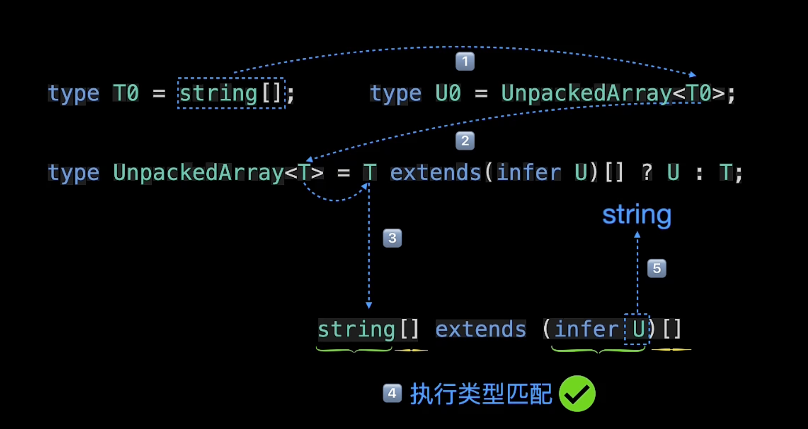

# Ts的扩展知识体系
```s
https://www.bilibili.com/video/BV1HR4y1N7ea/?spm_id_from=pageDriver&vd_source=66d9d28ceb1490c7b37726323336322b
```

<br>

# 赋值的相关问题
比如一个接口的返回值类型我们声明为
```js
type category1ItemResType = {
  id: number | string
  name: string
}
```

而实际上, 我们该接口返回的数据是
```js
{
  id: ,
  name: ,
  createTime: ,
  updateTime: 
}
```

但是 当我们将请求回来的数据 赋值给 category1ItemResType[] 的变量的时候, 并没有报错, res.data是 id, name, createTime, updateTime 构成的对象数组

而category1List是 id, name 构成的对象数组 它们之间的属性并不一致, 为什么不会报错
```js
this.category1List = res.data
```

<br>

**解答:**  
在TypeScript中，当你将一个对象分配给一个具有更少属性的类型时，TypeScript 通常是宽松的，不会强制你的对象精确匹配类型。这种行为被称为 **“赋值兼容性”**

<br><br>

# ``Promise<T>``
我们能看到很多地方的返回值都是一个Promise, 它经常会带一个泛型

**泛型T表示了异步操作的结果类型**, 具体来说，当你使用 Promise<T> 时，它表示一个异步操作最终会返回一个类型为 T 的值。

```js
function(options: optionsType): Promise<{ baseURL: string }>
```

这个函数的返回值是一个 Promise，它表示这个函数会执行一些异步操作，并且在操作完成后返回一个包含 { baseURL: string } 结构的对象。

当异步操作完成时，Promise 就会被解决（resolved）为这个特定类型的对象。

<br><br>

# 扩展: HTML DOM元素的类型
在使用 TypeScript 获取 HTML DOM 元素时，你通常需要指定元素的类型以便 TypeScript 可以提供类型检查和代码补全功能。

```s
https://github.com/microsoft/TypeScript/blob/main/src/lib/dom.generated.d.ts
```

<br>

```js
interface HTMLElementTagNameMap {
  "a": HTMLAnchorElement;
  "abbr": HTMLElement;
  "address": HTMLElement;
  "applet": HTMLAppletElement;
  "area": HTMLAreaElement;
  "article": HTMLElement;
  "aside": HTMLElement;
  "audio": HTMLAudioElement;
  "b": HTMLElement;
  "base": HTMLBaseElement;
  "bdi": HTMLElement;
  "bdo": HTMLElement;
  "blockquote": HTMLQuoteElement;
  "body": HTMLBodyElement;
  "br": HTMLBRElement;
  "button": HTMLButtonElement;
  "canvas": HTMLCanvasElement;
  "caption": HTMLTableCaptionElement;
  "cite": HTMLElement;
  "code": HTMLElement;
  "col": HTMLTableColElement;
  "colgroup": HTMLTableColElement;
  "data": HTMLDataElement;
  "datalist": HTMLDataListElement;
  "dd": HTMLElement;
  "del": HTMLModElement;
  "details": HTMLDetailsElement;
  "dfn": HTMLElement;
  "dialog": HTMLDialogElement;
  "dir": HTMLDirectoryElement;
  "div": HTMLDivElement;
  "dl": HTMLDListElement;
  "dt": HTMLElement;
  "em": HTMLElement;
  "embed": HTMLEmbedElement;
  "fieldset": HTMLFieldSetElement;
  "figcaption": HTMLElement;
  "figure": HTMLElement;
  "font": HTMLFontElement;
  "footer": HTMLElement;
  "form": HTMLFormElement;
  "frame": HTMLFrameElement;
  "frameset": HTMLFrameSetElement;
  "h1": HTMLHeadingElement;
  "h2": HTMLHeadingElement;
  "h3": HTMLHeadingElement;
  "h4": HTMLHeadingElement;
  "h5": HTMLHeadingElement;
  "h6": HTMLHeadingElement;
  "head": HTMLHeadElement;
  "header": HTMLElement;
  "hgroup": HTMLElement;
  "hr": HTMLHRElement;
  "html": HTMLHtmlElement;
  "i": HTMLElement;
  "iframe": HTMLIFrameElement;
  "img": HTMLImageElement;
  "input": HTMLInputElement;
  "ins": HTMLModElement;
  "kbd": HTMLElement;
  "label": HTMLLabelElement;
  "legend": HTMLLegendElement;
  "li": HTMLLIElement;
  "link": HTMLLinkElement;
  "main": HTMLElement;
  "map": HTMLMapElement;
  "mark": HTMLElement;
  "marquee": HTMLMarqueeElement;
  "menu": HTMLMenuElement;
  "meta": HTMLMetaElement;
  "meter": HTMLMeterElement;
  "nav": HTMLElement;
  "noscript": HTMLElement;
  "object": HTMLObjectElement;
  "ol": HTMLOListElement;
  "optgroup": HTMLOptGroupElement;
  "option": HTMLOptionElement;
  "output": HTMLOutputElement;
  "p": HTMLParagraphElement;
  "param": HTMLParamElement;
  "picture": HTMLPictureElement;
  "pre": HTMLPreElement;
  "progress": HTMLProgressElement;
  "q": HTMLQuoteElement;
  "rp": HTMLElement;
  "rt": HTMLElement;
  "ruby": HTMLElement;
  "s": HTMLElement;
  "samp": HTMLElement;
  "script": HTMLScriptElement;
  "section": HTMLElement;
  "select": HTMLSelectElement;
  "slot": HTMLSlotElement;
  "small": HTMLElement;
  "source": HTMLSourceElement;
  "span": HTMLSpanElement;
  "strong": HTMLElement;
  "style": HTMLStyleElement;
  "sub": HTMLElement;
  "summary": HTMLElement;
  "sup": HTMLElement;
  "table": HTMLTableElement;
  "tbody": HTMLTableSectionElement;
  "td": HTMLTableDataCellElement;
  "template": HTMLTemplateElement;
  "textarea": HTMLTextAreaElement;
  "tfoot": HTMLTableSectionElement;
  "th": HTMLTableHeaderCellElement;
  "thead": HTMLTableSectionElement;
  "time": HTMLTimeElement;
  "title": HTMLTitleElement;
  "tr": HTMLTableRowElement;
  "track": HTMLTrackElement;
  "u": HTMLElement;
  "ul": HTMLUListElement;
  "var": HTMLElement;
  "video": HTMLVideoElement;
  "wbr": HTMLElement;
}
```

<br>

### Event 类型:
Event是基本的事件对象的类型, 我们还可以继续细分
1. MouseEvent: 鼠标事件对象
2. KeyboardEvent: 键盘事件对象
3. ChangeEvent: Change 事件对象
4. ClipboardEvent: 剪贴板事件对象
5. DragEvent: 拖拽事件对象
6. TouchEvent: 触摸事件对象
7. WheelEvent: 滚轮事件对象
8. AnimationEvent: 动画事件对象
9. TransitionEvent: 过渡事件对象

```js
element.addEventListener("click", (event: MouseEvent) => {
    // 处理点击事件
});
```

<br>

### Ts中一些关键字 和 工具  
```
https://juejin.cn/post/7003148571717402632
https://www.jianshu.com/p/92f7a1cad1d7
```

<br>

### **<font color="#C2185B">Extract:</font>** 
如果 NewPerson 是 Person 子类的时候 就返回 NewPerson, 否则返回异常
```js
Extract<NewPerson, Person>

// Extract实现源码 原理很简单
type Extract<T, U> = T extends U ? T : never;
```

**示例:**  
```js
interface Person {
  name: string;
}

interface NewPerson {
  name: string;
  age: number;
  id: number;
}

// 案例1
//  NewPerson如果extends继承Person(继承了Person的属性)，就返回NewPerson，否则就never异常
const obj: Extract<NewPerson, Person> = {
  name: '',
  age: 1,
  id: 1
}
```

<br>

### **<font color="#C2185B">Exclude:</font>** 
和 Extract 正好相反

如果 NewPerson 是 Person 子类的时候 就返回 never 异常, 否则返回NewPerson
```js
Extract<NewPerson, Person>

// Exclude源码
type Exclude<T, U> = T extends U ? never : T;
```

<br>

### **<font color="#C2185B">in:</font>**  
生成映射类型, 类似 for...in

它是一种泛型类型 可以将原有的对象类型映射成一种新的对象类型 有点像 map() 

<br>

**语法:**  
P K T 都是类型, in就像遍历一样 对于 K类型的部分(联合类型)进行遍历 拿到每一次的结果对其加工

```js
{
  [P in K] : T
}
```

<br>

**P in K:** 类似 for ... in 语法   
用于变量 K 类型中的所有类型

<br>

**T:**  
用于表示 TS 中的任意类型

<br>

在映射的过程中我们还可以使用 readonly 和 ? 这两个额外的修饰符

```js
{
  [readonly P in K]? : T
}
```

<br>

**修饰符readonly:**  
readonly 修饰符用于定义只读属性，即该属性的值在对象初始化之后不能被修改

<br>

**修饰符?:**  
可选属性

<br>

**+ | -:**  
- +: 用于添加属性的修饰符
  - +readonly 表示将属性定义为只读属性
  - +? 表示将属性定义为可选属性

- -: 用于移除属性的修饰符，例如 -readonly 表示将只读属性转变为可写属性

```js
{ [ P in K ]: T }

{ [ P in K ]?: T }

{ [ P in K ]-?: T }

{ readonly [ P in K ]: T }

{ readonly [ P in K ]?: T }

{ -readonly [ P in K ]?: T }
```

<br>

### 映射类型的示例:
下面的示例中 分为两个部分
- 如何确认key是什么?
- 如何确定key对应的值是什么

```ts
type Item = {
  a: string,
  b: number,
  c: boolean
}
```

```js
// 映射类型1:
type T1 = {
  [ P in "x" | "y" ]: nunmber
}

// 结果:
{
  x: number,
  y: number
}
```


```js
// 映射类型2:
type T1 = {
  [ P in "x" | "y" ]: P
}

// 结果:
{
  x: "x",
  y: "y"
}
```

```js
// 映射类型3:
type T1 = {
  [ P in "a" | "b" ]: Item[P]
}

// 结果:
{
  a: string,
  y: number
}
```

```js
// 映射类型4:
type T1 = {
  [ P in keyof Item ]: Item[P]
}

// 结果:
{
  a: string,
  b: number,
  c: boolean
}
```

<br>

### 使用场景:
在日常中用户注册是很常见的情景 这里我们可以使用ts定义一个user类型, 在该类型中的所有键都是必填的

```ts
type User = {
  name: string,
  password: string,
  address: string,
  phone: string
}
```

<br>

通常情况下对于已注册的用户 我们会只允许用户修改注册信息, 这时我们就可以定义 UserPartial 类型, 表示用于用户更新对象的类型 在该类型中所有的键都是可选的
```ts
type UserPartial = {
  name?: string,
  password?: string,
  address?: string,
  phone?: string
}
```

但是对于用户查看用户信息的场景 我们希望该用户对象所对应的对象类型中所有的键都是只读的 针对这种需求我们可以定义 ReadonlyUser 类型
```ts
type ReadonlyUser = {
  readonly name: string,
  readonly password: string,
  readonly address: string,
  readonly phone: string
}
```

我们上面定义了与用户相关的3种类型 上面的3种类型中有很多重复的代码 我们可以使用映射类型减少上面重复的代码

<br>

**我们使用上面的映射的知识解决这个问题:**
```js
type User = {
  name: string,
  password: string,
  address: string,
  phone: string
}


// 传入的泛型 T
type Partial<T> = {

  // 遍历泛型T类型中的key 进行遍历加工 拿到每一个key去从 T类型中取对应的类型
  [P in keyof T]?: T[P]


  /*
    keyof T == keyof User
    P in "name" | "password" | "address"
  */
}


// 传入泛型
type UserPartial = Partial<User>


{
  name?: string,
  password?: string,
  address?: string,
  phone?: string
}
```

<br>

### **<font color="#C2185B">Key Remapping:</font>**  
```s
https://www.bilibili.com/video/BV1Wr4y1J7x3/?spm_id_from=pageDriver&vd_source=66d9d28ceb1490c7b37726323336322b

# 还有一部分没看 4:09
```

### 语法:
```js
type MappedTypeWithNewKeys<T> = {
  [K in keyof T as NewKeyType]: T[K]
}
```

as NewKeyType: 新的语法 as 子句

其中 NewKeyType 的类型必须是 string | number | symbol 联合类型的子类型 

通过这个子句部分我们可以定义一个 getters 工具类型 用于为对象类型生成对应的getter类型
```js
type Getters<T> = {
  [K in keyof T as `get${Capitalize<string & K>}`]: () => T[K]
}
```

keyof T 返回的类型可能包含 symbol 类型


Capitalize要求处理的类型 需要是string类型的子类型 所以我们通过 交叉运算符进行类型的过滤 string & K

```js
type Getters<T> = {
  [K in keyof T as `get${Capitalize<string & K>}`]: () => T[K]
}


interface Person {
  name: string,
  age: number,
  location: string
}

type LazyPerson = Getters<Person>
{
  getName: () => string,
  getAge: () => number,
  getLocation: () => string
}
```

<br>

### **<font color="#C2185B">is:</font>**  
用作类型保护
```js
// 可以看见在返回值的不是类型而是一个表达式"val is string", 这段代码的意思是当isString返回值为true的时候, 参数val就是string类型
function isString1(test: any): test is string {
  return typeof test === 'string';
}

function isString2(test: any): boolean {
  return typeof test === 'string';
}

const a = isString1('string'); // --> true
const b = isString2('string'); // --> true

// 这样来看 似乎两者没有差别 都能正确判断 string 类型 但是如果场景复杂一点 如下
function doSomething(params: any) {
  if (isString1(params)) {
    params.toLowerCase();
    // params.xxx(); // --> Property 'xxx' does not exist on type 'string'
  }
  if (isString2(params)) {
    params.xxx();
  }
}

doSomething('string'); // TypeError: params.xxx is not a function
```

直接返回boolean不行吗?

不行! 看下面的代码, 我们虽然知道在if判断后aa一定是string,但是ts不知道, ts会提示aa可能是null类型, 不能执行substring方法.

```js
const aa: null | string = xxx

if (isString(aa)) {
  // aa处报错 所以需要使用is特性. ts可以根据 if 判断推断出当前的aa为string类型:
  aa.substring(0,1)
}
```

<br>

### **<font color="#C2185B">infer:</font>**  
条件类型 + infer

条件类型允许我们检查两种类型之间的关系 通过条件类型我们就能**判断两种类型是否兼容**

infer用于声明类型变量 存储在模式匹配过程中所捕获的类型变量, infer 通常用在 extends 关键字右侧的条件类型中。

下面的代码中使用 infer 声明了一个新的类型变量U 用于存储被推断的类型

<br>

**创建一个捕获 T0 类型数组的类型的工具:**
```js
type UnpackedArray<T> = T extends(infer U)[] ? U : T
                                     ↓
                                声明新的类型变量 U


type T0 = string[]

// 传入T0 返回string类型
type U0 = UnpackedArray<T0> // string
```

<br>

**推断流程图:**  


<br>

**创建一个捕获 T0 类型返回值类型的工具:**
```js
type UnpackedFn<T> = T extends (...args: any[]) => infer U ? U : T


type T1 = () => string

// 传入T0 返回string类型
type U1 = UnpackedFn<T1> // string
```

<br>

**注意:**  
infer只能在 extends 子句中使用, 帮助我们推断出函数的返回值 

<br>

### **<font color="#C2185B">Partial:</font>**  
把已有的类型属性, 变成一个新类型的可选属性

<br>

**语法:**  
```ts
type 可选新类型 = partial<老类型>
```

可把定义好的对象（包含 必选+可选项）类型**全部转化为可选项**
```js
// 已有定义类型Person
interface Person {
  name: string;
  age: number;
  id: number;
  sex: 0 | 1;
  address: string;
  weight: number;
}

// 使用方法
const newObj: Partial<Person> = {
  name: '张三' // 假如只需要一项 Partial的便捷性 可以不需要从新定义类型
};

// Partial<Person>等同于 NewPerson
interface NewPerson {
  name?: string;
  age?: number;
  id?: number;
  sex?: 0 | 1;
  address?: string;
  weight?: number;
}
```

<br>

### **<font color="#C2185B">Required:</font>**  
Required 和 Partial刚好相反,可把定义好的对象（包含 必选+可选项）类型**全部转化为 必选项**

```js
// 已有定义类型Person
interface Person {
  name: string;
  age: number;
  id?: number;
  sex?: 0 | 1;
}

// 使用方法
const newObj: Required<Person> = {
    name: '张三',
    age: 1,
    id: 1,
    sex: 1
};

// Required<Person>等同于 NewPerson
interface NewPerson {
  name: string;
  age: number;
  id: number;
  sex: 0 | 1;
}

```

<br>

### **<font color="#C2185B">Pick:</font>**  
顾名思义，可以采集 已定义对象中 自己需要的一部分形成新的定义类型。

也就是说**从定义好的类型里面拿到一条类型** 相当于从对象中取出一个属性一样

<br>

**语法:**  
```js
Pick<目标类型, "类型中的属性1 | 类型中的属性1">
```

<br>

返回一个新的类型(对象的类型)
```js
type listItemType = {
  name: string,
  age: number,
  address: string
}

type addressType = Pick<listItemType, "address">
/*
  type addressType = {
    address: string;
  }
*/

```

<br>

```js
interface UserObj {
  readonly name: string;
  age: number;
  id: number;
  sex: 0 | 1;
  address: string;
  weight: number;
 }
 
 // 采集需要的
 type Person = Pick<UserObj, "name" | "id">;
 
 // 此时Person 等同于 Person1
 interface Person1 {
  readonly name: string;
  id: number;
}
```

<br>

### **<font color="#C2185B">Omit:</font>**  
顾名思义 可以剔除 已定义对象中 自己不需要的一部分形成新的定义类型。

```js
interface UserObj {
  readonly name: string; // readonly 只读属性 只能初始化定义 不能二次赋值
  age: number;
  id: number;
  sex: 0 | 1;
  address: string;
  weight: number;
}

// 剔除省略自己不需要的
type Person = Omit<UserObj , "number" | "sex"  | "address" | "weight">;

// 此时Person 等同于 Person1

interface Person1 {
  readonly name: string;
  id: number;
}
```

<br>

**使用场景:**  
我们定义了 user 的类型用于描述用户对象 其中 id createdAt updatedAt 是创建用户的时候服务端自动生成的
```js
type User = {
  id: string,
  name: string,
  password: string,
  createAt: Date,
  updatedAt; Date
}
```

因此在注册用户的时候 用于描述用户注册时候的对象类型 RegiisterUser 类型中并不需要 id createdAt updatedAt
```js
type RegisterUser = {
  name: string,
  password: string
}
```

这时我们就可以使用 Omit Type 

```js
type RegisterUser = Omit<User , "id" | "createdAt"  | "updatedAt">;

// 结果
{
  name: string,
  password: string
}
```

<br>

**使用场景2:**  
使用接口继承的方式实现覆盖业务对象类型中已知属性的类型
```js
type User = {
  id: string,
  name: string,
  password: string,
  createAt: Date,
  updatedAt; Date
}

// 
interface UserUI extends Omit<User, "createdAt" | "updatedAt"> {
  createdAt: string,
  updatedAt: string
}
```

UserUI接口用于在页面上显示用户信息 我们将原有的 createdAt updatedAt 原有的 Date 类型 修改后 string 类型

<br>

### **<font color="#C2185B">Record:</font>**  
在 TS 中，类似字符串、数组、接口这些常见的类型都非常常见

但是如果要定义一个对象的 key 和 value 类型该怎么做呢？这时候就需要用到 TS 的 Record 了。

```js
interface PageInfo {
  title: string;
}

type Page = "home" | "about" | "contact";

const nav: Record<Page, PageInfo> = {
  about: { title: "about" },
  contact: { title: "contact" },
  home: { title: "home" },
};
```

<br>

### **<font color="#C2185B">Readonly:</font>**  
使用 Readonly 将一个类型定义为不可变的类型, 这样对象中的属性不能被修改
```js
interface Obj {
  a: number
  b: string
}

let obj: Readonly<Obj> = {
  a: 1, b: '2'
}

obj.a = 3 // 我们修改对象中的属性 会报错
```

<br>

**问题:**  
该Readonly是浅的不可变的类型
```js
interface Obj {
  a: number
  b: string,
  c: {
    d: boolean
  }
}

let obj: Readonly<Obj> = {
  a: 1, b: '2', c: {
    d: true
  }
}

obj.c.d = false // 居然可以更改
```

而我们需要的是深度遍历这个对象里面的所有属性 让它都变成不可变 所以我们就不能使用官方提供的 Readonly 需要自己写一个

<br>

**深度只读:**  
```ts
// 我们对 T 进行类型约束
type DeepReadonly<T extends Record<string | symbol, any>> {
  // 属性对应的类型 跟原类型相同 T[K], 为了深度只读 需要递归调用
  readonly [K in keyof T]: DeepReadonly<T[K]>
}
```

<br>

### **<font color="#C2185B">NonNullable:</font>**  
约束类型不能为 null 和 undefined

```js
type NonNullable<T> = T extends null | undefined ? never : T;
```

<br>

###　**<font color="#C2185B">Parameters:</font>**  
获取一个函数的参数类型，返回的是一组包含类型的数组
```js
type Parameters<T extends (...args: any) => any> = T extends (
  ...args: infer P
) => any
  ? P
  : never;
```

<br>

### **<font color="#C2185B">ConstructorParameters:</font>**  
获取构造函数中的参数类型
```js
type ConstructorParameters<T extends abstract new (...args: any) => any> =
  T extends abstract new (...args: infer P) => any ? P : never;
```

<br>

### **<font color="#C2185B">InstanceType:</font>**  
获取类的实例类型 和用类直接去约束类型一样

```js
type InstanceType<T extends abstract new (...args: any) => any> =
  T extends abstract new (...args: any) => infer R ? R : any;
```

<br>

### 类型中的三元表达式
### <font color="#C2185B">T extends U ? X : Y</font>  
当类型T可以赋值给类型U的时候, 则返回的类型为X类型, 否则返回类型Y类型

```js
type IsString<T> = T extends string ? true : false

type I0 = IsString<number>  // I0为 false值类型
type I1 = IsString<'abc'>  // I1为 true值类型
type I2 = IsString<any>  // I2为 boolean 类型
type I3 = IsString<never>  // I3为 never 类型
```

<br><br>

# declare:
假如我们封装了一个好用的工具 那么Ts的声明文件是必不可少的 它不仅仅让我们的工具支持Ts 更是负责充当一个说明书的作用 让人对其的使用一目了然

比如我们自己创建了一个模块(js文件) 里面有个类, 类内部有方法和属性, 但是我们在ts中使用该类的时候
```js
// myLib 的位置有红色波浪线
const result = myLib.makeGreeting('hello')
```

这个时候我们就需要编写 myLib 类的声明文件, 告诉ts它的作用

<br>

### 什么是声明语句？什么时候需要它？  
假如我们想使用第三方库 jQ 一种常见的方式是在 html 中通过script标签引入 然后我们就可以使用全局变量 $

但是 ts 并不了解这两个变量从哪来的 到哪去 所以我们可以告诉 Ts的编译器 这个$大概是个什么东西

<br>

### 告诉 Ts $ 是什么  

**<font color="#C2185B">声明变量: declare var $: (selector: string) => any</font>**  

```js
declare var $: (selector: string) => any
```

让 Ts编译器 可以正常检测 它会在编译结果中被删除

<br>

比如 如下代码在 Ts 中会报错
```js
foo = 123
console.log(foo)  // connot find name 'foo'


// 但是假如我们使用 declare 声明 那么即使在 Ts环境下也不会报错

declare var foo: number
foo = 123
console.log(foo)
```

也就是说我们可以通过 declare 关键字 声明一个js变量类型 这就是**声明语句** 

<br>

### 声明文件 sample.d.ts  
一般这种声明方式都会写在 一个别的文件中  
这个文件中存放的都是 类型的定义 并且在打包的过程中 不会被编译到js文件里面

<br>

**<font color="#C2185B">.d.ts 文件的生成方式</font>**  
```
tsc -d sample.ts
```

<br>

**<font color="#C2185B">声明函数: declare function fnName() { ... }</font>**  

```js 
// sample.ts
interface Person {
  firstName: string;
  lastName: string;
}

function greeter(person: Person): string {
  return 'Hello, ' + person.firstName + ' ' + person.lastName;
}


// 输入 命令
tsc -d sample.ts


// 这样就会生成 sample.d.ts 文件
interface Person {
    firstName: string;
    lastName: string;
}
declare function greeter(person: Person): string;
```

<br>

**<font color="#C2185B">declare module '模块名' { ... }</font>**  
使用上面的语法 我们声明一个模块 比如 vue在ts环境中使用的时候 需要做下面的声明
```js 
declare module "*.vue" {
  import Vue from "vue";
  export default Vue;
}
```

<br>

### 什么是声明文件？  
我们可以把声明语句 看做是声明文件的组件 声明语句组成声明文件 通常我们会把声明语句放到一个单独的文件中 比如 jQuery.d.ts  

声明文件必须以 .d.ts 为后缀 一般来说 ts会解析项目中所有的 *.ts 文件 .d.ts 也属于 .ts 文件类型

所以我们将 jQuery.d.ts 文件放入到项目的根目录中后 其他所有 .ts 文件都可以获取 jQuery 的类型定义了 假如仍然无法解析 那么可以检查下 tsconfig.json 文件

<br>

### 书写声明文件  
一般来说第三方库都会提供声明文件, 我们只需要安装它就好了。但有一些库不会提供声明文件, 我们就需要自己书写声明文件了。

前面只介绍了最简单的声明文件内容, 而真正书写一个声明文件并不是一件简单的事

书写声明文件有多种场景需要契合, 
例如 npm导入 和 script导入 的声明文件的写法与使用方法都不一样, 
我们这也知会讨论比较常用的这两种方式, 如果看官有兴趣, 可以自行移步教程学习。

<br>

### 全局变量: 通过 script 标签引入第三方库, 注入全局变量  
全局变量是最简单的一种场景, 之前举的例子就是通过 script 标签引入 jQuery, 注入全局变量 $ 和 jQuery。

使用全局变量的声明文件时, 如果是以 ``npm install @types/xxx --save-dev`` 安装的, 则不需要任何配置。

如果是将声明文件直接存放于当前项目中, 则建议和其他源码一起放到 src 目录下（或者对应的源码目录下）: 
```
| - src
  - index.ts
  - jQuery.d.ts
```

如果没有生效, 可以检查下 tsconfig.json 中的 files、include 和 exclude 配置, 确保其包含了 jQuery.d.ts 文件。

<br>

### 全局变量的声明文件主要有以下几种语法:  

**1. declare var / let / const声明全局变量**  
没什么区别 const定义的无法修改。

使用const的时候是最多的, 一般不允许他人修改你的函数
```js 
declare const jQuery: (selector: string) => any;
```

<br>

**2. declare function 声明全局方法**  
```js
declare function jQuery(selector: string): any;
```

<br>

**3. declare class 声明全局类**  
```js
declare class Animal {
  name: string;
  constructor(name: string);
  sayHi(): string;
}

//其他文件中
let cat = new Animal('Tom');
```

<br>

**4. declare namespace 声明（含有子属性的）全局对象(比如声明一个类)**  
declare namespace 还是比较常用的, 它用来表示全局变量是一个对象, 包含很多子属性。或者一个类似第三方的包 举个例子: 

**这里面的写法类似java中的接口**
```js 
// jQuery 是一个全局变量, 它是一个对象 jQuery.ajax 方法可以调用
// 那么我们就应该使用 declare namespace jQuery 来声明这个属性的全局变量。
declare namespace jQuery {
  // 对类中的方法签名的各个部分指明类型
  function ajax(url: string, settings?: any): void;

  // 对类中属性指明类型
  const version: number;

  // 内部类
  class Event {
    blur(eventType: EventType): void
  }

  // 枚举
  enum EventType {
    CustomClick
  }
}
```

<br><br>

### npm包的声明文件可能存在的位置  
首先, 通过 import foo from 'foo' 导入, 符合 ES6 模块规范

在我们给一个 npm 包创建声明文件之前, 需要先看看它的声明文件是否已经存在。一般来说, npm 包的声明文件可能存在于两个地方: 

<br>

**位置1:**  
与该 npm 包在一起。package.json中有types字段, 或有一个index.d.ts声明文件。这种模式不需要额外安装其他包, 是最为推荐的, 所以以后我们自己创建 npm 包的时候, 最好也将声明文件与 npm 包绑定在一起。

<br>

**位置2:**  
发布到 @types 里。我们只需要尝试安装一下对应的 @types 包就知道是否存在该声明文件, 安装命令是 npm install @types/foo --save-dev。这种模式一般是由于 npm 包的维护者没有提供声明文件, 所以只能由其他人将声明文件发布到 @types 里了。

假如以上两种方式都没有找到对应的声明文件, 那么我们就需要自己为它写声明文件了。

<br>

### import 语句导入的模块, 声明文件存放的位置有约束  
由于是通过 import 语句导入的模块, 所以声明文件存放的位置也有所约束, 一般有两种方案: 

1. 创建一个 node_modules/@types/foo/index.d.ts 文件, 存放 foo 模块的声明文件。这种方式不需要额外的配置, 但是 node_modules 目录不稳定, 代码也没有被保存到仓库中, 无法回溯版本, 有不小心被删除的风险, 故不太建议用这种方案, 一般只用作临时测试。

2. 创建一个 types 目录, 专门用来管理自己写的声明文件, 将 foo 的声明文件放到 types/foo/index.d.ts 中。这种方式需要配置下 tsconfig.json 中的 paths 和 baseUrl 字段。

```js
| - src
  - index.ts

| - types
  | - foo
    - index.d.ts
  - tsconfig.ts


// tsconfig.json
{
  "compilerOptions": {
    "module": "commonjs",
    "baseUrl": "./",
    "paths": {
      "*": ["types/*"]
    }
  }
}
```


<br><br>

# 正题: 语法部分

<br><br>

# const 
下面的代码 不光光是 let const 的区别 其通过他们定义的类型也不一样
```js
let a:string = "xxx";

const b = "xxx";
```

<br>

### 通过 let 定义的 变量a 的类型:
**a变量** 实际为一种宽泛的字符串类型, 只要是字符串, 即可赋值给变量a

<br>

**b变量** 实际为一种具体的**值类型**, **类型为“xxx”**, 不可被修改  
也就是说 const 定义的变量其类型就是 它值本身 因为const定义的变量是常量 不允许被修改
```js
const a = 10
// 类型: a的类型就是10
const a: 10
```

<br>

### 总结:
const关键字实际是将宽泛的类型, 例如字符串, 数字等转化为具体的 **值类型**。  

**值类型也是单独的一种类型**  

<br><br>

# 断言: as const
**作用:** 
将 宽泛的联合类型 限定为具体的值类型

<br> 

### 语法: 具体的值的后面 + as const
```js
let arr = [m, n] as const
```

<br> 

我们先看看下面的代码
```js
let m = 100

let n = "aaa"

// Ts自动推断 arr 的类型是 arr: (string | number)[] 联合类型数组, 它的成员既可以是string 也可以是 number
let arr = [m, n]

// Ts自动推断 c 的类型是 let c: string | number 的联合类型
let c = arr[0]

c = 2000
c = "bbb"
```

我们能观察到 当我们把 m n 放入数组中后 arr的元素允许的类型就被推断为 ``(string | number)`` **所以我们取出数组中的任意一个元素 它的类型都是 联合类型**

<br>

但是上面的情况我们要尽量的 **避免** 这时候我们就可以使用 ``as const`` 断言 将 宽泛的联合类型 限定为具体的值类型

```js
let m = 100
let n = "aaa"

// 使用 as const 后 arr的类型变成了只读 且 每个成员的类型就是值本身 也叫做值类型 let arr: readonly [number, string]
let arr = [m, n] as const


// 注意: arr的成员没有办法被赋值 因为 arr 现在变为只读属性了
```

这样 首先我们能看到 arr 被当做了只读 而且它相当于被限定成了一个元祖 第一个数据只能是number 第一个数据只能是string

<br>

### 特点:
1. 等号右侧 值的部分的后面 + as const
2. as const将联合类型 确定为 值本身的类型
3. as const之后 该变量为只读 不可以被修改

<br>

### as const的使用场景:
当涉及到数组中元素为联合类型的时候, 每个元素都会有两个类型 或者是 每个元素都是联合类型 当编辑器无法准确的识别 元素的类型的时候 我们就可以使用 as const

```js
function test() {

  // 字符串
  let a = "abc"

  // 函数
  let b = (fname:string, lname: string): string => fname + lname

  // 这时数组中的每个元素的类型就是string和fn的联合类型: 比如 a: string | fn
  return [a, b]
}

// 解构返回值 拿到 y 函数
let [x, y] = test()

// 调用 y 函数并传递参数
console.log(y("sam", "erin"))


// 编辑器报错: 编译器认为 y 的类型是:
let y: 
  string | 
  ((fname: string, lname: string) => string)
```

上面的内容编译失败 y 的类型 编译器并不能认定 y 是一个函数  
这时候我们可以 as const 将宽泛的 ``string | (xxx)`` 转为 **只读的 值类型** 这样y一定是一个函数

<br>

```js
function test() {
  let a = "abc"
  let b = (fname:string, lname: string): string => fname + lname

  return [a, b] as const
}

let [x, y] = test()
console.log(y("sam", "erin"))


// 这时编译器会认出 y 为 函数
let y: (fname: string, lname: string) => string
```

<br>

as const断言, 可以将代码中宽泛的数据类型定义具体化, 从而避免我们在开发过程中, 因为定义过于宽泛, 造成的各种数据处理的错误, 通过精准的数据类型定义, 更好的管理我们前端代码。

<br><br>

# type关键字 定义数据类型:

### 语法:
```js
type XxxType = 类型
```

<br>

### 作用:
用于定义一个类型, 可以定义任意结构的类型, 后续这个类型可以作用变量的具体类型

<br>

**<font coolor="#C2185B">定义 基本类型:</font>**  
```js
type strType = string
```

<br>

**<font coolor="#C2185B">定义 联合类型:</font>**  
```js
type strType = string | number
```

<br>

**<font coolor="#C2185B">定义 对象类型:</font>**  
多个属性的后面使用, 和 ;好像都可以, 
```js
type strType = {
  name: string,
  age: number
}
```

<br>

**<font coolor="#C2185B">定义 数组类型:</font>**  
```js
// 定义基本类型数组
type strType = number[]


// 联合类型的数组
type strType = (number | string)[]


// 定义对象数组
type listType = {
  name: string,
  age: number
}

let arr:listType[] = [
  {
    name: "sam",
    age: 18
  }
]
```

<br>

**<font coolor="#C2185B">定义 函数类型:</font>**  
```js
// 定义函数返回值的类型
type rvType = () => string

// 定义函数的完整类型
type fnType = (param1:number, param2:boolean) => boolean

// 箭头函数的类型位置
let fn:fnType = (param1, param2) => { ... }
```

<br>

```js
// 普通函数: 类型声明在函数签名的各个部分
function fn(num:number, name:string, ...args:number[]):void { }


// 箭头函数: 类型声明在函数签名的各个部分
const fn2 = (num:number, ...args: string[]):void => { }


// 箭头函数: 类型声明在类型处 key:type = value
const fn5: (num: number) => number = (num) => 5
```

<br>

**分开定义的示例:**  
```js
// 定义数组中元素的联合类型
type arrJoinType = (number|string)[]
let arr = [1, "a"]
let arr1 = ["a", "b"]


// 示例:
// 定义函数返回值类型
type Name = string;

// 定义形参为函数类型
type NameResolver = () => string;

// 定义形参为联合类型
type NameOrResolver = Name | NameResolver;


// 因为形参是联合类型 所以内部需要判断使用
function getName(n: NameOrResolver): Name {
  if (typeof n === 'string') {
    return n;
  } else {
    return n();
  }
}
```

<br>

### 扩展: interface 
interface 和 type 几乎一样 唯一的区别在于 <font color="#C2185B">type一旦定义并作用于变量后, 后续obj中 不能添加新的属性</font>

而interface是可以进行继承的
```js
// type示例:
// 一旦定义好 就不能给 objType 添加属性了
type objType = {
  name: string,
  age: number
}

let obj: objType = {
  name: "sam",
  age: 18,

  // 后期想要在obj中添加属性会报错, 因为type声明的类型中没有address
  address: "白山"
}


// 但是接口可以 因为接口可以继承
interface objType {
  name: string,
  age: number
}

// 我们新创建一个接口, 然后继承前面的接口 这样新接口中就有新的属性了
interface addObjType extends objType {
  address: string
}

let obj: addObjType = {
  name: "sam",
  age: 18,
  address: "白山"
}
```

<br>

**技巧: 同名接口 会进行合并**  
所以如果是同名则不需要再用 extends 来继承
```js
// 同名接口 里面的规则可能会合并
interface Person {
  name: string,
  age: number
}

interface Person {
  address: string
}

let obj:Person = {
  name: "sam",
  age: 18,
  address: "白山"
}
```

<br><br>

## type 交叉类型: 类似接口的继承 &
我们使用type定义好的类型 可以使用 & 来和另外一个类型做合并操作, 这样会返回一个新的类型

<br>

**示例:**  
```js
// 定义一个类型
type Person = {
  name: string,
  age: number
}


// 将 Person类型 和 其它给定类型你合并 返回一个新的类型
type China = Person & {
  address: string
}


// 新类型
let obj: China = {
  name: "sam",
  age: 18,
  address: "白山"
}
```

<br>


### 交叉运算符: &
交叉运算符允许你将多个类型组合成一个新的类型，这个新类型具有所有类型的特性

```js
// A B C中的类型做合并后, 返回一个新的类型
type ABC = A & B & C
```

<br>

### 交叉运算符的特性:
- 唯一性: A & A 等价于 A
- 满足交换律: A & B 等价于 B & A
- 满足结合律: (A & B) & C 等价于 A & (B & C)
- 父类型收敛: **如果 B 是 A 的父类型** 则 A & B 将被收敛为A类型 也就是说 当交叉类型中的一个类型是另一个类型的子类型时，交叉类型将被收敛为更具体（更窄）的类型。

<br>

any类型 和 number类型比较特殊, 除了number类型之外 任何类型和any类型的交叉结果都是any
```js
type A0 = 1 & number    // 1 
type A1 = "1" & string    // "1" 
type A2 = true & boolean    // true

type A3 = any & 1    // any
type A4 = any & boolean    // any
type A5 = any & nerver    // nerver
```

<br>

**注意:**  
我们知道 对两个**类类型**使用 & 链接的之后 新类型是既包含A也包含B的类型
```ts
interface A {
  c: string
}

interface B {
  a: string
}


// 运算结果使用 type 来接收
type res = A & B

// res类型相当于

{
  c:string,
  a: string
}
```

<br>

但是进行交叉运算的多个类型中 包含相同的属性的时候 但你属性的类型不一致的时候 会怎么样?
```js
interface A {
  c: string,
  d: string
}

interface B {
  c: number,
  e: string
}
```

我们发现 两个类型中都有 c 且 它的类型也不一样, 那这两个类型进行 & 运算之后 c属性会是 string | number 么?

不是! **c属性的类型会是 never** 

因为这样运算的结果是 c属性是 string and number 必须是string同时必须是number, 这样的c属性是不存在的 **所以是never类型** 

<br>

### 总结:  
1. 如果在做交叉运算的时候是 1 & number, 因为number是1的父类 所以类型缩窄到1, ``type A = 1 & number`` A的类型就是1

2. 如果我们是两个对象进行交叉运算, 则新类型中包含的是两个对象合并的结果

3. 任何类型和any做交叉其结果都是any

4. 如果两个对象中包含同名属性, 且同名属性的类型不一致的时候, 其类型为 never, 因为没有一个值既是 string 又是 number

<br><br>

## type支持泛型:
我们在 type名 的后面 可以指明泛型
```js
type Lazy<T> = T | (() => T)
```

<br><br>

# typeof 关键字
我们可以通过 ``typeof操作符`` 获取变量的类型

js中的typeof用于检查变量的值的类型, 如 ``typeof obj === 'object'``

ts中的typeof用于获取变量本身的数据类型, 使用在类型的位置

<br>

### 语法:
对一个数据结构使用 typeof 进行检查 可以返回给定数据结构的类型
```js
type xxxType = typeof 数据结构(如obj)


let x = 123;
let y: typeof x = 456; // y 的类型为 number，和 x 的类型相同
```

<br>

**返回值: 类型**  

```js
let person = {
  name: "sam",
  age: 19,
  children: [
    {
      name: "nn",
      age: 5
    }
  ]
}

// typeof 返回的是类型 所以我们创建一个 type 来接收
type personType = typeof person


// personType的类型为
type personType = {
  name: string;
  age: number;
  children: {
    name: string;
    age: number;
  }[];
}
```

<br>

**使用 typeof 获取对象中指定属性的类型:**  
```js
// 我们还可以获取 对象中一个属性的类型
type childrenType = typeof person["children"]
```

```js
let person = {
  name: "sam",
  age: 19,
  children: [
    {
      name: "nn",
      age: 5
    }
  ]
}

type personChildType = typeof person.children


// personChildType的类型为
type personChildType = {
  name: string;
  age: number;
}[]
```

<br>

### 使用场景: enum
在 ts 中 枚举类型是一种特殊的类型, 在对枚举类型进行操作的时候 一般会使用 ``keyof + typeof`` 获取联合值类型
```js
enum HttpMethod {
  Get,
  Post
}

// 拿到枚举类中的key 作为 值类型
type Method = keyof typeof HttpMethod
"Get" | "Post"
```

也就是说 typeof 获取到类型, keyof拿到类型中key的部分, 将这个部分做为类型

<br>

```js
const obj = {
  name: 'sam'
}
// objType的类型为 {name: string}
type objType = typeof obj
// keyof对objType 是将 key 的部分拿出来当做为值类型, 也就是name就是值类型
type res = keyof objType
```

<br>

### 使用场景: 函数
我们会先通过 typeof 来获取函数的类型 A 

- 然后通过 ``ReturnType<A>`` 来获取 A类型 中返回值类型
- 然后通过 ``Parameters<A>`` 来获取 A类型 中形参的类型

```js
function add(a:number, b:number) {
  return a + b
}


type AddType = typeof add
// (a:number, b:number) => number

type AddReturnType = ReturnType<AddType>
// number

type AddParamsType = Parameters<AddType>
// [a: number, b:number]
```


### 技巧: typeof 与 类 结合使用
比如, 我们要定义一个函数 函数要求 传入 Point 类, 返回 Point 类
```js
class Point {
  x: number
  y: number

  constructor(x: number, y: number) {
    this.x = x
    this.y = y
  }

}


// 我们要通过函数 返回一个对象 我们需要传入Class 和 Class所需要的参数 返回值也要为Class 所以定义了返回值类型为Point
function getInstance(Clazz: Point, x: number, y: number):Point {
  return new Clazz(5, 5)  
    // 报错: 此表达式不可构造。 类型 "Point" 没有构造签名
}


// 使用 typeof Point 给 类确定类型
function getInstance(Clazz:typeof Point, x:number, y:number) {
  return new Clazz(5, 5)
}
// (parameter) Clazz: new (x: number, y: number) => Point

```

<br>

### 技巧: typeof 与 函数 结合使用
```js
type 变量 = typeof 函数
```

我们使用 typeof 关键字来检查一个函数, 会返回函数的类型
```js
function add(a: number, b: number): number {
  return a + b;
};

type AddType = typeof add;
// (a: number, b: number) => number
```

上面我们通过 ``typeof add`` 得到了 函数整体各个部分的类型 我们还可以根据下面的关键字 获取函数中部分结构的类型

<br>

**<font color="#C2185B">``ReturnType<AddType>``</font>**  
获取 函数类型结构中 返回值部分的类型

<br>

**<font color="#C2185B">``Parameters<AddType>``</font>**  
获取 函数类型结构中 形参部分的类型
```js
//  typeof与函数结合使用
function add(a: number, b: number): number {
  return a + b;
};

// type AddType = (a: number, b: number) => number
type AddType = typeof add;


type AddReturnType = ReturnType<AddType>;   // number
type AddParamsType = Parameters<AddType>;   // [a: number, b: number]
```

<br><br>

### keyof 类型(type)
TS2.1版本中可用:

在js中我们可以通过 Object.keys() 方法获取对象中的key部分, 返回的是 key 组成的数组 
```js
const obj = {
  name: "sam",
  age: 18,
  sex: "男"
}

let keys = Object.keys(obj)
// ["name", "age", "sex"]
```

<br>

而在 ts 中我们面对的是类型 如果要获取对象类型中的键 就需要使用 keyof 操作符

用于获取类型中的所有键 返回的是 联合类型, 也就是key组成的类型

```ts
type User = {
  id: number,
  name: string
}

type UserKeys = keyof User
// "id" | "name"
```
  
可以用于获取 **某种类型** 的所有键, 也就是说 获取的是类型当中的key的部分 作为联合类型, 注意返回的是**值类型**

<br>

### 语法:
```js
type xxxType = keyof 某个type
```

```js
type objType = typeof obj
/*
  type objType = {
    name: string;
    age: number;
  }
*/

type valueType = keyof objType
// type res = "name" | "age"
```

<br>

然后我们就可以将 res type 用在哪个数据结构上 该数据结构的值 只能是 "name" 或者是 "age"

```js
let str:valueType = "name"  // ok
let str:valueType = "age"   // ok
let str:valueType = "address"   // ng
```

<br>

**获取值的类型:**  
上面使用 keyof 语法后获取的是 key组成的一个新的类型

比如我们获取到的是 "name" | "age" 那么vari的值只能是 name 或者 age
```js
type valueType = "name" | "age"
let vari: valueType = "name" 
```

也就是说 我们把类型中的key拿出来 当成了联合类型
 
<br>

那我们获取key之后, 还可以做什么?, js中我们能可以通过key获取对象中的对应key的属性值是么?

ts中我们可以通过 key 获取到 类型中对应key的值的类型
```js
type User = {
  id: number,
  name: string
}

// 获取User类型中 id 的类型
type U1 = User["id"]  
// number


type U2 = User["id" | "name"]
// string | number


// 这种方式用于通过key或者key对应的值的类型
type U3 = User[keyof User]
// string | number
```

<br>

## 使用场景:
定义一个函数 通过传入key 获取 对象中key对应的值
```js
// 定义对象
const user = {
  id: 1,
  name: "sam"
}

// 定义函数
function getProperty(obj, key) {
  return obj[key]
}

// 调用函数
getProperty(user, "name")
```

<br>

### 解决方式:
那如果使用ts定义上面的函数呢? 我们使用泛型和keyof操作符来解决

<br>

**要点:**  
函数名的后面声明泛型, 并指明T 和 K的取值范围

如下的方式更加的通用, 使用了 TypeScript 的泛型类型参数（``<T extends object, K extends keyof T>``），这使得函数能够接受任何类型的对象，并且键必须是该对象类型的键。

- T 表示对象的类型，它**必须是一个对象类型**（extends object 约束了 T 必须是对象类型）。

- K 表示对象的键的类型，它必须是**对象类型 T 的键**。

<br>

这样的定义确保了参数 obj 必须是一个对象，参数 key 必须是该对象的键。函数返回的值类型将根据 key 的类型动态确定，这是 TypeScript 强大的类型推断机制的体现。
 
```js
/*
  T extends object:
    使用 extends 来约束该变量的实际类型 必须是object的子类型

  K extends keyof T
    使用 extends 约束变量对应的实际类型为对象类型所有键组成的联合类型的子类型
*/
function getProperty<T extends object, K extends keyof T>(obj:T, key:K): T[key] {
  return obj[key]
}
```

<br>

### keyof 与 typeof 联合使用

```js
let person = {
  name: "sam",
  age: 18,
  job: {
    frontend: "Vue"
  }
}

type PersonType = typeof person
/*
type PersonType = {
  name: string;
  age: number;
  job: {
    frontend: string;
  };
}
*/


let Sam: keyof PersonType = "name"
// sam的值只能为: "name" | "age" | "job"
```

<br>

### 使用场景:
我做过一个小案例, 按钮的事件回调中的形参声明了 用户是什么样的操作 比如加减 函数内部根据具体的操作 来执行对应的逻辑

为了优化我将回调对应的函数逻辑封装到一个对象里面 想通过 形参type 进行调用
```js
methods = {
  inc() {
    console.log("inc")
  },
  dec() {
    console.log("dec")
  }
}

// js中肯定是好用的, 但ts中报错了
methods[type]()
```

报错信息如下:
```
元素隐式具有 "any" 类型, 因为类型为 "string" 的表达式不能用于索引类型 "{ dec(): void; inc(): void; del(): void; }"。
```

可能在说 对象中是函数 你的type是string 所以不能引用对象中的函数吧  

开始我想到的解决办法是 遍历数组 拿到一个个fn 通过判断 <font color="#C2185B">fn.name == type</font> 再进行调用 但性能不好 所以最终决定从 ts 的方向着手看看有没有什么方向
```js
methods = {
  inc() {
    console.log("inc")
  },
  dec() {
    console.log("dec")
  }
}

// js中肯定是好用的, 但ts中报错了
methods[type]()
```

<br>

**<font color="#C2185B">methods[type as keyof typeof methods]</font>**  
告诉 type 的值是 methods对象中的key 

```js
type methodType = typeof methods
/*
  type methodType = {
    inc(): void;
    dec(): void;
  }
*/

type keyType = keyof methodType
/*
  type keyType = "inc" | "dec"
*/


function exec(type: keyof typeof methods): void {
  methods[type]()
}

exec('inc')
```

也就是说通过上述的方式 将我们的 type 的类型定义为 联合类型 "inc" | "dec"

<br><br>

# 数组的数据类型 定义的两种方式
1. ``Array<Item>``
2. ``Item[]``

```ts
export enum Actor {
  /** 受験者 */
  TESTER = 1,
  /** 監視者 */
  CHECKER,
  /** 試験管理者 */
  TEST_MANAGER,
  /** システム管理者 */
  SYSTEM_MANAGER,
  /** 監督官 */
  SUPERVISOR,
}


// 下面返回的数据 就是一个 枚举类型的数组
public static getList(): Actor[] {
  return [
    Actor.TESTER,
    Actor.CHECKER,
    Actor.TEST_MANAGER,
    Actor.SYSTEM_MANAGER,
    Actor.SUPERVISOR,
  ];
}
```

<br><br>

# Ts定义数据类型

### js的问题:
js中的变量可以是任何的类型, 但在一个项目中, 一不小心给这个变量重新赋值了其它的类型, 那么就相当于埋下了一个隐患, 为了排查错误的时候会非常的困难

<br>

### 类型声明:  
类型声明是TS非常重要的一个特点 通过类型声明可以指定TS中变量（参数、形参）的类型  
指定类型后, 当为变量赋值时, TS编译器会自动检查值是否符合类型声明, 符合则赋值, 否则报错  
简而言之, 类型声明给变量设置了类型, 使得变量只能存储某种类型的值 ts文件可以被编译为任意版本的js文件

<br>

一旦给变量指定了类型, 那么在以后的使用过程中这个变量只能是这个类型  

<br><br>

## 基本数据类型声明

### 方式一:  
变量的类型声明 和 赋值 分开进行
```js
let 变量: 类型;

let a: string;

a = 'str'
```

<br>

### 示例  
```js 
// 声明一个变量b 同时指定它的类型是number
let b: number;

// 报错
b = 'aaa';    // 此行代码会报错 b的类型是number 不能赋值字符串
```

<br>

### 方式二:  
变量的类型声明 和 初始化 同时进行
```js
let 变量: 类型 = 值
let a: boolean = true;
```

<br>

### 方式三: 自动类型推断
如果 变量的声明 和 赋值是同时进行的 (变量的初始化), **TS可以自动对变量指定该类型** 

a以后的类型就是123 number类型
```js
let a = 123;
```

<br><br>

## 函数类型声明:  
js在函数中是不考虑参数的类型和个数的, 有可能就**会造成在传递参数的时候** 我传递一个数字 一个字符串 结果是拼串, 会导致以后一系列的问题

<br>

### 函数类型的 声明位置:
**方式1:**  
函数变量的类型 和 函数的赋值 分开进行
```js
let 函数名: 类型;
// 类型部分举例
let fn: (a: number, b: number) => number;

// 函数的赋值, 上面定义函数的类型下面赋值
fn = function(n1, n2) {
  return n1 + n2
}
```

<br>

**方式2:**  
函数变量的类型 和 函数的赋值同时进行
```js
// 类型部分还可以单独提取出来
let fn: (num: number, num2: number) => void = (num, num2) => console.log(num, num2)
```

我们下面观察下 如何给函数的各个部分声明类型

<br>

### 函数类型声明示例:
**形参, 返回值, 可选参数, 剩余参数, 默认餐能数的类型声明:**  
```js 
function sum(a:number, b:number, c?:string, d:string = "hello", ...args:number[]): number {
  return a + b;
}
```

<br><br>

# Ts中可以定义的类型  

|类型|例子|描述|
|:--|:--|:--|
|number|1, 33|任意数字|
|string|'hi', "hi",|任意字符串|
|boolean|true, false|布尔值true或false|
|字面量|其本身|限制变量的值就是该字面量的值|
|object|{name:'孙悟空'}|任意的JS对象|
|array|[1, 2, 3]|任意JS数组|
|any|*|任意类型|
|unknown|*|类型安全的any|
|void|空值（undefined）|没有值（或undefined）|
|never|没有值|不能是任何值|
|tuple|[4, 5]|元素, TS新增类型, 固定长度数组|
|enum|enum{A, B}|枚举, TS中新增类型|

<br><br>

# 字面量 & 值类型  
下面的形式, 相当于 变量的类型 为值类型, 也就是该变量的类型就是10, 值也必须是值本身 10
```js
let 变量:10
```
 
```js
// 定义 num 变量的值 为常量10
let num:10

// 尝试再次修改的时候 会报错
num = 20
```

<br><br>

# 联合类型: |
联合类型使用 ``|`` 来对多个类型之间进行分割, 表示修饰变量的类型 既可以是 ... 也可以是 ... 

联合类型是一种或多种组合的类型 变量的类型是多种类型中的一种, 我们使用 操作符 | 来创建联合类型

<br>

### 语法:
```js
联合类型 = 类型A | 类型B
```

<br>

### 值类型的联合类型
当联合类型的 类型成员 为值类型的话, 那么该变量的类型必须在 值类型中选择

当我们给 b 变量进行赋值的时候 只能赋值为 这两个值 其中的一个
```js 
let b: 'male' | 'female';

// 一般可以这么用, 这样b的值只能是male 或者 female其中的一个
b = 'male';     // ok
b = 'female';   // ok
b = 'hello'     // err
```

<br>

### 使用场景
如果我们想让函数的返回值 既可以是 ``string`` 也可以是 ``string[]`` 两种情况 就可以使用联合类型

```js
function greet(person: string | string[]):string | string[] {

  ...

}
```

<br>

### 缩窄 联合类型的类型范围
一般情况下我们会对联合类型进行缩窄以及缩小变量的类型范围

**方式1: 类型保护**  
类型保护是一种在运行时检查变量类型的方法。常用的类型保护包括 ``typeof类型`` 保护和 ``instanceof类型`` 保护。
```js
class MyClass {
  // ...
}

function processObject(obj: MyClass | SomeOtherClass) {
  if (obj instanceof MyClass) {
    // 在这个块中，obj被缩窄为MyClass类型
    obj.myClassMethod();
  } else {
    // 在这个块中，obj被缩窄为SomeOtherClass类型
    obj.someOtherClassMethod();
  }
}
```

<br>

**方式2: 类型断言**  
类型断言是告诉编译器“我很确定这个变量的类型是什么”，它的语法是在**变量名之后加上as关键字(在等号右侧使用, 不是在类型的位置使用)**，后面跟上你确定的类型。
```js
let myVar: string | number = 10;

let strLength: number = (myVar as string).length;
```

<br>

**方式3: 参数类型设置为值类型**  
```js
type HttpMethod = "Get" | "Post" | "Update" | "Delete"

function sendRequest(method: HttpMethod) {

}

// 这时候会提示类型错误: 类型 "Get" 的参数不能赋给类型 "HttpMethod" 的参数
sendRequest("GET") // 应该传入Get
```

<br><br>

# any类型:  
any类型表示 该变量的值可以是任意的类型

```js
let 变量名: any = 值
```

<br>

一个变量设置类型为any后, 相当于对该变量关闭了TS的类型检测 使用ts的时候, 不建议使用any类型
```js 
let d: any    // 变量d可以是任意类型
d = 10
d = 'hello'
d = true
```

<br>

### 隐式any:
声明变量的时候如果不指定类型, 则TS解析器会自动判断变量的类型为any (隐式的any) 
```js
// 声明了变量但没有赋初始值 该变量的类型为 any
let d;    // 隐式any

d = 10;
d = 'hello'
```

<br>

### 注意:
any类型的变量 它的值可以赋值给任意的其他变量(不仅霍霍自己还霍霍别人)  

我们使用TS的时候就是为了检测变量的类型, 当使用了any类型后 会导致和使用js一样的隐患

```js 
const num: any = 1

// 将 any 类型的变量赋值给 string类型的 str
const str: string = num
console.log(str)


// 演示这个问题的时候 不能这么写
let num
num = 1
num = true

// 报错: 不能将 boolean 类型 赋值给 string 类型
const str: string = num  // <- 在这里 num 的类型被自动推断为 boolean
console.log(str)
```

<br>

### any的应用场景: 获取模版中的DOM节点
我们要获取html结构中的div节点
```js 
// 在页面有效果 但是ts会报错 这时候我们就可以给div指定一个any类型
let div = document.querySelector("div")
div.style.color = "red"

let div: any = document.querySelector("div")
```

<br><br>

# unknown类型 
表示未知类型的值
```js
let 变量: unknown = 值
```

在ts中就是有些情况我们不知道该变量具体应该是什么类型的时候 我们可以使用unknown 和 any

当遇到类型不确定的时候 能用unknown就用unknown

**unknown类型修饰的变量可以接受任意类型的值 但是不能将 unknown类型的变量 赋值给别的变量**  
```js 
// 它跟any有些像 可以将任何类型的值赋值给它
let e: unknown;
e = 10;
e = 'hello';
e = true;

let s: string;
s = e;            // 报错: 但是 unknown 类型的变量不能赋值给其它类型的变量
```

unknown实际上就是一个类型安全的any unknown类型的变量, 不能直接赋值给其他的变量

<br>

### 技巧: 将 unknown类型的变量 赋值给其它类型的变量时 要做判断  
也就是 类型一致的时候 两个变量才可以互相赋值

```js
// 赋值之前需要做类型检测 检测unknown自身的数据类型, 如果和目标变量类型一致的时候 才可以赋值
typeof varite == "number" && (varite2 = varite)
```

<br><br>

# 类型断言: as  
类型断言 用于实现 覆盖编译器推断的类型。告诉编译器变量的实际类型  

也就是说，当我们使用了类型断言，那么就相当于告诉编译器，我们比它更了解这个变量应该是什么类型，编译器不应该再继续报错。

<br>

### 语法格式1: ``值(变量) as 类型``
```js
let 变量: 类型 = 值 as 类型
```
```js
let variable: any = "This is a string";
let strLength: number = (variable as string).length;
```

### 语法格式2: ``<类型>变量``
类型java中泛型的写法 只不过写在变量的前面
```js
let 变量: 类型 = <类型>值
```
```js
let variable: any = "This is a string";
let strLength: number = (<string>variable).length;
```

<br>

### 用途 
比如将一个联合类型断言为其中一个类型, 当 TypeScript 不确定一个联合类型的变量到底是哪个类型的时候，我们只能访问此联合类型的所有类型中共有的属性或方法

而有时候，我们确实需要在还不确定类型的时候就访问其中一个类型特有的属性或方法

<br>

### 示例: 
当我们想将 unknown 类型的变量赋值给其它变量的时候 正常在赋值前我们需要判断  
这里我们也可以直接断言 告诉编辑器 e变量的类型就是 string 与 s变量的类型一致 可以互相赋值
```js 
let e: unknown;
let s: string;

s = e as string;    // 告诉编辑器e就是string
s = <string>e;      // 告诉编辑器e就是string
```

<br><br>

# 非空断言运算符 !:  
它用于告诉编译器，你确定某个表达式的值不会是 null 或 undefined，从而绕过 TypeScript 的类型检查。

告诉 Ts编译器 该对象肯定存在(该对象不是null和undefined)


<br>

### 使用方式  
变量名 或 表达式 后面添加 !
```js
let 变量 = 值!
```

<br>

### 示例:
```js
let value: string | null = getValue();
let length: number = value!.length; // 使用非空断言运算符告诉编译器：我确定value不会是null
```

<br>

### 场景:
TypeScript 没办法像 JavaScript 那样访问 DOM。这意味着每当我们尝试访问 DOM 元素时, TypeScript 都无法确定它们是否真的存在。

这是我们就使用使用 非空断言运算符 (!)  **告诉编译器这不是空**  

通过它我们可以明确地告诉编译器一个表达式的值不是 null 或 undefined。当编译器无法准确地进行类型推断时, 这可能很有用: 

```js
// 我们明确告诉 TS a 标签肯定存在
const link = document.querySelector('a')!;
```

<br><br>

# DOM元素的断言: as HTMLXxxElement:  
```js
const link = document.getElementById('area') as HTMLAnchorElement
```

<br>

### 根据 标签名 获取DOM元素, Ts可以自动推断
上面我们 **根据标签名** 获取 DOM元素的时候使用的是, 这时候TS会自动推断出 我们获取的DOM元素的类型为 **HTMLAnchorElement**  
```js
let div = document.querySelector('a')

// 自动推断: 
let div: HTMLDivElement | null
```

这里我们没必要声明 link 变量的类型。这是因为 TypeScript 可以通过类型推断确认它的类型为 HTMLAnchorElement。

<br>

### 根据 class | id 选择器 获取DOM元素, Ts没有办法自动推断
但是如果我们需要通过 class 或 id 来选择一个 DOM 元素呢 TypeScript 可能就没办法推断类型了
```js
const form = document.getElementById('signup-form');

console.log(form.method);
// ERROR: Object is possibly 'null'.
// ERROR: Property 'method' does not exist on type 'HTMLElement'.
```

所以我们要告诉Ts该DOM元素的类型是什么 除了告诉 ts 这不是空之外 我们还可以 具体的指定一个类型 我们需要告诉 TypeScript form 确定是存在的, 并且我们知道它的类型是  HTMLFormElement。我们可以通过类型转换来做到这一点: 
```js
const form = document.getElementById('signup-form') as HTMLFormElement;
console.log(form.method); // post
```

<br>

### HTML元素的类型:
- 一般均为HTMLElement  
- 特殊的为HTML+标签名+Element

当然也有些标签名为单字母的例如h1-h6，他们的类型为HTMLHeadingElement。
```
https://blog.csdn.net/weixin_44600183/article/details/125096976
```

<br><br>

# undefined类型:  
当我们声明了变量, 但是未给变量赋值的时候 它的类型就是 undefined

<br>

### 场景:
我们有很多时候 在声明变量的时候 喜欢给变量声明为 undefind, 但是后续我们给num重新赋值的时候就会报错
1. 不能将类型1 分配给null
2. 不能将类型1 分配给undefind
```js
let num = null
num = 1

let num = undefind
num = 1
```

<br>

### 解决方式: 联合类型
赋值了就是number 没有赋值就是undefined

```js
let num: number | undefined;
```

<br><br>

# null类型:  
一旦变量赋值为 null 它就不能接收其它的类型的值了
```js
// 该变量不能赋其它的值了
let num: null;
```

<br>

也可以使用联合类型来解决
```js
// 一个元素可能是number类型 可能是undefined 可能是null
let num: number | null | undefined;
```

<br><br>

# void类型:  
一般用于定义函数的返回值的类型 void 为空值 不返回任何结果, 当一个方法没有返回值的时候 我们可以给这个方法定义为 void 型
```js 
// 某种程度来说undefined也是返回值 
function run(): void {
  console.log("test")
}
```

<br>

### 函数的返回值: void
当我们给一个函数设置了void后, **函数本身是允许返回undefind的** 但是不能返回null
因为null被认为是一种特殊的对象类型，而不是 void 类型的值。
```js
function fn(): void {
  // 合法，显式返回 undefined
  return undefined;

  // 合法，没有返回语句，实际上隐式返回了 undefined
}
```


<br><br>

# never类型:  
never 类型表示那些永远不会发生的值的类型。

具体来说，never 类型用来描述函数永远不会返回的值的类型，或者抛出异常的函数的返回类型。

它是 TypeScript 中的底层类型，表示绝对不会有返回值的类型。
```js 
// 前面我们可以直接给函数的返回值设置类型
function fn(): number {
  return 123;
}

// 但函数没有返回值的时候 比如函数内部的结果是 console alter等 这时候我们可以给函数的返回值设置类型
function fn(): void {
  // 报错 只要有返回值就会报错, 因为我们设置了void表示我们的函数根本就不能有返回值
  return 123;   

  // 可以返回 undefined null等 不会报错
}


// never
function fn(): never {
  // 在js中有一种函数 不会返回结果 连undefined也不会返回 用来报错的当程序出错的时候 我们利用这种函数来报错

  throw new Error('报错了')

  // 就类型这种函数只要一调用就会报错 一旦报错了, 程序就不往下执行了, 就不会有返回值了这种函数就没有返回值, 这种函数就可以设置为never
}
```

<br>

### 技巧:
怎么给类型取反呢? 比如有这样的一个函数, 我希望会x进行约束 平时我们对x进行约束的时候都是正向的 比如x是一个字符串或者是一个数字

但是如果是反向的呢? 比如我希望这个参数除了get都行 ts中没有相关的语法
```js
function log(x) {

}

// 我们使用T来约束x, 这个T必须满足一个条件 就是它不能是某一个类型 比如不能是数字, 如果是数字则报错 其它的都行
function log<T>(x: T extends number ? never : T) {

}

// 优化
type BandNumber<T> = T extends number ? never : T

// 优化
type BandType<T, K> = T extends K ? never : T
function log<T>(x: BandType<T, number>)
```

<br><br>

# object类型:  
我们使用 oject 来表示该变量的类型为引用数据类型, 但不包括 nulll | undefind
```js
let a: object = { }
```

<br>

当我们想表示一个对象类型的时候, 通常不会将对象直接定义为 object, 因为js里面一切皆对象, 定义一个变量的类型为object则相当于对这个对象没有任何的限制 在开发的时候不太用 

在给 对象 指定类型的时候 最好**具体指定对象中的属性的类型**  

<br>

### 对象的类型:
一般我们使用 { } 给一个对象指定类型, 里面指定**必须包含有哪些的属性**
```js
let obj:{属性名: 类型} = { k: v}
```

<br>

**示例:**  
指定变量b的类型是对象, 同时里面必须有name属性, 且类型为string
```js
let b: {
  name : string  // 里面可以指定多个属性名和属性值
}
```

<br>

```js
// 声明类型
let b: {
  name : string
};


// 测试: 为变量进行赋值
b = {}              // 报错 因为里面没有name属性
b = { name: 'sam'}  // OK

// 要求 我们指定的对象 和 结构 必须一某一样, 比如 我们上面定义了name
b = {
  name: 'sam', 
  age:19
}   // 报错
```

<br><br>

## 对象中的可选属性:  
我们通过 ``?`` 可选操作符, 表示该属性为可选

```ts
let obj: { name?: string } = value
```

有一些时候, 我们定义多个属性名, 其中部分的属性可能用不到 这时可以通过 ``?`` 让这个属性可选

```js
let b: {
  name:string, 
  age?: number
}

b = {name: 'sam'}    // 也不会报错
```

<br><br>

## 对象中的自由属性: 索引签名
有的时候 我们除了必须要填写的属性名外, 剩余属性可以任意的时候 我们就可以采用如下的方式表示
1. 属性名: 任意
2. 属性值类型: 任意

<br>

**索引签名** 语法，允许对象拥有固定的属性（例如 name: string），同时也可以包含任意数量的额外属性，这些额外属性的属性名可以是任意字符串，属性值可以是任意类型。

<br>

### 语法:
我们在定义类型的时候其实也是 kv, 下面的语法中 我们可以k的部分也限制了类型
```js
let obj: {
  // _ 是一个通用的属性名，表示可以是任意字符串
  [_:string]: any
}


let obj: {
  [propName: string]: any;
}
```

<br>

**示例:**  
```js
// 拥有固定属性 name，同时可以包含任意数量的其他属性。
let c: {
  name: string, 
  // 任意属性名 任意类型的属性值
  [propName: string]: any

  // or

  [_: string]: any
}


// 要求 我的对象里必须有一个name属性, 其它的属性我不管
let c: {
  name: string, 
  [propName: string]: any
}
```

<br><br>

## 对象类型的定义: interface
在给对象定义其类型的时候 通常不会采用上面的方式 直接在变量名的后面声明其类型, 而是使用
1. interface
2. type

下面我们看看 interface 的使用方式

<br>

### 1. 定义接口:
我们可以在接口中 声明对象包含哪些属性 和 哪些方法, 多个属性和方式之间使用 ``,`` 或者 ``;`` 进行分割
```js
// 定义接口 相当于 设定了 属性的类型
interface Person {
  name: string;
  age: number;
  isProgrammer: boolean;

  sayHello(): void,
  // eslint可能会报 @typescript-eslint/method-signature-style 的问题所以我们还可以这么写
  sayHello: () => void
}
```

<br>

### 2. 让对象实现接口:
我们直接将接口名写在 类型 的部分, 这就是让对象实现这个接口 相当于 让接口去检查对象中的属性的类型 是否是接口中定义好的
```js
// 让 person实现接口
let person: Person = {
  name: 'ConardLi',
  age: 17,
  isProgrammer: true,

  sayHello() { ... }
};
```

<br><br>

### type 和 interface 的区别

### 类型别名 type:
可以给类型起一个新的名字 相当于给一个值起一个变量似的 比如
```js
// 类型 number 起个新名字
type MyNumber = number
```


type可以给基本数据类型 和 引用数据类型定义类型, 但是接口interface只能用于定义对象类型

<br>

**相似点:**  
- 类型别名 和 接口 都可以描述对象或函数
- 类型别名 和 接口 都支持扩展 (&, extends)

<br>

**不同点:**  
- 类型别名可以为基本类型 联合类型或元祖类型定义别名 **接口不行**
- 同名接口会自动合并 **类型别名不会**

<br><br>

# Array类型:  
在js中数组里面的值是没有类型的概念的, 数组中想存什么样的值都可以, 但是在开发中我们的数组一般都存放相同的值 我们要声明数组的时候, 都是声明我们要什么样的数组

<br>

### 定义方式1: 类型[]
```js
// 字符串数组
let arr: string[]

let arr: string[] = ["sam", "erin", "nn"]
```

<br>

### 定义方式2: ``Array<类型>``  
类似java中的泛型的写法
```js
let arr: Array<number>;

let arr: Array<number> = [1, 2, 3]
```

<br>

### 对象数组类型的定义方式:
```js
let list:{k:type}[] = 数组

let list:{ name: string }[] = [{ name: "sam" }]
```

<br>

使用 type 关键字的方式
```js
type itemType = {
  name: "sam",
  age: number
}

let arr:itemType[] = [{}]
let arr:Array<itemType> = [{}]
```

<br>

### 联合类型的数组的定义方式
定义该数组的类型 只能中可选类型中选择 每一个元素的类型 可以是联合类型中的一个
```js
let person: (string | number | boolean)[] = ['ConardLi', 1, true];
```

<br>

### 示例: 
```js
// 数组对象: 只能包含对象
let books: object[] = [
  { name: 'Tom', animal: 'cat' },
  { name: 'Jerry', animal: 'mouse' },
]; 


// 啥都行数组
let arr: any[] = ['hello', 1, true];
```

<br><br>

# 元组tuple类型:  
**它属于数组的一种 就是固定长度的数组** 也就是数组的长度 成员类型都是固定的

如: 后面传入的值必须和元组中指定的类型和数量一致 不能多也不能少 且 类型必须一样
```js
let arr:[string, number, boolean] = ["sam", 123, true]
```


```js
let h = [string, string]

h = ['abc', 'cbv']  // ok
h = ['abc', 'cbv', 123] // err
h = ['abc'] // err
```

<br><br>

# 枚举enum类型:  
枚举的概念是将所有的情况全部的列举出来 当一个属性的值是有限的时候 我们可以考虑使用枚举, 枚举（enum）是一种用于定义一组命名的常数的数据类型。

<br>

比如  
- 性别: 男 | 女  
- 班级: 1班 | 2班 | 3班

当情况有限的时候 我们并不一定要求值就是 男 或者 女 而是一种标识符 这时候枚举类中的key就相当于一个标识符

<br>

### enum创建方式1: 数字枚举
当我们只想使用枚举来表示一种状态的时候, 这时是不关心 Up的值的, 更加关注的key也就是Up所表达出来的含义 这时我们可以不给枚举成员设置一个具体的值

默认情况下，枚举成员的值从 0 开始自动递增。
```js
// 定义
enum Direction {
  Up,
  Down,
  Left,
  Right,
}

// 枚举成员的使用: 通过 枚举类.成员
let playerDirection: Direction = Direction.Up;
console.log(playerDirection); // Output: 0
```

<br>

### enum创建方式2: 字符串枚举
不仅仅只能是字符串, 也就是我们想给成员一个具体值的时候 我们可以采用下面的方式
```js
enum LogLevel {
  Error = "ERROR",
  Warning = "WARNING",
  Info = "INFO",
}

let logLevel: LogLevel = LogLevel.Info;
console.log(logLevel); // Output: INFO
```

<br>

### 注意:
**1. 属性之间使用 , 链接**  

<br>

**2. 当枚举类中的属性为非数字的时候 枚举类中的属性 必须要有初始值**  
```js
enum Gender {
  Male = "男",
  Female    // 它会报错
}
```

<br>

**3. 当枚举类的属性为数字或都没有赋值的情况下 其中一个属性没有赋值 则它的默认值为前一个属性的后续**  
```js
enum Gender {
  Male = 1,
  Female = 2,
  lala    // 它的默认值为 3
}


enum Gender {
  Male = 1,
  Female = 7,
  lala    // 它的默认值为 8 
}
```

<br>

### 示例:
```js
enum Action {
  STSTE_ONE = 1,
  STSTE_TWO = 1,
  STSTE_THREE = 1,
}

// 定义了一个对象 当中的state为 枚举类型
let info: {
  name: string,
  age: number,
  state: Action
} = {
  name: "sam",
  age: 18,
  // 使用枚举类型
  state: Action.STSTE_ONE
}

console.log(info.state) // 1
```

<br>

### 使用场景1: 让状态对应的值具有描述
比如我们有这样一个 pay_status 变量

```
pay_status: 0未支付 1支付 2交易成功
```

刚开始的时候我们知道 012代表什么 当以后我们再来看代码的时候我们会发现我们不知道012代表什么意思了, 这时候我们就可以使用枚举

枚举类的作用就是将我们变量对应的常量 加了一个标识符 或者说将我们变量对应的值加上了描述

当我们在使用该值的时候可以通过 ``枚举类.描述符`` 的形式 清晰的拿到对应的值 这样即使我们给谁都可以清晰的知道该变量的值 **对应着什么意思**  

```js
enum Pay {
  non_payment = 0,
  pay = 1,
  pay_done = 2,
}

// 当我们在其它地方使用上面的 status 的时候可以
Pay.non_payment
Pay.pay
Pay.pay_done
```

意义在于以前的话 我们直接看到的是 ``pay_status: 0`` 这样不能清晰的知道 0 代表着什么意思 但是现在通过枚举类我们可以这样写 ``pay_status: Pay.non_payment``

目标值 通过 枚举类(枚举对象去调用) 定义 通过调用枚举类中的属性名 得到 目标值 这样目标值就有了 key 作为描述 我们可以通过key来更加清晰的认识 目标值的用途

<br>

### 使用场景2:
```js 
// 人有性别比如男 女 
let i: {name: string, gender: string}

i = {
  name: 'sam',
  gender: '男'
}
```

我们在开发的时候一般不会这么这样存 存gender的目的就是为了判断 gender是男 还是女 所以 我们判断gender是男是女可以这样 i.gender === '男' 

但是 我们对象里的gender 不管是存 '男'也好 还是存 'male'也好 都是字符串 字符串存储在数据库中占地儿比较大, 所以我们期望我们存的数据尽可能的小

类似 gender 这种东西, 要么是 男 要么是女 最多来个保密, 3个值也就够了 所以像这种值在一定的范围之内的

比如 我们把gender的类型改成number
```js
let i: {
  name:string, 
  gender:number
}

i = {
  name: 'sam',
  gender: 1
}
```

这样接下来我再判断的时候就可以这样 i.gender === 1 比如我们还可以给gender设置范围
```js
let i: {name:string, gender: 0|1}
```

但是上面写还是有问题, 我们是想以后拿去给别人做判断的, 我们设置的女生是0男生是1但是这个值, 不是我们自己用吧有可能别人用 但是别人不知道0 1代表男还是女 所以这时候我们就可以用到枚举了

<br>

# 函数的重载
java中方法的重载, 指的是两个或者两个以上**同名函数** 但它们的**参数列表不一样 这时会出现函数重载的情况**, 当我们调用函数的时候 会根据形参来进行匹配 调用哪个同名函数
```js 
// java中类似重载的写法
function fn(config:any):any { ... }
function fn(config:any, value:any):any { ... }
```

<br>

js中虽然没有重载的概念 但是ts中提出了函数的重载 通过为同一个函数提供多个函数类型定义来实现多种功能的目的

但是ts为了兼容es5以及es6 所以重载的写法和java中有区别 es5中如果定义了重名的函数 下面的函数会将上面的函数替换掉

也就是说 **<font color="#C2185B">js中的重载更类似于重写的概念</font>**  

<br>

### Ts的重载实现:  
```js
function add(a: number, b: number): number;
function add(a: string, b: string): string;
function add(a: any, b: any): any {
  if (typeof a === "number" && typeof b === "number") {
    return a + b;
  }
  if (typeof a === "string" && typeof b === "string") {
    return a + b;
  }
  throw new Error("Invalid arguments");
}

console.log(add(1, 2)); // Output: 3
console.log(add("Hello, ", "World!")); // Output: Hello, World!
```

1. 我们声明多个函数签名的部分, 只在最后一个函数签名中 写函数的具体的实现
2. 函数内部通过判断参数类型的方式 决定执行什么逻辑
3. 最后一个函数签名的 形参 和 返回值 要求定义为any

<br>

### 注意:
函数的重载不支持箭头函数的写法

<br>

### 扩展:
```s
https://www.bilibili.com/list/666759136?tid=0&sort_field=pubtime&spm_id_from=333.999.0.0&oid=232190949&bvid=BV1y8411R7Rs
```

<br><br>

# 面向对象
任何操作都是通过对象去操作, 在写程序的过程当中所有的操作都是通过对象进行的

面向对象是程序中一个非常重要的思想, 它被很多同学理解成了一个比较难, 比较深奥的问题, 其实不然。面向对象很简单, 简而言之就是程序之中所有的操作都需要通过对象来完成。

**举例来说:** 
- 操作浏览器要使用window对象
- 操作网页要使用document对象
- 操作控制台要使用console对象

一切操作都要通过对象, 也就是所谓的面向对象, 那么对象到底是什么呢？这就要先说到程序是什么, 计算机程序的本质就是对现实事物的抽象, 抽象的反义词是具体, 比如: 照片是对一个具体的人的抽象, 汽车模型是对具体汽车的抽象等等。程序也是对事物的抽象, 在程序中我们可以表示一个人、一条狗、一把枪、一颗子弹等等所有的事物。一个事物到了程序中就变成了一个对象。

在程序中所有的对象都被分成了两个部分数据和功能, 以人为例, 人的姓名、性别、年龄、身高、体重等属于数据, 人可以说话、走路、吃饭、睡觉这些属于人的功能。数据在对象中被成为属性, 而功能就被称为方法。所以简而言之, 在程序中一切皆是对象。

一个具体的事物到程序里 就会以对象的形式存在

<br><br>

## 类 (class)  
要想面向对象, 操作对象, 首先便要拥有对象, 那么下一个问题就是如何创建对象。要创建对象, 必须要先定义类, 所谓的类可以理解为对象的模型, 程序中可以根据类创建指定类型的对象

举例来说, 可以通过Person类来创建人的对象, 通过Dog类创建狗的对象, 通过Car类来创建汽车的对象, 不同的类可以用来创建不同的对象。

<br>

### 类内部部分的解析
```js
class 类名 {

  实例属性: 直接在类里面定义的属性就是实例属性

  static 静态属性:  在属性前使用static关键字可以定义类属性(静态属性)

  ---
  
  实例方法: 直接在类里面定义的方法就是实例方法

  static 静态方法:  如果方法以static开头则方法就是类方法 可以直接通过类去调用
}
```

<br>

### 关键字  

**static:**  
静态属性 需要通过 类本身 来进行访问

**readonly**   
加上readonly关键字, 实例对象只能访问 

**static readonly**  
关键字还可以连用 只读的静态属性 static 放在前面

<br>

### Ts中的类的书写方式:  
**注意:**  
要实现通过 constructor 动态传参我们必须要先声明 constructor 中的形参的类型 然后才能再constructor种使用呢
```js 
class Person {

  // 定义 死数据 实例属性 (相当于省略了 public) 
  name:string = "张三"
      

  // 定义: 动态实例属性 但注意 ts 中 属性一定要先声明其类型才能在下面constructor中赋值
  name:string;
  constructor(n: string) {
    this.name = n
  }


  // 定义实例方法
  run():void {
    console.log(this.name)
  }

  getName():string {
    return this.name
  }

  // 这里的形参name是在调用setName的时候传递进去的参数 该函数用来修改name 所以没有返回值 使用的是void型
  setName(name:string):void {
    this.name = name
  }
}


// 实例化
let p = new Person("张三")
p.run()
```

<br><br>

## Ts中类的继承 extends  
当我们定义多个类的时候, 会有一些方法或者属性是相同的, 那每定义一个类都要写遍这些方法和属性, 会比较繁琐, 所以我们可以把相同的代码抽取到一个类中, 称之为父类(超类)

让其它新的类继承于父类就可以了 通过继承可以将多个类中共有的代码写在一个父类中, 这样只需要写一次即可让所有的子类都同时拥有父类中的属性和方法 相当于将Animal中的代码 ctrl+A C 粘贴到Cat里

<br>

### 子类的方法
**扩展独有的方法**    
如果希望在子类中添加父类中没有的属性或方法直接添加即可

<br>

**覆盖掉父类中的同名方法**  
如果在子类中添加了和父类相同的方法, 则子类方法会覆盖掉父类的方法 我们称之为方法的重写

**注意当我们在子类中写了跟父类一样的属性名 和 方法名 都会发生重写现象 包括 constructor**  

```js 
// 父类
class Animal {
  name: string;
  age: number;

  constructor(name:string, age:number) {
    this.name = name;
    this.age = age;
  }

  sayHello() {
    console.log('动物在叫');
  }
}


// 子类
class Cat extends Animal {
  /* 
    Cat extends Animal
    此时Animal被称为父类, Cat被称为子类 使用继承后 子类会拥有父类的所有方法和属性
  */

  // 扩展独有的方法, 如果希望在子类中添加父类中没有的属性或方法直接添加即可
  run() {
    console.log(`${this.name}在跑~`);
  }

  // 覆盖掉父类中的同名方法, 如果在子类中添加了和父类相同的方法, 则子类方法会覆盖掉父类的方法 这中形式 我们称之为方法的重写
  sayHello() {
    console.log('喵喵喵')
  }
}
```

<br>

### 子类的属性: super
上面讲了 子类如何拥有自己的方法(重写 和 直接新增) 

子类中我们可以 **通过super关键字 来调用父类中的方法**

```js 
super.sayHello();

sayHello() {
  super.sayHello();
}
```

<br>

**在类的方法中 super 就表示当前类的父类** 这样写相当于 我们在通过Dog的实例对象调用sayHello的时候相当于内部在调用父类(super)中的sayHello

我们也可以通过 super() 调用父类的constructor  

<br>

### constructor被重写的问题:
我们在子类中要定义自己的独有属性还是要通过constructor构造函数, 但是**如果我们直接在之类中写了constructor**, 因为父类中也有constructor 就会发生重写的现象

子类中只要写了 constructor 就相当于覆盖掉了 父类中的constructor, 父类中的constructor就不会执行了 父类中的constructor中的属性就没有了 会报错
```js 
constructor() {
  super()
}
```

所以在子类中调用 constructor 的时候 必须在子类的constructor内部调用 super() 

<br>

### 注意:   
父类中的参数 也要写进子类的constructor的形参中, 同时super(实参)也要传入实参
```js
  class Dog extends Animal {

    // 添加子类独有的属性
    age: number;

    constructor(name:string, age:number) {
      // 如果在子类中写了构造函数, 在子类构造函数中必须对父类的构造函数进行调用 super()调用父类的构造函数 父类中的形参也要在子类的constructor里写上, super(实参)也要写上父类实参

      super(name);      // 调用父类的构造函数 不写不行 语法错误
      this.age = age;
    }
  }
```

<br><br>

## 类的封装性
ts中在定义属性的时候给我们提供了三种修饰符, **属性如果不加修饰符默认就是公有 public**  
<br>

### **<font color="#C2185B">public:</font>**  
在类里面 子类 类外面都可以访问

<br>

### **<font color="#C2185B">protected:</font>**  
在类里面 和 子类里面可以访问 在类外面不可以访问

<br>

### **<font color="#C2185B">private:</font>**  
在类里面可以访问 在子类和类外面都不可以访问

<br><br>

## 静态方法 静态属性  
静态方法 和 静态属性 需要通过 **类名.结构** 来读取和调用

<br>

### 场景:
静态方法的模拟场景 我们都用过jq 比如$.get这样方法就是静态方法 通过$类来直接调用的
```js 
// 下面模拟下 jq封装方法的 情景

// 创建一个获取元素节点 和 修改元素样式的类 该类实例化后 实例对象都能访问css方法
function Base(el) {
  this.el = document.querySelector(el)
  this.css = function(attr, value) {
    this.el.style[attr] = value
  }
}


// 我们对 实例对象 进行一层封装 $就是实例化后的对象 它可以.
相当于 new Person("sam").say()

function $(el) {
  return new Base(el)
}
$(".test").css("backgroundColor", "red")
```

<br>

### ts中定义静态方法

**注意:**  
- 静态方法中 没办法 访问类中的定义的实例属性
- 静态方法 可以 通过this或类名访问静态属性

```js 
class $ {

  static age:number = 12

  name:string
  constructor(name:string) {
    this.name = name
  }

  // 实例方法
  run():void {
    console.log(`${this.name}在跑`)
  }

  // 定义静态方法
  static print():void {
    console.log("我是静态方法")

    // 静态方法中不能访问实例对象或者说类中的属性
    console.log(this.name)    // x
    console.log(name)         // x

    // 静态方法中可以访问静态属性
    console.log(this.age)
    console.log($.age)
  }
}

new $("sam").run()

// 静态方法 通过类名来调用
$.print()
```

<br>

### TS中的 getter setter 方法  
在 private 修饰符后 类中的变量外部无法访问, 我们是通过自己定义的方法将属性暴露出去了, 其实TS中也给我们提供 getter 和 setter方法

<br>

**使用方式:**  
相当于计算属性 想属性写成方法的形式 前面加上 get 关键字
```js
class Demo {
  get name() {

  }
  set name() {

  }
}
```

```js 
class Person {

  private name: string;
  private age: number;

  constructor(name:string, age:number) {
    this.name = name;
    this.age = age;
  }

  get name() {
    return this.name
  }

  set name(value:string) {
    this.name = value;
  }
}

// 创建实例
const per = new Person('sam', 19);
```

```js
// 读取内部属性
per.name
  - 当类中属性私有化都 我们.name 跟属性使用的方式一样 但是内部还是在调用get方法

// 设置内部属性
per.name = '猪八戒'
  - 使用方式还是跟以前一样 但是内容调用的是set方法
```

<br>

### class 类中 定义属性 和 属性初始化的语法糖  
直接我们创建类定义属性的时候都是这么干的
1. 先声明属性
2. 再在constructor里面为属性进行赋值

```js 
class C {
  
  // 先声明属性
  name: string;
  age: number;

  // 再在constructor里面为属性进行赋值
  constructor(name:string, age:number) {

  } 
}
```


<br>

### 语法糖:
可以在构造函数的参数前面添加访问修饰符（public、protected 或 private）, 这样 TypeScript 会自动创建这些属性，并将参数的值赋给这些属性。

在构造函数的参数前面加上了 public 修饰符，**表示在创建实例时，name 和 age 属性会被自动创建，并且会自动赋值为构造函数参数的值。**

```js 
class C {
  constructor(public name:string, public age: number) {
    // 这里什么都不用写了, 不用写this.name=name this.age=age了
  }
}
```

<br>

### 注意:
Js中一个类只能有一个构造函数 但是我们可以实现构造器的重载

<br>

### 构造器的重载
```js
class Demo {
  constructor(name: string, age: number)
  constructor(name: string, age: string)
  constructor(public name: any, public age: any) {
  }
}

const demo1 = new Demo('sam', 18)
console.log(demo1)

const demo2 = new Demo('erin', '20')
console.log(demo2)

// 报错:
const demo3 = new Demo('nn', true)
console.log(demo3)
```

<br><br>

# 多态: 子类重写父类中的方法
父类定义一个方法不去实现 让继承它的子类去实现 每一个子类有不同的表现 多态属于继承 也是一种继承的表现形式

其实**多态就是子类重写父类中的方法**  
```js 
class Animal {
  name:string
  constructor(name) {
    this.name = name
  }

  // 父类中定义这个方法不去实现让子类去实现 每一个子类有不同的表现
  eat() {
    console.log("吃的方法")
  }
}


class Dog extends Animal {
  constructor(name:string) {
    super(name)
  }

  // Dog重写eat
  eat() {
    return this.name + "吃狗粮"
  }
}


class Cat extends Animal {
  constructor(name:string) {
    super(name)
  }

  // Dog重写eat
  eat() {
    return this.name + "吃喵粮"
  }
}
```

<br>

# 抽象类 abstract
```js 
// 定义抽象类
abstract class Animal { }
```

抽象类中我们会把相同部分的属性和方法 抽取出来做成一个基类 父类 超类

这个类是专门用来继承的, 我们不希望通过这个基类去创建对象 这时候我们可以使用 abstract 关键字

<br>

### 作用:
禁止该类创建实例化对象, 抽象类中的抽象方法只是定义这个方法的结构 不定义这个方法的具体实现, 具体的实现由子类来决定

<br>

### 注意:
- 抽象类是专门用来被其他类所继承的类, 它只能被其他类所继承不能用来创建实例
- 抽象类中可以添加抽象方法 抽象方法使用 abstract 开头 **没有方法体**  
- 抽象方法只能定义在抽象类中, 子类必须对抽象方法进行重写
- 抽象方法 要求子类必须重写

<br>

### 具体实现  
- 抽象类 与 抽象方法前面都需要添加 abstract 关键字
- 抽象方法 不必有方法体
- 抽象方法 必须在抽象类中

```js 
// 使用abstract定义抽象类
abstract class Animal {

  name: string;
  constructor(name:string) {
    this.name = name;
  }

  // 定义个抽象方法, 子类必须对这个抽象方法重写, 并且抽象方法只能在抽象类中
  abstract sayHello():void;   // 没有返回值的类型
}


// 子类必须重写抽象方法
class Cat extends Animal {
  sayHello() {
    console.log(this.name)
  }
}
```

<br>

### 技巧: 
我们可以通过创建 class 来约束对象的类型, 确保对象具有特定的属性和方法
```js
class Demo {
  name = 'sam'
}

const obj: Demo  = {
  name: 'sam'
}
```

<br><br>

# 接口

### 作用:  
用来定义 类 的结构 该类中应该包含哪些属性和方法

<br>

### 概念:  
接口的作用 在面向对象的编程中 接口是一种规范的定义 

它定义了行为和动作的规范 在程序设计里面 接口起到了一种限制和规范的作用

接口定义了某一批 类 所需要遵守的规范

接口不关心这些 类 的内部数据 也不关心这些类里面方法的实现细节 它值规定了这批类里**必须提供某些方法**, 提供这些方法的类就可以满足实际需要

ts中的接口类似于java 同时还增加了更灵活的接口类型 包括属性 函数 可索引和类等

我们在上面学习了抽象类 抽象类中定义了一个标准 继承抽象类的子类必须要实现它或者重写抽象类中的方法

但是抽象类只针对 类

接口相比抽象类更加的强大一些 它可以对属性 函数 以及类等 对它们的行为进行一些规范的限制

<br>

### 意义:  
接口就是定义标准

在现实生活中 我们连接机箱 和 显示器的线的一端就是接口 

接口头的地方里面有各种类型的针 我们要想要使用这根线和机箱相连接 就必须是机箱 和 接口头的针 对的上 才能插入进去 比如宽度是多少 里面的针是对少

接口的作用类似于抽象类, 不同点在于接口中的所有方法和属性都是没有实值的, 换句话说接口中的所有方法都是抽象方法。
  
接口主要负责定义一个类的结构, 接口可以去限制一个对象的接口, 对象只有包含接口中定义的所有属性和方法时才能匹配接口。
  
同时, 可以让一个类去实现接口, 实现接口时类中要保护接口中的所有属性。

<br><br>

## interface 关键字  
通过 ``interface`` 来定义接口

创建接口的方式和 class 的方式一样 只是换成 interface 关键字

```js 
interface 接口名 {
  属性名: 类型(string);

  // 可选属性
  属性名?: 类型(string);
}
```

<br>

### 注意:
1. 内部语句结尾要以分号结束 然后实测 逗号 也行
2. 接口中只定义属性的类型 和 抽象方法

<br>

### 实现接口:
利用接口对 对象进行约束
```js
const obj: 接口名 = {
  name: "sam"
}
```

```js
// 注意内部语句结尾要以分号结束
interface FullName {
  // 对属性的约束
  firstName: string;
  secondName: string;
}

// 使用接口来约束参数对象: 参数必须传入对象 对象中必须有firstName 和 secondName
function printName(name:FullName):void {
  console.log(name.firstName + name.secondName)
}
```

<br>

### 注意点:
如果在实参中传入对象 { } 那么该对象中的属性个数 类型必须和我们接口中定义的属性一致
```js 
// 下面的就是接口里面的属性的个数 和 类型 与我们传入的对象中的属性个数和类型一致
interface FullName {
  firstName: string;
  secondName: string;
}

printName({firstName: "张", secondName: "三"})
```

<br>

但是我们在调用函数的上一行 先定义一个对象 然后把这个对象变量传递到实参中的时候 **该对象中只要有接口中约定的属性就可以** 即使多了其它的属性也不会报错

```js 
let obj = {
  firstName: "张", 
  secondName: "三", 
  age: 18
}
printName(obj)  这样就不会报错
```

<br><br>

## 使用接口 封装ajax案例  
```js 
interface config {
  type: string,
  url: string,
  data?: string,
  dataType: string
}

function ajax(config:config) {
  let xhr = new XMLHttpRequest()
  xhr.open(config.type, config.url, true)
  xhr.send(config.data)
  xhr.onreadystatechange = function() {
    if(xhr.readyState == 4 && xhr.status == 200) {
      console.log("成功")
    }
  }
}
```

<br><br>

## 数组的接口(可索引接口): 不太常用

### 可索引接口
可索引接口（Indexable Interface）是一种接口, 允许你按索引访问对象的属性

可索引接口用于定义对象的索引类型，通常用于描述对象的字典结构或类似数组的数据结构，其中你可以通过字符串或数字类型的索引来访问对象的属性或元素。

数组（Array）也是一种特殊的对象，可以使用可索引接口的概念来描述。实际上，数组是具有数字索引的对象，其中索引从0开始，可以访问数组的元素。
索引值为number类型 索引对应的元素类型为string

比如我们可以定义一个接口，其中索引类型为数字，值类型为特定的类型

<br>

```js 
interface NumberArray {
  [index: number]: number;
}

let numArray: NumberArray = [1, 2, 3, 4];
```

<br>

### 对象的可索引接口: 用的特别少
```js
interface userObj {
  // 对象也是有索引值的 像map么
  [index: string]: string
}

let obj:userObj = {
  name: "sam"
}
```

<br><br>

## 函数类型的接口 
也就是我们使用 接口 来约束函数的类型
 
<br>

### 接口中抽象方法的类型定义
对方法传入的参数 和 返回值进行约束 函数类型接口中 直接写 (参数:类型):返回值类型
```js
interface fnType {
  (形参: 类型): 返回值类型;
}
```

```js 
// 加密的函数类型接口
interface encrypt {
  // 这里面约束函数 不需要写function 直接写参数体() 下面就是对参数的类型 和返回值的类型做了约束
  (key: string, value: string):string
}


// 如果我们给key指定number类型就会报错 因为形参的数据类型 和 返回值 被 encrypt接口约束了
let md5:encrypt = function(key:string, value:string):string {
  return key + value
}

let res = md5("name", "张三")
console.log(res)
```

<br><br>

## 类的接口
类的接口是对类的约束

interface可以在定义类的时候限制我们类的结构 (这一点接口有点像抽象类)
- 接口就是规定类的结构
- 接口中的所有属性不能有实际的值
- 接口只定义对象的结构, 而不考虑实际值
- 在接口中所有的方法都是抽象方法

<br>

### 定义接口:
该接口表明
1. 该类中必须有name 且name为string类型
2. 该类中必须有eat方法
```js 
interface Animal {
  name: string;
  eat(str:string):void;
}
```

<br>

### 实现类接口: implements  
继承一个类 我们使用 extends, 实现一个接口 我们使用 implements  

**实现接口就是使类满足接口的要求**
```js
interface myInterface {
  name: string;
  eat(str:string):void;
}

// 用 Cat 这个类 去实现 myInterface 这个接口
class Cat implements myInterface {

  // 1. 定义name属性
  name: string;

  // 2. 将name初始化
  constructor(name:string) {
    this.name = name;
  }

  // 3. 实现接口的方法
  eat() {
    console.log('大家好')
  }
}
```

<br><br>

## 接口继承: extends  
接口可以继承接口

Person接口 实现了 Animal接口, 那么Person类中就要有 Animal接口中的结构

Web类实现了Person接口, 则Web就要拥有 Person接口 和 Animal接口 中的所有结构

```js 
interface Animal {
  eat():void;
}

// 人也属于动物 这时候我们就可以让Person的接口继承Animal 也叫扩展接口
interface Person extends Animal {
  work():void
}

class Web implements Person {
  eat() {
    console.log("eat")
  }

  work() {
    console.log("work")
  }
}
```

<br>

### 注意
一个类既可以继承父类同时还可以继承接口
``class Web extends Progammer implements Person {}``

<br><br>

# 泛型
软件工程中 我们不仅要创建一致的定义良好的api 同时也要考虑可重用性

组件不仅能够支持当前的数据类型 同时也能支持未来的数据类型 这在创建大型系统时为你提供了十分灵活的功能

在像c和java这样的语言中 可以使用泛型来创建可重用的组件 一个组件可以支持多种类型的数据 这样用户就可以 以自己的数据类型来使用组件

<br>

### 通俗的理解:  
泛型就是解决类 接口 方法的复用性 以及对不特定数据类型的支持

<br>

### 没有泛型的缺点  
ts中我们定义一个方法 形参string 返回值string, 那么这个方法只支持一种固定的参数列表和返回值类型

我要想传递一个 number 类型的参数则不可以
```js 
function getData(value:string):string {
  return value
}
```

那我们可以给参数类型和返回值定义为 any 么

```js 
function fn(a:any): any {
  return a
}
```

使用any的时候就相当于关闭掉ts的类型检查 那ts就没有意义了 

另外 从这个函数的定义上来看 并不能直观的看出返回值的类型 和 形参a的类型是一样的 

**所以凡是跟上面类型不明确的时候, 我们就可以使用泛型** 

在定义函数或者类时, 如果遇到类型不明确的就可以使用泛型 **泛型就是一个不确定的类型** 不知道具体的类型是什么

因为我们要根据实际的调用情况来看 比如我调用的时候传递的是string 那么a的类型就是string 我传的是number a就是number

<br>

### 泛型的概念:  
可以支持不确定的数据类型 

简单的说 我们可以自定义一个类型 将参数指定为该自定义类型 返回值也指定为该自定义类型 那么就实现了参数和返回值的类型是一致的

<br>

### 泛型的定义  
1. 声明泛型参数 在函数名的后面``<T>``
2. 函数结构中 使用泛型
3. **传递实参的时候 确定泛型的类型**

<br>

### 普通函数声明泛型的方式:
函数名后声明泛型参数
```js
       声明泛型参数
           ↓
function fn<T>(a: T): T {
  return a
}
```

<br> 

### 箭头函数声明泛型的方式:
**方式1:**  
形参列表前声明 泛型参数
```js
const fn: <T> (param: T) => T = (num) => num
```

<br>

**方式2: 使用type等预先声明好类型**
```js
type fnType = <T> (param: T) => T
const fn: fnType = (num) => num
```

<br>

### 泛型函数的调用1: 直接调用
当我们调用了泛型函数并指定参数的时候 T就被确定的类型, 直接调用 **利用了Ts的自动推断功能**
```js
fn(10)
```

<br>

### 泛型函数的调用2: 指定泛型T的类型
我们还可以在 函数名的后面手动指定泛型的类型
```js  
fn<string>('sam')
```

<br>

### 泛型可以指定多个  
```js
function fn<T, K>(a:T, b:K):T {
  return a;
}

fn<number, string>(123, 'sam')    // 手动指定两个形参的类型
fn(123, 'sam')                    // 自动推断两个形参的类型
```

<br><br>

## 泛型类  
类名后面 声明 泛型参数
```js
class Min<T> { }
```

<br>

### 场景:
比如有个最小堆算法 需要同时支持返回数字和字符串两种类型 通过类的泛型来实现
```js 
// 一个求最小数的类 传入几个数 在其中找到最小的数
class MinClass {

  // 如果只写 list:number[] 会报错 还得付个默认值咋的
  list:number[] = []

  add(num:number) {
    this.list.push(num)
  }

  min():number {
    // 这里去找list中最小的数
    let target = this.list[0]
    this.list.forEach(item => {
      if(target > item) {
        // 如果我们的目标值大于元素 我们要找最小值 所以就把 这两个值中的最小值给target
        target = item
      }
    })
    return target
  }
}

let m = new MinClass()
m.add(2)
m.add(22)
m.add(12)
m.add(88)

let res = m.min()
console.log(res)
```

上面的方法只满足了数字类型 因为我们上面这种方式定义 只能传入number类型 

但是我们要求的是传入数字返回数字类型 传入字符串返回字符串类型 这就是我们要使用泛型来解决的问题

我们设计的这个class 不仅能支持当前的数据类型 但是还要支持其它的类型

<br>

### 泛型类的实例化:  
泛型的确定是调用函数的时候决定 类的泛型的确定 在new的时候指定
```js
let p = new Demo<指定上面定义的泛型的类型>()
```

```js 

// 传入几个数 在其中找到最小的数
class MinClass<T> {

  // 如果只写 list:number[] 会报错 还得付个默认值咋的
  list:T[] = []

  add(value:T):void {
    this.list.push(value)
  }

  min():T {
    // 这里去找list中最小的数
    let target = this.list[0]
    this.list.forEach(item => {
      if(target > item) {
        // 如果我们的目标值大于元素 我们要找最小值 所以就把 这两个值中的最小值给target
        target = item
      }
    })
    return target
  }
}


// 实例化类 同时指定 上面定义的泛型的类型为string
let m = new MinClass<string>()
m.add("f")
m.add("b")
m.add("c")
m.add("d")

let res = m.min()
console.log(res)
```

<br>

用泛型来写的好处就是 我们扩展性和复用性更强了 不单单的只能完成数字比较的逻辑 还扩展了字符串的比较逻辑

因为我们在调用的时候指定了泛型 还同时带有类型校验的功能 如果我们使用了any就代表我们关闭了类型的校验

<br><br>

# 泛型接口  

### 泛型函数型接口的定义1  
在方法体的最前面自定义``<T>``
```js 
interface Config {
  <T> (value1: T): T
}
```

<br>

在调用函数的时候 确定泛型的类型 这步相当于赋值, 这种函数写法的泛型是在function的后面指定的
```js 
let getData:Config = function<T> (value1):T {
  return value1
}

// 调用方法的时候决定泛型的类型 这步相当于给泛型来赋值
getData<string>("张三")
```

之前的函数泛型是这样写的
```js 
function add<T> (value:T):T
```

<br>

### 泛型函数型接口的定义2  
``<T>`` 放到了接口名的后面 在给函数应用接口的同时指定泛型的类型
```js 
// 定义函数的泛型接口
interface Config<T> {     // 改造的地方看这里
  (value:T):T
}

// 定义一个函数 该函数应用了泛型T
function getData<T>(value:T):T {
  return value
}

// 定义一个函数指定了泛型接口 同时指定了泛型的类型 同时将上面定义好的函数给了myGetData

let myGetData:Config<string> = getData
myGetData("sam")
```

<br>

### 泛型类的应用:  
有的时候我们会创建类 通过类来约束参数的类型 比如我们用 User 类, 来约束user对象中的属性是否符合要求

```js
const fn = (user: User) => { ... }
```

为了代码的复用性 我们不会直接的指定一个 User 类 而是 传入 T 我们先看下下面的案例

<br>

**示例:**  
- 定义一个类 把类作为参数的类型来约束数据
- 定义一个 User类, 这个类的作用就是用户表中的字段
- 定义一个 MysqlDb的类, 这个类的作用就是操作数据库 

操作数据库的方法中我们会将 user用户当做对象传入
```js
// 定义 User 类, 注意传递 undefined 处理可能出现的控制的情况
class User {
  username: string | undefined
  password: string | undefined
}


// 定义 操作数据的类
class MysqlDb {

  // 需要参数: user, 同时我们使用了 User 类来校验 user参数的类型 这个方法是用于往数据库添加数据的方法 它需要返回增加失败或者增加成功
  add(user:User):boolean {
    return true
  }
}


// 因为每一个实例身上都会有username 和 password 这里来进行赋值
let user = new User()
user.username = "张三"
user.password = "123"

let Db = new MysqlDb()
Db.add(user)            // 这里传入了Uesr的实例
```

上面的案例属于一种综合应用 我们创建了一个类 用于做类型的检验 然后将这个类当做参数传入方法中

上面还有一些问题 我们上面定义的 User类是用于对存入数据库的字段进行校验的

- 假如有用户表 那我们就要创建一个 User类  
- 假如有作者表 那我们就要创建一个 Articlecate类  

同时我们还需要对操作数据的类也进行重复的封装 因为一个表要对应一个类 那我们是不是可以将 操作数据库的类 封装成一个泛型类 这样它能接受各种类型的值

这样就造成了不易复用 或者出现了重复的代码 这时候我们就可以利用 泛型 因为泛型可以帮助我们避免重复的代码

我们可以把上面操作数据库的类 定义成泛型类
```js 
class MysqlDb<T> {
  add(user:T):boolean {
    return true
  }
}

// 定义一个User类和数据库进行映射
class User {
  username: string | undefined
}

// 添加数据
let u = new User()
u.username = "sam"

// 将数据添加到数据库中 并使用泛型类
let Db = new MysqlDb<User>()
db.add(u)
```


<br><br>

## 泛型的约束:  
上面的写法 泛型的范围还是太大了 我们定义了T 和 K 相当于我们的泛型是任意类型 如果我想限制一下泛型的范围


使用 extends 来约束泛型类的范围 必须是 Inter的子类或实现类
```js
class MysqlDb<T extends Inter> {}
```

<br>

### 示例:
我希望泛型T的范围是Inter的子类(或者说是实现Inter接口这个类)
```js
interface Inter {
  length: number;
}

function fn<T extends Inter>(a: T): number {
  return a.length
}

// 这时候我们调用fn并传递参数的时候 必须要实现Inter接口 也就是参数必须要有length这个属性
fn('123') // 可以 字符串有length属性
fn(123) // 不可以
```

<br>

### 技巧: 将 泛型T约束为object类型
1. ``<T extends object>``
2. ``<T extends {}>``
3. ``<T extends Record<string, unknown>>``  
``Record<string, unknown>`` 是 TypeScript 中的一种泛型类型，它表示一个**具有字符串键和任意类型值的对象**

<br><br>

##　使用TS封装一个 mysql mongodb 的操作数据库的库

### 要求:
mysql mongodb功能呢一样 都有add update delete get方法

<br>

### 注意:  
约束统一的规范 以及代码中用

<br>

### 解决方法:
需要约束规范所以要定义接口 需要代码复用所以用到泛型

- 接口: 在面向对象的变成中 接口是一种规范的定义 它定义了行为和动作的规范

- 泛型: 通俗理解 泛型就是解决类 接口 方法的复用

```js 
// 定义一个操作数据库的接口 同时添加数据的时候 我们要在add方法中传入数据 但是什么类型不知道 所以我们要把这个接口定义为泛型接口
interface DBI<T> {
  add(info:T):boolean;
  update(info:T, id:number):boolean;
  delete(id:number):boolean;
  get(id:number):any[];
}

// 分别定义mongodb mysql的类

// 定义一个操作mysql的类
// 注意当我们要实现一个泛型接口的时候 这个类也必须是一个泛型类
class MysqlDb<T> implements DBI<T> {
  add(info:T):boolean {
    console.log(info)
    return true
  }
  update(info:T, id:number):boolean {
    return true
  }
  delete(id:number):boolean {
    return true
  }
  get(id:number):any[] {
    return []
  }
}

// 给mysql的表增加数据 操作用户表
// 1 定义一个User类和数据表做映射
class User {
  username: string | undefined;   // 防止编辑器报错再给一个undefined
}

// 给用户表增加数据
let u = new User()
u.username = "sam"

// 调用MysqlDB给它的表里面增加数据 使用User类做为参数对我们传入的参数进行验证
let oMysql = new MysqlDb<User>() 
oMysql.add(u)
```

<br><br>

# 命名空间
ts1.5版本中术语已经发生了变化

- 内部模块 -> 命令空间
- 外部模块 -> 称之为 模块


命名空间属于内部模块, 主要用于组织代码, 避免命名冲突, 在代码量较大的情况下, 为了避免各种变量命名冲突 可将相似功能的函数 类 接口 放置到命名空间内

<br>

### 使用 命名空间 
我们可以在 ts 文件中 像创建 class 一样, 只不过是使用 namespace 来创建命名空间

```js
namespace 空间名 {
  // 这里我们可以定义 函数 类 接口 等任意结构

  // 导出接口
  export interface Animal {
    name: string,
    eat(): void
  }

  export class Dog { ... }
}
```

我们在命名空间里面定义的结构, 相当于放到了一个对象中, 属于对象的属性, 如果外部想使用命名空间中的结构, 则需要在命名空间中 使用 export 导出该结构

<br>

### 使用 命名空间 中的结构
我们要想使用 命名空间 中定义好的结构, 那么该结构在命名空间中必须已经被导出, 然后我们通过 ``命名空间.结构`` 使用里面的结构
```js
const dog = new A.Dog()
```

<br><br>

# 装饰器
```s
https://www.bilibili.com/video/BV1yt411e7xV/?p=19&spm_id_from=pageDriver&vd_source=66d9d28ceb1490c7b37726323336322b
```

<br><br>

# TS中的模块解析
应该从什么位置寻找模块, 怎么寻找我们要导入的模块

<br>

### ts中有两种模块解析策略
1. classic: 经典 (模块解析策略 过时了)
2. node: node解析策略 (常用)