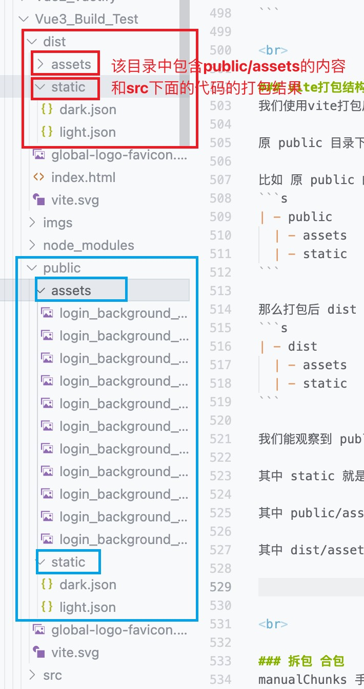

# Vite
```s
# 很多地方没有看
https://www.bilibili.com/video/BV1GN4y1M7P5/?p=32&spm_id_from=pageDriver&vd_source=66d9d28ceb1490c7b37726323336322b
```

它是一个开箱即用的东西, 它会将我们前端常用的配置都预设好了

比如在webpack中要处理css的话 需要对应的loader, 但是vite中已经给我们设置好了 我们直接在js文件中导入css文件使用即可
```js
// main.js
import './index.css'
```

还有 图片的加载, less, scss 等, 都配置好了, 我们只需要下载less等编译器即可
```s
"sass": "^1.69.2",
"sass-loader": "^13.3.2",
```

<br>

## 注意: vite4版本导入内置插件 splitVendorChunkPlugin 不需要做任何配置了
没验证

<br>

### webpack的打包原理
1. 我们要告诉webpack打包的起点, 也就是入口文件

2. webpack就会根据这个入口文件作为起点开始进行打包 它会将 main.js 中的每一个依赖记录好 形成一个依赖关系树状结构图
``` 
    index.js
    ↙     ↘
  jQ      Less

       ↓

     chunk  --  将上面的依赖的文件提取出来形成一个代码块

       ↓    --  对代码块进行处理 形成 bundle

     boudle
```

<br>

然后它会根据这个树状的结构图中的先后顺序 依次将资源引入进来形成一个chunk(代码块) 然后再对这个代码块进行各项的处理 

比如将less编译为css js资源编译成浏览器可以识别的语法等 这些操作统一的概括一下 这个处理的过程 就可以称之为打包 将打包好的资源输出出去(输出出去的东西叫做bundle)

<br>

**总结:**  
我们所有的文件都一个module 无论是图片 还是js文件 webpack的中间产物就是chunk 结果就是boudle

<br>

webpack中
1. chunk: 是将依赖树中的各项依赖 (一个逻辑上的模块集合) 或者说一组相关的代码和资源会形成一个 chunk

2. boudle: 是chunk处理后的结果 (比如将less编译为css js资源编译成浏览器可以识别的语法等)


<br>

### webpack带来的问题
webpack是来打包项目的, 它会将整个的项目打包成一个文件 但是它有一个问题, 当我们的项目比较大的时候 **速度会很慢**, 这样项目每一次构建都要花费很长的时间

所以就出现了别的打包工具才解决上面的问题

而Vite相较为webpack, 它采用了不同的运行方式

<br>

### Vite webpack 的区别

**区别1:**  
- webpack: 无论是开发还是生产环境 它都是先对文件打包 然后再运行 性能比较慢, 因为每次都需要先打包 (每次都需要将各个模块合并成一个文件 速度慢)

- vite: 
  - 开发时: 并不对项目进行打包 而是直接采用 esm模块化的方式来运行项目 (开发的时候不用考虑兼容性 所以没有必要在开发的时候就打包, 而是在运行的时候采用 es模块的方式 因为浏览器现在支持es模块, 所以直接使用es模块的形式直接引入代码, 这样不打包的话 运行速度就变快了) 最好的体现就是 vite在运行项目的时候 就是一瞬间 因为它不打包直接运行

  - 上线时: 在项目部署时 再对项目进行打包, 将打包后的结果部署到服务器 (部署的时候不打包不行么? 技术上也能做到 但是如果我们在网页中使用模块化的话, 意味着我们需要动态的加载我们的脚本 如果模块太多的话 浏览器发送的请求次数就会增多, 性能就变差了 所以无论浏览器是否支持 esm模块化 打包的事儿是必须要做的)

除了速度外 vite 使用起来也更加的方便, webpack在装完后, 需要配置 loader 和 plugins 等, 而vite直接将这些东西配置好了 直接使用就可以

<br>

**区别2: 入口文件**  
- webpack: 需要 src/index.js 入口文件, 必须有这样的一个目录结构

- vite: 不需要src, 直接在根目录下创建 ``index.html`` 文件即可, vite默认的源码目录就是根目录, 我们在html中引入对应的js文件, 但要注意 要使用 esm模块化规范引入 ``type="module"``
```html
<body>
  <div id="app"></div>
  <script type="module" src="/src/main.ts"></script>
</body>
```

<br>

### 为什么vite打包的速度快
因为它在构建的时候 采用的是 esbuild 它是用go编写的, 同时esbuild依赖的算法也更加的优秀一些

<br>

### 为什么vite打包的结果 直接访问不行
因为 vite打包后的结果 也是esm模块化的, 而esm模块化需要必须通过 url进行加载 也就是浏览器的请求方式 http协议 去加载

而我们直接访问文件的 file协议 访问的本地静态页面, 模块就运行不出来, 也就是说我们打包后的页面 必须通过服务器去访问

<br>

**那 live server 插件行么?**  
也不行live server的根目录有问题, 在访问打包后的结果我们是需要将 dist 文件夹作为根目录去访问的

而 live server 的根目录是启动vscode时的根目录

<br>

我们可以在项目根目录使用 ``"preview": "vite preview" -> npm run preview`` 命令来预览打包后的结果

<br>

### Vite是打包工具
并不是说只能打包vue, 我们在根目录提供 index.html 文件 当中使用esm模块的方式引入js文件 就可以进行打包

<br>

### Vite打包工具的使用场景
1. typescript: 我们需要将 ts文件转换为js代码 这时需要 tsc 工具
2. vue / react: 将vue和react转换为浏览器认识的 这时需要 react-compiler / vue-compiler 将我们的jsx和vue文件转换为render函数
3. less / scss: 这时需要 sass sass-loader 等编译工具
4. 语法降级: babel, 将es的新语法转换为旧版浏览器可以接受的语法
5. 体积优化: 这时需要 terser 将我们的代码压缩简称体积更小 性能更好的文件

当我们每次修改一点点东西的时候 都需要使用上面的工具 依次执行 拿到我们想要的结果

而打包工具就是将 tsc vue-compiler less babel terser 等全部集成到一起 我们不需要自己调用它们 我们也不用关心它们

而我们写的代码一变化 就有构建工具帮我们自动将上面的动作走一遍

<br>

### 构建工具 承担了什么
**1. 模块化开发支持:**  
支持直接从 node_modules 文件夹中引入模块
```js
<script type="module">
import _ from 'lodash'
console.log('_: ', _)
</script>
```

我们上面想输出lodash但是会报错, 浏览器根本不知道它需要从 node_modules 里面引入模块

但是当我们使用构建工具后 就可以了

<br>

**2. 支持多种模块化**
```js
<script type="module">
const _ = require(lodash)
console.log('_: ', _)
</script>
```

本身来说 ``type="module"`` 只支持es6 不支持commonjs, 但是我们使用构建工具后就可以

<br>

**3. 代码的兼容性, 语法的转换**  
构建工具将这些语法对应的处理工具集成进来 自动化完成

<br>

**4. 提高项目性能**  
打包的含义是: 将我们写的浏览器不认识的代码, 交给构建工具进行编译处理的过程就叫做打包

打包完成以后会给我们一个浏览器可以认识的文件

1. 压缩文件
2. 代码分割
3. 优化开发体验

<br>

### vite的基本使用
1. 创建项目 (创建个文件夹)
2. npm init -y (初始化 package.json 文件)
3. npm i -D vite (安装开发依赖, vite就是开发依赖)
4. 在根目录创建 index.html 文件 (当中使用esm模块的方式, 引入js文件)

<br>

### vite创建项目
```s
npm create vite@latest

npm create vite@latest my-vue-app -- --template vue

# ts
npm create vite@latest my-vue-app -- --template vue-ts
```

其中 ``Vanilla`` 是原生js的方式开发项目, 而不是使用框架

<br>

### vite的打包目录
```s
| - dist
  | - assets
    - ...
  - index.html
```

我们打包后的结果都在 assets 目录里面

<br><br>

# Vite配置: vite.config.js
配置文件要创建在根目录下创建, 同时**要使用es6的语法向外暴露**

```js
// 写法1: 
export default {
  ...
}

// 写法2:
import { defineConfig } from 'vite'
export default defineConfig({

})
```

其中 defineConfig 的写法 是可选的, 如果我们使用了 defineConfig 我们在写配置的时候 会给我们提示

<br>

## 兼容性问题
当我们在默认配置下打包我们的项目, 当中的箭头函数的语法形式 会原封不动的到打包结果中

那怎么让才能让我们的代码转换成旧版的语法呢? 向后兼容我们的代码

我们也需要配置插件

<br>

### 中文文档: 使用插件 选项卡
vite可以使用插件进行扩展, 在得益于rollup(它是vite打包的时候使用的工具)的接口设计

<br>

### 兼容性插件: @vitejs/plugin-legacy
要想为传统浏览器提供支持，可以按下面这样使用官方插件 ``@vitejs/plugin-legacy``

它相当于 webpack中的 babel 它可以将我们的代码转换成旧版的语法, 让我们的代码支持旧版的浏览器

1. 安装依赖:
  - npm i -D @vitejs/plugin-legacy
  - npm i -D terser (压缩代码的 legacy插件依赖它)

2. 进行配置: 
```js
import { defineConfig } from 'vite'
import vue from '@vitejs/plugin-vue'
import path from 'path'

// 2. 引入
import legacy from '@vitejs/plugin-legacy'

export default defineConfig({
  plugins: [
		vue(),

    // 3. 使用
    // legacy()

    // 如果需要传入插件的配置项 则传入一个配置对象 一般都会传入!!!!
    // legacy({ targets: ['defaults', 'not IE 11'] })
    legacy({ targets: ['defaults', 'IE 11'] }) // 兼容ie11 但是 以后兼容性的问题 以后越来越不需要配置了

    // 还有这种使用方式: 按需应用
    /*
      默认情况下插件在开发 (serve) 和生产 (build) 模式中都会调用。如果插件在服务或构建期间按需使用，请使用 apply 属性指明它们仅在 'build' 或 'serve' 模式时调用: 

      {
        ...legacy(),
        apply: 'build',
      },
    */
	],

  server: {
    proxy: {
      "/api": {
        target: "http://localhost:3333",
        changeOrigin: true,
        rewrite: path => path.replace(/^\/api/, "")
      }
    }
  }
})
```

<br>

### 生产环境中需要考虑到的问题
1. 将css提取成一个单独的文件 (vite中不用)
2. css的兼容性问题 (vite中不用)
3. 代码压缩问题 (vite中不用)
4. **js代码兼容性问题**
5. 生产环境下的 source-map 问题
6. tree shaking
7. 代码分割

<br><br>

## 配置多入口
```js
import path from 'path'

build: {
  rollupOptions: {
    input: {
      main: path.resolve(__dirname, './index.html'),
      product: path.resolve(__dirname, './product.html'),
    }
  }
}
```

<br><br>

## 项目打包优化

### 性能优化是什么?
**1. 开发时的构建速度优化:**  
从 npm run dev 开始 敲下的一瞬间到呈现结果 要占用多少时长
- webpack: 在这方面下的功夫是很重: cache-loader cache loader结果 (如果两次构建源代码没有产生变化, 则直接使用缓存, 不调用loader), thread-loader 开启多线程去构建

- vite: 是按需加载, 所以我们不需要太care这方面

<br>

**2. 页面性能指标: 和我们怎么去写代码有关**  
- 首屏渲染时长(页面中第一个元素的渲染时长): fcp (first content paint)
  - 懒加载: 只加载视口范围内的组件 (需要我们写代码实现)

  - http优化: 协商缓存 和 强缓存
    - 强缓存: 后台响应某个结果的时候 在响应头中追加字段(expires), 在没有过期之前 无论我们怎么刷新页面 无论我们怎么刷新页面 不会重新请求页面 而是从缓存里面取

    - 协商缓存: 如果我们没有使用强缓存的话 只要刷新页面都会重新请求, 协商缓存是指, 我们是否用缓存需要跟后台商量 比如 后台给我们打上协商缓存的标记后 客户端在下次刷新页面的时候需要重新请求资源时会发送一个协商请求给到后台, 问我这个图片是否有变化 需要不需要重新请求, 后台如果说需要变化 则会响应具体的内容, 如果后台经过对比文件没有变化 则会响应304

- 页面中最大元素时长: lcp (largest content paint)
- ...

<br>

**3. js逻辑的优化**   

**3.1. 要注意副作用的清楚 比如 timer 时间监听**    
因为组件会频繁的挂载和卸载, 如果组件中有计时器 当频繁挂载的时候 如果在卸载的时候没有清楚 就又会开一个新的

**3.2. 注意 requestAnimationFrame 和 requestIdleCallback, 它们的作用是在渲染引擎休息的时候, 在执行某个脚本**  
浏览器的帧率为16.6ms去更新一次 (它会做很多事情比如执行js逻辑, 重排 重绘)

假设我的js执行逻辑超过了16.6ms 那么可能导致重排重绘就没有时间了 所以我们觉得页面卡 就是因为页面丢帧了 这时我们可以利用 requestIdleCallback

它可以接受一个函数 该函数会在16.6ms 将js的主任务都走完后, 如果我们在16.6ms中还有一点空闲时间的话 则会执行我们的回调 这就不会造成卡帧的现象

如果剩余的空闲时间不足以完成回调中的逻辑，requestIdleCallback 会处理以下几种情况
1. 分片执行：你可以将你的回调函数逻辑分解为更小的部分，以便在多个空闲时间片中逐步完成。这种方式可以避免一次性占用太多时间，从而减少对主线程的阻塞。例如，你可以在回调函数内检查 IdleDeadline 对象的 timeRemaining() 方法来判断剩余时间。**如果时间不够，则可以将剩余的任务推迟到下一个空闲时间片执行。**

2. 延迟执行：如果当前的空闲时间不够，requestIdleCallback 会在下一个空闲时间片中继续尝试执行回调。这意味着你的任务可能不会立即完成，但也不会影响页面的渲染性能。

3. 优先级处理：你可以通过第二个参数 options 中的 timeout 属性为 requestIdleCallback 设置一个优先级。如果你的任务在指定时间内还没有执行，浏览器会优先安排它在下一次空闲时间中尽快执行。这可以**确保某些重要任务不会被无限期推迟。**
```js
function myHeavyTask(deadline) {
  while ((deadline.timeRemaining() > 0 || deadline.didTimeout) && someTaskNotCompleted) {
    // 执行一部分任务
    performTaskChunk();
  }

  if (someTaskNotCompleted) {
    requestIdleCallback(myHeavyTask);  // 继续在下一个空闲时间片中执行
  }
}

requestIdleCallback(myHeavyTask, { timeout: 1000 });
```

<br>

**4. 生产优化: vite(rollup) 构建优化**
优化体积: 压缩, treeshaking, 图片资源压缩, cdn加载, 分包 (传输小, 浏览器速度快)

<br>

### 什么样的资源会被打包
从入口文件开始, 进行扩散性关联扫描, 被引用且被使用过至少1次的资源会被打包

<br>

### 什么样的文件会被独立成一个包
默认情况下, 被引用了至少两次的文件, 会被打成一个独立的包

比如 utils.ts 被 index.vue 和 index2.vue 两个文件引用, 则 utils.ts 会被打成一个独立的包

另外

异步组件 (包含普通异步组件以及异步路由组件) 会被打成一个独立的包

<br>

### 什么样的资源会被合并打包
默认情况下, 只被引用了一次的文件会被合并到调用处打包

比如 utils.ts 被 index.vue 文件引用, 则 utils.ts 会被打包到 index.vue 文件中

另外

通过动态扫描引入的包 会被合并打包
```js
const mockFiles = import.meta.glob('./demo/*.vue', {
  eager: true,
  import: 'default'
})
```

import.meta.glob 指定的路径 该路径下面的所有vue文件, 该方式扫描的文件 会被合并的上面代码的调用处 合并到调用的文件一起打包

<br>

### chunk的碎片 是如何产生的
1. 静态入口点, 动态入口点 单独生成一个 chunk

2. 一个模块被两个或以上的chunk引用, 这个模块会单独生成一个 chunk

3. 下面的情况会被认为当前模块很常用, 所以被打包成一个chunk  
当前模块的 ``importers.length + dynamicImporters.length > 1 总被引用的次数`` 就可以被认为**当前模块会被单独打成一个chunk**
```js
而模块信息中, 有两个字段可以利用
- importers
- dynamicImporters

对应着当前模块 被 静态引入的模块, 以及被动态引入的模块


假设有一个模块 utility.js，它被多个地方引用：
// A.js
import { helper } from './utility.js';

// B.js
import { helper } from './utility.js';

在这种情况下，utility.js 的 importers.length 会是 2, 因为它被 A.js 和 B.js 都静态引用了。

因为 importers.length + dynamicImporters.length > 1，所以构建工具会认为这个模块很常用，应该将其提取为一个独立的 chunk
```

```js
export default {
  build: {
    rollupOptions: {
      output: {
        manualChunks: (id: string, { getMouduleInfo }) => {
          // 该 id(文件) 被 动态 和 静态 的总引用次数
          const count = getMouduleInfo(id).dynamicImporters.length +
          getMouduleInfo(id).importers.length

          if (!id.includes('node_modules')) {
            if (id.includes('UseUtils')) {
              return 'UseUtils'
            }
          }
        }
      }
    }
  }
}
```

<br>

### 怎么解决chunk碎片的问题
让多个module拥有相同的chunk名称

<br>

### 如何鉴别哪些需要合包?
碎片化的产物需要合包

<br>

**合并思路:**  
比如有 utils01 02 03 我们可以把相似的js文件合并成一个chunk

<br>

### 如何判断合包或拆包之后, 是有效优化
某个界面 在资源请求数量没有明显增多的情况下, 资源的总请求量变小了, **特别要注意合包之后, 不要导致首页资源加载变多**

<br>

### 基于 vite3 发现的一些手动合包 / 拆包 的规律
1. 如果chunk中的 有1个module有在首页使用到, 那么该chunk必然会在首页加载 如果该chunk包含了多个module 而它只有一部分的module是在首页中使用 那么其他module就是不必要的 那么首页就加载了不必要的资源

2. 如果对异步路由组件进行合包, 那被合包的chunk, 必然会在首页加载 (这个异步路由对于首页而言, 可能是不必要的资源)

3. 如果对异步组件 (如: ``const H = defineAsyncComponent(() => import('./H.vue'))``)进行合包, 则该合包的chunk必然会在首页加载 (这个异步组件对于首页而言 可能也是不必要的资源)

4. vite3默认会根据引用情况对第三方依赖 进行拆包 / 合包, 通常情况下比我们自己再进行拆包合包形成的包的大小更合适

<br>

**总结:**  
1. 尽量只对自己编写的碎片化的普通 js 文件进行合包 
2. 不要对 路由组件 / 异步路由组件 进行合包
3. 不要对异步组件合包, 除非该chunk中所有的异步组件本来就要在首页中使用
4. 尽量不要手动对第三方依赖进行 合包 / 拆包

<br>

### 可视化工具
```js
npm i -D rollup-plugin-visualizer

import { visualizer } from 'rollup-plugin-visualizer'

plugins: [
  visualizer({
    open: true
  })
]
```

<br>

### 动态导入

**语法:**  
我们传入一个文件路径, import()方法会返回promise
```js
import('./src/xxxx').then(data => {
  console.log(data)
})
```

**使用场景:**  
动态导入的方式 一般都会使用路由中

<br>

**问题说明:**  
```js
import Home from './Home'

const routes = [
  {
    path: '/home',
    component: Home
  }
]
```

上面是静态导入, 静态导入的问题就在于 只要是我们这么一写 ``import Home from './Home'`` Home组件的代码就会被加载到当前的文件中

但是我们使用 动态导入 的话
```js
const routes = [
  {
    path: '/home',
    component: () => import('./Home')
  }
]
```

**动态导入的优势:**
- 减少初始加载时间: 通过将非必要的代码分离到单独的块中，动态导入可以减少应用的初始加载时间，从而提高页面的加载速度。

- 提高性能: 通过按需加载代码，动态导入可以减少浏览器需要处理的代码量，从而提高运行时性能。

- 支持代码分割: 动态导入与现代构建工具（如 Vite、Webpack）配合使用，可以实现代码分割，自动生成代码块，并在需要时异步加载。

在 Vite 中，动态导入结合其快速的构建速度和高效的代码分割功能，可以帮助开发者更轻松地优化前端应用的性能。

<br>

### CDN
有人说不喜欢CDN

我们要使用CDN的话 肯定要加载别人的js文件 如果我们加载的js文件是国外的 当它的服务器挂了可能会影响到我们

<br>

### 文件压缩: gzip 需要后台配合
**作用:**  
页面打开速度会快

<br>

vite默认会将文件拆好包, 比如css文件它就会单独的给你抽离出来 我们这里需要做的是文件的压缩

所谓的文件压缩是指, 浏览器访问的时候访问的不是js文件, 而是一个服务器配置的一个压缩文件 gzip

**服务器可以读取文件在服务端进行压缩 这样客户端就会收到压缩包 浏览器来做解压缩的动作**

如果.js的体积过大, 加载的速度会很慢, 这时如果文件太大且不能拆分, 比如一个文件10G但是这个文件不能进行拆分, 必须在同一个文件中

那我们能做的就是 这个包能不能变成5个G, 也就是将所有的静态文件进行压缩, 已达到减少体积的目的

但是该配置需要后台去配合, 类似 通过http请求header增加一个 ``Accept-Encoding:gzip`` 指令 来告诉服务器需要进行gzip压缩, 而服务器接收到该请求后, 通过 ``Content-Encoding: gzip`` 告知客户端进行gzip解压

<br>

**GZIP讲解:**  
http协议上的GZIP编码是一种用来改进web应用程序性能的技术, 大流量的web站点常常使用gzip压缩技术来让用户感受更快的速度

这一般是www服务器中安装的一个功能, 当有人来访问这个服务器中的网站的时候, 服务器中的这个功能将网页内容压缩后传输到来访问的电脑浏览器中显示出来 

一般对纯文本的内容可压缩到原大小的40%

**该功能既需要前端来进行配置, 也需要web服务器里开启该功能**

```js
npm i vite-plugin-compression -D

import VitePluginCompression from 'vite-plugin-compression'

plugins: [
  visualizer({
    open: true
  }),

  // gzip配置
  VitePluginCompression({
    // 1. 控制台输出压缩结果
    verbose: true,
    // 2. 开启还是禁用
    disable: false,
    // 3. 体积大于 xxx 设置压缩
    threshold: 1024,
    // 4. 压缩算法
    algorithm: 'gzip',
    ext: '.gz'
  })
]
```

<br>

**后台要做的: nginx可以配置**  
前端将带有 .gz 的dist给到后台, 说我们前端有文件是通过 gzip压缩的 前端请求 待会你回传给我的时候 

你判断下 如果你发现我请求的是 xxx, 那么你就不要压缩了 你直接给我 前端压缩好的 你直接用

也就是 服务器读取 .gz 文件, 设置一个响应头 content-encoding 设置为 gzip 

浏览器收到后 发现响应头有 gzip 字段 会进行解压

**注意:**  
这时浏览器会有解压时间的产生 所以**如果不是文件体积很大的话 不要用gzip压缩**

<br>

### vite打包结构控制
我们使用vite打包后, 所有的打包后文件都会在 ``dist/assets`` 目录下

原 public 目录下的 文件结构 打包后 会放下 dist 目录下

比如 原 public 的目录结构为
```s
| - public 
  | - assets
  | - static
```

那么打包后 dist 目录下的结构为
```s
| - dist
  | - assets
  | - static
```

我们能观察到 public 目录中的结构 会打包到 dist 目录中 

其中 static 就是 public 中的内容

其中 public/assets中的内容 会合并到 dist/assets 中

其中 dist/assets 不仅仅包含 public/assets 还有我们src下代码的输出结果

<br>



<br>

**也就是说所有资源一股脑的 放在了 dist/assets 目录下**, 那能不能像传统的项目一样 js有js的文件夹, css有css的文件夹, 图片放img文件夹

<br>

**配置方式:**  
相关配置需要查看 rollup 文档, 我们要知道两件事
1. 如何在vite中配置 rollup
2. 在rollup中配置什么

我们需要找 build.rollupOptions.output

```js
build: {
  rollupOptions: {
    output: {
      /*
        打包后 入口js文件 路径在哪
          entryFileNames: 'js/xxx.js'
          当我们这么配置后, 我们入口js文件就会被打包到 dist/js/xxx.js 同时 index.html 中也会自动引入 /js/xxx.js

          [name]: 原文件名
          [hash]: hash值
      */
      entryFileNames: 'js/[name]-[hash].js',

      /*
        分包结果的js文件 路径在哪

          我们分包后的结果 会在 /dist/js 目录下, 跟 assets 目录统计
      */
      chunkFileNames: 'js/[name]-[hash].js',
      /*
        css 图片 字体文件 等其它资源 注意所有除了js之外的资源都会打包在该配置的路径下

        将该配置项配置为一个函数, 返回值就是 目录名

        资源信息
        assetInfo: {
          name: 'vue.svg',
          source: <Buffer ...>,
          type: 'asset'
        }

      */
      assetFileNames(assetInfo: PreRenderedAsset) {
        if (assetInfo.name.endsWith('.css')) {
          return 'css/[name]-[hash].css'
        }

        const imgExts = [
          '.png',
          '.jpg',
          '.jpeg',
          '.webp',
          '.svg',
          '.gif',
          '.ico',
        ]
        if (imgExts.some(ext => assetInfo.name.endsWith(ext))) {
          return 'imgs/[name]-[hash].[ext]'
        }

        return 'assets/[name]-[hash].[ext]'
      }
    }
  }
}
```

<br>

### 分包策略:
Vite 默认会自动进行分包处理，特别是像 lodash 这样的第三方库。Vite 通过 Rollup 来进行打包，Rollup 在打包过程中会生成独立的 chunk 文件，并且通过缓存机制保证没有变化的文件不会被重新打包

<br>

**浏览器的缓存策略:**  
浏览器天生带缓存 它只会静态资源生效

``浏览器发现静态资源的名字没有发生变化 那么他就不会重新请求``

<br>

比如我们在main.ts中写了如下的代码
```js
import { forEach } from 'lodash'

const arr = []
forEach(arr, (el) => { ... })
```

然后我们打包, 我们会发现打包结果中的文件里面, 包含了5000多行的lodash代码 和 我们自己2行的业务代码

<br>

但是我们的业务代码会经常变化, 这样当我们重新打包后 就又会生成新的hash文件 

而这个新的hash文件里面每次都会带着lodash的代码, 而lodash的代码它的代码会不变化

这样导致hash文件名发生变化, 导致浏览器又会重新加载该文件 没有利用到缓存

<br>

**分包策略: 将一些不会常规更新的文件, 进行单独的打包处理**   
<br>

### 拆包 合包
碎片化的chunk 会有多次请求的情况, 比如有一个组件需要3个chunk (util01, 02, 03) 那么就会请求3次

但是我们将它们合并成一个chunk 则只会请求1次

<br>

manualChunks 手动定义chunk名称
```js
build: {
  rollupOptions: {
    output: {
      manualChunks: {

      }
    }
  }
}
```

<br>

manualChunks 的写法有两种
1. 对象形式: 适合对第三方包进行组合拆分
2. 函数形式

**对象形式: 适合对第三方包进行组合拆分**  
将 elementPlus 拆分到 ui chunk 中

```s
manualChunks: {
  ui: ['element-plus'],
  vue3: ['vue', 'vue-router']
}
```

<br>

**注意:**  
对象方式不能对我们自己的项目代码 进行拆分

```s
manualChunks: {
  utils: [
    'src/utils/xxx01.ts',
    'src/utils/xxx02.ts',
  ]
}
```

可能是rollup无法按照这种方式匹配到对应的module

Rollup 在解析 manualChunks 配置时，会直接将你指定的路径视为模块 ID，这意味着你需要提供完全匹配的路径。对象方式配置通常用于对第三方依赖进行拆分，而不是对项目内部代码模块进行路径匹配和拆分。

<br>

**函数式:**  
id参数为: 模块的绝对路径
- 模块路径:
```s
/Users/username/project/src/utils/xxx01.ts
```

- 第三方依赖: 来自 node_modules 的第三方依赖 id 可能是依赖包的路径或包名
```s
node_modules/lodash-es/lodash.js

或

lodash-es
```

<br> 

```js
manualChunks: (id: string) => {
  // 我们对非node_modules下面的模块进行分包
  if(!id.includes('node_modules')) {

    // UseUtils 为 文件名
    if (id.includes('UseUtils')) {
      // 返回 chunk 名
      return 'UseUtils'
    }
    /*
      这里还可以针对于其它组件的情况进行 合包 或 拆包 比如下面针对异步路由进行合包操作

      但是
      
      1. 不要对路由组件进行合并
      
      这个导致路由组件必须在首页加载进来 这不合理, 因为我们不会在首页就访问路由组件

      2. 也不要对异步路由组件进行合并
    */
    // 不合理演示
    else if (id.includes('OtherPage01') || id.includes('OtherPage02')) {
      return 'SomePage'
    }
  }
  
  else {
    /*
      错误演示:
        我们将所有的 node_modules 都合并进一个chunk,
        因为vue和vue-router在main.ts中就用到了

        所以该chunk必须在首页就加载, 但是该chunk中还包含了element的东西, 而首页并未使用element-plus的东西, 因此就造成了首页加载了不必要的资源
    */
    return 'vendor'

    /*
      正确做法:
        首页中就使用到的第三方依赖, 单独一个chunk
        当前的示例就是 vue 和 vue-router

        所以首页只会额外加载 vue3 和 vendor 这两个cdhunk, 而不会加载ui这个chunk

        之所以vendor这个chunk会在首页加载 应该是由于该chunk中某个或某些moudle是首页中使用到了
    */
    if (id.includes('element-plus')) {
      return 'ui'
    } else if (id.includes('vue') || id.includes('vue-router')) {
      return 'vue3'
    } else {
      return 'vendor'
    }
  }
}
```

<br>

**注意:**  
我们拆包 合包后 必须要注意, 本次操作不要让 首页资源 比 操作前 加载的更多

比如之前是10个, 我们操作完后 变成了 20个

每个拆包后 我要f12 观察首页加载的情况 **资源 和 传输的数据** 

<br>

### 袁老师: 手动分包
当我们在入口文件引入内容时
1. css
2. js
3. 第三方库
4. vue
5. 我们自己的代码

我们知道 入口点 会被单独的打包成一个chunk 所以当我们入口点引入很多东西时, 它们都会打包进一个chunk里

```s
+--------------------+
| 第三方库代码         |
|                    |
| 我们自己写的代码      |
+--------------------+
```

而上面的chunk中我们自己写的代码变动会很大 而我们用到的第三方库 vue loadsh 它们的变动比较小 是相对比较稳定的

如果我们不处理的话 就意味着将来 哪怕我们只是修改了自己的代码 但是整个的chunk文件的指纹就是 (eee16629) 该指纹也会发生变化

**就导致了用户端就必须重新下载整个js**

<br>

**解决方式:**  
我们会将 **相对稳定** 的包踢出去 在打包结果中 **相对稳定** 等包会独立形成自己的chunk文件

由于它们比较稳定, 它们的文件指纹相对稳定不太容易发生变化, 而我们自己写的代码(不稳定的代码)更新之后

用户只需要去下载 更新后的chunk 文件就可以了

<br>

vite中有自动分包的功能, 比如我们 import() 导入的内容就会自动分包, 但总有些地方不太适合使用动态导入 这需要使用手动分包了

```js
// 构建配置
build: {
  // rollup的相关配置
  rollupOptions: {
    output: {
      manualChunks: {
        chunk名称: ['vue', 'lodash']
      }
    }
  }
}
```

```js
// 构建配置
build: {
  // rollup的相关配置
  rollupOptions: {
    output: {
      // id 文件.后缀 的绝对路径
      manualChunks(id) {
        // 第三方包
        if (id.includes('node_modules')) {
          // 统一打成一个 chunk
          // return 'vendor'

          // 各自打成各自的chunk
          return id.toString().split('node_modules')[1].split('/')[0].toString()
        }
      }
    }
  }
}
```

<br>

配置完分包后, 每次打包 第三方库 的文件指纹不会发生变化, 用户不需要下载第三方库的chunk (但是这点对我们的项目没有太多的用处呀, 我希望解决的是打包时间)

vue可能会升级, 所以也可以考虑不要将 vue 和 lodash 打包到一块

<br>

### mock数据的配置
```s
https://www.bilibili.com/video/BV1yu411U71S?p=6&spm_id_from=pageDriver&vd_source=66d9d28ceb1490c7b37726323336322b
```

<br>

### 问题:
当我们修改了一个文件, 然后进行打包, 正常来说 这一个文件的hash值发生变化就可以了, 但事实上 我们重新打包后, 所有的文件的hash值都发生了变化

这时我们可以使用第三方的插件

```js
// 1. 下载依赖 -D
vite-plugin-webpackchunkname@0.2.4

// 2. vite.config 中导入
import { manualChunkPlugin } from 'vite-plugin-webpackchunkname@0.2.4'

// 3. 在插件配置项中进行调用
plugins: [
  manualChunkPlugin()
]
```

当我们使用插件后, 对于动态导入的路由组件来说我们可以使用 魔法命名 的方式 将相同魔法名的组件 合并为一个chunk

同时也是因为我们使用了 该插件才可以使用 魔法命名

```js
{
  path: '/test1',
  component: () => import(/* webpackChunkName: "merger-test" */ '@views/backup/test1.vue')
},
{
  path: '/test2',
  component: () => import(/* webpackChunkName: "merger-test" */ '@views/backup/test2.vue')
},
```

但是这种插件的方式 会自动将 第三方的组件库 vue源码 都整合到一个vendor里面了 会自动处理很多文件

所以这种插件的方式 star 太少了 **不建议使用**

<br>

### 待做的事情
1. 明天先听
```s
https://www.bilibili.com/video/BV1aS411F7Yu/?spm_id_from=333.880.my_history.page.click&vd_source=66d9d28ceb1490c7b37726323336322b
```

2. webpack的runtimeChunk 怎么在 vite中实现  
当我们分包后, 修改了我们自己的代码(1,2,3 我们仅仅修改了3), 第三方库的包并不会重新打包, 而我们自己修改的代码1和2 也会重新打包

这个要配合 下面的视频听 我觉得说的就是 runtiemChunk
```s
https://www.bilibili.com/video/BV1AF411o7ga/?spm_id_from=333.880.my_history.page.click&vd_source=66d9d28ceb1490c7b37726323336322b
```