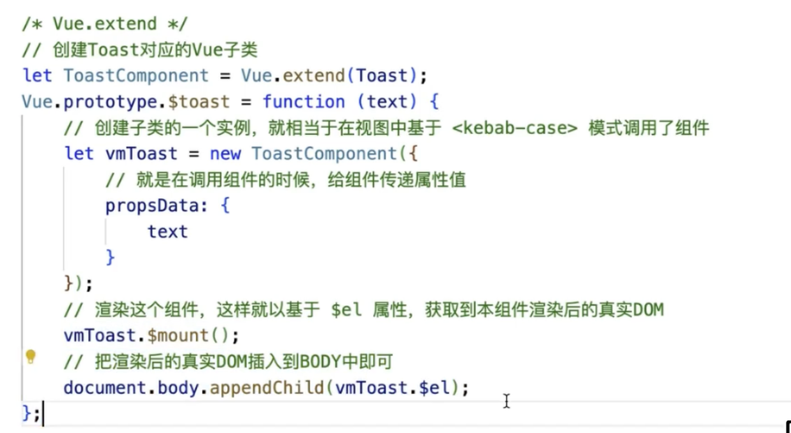

# 待整理知识点

### addRoutes的使用
```s
https://www.cnblogs.com/zhuhuoxingguang/p/11759001.html
https://www.jianshu.com/p/27e304884459

https://router.vuejs.org/zh/api/#addroute-1
```

<br>

### v-bind 的知识点
```s
https://juejin.cn/post/6844904101298323470
```

<br>

### 长列表优化
```s
https://www.cnblogs.com/mfyngu/p/13675004.html
```

<br>

### 全选
```s
https://segmentfault.com/a/1190000016313367
```

<br><br>

# Vue.extend 详解
Vue.extend是用来创建Vue的 子类
```s
子类实例.__proto__ -> 子类.prototype
子类.prototype.__proto__ -> Vue.prototype
```

<br>

我们之前说的 创建单文件组件 每调用一次这个组件, 都是创建一个实例, 我们每创建一个单文件组件都是通过 Vue.extend 创建的
```s
实例 -> VueComponent.prototype -> Vue.prototype 

# [VueComponent是Vue的一个子类, VueComponent就是基于 Vue.extend 创建出来]
```

这样子类也可以找到Vue原型身上的方法

<br>

### 语法结构
```js
const Vue的子类 = Vue.extend(配置对象)
```

<br>

**返回值:**  
构造器, 我们可以通过构造器 来创建子类的实例对象

<br>

### 给组件传递属性的方式
有两种

**方式1: 利用render h的第二个参数**  
```js
const MessageBoxConstructor = Vue.extend({
  render(h) {
    return h('message-box', {
      props: {

      }
    })
  }
})
```

<br>

**方式2: 拿到子类的构造器后, 我们new构造器的时候传入**  
```js
const MessageBoxConstructor = Vue.extend(组件)
new MessageBoxConstructor({
  // 通过propsData传递 给组件传递属性值
  propsData: {

  }
})
```

<br><br>

## 示例1:

<br>

### 使用我们创建的MessageBox的组件
```html
<template>
  <div>
    <h3>Test组件</h3>
    <v-btn @click="handler">click</v-btn>
  </div>
</template>

<script>
export default {
  name: "Test",
  data() {
    return {
      val: ""
    }
  },
  mounted() {
  },
  methods: {
    handler() {
      this.$invokeDialog.show({
        type: "save",
        close() {
          console.log('close')
          this.$invokeDialog.hide()
        },
        confirm() {
          console.log('confirm')
          this.$invokeDialog.hide()
        }
      })
    }
  }
}
</script>
<style>
.test-router-view {
  background-color: #cdb4db;
  padding: 20px;
}
</style>
```


<br>

### MessageBox组件
```html
<template>
  <v-dialog v-model="userAddCheckDialog" width="360px" height="100%" class="elevation-0" overlay-color="#000" overlay-opacity="0.7">
    <v-card class="elevation-0">
      <h3>{{ title }}</h3>
    </v-card>
    <v-card height="160px" class="elevation-0 pt-4 pb-4 pl-4 pr-4">
      <v-row class="ml-0 mr-0">
        <v-col class="pt-0 pb-0 pl-0 pr-0">
          <h3>{{ content }} -- {{ type }}</h3>
        </v-col>
      </v-row>
    </v-card>
    <v-card class="elevation-0">
      <v-toolbar flat class="footerbar px-2" height="56px">
        <v-spacer />
        <v-btn
          class="btn-base mx-2"
          outlined
          @click="cancelHandler"
        >取消</v-btn>
        <v-btn
          class="btn-base ml-2 mr-2"
          outlined
          @click="confirmHandler"
        >确认</v-btn>
      </v-toolbar>
    </v-card>
  </v-dialog>
</template>

<script>
export default {
  name: "MessageBox",
  props: {
    title: {
      type: String,
      default: "标题默认值"
    },
    content: {
      type: String,
      default: "内容默认值"
    },
    type: {
      type: String,
      default: "save",
      validator(vale) {
        // return ['save', 'delete', 'cancel'].includes(value)
        return true
      }
    },
    close: {
      type: Function,
      default: function() {}
    },
    confirm: {
      type: Function,
      default: function() {}
    }
  },
  data() {
    return {
      userAddCheckDialog: false
    }
  },
  mounted() {
    console.log('MessageBox挂载了')
    this.userAddCheckDialog = true
  },
  methods: {
    cancelHandler() {
      this.close()
    },
    confirmHandler() {
      this.confirm()
    }
  }
}
</script>

<style>

</style>
```

<br>

### invokeMessageBox.js文件
```js
// 1. 引入对话框组件
import _MessageBox from './MessageBox.vue'

// 2. 利用 插件 来完成功能
export default {
  install(Vue) {

    let instance = null
    
    // 注册 我们创建好的 MessageBox.vue 组件
    Vue.component(_MessageBox.name, _MessageBox)

    // 在Vue的原型上定义一个全局对象 放置展开 和 关闭 的方法
    Vue.prototype.$invokeDialog = {
      show,
      hide
    }

    // 挂载组件到dom上
    function show(props) {
      if (!instance) {
        // 我们利用 extend 方法拿到组件的 构造器
        const MessageBoxConstructor = Vue.extend({
          // 使用 render 函数 将我们MessageBox.vue渲染到MessageBoxConstructor里面 (虚拟DOM)
          render(h) {
            // 通过render函数向组件内部传入props
            return h('message-box', {
              props
            })
          }
        })


        // new 构造器 将返回来的实例 放到instance身上, 创建子类的实例 就相当于在视图中基于 <kebab-case> 模式调用了组件
        instance = new MessageBoxConstructor()
        // 组件这个组件, 将实例对象 转成 组件 保存到 this.vm 上
        this.vm = instance.$mount()
        // 当我们渲染了这个组件后就可以拿到 $el. 它就是我们渲染后的真实dom
        document.body.appendChild(this.vm.$el)
      }
    }

    // 销毁挂载到dom上的组件
    function hide() {
      document.body.removeChild(this.vm.$el)
      instance.$destroy()
      instance = null
      this.vm = null
    }
  }
}
```

<br>

### main.js
```js
import MessageBox from './components/MessageBox/invokeMessageBox'
Vue.use(MessageBox)
```

<br><br>

## 示例2:


<br><br>

# Vue中的遮罩层组件
```html
<template>
  <div class="dropbox-wrap">
    <slot></slot>
  </div>
</template>


<script>
export default {
  name: 'Dropback'
}
</script>


<style>
.dropbox-wrap {
  position: absolute;
  top: 0;
  bottom: 0;
  left: 0;
  right: 0;
  background: rgba(0,0,0, .3);
  z-index: 99;
  overflow: hidden;
}
</style>
```

<br><br>

# Vue中的传送门组件
```html
<template>
  <div class="portals-wrap">
    <slot></slot>
  </div>
</template>


<script>
export default {
  name: 'Portals',
  props: {
    to: {
      type: String,
      required: true
    }
  },
  mounted() {
    this.init()
  },
  beforeDestroyed() {
    this.remove()
  },
  methods: {
    init() {
      const toEl = document.querySelector(this.to)
      if (toEl) toEl.appendChild(this.$el)
    },
    remove() {
      const toEl = document.querySelector(this.to)
      if (toEl) toEl.remove(this.$el)
    }
  }
}
</script>


<style lang="scss" scoped>
.portals-wrap {
  height: 100%;
}
</style>
```

<br><br>

# Vue中的扫描barcode等应用方式
```json
"dependencies": {
  "@zxing/library": "^0.20.0",
  "webrtc-adapter": "^8.2.3"

  "normalize.css": "^8.0.1",
  "swiper": "^5.4.5",
  "vue": "^2.7.0",
  "vue-i18n": "^8.27.2",
  "vue-router": "^3.5.4",
  "vuetify": "^2.6.10",
  "vuex": "^3.6.2",
},

```
```html
<template>
  <v-card
    v-if="height"
    class="wl-input-wrap pa-6"
    :style="`height: ${height}px`"
  >
    <v-card-title class="title-area mx-8">
      <v-chip class="mr-4" color="cyan" label outlined>
        {{ $t('workLog.insert.work') }}
      </v-chip>
      <div>
        <p class="title ma-0">{{ $t('workLog.insert.workViewTitle') }}</p>
      </div>
    </v-card-title>
    <v-card-text class="content pb-0">
      <v-row justify="center" align="center">
        <v-col cols="2">
          <span class="tablet-label text--secondary">{{ $t('workLog.insert.addAreaWorkerCode') }}*</span>
        </v-col>
        <v-col cols="6">
          <!-- eslint-disable -->
          <v-text-field
            ref="workerCodeFormItem"
            v-model="workerCode"
            solo
            dense
            flat
            class="master-input tablet-input"
            :tabindex="index"
          />
        </v-col>
        <v-col class="ml-0 d-flex align-center" cols="2" />
      </v-row>
      <v-row justify="center" align="center">
        <v-col cols="2" />
        <v-col class="pa-0 form-label-text" cols="8">
          <span
            v-if="checkFaild"
            class="master-input error-text"
          >{{ faildText }}</span>
        </v-col>
      </v-row>
      <!-- scan area -->
      <v-row justify="center">
        <v-col cols="6">
          <v-card class="scan-area elevation-0">
            <v-card-text class="pa-0">
              <video
                id="zxing-scan"
                ref="videoArea"
              />
            </v-card-text>
          </v-card>
        </v-col>
      </v-row>
    </v-card-text>
  </v-card>
</template>


<script>
import { mapState } from 'vuex'
// eslint-disable-next-line no-unused-vars
import adapter from 'webrtc-adapter'
import { BrowserMultiFormatReader } from '@zxing/library'
export default {
  name: 'WorkerView',
  props: {
    height: {
      type: Number,
      default: 0
    },
    sliderName: {
      type: String,
      default: ''
    }
  },
  data() {
    return {
      codeReader: null,
      codeContent: null,
      faildText: '',
      checkFaild: false
    }
  },
  computed: {
    ...mapState('workLog', ['form', 'error', 'currentPage']),
    workerCode: {
      get() {
        return this.form.workerCode
      },
      set(n) {
        this.$store.commit('workLog/SAVE_STATE_FORM', {
          workerCode: n
        })
      }
    },
    workerCodeError() {
      return this.error.workerCode
    },
    isCurrentPage() {
      return this.currentPage.name === this.sliderName
    },
    index() {
      return this.isCurrentPage ? 0 : -1
    }
  },
  watch: {
    workerCodeError(n, o) {
      if (n) {
        this.checkFaild = true
        this.faildText = this.$t('INPUT_ERR_MESSAGE.WORKLOG.ADD_WORKERCODE_MORE_DIGIT_ERR')
      } else {
        this.checkFaild = false
        this.faildText = ''
      }
    },
    // 当它为true的时候 挂载摄像头 为false的时候卸载摄像头
    isCurrentPage(n, o) {
      if (n) {
        this.openCamera()
      } else {
        this.closeZxingScanDialog()
      }
    }
  },
  beforeDestroy() {
    this.closeZxingScanDialog()
  },
  methods: {
    closeCamera() {
      this.closeZxingScanDialog()
    },
    async openCamera() {
      if (this.codeReader) {
        this.codeReader.reset()
        this.codeReader = null
      }
      this.codeReader = new BrowserMultiFormatReader()
      // videoInputDevices: [{deviceId, groupId, kind, label}]
      const videoInputDevices = await this.codeReader.getVideoInputDevices()
      const selectedDeviceId = videoInputDevices?.[0]?.deviceId


      this.decodeFromVideoHandler(selectedDeviceId)
    },
    decodeFromVideoHandler(deviceId) {
      this.codeReader && this.codeReader.reset()
      this.codeContent = null


      this.codeReader.decodeFromInputVideoDeviceContinuously(deviceId, this.$refs.videoArea, (result, err) => {
        if (err) return
        if (result) {
          this.workerCode = result.text
          // 扫描成功后不关闭scan的方案, 如果要关闭的话 需要在OPtionalView 里面监听 actived.status 状态
          this.closeZxingScanDialog()
          this.$store.commit('workLog/SAVE_STATE_FORM', {
            workerCode: this.workerCode
          })
          this.$store.commit('workLog/SAVE_ERROR', {
            key: 'workerCode',
            val: false
          })
        }
      })
    },
    closeZxingScanDialog() {
      this.codeReader && this.codeReader.reset()
      this.codeReader = null
      this.codeContent = null
    }
  }
}
</script>


<style lang="scss" scoped>


.wl-input-wrap {


  .title-area {
    border-bottom: 1px solid #ddd;
    padding: 0 26px 16px;


    div {
      display: flex;
      flex-direction: column;
    }
  }


  .content {
    margin-top: 24px;


    .scan-area {
      border: 1px solid #ddd;
      height: 300px;
      overflow: hidden;
      box-sizing: border-box;


      #zxing-scan {
        width: 100%;
        object-fit: cover;
      }
    }
  }


  :deep(.v-input.v-text-field .v-input__control .v-input__slot) {
    padding: 0;


    input {
      padding: 0 24px;
    }
  }
}
</style>
```

<br><br>

# Swiper的左右按钮问题:
我们点击swiper的左右按钮的时候 一定会发现跳转 所以我们想了一个方式 将swiper的按钮隐藏在我们自定义按钮下方
```html
<template>
  <div
    ref="swiperRef"
    class="swiper-container wl-swiper swiper-no-swiping"
  >
    <div class="swiper-wrapper">
      <div
        v-for="(item, index) in sliders"
        :key="index"
        class="swiper-slide"
      >
        <component
          :is="item.target"
          :height="wrapHeight"
          :slider-name="item.cname"
        />
      </div>
    </div>
    <div class="btn-area">
      <v-row class="justify-center mx-0">
        <v-col cols="4" class="pa-0">
          <v-btn
            ref="leftBtn"
            outlined
            class="btn-base left-btn"
            @click="prevHandler"
          >
            <v-icon>mdi-arrow-left</v-icon>
          </v-btn>
        </v-col>
        <v-col cols="2" class="pa-0" />
        <v-col cols="4" class="d-flex justify-end pa-0">
          <v-btn
            ref="rightBtn"
            outlined
            class="btn-base right-btn"
            @click="nextHandler"
          >
            <v-icon>mdi-arrow-right</v-icon>
          </v-btn>
        </v-col>
      </v-row>
      <!-- swiper btn -->
      <v-row class="justify-center mx-0 btn-backup">
        <v-col cols="4" class="pa-0">
          <v-btn
            ref="prevBtn"
            outlined
            class="swiper-button-prev"
            @click="swiperLeftBtnHandler"
          >
            Left
          </v-btn>
        </v-col>
        <v-col cols="2" class="pa-0" />
        <v-col cols="4" class="d-flex justify-end pa-0">
          <v-btn
            ref="nextBtn"
            outlined
            class="swiper-button-next"
          >
            right
          </v-btn>
        </v-col>
      </v-row>
    </div>
  </div>
</template>


<script>
import { mapState } from 'vuex'
import Swiper from 'swiper'
import 'swiper/css/swiper.min.css'


export default {
  name: 'InputViewWrap',
  props: {
    sliders: {
      type: Array,
      default: () => []
    },
    currentPattern: {
      type: String,
      default: ''
    },
    // 点击编辑按钮的时候 它是true
    isEdit: {
      type: Boolean,
      default: false
    }
  },
  data() {
    const vm = this
    return {
      swiperPrevBtn: null,
      swiperNextBtn: null,
      startFlag: false,
      endFlag: false,
      currentIndex: -1,
      initIndex: -1,
      swiperInstance: null,
      swiperOps: {
        keyboard: {
          enabled: false,
          pageUpDown: false
        },
        navigation: {
          nextEl: '.swiper-button-next',
          prevEl: '.swiper-button-prev'
        },
        on: {
          init() {
            vm.currentIndex = this.activeIndex
            vm.initIndex = this.activeIndex
            vm.startFlag = this.isBeginning
            vm.endFlag = this.isEnd
          },
          slideChange() {
            vm.currentIndex = this.activeIndex
            vm.startFlag = this.isBeginning
            vm.endFlag = this.isEnd
          }
        }
      },
      wrapHeight: null
    }
  },
  computed: {
    ...mapState('workLog', ['form', 'workerStatus', 'error', 'formBackup']),
    currentPageInfo() {
      return {
        index: this.currentIndex,
        name: this.sliders[this.currentIndex].cname
      }
    }
  },
  watch: {
    // 监视 currentIndex 当它发生变动的时候 将当前显示的入力页面信息同步到vuex中
    currentIndex(n, o) {
      this.$store.commit('workLog/SAVE_CURRENT_PAGE', {
        name: this.currentPageInfo.name,
        currentIndex: this.currentIndex
      })
    }
  },
  mounted() {
    this.init()
    this.calcHeight()
    this.swiperNextBtn = this.$refs.nextBtn.$el
    this.swiperPrevBtn = this.$refs.prevBtn.$el
  },
  beforeDestroy() {
    this.startFlag = false
    this.endFlag = false
    this.currentIndex = -1
    this.initIndex = -1
    this.$store.commit('workLog/CLEAR_ERROR')
    this.$store.commit('workLog/RESET_CURRENT_PAGE')
  },
  methods: {
    // 初始化 swiper
    init() {
      this.swiperInstance = new Swiper(this.$refs.swiperRef, this.swiperOps)
    },
    // 计算swiper容器的高度: 后续可以使用 ResizeObserver 来进行实时监控
    calcHeight() {
      this.wrapHeight = this.$refs?.swiperRef?.offsetHeight
    },
    validation() {
      const { name } = this.currentPageInfo
      const errorConditions = {
        workerCode: [
          val => !val || (val && val.length > 10),
          () => {
            this.$store.commit('workLog/SAVE_ERROR', {
              key: 'workerCode',
              val: true
            })
          }
        ],
        workProcessCountCompleted: [
          val => !val || (val && !/^[1-9]\d{0,2}$/.test(val)),
          () => {
            this.$store.commit('workLog/SAVE_ERROR', {
              key: 'workProcessCountCompleted',
              val: true
            })
          }
        ],
        optionalInputItemValue: [
          val => !val || (val && val.length > 50),
          () => {
            this.$store.commit('workLog/SAVE_ERROR', {
              key: 'optionalInputItemValue',
              val: true
            })
          }
        ]
      }


      errorConditions[name][0](this.form[name])
        ? errorConditions[name][1]()
        : this.$store.commit('workLog/REMOVE_ERROR', name)
      return errorConditions[name][0](this.form[name])
    },
    swiperLeftBtnHandler() {
      if (this.currentIndex === 0) {
        this.$emit('prevHandler')
      }
    },
    prevHandler() {
      this.$store.commit('workLog/REMOVE_STATE_FORM', this.currentPageInfo.name)
      this.swiperPrevBtn.click()
    },
    
    nextHandler() {
      ... // this.swiperNextBtn.click()
    }
  }
}
</script>


<style lang="scss">
.wl-swiper {
  min-height: calc(100vh - 64px - 32px);
  width: 100%;
  position: relative;


  .btn-area {
    width: 100%;

    /* 自定义按钮的样式 */
    .left-btn,
    .right-btn {
      position: absolute;
      top: auto;
      bottom: 50px;
      left: auto;
      right: auto;
      width: 200px !important;
      height: 64px !important;
      z-index: 99;
      border-radius: 5px !important;


      &:hover {
        height: 64px !important;
        border-radius: 5px !important;
      }
    }

    /* swiper按钮上的图标隐藏 */
    .swiper-button-next::after,
    .swiper-button-prev::after {
      content: "";
    }


    /* swiper按钮的样式 */
    .swiper-button-next,
    .swiper-button-prev {
      position: absolute;
      top: auto;
      bottom: 50px;
      left: auto;
      right: auto;
      width: 200px !important;
      height: 64px !important;
      border: none !important;
      opacity: 0;


      &:hover {
        height: 64px !important;
      }


      &:disabled {
        height: 64px !important;
      }
    }
  }
}
</style>

```

<br><br>

# Vue中使用 ResizeObserver API
```js
class NodeResizeObserver {
  node = null
  observer = null
  maxHeight = 0
  gap = 16


  constructor(options) {
    const { el, cb } = options
    this.node = el
    this.init(cb)
  }


  init(cb) {
    this.observer = new ResizeObserver(entries => {
      const temp = []
      entries.forEach(info => {
        temp.push(info.contentRect.height)
      })

      // 通过回调让组件内拿到maxHeight
      this.maxHeight = Math.max(...temp) + this.gap * 2
      cb && cb(this.maxHeight)
    })
    this.observer.observe(this.node)
  }


  destroy() {
    this.observer.disconnect()
  }


  getHeight() {
    return this.maxHeight
  }
}


export default NodeResizeObserver


// Vue组件中的使用
mounted() {
  this.nodeObverser = new NodeResizeObserver({
    el: this.$refs.OperationAreaRef.$el,
    cb: this.updateOperationAreaHeight
  })
}
```

<br><br>

# Vue中创建组件列表, 渲染组件列表

### 问题描述:
我们将3个组件组织成一个数组, 然后循环数组 在html中渲染组件 想法挺好但是出错了  
我发现在html中 就不知道怎么根据 item.target 渲染组件了
```html
<template>
  <div class="swiper-wrap swiper">
    <div class="swiper-wrapper">
      <!-- 渲染组件列表, 渲染组件 -->
      <div 
        class="swiper-slide"
        v-for="(item, index) in sliders"
        :key="index"
      >
        {{ item.target }}
      </div>
    </div>
  </div>
</template>

<script>
import Swiper from "swiper"
import Item1 from "../components/SwiperItem1.vue"
import Item2 from "../components/SwiperItem2.vue"
import Item3 from "../components/SwiperItem3.vue"
export default {
  name: "SwiperTest",
  components: {
    Item1, Item2, Item3
  },
  data() {
    return {
      // 定义组件列表
      sliders: [
        { target: Item1, flag: 0 },
        { target: Item2, flag: 1 },
        { target: Item3, flag: 2 },
      ]
    }
  },
  mounted() {
    
  },
  methods: {
    init() {

    }
  }

}
</script>
```

<br>

**报错信息:**  
```s
[Vue warn]: Error in render: "TypeError: Converting circular structure to JSON
  --> starting at object with constructor 'VueComponent'
  |     property '_scope' -> object with constructor 'EffectScope'
  |     property 'effects' -> object with constructor 'Array'
  |     index 0 -> object with constructor 'Watcher'
  --- property 'vm' closes the circle"
```

<br>

### 解决方式: ``<component is>``
```html
<template>
  <div class="swiper-wrap swiper">
    <div class="swiper-wrapper">
      <div 
        class="swiper-slide"
        v-for="(item, index) in sliders"
        :key="index"
      >
        <component :is="item.target" />
      </div>
    </div>
  </div>
</template>
```

<br><br>

# Vue: 配置webpack相关

### configureWebpack
vue.config.js中通过设置configureWebpack来配置webpack插件  

configureWebpack有两种形式
- 对象形式
- 函数形式

并且都对生产环境和开发环境做了判断。

<br>

### 对象形式
```js
module.exports = {
  // 对象的形式配置configureWebpack
  configureWebpack: {
    name: 'xxx',
    resolve: {
      alias: {
        '@': path.resolve(__dirname, 'src')
      }
    },
    plugins: process.env.NODE_ENV === 'production' ? [
      // 去除console.log
      new UglifyPlugin(),
      // 代码压缩
      new CompressionPlugin()
    ] : []
  },
};
```

<br>

### 函数形式
参数 config 就是webpack对象 我们往它的身上加东西
```js
module.exports = {
  // 函数的形式配置configureWebpack
  configureWebpack: (config) => {
    config.name = 'xxx'
    config.resolve = {
      ...config.resolve,
      alias: {
        '@': path.resolve(__dirname, 'src'),
      }
    }
    // 对生产环境的配置
    if (process.env.NODE_ENV === 'production') {
      const plugns = [
        // 去除console.log
        new UglifyPlugin(),
        // 代码压缩
        new CompressionPlugin()
      ]
      config.plugins.push(...plugns)
    }
  },
}
```

<br>

### cli3中配置别名
配置完别名后就不用通过../../的形式找文件了

<br>

### 项目根目录下创建 vue.config.js 文件
```js 
// 在文件内部导出配置 这个配置会和node_module中的配置最终会进行合并
module.exports = {
  configureWebpack: {
    resolve: {
      alias: {
        // cli3中内部已经对src文件夹配置别名 @ 了
        'assets': '@/assets',
        'common': '@/common',
        'components': '@/components',
        'network': '@/network',
        'views': '@/views'
      }
    }
  }
}
```

<br>

### .editorconfig
在通过脚手架2搭建的项目 会自动创建一个 .editorconfig
它的目的是对我们的代码风格的问题做一个统一 比如缩进 最后一行是否换行等

一般情况下 项目里都要有这个文件
```js 
root = true

[*]
charset = utf-8
indent_style = space
indent_size = 2
end_of_line = 1f
insert_final_newline = true
trim_trailing_whitespace = true
```  

<br><br>

# 请求重复发送的问题: 
回退再前进所导致请求重复发送的问题

<br>

### 方式1:
在 Vue 的生命周期函数 beforeRouteLeave 中手动取消请求，例如使用 Axios 取消请求的方式
```js
import axios from 'axios';

export default {
  beforeRouteLeave(to, from, next) {
    axios.cancel();
    next();
  },
  ...
}
```

<br>

### 方式2:
通过设置一个标识符来避免重复请求
```js
import axios from 'axios';

export default {
  data() {
    return {
      isRequesting: false,
    };
  },
  methods: {
    getData() {
      if (this.isRequesting) {
        return;
      }
      this.isRequesting = true;
      axios.get('/api/data').then((res) => {
        this.isRequesting = false;
        // 处理数据
      });
    },
  },
  ...
}
```

<br><br>

# :src 引入图片路径 相关
我们使用 :src 去读取一张图片的时候 配合计算属性等功能时 可能会出现404的错误

遇到该情况下 可以尝试使用如下的方式解决:
1. :src 绑定的图片路径 需要为绝对路径 
2. 使用 require()
3. 将该图片放在public目录下

<br>

### 为什么需要使用 require() ?
```s
https://www.cnblogs.com/lisongming/p/16839892.html
```

<br><br>

# Vue中定义非响应式数据
```js
let obj = {
  name: "sam"
}

Object.freeze(obj)

export default {
  data() {
    return {
      obj
    }
  }
}
```

<br><br>

# Js模块中使用 router route

### router:  
我们可以在js文件中 引入 /router/index.js 拿到router

<br>

### route:  
如下拿到的就是route
```js
let route = router.currentRoute
```

<br>

**注意:**  
vue3中我们拿到route 是ref响应对象 我们要拿 route.value

<br><br>

# $attrs & $listeners

## Vue2:

### $attrs:
它什么时候使用呢? 当父组件给子组件传递标签属性的时候, 如果这些标签属性没有在子组件的props中接收的话, 就会到$attrs中

<br>

### $listeners
父组件给子组件绑定的自定义事件, 会存在$listeners对象中

<br>

### $listeners使用演示
- 爷爷组件: index.vue
- 中转组件: BoardEdit.vue
- 孙子组件: BoardEditStartBtn.vue

爷爷组件 通过中转组件 监听孙子组件派发的事件
```html
<BoardEdit
  @registerStartTime="registerStartTime"
/>
```

中转组件内在孙子组件上使用 ``v-on="$listeners"`` 相当于将爷爷组件监听的@registerStartTime写在孙子组件标签上
```html
<BoardEditRegisterBtn
  v-on="$listeners"
/>
```

孙子组件 正常派发事件
```html
<template>
  <v-btn
    @click="registerStartTime"
  >{{ $t('workLog.insert.addAreaStartBtn') }}
  </v-btn>
</template>

<script>
export default {
  name: 'BoardEditStartBtn',
  methods: {
    registerStartTime() {
      this.$emit('registerStartTime')
    }
  }
}
</script>
```

<br>

### 使用场景
我们有3个组件, 父 -> 中转组件 -> 孙

当父组件想给孙组件传递 **数据 和 监听孙组件派发的事件时** 的时候, 需要 中转组件 做中转, 这时**需要中转组件做如下的动作:**
1. inheritAttrs:false
2. 在孙组件标签上写上 v-bind="$attrs" v-on="$listeners"

```html
- <父组件>
    - <中转组件 @custom="handler">
        - <孙组件 v-bind="$attrs" v-on="$listeners">
```

这样在孙组件中
- 接收数据的时候 在props中声明
- 孙组件 可以直接使用 emit 来派发父组件上监听的事件 比如父组件在中转组件上监听的是@custom, 那么孙组件可以直接派发this.$emit("custom")

<br>

## Vue3:
vue3取消了$listeners 父组件中绑定的标签属性 和 自定义事件 都会在子组件的 $attrs中, 按照下面的样式存放
```js
{
  id: 'my-input',
  onClose: () => console.log('close Event triggered')
}
```

我们使用Vue3来复现下上面的场景

<br>

### 使用场景: 
我们有3个组件, 父 -> 中转组件 -> 孙

当父组件想给孙组件传递 **数据 和 监听孙组件派发的事件时** 的时候, 需要 中转组件 做中转, 这时**需要中转组件做如下的动作:**

1. inheritAttrs:false
2. 在孙组件标签上只需要写上 v-bind="$attrs" 即可
```html
- <父组件>
    - <中转组件 @test="handler">
        - <孙组件 v-bind="$attrs">
```

这样在孙组件中

- 接收数据的时候 在props中声明
- 孙组件 可以直接使用 emit 来派发父组件上监听的事件 比如父组件在中转组件上监听的是@test, 那么孙组件可以直接派发 test, this.$emit("test")

<br>

**父组件**
```html
<Transfer test="测试数据" @customerEvent="customerEvent"/>
```

<br>

**中转组件:**
```html
<Son v-bind="$attrs" />

<script>
export default {
  inheritAttrs: false
}
</script>
```

<br>

**孙组件:**  
```js
// 传递的数据 在props 中接收
const props = defineProps({
  test: {
    type: String,
    default: "默认值"
  }
})

// 自定义事件使用 emits来声明
const emit = defineEmits(["customerEvent"])

// 然后可以直接使用
onMounted(() => {
  console.log(props.test)
  emit("customerEvent", "Son中的数据")
})
```

<br><br>

# 自定义生命周期:
我们可以让 computed 里面返回boolean, 然后让 watch 监视这个计算属性, 在某种规则下调用
```js
computed: {
  ready() {
      return (
        this.isNotEmptyObject(this.mapLayout) &&
        this.isNotEmptyObject(this.mapData)
      )
    },
}

watch: {
  ready(val) {
    if(val) {
      ...
    }
  }
}
```

<br><br>

# Vue3: 函数调用创建组件

**2 -> 3:**  
```s
h、createVNode、render
```

<br>

这里是模仿 element ui 的 $message 方法 也相当于是通过调用 message方法 来创建组件 有点类似下面的 将 Vue组件挂载到全局上的方法

<br>

### Element UI的 Message消息提示组件:
当我们点击 Show message 按钮 会触发 open回调, 回调中回调ElMessage()方法 该方法会创建一个提示组件
```js
const open = () => {
  ElMessage("this is a message")
}
```

<br>

### 步骤:
**步骤1: 创建消息提示组件**
```vue
<template>

<div class="wrapper">
  {{content}}
</div>

</template>

<script>
export default {
  props: {
    content: {
      type: String
    },
    duration: {
      type: Number
    },
    destroyFn: {
      type: Function
    }
  },
  mounted() {
    // 组件渲染完毕后 设置定时器
    setTimeout(() => {
      // 这里要销毁组件
      if(this.destroyFn) this.destroyFn()
    }, this.duration)
  }
}
</script>

<style scoped>
.wrapper {
  min-width: 300px;
  padding: 15px 30px;
  background-color: #edf6e6;
  color: #81cb4c;
  position: fixed;
  top: 30px;
  left: 50%;
  transform: translateX(-50%);
  border-radius: 10px;
}
</style>
``` 

<br>

**步骤2: App组件:**  
点击按钮 通过函数调用的方式 挂载(创建)消息组件, 通过 message() 来创建消息组件
```html
<template>
  <div>
    <h3>Vue2 函数调用创建组件</h3>
    <br>
    <button @click="show">按钮</button>
  </div>
</template>

<script>
// 引入 message 方法
import {message} from "./components/Message.js"

export default {
  name: "App",
  methods: {
    show() {
      // 调用message() 来创建消息提示组件
      message("我是Sam")
    }
  },
  
}
</script>
```

<br>

**步骤3: 定义 message() 方法:**  
1. 通过 h 函数 来创建 Message组件的VNode (h 和 createVnode是一样的)
```js
h(组件对象, {props})

// props用于向组件传递 props
```

2. 通过 render 根据VNode创建真实DOM
```js
// 参数2: 挂载点
render(vnode, document.body)
```

```js
// 在该js文件中导出 message()
import {h, render} from "vue"
import MessageComponent from "./Message.vue"

// content: 调用 message 传递过来的提示文字, duration持续时间
export const message = (content, duration = 3000) => {
  
  // 定义销毁组件的方法
  const destroyFn = () => {
    // 销毁组件也是用render方法
    render(null, document.body)
  }

  // 通过 h 函数得到 VNode
  // 向组件传入 content 数据
  let vnode = h(MessageComponent, {
    content,
    duration
  })

  // 通过 render() 拿到真实的DOM
  render(vnode, document.body)
}
```

<br><br>

# 将Vue组件挂载到全局上 
参考资料: 
```s
https://blog.csdn.net/weixin_40352044/article/details/124794956
http://t.zoukankan.com/hmycheryl-p-11255929.html
https://vue3.chengpeiquan.com/plugin.html#%E6%9C%AC%E5%9C%B0%E6%8F%92%E4%BB%B6-new
```

<br>

### 要点:
1. 我们在插件js文件中引入 组件
2. 通过 Vue.extend(组件) 的方式 得到 VC
3. 实例化Vc得到 组件
4. 将组件放到body上

<br>

### 步骤:
**1. 定义插件:**
```js
// 引入 对话框组件 它是一个组件对象
import Modal from "../components/Modal.vue"

// 暴露一个对象
export default {

  // install
  install(Vue) {

    // 我们将 Modal 变成构造函数
    let VC = Vue.extend(Modal)

    // 实例化组件
    let modalVM = new VC ({
      el: document.createElement("div")
    })

    // 将组件的DOM结构挂载到 body 上
    document.body.appendChild(modalVM.$el)

    // 将对话框组件挂载到全局
    Vue.prototype.$modal = modalVM
  }
}
```

<br>

**2. 入口文件中注册插件**
```js
import Vue from 'vue'
import App from './App.vue'
import store from "./store"

import VueRouter from 'vue-router'
import router from "./router"

import modalPlugins from "./plugins/modal"
Vue.use(modalPlugins)

Vue.use(VueRouter)
Vue.config.productionTip = false

new Vue({
  store,
  router,
  render: h => h(App),
}).$mount('#app')
```

<br>

**3. 定义全局组件, 并提供操作组件的方法**
```html
<template>
  <div class="modal" v-show="isShow" :class="isShow ? 'open' : ''">
    <div class="dialog">
      <div>
        <span>你确定要退出当前页面么?</span>
      </div>
      <div>
        <button>取消</button> <button>确认</button>
      </div>
    </div>
  </div>
</template>

<script>

export default {
  name: "Modal",
  data() {
    return {
      isShow: false,
      custom: "open"
    }
  },
  methods: {
    show() {
      this.isShow = true
    },
    hide() {
      this.isShow = false
    }
  }
}
</script>
```

<br>

**4. 其他组件通过 this.$xxx 来找到全局组件操作组件**
```html
<template>
  <div>
    <h3>我是主页</h3>
    <br>
    <button @click="handler">logout</button>
  </div>
</template>

<script>
export default {
  name: "App",
  components: { Modal },
  methods: {
    handler() {
      this.$modal.isShow = true
    }
  },
}
</script>
```

<br><br>

# Vue 转 word
```s
https://blog.csdn.net/m0_47408822/article/details/121099257  
```

```s
npm install html-docx-js --save
npm install file-saver --save

"file-saver": "^2.0.5",
"html-docx-js": "^0.3.1",
```

<br>

### 如果想让 打印的区域有样式 有如下的两种方式:
- vue里面 写内联样式
- html字符串里面定义style标签

```html
<template>
  <div id="app" ref="app">
    <span>我是页面的内容</span>
  </div>
</template>

<script>
import {saveAs} from "file-saver"
import Doc from "html-docx-js/dist/html-docx"

export default {
  name: 'App',

  // 在 mounted 里面操作
  mounted() {
    let content = this.$refs.app.innerHTML
    let html = `
      <!DOCTYPE html>
      <html lang="en">
      <head>
        <meta charset="UTF-8">
        <meta name="viewport" content="width=device-width, initial-scale=1.0">
        <title>Document</title>
        
        <style>
          table {
            background: red;
          }
        </style>
        
      </head>
      <body>
        ${content}
      </body>
      </html>
    `
    saveAs(
      Doc.asBlob(html, { orientation: 'landscape' }),
      '问卷调查.doc'
    );
  },
}
</script>
```

<br><br>

# Vue项目 使用 history 模式 部署到 nginx 上面 会产生Nginx-Vue-History-404问题

我们的vue项目在打包后会生成 dist 文件夹 通常我们会将 dist 文件夹中的内容拖动到 nginx之类的服务器目录下 比如 nginx下的html目录中

```
| - nginx
  | - html
```

然后我们启动 nginx 来访问我们的项目 我们发现切换到其它的页面后刷新就会报404的错误

<br>

### 问题的原因:  
我们的服务器是根据页面路由 去按路径寻找资源 我们打包好的web站点只有一个html页面 不存在其他资源 服务器找不到对应的页面才报404

比如 我们访问 localhost:3000/about, 找不到 about.html 所以会报404 的错误

<br>

### 解决方案:
修改 nginx 配置, 然后 reload 配置文件, 重新定回 index.html 就可以了

我们在 location 配置项里面 添加下面的属性配置项

```s
location / {
  root html;
  index index.html index.htm;

  try_files $uri $uri/ /index.html;
}
```

<br>

**$uri:**  
就是不当前的请求url 但是不包含?参数 然后后面会接上 /index.html

<br>

比如: 我们uri是 /about 那拼接后的结果就是 /about/index.html  
如果给出的file都没有匹配到, 则重新请求最后一个参数给定的uri, 就是新的location匹配

<br>

**常见的变量:**  
- ``$uri:`` 当前请求的 URI, 但不含“？"后的参数

- ``$args:`` 当前请求的参数, 即“？"后的宇符串

- ``$arg_xxx:`` 当前请求里的某个参数, “arg "后是参数的名字

- ``$http_xxx:`` 当前请求里的 xxx 头部对应的值

- ``$sent_http_xxx:`` 返回给客户端的响应头部对应的值

- ``$remote_addr:`` 客户端IP 地址。

- ``$http_cookie:`` 获取cookie值

- ``$cookie_xxx:`` 当前请求的cookie xxx对应的值

- ``$request_uri:`` 浏览器发起的不作任何修改的请求的url中的path 如在www.baidu.com/p1/file?d=111, 其值为/p1/file?d=111

- ``$uri:`` 指当前的请求URI, 不包括任何参数, 反映任何内部重定向或index模块所做的修改

- ``$request_method:`` 请求方法

<br><br>

# hash 配合 ``<component is>``
```s
https://tech.unifa-e.com/entry/2019/05/29/095443
```

<br>

### 思路:
- 引入所需的组件
- ``:is="subPage"`` component组件上使用 计算属性
- 在计算属性中获取到 url 上的hash 利用 switch case 决定返回哪个组件

```html
<template>
  <div>
    <transition :name="fade" mode="out-in">
      <!-- 
        susPageの値に応じてコンポーネントを切り替えて、擬似的にページ遷移を表現
      -->
      <component :is="subPage"></component>
    </transition>
  </div>
</template>

<script>
import Input1SubPage from './subPages/Input1.vue'
import Input2SubPage from './subPages/Input2.vue'
import ConfirmSubPage from './subPages/Confirm.vue'
import CompleteSubPage from './subPages/Complete.vue'

export default {
  computed: {
    subPage () {
      // URLのhashの値に基づいて、返すコンポーネントを切り替え
      switch (this.$route.hash) {
        case '#input2':
          return Input2SubPage
        case '#confirm':
          return ConfirmSubPage
        case '#complete':
          return CompleteSubPage
        default:
          return Input1SubPage
      }
    }
  }
}
</script>
```

```html
<template>
  <div>
    <h1>入力画面1</h1>

    <!-- vue-routerを使ってURLのhashを変更 -->
    <router-link :to="{ hash: '#input2' }">次へ</router-link>
  </div>
</template>
```

<br><br>

# vue2中怎么使用 composition API

1. 安装
```
npm install @vue/composition-api
```

2. 注册
```js
// main.js中
import Vue from 'vue'
import VueCompositionAPI from '@vue/composition-api'

Vue.use(VueCompositionAPI)
```

3. 使用
```s
import { ref, reactive } from '@vue/composition-api'
```

<br><br>

### ``$attrs``
``$attrs`` 在vc实例身上, ``$attrs`` 是一个对象

``$attrs`` 有点像捡漏的 props声明接收的部分 它捡不到 没声明接收的部分就在它那  

<br>

但是还有一个知识点前面我们没有了解过 就是子组件中我们不利用props配置项来声明接收父组件传递过来的参数 这个数据也会在vc身上 我们可以通过 this 看到 在 ``$attrs`` 身上

这种方式也可以使用父组件通过props传递过来的数据 但是这种方式没有办法对传递过来的数据进行类型限制  

如果我们在子组件使用props配置项声明接收后 我们就可以在模板中直接使用了 但是如果我们不接收的话 在模板中使用的时候 就要 ``$attrs.name`` 这种方式使用  

如果我们在子组件中声明接收了 那么数据就会挂载在vc身上 ``$attrs`` 中就会没有 如果没有声明接收 那么数据就会在 ``$attrs`` 中  

当我们父组件使用props传递数据后 如果我们没有在子组件里面声明接收 数据就会在 ``$attrs``对象里面

<br>

### 问题:
但是如果我们没有使用props声明接收 那么我们传递的数据 会被认为是 **attribute** 会被当作字符串内联到html文档里

```html
<Component test="test">
```

```html
<!-- 如果我们没有声明接收props的 那么数据就会作为标签属性 显示在标签中 -->
<div test="test">
```

为了避免上述的事情发生 我们要在**子组件**中 设置  
```js
inheritAttrs: false
```

<br>

### 扩展: attribute 和 property 的区别 
**property:**  
是DOM中的属性 是JavaScript里的对象  
Property是这个DOM元素作为对象 其附加的内容 例如childNodes、firstChild等。

<br>

**attribute:**  
是HTML标签上的特性 它的值只能够是字符串 Attribute就是dom节点自带的属性:   
例如html中常用的id、class、title、align等。

<br><br>

# $slots
这个属性也在vc身上  

<br>

### 插槽的概念:   
简单的说下 就是子组件中我们可以定义插槽 然后调用该组件的父组件 可以在子组件中的标签体部分 填入内容

如果 子组件中 没有定义插槽 那么 **父组件中填入的内容就会在** vc身上的 $slots 属性中

在$slots中的数据是Vnode 一旦我们在子组件中使用``<slot>``标签挖了坑后  
那么 $slots 中的虚拟节点就会变成真实的DOM节点

$slots: 我们可以在子组件中的 $slots 属性中 取出父组件传递过来的插槽内容

<br>

### 修改对象数据 响应式问题
**1. Object.assign()方法追加上的数据 不是响应式的:**  
```js
mounted() {
  const temp = {
    age: 18
  }
  this.obj = Object.assign(this.obj, temp)
  console.log(this.obj)   // 追加进去的age  不是响应式的
}
```

<br>

**2. es6解构的方式, 追加的数据是响应式的:**  
```js
mounted() {
  const temp = {
    age: 18
  }
  this.obj = {...this.obj, ...temp}
  console.log(this.obj)   // 追加进去的age 是响应式的 ！
}
```

<br><br>

# Vue: 使用mock
```js
npm i mockjs
```

<br>

### 定义规则
如果不使用拦截的话可以不传递第一个url参数 然后使用变量接收

```js
import Mock from "mockjs";
Mock.mock("http://localhost:3200/data", {
  "list|5-10": [
    {
      flag: "@id",
      "title|+1": ["基本情報", "登録情報", "事務所等情報", "連絡先", "資格情報", "政治連盟", "その他", "口座情報", "交通費", "自宅"],
      "options|3-5": [
        {
          "subTitle|+1": ["登録番号", "氏名", "フリガナ", "生年月日", "性別", "支部", "種別", "変更年月日", "入会年月日", "登録年月日"],
          type: "input",
          prop: /[\u0041-\u005a]{5}/,
        }
      ],
    }
  ]
})
```

<br><br>

# render函数
render方法的实质就是生成template模板

<br>

### 要点:
组件内部要是使用 render函数的话 就不能在写``<template>``标签了
```js 
// 带有render函数的组件应该是这样的

// 不能写 <template>

<script>
  export default {
    name: "",
    render() {}
  }
</script>

<style>
  ......
</style>
```

<br>

我们先回忆一下 整个页面的挂载流程
1. 模板通过编译生成ast 再由ast生成vue的render函数(渲染函数)
2. 渲染函数结合数据生成虚拟dom树
3. 再经过diff和patch后生成新的ui

<br>

### 模板:
Vue的模板基于纯HTML 基于Vue的模板语法

<br>

### AST:
Vue使用HTML的Parser将HTML模板解析为AST 并且对AST进行一些优化的标记处理 提取最大的静态树 方便Virtual DOM时直接跳过Diff

<br>

### 渲染函数:
渲染函数是用来生成Virtual DOM的。Vue推荐使用模板来构建我们的应用界面 在底层实现中Vue会将模板编译成渲染函数 当然我们也可以不写模板 直接写渲染函数 以获得更好的控制 

<br>

### Virtual DOM:
虚拟DOM树 Vue的Virtual DOM Patching算法是基于Snabbdom的实现 并在些基础上作了很多的调整和改进。


<br>

### Watcher
每个Vue组件都有一个对应的watcher 这个watcher将会在组件render的时候收集组件所依赖的数据 并在依赖有更新的时候 触发组件重新渲染。你根本不需要写shouldComponentUpdate Vue会自动优化并更新要更新的UI。

<br>

### createElement参数
createElement 有三个参数

<br>

**参数1:**  
创建什么元素

String | Object | Function

第一个参数对于createElement而言是一个必须的参数 这个参数可以是字符串string、是一个对象object 也可以是一个函数function。

```js 
// 可以是 标签 
createElement("div")

// 可以是 模板
createElement({
  template: "<div>hello</div>"
})

// 还可以是一个函数 return 一个模板出来
```

<br>

**参数2:**  
可选参数

参数类型是一个对象 该对象中可以定义一些属性 会显示在标签属性或者标签文本中
```js 
createElement("div", {

  // class
  "class": {
    foo: true
  },
  
  // 内联样式
  style: {
    color: "red"
  }

  // 标签属性
  attrs: {
    name: "headingId",
    href: "",
    id: ""
  }

  // dom属性
  domProps: {
    innerHTML: "<span style="color:blue;font-size:24px">江心比心</span>"
  }

  // 组件的props
  props: {
    myProp: 'bar'
  }

  on: {
    click: function(event) {
      event.preventDefault();
      console.log(111);
    }
  }

  // 仅对于组件 用于监听原生事件 而不是组件内部使用 `vm.$emit` 触发的事件。
  nativeOn: {
    click: this.nativeClickHandler
  }

  // 自定义指令。注意事项: 不能对绑定的旧值设值  Vue 会为您持续追踪
  directives: [
    {
      name: 'my-custom-directive',
      value: '2',
      expression: '1 + 1',
      arg: 'foo',
      modifiers: {
        bar: true
      }
      }
    ]

    // Scoped slots in the form of
    { name: props => VNode | Array<VNode> }
    scopedSlots: {
      default: props => createElement('span', props.text)
    },

    // 如果组件是其他组件的子组件 需为插槽指定名称
    slot: 'name-of-slot',

    // 其他特殊顶层属性
    key: 'myKey',
    ref: 'myRef'
  })
```

<br>

**参数3:**  
这个参数是可选的 **设置标签的子元素**

可以给其传一个String 或 Array

第三个参数可以设置多个子元素 是一个数组 “可选"
```js 
return createElement(
  'div', 
  {
    class: {
      title: true
    },
    style: {
      border: '1px solid',
      padding: '10px'
    }
  }, 
  [
    createElement('h1', 'Hello Vue!'),
    createElement('p', '开始学习Vue!')
  ] 
)
```

<br>

### 利用render函数实现 v-if v-for
```js 
Vue.component('tb-heading', {
  render: function(createElement) {
    console.log(this)
    if (this.items.length) {
      return createElement('ul', this.items.map(function(item){
        return createElement('li', item.name);
      }))
    } else {
      return createElement('p', 'No items found.');
    }
  },
  
  props: {
    items: {
      type: Array,
      default: function() {
        return [
          {
            name: 'kongzhi1'
          },
          {
            name: 'kongzhi2'
          }
        ]
      }
    }
  }
});
```

<br><br>

### render函数实现 v-model
```js 
<script>
  Vue.component('tb-heading', {
    render: function(createElement) {
      var self = this;
      return createElement('input', {
        domProps: {
          value: '11'
        },
        on: {
          input: function(event) {
            self.value = event.target.value;
            self.$emit('input', self.value);
          }
        }
      })
    },
    props: {
      
    }
  });
  new Vue({
    el: '#container',
    methods: {
      inputFunc: function(value) {
        console.log(value)
      }
    }
  });
</script>
```

<br><br>

# 路由重复报错
在路由的indexjs文件中 加上这样的配置
```js 
const originalPush = VueRouter.prototype.push

VueRouter.prototype.push = function push(location) {
  return originalPush.call(this, location).catch(err => err)
}
```

<br><br>

# style中 导入样式
```js
@import "../../"
```

<br><br>

# element ui中 给组件加样式的方式
1. 可能需要less
2. 选择器前面使用 /deep/
3. 给目标组件添加class(或者是目标组件包裹容器)
4. 找到目标组件内目标元素身上的类名 添加我们自己的样式
```scss 
/deep/ .input-new-tag .el-input__inner {
  width: 120px;
}
```

<br><br>

# loading加载动画
定义一个loading组件  

然后父组件中请求数据, 比如说3秒之后返回  

然后我们把这个组件引入父组件中, v-show='!listData.length'

<br>

### 一些公共样式可以写在App的样式里面 这样其它组件都可以直接使用

<br>

### Vue中的防抖 与 节流
我先说下 项目中遇到了什么 导致我需要去研究 防抖和节流的功能

背景: 我在项目中点击按钮后 随着多次点击 会触发多次事件
```
b组件 用了 btn - @click - $bus.$emit("submit")
a组件 用了 created - &bus.&on("submit")
```

<br>

### 防抖:
利用了 setTimeout 原理就是当我点击按钮后 会开启定时器 当我多次点击按钮后 只会关闭之前的定时器后重新计时 而它的效果就是 点击后多少秒触发事件

**防抖的原理是, 在一定的时间间隔内, <font color=""#C2185B>只执行最后一次触发的事件。</font>**

<br>

### 节流
**节流的原理是, 在一定的时间间隔内, <font color=""#C2185B>按固定频率执行事件。</font>**

开始我在b组件中 创建了 防抖和节流函数 发现 点击 return 的 function 并没有办法触发
随后我去a组件中 给

```js 
// methods中定义 函数
methods: {
  // 防抖函数
  debounce(fn, delay) {
    let timer = null

    return (...args) => {
      if(timer) clearTimeout(timer)
      timer = setTimeout(() => {
        fn.apply(this, args)
      }, delay)
    }
  }


  // 节流函数
  throttle(fn, interval) {
    let last = 0
    return (...args) => {
      let now = +new Date()
      if((now - last) > interval) {
        last = now
        fn.apply(this, args)
      }
    }
  }
}

```

<br>

**使用方式:** 
1. 使用 防抖函数 将 逻辑函数(目标函数)包裹在里面
2. 将这个函数交给了一个变量
3. 在需要调用防抖函数的位置 调用防抖函数
```js 
created() {
  let debounceSubmit = this.debounce(this.onceFeatureSubmit, 500)
  this.$nuxt.$on("submit", () => {
    debounceSubmit()
  })
}
```

<br>

### 示例2:
当我们对浏览器resize的时候 我们修改浏览器的背景颜色
1. methods中定义防抖函数
2. 将 目标函数 使用 防抖函数进行包裹 ``this.debounce(this.changeColor, 1000)`` 这样返回的是一个新的函数 我们在别的地方以这种形式使用就可以

```js
export default {
  name: "Test",
  data() {
    return {
    }
  },
  mounted() {
    // window.addEventListener("resize", this.changeColor)
    // 使用 this.debounce(this.changeColor, 1000) 该形式 它返回一个新的函数
    window.addEventListener("resize", this.debounce(this.changeColor, 1000))
  },
  methods: {
    // 防抖函数:
    debounce(fn, delay, ...args) {
      let timer = null
      return () => {
        clearTimeout(timer)
        timer = setTimeout(() => {
          fn.apply(this, args)
        }, delay)
      }
    },
    // 逻辑函数: 改变屏幕的颜色
    changeColor() {
       const colors = ["red", "green", "pink", "yellow", "blue"]
       const index = Math.floor(Math.random() * (colors.length - 1 - 0 + 1)) + 0
       document.body.style.backgroundColor = colors[index]
    }
  }
}
```

<br><br>

## template v-for key值的解决方法
当需要遍历多个元素一个结构的时候 我们可以考虑使用 template 但是就会产生key值的问题

key值必须加在真实的结构上 所以会报错
```html
<dl class="m-txt__normal--bold p-campaign-winner--info-text">
  <template v-for="(item, index) of campaignData">
    <dt :key="'dt' + index">{{item.title}}</dt>
    <dd :key="'dd' + index" v-html="item.content"></dd>
  </template>
</dl>
```

<br><br>

# ES模块化的导出和导入
### ``<script src='./xxx.js' type='module'>``
在script标签内部 写上type='module' 代表这个js文件 是一个模块 有自己的作用域, 不会产生命名冲突的问题

这样就产生一个问题 每一个js文件都是一个模块, 他们都是一个封闭的空间, js文件中的变量不能相互引用, 所以要是想让一个变量可以在另一个js文件中使用, 我们要把这个变量导出去

<br>

### 导出 export
export { }

<br>

### 导入 import 变量名 or {解构赋值} from '路径.后缀名'
通过解构赋值的方式, 获取到导出的变量
```js
import { 变量名, 变量名 } from "./路径.后缀名"
```

<br>

### 注意:
上面是导出叫什么名字, 我们接收的时候就要用什么名字
```js 
export {
  a
}

import {a} from './aaa.js'
```

<br>

### export default
某些情况下, 一个模块中包含某个功能, 我们并不希望给这个功能命名, 而且让导入者可以自己来命名

这个时候我们就可以使用export default

我们在引入的时候就可以自己起变量名 default导出的东西只能有有一个

```js 
export default {
  a
}

// 我们可以自己起名字
import asdf from './aaa.js'
```

<br>

### import 的使用
我们使用export指令导出了模块对外提供的借口, 下面我们就可以通过import命令来加载对应的这个模块了

首先 我们需要在html代码中引入两个js文件, 并且类型需要设置为module  

只有type是module才支持这种语法 浏览器底层给我们做了支撑
```html
<script src='_./bbb.js' type='module'></script>
<script src='./aaa._js' type='module'></script>
```

import指令用于导入模块中的内容, 比如main.js的代码
```js
import {name, age, height} from './info.js'
```

<br>

### 统一全部导入: ``import * as info(自定定义的名) from './info.js'``
如果我们希望某个模块中所有的信息都导入, 一个个导入显然有些麻烦, 有可能导入的变量名和我们文件的变量名冲突  
比如上面有name age height需要导出

- 我们可以通过 * 可以导入模块中所有的 export变量
- 但是通常情况下 我们需要给 * 起一个别名, 方便后续的使用
- 相当于把所有变量都放入 info 里面

```js
import * as info from './info.js'
console.log(info.name, info.age, info.height)
```

<br><br>

# Vue UI组件库
移动端常用的ui组件库
- Vant
- CubeUI
- MintUI


pc端常用的UI组件库
- element UI
- Iview UI

<br>

### 安装方式
```
npm i element-ui --save
```

也可是使用 link 方式来引用它
```js 
import Vue from 'vue'

// 引入 elementui组件库
import ElementUI from 'element-ui'

// 引入 elementui全部样式
import 'elment-ui/lib/theme-chalk/index.css'

// 这样elementui组件里面的所有东西全部会被注册
Vue.use(ElementUI)
```

<br>

### 按需引用
按需引入的情况下 要把上面的3行全部删掉
```js 
// 删掉
import ElementUI from 'element-ui'
import 'elment-ui/lib/theme-chalk/index.css'
Vue.use(ElementUI)
```

<br>

```js
npm install babel-plugin-component -D
npm i babel-preset-es2015 --save
```

<br>

### 修改 babel.config.js 文件  
按照下面的改 因为脚手架和elementui的官网更新速度不一样导致的 配置信息跟不上
```js 
module.exports = {
  presets: [
    '@vue/cli-plugin-babel/preset',
    ["@babel/preset-env", { "modules": false }]
  ],
  "plugins": [
    [
      "component",
      {
        "libraryName": "element-ui",
        "styleLibraryName": "theme-chalk"
      }
    ]
  ]
}
```

<br>

### 如果报错下方错误的情况下:   
```s
Error: Plugin/Preset files are not allowed to export objects, only functions. In /Users/liulin/Desktop/Sam/file/Vue/study_vue/node_modules/babel-preset-es2015/lib/index.js
```
  
<br>

### 3. 在 main.js 文件中 添加按需引入的组件
```js 
import { Button, Select } from 'element-ui';
Vue.use(Button)
Vue.use(Select)
```

<br><br>

# 文档相关的知识点总结

### .env.development & .env.production
在构建项目的时候 我们可以在根目录下面创建 **不能给他们包文件夹** 就在根目录下

- .env.development 
- .env.production 
- .env 等文件
```
| - env
  - .env.development 
      这是开发环境下的配置文件。

  - .env.production 
      这是生产环境下的配置文件

  - .env
      这是一些全局的属性。
```

该文件内部可以定义环境变量

```js

// .env.development 文件内容: 
ENV = 'development'
VUE_APP_WS_HOST = 'wss://live.buding:8888'
VUE_APP_BASE_API = 'https://development:8888/api/v1'
VUE_CLI_BABEL_TRANSPILE_MODULES = true


//.env.production 文件内容: 
ENV = 'production'
VUE_APP_WS_HOST = 'wss://live.vuding:8888'
VUE_APP_BASE_API = 'https://production:8888/api/v1'


// .env 文件内容: 
NODE_ENV = 'buding'

// 定义全局变量必须以VUE_APP开头
VUE_APP_TITLE = ''
VUE_APP_URL = 'https://quanju:8888/api/v1'
```

<br>

### 模板中 :src 引入图片 的方式
1. ````

2. 
```js
data() {
  return {
    books: [1, 2, 3],
    imgName: "51636690825_.pic_hd.jpg",
    img: require("./assets/51636690825_.pic_hd.jpg")
  }
},
```

<br>

### 创建实例 createApp
每个vue应用都是通过用 createApp 函数创建一个新的应用实例
```js
const app = Vue.createApp({ 配置对象 })

// 这是不是相当于 new Vue({})
```

<br>

我们可以通过 app 实例来注册全局组件
```js
const app = Vue.createApp({})
app.component('SearchInput', SearchInputComponent)
app.directive('focus', FocusDirective)

app.use(LocalePlugin)

// 还可以链式调用
Vue.createApp({})
  .component('SearchInput', SearchInputComponent)
  .directive('focus', FocusDirective)
  .use(LocalePlugin)
```

<br>

### 实例的配置对象
- emits: {}
- emits: []

用于注册自定义事件

<br>

### 链式注册插件
```js
import { createApp } from 'vue'
createApp(App).use(store).use(router).mount('#app')
```

<br>

### 注册全局组件
通过 let app = createApp() 得到的app对象 来注册全局组件

<br><br>

# 组合式API

### setup 组件选项:
**要点:**  
setup中不要使用this 因为找不到组件实例  

因为setup在data computed methods等之前 比beforeCreate都早 所以没办法获取到this

<br>

### 配置项setup接收两个参数
```js
setup(props, context) {

}
```

```js
export default {
  components: { RepositoriesFilters, RepositoriesSortBy, RepositoriesList },

  // props规则的定制
  props: {
    user: {
      type: String,
      required: true
    }
  },
  setup(props) {
    console.log(props)

    return {}
  }
  // 组件的“其余部分"
}
```

<br>

### 参数 props
setup 函数中的 props 是响应式的 当传入新的 prop 时 它将被更新。
```js
export default {
  props: {
    title: String
  },
  setup(props) {
    console.log(props.title)
  }
}
```

<br>

**注意:**  
但是 因为 *props* 是响应式的 你*不能使用 ES6 解构* 它会消除 prop 的响应性。  

如果需要解构 prop 可以在 setup 函数中使用 toRefs 函数来完成此操作: 
```js
import { toRefs } from 'vue'

setup(props) {
  const { title } = toRefs(props)

  console.log(title.value)
}
```

<br>

### 参数 Context:
传递给 setup 函数的第二个参数是 context。  
context 是一个普通 JavaScript 对象 暴露了其它可能在 setup 中有用的值: 
```js
export default {
  setup(props, context) {
    // Attribute (非响应式对象 等同于 $attrs)
    console.log(context.attrs)

    // 插槽 (非响应式对象 等同于 $slots)
    console.log(context.slots)

    // 触发事件 (方法 等同于 $emit)
    console.log(context.emit)

    // 暴露公共 property (函数)
    console.log(context.expose)
  }
}
```

<br>

context 是一个普通的 JavaScript 对象 也就是说 它不是响应式的 这意味着你可以安全地对 context 使用 ES6 解构。
```js
export default {
  setup(props, { attrs, slots, emit, expose }) {
    ...
  }
}
```

<br><br>

### vue3.0中的this : getCurrentInstance 获取组件实例
getCurrentInstance代表全局上下文 ctx相当于Vue2的this

<br>

**注意:**
ctx代替this只适用于开发阶段 等你放到服务器上运行就会出错 后来查阅资料说的得用proxy替代ctx 才能在你项目正式上线版本正常运行

<br>

### 获取 proxy
使用方式:
```js
import {getCurrentInstance} from "vue"

setup() {
  let {proxy} = getCurrentInstance()
}
```

### proxy身上就是组件实例身上的属性和方法
```js
console.log("proxy", proxy)
console.log("proxy.$nuxt", proxy.$nuxt)

console.log("proxy.$router", proxy.$router)
console.log("proxy.$route", proxy.$route)

console.log("proxy.$axios", proxy.$axios)
console.log("proxy.$config", proxy.$config)

console.log("proxy.$data", proxy.$data)   // 这个没有
```

<br>

### 在 setup 中访问路由和当前路由
```s
https://router.vuejs.org/zh/guide/advanced/composition-api.html#%E5%AF%BC%E8%88%AA%E5%AE%88%E5%8D%AB
```

<br>

因为我们在 setup 里面没有访问 this 所以我们不能再直接访问 this.$router 或 this.$route。作为替代 我们使用 useRouter 函数: 

**import { useRouter, useRoute } from 'vue-router'**

```js
import { useRouter, useRoute } from 'vue-router'

export default {
  setup() {
    const router = useRouter()
    const route = useRoute()

    function pushWithQuery(query) {
      router.push({
        name: 'search',
        query: {
          ...route.query,
        },
      })
    }
  },
}
```

<br><br>

# Vue-component-class 类组件:
Vue 类组件是一个库 可让您以 react 类样式语法制作 Vue 组件。

<br>

### 安装
```
npm install --save vue vue-class-component
```

<br>

### 引入
```
import Vue from 'vue'
import Component from 'vue-class-component'
```

<br>

### 使用
```js
@Component
export default class HelloWorld extends Vue {}
```

<br>

### 类组件内部数据的声明:
**方式1:直接写在 类内部**  
```js
属性名 = 属性值 的方式
```

<br>

**注意:**  
如果数据的初始值是 undefined 的话 则该属性不是响应式的  
为了避免上述的情况 我们可以给数据赋 null 值

初始化属性的赋值方式:
```
属性名 = null
```

```html
<template>
  <div>{{ message }}</div>
</template>

<script>
import Vue from 'vue'
import Component from 'vue-class-component'

@Component
export default class HelloWorld extends Vue {
  // Declared as component data
  message = 'Hello World!'
}
</script>
```

<br>

### 方式2: 使用data配置项
没错 我们仍然可以在 类组件内容使用data配置项的形式来给属性赋值  
该方式的数据都是响应式的
```js
import Vue from 'vue'
import Component from 'vue-class-component'

@Component
export default class HelloWorld extends Vue {
  // `message` will be reactive with `null` value
  message = null

  // See Hooks section for details about `data` hook inside class.
  data() {
    return {
      // `hello` will be reactive as it is declared via `data` hook.
      hello: undefined
    }
  }
}
```

<br>

### 类组件内部方法的声明
我们可以直接在类组件的内容定义方法

**注意:**  
这里定义方法的时候 不能像react那样使用箭头函数 不然 this 会丢失
```html
<script>
import Vue from 'vue'
import Component from 'vue-class-component'

@Component
export default class HelloWorld extends Vue {
  // Declared as component method
  hello() {
    console.log('Hello World!')
  }
}
</script>
```

<br>

### 类组件内部 计算属性 的声明:
将属性定义为 函数形式 前面加上 get

```html
<template>
  <input v-model="name">
</template>

<script>
import Vue from 'vue'
import Component from 'vue-class-component'

@Component
export default class HelloWorld extends Vue {
  firstName = 'John'
  lastName = 'Doe'

  // Declared as computed property getter
  get name() {
    return this.firstName + ' ' + this.lastName
  }

  // Declared as computed property setter
  set name(value) {
    const splitted = value.split(' ')
    this.firstName = splitted[0]
    this.lastName = splitted[1] || ''
  }
}
</script>
```

<br>

### 类组件中的 生命周期:
直接在类组件中 写生命周期就可以
```js
import Vue from 'vue'
import Component from 'vue-class-component'

@Component
export default class HelloWorld extends Vue {
  // Declare mounted lifecycle hook
  mounted() {
    console.log('mounted')
  }

  // Declare render function
  render() {
    return <div>Hello World!</div>
  }
}
```

<br>

### 类组件中使用 props
Vue 类组件没有为 props 定义提供专门的 API。  
但是 您可以通过使用规范Vue.extendAPI 来做到这一点: 

**步骤:**  
1. 使用 Vue.extend({}) 创建一个组件 内部定义 props
2. 定义我们的类组件 继承我们通过 Vue.extend({}) 创建的组件 这样类组件中就可以用 props 了

```html
<template>
  <div>{{ message }}</div>
</template>

<script lang="ts">
import Vue from 'vue'
import Component from 'vue-class-component'

// Define the props by using Vue's canonical way.
const GreetingProps = Vue.extend({
  props: {
    name: String
  }
})

// Use defined props by extending GreetingProps.
@Component
export default class Greeting extends GreetingProps {
  get message(): string {
    // this.name will be typed
    return 'Hello, ' + this.name
  }
}
</script>
```

<br>

### 其它选项:
``@component({})``
装饰器里面可以传递一个配置对象 我们可以把其它的选项放到装饰器里面

```html
<template>
  <OtherComponent />
</template>

<script>
import Vue from 'vue'
import Component from 'vue-class-component'
import OtherComponent from './OtherComponent.vue'

@Component({
  // Specify `components` option.
  // See Vue.js docs for all available options:
  // https://vuejs.org/v2/api/#Options-Data
  components: {
    OtherComponent
  }
})
export default class HelloWorld extends Vue {}
</script>
```

<br>

### 类组件中 使用路由中的钩子
1. 我们先定义一个js文件 名为: class-component-hooks.js
2. 利用Component注册要使用的钩子
```js
// class-component-hooks.js
import Component from 'vue-class-component'

// Register the router hooks with their names
Component.registerHooks([
  'beforeRouteEnter',
  'beforeRouteLeave',
  'beforeRouteUpdate'
])


// 类组件中就可以直接使用了
import Vue from 'vue'
import Component from 'vue-class-component'

@Component
export default class HelloWorld extends Vue {
  // The class component now treats beforeRouteEnter,
  // beforeRouteUpdate and beforeRouteLeave as Vue Router hooks
  beforeRouteEnter(to, from, next) {
    console.log('beforeRouteEnter')
    next()
  }

  beforeRouteUpdate(to, from, next) {
    console.log('beforeRouteUpdate')
    next()
  }

  beforeRouteLeave(to, from, next) {
    console.log('beforeRouteLeave')
    next()
  }
}
```

<br>

**注意:**
我们定义的钩子.js文件 在main.js里面引入  
将钩子注册的语句放在主文件的顶部来确保执行顺序: 

```js
import './class-component-hooks'

import Vue from 'vue'
import App from './App'

new Vue({
  el: '#app',
  render: h => h(App)
})
```

<br><br>

# 自定义装饰器
Vue 类组件提供 createDecorator 了创建自定义装饰器

<br>

### 引入
```js
import { createDecorator } from 'vue-class-component'
```

<br>

### 创建自定义装饰器
**<font color="#C2185B">createDecorator((options, key) => { ... })</font>**  

**参数:**
- options: vue的配置对象  
- key: 属性名 或 方法名  
- parameterIndex: 如果自定义装饰器用于参数 则装饰参数的索引。

```js
// decorators.js
import { createDecorator } from 'vue-class-component'

// 声明一个自定义装饰器 
export const Log = createDecorator((options, key) => {

  // 将原来的方法保存起来
  const originalMethod = options.methods[key]

  // 在原来的方法的基础上添加了逻辑 也就是创建一个新的方法 将原来的方法包起来 在新方法的内容提供其它的逻辑
  options.methods[key] = function wrapperMethod(...args) {
    // Print a log.
    console.log(`Invoked: ${key}(`, ...args, ')')

    // Invoke the original method.
    originalMethod.apply(this, args)
  }
})
```

```js
import Vue from 'vue'
import Component from 'vue-class-component'
import { Log } from './decorators'

@Component
class MyComp extends Vue {
  // It prints a log when `hello` method is invoked.
  @Log
  hello(value) {
    // ...
  }
}
```

<br><br>

# 属性装饰器库: vue-property-decorator文档  
此库完全依赖于vue-class-component, 所以请使用此库前, 先阅读它的文档
```js
npm install vue-property-decorator -S
```

- @Prop
- @PropSync
- @Model
- @Watch
- @Provide
- @Inject
- @ProvideReactive
- @InjectReactive
- @Emit
- @Ref
- @Component (由 vue-class-component提供)
- Mixins (名为mixins的辅助函数, 由 vue-class-component提供)

```s
https://www.jianshu.com/p/b497c44836d1
```

<br>

### Prop装饰器
**<font color="#C2185B">@Prop(Number) 标识符(readonly) 属性名: 可选类型 | 可选类型</font>**   
**<font color="#C2185B">@Prop({配置对象}) 标识符(readonly) 属性名: 可选类型 | 可选类型</font>**  
```js
import { Vue, Component, Prop } from 'vue-property-decorator'

@Component
export default class YourComponent extends Vue {
  @Prop(Number) readonly propA: number | undefined
  @Prop({ default: 'default value' }) readonly propB!: string
  @Prop([String, Boolean]) readonly propC: string | boolean | undefined
}
```

相当于
```js
export default {
  props: {
    propA: {
      type: Number
    },
    propB: {
      default: 'default value'
    },
    propC: {
      type: [String, Boolean]
    }
  }
}
```

<br>

### @Watch:
```js
import {Watch} from "vue-property-decorator";

@Watch("count", {
  immediate: true,
})
getValue(val: string, oldVal: string) {
  console.log("val:", val, "  oldVal:", oldVal);
}
```

<br><br>

# routes中的 hidden & 获取 routes数组
```js
[
  {
    path: "/page1",
    component: Page1,
    hidden: true
  }
]
```

该属性主要是用在 该路由是否应该被渲染 可能会用在权限管理的逻辑中

<br>

### 要点:
我们可以通过 **$router.options.routes** 可以拿到初始化时配置的路由规则

```js
$router.options.routes  // 获取 routes 路由数组
```

他们身上都会有hidden值 另外 路由权限 还可以让 hidden: 从本地存储中取出一个字段 == 1 动态决定 hidden的值是什么

```js
hidden: localStorage.role === '1',
```