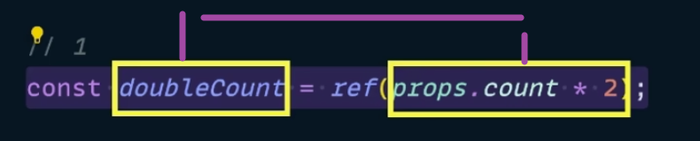
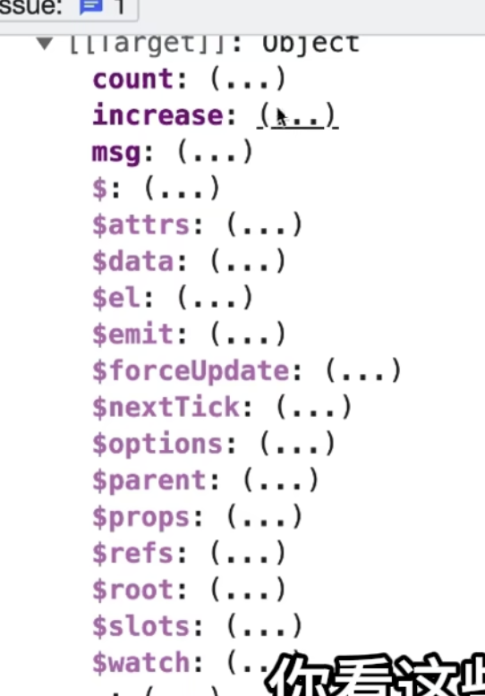
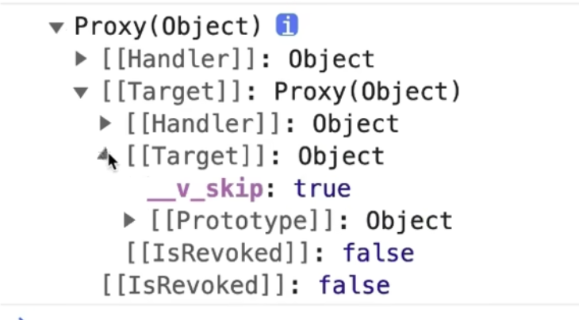
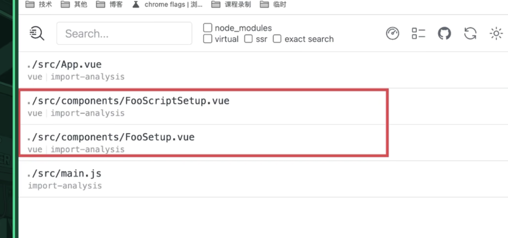

# Vue的响应式: 

### 问题1: 
testCount的值是基于props.count创建的, 那么我们在父组件中增加count的值的时候, 子组件中的 testCount 会不会发生变化, **不会**
```html
<script setup lang="ts">
import { ref } from 'vue'
const props = defineProps({
  count: Number
})

const testCount = ref(props.count! * 2)
</script>

<template>
  <div>
    <div>传入的属性: {{ count }}</div>
    <div>页面的属性: {{ testCount }}</div>
  </div>
</template>
```

<br>

### 解答:
Vue的响应式就是将**函数和数据进行关联**(vue的响应式不再是数据变化, 重新渲染了)

``<template>``模版的本质就是render函数, 函数中用到了 testCount这种响应式的数据 所以render函数跟这种响应式数据进行了关联 将来数据变化的时候函数就要重新运行了

这就是我们在父组件中 修改count的值, 子组件中基于count创建的 testCount 不会更新的原因, 因为这里不涉及到任何的函数

```js
const testCount = ref(props.count! * 2)
```

这句中的 props.count 数据 和 testCount 数据 并没有关联到一起, 单纯的两个数据是没有办法进行关联的, 所以props.count的变化跟testCount就没有关系



<br>

### 问题2: 
下面我们使用 watchEffect, 在它的回调中修改testCount的值, 问当我们在父组件中修改count的值的时候, 子组件中的testCount会不会发生变化

**会!**
```html
<script setup lang="ts">
import { ref, watchEffect } from 'vue'
const props = defineProps({
  count: Number
})

const testCount = ref(0)
watchEffect(() => {
  testCount.value = props.count * 2
})
</script>

<template>
  <div>
    <div>传入的属性: {{ count }}</div>
    <div>页面的属性: {{ testCount }}</div>
  </div>
</template>
```

<br>

### 解答:
会的, 因为vue的响应式就是函数和数据相关联

我们想想 什么函数在 vue2中是被 watcher 监控的函数? 在vue3中是被 effect 所监控的函数?

<br>

**在vue3中哪些函数会被监控?**  
1. render: vue3中会监听render, 所以响应式数据发生变化的时候 会重新渲染页面
2. computed
3. watchEffect:
4. watch

<br>

**在vue3中什么样的数据会被监控?**  
也就是说什么样的数据会跟函数关联起来呢? 并不是所有的数据, 这个数据有两个条件
1. 该数据必须是响应式数据
2. 该数据必须在函数中用到

上面的情况下才会将函数和数据关联起来

<br>

上面的问题中 props.count 会跟 watchEffect 关联起来, 当props.count发生变化的时候 就会导致 watchEffect 重新执行

watchEffect一重新运行 才会修改 testCount 的值, testCount也是响应式数据, 它在render函数(template模版)中用到了, 这个testCount一变 render也重新执行

上面的问题要分为两个部分来看
1. props.count 的变化导致了 watchEffect 的重新执行
2. testCount 的变化导致了 render重新执行

<br>

### 问题3: 
下面我们封装了一个 useTestCount 函数 并传入了props 函数中定义了响应式数据 testCount

然后使用了 watchEffect 为 testCount 进行赋值

下面的这种情况下我们点击按钮在父组件中修改count的值 子组件中的testCount会不会发生变化

**不会!**  
它不仅没有更新页面 子组件中的 watchEffect 都没有执行
```html
<script setup lang="ts">
import { ref, watchEffect } from 'vue'
const props = defineProps({
  count: Number
})

function useTestCount(count) {
  const testCount = ref(count * 2)
  watchEffect(() => {
    testCount.value = count * 2
  })

  return testCount
}

const testCount = useTestCount(props.count)
</script>

<template>
  <div>
    <div>传入的属性: {{ count }}</div>
    <div>页面的属性: {{ testCount }}</div>
  </div>
</template>
```

<br>

### 解答:
vue会监听watchEffect函数 它是被监控的, 而这个函数中用到了什么响应式数据?
```js
function useTestCount(count) {
  const testCount = ref(count * 2)

  // ↓ 下面的函数中使用了什么响应式数据???
  watchEffect(() => {
    testCount.value = count * 2
  })

  return testCount
}
```

一个都没有, count不是它是一个传递进来的原始值 它不再是响应式数据了 所以 watchEffect虽然被监控了 它里面没有用到任何的响应式数据, 所以该函数并没有和任意的响应式数据相关联

所以, props.count虽然在父组件中修改了count的值, 但是跟watchEffect并没有关系

<br>

### 问题4: 
下面的情况下, 父组件修改count, 子组件中的testCount会不会发生变化

**不会!**
```html
<script setup lang="ts">
import { ref, watchEffect } from 'vue'
const props = defineProps({
  count: Number
})

function useTestCount(count) {
  const testCount = computed(() => count * 2)
  return testCount
}

const testCount = useTestCount(props.count)
</script>

<template>
  <div>
    <div>传入的属性: {{ count }}</div>
    <div>页面的属性: {{ testCount }}</div>
  </div>
</template>
```

<br>

### 解答:
虽然 ``computed(() => count * 2)`` 计算属性中的回调被监控了 但是它里面没有用到响应式数据 count仍然是一个原始值 这里已经不是响应式了 跟上面的问题3是一样的

<br>

### 思考:
如果我们要自已进行封装 我们如何避免上述的3和4中的问题, 我们自己封装的函数不能接收原始类型的参数我们要将整个的props对象传入

<br><br>

# Vue中的setup做了什么?
```html
<script setup>
import { ref } from 'vue'
const msg = 'foo script setup'
const count = ref(0)
function increase() {
  count.value++
}
</script>
```

上面我们使用的是setup的语法糖, 我们思考下, 原生的setup函数和语法糖真的就完全一样么?

<br>

### 对比 setup语法糖 和 setup函数
1. 输出 使用setup语法糖写出的组件 的实例
2. 输出 使用setup函数写出的组件 的实例

<br> 

我们看下输出实例的内容

**setup函数:**  


setup函数返回的实例中有我们定义的数据 和 组件实例中的一些属性和方法 内部成员

<br> 

**setup语法糖:**  


setup语法糖返回的实例中我们发现里面什么也没有

<br>

### 为什么?
我们最终运行的不是vue文件 而是vue文件编译后的结果 所以我们要对比两者的区别就要观察编译后的结果

我们可以使用 vite-plugin-inspect 插件 
```js
// vite.config.js
import Inspect from 'vite-plugin-inspect'

export default defineConfig({
 plugins: [Inspect(), Vue()]
})
```

我们使用这个插件后 启动项目能看到两个地址 其中有一个就是查看编译结果的地址


<br>

**结果:**  
- setup函数 会被原封不动的编译
- setup语法糖 基本上和setup函数没有区别 但是有一个 expose()

我们看到的区别根源就在于expose()

<br>

**expose的作用:**  
expose是说我要向外界暴露当前组件实例中的哪些成员, 一旦我们在组件中使用了expose配置之后, 该组件即使是使用setup函数写的 它也不会将全部的成员对外暴露了, 只会暴露我们在expose中配置的内容

<br>

它有两种使用方式
```js
// 方式1: 配置项
export default {
  expose: ['a'],
  methods: {
    a() {}
  }
  setup() {

  }
}

// 方式2: setup函数中解构出来
export default {
  methods: {
    a() {}
  }
  setup(props, { expose }) {
    // 如果我们不传入配置对象, 则表示我们什么也不对外暴露
    expose({
      a
    })
  }
}
```

**如果我们使用的是setup语法糖的话 它会自动给我们加上 expose()**

<br>

### 为什么要这么做?
因为我们将组件的全部成员对外暴露不是一件好事 这样会在组件外我们就可以通过ref拿到组件的实例 通过实例访问组件内部的成员 这样就打破单向数据流

<br><br>

# Vite中自动生成路由 自己实现
vite-plugin-pages (依赖)
```s
https://www.bilibili.com/list/666759136?tid=0&sort_field=pubtime&spm_id_from=333.999.0.0&oid=532781349&bvid=BV1vu411N7x9
```