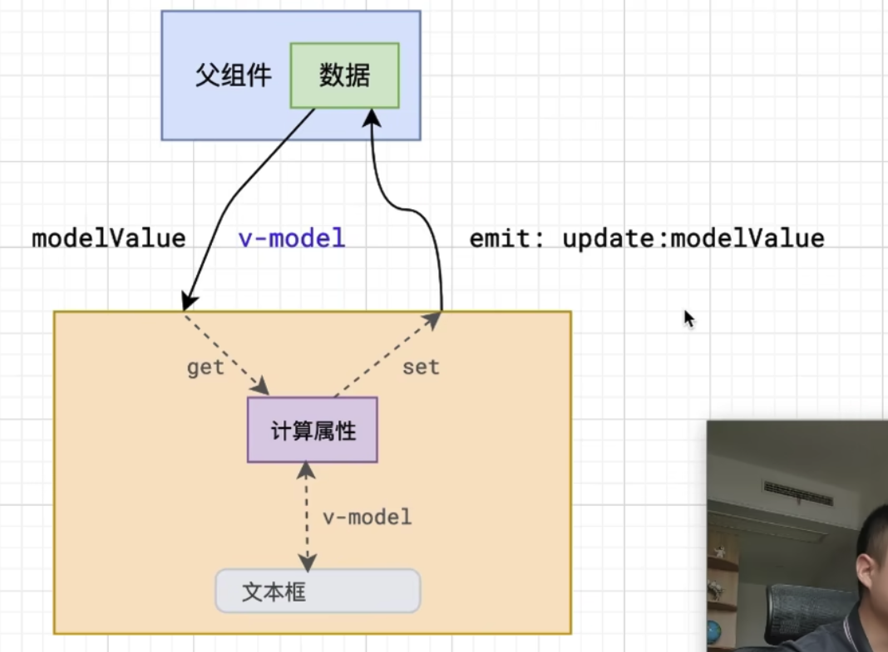

# 使用 vueuse 中的 useFetch 来封装 请求
- https://blog.csdn.net/a1598452168YY/article/details/127986868

- https://blog.csdn.net/weixin_42386379/article/details/130216301

- https://www.icodebang.com/article/301428.html

- https://juejin.cn/post/7261972803695624250

<br><br>

# Vue2 和 Vue3 的生命周期
|Vue2(选项式API)|Vue3(setup)|描述|
|:--|:--|:--|
|beforeCreate|-|实例创建前|
|created|-|实例创建后|
|beforeMount|onBeforeMount|DOM挂载前调用|
|mounted|onMounted|DOM挂载完成调用|
|beforeUpdate|onBeforeUpdate|数据更新之前被调用|
|updated|onUpdated|数据更新之后被调用|
|beforeDestroy|onBeforeUnmount|组件销毁前调用|
|destroyed|onUnmounted|组件销毁完成调用|

# Vue2 和 Vue3 的数据传递
|方式|Vue2|Vue3|
|:--|:--|:--|
|父传子|props|props|
|子传父|$emit|emits|
|父传子|$attrs|attrs|
|子传父|$listeners|无(合并到 attrs方式)|
|父传子|provide|provide|
|子传父|inject|inject|
|子组件访问父组件|$parent|无|
|父组件访问子组件|$children|无|
|父组件访问子组件|$ref|expose&ref|
|兄弟传值|EventBus|mitt|


# Vue2 和 Vue3 中路由守卫的使用区别

|路由名|Vue2|Vue3|
|:--|:--|:--|
|全局前置路由守卫|router.beforeEach|useRouter().beforeEach|
|全局后置路由守卫|router.afterEach|useRouter().afterEach|
|独享路由守卫|routes/beforeEnter|routes/beforeEnter|
|组件内的路由守卫(进入前)|beforeRouteEnter|新的script中写beforeRouteEnter配置项/在defineOptions中写beforeRouteEnter|
|组件内的路由守卫(更新)|beforeRouteEnter|onBeforeRouteUpdate|
|组件内的路由守卫(离开前)|beforeRouteLeave|onBeforeRouteLeave|

<br>

### beforeRouteEnter 在vue3中写法要点:
**方式1: vue3.3 以上**  
RouteLocationNormalized 需要使用 ``import type`` 从 ``vue-router`` 中导出

```js
import { NavigationGuardNext, RouteLocationNormalized } from 'vue-router'

// vue3 setup 语法糖下的路由守卫 beforeRouteEnter 用法示例 
defineOptions({
  name: 'peopleAdd',
  beforeRouteEnter: (to: RouteLocationNormalized, from: RouteLocationNormalized, next: NavigationGuardNext) => {
    console.log('salesOrder beforeRouteEnter', to, from)
    // 说明用户是通过刷新的方式进入的
    if (from.name === undefined) {
    }
    next()
  }
})
```

<br>

**方式2: 两个script**
```html
<script lang="ts">
import { defineComponent, ComponentPublicInstance } from 'vue';

interface IInstance extends ComponentPublicInstance {
  setPathFrom(from: string): void;
}

export default defineComponent({
  beforeRouteEnter(to, from, next) {
    next((vm) => {
      const instance = vm as IInstance;
      console.log('instance = ', instance.wineDetailData);
        instance.wineDetailData.countInterval = 0;  //变量调用
        instance.getUserInfo();   // 函数调用
    });
  },
});
</script>


<script lang="ts" setup>
import { reactive } from 'vue';
interface typeData{
  countInterval:number;
}
const wineDetailData = reactive<typeData>({
  countInterval: 0
});
const getUserInfo=()=>{
    return ''
}

// 暴露变量和方法给beforeRouteEnter调用
defineExpose({ wineDetailData, getUserInfo });
</script>
```

<br><br>

# 复数组件挂载到全局上的问题
我做了一个组件, 将组件转换为VNode后 通过注册插件的方式, 将组件挂载到了全局上, 这样我可以使用 方法 的形式 呼出组件

但是有一个问题, 如果只是一个的话, 我挂载到body上是没有问题的, 但是如果有复数的组件都挂载到body上则会报错

```s
DOMException: Failed to execute 'insertBefore' on 'Node': The node before which the new node is to be inserted is not a child of this node.
```

<br>

### 全局对话框组件代码
```js
import type { App, VNode } from 'vue'
import { createVNode, render } from 'vue'
import CommonDialog from './CommonDialog.vue'
import CommonDialogSingleButton from './CommonDialogSingleButton.vue'
import i18n from '@/lang/index'

export default {
  install(app: App) {
    const CommonDialogVNode: VNode = createVNode(CommonDialog, { i18n })
    const CommonDialogSingleButtonVNode: VNode = createVNode(CommonDialogSingleButton, { i18n })

    render(CommonDialogVNode, document.body)
    render(CommonDialogSingleButtonVNode, document.body)

    app.config.globalProperties.$invoke = {
      show: CommonDialogVNode.component?.exposed?.show,
      hide: CommonDialogVNode.component?.exposed?.hide
    }

    app.config.globalProperties.$invokeSingleButton = {
      show: CommonDialogSingleButtonVNode.component?.exposed?.show,
      hide: CommonDialogSingleButtonVNode.component?.exposed?.hide
    }
  }
}
```

我们将上面的组件挂载到了 body 上, 但是因为两个组件都挂载到了 body 上, 报错了

<br>

### 原因:
错误通常是因为在调用 render 方法时，试图将 VNode 挂载到一个并非其父节点的元素之前。要解决这个问题，可以通过确保正确创建并附加一个容器元素来避免这个问题。

因为 Vue 的 render 方法需要一个明确的目标容器来挂载虚拟节点。如果你将多个虚拟节点挂载到同一个目标容器（如 document.body），Vue 会在内部试图管理这些节点的位置和顺序，这可能导致 DOMException 错误。

当你创建单独的容器元素并将它们附加到 document.body 中时，每个组件都有自己独立的 DOM 结构，Vue 可以更好地管理这些节点的生命周期和更新。这种方法有以下几个好处：

**1. 避免 DOM 冲突：**  
每个组件有独立的容器，Vue 不需要处理同一个容器中的多个节点，避免了 DOM 操作上的冲突。

**2. 清晰的结构：**  
独立的容器使 DOM 结构更清晰，便于调试和维护。

**3. 更好的性能：**  
独立容器减少了 DOM 操作的复杂性，可能带来更好的性能。

<br>

假设你将多个虚拟节点直接挂载到 document.body，**可能会出现以下问题：**  

**1. 位置管理复杂：**  
Vue 需要管理和跟踪这些节点的位置，特别是当它们涉及到动态更新或重渲染时，可能会产生错误。

**2. 渲染冲突：**  
多个组件可能会相互影响，特别是在动态更新和删除时，导致渲染问题或异常。

<br>

### 解决方式:
```js
import { App, VNode } from 'vue';
import { createVNode, render } from 'vue';
import CommonDialog from './CommonDialog.vue';
import CommonDialogSingleButton from './CommonDialogSingleButton.vue';
import i18n from '@/lang/index';

export default {
  install(app: App) {

    // 创建各个组件的容器 div
    const commonDialogContainer = document.createElement('div');
    const commonDialogSingleButtonContainer = document.createElement('div');

    document.body.appendChild(commonDialogContainer);
    document.body.appendChild(commonDialogSingleButtonContainer);

    const CommonDialogVNode: VNode = createVNode(CommonDialog, { i18n });
    const CommonDialogSingleButtonVNode: VNode = createVNode(CommonDialogSingleButton, { i18n });

    render(CommonDialogVNode, commonDialogContainer);
    render(CommonDialogSingleButtonVNode, commonDialogSingleButtonContainer);

    app.config.globalProperties.$invoke = {
      show: CommonDialogVNode.component?.exposed?.show,
      hide: CommonDialogVNode.component?.exposed?.hide
    };

    app.config.globalProperties.$invokeSingleButton = {
      show: CommonDialogSingleButtonVNode.component?.exposed?.show,
      hide: CommonDialogSingleButtonVNode.component?.exposed?.hide
    };
  }
}
```

<br><br>

# 通过 url跳转 到子页面的问题
我页面上有一个 link-router, 我点击它的时候 会跳转到detail页面 url上会携带 /detail?id=1, 如果我不使用 link-router 直接在url上输入 ``/detail?id=1`` **是不是也能跳转到 detail页面?**

是的

在 Vue.js 项目中, 使用 router-link 组件可以实现导航, 同时利用 Vue Router 进行 URL 路由管理。根据你的描述, 当你点击 router-link 跳转到 /detail?id=1 页面时, 你希望通过直接在浏览器地址栏输入 URL 的方式进行相同的跳转, 并且你希望禁用这种直接输入 URL 进行跳转的行为。

<br>

### 跳转机制
不管是点击 router-link 还是直接在浏览器地址栏输入 URL, Vue Router 都会处理 URL 并进行相应的页面渲染。因此, 直接输入 /detail?id=1 确实会跳转到 detail 页面。这是 Vue Router 的基本功能。

<br>

### 禁止直接输入 URL 进行跳转的方法
阻止用户通过直接输入 URL 访问某些页面需要一些额外的逻辑, 可以通过以下几种方式实现

**1. 路由守卫**  
使用 Vue Router 提供的全局导航守卫 beforeEach, 在进入路由前检查是否是通过 router-link 进行导航的
```js
import Vue from 'vue';
import Router from 'vue-router';
import DetailPage from './components/DetailPage.vue';


Vue.use(Router);


const router = new Router({
  routes: [
    {
      path: '/detail',
      name: 'detail',
      component: DetailPage,
    },
  // 其他路由
  ]
});


router.beforeEach((to, from, next) => {
  // 检查导航的来源
  if (to.name === 'detail' && !from.name) {
    // 如果直接输入 URL 跳转到 detail 页面, 则禁止导航
    next(false);
  } else {
    // 否则允许导航
    next();
  }
});


export default router;
```

在这个示例中, beforeEach 守卫会检查目标路由是否是 detail, 以及来源路由是否为空（直接输入 URL 的情况）。如果是这种情况, 则调用 next(false) 来阻止导航。

<br>

**2. 在 created 钩子中检查 URL 来源**  
在 DetailPage 组件的 created 钩子中检查 URL 的来源, 决定是否允许访问页面
```js
<template>
 <div>
 <!-- 页面内容 -->
 </div>
</template>


<script>
export default {
  name: 'DetailPage',
  created() {
    if (!document.referrer) {
      // 如果没有 referrer, 表示是直接输入 URL 进入的
      this.$router.replace('/'); // 跳转到首页或者其他页面
    }
  }
}
</script>
```

在这个示例中, 如果 document.referrer 为空, 表示用户是直接输入 URL 访问的页面, 然后重定向到其他页面（如首页）

<br>

### 注意事项:
禁止用户直接输入 URL 进行访问并不是一个推荐的实践, 因为这会影响用户体验和应用的可用性。通常, 更好的做法是通过身份验证、授权等方式控制页面访问权限

1. 身份验证：通过身份验证来控制页面访问, 未授权用户会被重定向到登录页面
2. 权限管理：在路由守卫中检查用户权限, 决定是否允许访问某些页面

<br><br>

# 组件的刷新功能
我们点击刷新按钮, 类似我们按了F5, 数据会重新渲染

当组件挂载成功的时候(onMounted)会向服务器发起请求 拿到服务器的数据进行展示, 我们刷新的时候 **只是将二级路由销毁然后重新创建**

这时该组件的onMounted就会再次执行 就会再向服务器发请求 拿数据 再展示

<br>

### 要点:
点击 刷新按钮 将对应的二级路由组件销毁 再重新创建

<br>

**1. 在 settingsStore 中定义 标识, 用于标识是否点击了刷新按钮**
```js
// 关于 Layout 组件 相关配置的仓库
import { defineStore } from 'pinia'

const useSettingStore = defineStore('setting', {
  state: () => {
    return {
      // 控制菜单是折叠还是收起
      isCollapsed: false,
      // 用户控制刷新效果
      isRefreshed: false
    }
  }
})

export default useSettingStore
```

<br>

**2. main组件(有router-view)中的逻辑**
1. 拿到 settingStore 中用来表示是否刷新了的 isRefreshed
2. 使用 watch 监视它
3. watch中的逻辑
  - 利用 v-if, false 该组件会被卸载 true 该组件会被挂载
  - 利用 响应式数据 发生变化 dom结构会重新渲染的机制
  - 利用 nextTick 在不同的实际操作响应式数据

```html
<script setup lang="ts">
import { useRoute } from 'vue-router'
import { computed, watch, ref, nextTick } from 'vue'
import useSettingStore from '@/store/settingStore'

defineOptions({
  name: 'AppMain'
})

...

// 控制当前组件是否销毁重建, 没点击刷新之前不销毁(v-if=true)
let flag = ref(true)

// 刷新按钮的相关逻辑
const settingStore = useSettingStore()
// 监听 settingStore.isRefreshed 的变化, 如果发生变化说明用户点击过刷新按钮
watch(
  () => settingStore.isRefreshed,
  () => {
    // v-if 可以销毁 和 重新创建组件

    // 将 flag 置为 false 销毁组件
    flag.value = false

    // 使用 nextTick, 当响应式数据发生变化后, 可以获取更新后的dom
    nextTick(() => {
      // 当模版渲染完毕后, 重新设置为true, 响应式数据发生变化后, 会再次渲染dom
      flag.value = true
    })
  }
)
</script>

<template>
  <div class="main__container">
    <router-view #default="{ Component }">
      <transition name="fade">
        <!-- 使用 v-if 控制 router-view 出口的组件的 挂载 和 卸载 -->
        <component v-if="flag" :is="Component" />
      </transition>
    </router-view>
  </div>
</template>
```

<br><br>

# Vue 设置 css 变量
使用 :style 属于利用对象形式
```html
<div
  class="container"
  :style="{
    '--variable': 'value'
  }"
></div>
```

<br><br>

# Vue3 setup 中 给window绑定事件不用放在onMounted中
```html
<script setup lang="ts">
...

// 监听窗口的尺寸变化
window.addEventListener('resize', adjustDataTargetPosition)
</script>
```

<br><br>

# Vue3动态引入图片的方式
还得通过 new URL 去引入

```js
// assest/ の中の画像をとるメソッド
type getAssetsResourceType = (imgName: string) => string
export const getAssetsResource: getAssetsResourceType = imgName => {
  return new URL(`/src/assets/image/${imgName}`, import.meta.url).href
}
```

<br><br>

# Vue3 ref获取组件实例 v-if & v-show
我们需要通过 spuFormRef 来获取 SpuForm 实例
```html
<SpuForm
  ref="spuFormRef"
  v-show="switchStructure === SCENE.SPU"
  @update:switchStructure="updateStructure"
/>

<script>
  const spuFormRef = ref<InstanceType<typeof SpuForm>>()

  const updateSpuHandler = (row: spuItemType): void => {
    switchStructure.value = SCENE.SPU

    // 点击回调 输出 子组件 实例
    console.log(spuFormRef.value)
  }
</script>
```

<br>

### 问题: 响应式数据刚发生变化, 还需要渲染 所以 v-if 拿不到
1. 使用 v-show 的话, 我们可以在回调中输出 子组件实例 (v-show 子组件mounted只会执行一次 不会重新销毁和挂载)

2. 使用 v-if 的话 我们不能再回调中输出 子组件实例 (v-if 子组件会重新销毁和挂载 所以 v-if 的子组件的创建和销毁的声明周期都会执行)

<br>

### 解决方式:
可以使用Vue的$nextTick方法来确保在组件被创建后再获取组件的实例。$nextTick会在下次DOM更新循环结束之后执行指定的回调函数。

<br><br>

## v-model: 如果我们要收集两个字段可以这样
我们知道v-model只能收集value属性, 所以我们可以这么做
```html
<el-select
  v-model="echoSpuForm.unAttrIdAndName"
  :placeholder="
    unSelectSaleAttrList.length
      ? `还未选择的有 ${unSelectSaleAttrList.length} 个`
      : `无`
  "
>
  <!-- 因为我们要收集的是 id 和 name 两个字段, :value="`${item.id}:${item.name}`" 冒号的作用是作为分隔符的 -->
  <el-option
    v-for="item in unSelectSaleAttrList"
    :key="item.id"
    :label="item.name"

    
    :value="`${item.id}:${item.name}`"
  ></el-option>
```

<br><br>

## v-model: 单向数据流, 绑定props 报错的问题
1. 使用计算属性
2. 使用data

我们可以使用计算属性中转下
```js
// ----- props ------
type paginationFormType = {
  pageSize?: number
  pageNo?: number
  total?: number
}
type propsType = {
  hasPagination?: boolean
  captionText: string
  paginationForm: paginationFormType
}

const props = withDefaults(defineProps<propsType>(), {
  captionText: '',
  hasPagination: true,
  paginationForm: () => ({
    pageSize: 5,
    pageNo: 1,
    total: 0
  })
})

// ----- computed -----
const pageForm = computed(() => {
  return {
    pageSize: props.paginationForm.pageSize,
    pageNo: props.paginationForm.pageNo,
    total: props.paginationForm.total
  }
})
```

<br>

```js
const props = withDefaults(defineProps<propsType>(), {
  captionText: '',
  hasPagination: true,
  paginationForm: () => ({
    pageNo: 1,
    pageSize: 5,
    total: 0
  })
})

// ----- variable -----
const pageForm = reactive<paginationFormType>({
  pageNo: 1,
  pageSize: 5,
  total: 0
})
// 合并下props
Object.assign(pageForm, props.paginationForm)
```

<br><br>

# 组件封装需要考虑的问题:
1. 类似 el-input 组件原生会有很多的属性和事件 怎么办?

2. 插槽的问题, 我们传入 AppText 的插槽, 我们要传递给 el-input, 也就是说 我们想使用原生组件的插槽 怎么办?

3. ref的问题, 我们给 AppText 绑定ref的时候, 我们希望获取的是 el-input 怎么办

<br>

### 问题1: 组件原生会有很多的属性和事件 怎么办?
**$attrs**: 它是 对象, 可以获取到 除了props中声明的属性之外的所有通过标签属性传递到子组件的字段
```html
<AppText a=1 b=2 c=3 />


<div>
  <el-input />
</div>


props: ['a']
$attrs: { b: 2, c: 3 }
```

这种机制非常好, 我们可以通过props拿到a, 然后单独的处理a属性, 处理完之后 再将a交给 el-input

我们可以将 给AppText绑定的属性(事件也是通过它) 通过 $attrs 交给 el-input

```html
<el-input v-bind="$attrs" />
```

<br>

### 问题2: 插槽怎么办?
el-input 在官网上有4个插槽
- prefix
- suffix
- prepend
- append


我们可以通过 $slots 知道我们在AppText中传入了多少的插槽内容
```html
<AppText>
  <template #append></template>
</AppText>
```

输出 $slots 我们能观察到
```js
{
  append: (...args) => { ... }
}
```

有了 $slots 之后, 我们可以动态的遍历这个对象 (循环对象的时候获取的是 kv)

```html
<el-input v-bind="$attrs">
  <template
    v-for="(value, name) in $slots"
    #[name]="scopeData"
  >
    <slot :name="name" v-bind="scopeData || {}" />
  </template>
</el-input>
```

<br>

### 问题3: ref怎么办?
我们给 AppText 绑定 ref 希望拿到的 el-input 实例
1. 我们给 el-input 添加ref
```html
<el-input ref='inpRef' v-bind="$attrs">
  <template
    v-for="(value, name) in $slots"
    #[name]="scopeData"
  >
    <slot :name="name" v-bind="scopeData || {}" />
  </template>
</el-input>
```

<br>

2. 我们在 AppText 组件的mounted中可以拿到 el-input的ref, 它里面有elmentPlus中提供的各种属性和方法 我们可以将这些属性和方法 添加到当前的组件和实例中
```js
onMounted(() => {
  const inp = this.$refs.inpRef
  for (const key in inp) {
    this[key] = inp[key]
  }
})

```

<br>

在 AppText 定义getRef函数, 然后父组件需要的时候可以用this.$refs[子组件].getRef() 来获取

<br>

**问题:**   
我给 AppText 绑定ref想通过 ref 获取到 el-input 但是没有办到呀

<br>

### 示例: 封装AppText
```html
<script setup lang="ts">
import { computed, useAttrs, useSlots, ref } from 'vue'
defineOptions({
  name: 'AppText'
})


// reactive 对象
const attrs = useAttrs()
// reactive 对象
const slots = useSlots()


type propType = {
  modelValue: string,
  errorMsgList?: any[],
  label: string,
  required?: boolean
}
const props = withDefaults(defineProps<propType>(), {
  modelValue: '',
  errorMsgList: () => [],
  label: '',
  required: false
})


const emit = defineEmits(['update:modelValue'])


const inpRef = ref()


const bindValue = computed({
  get() {
    return props.modelValue
  },
  set(n) {
    emit('update:modelValue', n)
  }
})


/*
onMounted(() => {
  // 想获取el-input实例 并将该实例身上的方法交给当前组件的proxy身上 但是父组件通过ref获取不到AppText实例
  const inp = inpRef.value
  for (const key in inp) {
    proxy[key] = inp[key]
  }
})
*/


// 因为上面AppText的父组件通过ref获取不到AppText, 所以改用下面的方式, 让父组件拿到el-input 父组件可以通过 xxxRef.value.inpRef.value.xxx方法
defineExpose({
  inpRef
})
</script>


<template>
  <div class="app-text">
    <!-- Title -->
    <el-row class="app-text__label">
      <el-col>
        <div>
          <span>{{ label }}</span><span v-if="required">*</span>
        </div>
      </el-col>
    </el-row>
    <!-- Body -->
    <el-row class="app-text__body">
      <el-col>
        <el-input
          ref="inpRef"
          v-model="bindValue"
          v-bind="attrs"
        >
          <template
            v-for="(value, name) in slots"
            :key="name"
            #[name]="scopeData"
          >
            <slot
              :name="name"
              v-bind="scopeData || {}"
            />
          </template>
        </el-input>
      </el-col>
    </el-row>
    <!-- ErrorMsg -->
    <el-row
      v-if="errorMsgList.length > 0"
      class="app-text__error"
    >
      <el-col
        v-for="(errMsg, index) in errorMsgList"
        :key="index"
      >
        <div>
          {{ errMsg }}
        </div>
      </el-col>
    </el-row>
  </div>
</template>
``` 

<br><br>

# 封装resize: 自定义指令
```js
// 每个dom元素需要对应一个回调 WeakMap的键不会再被垃圾回收器考量 垃圾回收的时候不会考虑我们key的对象是一个对象 由于引用关闭不回收这个对象 当外面的dom消失之后 垃圾回收器看这个dom没有用了 就把它删除掉了 WeakMap中的key的位置的dom也就没有了
const map = new WeakMap()

// 全局 ob, 无论指令执行多少次, 我们使用的都是全局ob对象
const ob = new ResizeObserver((entries) => {
  for (const entry of entries) {
    /*
      entry:
        {
          borderBoxSize: 边框盒的尺寸 数组
          contentBoxSize: 内容盒的尺寸 数组
          contentRect: 内容区域的尺寸
          devicePixelContentBoxSize: DPR的尺寸
          target: 哪个元素发生了变化
        }
    */
    // 获取 dom 中给v-size-ob传入的回调 handler
    const handler = map.get(entry.target)

    if (handler) {
      const box = entry.borderBoxSize[0]
      handler({
        width: box.inlineSize,
        height: box.blockSize
      })
    }
  }
})

export default {
  // 元素挂载的时候运行它
  mounted(el, binding) {
    // 监听尺寸的变化
    ob.observe(el)
    // binding.value 是 v-size-ob="handleSizeChange" dom中传递的回调
    map.set(el, binding.value)
  },
  // 当元素卸载的时候运行它
  unmounted(el) {
    // 取消监听
    ob.unobserve(el)
  }
}
```

<br>

### 注册全局自定义指令
我们暴露出去一个对象, 这个对象就可以用来注册自定义指令我们在入口文件中 注册全局的指令

**要点:**  
我们注册全局自定义指令的时候 指令名的部分不用加 v 
```js
import sizeDirect from '@/directive/sizeDirect.ts'

// pinia 相关
const pinia = createPinia()

const app = createApp(App)

// v-resize x | resize o
app.directive('v-resize', sizeDirect)
...
app.mount('#app')
```

<br>

### 批量注册
1. 创建 index.ts 文件 用来汇总自定义指令
2. 暴露 含有 install 方法的对象
```js
// directives
import type { App } from 'vue'
import obResize from './resizeDirect'


const directives = {
  obResize
}


export default {
  install(app: App) {
    Object.keys(directives).forEach((key: string) => {
      app.directive(key, directives[key])
    })
  }
}
```

3. main.ts中注册插件
```js
import directives from '@/directives'

createApp(App)
  .use(directives)
  .use(gloablComponent)
  .use(CommonDialog)
  .use(router)
  .use(pinia)
  .use(i18n)
  .mount('#app')
```


<br><br>

# 右键菜单
下面图中每一个区域会关联一个右键菜单, 而且每个区域的右键菜单是不一样的


<br><br>

## 思考: 组件设计
我们组件的名字叫 ``<ContextMenu />``

<br>

### 1. 右键菜单中关联哪一个区域 做法3种, 推荐3
**方式1: ``<ContextMenu :relatedTo="传入DOM元素" />``**   
我们通过relatedTo传入dom元素 将右键菜单和该元素关联起来, 该方式不是太好, 在Vue中尽量不要直接操作dom元素

<br>

**方式2: 我们将 ``<ContextMenu />`` 放入到一个html结构中让它成为该结构的子元素**  
这样ContextMenu组件就可以获取它的父元素, 用这个父元素作为它的区域

如下的方式也是可以的, 但是也避免不了我们在``<ContextMenu />``组件内部操作DOM元素

```html
<div>
  <ContextMenu />
</div>
```

<br>

**方式3: ``<ContextMenu />``我们将该组件本身作为一个区域 在这个区域中通过插槽传入任何的内容**
```html
<ContextMenu>
  <div>1</div>
  <div>2</div>
  <div>3</div>
</ContextMenu>
```

<br>

### 2. 我们需要传入什么属性?
1. 菜单内容: menu, `{label: '菜单的标题'}[]`
2. 事件: select , 当我们选择菜单项的时候的回调
```js
<ContextMenu
  :menu="[
    { label: '菜单的标题1' }
  ]"
  @select="clickHandler({ label: '菜单的标题1' })"
>
  ...
</ContextMenu>
```

<br>

### 3. 右键菜单的布局方式
**1. 它一定是固定定位: fixed**  
因为它是根据鼠标在视口的位置确定的, 所以元素也是相对于视口 所以是固定定位

注意: 一旦一个元素使用了 transform css属性, 则该元素的子元素中 如果子元素有固定定位则固定定位元素就不再相对于视口了 而是相对于开启了transform元素 
```html
<div style="transform: scale(1.1)">
  <div>如果该div为fixed, 则该div不再相对于视口, 而是相对于它的父元素</div>
</div>
```

这样就会产生问题, 因为我们在编写这个通用组件的时候 并不知道组件的上层是什么样子的 它套了多少层 这些层之间有没有使用 transform 的

<br>

**解决方式: ``<Teleport />``**  
我们将菜单元素发送到body里面去 这样就保证了这个元素变成body的子元素

```html
<template>
  <div class="container">
    <slot></slot>
    <Teleport to="body">
      <div class="context-menu"></div>
    </Teleport>
  </div>
</template>
```

<br>

### 4. 如果控制菜单的位置和显示隐藏
控制这些在vue中一切都要从数据入手 我们可以将位置和可见度 设置为3个响应式数据
- x
- y
- showMenu

<br>

**显示和隐藏:**  
当我们触发右击事件的时候 控制菜单的显示和隐藏 我们给 菜单容器绑定 contextmenu 事件

- 显示: 在ContextMenu区域内触发彩蛋事件的时候 展示菜单
- 隐藏: 在ContextMenu区域内打开菜单, 在别的区域内又打开菜单时 前一个菜单关闭
```js
div.addEventListener('contextmenu', handleContextMenu)

window.addEventListener('click', closeMenu, true)
window.addEventListener('contextmenu', closeMenu, true)

/*
  点击window的时候 关闭菜单
  点击window的菜单事件的时候 关闭菜单, 因为设置了true, 所以在捕获阶段开始截止, 会先关闭所有的菜单 然后打开自己的菜单
*/
```

<br>

### App组件使用 菜单组件
```html
<script setup lang="ts">
const menuList = [{ label: '菜单1' }, { label: '菜单2' }]
import ContextMenu from './components/ContextMenu.vue'
</script>

<template>
  <div>TEST</div>
  <div class="container">
    <ContextMenu class="block" :menu="menuList"> </ContextMenu>
  </div>
</template>

<style scoped lang="scss">
.test {
  font-size: 16px;
}
.container {
  display: grid;
  height: 100vh;
  grid-template-columns: repeat(2, 1fr);
  grid-template-rows: repeat(2, 1fr);
}
.block {
  background-color: #ccc;
  margin: 10px;
  display: flex;
  align-items: center;
  flex-direction: column;
  padding-top: 20px;
  color: #fff;
}
.block:nth-child(1) {
  background: #e9695e;
}
.block:nth-child(2) {
  background: #f4bd4f;
}
.block .block {
  background: #61c454;
  margin-top: 20vh;
  height: 20vh;
  width: 80%;
}
.block h2 {
  font-size: 1.2em;
}
</style>

```

<br>

### 菜单组件
```html
<template>
  <div ref="containerRef">
    <slot></slot>
    <Teleport to="body">
      <Transition
        @beforeEnter="handleBeforeEnter"
        @enter="handleEnter"
        @afterEnter="handleAfterEnter"
      >
        <div
          v-if="showMenu"
          class="context-menu"
          :style="{
            left: x + 'px',
            top: y + 'px'
          }"
        >
          <div class="menu-list">
            <div
              @click="handleClick(item)"
              class="menu-item"
              v-for="item in menu"
              :key="item.label"
            >
              {{ item.label }}
            </div>
          </div>
        </div>
      </Transition>
    </Teleport>
  </div>
</template>

<script setup>
import { ref } from 'vue'
import useContextMenu from './useContextMenu'

defineProps({
  menu: {
    type: Array,
    default: () => []
  }
})
const containerRef = ref(null)
const emit = defineEmits(['select'])
const { x, y, showMenu } = useContextMenu(containerRef)

function handleClick(item) {
  showMenu.value = false
  emit('select', item)
}

// js控制过度 如果我们使用样式来控制过度的话 会有一个问题 就是0过度到auto是没有任何动画的
function handleBeforeEnter(el) {
  el.style.height = 0
}

function handleEnter(el) {
  // 设置为auto只是为了获取元素的高度
  el.style.height = 'auto'
  // 有了高度之后 再去拿布局属性
  const h = el.clientHeight
  // 然后再将高度变为0 这样界面上不会有任何的表现 但是经过上面的两个步骤我们就拿到了它的具体的高度了
  el.style.height = 0
  // 我们在下一针的时候把高度设置为这个数字
  requestAnimationFrame(() => {
    requestAnimationFrame(() => {
      el.style.height = h + 'px'
      el.style.transition = '0.2s'
    })
  })
}

function handleAfterEnter(el) {
  el.style.transition = 'none'
}
</script>

<style scoped>
.context-menu {
  position: fixed;
  background: #eee;
  box-shadow:
    1px 1px 2px rgba(0, 0, 0, 0.2),
    1px 1px 5px rgba(0, 0, 0, 0.2);
  min-width: 100px;
  border-radius: 5px;
  font-size: 12px;
  color: #1d1d1f;
  line-height: 1.8;
  white-space: nowrap;
  overflow: hidden;
}
.menu-list {
  padding: 5px;
}
.menu-item {
  padding: 0 5px;
  border-radius: 4px;
  cursor: pointer;
  user-select: none;
}
.menu-item:hover {
  background: #3477d9;
  color: #fff;
}
</style>

```

<br>

### useContextMenu hooks
```js
import { onMounted, onUnmounted, ref } from 'vue'

// 参数为 ContextMenu 元素
export default function (containerRef) {
  const showMenu = ref(false)
  const x = ref(0)
  const y = ref(0)

  const handleContextMenu = (e) => {
    // 阻止事件的默认行为 不然他就有浏览器的默认菜单了
    e.preventDefault()
    // 阻止冒泡 如果有嵌套关系的菜单的时候, 它不仅会触发嵌套菜单 还会触发父元素的菜单
    e.stopPropagation()

    // 展示菜单
    showMenu.value = true

    // 在打开菜单的时候 将鼠标位置交给x y
    x.value = e.clientX
    y.value = e.clientY
  }

  function closeMenu() {
    showMenu.value = false
  }

  onMounted(() => {
    const div = containerRef.value
    // 给菜单容器绑定 contextmenu 事件
    div.addEventListener('contextmenu', handleContextMenu)

    // 监听window的鼠标点击事件, 当触发的时候关闭菜单
    window.addEventListener('click', closeMenu, true)
    window.addEventListener('contextmenu', closeMenu, true)
    /*
      事件的触发是先捕获再冒泡
      我们先看下面的两个事件
      div.addEventListener('contextmenu', handleContextMenu)
      window.addEventListener('contextmenu', closeMenu)

      元素的contextmenu 和 window的contextmenu
      如果我们这么写会导致 底层元素先打开自己的菜单 往上冒泡到window又关闭了菜单

      而我们希望的是
      1. 先全部关闭
      2. 然后再打开一个菜单

      由于window上绑定了'contextmenu', closeMenu 所以 就能保证其它的所有菜单都已经关闭了 然后再打开自己的菜单
      所以我们要设置true, 让它在捕获阶段开始执行
    */
  })

  onUnmounted(() => {
    const div = containerRef.value
    div.removeEventListener('contextmenu', handleContextMenu)

    window.removeEventListener('click', closeMenu, true)
    window.removeEventListener('contextmenu', closeMenu, true)
  })

  return {
    showMenu,
    x,
    y
  }
}

```

<br>

### 问题:
当我们在鼠标靠近屏幕下方的时候 因为右键菜单会出现在鼠标右下方的位置, 菜单会被截断 有一部分看不见 

<br>

### 追加: 获取视口宽度的hooks
```js
// 返回视口的宽度 和 视口的高度
import { ref } from 'vue'

const vw = ref(document.documentElement.clientWidth)
const vh = ref(document.documentElement.clientHeight)

window.addEventListener('resize', () => {
  vw.value = document.documentElement.clientWidth
  vh.value = document.documentElement.clientHeight
})

export function useViewport() {
  return {
    vw,
    vh
  }
}
```

<br>

### 修改 ContextMenu 组件
```html
<template>
  <div ref="containerRef">
    <slot></slot>
    <Teleport to="body">
      <Transition
        @beforeEnter="handleBeforeEnter"
        @enter="handleEnter"
        @afterEnter="handleAfterEnter"
      >
        <div
          v-if="showMenu"
          class="context-menu"
          :style="{
            left: pos.posX + 'px',
            top: pos.posY + 'px'
          }"
        >
          <div v-resize="handleSizeChange" class="menu-list">
            <div
              @click="handleClick(item)"
              class="menu-item"
              v-for="item in menu"
              :key="item.label"
            >
              {{ item.label }}
            </div>
          </div>
        </div>
      </Transition>
    </Teleport>
  </div>
</template>

<script setup>
import { ref, computed } from 'vue'
import useContextMenu from './useContextMenu'
import useViewport from './useViewport'

defineProps({
  menu: {
    type: Array,
    default: () => []
  }
})
const containerRef = ref(null)
const emit = defineEmits(['select'])
// 鼠标位置
const { x, y, showMenu } = useContextMenu(containerRef)
// 视口尺寸
const { vw, vh } = useViewport()
// 菜单的 宽 高
const w = ref(0)
const h = ref(0)

// 调整 xy的位置 到合适的地方
const pos = computed(() => {
  let posX = x.value
  let posY = y.value

  /*
    调整x y需要知道如下的3个东西
    1. 视口尺寸
    2. 鼠标位置
    3. 右键菜单的尺寸 监听菜单元素的尺寸变化

    如果鼠标点击在屏幕最右边 菜单右侧会被遮挡
      鼠标位置超过了 视口宽度 - 菜单的宽度

    如果鼠标点击在屏幕最下方 菜单下边会被遮挡
      鼠标位置超过了 视口高度 - 菜单的高度
  */

  if (x.value > vw.value - w.value) {
    // 菜单的x位置 鼠标位置的x-菜单的宽度
    posX = x.value - w.value
  }

  if (y.value > vh.value - h.value) {
    // 菜单的y位置 视口的高度 - 菜单高度
    posY = vh.value - h.value
  }

  return {
    posX,
    posY
  }
})

// 当菜单尺寸变化的时候 会执行该函数
function handleSizeChange(sizeInfo) {
  w.value = sizeInfo.width
  h.value = sizeInfo.height
}

function handleClick(item) {
  showMenu.value = false
  emit('select', item)
}

// js控制过度 如果我们使用样式来控制过度的话 会有一个问题 就是0过度到auto是没有任何动画的
function handleBeforeEnter(el) {
  el.style.height = 0
}

function handleEnter(el) {
  // 设置为auto只是为了获取元素的高度
  el.style.height = 'auto'
  // 有了高度之后 再去拿布局属性
  const h = el.clientHeight
  // 然后再将高度变为0 这样界面上不会有任何的表现 但是经过上面的两个步骤我们就拿到了它的具体的高度了
  el.style.height = 0
  // 我们在下一针的时候把高度设置为这个数字
  requestAnimationFrame(() => {
    requestAnimationFrame(() => {
      el.style.height = h + 'px'
      el.style.transition = '0.2s'
    })
  })
}

function handleAfterEnter(el) {
  el.style.transition = 'none'
}
</script>

<style scoped>
.context-menu {
  position: fixed;
  background: #eee;
  box-shadow:
    1px 1px 2px rgba(0, 0, 0, 0.2),
    1px 1px 5px rgba(0, 0, 0, 0.2);
  min-width: 100px;
  border-radius: 5px;
  font-size: 12px;
  color: #1d1d1f;
  line-height: 1.8;
  white-space: nowrap;
  overflow: hidden;
}
.menu-list {
  padding: 5px;
}
.menu-item {
  padding: 0 5px;
  border-radius: 4px;
  cursor: pointer;
  user-select: none;
}
.menu-item:hover {
  background: #3477d9;
  color: #fff;
}
</style>

```

<br><br>

# computed 拦截 v-model (useVModel)
在封装表单组件的时候, 我们有的时候会使用 v-model 向表单组件传递数据


这里的问题很多

场景我们有父子两个组件, 父组件中有一些数据 我们希望将数据通过v-model传递给子组件

```html
<template>
  <div>
    <SearchBar v-model="searchData" />
  </div>
</template>

<script setup>
  import { ref } from 'vue'
  
  const searchData = ref({
    keyword: '',
    options: [
      { label: '视频', value: 'video' },
      { label: '文章', value: 'atricle' },
      { label: '用户', value: 'user' },
    ],
    placeholder: '请输入你要查询的关键字',
    selectedValue: 'video'
  })
</script>
```

上面的操作没有问题, v-model实际上是一个语法糖, 它本质上是

首先 给子组件传递了 ``modelValue``, 通过该属性将数据传递给了子组件

子组件需要更改数据的时候 会抛出事件通知父组件进行修改 ``emit: update:modelValue``


<br>

### 问题:
问题会出现在子组件, 子组件中会有一些表单项, 表单项(input select)身上也有 v-model

我们会不会将 父组件传递过来的 modelValue 直接绑定到子组件中的input的v-model身上??

```html
<!-- SearchBar组件 -->
<template>
  <el-input v-model="modelValue.keyword" />
</template>
```

<br>


这样一帮就出问题了, 这样相当于父组件通过modelValue将数据传递给子组件, 子组件是没有权限修改这个数据的 正常子组件想要修改数据 需要抛出事件

但是线上是 子组件使用 v-model 将 modelValue 中的字段绑定在了 el-input 上

当 el-input 文本框发生变化的时候 通知的是 SearchBar子组件, 而子组件通过v-model直接修改了数据, **并没有把事件抛出父组件**

这个过程就造成了一个现象, 子组件修改了本不属于子组件的数据

<br>

### 打破单项数据流的问题
正常来说 父组件中的数据 只有父组件能改, 当调试的时候也是, 只需要调整父组件就可以了 

如果我们打破了单向数据流 就意味着我们组件中的数据 可能在其他的组件里面被修改了 一旦出了问题就不好调试了

<br>

### 解决方式
```js
<template>
  <el-input v-model="modelValue.keyword" />
</template>
```
子组件中不要使用 v-model 绑定不属于 子组件本身的数据, 上面的代码中我们就在子组件中使用 v-model 将父组件中的数据直接绑定给了 el-input

<br>

**修改方式1:**  
```html
<template>
  <el-input
    :modelValue="modelValue.keyword"
    @update:modelValue="handleKeyword"
  />
</template>

<script>
  const handleKeyword = () => {
    // react中的写法, 我们将整个对象发送给父组件
    emit('update:modelValue', {
      ...props.modelValue,
      keyword: value
    })
  }
</script>
```

<br>

**修改方式2:**  


我们使用 computed 就能解决上面的问题, 父组件通过 modelValue 传递了数据到子组件, 子组件要是想修改数据的话, 需要使用 emit: update:modelValue

子组件中有一个文本框, 子组件使用v-model**绑定计算属性**, 计算属性中
- get: 返回 modelValue 中的数据
- set: 发射 自定义事件

```html
<template>
  <el-input
    v-model="keyword"
  />
</template>

<script>
  const props = defineProps({
    modelValue: {
      type: Object,
      required: true
    }
  })
  const keyword = computed({
    get() {
      return props.modelValue.keyword
    },
    set(val) {
      emit('update:modelValue', {
        ...props.modelValue,
        keyword: val
      })
    }
  })
</script>
```

<br>

**对上优化:**  
上面的写法需要利用computed对每一个字段都需要定义对应的计算属性

<br>

**注意:**  
setter的值是一个对象的时候, 只有我们修改了该对象的地址值 那setter才会执行

我们修改对象中的一个属性的值的时候 setter是不会执行的

```js
model.value = xxxxx // set会执行
model.value.keyword = xxxxx // set是不会执行的
```

<br>

所以针对上面的注意点, 我们思考两部分内容
1. 当我们修改对象中的属性的时候
2. 当我们修改整个对象的时候

```html
<script>
  const props = defineProps({
    modelValue: {
      type: Object,
      required: true
    }
  })
  
  const model = computed({
    get() {
      // 当读取model的时候 返回一个代理对象, 当读取model对象中的属性的时候 将对应的属性返回
      return new Proxy(props.modelValue, {
        get(target, key) {
          return Reflect.get(target, key)
        },
        // 该set就是解决修改对象中的属性的时候
        set(target, key, value) {
          // 我们不赋值, 转而触发事件
          emit('update:modelValue', {
            // 原始对象
            ...target,
            // 修改对象中的某个属性值
            [key]: value
          })
          return true
        }
      })
    },
    // 该set就是解决修改整个对象的时候
    set(val) {
      // 当我们修改的时候, 将整个对象传递回去, val就是整个对象
      emit('update:modelValue', val)
    }
  })
</script>
```

<br>

**对上优化:**  
上面的逻辑可以 但是代码量太多 所以我们将这个部分封装到一个文件 ``useModel.js``
```js
import { computed } from 'vue'
// vueuse中提供了这个函数
// props: props对象
// propName: props中的哪个属性
// emit: emit对象
export function useVModel(props, propName, emit) {
  return computed({
    get() {
      return new Proxy(props[propName], {
        get(target, key) {
          return Reflect.get(target, key)
        },
        set(target, key, value) {
          emit('update:' + propName, {
            ...target,
            [key]: value
          })
          return true
        }
      })
    },
    set(val) {
      emit('update:' + propName, val)
    }
  })
}
```

<br>

**使用 useModel:**  
以后但凡需要封装表单组件的时候 我们只需要导入该hooks就可以了
```html
<script>
  import { useVModel } from './useVModel'
  const props = defineProps({
    modelValue: {
      type: Object,
      required: true
    }
  })

  const emit = defineEmits(['update:modelValue'])
  
  // model 就是父组件传递过来的表单数据
  const model = useVModel(props, 'modelValue', emit)
</script>
```

<br>

**继续优化:**  
上面每次读取对象中的属性的时候 都会new Proxy, 我们可以将这个部分优化下
```js
import { computed } from 'vue'

const cacheMap = new WeakMap()

export function useVModel(props, propName, emit) {
  return computed({
    get() {
      // 如果缓存中有对应对象的代理的话 直接返回对应的代理
      if (cacheMap.has(props[propName])) {
        // getter中需要返回代理对象
        return cacheMap.get(props[propName])
      }

      // map中没有代理的话 我们创建代理 最后将代码加入缓存中
      const proxy =  new Proxy(props[propName], {
        get(target, key) {
          return Reflect.get(target, key)
        },
        set(target, key, value) {
          emit('update:' + propName, {
            ...target,
            [key]: value
          })
          return true
        }
      })

      // 将代理加入缓存中
      cacheMap.set(props[propName], proxy)
      // getter中需要返回代理对象
      return proxy
    },
    set(val) {
      emit('update:' + propName, val)
    }
  })
}
```

<br>

### 问题: 
上面当我们第二次读取对象中的属性的时候 会从 cacheMap 中查看是否已经有了缓存, 如果有则使用 cacheMap 中的缓存中的代理对象proxy

问题在于, 当我们使用缓存中的代理对象, 修改其对象中的值的时候, 并没有触发emit 于是乎我们修改成下面的样子
```js
import { computed } from 'vue'


// 每次读取的时候都会创建一个代理对象 所以使用 cacheMap 来缓存如果缓存中有则从缓存中读取
const cacheMap: any = new WeakMap()


// 泛型T: 被认为是 unknown 类型 所以这里我们要给它添加约束\
// keyof T & string
function useModel<T extends Record<string, any>>(props: T, propName: string, emit: any) {
  console.log('')


  return computed({
    get() {
      let cacheEntry = cacheMap.get(props[propName])
      /*
      我们会在缓存中存 kv
      key: props[propName]
      value: 对象 { proxy, emit }

      这样的目的在于我们将emit和proxy放在一起, 后续的逻辑都会使用 cacheEntry.emit 来派发事件
      */
      if (cacheEntry) {
        cacheEntry.emit = emit
        return cacheEntry.proxy
      }
      const proxy = new Proxy(props[propName] as T, {
        get(target, key) {
          return Reflect.get(target, key)
        },
        set(target, key, value) {
          cacheEntry.emit(`update:${propName}`, {
            ...target,
            [key]: value
          })
          return true
        }
      })

      // 我们将 emit 也保存在 缓存中
      cacheEntry = { proxy, emit }
      cacheMap.set(props[propName], cacheEntry)
      return proxy
    },
    // 修改整个对象(将整个对象重新赋值)时的处理方式
    set(val: T) {
      emit(`update:${propName}`, val)
    }
  })
}

export default useModel
```

<br><br>

# ref实现防抖
```html
<template>
  <div>
    <input @input="debounceHandler" />
    <p>{{ text }}</p>
  </div>
</template>

<script>
  import { debounce } from './debounce'
  const text = ref('')

  const inputHandler = e => {
    text.value = e.target.value
  }

  const debounceHandler = debounce(inputHandler, 1000)
</script>
```

我们有一个输入框 输入的内容需要在p标签中展示, 如果我们要做防抖, 那么我们就不能使用 v-model 来绑定这个文本框 使用它的话就是实时的了

**我们需要监听 input元素的 input 事件**, 让它指向一个debounceHandler防抖函数

我们要处理的防抖的场景非常多的时候, 使用上面的方式就显得非常的笨拙, 这里我们使用 ref 来优化上面的防抖功能

<br>

### 使用 customRef 实现防抖
它是用来得到一个自定义的响应式数据

<br>

**回顾 vue响应式:**   
我们通过ref能够得到一个响应式数据的原因是数据中会有 getter 和 setter

<br>

**当我们读数据的时候**, 会触发getter, 它里面做了两件事情
1. 将数据本身返回
2. 另一方面会收集依赖 看谁在用我这个数据

<br>

**当我们给数据进行赋值的时候**, 会运行setter, 它里面做了两件事情
1. 更新数据
2. 派发更新, 通知那些使用数据的人 我变了 你们该重新运行了  

```js
{
  get() {
    1. 收集依赖
    2.
    return 数据
  },
  set(val) {

  }
}
```

<br>

**而 customRef 就是自己实现setter的部分**, 我们可以在setter里面做文章, 我们可以在setter中 **延迟派发更新**

<br>

### 实现
创建 ``debounceRef.js`` 文件
```js
import { customRef } from 'vue'

// 参数1: 默认值 就是ref('xxx')里面传递什么 我们该函数就传递什么
// 参数2: 防抖时间
export function debounceRef(defaultVal, duration = 1000) {
  // 自定义Ref 需要返回一个对象, 当中有get set, 然后我们在set中延迟派发更新
  return {
    get() {
      // 收集依赖
      return defaultVal
    },
    set(val) {
      // 派发更新
      // 改变value的值为新的值
      defaultVal = val
    }
  }
}
```

上面说了的函数中需要 return 的 对象
- get中要收集依赖
- set中要派发更新

那怎么收集依赖和派发更新? Vue中给我们提供了一个方法就是 ``customRef`` 

它就是专门创建上面函数中return的对象的
```js
import { customRef } from 'vue'

// 参数1: 默认值 就是ref('xxx')里面传递什么 我们该函数就传递什么
// 参数2: 防抖时间
export function debounceRef(defaultVal, duration = 1000) {

  let timer

  // track: 收集依赖
  // trigger: 派发更新
  return customRef((track, trigger) => {

    // customRef 中需要返回一个具有get和set的对象
    return {
      get() {
        // 调用 track() 收集依赖
        return defalutVal
      },
      set(val) {
        clearTimeout(timer)
        timer = setTimeout(() => {
          // 延迟派发更新
          trigger()
          defaultVal = val
        }, duration)
      }
    }
  })
}
```

<br>

**使用方式:**  
```html
<template>
  <div>
    <input v-model="text" />
    <p>{{ text }}</p>
  </div>
</template>

<script>
  import { debounceRef } from './debounceRef'

  // 跟使用ref的方式一样
  const text = debounceRef('', 500)

  
</script>
```

<br><br>

# Vue方法中属性丢失的问题
我们有一个输入框, 我们输入文本后会进行网络通信, 回显建议, 当失焦的时候(离开文本框), 网络通信应该取消, 因为我们都离开了 不需要再进行网络通信获取建议了, 这时我们最后一次的搜索可能没有完成 这个时候离开我们就不需要搜索了, 所以我们会将搜索取消掉

因此, 我们的文本框具有 防抖(取最后一次输入做检索) + 失焦(离开文本框)后取消请求 的功能


<br>

### 问题复现:
我们的问题代码如下
```js
export function debounce(func, duration = 1000) {
  let timerId
  function _executor(...args) {
    clearTimeout(timerId)
    timerId = setTimeout(() => {
      func.call(this, ...args)
    }, duration)
  }

  // 为了取消我们给新的函数添加了一个属性
  _executor.cancel = () => {
    clearTimeout(timerId)
  }

  return _executor
}

// 使用示例:
const newFn = debounce(xxx, 1000)
newFn()
newFn.cancel()
```

组件中的使用方式
```js
methods: {
  // 文本框的搜索方法
  querySearch: debounce(async function(query, cb) {
    console.log('search')
    cb(await search(query))
  }, 1000),

  // 失焦时的事件
  cancel() {
    console.log('blur')
    this.querySearch.cancel()
  }
}
```

问题在于, 当我们失去焦点的时候会调用cancel方法, 它里面会调用this.querySearch.cancel(), 这时就报错了


```s
# 说明 this.querySearch.cancel 是 undefind
this.querySearch.cancel is not function
```

那我们在 _executor 身上挂载的cancel属性哪去了? 

<br>

### 解析
我们要想知道为什么cancel属性不见了, 就要知道vue是怎么看到我们配置在methods配置项中的属性的

我们写在methods里面的东西是配置, 我们在html模版中调用methods中的方法的时候, 真的是在调用配置中的方法么?

实际上不是的, 比如下面的代码
```html
<button @click="test" />

<script>
  // 外侧定义了一个函数, 然后我们配置到methods中去
  function m() { ... }

  export default {
    methods: {
      m,
      test() {
        console.log(this.m === m)
      }
    }
  }
</script>
```

我们观察下vue实例中的m 和 我们外面的m是不是一个东西, 我们输出后, 它们不是同一个东西, 也就意味着 我们在methods里面配置的东西, 和它实际调用的函数就不是同一个函数

<br>

我们在methods中配置了querySearch 它里面有一个属性是querySearch.cancel, vue看到它是怎么处理的呢

vue会将我们配置的方法提取到vue实例中, 也就是说我们可以通过 this.querySearch去调用该方法

<br>

**vue的提取方式为:**  
```js
this.querySearch = methods.querySearch.bind(vue实例)
```

这就是为什么我们明明在methods对应的对象中写的函数, 但是它的this却指向了vue实例, 原本this应该指向methods对象的, 就是因为我们使用了bind
```js
methods: { }
```

这也是为什么我们不能将methods中的方法 定位为箭头函数 因为箭头函数根本没有this

由于它使用了bind(), 就导致了下面 this.querySearch 是一个新的方法
```js
this.querySearch = methods.querySearch.bind(vue实例)
```

新的方法就意味着, 新方法上没有原来方法上的属性了, 这就是为什么querySearch上的属性会丢失, 在 JavaScript 中, 函数是对象, 可以有属性。但是 bind 方法返回的是一个新的函数, 这个新函数的内部实现并不保留原始函数上的所有属性。bind 方法主要用于改变函数内部的 this 指向, 并创建一个新的函数。

```js
function m() { }
m.abc = 123

const newM = m.bind()

newM === m // false

m.abc // 123
newM.abc // undefined
```

<br>

### 解决方式:
我们可以将 debounce 返回的函数, **放在data配置项中**
```js
data() {
  return {
    querySearch: debounce(async function(query, cb) {
      console.log('search')
      cb(await search(query))
    }, 1000),
  }
}

methods: {
  // 失焦时的事件
  cancel() {
    console.log('blur')
    this.querySearch.cancel()
  }
}
```

<br><br>

# 下拉加载更多: InterSectionObserver
下拉加载更多的逻辑 之前我们都会监听滚动条的事件, 但是这种方式不太好, 因为滚轮事件在不断的触发

而这里我们使用的思路是 我们有个loading图标, 在一直转, 只要loading图标出现在视口 我们就加载下一波图片

<br>

默认情况下 该api会观察指定元素是否与视口有交叉, 如果我们要观察指定元素和其它的元素是否有交叉 需要传入第二个参数的root配置项

该api在 进入视口 和 离开视口 的时候都会触发回调(只要是交叉状态变化了)

```js
const ob = new InterSectionObserver((entries) => {
  const entry = entries[0]
  console.log(entry)

  if (!entry.isIntersecting) {
    return
  }

  console.log('加载更多')

}, {
  // 默认值为null, 默认观察元素是否和视口有交叉
  root: null,
  // 边边碰到视口 都会触发回调
  threshold: 0
})

// 
ob.observe(document.querySelector('.loading'))
// 可以观察多个元素
ob.observe(document.querySelector('.loading'))
ob.observe(document.querySelector('.loading'))
```

<br><br>

# Vue 自定义指令: 元素平滑上升
这里应用了 自定义指令 + animation api + intersection api
```html
<div class="container">
  <div v-slide-in v-for="n in 10" class="item">{{ n }}</div>
</div>
```

<br>

### 思路:
将一个元素 让它在最开始的时候 往下一点 然后一会再把它往上滑动

<br>


<br>

### 要点:
我们写的是通用型的指令 我们在自定义指令中是执行操作真实dom改动它的style 这样就有可能 跟我们直接在html模版中元素上的style发生冲突 因为我们不要使用 style 做动画

``el.style.transform = 'translateY(150px)'``

我们要使用 animation api 它是给一个元素产生一个动画 这个api的好处在于 它不会改动dom树(元素的属性结构 它都不会动) 这样就避免了跟style的冲突

```js
const DISTANCE = 150

const map = new WeakMap()

const ob = new InterSectionObserver((entries) => {
  for (const entry of entries) {
    if (entry.isIntersecting) {
      // 该元素出现在视口中
      
      // 根据 el 获取 它身上的动画对象
      const animation = map.get(entry.target)

      if (animation) {
        animation.play()
        // 取消观察
        ob.unobserve(entry.target)
      }
    }
  }
})

// 判断元素是否在视口的下方
function isBelowViewport(el) {
  const rect = el.getBoundingClientRect()
  return rect.top - DISTANCE > window.innerHeight
}

export default {
  mounted(el) {

    // 我们只关心出现在视口下方的元素, 如果不是 我们不处理
    if (!isBelowViewport(el)) {
      return
    }

    // 当元素挂载到页面上后 让它先往下一点 一会再将它归为到0
    // el.style.transform = 'translateY(150px)'

    // 生成元素的动画对象
    const animation = el.animate([
      // 初始情况的 关键帧
      {
        transform: `translateY(${DISTANCE}px)`,
        opacity: 0.5
      },
      // 结束情况的 关键帧
      {
        transform: `translateY(0px)`,
        opacity: 1
      }
    ],{ duration: 500, easing: 'ease-in-out', fill: 'forwards' })

    // 动画开始的时候不执行 当元素进入视口的时候 播放动画
    animation.pause()

    // 每次元素挂载就观察该元素
    ob.observe(el)

    // 将动画和元素对应起来
    map.set(el, animation)
  },
  unmounted(el) {
    ob.unobserve(el)
  }
}
```

