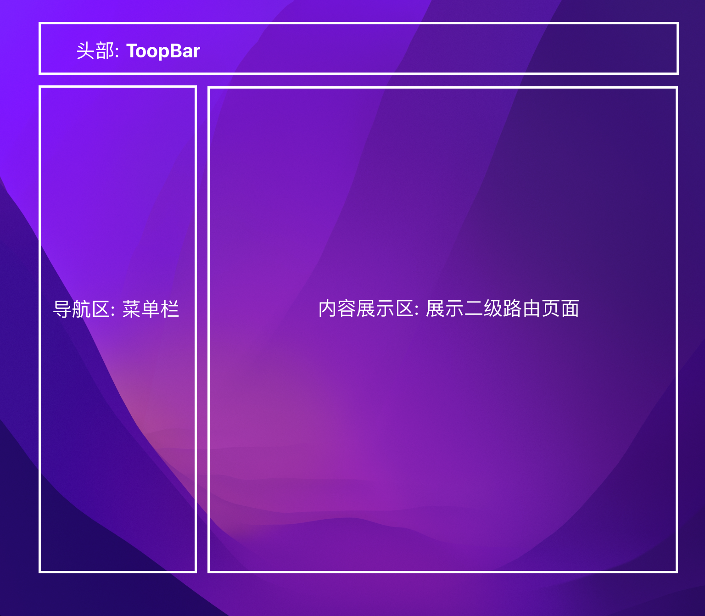
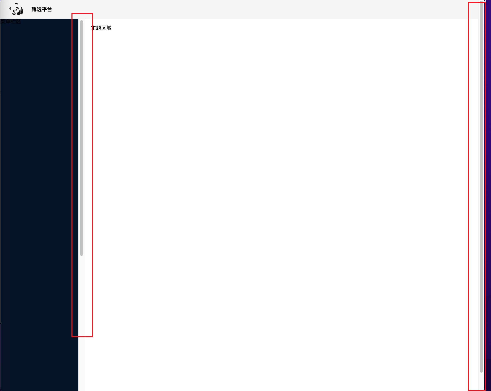

# 完整引入

### 安装
```s
# 安装 element-plus 
npm i element-plus


# 安装 element-plus 提供的图标组件库
npm i @element-plus/icons-vue
```

<br>

### 引入
引入 elementplus 插件 和 它的样式
```js
// main.ts
import { createApp } from 'vue'

// 引入 elementplus 插件 和 它的样式
import ElementPlus from 'element-plus'
import 'element-plus/dist/index.css'

import App from './App.vue'
const app = createApp(App)

app.use(ElementPlus)
app.mount('#app')
```

<br><br>

## 图标组件的使用

### 安装
```s
# 安装 element-plus 提供的图标组件库
npm i @element-plus/icons-vue
```

### 使用方式: 按需使用 标签属性
1. 组件内引入
2. 通过标签属性 ``:icon="Delete"`` 使用图标组件
```html
<script>
import { Plus } from '@element-plus/icons-vue'
</script>
<template>
  <el-button type="danger" :icon="Delete" circle />
</template>
```

<br>

### 使用方式2: 全局注册 图标组件
1. 入口文件注册
2. 组件内直接使用
```js
import * as ElementPlusIconsVue from '@element-plus/icons-vue'

const app = createApp(App)
for (const [key, component] of Object.entries(ElementPlusIconsVue)) {
  app.component(key, component)
}

<el-icon :size="size" :color="color">
  <Edit />
</el-icon>
```

<br><br>

## 国际化 配置
**elementplus默认为英语** 如果希望使用其它语言 需要配置国际化

1. 在入口文件中, 从 element-plus中引入 中文的配置文件
2. 在注册ElementPlus的时候, 传入第二个参数

```js
import zhCn from 'element-plus/dist/locale/zh-cn.mjs'

app.use(ElementPlus, {
  locale: zhCn,
})
```

<br>

### 问题:
设置国际化, 在打包的时候, 会报出 国际化 没有定义类型文件

<br>

**解决方式1:**  
让ts忽略这块的类型检查
```js
// @ts-ignore
import zhCn from 'element-plus/dist/locale/zh-cn.mjs'
```

<br>

**解决方式2:**  
声明element plus全局组件类型, 在tsconfig.json中添加如下的内容
```js
// tsconfig.json
{
  "compilerOptions": {
    // ...
    "types": ["element-plus/global"]
  }
}
```

<br><br>

# 按需引入
1. 下载依赖 
```s
npm install -D unplugin-vue-components unplugin-auto-import
```

2. 修改 vite.config.js 配置文件
```js
// vite.config.ts
import { defineConfig } from 'vite'
import AutoImport from 'unplugin-auto-import/vite'
import Components from 'unplugin-vue-components/vite'
import { ElementPlusResolver } from 'unplugin-vue-components/resolvers'

export default defineConfig({
  // ...
  plugins: [
    // ...
    AutoImport({
      resolvers: [ElementPlusResolver()],
    }),
    Components({
      resolvers: [ElementPlusResolver()],
    }),
  ],
})
```

<br><br>

# 配置别名
修改 vite.config.ts 和 tsconfig.json 文件
```js
// vite.config.ts
import {defineConfig} from 'vite'
import vue from '@vitejs/plugin-vue'
import path from 'path'
export default defineConfig({
  plugins: [vue()],
    resolve: {
      alias: {
        "@": path.resolve("./src") // 相对路径别名配置, 使用 @ 代替 src
      }
    }
  })
```

```js
// tsconfig.json
{
  "compilerOptions": {
    "baseUrl": "./", // 解析非相对模块的基地址, 默认是当前目录
    "paths": { //路径映射, 相对于baseUrl
      "@": ["src"],
      "@/*": ["./src/*"] 
    }
  }
}
```

<br><br>

# 配置环境变量
项目开发过程中, 至少会经历三个阶段
- 开发环境
- 测试环境
- 生产环境(即正式环境)

不同阶段请求的状态(如接口地址等)不尽相同, 若手动切换接口地址是相当繁琐且易出错的。

于是环境变量配置的需求就应运而生, 我们只需做简单的配置, 把环境状态切换的工作交给代码

<br>

### 开发环境（development）
顾名思义, 开发使用的环境, 每位开发人员在自己的dev分支上干活, 开发到一定程度, 同事会合并代码, 进行联调。

<br>

### 测试环境（testing）
测试同事干活的环境啦, 一般会由测试同事自己来部署, 然后在此环境进行测试

<br>

### 生产环境（production）
生产环境是指正式提供对外服务的, 一般会关掉错误报告, 打开错误日志。(正式提供给客户使用的环境。)

<br>

### 注意:
一般情况下, 一个环境对应一台服务器,也有的公司开发与测试环境是一台服务器！！！

<br>

### 步骤
1. 项目根目录分别添加 开发、生产和测试环境的文件!
```s
.env.development
.env.production
.env.test
```

2. 追加文件内容, **变量必须以 VITE_ 为前缀才能暴露给外部读取**
```s
# 变量必须以 VITE_ 为前缀才能暴露给外部读取
NODE_ENV = 'development'
VITE_APP_TITLE = '甄选运营平台'
VITE_APP_BASE_API = '/dev-api'
```

```s
NODE_ENV = 'production'
VITE_APP_TITLE = '甄选运营平台'
VITE_APP_BASE_API = '/prod-api'
```

```s
# 变量必须以 VITE_ 为前缀才能暴露给外部读取
NODE_ENV = 'test'
VITE_APP_TITLE = '甄选运营平台'
VITE_APP_BASE_API = '/test-api'
```

3. 在 package.json 中配置运行命令
```s
"scripts": {
  "dev": "vite --open",
  "build:test": "vue-tsc && vite build --mode test",
  "build:pro": "vue-tsc && vite build --mode production",
  "preview": "vite preview"
},
``` 

4. 使用配置的环境变量: 通过 ``import.meta.env`` 获取环境变量

<br><br>

# 配置 svg 图标

在开发项目的时候经常会用到svg矢量图, 而且我们使用SVG以后, 页面上加载的不再是图片资源, **这对页面性能来说是个很大的提升**

而且我们SVG文件比img要小的很多, 放在项目中几乎不占用资源。

<br>

### 1. 安装SVG依赖插件
```
npm install vite-plugin-svg-icons -D
```

<br>

### 2. 在``vite.config.ts``中配置插件

```js
// 引入svg需要用到的插件
import { createSvgIconsPlugin } from 'vite-plugin-svg-icons'
import path from 'path'
export default () => {
  return {
    plugins: [
      createSvgIconsPlugin({
        // 将来我们的svg图标需要放在 icons 文件夹中
        iconDirs: [path.resolve(process.cwd(), 'src/assets/icons')],
        symbolId: 'icon-[dir]-[name]',
      }),
    ],
  }
}
```

<br>

### 入口文件导入:
```js
import 'virtual:svg-icons-register'
```

<br>

### 使用svg
1. 去 svg 的网站上复制 svg 代码
2. 在 icons目录下 创建svg文件, 贴入上面复制的代码
3. svg图标需要使用在 ``<svg></svg>`` 标签内部, 它是图标外层容器节点
4. svg标签内部使用 ``<use></use>`` 子标签, 表示使用svg图标的意思
5. 使用 use标签的 xlink:href 属性 指明需要使用哪一个图标, href属性的值必须是以 **#icon-** 开头
```html
<!-- 调整svg的大小在svg容器节点上调节 -->
<svg stylt="width: 30px; height: 30px;">
  <!-- fill为图标的颜色 -->
  <use xlink:href="#icon-图标名" fill="red"></use>
</svg>
```

<br>

#### svg: 封装为全局组件
因为项目很多模块需要使用图标,因此把它封装为全局组件！！！

**在src/components目录下创建一个SvgIcon组件:代表如下**

```html
<script setup lang="ts">
type IconType = {
  prefix?: string
  name: string
  color: string
  width: string
  height: string
}

withDefaults(defineProps<IconType>(), {
  prefix: '#icon-',
  color: '',
  width: '16px',
  height: '16px'
})
</script>

<template>
  <svg :style="{ width: width, height: height }">
    <use :xlink:href="`${prefix}${name}`" :fill="color" />
  </svg>
</template>

<style scoped lang="scss"></style>
```

<br>

### 设置为 全局组件

**将一个组件设置为全局组件:**  
比如我们将 SvgIcon 设置为全局组件, 我们在入口文件注册
```js
import SvgIcon from '@/components/SvgIcon/index.vue'
app.component('SvgIcon', SvgIcon)
```

<br>

**将 components文件夹下的所有组件, 批量设置为全局组件**  
我们利用自定义插件, 批量设置全局组件

1. components目录下创建 index.ts 文件
2. 让 index.ts 文件对外暴露插件对象

```js
import SvgIcon from './SvgIcon/index.vue';
// 引入类型
import type { App, Component } from 'vue';

// 引入组件
const components: { [name: string]: Component } = { SvgIcon };

export default {
  install(app: App) {
    Object.keys(components).forEach((key: string) => {
      app.component(key, components[key]);
    })
  }
}
```

3. 在入口文件引入src/index.ts文件, 通过app.use方法安装自定义插件
```js
import gloablComponent from './components/index';
app.use(gloablComponent);
```

<br><br>

# 全局css样式相关

### 清除默认样式
1. 下载 reset.css 文件
2. src目录下创建 style目录
  - 创建 index.scss
  - 创建 _reset.scss 

3. 在 index.scss 中引入 _reset.css (使用@import引入 不然配合下面的全局变量设置 竟然会报错)
4. 在入口文件中 引入 index.scss 样式

<br>

### 设置 全局变量
我们在 index.scss 文件中 如果定义了 scss变量 比如 ``$color``, 这个变量也没有办法直接在组件内使用的 (除非在组件内部导入变量对应的scss文件)

所以我们可以定义一些全局变量, 这样这些变量不用在组件中导入就可以直接使用了

1. 在 styles 目录下 创建 variable.scss 这里是项目下的全局变量
2. 在 vite.config.ts 文件中添加css的配置
```js
export default defineConfig((config) => {
	css: {
      preprocessorOptions: {
        scss: {
          javascriptEnabled: true,
          // 项目中只能使用 @import
          additionalData: '@import "./src/styles/variable.scss";',

          // @use ... as *, 这样我们项目中就可以使用 @use
          additionalData: '@use "./src/styles/variable.scss" as *;'
        },
      },
    },
	}
}
```

<br><br>

# pinia 相关

### 安装
```s
npm i pinia
```

<br>

### 入口文件注册pinia
```js
import { createPinia } from 'pinia'
const pinia = createPinia()
app.use(pinia)
```

<br>

### 创建 模块 store 文件
在 /src/store/xxxStore.ts文件, 每个ts文件都是独立的一个store
```js
import { defineStore } from 'pinia'

// state的类型: 就是给state函数设置其返回值类型
type stateType = {
  count: number
}
const useLoginStore = defineStore('login', {
  state: (): stateType => {
    return {
      count: 0
    }
  }
})

export default useLoginStore
```

<br>

### 使用store
它是proxy代理对象不需要 ``.value``
```js
const loginStore = useLoginStore()

const login = () => {
  console.log(loginStore.count)
}
```

<br>

### pinia持久化
待整理

<br>

<br><br>

# mock数据
```s
# 官网配置参考
https://www.npmjs.com/package/vite-plugin-mock
https://github.com/vbenjs/vite-plugin-mock
```

<br>

### 安装依赖
```s
# 安装 2.9.6 版本的 vite-plugin-mock
npm install -D vite-plugin-mock mockjs
```

<br>

### 配置 vite.config.ts
修改 vite.config.ts 文件中 ``defineConfig()`` 方法的参数, 由一个配置对象 改写成 箭头函数
```js
export default defineConfig({ 配置项 })

// 尝试1: defineConfig 中传入箭头函数 - 报错了
export default defineConfig(() => {
  // 返回配置项
  return {
    配置项
  }
})


// 尝试2: 直接暴露出一个回调函数 没有defineConfig 没有报错
export default () => {
  // 返回配置项
  return {
    配置项
  }
}
```

<br>

**配置: 2.9.6版本的配置 最新版要参照官网**  
- command: 用于检测当前的开发环境 我们的mock接口只在开发环境下使用, 上线就不用了
  - 它的值有两种: "build" | "serve"
- ``localEnabled: command === 'serve'``: 保证开发阶段可以使用mock接口

```js
// import { defineConfig } from 'vite'
import vue from '@vitejs/plugin-vue'
import { createSvgIconsPlugin } from 'vite-plugin-svg-icons'
import path from 'path'

import { viteMockServe } from 'vite-plugin-mock'
import type { UserConfigExport, ConfigEnv } from 'vite'


// 直接暴露出去一个函数 并没有使用 defineConfig()
export default ({ command }: ConfigEnv): UserConfigExport => {
  return {
    plugins: [
      vue(),
      createSvgIconsPlugin({
        // 将来我们的svg图标需要放在 icons 文件夹中
        iconDirs: [path.resolve(process.cwd(), 'src/assets/icons')],
        symbolId: 'icon-[dir]-[name]'
      }),
      viteMockServe({
        // default
        mockPath: 'mock',
        localEnabled: command === 'serve'
      })
    ],
    resolve: {
      alias: {
        '@': path.resolve('./src') // 相对路径别名配置，使用 @ 代替 src
      }
    },
    css: {
      preprocessorOptions: {
        scss: {
          javascriptEnabled: true,
          additionalData: '@import "./src/styles/variable.scss";'
        }
      }
    }
  }
}
```

<br>

### 创建假接口
根目录下创建 mock 文件目录 存放假接口数据, 比如我们创建 /mock/user.ts

```js
// 返回一个数组, 里面有两个用户信息
function createUserList() {
  return [
    {
      userId: 1,
      avatar:
        'https://wpimg.wallstcn.com/f778738c-e4f8-4870-b634-56703b4acafe.gif',
      username: 'admin',
      password: '111111',
      desc: '平台管理员',
      roles: ['平台管理员'],
      buttons: ['cuser.detail'],
      routes: ['home'],
      token: 'Admin Token'
    },
    {
      userId: 2,
      avatar:
        'https://wpimg.wallstcn.com/f778738c-e4f8-4870-b634-56703b4acafe.gif',
      username: 'system',
      password: '111111',
      desc: '系统管理员',
      roles: ['系统管理员'],
      buttons: ['cuser.detail', 'cuser.user'],
      routes: ['home'],
      token: 'System Token'
    }
  ]
}

// 对外暴露一个数组, 里面包含了两个接口
export default [
  // 用户登录接口
  {
    //请求地址
    url: '/api/user/login',
    //请求方式
    method: 'post',
    // 这里相当于 nodejs 端的接口回调
    response: ({ body }) => {
      //获取请求体携带过来的用户名与密码
      const { username, password } = body
      //调用获取用户信息函数,用于判断是否有此用户
      const checkUser = createUserList().find(
        (item) => item.username === username && item.password === password
      )
      //没有用户返回失败信息
      if (!checkUser) {
        return { code: 201, data: { message: '账号或者密码不正确' } }
      }
      //如果有返回成功信息
      const { token } = checkUser
      return { code: 200, data: { token } }
    }
  },
  // 获取用户信息
  {
    url: '/api/user/info',
    method: 'get',
    response: (request) => {
      //获取请求头携带token
      const token = request.headers.token
      //查看用户信息是否包含有次token用户
      const checkUser = createUserList().find((item) => item.token === token)
      //没有返回失败的信息
      if (!checkUser) {
        return { code: 201, data: { message: '获取用户信息失败' } }
      }
      //如果有返回成功信息
      return { code: 200, data: { checkUser } }
    }
  }
]

```

<br>

**测试代码:**  
```js
axios({
  url: '/api/user/login',
  method: 'post',
  data: {
    username: 'admin',
    password: '111111'
  }
}).then((res) => {
  console.log(res)
})
```

<br><br>

# 二次封装 axios
在开发项目的时候避免不了与后端进行交互,因此我们需要使用axios插件实现发送网络请求。在开发项目的时候

我们经常会把axios进行二次封装。

<br>

### 目的:
1. 使用请求拦截器:  可以在请求拦截器中处理一些业务(开始进度条、请求头携带公共参数)

2. 使用响应拦截器:  可以在响应拦截器中处理一些业务(进度条结束、简化服务器返回的数据、处理http网络错误)

<br>

### 代码:
1. 利用了 env环境变量
2. 拦截器的使用
3. 响应拦截器中err回调中最后要返回一个promise, 中止promise链
```js
import axios from 'axios'
import { ElMessage } from 'element-plus'

// 1. 创建 axios 实例
const service = axios.create({
  // baseURL: /api
  baseURL: import.meta.env.VITE_APP_BASE_API,
  timeout: 5000
})

// 2. 添加请求拦截器
service.interceptors.request.use((config) => {
  // 返回配置对象
  return config
})

// 3. 添加响应拦截器
// 参数1: 成功的回调, 会将服务器返回的数据给我们
// 参数2: 失败的回调
service.interceptors.response.use(
  (res) => {
    return res.data
  },
  (err) => {
    // 一般处理http的网络错误
    const status = err.response.status
    let errorMsg = ''
    switch (status) {
      case 401:
        errorMsg = 'Token已经过期'
        break
      case 403:
        errorMsg = '无权访问'
        break
      case 404:
        errorMsg = '请求地址错误'
        break
      case 500:
        errorMsg = '服务器出现问题'
        break
      default:
        errorMsg = '网络出现问题'
        break
    }

    ElMessage({
      type: 'error',
      message: errorMsg
    })

    // 响应拦截器中的失败回调需要返回一个失败的Promise, 中止promise链条
    return Promise.reject(err)
  }
)

export default service
```

<br>

### 思考: 响应拦截器中err回调中最后要返回一个promise, 中止promise链?
在Axios中的响应拦截器中，你可以定义一个失败的回调函数，该函数会在发生请求错误时执行。在这个错误处理函数中，你通常会处理服务器返回的错误状态码（如401、403、404、500等）

然后显示相应的错误信息给用户。处理完错误后，你需要返回一个失败的Promise对象，以中止Promise链。

<br>

**为什么要中止Promise链呢？**  
在JavaScript中，Promise链式调用时，如果某个Promise被rejected（即出现错误），它会沿着Promise链一直传递，直到遇到一个``.catch()``或者一个带有错误处理回调函数的``.then()``

否则就会触发全局的unhandled promise错误，可能导致程序崩溃。

<br>

在Axios中，如果你在响应拦截器的失败回调中不返回一个失败的Promise（例如使用Promise.reject(err)）

**那么错误会继续传递下去，可能会导致你的应用程序在某个地方出现未处理的Promise rejection错误。**

为了避免这种情况，你需要在响应拦截器的失败回调中返回一个失败的Promise，这样就中止了Promise链，错误也就不会继续传递下去，你可以在链的末尾通过.catch()来处理这个错误，或者在其他地方处理这个被reject的Promise。

<br><br>

# API接口统一管理
在开发项目的时候, 接口可能很多需要统一管理。在src目录下去创建api文件夹去统一管理项目的接口

<br>

### 目的:
**api目录的目的就是统一管理项目接口**

<br>

### 目录: 
```s
| - src
  | - api 
    | - user 
      - index.ts
      - type.ts
```

<br>

**/user/type.ts**  
我们发起请求的时候 请求参数类型 和 服务器返回数据的类型 都需要定义ts的类型 我们在type.ts中定义数据类型
```js
// 登录接口: 请求参数的类型
export type loginParamType = {
  username: string
  password: string
}

// 登录接口: 响应结果的类型
type dataType = {
  token: string
}
export type loginResType = {
  code: number
  data: dataType
}

// 获取用户信息: 响应结果的类型
type userType = {
  userId: number
  avatar: string
  username: string
  password: string
  desc: string
  roles: string[]
  buttons: string[]
  routes: string[]
  token: string
}
export type userInfoType = {
  code: number
  data: {
    checkUser: userType
  }
}
```

<br>

**/user/index.ts**  
api目录下每个模块对应的请求都应该单独的存放在一个文件夹中 ``src/api/user/index.ts``  

**<font color='#C2185B'>统一管理接口的位置很好呀</font>**
```js
import service from '@/utils/request'
import type { loginParamType, loginResType, userInfoType } from './type'

// 统一管理接口
enum API {
  LOGIN_URL = '/user/login',
  USER_INFO_URL = '/user/info'
}

// 暴露 登录 的接口方法
type loginFnType = (data: loginParamType) => Promise<loginResType>
export const login: loginFnType = (data) => {
  return service.post(API.LOGIN_URL, data)
}

// 暴露 获取用户信息 的接口方法
type getUserInfoFnType = () => Promise<userInfoType>
export const getUserInfo: getUserInfoFnType = () => {
  return service.get(API.USER_INFO_URL)
}
```

<br>

**组件内测试:**  
```js
import { getUserInfo } from '@/api/user'
getUserInfo().then((res) => {
  console.log(res)
})
```

<br><br>


### 思考:


我们项目中的某些路由 我们需要在layout组件中展示 我们就应该有 menu


**1. 哪些路由是必须配置的?**  
对于后台管理系统而言 首先我们必须有一个一级路由 login

当我们输入用户名和密码之后会进入另外一个一级路由 home, 展示主页面

当我们输入的url不存在的时候 我们应该有一个404, 展示错误页面

还需要有一个任意路由, 当我们访问的是任意路由的情况下, 要重定向到404

```s
| - views
  | - 404
  | - home
  | - login
```

<br>

### 安装:
```s
npm install vue-router@4
```

<br>

### 路由结构
```s
| - router
  - routes: 常量路由
  - index: 路由配置文件
```

<br>

### 权限路由的概述
后台管理系统最重要的就是菜单的权限, 菜单的权限 需要根据 用户信息 去匹配这些路由 **动态的追加**

**所以我们需要给每一个路由添加一个命名空间 (name属性)**, 不管是几级路由必须要有name属性, 做菜单权限管理

<br>

### 管理系统页面最基本的4条路由 (常量路由)
1. login 登录
2. home(layout) 主要展示数据的页面 主页
3. 404 错误页面
4. 任意路由 当没有匹配的url的时候 会进入该路由 它负责重定向到404

其中每条路由中应该有 name 属性, 用作菜单的权限管理

```js
const routes: RouteRecordRaw[] = [
  {
    path: '/login',
    // name属性用于权限管理, 每条路由都要追加这个命名空间
    name: 'login',
    component: () => import('@/views/login/index.vue')
  },
  // 登录成功以后展示数据的路由
  {
    path: '/',
    name: 'layout',
    component: () => import('@/views/home/index.vue')
  },
  {
    path: '/404',
    name: '404',
    component: () => import('@/views/404/index.vue')
  },
  // 当上面路由都没有匹配上的时候 我们访问的路由
  {
    path: '/:pathMatch(.*)*',
    name: 'any',
    component: () => import('@/views/404/index.vue')
  }
]
```

<br>

### ``/:pathMatch(.*)*``
它是一个特殊的路由配置, 可以用于捕获任意路径并进行路由重定向
- /: 匹配根路径
- ``:pathMatch(.*)*``: 动态片段，它使用了路由参数（以冒号 : 开头），其中 pathMatch 是参数的名称, ``(.*)*`` 是参数的正则表达式模式
```js
{
  path: '/:pathMatch(.*)*',
  redirect: '/my-default-route',
  name: 'Any'
}
// 或者
{
  path: '/:pathMatch(.*)*',
  name: 'NotFound',
  component: NotFound
}
```

<br>

**routes.ts**
```js
import type { RouteRecordRaw } from 'vue-router'

export const constantRoutes: RouteRecordRaw[] = [
  {
    path: '/login',
    // name属性用于权限管理, 每条路由都要追加这个命名空间
    name: 'login',
    component: () => import('@/views/login/index.vue')
  },
  // 登录成功以后展示数据的路由
  {
    path: '/',
    name: 'layout',
    component: () => import('@/views/home/index.vue')
  },
  {
    path: '/404',
    name: '404',
    component: () => import('@/views/404/index.vue')
  },
  // 当上面路由都没有匹配上的时候 我们访问的路由
  {
    path: '/:pathMatch(.*)*',
    name: 'any',
    component: () => import('@/views/404/index.vue')
  }
]
```

<br>

**index.ts**
```js
import { createRouter, createWebHashHistory } from 'vue-router'

// 引入常量路由
import { constantRoutes } from './routes'

const router = createRouter({
  history: createWebHashHistory(),
  routes: constantRoutes,
  // 配置滚动行为
  scrollBehavior() {
    return {
      left: 0,
      top: 0
    }
  }
})

export default router
```

<br>

**App页面:**
```html
<script setup lang="ts"></script>

<template>
  <router-view></router-view>
</template>

<style scoped lang="scss"></style>
```

<br><br>

# 项目要点:

### 静态资源图片放在 /src/assets/images/ 目录下

### style中使用别名的方式
```scss
{
  background: url('@/assets/images/login_form.jpg') no-repeat;
}
```

<br>

### 封装 响应对象 中的数据类型
响应我们要知道有两种情况
1. 成功
2. 失败

它们的响应体是不一样的, 所以我们封装的 loginResType 也要包含两种情况
- 成功 { data: token }
- 失败 { data: message }
两种情况的响应体不一样, 所以我们在dateType中使用了 ``?`` 操作符
```js
type dataType = {
  token?: string
  message?: string
}
export type loginResType = {
  code: number
  data: dataType
}
```

<br>

### login功能逻辑:
**1. 填写账号 密码 发起请求**
- 登录成功 跳转到 首页 (home)
- 登录失败 弹出 登录失败 信息

用户登录成功后会返回用户登录成功的标识 token, 拿到token后 我们会使用token继续请求他相应的信息

<br>

**登录请求逻辑:**  
1. 点击登录按钮 触发回调执行
2. 回调中调用 ``loginStore.login(loginForm)`` store的actions中定义的方法, 通知actions完成发送请求的操作
3. actions中的逻辑
  1. 发送请求
  2. 将请求回来的token保存到state中
  3. 将请求回来的token保存到LocalStorage中
  4. 根据返回的code判断是登录成功还是失败
    1. 登录成功 ``return 'ok'`` 因为本身就在 async 函数中
    2. 登录失败 ``Promise.reject(new Error(res.data.message))``
4. 页面的 登录按钮回调中的 拿到 actions 方法的返回值 做判断处理 使用 try catch finally
  1. try 成功
  2. catch 失败

<br><br>

# 表单的校验
我们这里使用 elementplus form表单提供的验证机制

- 用户名: 长度 >= 5
- 密码: 长度 >= 6

表单校验中使用了 elementplus 中的功能 详见 **ElementPlus.md**    

<br>

### 完整代码:
```html
<script setup lang="ts">
import { User, Lock } from '@element-plus/icons-vue'
import { onMounted, reactive, ref } from 'vue'
import useLoginStore from '@/store/loginStore'
import { useRouter } from 'vue-router'
import { ElNotification } from 'element-plus'
import type { FormInstance } from 'element-plus'

import { getTimeRange } from '@/utils/util'

defineOptions({
  name: 'Login'
})

// 获取 router
const router = useRouter()

// 收集表单数据
type loginFormType = {
  username: string
  password: string
}
const loginForm = reactive<loginFormType>({
  username: 'admin',
  password: '111111'
})

// 表单校验的规则对象
const loginFormRules = {
  // 数组中每一个对象 即为一条验证规则
  username: [
    { required: true, message: '用户名不能为空', tigger: 'blur' },
    { min: 6, message: '用户名长度不能小于6位', trigger: 'blur' }
  ],
  password: [
    { required: true, message: '密码不能为空', tigger: 'blur' },
    { min: 6, max: 15, message: '密码长度不能小于6位', trigger: 'blur' }
  ]
}

// 获取表单实例节点
const loginFormRef = ref<FormInstance>()

// 定义变量 控制 el-button 的loading功能
let loadingFlag = ref(false)

// 获取 loginStore
const loginStore = useLoginStore()

// 登录按钮 回调
const login = async () => {
  // 点击 登录 回调 展示 el-button 的loading效果
  loadingFlag.value = true

  // 保证全部表单项检验通过后 再发起请求
  await loginFormRef.value?.validate()

  // await: 也不全是拿异步的数据, 它本身最重要的是拿promise中成功的结果
  try {
    // 1. 通知 store 发起登录请求, 调用store中的方法 (action中的)
    await loginStore.login(loginForm)
    // 请求成功: 跳转到home
    router.push('/')
    // 展示提示信息
    ElNotification({
      type: 'success',
      title: `Hello, ${getTimeRange()}好`,
      message: '欢迎回来'
    })
  } catch (err) {
    // 请求失败: 弹出登录失败信息
    ElNotification({
      type: 'error',
      // (err as Error).message
      message: (err as Error).message
    })
  } finally {
    // 不管登录
    loadingFlag.value = false
  }
}
</script>

<template>
  <section class="login-wrapper">
    <el-row>
      <!-- 正常两列一列占一半, 当 <768 的时候 左侧为0, 右侧自己占一行 -->
      <el-col :span="12" :xs="0"></el-col>
      <el-col :span="12" :xs="24">
        <div class="login-form-wrapper">
          <div class="title">
            <h2>Hello</h2>
            <h3>欢迎来到 甄选平台</h3>
          </div>
          <el-form
            ref="loginFormRef"
            size="large"
            :model="loginForm"
            :rules="loginFormRules"
          >
            <!-- 每个表单项应该放在一个 表单容器中 -->
            <el-form-item prop="username">
              <el-input
                v-model="loginForm.username"
                :prefix-icon="User"
              ></el-input>
            </el-form-item>
            <el-form-item prop="password">
              <el-input
                v-model="loginForm.password"
                type="password"
                :prefix-icon="Lock"
                show-password
              ></el-input>
            </el-form-item>
            <el-form-item>
              <el-button
                class="form-btn"
                :loading="loadingFlag"
                type="primary"
                @click="login"
                >登录</el-button
              >
            </el-form-item>
          </el-form>
        </div>
      </el-col>
    </el-row>
  </section>
</template>
```

<br><br>

# TopBar: logo组件
1. 定义了 scss 中的 @function 计算px
2. 将项目的logo和title定义在了 settings.ts 文件中
```html
<script setup lang="ts">
import commonSettings from '@/settings'
defineOptions({
  name: 'Logo'
})
</script>

<template>
  <div class="logo__container">
    <div class="logo__img">
      
    </div>
    <div class="logo__title">
      <h3>{{ commonSettings.title }}</h3>
    </div>
  </div>
</template>

<style scoped lang="scss">
@use '@/styles/utils' as g;
.logo {
  &__container {
    height: 100%;
    display: flex;
  }

  &__img {
    width: 60px;
    padding-left: 20px;

    img {
      width: auto;
      height: 100%;
      vertical-align: top;
    }
  }

  &__title {
    line-height: 60px;
    font-size: g.fs(24);
    font-weight: bold;
    padding: 0 16px;
  }
}
</style>
```

<br><br>

# SideBar 相关

## 左侧菜单栏:
我们左侧的侧边栏 其实就是导航链接, 而右侧的main区域是响应的展示区域, main区域展示的一级路由下的二级路由组件

<br>

我们左侧侧边栏区域主要用来展示导航连接, 当我们点击其中的一项的时候 会在右侧的 main 区域, 展示对应的二级路由页面

- side-bar: 属于 导航区
- main: 属于 二级路由展示区

<br><br>

# 组件划分


<br>

我们项目分为
1. 头部
2. 侧面菜单栏
3. main部分: 用于展示二级路由组件

<br>

### router-view的位置:
**Gwes:**  
1. app页面配置了 router-view 用于展示 1级路由组件
  - login页面
  - 404页面
  - 任意路由
  - layout布局组件页面
    - side-bar
    - main
    - top-bar

2. main页面中配置了 router-view 用于展示 2级路由组件
  - 通过 side-bar 中的导航链接 展示的对应的页面

<br>

**本项目:**  
1. app页面中 配置了 router-view 用于展示1级路由页面
2. 

<br><br>

## 项目全局scss变量
位置: 
```s
/src/styles/_variable.scss
```

因为我们 在 vite.config.ts 文件中添加css的配置 所以项目组件中我们可以使用里面定义好的全局变量

```scss
// layout组件: 

// 左侧菜单栏 宽度:
$base-menu-width: 260px;

// 左侧菜单栏 背景颜色:
$base-menu-bg: #001529;

// 顶部 header 的高度
$base-topbar-height: 60px;
```

<br>

### 浏览器默认滚动条的外观设置:
元素要出现滚动条很简单 在该元素的样式上添加 ``overflow: auto``
```scss
// 滚动条 宽度
::-webkit-scrollbar {
  width: 10px;
}
// 滚动条 背景色
::-webkit-scrollbar-track {
  background: $base-menu-background;
}
// 滚动条 滑块
::-webkit-scrollbar-thumb{
  width: 10px;
  background-color: yellowgreen;
  border-radius: 10px;
}
```

<br><br>

## 页面结构组件: layout
我们页面布局可以使用 element-plus 中为我们提供的 el-container 系列, 也可以使用自己定义的div来设置

我自己做练习的时候 发现 el-container 系列, 中各个子组件中都需要继承高度的问题, 很让人难受

本案例中使用的就是 el-container 系列

<br>

### 清除 el系列布局组件的 间距问题
我们布局组件使用了两个 el-container 注意下下面注释的部分
```scss
.layout {
  &__container {
    width: 100%;
    height: 100%;
    font-size: 16px;

    // 感觉布局容器没有固定高度似的
    .el-container {
      height: 100%;
    }
    // 第二个 .el-container 就不能是 100% 了 它要减去header的部分
    &__sub.el-container {
      height: calc(100% - 60px);
    }

    // 清除边距: element-plus 提供的组件都有padding 和 margin的问题
    .el-header,
    .el-aside {
      padding: 0;
      margin: 0;
    }

    .el-header {
      height: $base-topbar-height;
    }

    .el-aside {
      width: $base-menu-width;
      background: $base-menu-bg;
    }
  }
}
```

<br>

### 页面结构:
```html
<template>
  <div class="layout__container">
    <el-container>
      <el-header>Header</el-header>
      <el-container>
        <el-aside>Aside</el-aside>
        <el-main>Main</el-main>
      </el-container>
    </el-container>
  </div>
</template>
```

<br><br>

# /src/settings.ts
用于项目的 logo url, 标题 等配置文件, 这样方便我们对项目整体的配置进行修改
```js
// 用于项目 logo | title 等配置
type settingsType = {
  [_: string]: string
}

const settings: settingsType = {
  title: '甄选平台',
  logoUrl: '/src/assets/images/logo.png'
}

export default settings

```

<br>

### 注意:
当ts报错没有对应的类型声明的时候 我们需要配置下 tsconfig.json 文件 添加 paths 配置
```js
{
  "compilerOptions": {

    // 别名配置
    "baseUrl": ".", // 解析非相对模块的基地址，默认是当前目录
    "paths": { //路径映射，相对于baseUrl
      "@": ["src"],
      "@/*": ["./src/*"] 
    }
  },

}
```

<br><br>

# 路由相关
当我们在 login 页面输入用户名 和 密码正确的情况下, 我们会进入到 layout 组件(后台管理的界面)

- login 1级路由 -> layout 1级路由

<br>

## 路由 routes 设置思路

### 配置routes 方式1: 本项目
我们的 二级路由 出口(router-view), 在 layout/main 组件下的

<br>

**思考:**  
那当我们点击导航栏上的链接时, 我们的对应的页面 怎么展示在 main组件中的 router-view 中的呢? 比如
```s
| - 数据大屏

| - 权限管理 /acl
  - 角色管理 /acl/role
  - 用户管理 /acl/user
```
- 角色管理 -> 怎么展示在 main组件的 router 中的呢

<br>

**解答:**  
我们的 main组件中的 router-view 在 layout组件中, 相当于 **我们的二级路由出口在layout组件中**

我们导航菜单中的每一个一级路由, 比如(权限管理), 都对应一个 ``routes:[{}]``, 一条映射规则

我们的 权限管理 相关的``/acl/role``二级路由 是作为 ``/acl``一级路由 的 children 里面的成员出现的

我们的 ``/acl``一级路由 挂载的组件是 layout(二级路由出口), 而我们的``/acl/role``二级路由则对应会在layout的router-view中展示

<br>

**总结:**  
我们的路由是一组 kv, ``path:component``, 这个组件在哪展示, 取决于我们将该组kv(route), 写在哪里

1. 写在最外层, 则该组件的出口为 app下的router-view
2. 写在某route下的children里面, 则该组件的出口就在它父级route的router-view里
```js
{
  path: '/'
  component: Layout,
  children: [
    {
      // 该组 组件的出口为 Layout组件中的router-view里面
      path: '/acl/user',
      component: User
    }
  ]
}
```

<br>

**本项目: 组件出口的演示**
```js
// 一条映射规则
{
  path: '/acl',
  component: () => import('@/layout/index.vue'),

  // 访问 /acl 默认展示第一个 二级路由连接 /acl/user
  redirect: '/acl/user',
  children: [
    {
      path: '/acl/user',
      component: () => import('@/views/acl/user/index.vue'),
      name: 'User',
      meta: {
        title: '用户管理',
        icon: 'User',
      },
    },
    {
      path: '/acl/role',
      component: () => import('@/views/acl/role/index.vue'),
      name: 'Role',
      meta: {
        title: '角色管理',
        icon: 'UserFilled',
      },
    }
  ]
}
```

<br>

**配置routes 方式1: ecshop项目**  
我们的所有导航条连接, 也就是二级路由组件 都是在 Layout组件的 children 里面定义的, 这样它们都会在Layout组件的router-view中展示
```js
{
  path: "/",
  component: Layout,
  redirect: "/welcome",
  children: [
    {
      path:"/welcome",
      component: Welcome
    },
    {
      path:"/users",
      component: Users
    },
    {
      path:"/goods",
      component: List,
    },
    {
      path:"/goods/add",
      component: AddGoodPage
    },
    {
      path:"/orders",
      component: Order
    },
  ]
},
```

<br><br>

## SideBar: 滚动设置
当我们的side-bar区域的内容超出的时候 页面上会有滚动条, 尤其是左侧side-bar区域 和 整个屏幕都出现了 这样不好

我们希望的是当 side-bar的内容超出的时候, 它自己有滚动条, **这里我们使用 elment-plus 中的组件来解决**

```html
<!-- 不设置 height 则根据父容器高度自适应 -->
<template>
  <div class="side-bar__container">
    <!-- 滚动条 限制 side-bar 的高度, 代替浏览器原生的滚动条 -->
    <el-scrollbar>
      <p v-for="item in 20" :key="item" class="scrollbar-demo-item">{{ item }}</p>
    </el-scrollbar>
  </div>
</template>
```

使用方式见 ElementPlus.md 文档

<br>

### 现象:


<br><br>

# SideBar: Menu递归导航菜单 相关
el-menu菜单的使用方式 详见 ElementPlus.md 文档

<br>

### 递归组件的要点
菜单项要封装成 组件, 因为后续要进行递归调用

下面是页面菜单部分的**静态搭建**

```html
<el-scrollbar>
  <el-menu background-color="#001529" text-color="#fff">
    <MenuItem />
  </el-menu>
</el-scrollbar>
```

<br><br>

**MenuItem组件:**
```html
<template>
  <el-menu-item index="1">
    <template #title>
      <el-icon><location /></el-icon>
      <span>首页</span>
    </template>
  </el-menu-item>
  <el-menu-item index="2">
    <template #title>
      <el-icon><location /></el-icon>
      <span>数据大屏</span>
    </template>
  </el-menu-item>
  <el-sub-menu index="3">
    <template #title>
      <el-icon><location /></el-icon>
      <span>权限管理</span>
    </template>
    <el-menu-item index="3-1">用户管理</el-menu-item>
    <el-menu-item index="3-2">角色管理</el-menu-item>
    <el-menu-item index="3-3">菜单管理</el-menu-item>
  </el-sub-menu>
</template>
```

<br><br>

## SideBar: 根据 routes 动态生成 菜单
我们目前有的 常量路由 的 基础路由 如下
- login
- 404
- 任意
- layout: 管理平台页面

```js
const routes: RouteRecordRaw[] = [
  {
    path: '/login',
    // name属性用于权限管理, 每条路由都要追加这个命名空间
    name: 'login',
    component: () => import('@/views/login/index.vue')
  },
  // 登录成功以后展示数据的路由
  {
    path: '/',
    name: 'layout',
    component: () => import('@/views/home/index.vue')
  },
  {
    path: '/404',
    name: '404',
    component: () => import('@/views/404/index.vue')
  },
  // 当上面路由都没有匹配上的时候 我们访问的路由
  {
    path: '/:pathMatch(.*)*',
    name: 'any',
    component: () => import('@/views/404/index.vue')
  }
]
```

<br>

新增一下 权限管理 和 角色管理 的一级和它们对应的二级路由组件
```js
import type { RouteRecordRaw } from 'vue-router'

export const constantRoutes: RouteRecordRaw[] = [
  {
    path: '/login',
    // name属性用于权限管理, 每条路由都要追加这个命名空间
    name: 'Login',
    component: () => import('@/views/login/index.vue'),
    meta: {
      title: '登录',
      hidden: true,
      icon: ''
    }
  },
  // 登录成功以后展示数据的路由
  {
    path: '/',
    name: 'Layout',
    component: () => import('@/views/layout/index.vue'),
    meta: {
      title: '',
      hidden: false,
      icon: ''
    },
    // layou组件的默认页面
    redirect: '/home',
    children: [
      {
        path: '/home',
        component: () => import('@/views/home/index.vue'),
        meta: {
          title: '首页',
          hidden: false,
          icon: 'HomeFilled'
        }
      }
    ]
  },
  {
    path: '/404',
    name: '404',
    component: () => import('@/views/404/index.vue'),
    meta: {
      title: '404',
      hidden: true,
      icon: 'DocumentDelete'
    }
  },
  {
    path: '/screen',
    component: () => import('@/views/screen/index.vue'),
    name: 'Screen',
    meta: {
      hidden: false,
      title: '数据大屏',
      icon: 'Platform'
    }
  },
  // 当上面路由都没有匹配上的时候 我们访问的路由
  {
    path: '/:pathMatch(.*)*',
    name: 'Any',
    component: () => import('@/views/404/index.vue'),
    meta: {
      title: '任意路由',
      hidden: true,
      icon: 'DataLine'
    }
  },
  // gwes demo
  // {
  //   path: '/demo',
  //   name: 'Demo',
  //   component: () => import('@/views/demo/index.vue')
  // },
  // 权限管理路由
  {
    path: '/acl',
    // component 使用 layout中的路由出口
    component: () => import('@/views/layout/index.vue'),
    name: 'Acl',
    meta: {
      title: '权限管理',
      icon: 'Lock'
    },
    redirect: '/acl/user',
    children: [
      {
        path: 'user',
        component: () => import('@/views/acl/user/index.vue'),
        name: 'User',
        meta: {
          title: '用户管理',
          icon: 'User'
        }
      },
      {
        path: 'role',
        component: () => import('@/views/acl/role/index.vue'),
        name: 'Role',
        meta: {
          title: '角色管理',
          icon: 'UserFilled'
        }
      },
      {
        path: 'permission',
        component: () => import('@/views/acl/permission/index.vue'),
        name: 'Permission',
        meta: {
          title: '菜单管理',
          icon: 'Monitor'
        }
      }
    ]
  },
  {
    path: '/product',
    component: () => import('@/views/layout/index.vue'),
    name: 'Product',
    meta: {
      title: '商品管理',
      icon: 'Goods'
    },
    redirect: '/product/trademark',
    children: [
      {
        path: 'trademark',
        component: () => import('@/views/product/trademark/index.vue'),
        name: 'Trademark',
        meta: {
          title: '品牌管理',
          icon: 'ShoppingCartFull'
        }
      },
      {
        path: 'attr',
        component: () => import('@/views/product/attr/index.vue'),
        name: 'Attr',
        meta: {
          title: '属性管理',
          icon: 'ChromeFilled'
        }
      },
      {
        path: 'spu',
        component: () => import('@/views/product/spu/index.vue'),
        name: 'Spu',
        meta: {
          title: 'SPU管理',
          icon: 'Calendar'
        }
      },
      {
        path: 'sku',
        component: () => import('@/views/product/sku/index.vue'),
        name: 'Sku',
        meta: {
          title: 'SKU管理',
          icon: 'Orange'
        }
      }
    ]
  }
]
```

<br>

### 将上面的路由表保存到 store 中
这样以后其他组件可以拿到该 路由表 进行使用
```js
import { defineStore } from 'pinia'
import type { RouteRecordRaw } from 'vue-router'
import { constantRoutes } from '@/router/routes'

type stateType = {
  meunRoutes: RouteRecordRaw[]
}
const useRoutesStore = defineStore('routes', {
  state: (): stateType => {
    return {
      meunRoutes: constantRoutes
    }
  }
})

export default useRoutesStore
```

<br>

**要点:**  
因为我们要递归调用 MenuItem 组件, 所以应该是 **MenuItem的父组件** 拿到 routes路由列表 然后 **通过props传递给MenuItem组件**

<br>

### 递归组件的总结要点:

**Gwes的菜单栏:**  
gwes的菜单栏 都是拥有子菜单的菜单栏

```html
<template>
  <template v-for="item in props.list" :key="item.path">
    <el-menu-item
      v-if="item.children.length === 0"
      :index="item.path"
      @click="changePage"
    >
      <template #title> {{ item.meta.title }}</template>
    </el-menu-item>

    <!-- 其它情况, 如果 route 有 children 且 children.length > 1 我们使用带有折叠的菜单组件 -->
    <el-sub-menu
      :index="item.path"
      v-else-if="item.hasSubMenu && item.children.length > 0"
    >
      <template #title> {{ item.meta.title }}</template>
      <!-- 递归调用 -->
      <MenuItem :list="item.children" />
    </el-sub-menu>
  </template>
</template>
```

<br>

**本项目:**    
本项目的菜单栏, 有一级菜单栏 和 二级菜单栏
```html
<script setup lang="ts">
import { RouteRecordRaw } from 'vue-router'
defineOptions({
  name: 'AppMenu'
})

type propsType = {
  menuList: RouteRecordRaw[]
}
// ToDo: 路由列表的类型怎么定义
// 要不我们就直接定义: defineProps(['menuList'])
const props = withDefaults(defineProps<propsType>(), {
  menuList: () => [] as RouteRecordRaw[]
})
</script>

<template>
  <!-- 因为要遍历多个结构, 所以我们遍历 template -->
  <template v-for="item in props.menuList" :key="item.path">

    <!-- 外层template判断 出口条件 -->
    <!-- 递归出口1: 菜单项没有子菜单 使用 el-menu-item -->
    <template v-if="!item.children">
      <!-- 内层根据hidden判断是否需要渲染 -->
      <el-menu-item v-if="!item.meta?.hidden" :index="item.path">
        <template #title>
          <el-icon>
            <!-- 展示组件的话 使用 component is -->
            <component :is="item.meta?.icon" />
          </el-icon>
          <span>{{ item.meta?.title }}</span>
        </template>
      </el-menu-item>
    </template>

    <!-- 递归出口2: 菜单项有子菜单 但只有一个 使用 el-menu-item -->
    <template v-if="item.children && item.children.length === 1">
      <el-menu-item
        v-if="!item.children[0].meta?.hidden"
        :index="item.children[0].path"
      >
        <template #title>
          <el-icon>
            <component :is="item.children[0].meta?.icon" />
          </el-icon>
          <span>{{ item.children[0].meta?.title }}</span>
        </template>
      </el-menu-item>
    </template>

    <!-- 其它情况: 菜单项有子菜单 内部递归调用 -->
    <el-sub-menu
      v-if="item.children && item.children.length > 1"
      :index="item.path"
    >
      <template #title>
        <el-icon>
          <component :is="item.meta?.icon" />
        </el-icon>
        <span>{{ item.meta?.title }}</span>
      </template>
      <!-- 递归调用 -->
      <AppMenu :menuList="item.children" />
    </el-sub-menu>
  </template>
</template>
<style scoped lang="scss"></style>
```

<br>

**总结:**  
因为是递归, 所以我们要写好 只有一层的菜单项 我们怎么展示 **也就是递归出口**
```js
<el-menu-item
  v-if="item.children.length === 0"
  :index="item.path"
  @click="changePage"
>
  <template #title> {{ item.meta.title }}</template>
</el-menu-item>
```

<br>

然后剩下的根据实际的需求 我们考虑是否添加其它的出口, 如果没有则剩下的都是用于子菜单的, 那我们就使用 el-sub-menu 里面进行递归调用
```html
<el-sub-menu
  :index="item.path"
  v-else-if="item.hasSubMenu && item.children.length > 0"
>
  <template #title> {{ item.meta.title }}</template>
  <!-- 递归调用 -->
  <MenuItem :list="item.children" />
</el-sub-menu>
```

<br><br>

## 要点: 利用meta设置菜单项的名称 和 该条路由是否展示
并不是所有的 常量路由表 中的路由都需要显示, 比如登录 404页面的路由就不需要

所以我们要告诉menu组件 哪些路由在循环渲染的时候不需要展示, 我们在 route的meta下添加 hidden 属性

```js
meta: {
  title: '登录',
  hidden: true
}
```

修改Menu组件, 将每个分支放入到一个template中, 这个外层的template用于判断有没有children
```html
<template>
    
    <template
      v-for="(item, index) in menuList"
      :key="item.path"
    >
      <!-- 将每个分支放到一个template中, 外层template判断是否有children -->
      <template v-if="!item.children">
        <!-- 分支1: 没有子路由 -->
        <el-menu-item
          // 内层的if用于判断hiddren 该条路由是否需要展示 
          v-if="!item.meta.hidden"
          :index="item.path"
        >
          <template #title>
            {{ item.meta.title }}
          </template>
        </el-menu-item>
      </template>
      
      <!-- 外层加入template -->
      <template v-if="item.children && item.children.length === 1">
        <!-- 分支2: 有一个孩子 -->
        <el-menu-item
          :index="item.children[0].path"
          v-if="!item.children[0].meta.hidden"
        >
          <template #title>
            {{ item.children[0].meta.title }}
          </template>
        </el-menu-item>
      </template>
      
      
      <!-- 其它情况, 不需要添加template了 因为有子菜单的都是需要展示的 -->
      <el-sub-menu
        :index="item.path"
        v-if="item.children && item.children.length > 1"
      >
        <template #title>
          {{ item.meta.title }}
        </template>
        <!-- 递归调用 -->
        <Menu :menuList="item.children" />
      </el-sub-menu>
    </template>

</template>
```

<br><br>

## 要点: 动态添加 菜单项 前面的icon
1. 将 element puls 中的 ``icon`` 变成全局组件
```js
import SvgIcon from './SvgIcon/index.vue'
import type { App, Component } from 'vue'


// 引入所有的elementplus图标: ElementPlusIconsVue是一个对象, 它里面有200多个组件 key是组件的名字 value为组件对象
import * as ElementPlusIconsVue from '@element-plus/icons-vue'


const components: { [name: string]: Component } = { SvgIcon }
export default {
  install(app: App) {
    Object.keys(components).forEach((key: string) => {
      app.component(key, components[key])
    })


    // 将elementplus提供的图标注册为去全局组件
    for (const [key, component] of Object.entries(ElementPlusIconsVue)) {
      app.component(key, component)
    }
  }
}
```

2. 在router.ts中的每个route中的meta项里面 追加 icon 属性
```js
meta: {
  title:
  hidden:

  icon: '只需要写elementplus 图标组件名即可'
}
```

3. 利用meta中的icon信息生成 图标
```html
<el-menu-item
  v-if="!item.meta.hidden"
  :index="item.path"
>
  <template #title>
    <el-icon>
      <!-- 动态组件 -->
      <component :is="item.meta.icon"></component>
    </el-icon>
    {{ item.meta.title }}
  </template>
</el-menu-item>
```

<br><br>

## 要点: 点击菜单项 需要路由跳转
每一个 ``el-menu-item`` 上都有点击事件 (``el-sub-menu``折叠的这种没有)

``el-menu-item`` 身上有点击事件, 回调参数中会注入 ``el-menu-item``实例 该对象中有 ``index`` 属性就是我们要跳转的路径

```html
<template v-if="!item.children">
  <el-menu-item
    v-if="!item.meta.hidden"
    :index="item.path"

    // 绑定click事件
    @click="goRoute"
  >
    <template #title>
      {{ item.meta.title }}
    </template>
  </el-menu-item>
</template>


<script>
  const goRoute = (item) => {
    console.log(item)
    /*
      Proxy {
        index: '/login',
        ...
      }
    */
    router.push(item.index)
  }
</script>
```

<br><br>
