# 完整引入

### 安装
```s
# 安装 element-plus 
npm i element-plus


# 安装 element-plus 提供的图标组件库
npm i @element-plus/icons-vue
```

<br>

### 引入
引入 elementplus 插件 和 它的样式
```js
// main.ts
import { createApp } from 'vue'

// 引入 elementplus 插件 和 它的样式
import ElementPlus from 'element-plus'
import 'element-plus/dist/index.css'

import App from './App.vue'
const app = createApp(App)

app.use(ElementPlus)
app.mount('#app')
```

<br><br>

## ElementPlus 类型文件问题
当我们在运行 npm run build 打包的时候, 发现了如下的错误


```s
Entry point of type library 'element-plus/global' specified in compilerOptions
```


原因是因为我们将 typescript的版本由4 -> 5所以报的错 具体的可以先参照下面的网站


```s
https://github.com/element-plus/element-plus/issues/12119
https://blog.51cto.com/echohye/6367849
```


**对应方式:**  
我们将 types 配置项中的 `element-plus/global` 部分 修改为 `element-plus/global.d.ts`


```js
{
  "extends": "@vue/tsconfig/tsconfig.dom.json",
  "compilerOptions": {
    "types": ["element-plus/global.d.ts"],
    "baseUrl": ".",
    "paths": {
      "@/*": ["src/*"],
      "vuex": ["./node_modules/vuex/types"],
      "vite-plugin-eslint": ["./node_modules/vite-plugin-eslint/"]
    }
  }
}
```


当 ElementPlus 版本升级的时候 记得要改回来


<br><br>

## 图标组件的使用

### 安装
```s
# 安装 element-plus 提供的图标组件库
npm i @element-plus/icons-vue
```

### 使用方式: 按需使用 标签属性
1. 组件内引入
2. 通过标签属性 ``:icon="Delete"`` 使用图标组件
```html
<script>
import { Plus } from '@element-plus/icons-vue'
</script>
<template>
  <el-button type="danger" :icon="Delete" circle />
</template>
```

<br>

### 使用方式2: 全局注册 图标组件
1. 入口文件注册
2. 组件内直接使用
```js
import * as ElementPlusIconsVue from '@element-plus/icons-vue'

const app = createApp(App)
for (const [key, component] of Object.entries(ElementPlusIconsVue)) {
  app.component(key, component)
}

<el-icon :size="size" :color="color">
  <Edit />
</el-icon>
```

<br><br>

## 国际化 配置
**elementplus默认为英语** 如果希望使用其它语言 需要配置国际化

1. 在入口文件中, 从 element-plus中引入 中文的配置文件
2. 在注册ElementPlus的时候, 传入第二个参数

```js
import zhCn from 'element-plus/dist/locale/zh-cn.mjs'

app.use(ElementPlus, {
  locale: zhCn,
})
```

<br>

### 问题:
设置国际化, 在打包的时候, 会报出 国际化 没有定义类型文件

<br>

**解决方式1:**  
让ts忽略这块的类型检查
```js
// @ts-ignore
import zhCn from 'element-plus/dist/locale/zh-cn.mjs'
```

<br>

**解决方式2:**  
声明element plus全局组件类型, 在tsconfig.json中添加如下的内容
```js
// tsconfig.json
{
  "compilerOptions": {
    // ...
    "types": ["element-plus/global"]
  }
}
```

<br><br>

# 按需引入
1. 下载依赖 
```s
npm install -D unplugin-vue-components unplugin-auto-import
```

2. 修改 vite.config.js 配置文件
```js
// vite.config.ts
import { defineConfig } from 'vite'
import AutoImport from 'unplugin-auto-import/vite'
import Components from 'unplugin-vue-components/vite'
import { ElementPlusResolver } from 'unplugin-vue-components/resolvers'

export default defineConfig({
  // ...
  plugins: [
    // ...
    AutoImport({
      resolvers: [ElementPlusResolver()],
    }),
    Components({
      resolvers: [ElementPlusResolver()],
    }),
  ],
})
```

<br><br>

# 配置别名
修改 vite.config.ts 和 tsconfig.json 文件
```js
// vite.config.ts
import {defineConfig} from 'vite'
import vue from '@vitejs/plugin-vue'
import path from 'path'
export default defineConfig({
  plugins: [vue()],
    resolve: {
      alias: {
        "@": path.resolve("./src") // 相对路径别名配置, 使用 @ 代替 src
      }
    }
  })
```

```js
// tsconfig.json
{
  "compilerOptions": {
    "baseUrl": "./", // 解析非相对模块的基地址, 默认是当前目录
    "paths": { //路径映射, 相对于baseUrl
      "@": ["src"],
      "@/*": ["./src/*"] 
    }
  }
}
```

<br><br>

# 配置环境变量
项目开发过程中, 至少会经历三个阶段
- 开发环境
- 测试环境
- 生产环境(即正式环境)

不同阶段请求的状态(如接口地址等)不尽相同, 若手动切换接口地址是相当繁琐且易出错的。

于是环境变量配置的需求就应运而生, 我们只需做简单的配置, 把环境状态切换的工作交给代码

<br>

### 开发环境（development）
顾名思义, 开发使用的环境, 每位开发人员在自己的dev分支上干活, 开发到一定程度, 同事会合并代码, 进行联调。

<br>

### 测试环境（testing）
测试同事干活的环境啦, 一般会由测试同事自己来部署, 然后在此环境进行测试

<br>

### 生产环境（production）
生产环境是指正式提供对外服务的, 一般会关掉错误报告, 打开错误日志。(正式提供给客户使用的环境。)

<br>

### 注意:
一般情况下, 一个环境对应一台服务器,也有的公司开发与测试环境是一台服务器！！！

<br>

### 步骤
1. 项目根目录分别添加 开发、生产和测试环境的文件!
```s
.env.development
.env.production
.env.test
```

2. 追加文件内容, **变量必须以 VITE_ 为前缀才能暴露给外部读取**
```s
# 变量必须以 VITE_ 为前缀才能暴露给外部读取
NODE_ENV = 'development'
VITE_APP_TITLE = '甄选运营平台'
VITE_APP_BASE_API = '/dev-api'
```

```s
NODE_ENV = 'production'
VITE_APP_TITLE = '甄选运营平台'
VITE_APP_BASE_API = '/prod-api'
```

```s
# 变量必须以 VITE_ 为前缀才能暴露给外部读取
NODE_ENV = 'test'
VITE_APP_TITLE = '甄选运营平台'
VITE_APP_BASE_API = '/test-api'
```

3. 在 package.json 中配置运行命令
```s
"scripts": {
  "dev": "vite --open",
  "build:test": "vue-tsc && vite build --mode test",
  "build:pro": "vue-tsc && vite build --mode production",
  "preview": "vite preview"
},
``` 

4. 使用配置的环境变量: 通过 ``import.meta.env`` 获取环境变量

<br><br>

# 配置 svg 图标

在开发项目的时候经常会用到svg矢量图, 而且我们使用SVG以后, 页面上加载的不再是图片资源, **这对页面性能来说是个很大的提升**

而且我们SVG文件比img要小的很多, 放在项目中几乎不占用资源。

<br>

### 1. 安装SVG依赖插件
```
npm install vite-plugin-svg-icons -D
```

<br>

### 2. 在``vite.config.ts``中配置插件

```js
// 引入svg需要用到的插件
import { createSvgIconsPlugin } from 'vite-plugin-svg-icons'
import path from 'path'
export default () => {
  return {
    plugins: [
      createSvgIconsPlugin({
        // 将来我们的svg图标需要放在 icons 文件夹中
        iconDirs: [path.resolve(process.cwd(), 'src/assets/icons')],
        symbolId: 'icon-[dir]-[name]',
      }),
    ],
  }
}
```

<br>

### 入口文件导入:
```js
import 'virtual:svg-icons-register'
```

<br>

### 使用svg
1. 去 svg 的网站上复制 svg 代码
2. 在 icons目录下 创建svg文件, 贴入上面复制的代码
3. svg图标需要使用在 ``<svg></svg>`` 标签内部, 它是图标外层容器节点
4. svg标签内部使用 ``<use></use>`` 子标签, 表示使用svg图标的意思
5. 使用 use标签的 xlink:href 属性 指明需要使用哪一个图标, href属性的值必须是以 **#icon-** 开头
```html
<!-- 调整svg的大小在svg容器节点上调节 -->
<svg stylt="width: 30px; height: 30px;">
  <!-- fill为图标的颜色 -->
  <use xlink:href="#icon-图标名" fill="red"></use>
</svg>
```

<br>

#### svg: 封装为全局组件
因为项目很多模块需要使用图标,因此把它封装为全局组件！！！

**在src/components目录下创建一个SvgIcon组件:代表如下**

```html
<script setup lang="ts">
type IconType = {
  prefix?: string
  name: string
  color: string
  width: string
  height: string
}

withDefaults(defineProps<IconType>(), {
  prefix: '#icon-',
  color: '',
  width: '16px',
  height: '16px'
})
</script>

<template>
  <svg :style="{ width: width, height: height }">
    <use :xlink:href="`${prefix}${name}`" :fill="color" />
  </svg>
</template>

<style scoped lang="scss"></style>
```

<br>

### 设置为 全局组件

**将一个组件设置为全局组件:**  
比如我们将 SvgIcon 设置为全局组件, 我们在入口文件注册
```js
import SvgIcon from '@/components/SvgIcon/index.vue'
app.component('SvgIcon', SvgIcon)
```

<br>

**将 components文件夹下的所有组件, 批量设置为全局组件**  
我们利用自定义插件, 批量设置全局组件

1. components目录下创建 index.ts 文件
2. 让 index.ts 文件对外暴露插件对象

```js
import SvgIcon from './SvgIcon/index.vue';
// 引入类型
import type { App, Component } from 'vue';

// 引入组件
const components: { [name: string]: Component } = { SvgIcon };

export default {
  install(app: App) {
    Object.keys(components).forEach((key: string) => {
      app.component(key, components[key]);
    })
  }
}
```

3. 在入口文件引入src/index.ts文件, 通过app.use方法安装自定义插件
```js
import gloablComponent from './components/index';
app.use(gloablComponent);
```

<br><br>

# 全局css样式相关

### 清除默认样式
1. 下载 reset.css 文件
2. src目录下创建 style目录
  - 创建 index.scss
  - 创建 _reset.scss 

3. 在 index.scss 中引入 _reset.css (使用@import引入 不然配合下面的全局变量设置 竟然会报错)
4. 在入口文件中 引入 index.scss 样式

<br>

### 设置 全局变量
我们在 index.scss 文件中 如果定义了 scss变量 比如 ``$color``, 这个变量也没有办法直接在组件内使用的 (除非在组件内部导入变量对应的scss文件)

所以我们可以定义一些全局变量, 这样这些变量不用在组件中导入就可以直接使用了

1. 在 styles 目录下 创建 variable.scss 这里是项目下的全局变量
2. 在 vite.config.ts 文件中添加css的配置
```js
export default defineConfig((config) => {
	css: {
      preprocessorOptions: {
        scss: {
          javascriptEnabled: true,
          // 项目中只能使用 @import
          additionalData: '@import "./src/styles/variable.scss";',

          // @use ... as *, 这样我们项目中就可以使用 @use
          additionalData: '@use "./src/styles/variable.scss" as *;'
        },
      },
    },
	}
}
```

<br><br>

# pinia 相关

### 安装
```s
npm i pinia
```

<br>

### 入口文件注册pinia
```js
import { createPinia } from 'pinia'
const pinia = createPinia()
app.use(pinia)
```

<br>

### 创建 模块 store 文件
在 /src/store/xxxStore.ts文件, 每个ts文件都是独立的一个store
```js
import { defineStore } from 'pinia'

// state的类型: 就是给state函数设置其返回值类型
type stateType = {
  count: number
}
const useLoginStore = defineStore('login', {
  state: (): stateType => {
    return {
      count: 0
    }
  }
})

export default useLoginStore
```

<br>

### 使用store
它是proxy代理对象不需要 ``.value``
```js
const loginStore = useLoginStore()

const login = () => {
  console.log(loginStore.count)
}
```

<br>

### pinia持久化
待整理

<br>

<br><br>

# mock数据
```s
# 官网配置参考
https://www.npmjs.com/package/vite-plugin-mock
https://github.com/vbenjs/vite-plugin-mock
```

<br>

### 安装依赖
```s
# 安装 2.9.6 版本的 vite-plugin-mock
npm install -D vite-plugin-mock mockjs
```

<br>

### 配置 vite.config.ts
修改 vite.config.ts 文件中 ``defineConfig()`` 方法的参数, 由一个配置对象 改写成 箭头函数
```js
export default defineConfig({ 配置项 })

// 尝试1: defineConfig 中传入箭头函数 - 报错了
export default defineConfig(() => {
  // 返回配置项
  return {
    配置项
  }
})


// 尝试2: 直接暴露出一个回调函数 没有defineConfig 没有报错
export default () => {
  // 返回配置项
  return {
    配置项
  }
}
```

<br>

**配置: 2.9.6版本的配置 最新版要参照官网**  
- command: 用于检测当前的开发环境 我们的mock接口只在开发环境下使用, 上线就不用了
  - 它的值有两种: "build" | "serve"
- ``localEnabled: command === 'serve'``: 保证开发阶段可以使用mock接口

```js
// import { defineConfig } from 'vite'
import vue from '@vitejs/plugin-vue'
import { createSvgIconsPlugin } from 'vite-plugin-svg-icons'
import path from 'path'

import { viteMockServe } from 'vite-plugin-mock'
import type { UserConfigExport, ConfigEnv } from 'vite'


// 直接暴露出去一个函数 并没有使用 defineConfig()
export default ({ command }: ConfigEnv): UserConfigExport => {
  return {
    plugins: [
      vue(),
      createSvgIconsPlugin({
        // 将来我们的svg图标需要放在 icons 文件夹中
        iconDirs: [path.resolve(process.cwd(), 'src/assets/icons')],
        symbolId: 'icon-[dir]-[name]'
      }),
      viteMockServe({
        // default
        mockPath: 'mock',
        localEnabled: command === 'serve'
      })
    ],
    resolve: {
      alias: {
        '@': path.resolve('./src') // 相对路径别名配置，使用 @ 代替 src
      }
    },
    css: {
      preprocessorOptions: {
        scss: {
          javascriptEnabled: true,
          additionalData: '@import "./src/styles/variable.scss";'
        }
      }
    }
  }
}
```

<br>

### 创建假接口
根目录下创建 mock 文件目录 存放假接口数据, 比如我们创建 /mock/user.ts

```js
// 返回一个数组, 里面有两个用户信息
function createUserList() {
  return [
    {
      userId: 1,
      avatar:
        'https://wpimg.wallstcn.com/f778738c-e4f8-4870-b634-56703b4acafe.gif',
      username: 'admin',
      password: '111111',
      desc: '平台管理员',
      roles: ['平台管理员'],
      buttons: ['cuser.detail'],
      routes: ['home'],
      token: 'Admin Token'
    },
    {
      userId: 2,
      avatar:
        'https://wpimg.wallstcn.com/f778738c-e4f8-4870-b634-56703b4acafe.gif',
      username: 'system',
      password: '111111',
      desc: '系统管理员',
      roles: ['系统管理员'],
      buttons: ['cuser.detail', 'cuser.user'],
      routes: ['home'],
      token: 'System Token'
    }
  ]
}

// 对外暴露一个数组, 里面包含了两个接口
export default [
  // 用户登录接口
  {
    //请求地址
    url: '/api/user/login',
    //请求方式
    method: 'post',
    // 这里相当于 nodejs 端的接口回调
    response: ({ body }) => {
      //获取请求体携带过来的用户名与密码
      const { username, password } = body
      //调用获取用户信息函数,用于判断是否有此用户
      const checkUser = createUserList().find(
        (item) => item.username === username && item.password === password
      )
      //没有用户返回失败信息
      if (!checkUser) {
        return { code: 201, data: { message: '账号或者密码不正确' } }
      }
      //如果有返回成功信息
      const { token } = checkUser
      return { code: 200, data: { token } }
    }
  },
  // 获取用户信息
  {
    url: '/api/user/info',
    method: 'get',
    response: (request) => {
      //获取请求头携带token
      const token = request.headers.token
      //查看用户信息是否包含有次token用户
      const checkUser = createUserList().find((item) => item.token === token)
      //没有返回失败的信息
      if (!checkUser) {
        return { code: 201, data: { message: '获取用户信息失败' } }
      }
      //如果有返回成功信息
      return { code: 200, data: { checkUser } }
    }
  }
]

```

<br>

**测试代码:**  
```js
axios({
  url: '/api/user/login',
  method: 'post',
  data: {
    username: 'admin',
    password: '111111'
  }
}).then((res) => {
  console.log(res)
})
```

<br><br>

# 二次封装 axios
在开发项目的时候避免不了与后端进行交互,因此我们需要使用axios插件实现发送网络请求。在开发项目的时候

我们经常会把axios进行二次封装。

<br>

### 目的:
1. 使用请求拦截器:  可以在请求拦截器中处理一些业务(开始进度条、请求头携带公共参数)

2. 使用响应拦截器:  可以在响应拦截器中处理一些业务(进度条结束、简化服务器返回的数据、处理http网络错误)

<br>

### 代码:
1. 利用了 env环境变量
2. 拦截器的使用
3. 响应拦截器中err回调中最后要返回一个promise, 中止promise链
```js
import axios from 'axios'
import { ElMessage } from 'element-plus'

// 1. 创建 axios 实例
const service = axios.create({
  // baseURL: /api
  baseURL: import.meta.env.VITE_APP_BASE_API,
  timeout: 5000
})

// 2. 添加请求拦截器
service.interceptors.request.use((config) => {
  // 返回配置对象
  return config
})

// 3. 添加响应拦截器
// 参数1: 成功的回调, 会将服务器返回的数据给我们
// 参数2: 失败的回调
service.interceptors.response.use(
  (res) => {
    return res.data
  },
  (err) => {
    // 一般处理http的网络错误
    const status = err.response.status
    let errorMsg = ''
    switch (status) {
      case 401:
        errorMsg = 'Token已经过期'
        break
      case 403:
        errorMsg = '无权访问'
        break
      case 404:
        errorMsg = '请求地址错误'
        break
      case 500:
        errorMsg = '服务器出现问题'
        break
      default:
        errorMsg = '网络出现问题'
        break
    }

    ElMessage({
      type: 'error',
      message: errorMsg
    })

    // 响应拦截器中的失败回调需要返回一个失败的Promise, 中止promise链条
    return Promise.reject(err)
  }
)

export default service
```

<br>

### 思考: 响应拦截器中err回调中最后要返回一个promise, 中止promise链?
在Axios中的响应拦截器中，你可以定义一个失败的回调函数，该函数会在发生请求错误时执行。在这个错误处理函数中，你通常会处理服务器返回的错误状态码（如401、403、404、500等）

然后显示相应的错误信息给用户。处理完错误后，你需要返回一个失败的Promise对象，以中止Promise链。

<br>

**为什么要中止Promise链呢？**  
在JavaScript中，Promise链式调用时，如果某个Promise被rejected（即出现错误），它会沿着Promise链一直传递，直到遇到一个``.catch()``或者一个带有错误处理回调函数的``.then()``

否则就会触发全局的unhandled promise错误，可能导致程序崩溃。

<br>

在Axios中，如果你在响应拦截器的失败回调中不返回一个失败的Promise（例如使用Promise.reject(err)）

**那么错误会继续传递下去，可能会导致你的应用程序在某个地方出现未处理的Promise rejection错误。**

为了避免这种情况，你需要在响应拦截器的失败回调中返回一个失败的Promise，这样就中止了Promise链，错误也就不会继续传递下去，你可以在链的末尾通过.catch()来处理这个错误，或者在其他地方处理这个被reject的Promise。

<br><br>

# API接口统一管理
在开发项目的时候, 接口可能很多需要统一管理。在src目录下去创建api文件夹去统一管理项目的接口

<br>

### 目的:
**api目录的目的就是统一管理项目接口**

<br>

### 目录: 
```s
| - src
  | - api 
    | - user 
      - index.ts
      - type.ts
```

<br>

**/user/type.ts**  
我们发起请求的时候 请求参数类型 和 服务器返回数据的类型 都需要定义ts的类型 我们在type.ts中定义数据类型
```js
// 登录接口: 请求参数的类型
export type loginParamType = {
  username: string
  password: string
}

// 登录接口: 响应结果的类型
type dataType = {
  token: string
}
export type loginResType = {
  code: number
  data: dataType
}

// 获取用户信息: 响应结果的类型
type userType = {
  userId: number
  avatar: string
  username: string
  password: string
  desc: string
  roles: string[]
  buttons: string[]
  routes: string[]
  token: string
}
export type userInfoType = {
  code: number
  data: {
    checkUser: userType
  }
}
```

<br>

**/user/index.ts**  
api目录下每个模块对应的请求都应该单独的存放在一个文件夹中 ``src/api/user/index.ts``  

**<font color='#C2185B'>统一管理接口的位置很好呀</font>**
```js
import service from '@/utils/request'
import type { loginParamType, loginResType, userInfoType } from './type'

// 统一管理接口
enum API {
  LOGIN_URL = '/user/login',
  USER_INFO_URL = '/user/info'
}

// 暴露 登录 的接口方法
type loginFnType = (data: loginParamType) => Promise<loginResType>
export const login: loginFnType = (data) => {
  return service.post(API.LOGIN_URL, data)
}

// 暴露 获取用户信息 的接口方法
type getUserInfoFnType = () => Promise<userInfoType>
export const getUserInfo: getUserInfoFnType = () => {
  return service.get(API.USER_INFO_URL)
}
```

<br>

**组件内测试:**  
```js
import { getUserInfo } from '@/api/user'
getUserInfo().then((res) => {
  console.log(res)
})
```

<br><br>


### 思考:


我们项目中的某些路由 我们需要在layout组件中展示 我们就应该有 menu


**1. 哪些路由是必须配置的?**  
对于后台管理系统而言 首先我们必须有一个一级路由 login

当我们输入用户名和密码之后会进入另外一个一级路由 home, 展示主页面

当我们输入的url不存在的时候 我们应该有一个404, 展示错误页面

还需要有一个任意路由, 当我们访问的是任意路由的情况下, 要重定向到404

```s
| - views
  | - 404
  | - home
  | - login
```

<br>

### 安装:
```s
npm install vue-router@4
```

<br>

### 路由结构
```s
| - router
  - routes: 常量路由
  - index: 路由配置文件
```

<br>

### 权限路由的概述
后台管理系统最重要的就是菜单的权限, 菜单的权限 需要根据 用户信息 去匹配这些路由 **动态的追加**

**所以我们需要给每一个路由添加一个命名空间 (name属性)**, 不管是几级路由必须要有name属性, 做菜单权限管理

<br>

### 管理系统页面最基本的4条路由 (常量路由)
1. login 登录
2. home(layout) 主要展示数据的页面 主页
3. 404 错误页面
4. 任意路由 当没有匹配的url的时候 会进入该路由 它负责重定向到404

其中每条路由中应该有 name 属性, 用作菜单的权限管理

```js
const routes: RouteRecordRaw[] = [
  {
    path: '/login',
    // name属性用于权限管理, 每条路由都要追加这个命名空间
    name: 'login',
    component: () => import('@/views/login/index.vue')
  },
  // 登录成功以后展示数据的路由
  {
    path: '/',
    name: 'layout',
    component: () => import('@/views/home/index.vue')
  },
  {
    path: '/404',
    name: '404',
    component: () => import('@/views/404/index.vue')
  },
  // 当上面路由都没有匹配上的时候 我们访问的路由
  {
    path: '/:pathMatch(.*)*',
    name: 'any',
    component: () => import('@/views/404/index.vue')
  }
]
```

<br>

### ``/:pathMatch(.*)*``
它是一个特殊的路由配置, 可以用于捕获任意路径并进行路由重定向
- /: 匹配根路径
- ``:pathMatch(.*)*``: 动态片段，它使用了路由参数（以冒号 : 开头），其中 pathMatch 是参数的名称, ``(.*)*`` 是参数的正则表达式模式
```js
{
  path: '/:pathMatch(.*)*',
  redirect: '/my-default-route',
  name: 'Any'
}
// 或者
{
  path: '/:pathMatch(.*)*',
  name: 'NotFound',
  component: NotFound
}
```

<br>

**routes.ts**
```js
import type { RouteRecordRaw } from 'vue-router'

export const constantRoutes: RouteRecordRaw[] = [
  {
    path: '/login',
    // name属性用于权限管理, 每条路由都要追加这个命名空间
    name: 'login',
    component: () => import('@/views/login/index.vue')
  },
  // 登录成功以后展示数据的路由
  {
    path: '/',
    name: 'layout',
    component: () => import('@/views/home/index.vue')
  },
  {
    path: '/404',
    name: '404',
    component: () => import('@/views/404/index.vue')
  },
  // 当上面路由都没有匹配上的时候 我们访问的路由
  {
    path: '/:pathMatch(.*)*',
    name: 'any',
    component: () => import('@/views/404/index.vue')
  }
]
```

<br>

**index.ts**
```js
import { createRouter, createWebHashHistory } from 'vue-router'

// 引入常量路由
import { constantRoutes } from './routes'

const router = createRouter({
  history: createWebHashHistory(),
  routes: constantRoutes,
  // 配置滚动行为
  scrollBehavior() {
    return {
      left: 0,
      top: 0
    }
  }
})

export default router
```

<br>

**App页面:**
```html
<script setup lang="ts"></script>

<template>
  <router-view></router-view>
</template>

<style scoped lang="scss"></style>
```

<br><br>

# 项目要点:

### 静态资源图片放在 /src/assets/images/ 目录下

### style中使用别名的方式
```scss
{
  background: url('@/assets/images/login_form.jpg') no-repeat;
}
```

<br>

### 封装 响应对象 中的数据类型
响应我们要知道有两种情况
1. 成功
2. 失败

它们的响应体是不一样的, 所以我们封装的 loginResType 也要包含两种情况
- 成功 { data: token }
- 失败 { data: message }
两种情况的响应体不一样, 所以我们在dateType中使用了 ``?`` 操作符
```js
type dataType = {
  token?: string
  message?: string
}
export type loginResType = {
  code: number
  data: dataType
}
```

<br>

### login功能逻辑:
**1. 填写账号 密码 发起请求**
- 登录成功 跳转到 首页 (home)
- 登录失败 弹出 登录失败 信息

用户登录成功后会返回用户登录成功的标识 token, 拿到token后 我们会使用token继续请求他相应的信息

<br>

**登录请求逻辑:**  
1. 点击登录按钮 触发回调执行
2. 回调中调用 ``loginStore.login(loginForm)`` store的actions中定义的方法, 通知actions完成发送请求的操作
3. actions中的逻辑
  1. 发送请求
  2. 将请求回来的token保存到state中
  3. 将请求回来的token保存到LocalStorage中
  4. 根据返回的code判断是登录成功还是失败
    1. 登录成功 ``return 'ok'`` 因为本身就在 async 函数中
    2. 登录失败 ``Promise.reject(new Error(res.data.message))``
4. 页面的 登录按钮回调中的 拿到 actions 方法的返回值 做判断处理 使用 try catch finally
  1. try 成功
  2. catch 失败

<br><br>

# 表单的校验
我们这里使用 elementplus form表单提供的验证机制

- 用户名: 长度 >= 5
- 密码: 长度 >= 6

表单校验中使用了 elementplus 中的功能 详见 **ElementPlus.md**    

<br>

### 完整代码:
```html
<script setup lang="ts">
import { User, Lock } from '@element-plus/icons-vue'
import { onMounted, reactive, ref } from 'vue'
import useLoginStore from '@/store/loginStore'
import { useRouter } from 'vue-router'
import { ElNotification } from 'element-plus'
import type { FormInstance } from 'element-plus'

import { getTimeRange } from '@/utils/util'

defineOptions({
  name: 'Login'
})

// 获取 router
const router = useRouter()

// 收集表单数据
type loginFormType = {
  username: string
  password: string
}
const loginForm = reactive<loginFormType>({
  username: 'admin',
  password: '111111'
})

// 表单校验的规则对象
const loginFormRules = {
  // 数组中每一个对象 即为一条验证规则
  username: [
    { required: true, message: '用户名不能为空', tigger: 'blur' },
    { min: 6, message: '用户名长度不能小于6位', trigger: 'blur' }
  ],
  password: [
    { required: true, message: '密码不能为空', tigger: 'blur' },
    { min: 6, max: 15, message: '密码长度不能小于6位', trigger: 'blur' }
  ]
}

// 获取表单实例节点
const loginFormRef = ref<FormInstance>()

// 定义变量 控制 el-button 的loading功能
let loadingFlag = ref(false)

// 获取 loginStore
const loginStore = useLoginStore()

// 登录按钮 回调
const login = async () => {
  // 点击 登录 回调 展示 el-button 的loading效果
  loadingFlag.value = true

  // 保证全部表单项检验通过后 再发起请求
  await loginFormRef.value?.validate()

  // await: 也不全是拿异步的数据, 它本身最重要的是拿promise中成功的结果
  try {
    // 1. 通知 store 发起登录请求, 调用store中的方法 (action中的)
    await loginStore.login(loginForm)
    // 请求成功: 跳转到home
    router.push('/')
    // 展示提示信息
    ElNotification({
      type: 'success',
      title: `Hello, ${getTimeRange()}好`,
      message: '欢迎回来'
    })
  } catch (err) {
    // 请求失败: 弹出登录失败信息
    ElNotification({
      type: 'error',
      // (err as Error).message
      message: (err as Error).message
    })
  } finally {
    // 不管登录
    loadingFlag.value = false
  }
}
</script>

<template>
  <section class="login-wrapper">
    <el-row>
      <!-- 正常两列一列占一半, 当 <768 的时候 左侧为0, 右侧自己占一行 -->
      <el-col :span="12" :xs="0"></el-col>
      <el-col :span="12" :xs="24">
        <div class="login-form-wrapper">
          <div class="title">
            <h2>Hello</h2>
            <h3>欢迎来到 甄选平台</h3>
          </div>
          <el-form
            ref="loginFormRef"
            size="large"
            :model="loginForm"
            :rules="loginFormRules"
          >
            <!-- 每个表单项应该放在一个 表单容器中 -->
            <el-form-item prop="username">
              <el-input
                v-model="loginForm.username"
                :prefix-icon="User"
              ></el-input>
            </el-form-item>
            <el-form-item prop="password">
              <el-input
                v-model="loginForm.password"
                type="password"
                :prefix-icon="Lock"
                show-password
              ></el-input>
            </el-form-item>
            <el-form-item>
              <el-button
                class="form-btn"
                :loading="loadingFlag"
                type="primary"
                @click="login"
                >登录</el-button
              >
            </el-form-item>
          </el-form>
        </div>
      </el-col>
    </el-row>
  </section>
</template>
```

<br><br>

# TopBar: logo组件
1. 定义了 scss 中的 @function 计算px
2. 将项目的logo和title定义在了 settings.ts 文件中
```html
<script setup lang="ts">
import commonSettings from '@/settings'
defineOptions({
  name: 'Logo'
})
</script>

<template>
  <div class="logo__container">
    <div class="logo__img">
      
    </div>
    <div class="logo__title">
      <h3>{{ commonSettings.title }}</h3>
    </div>
  </div>
</template>

<style scoped lang="scss">
@use '@/styles/utils' as g;
.logo {
  &__container {
    height: 100%;
    display: flex;
  }

  &__img {
    width: 60px;
    padding-left: 20px;

    img {
      width: auto;
      height: 100%;
      vertical-align: top;
    }
  }

  &__title {
    line-height: 60px;
    font-size: g.fs(24);
    font-weight: bold;
    padding: 0 16px;
  }
}
</style>
```

<br><br>

# SideBar 相关

## 左侧菜单栏:
我们左侧的侧边栏 其实就是导航链接, 而右侧的main区域是响应的展示区域, main区域展示的一级路由下的二级路由组件

<br>

我们左侧侧边栏区域主要用来展示导航连接, 当我们点击其中的一项的时候 会在右侧的 main 区域, 展示对应的二级路由页面

- side-bar: 属于 导航区
- main: 属于 二级路由展示区

<br><br>

# 组件划分


<br>

我们项目分为
1. 头部
2. 侧面菜单栏
3. main部分: 用于展示二级路由组件

<br>

### router-view的位置:
**Gwes:**  
1. app页面配置了 router-view 用于展示 1级路由组件
  - login页面
  - 404页面
  - 任意路由
  - layout布局组件页面
    - side-bar
    - main
    - top-bar

2. main页面中配置了 router-view 用于展示 2级路由组件
  - 通过 side-bar 中的导航链接 展示的对应的页面

<br>

**本项目:**  
1. app页面中 配置了 router-view 用于展示1级路由页面
2. 

<br><br>

## 项目全局scss变量
位置: 
```s
/src/styles/_variable.scss
```

因为我们 在 vite.config.ts 文件中添加css的配置 所以项目组件中我们可以使用里面定义好的全局变量

```scss
// layout组件: 

// 左侧菜单栏 宽度:
$base-menu-width: 260px;

// 左侧菜单栏 背景颜色:
$base-menu-bg: #001529;

// 顶部 header 的高度
$base-topbar-height: 60px;
```

<br>

### 浏览器默认滚动条的外观设置:
元素要出现滚动条很简单 在该元素的样式上添加 ``overflow: auto``
```scss
// 滚动条 宽度
::-webkit-scrollbar {
  width: 10px;
}
// 滚动条 背景色
::-webkit-scrollbar-track {
  background: $base-menu-background;
}
// 滚动条 滑块
::-webkit-scrollbar-thumb{
  width: 10px;
  background-color: yellowgreen;
  border-radius: 10px;
}
```

<br><br>

## 页面结构组件: layout
我们页面布局可以使用 element-plus 中为我们提供的 el-container 系列, 也可以使用自己定义的div来设置

我自己做练习的时候 发现 el-container 系列, 中各个子组件中都需要继承高度的问题, 很让人难受

本案例中使用的就是 el-container 系列

<br>

### 清除 el系列布局组件的 间距问题
我们布局组件使用了两个 el-container 注意下下面注释的部分
```scss
.layout {
  &__container {
    width: 100%;
    height: 100%;
    font-size: 16px;

    // 感觉布局容器没有固定高度似的
    .el-container {
      height: 100%;
    }
    // 第二个 .el-container 就不能是 100% 了 它要减去header的部分
    &__sub.el-container {
      height: calc(100% - 60px);
    }

    // 清除边距: element-plus 提供的组件都有padding 和 margin的问题
    .el-header,
    .el-aside {
      padding: 0;
      margin: 0;
    }

    .el-header {
      height: $base-topbar-height;
    }

    .el-aside {
      width: $base-menu-width;
      background: $base-menu-bg;
    }
  }
}
```

<br>

### 页面结构:
```html
<template>
  <div class="layout__container">
    <el-container>
      <el-header>Header</el-header>
      <el-container>
        <el-aside>Aside</el-aside>
        <el-main>Main</el-main>
      </el-container>
    </el-container>
  </div>
</template>
```

<br><br>

# /src/settings.ts
用于项目的 logo url, 标题 等配置文件, 这样方便我们对项目整体的配置进行修改
```js
// 用于项目 logo | title 等配置
type settingsType = {
  [_: string]: string
}

const settings: settingsType = {
  title: '甄选平台',
  logoUrl: '/src/assets/images/logo.png'
}

export default settings

```

<br>

### 注意:
当ts报错没有对应的类型声明的时候 我们需要配置下 tsconfig.json 文件 添加 paths 配置
```js
{
  "compilerOptions": {

    // 别名配置
    "baseUrl": ".", // 解析非相对模块的基地址，默认是当前目录
    "paths": { //路径映射，相对于baseUrl
      "@": ["src"],
      "@/*": ["./src/*"] 
    }
  },

}
```

<br><br>

# 路由相关
当我们在 login 页面输入用户名 和 密码正确的情况下, 我们会进入到 layout 组件(后台管理的界面)

- login 1级路由 -> layout 1级路由

<br>

## 路由 routes 设置思路

### 配置routes 方式1: 本项目
我们的 二级路由 出口(router-view), 在 layout/main 组件下的

<br>

**思考:**  
那当我们点击导航栏上的链接时, 我们的对应的页面 怎么展示在 main组件中的 router-view 中的呢? 比如
```s
| - 数据大屏

| - 权限管理 /acl
  - 角色管理 /acl/role
  - 用户管理 /acl/user
```
- 角色管理 -> 怎么展示在 main组件的 router 中的呢

<br>

**解答:**  
我们的 main组件中的 router-view 在 layout组件中, 相当于 **我们的二级路由出口在layout组件中**

我们导航菜单中的每一个一级路由, 比如(权限管理), 都对应一个 ``routes:[{}]``, 一条映射规则

我们的 权限管理 相关的``/acl/role``二级路由 是作为 ``/acl``一级路由 的 children 里面的成员出现的

我们的 ``/acl``一级路由 挂载的组件是 layout(二级路由出口), 而我们的``/acl/role``二级路由则对应会在layout的router-view中展示

<br>

**总结:**  
我们的路由是一组 kv, ``path:component``, 这个组件在哪展示, 取决于我们将该组kv(route), 写在哪里

1. 写在最外层, 则该组件的出口为 app下的router-view
2. 写在某route下的children里面, 则该组件的出口就在它父级route的router-view里
```js
{
  path: '/'
  component: Layout,
  children: [
    {
      // 该组 组件的出口为 Layout组件中的router-view里面
      path: '/acl/user',
      component: User
    }
  ]
}
```

<br>

**本项目: 组件出口的演示**
```js
// 一条映射规则
{
  path: '/acl',
  component: () => import('@/layout/index.vue'),

  // 访问 /acl 默认展示第一个 二级路由连接 /acl/user
  redirect: '/acl/user',
  children: [
    {
      path: '/acl/user',
      component: () => import('@/views/acl/user/index.vue'),
      name: 'User',
      meta: {
        title: '用户管理',
        icon: 'User',
      },
    },
    {
      path: '/acl/role',
      component: () => import('@/views/acl/role/index.vue'),
      name: 'Role',
      meta: {
        title: '角色管理',
        icon: 'UserFilled',
      },
    }
  ]
}
```

<br>

**配置routes 方式1: ecshop项目**  
我们的所有导航条连接, 也就是二级路由组件 都是在 Layout组件的 children 里面定义的, 这样它们都会在Layout组件的router-view中展示
```js
{
  path: "/",
  component: Layout,
  redirect: "/welcome",
  children: [
    {
      path:"/welcome",
      component: Welcome
    },
    {
      path:"/users",
      component: Users
    },
    {
      path:"/goods",
      component: List,
    },
    {
      path:"/goods/add",
      component: AddGoodPage
    },
    {
      path:"/orders",
      component: Order
    },
  ]
},
```

<br><br>

## SideBar: 滚动设置
当我们的side-bar区域的内容超出的时候 页面上会有滚动条, 尤其是左侧side-bar区域 和 整个屏幕都出现了 这样不好

我们希望的是当 side-bar的内容超出的时候, 它自己有滚动条, **这里我们使用 elment-plus 中的组件来解决**

```html
<!-- 不设置 height 则根据父容器高度自适应 -->
<template>
  <div class="side-bar__container">
    <!-- 滚动条 限制 side-bar 的高度, 代替浏览器原生的滚动条 -->
    <el-scrollbar>
      <p v-for="item in 20" :key="item" class="scrollbar-demo-item">{{ item }}</p>
    </el-scrollbar>
  </div>
</template>
```

使用方式见 ElementPlus.md 文档

<br>

### 现象:


<br><br>

# SideBar: Menu递归导航菜单 相关
el-menu菜单的使用方式 详见 ElementPlus.md 文档

<br>

### 递归组件的要点
菜单项要封装成 组件, 因为后续要进行递归调用

下面是页面菜单部分的**静态搭建**

```html
<el-scrollbar>
  <el-menu background-color="#001529" text-color="#fff">
    <MenuItem />
  </el-menu>
</el-scrollbar>
```

<br><br>

**MenuItem组件:**
```html
<template>
  <el-menu-item index="1">
    <template #title>
      <el-icon><location /></el-icon>
      <span>首页</span>
    </template>
  </el-menu-item>
  <el-menu-item index="2">
    <template #title>
      <el-icon><location /></el-icon>
      <span>数据大屏</span>
    </template>
  </el-menu-item>
  <el-sub-menu index="3">
    <template #title>
      <el-icon><location /></el-icon>
      <span>权限管理</span>
    </template>
    <el-menu-item index="3-1">用户管理</el-menu-item>
    <el-menu-item index="3-2">角色管理</el-menu-item>
    <el-menu-item index="3-3">菜单管理</el-menu-item>
  </el-sub-menu>
</template>
```


<br>

### 注意:
el-menu-item 和 el-sub-menu **必须要有 index标签属性** 作为他们的唯一标识

<br><br>

## SideBar: 根据 routes 动态生成 菜单
我们目前有的 常量路由 的 基础路由 如下
- login
- 404
- 任意
- layout: 管理平台页面

```js
const routes: RouteRecordRaw[] = [
  {
    path: '/login',
    // name属性用于权限管理, 每条路由都要追加这个命名空间
    name: 'login',
    component: () => import('@/views/login/index.vue')
  },
  // 登录成功以后展示数据的路由
  {
    path: '/',
    name: 'layout',
    component: () => import('@/views/home/index.vue')
  },
  {
    path: '/404',
    name: '404',
    component: () => import('@/views/404/index.vue')
  },
  // 当上面路由都没有匹配上的时候 我们访问的路由
  {
    path: '/:pathMatch(.*)*',
    name: 'any',
    component: () => import('@/views/404/index.vue')
  }
]
```

<br>

新增一下 权限管理 和 角色管理 的一级和它们对应的二级路由组件
```js
export const constantRoutes = [
  {
    path: '/login',
    // name属性用于权限管理, 每条路由都要追加这个命名空间, 这个值可能是老师设置好的
    name: 'Login',
    component: () => import('@/views/login/index.vue'),
    meta: {
      title: '登录',
      hidden: true,
      icon: ''
    }
  },
  // 登录成功以后展示数据的路由
  {
    path: '/',
    name: 'Layout',
    component: () => import('@/views/layout/index.vue'),
    meta: {
      title: '',
      hidden: false,
      icon: ''
    },
    // layou组件的默认页面
    redirect: '/home',
    children: [
      {
        path: '/home',
        component: () => import('@/views/home/index.vue'),
        meta: {
          title: '首页',
          hidden: false,
          icon: 'HomeFilled'
        }
      }
    ]
  },
  {
    path: '/404',
    name: '404',
    component: () => import('@/views/404/index.vue'),
    meta: {
      title: '404',
      hidden: true,
      icon: 'DocumentDelete'
    }
  },
  {
    path: '/screen',
    component: () => import('@/views/screen/index.vue'),
    name: 'Screen',
    meta: {
      hidden: false,
      title: '数据大屏',
      icon: 'Platform'
    }
  },
  // 当上面路由都没有匹配上的时候 我们访问的路由
  {
    path: '/:pathMatch(.*)*',
    name: 'Any',
    component: () => import('@/views/404/index.vue'),
    meta: {
      title: '任意路由',
      hidden: true,
      icon: 'DataLine'
    }
  },
  // gwes demo
  // {
  //   path: '/demo',
  //   name: 'Demo',
  //   component: () => import('@/views/demo/index.vue')
  // },
  // 权限管理路由
  {
    path: '/acl',
    // 权限管理 一级路由 要使用 layout中的路由出口, 也就是说当访问 /acl 的时候展示的是 layout组件 这样它的children里面的二级路由就可以使用 layout/main中的路由出口了
    component: () => import('@/views/layout/index.vue'),
    name: 'Acl',
    meta: {
      title: '权限管理',
      icon: 'Lock'
    },
    redirect: '/acl/user',
    children: [
      {
        // 为了配置 elmenetplus 使用 这里追加上了 父级路由的前缀
        path: '/acl/user',
        component: () => import('@/views/acl/user/index.vue'),
        name: 'User',
        meta: {
          title: '用户管理',
          icon: 'User'
        }
      },
      {
        path: '/acl/role',
        component: () => import('@/views/acl/role/index.vue'),
        name: 'Role',
        meta: {
          title: '角色管理',
          icon: 'UserFilled'
        }
      },
      {
        path: '/acl/permission',
        component: () => import('@/views/acl/permission/index.vue'),
        name: 'Permission',
        meta: {
          title: '菜单管理',
          icon: 'Monitor'
        }
      }
    ]
  },
  {
    path: '/product',
    component: () => import('@/views/layout/index.vue'),
    name: 'Product',
    meta: {
      title: '商品管理',
      icon: 'Goods'
    },
    redirect: '/product/trademark',
    children: [
      {
        path: '/product/trademark',
        component: () => import('@/views/product/trademark/index.vue'),
        name: 'Trademark',
        meta: {
          title: '品牌管理',
          icon: 'ShoppingCartFull'
        }
      },
      {
        path: '/product/attr',
        component: () => import('@/views/product/attr/index.vue'),
        name: 'Attr',
        meta: {
          title: '属性管理',
          icon: 'ChromeFilled'
        }
      },
      {
        path: '/product/spu',
        component: () => import('@/views/product/spu/index.vue'),
        name: 'Spu',
        meta: {
          title: 'SPU管理',
          icon: 'Calendar'
        }
      },
      {
        path: '/product/sku',
        component: () => import('@/views/product/sku/index.vue'),
        name: 'Sku',
        meta: {
          title: 'SKU管理',
          icon: 'Orange'
        }
      }
    ]
  }
]
```

<br>

### 将上面的路由表保存到 store 中
这样以后其他组件可以拿到该 路由表 进行使用
```js
import { defineStore } from 'pinia'
import type { RouteRecordRaw } from 'vue-router'
import { constantRoutes } from '@/router/routes'

type stateType = {
  meunRoutes: RouteRecordRaw[]
}
const useRoutesStore = defineStore('routes', {
  state: (): stateType => {
    return {
      meunRoutes: constantRoutes
    }
  }
})

export default useRoutesStore
```

<br>

**要点:**  
因为我们要递归调用 MenuItem 组件, 所以应该是 **MenuItem的父组件** 拿到 routes路由列表 然后 **通过props传递给MenuItem组件**

<br>

### 递归组件的总结要点:

**Gwes的菜单栏:**  
gwes的菜单栏 都是拥有子菜单的菜单栏

```html
<template>
  <template v-for="item in props.list" :key="item.path">
    <el-menu-item
      v-if="item.children.length === 0"
      :index="item.path"
      @click="changePage"
    >
      <template #title> {{ item.meta.title }}</template>
    </el-menu-item>

    <!-- 其它情况, 如果 route 有 children 且 children.length > 1 我们使用带有折叠的菜单组件 -->
    <el-sub-menu
      :index="item.path"
      v-else-if="item.hasSubMenu && item.children.length > 0"
    >
      <template #title> {{ item.meta.title }}</template>
      <!-- 递归调用 -->
      <MenuItem :list="item.children" />
    </el-sub-menu>
  </template>
</template>
```

<br>

**本项目:**    
本项目的菜单栏, 有一级菜单栏 和 二级菜单栏
```html
<script setup lang="ts">
import { RouteRecordRaw } from 'vue-router'
defineOptions({
  name: 'AppMenu'
})

type propsType = {
  menuList: RouteRecordRaw[]
}
// ToDo: 路由列表的类型怎么定义
// 要不我们就直接定义: defineProps(['menuList'])
const props = withDefaults(defineProps<propsType>(), {
  menuList: () => [] as RouteRecordRaw[]
})
</script>

<template>
  <!-- 因为要遍历多个结构, 所以我们遍历 template -->
  <template v-for="item in props.menuList" :key="item.path">

    <!-- 外层template判断 出口条件 -->
    <!-- 递归出口1: 菜单项没有子菜单 使用 el-menu-item -->
    <template v-if="!item.children">
      <!-- 内层根据hidden判断是否需要渲染 -->
      <el-menu-item v-if="!item.meta?.hidden" :index="item.path">
        <template #title>
          <el-icon>
            <!-- 展示组件的话 使用 component is -->
            <component :is="item.meta?.icon" />
          </el-icon>
          <span>{{ item.meta?.title }}</span>
        </template>
      </el-menu-item>
    </template>

    <!-- 递归出口2: 菜单项有子菜单 但只有一个 使用 el-menu-item -->
    <template v-if="item.children && item.children.length === 1">
      <el-menu-item
        v-if="!item.children[0].meta?.hidden"
        :index="item.children[0].path"
      >
        <template #title>
          <el-icon>
            <component :is="item.children[0].meta?.icon" />
          </el-icon>
          <span>{{ item.children[0].meta?.title }}</span>
        </template>
      </el-menu-item>
    </template>

    <!-- 其它情况: 菜单项有子菜单 内部递归调用 -->
    <el-sub-menu
      v-if="item.children && item.children.length > 1"
      :index="item.path"
    >
      <template #title>
        <el-icon>
          <component :is="item.meta?.icon" />
        </el-icon>
        <span>{{ item.meta?.title }}</span>
      </template>
      <!-- 递归调用 -->
      <AppMenu :menuList="item.children" />
    </el-sub-menu>
  </template>
</template>
<style scoped lang="scss"></style>
```

<br>

**总结:**  
因为是递归, 所以我们要写好 只有一层的菜单项 我们怎么展示 **也就是递归出口**
```js
<el-menu-item
  v-if="item.children.length === 0"
  :index="item.path"
  @click="changePage"
>
  <template #title> {{ item.meta.title }}</template>
</el-menu-item>
```

<br>

然后剩下的根据实际的需求 我们考虑是否添加其它的出口, 如果没有则剩下的都是用于子菜单的, 那我们就使用 el-sub-menu 里面进行递归调用
```html
<el-sub-menu
  :index="item.path"
  v-else-if="item.hasSubMenu && item.children.length > 0"
>
  <template #title> {{ item.meta.title }}</template>
  <!-- 递归调用 -->
  <MenuItem :list="item.children" />
</el-sub-menu>
```

<br><br>

## 要点: 利用meta 设置 菜单项的名称 和 该条路由是否展示
并不是所有的 常量路由表 中的路由都需要显示, 比如登录 404页面的路由就不需要

所以我们要告诉menu组件 哪些路由在循环渲染的时候不需要展示, 我们在 route的meta下**添加 hidden 属性**

title属性为该条路由在菜单中的标题

```js
meta: {
  title: '登录',
  hidden: true
}
```

<br>

### 路由的判断条件分开
修改Menu组件, 将每个分支放入到一个template中, 这个外层的template用于判断有没有children

1. 外层template判断 是否有children等, 用作递归组件出口的判断
2. 内层el-menu-item组件上判断 hidden, 用作判断该条路由是否展示

```html
<template>
    
    <template
      v-for="(item, index) in menuList"
      :key="item.path"
    >
      <!-- 将每个分支放到一个template中, 外层template判断是否有children -->
      <template v-if="!item.children">
        <!-- 分支1: 没有子路由 -->
        <el-menu-item
          // 内层的if用于判断hiddren 该条路由是否需要展示 
          v-if="!item.meta.hidden"
          :index="item.path"
        >
          <template #title>
            {{ item.meta.title }}
          </template>
        </el-menu-item>
      </template>
      
      <!-- 外层加入template -->
      <template v-if="item.children && item.children.length === 1">
        <!-- 分支2: 有一个孩子 -->
        <el-menu-item
          :index="item.children[0].path"
          v-if="!item.children[0].meta.hidden"
        >
          <template #title>
            {{ item.children[0].meta.title }}
          </template>
        </el-menu-item>
      </template>
      
      
      <!-- 其它情况, 不需要添加template了 因为有子菜单的都是需要展示的 -->
      <el-sub-menu
        :index="item.path"
        v-if="item.children && item.children.length > 1"
      >
        <template #title>
          {{ item.meta.title }}
        </template>
        <!-- 递归调用 -->
        <Menu :menuList="item.children" />
      </el-sub-menu>
    </template>

</template>
```

<br><br>

## 要点: 动态添加 菜单项 前面的icon
1. 将 element puls 中的 ``icon`` 变成全局组件
```js
import SvgIcon from './SvgIcon/index.vue'
import type { App, Component } from 'vue'


// 引入所有的elementplus图标: ElementPlusIconsVue是一个对象, 它里面有200多个组件 key是组件的名字 value为组件对象
import * as ElementPlusIconsVue from '@element-plus/icons-vue'


const components: { [name: string]: Component } = { SvgIcon }
export default {
  install(app: App) {
    Object.keys(components).forEach((key: string) => {
      app.component(key, components[key])
    })


    // 将elementplus提供的图标注册为去全局组件
    for (const [key, component] of Object.entries(ElementPlusIconsVue)) {
      app.component(key, component)
    }
  }
}
```

2. 在router.ts中的每个route中的meta项里面 追加 icon 属性
```js
meta: {
  title:
  hidden:

  icon: '只需要写elementplus 图标组件名即可'
}
```

3. 利用meta中的icon信息, 使用 ``component is`` 生成 图标
```html
<el-menu-item
  v-if="!item.meta.hidden"
  :index="item.path"
>
  <template #title>
    <el-icon>
      <!-- 动态组件 -->
      <component :is="item.meta.icon"></component>
    </el-icon>
    {{ item.meta.title }}
  </template>
</el-menu-item>
```

<br><br>

## 要点: 点击菜单项 路由跳转

### 使用 @click 事件进行跳转
每一个 ``el-menu-item`` 上都有点击事件 (``el-sub-menu``折叠的这种没有)

``el-menu-item`` 身上有点击事件, 回调参数中会注入 ``el-menu-item``实例 该对象中有 ``index`` 属性就是我们要跳转的路径

```html
<template v-if="!item.children">
  <el-menu-item
    v-if="!item.meta.hidden"
    :index="item.path"

    // 绑定click事件
    @click="goRoute"
  >
    <template #title>
      {{ item.meta.title }}
    </template>
  </el-menu-item>
</template>


<script>
  const goRoute = (item) => {
    console.log(item)
    /*
      Proxy {
        index: '/login',
        indexPath: {
          value: ['/acl', 'user']
        }
      }
    */
    router.push(item.index)
  }
</script>
```

<br>

**注意:**  
如果我们的路由表配置如下, 也就是子路由前面没有携带父级路由路径, 则我们可以使用 item.index 进行跳转 这时 item.index 的值为
- item.index: '/acl/user'
```js
{
  path: '/acl',
  component: () => import('@/views/layout/index.vue'),

  children: [
    {
      // 这里
      path: '/acl/user',
      component: () => import('@/views/acl/user/index.vue'),
    },
  ]
}
```

但是如果我们配置子级路由的path的时候 只写了 **没有带上父级路径** 那么跳转的时候 就需要**使用 item.indexPath.value 对数组进行拼接**
```js
{
  path: 'user',
}
```

<br>

**问题:**  
我不知道 goRoute 方法中 item 参数的类型是什么, 网上说是 el-menu-item 实例类型, 但是使用后 ts 好像不认识

<br>

### 使用 el-menu 的标签属性 router 进行跳转
启用该模式会在激活导航时以 index 作为 path 进行路由跳转 使用 
```html
<el-menu router>
```

<br>

**要求:**  
菜单项标签属性的index值, 必须是 path

<br><br>

# AppMain组件
AppMain组件中 只有 router-view 但是我们可以封装下, 后续可以指定切换路由的时候的动画效果

```html
<script setup lang="ts">
import { useRoute } from 'vue-router'
import { computed } from 'vue'
defineOptions({
  name: 'AppMain'
})

const route = useRoute()
// 过渡动画的时候不能加key
const key = computed(() => route.path)
</script>

<template>
  <div class="main__container">
    <!-- 使用 default 查询 解构出 Component, 它就是我们要展示的组件 -->
    <router-view #default="{ Component }">
      <!-- 为Component添加过渡动画的标签 -->
      <transition name="fade">
        <!-- 通过 全局组件 component is 进行渲染 Component -->
        <component :is="Component" />
      </transition>
    </router-view>
  </div>
</template>

<style scoped lang="scss">
/* Vue3的过渡动画写法 */

/* 开始时的状态 */
.fade-enter-from {
  opacity: 0;
}

/* 中间过程 */
.fade-enter-active {
  transition: all 1s;
}

/* 结束时的状态 */
.fade-enter-to {
  opacity: 1;
}
</style>
```

<br>

### 注意:
要是使用 过渡动画 的话, 好像不能使用 key

<br><br>

## SideBar: 折叠菜单栏
我们要完成菜单折叠的话, 需要使用 el-menu 的 ``collapse`` 标签属性

```html
<el-menu
  :collapse="true"
>
```

### 注意:  
el-menu折叠的时候, 会将 ``<template #title>`` 插槽隐藏掉, 而我们的 图标 放到了 title插槽中 就会导致当我们折叠起来的时候 图标会消失 所以
```html
<el-menu-item>
  <template #title>
    <el-icon>
      <component :is="item.meta?.icon" />
    </el-icon>
    <span>{{ item.meta?.title }}</span>
  </template>
</el-menu-item>
```

- el-menu-item 的 图标 要放到 #title 插槽的外面
- el-sub-menu 的 图标 可以放到 #title 插槽的里面

```html
<el-menu-item
  v-if="!item.meta?.hidden"
  :index="item.path"
  @click="goToRoute"
> 
  <!-- 图标拿到#title插槽外面 -->
  <el-icon>
    <component :is="item.meta?.icon" />
  </el-icon>
  <template #title>
    <span>{{ item.meta?.title }}</span>
  </template>
</el-menu-item>

<el-sub-menu
  v-if="item.children && item.children.length > 1"
  :index="item.path"
>
  <template #title>
    <!-- 图标仍然在#title插槽里面 -->
    <el-icon>
      <component :is="item.meta?.icon" />
    </el-icon>
    <span>{{ item.meta?.title }}</span>
  </template>
  <!-- 递归调用 -->
  <AppMenu :menuList="item.children" />
</el-sub-menu>
```

<br><br>

## SideBar: 刷新页面, 默认打开当前 url 对应的页面

### 问题展现
1. 我们选择 权限管理 / 用户管理
2. 我们刷新页面

观察左侧菜单栏, 发现权限管理的一级菜单栏合上了, **而我们希望的是 这时如果我们刷新页面 左侧菜单栏还是展示的用户管理页面**

<br>

### 解决方式: 使用 el-menu 的标签属性 default-active
default-active标签属性是页面加载时默认激活菜单的 index

不管是 el-menu-item 还是 el-sub-menu 都有一个 index标签属性 标识唯一标识, 这个唯一的标识符就是 url部分的 uri ``/home``

那比如我们激活的是 ``/acl/role``, 那么我们刷新页面的时候 是不是使用 ``default-active`` 来解决

当我们重新加载页面的时候, 将``/acl/role``的值设置给``default-active``

```html
<el-menu
  background-color="#001529"
  text-color="#fff"
  :unique-opened="true"
  :default-active="route.path"
>

<script>
  import { useRoute } from 'vue-router'
  const route = useRoute()
</script>
```

<br><br>

## SideBar: 菜单折叠
我们点击 菜单按钮 的时候 左侧菜单区域 应该折叠起来, 同时 菜单按钮 的图标应该发生(打开 / 关闭)的变化

**简单演示:**  
```html
<script>
  // 定义 折叠 / 展开 的变量
  let isCollapsed = ref(false)
  // 菜单按钮 的 点击回调
  const changeMenu = () => {
    isCollapsed.value = !isCollapsed.value
  }
</script>

<el-icon @click="changeMenu">
  <component :is="isCollapsed ? 'Fold' : 'Expand'" />
</el-icon>
```

<br>

### 思考:
``isCollapsed`` 这个变量 我们很多组件都要使用 但是现在它只在 AppHeader 组件中, 所以第一步 我们要将其放入到 store 中

1. 定义 settingStore 将 isCollapsed 放进去
```js
// 关于 Layout 组件 相关配置的仓库
import { defineStore } from 'pinia'

const useSettingStore = defineStore('setting', {
  state: () => {
    return {
      // 控制菜单是折叠还是收起
      isCollapsed: false
    }
  }
})

export default useSettingStore
```

2. 根据 store 中的 isCollapsed 调整页面结构
```js
// 获取 settingStore
const settingStore = useSettingStore()

const changeMenu = () => {
  settingStore.isCollapsed = !settingStore.isCollapsed
}

<el-icon @click="changeMenu">
  <component :is="settingStore.isCollapsed ? 'Fold' : 'Expand'" />
</el-icon>
```

<br>

### 需要调整的部分
1. Layout组件中的 el-aside 组件的宽度
```html
<script setup lang="ts">
import useSettingStore from '@/store/settingStore'
import { computed } from 'vue'

// 引入 setting store
const settingStore = useSettingStore()

// 动态设置 el-aside 组件的类型
const asideName = computed(() => {
  return settingStore.isCollapsed ? 'is-collapsed' : ''
})
</script>

<template>
  <div class="layout__container">
    <el-container>
      <el-header>
        <AppHeader />
      </el-header>
      <el-container class="layout__container__sub">

        <!-- 这里 ↓ -->
        <el-aside :class="asideName">
          <AppSideBar />
        </el-aside>

        <el-main>
          <AppMain />
        </el-main>
      </el-container>
    </el-container>
  </div>
</template>

<style scoped lang="scss">
.layout {
  &__container {
    ...

    /* 设置过渡效果 + 设置折叠后的组件宽度 */
    .el-aside {
      width: $base-menu-width;
      background: $base-menu-bg;
      transition: all 0.5s;

      &.is-collapsed {
        width: $base-menu-width-collapsed;
      }
    }
  }
}
</style>
```

2. el-menu 使用 collapse 标签属性 根据 store 中的 isCollapsed 折叠 el-menu
```html
<el-menu
  background-color="#001529"
  text-color="#fff"
  :unique-opened="true"
  :default-active="route.path"
  :collapse="settingStore.isCollapsed"
>
  <AppMenu :menuList="routesStore.meunRoutes" />
</el-menu>
```

<br><br>

## 解决 el-menu 折叠面板时 1s卡顿的问题
1. 把你的 el-menu 组件加上属性 ``:collapse-transition="false"``
2. 在 el-aside 组件中 追加css属性
```scss
.el-aside {
  transition: width 0.15s;
  -webkit-transition: width 0.15s;
  -moz-transition: width 0.15s;
  -webkit-transition: width 0.15s;
  -o-transition: width 0.15s;

  width: $base-menu-width;
  background: $base-menu-bg;
  // transition: all 0.5s;

  &.is-collapsed {
    width: $base-menu-width-collapsed;
  }
}
```

<br><br>

# Header: 面包屑导航的实现
我们如果选中的是首页, 那么首页的信息就会在 面包屑组件 展示, 如果我们选择的是二级路由 ``角色管理``, 那么面包屑组件展示的就是 ``权限管理 / 角色管理``

我们要实现的就是根据匹配的路由, 动态的在面包屑组件中展示 标题内容 和 图标

<br>

### 解决思路
我们可以通过 router 的 **matched属性** 根据url匹配到所有对应的路由(嵌套的路由也可以匹配到)

```html
<script setup lang="ts">
import { useRoute, useRouter } from 'vue-router'
import { computed } from 'vue'

defineOptions({
  name: 'AppBreadcrumb'
})

const route = useRoute()

const breadcrumbItems = computed(() => {
  return route.matched.map((route) => ({
    name: route.meta.title,
    icon: route.meta.icon
  }))
})

console.log(route)
</script>

<template>
  <div class="breadcrumb__container">
    <!-- 面包屑组件需要动态的展示路由的名字和标题 -->
    <el-breadcrumb separator-icon="ArrowRight">
      <el-breadcrumb-item
        v-for="(item, index) in breadcrumbItems"
        v-show="item.name !== ''"
        :key="index"
      >
        {{ item.name }}
      </el-breadcrumb-item>
    </el-breadcrumb>
  </div>
</template>
```

<br><br>

# Header: 刷新按钮
我们点击刷新按钮, 类似我们按了F5, 数据会重新渲染

当组件挂载成功的时候(onMounted)会向服务器发起请求 拿到服务器的数据进行展示, 我们刷新的时候 **只是将二级路由销毁然后重新创建**

这时该组件的onMounted就会再次执行 就会再向服务器发请求 拿数据 再展示

<br>

### 要点:
点击 刷新按钮 将对应的二级路由组件销毁 再重新创建

<br>

**1. 在 settingsStore 中定义 标识, 用于标识是否点击了刷新按钮**
```js
// 关于 Layout 组件 相关配置的仓库
import { defineStore } from 'pinia'

const useSettingStore = defineStore('setting', {
  state: () => {
    return {
      // 控制菜单是折叠还是收起
      isCollapsed: false,
      // 用户控制刷新效果
      isRefreshed: false
    }
  }
})

export default useSettingStore
```

<br>

**2. main组件(有router-view)中的逻辑**
1. 拿到 settingStore 中用来表示是否刷新了的 isRefreshed
2. 使用 watch 监视它
3. watch中的逻辑
  - 利用 v-if, false 该组件会被卸载 true 该组件会被挂载
  - 利用 响应式数据 发生变化 dom结构会重新渲染的机制
  - 利用 nextTick 在不同的实际操作响应式数据

```html
<script setup lang="ts">
import { useRoute } from 'vue-router'
import { computed, watch, ref, nextTick } from 'vue'
import useSettingStore from '@/store/settingStore'

defineOptions({
  name: 'AppMain'
})

...

// 控制当前组件是否销毁重建, 没点击刷新之前不销毁(v-if=true)
let flag = ref(true)

// 刷新按钮的相关逻辑
const settingStore = useSettingStore()
// 监听 settingStore.isRefreshed 的变化, 如果发生变化说明用户点击过刷新按钮
watch(
  () => settingStore.isRefreshed,
  () => {
    // v-if 可以销毁 和 重新创建组件

    // 将 flag 置为 false 销毁组件
    flag.value = false

    // 使用 nextTick, 当响应式数据发生变化后, 可以获取更新后的dom
    nextTick(() => {
      // 当模版渲染完毕后, 重新设置为true, 响应式数据发生变化后, 会再次渲染dom
      flag.value = true
    })
  }
)
</script>

<template>
  <div class="main__container">
    <router-view #default="{ Component }">
      <transition name="fade">
        <!-- 使用 v-if 控制 router-view 出口的组件的 挂载 和 卸载 -->
        <component v-if="flag" :is="Component" />
      </transition>
    </router-view>
  </div>
</template>
```

<br><br>

# Header: 全屏功能
点击 全屏按钮 可以控制 全屏 和 退出全屏
```js
// 全屏按钮的回调
const fullScreenHandler = () => {
  // document.fullscreenElement属性 判断是否是全屏状态, 是返回true, 不是返回null
  if (document.fullscreenElement) {
    // 退出全屏
    document.exitFullscreen()
  } else {
    // 请求全屏
    document.documentElement.requestFullscreen()
  }
}
```

<br><br>

# 用户登录成功 获取 用户信息
当用户登录成功后, 服务器会返回token, 在有效的时间内 我们可以带着token去向服务器要数据

<br>

### 要点:
1. 当 home 组件挂载完毕 **通知store发起请求**, 让其获取用户信息后, 将它们存储在store中
```html
<script setup lang="ts">
import { onMounted } from 'vue'
import useUserStore from '@/store/userStore'

defineOptions({
  name: 'Home'
})

const userStore = useUserStore()

onMounted(() => {
  // 首页挂载完毕发起请求获取用户信息
  userStore.getUserInfo()
})
</script>

<template>
  <div>Home</div>
</template>

<style scoped lang="scss"></style>
```

<br>

2. 获取到的用户数据 存储在 store 中
```js
import { defineStore } from 'pinia'

import { loginApi, getUserInfoApi } from '@/api/user'
import type { loginParamType } from '@/api/user/type'

import { GET_TOKEN, SET_TOKEN } from '@/utils/util'

type stateType = {
  token: string | null
  username: string
  avatar: string
}
const useUserStore = defineStore('login', {
  state: (): stateType => {
    return {
      token: GET_TOKEN(),
      username: '',
      avatar: ''
    }
  },
  actions: {
    ...

    // 获取用户信息的方法
    async getUserInfo() {
      // 获取用户的信息存储到store中
      const res = await getUserInfoApi()
      // 如果获取用户信息成功 存储信息
      if (res.code === 200) {
        this.username = res.data.checkUser.username
        this.avatar = res.data.checkUser.avatar
      }
    }
  },
  getters: {}
})

export default useUserStore
```

<br><br>

# 退出登录
在login页面 输入账号和密码后登录 登录成功后会进入到首页, 首页中我们在 onMounted 里面获取了用户的名字和头像

<br>

### 退出登录业务流程
当我们点击 退出登录 按钮后, 会从首页跳转到 登录页, 我们点击登录按钮后会完成如下的逻辑
1. 路由跳转 跳转到Login页面

2. **发起退出登录请求** 向服务器发起请求 告诉服务器本次登录时的token无效了, 当我们下次登录的时候再返回新的token

3. 退出登录, 删除用户的相关信息
  - 用户名
  - 头像
  - token 都清除掉

<br>

### 细节1:
我们从 用户管理 退出登录的, 那么我们下次登录的时候 应该返回用户管理

<br>

**解决方式:**  
我们在用户管理退出登录的时候, 可以将当前的路由(/acl/role)带给login页面, 通过query参数带给login页面
```s
# 首页的url为
localhost:5173/*/login?redirect=/acl/role
```

这时我们再点击登录按钮的时候 我们就往 redirect参数所在的路由跳

<br>

### 代码部分:
**退出登录 按钮回调:**
```js
// 退出登录的回调
const logoutHander = () => {
  // 1. 发起 退出登录 请求, 告诉服务器本地登录获取到的token无效
  // 2. 删除 store 中关于用户的数据 清空掉
  userStore.userLogout()

  // 3. 路由跳转回登录页面, 并携带点击退出登录按钮时 所在的页面uri
  router.replace({
    path: '/login',
    query: { redirect: route.path }
  })
}
```

<br>

**退出登录 store中的userLogout方法:**
```js
userLogout() {
  // 1. 目前没有 mock 退出登录的接口: 该接口的作用通知服务器 用户本次token失效
  // 2. 清除用户数据
  this.token = ''
  this.username = ''
  this.avatar = ''
  // 3. 清除本地存储中的token
  REMOVE_TOKEN()
}
```

<br>

**登录页面 登录按钮回调:**  
```js
const login = async () => {
  loadingFlag.value = true

  await loginFormRef.value?.validate()

  try {
    await userStore.login(loginForm)
    // 请求成功: 当url中有 redirect 的时候 我们跳向redirect, 如果没有跳向 /
    let targetUrl = '/'
    if (route.query.redirect) {
      targetUrl = route.query.redirect as string
    }
    router.push(targetUrl)
    ElNotification({
      type: 'success',
      title: `Hello, ${getTimeRange()}好`,
      message: '欢迎回来'
    })
  } catch (err) {
    ElNotification({
      type: 'error',
      message: (err as Error).message
    })
  } finally {
    loadingFlag.value = false
  }
}
```

<br><br>

# 路由守卫 相关
路由鉴权 和 进度条 设置, 我们定义了一个 ``/src/permission.ts`` 文件 放在根目录中

1. main.ts中引入鉴权用的ts文件
```s
import './permission'
```

2. permission.ts文件中编写逻辑

<br>

### 待解决细节:
1. 登录成功后 不能再返回login页面了
2. 没有登录的时候 也可以往home页面跳
3. 当我们在用户管理模块, 这时刷新页面, 用户信息就没有了 头像 用户名, 因为没有持久化
4. 每次路由跳转的时候 有进度条
5. 当token过期后(1小时) 用户再操作的时候 应该回到login页面

<br><br>

## 路由守卫: 进度条问题
我们希望在切换路由组件的时候, 会有进度条的展示

vue-router 提供了导航守卫的能力, 全局路由守卫, 当任意路由发生变化的时候 都会触发回调, 全局路由守卫中有两个比较常用的

- **全局前置路由守卫**: 访问某一个路由组件之前 会触发的回调
- **全局后置路由守卫**: 在路由跳转完成后 会触发的回调 (并不是要离开该路由)

<br>

所以我们可以
- 全局前置路由守卫: 让 进度条 做动作
- 全局后置路由守卫: 让 进度条 消失

<br>

### 安装插件:
```s
npm i nprogress
npm i --save-dev @types/nprogress
```

<br>

### 使用 nprogress
1. 引入插件
2. 引入插件的样式

<br>

**Api:**  
**<font color='#C2185B'>NProgress.start()</font>**  
进度条开始

<br>

**<font color='#C2185B'>NProgress.done()</font>**  
进度条消失

<br>

### 代码:
```js
// 引入 路由器 router
import router from './router'

// 1. 引入 进度条 插件
import nprogress from 'nprogress'
// 2. 引入 进度条 样式
import 'nprogress/nprogress.css'
// 3. 可选配置: false不显示右上角螺旋加载提示
nprogress.configure({ showSpinner: false });

// 全局前置守卫: 访问某一条路由前 执行的函数
router.beforeEach((to, from, next) => {
  // 进度条业务: 访问路由前 进度条开始动
  nprogress.start()

  // 放行
  next()
})

// 全局后置守卫: 访问路由后 执行的函数, 想想一个页面刷新后的时间点, 并不是要离开该路由
router.afterEach((to) => {
  // 进度条业务: 访问路由后 进度条消失
  nprogress.done()

  // 修改页签名
  document.title = `${settings.title} - ${to.meta.title}`
})
```

<br>

### 调整进度条样式
我们需要去下面的路径中 调整进度条的源码
```js
import 'nprogress/nprogress.css'
```

或者

去App.vue中添加如下样式
```scss
#nprogress .bar {
  background: blue !important;    //这里可以随便写颜色
}
```

<br><br>

## 路由守卫: 路由鉴权
路由鉴权: 就是我们项目中的所有路由是否可以**被访问的条件的设置** 也就是

- 什么情况下 可以访问的路由
- 什么情况下 不可以访问的路由

<br>

### 鉴权举例:
未登录的用户 该用户只能访问 login页面 如果我们登录成功了 我们就要进行路由鉴权, 比如已登录的用户就不能访问login页面了

<br>

### 全部路由组件回顾:
1. login (1级路由)
2. 404 (1级路由)
3. 任意路由 (1级路由)
4. 数据大屏 (1级路由)
5. home首页 2级路由, 使用 layout 骨架, 访问/后会重定向到home
6. 权限管理: 1级路由, 使用 layout 骨架, 访问后会重定向到2级路由 用户管理
  - 用户管理
  - 角色管理
  - 菜单管理
7. 商品管理: (同 权限管理)

<br>

### 路由鉴权的判断条件
路由的鉴权分为两种情况

<br>

**1. 用户未登录**  
能访问的只有 login, 其余的7个一级路由都不能访问, 当我们访问其余的路由的时候, 让它指回login

<br>

**2. 登录成功后**  
不能访问 login, 但可以访问其他的路由, 当我们访问login后, 让它指回 home

<br>

### 判断用户是否登录: token
- 用户登录成功后 有token
- 用户未登录 没有token

我们可以根据仓库中的token判断用户是否登录了

<br>

### 要点:
1. 在beforeEach控制台报了如下的警告
```js
[Vue Router warn]: The "next" callback was called more than once in one navigation guard when going from "/login" to "/home". It should be called exactly one time in each navigation guard. This will fail in production.

// 解决方式: 在 next() 前面加在 return
```

<br>

### 代码部分:
```js
/*
  路由鉴权 相关: 项目当中的路由能不能被访问的权限的设置
    - 某一个路由什么条件下 可以被访问
    - 某一个路由什么条件下 不可以被访问
*/

// 引入 路由器 router
import router from './router'

// 1. 引入 进度条 插件
import nprogress from 'nprogress'
// 2. 引入 进度条 样式
import 'nprogress/nprogress.css'

// 路由鉴权: 判断用户是否登录 需要判断 store 中是否有token
// 1. 获取 store
import type { Store } from 'pinia'
import type { stateType } from './store/userStore'
import useUserStore from './store/userStore'
let userStore: null | Store<'login', stateType> = null

// 全局前置守卫: 访问某一条路由前 执行的函数
router.beforeEach((to, _, next) => {
  // 进度条业务: 访问路由前 进度条开始动
  nprogress.start()

  if (userStore === null) {
    userStore = useUserStore()
  }

  // 判断 用户的登录 状态
  const token = userStore.token

  if (token) {
    // 用户已登录 的情况
    // 登录成功后不能再访问 login, 指向首页
    if (to.path === '/login') {
      // next前面没有return控制台会有警告
      return next({ path: '/' })
    } else {
      // 登录成功访问其余的6个一级路由, 不含login
      return next()
    }
  } else {
    // 用户未登录 的情况
    // 未登录状态下 只有访问 login 的时候 放行, 其余的路由都不放行, 让其指回login, 然后将用户想访问 而 没有访问成功的页面(?redirect=/acl/user)通过 query参数 传递给 /login 接口
    if (to.path === '/login') {
      return next()
    } else {
      // 将用户想访问 而 没有访问成功的页面 带给login, 这样用户登录成功后 可以直接跳过去
      return next({ path: '/login', query: { redirect: to.path } })
    }
  }
})

// 全局后置守卫: 访问路由后 执行的函数, 想想一个页面刷新后的时间点, 并不是要离开该路由
router.afterEach(() => {
  // 进度条业务: 访问路由后 进度条消失
  nprogress.done()
})
```

<br><br>

## 路由守卫: 确保在访问除了home路由的其它路由时, 有token
我们在 **home组件** 里面 组件挂载的时候会请求用户信息 token(已持久化) 头像 用户名, 因为这个项目中 用户信息头像, 用户名啊 没有持久化到本地存储中

导致了在别的页面刷新后, 组件内部关于用户信息的地方 都将没有数据显示, 这怎么办? 我们在每个组件挂载前请求数据? 不好

<br>

### 解决方式:
我们利用了 **前置路由守卫**, 在进入路由前 请求用户信息 然后再放行, **确保进入其他的路由页面是有用户信息的**

<br>

我们要确保有了用户信息后, 才能访问除了login的其余路由, 这样组件中使用用户信息的地方一定是有数据的

<br>

### 代码:
```js
import router from './router'

import nprogress from 'nprogress'
import 'nprogress/nprogress.css'

import useUserStore from './store/userStore'

router.beforeEach(async (to, _, next) => {
  nprogress.start()

  // 拿到里面来了 放在外面类型的问题 太麻烦了
  const userStore = useUserStore()

  const token = userStore.token
  const username = userStore.username

  if (token) {
    // 用户已登录 的情况
    // 登录成功后不能再访问 login, 指向首页
    if (to.path === '/login') {
      return next({ path: '/' })
    } else {
      // 登录成功访问其余的6个一级路由, 不含login

      // 为了确保在访问其它的路由之前, store中是有 用户信息(用户名 头像) 的所以我们要添加如下的判断
      // next()
      // 1. 有 用户信息(username) 则放行
      if (username) {
        return next()
      } else {
        // 2. 没有 用户信息 发起请求 获取到了用户信息在放行
        try {
          await userStore.getUserInfo()
          // 获取用户信息后我们再放行
          return next()
        } catch (err) {
          /*
            没有用户信息 我们发起了请求 但是还没有拿到用户数据, 这里的情况就是token过期了, 只有token过期了 发请求才会拿不到数据
             (或者用户手动修改了本地存储中的token)

            用户过期了需要让用户回到login页面重新登录 获取新的token, 也就是清空用户信息 和 token 重新执行login, 这里也就是我们封装在store中的退出登录动能
          */
          userStore.userLogout()
          // 我们也可以将 退出登录的时候 将当前路由的路径带上
          return next({ path: '/login', query: { redirect: to.path } })
        }
      }
    }
  } else {
    // 用户未登录 的情况
    // 未登录状态下 只有访问 login 的时候 放行, 其余的路由都不放行, 让其指回login, 然后将用户想访问 而 没有访问成功的页面(?redirect=/acl/user)通过 query参数 传递给 /login 接口
    if (to.path === '/login') {
      return next()
    } else {
      // 将用户想访问 而 没有访问成功的页面 带给login, 这样用户登录成功后 可以直接跳过去
      return next({ path: '/login', query: { redirect: to.path } })
    }
  }
})
router.afterEach(() => {
  // 进度条业务: 访问路由后 进度条消失
  nprogress.done()
})
```

<br>

### 为什么不将用户信息持久化, 而是在路由守卫里面写这么麻烦的逻辑
因为 token 是有时间限制的, 比如有1个小时, 当我在1小时5秒的时候 我们访问属性管理, 这时我们的token过期了 这时我们应该让它回到登录页面 让用户重新获取新的token

<br><br>

# 配置: 代理服务器

### 尚硅谷服务器地址
**.env.development**
```s
NODE_ENV = 'development'
VITE_APP_TITLE = '硅谷甄选运营平台'
VITE_APP_BASE_API = '/api'
VITE_SERVER = 'http://sph-api.atguigu.cn'
```

<br>

### 配置代理:
我们在项目中设置了 环境变量
- .env.develop
- .env.production
- .env.test

在我们配置代理的时候 需要根据环境 动态的决定目标服务器地址

<br>

**<font color='#C2185B'>loadEnv(mode, process.cwd())</font>**
在vite中给我们提供了一个方法 用于加载当前环境下的变量(环境变量配置文件中的变量)

该方法调用后 会返回 环境变量对象, 该对象中包含着 .env.xxx 文件中配置的环境变量
```js
// mode: 需要通过 defineConfig 函数式配置的参数中解构出来
const env = loadEnv(mode, process.cwd())
```

<br>

### vite.config.ts
```js
import { defineConfig, loadEnv } from 'vite'
import vue from '@vitejs/plugin-vue'
import { createSvgIconsPlugin } from 'vite-plugin-svg-icons'
import path from 'path'

// 获取环境变量
export default defineConfig(({ command, mode }) => {
  // 使用 loadEnv 获取环境对象
  // 参数1: 告诉loadEnv加载哪个环境变量的文件, 传入mode 默认是开发环境
  // 参数2: 传入项目根目录 用于告诉loadEnv环境变量的文件在哪 传入 process.cwd()
  const env = loadEnv(mode, process.cwd())
  /*
  {
    VITE_APP_TITLE: '硅谷甄选运营平台',
    VITE_APP_BASE_API: '/api',
    VITE_SERVER: 'http://sph-api.atguigu.cn',
    VITE_USER_NODE_ENV: 'development'
  }
  */
  return {
    plugins: [
      vue(),
      createSvgIconsPlugin({
        // 将来我们的svg图标需要放在 icons 文件夹中
        iconDirs: [path.resolve(process.cwd(), 'src/assets/icons')],
        symbolId: 'icon-[dir]-[name]'
      })
    ],
    resolve: {
      alias: {
        '@': path.resolve('./src') // 相对路径别名配置，使用 @ 代替 src
      }
    },
    css: {
      preprocessorOptions: {
        scss: {
          javascriptEnabled: true,
          additionalData: '@use "./src/styles/variable.scss" as *;'
        }
      }
    },
    // 代理配置
    server: {
      proxy: {
        [env.VITE_APP_BASE_API]: {
          target: env.VITE_SERVER,
          changeOrigin: true,
          rewrite: (path) => path.replace(/^\/api/, '')
        }
      }
    }
  }
})
```

<br><br>

## 重新定义 接口 返回值 类型

### 要点:
每个接口返回值的格式都是一样的, 参考下java的commonResult, 不一样的地方只有 data 字段对应的值不一样
```js
export type loginParamType = {
  username: string
  password: string
}

// 通用的返回字段类型: 定义全部接口返回数据都用户的ts类型, 字段data的内容不一样
export type commonResType<T> = {
  code: number
  message: string
  data: T
  ok: boolean
}

// 获取用户信息 返回值的类型
export type userInfoType = {
  // 菜单权限的数组和路由对象.name的值是一致的
  routes: string[]
  // 按钮权限
  buttons: string[]
  // 角色
  roles: string[]
  name: string
  avatar: string
}


import service from '@/utils/request'
import type { loginParamType, commonResType, userInfoType } from './type'

// 统一管理接口
enum API {
  LOGIN_URL = '/admin/acl/index/login',
  LOGOUT_URL = '/admin/acl/index/logout',
  USER_INFO_URL = '/admin/acl/index/info',
  MENU = '/admin/acl/index/menu'
}

// 登录:
type loginFnType = (data: loginParamType) => Promise<commonResType<string>>
export const loginApi: loginFnType = (data) => {
  return service.post(API.LOGIN_URL, data)
}

// 退出登录: 没有参数, 但是需要携带token
type logoutResType = () => Promise<commonResType<null>>
export const logoutApi: logoutResType = () => {
  return service.post(API.LOGOUT_URL)
}

// 获取用户信息:
type getUserInfoFnType = () => Promise<commonResType<userInfoType>>
export const getUserInfoApi: getUserInfoFnType = () => {
  return service.get(API.USER_INFO_URL)
}
```

<br><br>

# 商品管理模块

## 业务逻辑说明:
我们后台管理一般就是增删改查

1. 当组件挂载时 需要向服务器发起请求 获取已有品牌的数据 进行表格渲染
2. 可以添加新的品牌 修改品牌 删除品牌
3. 点击分页器 更新表格中的数据

<br><br>

## 品牌管理: 列表展示

### 获取 table数据 接口
```s
/admin/product/baseTrademark/{page}/{limit}

http://139.198.104.58:8209/admin/product/baseTrademark/1/3
```

**请求:**  
1. get请求
2. 参数: query类型
  - page: 当前页码
  - limit: 要几条数据

<br>

**响应:**  
```js
{
  "code": 200,
  "message": "成功",
  "data": {
    "records": [
      {
        "id": 1,
        "createTime": "2021-12-10 01:31:41",
        "updateTime": "2023-04-15 15:48:02",
        "tmName": "小米",
        "logoUrl": "39.98.123.211/group1/M00/03/D9/rBHu8mHmKC6AQ-j2AAAb72A3EO0942.jpg"
      }
    ],
    "total": 49,
    "size": 3,
    "current": 1,
    "orders": [],
    "optimizeCountSql": true,
    "hitCount": false,
    "countId": null,
    "maxLimit": null,
    "searchCount": true,
    "pages": 17
  },
  "ok": true
}
```

<br>

### TS类型相关
1. 发送请求 请求参数的类型
2. 拿到响应 响应体的类型
```js
// 品牌管理: 列表中每一条记录的数据类型
type trademarkItem = {
  // 新增数据的时候, 我们不需要id, 已有的数据才会返回id, 所以该字段可选
  id?: number
  tmName: string
  logoUrl: string
  createTime?: string
  upadteTime?: string
}

// 品牌管理: 请求table列表接口方法的返回值类型
type trademarkResType = {
  records: trademarkItem[]
  total: number
  size: number
  current: number
  orders?: [] | null
  optimizeCountSql?: boolean
  hitCount?: boolean
  countId?: number
  maxLimit?: null
  searchCount?: boolean
  // 一共多少页
  pages?: number
}

// 品牌管理: commonResult, data 不一样
type commonTrademarkResType<T> = {
  code: number
  message: string
  ok: boolean
  data: T
}

export type { commonTrademarkResType, trademarkItem, trademarkResType }
```

<br>

### 要点: reactive定义的响应式数据 丢失响应式的问题
reactive定义的数据, 如果重新赋值为一个新的对象的话 会丢失响应式, 因为vue3只能监听预先定义好的对象, 重新赋值一个新对象则会丢失响应式

```js
let tableData = reactive<any[]>([])

const getList = async () => {
  // 发起请求
  const res = await getTrademarkList(
    paginationForm.pageNo,
    paginationForm.pageSize
  )

  if (res.code === 200) {

    // 使用 res 为我们定义好的数据进行赋值操作
    paginationForm.total = res.data.total


    // 错误使用方式: 丢失响应式
    tableData = res.data.records


    // 正确方式:
    // 先清空数组
    tableData.length = 0
    // 使用不会改变地址值的方法
    tableData.push(...res.data.records)
  }
}
```

<br>

### 分页器 请求分页数据
```html
<el-pagination
  v-model:current-page="paginationForm.pageNo"
  v-model:page-size="paginationForm.pageSize"
  :page-sizes="[3, 5, 7, 9]"
  :background="true"
  :small="true"
  layout="prev, pager, next, jumper, -> , sizes, total"
  :total="paginationForm.total"
  @current-change="getList"
  @size-change="changePageSizeHandler"
/>
<!-- 
  上面直接调用了 getList
  不管是 current-change 还是 size-change 都要重新发起请求
-->

<script>
  const paginationForm = reactive({
    pageNo: 1,
    pageSize: 5,
    total: 0
  })

  // 请求表格数据的方法
  const getList = async () => {
    const res = await getTrademarkList(
      paginationForm.pageNo,
      paginationForm.pageSize
    )

    if (res.code === 200) {
      paginationForm.total = res.data.total
      tableData.length = 0
      tableData.push(...res.data.records)
    }
  }


  // 分页器: 选择每页显示多少条目的下拉菜单触发的回调
  const changePageSizeHandler = () => {
    // 需求: 当我们重新选择了条目数后, 让其回到第一页
    // 方式1:
    paginationForm.pageNo = 1
    getList()
    /*
      方式2:
      我们给 getList 一个默认参数
      const getList = async (pageNo = 1) => {
        paginationForm.pageNo = pageNo
      }
      这样当我们调用 getList 不传递参数的时候 它的默认值就是1
      而当页码改变的时候 会触发 current-change 这时它会往getList中传入当前页码
      @current-change="getList"
    */
  }
</script>
```

<br><br>

## 品牌管理: 添加品牌
我们点击 [添加品牌] 按钮, 会弹出对话框, 我们需要完成如下的两步 即可添加品牌
1. 输入 品牌名称
2. 上传 品牌logo

<br>

### 接口地址: 品牌没有 id 则为添加
```s
/admin/product/baseTrademark/save
```

- 请求方式: post
- 请求参数: 品牌名称 和 品牌logo url
```js
{
  tmName: string,
  logoUrl: string
}
```

<br>

**注意:**  
文件上传是单独的一个接口, 也就是说我们使用 el-upload 拖动上去后就自动上传了
```s
# 该接口支持各种请求方式
/admin/product/fileUpload

# 注意携带 /api 要不代理不帮我们转发
<el-upload
  action="/api/admin/product/fileUpload"
>
```

我们将一个图片上传成功后 **会返回图片所在的url地址**, 我们将返回的url设置给``addform``
```js
{
  code: 200,
  message: 'ok',
  data: 'http://xxx',
  ok: true
}
```

<br>

### 收集上传图片的数据
```html
<el-upload
  class="avatar-uploader"
  action="/api/admin/product/fileUpload"
  :show-file-list="false"
  :on-success="handleAvatarSuccess"
  :before-upload="beforeAvatarUpload"
>
  <!-- 上传成功展示上传图片 -->
  
  <!-- 没有上传展示 + -->
  <el-icon v-else class="avatar-uploader-icon"><Plus /></el-icon>
</el-upload>

<script>
  // el-upload: 上传图片成功之前的回调 - 校验
  const beforeAvatarUpload: UploadProps['beforeUpload'] = (rawFile) => {
    // 上传文件之间我们可以约束文件的类型和大小
    // rawFile: File对象 { size: 字节, type: , name: }

    // 要求: 上传文件的格式为 png|jpg|gif 4M
    const imgTypes = ['image/png', 'image/jpg', 'image/gif']
    // return false 中止上传
    if (!imgTypes.includes(rawFile.type)) {
      ElMessage({
        type: 'error',
        message: '上传的文件必须为 png jpg gif'
      })
      return false
    }

    // 限制文件大小
    if (rawFile.size / 1024 / 1024 > 4) {
      ElMessage({
        type: 'error',
        message: '上传的文件必须在4mb以内'
      })
      return false
    }
  }


  // 图片上传成功后的回调: 将上传后的图片url手机到 addForm 中
  /*
    回调参数说明:
      response: 服务器返回的数据
      uploadFile: {
        name: 图片名称.jpg,
        percentage: 100,
        raw: File对象,
        response: 服务器返回的数据,
        status: 'success'
      }
  */
  const handleAvatarSuccess: UploadProps['onSuccess'] = (response) => {
    // 将file对象转换为url
    // addForm.logoUrl = URL.createObjectURL(uploadFile.raw!)
    addForm.logoUrl = response.data
  }
</script>
```

<br>

### 点击 [确定] 发送添加请求
**逻辑:**  
1. 点击 [添加品牌] 按钮 **重置表单** 打开对话框
2. 点击 [确定] 按钮 关闭对话框
3. 发起添加品牌的请求
4. 根据code做message提示
5. 重新请求列表

<br><br>

## 注意: 修改 和 添加 共用的一个表单
我们的修改 和 添加接口的api是共用一个, 区别就是请求体中是否有id字段
- 有id字段: 修改
- 无id字段: 添加

<br>

### 共用一个表单的要点:
展示的表单项要相同吧

<br>

后续的修改操作需要的id字段可以 传递到 addForm 中

<br>

### 逻辑:
**添加逻辑:**  
1. 点击 [添加品牌] 按钮 重置表单 + 重置表单错误信息
2. 点击 [修改品牌] 按钮 重置表单 + 重置表单错误信息 + 回显表单 + 给 addForm 追加 update 所需要的数据
```js
// 方式1: 将 row 合并到 addForm 里: Object.assign(addForm, row)
// 方式2:
addForm.tmName = row.tmName
addForm.logoUrl = row.logoUrl
// 给 addForm 追加一个 id 字段 (响应式的)
addForm.id = row.id
```

3. 点击 [确定] 按钮 发送请求, 因为有id则发送修改, 没id则发送添加请求
  1. 对表单整体进行验证 没有问题再发请求
  2. 关闭对话框
  3. 发起 添加 / 修改 请求
  4. 重新获取列表数据

<br><br>

## 品牌管理: 修改品牌
当我们修改 已有品牌 的数据的时候, 该条数据是有id的

<br>

### 接口地址: 品牌已经有 id 则为修改
```s
/admin/product/baseTrademark/update
```

- 请求方式: put
- 请求参数: id 和 品牌名称 和 品牌logo url
```js
{
  id: number
  tmName: string,
  logoUrl: string
}
```

<br>

### 流程逻辑
1. 点击 [修改] 按钮, 打开对话框, 回显数据, 对话框中有 **该行** 的数据
2. 重置表单数据 和 清除错误信息
3. 回显数据
4. 点击 [确定] 按钮发起请求

<br>

**因为确定按钮就一个 怎么判断发起的是 添加 还是 修改 请求呢?**    
api方法中会根据 请求体中是否有 id字段 来进行判断, 我们只需要关注id字段就可以

<br>

### 表单验证:
1. 从 element-plus 中导出form表单的类型
```js
import type { FormInstance, FormRules } from 'element-plus'

const formRef = ref<FormInstance>()

// FormRules是一个接口, 可以传入泛型 泛型类型为表单项的类型
// 表单
const ruleForm = reactive({
  pass: '',
  checkPass: '',
  age: '',
})

const rules = reactive<FormRules<typeof ruleForm>>({ ... })
```

2. 为 el-form 绑定 model 和 rules 和 ref 标签属性
3. 在 el-form-item 上绑定 prop 属性, 指明rules中的字段
4. 编写验证规则
```js
// 自定义校验: 品牌名称
// 参数: 校验规则对象, 文件本内容, 放行函数
const checkTmName = (_: any, value: any, callback: any) => {
  if (value.trim().length < 2)
    // 校验未通过返回的错误信息
    return callback(new Error('品牌的名称位数应该大于2位'))
  callback()
}

// 自定义校验: 品牌logo
const checkLogoUrl = (_: any, value: any, callback: any) => {
  // value: 是图片地址
  if (!value) return callback(new Error('必须上传品牌图片'))
  callback()
}

// 验证: addForm
const addFormRules = {
  tmName: [
    { required: true, message: '品牌名称是必传项', trigger: 'blur' },
    { validator: checkTmName, trigger: 'blur' }
  ],
  // 文件上传: 对于文件上传 trigger 不会起作用, 我们需要通过 form身上的validate()方法对整个表单进行校验
  // validate()方法可以实现对所有表单项进行校验, 我们可以在点击确定按钮的时候 对表单进行校验
  logoUrl: [{ required: true }, { validator: checkLogoUrl }]
}
```

5. 注意一些清除错误提示信息的逻辑, 如 点击 添加品牌 和 修改品牌 按钮的时候 请求错误提示信息
```js
// 重置: addForm 错误信息
const resetAddFormErrMsg = () => {
  // 我们打开 添加品牌 的时候, 还没有 form 的 dom 元素
  // 方式1: 在value的后面加上?, 表示有了我再调用
  formRef.value?.clearValidate('tmName')
  formRef.value?.clearValidate('logoUrl')

  // 方式2: nextTick()
}
```

<br><br>

## 品牌管理: 删除品牌
当我们点击删除按钮的时候, 会弹出 **气泡确认框**, 你确定删除xxx么
- 点击 确定 按钮, 会删除该条数据
- 点击 取消 按钮, 退出删除操作

<br>

### 接口地址: 品牌已经有 id 则为修改
```s
/admin/product/baseTrademark/remove/{id}
```

- 请求方式: delete
- 请求参数: 在 url 上携带 品牌的id

<br>

**响应:**  
```js
{
  "code": 0,
  "data": {},
  "message": "string",
  "ok": true
}
```

<br>

## 品牌管理: 代码部分
```js
// 接口类型
// 品牌管理: 列表中每一条记录的数据类型
type trademarkItem = {
  // 新增数据的时候, 我们不需要id, 已有的数据才会返回id, 所以该字段可选
  id?: number
  tmName: string
  logoUrl: string
  createTime?: string
  upadteTime?: string
}

// 品牌管理: 请求table列表接口方法的返回值类型
type trademarkResType = {
  records: trademarkItem[]
  total: number
  size: number
  current: number
  orders?: [] | null
  optimizeCountSql?: boolean
  hitCount?: boolean
  countId?: number
  maxLimit?: null
  searchCount?: boolean
  // 一共多少页
  pages?: number
}

// 品牌管理: commonResult, data 不一样
type commonTrademarkResType<T> = {
  code: number
  message: string
  ok: boolean
  data: T
}

export type { commonTrademarkResType, trademarkItem, trademarkResType }


// api
import service from '@/utils/request'
import { commonTrademarkResType, trademarkResType, trademarkItem } from './type'

// 品牌管理模块 接口地址
enum API {
  // 获取 列表 数据 {page}/{limit}
  GET_TRADEMARK_URL = '/admin/product/baseTrademark',
  ADD_TRADEMARK_URL = '/admin/product/baseTrademark/save',
  UPDATE_TRADEMARK_URL = '/admin/product/baseTrademark/update',
  // 需要携带 /{id}
  DELETE_TRADEMARK_URL = '/admin/product/baseTrademark/remove'
}

// 获取 列表 数据的api
/*
  参数: 
    page: 获取第几页数据, 相当于 pageNo, 默认是第一页
    limit: 要拿几条数据, 相当于 pageSize
*/
type getTrademarkListType = (
  page: number,
  limit: number
) => Promise<commonTrademarkResType<trademarkResType>>
export const getTrademarkList: getTrademarkListType = (page = 1, limit) => {
  return service.get(`${API.GET_TRADEMARK_URL}/${page}/${limit}`)
}

// 修改品牌 和 新增品牌 的接口方法
// 因为 这两个接口携带的参数大致相同 区别仅是是否多携带id 所以这两接口封装到一个方法中
type saveOrUpdateTrademarkType = (
  data: trademarkItem
) => Promise<commonTrademarkResType<null>>
export const saveOrUpdateTrademark: saveOrUpdateTrademarkType = (data) => {
  // 判断是修改 还是 新增
  if (data.id) {
    // 修改
    return service.put(API.UPDATE_TRADEMARK_URL, data)
  } else {
    // 新增
    return service.post(API.ADD_TRADEMARK_URL, data)
  }
}

// 删除品牌
type deleteTrademarkByIdType = (
  id: number
) => Promise<commonTrademarkResType<null>>
export const deleteTrademarkById: deleteTrademarkByIdType = (id) => {
  return service.delete(`${API.DELETE_TRADEMARK_URL}/${id}`)
}
```
```html
<script setup lang="ts">
import { ref, reactive, onMounted } from 'vue'
import {
  getTrademarkList,
  saveOrUpdateTrademark,
  deleteTrademarkById
} from '@/api/product/trademark'
import { ElMessage } from 'element-plus'

import type { trademarkItem } from '@/api/product/trademark/type'
import type { UploadProps, FormInstance } from 'element-plus'

defineOptions({
  name: 'Trademark'
})

onMounted(() => {
  getList()
})

// 表格数据
let tableData = reactive<trademarkItem[]>([])
// 表格列信息
const tableHeaders = reactive([
  {
    prop: 'tmName',
    label: '品牌名称',
    align: 'center',
    width: '100'
  },
  {
    prop: 'logoUrl',
    label: '品牌Logo',
    align: 'center',
    desc: 'img',
    width: '200'
  }
])

// 分页器: 双向绑定的数据
const paginationForm = reactive({
  pageNo: 1,
  pageSize: 5,
  total: 0
})

// 发起请求 - 获取数据 - 更新表格
const getList = async () => {
  /*
    res:
    data.records data.total
  */
  const res = await getTrademarkList(
    paginationForm.pageNo,
    paginationForm.pageSize
  )

  // 判断请求是否成功, 成功的话 进行赋值
  if (res.code === 200) {
    // 总记录数
    paginationForm.total = res.data.total
    res.data.records.forEach((item) => {
      if (!/^http/.test(item.logoUrl)) {
        item.logoUrl = 'http://' + item.logoUrl
      }
    })
    tableData.length = 0
    // table list: createTime id logoUrl tmName updateTime
    tableData.push(...res.data.records)
  }
}

// 分页器: 选择每页显示多少条目的下拉菜单触发的回调
const changePageSizeHandler = () => {
  // 需求: 当我们重新选择了条目数后, 让其回到第一页
  // 方式1:
  paginationForm.pageNo = 1
  getList()
  /*
    方式2:
    我们给 getList 一个默认参数
    const getList = async (pageNo = 1) => {
      paginationForm.pageNo = pageNo
    }
    这样当我们调用 getList 不传递参数的时候 它的默认值就是1
    而当页码改变的时候 会触发 current-change 这时它会往getList中传入当前页码
    @current-change="getList"
  */
}

// 对话框 相关: 添加 和 修改 复用了同一个对话框
const dialogVisible = ref<boolean>(false)
const formRef = ref<FormInstance>()
// 新增品牌: form
type addFormType = trademarkItem & {
  [_: string]: string
}
let addForm = reactive<addFormType>({
  tmName: '',
  logoUrl: ''
})

// 重置: addForm 数据
const resetAddForm = () => {
  for (const key in addForm) {
    addForm[key] = ''
  }
}

// 重置: addForm 错误信息
const resetAddFormErrMsg = () => {
  // 我们打开 添加品牌 的时候, 还没有 form 的 dom 元素
  // 方式1: 在value的后面加上?, 表示有了我再调用
  formRef.value?.clearValidate('tmName')
  formRef.value?.clearValidate('logoUrl')

  // 方式2: nextTick()
}

// 参数: 校验规则对象, 文件本内容, 放行函数
const checkTmName = (_: any, value: any, callback: any) => {
  if (value.trim().length < 2)
    // 校验未通过返回的错误信息
    return callback(new Error('品牌的名称位数应该大于2位'))
  callback()
}
const checkLogoUrl = (_: any, value: any, callback: any) => {
  // value: 是图片地址
  if (!value) return callback(new Error('必须上传品牌图片'))
  callback()
}
// 验证: addForm
const addFormRules = {
  tmName: [
    { required: true, message: '品牌名称是必传项', trigger: 'blur' },
    { validator: checkTmName, trigger: 'blur' }
  ],
  // 文件上传: 对于文件上传 trigger 不会起作用, 我们需要通过 form身上的validate()方法对整个表单进行校验
  // validate()方法可以实现对所有表单项进行校验, 我们可以在点击确定按钮的时候 对表单进行校验
  logoUrl: [{ required: true }, { validator: checkLogoUrl }]
}

// 添加品牌回调
const addTrademark = () => {
  // 打开对话框
  dialogVisible.value = true
  resetAddForm()
  resetAddFormErrMsg()
}

// 修改品牌回调
const updateTrademark = async (row: trademarkItem) => {
  // 打开对话框
  dialogVisible.value = true
  // 重置表单数据
  resetAddForm()
  resetAddFormErrMsg()

  // 回显数据
  // 方式1: 将 row 合并到 addForm 里: Object.assign(addForm, row)
  // 方式2:
  addForm.tmName = row.tmName
  addForm.logoUrl = row.logoUrl
  // 给 addForm 追加一个 id 字段 (响应式的)
  addForm.id = row.id
}

// 对话框: 确定 取消
const dialogCancelHander = () => {
  dialogVisible.value = false
  // 重置 addForm: 我们在 点击 [添加品牌] 按钮的时候做此操作
  // resetAddForm()
}

// 对话框: 确定 回调
const dialogConfirmHander = async () => {
  // 在发起请求之前 要对表单进行验证
  // Unhandled error during execution of component event handler
  // 使用 try catch 解决
  // validate() 会返回一个 promise, 校验失败返回的失败的promise 校验成功返回的是 fulfilled true
  try {
    // await 等待的是成功的结果 所以如果返回的是失败的饿promise 后续的代码会不执行
    await formRef.value?.validate()
  } catch (err) {
    return
  }

  // 关闭对话框
  dialogVisible.value = false

  // 发起添加品牌的请求
  const res = await saveOrUpdateTrademark(addForm)
  if (res.code === 200) {
    // 给出提示信息
    ElMessage({
      type: 'success',
      message: '修改成功'
    })
  } else {
    ElMessage({
      type: 'error',
      message: `修改失败: ${res.message}`
    })
  }

  // 重置 addForm: 我们在 点击 [添加品牌] 按钮的时候做此操作
  // resetAddForm()

  // 重新获取列表
  getList()
}

// el-upload: 上传图片成功之前的回调
const beforeAvatarUpload: UploadProps['beforeUpload'] = (rawFile) => {
  // 上传文件之间我们可以约束文件的类型和大小
  // rawFile: File对象 { size: 字节, type: , name: }

  // 要求: 上传文件的格式为 png|jpg|gif 4M
  const imgTypes = ['image/png', 'image/jpg', 'image/gif']
  // return false 中止上传
  if (!imgTypes.includes(rawFile.type)) {
    ElMessage({
      type: 'error',
      message: '上传的文件必须为 png jpg gif'
    })
    return false
  }

  // 限制文件大小
  if (rawFile.size / 1024 / 1024 > 4) {
    ElMessage({
      type: 'error',
      message: '上传的文件必须在4mb以内'
    })
    return false
  }
}
// 图片上传成功后的回调
/*
  回调参数说明:
    response: 服务器返回的数据
    uploadFile: {
      name: 图片名称.jpg,
      percentage: 100,
      raw: File对象,
      response: 服务器返回的数据,
      status: 'success'
    }
*/
const handleAvatarSuccess: UploadProps['onSuccess'] = (response) => {
  // 将file对象转换为url
  // addForm.logoUrl = URL.createObjectURL(uploadFile.raw!)
  addForm.logoUrl = response.data

  // 图片上传成功 清除掉图片表单项对应的error信息
  formRef.value?.clearValidate('logoUrl')
}

// 删除品牌的回调
const deleteTrademark = async (id: number) => {
  const res = await deleteTrademarkById(id)
  if (res.code === 200) {
    ElMessage({
      type: 'success',
      message: '删除成功'
    })
  } else {
    ElMessage({
      type: 'error',
      message: '删除失败'
    })
  }
  // 如果当前表格中的数据大于1 那么删除后要留在当页
  // 如果当前表格中的数据小于等于1 那么删除后要返回上一页
  // 所以如果我们使用的是老师的逻辑 则需要判断
  // tableData.length > 1 ? pageNo.value : pageNo.value - 1
  await getList()
}
</script>

<template>
  <section>
    <el-card class="trademark-container">
      <div>
        <el-button type="primary" icon="Plus" @click="addTrademark"
          >添加品牌</el-button
        >
      </div>
      <!-- 表格组件 -->
      <div class="trademark-container__table">
        <el-table :data="tableData" border>
          <el-table-column
            type="index"
            width="80"
            align="center"
            label="序号"
          />
          <el-table-column
            v-for="(item, index) in tableHeaders"
            :key="index"
            :label="item.label"
            :align="item.align"
            :prop="item.prop"
          >
            <template v-if="item.desc === 'img'" #default="{ row }">
              <div class="img-wrapper">
                
              </div>
            </template>
            <template v-else #default="{ row }">
              <div>{{ row.tmName }}</div>
            </template>
          </el-table-column>
          <el-table-column label="品牌操作">
            <template #default="{ row }">
              <el-button
                size="small"
                type="primary"
                icon="Edit"
                circle
                @click="updateTrademark(row)"
              />
              <el-popconfirm
                width="220"
                confirm-button-text="Yes"
                cancel-button-text="No"
                icon="Delete"
                icon-color="#c2185b"
                hide-after="100"
                :title="`您确定要删除 ${row.tmName} 么?`"
                @confirm="deleteTrademark(row.id)"
              >
                <template #reference>
                  <el-button size="small" type="primary" icon="Delete" circle />
                </template>
              </el-popconfirm>
            </template>
          </el-table-column>
        </el-table>
      </div>
      <!-- 分页器 -->
      <div class="trademark-container__pagination">
        <el-pagination
          v-model:current-page="paginationForm.pageNo"
          v-model:page-size="paginationForm.pageSize"
          :page-sizes="[3, 5, 7, 9]"
          :background="true"
          :small="true"
          layout="prev, pager, next, jumper, -> , sizes, total"
          :total="paginationForm.total"
          @current-change="getList"
          @size-change="changePageSizeHandler"
        />
      </div>
    </el-card>
    <!-- 对话框组件, 添加品牌的时候使用 -->
    <el-dialog class="dialog-container" v-model="dialogVisible">
      <!-- 标题区域 -->
      <template #header>
        <div class="dialog-container__title">
          {{ addForm.id ? '修改品牌' : '添加品牌' }}
        </div>
        <el-divider />
      </template>
      <template #footer>
        <div class="dialog-container__btn">
          <el-divider style="margin: 12px 0px" border-style="dashed" />
          <el-button type="primary" @click="dialogCancelHander">取消</el-button>
          <el-button type="primary" @click="dialogConfirmHander"
            >确定</el-button
          >
        </div>
      </template>
      <el-form
        ref="formRef"
        class="dialog-container__form"
        label-position="top"
        :model="addForm"
        :rules="addFormRules"
      >
        <el-form-item label="品牌名称" prop="tmName">
          <el-input v-model="addForm.tmName" placeholder="请输入品牌名称" />
        </el-form-item>
        <el-form-item label="品牌Logo" prop="logoUrl">
          <!-- action url 注意携带 /api -->
          <el-upload
            class="avatar-uploader"
            action="/api/admin/product/fileUpload"
            :show-file-list="false"
            :on-success="handleAvatarSuccess"
            :before-upload="beforeAvatarUpload"
          >
            <!-- 上传成功展示上传图片 -->
            
            <!-- 没有上传展示 + -->
            <el-icon v-else class="avatar-uploader-icon"><Plus /></el-icon>
          </el-upload>
        </el-form-item>
      </el-form>
    </el-dialog>
  </section>
</template>

<style scoped lang="scss">
:deep(.el-message__content) {
  font-size: 16px;
}
.trademark-container {
  &__table {
    margin-top: 20px;

    .img-wrapper {
      width: 100%;
      height: 60px;
      display: flex;
      align-items: center;
      justify-content: center;

      img {
        width: 60px;
        height: auto;
        vertical-align: bottom;
      }
    }
  }
  &__pagination {
    margin-top: 20px;
  }
}

:deep(.dialog-container) {
  padding: 15px 20px;

  #{&}__title {
    font-weight: bold;
  }

  .el-dialog__body {
    padding-top: 0px;
    padding-bottom: 0px;
  }
}

.avatar-uploader :deep(.el-upload) {
  border: 1px dashed var(--el-border-color);
  border-radius: 6px;
  cursor: pointer;
  position: relative;
  overflow: hidden;
  transition: var(--el-transition-duration-fast);

  img {
    width: 150px;
    height: auto;
  }
}

.avatar-uploader :deep(.el-upload:hover) {
  border-color: var(--el-color-primary);
}

.el-icon.avatar-uploader-icon {
  font-size: 28px;
  color: #8c939d;
  width: 150px;
  height: 150px;
  text-align: center;
}

.el-divider--horizontal {
  margin: 20px 0px;
}
</style>

```

<br><br>

# 商品管理: 属性管理
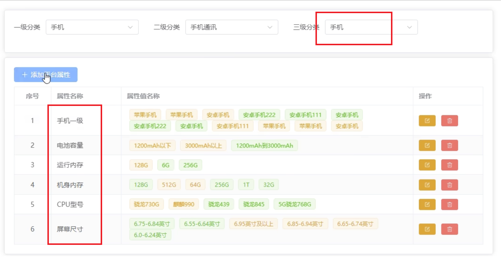

这个页面中有
- 一级分类
- 二级分类
- 三级分类

当我们确定了一级分类后, 二级分类中的数据就确定了, 当我们选择完了三级分类后, 下面的列表才会有数据, (有些像我做过的 下拉框的联动过滤)

展示的是3级分类(手机)下, 定义的属性值管理

<br><br>

## 属性管理: 接口

### 请求 一级分类 下拉菜单的数据
当我们的属性管理组件一挂载的之后, 就要请求 一级分类 下拉菜单 中的数据

```s
/admin/product/getCategory1
```

- get请求
- 无参数

<br>

**响应体:**  
```js
{
  "code": 200,
  "message": "成功",
  "data": [
    {
      "id": 1,
      "createTime": "2021-12-10 01:31:41",
      "updateTime": "2022-05-07 11:42:44",
      "name": "图书/音像/电子书刊"
    }
  ],
  "ok": true
}
```

<br>

### 请求 二级分类 下拉菜单的数据
我们会**根据选择的一级分类的id**, 请求二级分类 下拉菜单的数据

```s
/admin/product/getCategory2/{category1Id}
```

- get请求
- 参数: 一级分类的id, url后拼接

<br>

**响应:**  
```js
{
  "code": 200,
  "message": "成功",
  "data": [
    {
      "id": 1,
      "createTime": "2021-12-10 01:31:41",
      "updateTime": "2021-12-10 01:31:41",
      "name": "电子书刊",
      "category1Id": 1
    },
    {
      "id": 2,
      "createTime": "2021-12-10 01:31:41",
      "updateTime": "2021-12-10 01:31:41",
      "name": "音像",
      "category1Id": 1
    }
  ],
  "ok": true
}
```

<br>

### 请求 三级分类 下拉菜单的数据
根据 二级分类id 请求3级分类 下拉菜单的数据

```s
/admin/product/getCategory3/{category2Id}
```

- get请求
- 参数: 二级分类id

<br>

**响应:**  
```js
{
  "code": 200,
  "message": "成功",
  "data": [
    {
      "id": 1,
      "createTime": "2021-12-10 01:31:41",
      "updateTime": "2021-12-10 01:31:41",
      "name": "电子书",
      "category2Id": 1
    },
    {
      "id": 2,
      "createTime": "2021-12-10 01:31:41",
      "updateTime": "2021-12-10 01:31:41",
      "name": "网络原创",
      "category2Id": 1
    }
  ],
  "ok": true
}
```

<br>

### 总结:
都是等到用户选择了前一个分类后, **自动请求后续的分类数据**

当我们3级分类确定后, 也需要发送请求, 获取三级分类(手机)对应的属性和属性值

<br>

### 请求 三级分类对应商品 的属性
当我们3级分类确定后, 也需要发送请求, 获取三级分类(手机)对应的属性和属性值, 用于渲染 表格

- get请求
- 参数: category1Id / category2Id / category3Id
```s
/admin/product/attrInfoList/{category1Id}/{category2Id}/{category3Id}
```  

<br>

```js
{
  "code": 200,
  "message": "成功",
  "data": [
    {
      "id": 18775,
      "createTime": null,
      "updateTime": null,
      "attrName": "数据网络",
      "categoryId": 61,
      "categoryLevel": 3,
      "attrValueList": [
        {
          "id": 175403,
          "createTime": null,
          "updateTime": null,
          "valueName": "6G",
          "attrId": 18775
        }
      ]
    },
    ...
  ],
  "ok": true
}
```

<br>

### 总结:
要展示到表格数据的话, 我们需要发起4个请求, 每个请求都是等到上一步确定后, 自动发起请求
1. 一级分类 下拉列表中的数据
2. 二级分类 下来列表中的数据
3. 三级分类 下来列表中的数据
4. 对应三级分类的 属性, 用于表格的渲染

<br><br>

## 属性管理: searchForm 区域
我们将请求下拉列表中的数据的逻辑, **存放在store中**, 当组件挂载完毕后 我们通知store发起请求, 获取数据, 并将数据存放在仓库中

同时页面上 el-select 选择的值也是双向绑定到 store 中
```html
<el-select
  v-model="categoryStore.category1Id"
  :popper-options="{
    modifiers: [{ name: 'computeStyles', options: { adaptive: false } }]
  }"
>
  <el-option
    v-for="item in categoryStore.category1List"
    :key="item.id"
    :label="item.name"
    :value="item.id"
  />
</el-select>
```

<br>

### 二级 和 三级分类 的下拉数据, 何时发起请求?

**方式1:**   
我们监听 store 中, 一级分类ID(category1Id) 有没有发生变化, 如果有变化 就发起请求

<br>

**方式2:**   
我们监听 el-select 的 change 方法, 该方法会在下拉菜单选中值发生变化的时候触发

<br>

**store代码:**  
```js
// 商品分类全局组件的仓库
import { defineStore } from 'pinia'

import {
  getCategory1ListApi,
  getCategory2ListApi,
  getCategory3ListApi
} from '@/api/product/attr'

import type {
  category1ItemResType,
  category2ItemResType,
  category3ItemResType
} from '@/api/product/attr/type.ts'

type stateType = {
  category1Id: string | number
  category2Id: string | number
  category3Id: string | number
  category1List: category1ItemResType[]
  category2List: category2ItemResType[]
  category3List: category3ItemResType[]
}
const useCategoryStore = defineStore('category', {
  state: (): stateType => {
    return {
      category1List: [],
      category2List: [],
      category3List: [],
      category1Id: '',
      category2Id: '',
      category3Id: ''
    }
  },
  actions: {
    async getCategory1List() {
      const res = await getCategory1ListApi()
      if (res.code === 200) {
        this.category1List = res.data
      }
    },
    async getCategory2List() {
      const res = await getCategory2ListApi(+this.category1Id)
      if (res.code === 200) {
        this.category2List = res.data
      }
    },
    async getCategory3List() {
      const res = await getCategory3ListApi(+this.category2Id)
      if (res.code === 200) {
        this.category3List = res.data
      }
    }
  },
  getters: {}
})

export default useCategoryStore
```

<br>

```html
<script setup lang="ts">
import { onMounted, reactive, ref } from 'vue'

import useCategoryStore from '@/store/categoryStore.ts'

const categoryStore = useCategoryStore()

// 当组件挂载完毕后 通知 store 发起请求 获取下拉菜单的数据
onMounted(() => {
  getCategory1List()
})

// 通知仓库获取1级分类数据的方法 同时 el-select v-model 的值 双向绑定到仓库中
const getCategory1List = () => {
  categoryStore.getCategory1List()
}

// 处理选择下拉菜单 123 回调
const handleCategory1 = () => {
  // 当用户选择了 1级分类 的时候, 我们通知 store 请求2级分类的数据
  categoryStore.getCategory2List()
}
const handleCategory2 = () => {
  // 当用户选择了 2级分类 的时候, 我们通知 store 请求3级分类的数据
  categoryStore.getCategory3List()
}
const handleCategory3 = () => {
  // 当用户选择了 3级分类 的时候, 我们通知 store 请求table数据
}
</script>

<el-form :inline="true">
  <el-form-item label="一级分类">
    <el-select
      v-model="categoryStore.category1Id"
      :popper-options="{
        modifiers: [{ name: 'computeStyles', options: { adaptive: false } }]
      }"
      @change="handleCategory1"
    >
      <el-option
        v-for="item in categoryStore.category1List"
        :key="item.id"
        :label="item.name"
        :value="item.id"
      />
    </el-select>
  </el-form-item>
  <el-form-item label="二级分类">
    <el-select
      v-model="categoryStore.category2Id"
      :popper-options="{
        modifiers: [{ name: 'computeStyles', options: { adaptive: false } }]
      }"
      @change="handleCategory2"
    >
      <el-option
        v-for="item in categoryStore.category2List"
        :key="item.id"
        :label="item.name"
        :value="item.id"
      />
    </el-select>
  </el-form-item>
  <el-form-item label="三级分类">
    <el-select
      v-model="categoryStore.category3Id"
      :popper-options="{
        modifiers: [{ name: 'computeStyles', options: { adaptive: false } }]
      }"
      @change="handleCategory3"
    >
      <el-option
        v-for="item in categoryStore.category3List"
        :key="item.id"
        :label="item.name"
        :value="item.id"
      />
    </el-select>
  </el-form-item>
</el-form>
```

<br>

### 细节:
**1. 当我们重新选择了 1级分类 后, 它的下级分类们的数据要清空**  
1级分类的change事件发生的时候 清理下级分类
```js
// 通知仓库获取1级分类数据的方法 同时 el-select v-model 的值 双向绑定到仓库中
const getCategory1List = () => {
  categoryStore.getCategory1List()
}

// 处理下拉菜单选择回调
const handleCategory1 = () => {
  // 当1级分类的值发生变化的时候, 清空下级分类的数据
  categoryStore.category2Id = ''
  categoryStore.category2List = []
  categoryStore.category3Id = ''
  categoryStore.category3List = []

  // 当用户选择了 1级分类 的时候, 我们通知 store 请求2级分类的数据
  categoryStore.getCategory2List()
}
const handleCategory2 = () => {
  categoryStore.category3Id = ''
  categoryStore.category3List = []
  // 当用户选择了 2级分类 的时候, 我们通知 store 请求3级分类的数据
  categoryStore.getCategory3List()
}
const handleCategory3 = () => {
  // 当用户选择了 3级分类 的时候, 我们通知 store 请求table数据
}
```

<br>

**2. 添加平台属性 按钮 的禁用**  
[添加平台属性]按钮是禁用状态的, 只有当我们选择了3级分类后 它才不是禁用的状态, 我们可以根据时候有 category3Id 来决定他是否展示
```html
<el-button
  icon="Plus"
  type="primary"
  :disabled="categoryStore.category3Id ? false : true"
  >添加平台属性</el-button
>
```

<br><br>

## 属性管理: 展示table数据

### 表格数据
```js
"data": [
  {
    "id": 18775,
    // 属性名的展示需要使用的数据
    "attrName": "数据网络",
    "categoryId": 61,
    "categoryLevel": 3,
    "createTime": null,
    "updateTime": null,
    // tag 标签里面用到的数据
    "attrValueList": [
      {
        "id": 175403,
        // 属性值的名字
        "valueName": "6G",
        // 属性值归属于哪一个属性的
        "attrId": 18775,
        "createTime": null,
        "updateTime": null
      },
    ]
  }
]
```

<br>

### 属性管理: 请求表格数据的时机
当我们的三级分类被选定的时候 我们要发起请求 有两种形式 可以决定什么时机发起请求

**1. 自定义事件**  
我们给 3级分类的下拉菜单绑定一个自定义事件, 当3级分类被选中的时候, 我们通知父组件 发起请求表格数据的请求

**子组件:**
```js
const emit = defineEmits(['getTableList'])

// 3级分类 被选择时的 change 回调
const handleCategory3 = () => {
  emit('getTableList')
}
```

<br>

**父组件:**
```js
<SearchCategory @getTableList="getTableList" />

const getTableList = async () => {
  // 请求表格数据
  const res = await getList(
    +categoryStore.category1Id,
    +categoryStore.category2Id,
    +categoryStore.category3Id
  )
  console.log(res)
}
```  

<br>

**方式2: watch**   
我们监听 store 中 3级分类的id值是否有变化
```js
// 监听 store 中 三级分类id 的变化
watch(
  () => categoryStore.category3Id,
  (n) => {
    // 确保有了3级分类id后 我们再发起请求
    if (n) {
      getTableList()
    }
  }
)

// 获取table列表数据的方法
const getTableList = async () => {
  const res = await getList(
    +categoryStore.category1Id,
    +categoryStore.category2Id,
    +categoryStore.category3Id
  )
  console.log('res: ', res)
  if (res.code === 200) {
    tableData.length = 0
    tableData.push(...res.data)
    // 丢失响应式: vuedeveloptools上 tabledata的后面不带 reactive 标识了
    // tableData = res.data
  }
}
```

<br>

### 展示表格数据:
```html
<el-table class="attr-list__table" border :data="tableData">
  <el-table-column type="index" width="80" align="center" label="序号" />
  <el-table-column
    v-for="(item, index) in tableHeaders"
    :key="index"
    :prop="item.prop"
    :label="item.label"
    :width="item.width"
    :align="item.align"
  >
    <!-- 只有当 desc 标识为 attrList 的时候 为其单独渲染结构 -->
    <template v-if="item.desc === 'attrList'" #default="{ row }">
      <el-tag
        class="tag"
        v-for="attr in row.attrValueList"
        :key="attr.id"
        >{{ attr.valueName }}</el-tag
      >
    </template>
  </el-table-column>
  <el-table-column label="操作" width="120">
    <template>
      <el-button size="small" type="primary" icon="Edit" circle />
      <el-button size="small" type="primary" icon="Delete" circle />
    </template>
  </el-table-column>
</el-table>
```

<br><br>

## 属性管理: 添加平台属性
当我们点击 [添加平台属性] 按钮之后, 原本呈现 el-table 的card变成了一个添加属性的表单

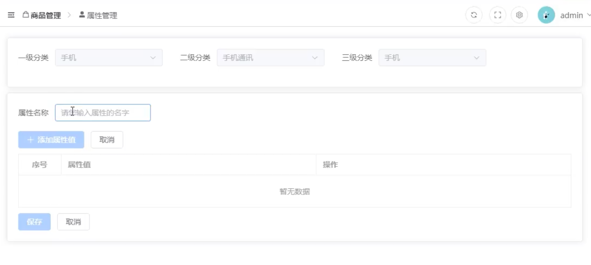

<br>

也就是说我们的 card 里面有两个结构

```html
<el-card>
  <!-- 表格 -->
  <template>
    <el-table></el-table>
  </template>
  <!-- form -->
  <template>
    <el-form></el-form>
  </template>
</el-card>
```

我们会定义一个变量, 在点击 [添加平台属性] 和 表格中 [修改] 按钮的时候, 通过这个变量控制展示表格 还是form结构

<br>

### 添加 / 修改 平台属性 接口: 是否有id
我们在添加平台属性的时候 是需要发送请求的, 我们需要告诉后台 我们给谁添加属性 以及我们修改的话 也需要发送请求要告诉后台我们要修改哪个已有的属性

```s
/admin/product/saveAttrInfo
```

<br>

**作用:**  
- 给某个3级分类 **添加** 一个属性 
- **修改** 某个3级分类下已有属性 

当我们携带的参数中有id的情况就是修改, 没有id的情况就是添加

<br>

**参数: 对象**  
- 修改的情况:
  - id: 修改的哪一个已有属性
  - attrName: 修改的已有属性的名字
    - attrValueList: 属性值相关
      - id: 修改的哪一个已有属性的已有属性值
      - attrId: 该属性值归属于哪一个属性
      - valueName: 属性值名称
  - categoryId: 已有属性归属于哪个三级分类下
  - categoryLevel: 表示几级分类
```js
{
  "id": 0,
  "attrName": "string",
  "attrValueList": [
    {
      // 该属性值归属于哪一个属性 (父id)
      "attrId": 0,
      "id": 0,
      "valueName": "string"
    }
  ],
  "categoryId": 0,
  "categoryLevel": 0
}
``` 

- 添加的情况:
```js
{
  // 新增的属性名
  "attrName": "string",
  // 新增的属性值数组
  "attrValueList": [
    {
      "valueName": "string"
    }
  ],
  // 给哪个三级分类新增属性 是手机?
  "categoryId": number,
  // 固定的 因为我们只给三级分类添加
  "categoryLevel": 3
}
``` 

<br>

### TS类型
我们 添加 / 修改 在一个接口中, 只是参数不一样, 说明我们的参数类型要包含上面 添加 / 修改 的两种情况
```js
type attrValueItemType = {
  id?: number | string
  valueName: string
  attrId?: number | string
}

// 表格数组中一个item的类型
type listItemType = {
  id?: number | string
  attrName: string
  categoryId?: number | string
  categoryLevel: number
  attrValueList: attrValueItemType[]
}
```

<br>

### 收集数据
1. attrName: 通过 el-input 属性名称 收集
2. categoryId: 通过 store中的3级分类id 收集
3. categoryLevel: 固定的3
4. 属性值: 当我们点击 [添加属性值] 按钮后, 表格中就会多一行
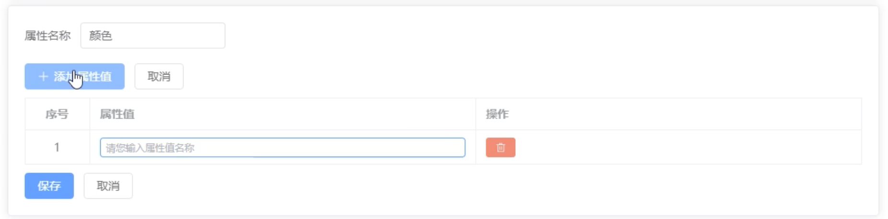

<br>

**收集属性值:**  
我们点击 [添加属性值] 按钮后, 表格中就会多一行, 怎么动态的在table中添加行呢?

我们将 el-table 的data属性, 绑定到我们定义好的 attrForm 中属性值列表中
```html
<script>
  // form: 定义新增属性的数据
  const attrForm = reactive<listItemType>({
    // 3级分类所属的id
    categoryId: '',
    // 新增 和 修改的时候 都为3 因为我们就是对3级分类进行操作
    categoryLevel: 3,
    // 属性名
    attrName: '',

    // 属性值列表
    attrValueList: []
  })
</script>
<el-table border>
  <el-table-column
    width="80"
    type="index"
    align="center"
    label="序号"

    // ↓ 这里
    :data="attrForm.attrValueList"
  ></el-table-column>
  <el-table-column label="属性值的名称">
    <template #default="{ row }">
      <el-input
        v-model="row.valueName"
        placeholder="请输入属性值名称"
      />
    </template>
  </el-table-column>
  <el-table-column label="属性值操作"></el-table-column>
</el-table>
```

这样当我们的 attrValueList 多了一个对象后, 表格就会新增一行, **数据驱动UI**

当我们 输入属性名称 -> 点击 [添加属性值] 按钮 -> 我们就往 attrValueList push一个对象

```js
const addAttrValhandler = () => {
  // 点击 添加属性值 按钮的时候 向 attrForm.attrValueList 添加一个属性值对象
  const defaultAttr = {
    // 默认为空 后续通过 row v-model="row.valueName" 进来, 因为我们往表格中push的一个对象, row就是这个对象的引用
    valueName: ''
  }

  attrForm.attrValueList.push(defaultAttr)
}
```

**要点: 可以通过row来进行双向绑定**

<br>

### 添加属性的代码:
1. 定义 添加属性 和 修改属性的 form
```js
// form: 定义新增属性的数据
type attrFormType = listItemType & {
  [_: string]: any
}
const attrForm = reactive<attrFormType>({
  // 3级分类所属的id
  categoryId: '',
  // 新增 和 修改的时候 都为3 因为我们就是对3级分类进行操作
  categoryLevel: 3,
  // 属性名
  attrName: '',
  // 属性值列表
  attrValueList: []
})
```

2. 点击添加属性值按钮后, 往表格中插入一个对象, 表格会对应添加一行数据
```js
// 添加属性值按钮的回调
const addAttrValhandler = () => {
  // 点击 添加属性值 按钮的时候 向 attrForm.attrValueList 添加一个属性值对象
  const defaultAttr = {
    // 默认为空 后续通过 row v-model="row.valueName" 进来, 因为我们往表格中push的一个对象, row就是这个对象的引用
    valueName: ''
  }

  attrForm.attrValueList.push(defaultAttr)
}
```

3. 点击 保存 按钮 保存数据
```js
// 保存按钮回调
const saveAttrHandler = async () => {
  // 设置参数
  attrForm.categoryId = categoryStore.category3Id
  /*
    {
      attrName: "颜色",
      attrValueList: [{valueName: "黄色"}],
      categoryId: 61,
      categoryLevel: 3
    }
  */
  // 发起请求
  const res = await saveOrUpdateAttr(attrForm)
  if (res.code === 200) {
    ElMessage({
      type: 'success',
      message: '修改属性成功'
    })

    // 切换场景: 返回属性列表界面
    switchTableStructure.value = true

    // 请求最新列表
    await getTableList()
  } else {
    ElMessage({
      type: 'error',
      message: '修改属性失败'
    })
  }
}
```

4. 点击 添加平台属性 清空表单数据
```js
const resetAttrForm = () => {
  for (const key in attrForm) {
    if (key === 'attrValueList') {
      attrForm[key].length = 0
    } else if (key === 'categoryLevel') {
      attrForm[key] = 3
    } else {
      attrForm[key] = ''
    }
  }
}
```

<br><br>

## 属性管理: 属性值的 编辑模式 / 查看模式 的切换
- 编辑模式: table中放的是 input
- 查看模式: 当我们从input上失去焦点的时候, 它会变成其它元素, 再次获取焦点的时候, 又会变成 input

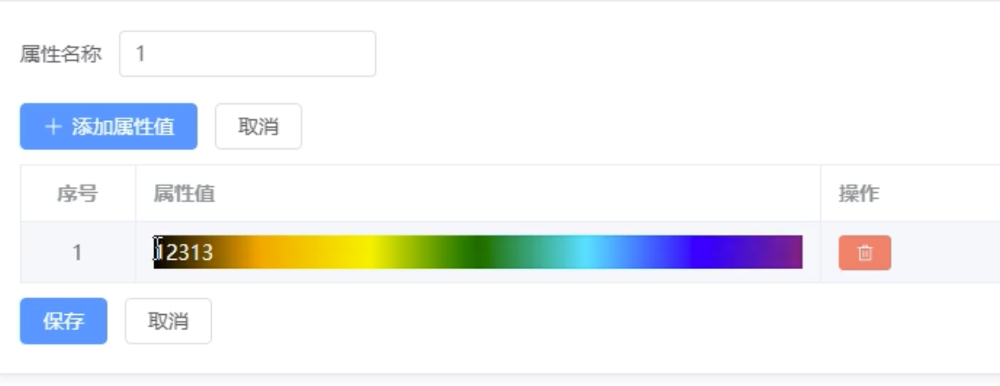

<br>

### 实现: 向 tableData 中添加记录的时候 追加 isEdited 变量
1. 结构部分 我们使用 v-if 和 v-else 来控制 展示不同的结构
```html
<el-table-column label="属性值的名称">
  <template #default="{ row }">
    <!-- 编辑状态 -->
    <el-input
      v-if="row.isEdited"
      v-model="row.valueName"
      placeholder="请输入属性值名称"
      @blur="changeShowMode(row)"
    />
    <!-- 查看状态 -->
    <div v-else @click="changeEditMode(row)">
      {{ row.valueName }}
    </div>
  </template>
</el-table-column>
```

2. boolean类型的标识的话, 因为每行数据必须有自己的单独的状态, 所以我们将标识放在表格数据对象里面(row里面)
```js
// 添加属性值按钮的回调
const addAttrValhandler = () => {
  // 点击 添加属性值 按钮的时候 向 attrForm.attrValueList 添加一个属性值对象
  const defaultAttr = {
    valueName: '',

    // 切换 编辑模式 和 查看模式 的标识变量
    isEdited: true
  }

  attrForm.attrValueList.push(defaultAttr)
}
```

3. 为input绑定失去焦点事件, 为div绑定点击事件, 并在blur事件中追加边界判断
```js
// 属性值 失去焦点的回调
const changeShowMode = (row: attrValueItemType, index: number): void => {
  // 非法判断
  // 1. 属性值必须有值, 没值不能变成div 因为没值变成div div会没有高度 无法再次点击
  // 2. 当我们追加的是一个空值对象的时候, 将这个对象从attrValueList删掉
  // 3. 新增的属性值不能重复, 我们要判断新增属性值 valueName 在 attrValueList 中是否出现 并将这个对象从attrValueList删掉
  if (!row.valueName.trim()) {
    console.log('添加了空值')
    attrForm.attrValueList.splice(index, 1)
    return
  }
  // row对象本身也是数组中的一员, 我们判断的时候要刨除row本身
  const idRepeated = attrForm.attrValueList.find((item) => {
    // 引用值相等判断, 刨除row的情况
    if (item !== row) {
      return item.valueName === row.valueName
    }
  })
  if (idRepeated) {
    console.log('添加了重复值')
    attrForm.attrValueList.splice(index, 1)
    return
  }

  // 都没有问题后 我们再切换成div
  row.isEdited = false
}
const changeEditMode = (row: attrValueItemType): void => {
  row.isEdited = true
}
```

<br>

### 优化: 当 查看模式 -> 编辑模式 (div -> input) 自动聚焦
当我们由 div 切换到 input 的时候, input的要自动聚焦

<br>

**思路:**  
我们使用 el-input 的组件实例身上有 focus 方法, 它可以使input元素进行聚焦

ref可以获取el-input实例, 当有实例的时候, 我们就让它自动聚焦 

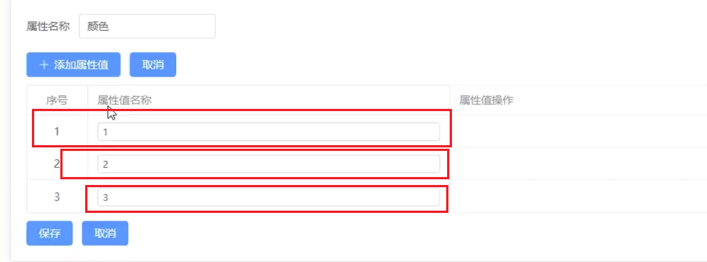

我们的页面上的input还可能有多个, 我们要获取这多个input, 去调用它们对应的focus方法

<br>

**步骤:**
1. 准备一个数组, 将来存储对应的el-input组件实例
2. 当模版中出现了 el-input 组件实例, 我们就将它丢到数组中 存储起来 (这里我们使用了 ref 传入回调收集实例的功能)
```html
<script>
  // ref绑定的回调, 在模版渲染的时候 就会被触发, 当模版渲染有el-input实例的时候, 我们就按照先后次序存储到 elInputInstances 中
  const elInputInstances = reactive<any>([])
</script>
<el-input
  :ref="(vc: any) => (elInputInstances[$index] = vc)"
/>
```

3. 当我们点击 div 的时候 让对应的元素聚焦即可
```js
const changeEditMode = (row: attrValueItemType, index: number): void => {
  console.log(index)
  row.isEdited = true

  // 响应式数据发生变化 获取更新后的dom
  nextTick(() => {
    elInputInstances[index]?.focus()
  })
}
```

4. 当我们新增一个属性值的时候 也需要让其聚焦
```js
// 添加属性值按钮的回调
const addAttrValhandler = () => {
  const defaultAttr = {
    valueName: '',
    isEdited: true
  }

  attrForm.attrValueList.push(defaultAttr)

  // 获取最后的el-input组件让其聚焦, 也就是新追加的input也需要聚焦
  nextTick(() => {
    elInputInstances[attrForm.attrValueList.length - 1]?.focus()
  })
}
```

<br><br>

## 属性管理: 修改
当我们点击表格中的修改按钮的时候, 需要在编辑界面中将已有的数据回显出来

我们现在的状态是, 当我们选择完 1级 和 2级 和 3级 分类后, 就会请求该3类分类下的属性 **并将请求回来的数据在列表中进行展示**

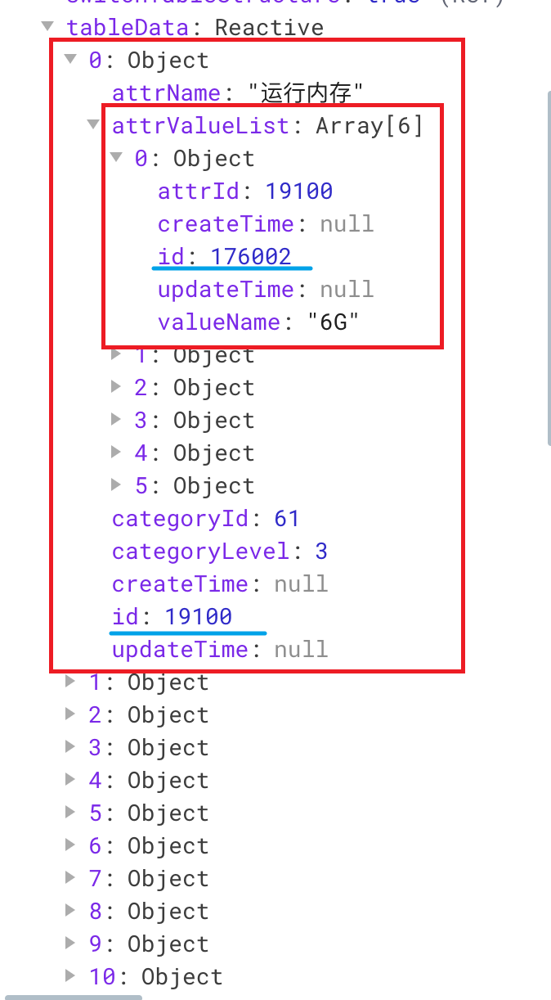

上面的tableData就是该3级分类下所有的属性和属性值, 我们请求回来的数据能够看到已经有id了, 所以有id表示 这是已有的属性和属性值

当我们点击 [修改] 按钮的时候, 需要将 已有的属性和属性值进行回显

<br>

### 点击 [修改] 按钮的逻辑
**<font color='#C2185B'>Vue3中对象的赋值建议使用Object.assign()方法, 这样不会改变地址值</font>**

1. 点击修改按钮, 将控制 切换表格和表单 的变量 改为false, **切换成表单界面**
2. 回显数据, 将该行的数据 回显到表单界面

```js
// 修改属性的回调
const handleUpdateAttr = (row: attrValueItemType) => {
  switchTableStructure.value = false
  console.log(row)
  /*
  {
    "id": 19179,
    "createTime": null,
    "updateTime": null,
    "attrName": "12321",
    "categoryId": 62,
    "categoryLevel": 3,
    "attrValueList": [
      {
        "id": 175914,
        "createTime": null,
        "updateTime": null,
        "valueName": "2131",
        "attrId": 19179
      }
    ]
  }
  */
  // 将已有的属性对象 赋值给 attrForm 对象
  Object.assign(attrForm, row)
}
```

<br>

### 坑: 深浅拷贝的问题
我们在 表单界面 添加属性值 我们添加了一个 (颜色 - 123), 但是我们**不点保存 而是 点击取消**

但是我们的表格界面的 **颜色属性却追加了一个 123**

<br>

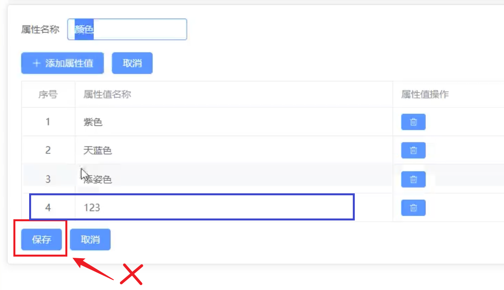


<br>

上面我们使用 ``Object.assign(attrForm, row)`` 这个方法 请求表格中点击行的数据row, 赋值给了 attrForm 对象

- 表格渲染数据中的 row
- 表单渲染数据中的 attrForm

但是这个方法对于嵌套的引用类型是属于**浅拷贝**, 也就是说我们在 表单界面 的操作, **因为地址值的原因会同步到 表格数据中**

<br>

**解决方式:**  
我们将 row 赋值给 attrForm 的时候, **将 row 深拷贝一份再赋值给 attrForm**

- JSONAPI: ``JSON.parse(JSON.stringify())``
  - 对象内容为 undefind, null, date, regexp, function, error 的时候会报错
- lodash: ``cloneDeep()``
- 新API: ``structuredClone(对象)``
  - 对象包含函数 和 dom节点会抛出异常
  - 该拷贝方式会丢弃对象的原型链
  - 如果需要使用 可以引入 core-js 兼容库

```js
const handleUpdateAttr = (row: attrValueItemType) => {
  switchTableStructure.value = false
  
  // 深拷贝之后再赋值给 attrForm
  Object.assign(attrForm, JSON.parse(JSON.stringify(row)))
}
```

<br><br>

## 属性管理: 删除

### 接口地址
```s
/admin/product/deleteAttr/{attrId}
```

- 请求方式: delete请求
- 参数: url拼接id
- 返回值data: null

<br>

### 代码:
```js
const deleteAttrHandler = async (row: listItemType) => {
  console.log(row)
  const res = await deleteAttrApi(row.id as number)
  if (res.code === 200) {
    ElMessage({
      type: 'success',
      message: '删除成功'
    })
    getTableList()
  } else {
    ElMessage({
      type: 'error',
      message: '删除失败'
    })
  }
}
```

<br>

### 问题: 当我们选择完分类123后, 进行路由切换, 切换回来后 仍然保存着下拉框中的数据
我们路由之间进行跳转之后, 组件确实被重新创建了 但是我们的 search区域的下拉框需要的数据是存储在Pinia中

虽然切换了组件但是pinia中的数据并没有被清空, 所以我们在切换组件的时候, 仓库中的相关数据也需要进行清除

<br><br>

## 属性管理: 代码部分

### 类型 接口
```js
// 一级分类下拉列表
type category1ItemResType = {
  id: number | string
  name: string
}

// 二级分类下拉列表
type category2ItemResType = category1ItemResType & {
  category1Id: number | string
}

type category3ItemResType = category1ItemResType & {
  category2Id: number | string
}

// 添加 和 修改 属性的请求参数类型
// 属性值类型: 表格数据 attrValueList 中的一个item的类型
export type attrValueItemType = {
  id?: number | string
  valueName: string
  attrId?: number | string
  isEdited?: boolean
}

// 表格数组中一个item的类型
type listItemType = {
  id?: number | string
  attrName: string
  categoryId?: number | string
  categoryLevel: number | string
  attrValueList: attrValueItemType[]
}

export type {
  category1ItemResType,
  category2ItemResType,
  category3ItemResType,
  listItemType
}


import service from '@/utils/request'
import type { commonResType } from '@/api/commonTypes'
import type {
  category1ItemResType,
  category2ItemResType,
  category3ItemResType,
  listItemType
} from './type'

enum API {
  GET_CATEGORY1 = '/admin/product/getCategory1',
  // /{category1Id}
  GET_CATEGORY2 = '/admin/product/getCategory2',
  // /{category2Id}
  GET_CATEGORY3 = '/admin/product/getCategory3',
  // 获取table数据 /{category1Id}/{category2Id}/{category3Id}
  GET_TABLEDATA = '/admin/product/attrInfoList',
  ADD_UPDATE_ATTR_URL = '/admin/product/saveAttrInfo',
  DELETE_ATTR_URL = '/admin/product/deleteAttr'
}

export const getCategory1ListApi = (): Promise<
  commonResType<category1ItemResType[]>
> => {
  return service.get(API.GET_CATEGORY1)
}
export const getCategory2ListApi = (
  category2Id: number
): Promise<commonResType<category2ItemResType[]>> => {
  return service.get(`${API.GET_CATEGORY2}/${category2Id}`)
}
export const getCategory3ListApi = (
  category3Id: number
): Promise<commonResType<category3ItemResType[]>> => {
  return service.get(`${API.GET_CATEGORY3}/${category3Id}`)
}

// 获取table数据
type getListType = (
  category1Id: number,
  category2Id: number,
  category3Id: number
) => Promise<commonResType<listItemType[]>>
export const getList: getListType = (category1Id, category2Id, category3Id) => {
  return service.get(
    `${API.GET_TABLEDATA}/${category1Id}/${category2Id}/${category3Id}`
  )
}

// 添加 / 修改 已有属性的接口
type saveOrUpdateAttrType = (data: listItemType) => Promise<commonResType<null>>
export const saveOrUpdateAttr: saveOrUpdateAttrType = (data) => {
  // 后台会根据我们传递的参数是否有id来判断该次请求是添加还是修改
  return service.post(API.ADD_UPDATE_ATTR_URL, data)
}

// 删除 已有属性的接口
export const deleteAttrApi = (
  attrId: number | string
): Promise<commonResType<null>> => {
  return service.delete(`${API.DELETE_ATTR_URL}/${attrId}`)
}
```

<br>

### 页面代码:
```html
<script setup lang="ts">
import { watch, reactive, ref, nextTick, onBeforeUnmount } from 'vue'
import { ElMessage } from 'element-plus'
import SearchCategory from '@/components/SearchCategory/index.vue'
import useCategoryStore from '@/store/categoryStore.ts'

import { getList, saveOrUpdateAttr, deleteAttrApi } from '@/api/product/attr'
import type {
  listItemType,
  attrValueItemType
} from '@/api/product/attr/type.ts'

defineOptions({
  name: 'Attr'
})

const categoryStore = useCategoryStore()

// 表格列的数据
const tableHeaders = [
  { label: '属性名称', prop: 'attrName', align: 'center', width: '120px' },
  { label: '属性值名称', prop: 'attrVals', align: 'center', desc: 'attrList' }
]

// 表格数据
const tableData = reactive<listItemType[]>([])

// table组件和form切换的变量: true - table, false - form
let switchTableStructure = ref<boolean>(true)

// form: 定义新增属性的数据
type attrFormType = listItemType & {
  [_: string]: any
}
const attrForm = reactive<attrFormType>({
  // 3级分类所属的id
  categoryId: '',
  // 新增 和 修改的时候 都为3 因为我们就是对3级分类进行操作
  categoryLevel: 3,
  // 属性名
  attrName: '',
  // 属性值列表
  attrValueList: []
})

// 添加属性值: el-input 自动获焦 存储页面中 input实例的数组
const elInputInstances = reactive<any>([])

const resetAttrForm = () => {
  for (const key in attrForm) {
    if (key === 'attrValueList') {
      attrForm[key].length = 0
    } else if (key === 'categoryLevel') {
      attrForm[key] = 3
    } else {
      attrForm[key] = ''
    }
  }
}

// 监听 store 中 三级分类id 的变化
watch(
  () => categoryStore.category3Id,
  (n) => {
    // 1. 当 3级分类id 有变化之后 我们要先清空表格数据
    tableData.length = 0
    // 2. 确保 3级分类id 有了之后我们再发送请求
    if (n) {
      getTableList()
    }
  }
)

// 获取table列表数据的方法
const getTableList = async () => {
  const res = await getList(
    +categoryStore.category1Id,
    +categoryStore.category2Id,
    +categoryStore.category3Id
  )
  if (res.code === 200) {
    tableData.length = 0
    tableData.push(...res.data)
    // 丢失响应式: vuedeveloptools上 tabledata的后面不带 reactive 标识了
    // tableData = res.data
  }
}

// 添加属性按钮的回调
const handleAddAttr = () => {
  resetAttrForm()
  switchTableStructure.value = false
}

// 修改属性的回调
const handleUpdateAttr = (row: listItemType) => {
  switchTableStructure.value = false
  /*
  {
    "id": 19179,
    "createTime": null,
    "updateTime": null,
    "attrName": "12321",
    "categoryId": 62,
    "categoryLevel": 3,
    "attrValueList": [
      {
        "id": 175914,
        "createTime": null,
        "updateTime": null,
        "valueName": "2131",
        "attrId": 19179
      }
    ]
  }
  */
  // 将已有的属性对象 赋值给 attrForm 对象
  Object.assign(attrForm, JSON.parse(JSON.stringify(row)))
}

// form界面的取消按钮的回调
const handleCancel = () => {
  switchTableStructure.value = true
}

// 添加属性值按钮的回调
const addAttrValhandler = () => {
  // 点击 添加属性值 按钮的时候 向 attrForm.attrValueList 添加一个属性值对象
  const defaultAttr = {
    // 默认为空 后续通过 row v-model="row.valueName" 进来, 因为我们往表格中push的一个对象, row就是这个对象的引用
    valueName: '',

    // 切换 编辑模式 和 查看模式 的标识变量
    isEdited: true
  }

  attrForm.attrValueList.push(defaultAttr)

  // 获取最后的el-input组件让其聚焦, 也就是新追加的input也需要聚焦
  nextTick(() => {
    elInputInstances[attrForm.attrValueList.length - 1]?.focus()
  })
}

// 保存按钮回调
const saveAttrHandler = async () => {
  // 设置参数
  attrForm.categoryId = categoryStore.category3Id
  /*
    {
      attrName: "颜色",
      attrValueList: [{valueName: "黄色"}],
      categoryId: 61,
      categoryLevel: 3
    }
  */
  // 发起请求
  const res = await saveOrUpdateAttr(attrForm)
  if (res.code === 200) {
    ElMessage({
      type: 'success',
      message: '修改属性成功'
    })

    // 切换场景: 返回属性列表界面
    switchTableStructure.value = true

    // 请求最新列表
    await getTableList()
  } else {
    ElMessage({
      type: 'error',
      message: '修改属性失败'
    })
  }
}

// 删除属性按钮的回调
const deleteAttrHandler = async (row: listItemType) => {
  console.log(row)
  const res = await deleteAttrApi(row.id as number)
  if (res.code === 200) {
    ElMessage({
      type: 'success',
      message: '删除成功'
    })
    getTableList()
  } else {
    ElMessage({
      type: 'error',
      message: '删除失败'
    })
  }
}

// 属性值 失去焦点的回调
const changeShowMode = (row: attrValueItemType, index: number): void => {
  // 非法判断
  // 1. 属性值必须有值, 没值不能变成div 因为没值变成div div会没有高度 无法再次点击
  // 2. 当我们追加的是一个空值对象的时候, 将这个对象从attrValueList删掉
  // 3. 新增的属性值不能重复, 我们要判断新增属性值 valueName 在 attrValueList 中是否出现 并将这个对象从attrValueList删掉
  if (!row.valueName.trim()) {
    console.log('添加了空值')
    attrForm.attrValueList.splice(index, 1)
    return
  }
  // row对象本身也是数组中的一员, 我们判断的时候要刨除row本身
  const idRepeated = attrForm.attrValueList.find((item) => {
    // 引用值相等判断, 刨除row的情况
    if (item !== row) {
      return item.valueName === row.valueName
    }
  })
  if (idRepeated) {
    console.log('添加了重复值')
    attrForm.attrValueList.splice(index, 1)
    return
  }

  // 都没有问题后 我们再切换成div
  row.isEdited = false
}
const changeEditMode = (row: attrValueItemType, index: number): void => {
  console.log(index)
  row.isEdited = true

  // 响应式数据发生变化 获取更新后的dom
  nextTick(() => {
    elInputInstances[index]?.focus()
  })
}

// 生命周期: 当路由组件进行切换的时候, 将search仓库中的相关数据进行清空
onBeforeUnmount(() => {
  // 将 仓库中的数据 恢复到起始状态
  categoryStore.$reset()
})
</script>

<template>
  <div class="attr__container">
    <SearchCategory :switchTableStructure="switchTableStructure" />
    <el-card class="attr-list">
      <!-- 表格结构 -->
      <template v-if="switchTableStructure">
        <el-button
          icon="Plus"
          type="primary"
          :disabled="categoryStore.category3Id ? false : true"
          @click="handleAddAttr"
          >添加平台属性</el-button
        >
        <el-table class="attr-list__table" border :data="tableData">
          <!-- 序号列 -->
          <el-table-column
            type="index"
            width="80"
            align="center"
            label="序号"
          />
          <el-table-column
            v-for="(item, index) in tableHeaders"
            :key="index"
            :prop="item.prop"
            :label="item.label"
            :width="item.width"
            :align="item.align"
          >
            <!-- 只有当 desc 标识为 attrList 的时候 为其单独渲染结构 -->
            <template v-if="item.desc === 'attrList'" #default="{ row }">
              <el-tag
                class="tag"
                v-for="attr in row.attrValueList"
                :key="attr.id"
                >{{ attr.valueName }}</el-tag
              >
            </template>
          </el-table-column>
          <!-- 操作列 -->
          <el-table-column label="操作" width="120">
            <template #default="{ row }">
              <el-button
                size="small"
                type="primary"
                icon="Edit"
                circle
                @click="handleUpdateAttr(row)"
              />
              <el-popconfirm
                hide-icon
                width="200"
                :title="`您确定要删除 ${row.attrName} 属性么`"
                @confirm="deleteAttrHandler(row)"
              >
                <template #reference>
                  <el-button size="small" type="primary" icon="Delete" circle />
                </template>
              </el-popconfirm>
            </template>
          </el-table-column>
        </el-table>
      </template>
      <template v-else>
        <div class="attr-edit">
          <el-form :inline="true">
            <el-form-item label="属性名称">
              <el-input
                v-model="attrForm.attrName"
                placeholder="请输入属性名称"
              />
            </el-form-item>
          </el-form>
          <div class="attr-edit__btn">
            <el-button
              type="primary"
              size="default"
              icon="Plus"
              :disabled="attrForm.attrName ? false : true"
              @click="addAttrValhandler"
            >
              添加属性值
            </el-button>
            <el-button type="primary" size="default" @click="handleCancel">
              取消
            </el-button>
          </div>
          <div class="attr-edit__list">
            <el-table border :data="attrForm.attrValueList">
              <el-table-column
                width="80"
                type="index"
                align="center"
                label="序号"
              ></el-table-column>
              <el-table-column label="属性值的名称">
                <template #default="{ row, $index }">
                  <!-- 编辑状态 -->
                  <el-input
                    :ref="(vc: any) => (elInputInstances[$index] = vc)"
                    v-if="row.isEdited"
                    v-model="row.valueName"
                    placeholder="请输入属性值名称"
                    @blur="changeShowMode(row, $index)"
                  />
                  <!-- 查看状态 -->
                  <div v-else @click="changeEditMode(row, $index)">
                    {{ row.valueName }}
                  </div>
                </template>
              </el-table-column>
              <el-table-column label="属性值操作">
                <template #default="{ $index }">
                  <el-button
                    type="primary"
                    size="small"
                    circle
                    icon="Delete"
                    @click="attrForm.attrValueList.splice($index, 1)"
                  />
                </template>
              </el-table-column>
            </el-table>
          </div>
          <div class="attr-edit__footer">
            <el-button
              type="primary"
              size="default"
              :disabled="attrForm.attrValueList.length > 0 ? false : true"
              @click="saveAttrHandler"
            >
              保存
            </el-button>
            <el-button type="primary" size="default" @click="handleCancel">
              取消
            </el-button>
          </div>
        </div>
      </template>
    </el-card>
  </div>
</template>

<style scoped lang="scss">
.attr {
  &__container {
    font-size: 16px;
  }

  &-search {
  }

  &-list {
    margin-top: 20px;

    &__table {
      margin-top: 20px;

      .tag {
        margin: 0px 5px;
        line-height: 1.5;
      }
    }
  }

  &-edit {
    &__list {
      margin-top: 20px;
    }
    &__footer {
      margin-top: 20px;
    }
  }
}
</style>

```

<br><br>

# SPU管理

## SPU 和 SKU 的概念

### SPU (Standard Product Unit): 标准化产品
Spu 是指标准产品单位，是一组具有相似属性的商品的集合。这些商品可能有相同的品牌、型号、功能等

但具体的 sku 可能会有所不同，比如颜色、尺寸等。Spu 的概念更加抽象，它帮助零售商整理和组织产品目录，简化产品管理流程。

<br>

SPU代表标准化的产品单元, 我们拿一个三级分类手机来说 国内卖手机的就那么几个
1. oppo
2. vivo
3. 华为

类似 华为 就是一个品牌一个产品 vivo也是一个品牌一个产品 这些都是一些产品的单元, 我们拿华为来举例

- 华为公司: 品牌名称 - 华为, 它是一个产品的单元 **一个产品单元就是一个 spu**

<br>

### SPU的组成
项目中一个spu的组成有
1. 品牌的名字
2. 品牌的描述
3. 品牌的照片
4. 公司旗下产品图片的介绍
5. 销售属性 本项目中的属性有3个 颜色 版本 尺码

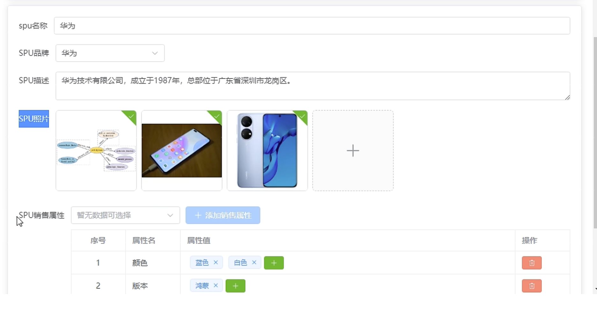

<br>

### SKU (Stock Keeping Unit): 库存量最小单位
Sku 是指库存管理单位, 通常是一个唯一的产品代码或编号，用于区分不同的商品。

每个产品的不同颜色、尺码、包装或其他特性都可以有不同的 sku。Sku 通常用于帮助零售商追踪库存，了解哪些商品卖得好，哪些商品需要补货，以及帮助顾客找到他们想要购买的具体商品。

每个 sku 对应着特定的产品变体，可以帮助商家精确地追踪和管理库存。

<br>

比如上面我们说一个 华为就是一个 spu, 那么华为下面有很多的手机型号, 每一种机型就可以称之为一个sku

当我们要是为华为 新增一个sku的话 就相当于增加一个机型, 某一款对应的手机就是一个sku

<br>

### spu 和 sku 的关系
类似java中的 类 和 实例 之间的关系 

<br><br>

## SKU管理: 获取 已有的spu数据 进行展示 

### 接口
当我们search区域 在3级分类一确定的时候 发起的请求 (相当于页面的第一个请求)

```s
/admin/product/{page}/{limit}?category3Id=xx

http://139.198.104.58:8209/admin/product/1/3?category3Id=61
```

- 请求方式: get 分页接口
- 请求参数:
  - url后拼接 pageNo 和 pageSize
  - query形式携带 category3Id 三级分类的id

<br>

**响应:**  
```js
{
  "code": 200,
  "message": "成功",
  "data": {
    "records": [
      {
        "id": 7053,
        "createTime": "2023-11-01 19:53:20",
        "updateTime": "2023-11-01 19:53:20",
        "spuName": "1196986",
        "description": "2++2+6",
        "category3Id": 61,
        "tmId": 2,
        "spuSaleAttrList": null,
        "spuImageList": null,
        "spuPosterList": null
      },
      ...
    ],
    "total": 12,
    "size": 3,
    "current": 1,
    "orders": [],
    "optimizeCountSql": true,
    "hitCount": false,
    "countId": null,
    "maxLimit": null,
    "searchCount": true,
    "pages": 4
  },
  "ok": true
}
```  

<br>

**要点:**  
当我们选择完3级分类后, 会发起请求 获取spu 列表数据, 该接口下的数据中我们能看到有
- id
- spuName
- description
- category3Id: 所属哪个3级分类id下的spu
- tmId: spu下某个品牌id (oppo 下的 s1)
- spuSaleAttrList: 修改spu界面需要使用到的 spu销售属性的数组 该接口下为null
- spuImageList: 修改spu界面需要使用到的 spu照片墙 该接口下为null
- spuPosterList

<br>

但是 spuSaleAttrList, spuImageList, spuPosterList 都为null, 这3个字段都是在我们点击行内 [修改] 按钮的时候 在展示spu详细界面中 需要用到的字段
- spuSaleAttrList: 属性列表
- spuImageList: 照片墙

但是该接口下我们用不到, 所以是null, 老师将它们的数据放在了另一个接口中, 也就是我们点击 [修改] 按钮的时候 需要发起请求

<br>

### 接口Ts类型
```js
type spuItemType = {
  id?: number
  spuName: string
  description: string
  // 所属哪个3级分类id下的spu
  category3Id: number | string
  // spu下某个品牌id (oppo 下的 s1)
  tmId: number
  // 修改spu界面需要使用到的 spu销售属性的数组 该接口下为null
  spuSaleAttrList: null
  // 修改spu界面需要使用到的 spu照片 该接口下为null
  spuImageList: null
  spuPosterList: null
}

type spuResType = {
  records: spuItemType[]
  total: number
  size: number
  current: number
  orders: []
  optimizeCountSql: boolean
  hitCount: boolean
  countId: null
  maxLimit: null
  searchCount: boolean
  pages: number
}

export type { spuItemType, spuResType }


import service from '@/utils/request'
import type { commonResType } from '@/api/commonTypes'
import { spuResType } from './type'

enum API {
  // /{page}/{limit}?category3Id=xx'
  GET_TABLEDATA = '/admin/product'
}

// 组件初挂载 展示列表数据的接口
type getSpuListApiType = (
  pageNo: number,
  pageSize: number,
  category3Id: number
) => Promise<commonResType<spuResType>>
export const getSpuListApi: getSpuListApiType = (
  pageNo,
  pageSize,
  category3Id
) => {
  return service.get(
    `${API.GET_TABLEDATA}/${pageNo}/${pageSize}?category3Id=${category3Id}`
  )
}
```

<br>

### 发起请求的实际:
当3级分类确定后, 我们在页面根据上面的接口发起请求, 请求spu的列表数据
```html
<script setup lang="ts">
import { watch, reactive, ref } from 'vue'
import useCategoryStore from '@/store/categoryStore.ts'

import { getSpuListApi } from '@/api/product/spu'

import type { spuItemType } from '@/api/product/spu/type.ts'

import SearchCategory from '@/components/SearchCategory/index.vue'

defineOptions({
  name: 'Spu'
})

const categoryStore = useCategoryStore()

// table组件和form切换的变量: true - table, false - form
const switchTableStructure = ref<boolean>(true)
const tableHeaders = reactive([
  {
    prop: 'spuName',
    label: 'SPU名称'
  },
  {
    prop: 'description',
    label: 'SPU描述'
  }
])
// 表格数据
const tableData = reactive<spuItemType[]>([])

const paginationForm = reactive({
  pageNo: 1,
  pageSize: 5,
  total: 0
})

// ----- methos -----
const getTableList = async () => {
  const res = await getSpuListApi(
    +paginationForm.pageNo,
    +paginationForm.pageSize,
    +categoryStore.category3Id
  )
  if (res.code === 200) {
    tableData.length = 0
    tableData.push(...res.data.records)
    paginationForm.total = res.data.total
  }
}

const changePageSizeHandler = () => {
  // 如果没有 category3Id 的话 不要发起请求
  if (!categoryStore.category3Id) return
  // 每页展示多少条数据 触发回调的话, 让它从第一页显示
  paginationForm.pageNo = 1
  getTableList()
}

// ----- watch -----
// 监听 store 中 三级分类id 的变化
watch(
  () => categoryStore.category3Id,
  (n) => {
    // 1. 当 3级分类id 有变化之后 我们要先清空表格数据
    tableData.length = 0
    // 2. 确保 3级分类id 有了之后我们再发送请求
    if (n) {
      getTableList()
    }
  }
)
</script>
```

<br><br>  

## SKU管理: 界面切换
我们 SPU 管理 应该在3个界面之间进行切换

1. 场景1: [添加SPU] 按钮 + table列表  
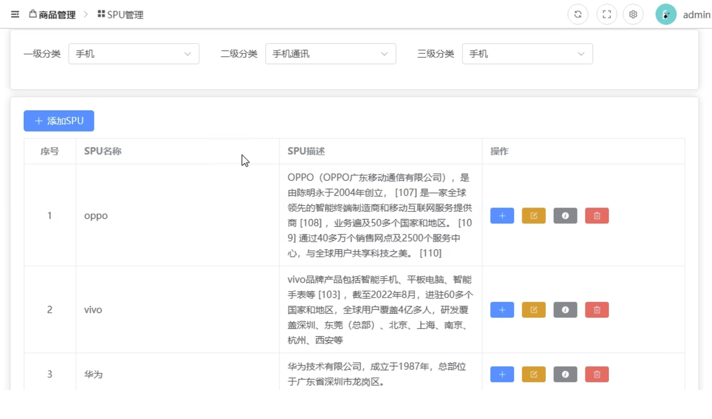

2. 场景2: 点击 [添加SPU] 按钮后 和 修改 SPU 按钮, 展示的表单页面  
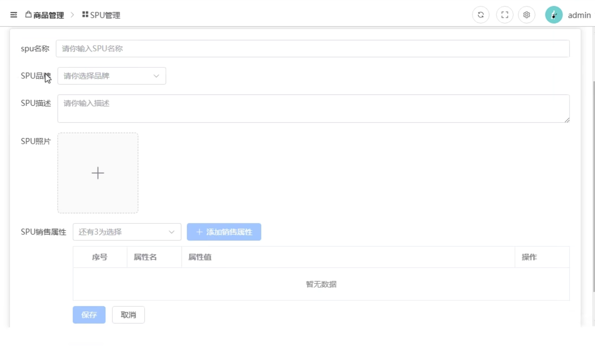

3. 场景3: 点击 [+] 添加 SKU 按钮后, 展示的表单页面  
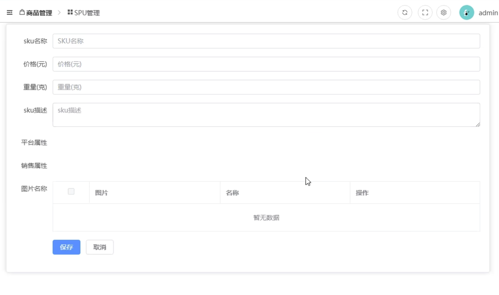

<br> 

### 静态搭建 (略)
1. 照片墙 (upload组件)

<br> 

### 自定义事件的回顾
**子组件:**  
1. 定义 emitsType, 里面是形参列表和函数返回值
2. emit发射事件
3. 父组件监听 并 指明回调
```js
enum SCENE {
  TABLE,
  SPU,
  SKU
}
type emitsType = {
  (e: 'update:switchStructure', scene: SCENE): void
}
const emit = defineEmits<emitsType>()

const cancelHandler = () => {
  // 1. 通知父组件 切换为 table 场景
  emit('update:switchStructure', SCENE.TABLE)
}
```
```html
<SpuForm
  v-if="switchStructure === SCENE.SPU"
  @update:switchStructure="updateStructure"
/>
<script>
  const updateStructure = (structure: SCENE) => {
    switchStructure.value = structure
  }
</script>
```

<br><br> 

## SKU管理: 修改 SPU
我们点击一览表中 [修改] 按钮的时候, 应该将该行的spu的相关数据, **回显到 修改表单 中**

当我们点击行内的修改按钮的时候, 可以获取到如下的数据
```js
{
  "id": 7086,
  "createTime": "2023-11-04 16:35:53",
  "updateTime": "2023-11-04 16:35:53",
  "spuName": "vivo30",
  "description": "lalalla1111111",
  "category3Id": 61,
  "tmId": 6,
  "spuSaleAttrList": null,
  "spuImageList": null,
  "spuPosterList": null
}
```

<br>

### 有哪些回显的数据
1. spu名称: spuName

2. spu品牌: 品牌的数据是一个下拉列表, 罗列的是该spu下的所有品牌, **需发起请求**获取该spu下所有品牌的数据

3. spu描述: description

4. spu照片墙: spuImageList, **需要发起请求**, 获取该spu下所有品牌的图片

5. spu销售属性一览表: spuSaleAttrList, **需要发起请求**, 获取某一个**已有的**spu所拥有的**销售属性** 用于在table中展示

6. spu销售属性下拉列表: 我们的项目中**一共就有3个销售属性(尺码, 颜色, 版本)**, 如果我们在table中已经展示了已有的销售属性 如颜色和版本, 那么下拉列表中所展示的就是**未选择的**尺码属性, 我们下拉列表中**需要发起请求获取项目中所有的销售属性** 然后进行过滤仅展示不存在于table列表中的下拉项

我们**需要发起4个请求** 并 结合点击表格中 [修改] 按钮, 拿到的row中的数据, 才是完整的修改表单中的所有数据

<br><br>

## API接口

### 获取 spu品牌 数据:  
供 spu品牌 的下拉列表使用, 获取全部spu品牌的数据

```s
/admin/product/baseTrademark/getTrademarkList
```

- 请求方式: get
- 参数: 无

<br>

**响应体:**  
```js
{
  "code": 200,
  "message": "成功",
  "data": [
    {
      "id": 1,
      "tmName": "小米",
      "logoUrl": "39.98.123.211/group1/M00/03/D9/rBHu8mHmKC6AQ-j2AAAb72A3EO0942.jpg",
      "createTime": "2021-12-10 01:31:41",
      "updateTime": "2023-04-15 15:48:02",
    },
    ...
  ],
  "ok": true
}
```

<br>

**类型:**  
```js
// 获取所有spu品牌的数据
type getSpuTrademarkListApiType = () => Promise<commonResType<trademarkItem[]>>
export const getSpuTrademarkListApi: getSpuTrademarkListApiType = () => {
  return service.get(API.GET_ALLTRADEMARK)
}
```

<br>

### 获取 spu照片墙 数据:
```s
/admin/product/spuImageList/{spuId}
```

- 请求方式: get请求
- 参数: url后拼接 spuId

<br>

**响应体:**  
```js
{
  "code": 0,
  "data": [
    {
      "id": 0,
      "imgName": "string",
      "imgUrl": "string",
      "spuId": 0,
      "createTime": "2023-11-04T12:38:48.698Z",
      "updateTime": "2023-11-04T12:38:48.698Z"
    }
  ],
  "message": "string",
  "ok": true
}
```  

<br>

**类型:**  
```js
// 图片列表的类型
type spuImageItem = {
  id: number
  imgName: string
  imgUrl: string
  spuId: number
}

// 获取某个spu下的全部的售卖商品的图片的数据
type getImageListBySpuIdType = (
  spuId: number
) => Promise<commonResType<spuImageItem[]>>
export const getImageListBySpuId: getImageListBySpuIdType = (spuId) => {
  return service.get(`${API.GET_SPU_IMAGE_LIST}/${spuId}`)
}
```

<br>

### 获取 spu 已选择的销售属性:
供 spu 修改表单页面的 spu销售属性一览表中使用, 根据 spuId 查看该spu下一共有多少已选择的销售属性

```s
/admin/product/spuSaleAttrList/{spuId}
```

- 请求方式: get请求
- 参数: url后拼接 spuId

<br>

**响应体:**
```js
{
  "code": 0,
  "data": [
    {
      "baseSaleAttrId": 0,
      "createTime": "2023-11-04T12:38:48.699Z",
      "id": 0,
      "saleAttrName": "string",
      "spuId": 0,
      "spuSaleAttrValueList": [
        { 
          "baseSaleAttrId": 0,
          "createTime": "2023-11-04T12:38:48.699Z",
          "id": 0,
          "isChecked": "string",
          "saleAttrName": "string",
          "saleAttrValueName": "string",
          "spuId": 0,
          "updateTime": "2023-11-04T12:38:48.699Z"
        }
      ],
      "updateTime": "2023-11-04T12:38:48.699Z"
    }
  ],
  "message": "string",
  "ok": true
}
```  

<br>

**类型:**
```js
// 销售属性值的类型
type spuSaleAttrValue = {
  id?: number
  spuId: number
  baseSaleAttrId: number
  isChecked?: boolean
  saleAttrName: string
  saleAttrValueName: string
  createTime?: string
  updateTime?: string
}

// 销售属性列表类型
type spuSaleAttrItem = {
  id?: number
  baseSaleAttrId: number
  spuId: number
  saleAttrName: string
  spuSaleAttrValueList: spuSaleAttrValue[]
  createTime?: string
  updateTime?: string
}

// 获取某一个已有spu已选择的销售属性
type getSaleAttrListBySpuIdType = (
  spuId: number
) => Promise<commonResType<spuSaleAttrItem[]>>
export const getSaleAttrListBySpuIdApi: getSaleAttrListBySpuIdType = (
  spuId
) => {
  return service.get(`${API.GET_SALEATTR_LIST}/${spuId}`)
}
```  

<br>

### 获取 spu下 全部属性的列表
供 spu销售属性下拉列表 使用
```s
/admin/product/baseSaleAttrList
```

- 请求方式: get请求
- 参数: 无

<br>

**响应体:**  
```js
{
  "code": 0,
  "data": [
    {
      "id": 0,
      "name": "string",
      "createTime": "2023-11-04T12:38:48.704Z",
      "updateTime": "2023-11-04T12:38:48.704Z"
    }
  ],
  "message": "string",
  "ok": true
}
```  

<br>

**类型:**   
```js
type attrItem = {
  id: number
  name: string
}

type getSaleAttrListApiType = () => Promise<commonResType<attrItem[]>>
export const getSaleAttrListApi: getSaleAttrListApiType = () => {
  return service.get(`${API.GET_SALEATTR_LIST}`)
}
```

<br><br>

## SKU管理: 修改 SPU - 回显数据

### 组织回显数据
我们能拿到的就是点击一览表中的一行中的 [修改] 按钮, 时拿到的 row 对象, 当中有用的仅仅是
- spuName
- description

剩下的需要发4个请求才能拿到, **那我们的这几个请求 在哪发起呢?**
```js
{
  "id": 7086,
  "createTime": "2023-11-04 16:35:53",
  "updateTime": "2023-11-04 16:35:53",
  "spuName": "vivo30",
  "description": "lalalla1111111",
  "category3Id": 61,
  "tmId": 6,
  "spuSaleAttrList": null,
  "spuImageList": null,
  "spuPosterList": null
}
```

<br>

**时机: 点击 [修改] 按钮的时候, 发起请求**   
正常的逻辑是 点击[修改]按钮, 触发 updateSpuHandler 回调, 将该行的数据row传递给 updateSpuHandler
```js
<el-button
  title="修改SPU"
  @click="updateSpuHandler(row)"
/>
```

然后我们在 updateSpuHandler 回调中发起4个请求, 整理好数据后再传递给子组件 ``<SpuForm />``

<br>

**新方式:**  
上面的方式4个请求都是在父组件中发起的, 新方式中我们确保请求是在子组件中发起的, 这样不用再让父组件给子组件传递数据了

1. 给子组件绑定 ref
```html
<!-- 注意: 使用 v-show 如果是 v-if 则获取实例时要使用nextTick -->
<SpuForm
  ref="spuFormRef"
  v-show="switchStructure === SCENE.SPU"
  @update:switchStructure="updateStructure"
/>
```

2. 通过ref获取到子组件实例 (获取子组件中的属性和方法)
```js
// 修改 SPU 回调
const updateSpuHandler = (row: spuItemType): void => {
  switchStructure.value = SCENE.SPU

  // 通过子组件实例调用其 getSpuFormData 方法, 并将row传递过去
  console.log(spuFormRef.value)
  // spuFormRef.value?.getSpuFormData(row)
}
```

3. 子组件对外暴露一个getSpuFormData方法, 我们将row对象传递给子组件, 让子组件在getSpuFormData方法内部发起4个请求
```js
// 对外暴露: 请求表单数据的方法
const getSpuFormData = async (spuData: spuItemType) => {
  // 获取全部的品牌数据: spu品牌的下拉菜单用
  const { data: spuTrademarkListRes } = await getSpuTrademarkListApi()
  console.log('spuTrademarkListRes', spuTrademarkListRes)

  // 获取照片墙的数据
  const { data: imageRes } = await getImageListBySpuIdApi(spuData.id as number)
  console.log('imageRes', imageRes)

  // 获取销售属性 - 一览表的数据 (已选)
  const { data: saleAttrSelectedListRes } =
    await getSaleAttrSelectedListBySpuIdApi(spuData.id as number)
  console.log('saleAttrSelectedListRes', saleAttrSelectedListRes)

  // 获取销售属性 - 下拉菜单的数据 (全部, 应为 全部 - 已选)
  const { data: saleAttrListRes } = await getSaleAttrListApi()
  console.log('saleAttrListRes', saleAttrListRes)
}

// 暴露
defineExpose({
  getSpuFormData
})
```

<br>

### 修改 spu 接口
```s
/admin/product/updateSpuInfo
```

- 请求方式: post
- 参数: spuItemType类型对象
```js
// 图片列表的类型
type spuImageItem = {
  // 已有的有id, 新增的没有id
  id?: number
  imgName: string
  imgUrl: string
  spuId?: number
}
// 销售属性值的类型
type spuSaleAttrValue = {
  id?: number
  spuId?: number
  // 销售属性的id: 该属性值归属于那个销售属性
  baseSaleAttrId: number
  // 销售属性值的名字
  saleAttrValueName: string
  isChecked?: boolean
  saleAttrName?: string
  createTime?: string
  updateTime?: string
}

// 销售属性列表类型
type spuSaleAttrItem = {
  id?: number
  // 销售属性的id
  baseSaleAttrId: number
  // 销售属性名字
  saleAttrName: string
  spuSaleAttrValueList: spuSaleAttrValue[]
  spuId?: number
  createTime?: string
  updateTime?: string
}

// spu 对象
type spuItemType = {
  // 新增的时候不需要id, 修改的时候需要
  id?: number
  // spu名
  spuName: string
  // spu描述
  description: string
  // spu品牌id, 表示该spu属于哪个品牌 (如: oppo 下的 s1)
  tmId: number | string
  // 3级分类id: 给哪个三级分类追加一个spu
  category3Id: number | string
  // 修改spu界面需要使用到的 spu销售属性的数组 该接口下为null
  spuSaleAttrList: null | spuSaleAttrItem[]
  // 照片墙: 修改spu界面需要使用到的 spu照片 该接口下为null
  spuImageList: null | spuImageItem[]
  spuPosterList?: null
}


// 添加 / 更新 spu 接口方法: 虽然请求地址不一样 但因为携带参数一样(是否有id) 封装到一个方法中
// spuData: 新增 或 已有的spu对象
type saveOrUpdateSpuApiType = (
  spuData: spuItemType
) => Promise<commonResType<null>>
export const saveOrUpdateSpuApi: saveOrUpdateSpuApiType = (spuData) => {
  if (spuData.id) {
    // 更新操作
    return service.post(API.UPDATE_SPU, spuData)
  } else {
    // 添加操作
    return service.post(API.ADD_SPU, spuData)
  }
}
```

<br>

### 添加 spu 接口
```s
/admin/product/saveSpuInfo
```

- 请求方式: post
- 参数: spuItemType类型对象 同上面的 修改接口

<br>

### 展示 和 收集 spu 数据
当我们点击 一览表中的 [修改] 按钮的时候, 会将已有的spuData数据(row) 传递给子组件

我们在子组件中, 展示spuData的数据, 因为要发起请求 所以我们也要收集数据, 要收集的字段一共应该有7个

<br>

**row数据:**  
```js
type spuItemType = {
  // 新增的时候不需要id, 修改的时候需要
  id?: number
  // spu名
  spuName: string
  // spu描述
  description: string
  // spu品牌id, 表示该spu属于哪个品牌 (如: oppo 下的 s1)
  tmId: number | string
  // 3级分类id: 给哪个三级分类追加一个spu
  category3Id: number | string
  // 修改spu界面需要使用到的 spu销售属性的数组 该接口下为null
  spuSaleAttrList: null | spuSaleAttrItem[]
  // 照片墙: 修改spu界面需要使用到的 spu照片 该接口下为null
  spuImageList: null | spuImageItem[]
  // 无用
  spuPosterList?: null
}
```

- id: 已有的row中携带, 新增没有 修改有
- spuName: 已有的row中携带
- description: 已有的row中携带
- category3Id: 已有的row中携带

- tmId: 需要发起请求, 通过spu品牌下拉列表收集
- spuImageList: 需要发起请求
- spuSaleAttrList: 需要发起请求

<br>

**收集数据的逻辑:**  
我们将row传递给子组件, 这个row其实就是我们发送请求的时候需要携带的参数对象  

而我们将收到的 row 对象, 转存在组件自身的状态中 **echoSpuForm.supParams**, 因为添加和修改都要使用 supParams, 我们使用 v-model 将数据绑定到 supParams 中

```js
const echoSpuForm = reactive<echoSpuFormType>({
  // 全部的品牌数据: spu品牌的下拉菜单用 收集字段 tmId 用
  trademarkList: [],
  // 照片墙的数据
  imageList: [],
  // 销售属性 - 一览表的数据 (已选)
  saleAttrSelectedList: [],
  // 获取销售属性 - 下拉菜单的数据 (全部, 应为 全部 - 已选)
  saleAttrList: [],


  // 用于存储父组件传递过来的 row (已有的spu数据), 也是提交请求时的参数
  supParams: {
    // id字段: 新增的时候不需要, 修改的时候需要
    // 3级分类id: 给哪个三级分类追加一个spu - 已有row中携带
    category3Id: '',
    // spu名 - 已有row中携带
    spuName: '',
    // spu描述 - 已有row中携带
    description: '',
    // spu品牌id, 表示该spu属于哪个品牌 (如: oppo 下的 s1) - 通过 spu品牌下拉列表收集
    tmId: '',
    // 照片墙数据: 通过请求获取
    spuImageList: [],
    // 销售属性:
    spuSaleAttrList: []
  }
})

// 对外暴露: 请求表单数据的方法
const getSpuFormData = async (spuData: spuItemType) => {
  // 将父组件传递过来的 row 存储起来
  echoSpuForm.supParams = spuData
  ...
}
```

<br>

### 展示 和 收集 spu 照片墙
我们使用 el-upload 需要发起请求, 将新增的图片上传到服务器

<br>

**接口地址:**  
```js
/admin/product/fileUpload

/api/admin/product/fileUpload
``` 

<br>

**响应体:**  
```js
{
  "code": 200,
  "message": "成功",
  "data": "http://139.198.127.41:9000/sph/20231105/pic03.png",
  "ok": true
}
```

<br>

**el-upload收集照片墙相关数据**  
```html
<el-upload
  v-model:file-list="echoSpuForm.imageList"
  action="/api/admin/product/fileUpload"
  list-type="picture-card"
>
```

我们使用 v-model 给 upload 组件绑定了一个 数组对象, 而我们通过 el-upload 上传到服务器, **且返回的数据也会收集到该数组对象中**

<br>

**注意:**  
我们已有的图片对象中的字段为 imgName 和 imgUrl 但是 upload给我们返回的字段却是 name 和 url, 这个位置的差异是需要处理的
```js
[
  {
    "name": "捕获.JPG",
    "url": "http://139.198.127.41:9000/sph/20231104/捕获.JPG",
    "uid": 1699164712518,
    "status": "success"
  },
  {
    "name": "捕获2.JPG",
    "url": "http://139.198.127.41:9000/sph/20231104/捕获2.JPG",
    "uid": 1699164712519,
    "status": "success"
  },
  {
    "name": "pic01.png",
    "percentage": 0,
    "status": "ready",
    "size": 524446,
    "raw": "[object File]",
    "uid": 1699165432122,
    "url": "blob:http://localhost:5173/c4ed690a-b1c8-4db8-8cb4-d4e5e76f92d3"
  }
]
```

<br>

**使用 v-model 收集数据:**  
```html
<el-upload
  v-model:file-list="echoSpuForm.imageList"
  action="/api/admin/product/fileUpload"
  list-type="picture-card"
  :on-preview="picturePreviewHandler"
  :on-remove="pictureRemoveHandler"
  :before-upload="pictureBeforeUploadHandler"
>
```

<br>

### spu销售属性: 下拉菜单的数据展示
我们项目中一共有3个销售属性 颜色 尺码 版本
- 我们在一览表中展示的当前已有spu的销售属性
- 我们在下拉菜单中应该展示的是 除了一览表中的销售属性

<br>

- 比如一览表中展示了颜色, 那么下拉菜单中应该有 尺码和版本
- 比如一览表中展示了颜色 尺码, 那么下拉菜单中应该有 版本

<br>

**怎么在下拉菜单中展示除了一览表中剩余的销售属性呢?**  
我们会发起请求拿到项目中所有的销售属性列表
```js
[
  { "id": 1, "name": "颜色" },
  { "id": 2, "name": "版本" },
  { "id": 3, "name": "尺码" }
]
```

我们在销售属性一览表中的数据为 saleAttrName
```js
[
  {
    "id": 26473,
    "createTime": null,
    "updateTime": null,
    "spuId": 7019,
    "baseSaleAttrId": 1,
    "saleAttrName": "颜色",
    "spuSaleAttrValueList": [
      {
        "id": 16220,
        "createTime": null,
        "updateTime": null,
        "spuId": 7019,
        "baseSaleAttrId": 1,
        "saleAttrValueName": "黑粉",
        "saleAttrName": "颜色",
        "isChecked": null
      }
    ]
  },
  ...
]
```

<br>

**方法: filter + every**  
我们将一览表中没有的销售属性过滤出来交给下拉列表
```js
// 计算出当前spu未选择的销售属性: spu销售属性 - 下拉菜单用
const unSelectSaleAttrList = computed(() => {
  // 类似双重for遍历

  // 1. 过滤 全部属性 的数组
  return echoSpuForm.saleAttrList.filter((item) => {
    // 2. every遍历 已有属性 的数组, 看看
    return echoSpuForm.saleAttrSelectedList.every((val) => {
      return val.saleAttrName !== item.name
    })
  })
})

console.log('unSelectSaleAttrList', unSelectSaleAttrList)
```

<br><br>

## 整理: 收集数据
当我们点击 一览表中 [修改] 按钮的时候, 会将 row 交给子组件 SpuForm
```js
const updateSpuHandler = (row: spuItemType): void => {
  switchStructure.value = SCENE.SPU

  spuFormRef.value?.getSpuFormData(row)
}
```

<br>

子组件要发送 修改 spu 和 添加 spu 的请求需要提交如下格式的数据
```js
{
  "id": 7086,
  "spuName": "vivo30",
  "description": "lalalla1111111",
  "category3Id": 61,
  "tmId": 6,
  "spuSaleAttrList": null,
  "spuImageList": null,
}
```

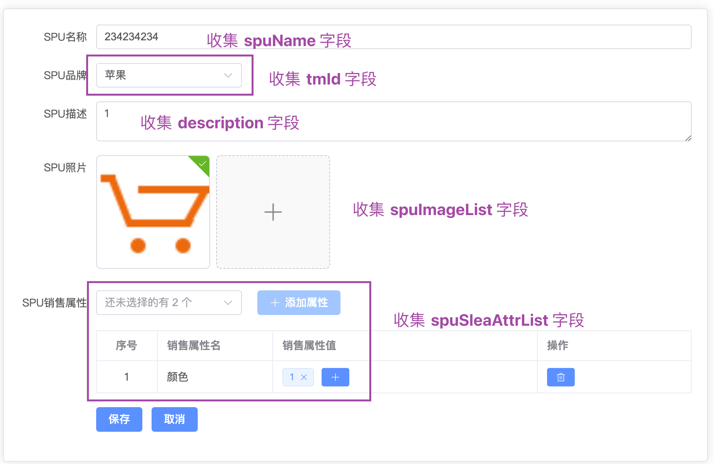

<br>

我们会在子组件的 updateSpuHandler 发起4个请求
1. 获取全部的品牌数据: spu品牌的下拉菜单用 用于收集 tmId 字段
2. 获取照片墙的数据
3. 获取销售属性 - 一览表的数据 (已选)
4. 获取销售属性 - 下拉菜单的数据
```js
const getSpuFormData = async (spuData: spuItemType) => {
  // 将父组件传递过来的 row 存储起来
  echoSpuForm.supParams = spuData

  // 获取全部的品牌数据: spu品牌的下拉菜单用
  const { data: spuTrademarkListRes } = await getSpuTrademarkListApi()
  // console.log('spuTrademarkListRes', spuTrademarkListRes)
  echoSpuForm.trademarkList = spuTrademarkListRes

  // 获取照片墙的数据
  const { data: imageRes } = await getImageListBySpuIdApi(spuData.id as number)
  // console.log('imageRes', imageRes)
  // 加工下 imageRes 使用upload组件展示数据需要name和url字段
  const imageResWithUploadList = imageRes.map((item) => {
    return {
      name: item.imgName,
      url: item.imgUrl
    }
  })
  echoSpuForm.imageList = imageResWithUploadList

  // 获取销售属性 - 一览表的数据 (已选)
  const { data: saleAttrSelectedListRes } =
    await getSaleAttrSelectedListBySpuIdApi(spuData.id as number)
  // console.log('saleAttrSelectedListRes', saleAttrSelectedListRes)
  echoSpuForm.saleAttrSelectedList = saleAttrSelectedListRes

  // 获取销售属性 - 下拉菜单的数据 (全部, 应为 全部 - 已选)
  const { data: saleAttrListRes } = await getSaleAttrListApi()
  // console.log('saleAttrListRes', saleAttrListRes)
  echoSpuForm.saleAttrList = saleAttrListRes
}
```

<br>

我们在子组件中分将上述的4个请求回来的数据 和 父组件传递过来的 row, 分别进行了保存, 并没有组织在一起

```js
const echoSpuForm = reactive<echoSpuFormType>({
  // 全部的品牌数据: spu品牌的下拉菜单用 收集字段 tmId 用
  trademarkList: [],
  // 照片墙的数据
  imageList: [],
  // 销售属性 - 一览表的数据 (已选)
  saleAttrSelectedList: [],
  // 获取销售属性 - 下拉菜单的数据 (全部, 应为 全部 - 已选)
  saleAttrList: [],
  // 销售属性 下拉列表: 收集还未选择的销售id和属性值名
  unAttrIdAndName: '',
  // 用于存储父组件传递过来的 row (已有的spu数据), 也是提交请求时的参数
  supParams: {
    // id字段: 新增的时候不需要, 修改的时候需要
    // 3级分类id: 给哪个三级分类追加一个spu - 已有row中携带
    category3Id: '',
    // spu名 - 已有row中携带
    spuName: '',
    // spu描述 - 已有row中携带
    description: '',
    // spu品牌id, 表示该spu属于哪个品牌 (如: oppo 下的 s1) - 通过 spu品牌下拉列表收集
    tmId: '',
    // 照片墙数据: 通过请求获取
    spuImageList: [],
    // 销售属性:
    spuSaleAttrList: []
  }
})
```

```html
<el-form label-width="100">
  <el-form-item label="SPU名称">
    <!-- 收集 spuName -->
    <el-input
      v-model="echoSpuForm.supParams.spuName"
      placeholder="请你输入SPU名称"
    ></el-input>
  </el-form-item>
  <el-form-item label="SPU品牌">
    <!-- 收集 spu品牌 -->
    <el-select v-model="echoSpuForm.supParams.tmId">
      <el-option
        v-for="item in echoSpuForm.trademarkList"
        :key="item.id"
        :label="item.tmName"
        :value="item.id"
      />
    </el-select>
  </el-form-item>
  <el-form-item label="SPU描述">
    <el-input
      v-model="echoSpuForm.supParams.description"
      type="textarea"
      placeholder="请你输入SPU描述"
    ></el-input>
  </el-form-item>
  <el-form-item label="SPU照片">
    <el-upload
      v-model:file-list="echoSpuForm.imageList"
      action="/api/admin/product/fileUpload"
      list-type="picture-card"
      :on-preview="picturePreviewHandler"
      :on-remove="pictureRemoveHandler"
      :before-upload="pictureBeforeUploadHandler"
    >
      <el-icon><Plus /></el-icon>
    </el-upload>

    <el-dialog v-model="picDialogVisible">
      
    </el-dialog>
  </el-form-item>
  <el-form-item label="SPU销售属性">
    <!-- 展示销售属性的下拉菜单 -->
    <el-select
      v-model="echoSpuForm.unAttrIdAndName"
      :placeholder="
        unSelectSaleAttrList.length
          ? `还未选择的有 ${unSelectSaleAttrList.length} 个`
          : `无`
      "
      :popper-options="{
        modifiers: [{ name: 'computeStyles', options: { adaptive: false } }]
      }"
    >
      <!-- 因为我们要收集的是 id 和 name 两个字段, :value="`${item.id}:${item.name}`" 冒号的作用是作为分隔符的 -->
      <el-option
        v-for="item in unSelectSaleAttrList"
        :key="item.id"
        :label="item.name"
        :value="`${item.id}:${item.name}`"
      ></el-option>
    </el-select>
    <el-button
      style="margin-left: 20px"
      type="primary"
      icon="Plus"
      :disabled="echoSpuForm.unAttrIdAndName ? false : true"
      @click="addAttrHandler"
    >
      添加属性
    </el-button>
    <!-- 展示销售属性值 -->
    <el-table
      style="margin-top: 20px"
      border
      :data="echoSpuForm.saleAttrSelectedList"
    >
      <el-table-column
        label="序号"
        type="index"
        align="center"
        width="80"
      ></el-table-column>
      <el-table-column
        label="销售属性名"
        width="150"
        prop="saleAttrName"
      ></el-table-column>
      <el-table-column label="销售属性值" prop="spuSaleAttrValueList">
        <template #default="{ row }">
          <el-tag
            style="margin-right: 10px"
            v-for="(item, index) in row.spuSaleAttrValueList"
            :key="item.id"
            :closable="true"
            @close="row.spuSaleAttrValueList.splice(index, 1)"
          >
            {{ item.saleAttrValueName }}
          </el-tag>
          <el-input
            v-if="row.switchStructure"
            v-model="row.saleAttrValue"
            style="width: 120px"
            size="small"
            placeholder="请输入属性值"
            @blur="changeToReviewMode(row)"
          ></el-input>
          <el-button
            v-else
            type="primary"
            size="small"
            icon="Plus"
            @click="changeToEditMode(row)"
          ></el-button>
        </template>
      </el-table-column>
      <el-table-column label="操作" width="200">
        <template #default="{ $index }">
          <el-button
            type="primary"
            size="small"
            icon="Delete"
            @click="deleteAttrHandler($index)"
          ></el-button>
        </template>
      </el-table-column>
    </el-table>
  </el-form-item>
  <el-form-item>
    <el-button type="primary">保存</el-button>
    <el-button type="primary" @click="cancelHandler">取消</el-button>
  </el-form-item>
</el-form>
```

<br>

总结, 我们收集的数据在各个字段里, 比较零散 需要在提交请求之前对这些零散的数据进行整理

<br><br>

## SKU管理: 修改 SPU - 保存
```js
// 保存按钮的回调
const saveHandler = async (): Promise<void> => {
  // 1. 整理收集到的数据 整理出 params 对象
  // 整理照片墙的数据
  echoSpuForm.supParams.spuImageList = echoSpuForm.imageList.map(
    (item: any) => {
      return {
        imgName: item.name,
        // 已有的图片使用 item.url (服务器返回的存储于服务器的图片的url), 新增的话(item为upload组件处理过的对象)需要使用 item.response.data 中 http的图片url
        /*
      {
        "name": "pic01.png",
        "percentage": 100,
        "status": "success",
        "size": 524446,
        "raw": {
            "uid": 1699188569074
        },
        "uid": 1699188569074,
        "url": "blob:http://localhost:5173/a61384a5-4a4a-49c3-bd9d-1cabd38ba9ea",
        "response": {
          "code": 200,
          "message": "成功",
          "data": "http://139.198.127.41:9000/sph/20231105/pic01.png",
          "ok": true
        }
      }
      */
        imgUrl: (item.response && item.response?.data) || item.url
      }
    }
  )
  // 整理 spuSaleAttrList 销售属性数据
  echoSpuForm.supParams.spuSaleAttrList = echoSpuForm.saleAttrSelectedList

  // 2. 发起请求: 添加 / 修改
  const res = await saveOrUpdateSpuApi(echoSpuForm.supParams)
  console.log(res)
  // 3. 请求后的处理
  if (res.code === 200) {
    ElMessage({
      type: 'success',
      message: '更新成功'
    })

    // 更新成功后, 切换表格组件
    emit('update:switchStructure', SCENE.TABLE)
  } else {
    ElMessage({
      type: 'error',
      message: '更新失败'
    })
  }
}
```

<br><br>

## SPU管理: 添加 SPU - 保存
当我们点击 [新增spu] 按钮的时候, 会切换到表单界面

切换到表单界面后也需要发起请求, 但是照片墙 和 销售属性(一览表) 不用请求了 我们只需要发起
1. 请求 spu品牌, 下拉列表用
2. 请求 spu销售属性, 下拉列表用

<br>

### 照片墙 默认值
```html
<el-table-column label="操作">
  <template #default="{ row }">
    <el-button type="primary" size="small" @click="handler(row)"
      >设置默认</el-button
    >
  </template>
</el-table-column>

<script>
  //设置默认图片的方法回调
  const handler = (row: spuImageItem) => {
    // 排他思想 方式1: 点击的时候,全部图片的的复选框不勾选
    // imgArr.forEach((item: spuImageItem) => {
    //   tableRef.value?.toggleRowSelection(item, false)
    // })
    // 排他思想 方式2:
    tableRef.value?.clearSelection()
    //选中的图片才勾选
    tableRef.value?.toggleRowSelection(row, true)
    //收集图片地址
    skuForm.skuDefaultImg = row.imgUrl as string
  }
</script>
```

<br>

### 展示 sku列表 [小眼睛图标]
dialog里面放的table

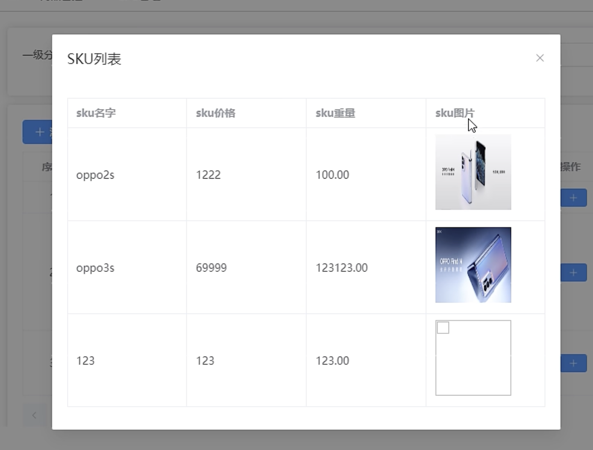

<br>

我们点击 小眼睛图标 会根据已有的spuId发起请求, 拿到数据 展示数据

<br>

```html
<!-- 查看 sku 列表的对话框 -->
<el-dialog v-model="viewSkuListVisible" title="SKU列表">
  <el-table :data="skuList" border>
    <el-table-column label="sku名字" prop="skuName"></el-table-column>
    <el-table-column label="sku价格" prop="price"></el-table-column>
    <el-table-column label="sku重量" prop="weight"></el-table-column>
    <el-table-column label="sku图片">
      <template #default="{ row }">
        <div class="img-wrapper">
          
        </div>
      </template>
    </el-table-column>
  </el-table>
</el-dialog>
```

<br>

### 删除已有的spu
根据 spuId 删除该行数据

<br>

## SPU模块代码:

### 主页
```html
<script setup lang="ts">
import { watch, reactive, ref, onBeforeUnmount } from 'vue'
import useCategoryStore from '@/store/categoryStore.ts'

import { getSpuListApi, getSkuListApi, deleteSpuApi } from '@/api/product/spu'

import type { SkuDataType, spuItemType } from '@/api/product/spu/type.ts'

import SearchCategory from '@/components/SearchCategory/index.vue'
import SpuForm from './components/SpuForm.vue'
import SkuForm from './components/SkuForm.vue'
import { ElMessage } from 'element-plus'

defineOptions({
  name: 'Spu'
})

const categoryStore = useCategoryStore()

// 获取 spuForm 子组件实例
const spuFormRef = ref<InstanceType<typeof SpuForm>>()

// 获取 spuForm 子组件实例
const skuFormRef = ref<InstanceType<typeof SkuForm>>()

// SPU管理 界面切换的控制变量
enum SCENE {
  TABLE,
  SPU,
  SKU
}
const switchStructure = ref<SCENE>(SCENE.TABLE)

// 控制查看 sku 列表的显示与隐藏的变量
const viewSkuListVisible = ref<boolean>(false)

const tableHeaders = reactive([
  {
    prop: 'spuName',
    label: 'SPU名称'
  },
  {
    prop: 'description',
    label: 'SPU描述'
  }
])
// 表格数据
const tableData = reactive<spuItemType[]>([])

const paginationForm = reactive({
  pageNo: 1,
  pageSize: 5,
  total: 0
})

const skuList = reactive<SkuDataType[]>([])

// ----- methos -----
const getTableList = async () => {
  const res = await getSpuListApi(
    +paginationForm.pageNo,
    +paginationForm.pageSize,
    +categoryStore.category3Id
  )
  if (res.code === 200) {
    tableData.length = 0
    tableData.push(...res.data.records)
    paginationForm.total = res.data.total
  }
}

const changePageSizeHandler = () => {
  // 如果没有 category3Id 的话 不要发起请求
  if (!categoryStore.category3Id) return
  // 每页展示多少条数据 触发回调的话, 让它从第一页显示
  paginationForm.pageNo = 1
  getTableList()
}

// 添加 SPU 回调
const addSpuHandler = () => {
  switchStructure.value = SCENE.SPU
  spuFormRef.value?.initSpuFormData(+categoryStore.category3Id)
}
// 修改 SPU 回调
const updateSpuHandler = (row: spuItemType): void => {
  /*
  row: {
    id?: number | undefined;
    spuName: string;
    description: string;
    category3Id: number | string;
    tmId: number;
    spuSaleAttrList: null;
    spuImageList: null;
    spuPosterList: null;
  }
  */
  switchStructure.value = SCENE.SPU

  // 通过子组件实例调用其 getSpuFormData 方法, 并将row传递过去
  spuFormRef.value?.getSpuFormData(row)
}
// 添加 SKU 回调
const addSkuHandler = (row: spuItemType) => {
  switchStructure.value = SCENE.SKU

  // 通过子组件实例调用其 getSpuFormData 方法, getSkuFormData需要c1Id, c2Id, c3Id, spuId, 其中 c3Id 和 spuId 在row中
  skuFormRef.value?.getSkuFormData(
    +categoryStore.category1Id,
    +categoryStore.category2Id,
    row
  )
}

// 查看 SKU 列表
const viewSkuList = async (row: spuItemType): Promise<void> => {
  const res = await getSkuListApi(row.id as number)
  skuList.length = 0
  skuList.push(...res.data)

  // 展示 对话框
  viewSkuListVisible.value = true
}

const deleteSpuHandler = async (row: spuItemType): Promise<void> => {
  const res = await deleteSpuApi(row.id as number)
  if (res.code === 200) {
    ElMessage({
      type: 'success',
      message: '删除成功'
    })
    await getTableList()
  } else {
    ElMessage({
      type: 'error',
      message: `删除失败: ${res.message}`
    })
  }
}

// 监听自定义事件
const updateStructure = (structure: SCENE) => {
  switchStructure.value = structure
  // 切换场景后 再次刷新列表
  getTableList()
}

// ----- watch -----
// 监听 store 中 三级分类id 的变化
watch(
  () => categoryStore.category3Id,
  (n) => {
    // 1. 当 3级分类id 有变化之后 我们要先清空表格数据
    tableData.length = 0
    // 2. 确保 3级分类id 有了之后我们再发送请求
    if (n) {
      getTableList()
    }
  }
)

onBeforeUnmount(() => {
  // 路由组件销毁前 清空仓库中关于分类的数据
  categoryStore.$reset()
})
</script>

<template>
  <div class="spu-container">
    <!-- search are -->
    <SearchCategory :switchTableStructure="switchStructure === SCENE.TABLE" />
    <el-card class="spu-main">
      <!-- 表格区域: 切换 -->
      <div v-if="switchStructure === SCENE.TABLE" class="spu-main__list">
        <el-button
          type="primary"
          icon="Plus"
          :disabled="categoryStore.category3Id ? false : true"
          @click="addSpuHandler"
        >
          添加SPU
        </el-button>
        <el-table border :data="tableData">
          <el-table-column
            type="index"
            width="80"
            align="center"
            label="序号"
          />
          <el-table-column
            v-for="(item, index) in tableHeaders"
            :key="index"
            :prop="item.prop"
            :label="item.label"
          >
          </el-table-column>
          <el-table-column label="操作">
            <template #default="{ row }">
              <el-button
                type="primary"
                size="small"
                circle
                icon="Plus"
                title="添加SKU"
                @click="addSkuHandler(row)"
              />
              <el-button
                type="primary"
                size="small"
                circle
                icon="Edit"
                title="修改SPU"
                @click="updateSpuHandler(row)"
              />
              <el-button
                type="primary"
                size="small"
                circle
                icon="View"
                title="查看SPU"
                @click="viewSkuList(row)"
              />
              <el-button
                type="primary"
                size="small"
                circle
                icon="Delete"
                title="删除SPU"
                @click="deleteSpuHandler(row)"
              />
            </template>
          </el-table-column>
        </el-table>
        <!-- 分页器 -->
        <div class="spu-main__pagination">
          <el-pagination
            v-model:current-page="paginationForm.pageNo"
            v-model:page-size="paginationForm.pageSize"
            :page-sizes="[3, 5, 7, 9]"
            :background="true"
            :small="true"
            layout="prev, pager, next, jumper, -> , sizes, total"
            :total="paginationForm.total"
            @current-change="getTableList"
            @size-change="changePageSizeHandler"
          />
        </div>
      </div>
      <!-- 添加 / 修改 表单区域: 切换 -->
      <SpuForm
        ref="spuFormRef"
        v-show="switchStructure === SCENE.SPU"
        @update:switchStructure="updateStructure"
      />
      <!-- 添加 sku 表单区域: 切换 -->
      <SkuForm
        ref="skuFormRef"
        v-show="switchStructure === SCENE.SKU"
        @update:switchStructure="updateStructure"
      />
    </el-card>
    <!-- 查看 sku 列表的对话框 -->
    <el-dialog v-model="viewSkuListVisible" title="SKU列表">
      <el-table :data="skuList" border>
        <el-table-column label="sku名字" prop="skuName"></el-table-column>
        <el-table-column label="sku价格" prop="price"></el-table-column>
        <el-table-column label="sku重量" prop="weight"></el-table-column>
        <el-table-column label="sku图片">
          <template #default="{ row }">
            <div class="img-wrapper">
              
            </div>
          </template>
        </el-table-column>
      </el-table>
    </el-dialog>
  </div>
</template>

<style scoped lang="scss">
.spu-container {
  .spu-main {
    margin-top: 20px;

    &__list .el-table {
      margin-top: 10px;
    }
    &__pagination {
      margin-top: 10px;
    }
  }
  .img-wrapper {
    width: 100%;
    text-align: center;
    img {
      width: 80%;
      height: auto;
      vertical-align: bottom;
    }
  }
}
</style>
```

<br>

### 子组件 SpuForm
```html
<script setup lang="ts">
import { ref, reactive, computed } from 'vue'
import { ElMessage } from 'element-plus'
import type {
  spuItemType,
  spuImageItem,
  attrItem,
  spuSaleAttrItem,
  spuSaleAttrValue
} from '@/api/product/spu/type.ts'
import type { trademarkItem } from '@/api/product/trademark/type.ts'
import type { UploadProps } from 'element-plus'

import {
  getSpuTrademarkListApi,
  getImageListBySpuIdApi,
  getSaleAttrSelectedListBySpuIdApi,
  getSaleAttrListApi,
  saveOrUpdateSpuApi
} from '@/api/product/spu'

defineOptions({
  name: 'SpuForm'
})

// 控制 el-upload 点击图片后展示图片的对话框 控制变量
const picDialogVisible = ref<boolean>(false)
const picDialogImageUrl = ref<string>('')

type echoSpuFormType = {
  trademarkList: trademarkItem[]
  imageList: spuImageItem[]
  saleAttrSelectedList: spuSaleAttrItem[]
  saleAttrList: attrItem[]
  supParams: spuItemType
  unAttrIdAndName: string
}
// 回显spu表单数据
const echoSpuForm = reactive<echoSpuFormType>({
  // 全部的品牌数据: spu品牌的下拉菜单用 收集字段 tmId 用
  trademarkList: [],
  // 照片墙的数据
  imageList: [],
  // 销售属性 - 一览表的数据 (已选)
  saleAttrSelectedList: [],
  // 获取销售属性 - 下拉菜单的数据 (全部, 应为 全部 - 已选)
  saleAttrList: [],
  // 销售属性 下拉列表: 收集还未选择的销售id和属性值名
  unAttrIdAndName: '',
  // 用于存储父组件传递过来的 row (已有的spu数据), 也是提交请求时的参数
  supParams: {
    // id字段: 新增的时候不需要, 修改的时候需要
    // 3级分类id: 给哪个三级分类追加一个spu - 已有row中携带
    category3Id: '',
    // spu名 - 已有row中携带
    spuName: '',
    // spu描述 - 已有row中携带
    description: '',
    // spu品牌id, 表示该spu属于哪个品牌 (如: oppo 下的 s1) - 通过 spu品牌下拉列表收集
    tmId: '',
    // 照片墙数据: 通过请求获取
    spuImageList: [],
    // 销售属性:
    spuSaleAttrList: []
  }
})

enum SCENE {
  TABLE,
  SPU,
  SKU
}
type emitsType = {
  (e: 'update:switchStructure', scene: SCENE): void
}
const emit = defineEmits<emitsType>()

const cancelHandler = () => {
  // 1. 通知父组件 切换为 table 场景
  emit('update:switchStructure', SCENE.TABLE)
}

// 对外暴露: 请求表单数据的方法
const getSpuFormData = async (spuData: spuItemType) => {
  // 将父组件传递过来的 row 存储起来
  echoSpuForm.supParams = spuData

  // 获取全部的品牌数据: spu品牌的下拉菜单用
  const { data: spuTrademarkListRes } = await getSpuTrademarkListApi()
  // console.log('spuTrademarkListRes', spuTrademarkListRes)
  echoSpuForm.trademarkList = spuTrademarkListRes

  // 获取照片墙的数据
  const { data: imageRes } = await getImageListBySpuIdApi(spuData.id as number)
  // console.log('imageRes', imageRes)
  // 加工下 imageRes 使用upload组件展示数据需要name和url字段
  const imageResWithUploadList = imageRes.map((item) => {
    return {
      name: item.imgName,
      url: item.imgUrl
    }
  })
  echoSpuForm.imageList = imageResWithUploadList

  // 获取销售属性 - 一览表的数据 (已选)
  const { data: saleAttrSelectedListRes } =
    await getSaleAttrSelectedListBySpuIdApi(spuData.id as number)
  // console.log('saleAttrSelectedListRes', saleAttrSelectedListRes)
  echoSpuForm.saleAttrSelectedList = saleAttrSelectedListRes

  // 获取销售属性 - 下拉菜单的数据 (全部, 应为 全部 - 已选)
  const { data: saleAttrListRes } = await getSaleAttrListApi()
  // console.log('saleAttrListRes', saleAttrListRes)
  echoSpuForm.saleAttrList = saleAttrListRes
}

// el-upload组件 点击已上传图片的回调 会注入当前点击的图片对象
// uploadFile: {name: , url: }
const picturePreviewHandler: UploadProps['onPreview'] = (uploadFile) => {
  // 1. 打开对话框
  picDialogVisible.value = true
  // 2. 将点击图片的url交给对话框里面的img的src
  picDialogImageUrl.value = uploadFile.url as string
}
// 删除已上传的图片的回调
const pictureRemoveHandler: UploadProps['onRemove'] = () => {}
// 上传文件之前的回调: 约束文件的大小和类型
const pictureBeforeUploadHandler: UploadProps['beforeUpload'] = (rawFile) => {
  // rawFile: File对象 { size: 字节, type: , name: }

  // 要求: 上传文件的格式为 png|jpg|gif 4M
  const imgTypes = ['image/png', 'image/jpg', 'image/gif']
  // return false 中止上传
  if (!imgTypes.includes(rawFile.type)) {
    ElMessage({
      type: 'error',
      message: '上传的文件必须为 png jpg gif'
    })
    return false
  }

  // 限制文件大小
  if (rawFile.size / 1024 / 1024 > 4) {
    ElMessage({
      type: 'error',
      message: '上传的文件必须在4mb以内'
    })
    return false
  }
}

// 删除销售属性的回调
const deleteAttrHandler = (index: number): void => {
  echoSpuForm.saleAttrSelectedList.splice(index, 1)
}

// 添加销售属性
const addAttrHandler = (): void => {
  // 1. 当我们点击 添加销售属性 按钮后, 我们要组织一个对象, 然后push到echoSpuForm.saleAttrSelectedList 数组中, 这样一览表就会追加一条记录
  /*
    记录格式为:
    type spuSaleAttrItem = {
      // 销售属性的id: 下拉菜单中收集
      baseSaleAttrId: number

      // 销售属性名字: 下拉菜单中收集
      saleAttrName: string

      // 属性值
      spuSaleAttrValueList: spuSaleAttrValue[]
    }
  */

  // 2. 销售属性 unAttrIdAndName 它是下拉列表双向绑定的值
  const [baseSaleAttrId, saleAttrName] = echoSpuForm.unAttrIdAndName.split(':')

  // 销售属性对象
  const newSaleAttr = {
    baseSaleAttrId,
    saleAttrName,
    spuSaleAttrValueList: []
  }

  // 追加到一览表中
  echoSpuForm.saleAttrSelectedList.push(newSaleAttr)
  // 清空 销售属性 下拉列表中 的数据
  echoSpuForm.unAttrIdAndName = ''
}

// 计算属性
// 计算出当前spu未选择的销售属性: spu销售属性 - 下拉菜单用
const unSelectSaleAttrList = computed(() => {
  // 类似双重for遍历

  // 1. 过滤 全部属性 的数组
  return echoSpuForm.saleAttrList.filter((item) => {
    // 2. every遍历 已有属性 的数组, 看看
    return echoSpuForm.saleAttrSelectedList.every((val) => {
      return val.saleAttrName !== item.name
    })
  })
})

// 属性一览表中添加属性值按钮的回调
/*
  正常展示 button
  <el-button @click="changeToEditMode"></el-button>
  <el-input v-if="row.switchStructure"/>

  当我们点击 button 按钮的时候, 往row中添加一个 switchStructure 属性
*/
const changeToEditMode = (row: spuSaleAttrItem) => {
  // 展示input组件
  row.switchStructure = true
  // 往 row 中追加 销售属性值(tag) 的字段, 我们收集到 row 里面
  row.saleAttrValue = ''
}
// 输入框失去焦点的回调
const changeToReviewMode = (row: spuSaleAttrItem) => {
  /*
    当 input 失去焦点的时候 我们要整理数据 push 到 spuSaleAttrValueList 数组中

    spuSaleAttrValueList对象的格式为
    {
      saleAttrValueName: string,
      baseSaleAttrId: number
    }
  */
  // 解构
  const { baseSaleAttrId, saleAttrValue } = row
  const newAttrValue: spuSaleAttrValue = {
    baseSaleAttrId,
    saleAttrValueName: saleAttrValue as string
  }

  // 非法情况1: 收集属性值的名字为空 不行
  if (!saleAttrValue?.trim()) {
    ElMessage({
      type: 'error',
      message: '属性值不能为空'
    })
    return
  }
  // 非法情况2: 收集属性值的名字不能重复
  const repeat = row.spuSaleAttrValueList.find((item) => {
    return item.saleAttrValueName === saleAttrValue
  })
  if (repeat) {
    ElMessage({
      type: 'error',
      message: '属性值不能重复'
    })
    return
  }
  // 非法校验通过后 再push到spuSaleAttrValueList
  row.spuSaleAttrValueList.push(newAttrValue)

  // 切换为查看模式
  row.switchStructure = false
}

// 保存按钮的回调
const saveHandler = async (): Promise<void> => {
  // 1. 整理收集到的数据 整理出 params 对象
  // 整理照片墙的数据
  echoSpuForm.supParams.spuImageList = echoSpuForm.imageList.map(
    (item: any) => {
      return {
        imgName: item.name,
        // 已有的图片使用 item.url (服务器返回的存储于服务器的图片的url), 新增的话(item为upload组件处理过的对象)需要使用 item.response.data 中 http的图片url
        /*
      {
        "name": "pic01.png",
        "percentage": 100,
        "status": "success",
        "size": 524446,
        "raw": {
            "uid": 1699188569074
        },
        "uid": 1699188569074,
        "url": "blob:http://localhost:5173/a61384a5-4a4a-49c3-bd9d-1cabd38ba9ea",
        "response": {
          "code": 200,
          "message": "成功",
          "data": "http://139.198.127.41:9000/sph/20231105/pic01.png",
          "ok": true
        }
      }
      */
        imgUrl: (item.response && item.response?.data) || item.url
      }
    }
  )
  // 整理 spuSaleAttrList 销售属性数据
  echoSpuForm.supParams.spuSaleAttrList = echoSpuForm.saleAttrSelectedList

  // 2. 发起请求: 添加 / 修改
  const res = await saveOrUpdateSpuApi(echoSpuForm.supParams)
  console.log(res)
  // 3. 请求后的处理
  if (res.code === 200) {
    ElMessage({
      type: 'success',
      message: '更新成功'
    })

    // 更新成功后, 切换表格组件
    emit('update:switchStructure', SCENE.TABLE)
  } else {
    ElMessage({
      type: 'error',
      message: '更新失败'
    })
  }
}

// 添加一个新的spu初始化请求方法
const initSpuFormData = async (category3Id: number | string) => {
  console.log(initSpuFormData)
  // 1. 清除表单数据
  Object.assign(echoSpuForm.supParams, {
    // 起到标识作用的id也要清空
    id: '',
    category3Id: '',
    spuName: '',
    description: '',
    tmId: '',
    spuImageList: [],
    spuSaleAttrList: []
  })
  echoSpuForm.trademarkList = []
  echoSpuForm.imageList = []
  echoSpuForm.saleAttrList = []
  echoSpuForm.saleAttrSelectedList = []
  echoSpuForm.unAttrIdAndName = ''

  // 2. 存储 3级分类id
  echoSpuForm.supParams.category3Id = category3Id

  // 3. 发起请求
  // 获取全部的品牌数据: spu品牌的下拉菜单用
  const { data: spuTrademarkListRes } = await getSpuTrademarkListApi()
  echoSpuForm.trademarkList = spuTrademarkListRes

  // 获取销售属性 - 下拉菜单的数据 (全部, 应为 全部 - 已选)
  const { data: saleAttrListRes } = await getSaleAttrListApi()
  echoSpuForm.saleAttrList = saleAttrListRes
}

defineExpose({
  getSpuFormData,
  initSpuFormData
})
</script>

<template>
  <div class="spu-form">
    <el-form label-width="100">
      <el-form-item label="SPU名称">
        <!-- 收集 spuName -->
        <el-input
          v-model="echoSpuForm.supParams.spuName"
          placeholder="请你输入SPU名称"
        ></el-input>
      </el-form-item>
      <el-form-item label="SPU品牌">
        <!-- 收集 spu品牌 -->
        <el-select v-model="echoSpuForm.supParams.tmId">
          <el-option
            v-for="item in echoSpuForm.trademarkList"
            :key="item.id"
            :label="item.tmName"
            :value="item.id"
          />
        </el-select>
      </el-form-item>
      <el-form-item label="SPU描述">
        <el-input
          v-model="echoSpuForm.supParams.description"
          type="textarea"
          placeholder="请你输入SPU描述"
        ></el-input>
      </el-form-item>
      <el-form-item label="SPU照片">
        <el-upload
          v-model:file-list="echoSpuForm.imageList"
          action="/api/admin/product/fileUpload"
          list-type="picture-card"
          :on-preview="picturePreviewHandler"
          :on-remove="pictureRemoveHandler"
          :before-upload="pictureBeforeUploadHandler"
        >
          <el-icon><Plus /></el-icon>
        </el-upload>

        <el-dialog v-model="picDialogVisible">
          
        </el-dialog>
      </el-form-item>
      <el-form-item label="SPU销售属性">
        <!-- 展示销售属性的下拉菜单 -->
        <el-select
          v-model="echoSpuForm.unAttrIdAndName"
          :placeholder="
            unSelectSaleAttrList.length
              ? `还未选择的有 ${unSelectSaleAttrList.length} 个`
              : `无`
          "
          :popper-options="{
            modifiers: [{ name: 'computeStyles', options: { adaptive: false } }]
          }"
        >
          <!-- 因为我们要收集的是 id 和 name 两个字段, :value="`${item.id}:${item.name}`" 冒号的作用是作为分隔符的 -->
          <el-option
            v-for="item in unSelectSaleAttrList"
            :key="item.id"
            :label="item.name"
            :value="`${item.id}:${item.name}`"
          ></el-option>
        </el-select>
        <el-button
          style="margin-left: 20px"
          type="primary"
          icon="Plus"
          :disabled="echoSpuForm.unAttrIdAndName ? false : true"
          @click="addAttrHandler"
        >
          添加属性
        </el-button>
        <!-- 展示销售属性值 -->
        <el-table
          style="margin-top: 20px"
          border
          :data="echoSpuForm.saleAttrSelectedList"
        >
          <el-table-column
            label="序号"
            type="index"
            align="center"
            width="80"
          ></el-table-column>
          <el-table-column
            label="销售属性名"
            width="150"
            prop="saleAttrName"
          ></el-table-column>
          <el-table-column label="销售属性值" prop="spuSaleAttrValueList">
            <template #default="{ row }">
              <el-tag
                style="margin-right: 10px"
                v-for="(item, index) in row.spuSaleAttrValueList"
                :key="item.id"
                :closable="true"
                @close="row.spuSaleAttrValueList.splice(index, 1)"
              >
                {{ item.saleAttrValueName }}
              </el-tag>
              <el-input
                v-if="row.switchStructure"
                v-model="row.saleAttrValue"
                style="width: 120px"
                size="small"
                placeholder="请输入属性值"
                @blur="changeToReviewMode(row)"
              ></el-input>
              <el-button
                v-else
                type="primary"
                size="small"
                icon="Plus"
                @click="changeToEditMode(row)"
              ></el-button>
            </template>
          </el-table-column>
          <el-table-column label="操作" width="200">
            <template #default="{ $index }">
              <el-button
                type="primary"
                size="small"
                icon="Delete"
                @click="deleteAttrHandler($index)"
              ></el-button>
            </template>
          </el-table-column>
        </el-table>
      </el-form-item>
      <el-form-item>
        <el-button
          type="primary"
          :disabled="echoSpuForm.saleAttrSelectedList.length > 0 ? false : true"
          @click="saveHandler"
          >保存</el-button
        >
        <el-button type="primary" @click="cancelHandler">取消</el-button>
      </el-form-item>
    </el-form>
  </div>
</template>

<style scoped lang="scss"></style>

```

<br>

### 子组件: SkuForm
```html
<script setup lang="ts">
import { ref, reactive } from 'vue'

//获取所有的 平台属性 api
import { getList } from '@/api/product/attr'
import {
  getImageListBySpuIdApi,
  getSaleAttrSelectedListBySpuIdApi,
  saveSkuApi
} from '@/api/product/spu'

import type { listItemType } from '@/api/product/attr/type.ts'
import type {
  spuItemType,
  spuSaleAttrItem,
  spuImageItem,
  SkuDataType
  // attrItemType,
  // saleItemType
} from '@/api/product/spu/type'

import { ElMessage, ElTable } from 'element-plus'

defineOptions({
  name: 'SkuForm'
})

enum SCENE {
  TABLE,
  SPU,
  SKU
}
type emitsType = {
  (e: 'update:switchStructure', scene: SCENE): void
}
const emit = defineEmits<emitsType>()

// ----- variable -----
const skuForm = reactive<SkuDataType>({
  //父组件传递过来的数据
  category3Id: '',
  spuId: '',
  tmId: '',
  // v-model收集
  //sku名字
  skuName: '',
  //sku价格
  price: '',
  //sku重量
  weight: '',
  //sku的描述
  skuDesc: '',
  skuAttrValueList: [],
  skuSaleAttrValueList: [],
  skuDefaultImg: ''
})

//平台属性
type attrArrType = listItemType & { attrIdAndValueId?: string }
let attrArr = reactive<attrArrType[]>([])
//销售属性 saleIdAndValueId
type saleArrType = spuSaleAttrItem & { saleIdAndValueId?: string }
let saleArr = reactive<saleArrType[]>([])
//照片的数据
let imgArr = reactive<spuImageItem[]>([])

//获取table组件实例
let tableRef = ref<InstanceType<typeof ElTable>>()

//当前子组件的方法对外暴露
const getSkuFormData = async (
  category1Id: number,
  category2Id: number,
  spuData: spuItemType
) => {
  //收集数据
  skuForm.category3Id = spuData.category3Id
  skuForm.spuId = spuData.id as number
  skuForm.tmId = spuData.tmId as number

  // 获取 平台属性 数据
  const { data: attrListRes } = await getList(
    category1Id,
    category2Id,
    +spuData.category3Id
  )

  // 获取 销售属性 数据
  let { data: saleAttrRes } = await getSaleAttrSelectedListBySpuIdApi(
    spuData.id as number
  )

  //获取照片墙的数据
  let { data: imageListRes } = await getImageListBySpuIdApi(
    spuData.id as number
  )

  // 保存: 平台属性
  attrArr.length = 0
  attrArr.push(...attrListRes)
  // 保存: 销售属性
  saleArr.length = 0
  saleArr.push(...saleAttrRes)
  // 保存: 图片
  imgArr.length = 0
  imgArr.push(...imageListRes)
}

// ----- methods -----
const resetForm = (): void => {
  Object.assign(skuForm, {
    //父组件传递过来的数据
    category3Id: '',
    spuId: '',
    tmId: '',
    // v-model收集
    //sku名字
    skuName: '',
    //sku价格
    price: '',
    //sku重量
    weight: '',
    //sku的描述
    skuDesc: '',
    skuAttrValueList: [],
    skuSaleAttrValueList: [],
    skuDefaultImg: ''
  })
}
//取消按钮的回调
const cancelHandler = () => {
  emit('update:switchStructure', SCENE.TABLE)
  resetForm()
}

//设置默认图片的方法回调
const handler = (row: spuImageItem) => {
  // 排他思想 方式1: 点击的时候,全部图片的的复选框不勾选
  // imgArr.forEach((item: spuImageItem) => {
  //   tableRef.value?.toggleRowSelection(item, false)
  // })
  // 排他思想 方式2:
  tableRef.value?.clearSelection()
  //选中的图片才勾选
  tableRef.value?.toggleRowSelection(row, true)
  //收集图片地址
  skuForm.skuDefaultImg = row.imgUrl as string
}

//保存按钮的方法
const saveHandler = async () => {
  //整理参数
  //平台属性
  skuForm.skuAttrValueList = attrArr.reduce((prev: any, next: any) => {
    if (next.attrIdAndValueId) {
      let [attrId, valueId] = next.attrIdAndValueId.split(':')
      prev.push({
        attrId,
        valueId
      })
    }
    return prev
  }, [])
  //销售属性
  skuForm.skuSaleAttrValueList = saleArr.reduce((prev: any, next: any) => {
    if (next.saleIdAndValueId) {
      let [saleAttrId, saleAttrValueId] = next.saleIdAndValueId.split(':')
      prev.push({
        saleAttrId,
        saleAttrValueId
      })
    }
    return prev
  }, [])
  //添加SKU的请求
  let result: any = await saveSkuApi(skuForm)
  if (result.code == 200) {
    ElMessage({
      type: 'success',
      message: '添加SKU成功'
    })
    //通知父组件切换场景为零
    emit('update:switchStructure', SCENE.SKU)
    resetForm()
  } else {
    ElMessage({
      type: 'error',
      message: '添加SKU失败'
    })
  }
}

defineExpose({
  getSkuFormData
})
</script>

<template>
  <el-form label-width="100px">
    <el-form-item label="SKU名称">
      <el-input placeholder="SKU名称" v-model="skuForm.skuName"></el-input>
    </el-form-item>
    <el-form-item label="价格(元)">
      <el-input
        placeholder="价格(元)"
        type="number"
        v-model="skuForm.price"
      ></el-input>
    </el-form-item>
    <el-form-item label="重量(g)">
      <el-input
        placeholder="重量(g)"
        type="number"
        v-model="skuForm.weight"
      ></el-input>
    </el-form-item>
    <el-form-item label="SKU描述">
      <el-input
        placeholder="SKU描述"
        type="textarea"
        v-model="skuForm.skuDesc"
      ></el-input>
    </el-form-item>
    <el-form-item label="平台属性">
      <!-- 双重表单 -->
      <el-form :inline="true">
        <el-form-item
          v-for="item in attrArr"
          :key="item.id"
          :label="item.attrName"
        >
          <el-select v-model="item.attrIdAndValueId">
            <el-option
              v-for="attrValue in item.attrValueList"
              :key="attrValue.id"
              :label="attrValue.valueName"
              :value="`${item.id}:${attrValue.id}`"
            ></el-option>
          </el-select>
        </el-form-item>
      </el-form>
    </el-form-item>
    <el-form-item label="销售属性">
      <el-form :inline="true">
        <el-form-item
          v-for="item in saleArr"
          :key="item.id"
          :label="item.saleAttrName"
        >
          <el-select v-model="item.saleIdAndValueId">
            <el-option
              v-for="saleAttrValue in item.spuSaleAttrValueList"
              :key="saleAttrValue.id"
              :value="`${item.id}:${saleAttrValue.id}`"
              :label="saleAttrValue.saleAttrValueName"
            ></el-option>
          </el-select>
        </el-form-item>
      </el-form>
    </el-form-item>
    <el-form-item label="图片名称">
      <el-table border :data="imgArr" ref="tableRef">
        <el-table-column
          type="selection"
          width="80px"
          align="center"
        ></el-table-column>
        <el-table-column label="图片">
          <template #default="{ row }">
            
          </template>
        </el-table-column>
        <el-table-column label="名称" prop="imgName"></el-table-column>
        <el-table-column label="操作">
          <template #default="{ row }">
            <el-button type="primary" size="small" @click="handler(row)"
              >设置默认</el-button
            >
          </template>
        </el-table-column>
      </el-table>
    </el-form-item>
    <el-form-item>
      <el-button type="primary" size="default" @click="saveHandler"
        >保存</el-button
      >
      <el-button type="primary" size="default" @click="cancelHandler"
        >取消</el-button
      >
    </el-form-item>
  </el-form>
</template>

<style scoped lang="scss"></style>

```

<br>

### API部分代码
```js
// 图片列表的类型
type spuImageItem = {
  // 已有的有id, 新增的没有id
  id?: number
  imgName?: string
  imgUrl?: string
  spuId?: number
  // 和 imgName imgUrl 一样 但是upload组件中需要该字段
  name?: string
  url?: string
}

// spu 对象
type spuItemType = {
  // 新增的时候不需要id, 修改的时候需要
  id?: number
  // spu名
  spuName: string
  // spu描述
  description: string
  // spu品牌id, 表示该spu属于哪个品牌 (如: oppo 下的 s1)
  tmId: number | string
  // 3级分类id: 给哪个三级分类追加一个spu
  category3Id: number | string
  // 修改spu界面需要使用到的 spu销售属性的数组 该接口下为null
  spuSaleAttrList: null | spuSaleAttrItem[]
  // 照片墙: 修改spu界面需要使用到的 spu照片 该接口下为null
  spuImageList: null | spuImageItem[]
  spuPosterList?: null
}

// spu一览表的返回值类型
type spuResType = {
  records: spuItemType[]
  total: number
  size: number
  current: number
  searchCount: boolean
  pages: number
}

// 销售属性值的类型
type spuSaleAttrValue = {
  id?: number
  spuId?: number
  // 销售属性的id: 该属性值归属于那个销售属性
  baseSaleAttrId: number | string
  // 销售属性值的名字
  saleAttrValueName: string
  isChecked?: boolean
  saleAttrName?: string
  createTime?: string
  updateTime?: string
}

// 销售属性列表类型
type spuSaleAttrItem = {
  id?: number
  // 销售属性的id
  baseSaleAttrId: number | string
  // 销售属性名字
  saleAttrName: string
  spuSaleAttrValueList: spuSaleAttrValue[]
  spuId?: number
  createTime?: string
  updateTime?: string
  switchStructure?: boolean
  saleAttrValue?: string
}

// spu下所有销售属性列表
type attrItem = {
  id: number
  name: string
}

// sku: 平台属性
type attrItemType = {
  attrId: number | string //平台属性的ID
  valueId: number | string //属性值的ID
}
// sku: 销售属性
type saleItemType = {
  saleAttrId: number | string //属性ID
  saleAttrValueId: number | string //属性值的ID
}

// 新增 sku
type SkuDataType = {
  // 三级分类的ID
  category3Id: string | number
  // 已有spuid, 往哪个已有的SPU上追加sku
  spuId: string | number
  //SPU品牌的ID
  tmId: string | number
  //sku名字
  skuName: string
  //sku价格
  price: string | number
  //sku重量
  weight: string | number
  //sku的描述
  skuDesc: string
  // 平台属性
  skuAttrValueList?: attrItemType[]
  skuSaleAttrValueList?: saleItemType[]
  skuDefaultImg: string //sku图片地址
}

export type {
  spuSaleAttrValue,
  spuItemType,
  spuResType,
  spuImageItem,
  spuSaleAttrItem,
  attrItem,
  SkuDataType,
  attrItemType,
  saleItemType
}


import service from '@/utils/request'
import type { commonResType } from '@/api/commonTypes'
import type { trademarkItem } from '@/api/product/trademark/type.ts'
import {
  spuResType,
  spuImageItem,
  spuSaleAttrItem,
  attrItem,
  spuItemType,
  SkuDataType
} from './type'

enum API {
  // /{page}/{limit}?category3Id=xx'
  GET_TABLEDATA = '/admin/product',
  GET_ALLTRADEMARK = '/admin/product/baseTrademark/getTrademarkList',
  // /{spuId}
  GET_SPU_IMAGE_LIST = '/admin/product/spuImageList',
  // 获取某一个spu下已选择的销售属性接口地址 /{spuId}
  GET_SALEATTR_SELECTED_LIST = '/admin/product/spuSaleAttrList',
  // 获取spu全部的销售属性接口地址 (颜色 版本 尺码)
  GET_SALEATTR_LIST = '/admin/product/baseSaleAttrList',
  // 添加 spu 接口地址
  ADD_SPU = '/admin/product/saveSpuInfo',
  // 修改 spu 接口地址
  UPDATE_SPU = '/admin/product/updateSpuInfo',
  // 给 spu 添加一个 sku 接口
  ADD_SKU = '/admin/product/saveSkuInfo',
  // 展示 sku 列表的接口 /{spuId}
  GET_SKU_LIST = '/admin/product/findBySpuId',
  // 删除 spu 列表的接口 /{spuId}
  DELETE_SPU = '/admin/product/deleteSpu'
}

// 组件初挂载 展示列表数据的接口
type getSpuListApiType = (
  pageNo: number,
  pageSize: number,
  category3Id: number
) => Promise<commonResType<spuResType>>
export const getSpuListApi: getSpuListApiType = (
  pageNo,
  pageSize,
  category3Id
) => {
  return service.get(
    `${API.GET_TABLEDATA}/${pageNo}/${pageSize}?category3Id=${category3Id}`
  )
}

// 获取所有spu品牌的数据
type getSpuTrademarkListApiType = () => Promise<commonResType<trademarkItem[]>>
export const getSpuTrademarkListApi: getSpuTrademarkListApiType = () => {
  return service.get(API.GET_ALLTRADEMARK)
}

// 获取某个spu下的全部的售卖商品的图片的数据
type getImageListBySpuIdType = (
  spuId: number
) => Promise<commonResType<spuImageItem[]>>
export const getImageListBySpuIdApi: getImageListBySpuIdType = (spuId) => {
  return service.get(`${API.GET_SPU_IMAGE_LIST}/${spuId}`)
}

// 获取某一个已有spu已选择的销售属性
type getSaleAttrListBySpuIdType = (
  spuId: number
) => Promise<commonResType<spuSaleAttrItem[]>>
export const getSaleAttrSelectedListBySpuIdApi: getSaleAttrListBySpuIdType = (
  spuId
) => {
  return service.get(`${API.GET_SALEATTR_SELECTED_LIST}/${spuId}`)
}

type getSaleAttrListApiType = () => Promise<commonResType<attrItem[]>>
export const getSaleAttrListApi: getSaleAttrListApiType = () => {
  return service.get(`${API.GET_SALEATTR_LIST}`)
}

// 添加 / 更新 spu 接口方法: 虽然请求地址不一样 但因为携带参数一样(是否有id) 封装到一个方法中
// spuData: 新增 或 已有的spu对象
type saveOrUpdateSpuApiType = (
  spuData: spuItemType
) => Promise<commonResType<null>>
export const saveOrUpdateSpuApi: saveOrUpdateSpuApiType = (spuData) => {
  if (spuData.id) {
    // 更新操作
    return service.post(API.UPDATE_SPU, spuData)
  } else {
    // 添加操作
    return service.post(API.ADD_SPU, spuData)
  }
}

// 给 spu 添加一个 sku 接口
type saveSkuApiType = (skuData: SkuDataType) => Promise<commonResType<null>>
export const saveSkuApi: saveSkuApiType = (skuData) => {
  return service.post(API.ADD_SKU, skuData)
}

// 获取 skuList 的接口
type getSkuListApiType = (
  spuId: number
) => Promise<commonResType<SkuDataType[]>>
export const getSkuListApi: getSkuListApiType = (spuId) => {
  return service.get(`${API.GET_SKU_LIST}/${spuId}`)
}

// 删除 skuList 的接口
type deleteSpuApiType = (spuId: number) => Promise<commonResType<null>>
export const deleteSpuApi: deleteSpuApiType = (spuId) => {
  return service.delete(`${API.DELETE_SPU}/${spuId}`)
}
```

<br><br>

# 商品管理: SKU管理要点

## 商品的 上架 和 下架 功能:
我们通过表格中的 [↑] 按钮, 来控制该行商品的上架和下架的处理

我们在点击表格行中的 [↑] 按钮 的时候, 可以拿到 **row** 也就是该行的数据
```js
{
  id: 6901,
  createTime: '2023-11-11 11:50:43',
  updateTime: '2023-11-11 11:50:47',
  spuId: 6,
  price: 2499,
  skuName: 'vivos3',
  skuDesc: 'vivo超越非凡',
  weight: '1.00',
  tmId: 6,
  category3Id: 61,
  skuDefaultImg:
    'http://39.98.123.211/group2/M00/02/DB/rBHu8mGxPcKAZ_qwAAAaCuo69pQ498.jpg',
  isSale: 0,
  skuImageList: null,
  skuAttrValueList: null,
  skuSaleAttrValueList: null
}
```

<br>

### row.isSale
标识着该商品的上下架的状态

- 当操作为下架的时候 需要发起 **下架请求**, 接口地址为, 发起请求后服务器会将 **isSale 字段修改为 0**
```js
/admin/product/cancelSale/{skuId}
```

<br>

- 当操作为上架的时候 需要发起 **上架请求**, 接口地址为, 发起请求后服务器会将 **isSale 字段修改为 1**
```js
/admin/product/onSale/{skuId}
```

<br>

**要点:**  
当我们点击按钮的时候,发起请求告诉服务器该商品的上下架状态, 也就是**对已有的 row.isSale 字段进行更新 变成0 和 还是1**

<br>

```js
//商品的上架与下架的操作
const updateSkuSale = async (row: skuDataType) => {
  // 如果当前商品的isSale == 1,说明当前商品是上架的状态 -> 点击时更新为下架
  if (row.isSale == 1) {
    //下架操作
    await skuCancelSaleApi(row.id as number)
    //提示信息
    ElMessage({ type: 'success', message: '下架成功' })
    //发请求获取当前更新完毕的全部已有的SKU
    getSkuList()
  } else {
    //下架操作
    await skuOnSaleApi(row.id as number)
    //提示信息
    ElMessage({ type: 'success', message: '上架成功' })
    //发请求获取当前更新完毕的全部已有的SKU
    getSkuList()
  }
}
```

<br>

### 页面代码:
```html
<script setup lang="ts">
import { ref, reactive, onMounted } from 'vue'
//引入请求
import {
  getSkuListApi,
  skuOnSaleApi,
  skuCancelSaleApi,
  getSkuInfoApi,
  removeSkuApi
} from '@/api/product/sku'

//引入ts类型
import type { skuDataType } from '@/api/product/sku/type'

import { ElMessage } from 'element-plus'

defineExpose({
  name: 'Sku'
})

const drawerVisible = ref<boolean>(false)

// 分页器相关数据
const paginationForm = reactive({
  pageNo: 1,
  pageSize: 5,
  total: 0
})

// 表格数据
let skuTabledata = reactive<skuDataType[]>([])

//控制抽屉显示与隐藏的字段
let skuInfo = reactive<skuDataType | Record<string, any>>({})

//组件挂载完毕
onMounted(() => {
  getSkuList()
})

const getSkuList = async () => {
  //当前分页器的页码
  const res = await getSkuListApi(
    paginationForm.pageNo,
    paginationForm.pageSize
  )

  if (res.code === 200) {
    skuTabledata.length = 0
    skuTabledata.push(...res.data.records)
    paginationForm.total = res.data.total
  }
}

//商品的上架与下架的操作
const updateSkuSale = async (row: skuDataType) => {
  // 如果当前商品的isSale == 1,说明当前商品是上架的状态 -> 点击时更新为下架
  if (row.isSale == 1) {
    //下架操作
    await skuCancelSaleApi(row.id as number)
    //提示信息
    ElMessage({ type: 'success', message: '下架成功' })
  } else {
    //下架操作
    await skuOnSaleApi(row.id as number)
    //提示信息
    ElMessage({ type: 'success', message: '上架成功' })
  }

  //发请求获取当前更新完毕的全部已有的SKU
  getSkuList()
}
// //更新已有的SKU
const updateSku = () => {
  ElMessage({ type: 'success', message: '程序员在努力的更新中....' })
}
//查看商品详情按钮的回调
const showSkuInfo = async (row: skuDataType) => {
  //抽屉展示出来
  drawerVisible.value = true
  //获取已有商品详情数据
  let res = await getSkuInfoApi(row.id as number)

  if (res.code === 200) {
    Object.assign(skuInfo, res.data)
  }
}
// //删除某一个已有的商品
const removeSkuHandler = async (skuId: number) => {
  //删除某一个已有商品的情况
  let result: any = await removeSkuApi(skuId)
  if (result.code == 200) {
    //提示信息
    ElMessage({ type: 'success', message: '删除成功' })
    //获取已有全部商品
    getSkuList()
  } else {
    //删除失败
    ElMessage({ type: 'error', message: '系统数据不能删除' })
  }
}

const currentPageChangeHandler = (): void => {
  getSkuList()
}
const pageSizeChangeHandler = (): void => {
  getSkuList()
}
</script>

<template>
  <el-card>
    <el-table border style="margin: 20px 0px" :data="skuTabledata">
      <el-table-column
        label="序号"
        type="index"
        align="center"
        width="80px"
      ></el-table-column>
      <el-table-column
        label="名称"
        show-overflow-tooltip
        width="150px"
        prop="skuName"
      ></el-table-column>
      <el-table-column
        label="描述"
        show-overflow-tooltip
        width="150px"
        prop="skuDesc"
      ></el-table-column>
      <el-table-column label="图片" width="150px">
        <template #default="{ row }">
          
        </template>
      </el-table-column>
      <el-table-column
        label="重量"
        width="150px"
        prop="weight"
      ></el-table-column>
      <el-table-column
        label="价格"
        width="150px"
        prop="price"
      ></el-table-column>
      <el-table-column label="操作" width="250px" fixed="right">
        <template #default="{ row }">
          <el-button
            type="primary"
            size="small"
            :icon="row.isSale == 1 ? 'Bottom' : 'Top'"
            @click="updateSkuSale(row)"
          ></el-button>
          <el-button
            type="primary"
            size="small"
            icon="Edit"
            @click="updateSku"
          ></el-button>
          <el-button
            type="primary"
            size="small"
            icon="InfoFilled"
            @click="showSkuInfo(row)"
          ></el-button>
          <el-popconfirm
            :title="`你确定要删除${row.skuName}?`"
            width="200px"
            @confirm="removeSkuHandler(row.id)"
          >
            <template #reference>
              <el-button type="primary" size="small" icon="Delete"></el-button>
            </template>
          </el-popconfirm>
        </template>
      </el-table-column>
    </el-table>
    <el-pagination
      v-model:current-page="paginationForm.pageNo"
      v-model:page-size="paginationForm.pageSize"
      :page-sizes="[10, 20, 30, 40]"
      :background="true"
      layout="prev, pager, next, jumper,->,sizes,total"
      :total="paginationForm.total"
      @current-change="currentPageChangeHandler"
      @size-change="pageSizeChangeHandler"
    />
    <!-- 抽屉组件:展示商品详情 -->
    <el-drawer v-model="drawerVisible" class="sku-detail-info">
      <!-- 标题部分 -->
      <template #header>
        <h4>查看商品的详情</h4>
      </template>
      <template #default>
        <el-row style="margin: 20px 0px">
          <el-col :span="6">名称</el-col>
          <el-col :span="18" style="line-height: 1.5">{{
            skuInfo.skuName
          }}</el-col>
        </el-row>
        <el-row style="margin: 20px 0px">
          <el-col :span="6">描述</el-col>
          <el-col :span="18" style="line-height: 1.5">{{
            skuInfo.skuDesc
          }}</el-col>
        </el-row>
        <el-row style="margin: 20px 0px">
          <el-col :span="6">价格</el-col>
          <el-col :span="18">{{ skuInfo.price }}</el-col>
        </el-row>
        <el-row style="margin: 20px 0px">
          <el-col :span="6">平台属性</el-col>
          <el-col :span="18" style="display: flex">
            <el-tag
              v-for="item in skuInfo.skuAttrValueList"
              :key="item.id"
              style="margin: 0px 5px"
              >{{ item.valueName }}</el-tag
            >
          </el-col>
        </el-row>
        <el-row style="margin: 20px 0px">
          <el-col :span="6">销售属性</el-col>
          <el-col :span="18" style="display: flex">
            <el-tag
              v-for="item in skuInfo.skuSaleAttrValueList"
              :key="item.id"
              style="margin: 0px 5px"
              >{{ item.saleAttrValueName }}</el-tag
            >
          </el-col>
        </el-row>
        <el-row style="margin: 20px 0px">
          <el-col :span="6">商品图片</el-col>
          <el-col :span="18">
            <el-carousel :interval="4000" type="card" height="200px">
              <el-carousel-item
                v-for="item in skuInfo.skuImageList"
                :key="item.id"
              >
                
              </el-carousel-item>
            </el-carousel>
          </el-col>
        </el-row>
      </template>
    </el-drawer>
  </el-card>
</template>

<style scoped>
.el-carousel__item h3 {
  color: #475669;
  opacity: 0.75;
  line-height: 200px;
  margin: 0;
  text-align: center;
}

.el-carousel__item:nth-child(2n) {
  background-color: #99a9bf;
}

.el-carousel__item:nth-child(2n + 1) {
  background-color: #d3dce6;
}
</style>
```

<br>

# 权限管理: 用户管理
该模块下面有
- 用户管理
- 角色管理
- 菜单管理

<br>

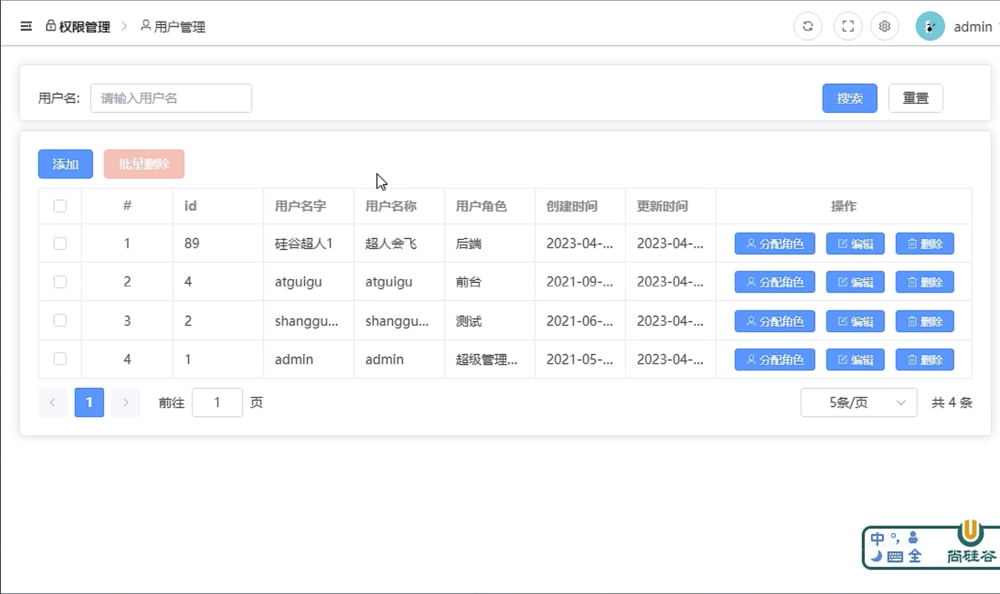

<br>

我们目前使用到的账号是 admin 它是超级管理员, 该账号的权限为
- 可以添加 用户
- 可以分配 角色 (该用户在公司在扮演的角色)
- 编辑 删除 等

<br>

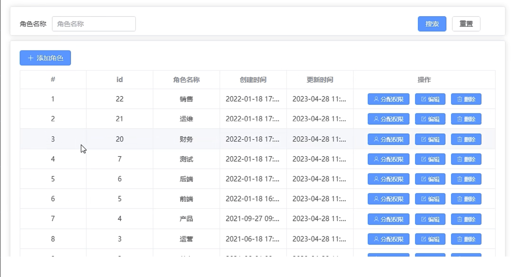

<br>

admin可以给用户下发访问的权限, 权限指的是菜单的权限和按钮的权限, 我们创建的用户有对应的权限, 有的用户只能看到数据大屏 其它的模块都看不到

<br>

后台管理系统的套路
1. 菜单的访问权限: 不同的人访问的菜单是不一样的
2. 按钮的访问权限: 不同的人能看到的按钮是不一样的

<br>

### 上架 下架逻辑
前台点击按钮发送对应的上架 或者 下架的请求, 后台将 isSale 字段设置为0 或者 1

<br>

### 分配角色逻辑
1. 获取所有的角色
2. 获取该用户现有的角色
3. 渲染所有角色后, 回显该用户现有的角色

<br>

### delete请求是可以携带请求体的
我们的 批量删除 逻辑中, 需要使用delete请求, 但是该请求携带了请求体
```js
type removeUserBatchApiType = (
  userIds: number[]
) => Promise<commonResType<null>>
export const removeUserBatchApi: removeUserBatchApiType = (userIds) => {
  // delete请求
  return service.delete(API.DELETE_BATCH_USER, { data: userIds })
}
```

在HTTP规范中，DELETE请求通常不允许携带请求体（request body）。然而，有些服务器可能允许在DELETE请求中携带请求体，虽然这并不是标准行为。如果服务器支持，并且你确实需要在DELETE请求中发送数据，你可以使用 Axios 来完成这个任务。

在 Axios 中，你可以使用 data 属性来指定请求体。但请注意，这可能不会在所有服务器上按预期工作，因为标准HTTP规范中并不允许在DELETE请求中使用请求体。

<br>

**问题:**  
delete请求需要这么携带
```js
axios.delete('https://example.com/api/resource', { data: dataToSend })
```

那 post 请求为什么直接就可以携带user对象呢 而不是装在 data 里面
```js
axios.post('https://example.com/api/resource', user)
```
 
<br>

**解答:**  
在 Axios 中，axios.post 直接接受数据作为请求的 body，而 axios.delete 之所以需要使用 data 选项，是因为标准的 HTTP 协议规范中，并不支持 DELETE 请求携带请求体。

HTTP协议规范指定，DELETE请求应该是一个幂等的、不包含请求体的请求，用于删除指定资源。因此，按照规范，DELETE请求是不应该包含请求体的。

然而，有些服务器或框架（例如Express）可能支持在DELETE请求中包含请求体，这是一种非标准的行为。**为了支持这样的服务器，Axios 提供了 data 选项，允许你在 DELETE 请求中携带请求体。**

对于 POST 请求，HTTP规范允许包含请求体，因此在 Axios 中，axios.post 的设计是更符合标准的。当你使用 axios.post('https://example.com/api/resource', user) 时，user 对象被直接放在请求体中，这符合 HTTP 规范中 POST 请求的要求。

总的来说，axios.post 直接将数据放在请求体中，而 axios.delete 提供了 data 选项以支持那些可能允许在 DELETE 请求中携带请求体的非标准情况。

<br><br>

## 代码部分:
```html
<script setup lang="ts">
import useSettingStore from '@/store/settingStore.ts'
import { ref, onMounted, reactive } from 'vue'

import {
  getUserListApi,
  saveOrUpdateUserApi,
  getUserRolesApi,
  removeUserByIdApi,
  removeUserBatchApi,
  assginRoleApi
} from '@/api/acl/user'
import type { userInfoType, roleItemType } from '@/api/acl/user/type'

import type { FormInstance, FormRules } from 'element-plus'
import { ElMessage } from 'element-plus'

defineOptions({
  name: 'User'
})

// 分页器相关数据
const paginationForm = reactive({
  pageNo: 1,
  pageSize: 5,
  keyword: '',
  total: 0
})

// 搜索关键字
let keyword = ref<string>('')

// 获取模板setting仓库
let settingStore = useSettingStore()

//存储全部用户的数组
const userTableData = reactive<userInfoType[]>([])

// 添加 / 修改 用户信息 抽屉 控制变量
let userDrawerVisible = ref<boolean>(false)

// 添加用户 表单数据 userForm
const userForm = reactive<userInfoType>({
  username: '',
  name: '',
  password: ''
})

const userFormRef = ref<FormInstance>()
const resetUserForm = () => {
  for (const key in userForm) {
    ;(userForm as any)[key] = ''
  }
}

//校验用户名字回调函数
const validatorUsername = (_: any, value: any, callBack: any) => {
  //用户名字|昵称,长度至少五位
  if (value.trim().length >= 5) {
    callBack()
  } else {
    callBack(new Error('用户名字至少五位'))
  }
}
//校验用户名字回调函数
const validatorname = (_: any, value: any, callBack: any) => {
  //用户名字|昵称,长度至少五位
  if (value.trim().length >= 5) {
    callBack()
  } else {
    callBack(new Error('用户昵称至少五位'))
  }
}
const validatorPassword = (_: any, value: any, callBack: any) => {
  //用户名字|昵称,长度至少五位
  if (value.trim().length >= 6) {
    callBack()
  } else {
    callBack(new Error('用户密码至少六位'))
  }
}

//表单校验的规则对象
const userRules = reactive<FormRules<typeof userForm>>({
  //用户名字
  username: [{ required: true, trigger: 'blur', validator: validatorUsername }],
  //用户昵称
  name: [{ required: true, trigger: 'blur', validator: validatorname }],
  //用户的密码
  password: [{ required: true, trigger: 'blur', validator: validatorPassword }]
})

//控制分配角色抽屉显示与隐藏
let roleDrawerVisible = ref<boolean>(false)

//存储全部职位的数据; el-checkbox-group 的话 使用 reactive 不好用
let allRoleList = ref<roleItemType[]>([])
// let allRoleList = reactive<roleItemType[]>([])
//当前用户已有的职位; el-checkbox-group 的话 使用 reactive 不好用
let selectedRoles = ref<roleItemType[]>([])
// let selectedRoles = reactive<roleItemType[]>([])

// //收集顶部复选框全选数据
const checkAll = ref<boolean>(false)
// //控制顶部全选复选框不确定的样式
const isIndeterminate = ref<boolean>(true)

// 批量删除: 用户id数组
let selectedUserIds = reactive<number[]>([])

//组件挂载完毕
onMounted(() => {
  getUserList()
})

//获取全部已有的用户信息
const getUserList = async () => {
  //收集当前页码
  let res = await getUserListApi(
    paginationForm.pageNo,
    paginationForm.pageSize,
    keyword.value
  )
  if (res.code == 200) {
    paginationForm.total = res.data.total
    userTableData.length = 0
    userTableData.push(...res.data.records)
  }
}

// 添加用户按钮的回调
const addUserHandler = () => {
  //清空数据 + 清除上一次的错误的提示信息 (调用form api)
  userFormRef.value?.resetFields()
  resetUserForm()

  // 抽屉显示出来
  userDrawerVisible.value = true

  // 方式2:
  // nextTick(() => {
  //   userFormRef.value?.clearValidate('username')
  //   userFormRef.value?.clearValidate('name')
  //   userFormRef.value?.clearValidate('password')
  // })
}
// 更新已有的用户按钮的回调
const updateUserHandler = (row: userInfoType) => {
  //抽屉显示出来
  userDrawerVisible.value = true
  // 先清空表单验证 ? 和 nextTick 的作用是一样的
  userFormRef.value?.resetFields()

  //存储收集已有的账号信息
  Object.assign(userForm, row)
}

/*
  新增用户 需携带:
    1. username
    2. password
    3. name

  更新用户 需携带:
    1. id
    2. username
    3. password: 这个不用收集, 因为我们点击row后 会给form重新赋值, 这时password字段的值就会被赋值为服务器返回的数据, 而不是我们担心的''串
    4. name
*/

//保存按钮的回调
const saveUserHandler = async () => {
  //点击保存按钮的时候,务必需要保证表单全部复合条件在去发请求
  await userFormRef.value?.validate()

  //保存按钮:添加新的用户|更新已有的用户账号信息
  let result = await saveOrUpdateUserApi(userForm)
  //添加或者更新成功
  if (result.code == 200) {
    //关闭抽屉
    userDrawerVisible.value = false
    //提示消息
    ElMessage({
      type: 'success',
      message: userForm.id ? '更新成功' : '添加成功'
    })
    //获取最新的全部账号的信息
    // getUserList();

    // 如果我们修改的是登录的用户的信息, 需要让浏览器自动刷新一次, 因为getUserList()只会让列表刷新 但是我们的用户信息在Header等地方 所以我们需要让页面刷新重新加载最新的数据
    window.location.reload()
  } else {
    //关闭抽屉
    userDrawerVisible.value = false
    //提示消息
    ElMessage({
      type: 'error',
      message: userForm.id ? '更新失败' : '添加失败'
    })
  }
}

const cancelHandler = (): void => {
  userDrawerVisible.value = false
  resetUserForm()
}

// //分配角色按钮的回调
const assignRole = async (row: userInfoType) => {
  // 存储已有的用户信息
  Object.assign(userForm, row)

  //获取全部的职位的数据与当前用户已有的职位的数据
  let res = await getUserRolesApi(userForm.id as number)
  console.log(res)
  if (res.code == 200) {
    //存储全部的职位
    // allRoleList.length = 0
    // allRoleList.push(...res.data.allRolesList)
    allRoleList.value = res.data.allRolesList

    //存储当前用户已有的职位
    // selectedRoles.length = 0
    // selectedRoles.push(...res.data.assignRoles)
    selectedRoles.value = res.data.assignRoles
    //抽屉显示出来
    roleDrawerVisible.value = true
  }
}

// //顶部的全部复选框的change事件
const checkAllChangeHandler = (val: boolean) => {
  //val:true(全选)|false(没有全选)
  // if (val) {
  //   selectedRoles.length = 0
  //   selectedRoles.push(...allRoleList)
  // } else {
  //   selectedRoles.length = 0
  // }

  selectedRoles.value = val ? allRoleList.value : []
  //不确定的样式(修改为确定样式)
  isIndeterminate.value = false
}

// 顶部全部的复选框的change事件
const checkedItemChangeHandler = (value: string[]) => {
  //顶部复选框的勾选数据
  //代表:勾选上的项目个数与全部的职位个数相等，顶部的复选框勾选上
  // checkAll.value = value.length === allRoleList.length
  checkAll.value = value.length === allRoleList.value.length
  //不确定的样式
  // isIndeterminate.value = value.length !== allRoleList.length
  isIndeterminate.value = value.length !== allRoleList.value.length
}
//确定按钮的回调(分配职位)
const roleConfirmHandler = async () => {
  //收集参数
  let data = {
    userId: userForm.id as number,
    roleIdList: selectedRoles.value.map((item) => {
      return item.id as number
    })
  }
  //分配用户的职位
  let result = await assginRoleApi(data)
  if (result.code == 200) {
    //提示信息
    ElMessage({ type: 'success', message: '分配职务成功' })
    //关闭抽屉
    roleDrawerVisible.value = false
    //获取更新完毕用户的信息,更新完毕留在当前页
    getUserList()
  }
}

// //删除某一个用户
const deleteUserHandler = async (userId: number) => {
  let result = await removeUserByIdApi(userId)
  if (result.code == 200) {
    ElMessage({ type: 'success', message: '删除成功' })
    getUserList()
  }
}
// //table复选框勾选的时候会触发的事件
const selectChange = (rows: userInfoType[]) => {
  const ids = rows.map((item) => item.id as number)
  selectedUserIds.length = 0
  selectedUserIds.push(...ids)
  console.log(selectedUserIds)
}
//批量删除按钮的回调
const deleteUsersHandler = async () => {
  //批量删除的请求
  let result = await removeUserBatchApi(selectedUserIds)
  if (result.code == 200) {
    ElMessage({ type: 'success', message: '删除成功' })
    getUserList()
  }
}

//搜索按钮的回调
const search = () => {
  //根据关键字获取相应的用户数据, username 拼接到了 url 上
  // ${API.GET_USERLIST}/${pageNo}/${pageSize}?username=${userName}
  getUserList()
  //搜索完后 清空关键字
  keyword.value = ''
}
//重置按钮
/*
  重置按钮就是刷新组件 当年我们在 AppMain 中完成过的逻辑
  let flag = ref(true)
  watch(
  () => settingStore.isRefreshed,
  () => {
    // v-if 可以销毁 和 重新创建组件

    // 将 flag 置为 false 销毁组件
    flag.value = false

    // 使用 nextTick, 当响应式数据发生变化后, 可以获取更新后的dom
    nextTick(() => {
      // 当模版渲染完毕后, 重新设置为true, 响应式数据发生变化后, 会再次渲染dom
      flag.value = true
    })
  }
)
*/
const reset = () => {
  settingStore.isRefreshed = !settingStore.isRefreshed
}

const pageSizeChangeHandler = () => {
  getUserList()
}
const pageNoChangeHandler = () => {
  getUserList()
}
</script>

<template>
  <el-card style="height: 80px">
    <!-- el-form开启flex el-form-item 一左一右 -->
    <el-form :inline="true" class="form">
      <el-form-item label="用户名:">
        <el-input placeholder="请你输入搜索用户名" v-model="keyword"></el-input>
      </el-form-item>
      <el-form-item>
        <el-button
          type="primary"
          size="default"
          :disabled="keyword ? false : true"
          @click="search"
          >搜索</el-button
        >
        <el-button type="primary" size="default" @click="reset">重置</el-button>
      </el-form-item>
    </el-form>
  </el-card>
  <el-card style="margin: 10px 0px">
    <el-button type="primary" size="default" @click="addUserHandler"
      >添加用户</el-button
    >
    <el-button
      type="primary"
      size="default"
      :disabled="selectedUserIds.length ? false : true"
      @click="deleteUsersHandler"
      >批量删除</el-button
    >
    <!-- table展示用户信息 -->
    <el-table
      @selection-change="selectChange"
      style="margin: 10px 0px"
      border
      :data="userTableData"
    >
      <!-- 第一列是选择框 -->
      <el-table-column type="selection" align="center"></el-table-column>
      <el-table-column label="#" align="center" type="index"></el-table-column>
      <el-table-column label="ID" align="center" prop="id"></el-table-column>
      <el-table-column
        label="用户名字"
        align="center"
        prop="username"
        show-overflow-tooltip
      ></el-table-column>
      <el-table-column
        label="用户名称"
        align="center"
        prop="name"
        show-overflow-tooltip
      ></el-table-column>
      <el-table-column
        label="用户角色"
        align="center"
        prop="roleName"
        show-overflow-tooltip
      ></el-table-column>
      <el-table-column
        label="创建时间"
        align="center"
        prop="createTime"
        show-overflow-tooltip
      ></el-table-column>
      <el-table-column
        label="更新时间"
        align="center"
        prop="updateTime"
        show-overflow-tooltip
      ></el-table-column>
      <el-table-column label="操作" width="300px" align="center">
        <template #default="{ row }">
          <el-button
            type="primary"
            size="small"
            icon="User"
            @click="assignRole(row)"
            >分配角色</el-button
          >
          <el-button
            type="primary"
            size="small"
            icon="Edit"
            @click="updateUserHandler(row)"
            >编辑</el-button
          >
          <el-popconfirm
            :title="`你确定要删除${row.username}?`"
            width="260px"
            @confirm="deleteUserHandler(row.id)"
          >
            <template #reference>
              <el-button type="primary" size="small" icon="Delete"
                >删除</el-button
              >
            </template>
          </el-popconfirm>
        </template>
      </el-table-column>
    </el-table>

    <!-- 分页器 -->
    <el-pagination
      v-model:current-page="paginationForm.pageNo"
      v-model:page-size="paginationForm.pageSize"
      :page-sizes="[5, 7, 9, 11]"
      :background="true"
      layout="prev, pager, next, jumper,->,sizes,total"
      :total="paginationForm.total"
      @current-change="pageNoChangeHandler"
      @size-change="pageSizeChangeHandler"
    />
  </el-card>

  <!-- 抽屉结构: 添加新的用户账号 | 更新已有的账号信息 表单结构 -->
  <el-drawer v-model="userDrawerVisible">
    <!-- 头部标题:将来文字内容应该动态的 -->
    <template #header>
      <h4>{{ userForm.id ? '更新用户' : '添加用户' }}</h4>
    </template>
    <!-- 身体部分 -->
    <template #default>
      <el-form :model="userForm" :rules="userRules" ref="userFormRef">
        <el-form-item label="用户姓名" prop="username">
          <el-input
            placeholder="请您输入用户姓名"
            v-model="userForm.username"
          ></el-input>
        </el-form-item>
        <el-form-item label="用户昵称" prop="name">
          <el-input
            placeholder="请您输入用户昵称"
            v-model="userForm.name"
          ></el-input>
        </el-form-item>
        <!-- 添加需要输入密码项, 修改用户不需要密码项 -->
        <el-form-item v-if="!userForm.id" label="用户密码" prop="password">
          <el-input
            placeholder="请您输入用户密码"
            v-model="userForm.password"
          ></el-input>
        </el-form-item>
      </el-form>
    </template>
    <template #footer>
      <div style="flex: auto">
        <el-button @click="cancelHandler">取消</el-button>
        <el-button type="primary" @click="saveUserHandler">确定</el-button>
      </div>
    </template>
  </el-drawer>

  <!-- 抽屉结构:用户某一个已有的账号进行职位分配 -->
  <el-drawer v-model="roleDrawerVisible">
    <template #header>
      <h4>分配角色(职位)</h4>
    </template>
    <template #default>
      <el-form>
        <el-form-item label="用户姓名">
          <!-- 回显用户信息, 只是显示用 -->
          <el-input v-model="userForm.username" :disabled="true"></el-input>
        </el-form-item>
        <el-form-item label="职位列表">
          <el-checkbox
            v-model="checkAll"
            :indeterminate="isIndeterminate"
            @change="checkAllChangeHandler"
            >全选</el-checkbox
          >
          <!-- 显示职位的的复选框 -->
          <el-checkbox-group
            v-model="selectedRoles"
            @change="checkedItemChangeHandler"
          >
            <!-- 收集的是一个 role 对象 -->
            <el-checkbox
              v-for="(role, index) in allRoleList"
              :key="index"
              :label="role"
              >{{ role.roleName }}</el-checkbox
            >
          </el-checkbox-group>
        </el-form-item>
      </el-form>
    </template>
    <template #footer>
      <div style="flex: auto">
        <el-button @click="roleDrawerVisible = false">取消</el-button>
        <el-button type="primary" @click="roleConfirmHandler">确定</el-button>
      </div>
    </template>
  </el-drawer>
</template>

<style scoped>
.form {
  display: flex;
  justify-content: space-between;
  align-items: center;
}
</style>
```

<br>

### API代码:
```js
// 用户管理: 用户信息
type userInfoType = {
  id?: number
  createTime?: string
  updateTime?: string
  username: string
  password: string
  // 昵称
  name: string
  phone?: string
  roleName?: string
}

type getUserinfoResType = {
  records: userInfoType[]
  total: number
  size: number
  current: number
}

// 角色信息
type roleItemType = {
  id?: number
  roleName: string
  remark?: string | null
  createTime?: string
  updateTime?: string
}

type getUserRolesResType = {
  assignRoles: roleItemType[]
  allRolesList: roleItemType[]
}

// 分配角色 请求参数
type assignRoleParamsType = {
  roleIdList: number[]
  userId: number
}

export type {
  userInfoType,
  getUserinfoResType,
  roleItemType,
  getUserRolesResType,
  assignRoleParamsType
}


// Sku页面 相关接口
import service from '@/utils/request'
import type { commonResType } from '@/api/commonTypes'

import {
  assignRoleParamsType,
  getUserinfoResType,
  userInfoType,
  getUserRolesResType
} from './type'

enum API {
  // 获取用户列表 /{page}/{limit}
  GET_USERLIST = '/admin/acl/user',
  // 新增用户
  POST_USER = '/admin/acl/user/save',
  // 修改用户
  PUT_USER = '/admin/acl/user/update',
  // 根据用户id获取 该用户现有的角色 和 所有角色列表 /userId
  GET_ALLROLE = '/admin/acl/user/toAssign',
  // 根据用户 给该用户分配角色
  POST_ASSIGNROLE = '/admin/acl/user/doAssignRole',
  // 根据id删除用户 /userId
  DELETE_USER = '/admin/acl/user/remove',
  // 根据 ids 列表 删除用户
  DELETE_BATCH_USER = '/admin/acl/user/batchRemove'
}

type getUserListApiType = (
  pageNo: number,
  pageSize: number,
  userName: string
) => Promise<commonResType<getUserinfoResType>>
export const getUserListApi: getUserListApiType = (
  pageNo,
  pageSize,
  userName
) => {
  return service.get(
    `${API.GET_USERLIST}/${pageNo}/${pageSize}?username=${userName}`
  )
}

// 合并: 新增 和 修改 用户信息
type saveOrUpdateUserApiType = (
  user: userInfoType
) => Promise<commonResType<null>>
export const saveOrUpdateUserApi: saveOrUpdateUserApiType = (user) => {
  if (user.id) {
    return service.put(API.PUT_USER, user)
  } else {
    return service.post(API.POST_USER, user)
  }
}

type getUserRolesApiType = (
  userId: number
) => Promise<commonResType<getUserRolesResType>>
export const getUserRolesApi: getUserRolesApiType = (userId) => {
  return service.get(`${API.GET_ALLROLE}/${userId}`)
}

type removeUserByIdApiType = (userId: number) => Promise<commonResType<null>>
export const removeUserByIdApi: removeUserByIdApiType = (userId) => {
  return service.delete(`${API.DELETE_USER}/${userId}`)
}
type removeUserBatchApiType = (
  userIds: number[]
) => Promise<commonResType<null>>
export const removeUserBatchApi: removeUserBatchApiType = (userIds) => {
  return service.delete(API.DELETE_BATCH_USER, { data: userIds })
}

/**
 * roleIdList: [0], 角色id数组
 * userId: 0, 给哪个用户分配什么样的岗位
 */
type assginRoleApiType = (
  params: assignRoleParamsType
) => Promise<commonResType<null>>
export const assginRoleApi: assginRoleApiType = (params) => {
  return service.post(API.POST_ASSIGNROLE, params)
}
```

<br><br>

# 权限管理: 角色管理
该模块可以操作角色(职位), 我们可以完成如下的功能
1. 编辑角色
2. 添加角色
3. 删除角色
4. 分配权限(分配菜单权限): 不同的用户登录这个系统 左侧菜单栏的权限和按钮的权限都是不一样的, 比如用户的角色是美工的话 就不应该有品牌管理的菜单

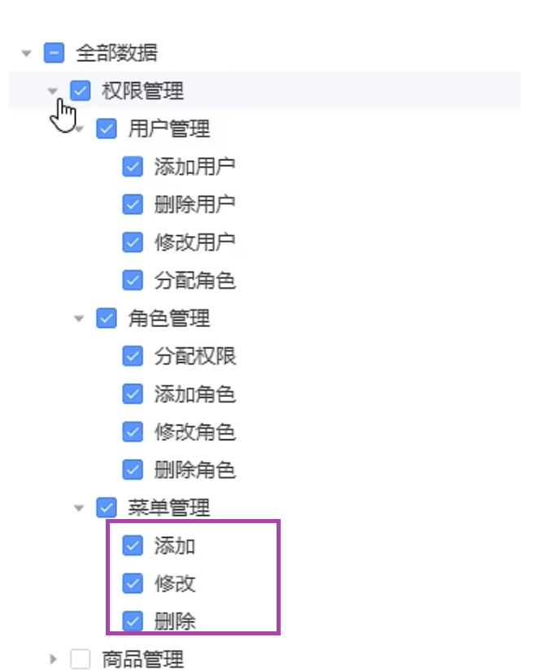

我们在该 [分配权限] 的功能中可以观察到, 我们可以给该角色分配菜单和该菜单下操作的权限

<br>

### 页面代码
```html
<script setup lang="ts">
import { ref, onMounted, reactive, nextTick } from 'vue'
//请求方法
import {
  getRoleListApi,
  saveOrUpdateApi,
  getPermissionByRoleIdApi,
  assignPermissionByRoleIdApi,
  removeRoleByIdApi
} from '@/api/acl/role'
import type { roleItemType, permissionItemType } from '@/api/acl/role/type'

import type { FormInstance } from 'element-plus'
import { ElMessage } from 'element-plus'

import useSettingStore from '@/store/settingStore.ts'

defineOptions({
  name: 'RolePage'
})

// 获取模板setting仓库
let settingStore = useSettingStore()

// 分页器相关数据
const paginationForm = reactive({
  pageNo: 1,
  pageSize: 5,
  total: 0
})

//搜索职位关键字
let keyword = ref<string>('')

// 存储全部已有的职位 allRole
let roleList = reactive<roleItemType[]>([])

//控制对话框的显示与隐藏
let roleDialogVisible = ref<boolean>(false)
//获取form组件实例
let formRef = ref<FormInstance>()
//控制抽屉显示与隐藏
let roleDrawerVisible = ref<boolean>(false)
//收集新增岗位数据 roleForm
let roleForm = reactive<roleItemType>({
  // 添加角色 只需要 roleName 修改的话需要 id 和 roleName
  roleName: ''
})
const resetField = <T extends object, K extends keyof T>(o: T, k: K) => {
  o[k] = '' as T[K]
}
const resetRoleForm = () => {
  for (const key in roleForm) {
    resetField(roleForm, key as keyof roleItemType)
  }
}

//准备一个数组:数组用于存储勾选的节点的ID(四级的)
let selectedRoleMenuList = ref<number[]>([])
//定义数组存储用户权限的数据
let userRoleMenuList = reactive<permissionItemType[]>([])
//获取tree组件实例
let tree = ref<any>()
//组件挂载完毕
onMounted(() => {
  //获取职位请求
  getRoleList()
})
//获取全部用户信息的方法|分页器当前页码发生变化的回调
const getRoleList = async () => {
  //修改当前页码
  let res = await getRoleListApi(
    paginationForm.pageNo,
    paginationForm.pageSize,
    keyword.value
  )
  if (res.code == 200) {
    paginationForm.total = res.data.total
    roleList.length = 0
    roleList.push(...res.data.records)
  }
}

//搜索按钮的回调
const search = () => {
  //再次发请求根据关键字
  getRoleList()
  keyword.value = ''
}
//重置按钮的回调
const reset = () => {
  settingStore.isRefreshed = !settingStore.isRefreshed
}
//添加职位按钮的回调
const addRoleHandler = () => {
  //对话框显示出来
  roleDialogVisible.value = true

  //清空数据
  resetRoleForm()

  //清空上一次表单校验错误结果
  nextTick(() => {
    formRef.value?.clearValidate('roleName')
  })
}
//更新已有的职位按钮的回调
const updateRole = (row: roleItemType) => {
  //显示出对话框
  roleDialogVisible.value = true
  //存储已有的职位----带有ID的
  Object.assign(roleForm, row)
  //清空上一次表单校验错误结果
  nextTick(() => {
    formRef.value?.clearValidate('roleName')
  })
}
//自定义校验规则的回调
const validatorRoleName = (_: any, value: any, callBack: any) => {
  if (value.trim().length >= 2) {
    callBack()
  } else {
    callBack(new Error('职位名称至少两位'))
  }
}
//职位校验规则
const rules = {
  roleName: [{ required: true, trigger: 'blur', validator: validatorRoleName }]
}

// 添加确定按钮的回调
const save = async () => {
  //表单校验结果,结果通过在发请求、结果没有通过不应该在发生请求
  await formRef.value?.validate()
  //添加职位|更新职位的请求
  let result = await saveOrUpdateApi(roleForm)
  if (result.code == 200) {
    //提示文字
    ElMessage({
      type: 'success',
      message: roleForm.id ? '更新成功' : '添加成功'
    })
    //对话框显示
    roleDialogVisible.value = false
    //再次获取全部的已有的职位
    getRoleList()
  }
}

//分配权限按钮的回调
//已有的职位的数据
const setPermisstion = async (row: roleItemType) => {
  //抽屉显示出来
  roleDrawerVisible.value = true
  //收集当前要分类权限的职位的数据
  Object.assign(roleForm, row)
  //根据职位获取权限的数据
  let res = await getPermissionByRoleIdApi(roleForm.id as number)
  if (res.code == 200) {
    console.log('res.data', res.data)
    userRoleMenuList.length = 0
    userRoleMenuList.push(...res.data)
    selectedRoleMenuList.value = filterSelectArr(userRoleMenuList, [])

    // 默认勾选需要手动设置
    nextTick(() => {
      tree.value.setCheckedKeys(selectedRoleMenuList.value)
    })
  }
}

//树形控件的字段映射对象
const defaultProps = {
  children: 'children',
  label: 'name'
}

// 过滤权限列表 获取到应该勾选的数据
/*
  递归遍历数组, 过滤出tree数据中 最深层级的对象中的数据 我们的目标是将4级数据中select: true的数据的id保存起来
*/
const filterSelectArr = (
  allData: permissionItemType[],
  collection: number[]
) => {
  allData.forEach((item: any) => {
    if (item.select && item.level == 4) {
      collection.push(item.id)
    }
    if (item.children && item.children.length > 0) {
      filterSelectArr(item.children, collection)
    }
  })

  return collection
}

//抽屉确定按钮的回调, 当点击确定按钮的时候 带着数据发起请求
const saveHandler = async () => {
  //职位的ID
  const roleId = roleForm.id as number
  //选中节点的ID
  let selectedIds = tree.value.getCheckedKeys()
  //半选的ID (父节点的id)
  let selectedIdsAmbiguity = tree.value.getHalfCheckedKeys()
  let permissionId = selectedIds.concat(selectedIdsAmbiguity)
  //下发权限
  let result = await assignPermissionByRoleIdApi(roleId, permissionId)
  if (result.code == 200) {
    //抽屉关闭
    roleDrawerVisible.value = false
    //提示信息
    ElMessage({ type: 'success', message: '分配权限成功' })
    //页面刷新 因为当前用户的权限发生变化后 应该更新页面
    window.location.reload()
  }
}

//删除已有的职位
const removeRole = async (id: number) => {
  let result: any = await removeRoleByIdApi(id)
  if (result.code == 200) {
    //提示信息
    ElMessage({ type: 'success', message: '删除成功' })
    getRoleList()
  }
}
</script>

<template>
  <el-card>
    <el-form :inline="true" class="form">
      <el-form-item label="职位搜索">
        <el-input
          placeholder="请你输入搜索职位关键字"
          v-model="keyword"
        ></el-input>
      </el-form-item>
      <el-form-item>
        <el-button
          type="primary"
          size="default"
          :disabled="keyword ? false : true"
          @click="search"
          >搜索</el-button
        >
        <el-button type="primary" size="default" @click="reset">重置</el-button>
      </el-form-item>
    </el-form>
  </el-card>
  <el-card style="margin: 10px 0px">
    <el-button type="primary" size="default" icon="Plus" @click="addRoleHandler"
      >添加职位</el-button
    >
    <el-table border style="margin: 10px 0px" :data="roleList">
      <el-table-column type="index" align="center" label="#"></el-table-column>
      <el-table-column label="ID" align="center" prop="id"></el-table-column>
      <el-table-column
        label="职位名称"
        align="center"
        prop="roleName"
        show-overflow-tooltip
      ></el-table-column>
      <el-table-column
        label="创建世间"
        align="center"
        show-overflow-tooltip
        prop="createTime"
      ></el-table-column>
      <el-table-column
        label="更新时间"
        align="center"
        show-overflow-tooltip
        prop="updateTime"
      ></el-table-column>
      <el-table-column label="操作" width="280px" align="center">
        <!-- row:已有的职位对象 -->
        <template #default="{ row }">
          <el-button
            type="primary"
            size="small"
            icon="User"
            @click="setPermisstion(row)"
            >分配权限</el-button
          >
          <el-button
            type="primary"
            size="small"
            icon="Edit"
            @click="updateRole(row)"
            >编辑</el-button
          >
          <el-popconfirm
            :title="`你确定要删除${row.roleName}?`"
            width="260px"
            @confirm="removeRole(row.id)"
          >
            <template #reference>
              <el-button type="primary" size="small" icon="Delete"
                >删除</el-button
              >
            </template>
          </el-popconfirm>
        </template>
      </el-table-column>
    </el-table>
    <el-pagination
      v-model:current-page="paginationForm.pageNo"
      v-model:page-size="paginationForm.pageSize"
      :page-sizes="[3, 5, 7, 9]"
      :background="true"
      layout="prev, pager, next, jumper,->,sizes,total"
      :total="paginationForm.total"
      @current-change="getRoleList"
      @size-change="getRoleList"
    />
  </el-card>
  <!-- 添加职位与更新已有职位的结构:对话框 -->
  <el-dialog
    v-model="roleDialogVisible"
    :title="roleForm.id ? '更新职位' : '添加职位'"
  >
    <el-form :model="roleForm" :rules="rules" ref="formRef">
      <el-form-item label="职位名称" prop="roleName">
        <el-input
          placeholder="请你输入职位名称"
          v-model="roleForm.roleName"
        ></el-input>
      </el-form-item>
    </el-form>
    <template #footer>
      <el-button
        type="primary"
        size="default"
        @click="roleDialogVisible = false"
        >取消</el-button
      >
      <el-button type="primary" size="default" @click="save">确定</el-button>
    </template>
  </el-dialog>
  <!-- 抽屉组件:分配职位的菜单权限与按钮的权限 -->
  <el-drawer v-model="roleDrawerVisible">
    <template #header>
      <h4>分配菜单与按钮的权限</h4>
    </template>
    <template #default>
      <!-- 树形控件 -->
      <el-tree
        ref="tree"
        :data="userRoleMenuList"
        show-checkbox
        node-key="id"
        default-expand-all
        :default-checked-keys="selectedRoleMenuList"
        :props="defaultProps"
      />
    </template>
    <template #footer>
      <div style="flex: auto">
        <el-button @click="roleDrawerVisible = false">取消</el-button>
        <el-button type="primary" @click="saveHandler">确定</el-button>
      </div>
    </template>
  </el-drawer>
</template>

<style scoped>
.form {
  display: flex;
  justify-content: space-between;
  align-items: center;
  height: 50px;
}
</style>
```

<br>

### API
```js
// Sku页面 相关接口
import service from '@/utils/request'
import type { commonResType } from '@/api/commonTypes'

import { roleItemType, getRoleListResType, permissionItemType } from './type'

enum API {
  // 获取角色列表 /{page}/{limit}
  GET_ROLELIST = '/admin/acl/role',
  // 添加角色
  POST_SAVEROLE = '/admin/acl/role/save',
  // 修改角色
  PUT_UPDATEROLE = '/admin/acl/role/update',
  // 根据角色(根据职位id)获取菜单 /roleId
  GET_GETROLE_MENU = '/admin/acl/permission/toAssign',
  // 分配权限
  POST_SETPERMISSION = '/admin/acl/permission/doAssign',
  // 根据id删除已有的职位
  DELETE_REMOVEROLE = '/admin/acl/role/remove'
}

type getRoleListApiType = (
  pageNo: number,
  pageSize: number,
  roleName: string
) => Promise<commonResType<getRoleListResType>>
export const getRoleListApi: getRoleListApiType = (
  pageNo,
  pageSize,
  roleName
) => {
  return service.get(
    `${API.GET_ROLELIST}/${pageNo}/${pageSize}?roleName=${roleName}`
  )
}

// 添加 和 修改 的接口 区别就是 请求体中是否有id
type saveOrUpdateApiType = (data: roleItemType) => Promise<commonResType<null>>
export const saveOrUpdateApi: saveOrUpdateApiType = (data) => {
  if (data.id) {
    return service.put(API.PUT_UPDATEROLE, data)
  } else {
    return service.post(API.POST_SAVEROLE, data)
  }
}

type getPermissionByRoleIdApiType = (
  roleId: number
) => Promise<commonResType<permissionItemType[]>>
export const getPermissionByRoleIdApi: getPermissionByRoleIdApiType = (
  roleId
) => {
  return service.get(`${API.GET_GETROLE_MENU}/${roleId}/`)
}

/*
  需要携带 roleId (职位ID) 标识给哪一个职位分配权限, 通过 query 携带
  需要携带 permissionId 通过query携带 格式是一个数组

  要点:
  当我们在url上方数组的时候, 会变成字符串脱掉[]
*/
type assignPermissionByRoleIdApiType = (
  roleId: number,
  permissionId: number[]
) => Promise<commonResType<null>>
export const assignPermissionByRoleIdApi: assignPermissionByRoleIdApiType = (
  roleId,
  permissionId
) => {
  return service.post(
    `${API.POST_SETPERMISSION}?roleId=${roleId}&permissionId=${permissionId}`
  )
}

type removeRoleByIdApiType = (roleId: number) => Promise<commonResType<null>>
export const removeRoleByIdApi: removeRoleByIdApiType = (roleId) => {
  return service.delete(`${API.DELETE_REMOVEROLE}/${roleId}`)
}


type roleItemType = {
  id?: number
  roleName: string
  remark?: string | null
  createTime?: string
  updateTime?: string
}

type getRoleListResType = {
  records: roleItemType[]
  total: number
  size: number
  current: number
}

type permissionItemType = {
  id?: number
  // 表示第几层级的数据 0 表示第一级
  pid: number
  // 表示第几层级的数据 1 表示第一级 一共4级 第4级是按钮的权限
  level: number
  // 默认该节点是否是被选中的状态
  select: boolean
  children?: permissionItemType[]
  // 展示的title
  name: string
  code?: number
  toCode?: number
  type: number
  status?: number
  craeteTime?: string
  updateTime?: string
}

export type { roleItemType, getRoleListResType, permissionItemType }
```

<br><br>

# 权限管理: 菜单管理
- 角色管理: 是公司拥有的 职位, 每个人的职位不一样 他能访问的到的菜单和按钮也是不一样的

也我们的菜单管理, 管理的就是所有的菜单和按钮, 菜单管理界面是一个Table, **也就是管理着 左侧菜单栏 和 对应页面中的按钮**

- 全部数据
  - 权限管理 (Acl)
    - 用户管理 (User)
      - 添加
      - 新增
      - 删除
    - 角色管理 (Role)
    - 菜单管理 (Permission)
  - 商品管理 (Product)
  - 客户管理 (ClientUser)

<br>

我们的项目中有两种路由
1. 常量路由 (谁都能访问的路由)
2. 异步路由 (需要有权限才能访问的路由)

<br>

### 代码部分
```html
<script setup lang="ts">
import { ref, onMounted, reactive } from 'vue'
//引入获取菜单请求API
import {
  getPermissionListApi,
  saveOrUpdatePermissionApi,
  removePermissionApi
} from '@/api/acl/permission'
//引入ts类型
import type {
  permissionItemType,
  editFormType
} from '@/api/acl/permission/type'

import { ElMessage } from 'element-plus'

defineOptions({
  name: 'PermissionPage'
})

// 存储菜单的数据
let permissionList = reactive<permissionItemType[]>([])

//控制对话框的显示与隐藏
let editDialogVisible = ref<boolean>(false)

//携带的参数
let menuData = reactive<editFormType>({
  // 权限值
  code: '',
  // 几级菜单 1为1级菜单 2为2级菜单
  level: 0,
  // 名称
  name: '',
  // 父id
  pid: 0
})
// pid 和 level 的作用就是给谁增加几级菜单

//组件挂载完毕
onMounted(() => {
  getPermissionList()
})

//获取菜单数据的方法
const getPermissionList = async () => {
  let result = await getPermissionListApi()
  if (result.code == 200) {
    permissionList.length = 0
    permissionList.push(...result.data)
  }
}

//添加菜单按钮的回调
const addPermisstion = (row: permissionItemType) => {
  //清空数据
  Object.assign(menuData, {
    id: 0,
    code: '',
    name: '',
    level: 0,
    pid: 0
  })

  //对话框显示出来
  editDialogVisible.value = true

  // row.level是点击按钮该行的数据, 我们要给它添加一个子菜单 所以是 level+1
  menuData.level = row.level + 1

  //给谁新增子菜单 我们给该行数据添加一个子菜单 那么该行菜单就是父菜单
  menuData.pid = row.id as number
}

//编辑已有的菜单
const updatePermisstion = (row: permissionItemType) => {
  editDialogVisible.value = true
  //点击修改按钮:收集已有的菜单的数据进行更新
  Object.assign(menuData, row)
}

// 对话框 确定按钮的回调
const save = async () => {
  //发请求:新增子菜单|更新某一个已有的菜单的数据
  let result: any = await saveOrUpdatePermissionApi(menuData)
  if (result.code == 200) {
    //对话框隐藏
    editDialogVisible.value = false
    //提示信息
    ElMessage({
      type: 'success',
      message: menuData.id ? '更新成功' : '添加成功'
    })
    //再次获取全部最新的菜单的数据
    getPermissionList()
  }
}

//删除按钮回调
const removeMenu = async (id: number) => {
  let result = await removePermissionApi(id)
  if (result.code == 200) {
    ElMessage({ type: 'success', message: '删除成功' })
    getPermissionList()
  }
}
</script>

<template>
  <!-- 
    1级菜单上 不能编辑和删除 我们使用 row.level 来判断
    3级菜单上 不叫 添加菜单 而是叫 添加功能
    4级菜单上 不能添加 只能编辑和删除
   -->
  <el-table
    :data="permissionList"
    style="width: 100%; margin-bottom: 20px"
    row-key="id"
    border
  >
    <el-table-column label="名称" prop="name"></el-table-column>
    <el-table-column label="权限值" prop="code"></el-table-column>
    <el-table-column label="修改时间" prop="updateTime"></el-table-column>
    <el-table-column label="操作">
      <!-- row:即为已有的菜单对象|按钮的对象的数据 -->
      <template #default="{ row }">
        <el-button
          type="primary"
          @click="addPermisstion(row)"
          size="small"
          :disabled="row.level == 4 ? true : false"
          >{{ row.level == 3 ? '添加功能' : '添加菜单' }}</el-button
        >
        <el-button
          type="primary"
          @click="updatePermisstion(row)"
          size="small"
          :disabled="row.level == 1 ? true : false"
          >编辑</el-button
        >
        <el-popconfirm
          :title="`你确定要删除${row.name}?`"
          width="260px"
          @confirm="removeMenu(row.id)"
        >
          <template #reference>
            <el-button
              type="primary"
              size="small"
              :disabled="row.level == 1 ? true : false"
              >删除</el-button
            >
          </template>
        </el-popconfirm>
      </template>
    </el-table-column>
  </el-table>

  <!-- 对话框组件:添加或者更新已有的菜单的数据结构 -->
  <el-dialog
    v-model="editDialogVisible"
    :title="menuData.id ? '更新菜单' : '添加菜单'"
  >
    <!-- 表单组件:收集新增与已有的菜单的数据 -->
    <el-form>
      <el-form-item label="名称">
        <el-input
          placeholder="请你输入菜单名称"
          v-model="menuData.name"
        ></el-input>
      </el-form-item>
      <el-form-item label="权限">
        <el-input
          placeholder="请你输入权限数值"
          v-model="menuData.code"
        ></el-input>
      </el-form-item>
    </el-form>
    <template #footer>
      <span class="dialog-footer">
        <el-button @click="editDialogVisible = false">取消</el-button>
        <el-button type="primary" @click="save"> 确定 </el-button>
      </span>
    </template>
  </el-dialog>
</template>

<style scoped></style>
```

<br>

### api
```js
import service from '@/utils/request'
import type { commonResType } from '@/api/commonTypes'

import { permissionItemType, editFormType } from './type'

enum API {
  // 获取菜单信息
  GET_PERMISSION_LIST = '/admin/acl/permission',

  // 如下的两个接口携带的参数都是一样的 只不过新增的没有id 修改有
  POST_ADD_PERMISSION = '/admin/acl/permission/save',
  PUT_UPDATE_PERMISSION = '/admin/acl/permission/update',
  //删除已有的菜单 /id
  DELETE_PERMISSION = '/admin/acl/permission/remove/'
}

type getPermissionListType = () => Promise<commonResType<permissionItemType[]>>
export const getPermissionListApi: getPermissionListType = () => {
  return service.get(API.GET_PERMISSION_LIST)
}

type saveOrUpdatePermissionApiType = (
  data: editFormType
) => Promise<commonResType<null>>
export const saveOrUpdatePermissionApi: saveOrUpdatePermissionApiType = (
  data
) => {
  if (data.id) {
    return service.put(API.PUT_UPDATE_PERMISSION, data)
  } else {
    return service.post(API.POST_ADD_PERMISSION, data)
  }
}

type removePermissionApiType = (id: number) => Promise<commonResType<null>>
export const removePermissionApi: removePermissionApiType = (id) => {
  return service.delete(`${API.DELETE_PERMISSION}/${id}`)
}


type permissionItemType = {
  id?: number
  // 表示第几层级的数据 0 表示第一级
  pid: number
  // 表示第几层级的数据 1 表示第一级 一共4级 第4级是按钮的权限
  level: number
  // 默认该节点是否是被选中的状态
  select?: boolean
  children?: permissionItemType[]
  // 展示的title
  name: string
  // 权限值?
  code?: string
  toCode?: number
  type?: number
  status?: number
  craeteTime?: string
  updateTime?: string
}

type editFormType = {
  id?: number
  // 权限值
  code: string
  // 几级菜单 1为1级菜单 2为2级菜单
  level: number
  // 名称
  name: string
  // 父id
  pid: number
}

export type { permissionItemType, editFormType }
```

<br><br>

# 主题设置:
我们通过 主题设置 按钮, 可以设置页面中按钮的颜色

我们的按钮身上都有一个 elementPlus使用的css变量, 指定按钮的颜色 ``--el-button-bg-color``

官网中提供了4种修改主题色的方式
1. 通过 scss 变量
2. 通过 css 变量
3. 通过 js 控制 css变量

接下来我们就要通过js动态的设置按钮的颜色

<br>

### 示例代码:
2步
```js
// 1. 获取 根节点
const el = document.documentElement
// const el = document.getElementById('xxx')

// 获取 css 变量
// getComputedStyle(el).getPropertyValue(`--el-color-primary`)

// 2. 将根节点的某种样式变量设置为对应的值
el.style.setProperty('--el-color-primary', 'red')
```

<br>

### 项目代码:
```html
<script>
  const predefineColors = ref([
  '#ff4500',
  '#ff8c00',
  '#ffd700',
  '#90ee90',
  '#00ced1',
  '#1e90ff',
  '#c71585',
  'rgba(255, 69, 0, 0.68)',
  'rgb(255, 120, 0)',
  'hsv(51, 100, 98)',
  'hsva(120, 40, 94, 0.5)',
  'hsl(181, 100%, 37%)',
  'hsla(209, 100%, 56%, 0.73)',
  '#c7158577'
])

const color = ref('')

const setColor = () => {
  const html = document.documentElement
  // 控制台 去看html标签中有主题色的名
  html.style.setProperty('--el-color-primary', color.value)
}
</script>

<el-popover
  placement="bottom"
  title="主题设置"
  :width="300"
  trigger="click"
>
  <!-- 表单元素 -->
  <el-form>
    <el-form-item label="主题颜色">
      <el-color-picker
        @change="setColor"
        v-model="color"
        size="small"
        show-alpha
        :predefine="predefineColors"
      />
    </el-form-item>
  </el-form>
  <!-- 外在体现的结构 -->
  <template #reference>
    <el-button type="primary" icon="Setting" circle></el-button>
  </template>
</el-popover>
```

<br><br>

# 暗黑模式:
```html
<script>
  // 收集 切换暗黑模式 的布尔值
  let dark = ref<boolean>(false)
  const changeDark = () => {
    //获取HTML根节点
    let html = document.documentElement
    //判断HTML标签是否有类名dark
    dark.value ? (html.className = 'dark') : (html.className = '')
  }
</script>

<el-switch
  @change="changeDark"
  v-model="dark"
  class="mt-2"
  style="margin-left: 24px"
  inline-prompt
  active-icon="MoonNight"
  inactive-icon="Sunny"
/>
```

<br><br>

# Echarts

### 配置项:
```js
{
  // echarts的标题
  title: {},
  // x | y 轴 组件
  xAxis: {},
  yAxis: {},
  // 系列: 决定我们展示什么样的图形
  series: {},
  // 图标布局组件
  grid: {},
}
```

<br>

### 水球图
```js
import { onMounted, ref } from 'vue'
// 引入 echarts
import * as echarts from 'echarts'
// 引入 水球图 插件
import 'echarts-liquidfill'

defineOptions({
  name: 'DataLTourist'
})

const people = ref('216908')

// 1. 获取 echart 容器节点
const chart = ref()

// 2. 当组件挂载完毕后 初始化echarts
onMounted(() => {
  // 3. 获取 echarts 实例对象, 传入dom元素
  const chartInstance = echarts.init(chart.value)

  // 4. 设置实例的配置项
  chartInstance.setOption({
    // 系列: 决定展示什么样的图形图标
    series: {
      type: 'liquidFill',
      data: [0.6],
      // 水球图大小
      radius: '80%'
    }
  })
})
```

### 横向柱形图
```js
import { ref, onMounted } from 'vue'
import * as echarts from 'echarts'

//获取图形图标的DOM节点
let charts = ref()

onMounted(() => {
  //初始化echarts实例
  let mycharts = echarts.init(charts.value)

  //设置配置项
  mycharts.setOption({
    // 标题 组件
    title: {
      text: '男女比例', //主标题

      // 文本样式: gwes是不是两套主题色
      textStyle: {
        //主标题颜色
        color: 'skyblue'
      },

      // 标题位置
      left: '40%'
    },
    //x|y
    xAxis: {
      show: false,
      // 设置x轴的 0% - 100%
      min: 0,
      max: 100
    },
    yAxis: {
      show: false,
      type: 'category'
    },
    // 布局组件
    grid: {
      left: 0,
      top: 0,
      right: 0,
      bottom: 0
    },
    series: [
      {
        type: 'bar',
        data: [58],
        // 柱状图的宽度
        barWidth: 20,
        // 调整柱条的层级
        z: 100,
        itemStyle: {
          color: 'skyblue',
          borderRadius: 20
        }
      },
      {
        type: 'bar',
        data: [100],
        barWidth: 20,
        //调整女士柱条位置 百分比为柱条宽度的百分比
        barGap: '-100%',
        itemStyle: {
          color: 'pink',
          borderRadius: 20
        }
      }
    ]
  })
})
```

<br>

### 饼图
```js
import { ref, onMounted } from 'vue'
//引入echarts
import * as echarts from 'echarts'
let charts = ref()
//组件挂载完毕初始化图形图标
onMounted(() => {
  let mychart = echarts.init(charts.value)
  //设置配置项
  let option = {
    tooltip: {
      trigger: 'item'
    },
    // 图例组件
    legend: {
      orient: 'vertical', //图例组件方向的设置
      right: 30,
      top: 40,
      // 图例的文本样式
      textStyle: {
        color: 'white',
        fontSize: 14
      }
    },
    series: [
      {
        name: 'Access From',
        type: 'pie',
        radius: ['40%', '70%'],
        avoidLabelOverlap: false,
        itemStyle: {
          borderRadius: 10,
          borderColor: '#fff',
          borderWidth: 2
        },
        // 鼠标移入图形中的一个部分的时候 展示的label
        label: {
          show: true,
          // 文字在图形部分的里面
          position: 'inside',
          color: 'white'
        },

        labelLine: {
          show: false
        },
        data: [
          { value: 1048, name: '军事' },
          { value: 735, name: '新闻' },
          { value: 580, name: '直播' },
          { value: 484, name: '娱乐' },
          { value: 300, name: '财经' }
        ]
      }
    ],
    // 布局组件: 调整图形图标的位置
    grid: {
      left: 0,
      top: 0,
      right: 0,
      bottom: 0
    }
  }
  mychart.setOption(option)
})
```

<br><br>

# 权限管理
我们的 admin 用户 拥有左侧菜单栏中 **所有的菜单(路由)和按钮的权限**, 不同的用户职位不同能够看到的 菜单 和 按钮 的权限是不同的

<br><br>

## 路由相关总结
每条路由中都会有 name 属性, 我们就是根据name属性来做权限管理

我们要开发菜单的权限 首先我们就要拆分路由 我们要将路由拆分成3个部分

1. 静态路由(常量路由): 所有人都能访问到的路由(页面)
  1. login页面
  2. 404页面
  3. home
  4. 数据大屏

2. 异步路由: 不同的身份访问的路由列表不一样 (有的人有, 有的人没有)
  1. 权限管理 (3个子路由)
  2. 商品管理 (4个子路由)

3. 任意路由: 当访问到其他的路径的时候会指向404

<br>

### 权限思路:
目前我们的项目属性在前端有一套完成的路由表(全路由表涵盖了静态路由和异步路由)

但是这套路由表目前都被当成常量路由进行注册, 这样所有的用户能够访问的页面都是一样的

我们本套课程中, 是在前端维护一张完整的路由表, 然后用户登录后 后台返回该用户可以访问的路由信息(主要是路由对象中的name属性)

然后我们根据后台返回的数据 动态的追加该对应的路由信息

<br>

### 1. 拆分路由:
```js
// 常量路由
export const constantRoutes = [
  {
    path: '/login',
    // name属性用于权限管理, 每条路由都要追加这个命名空间
    name: 'Login',
    component: () => import('@/views/login/index.vue'),
    meta: {
      title: '登录',
      hidden: true,
      icon: ''
    }
  },
  // 登录成功以后展示数据的路由
  {
    path: '/',
    name: 'Layout',
    component: () => import('@/views/layout/index.vue'),
    meta: {
      title: '首页',
      hidden: false,
      icon: ''
    },
    // layou组件的默认页面
    redirect: '/home',
    children: [
      {
        path: '/home',
        component: () => import('@/views/home/index.vue'),
        meta: {
          title: '首页',
          hidden: false,
          icon: 'HomeFilled'
        }
      }
    ]
  },
  {
    path: '/404',
    name: '404',
    component: () => import('@/views/404/index.vue'),
    meta: {
      title: '',
      hidden: true,
      icon: ''
    }
  },
  {
    path: '/screen',
    component: () => import('@/views/screen/index.vue'),
    name: 'Screen',
    meta: {
      hidden: false,
      title: '数据大屏',
      icon: 'Platform'
    }
  }
]

// 异步路由
export const asyncRoutes = [
  // 权限管理路由
  {
    path: '/acl',
    // 权限管理 一级路由 要使用 layout中的路由出口, 也就是说当访问 /acl 的时候展示的是 layout组件 这样它的children里面的二级路由就可以使用 layout/main中的路由出口了
    component: () => import('@/views/layout/index.vue'),
    name: 'Acl',
    meta: {
      title: '权限管理',
      icon: 'Lock'
    },
    redirect: '/acl/user',
    children: [
      {
        path: '/acl/user',
        component: () => import('@/views/acl/user/index.vue'),
        name: 'User',
        meta: {
          title: '用户管理',
          icon: 'User'
        }
      },
      {
        path: '/acl/role',
        component: () => import('@/views/acl/role/index.vue'),
        name: 'Role',
        meta: {
          title: '角色管理',
          icon: 'UserFilled'
        }
      },
      {
        path: '/acl/permission',
        component: () => import('@/views/acl/permission/index.vue'),
        name: 'Permission',
        meta: {
          title: '菜单管理',
          icon: 'Monitor'
        }
      }
    ]
  },
  {
    path: '/product',
    component: () => import('@/views/layout/index.vue'),
    name: 'Product',
    meta: {
      title: '商品管理',
      icon: 'Goods'
    },
    redirect: '/product/trademark',
    children: [
      {
        path: '/product/trademark',
        component: () => import('@/views/product/trademark/index.vue'),
        name: 'Trademark',
        meta: {
          title: '品牌管理',
          icon: 'ShoppingCartFull'
        }
      },
      {
        path: '/product/attr',
        component: () => import('@/views/product/attr/index.vue'),
        name: 'Attr',
        meta: {
          title: '属性管理',
          icon: 'ChromeFilled'
        }
      },
      {
        path: '/product/spu',
        component: () => import('@/views/product/spu/index.vue'),
        name: 'Spu',
        meta: {
          title: 'SPU管理',
          icon: 'Calendar'
        }
      },
      {
        path: '/product/sku',
        component: () => import('@/views/product/sku/index.vue'),
        name: 'Sku',
        meta: {
          title: 'SKU管理',
          icon: 'Orange'
        }
      }
    ]
  }
]

// 任意路由
export const anyRoutes = [
  // 当上面路由都没有匹配上的时候 我们访问的路由
  {
    path: '/:pathMatch(.*)*',
    name: 'Any',
    component: () => import('@/views/404/index.vue'),
    meta: {
      title: '',
      hidden: true,
      icon: ''
    }
  }
]

```
<br>

### 2. 用户登录后, 后台返回该用户对应的权限
这里就要看后台的逻辑 返回什么样的数据了

本项目中的后台返回的数据格式如下
```js
{
  // 异步路由的权限, 该用户能访问哪些异步路由, 主要返回的是 路由name属性
  routes: [],
  // string[], 按钮的权限, item: btn.User.add = btn + 路由name属性 + 增删改
  buttons: [],
  // 该用户的职位
  roles: ['后台'],
  name: '用户名',
  avater: '头像url'
}
```

```js
{
    "code": 200,
    "message": "成功",
    "data": {
        "routes": [
            "User",
            "Category",
            "Discount",
            "ActivityEdit",
            "CouponRule",
            "Product",
            "Activity",
            "CouponAdd",
            "Trademark",
            "Attr",
            "ActivityAdd",
            "CouponEdit",
            "OrderShow",
            "Permission",
            "Spu",
            "UserList",
            "ClientUser",
            "Coupon",
            "permision",
            "Acl",
            "Role",
            "Sku"
        ],
        "buttons": [
            "cuser.detail",
            "cuser.update",
            "cuser.delete",
            "btn.User.add",
            "btn.User.remove",
            "btn.User.update",
            "btn.User.assgin",
            "btn.Role.assgin",
            "btn.Role.add",
            "btn.Role.update",
            ""
        ],
        "roles": [
            "超级管理员"
        ],
        "name": "admin",
        "avatar": "https://wpimg.wallstcn.com/f778738c-e4f8-4870-b634-56703b4acafe.gif"
    },
    "ok": true
}
```

<br>

接下来我们就可以返回的数据中的 routes 中的 路由name属性, 我们可以往路由中动态追加, routes中name属性对应的路由

比如, 后台返回的为
```js
routes: ['Product', 'Trademark', 'Sku']
```

我们要根据 routes 对 asyncRoutes 进行过滤

**注意:**   
在调用 filterRoutes 的时候 asyncRoutes 参数要深拷贝 不要影响原来的 asyncRoutes

不能使用 JSONAPI, 因为他会忽略函数
```js
const filterRoutes = (asyncRoutes, routes) => {
  // 我们看看异步路由中的name有没有在routes中出现 有的话则要
  return asyncRoutes.filter(asyncRoute => {
    if (routes.includes(asyncRoute.name)) {

      // 递归: 因为我们如果不递归的话 会找到一级路由 没有办法继续判二级路由哪些是需要过滤出来的
      if (asyncRoute.children && asyncRoute.length > 0) {
        // filterRoutes会返回一个数组 我们需要将这个数组赋值给1级路由的children
        asyncRoute.children = filterRoutes(asyncRoute.children, routes)
      }

      return true
    }
  })
}
```

<br>

### 3. 处理菜单数据 和 动态追加异步路由
我们的项目中 是在home页面挂载的时候 在store中发起getUserInfo请求, 获取用户信息数据, 这里会返回用户能够访问的异步路由信息 所以我们的逻辑也写在store中的这部分逻辑里

1. 整理渲染左侧菜单栏需要的数据
2. 将过滤出来的异步路由动态的追加到路由器中
```js
import { defineStore } from 'pinia'

// 登录api
import { loginApi, getUserInfoApi, logoutApi } from '@/api/user'
import type { loginParamType } from '@/api/user/type'

// 引入操作本地存储的方法
import { GET_TOKEN, SET_TOKEN, REMOVE_TOKEN } from '@/utils/util'

import { constantRoutes, asyncRoutes, anyRoutes } from '@/router/routes'
import router from '@/router'

// esline-disable-next-line
import cloneDeep from 'lodash/cloneDeep'

// 用户过滤当前用户需要展示的异步路由
const filterAsyncRoutes = (asyncRoutes: any, routes: any): any[] => {
  return asyncRoutes.filter((item: any) => {
    if (routes.includes(item.name)) {
      if (item.children && item.children.length > 0) {
        item.children = filterAsyncRoutes(item.children, routes)
      }
      return true
    }
  })
}

export type stateType = {
  token: string | null
  username: string
  avatar: string
  // 仓库存储生成菜单需要的数组 (路由)
  menuRoutes: any[]
}
const useUserStore = defineStore('login', {
  state: (): stateType => {
    return {
      // 当刷新页面的时候 从本地存储中获取token
      token: GET_TOKEN(),
      username: '',
      avatar: '',
      menuRoutes: constantRoutes
    }
  },
  actions: {

    async getUserInfo() {
      const res = await getUserInfoApi()

      if (res.code === 200) {
        ...

        // 根据后台返回的 权限数组 来过滤前台维护的异步路由表从而拿到该用户可以访问的路由列表
        const userAsyncRoutes = filterAsyncRoutes(
          cloneDeep(asyncRoutes),
          res.data.routes
        )
        
        // 整理左侧菜单栏需要的数据
        this.menuRoutes = [...constantRoutes, ...userAsyncRoutes, ...anyRoutes]

        // 往路由器中动态追加 异步路由 和 任意路由
        ;[...userAsyncRoutes, ...anyRoutes].forEach((route: any) => {
          router.addRoute(route)
        })

        ...
      } else {
        ...
      }
    },
})

export default useUserStore
```

<br>

### 问题: 在异步路由页面刷新页面 白屏 **next({ ...to })**
我们的异步路由是通过 router.addRoute 动态追加的, 我们的路由器只注册了常量路由

因为我们注册了常量路由, 所以在常量路由页面刷新页面的时候 不会白屏, 而我们的异步路由是动态追加的, **异步就意味着我们可以能没有加载完就需要访问** 就白屏了

我们可以在permission守卫中解决这个问题, 要点在注释部分

```js
import router from './router'

// 1. 引入 进度条 插件
import nprogress from 'nprogress'
// 2. 引入 进度条 样式
import 'nprogress/nprogress.css'
nprogress.configure({ showSpinner: false })

import settings from './settings'

// 路由鉴权: 判断用户是否登录 需要判断 store 中是否有token
// 1. 获取 store
import useUserStore from './store/userStore'

// 全局前置守卫: 访问某一条路由前 执行的函数
router.beforeEach(async (to, _, next) => {
  // 进度条业务: 访问路由前 进度条开始动
  nprogress.start()

  // 在回调内部调用 useUserStore 因为同步调用会报错
  const userStore = useUserStore()

  const token = userStore.token
  const username = userStore.username

  if (token) {
    if (to.path === '/login') {
      return next({ path: '/' })
    } else {
      if (username) {
        return next()
      } else {
        try {
          await userStore.getUserInfo()
          // 获取用户信息后我们再放行
          // 万一刷新页面的时候 是异步路由 有可能我们获取到了用户信息但是异步路由还没有加载完毕 就会出现白屏 我们需要确保我们获取到了用户信息 并确保异步路由加载完毕再放行
          // return next()
          // 这种写法就能确保加载完后我们再放行
          return next({ ...to })
        } catch (err) {
          await userStore.userLogout()
          return next({ path: '/login' })
        }
      }
    }
  } else {
    if (to.path === '/login') {
      return next()
    } else {
      return next({ path: '/login', query: { redirect: to.path } })
    }
  }
})

router.afterEach((to) => {
  nprogress.done()
  document.title = `${settings.title} - ${to.meta.title}`
})
```

<br><br>

# 按钮权限:
自定义指令
```s
https://www.bilibili.com/video/BV1Xh411V7b5/?p=142&spm_id_from=pageDriver&vd_source=66d9d28ceb1490c7b37726323336322b
```

```js
import pinia from '@/store'
import useUserStore from '@/store/userStore'
const userStore = useUserStore(pinia)

export const isHasButton = (app: any) => {
  //获取对应的用户仓库
  //全局自定义指令:实现按钮的权限
  app.directive('has', {
    //代表使用这个全局自定义指令的DOM|组件挂载完毕的时候会执行一次
    mounted(el: any, options: any) {
      //自定义指令右侧的数值:如果在用户信息buttons数组当中没有
      //从DOM树上干掉
      if (!userStore.buttons.includes(options.value)) {
        el.parentNode.removeChild(el)
      }
    }
  })
}
```

```html
<button v-has="btn.Trademark.add" />
```

<br><br>