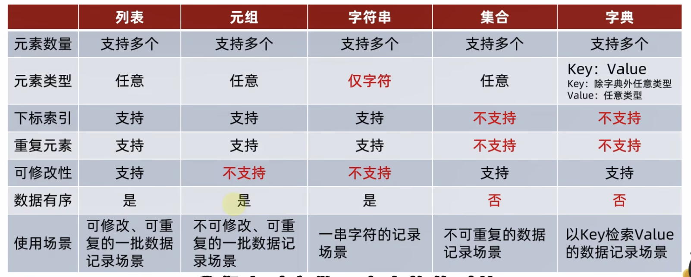
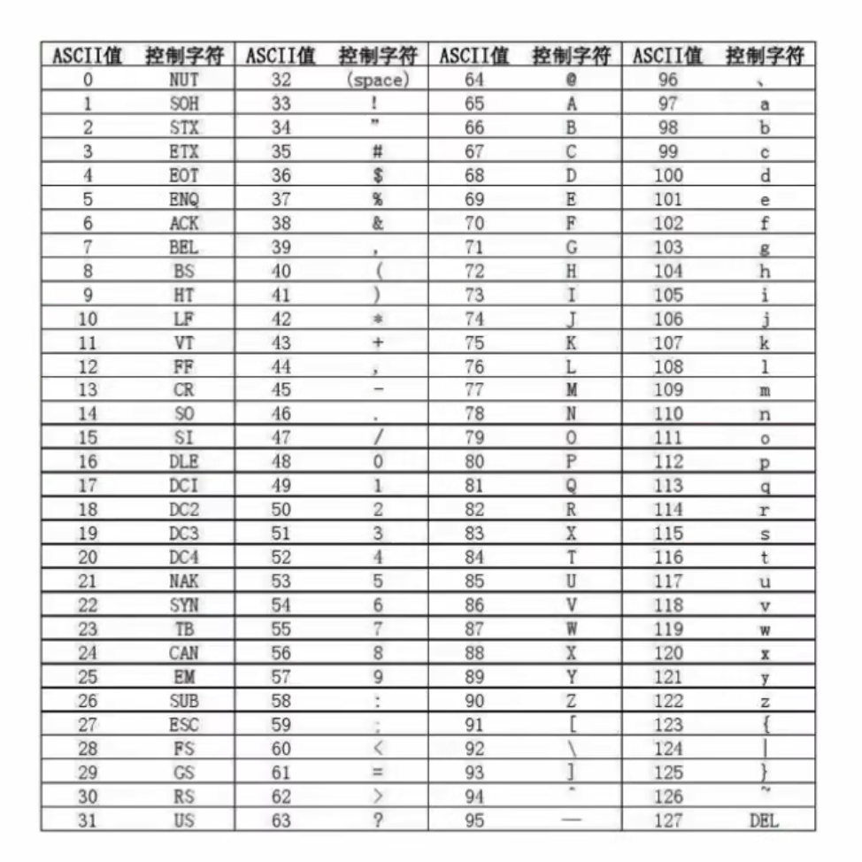
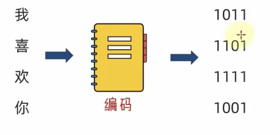
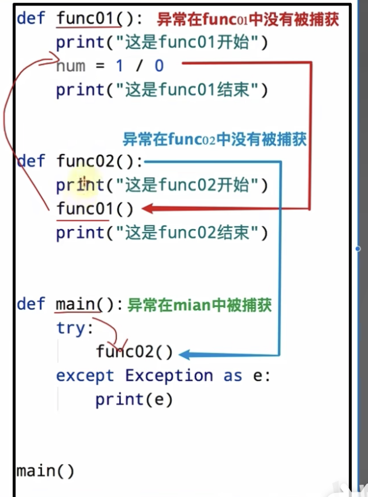
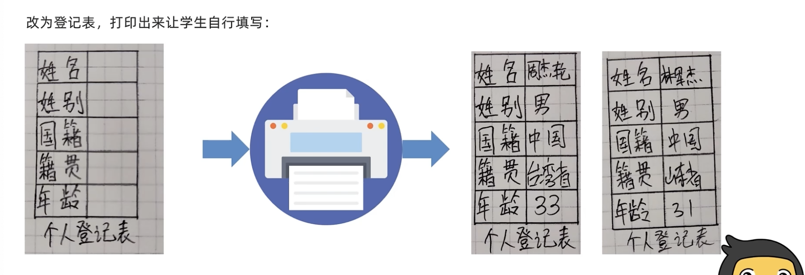
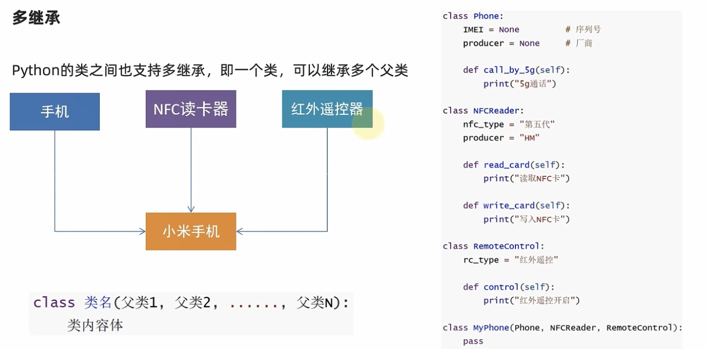
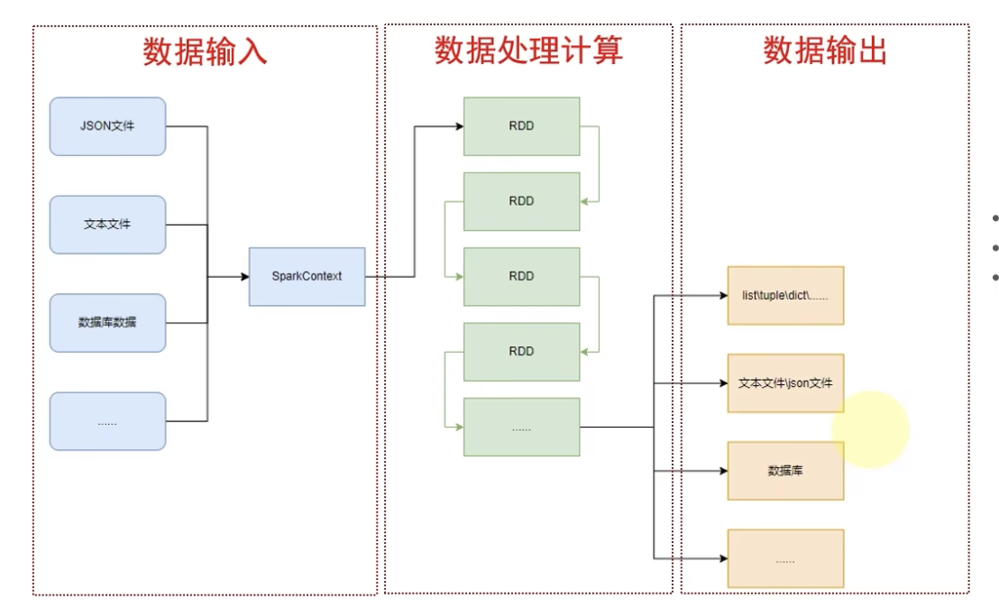
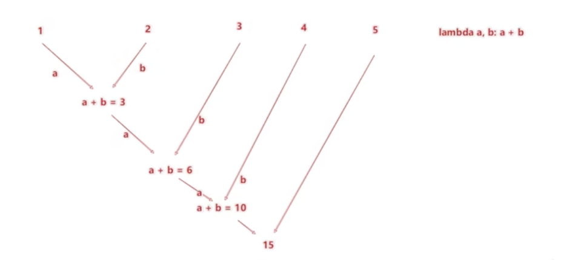

# python相关扩展

- Django: web应用程序开发框架
- Flink: 不知
- 查看安装依赖的目录
```py
python3 -c "import site; print(site.getsitepackages())"
```

<br>

# 变量
python中的变量的定义 可以直接写变量名 不像
- js中需要let
- java中需要类型

```py
name = "张三"
```

<br><br>

# 数据类型
入门阶段接触的数据类型为

|类型名称|描述|说明|
|:--|:--|:--|
|stirng|字符串类型|使用""引起来|
|int|整型(有符号)|数字类型 存放整数 如-1 10 0|
|float|浮点型(有符号)|数字类型 存放小数 如3.14|

<br>

## type(被查看类型的数据)
相当于js中的 typeof

```py

str = "字符串"
res = type(str)

print(res)
# <class 'str'> string类型的缩写 str
```

<br><br>

# 数据类型的转换
字符串 整数 浮点数 之间进行相互转换

<br>

## 类型转换的原因
从文件中读取的数字 默认就是字符串, 我们需要转换成数字类型, 后续学习的input()语句, 默认结果是字符串, 若需要数字也需要进行转换

<br>

### int(x)
将x转换为一个整数

<br>

### float(x)
将x转换为一个浮点数

<br>

### str(x)
将对象x转换为字符串, **任何类型都可以通过该函数转换为字符串**

<br>

```py
str = "1"
num = int(str)
print(type(num))
# <class 'int'>
```

<br>

### 注意:
1. 转换失败会报如下的异常
```py
ValueError: invalid literal for int() with base 10: 'a'
```

<br>

2. 字符串类型的"11.11", 并不能通过 int()来进行转换  
它只能用float()函数进行转换, 看来除了str()函数, 其它的函数都必须符合转换后的格式

<br>

3. 整数 和 浮点数之间可以转换, 整数使用float()会带小数点, 小数使用int会截断

<br><br>

# 标识符
py中不太实用驼峰呀

<br><br>

# 运算符

|运算符|描述|实例|
|:--|:--|:--|
|``//``|取整除|返回商的整数部分 9 // 2 输出结果为4, 9.0 // 2.0 输出结果 4.0|
|``**``|指数|``a**b``, ``2**2``|
|``**=``|幂赋值运算符|``c**=a``, ``c=c**a``|
|``//=``|取整除赋值运算符|``c//=a``, ``c=c//a``|

<br>

```
4 / 2 = 2.0
```

<br><br>

# 字符串

## 字符串在py中的多种定义方式

### 方式1: 单引号定义法
```py
name = 'hello'
```

<br>

### 方式2: 双引号定义法
```py
name = "hello"
```

<br>

### 方式3: 三引号定义法
```py
name = """hello"""
```

<br>

三引号定义法 和多行注释的写法一样 同样支持换行操作, 使用变量接收它就是字符串, 不使用变量接收就是多行注释

<br><br>

## 字符串的拼接

### 字面量 和 变量 的拼接

**方式1:**
```py
str = "world"
print("hello " + str)
```

<br>

**方式2: 字符串中使用特殊符号**  

- %: 表是我要占位
- s: 表示后续的变量变成字符串 放入占位的地方
- d: 表示后续的变量变成整数 放入占位的地方
- f: 表示后续的变量变成浮点型 放入占位的地方

<br>

**格式:**  
字符串中使用 %s 来进行占位, %表示分割后面是变量, 多个变量使用括号括起来 以逗号分隔
```py
"字符串 %s" % (变量1 ... )
```

<br>

总结: %表示我先占一个位置 等一会有个变量过来 我把它变成字符串放到占位的位置

```py
num = 100
res = "我的数学成绩是: %s" % num
print(res)
# 我的数学成绩是: 100
```

<br><br>

## 格式化的精度控制
格式化字符串的过程中 做数字的精度控制

```py
name = "传智播客"
set_up_year = 2006
stock_price = 19.99
message = "我是: %s, 我成立于: %d, 我今天的股价是: %f" % (name, set_up_year, stock_price)

print(message)
# 是: 传智播客, 我成立于: 2006, 我今天的股价是: 19.990000
```

我们能够发现, 浮点数19.99 -> 19.990000

<br>

**原因:**  
我们没有对数字进行精度控制

<br>

### 字符串格式化 -  数字的精度控制
我们可以使用辅助符号 "m.n" 来控制数据的宽度 和 精度, 
```
m.n
↓
3.3

m表示整数位的宽度
.n表示小数位的精度
```

<br>

**m: 控制宽度**  
要求是数字(很少使用) **设置的宽度小于数字自身 不生效**

<br>

**n: 控制小数点的精度**  
要求是数字 会进行小数的四舍五入

<br>

**示例:**  
%5d: 表示将整数的宽度控制在5位  
如数字11, 被设置为5d 就变成 _ _ _ 1 1, 用三个空格补足宽度

<br>

%5.2f: 表示将宽度控制为5, 将小数点精度设置为2  
**小数点和小数点部分也算入宽度计算**  

如对11.345设置了 %7.2f后, 结果为 _ _ _ 1 1 . 35, 2个空格补足宽度 小数部分限制2位精度后 四舍五入为.35

<br>

%.2f: 表示不限制宽度 只设置小数点精度为2  
如11.345设置 %.2f 后, 结果是11.35

<br>

```py
message = "测试:%5.2f" % 1.23
print(message)

# 测试:__1.23
```

<br><br>

## 字面量 和 变量 的拼接2
前面我们是通过 % 来进行占位 还能进行精度控制

<br>

### 格式:
"字符串"前面使用f标识, 字符串里面使用{变量} 拼接变量
```py
f"字符串{变量}"
```

<br>

### 示例:
```py
name = "sam"
print(f"我的名字叫{name}")
```

<br>

### 特点:
该方式拼接的变量 不关心类型 也不关心精度, 原本是什么样就输出什么

我们可以观察到 19.99 并没有变成 19.990000
```py
price = 19.99
print(f"图书价格: {price}")
# 图书价格: 19.99
```

<br><br>

## 对表达式进行格式化
就是在 {表达式} 括号中使用表达式

<br>

### 什么是表达式
一条**具有**明确执行**结果**的代码语句, 如 1 + 1

<br>

```py
print(f"1 + 1 的结果为{ 1 + 1}")

print(f"字符串在Python中的类型是: %s" % type("字符串"))

# 1 + 1 的结果为2
# 字符串在Python中的类型是: <class 'str'>
```

<br><br>

# 数据输入: input
程序需要我们输入信息, 读取键盘输入的场景

<br>

- 数据输出: print
- 数据输入: input

<br>

**print语句:**  
可以将内容输出到屏幕上

<br>

**input语句:**  
用来获取键盘的输入

<br>

## 格式:
我们使用 input() 语句获取键盘的输入 并保存到一个变量中

参数部分会在input语句之前 输出在控制台
```py
return_value = input("提示信息")
```

<br>

**返回值:**  
字符串

<br>

**示例:**
```py
# 它会等待用户在控制台上的输入
name = input("请告诉我你是谁")

print(f"谢谢 你的名字是{name}")
```

<br>

# 数据类型: 布尔类型
布尔类型属于数字类型下的小类型, 本质上true被记作1, false被记作0

<br>

|类型名称|描述|说明|
|:--|:--|:--|
|数字(number)|支持:<br>- 整数<br>- 浮点数<br>- 复数(complex)<br>- 布尔|复数(4+3j, 以j结尾表示复数)|
|字符串(stirng)|描述文本的一种数据类型|使用""引起来|
|列表(list)|有序的可变序列|py中使用最频繁的数据类型 可有序记录一堆数据|
|元组(tuple)|有序的不可变序列|可有序记录一堆不可变的py数据集合|
|集合(set)|无序不重复集合|可无序记录一堆不重复的py数据集合|
|字典(dictionary)|无序kv集合|可无序记录一堆kv型的py数据集合|

<br>

## 格式:
注意布尔类型的值为 **首字母大写**
```py
flag = True
flag = False
```

<br>

## 关系运算符:
- ``==``: 可以比较字符串的内容是否相等
- ``!=``
- ``>``
- ``<``
- ``>=``
- ``<=``

<br>

### 逻辑运算符
- and: 且
- or: 或
- not: 非

<br>

### 位运算符
- &
- |
- ^
- ~
- << 
- ``>>``

<br>

### 身份运算符
- is: 如果两个变量是同一个对象 返回 true: x is y
- is not: 如果两个变量不是一个对象 返回 true: x is not y

<br>

### 示例:
```py
flag = 1 > 3
print(flag)
# False
```

<br><br>

# if语句
py中是利用空格缩进来判断归属的

<br>

## 格式:
1. 缩进为4个空格
2. 条件后有 ``:``
3. 语句的部分可以写任意行 但每行前要有4个空格作为缩进
```py
if 条件:
    语句...
```

<br>

**示例:**  
```py
age = 30
if age > 18:
    print("我成年了")
    print("我要去规划人生啦")
```

<br><br>

# if else 语句

## 格式:
1. else后面有 ``:``
```py
if 条件:
    满足条件时要做的事1
    满足条件时要做的事2
else:
    不满足条件时要做的事情1
```

<br>

**示例:**  
```py
age = 10
if age > 18:
    print("我成年了")
    print("我要去规划人生啦")
else:
    print("我还没成年!")
```

<br><br>

# if elif else 语句

## 格式:
注意 else 的后面有 :
```py
if 条件1:
    程序体
elif 条件2:
    程序体
else:
    程序体
```

<br>

**示例:**  
```py
age = 10
if age > 50:
    print("我老了")
    print("我要去规划人生啦")
elif age > 18:
    print("我还年轻!")
else:
    print("我太小了")
```

<br>

**示例2:**  
```py
print("欢迎来到黑马动物园")
height = int(input("请输入你的身高: "))
level = int(input("请输入你的VIP等级: "))

if height < 120:
    print("您的身高小于120CM, 可以免费游玩")
elif level > 3:
    print("您的vip等级大于3, 可以免费游玩)
else:
    print("不好意思")
```

<br><br>

# while语句
每次循环都会判断条件是否满足 如果不满足则循环结束, 只要条件满足就会无限循环

<br>

## 格式:
```py
while 条件:
    条件满足时 做的事情
```

<br>

**示例:**  
python 中 没有 i++ 哦
```py
index = 0
while index < 10:
    print(index)
    index += 1
```

<br>

### 嵌套循环
```py
while 条件:
    条件满足时 做的事情

    while 条件2:
        条件2满足时 做的事情
```

<br>

**代码示例:**  
```py
index = 1
while index < 100:
    print(f"今天是第{i}天, 准备表白")
    i = 1
    while i < 10
        print(f"送给小美第{j}只玫瑰花")
        j += 1
    print("小美 我喜欢你")
    index += 1

print(f"坚持到第{i - 1}天, 表白成功")
```

<br><br>

# for循环
while循环的循环条件是自定义的 自行控制循环条件  
for循环是一种 轮询 机制 对一批内容进行 逐个处理

<br>

通俗的理解for, 就是将待办事项逐个完成的机制

<br>

## 格式:
对待处理中的数据集中的数据 挨个取出 **每一次循环就将数据集中的每一个数据赋值给临时变量**

注意 结果集的最后有一个 :
```py
for 临时变量 in 待处理数据集:
    循环满足条件时执行的代码
```

<br>

**代码:**  
```py
name = "itheima"
for str in name:
    print(str)


str = "itheima is a brand of itcast a a"
count = 0
for s in str:
    if s == "a":
        count += 1

print(count)
```

<br>

### 要点:
python中的for循环是无法定义循环条件的, 只能从被处理的数据集中 依次取出内容进行处理

从理论上讲 py的for循环无法构建无限循环 (被处理的数据集不可能无限大)

<br>

### 概念:
上述中 待处理数据集 的部分, 称之为: **序列类型**  

**序列类型:**  
它指, 其内容可以一个个依次取出的一个类型 包括
1. 字符串
2. 列表
3. 元组 等

<br>

## Range语句
for循环语句 本质上遍历的是 序列类型, 而我们可以通过range语句获取到一个序列

我们可以通过range语句来构建序列, 构建出来的序列就可以被for循环使用

<br>

### 语法1:
获取一个从0开始, 到num结束的数字序列(不包含num本身)
```py
range(num)

range(5) # 取得的是 [0, 1, 2, 3, 4]
```

<br>

### 语法2:
获取一个从num1开始 到 num2结束的数字序列(不包含num2本身)
```py
range(num1, num2)

range(5, 10) # 取得的是 [5, 6, 7, 8, 9]
```

<br>

### 语法3:
获得一个从num1开始, 到num2结束的数字序列(不包含num2本身), 数字之间的步长 以step为准(step默认为1)
```py
range(num1, num2, step)

range(5, 10, 2) # 取得的是 [5, 7, 9]
```

<br>

### 示例:
```py
for item in range(10):
    print(item) # 0 - 9
```

<br>

### 技巧
通过range()达到我们js中原生for的写法
```py
# 比如我们利用for进行10次的for循环
for item in range(0, 10):
    print(f"我执行了第{item}次")
```

<br>

**错误演示:**  
直接赋值给变量不行
```py
arr = range(10)
```

<br>

### 需求: 有几个偶数
```py
count = 0
for item in range(1, 100):
    if item % 2 == 0:
        count += 1

print(count)
```

<br><br>

## 变量的作用域
for中的临时变量i, 它的作用域范围只在for循环内部生效, 但是实际上它在外面也可以被访问到, 但是我们不建议这么做

<br>

### 问题:
```py
for i in range(5):
    print(i)

# 我们能访问到 for循环中的变量 i 么?
print(i)
```

<br>

### 解答:
- 规范上: 不允许
- 实际上: 可以, 不建议这么做, 如果我们想访问临时变量的话 我们可以预先在循环外定义该变量

<br>

### for嵌套应用
```py
for 临时变量 in 序列类型:
    循环体

    for 临时变量 in 序列类型:
        循环体
```

<br>

```py
i = 1
for i in range(1, 101):
    print(f"今天是向小美表白的第{i}天")

    for j in range(1, 11):
        print(f"送给小美的第{j}朵玫瑰花")

    print(f"小美 我喜欢你(第{i}天的表白结束)")
```

<br>

# 循环中断 continue 和 break
无论是while循环还是for循环 都是重复性的执行特定的操作 在这个重复的过程中 会出现一些其他的情况让我们不得不

- 暂时跳过某次循环, 直接进行下一次
- 提前退出循环 不再继续

<br>

### continue
中断本次循环, 直接进入下一次循环, 它可以用于 for 和 while

```py
for i range(1, 100):
    语句1

    continue

    语句2
```

在循环内 遇到continue就结束当次循环 进行下一次 所以语句2是不会执行的

<br>

```py
for i in range(0, 6):
    if i == 2:
        continue
    print(f"语句1 - {i}")
```

<br>

**注意:**  
continue中断的只能是它所在的循环, 比如嵌套for中 continue在内层循环中 那么它只能临时中断内层循环

<br>

### break
break关键字用于**直接结束循环**, 它可以用在for和while中

```py
for i in range(1, 100):
    语句1
    break
    语句2

语句3
```

<br>

**注意:**  
break所终结的也是它所在的循环

<br><br>

# 函数
组织好的可重复使用的, 用来实现特定功能的代码段

<br>

### 扩展: len()
用来获取字符串的长度 或 列表的长度

**返回值:**  
int

<br>

```py
name = "sam"
length = len(name)
print(type(length), length)   # <class 'int'> 3


arr = [1,2,3,4,5]

print(len(arr)) # 5
```

<br>

### 函数的格式
注意 冒号的位置
```py
def 函数名(参数):
    函数体
    return 返回值
```

<br>

**示例:**  
```py
str = "spring boot"

def get_length(str):
    count = 0
    for s in str:
        count = count + 1
    return count

length = get_length(str)
print(length)
```

<br>

### 函数的要点:
1. 函数需要先定义后使用

2. 多个参数之间使用 , 分隔

3. 定义几个参数 就要传入几个参数

4. 参数的默认值: ``def test_param(a, b = 6):``

5. 函数返回 None 的情况 (None == null, 类型 ``<class "NoneType">``)
  - 直接写return
  - 不写return
  - 显示定义 return None

6. None == False, 在if判断中 None等同于False

7. None用于定义无初始值的变量
```py
res = None
```

<br>

### 示例: 利用None进行条件判断
```py
def check_age(age):
    if age > 18:
        return True
    else:
        return None
    
res = check_age(15)

#  相当于 if(!res) { ... }
if not res:
    print("未成年")
```

<br>

### 函数的说明注释
1. 使用多行注释
2. 冒号给参数和返回值进行解释说明
3. 鼠标悬停时 会展示函数说明

```py
def check_age(age):
    """
    函数说明文档:
        :param age: 年龄
        :return: 返回值 boolean
    """
    if age > 18:
        return True
    else:
        return None
```

<br>

### 函数中变量的作用域

**局部变量:**  
定义在函数体内部的变量 只在函数体内部生效, 在函数体外部访问则报错

局部变量用于临时保存数据, 当函数调用结束后 则销毁

<br>

**全局变量:**  
指在函数体内, 外都能生效的变量

<br>

### 函数内部修改全局变量: global

**错误演示:**  
如下的操作方式是不能修改全局变量的
```py
num = 100
def test_a() {
    num = 200
}

test_a()

# 结果仍然是 100, 因为函数内部的修改操作 仍然会被认为是定义了局部变量
print(num)
```

<br>

**正确演示:**  
我们在函数内部 使用 global关键字 指明一个变量在函数内部是全局变量(并不是局部变量)

```py
num = 100

def modify_num():
    # 指明 num 变量为全局变量 
    global num
    num = 200

modify_num()

# 结果: 200
print(num)
```

<br>

### 函数的多返回值:
按照返回值的顺序 写对应顺序的多个变量接收即可 变量之间使用逗号隔开, 支持不同类型的数据 return
```py
def fn():
    # 返回值之间使用 , 隔开
    return 1, 2


# 接收多返回值
x, y = fn()
```

<br>

### 函数的多种传参方式:
函数中有4种常见的参数

<br>

**位置参数:**  
调用函数时根据函数定义的参数位置来传递参数, **传递的参数和定义的参数的顺序和个数必须一致**

```py
def sum(a, b):
    return a + b

sum(1,2)
```

<br>

**关键字参数:**  
函数调用的时候 通过 "键=值" 的形式传参

该方式可以让函数更加的清晰, 容易使用 同时也清除了参数的顺序需求

```py
def info(name, age, gender):
    return name + age + gender

info(name="小明", age=18, gender="男")
info("小明", age=18, gender="男")
```

1. 可以不按照固定的顺序
2. 可以和位置参数混用 **位置参数必须在前面 且匹配参数顺序**, 但关键字参数之间不存在先后顺序问题

<br>

**缺省参数(默认参数):**  
用于定义函数 为参数提供默认值 调用函数的时候可不传该默认参数的值

注意: 所有位置参数必须出现在默认参数的前面 包括函数定义和调用

```py
def info(name, age, gender="男"):
    print()
```

<br>

**不定长参数(可变参数):**  
用于不确定调用的时候会传递多少个参数的场景, 当我们不确定我们要传递多少个参数的时候 可以使用它 

不定长参数的类型:
- 位置传递
- 关键字传递

<br>

**位置传递的不定长:**  
传进的所有参数都会被 args 变量收集, 它会根据传进参数的位置合并成一个 元组, **args是元组类型**

<br>

```py
def info(*args):
    print(args)

info("tom", 18)
```

<br>

**关键字传递的不定长:**  
参数是 "键=值" 形式的形式的情况下 所有的"键=值"都会被args接受, 同时会根据 "键=值" **组成字典**

```py
def info(**args):
    print(args)

info(name="tom", age=18)
```

<br>

### 匿名函数:
我们把函数作为参数 在算是一种逻辑的传递 而非数据的传递

如下面的代码, 不仅仅是相加 其它的任何逻辑都可以自行定义并作为函数传入
```py
def fn(fn2):
    result = fn2(1, 2)

def fn2(x, y):
    return x + y

fm(fn2)
```

<br>

### Lambda关键字: 定义匿名函数
上面的函数定义过程中我们是使用 def 关键字来定义一个 带有名字的函数 ``def fn()``

**而 lambda关键字 可以定义 匿名函数**

<br>

- 有名字的函数 可以基于名称重复使用
- 没有名字的函数 **只可临时使用一次**

<br>

**语法格式:**  
- lambda:  
是关键字 表示定义匿名函数

- 参数列表:  
表示匿名函数的形式参数, 如 x,y 表示接受2个形式参数

- 函数体:  
就是函数的执行逻辑 **只能写一行** 无法写多行代码
```py
lambda 参数列表: 函数体     # 函数体为1行代码
```

<br>

**要点:**  
lambda的函数体中只有一行 默认就是return的

<br>

**示例:**  
```py
def get_result(fn):
    result = fn(1,2)
    print(result)


# lambda函数直接被当成参数传入使用的
get_result(lambda x, y: x + y)
```


<br><br>

# 数据容器
一种可以容纳多份数据的数据类型 容纳的每一份数据称之为一个元素, **每一个元素可以是任意类型的数据** 如字符串 数字 布尔等 (类似数组)

我们根据数据容器特点的不同 会划分为5类:
1. 列表 list
2. 元组 tuple
3. 字符串 str
4. 集合 set
5. 字典 dict

<br><br>

## 列表 (数组)

### 格式:
列表中每一个元素之间用 , 隔开, 其类型是 ``<class 'list'>``

<br>

**字面量列表:**  
```py
[el1, el2, ... ]
```

<br>

**定义变量接收:**  
```py
arr = [el1, el2, ... ]
```

<br>

**定义空列表:**
```py
arr = []
arr = list()
```

<br>

### 示例:
```py
arr = [1,2,3,4,5]

for item in arr:
    print(item)


# 列表从后往前取数字, 末尾下标为-1, 利用了abs
index = -1
while abs(index) <= len(arr):
    print(arr[index])
    index = index - 1
```

<br>

### 要点:
1. 列表中的元素的类型任意, 和js一样

2. 列表的起始下标为 0

3. 列表的下标可以是反向索引, 末位为-1, 从后往前依次递减
```
|元素|元素|元素|元素|元素|
  ↓   ↓    ↓   ↓   ↓
  0   1    2   3   4


|元素|元素|元素|元素|元素|
  ↓   ↓    ↓   ↓   ↓
 -5  -4   -3  -2  -1
```

4. 下标越界同样报错 list index out of range

<br><br>

## 列表的常用操作
list列表本身提供了一系列可供我们使用的函数, 如我们的arr.map arr.find 等等

<br>

### 根据元素找到元素在列表中的下标
查找的是正向索引, 如果找不到 报错: ValueError
```py
list.index(元素)


arr = [1,2,3,4,5]
index = arr.index(1)
print(index)
```

<br>

### 修改列表中指定下标位元素的值
```py
list[index] = "值"
```

<br>

### 在指定下标位置插入元素
原下标位置的元素后移
```py
list.insert(下标, 元素)

arr = [1,2,3,4,5]

arr.insert(0, "a")
print(arr) # ['a', 1, 2, 3, 4, 5]
```

<br>

### 在列表尾部追加 单个 新元素
```py
list.append(元素)
```

<br>

### 在列表尾部追加 一批 新元素
该方法会将其它数据容器的内容取出, 依次追加到列表尾部
```py
list.extend(其它数据容器)


arr = [1,2,3,4,5]
arr2 = ["a", "b"]

arr.extend(arr2)
print(arr) # [1, 2, 3, 4, 5, 'a', 'b']
```

<br>

### 删除指定下标的元素
```py
del list[下标]

list.pop(下标)
```

<br>

### 根据内容删除列表中的元素
从前到后的搜索该元素 删除匹配的第一个元素
```py
list.remove(元素)
```

<br>

### 清空列表
```py
arr.clear()  # []
```

<br>

### 统计列表中全部的元素的数据
```py
len(列表)
```

<br>

### 统计列表中某元素的数量
```py
list.count(元素)
```

<br><br>

## 列表的 循环遍历

### while 遍历
while玄幻可以自定义循环条件 并自行控制
```py
arr = ["a", "b", "c", "d"]

def list_while_fn(arr):
  index = 0
  while index < len(arr):
      print(arr[index])
      index += 1

list_while_fn(arr)
```

<br>

### for 遍历
for循环不可以自定义循环条件 只可以一个个从容器内取出数据

它只适用于 遍历数据容器的场景 或 简单的固定次数的循环场景
```py
arr = ["a", "b", "c", "d"]

def list_for_fn(arr):
   for item in arr:
      print(item)

list_for_fn(arr)
```

<br><br>

# 数据容器: 元组
列表是可以修改的 如果我们想要传递的信息不被篡改 那列表就不合适了

<br>

### 元组的特点: 只读的list
1. 元组和列表一样 都是可以封装多个不同类型的元素在内
2. **元组一旦定义完成 就不可以修改**

<br>

### 场景:
我们需要在程序中封装数据 但又不希望封装的数据被篡改的时候 就使用元组

<br>

### 格式: 元组使用()定义
```py
# 定义元组字面量
(元素1, 元素2, 元素3 ...)


# 定义元组变量
变量名称 = (元素1, 元素2, 元素3 ...)


# 定义空元组
变量名称 = ()
变量名称 = tuple()
```

<br>

### 示例:
```py
t = (1, 2, 3, 4, 5)

print(len(t)) # 5

print(type(t)) # <class 'tuple'>

print(t[0]) # 0

print(t[-1]) # 5

i = t.index(1)
print(i) # 0
```

<br>

### 注意:
1. 如果 元组 中只有一个数据 元素后面必须带 , 
```py
(1,)
```

2. 元组内定义的列表 列表中的元素是可以被修改的

3. 元组也是list 所以它可以使用list中的方法, 但是追加删除等方法是不可以使用的, 一般能用的就是如下的方法
  - index()
  - count()
  - len()

<br>

### 元组的遍历
```py
t = (1, 2, 2, 4, 5)
index = 0
while index < len(t):
    print(t[index])
    index += 1


for item in t:
    print(item)
```

<br><br>

# 数据容器: 字符串
我们这里会以数据容器的视角来看下字符串

尽管字符串看起来并不像 列表 元组 那样 一看就是存放了许多数据的容器 但不可否认的是 字符串同样也是数据容器的一员

字符串是字符的容器, 一个字符串可以存放任意数量的字符 如字符串: "itheima", 每一个字符都是一个元素

每一个字符都会对应有自己的索引 从0开始

<br>

### 特点:
1. 字符串支持下标
  - 从前向后: 0
  - 从后向前: -1

2. 字符串是不可修改的数据容器 和 元组一样

<br><br>

## 常用方法

### 通过下标取值
```py
str = "itheima"
print(str[0])
```

<br>

### 获取自定字符在字符串中的 下标
```py
str = "itheima"
index = str.index(h)
```

<br>

### 字符串的替换
将字符串内的**全部** 字符转1 替换为 字符串2

返回值: 新的字符串
```py
字符串.replace(字符串1, 字符串2)


str = "itheima"

nstr = str.replace("i", "x")
print(nstr)
```

<br>

### 字符串的分割
按照指定的分隔符字符串, 将字符串划分为多个字符串, **并存入列表对象中**
```py
字符串.split("分隔符")


str = "itheima-sam"

str_list = str.split("-")
print(str_list)
```

<br>

### 去除 字符串 指定子串
```py
字符串.strip(参数)
```

<br>

- 去除前后 空格 / **换行符** (不传参)
```py
str = "  itheima-sam  "

str = str.strip()
print(f"---{str}---")
```

<br>

- 去除前后自定字符串: 传入12其实就是1和2, 它们都会被移除并且是按照单个字符
```py
str = "12itheima-sam21"

str = str.strip("12")
print(f"---{str}---")
```

<br>

### 统计字符串中某字符串出现的次数
```py
字符串.count("字符串")
```

<br>

### 统计字符串的长度
```py
len(字符串)
```

<br><br>

## 序列的切片
序列是指 内容连续 有序 可使用下标索引的一类数据容器

- 列表
- 元组
- 字符串

如上的数据容器都可以视为序列

```
| 元素1 | 元素2 | 元素3 | 元素4 | 元素n |
   0       1      2      3      n-1


| 元素1 | 元素2 | 元素3 | 元素4 | 元素n |
   -n   -(n-1)  -(n-2)   ...     -1
```

<br>

### 序列的切片
序列支持切片, 即: 列表 元组 字符串 均支持进行切片操作

<br>

**切片:**  
从一个序列中 取出一个字序列

<br>

**语法:**    
表示从序列中 从指定位置开始 依次取出元素 到指定位置借宿 **得到一个新的原类型序列**
```py
序列[起始下标:结束下标:步长]
```

<br>

- 起始下标: (包含) 从何处开始, 可以留空, 留空表示从头开始
- 结束下标: (不包含) 表示何处结束, 可以留空, 留空视作截取到结尾
- 步长: 依次取元素的间隔, 默认值为1 可以省略不写
  - 步长1: 一个个取元素
  - 步长2: 每次跳过1个元素取
  - 步长n: 每次跳过n-1个元素取
  - 步长为负数: 
    步长为负数时, 序列的头为最右侧, 尾为左侧, 反向取(起始下标和结束下标也要反向标记)

<br>

### 示例:
```py
arr = [0,1,2,3,4,5,6]

# 从1开始 4结束 步长为1(默认值可以不写)
res = arr[1:4]
print(res) # [1,2,3]


# 从头开始 到尾结束 步长为1(可以不写)
res = arr[:]
print(res) # [0,1,2,3,4,5,6]


# 从头开始 到尾结束 步长为2
res = arr[::2]
print(res)  # [0, 2, 4, 6]


# 从头开始 到最后结束 步长-1
res = arr[::-1]
print(res)  # [6, 5, 4, 3, 2, 1, 0]


# 从3开始 到1结束 步长-1
res = arr[3:1:-1]
print(res)  # [3, 2]
'''

   结尾   开头
    ↓     ↓
[0, 1, 2, 3, 4, 5, 6]
'''


# 从头开始 到为结束 步长-2
res = arr[::-2]
print(res)  # [6, 4, 2, 0]
```

<br>

### 示例:
```py
str = "万过薪月"
str = str[::-1]
print(str)
```

<br><br>

# 数据容器: set
- 列表可修改, 支持重复元素且有序
- 元组 字符串不可修改 支持重复元素且有序

如果我们的使用场景中需要对内容做去重处理 那么列表 元组 字符串就不方便了

<br>

### 集合特点:
1. 去重, 无序
2. 因为是无序的 所以不支持下标访问

<br>

### 格式:
```py
# 定义集合字面量
{元素1, 元素2, 元素3}


# 定义集合变量
变量名称 = {元素1, 元素2, 元素3}


# 定义空集合
变量名称 = set()  # 输出 set()
```

<br><br>

## 常用方法:

### 将指定元素 添加到集合内
修改的是集合本身
```py
集合.add(元素)


my_set = {"hello", "world"}
my_set.add("itheima")
```

<br>

### 将指定元素 从集合内移除
修改的是集合本身
```py
集合.remove(元素)
```

<br>

### 从集合中随机取出一个元素
取出元素后 集合中的元素被移除
```py
el = 集合.pop()
```

<br>

### 清空集合
```py
集合.clear()
```

<br>

### 取出集合1和集合2的差集(集合1有 集合2没有)
得到一个新集合 集合1和集合2不变
```py
新集合 = 集合1.difference(集合2)
```

<br>

### 消除2个集合的差集: 对比集合1 和 集合2, 在集合1中 删除和集合2相同的元素
结果: 集合1被修改, 集合2不变

```py
集合1.difference_update(集合2)
```

<br>

### 消除2个集合的差集: 对比集合1 和 集合2, 在集合1中 删除和集合2相同的元素
结果: 集合1被修改, 集合2不变

```py
集合1.difference_update(集合2)
```

<br>

### 将集合1 和 集合2 组合成一个新的集合
结果, 得到新集合 集合1 和 集合2 不变

```py
集合1.union(集合2)
```

<br>

### 将集合1 和 集合2 组合成一个新的集合
结果, 得到新集合 集合1 和 集合2 不变

```py
集合1.union(集合2)
```

<br>

### 统计集合元素的数量
```py
len(集合)
```

<br>

### 集合的遍历
集合不支持下标索引 不能使用 while
```py
for item in 集合:
    print(item)
```

<br>

### 集合的特点:
1. 可以容纳多个数据
2. 可以容纳不同类型的数据
3. 数据是无序存储的
4. 不允许重复数据存在
5. 可以修改
6. 支持for

<br>

### 示例:
```py
my_list = [1,2,3,4,5,6,6,5,4,3,2,1]

# 空集合的定义方式
my_set = set()

for item in my_list:
    my_set.add(item)

print(my_set)
```

<br><br>

# 数据容器: dict 字典(Map)

## 格式:
```py
# 定义字典字面量
{
    key: value
    "王力宏": 99
}


# 定义字典变量
my_dict = {
    key: value
}


# 定义空字典
my_dict = {}
my_dict = dict()
```

<br>

### 要点:
1. 字典 key 和 value 部分可以是任意数据类型(key不可以是字典)
2. 重复的key, 会覆盖已有的属性名

<br>

### 取值操作:
**方式1:**
```
字典[key]
```

<br>

**方式2:**
```
字典.get(key)
```

<br>

**示例:**  
```py
my_dict = {
    "name": "sam",
    "name": "erin",
    1: 2,
    # True 会将上面 1 进行覆盖
    True: False
}

print(my_dict.get(True))
print(my_dict["name"])
```

<br>

**示例:**  
```py
stud_list = [
    {
        "name": "王力宏",
        "语文": 77,
        "数学": 66,
        "英语": 88
    }
]

stud_dict = {
    "王力宏": {
        "语文": 77,
        "数学": 66,
        "英语": 88
    }
}
```

<br><br>

## 字典的常用操作:

### 新增元素  
```py
字典[key] = value
```

<br>

### 更新元素
```py
字典[key] = value
```

<br>

### 删除指定key对应的元素
```py
字典.pop(key)
```

<br>

### 清空元素
```py
字典.clear()
```

<br>

### 获取全部的key
返回值为一个包含key的list列表
```py
字典.keys()


ret = my_dict.keys()
for name in ret:
    print(name)
```

<br>

### 获取全部的value
返回值为一个包含value的list列表
```py
字典.values()
```

<br>

### 获取kv对
返回值为一个包含kv的元组
```py
字典.items()


for entry in my_dict.items():
    print(entry)


('name', 'sam')
('age', 18)
```

<br>

### 遍历字典
```py
# 方式1: 直接遍历字典
for key in my_dict:
    print(my_dict[key])


# 方式2: 拿到字典对应的key的列表 获取key 从字典中再取值
ret = my_dict.keys()
for name in ret:
    val = my_dict[name]
    print(val)
```

<br>

### 统计字典中元素的数量
```py
len(字段)
```

<br><br>

# 数据容器对比总结:


<br><br>

# 数据容器的通用操作

### 统计容器的元素个数
```py
len(容器)
```

<br>

### 统计容器的最大元素
```py
max(容器)
```

<br>

### 统计容器的最小元素
```py
min(容器)
```

<br>

### 将指定容器 转换为列表
```py
list(容器)
```

<br>

### 将指定容器 转换为列表
1. 字符串转列表: 会将字符串拆成字符放到列表中
2. 字典转列表: 会将key的部分放到列表中 value舍弃
```py
list(容器)
```

<br>

### 将指定容器 转换为字符串
字典转字符串 相当与 JSON.stringify
```py
str(容器)
```

<br>

### 将指定容器 转换为元组
要点和转列表一样
```py
tuple(容器)
```

<br>

### 将指定容器 转换为集合
要点和转列表一样
```py
set(容器)
```

<br>

### 排序
将给定容器进行排序, **排序结果会转为列表**

它就是将内容进行排序后放入列表中

字典排序后, 返回的是列表 且value的部分被舍弃
```py
sorted(容器, [reverse=True])

 
my_list = [1,2,3]
print(sorted(my_list, reverse=True))
```

<br><br>

## 比较字符串的大小
在程序中 字符串所用的所有字符 比如
- 大小写英文单词
- 数字
- 特殊符号

都有对应的 **asc2** 码表值

<br>



<br>

每一个字符都能对应上一个数字的码值, **字符串进行比较久是基于数字的码值大小进行比较的**

<br>

- 0 - 9 : 48 - 57
- A - Z : 65 - 90
- a - z : 97 - 122

<br>

### 字符串比较规则:
字符串是按位比较 也就是一位位进行比较 只要有一位大, 那么整体都大

<br><br>

# 文件操作

## 文件的编码

### 编码技术
它指的就是翻译的规则, 一种密码本  
记录了如何将内容翻译成2进制, 以及如何将2进制翻译回可识别的内容

<br>



<br>

计算机中有许多可用的编码技术, 不同的编码 将内容翻译成二进制也是不同的

- utf-8
- gbk
- big5

<br>

**注意:**  
编码和解码要使用一致的编码格式

<br><br>

## 文件的读取

### 什么是文件
内存中存放的数据在计算机关机后就会消失 要长久保存数据 就要使用硬盘 为了便于数据的管理和检索 引入了 "文件" 的概念

一篇文章 一段视频 一个可执行程序 都可以被保存为一个文件 并赋予一个文件名

<br>

**操作系统以文件为单位管理磁盘中的数据**, 一般来说文件可分为

1. 文本文件
2. 视频文件
3. 音频文件
4. 图像文件
5. 可执行文件

<br>

### 文件操作包含哪些内容
- 打开
- 关闭
- 读
- 写

<br>

我们使用py来操作文件可以分为如下的3个步骤:
1. 打开文件
2. 读写文件
3. 关闭文件

<br>

**注意:**  
可以只打开和关闭文件 不进行任何读写

<br>

### 打开文件 & 新建文件
使用open函数 可以打开一个已经存在的文件 或者 创建一个新文件

```py
open(name, mode, encoding)
```

<br>

**参数:**  
- name: 是要打开的目标文件名的字符串 (可以包含文件所在的具体路径)

- mode: 设置打开文件的模式(访问模式): 只读 写入 追加等
  - r: **只读**方式打开文件, 文件的指针将会放在文件的开头, **默认模式**

  - w: 打开一个文件只用于**写入**
    - 如果该文件已存在则打开文件 并从开头开始编辑, **原有的内容会被删除**
    - 如果该文件不存在 **创建新的文件**

  - a: 打开一个文件用于**追加**  
    - 如果该文件已存在 **新的内容讲会被写入到已有内容之后**
    - 如果该文件不存在 **创建新文件进行写入**

- encoding: 编码格式(推荐使用 utf-8)

<br>

**注意:**  
encoding参数的位置不是第三位, 所以不能使用位置参数 用关键字参数直接指定

- r: 文件不存在时, 使用r读取文件会报错
- w: 文件不存在时, 使用w会创建一个新的文件
- a: 文件不存在时, 使用a会创建一个新的文件

<br>

**示例:**  
```py
# 我写相对路径报错 为啥
file = open("test_read.txt", "r", encoding="utf-8")

print(type(file))
# <class '_io.TextIOWrapper'>
```

<br>

**返回值:**  
open函数的**文件对象**  

对象是py中一种特殊的数据类型 拥有属性和方法 可以使用
- 对象.属性
- 对象.方法

对文件进行访问

<br>

### 文件对象身上的方法: close

**作用1: 停止py对文件的占用**  
关闭文件对象 也就是关闭对文件的占用 如果不调用close方法 同时程序没有停止运行 那么这个文件将一直被py程序占用

<br>

**作用2:**  
close方法自带 flush()方法的功能 会将缓冲区的内容刷新到文件中

```py
文件对象.close()
```

<br>

### 文件对象身上的方法: read
num表示要从文件中读取的数据的长度(单位: 字符), 如果**没有传入num, 那么就表示读取文件中所有的数据**
```py
文件对象.read(num)


file = open("/Users/liulin/Desktop/Sam/Demo/Python/test_read.txt", "r", encoding="utf-8")
content = file.read()

print(content)
# hello
# world
print(type(content))
# <class 'str'>
```

<br>

**要点:**  
read()方法可以调用多次, 当第一次调用 read(8) 后 指针会移动到指定8的位置, 后续再次调用时它会从8的位置继续读取

<br>

### 文件对象身上的方法: readlines
该方法可以按照行的方式把整个文件中的内容进行一次性的读取

**返回值:**  
列表, 其中每一行的数据为一个元素

<br>

**要点:**  
会读取到换行符 ``\n``

```py
content_list = 文件对象.readlines()


file = open("/Users/liulin/Desktop/Sam/Demo/Python/test_read.txt", "r", encoding="utf-8")
content_list = file.readlines()

print(content_list)
# ['hello\n', 'world']
print(type(content_list))
# <class 'list'>
```

<br>

### 文件对象身上的方法: readline
调用一次则读取一行, 再调用再次读取

不要读取到换行符

```py
content = 文件对象.readline()
```

<br>

### for循环读取文件行
for语法可以的数据源可以是一个 文件对象, 每次循环我们能读取到一行数据
```py
for line in open("python.text", "r"):
    print(line)
```

<br>

### 扩展: sleep
单位为秒
```py
time.sleep(5000)
```

<br>

### 扩展: with上下文管理器
通过下面的语法可以在操作文件后自动关闭文件, 避免遗忘掉close方法

在with open代码块中 当程序执行完之后 **会自动关闭文件**

```py
with open("文件路径", "r") as file:
    file.readlins()
```

<br><br>

## 文件的写入

### 将内容写入到内存中
```py
write("内容")
```

<br>

### 将内容从缓冲区刷新到文件中
```py
f.flush()
```

<br>

### 步骤:
1. 打开文件
```py
f = open("test.txt", "w", encoding="UTF-8)
```

2. 文件写入
```py
f.write("内容")
```

3. 内容刷新
```py
f.flush()
```

<br>

### 注意:
直接调用 write方法, 内容并未真正写入文件, 而是会积攒在程序的内存中, 称之为缓冲区

当调用flush的时候, 内容会真正写入文件, 这样做是避免频繁的操作硬盘, 导致效率下降(攒一堆, 一次性写磁盘)

<br>

### 示例: 文件的复制
```py
source = open("/Users/liulin/Desktop/Sam/Demo/Python/test.txt", "r", encoding="utf-8")

content = source.read()

target = open("/Users/liulin/Desktop/Sam/Demo/Python/test_copy.txt", "w")

target.write(content)
target.flush()
target.close()
```

<br>

### 示例2: 过滤掉文件中的测试数据 实现文件的复制
```py
fr = open()
fw = open()

for line in fr:
    line = line.strip()
    if line.split(",")[-1] == "测试":
        continue
    fw.write(line)
    # 由于前面对内容进行了strip()的操作 所以要手动的写出换行符
    fw.write("\n")

fr.close()
# 自带flush()功能
fw.close()
```

<br><br>

# 异常部分

## 了解异常
当监测到一个错误时, py解释器就无法继续执行了 反而出现了一些错误的提示

这就是所谓的异常, 也就是我们常说的bug 

<br><br>

## 异常的捕获方法

### 为什么要捕获异常
世界上没有完美的程序 任何程序在运行的过程中 都有可能会出现 异常 也就是出现bug导致无法完美的运行下去

我们要做的 不是力求程序完美运行 而是在力所能及的范围内 对可能出现的bug 进行提前准备 提前处理

这种行为我们称之为: 异常处理(捕获异常)

<br>

当我们的程序遇到了BUG 那么接下来有两种情况:
1. 整个程序因为一个BUG停止运行
2. 对BUG进行提醒, 整个程序继续运行

显然在之前的学习中 我们所有的程序晕倒了BUG就会出现1的情况, 也就是整个程序直接崩溃

但是在真实的工作中 我们肯定不会因为一个小的bug就让整个程序全部崩溃, 也就是我们希望达到2的情况

这里我们就需要使用到捕获异常

捕获异常的作用在于, 提前假设某处会出现异常 做好提前准备 当真的出现异常的时候 可以有后续的手段

<br>

### 语法:
```py
try:
    可能发生错误的代码
except:
    如果出现异常执行的代码
```

<br>

### 示例:
尝试以r模式打开文件 如果文件不存在 则以w方式打开
```py
try:
    fr = open("linux.text", "r")
except: 
    fw = open("linux.text", "w")
```

<br>

### 捕获指定异常:
```py
try:
    可能发生错误的代码
except 异常类型 as 错误对象别名:
    如果出现异常执行的代码
```

- NameError: 变量没有定义的异常
- ZeroDivisionError: 除0异常

<br>

### 示例:
尝试以r模式打开文件 如果文件不存在 则以w方式打开
```py
try:
    print(name)
except NameError as e: 
    print("出现了变量未定义的异常")
```

<br>

### 捕获多个异常:
异常对象部分使用元组来存放

```py
try:
    可能发生错误的代码
except (异常对象1, 异常对象2) as 错误信息:
    如果出现异常执行的代码
```

<br>

### 捕获所有异常:
Exception最大的异常对象

```py
try:
    可能发生错误的代码
except Exception as 错误信息:
    如果出现异常执行的代码
```

<br>

### 异常的 else
如果try里面的代码出现异常会使用except来处理, 如果没有异常则执行else中的逻辑
```py
try:
    可能发生错误的代码
except 异常对象 as 错误信息:
    如果出现异常执行的代码
else:
    没有异常时执行的代码
```


<br>

### 异常的 finally
无论是否发生异常都要执行的代码, 例如关闭文件
```py
try:
    可能发生错误的代码
except 异常对象 as 错误信息:
    如果出现异常执行的代码
else:
    没有异常时执行的代码
finally:
    一定会执行的代码 不管有没有异常
```

<br><br>

## 异常的传递
异常是具有传递性的

当函数func01中发生异常, 并且没有捕获处理这个异常的时候, 异常会传递到函数func02中

当func02也没有捕获处理这个异常的时候 main函数会捕获这个异常 这就是异常的传递性

<br>

**提示:**  
当所有函数都没有捕获异常的时候 程序就会报错

<br>



<br><br>

# Py的模块

## 什么是模块
py模块(module), 是一个py文件, 模块能定义函数 类 变量 模块里也能包含可执行的代码

<br>

### 作用:
py中有很多各种不同的模块 每一个模块都可以帮助我们快速的实现一些功能

比如实现和事件相关的功能就可以使用time模块, 我们可以认为一个模块就是一个工具包

每一个工具包中都有各种不同的工具供我们使用进而实现各种不同的功能

<br>
 
模块就是一个py文件 里面有类 函数变量 我们可以导入模块去使用

<br>

### 导入模块的方法概述
```py
[form 模块名] import [模块 | 类 | 变量 | 函数 | *] [as 别名]

# 导入模块本身
import 模块名

# 从模块中导入指定的功能
from 模块名 import 功能

# 从模块中导入所有的功能
from 模块名 import *

import 模块名 as 别名

from 模块名 import 功能名 as 别名
```

<br>

### 基本语法:
```py
import 模块名1, 模块名2

# 通过模块名来使用模块内部定义好的 方法 变量
模块名.功能名


# 导入时间模块
import time

print("开始")
time.sleep(1)   # 睡一秒
print("结束")
```

<br>

### 使用from来导入模块
从 模块中 导入 **指定的功能**
```py
from 模块名 import 模块中的功能名

# 使用
功能名()


# 导入时间模块中的sleep方法
from time import sleep

print("开始")
sleep(1)   # 睡一秒
print("结束")
```

<br>

### *的使用
```py
from time import *
sleep()
```

<br>

### as别名的使用
使用as给特定功能加上别名
```py
from 模块名 import 模块中的功能名 as 别名

# 使用
别名()


# 导入时间模块中的sleep方法
from time import sleep as s

print("开始")
s(1)   # 睡一秒
print("结束")
```

<br><br>

## 自定义模块
每个py文件都可以作为一个模块, **模块的名字就是文件的名字**

1. 创建一个a.py文件 写逻辑
2. 另一个py文件使用 import导入自定义的a.py文件

<br>

### 注意:
比如我们在 a.py 文件中定义了如下的代码
```py
def test(a, b):
    print(a + b)

# 文件中调用了
test(1, 2)
```

这时我们在 b.py 导入 a模块, 则不管是当前文件还是其他已经导入了该模块的文件 在运行的时候 都会自动执行 test函数的调用
```py
import a
```

<br>

**期望:**  
我不想在导入 a 模块的时候 执行a模块中的函数调用

<br>

### __name__:
它是py中的内置变量, 当我们运行py文件的时候 这个变量的值就会是 __main__

运行哪个py文件 这个py文件的 __name__ 变量的值就是 __main__ (有点像this)

<br>

### 解决: 
```py
def sum(a, b):
    print(a + b)

# 只有在右键run 本文件的时候 才会执行调用, 别的文件导入这个模块的时候不会执行函数调用
if __name__ == "__main__":
    sum(1, 2)
```

<br>

### __all__:
该变量的值, 可以是一个列表

列表中定义, 当该文件被当做模块(**使用 * 语法**)被别的文件导入时, 指定导入列表中指定的功能

<br>

如果一个模块文件中有 __all__ 变量的时候, **当使用 ``from xxx import *`` 导入时**, 只能导入这个列表中的元素

<br>

```py
__all__ = ["testA"]

def testA():
    print("A")


def testB():
    print("B")
```

这样定义后 别的文件导入该模块的时候 只能使用 testA 方法

<br><br>

# 自定义py包
上面我们说了一个py文件就是一个模块 我们可以导入模块来使用模块中的功能

如果py模块太多了 就可能造成一定的混乱 那么如何管理呢？**我们可以通过py包来管理**

<br>

### 什么是py包
从物理上看 **包就一个一个文件夹**, 该文件夹下包含了一个 __init__.py 文件

该文件可用于包含多个模块文件, 从逻辑上看包的本质仍然是模块

<br>

有点类似 nodejs 中的汇总路由, 我们定义一个 __init__.py 文件, 在该文件中导入各个模块

这个 __init__.py 文件 就是一个 package 包

<br>

**总结:**  
文件夹 + __init__.py = 包

没有 __init__.py 则就是一个普通的文件夹

<br>

### py包的作用:
当我们的模块文件越来越多的时候 包可以帮助我们管理这些模块 包的作用就是包含多个模块, 但包的本质仍然还是模块

<br>

### 创建 包 的步骤
1. 创建一个文件夹 my_package 
2. 创建 __init__.py 文件
3. 在 __init__.py 文件下引入模块

<br>

### 导入包

**方式1:** 
```py
import 包名.模块名
包名.模块名.目标


import my_package.my_module1
my_package.my_module1.test()
```

<br>

**方式2:** 
```py
from 包名 import 模块名
模块名.目标


from my_package import my_module1
my_module1.test()
```

<br>

**方式3:** 
```py
from 包名.模块名 import 具体功能名
具体功能


from my_package.my_module1 import test
test()
```

<br>

### __all__ = ["模块名"]
通过*导入的时候 只能导入all变量中指定的模块

<br><br>

## 安装第三方包
在py中还有很多第三方的包, 可以极大的帮助我们提高开发效率 如
- 科学计算中常用的: numpy包
- 数据分析中常用的: pandas包
- 大数据计算中常用的: pyspark, apache-flink包
- 图形可视化常用的: matplotlib, pyecharts
- 人工智能能常用的: tensorflow

由于是第三方包, 所以python没有内置 所以我们 **需要安装它们才可以导入使用**

<br>

### 安装程序: pip
只要我们安装了python后 就内置了pip程序, python3的话对应命令为 pip3

<br>

**常用API:**  
```py
# 安装
pip install 包名称
pip install 包名称==版本号


# 卸载
pip uninstall package_name


# 更新
pip install --upgrade package_name
pip install -U package_name


# 查看某个包的信息
pip show -f requests


# 查看需要被升级的包
pip list -o


# 查看兼容问题
pip check package_name
pip check
```

<br><br>

# 可视化案例相关知识点总结:

## Python中的JSON
Python中的JSON是如下的两种情况
- 字典
- 列表(要求元素为字典)

**示例:**  
```py
{"name": "sam", "age": 18}

[
  {"name": "sam", "age": 18}
]
```

<br>

### Python数据与JSON数据之间的转换

**1. 导入json模块**
```py
import json
```

<br>

**python -> json:**  
```py
jsonData = json.dumps(python数据)

# 可选参数2: 解决中文控制台输出编码问题
# False表明不使用 asc2码 转换中文
# True表明中文为 Unicode
jsonData = json.dumps(python数据, ensure_ascii=False)
```

<br>

**json -> python:**  
```py
pyData = json.loads(json数据)
```

<br>

### pyecharts的使用:

**效果示例网站:**  
它跟画廊一样 可以找到对应的效果图 我们查看它的实现代码
```py
gallery.pyecharts.org
```

<br>

**安装 echarts 模块:**  
```py
pip install pyecharts


# 验证安装是否出错 包是否可以使用
1. 进入python交互模式 python
2. import 包名
```

<br>

### 基础折线图
```py
# 导包, 导入Line功能构建折线图对象
from pyecharts.charts import Line

# 得到 折线图对象
line = Line()

# 添加x轴数据
line.add_xaxis(["中国", "美国"])

# 添加y轴数据 [30,20] 为 x y轴在途中的交叉点
line.add_yaxis("GDP", [30,20])

# 生成图标
line.render() 
```

<br>

**注意:**  
当我们执行render()方法后 目录中就会多出 render.html 文件

<br>

### 全局配置
针对整个图像进行设置, 比如标题 图例 工具箱等


<br>

**注意:**  
我们在render()方法执行前 配置

<br>

**全局配置的API:**  
我们可以通过 set_global_opts方法 来进行配置

<br>

**1. 导入相关配置对象:**  
比如我们要配置标题的配置, 就要导入标题配置对象
```py
from pyecharts.options import TitleOpts, LabelOpts
```

<br>

**2. 通过调用set_global_opts来进行配置:**

```py
折线图对象.set_global_opts(
    # 关键字传参
    设置1,
    设置2
)


line.set_global_opts(
    # 标题的配置
    title_opts=TitleOpts("测试", pos_left="center", pos_bottom="1%")
    # 图例的配置
    legend_opts=LegendOpts(is_show=True)
)
```

<br>

**示例代码:**  
```py
"""
演示pyecharts的基础入门
"""
# 导包
from pyecharts.charts import Line

# 导入配置对象
from pyecharts.options import TitleOpts, LegendOpts, ToolboxOpts, VisualMapOpts


# 创建一个折线图对象
line = Line()
# 给折线图对象添加x轴的数据
line.add_xaxis(["中国", "美国", "英国"])
# 给折线图对象添加y轴的数据
line.add_yaxis("GDP", [30, 20, 10])


# 设置全局配置项set_global_opts来设置,
line.set_global_opts(
    title_opts=TitleOpts(title="GDP展示", pos_left="center", pos_bottom="1%"),
    # 图例
    legend_opts=LegendOpts(is_show=True),
    # 工具箱
    toolbox_opts=ToolboxOpts(is_show=True),
    # 视觉映射
    visualmap_opts=VisualMapOpts(is_show=True),
)

# 通过render方法，将代码生成为图像
line.render()
```

<br>

### 系列配置
针对具体的轴数据进行配置, 比如针对y轴数据进行个性化的配置

<br>

### 折线图示例
```py
"""
演示可视化需求1：折线图开发
"""
import json
from pyecharts.charts import Line
from pyecharts.options import TitleOpts, LabelOpts


# 处理数据
f_us = open("D:/美国.txt", "r", encoding="UTF-8")

us_data = f_us.read()   # 美国的全部内容

f_jp = open("D:/日本.txt", "r", encoding="UTF-8")
jp_data = f_jp.read()   # 日本的全部内容

f_in = open("D:/印度.txt", "r", encoding="UTF-8")
in_data = f_in.read()   # 印度的全部内容


# 去掉不合JSON规范的开头
us_data = us_data.replace("jsonp_1629344292311_69436(", "")
jp_data = jp_data.replace("jsonp_1629350871167_29498(", "")
in_data = in_data.replace("jsonp_1629350745930_63180(", "")


# 去掉不合JSON规范的结尾, [:-2]取到倒数第二个结束 不包括自身
us_data = us_data[:-2]
jp_data = jp_data[:-2]
in_data = in_data[:-2]


# JSON转Python字典
us_dict = json.loads(us_data)
jp_dict = json.loads(jp_data)
in_dict = json.loads(in_data)


# 获取trend key
us_trend_data = us_dict['data'][0]['trend']
jp_trend_data = jp_dict['data'][0]['trend']
in_trend_data = in_dict['data'][0]['trend']


# 获取日期数据，用于x轴，取2020年（到314下标结束）
us_x_data = us_trend_data['updateDate'][:314]
jp_x_data = jp_trend_data['updateDate'][:314]
in_x_data = in_trend_data['updateDate'][:314]


# 获取确认数据，用于y轴，取2020年（到314下标结束）
us_y_data = us_trend_data['list'][0]['data'][:314]
jp_y_data = jp_trend_data['list'][0]['data'][:314]
in_y_data = in_trend_data['list'][0]['data'][:314]


# 生成图表
line = Line()       # 构建折线图对象


# 添加x轴数据
line.add_xaxis(us_x_data)   # x轴是公用的，所以使用一个国家的数据即可


# 添加y轴数据
line.add_yaxis("美国确诊人数", us_y_data, label_opts=LabelOpts(is_show=False))     # 添加美国的y轴数据


line.add_yaxis("日本确诊人数", jp_y_data, label_opts=LabelOpts(is_show=False))     # 添加日本的y轴数据


line.add_yaxis("印度确诊人数", in_y_data, label_opts=LabelOpts(is_show=False))     # 添加印度的y轴数据


# 设置全局选项
line.set_global_opts(
    # 标题设置
    title_opts=TitleOpts(title="2020年美日印三国确诊人数对比折线图", pos_left="center", pos_bottom="1%")
)

# 调用render方法，生成图表
line.render()
# 关闭文件对象
f_us.close()
f_jp.close()
f_in.close()
```

<br><br>

# 面相对象



<br>

在程序中是可以做到和生活中那样
- 设计表格
- 生产表格
- 填写表格 的组织形式的

<br>

1. 设计表格 称之为: 设计类(class)
```py
class Student:
    name = None
```

2. 打印生成表格: 创建对象
```py
stud = Student()
```

3. 填写表格: 对象属性赋值
```py
stud.name = "周杰伦"
```

<br><br>

### 创建类
使用class关键字 来定义一个类, 注意冒号
```py
class Student:
    # 成员变量
    属性 = 值
    
    # 成员方法
    def 方法名(self):
        print(self.name)
```

<br>

**成员方法的注意点:**  
在类中定义成员方法和定义函数基本一致, 但仍有细微区别: **参数第一位是必须是self**
```py
def 方法名(self, 形参 ...):
    方法体
```

<br>

### self: 相当于 this
该关键字是成员方法定义的时候 必须填写的 它用来表示类对象自身

当我们使用类对象调用方法的时候 self会被python传入 在方法内部想要访问类的成员变量的话 必须使用 self

<br>

传参的时候可以当self不存在

<br>

### 创建对象
创建对象的时候 没有new关键字

```py
stud_1 = Student()
```

<br>

### 为属性赋值
为对象中的属性进行赋值的时候 使用的是 .语法

```py
stud_1.name = "sam"
```

<br><br>

## 构造方法:  __init__()
__init__()称之为构造方法, 它可以实现
1. 在创建类对象的时候 **会自动执行**
2. 在创建类对象的时候 如果我们传入参数, 该参数将自动传递给  __init__() 使用
```py
class Student:
    
    ...

    # 构造方法:
    def __init__(self, 参数):
        self.name = name
```

<br>

### 常用的类的内置方法
py类中的内置方法是非常多的 我们下面介绍常用的4个

py类中的内置方法的格式 也非常的简单就是__xxx__

1. __str__: 字符串方法
2. __lt__: 小于 大于符号比较
3. __le__: 小于等于 大于等于 符号比较
4. __eq__: ==符号比较

<br>

### __str__: toString()
它相当于 toString

```py
class Student:
    name = None

    # 定义内置的toString
    def __str__(self):
        return f"Student实例对象: name={self.name}" 

stud1 = Student()
stud1.name = "sam"

print(stud1)
# 当我们定义了 __str__ 方法之后 输出stud1对象就不会再打印出地址值

# Student实例对象: name=sam
```

<br>

### __lt__: 比较两个类的大小: > <
如果我们创建了两个 Student 对象, 这两个对象之间是没有办法比较大小的

我们可以在类中重写该方法 指定比较两个对象的规则, 类似 compare

<br>

```py
class Student:
    name = None
    age = None

    # 重写 __lt__ 方法 自定义比较规则
    # 参数: other 另一个对象
    # 返回值: Boolean
    def __lt__(self, other):
        return self.age < other.age

stud1 = Student()
stud2 = Student()

print(stud1 < stud2)
```

<br>

### __le__: 比较两个类的大小: >= <=
在定义比较规则的时候 使用 >= <= 要使用le方法

```py
class Student:
    name = None
    age = None

    # 重写 __le__ 方法 自定义比较规则
    # 参数: other 另一个对象
    # 返回值: Boolean
    def __le__(self, other):
        return self.age <= other.age

stud1 = Student()
stud2 = Student()

print(stud1 < stud2)
```

<br>

### __eq__: equals

```py
class Student:
    name = None
    age = None

    # 重写 __eq__ 方法 定义相等的条件
    # 参数: other 另一个对象
    # 返回值: Boolean
    def __eq__(self, other):
        return self.age == other.age

stud1 = Student()
stud2 = Student()

print(stud1 == stud2)
```

<br><br>

# 面相对象的三大特性
面相对象编程是一种编程思想, 简单的理解就是基于模版(类)去创建实体(对象), 使用对象完成功能开发

<br>

### 面相对象的3大特性:
1. 封装
2. 继承
3. 多态

<br><br>

## 封装
我们将现实世界的事物的属性和行为 封装到类中 让其成为
- 成员变量
- 成员方法

<br>

### 对用户隐藏的属性和行为
现实世界中有属性和行为 但是不代表这些属性和行为都是开放给用户使用的

<br>

### 私有成员
定义方式为 在私有变量 和 私有方法 名前 以 __ 开头 就是相当于 private 的设置

```py
class Student:
    # 私有成员变量
    __name = None
    __age = None

    # 私有成员方法
    def __sayHello():
        print("hello")
```

<br><br>

## 继承

### 格式:
```py
class 子类(父类):
    类中结构体


# 父类
class Phone:
    IMEI = None

    def call_by_4g(self): 
        print("4g通话")


# 子类
class Phone2022(Phone):
```

<br>

### 多继承
py是支持多继承的, 单继承就像上面那样一个子类继承一个父类 而多继承则为

**一个子类可以继承多个父类**

```py
class 子类(父类1, 父类N):
    类中结构体
```

<br>



<br>

**注意:**  
多继承中如果父类们中有同名属性和方法的时候, 先继承的优先级高于后继承的

```py
       优先级最高的类
            ↓
class 子类(父类1, 父类2, 父类3):
```

也就是说 父类1 和 父类2 中都有 name 属性, 则输出的是 父类1 中的 name (成员方法同样如此)

<br>

### 扩展: pass关键字
pass关键字代表空结构体, 比如当我们父类中的功能已经足够 子类不需要再格外的扩展自己的功能时

**那么在子类中写上pass表示结构体是空的**

```py
class MyPhone(父类1, 父类2):
    # pass就是为了不让MyPhone报错
    pass
```

<br>

**pass可以表示:**
1. 空的函数体
2. 类的空结构体

<br><br>

## 复写父类成员 和 调用父类成员

### 复写:
子类继承父类的成员属性 和 成员方法后, 如果对其 不满意 那么可以进行重写

即: **在子类中重新定义同名的属性 或 方法即可**

<br>

```py
# 父类
class Phone:
    producer = "ITCAST"


# 子类: 重写父类中的成员属性
class Phone2022:
    producer = "HM"
```

<br>

### 调用父类成员:
一旦我们重写了父类成员, 那么类对象调用成员的时候 就会调用复写后的新成员

如果需要使用被复写的父类的成员, 需要特殊的调用方式

<br>

**调用父类成员的方式1:**  
- 父类名.成员变量
- 父类名.成员方法(self)

```py
class Person:
    name = "人类"


class Student(Person):

    # 子类重写了父类中的属性
    name = "学生"
    
    # 当子类想调用父类中的方法时, 通过父类类名来调用
    def say(self):
        print(f"我的身份是{Person.name}")


student = Student()
student.say()   # 我的身份是人类
```

<br>

**调用父类成员的方式2:**    
使用super()调用父类成员, 该方式在调用父类方法的时候 不需要传递self

super() -> 父类对象

- super().成员变量
- super().成员方法()

```py
class Person:
    name = "人类"


class Student(Person):
    name = "学生"

    def say(self):
        # super
        print(f"我的身份是{super().name}")


student = Student()
student.say()
```

<br><br>

# 类型注解
py在3.5版本的时候引入了类型注解, 以方便
- 静态类型检测工具
- IDE等第三方工具

也就是用于编辑器的 **类型推断** 和 **代码补全**

简单的说: **对数据的类型进行标记**

<br><br>

## 类型注解:
在代码中涉及数据交互的地方, 提供数据类型的注解(显示的说明)

**主要功能:**  
- 帮助第三方IDE对代码进行类型推断, 协助做代码提示
- 帮助开发者自身对变量进行类型注释

<br>

### 支持类型注解的地方:
- 变量的类型注解
- 函数(方法)形参列表和返回值的类型注解

<br>

### 变量 类型注解: 神似ts
```py
变量: 类型 = 值
```

<br>

### 类对象 类型注解
```py
class Student:
    pass

student: Student = Student()
```

<br>

### 基础容器 类型注解
容器中 具体的类型 使用[]来进行标记
```py
# 列表
my_list: list = [1,2,3]
my_list: list[int] = [1,2,3]


# 元组: 
my_tuple: tuple = ("hm", 666, True)
# 元组中每个元素的类型都要进行标记
my_tuple: tuple[str, int, bool] = ("hm", 666, True)


# 集合
my_set: set = {1,2,3}
my_set: set[int] = {1,2,3}


# 字典
my_dict: dict = {"heima": 666}
# 标注 key 和 value 的类型
my_dict: dict[str, int] = {"heima": 666}
```

<br>

### 类型注解使用方式2:
除了使用 ``变量: 类型`` 这种语法做注解外, 也可以在注释中进行类型注解

<br>

**语法:**  
在注释中进行类型注解
```py
# type: 类型
```

```py
num = random.randint(1,10) # type: int
```

<br>

### py中类型注解的使用场景
一般 我们无法直接看出变量类型的时候 会添加变量的类型注解

<br>

### 注意:
py中的提醒注解 更多的用处是帮助IDE进行代码补全, 并没有报错提示的功能 如

```py
num: int = 1

num = True

# 我们发现 num 还是可以被赋值为 True 的
print(num) # True
```

也就是说 **py中的类型注解仅仅是提示性的** 不是决定性的

<br><br>

## 函数和方法的形参 类型注解

### 格式
```py
def 函数名(形参: 类型) -> 返回值类型:
    pass


def fn(num1: int, num2: int) -> int:
    pass
```

<br><br>

## Union类型注解
我们使用Union来描述数据容器中 数据可能有多种类型的情况

<br>

### 格式:
```py
# 表示 元素类型为 str | int
Union[str, int]
```

<br>

### 示例:
```py
# list集合中的元素 要么是 str 要么是 int
my_list: list[Union[str, int]] = [1, "heima"]


# 字典中的val部分 要么是 str 要么是 int
my_dict: dict[str, Union[str, int]] = {"name": "sam", "age": 18}


# 形参 和 返回值 也可以使用
def fn(param: Union[str, int]) -> Union[str, int]:
    pass
```

<br><br>

## 多态
形参传入子类, 执行的也是子类中重写父类的方法

<br>

多态常用在继承关系上, 比如
- 函数(方法)形参声明接收父类对象
- 实际传入父类的子类对象进行工作


<br>

**示例:**
```py
class Animal:
    def speak(self):
        pass


class Dog(Animal):
    def speak(self):
        print("汪汪汪")


class Cat(Animal):
    def speak(self):
        print("喵喵喵")


def make_noise(animal: Animal):
    animal.speak()

make_noise(Dog())
```

<br>

### 抽象类(接口)
我们上面的示例代码中, Animal类中的speak方法里面使用的pass, 也就是一个空实现

这种设计的含义是
1. 父类用来确定有哪些方法
2. **具体的方法实现 由子类自行决定**

这种写法叫做 抽象类(也可以称之为接口)

<br>

**抽象方法:**  
方法体式空实现(pass)的方法 称之为 抽象方法

<br>

**抽象类:**  
含有抽象方法的类 称之为 抽象类

<br><br>

# Python -> Sql:
在python中 我们会使用第三方库 pymysql 来操作数据库

<br>

### 安装:
```py
pip install pymysql
```

<br>

### 使用方式:
```py
# 导包
from pymysql import Connection

# 获取到mysql连接对象
connection = Connection(
    host="localhost",
    port=3306,
    user="root"
)

# 打印: 获取到mysql的版本
print(connection.get_server_info())
# 5.7.31-log

# 关闭
connection.close()
```

<br>

### 操作数据库

**要点:**  
1. 通过链接对象 选择数据库
2. 通过链接对象 获取游标对象 来执行sql

```py
from pymysql import Connection

connection = Connection(
    host="localhost",
    port=3306,
    user="root"
)


# 1. 获取游标对象
cursor = connection.cursor()

# 2. 选择具体的数据库 相当于 use db
connection.select_db("demo")

# 3. 使用游标对象执行sql语句
cursor.execute("create table test")

connection.close()
```

<br>

**查询性质的写法:**  
```py
# 1. 获取游标对象
cursor = connection.cursor()

# 2. 选择具体的数据库 相当于 use db
connection.select_db("demo")

# 3. 使用游标对象执行sql语句
cursor.execute("select * from sys_users")

# 4. 获取查询结果
rows = cursor.fetchall()
for row in rows:
    print(row)

"""
(2, 'admin', '$2a$10$2ExeSuuZUjGvzHQgQIv5bOyrr2maiQ9Hq4S6UoAezII77nPwqJmyK', '管理员', 1, 1, 1, 1, datetime.date(2023, 4, 16), datetime.date(2023, 4, 16))
(3, 'sam', '$2a$10$b2x6DvJdpBN92ZCTGzrg8OcbuWAFWGvFIsCAK9HVKAKn9PSYV6RKa', 'sam', 1, 1, 1, 1, datetime.date(2023, 4, 16), datetime.date(2023, 4, 16))
"""

connection.close()
```

返回的结果会在元组中, 每一个元素成员也是一个元组

<br>

**插入性质的写法:**  
在pymysql中执行数据插入的时候 或者 其它产生数据更改的sql时, 需要手动提交

```py
connection.commit()
```

也可以在创建链接对象的时候进行自动提交设置
```py
connection = Connection(
    host="localhost",
    port=3306,
    user="root",
    autocommit=True
)
```

<br><br>

# PySpark

## Spark
它是全球顶级的分布式计算框架, 它支持众多的变成语言进行开发 而Py就是Spark重点支持的方向

它对py的支持重点就体现在 py的第三方库上: pySpark

```
| - PySpark
  | - PySpark的使用方式1: 作为Py库进行数据的处理
  | - PySpark的使用方式2: 提交至Spark集群进行分布式集群计算
```

也就是我们使用 pySpark库写出来的代码 既可以在电脑上简单的运行 做数据分析处理

又可以将代码无缝的迁移到成百上千的服务器集群上做分布式计算

<br>

### 为什么要使用PySpark
py的应用场景 和 就业方向是十分丰富的 其中 最为亮点的方向为

- 大数据开发
- 人工智能

<br>

### PySpark的使用

1. 安装PySpark
```
pip3 install pyspark
```

2. 导包
```py
from pyspark import SparkConf, SparkContext
```

3. 构建PySpark执行环境入口对象  
无论我们想使用PySpark库完成任何数据处理的操作, 首先需要构建一个执行环境入口对象, 也就是SparkContext的类对象, 它是我们后续使用Spark写代码的唯一入口
```py
# 创建SparkConf对象
conf = SparkConf().setMaster("local[*]").setAppName("test_spark_app")


# 基于SparkConf类对象创建SparkContext类对象
sc = SparkContext(conf=conf)


# 打印PySpark的运行版本
print(sc.version)


# 停止SparkContext对象的运行(停止PySpark程序)
sc.stop()
```

我们的目的就是拿到 sc 对象, 后续的逻辑都是通过sc对象来调用的

<br>

**完整代码:**  
- setMaster: 设置运行模式  
基础阶段spark程序运行在本机, 如果还可以改成集群

- setAppName: 设置spark程序的名称
```py
from pyspark import SparkConf, SparkContext

# 创建 SparkConf 类对象 (配置对象, 记录着运行模式 和 任务的名字 等一系列的配置)
conf = SparkConf().setMaster("local[*]").setAppName("test_spark_app")

# 基于SparkConf类对象创建SparkContext类对象
sc = SparkContext(conf=conf)

print(sc.version)

# 停止 spark程序
sc.stop()
```

<br><br>

## PySpark编程模型
SparkContext类对象, 是PySpark编程中的一切功能的入口

PySpark的编程 主要分为如下的3个大步骤
1. 数据输入
2. 数据处理计算
3. 数据输出

<br>



<br>

### 1. 数据输入
通过SparkContext对象的成员方法, 完成数据的读取操作, 读取后得到RDD类对象

<br>

### 2. 数据处理计算
通过RDD类对象的成员方法 完成各种数据计算的需求

<br>

### 3. 数据输出
将处理完成后的RDD对象 调用各种成员方法完成写出文件 转换为 list 等操作

<br><br>

## 数据输入
我们上面说了 spark 数据处理的3大步骤, 当我们将数据输入到spark中之后 就会得到一个 RDD 类的对象

<br>

### RDD:
弹性分布式数据集(跟数据容器差不多), spark针对数据的处理都是以RDD对象作为载体

- 数据存储在RDD内
- 各类数据的计算方法 也都是RDD的成员方法
- RDD的数据计算方法 **返回值依旧是RDD对象**, 利于进一步处理数据时的链式调用

<br>

### 数据输入: py数据容器 -> RDD对象
PySpark支持通过SparkContext对象的parallelize成员方法 将如下的py对象转换 RDD 对象

- list
- tuple
- set
- dict
- str

<br>

**注意:**  
- 字符串会被拆分出1个个的字符, 存入RDD对象
- 字典仅有key会被传入RDD对象
- 数据转成 RDD 对象后, 数据是从原容器中读取出来 放入到列表中

```py
from pyspark import SparkConf, SparkContext

conf = SparkConf().setMaster("local[*]").setAppName("test_spark_app")

sc = SparkContext(conf=conf)

t_list = [1,2,3]
t_tuple = (1,2,3)
t_set = {1,2,3,1}
t_dict = {"name": "sam"}
t_str = "test str"


rdd_list = sc.parallelize(t_list)
rdd_tuple = sc.parallelize(t_tuple)
rdd_set = sc.parallelize(t_set)
rdd_dict = sc.parallelize(t_dict)
rdd_str = sc.parallelize(t_str)

# 输出 rdd 中的内容
print(f"rdd_list: {rdd_list.collect()}")
print(f"rdd_tuple: {rdd_tuple.collect()}")
print(f"rdd_set: {rdd_set.collect()}")
print(f"rdd_dict: {rdd_dict.collect()}")
print(f"rdd_str: {rdd_str.collect()}")


sc.stop()


"""
rdd_list: [1, 2, 3]
rdd_tuple: [1, 2, 3]
rdd_set: [1, 2, 3]

对象的话 只存入的key
rdd_dict: ['name']
rdd_str: ['t', 'e', 's', 't', ' ', 's', 't', 'r']
"""
```

<br>

### 数据输入: 读取文件
读取文件将文件中的内容加载到spark中成为RDD对象

**文本文件内容:**  
```
it
heima
```

```py
from pyspark import SparkConf, SparkContext

conf = SparkConf().setMaster("local[*]").setAppName("test_spark_app")

sc = SparkContext(conf=conf)

rdd = sc.textFile("文件路径")


# 输出 rdd 中的内容
print(f"rdd: {rdd.collect()}")
"""
["it", "heima"]
"""

sc.stop()
```

<br>

### RDD: map方法(算子)
map方法将RDD的数据一条条的处理 返回新的RDD

<br>

**语法:**  
```py
# fn: (T) -> U
rdd.map(fn)
```

<br>

**示例: 列表中每个元素 x 10**  
```py
from pyspark import SparkConf, SparkContext

conf = SparkConf().setMaster("local[*]").setAppName("test_spark_app")

sc = SparkContext(conf=conf)

t_list = [1,2,3]
rdd = sc.parallelize(t_list)


# (T) -> U: 函数必须有参数 必须有返回值
def handler(item):
    return item * 10
rdd = rdd.map(handler)


# Lambda表达式的写法
rdd = rdd.map(lambda x: x * 10)


print(f"list: {rdd.collect()}")
sc.stop()
```

<br>

### 注意: Spark找不到python在哪里
我们需要进行配置, 我们要告诉Spark, python的解释器在哪里

```py
from pyspark import SparkConf, SparkContext


import os
# 告诉 Spark Python解释器在哪里
# which python3
os.environ["PYSPARK_PYTHON"] = "/Library/Frameworks/Python.framework/Versions/3.11/bin/python3"


conf = SparkConf().setMaster("local[*]").setAppName("test_spark_app")

sc = SparkContext(conf=conf)

t_list = [1,2,3]

rdd = sc.parallelize(t_list)


# (T) -> U: 函数必须有参数 必须有返回值
def handler(item):
    return item * 10
rdd = rdd.map(handler)

print(f"list: {rdd.collect()}")
sc.stop()
```

<br><br>

### RDD: flatMap方法(算子)
**作用:**  
对rdd执行map操作, 然后进行 **解除嵌套** 操作

flatMap和map方法是一样的 只不过最后多了一层解除嵌套的功能

<br>

**示例:**  
```py
lst = [[1,2,3], [4,5,6]]

# 解除嵌套
lst = [1,2,3,4,5,6]
```

<br>

**场景:**  
```py
# 我们有这样一个list
["a b c", "a c e"]

# 需求: 我们想将每一个字符提取出来

# 如果我们使用 map 则会得到
[['a', 'b', 'c'], ['a', 'c', 'e']]

# 如果我们使用 flatMap 则会得到
['a', 'b', 'c', 'a', 'c', 'e']
```

<br>

**代码演示:**
```py
t_list = ["a b c", "a c e"]

rdd = sc.parallelize(t_list)

rdd = rdd.flatMap(lambda item: item.split(" "))

print(f"list: {rdd.collect()}")
```

<br><br>

### RDD: reduceByKey方法(算子)
针对 kv型 rdd

<br>



<br>

**kv型rdd: 二元元组**  
只要rdd存储的数据是二元元组, 它就是kv型的rdd

<br>

**二元元组: 元组中的数据只有两个**  
如:
```py
# 这两个元素都是 二元元组 
[("a", 1), ("b", 1)]


# spark中对于二元元组的划分
("a", 1) -> 
    key:   a
    value: 1
```

<br>

自动按照key分组, 然后根据你提供的聚合逻辑 完成组内数据(value)的聚合操作

<br>

**自动按照key分组:**  
```py
[("a", 1), ("a", 1), ("b", 1), ("b", 1), ("b", 1)]
```

比如如上的列表中的元素都是二元元组 reduceByKey方法 会按照key来进行分组, 分成2组

- key为 a, 有两个 
- key为 b, 有三个 

<br>

**根据聚合逻辑, 聚合组内value部分:**  
比如我们可以传入相加操作逻辑 则结果为

```py
[("a", 2), ("b", 3)]
```

<br>

**语法:**  
```py
# fn: (V, V) -> V, 接受2个参数(类型一致), 有一个返回值(类型一致)
rdd.reduceByKey(fn)
```

<br>

**注意:**  
reduceByKey中接收的函数, 只负责聚合 不理会分组, 分组是自动根据key来的

<br>

**示例:**  
```py
# 构建一个kv型的rdd, 我们需要二元元组的list
t_list = [("男", 99), ("男", 88), ("女", 99), ("女", 66)]

rdd = sc.parallelize(t_list)

# 需求: 求男生 和 女生 两个组的成绩之和
rdd = rdd.reduceByKey(lambda a, b: a + b)

print(f"list: {rdd.collect()}")
# list: [('女', 165), ('男', 187)]
```

<br><br>

### RDD: filter(算子)
对rdd中的数据进行过滤 保留我们想要的数据

<br>

**语法:**  
- True: 保留
- False: 丢弃
```py
# fn: (T) -> bool
rdd.filter(fn)
```

<br><br>

### RDD: distinct(算子)
对rdd中的数据进行去重 返回新的rdd

<br>

**语法:**  
```py
# 空参
rdd.distinct()
```

<br>

**示例:**  
```py
print(rdd.distinct().collect())
```

<br><br>

### RDD: sortBy(算子)
根据指定的排序依据, 对rdd中的数据进行排序
  
<br>

**语法:**  
```py
# 空参
rdd.sortBy(fn, ascending=False, numPartitions=1)
```

<br>

**参数:**  
- fn: (T) -> U: 返回的是什么 就按照什么来进行排序 也就是告知按照rdd中的哪个数据进行排序 
```py
# 比如 我们有两个3元元组, 我们要对下面的两个元组进行排序 排序的依据就是按照a排序? 还是按照11进行排序?
[("a", 11, 你好), ("b", 9, 哈哈)]

# 所以我们要返回按照哪一列来排序, 比如 lambda x: x[1] 表示按照rdd中的第二列元素进行排序
```

- ascending: True升序, False降序
- numPartitions: 用多少分区排序

<br>

**注意:**  
既然是要指定根据哪列来进行排序, 那么list中的成员 必须是list或者是tuple了

<br>

**示例:**  
```py
t_list = [("男", 99), ("男", 88), ("女", 99), ("女", 66)]

rdd = sc.parallelize(t_list)

rdd = rdd.sortBy(lambda item: item[1], ascending=True)

print(f"list: {rdd.collect()}")
# [('女', 66), ('男', 88), ('男', 99), ('女', 99)]
```

<br><br>

## 数据输出: rdd -> py对象
将 rdd 的结果输出为py对象 或者 输出到文件中

<br>

### collect方法(算子)
将 rdd 各个分区内的数据, 统一收集到 Driver中, 转变为一个List对象

<br>

**格式:**  
```py
rdd.collect()
```

<br>

### 输出算子: collect方法
将 rdd 各个分区内的数据, 统一收集到 Driver中, 转变为一个List对象

<br>

**格式:**  
```py
print(rdd.collect())
```

<br><br>

### 输出算子: reduce方法
对rdd数据集按照你传入的逻辑进行 聚合

**语法:**  
```py
# fn (T, T) -> T
rdd.reduce(fn)

print(rdd.reduce(lambda a, b: a + b))
```

<br><br>

### 输出算子: take方法
取出rdd中的前n个元素, 组成list返回, 提取的作用

**语法:**  
```py
rdd.take(5)
```

<br><br>

### 输出算子: count方法
计算rdd内有多少条数据

**语法:**  
```py
rdd.count()
```

<br><br>

## 数据输出: rdd -> 文件对象

### 输出算子: saveAsTextFile方法
将rdd的数据写入文本文件中, 支持本地写出, hdfs等文件系统

<br>

**语法:**  
```py
rdd = sc.parallelize([1,2,3,4,5])


rdd1.saveAsTextFile("../data/output/test.txt")
rdd2.saveAsTextFile("../data/output/test.txt")
```

<br>

**注意:**  
调用保存文件的算子, 需要配置Hadoop依赖

- 下载Hadoop安装包 
```s
http://archive.apache.org/dist/hadoop/common/hadoop-3.0.0/hadoop-3.0.0.tar.gz
```

- 解压到电脑任意位置

- 在Python代码中使用os模块配置：os.environ[‘HADOOP_HOME’] = ‘HADOOP解压文件夹路径’

- 下载winutils.exe，并放入Hadoop解压文件夹的bin目录内
```s
https://raw.githubusercontent.com/steveloughran/winutils/master/hadoop-3.0.0/bin/winutils.exe
```

- 下载hadoop.dll，并放入:C:/Windows/System32 文件夹内
```s
https://raw.githubusercontent.com/steveloughran/winutils/master/hadoop-3.0.0/bin/hadoop.dll
```
