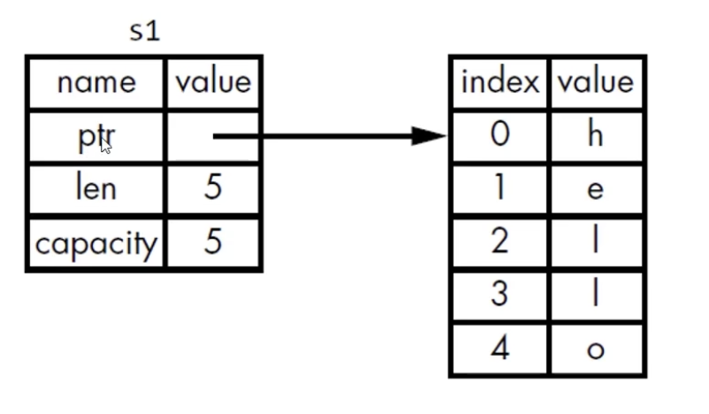

# Rust
它可以用来替换 c/c++ rust和他们具有同样的性能 但是很多常见的bug在编译时就可以被消灭

rust是一种通用的编程语言 但是它更善于以下的场景
1. 需要运行时的速度
2. 需要内存安全
3. 更好的利用多处理器

<br>

### 与其它语言的比较
c/c++性能非常好 但类型系统和内存都不太安全

java/c# 拥有GC 能保证内存安全 也有很多优秀的特性 但是性能不行

<br>

### rust拥有上述的两种语言的优点
1. 安全
2. 无需GC 性能好
3. 易于维护 调试 代码安全高效

<br>

### Rust特别擅长的领域
1. 高性能的web service
2. webassembly
3. 命令行工具
4. 网络编程
5. 嵌入式设备
6. 系统编程

<br>

**webassembly:**  
将一种新型的低级字节码格式引入到现代Web浏览器中, 并成为Web应用程序的通用运行时

它的设计目标是使Web浏览器能够在高性能和安全性方面运行性能密集型应用程序, 如游戏、模拟器、图形/音视频处理等, 以及其他需要高效执行的任务。

传统的Web开发主要依赖于JavaScript作为客户端脚本语言。虽然JavaScript在许多情况下表现良好, 但它也有一些限制, 例如性能问题。WebAssembly的出现为开发者提供了一种全新的选择。

它是一种二进制指令格式, 可在现代浏览器中运行, 从而使开发者能够使用其他语言（如C++、Rust、Go等）编写应用程序, 并将其编译成WebAssembly格式, 然后在浏览器中运行。

<br>

**WebAssembly的特点包括: **  

- 跨平台: WebAssembly可以在各种不同架构和操作系统上运行, 为Web开发带来更广泛的可能性。

- 性能优异: 由于WebAssembly是一种低级字节码, 它可以比传统的JavaScript更高效地执行计算密集型任务。

- 安全性: WebAssembly的设计强调安全性, 它被限制在沙盒环境中运行, 防止恶意代码的直接访问。

- 兼容性: WebAssembly与JavaScript密切集成, 可以与现有的Web平台和框架无缝集成。

- 扩展性: WebAssembly可以用于Web浏览器之外的其他环境, 例如服务器端、嵌入式系统等。

<br>

通过WebAssembly, 开发者可以在Web平台上实现更多复杂和高性能的应用程序, 而不仅仅局限于传统的Web开发范畴。

<br>

### Rust的用户和案例
- Google: 新操作系统Fuschia 其中rust代码量大约占30%

- Amazon: 基于Linux开发的直接可以在裸机 虚拟机上运行容器的操作系统 rust编写的

- System76: 纯rust开发了下一代安全操作系统 Redox

- 蚂蚁金服: 库操作系统 Occlum rust编写

- 微软: 正在使用 Rust 重写 windows 系统中的一些低级组件

<br>

### Rust缺点: 难学
- 如果会c++可能就很容易
- rust有很多独有的概念 他们和现在大多主流语言都不同

<br>

### Rust参考教程
Rust权威指南 2018 我们看这个

<br>

### Rust体系课程的规划
1. 这门课是入门级教程 参考 Rust权威指南 1-12 章的内容讲的
2. 未来还有rust进阶教程 也会参考此书的13章以后的内容
3. rust算法教程
4. rust数据结构教程
5. rust web开发教程

<br><br>

## 安装Rust

### 官网:
```s
www.rust-lang.org
```

<br>

### 安装:
```s
curl --proto '=https' --tlsv1.2 -sSf https://sh.rustup.rs | sh

# mac使用这个就可以
curl https://sh.rustup.rs | sh
```

<br>

### 添加到环境变量 (mac)
```s
export PATH="$PATH:~/.cargo/bin/"

source .bash_profile
```

<br>

### 检查是否安装成功
```s
rustc --version
# rustc 1.70.0 (90c541806 2023-05-31)
# 版本号(commitHash, commitDate)

cargo --version
```

<br>

### 更新rust
```s
rustup update
```

<br>

### 卸载rust
```s
rustup self uninstall
```

<br>

### 运行本地文档
rust在安装后 可以在本地打开文档 进行离线浏览 我们通过如下的命令在浏览器中打开本地文档
```s
rustup doc
```

<br>

### 开发工具
- Visual Studio Code, 插件: rust
- Clion, 插件: rust

<br><br>

# 编写 Rust 程序

### 程序文件后缀名: rs

<br>

### 文件命名规范: 
文件名小写字母 使用下划线进行连接  
hello_world.rs

<br>

### **<font color='#C2185B'>fn关键字:</font>**
用来定义函数 类似js中的 function

<br>

### 函数的格式:
```rs
fn 函数名() {
  函数体内容...
}

fn main() {
  println!("Hello World")
}
```

### 要点:
1. fn定义函数的关键字
2. main函数: 入口函数, 它是每个rust可执行程序最先运行的代码

```rs
fn main() {
  println!("Hello World")
}
```

<br>

### 注意:
1. rust中和java一样 末尾要加上 分号
2. rust的缩进是4个空格而不是tab (这个不是强制性的要求)
3. println! 是一个rust macro(宏) 如果是函数的话 就没有!, 以是否有!号 来区分它是宏还是函数

<br>

### 扩展: 宏 Macro
一种用代码生成代码的手段 中文是宏

rust的宏是基于ast语法树 而不是c/c++那种#define简单的文本替换 其作用类似于 elixir里面的macro 

<br><br>

## 编译: rs文件
我们写好的 rs文件 需要进行 编译 / 运行 两个步骤

<br>

### 编译命令
编译之后会生成一个二进制的文件 .exe结尾(window下)
mac的下面没有后缀
```s
rustc 文件名.rs

rustc hello_world.rs
```

<br>

### 运行: 编译后的rs文件
window下编译后的rs文件 会生成 exe 的可执行程序, Linux同样也会编译成一个可执行文件

我们通过如下的方式来运行 可执行文件

``./文件名``, 在Mac / Linux的时候 文件后面不用追加后缀

- Windows: .\main.exe
- Linux: ./main

```shell
./hello_world
```

<br>

### 解析: 编译和运行
编译和运行是单独的两步

- 运行rust程序之前必须先编译 命令: ``rustc 文件名.rs``

编译成功后 会生成一个二进制文件, 在windows上还会生成一个 .pdb 文件 里面包含调试信息

<br>

rust是 ahead-of-time 编译的语言 也就是可以预先编译的语言 我们可以将程序先编译好 然后把可执行文件交给别人运行(别人的机器上无需安装Rust, 即可运行程序)

<br>

**注意:**
rustc这个编译命令 只适合简单的Rust程序  
如果程序比较复杂 我们再使用 rustc 编译就不合适了 我们要使用 Cargo

<br><br>

# Cargo
小项目的话我们可以使用 rustc

但是一些比较大的项目 我们必须使用其他的工具 这个工具就叫做 cargo

<br>

## cargo的作用
它是rust的 ``构建系统`` 和 ``包管理工具``   

它可以构建代码 下载依赖的库 构建这些库, 安装rust的时候会自动安装cargo

<br>

### 验证 cargo 是否正确安装
```rs
cargo --version
``` 

<br><br>

## cargo的使用:
cargo在我这边的理解类似于 cli 也是用来创建rust项目的

<br>

### 使用 cargo 创建项目
```rs
cargo new 项目名

cargo new rust_test_cargo_pro
```

<br>

### 创建的目录结构:
```s
| - 项目名
  | - src # 用来放源代码
    - main.rs

  | - target

  - Cargo.lock
  - Cargo.toml
```

<br>

我们可以在初始化项目的时候 不自动初始化git仓库 所以我们可以在创建项目的命令上追加 --vcs 参数

```s
cargo new --vcs 项目名
```

<br><br>
  
### Cargo配置文件: toml
```s
# 区域的标题 表示下方内容是用来配置包(package)的
[package]
name = "Rust"
version = "0.1.0"
edition = "2021"

# See more keys and their definitions at https://doc.rust-lang.org/cargo/reference/manifest.html

# 依赖项
[dependencies]

```

<br>

**dependencies:**  
另一个区域的开始 它会列出项目的依赖项
在rust里面 代码的包或者代码的库叫做 crate
比如我们安装一个第三方的库 这个库在rust里面就叫做 crate

<br>

### 扩展:
Rust中依赖包 或者 依赖库 我们叫它 crate, 比如我们安装一个第三方的库, 这个库在Rust中就叫做 crate

<br>

### src/main.rs
cargo生成的main.rs在src目录下 而Cargo.toml在根目录下 源代码都应该在src目录下

<br>

**根目录可以放置:**
- readme
- 许可信息
- 配置文件
- 其它与程序源码无关的文件


如果创建项目的时候没有使用 cargo 也可以把项目转化为使用 cargo 的形式 很简单:
1. 把源代码文件移动到src下
2. 创建 Cargo.toml 并填写响应的配置

<br>

### Cargo常用命令:
- cargo build: 可以构建项目
- cargo run: 可以运行项目
- cargo test: 可以测试项目
- cargo doc: 可以为项目构架文档
- cargo publish: 可以将库发布到 crates.io

<br><br>

## 打包: 使用 Cargo 构建项目
```rs
cargo build
```

打包这个动作会将我们的rs文件 打包成一个可执行文件, 文件会存放在

1. Mac: target/debug/项目名(mac下的可执行文件不带后缀 可执行文件名就是项目名)
2. Windows: target/debug/hello_cargo.exe

<br>

运行可执行文件 就是执行这个程序了

<br>

**运行可执行文件的方式:**  
```s
./target/debug/hello_cargo
```

<br>

第一次运行 cargo build 会在根目录生成 cargo.lock 文件 .lock文件负责追踪项目依赖的精确版本 不需要手动修改该文件

<br><br>

## 运行 Cargo 项目
有点类似我们的 npm run dev, 但不同的是 run命令相当于我们的 ``run dev + build``
 
<br>

我们会通过如下的命令 运行我么的rust项目

```s
cargo run
```

<br>

上面我们是先通过 cargo build 才构建项目 然后执行可执行文件 

cargo run命令 可以 **构建 + 运行** 项目, 该命令是两步操作 编译代码生成可执行文件 + 执行结果

如果之前编译成功过 并且源码没有改变 那么就会直接运行二进制文件

<br><br>

## 检查 rust代码
```s
cargo check
```
该命令用于检查代码 确保能通过编译 **但是不产生任何可执行文件** 该命令会比 cargo build 快的多

所以在编写代码的时候可以连续反复的使用 cargo check **检查代码 提高效率**

<br><br>

## 发布程序
```s
cargo build --release
```

默认情况下 cargo build 命令是开发时用的 用于调试的 如果我们的程序已经写完了 已经准备发布了

那我们就要使用上面的命令 这时候编译会进行优化 代码会运行的更快 但是编译时间更长

<br>

**该命令生成的可执行文件 会在 target/release目录而不是 target/debug 目录下生成可执行文件**

<br>

- 开发时用的命令: ``cargo build``
- 正式发布时用的命令: ``cargo build --release``

<br><br>

# 案例: 猜数字 游戏
生成一个 1 到 100 间的随机数, 提示玩家输入一个猜测, 之后程序会提示猜测是太大了 还是 太小了

- 如果猜测正确: 打印庆祝的信息 程序退出
- 如果猜测失败: 继续猜

```rs
// rust里面的导包要使用 use 关键字
// use 标准库中的io
use std::io;

fn main() {
    println!("猜数");
    println!("猜测一个数");

    // 定义一个空字符串
    let mut guess = String::new();

    /*
      read_line返回一个枚举类 枚举类中有两个成员
      - ok
      - err

      ok中用于存放程序正常读取的时候 获取到的值
      err中会终止当前的程序 并展示传入的字符串
    */
    io::stdin().read_line(&mut guess).expect("无法读取行");

    // 使用{}作为占位符 我们把变量传递进去
    println!("你猜测的数是: {}", guess);
}
```

<br>

### 分析:
我们要获取用户的输入 然后再把用户的输入 打印出来作为输出 我们就需要使用到 io 这个库

- std为标准库
- io在std中

```rs
use std::io;
```

<br>

### 注意:
默认情况下 rust会把prelude模块的内容导入到每个程序的作用域中, 如果我们使用的类型不在 prelude 里面 就需要显式的将导入该类型 就要使用use关键字

<br><br>

# 变量

### 变量的声明:
Rust中我们声明一个变量 都会使用 let 关键字 不同的是 我们在声明变量的时候 会指明该变量的值是否可以被修改

- 可以修改使用 <font color='#C2185B'>let mut</font>, 相当于 const
- 不可以修改使用 <font color='#C2185B'>let</font>, 相当于 let

<br>

### 示例:
1. 创建一个可以被修改的变量
```rs
let mut num = 10
```

2. 创建一个不可以被修改的变量
```rs
// rust中所有的变量默认情况下是不可变的
let num = 10
```

<br><br>

# 字符串的创建
Rust中字符串也是引用数据类型, 在我们声明一个字符串的时候可以通过如下的方式

<br>

### **<font color='#C2185B'>String::new()</font>**
是用于创建一个新的空字符串的静态方法, 它是一个可增长的 UTF-8 编码的字符串。

返回字符串实例, 空字符串

``new()``: 会创建一个空白的字符串 在rust中很多类型都有new(), 因为它是创建类型实例的惯用函数

<br>

rust中字符串类型就是String 它是由标准库所提供的 它内部使用了utf-8格式的编码 并且可以按照需求扩展自己的大小

<br>

``String::new()`` 是String类型的关联函数, **也称为静态方法**

关联函数(静态方法)是针对类型本身来实现的 而不是针对字符串某个特定的实例来实现的 也就是说 关联函数不是针对特定的实例调用的, 而是与类型本身相关联的函数。通过使用 String::new(), 可以直接从 String 类型本身创建一个新的空字符串。

<br><br>

# io标准库
标准库就是rust自身提供的 我们在导入一个库 (相当于导入一个包) 的时候使用 use, 跟scss很像呀

<br>

### use关键字 导入一个库
用于将 一个模块或者类型 显式的导入到程序中, 导入进来后 我们就可以使用 io 做输入或输出的操作了

相当于 import require
```rs
// rust里面的导包要使用 use 关键字
use std::io;
```

<br>

### 获取 io库 的实例对象

### **<font color='#C2185B'>io::stdin()</font>**
stdin()会返回 Stdin的实例 它会作为句柄(handle)处理终端中的标准输入

<br>

### 扩展: 句柄 (引用类型的变量)
"句柄"（Handle）通常是指对资源的引用或标识符, 它允许程序通过该引用或标识符来访问资源 而无需直接了解或操作底层细节

句柄是一种抽象层, 用于隐藏底层资源的实际表示和管理。

在操作系统中, 句柄通常是一个整数或指针, 它用于标识某种资源, 如文件、网络连接、图形设备、内存区域等。

程序可以通过句柄来操作这些资源, 例如读写文件内容、发送网络数据、绘制图形等。

<br>

**理解:**  
我们可以将句柄理解为 指向引用类型的变量, 我们通过这个变量调用对象中提供的各种方法

但是在rust中 句柄通常都是指针、整数或其他类似的数据结构, **通常用于标识资源并允许通过该引用或标识符来访问资源。**

<br>

### 扩展: 变体 (枚举类型的成员)
在 Rust 中, "变体"（Variant）是枚举类型（Enum）的成员。

枚举是一种用户自定义的数据类型, 它可以包含多个不同的变体, 每个变体可以携带不同的数据。

枚举允许你在一组预定义的值中选择一个, 以表示某个特定的状态或情况。

<br><br>

# 读取用户在控制台中的输入

### **<font color='#C2185B'>io库实例对象.read_line(&mut 变量)</font>**
用于从标准输入中读取一行用户输入, 并将输入存储到指定的可变变量中

```js
// io::stdin() io实例对象
io::stdin().read_line(&mut guess)
```

<br>

**参数:**   
接受一个可变引用作为参数, 并在用户输入后将读取的内容存储到该引用所指向的变量中
```rs
这个字符串类型的参数需要是可变的 因为这个方法会随着用户的输入来修改字符串的内容 所以我们在 guess 前面加上了 *mut* 关键字
```

这个方法用于获取用户的输入 该方法就是将用户的输入放到一个字符串中, 所以我们要传递一个字符串类型作为参数

<br>

**返回值: io::Result**  
read_line()方法 无论用户输入什么 都会读取
- 返回值类型: ``io::Result<usize>`` 类型

<br>

在rust的标准库中有很多的类型都叫做 Result 既有通用的result 也有特定版本的子模块的result比如io::Result

Result类型实际上就是枚举类型 一个枚举类型会有几个固定的值 这些值就是枚举类型的变体

io::Result类型就有两个变体 (io::Result枚举类中有两个成员)
- Ok
- Err

<br>

如果我们read_line()方法返回的是 Ok 变体的话 就表示这个操作成功了 而且Ok 里面还有结果值

如果我们read_line()方法返回的是 Err 变体的话 就表示这个操作失败了 在Err中 还会附带失败的原因

而io::Result枚举类型 它上面还定义了一系列的方法

<br>

### **<font color='#C2185B'>expect("中断时的提示信息")</font>**
io::Result枚举类型定义的方法之一

如果 io::Result 是 Err 变体, expect 方法会导致程序崩溃, 并显示传入的字符串信息作为错误原因。

如果 io::Result 是 Ok 变体, expect 方法会从 Ok 中提取值, 并将其作为结果返回给调用者。

<br>

如果程序出错, 则终止程序 并显示给定的错误信息
如果程序成功, 读取数据成功 则会从Ok中提取值 保存到guess变量中

<br><br>

## & 取地址符号
```rs
&mut 变量
```

<br>

### **<font color='#C2185B'>& 变量</font>**
### **<font color='#C2185B'>&mut 变量</font>**
上面的两个关键字 用于创建数据的引用

引用在rust中默认也是不可以修改的 和变量一样
- & 变量: 创建一个不可修改的引用
- &mut 变量: 创建一个可以修改的引用

<br>

&mut表示这是一个可修改的引用, **允许在方法内部修改该引用所指向的变量的值**

该关键字用于创建 **可变的引用**

用允许你借用（borrow）一个变量的值而不获取所有权, 通过可变引用, 你可以修改引用所指向的变量的值, 而不违反 Rust 的所有权规则。

<br>

### & 取地址符号
表示这个参数是一个引用 通过引用就可以在代码的不同地方来访问同一块数据 

```rs
// 方法的参数是用引用来传递的
read_line(&mut guess)
```

```rs
let mut guess = String::new();
io::stdin().read_line($mut guess)
```

<br>

**解析:**  
上面两个guess因为使用了 & 指向同一块内存

而引用在rust里面是比较复杂的特性 而rust的核心竞争力之一 它可以保证我们可以简单并且安全的使用 引用功能

&引用在rust里面表示也是不可变的 当我们加上mut关键字后 这个引用也变成了可变的
```rs
// 不加 mut 就会报错
io::stdin().read_line($ guess)
io::stdin().read_line($mut guess)
```

<br><br>

# println!()

### {} 表示占位符
它的值在输出的时候就会替换成 后面变量的值
```rs
println("你猜测的数是: {}", guess);
```

- 如果一个{} 就对应后面第一个变量的值
- 如果二个{} 后面就应该传入两个变量的值

<br><br>

# 案例: 猜数字阶段2 生成神秘的数字
我们要生成1-100之间的随机数 但是rust标准库里面 没有包含生成随机数的功能 

但是 rust团队提供了 生成随机数公功能的库 

<br>

### rand库 (依赖包)
生层 随机数的 crate 的包

rand(crate包 可以理解为npm里面的包或者理解为一个模块)

在rust中一个库(crate)就是一堆的rust源代码文件
```s
https://crates.io/crates/rand
```

<br>


**rust中的crate一共分为两种:**
- 我们自己创建的猜数字的程序 最后可以通过 build构建成一个可执行程序 它就是一个 二进制的crate 

- 而rand这个crate是不可以独立运行的 它属于lib crate 叫做 库包 像这种crate就是为其它程序所用的

<br>

### 项目中添加依赖
我们以往添加依赖的 方式 需要在控制台上 通过 npm i 的命令 来下载包是吧

而 rust 添加依赖的方式如下有两种:

<br>

**方式1: 手动在 Cargo.toml 文件中指明依赖**  


1. 打开 Cargo.toml 文件
2. 在 [dependencies] 的下面写上 ``包名 = "版本"`` 相当于我们在package.json中指明依赖包一样
```s
rand = "版本"
# 表示和指定版本兼容的版本都可以
rand = "^版本"


[package]
name = "rust_test_cargo_pro"
version = "0.1.0"
edition = "2021"


[dependencies]
# 比如我们指定了 0.3.14 那么就是和这个版本兼容的版本都可以
rand = "^0.3.14"
```
3. 写完后重新构建项目就下载好了
```s
cargo build

# 重新构建的时候 会检查 dependencies 有没有下载的依赖项 如果没有就会自动下载
```

<br>

**方式2: cargo install rand**  

<br><br>

相当于怎么 npm i 一个包
rust中 我们可以直接在 Cargo.toml 中 [dependencies] 的位置写 写完后重新构建下 可能就下完了

也可以:
cargo install rand

格式:
rand = "版本"

完整写fa:
rand = "^版本"
表示和指定版本兼容的版本都可以
比如我们指定了 0.3.14 那么就是和这个版本兼容的版本都可以

```toml
[package]
name = "rust_test_cargo_pro"
version = "0.1.0"
edition = "2021"


[dependencies]
rand = "0.3.14"
```

<br>

### ctrl + shift + p
我们在使用 vscode 的时候 并且使用了方式1来下载依赖的时候 应该是可以自动下载依赖的

如果没有自动下载可以进行如下的操作
1. 使用 cargo build 重新构建后 应该就可以下载了
2. 开启自动下载 手动开启服务器 开启之后可能下载依赖的时候就不用 手动构建了 没有尝试 
```s
ctrl + shift + p
  输入 rust
    runst start the rust server
```

<br><br>

## 知识点: trait
```rs
// trait 它相当于其它语言的接口, Rng trait就是定义了随机数生成器需要实现的方法
use rand::Rng; 
```

我们在使用 随机数包 的时候老师说了 trait, 下面说说设么是 trait

<br>

### trait: 接口
trait 是一种抽象类型, 类似于其他编程语言中的接口。

接口中有一组规则 实现了接口的类 则必须实现这组规则 相当于我们可以使用接口中定义好的方法

<br>

它定义了一组方法的规范, 如果一个类型实现了这个trait, 就必须提供这些方法的具体实现。实现了某个trait的类型可以被视为拥有了这个trait所定义的行为。

<br>

提到了 Rng trait, 它是来自 rand crate（Rust的一个用于生成随机数的库）的一个抽象类型。当你希望使用随机数生成器时, 可以使用 rand::Rng trait 来定义所需的方法。

<br>

然后, 任何实现了这个 Rng trait 的类型都可以用作随机数生成器, 并且你可以使用相应的方法来生成随机数。

<br>

### 要点: rand包的使用方式
### **<font color='#C2185B'>rand::thread_rng()</font>**  
rand::thread_rng()会返回一个类型为 ThreadRng类型的随机数生成器 

后续我们通过该生成器中的方法来生成随机数, 它会在最小值 和 最大值之间生成一个随机数
- 包括最小值
- 不包括最大值
```rs
// 参数为最小值和最大值
rand::thread_rng().gen_range(1, 101);
```

<br>

**返回值类型:**  
整数类型, rust中有很多整数类型 比如
- i32
- u32
- i64

除非我们显示的增加类型推断 否则返回的类型为 i32

<br><br>

## 知识点: 整数的类型
在 Rust 中, 整数类型分为
- 有符号整数（signed integers）
- 无符号整数（unsigned integers）

每种整数类型在内存中占据的位数也可以不同, 这取决于你需要表示的范围。

<br>

### 有符号整数（Signed Integers）
有符号整数以 i 开头 分别有

<br>

**i8: 相当于byte**  
有符号8位整数。范围是 -128 到 127。适用于节省内存或者确切知道数值不会超出范围的情况。

<br>

**i16: 相当于short**  
有符号16位整数。范围是 -32,768 到 32,767。适用于节省内存或者确切知道数值不会超出范围的情况。

<br>

**i32: 相当于int**  
符号32位整数。范围是 -2,147,483,648 到 2,147,483,647。是最常用的整数类型之一, 通常用于一般整数计算。

<br>

**i64: 相当于long**   
有符号64位整数。范围是 -9,223,372,036,854,775,808 到 9,223,372,036,854,775,807。适用于需要非常大整数范围的计算。

<br>

**i128: java中没有对应的**   
有符号128位整数。范围是 -170,141,183,460,469,231,731,687,303,715,884,105,728 到 170,141,183,460,469,231,731,687,303,715,884,105,727。适用于需要非常大整数范围的计算。

<br>

### 无符号整数（Unsigned Integers）
有符号整数以 u 开头 分别有

<br>

**u8: 相当于byte**  
无符号8位整数。范围是 0 到 255。适用于节省内存或者确切知道数值不会超出范围的情况。

<br>

**u16: 相当于short**  
无符号16位整数。范围是 0 到 65,535。适用于节省内存或者确切知道数值不会超出范围的情况。

<br>

**u32: 相当于int**  
无符号32位整数。范围是 0 到 4,294,967,295。是最常用的无符号整数类型之一, 通常用于一般整数计算。

<br>

**u64: 相当于long**   
无符号64位整数。范围是 0 到 18,446,744,073,709,551,615。适用于需要非常大整数范围的计算。

<br>

**u128: java中没有对应的**   
无符号128位整数。范围是 0 到 340,282,366,920,938,463,463,374,607,431,768,211,455。适用于需要非常大整数范围的计算。

<br>

### 使用场景:
如果你需要处理正数或者数值范围在 0 以上的数据, 你应该选择无符号整数类型（如 u8、u16、u32、u64 或 u128）。

如果你需要处理有正数和负数的数据, 那么可以选择有符号整数类型（如 i8、i16、i32、i64 或 i128）。

<br>

当你知道数据不会超出某个特定范围时, 可以选择对应的整数类型以节省内存。但要确保数据不会超过类型的表示范围, 否则可能会导致数据溢出。

<br>

### 注意: 
为了在代码中声明整数类型, 你可以使用后缀表示其位数, 例如 10i8 表示有符号8位整数10, 255u8 表示无符号8位整数255。如果没有后缀, 默认情况下整数字面值会根据值和上下文来推断其类型。

<br><br>

### 猜数字游戏部分2:
```rs
use std::io;

// trait 它相当于其它语言的接口, Rng trait就是定义了随机数生成器需要实现的方法
use rand::Rng; 

fn main() {
  println!("猜数");
  // 生成一个随机数
  let secret_number = rand::thread_rng().gen_range(1, 101);

  println!("神秘数字是: {}", secret_number);

  println!("请猜一个数字");
  let mut guess = String::new();
  io::stdin().read_line(&mut guess).expect("无法读取行内信息");

  println!("我们猜的数字是, {}", guess)
}
```

<br><br>

# 案例: 猜数字阶段3 比较猜测的数字 与 神秘数字 
我们要做的是 比较 guess 和 secret_number 的大小

<br><br>

## 知识点: Rust中是 switch case
### **<font color='#C2185B'>match 表达式 { ... }</font>**
相当于 switch case 

match 表达式是 Rust 中的一个非常强大和灵活的控制流工具, 它允许你根据不同的模式来执行不同的代码块。

它会根据表达式的返回的结果(Ordering枚举类型) 返回的枚举类型的值 来决定下面我们执行哪个对应的语句

```rs
// guess.cmp(&secret_number) 的结果可能有3种情况 > = <
match guess.cmp(&secret_number) {
  Ordering::Less => println!("小了"),
  Ordering::Greater =>  println!("大了"),
  Ordering::Equal =>  println!("赢了")
}
```

<br>

**注意:**  
match体中语句之间要使用的是 , 号

<br>

### **<font color='#C2185B'>字符串.cmp(&字符串变量)</font>**  
用来进行比较 就是compare的方法 它和另外的一个值进行比较

它接收的参数是另外的一个值的引用, cmp()返回的类型就是 Ordering 枚举类型

<br>

### **<font color='#C2185B'>字符串.parse()</font>**  
将字符型的数字转换为 真正的数字

可以搭配 ``expect("请输入一个数字");`` 因为我们在解析字符串成为整数的时候 可以会失败 所以我们搭配 expect方法使用

比如我们要写个 abc 还转换不了

<br>

**parse()的返回值:**  
Result类型, 它是枚举类型 内部有Ok Err两个值, 因为是Result类型 我们后面可以接 expect方法

如果解析失败则展示我们传入的信息, 并程序终止

```js
let mut guess = String::new();

// 当解析字符串失败的时候使用 expect()

// 重新定义 guess 并将其声明为整数类型: 当我们转换 1 - 100 之间的数的时候 它有可能是好几种数值类型 比如 i32 u32 i64 等等 当parse解析的时候 我们通过指明类型 告诉rust解析的时候解析成哪种类型
let guess:u32 = guess.trim().parse().expect("请输入一个数字");
```

<br>

### **<font color='#C2185B'>use std::cmp::Ordering;</font>**
标准库中的枚举类

Ordering是枚举类型 它有3个值(变体, 或者理解为成员) 

Less Greater Equal 分别表示小于大于或者是等于

```rs
Ordering::Less => println!("小了"),
Ordering::Greater =>  println!("大了"),
Ordering::Equal =>  println!("赢了")
```

<br><br>

## 知识点: Rust中的类型推断
rust中变量也是有类型的 当类型不符的时候 变量之间不能互相的赋值

rust是静态强类型的语言 它还具有类型推断的能力 我们在声明 guess 变量的时候 并没有声明其类型 

但是通过 后面的 String::new() 表达式就能推断出来 guess变量的类型就是string

```rs
let mut guess = String::new();
```

<br>

### 定义变量类型
```rs
let mut guess: 类型

let guess:u32 = guess.trim().parse().expect("请输入一个数字");
```

<br><br>

## 知识点: 类型遮盖
rust中允许声明同名变量用来隐藏上面定义好的同名变量

```rs
// 定义了一个字符串
let mut guess = String::new();

// 遮盖上面的变量
let guess:u32 = guess.trim().parse().expect("请输入一个数字");
```

也就是将 字符串类型的guess转换为 u32无符号整数类型的变量了

<br>

**特性使用场景:**  
在Rust中需要进行类型转换的时候 我们在定义重名变量对上面的变量进行 **遮盖**

相当于转换了该变量的类型

<br>

### 完成代码部分
```rs
use std::cmp::Ordering;
use std::io;
use rand::Rng;

fn main() {
  println!("猜数");
  // 生成一个随机数
  let secret_number = rand::thread_rng().gen_range(1, 101);
  println!("神秘数字是: {}", secret_number);

  println!("请猜一个数字");
  let mut guess = String::new();
  io::stdin().read_line(&mut guess).expect("无法读取行内信息");


  // 类型转换 将 guess 字符串 转成 整数型之后进行比较
  // 解析字符串为数字 当发生错误的时候给出提示
  let guess:u32 = guess.trim().parse().expect("需要输入的是一个数字");
  println!("我们猜的数字是, {}", guess);


  // 相当于 switch case cmp()方法返回的是 Ordering 类型 所以内部使用了 Ordering的成员 匹配输出内容
  match guess.cmp(&secret_number) {
    Ordering::Less => println!("太小了"),
    Ordering::Greater => println!("太大了"),
    Ordering::Equal => println!("你赢了"),
  }
}
```

<br><br>

# 案例: 猜数字阶段4 循环猜测
为了让用户进行多次猜测 我们需要做一个无限循环

<br>

### 循环
### **<font color='#C2185B'>loop {}</font>**
loop表示无限循环 而不是while(true) rust里面有while关键字
```rs
loop {
  // break 用于跳出循环
  break;
}
```

<br>

### 关键字: break;
用于跳出循环

<br>

### 关键字: continue;
用于跳出本次循环

<br>

### match的应用技巧
我们不要程序需要报错就崩溃的时候 我们可以这么处理
guess.trim().parse() 会返回 Result类型 该类型有 Ok Err
这时候我们就可以使用 match 分支来解决 当遇到用户输入 abc parse()转换不了的时候 continue跳出本次循环进入下一次循环

```rs
let guess:u32 = match guess.trim().parse() {
  Ok(num) => num,
  Err(_) => continue
};
```


```rs
use rand::Rng;

use std::cmp::Ordering;
use std::io;
fn main() {
  println!("猜数");

  let secret_number = rand::thread_rng().gen_range(1, 101); // i32 u32 i64


  // 使用循环
  loop {
    println!("猜测一个数");
    let mut guess = String::new();

    io::stdin().read_line(&mut guess).expect("无法读取行");
    
    /*
      guess.trim().parse() 返回的是枚举类型 Ok Err

      match 可以用来匹配表达式中的 枚举类型
      所以这里我们替换成match 

      match 表达式 {...}
    */
    let guess:u32 = match guess.trim().parse() {

      // Result成员: Ok, Ok的场景下直接返回存放在Ok里面的数字
      Ok(num) => num,

      // Result成员: Err, Err的情况 我们直接跳过本次循环
      Err(_) => continue
    };


    println!("你猜测的数是: {}", guess);
    
    match guess.cmp(&secret_number) {
      // 小于
      Ordering::Less => println!("小了"),
      Ordering::Greater =>  println!("大了"),
      Ordering::Equal => {
        // 使用 break 跳出循环
        println!("赢了");
        break;
      }
    }
  }
}
```

<br><br>

# 变量 与 可变性

<br>

## 变量的声明: 

### let
声明变量 我们会使用 **let** 关键字, 默认情况下我们使用let声明的变量是不可变的, 一旦变量绑定了一个值后 这个变量就不可以被重新赋值了

如果重新赋值的话 编译阶段就会报错
```rs
let num = 10  // 相当于 const
```

<br>

```rs
fn main() {
  let num = 10;

  // 使用 println 输出变量的时候 必须使用 {} 单独的输出变量是不可以的
  println!("变量为: {}", num)


  // 报错 cannot assign twice to immutable variable 不可以对不可变的变量两次赋值
  num = 6;  
}
```

<br>

我们使用 let 声明了 num 对于整数来说 编译器会把 num 的类型**推断为i32类型**


<br>

### let mut 关键字
声明变量时 在变量前面加上 mut 就可以使变量可变 这时相当于我们使用js中 let声明的变量 该变量是可以修改的

<br><br>

## 常量

<br>

### const 关键字
常量(constant), 常量在绑定值以后也是不可变的 但是它与不可变的变量有很多区别:

1. 不可以使用 mut, **常量永远都是不可变的**

2. 声明常量使用 const 关键字 **它的类型必须被标注(没有类型推导)**

3. 常量可以在任何作用域内进行声明 包括全局作用域

4. 常量只可以绑定到常量表达式 无法绑定到函数的调用结果或只能在运行时才能计算出的值 **常量的值在编译时就确定了 不可变变量的值可以在运行时确定**

在程序运行期间 **常量在其声明的作用域一直有效**

<br>

### 常量的命名规范:
rust里常量使用全大写字母 每个单词之间用下划线分开 **MAX_POINTS**

常量声明的例子
```rs
// 常亮声明时必须为其注明类型
const MAX_POINTS:u32 = 100_000
```

<br>

**100_000:**  
我们在数字之间使用下划线 来增加可读性 它为10万

<br><br>

## 隐藏(shadowing)
在rust中 可以使用相同的名字声明新的变量 新的变量就会隐藏之前声明的同名变量

```rs
fn main() {

  let x = 5;      // 第 1 行

  // 报错
  x = x + 1;      // 第 2 行

  // 再次声明同名变量 遮盖主上面声明的变量x
  let x = x + 1;  // 第 3 行

  print!("x的值是: {}", x);
}
```

<br>

当我们直接写 第2行 的时候 就会报错 因为默认情况下x是不能被再次赋值的

<br>

但是 我们 第3行 又写了 let x = x + 1；
这就是隐藏 就是在 第3行 又声明了一个变量 也叫x

<br>

那么从 第3行 以后就都是新声明的变量 而不是之前的x

第1行 x出现的最后位置 就是 第3行 x + 1 这里

定义了同名变量后 后续的代码中 这个变量名 **代表的就是新的变量**

<br>

### shadow 和 把变量标记为 mut 是不一样的
使用let声明的变量 如果不使用let关键字 那么重新给非mut的变量赋值会导致编译时错误

- 使用 let 声明的同名新变量 也是不可变的
- 使用 let 声明的同名新变量 它的类型可以与之前不同

<br>

### 演示:
如下会报错 因为 上面 和 下面的类型不一样
```rs
// spaces类型为 &str 为字符串型
let mut spaces = "    ";

// 报错: 因为 spaces.len() 返回usize类型, 类型不符合不能直接赋值
spaces = spaces.len();


// 使用 遮盖特性 重新声明同名变量并指定变量的类型 
let mut spaces = spaces.len();
```

<br>

**注意:**  
spaces.len() 返回的是 usize 类型 所以我们不能这么写 ``let mut spaces:i32 = spaces.len();``

<br>

### usize类型:
这个类型是根据计算机的架构 如果是64位的话 那么它的类型就是64位无符号整数类型

```rs
fn main() {
  // spaces: &str 是字符串类型 
  let spaces = "    ";
  
  // spaces: usize
  let spaces = spaces.len();    

  print!("{}", spaces);
}
```

<br>

### 遮盖shadow的好处
在其他的语言中经常会遇到这样的场景
有一个字符串 我们想把它解析成一个数字 
``let spaces_str = "   "``

如果我们想把上面的变量解析成数字 那么我们还需要重新定义一个新的名字
``let spaces_num = spaces.len()``

也就是说我们可能要使用不同的后缀来区别变量 但是对于表达变量的意图来说 这个后缀又是多余的

<br><br>

# 数据类型
rust中每一个值都有特定的数据类型 

rust会根据数据类型来决定怎么处理他们 这里我们主要看下 标量类型 和 复合类型

rust是静态编译语言 **在编译时必须知道所有变量的类型**

大部分情况下 基于使用的值 编译器通常能够推断出它的具体类型

但是如果可能的类型比较多(例如把string转为整数的parse()) 

就必须添加类型的标注 否则编译会报错 因为编译器推断出来的类型会比较多

<br>

```rs
fn main() {
  // 解析成功就会输出42 解析失败就会输出提示字符串
  let guess:u32 = "42".parse().expect("not a number");
  print!("{}", guess);
}
```

<br>

针对 42 这个数字 rust里面 有很多的整数数据类型能够将42包含在内 比如 i32 u32 等等 

所以这时候 我们要给 guess 变量指明是哪种类型 这样 parse() 方法就知道 要把这个字符串解析成什么类型了

如果不标注类型 那么程序在编译期间就会报错(type annotations needed)

<br>

### 标注类型
```rs
let 变量:类型 = 值
```

<br><br>

# 标量类型
一个标量类型代表一个单个的值, rust有四个主要的标量类型

- 整数类型
- 浮点类型
- 布尔类型
- 字符类型

<br>

## 整数类型
整数类型就是没有小数部分

例如, u32就是一个无符号的整数类型 占据32位的空间 没有正负号 表数范围 2^31-1 

- 无符号整数类型以 u 开头  unsigned
- 有符号整数类型以 i 开头  integer


<br>

### rust的整数类型列表如图:
每种都分 i 和 u 以及固定的位数

<br>

|length|signed|unsigned|
|:--|:--|:--|
|8-bit|i8|u8|
|16-bit|i16|u16|
|32-bit|i32|u32|
|64-bit|i64|u64|
|128-bit|i128|u128|
|arch|isize|usize|

arch: 表示系统的架构

<br>

**有符号范围:**
-(2^n - 1) ~ 2^n-1 - 1  包括两头

<br>

**无符号范围:** 
0 ~ 2^n - 1  包括两头

<br>

### isize 和 usize 类型
isize 和 usize 类型的位数由程序运行的计算机的架构所决定

如果是64位计算机 那就是64位的

使用它们的场景并不多 比如 对某种集合进行索引操作

<br>

### 整数的字面值
0x开头 0o开头 0b开头 b开头

|number literals|example|
|:--|:--|
|Decimal(10进制)|98_222|
|Hex(16进制)|0xff|
|Octal(8进制)|0o77|
|Binary(2进制)|ob1111_0000|
|Byte(u8 only)|b'A'|

<br>

- 字面值中: 数字中可以加下划线, 增加可读性 98_222

- byte类型只能是 u8 类型的 必须以B开头 后面接一个 '字符' 相当于一个char

- 除了 byte 类型外 所有的数值字面值都允许使用类型后缀 比如:  
```rs
57u8
// 57就是整数 使用u8类型作为后缀
```

<br>

**技巧:**  
如果我们不太清楚应该使用哪种数据类型 可以使用 rust 响应的默认类型

<br>

### 默认类型
**整数的默认类型**: i32

i32总体上来说速度很快 即使在64位系统中

<br>

### 整数溢出
u8的范围是 0-255, 如果你把一个u8变量的值设为256 那么会分为两种情况

<br>

**1. 调试模式下编译:**  
rust会检查整数溢出 如果发生溢出 程序在运行时就会panic(恐慌)

<br>

**2. 发布模式下(--release)编译:**  
rust不会检查可能导致 panic 的整数溢出

<br>

如果溢出发生: rust会执行 "环绕" 操作, 如果我们将 u8的值设置为256 那么它就会变成0

- 257变成1
- 258变成2 ...

但是在发布模式下的溢出 不会导致程序的panic

<br>

### 扩展: 恐慌 - 异常
恐慌是 Rust 中的错误处理机制之一, 它表示程序出现了无法处理的问题, 类似于其他编程语言中的异常或错误。

当恐慌发生时, 程序将会终止并显示有关问题的错误信息。在调试模式下, Rust会帮助您尽早发现可能存在的问题, 并提供相关的错误信息, 方便调试和修复。

<br>

### 扩展: 环绕
在发布模式下（使用--release参数编译）, Rust不会检查整数溢出, 并且不会产生恐慌。相反, 它会执行"环绕"操作。

环绕是指当整数溢出发生时, 数值会回绕或循环回到类型的范围内, 继续增加或减少。

<br>

例如, 如果将一个u8类型的值设置为256, 它会环绕回到0；257会变成1, 258会变成2, 以此类推。这种行为是整数溢出后的默认处理方式, 可以在某些情况下提供更高效的计算结果。

<br>

### 总结:
在调试模式下, 整数溢出会导致恐慌, 程序会终止并显示错误信息。而在发布模式下, 整数溢出会执行环绕操作, 数值会在类型范围内循环回绕, 不会导致程序恐慌。

开发过程中, 调试模式帮助您及早发现潜在的问题, 而发布模式则对性能进行优化, 不会因为溢出检查而引入额外的开销。

<br><br>

# 浮点类型
rust有两种基础的浮点类型 也就是含有小数部分的类型

<br>

### 两种基础的浮点类型

**1. f32 浮点类型**  
占32位 单精度


<br>

**2. f64 浮点类型 - 默认类型**  
占64位 双精度


<br>

rust的浮点类型使用了 ieee-754 标准来表述
f64是默认类型 因为在现在cpu上f64和f32的速度差不多 而且精度更高

```rs
// 当没有显式的指明类型时 则采用默认类型
let x = 2.0;  // 默认类型: f64
let y:f32 = 3.0;  // 显式定义: f32
```

<br><br>

# 数值的操作
加减乘除余等

<br>

rust支持对浮点类型的取余(两边都是同类型浮点数才可以 比如 1.0 % 3.0)
```rs
// 推断为 i32
let sum = 5 + 10;

// 推断为 i32
let difference = 4 * 30;

// 推断为 f64
let guotient = 56.7 / 32.2;

// 推断为 i32: 取余默认为 i32 整数类型
let reminder = 54 % 5;
```

<br><br>

# 布尔类型: bool
rust的布尔类型也有两个值: true false
占用一个字节的大小
```rs
let t = true;
let f:bool = false;
```

<br><br>

# 字符类型

### char类型
rust语言中 char类型被用来描述语言中最基础的单个字符, **字符类型的字面值使用单引号**

```rs
let str_a = 'a';
```

<br>

**占用大小:**  
4个字节的大小

因为它采用了 Unicode 的 UTF-8 编码方式。

UTF-8 是一种变长编码, 其中一些字符可以用一个字节表示, 而其他字符可能需要更多的字节。

UTF-8 是一种广泛使用的 Unicode 编码, 它允许 Rust 中的 char 类型能够表示任何 Unicode 字符。

是unicode标量值 可以表示比asc2多得多的字符内容 拼音 中日韩文 零长度空白字符 emoji表情等

```s
相比之下, 在 Java 中的 char 类型采用的是 UTF-16 编码方式。

UTF-16 是另一种 Unicode 编码, 其中每个字符通常占据 2 个字节大小。

因此, Java 的 char 类型占用 2 个字节。
```

<br>

### Unicode的表数范围: 
- U+0000 ~ U+D7FF
- U+E000 ~ U+10FFFF

但unicode中并没有 "字符" 的概念 所以直觉上认识的字符也许与rust中的概念并不相符
```s
Unicode 中, 并没有严格的定义和概念对应于我们通常所说的“字符”（Character）。

在计算机中, 我们经常将文本表示为字符序列, 例如字符串。

在很多编程语言和操作系统中, 一个字符通常被理解为一个单元, 即一个字节或者两个字节（如UTF-16编码）。然而, Unicode 并没有像我们通常理解的那样简单。

Unicode 是一种字符集, 它为世界上几乎所有的字符和符号提供了唯一的编号, 这些编号称为代码点。每个代码点都对应于一个抽象的字符, 但并不直接指定该字符在计算机中的存储方式。

Unicode 的编码方式规定了如何将代码点映射到实际的字节序列, 例如 UTF-8 和 UTF-16 编码。这些编码方式决定了在计算机中存储和传输字符所使用的字节表示形式。由于 Unicode 支持大量的字符, 有些字符的代码点可能需要更多的字节来表示。

这就是为什么在 Rust 中, char 类型的大小是4个字节。它是为了支持更广泛的 Unicode 字符集, 即使某些字符的代码点需要超过2个字节。

所以, 虽然我们通常会用“字符”来描述文本中的单个元素, 但在 Unicode 的世界中, 更准确的说法是“代码点”来表示抽象的字符, 而具体的存储和编码方式则由特定的编码来决定。这一点对于正确处理文本和字符在不同编程环境中非常重要。
```

```rs
let x = 'z';

let y: char = 'z';

let z = '☺';
```

<br><br>

# 复合类型
复合类型就是将多个值放在一个类型里面

rust提供了两种基础的复合类型: 
- 元组(Tuple)
- 数组

<br><br>

## 元组: Tuple
它可以将多个类型的多个值放在一个类型里面, 它的长度是固定的 一旦声明就无法改变, **Ts中它就是一个固定长度的数组**

<br>

### Tuple的创建
在小括号里面 将值用逗号分开

```rs
(元素1,元素2,元素3)
```

<br>

Tuple中的每个位置都对应一个类型 Tuple中各元素的类型不必相同
```rs
let tup: (i32, f64, u8) = (500, 6.6, 1);
print!("{}, {}, {}", tup.0, tup.1, tup.2);
```

<br>

### 获取 Tuple 的元素值: 使用解构
可以使用 模式匹配来解构(destructure) 一个Tuple来获取元素值
```rs
let tup: (i32, f64, u8) = (500, 6.6, 1);

// ()声明 ()来解构
let (x,y,z) = tup;

print!("{}, {}, {}", x, y, z);
```


<br>

### 访问 tuple 的元素
访问 tuple 并不是通过 ``[下标]`` 也是通过 tup.下标的方式

```rs
let tup = (1,2,3);
tup.0
```

<br>

```rs
let tup: (i32, f64, u8) = (500, 6.6, 1);
print!("{}, {}, {}", tup.0, tup.1, tup.2);
```

<br><br>

## 数组
数组也可以将多个值放在一个类型里 **数组中每个元素的类型必须相同**  

数组的长度也是固定的 一旦声明之后不能改变数组的长度

<br>

### 声明一个数组
在中括号, 各值用逗号分开
```rs
// 元素类型必须相同, 数组长度不可变
let a = [1,2,3,4,5];
```

<br>

### 数组的用处
如果我们想让数据存放在stack(栈)上 而不是heap(堆)上 或者想保证有固定数量的元素 这时候使用数组更有好处 

数组没有vector灵活(以后再讲) vector和数组类似 它由标准库提供 vector的长度可以改变

如果我们不确定应该用数组还是vector 那么估计你应该用vector

```rs
let months = [
  "一月",
  "二月",
  "三月",
];
```

<br>

### 数组 和 动态数组
这里的概念和Java比较像, Java中的数组就是原生的数组 长度不能改变 而我们想用的应该是ArrayList

<br>

rust中也有这样的概念也就是 数组 和 动态数组

<br>

数组和堆上分配的动态数组（Vec）有不同的特点, 适用于不同的需求场景。

<br>

**数组存放在栈上:**  
Rust 中的数组是一种固定大小的数据结构, 它们在编译时就需要知道其长度, 因此数组的大小必须在声明时明确指定。由于数组的大小是固定的, **编译器可以在栈上为数组直接分配内存。**

栈是一种快速的内存分配方式, 适合存放固定大小的数据, 并且在作用域结束时会自动释放。

<br>

**动态数组存放在堆上:**  
Rust 中的动态数组（Vec）是一种可以在运行时根据需要动态增长或缩小大小的数据结构。由于在编译时并不知道动态数组的最终大小, 它们需要在运行时分配堆内存来存储数据。

堆内存分配和释放会比栈上的操作稍微昂贵, 因为它需要运行时进行动态内存管理, **并且需要手动管理内存的释放, 以避免内存泄漏或使用已释放的内存。**

<br>

**总结:**  
因此, 如果您的数据大小是固定的, 并且不需要在运行时动态增减大小, 使用数组会更有优势, 因为数组存放在栈上, 具有更高的性能和更简单的内存管理。同时, 数组在内存上是紧凑的, 没有额外的开销, 适用于固定数量的元素的场景。

然而, 如果您的数据大小不确定, 需要在运行时动态管理大小, 并且可能需要频繁增减元素, 那么使用动态数组（Vec）会更适合, 因为它可以自动调整大小, 动态分配和释放堆内存, 提供更大的灵活性。

<br>

### 数组的类型 和 长度
数组的类型以这种形式表示: ``[类型; 长度]``
```rs
let arr: [i32; 5] = [1,2,3,4,5];
```

<br>

### 另一种声明数组的方法
如果数组的**每个元素值都相同** 那么可以在 中括号里面指定初始值 然后接一个; 最后是数组的长度

```rs
let arr = [数据; 数组长度]
```

```rs
let arr = [3; 5];

// 等于
let arr = [3,3,3,3,3];
```

<br>

### 访问数组的元素
数组是stack上分配的单个块的内存 我们可以使用索引来访问数组的元素
```rs
let first = months[0];
```

<br>

### 如果访问的索引超出了数组的范围
- 编译时会通过 不会报错
- 运行时会报错(runtime时会panic) 数组越界 rust不会允许其继续访问相应地址的内存

<br>

### 数组的原理:
它在内存中是一块连续的内存
```rs
| 0 | 1 | 2 | 3 | 4 | Five | Six
```

如果元素在内存中的第一个位置(0), 第二个元素则在 ``第一个元素的位置 + 第一个元素的长度``

如果我们想访问 Five 的元素 这时已经超出索引的范围了 也就是 Five 开始是另一块内存了

但是在C语言中就可以访问 Five 对应的内存, 而在Rust中就不能访问

<br><br>

# 函数

### 函数的声明:
声明函数使用 fn 关键字

<br>

**函数名的命名规范:**  
依照惯例 针对函数和变量名 rust使用snake case命令规范:  
所有的字母都是小写 单词之间使用下划线分开
```rs
fn main() {
  another_function();
}

fn another_function() {
  println!("Another function")
}
```

<br>

**rust中的函数声明并不要求先声明后使用, 有点像js中的function定义的函数**

<br>

### 函数的参数: 必须指明它的类型
parameters(形参) arguments(实参)

在函数的签名里 必须声明每个参数的类型

```rs
fn main() {
  another_function(5);
}

fn another_function(x: i32) -> 返回值类型 {
  println!("{}", x);
}
```

当我们指明了参数的类型后 编译器就无需对它进行推断了

<br>

### 扩展: 函数签名
函数签名指的是函数的声明部分, 其中包括
- 函数的名称
- 参数列表
- 返回类型

<br>

**函数名称:**  
函数的标识符, 用于在代码中唯一标识该函数。

<br>

**参数列表:**  
包含函数参数的列表, 每个参数由参数名和参数类型组成。参数列表中声明了函数所接受的输入。

<br>

**返回类型:**  
用箭头(->)指定函数的返回类型, 表示函数执行后返回的值的类型。

```rs
// 完整的函数签名
fn add_numbers(x: i32, y: i32) -> i32 {
    // function body
}


fn main() {
  let res = fn2("你好呀");
  println!("{}", res)
}

fn fn2(str: &str) -> &str{
  return str
}
```


<br>

### 函数体中的 语句 与 表达式
函数体由一系列的语句组成 可选的可以由一个表达式结束

rust是一个基于表达式的语言, 这意味着在 Rust 中几乎所有的代码都是表达式(包括条件语句、循环、函数等等) 而不是像某些其他编程语言那样主要由语句构成


表达式是一段代码, 它计算并产生一个值。这与语句不同, 语句是执行某个动作的指令, 它并不产生值。

在其他一些编程语言中, 比如C或Java, 表达式和语句是有明显区别的, 而在 Rust 中这种区别被弱化了, 几乎所有的代码都可以看作是表达式。

<br>

### 语句是执行动作的指令
语句是一种编程结构, 它执行某个操作而不返回值。例如, 一个赋值语句 let x = 10; 执行了将值 10 赋给变量 x 的操作, 但本身并不产生值。

<br>

### 表达式会计算产生一个值
表达式是一段代码, 它会计算一些操作, 并返回一个值作为结果。例如, 一个简单的数学表达式 2 + 3 会计算加法操作并产生结果值 5。

<br>

因为 Rust 是基于表达式的, 所以在 Rust 中几乎任何地方都可以使用表达式, 并且大多数代码块都有一个值可以被返回。这种设计使得 Rust 的代码风格更加统一, 也提供了一些优雅和灵活的编程模式。

例如, Rust 中的条件表达式 if、else 和循环表达式 loop、while 等都返回了一个值, 这使得这些结构非常方便和易于使用。

同时, 也使得 Rust 的错误处理（例如使用 Result 或 Option）更加直观和便利。

<br>

```rs
// 下面不管从整体看 还是 函数体中的一句let y = 6 它们都叫做语句
fn main() {
  let y = 6;    // 语句
}
```

语句没有返回值 所以不可以使用let将一个语句赋给一个变量

```rs
// 报错 
// 程序期待等号的右侧是表达式 但是程序发现等号的右侧是一个语句
let x = (let y = 6);
```

<br>

### **块表达式** 的返回值
上面说了 rust是一个基于表达式的语言, 这意味着在 Rust 中几乎所有的代码都是表达式(包括条件语句、循环、函数等等)

所以就有一个疑问 条件语句 怎么才能有返回值 (表达式)

<br>

我们知道 如下的结构叫做一个代码块  Rust 中的一组语句和表达式的集合, 它们被包含在一对花括号 {} 中。

代码块中可以定义语句 和 表达式, 代码块最后的表达式(也就是代码块的最后一行) 的值会被绑定到外部的变量中
```rs
{
  语句;
  表达式 <- 这个表达式的值 会被绑定到 外部变量中
}


// 示例
let y = {
  let x = 1;
  x + 3   // 不要使用 ; 结尾 因为它是表达式 不是语句
};
```

<br>

### 注意: 上述表达式的后面不能有 ;
在 Rust 中, 分号 ; 是用来结束语句的标志。

在大多数情况下, Rust 代码中的每个语句都以分号结尾, 表示语句的结束。例如, 变量定义、赋值、函数调用等通常都是一个语句, 它们以分号结尾。

但是, 在 Rust 的代码块中, 最后一个表达式不需要加分号。代码块的最后一行如果是表达式, 而不是语句, 就会被视为代码块的返回值。这意味着最后一行表达式的值将成为整个代码块的值。

<br>

### 代码示例:
```rs
fn main() {
  let x = 5;

  let y = {
    let x = 1;
    // 该表达式的值将返回给外部变量
    x + 3
  };

  println("{}", y)

  /*
  {
    let x = 1;

    这个部分就是表达式  注意: x + 3 的后面没有 ;
    x + 3
  }

  x + 3 就是块表达式的值 也就是4 
  它是块中的最后一个表达式 相当于块表达式的返回值

  x + 3; 如果x + 3的后面有; 那么它就相当于语句了语句就没有返回值了 
  */
}
```

<br>

**语句也有返回值:**  
语句也相当于有一个返回值 就是空的tuple ()

<br>

### 函数的返回值
```rs
fn 函数名() -> 返回值类型 { ... }
```

<br>

在 -> 符号后边声明函数返回值的类型 但是不可以为返回值命名

在rust里面 返回值就是函数体里面最后一个表达式的值

若想提前返回 需使用 return 关键字 并指定一个值

**大多数函数都是默认使用最后一个表达式作为返回值**

```rs
fn five() -> i32 {
  // 使用return来返回
  return 5
}

fn main() {
  let x = five();
  println!("{}", x);    // 5
}

--- 

fn five(x: i32) {
  // 函数体最后一行表达式 最为整个函数的返回值, 表达式没有; 有了就是语句了 
  x + 5
}

fn main() {
  let x = five(6);
  println!("{}", x);
}
```

<br><br>

# 控制流 if else if else

<br>

### if表达式
if表达式允许您根据条件来执行不同的代码分支
**这个条件必须是 bool 类型**

if表达式中 与条件相关联的代码块就叫做分支 (arm)

可选的 在后面可以加上一个 else 表达式

<br>

```rs
if 表达式 {

}
```

### 要点
1. 表达式部分不需要使用() 进行包裹
2. 表达式必须是布尔类型 比如js可以把非布尔类型的值转换为布尔类型 rust绝不会这么做

```rs
fn main() {
  let number = 3;
  if number < 5 {
    println!("condition was true");
  } else {
    println!("condition was false");
  }
}
```

<br>

```rs
fn main() {
  let number = 6;

  if number % 4 == 0 {
    println!("number is divisible by 4");
  } else if number % 3 == 0 {
    println!("number is divisible by 3");
  } else if number % 2 == 0 {
    println!("number is divisible by 2");
  } else {
    println!("number is not divisible by 4, 3, or 2");
  }
}
```

如果我们代码里面使用了多于一个else if 那么最好使用 match 来重构代码

<br>

### 技巧: if ... else 的三元表达式
因为在 代码块 中可以有返回值 所以我们利用这点 就可以实现三元表达式的效果

```rs
fn main() {
  let condition = true;
  // 块里最后一个表达式 不能有 ; 它就是表达式
  let number = if condition { 5 } else { 6 };
  
  println!("{}", number);
}
```

<br>

**注意:**
"三元表达式" 的前后值的类型 必须统一
```rs
// 报错
let number = if condition { 5 } else { "6" };
```

<br><br>

# 控制流 循环
rust提供了 3种 循环 (没有do while):
1. loop
2. while
3. for

<br><br>

## loop { }
loop 关键字告诉 rust 反复的执行一块代码 直到你喊停

```rs
fn main() {
  loop {
    println!("again")
  }
}
```

<br>

### 要点:
1. break 可以终止循环
2. ``break 表达式;`` 作为循环的返回值
```s
为什么 break counter * 2; 后面有分号, 不是说不要有分号么?

在 loop 循环中, break 语句用于提前终止循环, 并且可以携带一个值作为整个 loop 循环表达式的结果。

在这种情况下, 我们使用 break counter * 2; 表示当 counter 的值等于 10 时, 循环会提前终止, 并将 counter * 2 的结果作为整个 loop 表达式的值。

在这个例子中, 如果没有分号, break counter * 2 就会被解释为表达式, 并且 loop 循环没有明确的返回值。这是因为在 Rust 中, break counter * 2 作为表达式是合法的, 但它没有被用于赋值或返回, 因此编译器会发出一个未使用值的警告。

为了让 break counter * 2 成为整个 loop 循环表达式的返回值, 我们需要将其作为一条语句, 并在其后加上分号, 表示将其作为 break 语句的结果。这样做可以正确定义 loop 循环的返回值, 并将 counter * 2 作为结果赋值给 result 变量
```

<br>

可以在 loop循环中使用break 关键字来告诉程序何时停止循环
```rs
fn main() {
    let mut counter = 0;

    let result = loop {
        counter += 1;
        if counter == 10 {

            // 它就是 loop 的结果, break可以携带一个值作为loop的返回值 注意这是语句
            break counter * 2;
        }
    };

    println!("{}", result);
}
```

<br><br>

## while 条件循环
另外一种常见的循环模式是每次执行循环体之前都判断一次条件

while 后面的条件 也不用使用()包裹

```rs
fn main() {
  let mut number = 3;

  while number != 0 {
    println!("{}", number);
    number = number - 1;
  }

  println!("lift off");
}
```

<br><br>

## for循环 遍历集合
可以使用 while 或 loop 来遍历集合 但是易错且低效

低效的原因是 每次程序执行之前都需要判断条件

<br>

### 例子:
```rs
fn main() {
  let a = [10, 20, 30, 40, 50];

  let mut index = 0;

  // 这就是容易出错的地方 如果写成 < 6 就会有恐慌
  while index < 5 {
    println!("{}", a[index]);
    index = index + 1;
  }

}
```

<br>

### 使用 for 来修改:
使用for循环更简洁紧凑 它可以针对集合中的每个元素来执行一些代码
```rs
fn main() {
  let a = [10,20,30,40,50];

  // 在编辑器中我们能看到 item 为 item: &i32 它上面有一个 &取地址符号 也就是说 item并不是复制的结果 而是直接引用数组中的元素 它是一个指针 这点和js中不一样
  for item in a.iter() {
    println!("{}", item)
  }
}
```

<br>

### 解析:
1. 类似 for ... in 的写法
2. in 的后面使用的是 数组.iter() 
数组.iter() 会返回迭代器

<br>

### 好处
利用迭代器不会出现索引越界的问题 在每次遍历的时候也不用检查条件

由于for循环的安全 简洁性 所以它在rust里面用的最多 

<br>

### 扩展: Range类型
它标准库提供 

它可以指定一个开始数字 和 一个结束数字

Range可以生成他们之间的数字(不包括结束)

<br>

### 格式: (start..end)
```rs
(1..4)  // 从 1 ~ 3
```

(1..3)  从1到2 不包括3  
相当于 定义循环中的 ``i=0 i<arr.length`` 了吧

<br>

### rev()
rev()方法可以反转Range

```rs
fn main() {
  // 从 4 到 1 循环
  for number in (1..4).rev() {
    println!("{}", number);
  }

  println!("LIFTOFF!")
}
```

<br><br>

# 所有权
所有权是rust最独特的特性 它让rust无序GC就可以保证内存安全

"所有权"是一种独特的内存管理概念, 它有助于保障内存安全**而无需使用垃圾回收（Garbage Collection）机制。**

所有权规则确保在编译时检查内存的使用, 防止在运行时出现常见的内存安全问题, 如空指针解引用、野指针、内存泄漏等。

<br>

### 所有权核心思想:
每个值都有一个拥有它的变量（或数据结构）, 并且每个值在任意时刻只能被一个拥有者（owner）使用。

当拥有者超出其作用域时, 该值将会被释放。

<br>

**进一步解释:**  
在 Rust 中, 每个创建的值（比如整数、字符串、结构体等）都需要有一个变量或数据结构来持有它。

这个变量或数据结构被称为值的所有者（owner）。所有者可以是函数中的局部变量、结构体字段、或者其他数据结构的元素。

在 Rust 中, 对于每个值, 同一时刻只能有一个拥有者。这意味着该值不能同时被多个变量或数据结构所拥有或使用。这种限制确保了在编译时可以进行静态的内存管理。

当变量或数据结构（拥有者）超出其作用域, 也就是在代码中不再需要该变量或数据结构的时候, Rust 会自动调用特定的代码来释放该值所占用的内存。这意味着内存将在不再需要的时候被及时回收, 避免了内存泄漏。

这种所有权模型是 Rust 最独特的特性之一, 它通过在编译时强制执行所有权规则, 可以有效地预防内存安全问题, 如悬空指针、数据竞争等。

所有权规则在保证内存安全的同时, 无需垃圾回收（Garbage Collection）的运行时开销, 从而在性能上具有很大的优势。同时, 通过借用（borrowing）和生命周期（lifetime）等机制, Rust 提供了更灵活的方式来访问值, 而不需要转移所有权, 进一步增强了语言的表现力和性能。

<br>

### 所有权原则:
具体来说, 所有权规则包括以下几个重要的原则：

**1. 每个值只有一个所有者：**  
一个值不能同时被多个变量拥有。

<br>

**2. 所有权可以转移：**  
可以通过将值赋值给另一个变量来将所有权从一个变量转移给另一个变量。
这个操作将导致原来的变量失去对该值的访问权。

<br>

**3. 所有权在作用域结束时被释放：**  
当变量超出其作用域时（例如函数结束）, 它拥有的值将被释放并回收其占用的内存。

通过这些规则, Rust 编译器可以在编译时静态地验证所有权的正确性, 避免了许多常见的内存安全问题。

由于所有权的这些保证, Rust 避免了传统的垃圾回收机制所需的运行时开销, 从而在运行时性能上可以和 C/C++ 相媲美, 同时又拥有内存安全的优势。

<br>

### 注意:
虽然所有权规则可以确保内存安全, 但有时候可能会导致一些代码编写上的挑战。

但 Rust 提供了其他机制, 如借用（borrowing）和生命周期（lifetime）, 来克服这些挑战, 同时保持内存安全和灵活性。

<br>

### 什么是所有权
rust的核心特性就是所有权

所有程序在运行时都必须管理它们使用计算机内存的方式

比如 c# java都有垃圾回收机制 在程序运行时 它们会不断地寻找不再使用的内存 将它们进行收集和释放

在其他语言中 程序员必须显式的分配和释放内存 比如 c c++

<br>

rust采用了第三种方式

**rust使用了所有权系统来管理内存** 其中包含一组编译器在编译时检查的规则 这种做法不会产生运行时开销

当程序运行时 所有权特性不会减慢程序的运行速度 因为rust把内存管理相关的工作 都提前到了编译时

<br><br>

## 栈内存 和 堆内存
在编程的时候程序员不需要考虑栈内存和堆内存之间的区别 对于rust系统级的编程语言来看 

一个值在stack上还是在heap上对语言的行为和你为什么要做某些决定是由更大的影响的

rust所有权的内容会涉及到 栈和堆 的内容

<br>
在代码运行或程序运行的时候 stack和heap都是你可用的内存 但它们的结构很不相同

<br>

### 栈内存 和 堆内存: 存入数据

<br>

### stack
Stack按值的接收顺序来存储 按相反的顺序将它们移除(后进先出 LIFO)

- 往 stack 添加数据 叫做 压入栈
- 从 stack 移除数据 叫做 弹出栈

<br>

**注意:**  
所有存储在 stack 上的数据**必须拥有 已知 且 固定 的大小**

编译时大小未知的数据或运行时大小可能发生变化的数据必须存放在heap上 

<br>

### heap
heap对内存组织性差一些

当我们把数据放入heap时候 你会请求一定数量的空间

操作系统再heap里找到一块足够大的空间 把它标记为**在用** 并返回一个指针 也就是这个空间的地址

这个过程叫做在heap上进行分配 有时仅仅成为"分配"

把值压入到stack上就不叫分配 因为这个值在stack中就是挨着放的 但因为指针是已知固定大小的 可以把指针放在stack上

但如果想要访问指针所指向的数据 我们就需要使用指针来定位 也就是指针指向的地址来访问数据

想象成到饭店吃饭   
到饭店后我们会表明有多少个人 要多少位置 这时候饭店的服务员会找到一张足够大的桌子 然后将我们入座就餐 

即使有朋友来晚了 他们可以通过问你就坐的位置找到我们

把数据压到stack上要比在heap上分配快得多

因为操作系统不需要寻找用来存储新数据的空间 那个位置永远都在stack的顶端

<br>

在heap上分配空间需要做更多的工作  

首先操作系统需要找到一个足够大的空间来存放数据 然后要做好记录方便下次分配

<br><br>

## 栈内存 和 堆内存: 访问数据

<br>

### 访问heap中的数据
访问heap中的数据 要比 访问stack中的数据慢 因为需要通过指针才能找到heap中的数据 多了指针跳转的环节 需要间接访问

对于现代的处理器来说 由于缓存的缘故 如果指令在内存中跳转的次数越少 那么速度就越快

继续拿饭店的例子来说 假设现有很多座的顾客 都在等着点菜

最高效的处理方式 服务员等这桌把菜点完了之后再去处理下一桌 

如果这桌刚点完一个菜 这个服务员就去下一桌接着点另外一个菜 这样串着点 那么她就会浪费很多时间 往返与这些桌子间

同样如果数据存放的距离比较近 那么处理器的处理速度就会更快一些(例如把数据放在stack上)

如果数据之间距离比较远 那么处理速度就会慢一些(例如把数据放在heap上 寻址时间)

另外在heap上分配大量空间也是需要时间的

<br>

### 函数调用
当我们的代码调用函数时 值被传入到函数 也就是参数(这个值也包括指向heap的指针)

函数的变量被压到stack上 当函数结束后 这些值会从stack上弹出

<br><br>

## 所有权存在的原因

### 所有权能解决的问题:
在 Rust 中, 所有权的存在原因是为了在编译时静态地管理内存, 以确保内存安全。通过所有权系统, Rust 可以有效地解决一些与内存管理相关的问题, 包括：

1. 跟踪代码的哪些部分正在使用 heap 中的哪些数据
```s
堆是用于存储动态分配的数据的一块内存区域。

通过所有权系统, Rust 可以在编译时确定每个堆数据的唯一所有者（owner）, 并在所有者超出作用域后释放相应的堆数据。

这样可以避免悬空指针或多重释放的问题。
```
2. 最小化 heap 上的重复的数据量
```s
所有权规则确保每个值只有一个唯一的所有者, 因此可以避免在堆上重复存储相同的数据。

这样可以节省内存, 并提高性能。
```
3. 清理 heap 上未使用的数据以避免空间不足
```s
由于所有权规则的存在, 当拥有者超出作用域时, Rust 会自动释放堆上的数据, 及时回收内存。
这样可以有效地防止内存泄漏, 避免堆空间不足的问题。
```

一旦我们懂了所有权 那么就不需要经常去想stack或heap了

总的来说, 通过所有权, Rust 在编译时强制执行内存管理规则, 消除了在运行时进行垃圾回收的需要, 从而实现了高性能和内存安全。

由于 Rust 能够自动管理内存, 开发者无需频繁考虑堆栈内存的细节, 可以更专注于解决其他问题。

但是知道管理heap数据是所有权存在的原因 这有助于解释它为什么会这样工作

<br>

### 所有权的三条规则
1. 每个值都有一个变量 这个变量是该值的所有者
2. 每个值同时只能有一个所有者
3. 当所有者超出作用域时 该值将被删除

<br>

### 变量的作用域
scope就是程序中一个项目的有效范围
```rs
fn main() {
  // 该位置: s不可用 因为s没有声明
  let s = "hello";
  // 该位置s可用 可以对s进行相关的操作

}
// s 的作用域到此结束 s 不再可用
```

**s会保持有效性直到离开作用域为止**

<br><br>

# 所有权: String类型
String比那些基础标量数据类型更复杂

之前讲的基础数据类型都是存放在栈上面 它们离开自己的作用域的时候 就会弹出栈

现在我们需要一个存储在heap上面的数据类型 来研究rust是如何自动回收这些数据的 

String就符合我们的要求 这章我们讲它只是讲与所有权相关的部分

<br>

之前我们说过 字符串字面值, 程序里写死的那些字符串值 它们虽然很方便但是不能满足很多场景 

因为它们是不可变的, 不是所有的字符串值都能在编写代码的时候确定 

比如, 我们要获取用户的输入并保存 这时候我们应该怎么办呢？这时候rust就提供了第二种的字符串类型 就是String类型

String类型在heap上分配自己所需要的存储空间 能够存储在编译时未知数量的文本

<br>

### 创建 string 类型的值
### **<font color='#C2185B'>String::from("hello")</font>**
可以使用 from 函数从字符字面值创建出String类型的值

```rs
let s = String::from("hello");
```

<br>

**要点:**  
``String::from`` 相当于调用String类中的静态方法, String类型创建的值是可以被修改的

<br>

### **<font color='#C2185B'>字符串.push_str("字符串")</font>**
往一个字符串变量中追加字符

```rs
fn main() {
  // 使用from函数从字符串字面值生成了一个s的变量
  let mut str = String::from("hello");

  // 往字符串中追加 world
  str.push_str(" world");
  println!("{}", str)
}
```

<br>

### 为什么string类型的值可以修改 而字符串字面值却不能修改？
因为它们处理内存的方式不同

<br><br>

## 内存的处理方式: 内存和分配

### 字符串字面值:
对于字符串字面值来说 在编译时就知道它的内容了 其文本内容直接被硬编码到最终的可执行文件里

所以速度快 高效 是因为其不可变性

<br>

### String类型:
为了支持可变性 需要在heap上分配内存来保存编译时未知大小文本内容 这也就意味着操作系统必须在运行时请求内存 这步是通过调用 ``String::from`` 来实现的

当String用完之后 需要使用某种方式将内存返回给操作系统 这步在拥有GC的语言中 GC会跟踪并清理不再使用的内存 

没有GC的语言中 就需要我们去识别何时不再使用 并调用代码将它返回 

如果忘了的话 那就会浪费内存 如果提前做了 变量就会非法 如果做了两次 也是bug 必须一次分配对应一次释放

<br>

**rust采用了不同的方式:**  
对于某个值来说 当拥有它的变量走出作用范围时 内存会立即自动的交还给操作系统

```rs
fn main() {
  let mut s = String::from("hello");

  s.push_str(", world");

  println!("{}", )
}
```

变量s的作用域就是到 花括号结束 就超出作用域了 s就失效了 rust中当变量离开作用域后 **rust会自动调用drop()**

<br><br>

# 变量 和 数据 交互的方式: 移动(move)
多个变量可以与同一个数据使用一种独特的方式来交互

当一个变量拥有（即是数据的所有者）某个特定的值时, 可以将该值赋给另一个变量。

**在其他一些编程语言中, 这通常是进行拷贝操作, 但在 Rust 中, 会发生移动操作。**

<br>

移动操作意味着数据的所有权从一个变量转移到了另一个变量, 之前的变量将不再拥有该数据。

换句话说, 数据不再有第一个所有者了, 只有新的变量成为了数据的新所有者。

<br>

### 关键点:
这种移动语义的使用方式有以下几个关键点：

<br>

**1. 避免数据重复拷贝：**  
由于数据的所有权发生移动, 而不是拷贝, 因此在 Rust 中通常不会发生显式的数据拷贝, 这有助于避免不必要的内存开销。

**2. 防止悬空指针和数据竞争：**  
通过移动语义, Rust 在编译时确保数据的所有权总是唯一的, 避免了悬空指针（dangling pointers）和数据竞争（data races）的问题。

**3. 显式控制资源释放：**  
数据的所有者超出作用域时, Rust 会自动调用特定的代码来释放相应的资源（比如堆上分配的内存）, 这样可以避免资源泄漏。

<br>

### 扩展: 悬空指针 和 数据竞争
悬空指针（Dangling Pointers）和数据竞争（Data Races）是两种常见的内存安全问题, 它们可能在一些编程语言中出现, 但在 Rust 中由于所有权系统和其他安全机制的存在而被有效地避免。

<br>

**悬空指针:**  
悬空指针是指一个指针持有了一个无效的内存地址。

这通常发生在指针指向的内存被释放（回收）后, 但指针本身并没有被更新或重置的情况下。

当程序试图通过悬空指针来访问内存时, 通常会导致未定义行为, 如访问无效的内存内容, 造成程序崩溃或产生难以预测的结果。

在 Rust 中, 由于所有权规则和生命周期的严格检查, 不会出现悬空指针问题。当一个值的所有者超出作用域, 该值将被自动释放, 所有指向它的指针都会变为无效, 从而避免了悬空指针的问题。

<br>

**数据竞争:**  
数据竞争是指多个线程同时访问共享的内存区域, 并且至少有一个线程尝试写入数据。

如果没有适当的同步机制来保护共享数据的并发访问, 数据竞争可能会导致未定义的行为, 如产生不一致的结果、崩溃等。

在 Rust 中, 由于其所有权模型和严格的线程安全规则, 数据竞争是被禁止的。

Rust 的 borrow checker 会在编译时静态地检查多线程的共享数据访问, 并确保不存在数据竞争。Rust 的并发编程模型通过引入借用和 Mutex、RwLock 等同步原语来保证线程安全, 从而避免了数据竞争问题。

总的来说, Rust 的设计旨在避免内存安全问题, 如悬空指针和数据竞争。通过编译时的检查和所有权机制, Rust 提供了高效且安全的内存管理和并发编程方式。

<br>

### 简单数据类型情况:
当我们通过赋值的概念 将所有权从一个变量转向另一个变量的时候 

对于简单类型的数据来说 是没有所有权移动的概念的, 它们在进行赋值操作的时候 发生的是数据的拷贝 而不是移动

这样的拷贝是比较高效的 因为它们的数据量通常较小

<br>

**以下是一些在 Rust 中具有"Copy" trait 的简单数据类型：**
- 所有整数类型：如 i32、u64、isize 等。
- 所有浮点数类型：如 f32、f64。
- 布尔类型：bool。
- 字符类型：char。
- 数组类型（在某些情况下）。

当将这些简单数据类型的值赋值给其他变量时, 会进行拷贝, 原始变量的值不会发生改变。

这是因为这些类型在栈上存储, 赋值操作只涉及数据的复制, 而不涉及数据的所有权转移。

```rs
fn main() {
  let x = 42; // 整数类型 i32
  let y = x;  // 这里进行了数据拷贝而不是移动
  println!("x: {}, y: {}", x, y); // 输出 x: 42, y: 42
}
```

在这个例子中, 变量 x 和 y 都是整数类型 i32, 当 x 的值被赋值给 y 时, 发生了数据的拷贝, 因此 x 和 y 都持有值 42。

需要注意的是, 只有实现了"Copy" trait 的类型才会发生数据拷贝, 对于其他类型, 如自定义结构体, 它们默认是不可复制的, 赋值操作会发生所有权的移动。如果希望自定义的结构体也具有"Copy"语义, 可以通过实现"Copy" trait 来实现。

<br>

### 复杂数据类型情况: String
对于复杂类型, 比如 String, 它是 Rust 中动态分配的字符串类型, 具有堆上分配的内存, 它没有实现 "Copy" trait。

因此, 当将一个 String 类型的值赋值给其他变量时, **会发生所有权的转移而不是数据的拷贝**, 这被称为移动语义。

```rs
fn main() {
  let s1 = String::from("Hello"); // 创建一个 String 对象
  let s2 = s1; // 这里发生了所有权转移, s1 的所有权被移动到 s2

  // 这里如果尝试使用 s1, 将无法编译通过, 因为 s1 的所有权已经转移到了 s2

  // println!("s1: {}", s1); // Error: value borrowed here after move

  // 但是可以使用 s2, 因为现在 s2 持有 String 的所有权
  println!("s2: {}", s2); // Output: s2: Hello
}
```

在上面的例子中, 我们创建了一个 String 对象 s1, 然后将它赋值给了变量 s2。在这里, 发生了所有权的转移, s1 的所有权被移动到了 s2, s1 不再有效, 因此在尝试使用 s1 时会导致编译错误。

对于复杂类型的数据, Rust 的所有权模型和移动语义可以防止内存泄漏和数据竞争等问题。在需要转移数据所有权的情况下, 使用移动语义能够保证数据的正确释放和内存管理。同时, Rust 提供了其他机制如借用（borrowing）来临时访问数据而不进行所有权转移, 提供了更灵活的操作方式。

<br>

### 简单类型 和 复杂类型 的对比
虽然代码和上面的很相似 但是运行方式完全不同

<br>

**一个String由3部分组成:**  


<br>

- prt: 存放的是指针 指向存放字符串内容的内存的指针

- len: 长度 就是存放字符串内容所需的字节数

- capacity: 容量 是指String从操作系统总共获得内存的总字节数

```s
  stack          heap

    s1
|name|value|    |index|value|
|ptr| □ |    →  |0|h|
|len|5|         |1|e|
|capacity|5|    |2|l|
                |3|l|
                |4|o|
```


上面左边的内容放在了 stack 上
上面右边的内容放在了 heap 上

<br>

当把s1赋值给s2的时候 stack上的String的数据被复制了一份 也就是说只赋值了指针 长度 容量 这部分的数据 并没有复制指针所指向的heap上的数据

```rs
let s1 = String::from("Hello");
let s2 = s1;
```
```s
  stack          heap

    s1
|name|value|    |index|value|
|ptr| □ |    →  |0|h|
|len|5|         |1|e|
|capacity|5|    |2|l|
                |3|l|
                |4|o|


            ↗
    s2
|name|value|
|ptr| □ |
|len|5|
|capacity|5|
```

<br>

当变量离开作用域的时候 rust会自动调用 drop函数 并将变量使用的heap内存释放

当s1 s2离开作用域的时候 它们都会尝试释放相同的内存 这时候就会引起严重的bug 二次释放(double free)

这种二次释放可能会导致某些正在使用的数据发生损坏 进而产生潜在的安全隐患

为了保证内存的安全 rust没有尝试赋值被分配的内存 

当我们将s1赋值给s2后 **rust让s1失效** 当s1离开作用域的时候 rust不需要释放任何东西

我们可以是时候 当s2创建以后再使用s1是什么效果

```rs
let s1 = String::from("hello");

// s1赋给了s2 赋值之后s1就失效了
let s2 = s1;

// 在s2之后s1应该失效了 这里再次尝试使用s1
println!("{}", s1);

// 报错 brrow of moved value 借用了已经移动的值 移动之后又借用了这个值
```

<br><br>

## 扩展: 浅拷贝 和 深拷贝
你也许会将复制指针 长度 容量视为浅拷贝 但由于rust同时让s1失效了 所有我们用一个新的术语 移动(Move) 

隐含的一个设计原则 rust不会自动创建数据的深拷贝(不会创建heap上的数据)

也就是说 就运行时的性能而言 任何自动赋值的操作都是廉价的

<br><br>

# 变量 和 数据 交互的方式: 克隆(clone)
如果真想对heap上面的String 数据进行深度拷贝 而不仅仅是stack上的数据 可以使用 clone() 方法

<br>

### **<font color='#C2185B'>引用类型.clone()</font>**
任何实现了 Clone trait 的类型都可以调用 clone() 方法。

Clone trait 是 Rust 的一个内建 trait, 它允许类型进行深度拷贝。如果想要将自定义的类型支持 clone() 方法, 只需要为该类型实现 Clone trait 即可。

<br>

**#[derive(Clone)]注解:**  
通过 ``#[derive(Clone)]`` 注解来为 MyData 类型自动实现 Clone trait。

<br>

```rs
let s1 = String::from("hello");

// 调用 s1.clone 进行深拷贝
let s2 = s1.clone();

// s1并没有被回收, s1 和 s2 同样有效
println!("{}, {}", s1, s2);
```

<br>

使用clone()之后的结构图如下, 相当于把s1无论是stack上面 还是heap上面都完整的复制了一份 但是clone()这种操作是比较消耗资源的 这种克隆主要是针对堆上面的数据

而针对stack上面的数据 我们不需要克隆 我们叫做复制

```s
  stack          heap

    s1
|name|value|    |index|value|
|ptr| □ |    →  |0|h|
|len|5|         |1|e|
|capacity|5|    |2|l|
                |3|l|
                |4|o|


    s2
|name|value|    |index|value|
|ptr| □ |    →  |0|h|
|len|5|         |1|e|
|capacity|5|    |2|l|
                |3|l|
                |4|o|
```

<br>

### 问题:
```rs
let x = 5;

// 这里我们将x赋值给了y
let y = x;


// 但是这里 x y 都是有效的 为什么？
println!("{}, {}", x, y);
```

<br>

因为x是整数类型 整数类型在编译的时候就确定了自己的大小 并且能将自己的数据完整的存储在stack中 对于这些值的复制操作 永远都是非常快速的 这也同样意味着在创建变量y之后 我们没有任何理由去阻止变量x继续保持有效 

换句话说对于这些类型而言深度拷贝和浅拷贝是没有任何区别的 这些类型调用clone()并不会与直接的浅拷贝有任何行为上面的区别 因此我们不需要在类似的场景中考虑上面的问题

<br>

### copy trait(接口)
rust提供了一个copy trait(接口) 可以用于像整数这样完全存放在stack上面的类型

如果一个类型实现了copy 这个trait 那么旧的变量在赋值后仍然可用

如果一个类型或者该类型的一部分实现了 Drop trait 那么rust不允许它再去实现 copy trait 了

```s
弹幕说 实现copy 先得实现clone
```

<br>

### 扩展: 简单标量
"简单标量类型" 指的是代表单个值的类型。这些类型是原子的, 表示简单的数值。在 Rust 中的简单标量类型包括：

- 整数类型：i8、u8、i16、u16、i32、u32、i64、u64、i128、u128, 以及 isize 和 usize。
- 浮点数类型：f32 和 f64。
- 布尔类型：bool（可以是 true 或 false）。
- 字符类型：char（表示单个 Unicode 字符）。

<br>

### 一些拥有copy trait 的类型:
- 任何简单标量的组合类型都可以是 copy 的
- 任何**需要分配内存或某种资源的都不是** copy 的

<br>

**一些拥有copy trait的类型:**
1. 所有的整数类型 例如 u32
2. bool char 所有浮点类型 例如f64
3. tuple 如果其所有的字段都是copy的 那么这个tuple也是拥有 copy trait 的类型
  - 是可copy的 (i32, i32)
  - 不可copy的 (i32, String)

<br>

这些简单标量类型是 Rust 中的基本构建块, 它们在栈上存储, 并且具有固定的大小。由于它们是简单的, 不涉及任何复杂的数据结构或堆上的内存分配, 所以对它们的值进行拷贝是快速且廉价的。

重要的是要注意, 在 Rust 中, 所有简单标量类型都自动实现了 "Copy" trait。这意味着当您执行赋值操作或将一个简单标量类型的变量传递给函数参数时, Rust 将创建该值的位拷贝, 而不是移动所有权。这种行为称为 "拷贝语义"。

<br><br>

# 所有权 与 函数
在语义上 将值传递给函数 和 把值赋给变量是类似的
将值传递给函数 将发生移动或复制

- 参数为简单数据类型则为 复制
- 参数为复杂数据类型则为 移动

<br>

### 例子1:
```rs
fn main() {
  // 1. 创建一个String类型数据
  let s = String::from("hello");

  // 2. 将 s 变量传入给 take_ownership
  // 因为 s 是复杂数据类型, 当传递复杂数据类型的时候 发生的是移动
  take_ownership(s);
  // 尝试输出 s 变量, 该变量失效
  println!("{}", s); // 报错


  // 1. 定义简单数据类型的变量
  let num = 5;
  // 2. 将 num 传入 makes_copy
  // 因为 num 是简单数据类型 当传递简单数据类型的时候 发生的是拷贝
  makes_copy(num);
  // 尝试输出 num 变量, 该变量有效
  println!("{}", num);

}

// 传入字符串进行打印
fn take_ownership(some_string: String) {
  println!("{}", some_string)
}

// 传入数字进行打印
fn makes_copy(some_number: i32) {
  println!("{}", some_number)
}
```

<br>

### 返回值 与 作用域
函数在返回值的过程中同样也会发生所有权的转移

<br>

```rs
fn main() {

  // gives_ownership返回的值的所有权交给了s1
  let s1 = gives_ownership();

  let s2 = String::from("hello");

  // 将s2 当做参数传入了 这个函数 然后把返回值绑定到了s3这个变量的上面
  // s2先去move到了函数里面 然后函数的返回值又move到了 s3
  let s3 = takes_and_gives_back(s2);


  // s2 变量的所有权被移动到了 takes_and_gives_back 中 它本身就被释放了
  println!("{}", s2)
}


// 创建一个String 并返回
fn gives_ownership() -> String {
  let some_string = String::from("hello");

  some_string 
}


// 传入 String 并将 传入的Strig 返回
fn takes_and_gives_back(a_string: String) -> String {
  a_string
}
```

<br>

### 变量 s2 失效的原因:
创建了 ``String::from("hello")`` 的 String 变量 s2。

随后, 将 s2 作为参数传递给了 ``takes_and_gives_back()`` 函数, 这里也发生了所有权的转移

s2 的所有权转移到了函数内部的参数 a_string, 并在函数内部又返回了 a_string 的所有权。

由于 ``takes_and_gives_back()`` 函数中返回了 a_string, **所以 s2 的所有权在函数内部被移动, 并被返回**, 此时 s2 已经无效了, 也就是说 s2 在 ``takes_and_gives_back()`` 函数调用后被释放

因此, 在 ``println!("{}", s2)`` 这一行尝试使用 s2 的值时, 会报错, 因为它的所有权已经被转移并无效了。

<br>

### 总结:
一个变量的所有权总是遵循同样的模式

- 把一个值 赋给 其它的变量时就会发生移动
- 当一个包含heap数据的变量离开作用域的时候 它的值就会被drop函数清理 除非数据的所有权移动到另一个变量上


<br>

### 如何让函数使用某个值 但不获得其所有权呢？
也就是说将 s2 传入函数后, s2 的所有权不进行移动, s2 还仍然可以被使用

<br>

### 示例1: 不推荐 笨
下面的这种做法是 将一个变量作为参数传入 然后通过结果返回

我们的目的是将s1的所有权给 calculate_length 函数使用 但是该函数在使用后 再将所有权还给s1
```rs
fn main() {
  let s1 = String::from("hello world");
  
  let (s2, len) = calculate_length(s1);
  // calculate_length函数返回的s的所有权就相当于交给了s2 而length有是usize类型的 返回的时候 返回一个副本就可以了

  println!("the length of {}", s2, len);
}


// 传入 String类型变量 返回一个元组 
// s1传进来后 所有权就给了s s最后在函数内部 又原封不动的返回出去了 
// 返回的是一个元组 元组中第二个值是usize
fn calculate_length(s:String) -> (String, usize) {
  let length = s.len();

  (s, length)
}
```

<br>

**总结:**  
这章节在最开始说了 目的是 将s1的所有权给 calculate_length 函数使用 但是该函数在使用后 再将所有权还给s1

但事实上并没有

当调用 calculate_length(s1) 时, s1 的所有权会被转移给函数的参数 s, 然后在函数中使用 s, 并得到字符串的长度。在最后, 函数会将 s 的所有权和长度一起打包为一个元组 (s, length) 并返回。

这里需要明确的是, 函数调用中发生了所有权的转移, 即 s1 的所有权转移到了函数参数 s, 因此在函数调用后, s1 不能再继续使用, 因为它的所有权已经无效了。

实际上, 函数的返回值 (s, length) 也没有将 s 的所有权还给了 s1, 而是将 s 的所有权转移给了函数调用的结果。在 main 函数中, let (s2, len) = calculate_length(s1); 语句将函数的返回值解构成 s2 和 len, 这里再次发生了所有权的转移, s2 获取了 s 的所有权。

所以, 虽然函数的返回值包含了原始的 String, 但 s1 仍然无法在函数调用后使用, 因为它的所有权在函数调用时已经移动到了 s, 而后又移动给了 s2。

<br>

### 解决: 如何让函数使用某个值 但不获得其所有权呢？
如何让函数使用某个值 但不获得其所有权呢？

该操作又是一个常见的场景 所以也是 rust 里面的一个 特性 叫做 引用 (reference)

<br><br>

# 引用 和 借用:

## 引用:
rust 里面的一个 特性 叫做 引用 (reference)
 
<br>

### 例子:
我们看下下面的例子, 目的 将s1传入到 calculate_length 中 但是不将s1的所有权移动到函数中 也就是说在函数外部 s1 仍然可用

<br>

### 观察:
calculate_length函数的参数的类型是 &String 而不是 String

<br>

### &关键字:
&关键字表示我们传递的是数据的引用

它允许你引用某些值而不是取得其所有权

```rs
(s: &String): 表示我们传入的参数是String类型的引用
```

```rs
fn main() {

  let s1 = String:from("hello");

  // 将&s1的引用作为参数 传入到了函数中 引用了s1但不拥有s1 所以当&s1走出作用域的时候 它指向的值s1并不会清理掉
  let len = calculate_length(&s1);

  println!("The length of '{}' is {}", s1, len)
}

// 传入String类型的数据 返回其长度
fn calculate_length(s: &String) -> usize {
  s.len()
}

// 当s出了作用域后 但是它不具有它所指向的字符串的所有权 所以它所指向的那个值 并不会被清理掉
```

<br>

### 图解:
s就是s1的引用 s就是一个指针指向了s1 而s1又是一个指针指向了存在heap上的真实的内存
```s
s -引用着-> s1 -指向heap-> |index|value|
                          |0|h|
                          |1|e|
                          |2|l|
                          |3|l|
                          |4|o|
```

<br>

### 总结:
当一个函数使用引用作为参数的时候 而不是真实的值作为参数的时候 我们就不用为了归还所有权 再将 s返回出去

<br>

### 概念:
以引用作为参数的行为就叫做 借用 

当谈到 Rust 中的引用和借用时，我们通常指的是借用（Borrowing）。借用是一种让函数或代码片段可以临时使用变量的值，而不获取其所有权的机制。

在 Rust 中，引用是一种非常轻量级的指针，用于指向变量的值，但并不获取变量的所有权。通过引用，我们可以在不转移所有权的情况下，允许函数或代码使用变量的值。这种方式确保了 Rust 的所有权模型和内存安全。

<br>

### Rust 中的引用使用 & 符号来标识，有两种类型的引用：

**1. 不可变引用（immutable reference）：**  
使用 & 来创建，使得变量在被引用的同时不可修改。**一个不可变引用允许多个同时读取操作，但不允许修改操作。**
```rs
&变量
```

<br>

**2. 可变引用（mutable reference）：**  
使用 &mut 来创建，允许变量在被引用的时候进行修改。

<br>

**注意:**  
但是一个可变引用只能有一个，因为在同一时间只能有一个写操作，以避免数据竞争（Data Races）。
```rs
&mut 变量
```

<br>

### 总结:
在 Rust 中，借用是通过引用（使用 & 符号）来实现的。通过引用，我们可以创建不可变引用（immutable reference）和可变引用（mutable reference），从而在不获取所有权的情况下，允许代码临时访问和使用变量的值。

借用可以用在简单数据类型（如整数、浮点数、布尔值等）和复杂数据类型（如数组、元组、结构体、字符串等）上。无论是简单数据类型还是复杂数据类型，都可以通过引用来进行借用操作，而不会发生所有权的转移。

<br>

### 示例:
```rs
fn main() {
  // 定义一个可变变量 x，初始值为 5
  let mut x = 5; 

  // 不可变引用
  let y = &x; // 创建不可变引用 y，使得 x 在此期间不可修改

  println!("x: {}", x); // 输出 x: 5


  // 可变引用
  let z = &mut x; // 创建可变引用 z，允许修改 x 的值
  *z += 1; // 使用解引用运算符 * 修改可变引用所指向的值

  println!("x: {}", x); // 输出 x: 6

  // y 在这里继续有效，因为它只是一个不可变引用，没有修改 x 的值
  println!("y: {}", y); // 输出 y: 6
}
```

<br>

### 是否可以修改借用的东西
回答: 不行 不能修改借用的东西, 和变量一样 引用默认也是不可变的

但是如果我们传入的是 可变引用 则可以对其修改


```rs
fn main() {

  // 定义可变的s1
  let mut s1 = String:from("hello");

  // 将 s1 的可变引用传入到函数中
  let len = calculate_length(&mut s1);

  println!("The length of '{}' is {}", s1, len)
}

// 传入String类型的数据 返回其长度
// 参数类型为 可变引用
fn calculate_length(s: &mut String) -> usize {

  // 1. 使用 s 代表的引用 修改 s
  s.push_str("world");
  s.len()
}
```

<br>

### 可变引用的限制:
在特定作用内 对某一块数据 只能有一个可变引用, 好处就是在编译的时候就可以防止数据竞争
```rs
fn main() {
  let mut s = String::from("hello");

  let s1 = &mut s;

  // 报错: 如果s使用的是 &mut 可变引用 那么可变引用的个数不可以超过一个
  let s2 = &mut s;
}
```

<br>

### 数据竞争产生的条件:
1. 两个 或 多个指针同时访问同一个数据
2. 至少有一个指针用于写入数据
3. 没有私用任何机制来同步对数据的访问 

<br>

### 创建多个可变引用的方式:
可以通过创建新的作用域 来允许非同时的创建多个可变引用

1. 作用域不一样
2. 非同时的

```rs
fn main() {
  let mut s = String::from("hello");

  {
    let s1 = &mut s;
  }

  // 到了s2这的时候s1已经出了作用域了 就不再有效了
  let s2 = &mut s;
}
```

<br>

### 注意: 不可能同时拥有一个可变引用 和 一个不可变引用
因为可变引用是可以改变这个值的 不可变引用意图就是这个值是不变的 所以一旦这两个引用同时存在的话

可变引用在该值改变之后 不可变引用的作用就完全失效了 所以多个不可变引用的情况是允许的

```rs
fn main() {
  let mut s = String::from("hello");
  // 同时拥有多个不可变引用是可以的
  let r1 = &s;
  let r2 = &s;

  // 但是不能既有可变引用 又有不可变引用
  let s1 = &mut s;  // 报错
}
```

<br><br>

## 悬空引用
当我们使用指针的时候 非常容易引用一个叫悬空指针的错误

<br>

### 悬空指针:
一个指针引用了内存中的某个地址 而这块内层可能已经释放并分配给其它人使用了

但在Rust中编译器可保证医用永远不是悬空引用 如果我们引用了哪些数据 编译器将保证在该数据不会在引用销毁前 离开自己的作用域

<br>

```rs
fn main() {
  let r = dangle();
}


// 创建一个String类型的值, 返回该值的引用, 如果编译可通过的话 函数将返回一个已经被释放的地址
// 因为s除了dangle函数的作用域的话就会被销毁了 也就是我们返回了一个悬空指针 事实上在编译阶段就会报错
fn dangle() -> &String {
  let s = String::from("hello");
  &s
}
``` 

<br>

### 引用的规则:
在任何给定的时刻, 只能满足下列条件之一

1. 一个可变的引用
2. 任意数量不可变的引用
3. 引用必须一直有效

<br><br>

# 切片 Slice
Rust的另外一种不持有所有权的数据类型 

<br>

### 示例:
我们创建一个函数 它接收字符串作为参数 返回它在这个字符串里找到的第一个单词 如果函数没找到任何空格 那么整个字符串就被返回

我们还没有学获取部分字符串的方法 我们先将空格所在的索引位置返回回去 如果没有找到空格则将整个str的长度返回  

<br>

**如何找到空格所在的位置?**  
我们依次检查String类型中的每个字节 看看这个字节是否为空格

<br>

### 将 字符串 -> 字节数组
### **<font color='#C2185B'>字符串.as_bytes()</font>**
这个方法用于将字符串转换为字节数组（[u8]）

数组中的每一个元素为 [u8]

在 Rust 中，字符串实际上是 UTF-8 编码的字节数组，而 as_bytes() 方法可以获取字符串背后的原始字节数组。

**它返回一个引用 &[u8]，这个引用指向字符串中的字节数组，但并不拥有字节数组的所有权。**

<br>

### 数组的迭代器
### **<font color='#C2185B'>数组.iter()</font>**
数组（[u8]）上的迭代器方法。它返回一个迭代器，用于遍历字节数组中的每个元素。

每个元素都是一个 u8 类型（无符号字节）。在本例中，我们用 &item 来获取迭代器中的每个元素的引用。

```rs
for &item in bytes.iter() {
  内部使用的是 item 而不是 &item
}
```

### 迭代器的enumerate()
### **<font color='#C2185B'>迭代器.enumerate()</font>**
它会将迭代器中的每个元素与一个索引一起返回。

它返回的是元组 (index, el), 包含元素的索引和元素本身。

<br>

### 要点:
我们是否可以使用 ``item == ' '`` 来判断是否是一个空格?

不可以

' ' 是 char类型, 我们下面的 item 的类型是 u8 两者的类型不匹配

<br>

### 问题:
下面说的不清晰 但是看重点就可以

在 for 循环中，使用 (index, &item) 进行了解构。这里 (index, &item) 是一个元组，enumerate() 方法返回的元组中的第二个成员是一个字节（u8 类型），而解构的 &item 是这个字节的引用。

这里之所以使用 item 而不是 &item 是因为在解构时使用了 &item 的引用符号 &。解构时使用引用符号 &，表示我们解构的是引用而不是实际的值。这样，item 就是解构得到的字节的实际值而不是引用，而 &item 就是这个字节的引用。

因为在 for 循环中遍历的是字节数组 bytes.iter()，而 bytes.iter() 返回的是字节的迭代器，每次迭代产生的是一个字节的引用 &u8，所以在解构时需要使用 &item。

如果不使用 &item 进行解构，而直接使用 item，则实际上我们会解构得到一个字节的值而不是引用。这样的话，在循环体内对 item 的修改将不会反映回原始的字节数组中，因为我们只是在操作一个拷贝而不是实际的数据。

综上所述，为了在循环体内访问和修改原始字节数组的元素，我们使用 &item 进行解构，以得到字节的引用。这样，我们可以通过引用来操作原始数据，确保数据的正确性和一致性。

```rs
fn main() {
  let mut s = String::from("hello world");
  let wordIndex = first_world(&s);

  println!("{}", wordIndex); // 5
}

fn first_world(s: &String) -> usize {
  // 1. 将 String类型转换为 字节数组, 数组中元素的类型为 &[u8]
  let bytes = s.as_bytes();

  // 2. 对数组进行遍历
  // (index, &item) 是解构
  for (index, &item) in bytes.iter().enumerate() {
    // 判断 元素是否是 空格的字面值, 在 ASCII 编码中，b' ' 表示空格字符。
    if item == b' ' {
      // 如果是 则将所以返回
      return index;
    }
  }
  s.len()
}
```

<br>

### 扩展: 什么叫做上下文
“上下文”指的是代码执行时的 **环境** 和 **状态**

具体来说，在我们讨论的情况下，上下文包括以下几个方面：

**1. 字符串的内容和状态:**  
上下文中的字符串是指在函数调用之前和之后字符串的内容和状态。

当函数 first_word 被调用时，传入的参数 &String 表示一个对字符串的引用，即字符串的内容。在函数内部，我们通过 s.as_bytes() 获取了字符串的字节数组，然后根据空格字符找到了第一个单词的索引。这里的上下文就包含了字符串的内容和状态，即我们在处理字符串时关心的数据。

<br>

**2. 索引位置和意义**  
在函数中，我们找到了第一个单词的索引位置，即空格字符的位置。

这个索引在上下文中有特定的意义，表示第一个单词的起始位置。

但是，一旦函数返回后，这个索引可能失去了它的意义，因为在函数返回后，字符串可能会发生变化（比如被清空、修改等）。

索引的意义取决于它所指向的原始字符串内容，而一旦上下文中的字符串内容发生了变化，之前的索引可能就不再对应原来的内容，所以它就失去了意义。

<br>

综合来说，上下文是指代码执行时所处的环境和状态，包括了涉及的数据内容和意义。

在函数调用中，我们需要注意上下文，确保函数的行为与预期一致，避免数据在函数返回后发生变化导致错误结果的问题。

在处理引用和借用时，尤其需要留意上下文，以确保引用的有效性和数据的一致性。

<br>

### 问题:
我们这个函数有一个缺陷, 我们是将索引位置返回给 first_world的调用者 一旦索引位置脱离了字符串的上下文 就毫无意义了

如果在函数返回后对字符串进行了修改或者释放，那么之前返回的索引就会失去其意义，因为它不再对应原始的字符串内容。

因为索引位置是独立于字符串存在的 所以在函数返回以后 就再也无法保证它的有效性了

比如: 我们调用 s.clear() 将字符串清空, 变成一个空的字符串

但是由于 wordIndex 和 字符串s 并没有任何关联, 所以即使s被清空了 wordIndex的值仍然是5

wordIndex 的值变得没有意义，因为字符串 s 的内容已经被修改了，原来的 "hello world" 不再存在，而 wordIndex 还是保留了之前的值 5，这个值在当前的上下文中没有任何用处。

"索引位置脱离了字符串的上下文就毫无意义了" 强调了在函数返回后，索引的有效性取决于原始字符串的内容是否被修改。如果在函数返回后字符串发生了变化，之前的索引就不再对应原来的字符串内容，因此它就失去了意义。

<br>

**如果后续我们想使用 wordIndex 来提取 s 中的某个单词 就会引起bug**

我们下面的first_world函数设计 必须随时关注 wordIndex的有效性 需要确保 s 和 wordIndex 的同步性

但是这类的工作往往是相当繁琐的 而且特别容易出错

```rs
fn main() {
  let mut s = String::from("hello world");

  let wordIndex = first_world(&s);
  
  // 我们调用 s.clear() 将字符串清空
  s.clear()

  println!("{}", wordIndex); // 5
}

fn first_world(s: &String) -> usize {
  let bytes = s.as_bytes();

  for (index, &item) in bytes.iter().enumerate() {
    if item == b' ' {
      return index;
    }
  }
  s.len()
}
```

<br>

### 解决方式: 切片
要解决这个问题，一种方法是在函数中直接返回字符串的切片，而不是索引。

这样，**返回的切片仍然与原始的字符串保持关联，不受字符串内容的修改而影响。**

<br>

### 概念:
指的是对 Rust 中的数组（Array）或字符串（String）的一部分进行引用的一种机制。

切片允许我们借用（borrow）数组或字符串的一部分，而不需要获取整个数组或字符串的所有权。

<br>

### 切片示例:
```rs
fn main() {
  let s = String::from("hello world");

  // hello变量为 引用了 s中的一部分 索引位置 0 - 5 之间的所有字符 0 1 2 3 4
  let hello = &s[0..5]
  let world = &s[6..11]
}
```

<br>

### 切片形式:
- 包括开始索引
- 不包括结束索引
```rs
&变量[开始索引..结束索引]

// 从0开始的话 可以这么写
let hello = &s[..5]

// 到最后的话 可以这么写
let world = &s[6..s.len()]
let world = &s[6..]

// 对整个字符串进行切片引用
let whole = &s[..]
```

<br>

### 注意:
当我们使用字符串切片的范围索引时，必须确保切片的起始和结束位置都位于有效的 UTF-8 字符边界内。如果尝试从一个字节的字符中创建字符串切片，程序会报错并退出。

在 Rust 中，字符串切片的范围索引是左闭右开的，即切片的起始位置包含在切片内，而结束位置不包含在切片内。这是与 Rust 中的数组切片和其他语言中的切片的常规约定一致的。例如，&s[0..3] 表示从索引 0 开始，到索引 3（不包含）的一个切片。

为了避免在字符串切片中发生错误，我们需要确保范围索引始终位于有效的字符边界内。Rust 的编译器会在编译时对范围索引进行检查，并在出现问题时报告错误。这样可以帮助我们避免潜在的编码错误，确保程序的健壮性和正确性。

<br>

### 切片的组成
切片由两部分组成：
- 指针
- 长度

指针指向数据的起始位置，长度表示切片包含的元素数量。由于切片只是对数据的引用，并不持有数据的所有权，因此它是一个非常轻量级的数据结构。

**切片的语法:**
```rs
&data[start..end]
```

表示从索引 start（包含）到索引 end（不包含）的一个切片。

- 如果省略 start，则默认从数组或字符串的起始位置开始；
- 如果省略 end，则默认到数组或字符串的末尾。
- &data[..] 表示整个数组或字符串的切片。

<br>

**注意:**  
切片不拥有数据的所有权，而是对数据的引用。

因此，切片的生命周期受限于数据的生命周期。当原始数据不再有效时，切片也将不再有效。

<br>

### 切片的好处
切片的好处在于它允许我们在不获取所有权的情况下，对数组或字符串的部分数据进行操作。

切片广泛用于函数中，作为函数的参数，允许函数只对数据的一部分进行处理，而不用拷贝整个数据。

这在 Rust 中是一种非常高效和灵活的数据处理方式。同时，通过切片和引用的机制，Rust 在编译时可以检查数据访问的合法性，确保了内存安全和线程安全。

<br>

### 对数组的切片
```rs
fn main() {
    let arr = [1, 2, 3, 4, 5];
    let slice = &arr[1..4]; // 从索引 1 到索引 3（不包含）的切片

    println!("Slice: {:?}", slice); // 输出 Slice: [2, 3, 4]
}
```

<br>

### 对字符串的切片
```rs
fn main() {
    let s = String::from("hello, world");
    let slice = &s[0..5]; // 从索引 0 到索引 4（不包含）的切片

    println!("Slice: {}", slice); // 输出 Slice: hello
}
```

<br><br>

## 扩展: 类型的定义

### 基本数据类型的定义:
Rust 中的基本类型包括整数、浮点数、布尔值和字符等。这些类型可以直接使用关键字表示

- 整数类型：i8、i16、i32、i64、i128、u8、u16、u32、u64、u128 等

- 浮点数类型：f32、f64

- 布尔类型：bool

- 字符类型：char

<br>

### 复合数据类型的定义:
Rust 中的复合类型包括 数组 和 元组。它们可以用以下方式表示：

- 数组类型: ``[T; N]``，其中 T 表示数组元素的类型，N 表示数组的长度。

- 元组类型: ``(T1, T2, ..., Tn)``，其中 T1, T2, ..., Tn 表示元组的各个元素的类型。

<br>

### 引用类型的定义:
引用类型表示对某个值的引用，即不拥有所有权，但可以访问原始数据。引用类型使用 & 符号表示：
- 不可变引用：&T，表示对类型 T 的不可变引用。
- 可变引用：&mut T，表示对类型 T 的可变引用。

<br>

### 指针类型的定义:
指针类型表示对某个内存地址的指针，具有更底层的操作能力。指针类型使用 * 符号表示：
- 不可变裸指针：*const T，表示对类型 T 的不可变裸指针。
- 可变裸指针：*mut T，表示对类型 T 的可变裸指针。

<br>

### 函数类型的定义:
Rust 中的函数也是一种类型，可以像其他类型一样进行操作和传递。

<br>

### 闭包类型的定义:
Rust 中的闭包（Closure）也是一种类型，它表示匿名函数，可以捕获周围环境中的变量。

<br>

### 自定义类型的定义:
除了上述内置类型，Rust 还允许用户定义自己的结构体（Struct）和枚举（Enum）类型。

- 结构体类型: struct 关键字用于定义结构体类型，例如 struct MyStruct { ... }。

- 枚举类型: enum 关键字用于定义枚举类型，例如 enum MyEnum { ... }

<br>

在 Rust 中，类型系统非常严格，每个值都必须有确定的类型，且类型必须在编译时就能确定。类型系统的强大和灵活性使得 Rust 具有内存安全和并发安全的特性，同时也让代码更具表达性和可靠性。

<br><br>

## 使用字符串切片重写最开始的例子
上面的例子中 我们返回的类型是 usize 整数类型
```rs
fn first_world(s: &String) -> usize { ... }
```

我们比较合理的做法是返回一个字符串切片, 字符串切片的类型为 &str

```rs
fn first_world(s: &String) -> &str { ... }
```


<br>

### 字符串切片类型的定义
```rs
&str
```

```rs
fn main() {
  // 定义字符串切片类型
  let s: &str = "Hello, World!"; 

  // 定义字符串的一部分切片
  let part_slice: &str = &s[0..5];

  // 输出 "Hello"
  println!("{}", part_slice); 
}

```


<br>

**修改上面案例代码:**  
s.clear()位置报错的原因
```s
error[E0502]: cannot borrow `s` as mutable because it is also borrowed as immutable
```

报错: 不可以把s定义为可变的 因为它已经是不可变的了

这就违反了借用规则 当我们把某个变量借用为不可变的引用时候 就不可以将该变量同时借用为可变的了 所以会报错 编译也会失败

```rs
fn main() {
  let mut s = String::from("hello world");

  // &s -> 定义为不可变
  let wordIndex = first_world(&s);

  // 当我们使用切片后 如果我们还修改s就会报错
  // s.clear() 它想把字符串的内容都清理掉 就是可变的引用
  s.clear()

  println!("{}", wordIndex);
}

// 返回值类型为 字符串切片类型
fn first_world(s: &String) -> &str {
  let bytes = s.as_bytes();

  for (index, &item) in bytes.iter().enumerate() {
    if item == b' ' {
      // 如果是 则将字符串前面的切片返回
      return &s[..index];
    }
  }
  // 如果没有空格的话 将整个的字符串切片返回
  &s[..]
}
```

<br>

### 字符串字面值是切片
字符串字面值被直接存储在二进制程序中 比如``let s = "hello"`` 此时s的类型为&str, 所以字符串字面值的类型就是切片

&str是不可变的引用, 所以字符串切片值就是不可变的

```rs
let s: &str = "hello"
```

<br>

### 将字符串切片作为参数传递
我们上面的函数的参数的类型定义为 &String
```rs
fn first_world(s: &String) -> &str { ... }
```

而有经验的Rust开发者会采用&str作为参数类型, 因为这样就可以同时接收String 和 &str 类型的参数了
```rs
fn first_world(s: &str) -> &str { ... }
```

- 如果我们传递的参数类型就是 &str 那么直接在调用函数的时候传入 字符串切片类型就可以了

- 如果我们传递的参数类型是String, 那么我们可以将整个字符串创建一个完整的字符串切片传入就可以了

```rs
let s = "hello";
// 因为字符串字面值就是字符串切片类型 我们可以直接传入
first_world(s);


// 如果是String类型的值 我们可以创建s的整个字符串切片后传入
let s = String::from("hello");
first_world(&s[..]);
```

定义函数时使用字符串切片代替字符串引用会使我们的api更加的通用, 且不会损失任何功能

<br>