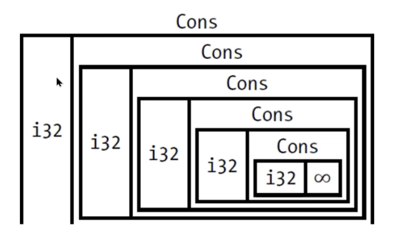
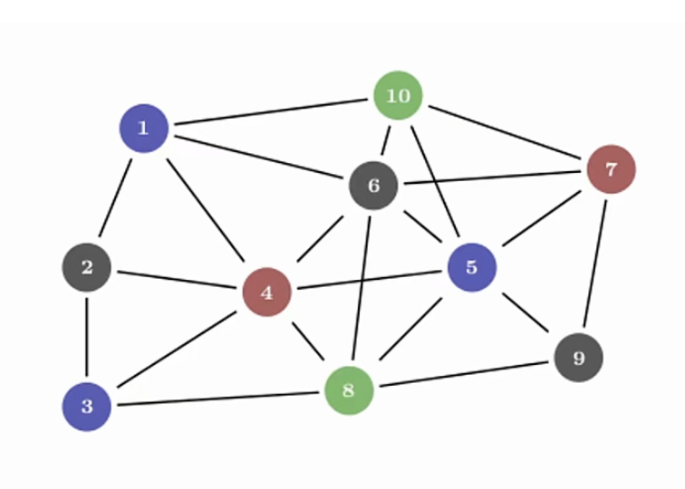

# Rust
它可以用来替换 c/c++ rust和他们具有同样的性能 但是很多常见的bug在编译时就可以被消灭

rust是一种通用的编程语言 但是它更善于以下的场景
1. 需要运行时的速度
2. 需要内存安全
3. 更好的利用多处理器

<br>

### 与其它语言的比较
c/c++性能非常好 但类型系统和内存都不太安全

java/c# 拥有GC 能保证内存安全 也有很多优秀的特性 但是性能不行

<br>

### rust拥有上述的两种语言的优点
1. 安全
2. 无需GC 性能好
3. 易于维护 调试 代码安全高效

<br>

### Rust特别擅长的领域
1. 高性能的web service
2. webassembly
3. 命令行工具
4. 网络编程
5. 嵌入式设备
6. 系统编程

<br>

**webassembly:**  
将一种新型的低级字节码格式引入到现代Web浏览器中, 并成为Web应用程序的通用运行时

它的设计目标是使Web浏览器能够在高性能和安全性方面运行性能密集型应用程序, 如游戏、模拟器、图形/音视频处理等, 以及其他需要高效执行的任务。

传统的Web开发主要依赖于JavaScript作为客户端脚本语言。虽然JavaScript在许多情况下表现良好, 但它也有一些限制, 例如性能问题。WebAssembly的出现为开发者提供了一种全新的选择。

它是一种二进制指令格式, 可在现代浏览器中运行, 从而使开发者能够使用其他语言（如C++、Rust、Go等）编写应用程序, 并将其编译成WebAssembly格式, 然后在浏览器中运行。

<br>

**WebAssembly的特点包括:**  

- 跨平台: WebAssembly可以在各种不同架构和操作系统上运行, 为Web开发带来更广泛的可能性。

- 性能优异: 由于WebAssembly是一种低级字节码, 它可以比传统的JavaScript更高效地执行计算密集型任务。

- 安全性: WebAssembly的设计强调安全性, 它被限制在沙盒环境中运行, 防止恶意代码的直接访问。

- 兼容性: WebAssembly与JavaScript密切集成, 可以与现有的Web平台和框架无缝集成。

- 扩展性: WebAssembly可以用于Web浏览器之外的其他环境, 例如服务器端、嵌入式系统等。

<br>

通过WebAssembly, 开发者可以在Web平台上实现更多复杂和高性能的应用程序, 而不仅仅局限于传统的Web开发范畴。

<br>

### Rust的用户和案例
- Google: 新操作系统Fuschia 其中rust代码量大约占30%

- Amazon: 基于Linux开发的直接可以在裸机 虚拟机上运行容器的操作系统 rust编写的

- System76: 纯rust开发了下一代安全操作系统 Redox

- 蚂蚁金服: 库操作系统 Occlum rust编写

- 微软: 正在使用 Rust 重写 windows 系统中的一些低级组件

<br>

### Rust缺点: 难学
- 如果会c++可能就很容易
- rust有很多独有的概念 他们和现在大多主流语言都不同

<br>

### Rust参考教程
Rust权威指南 2018 我们看这个

<br>

### Rust体系课程的规划
1. 这门课是入门级教程 参考 Rust权威指南 1-12 章的内容讲的
2. 未来还有rust进阶教程 也会参考此书的13章以后的内容
3. rust算法教程
4. rust数据结构教程
5. rust web开发教程

<br><br>

## 安装Rust

### 官网:
```s
www.rust-lang.org
```

<br>

### 安装:
```s
curl --proto '=https' --tlsv1.2 -sSf https://sh.rustup.rs | sh

# mac使用这个就可以
curl https://sh.rustup.rs | sh
```

<br>

### 添加到环境变量 (mac)
```s
export PATH="$PATH:~/.cargo/bin/"

source .bash_profile
```

<br>

### 检查是否安装成功
```s
rustc --version
# rustc 1.70.0 (90c541806 2023-05-31)
# 版本号(commitHash, commitDate)

cargo --version
```

<br>

### 更新rust
```s
rustup update
```

<br>

### 卸载rust
```s
rustup self uninstall
```

<br>

### 运行本地文档
rust在安装后 可以在本地打开文档 进行离线浏览 我们通过如下的命令在浏览器中打开本地文档
```s
rustup doc
```

<br>

### 开发工具
- Visual Studio Code, 插件: rust
- Clion, 插件: rust

<br><br>

# 编写 Rust 程序

### 程序文件后缀名: rs

<br>

### 文件命名规范: 
文件名小写字母 使用下划线进行连接  
hello_world.rs

<br>

### **<font color='#C2185B'>fn关键字:</font>**  
用来定义函数 类似js中的 function

<br>

### 函数的格式:
```rs
fn 函数名() {
  函数体内容...
}

fn main() {
  println!("Hello World")
}
```

### 要点:
1. fn定义函数的关键字
2. main函数: 入口函数, 它是每个rust可执行程序最先运行的代码

```rs
fn main() {
  println!("Hello World")
}
```

<br>

### 注意:
1. rust中和java一样 末尾要加上 分号
2. rust的缩进是4个空格而不是tab (这个不是强制性的要求)
3. println! 是一个rust macro(宏) 如果是函数的话 就没有!, 以是否有!号 来区分它是宏还是函数

<br>

### 扩展: 宏 Macro
一种用代码生成代码的手段 中文是宏

rust的宏是基于ast语法树 而不是c/c++那种#define简单的文本替换 其作用类似于 elixir里面的macro 

<br><br>

## 编译: rs文件
我们写好的 rs文件 需要进行 编译 / 运行 两个步骤

<br>

### 编译命令
编译之后会生成一个二进制的文件 .exe结尾(window下)
mac的下面没有后缀
```s
rustc 文件名.rs

rustc hello_world.rs
```

<br>

### 运行: 编译后的rs文件
window下编译后的rs文件 会生成 exe 的可执行程序, Linux同样也会编译成一个可执行文件

我们通过如下的方式来运行 可执行文件

``./文件名``, 在Mac / Linux的时候 文件后面不用追加后缀

- Windows: .\main.exe
- Linux: ./main

```shell
./hello_world
```

<br>

### 解析: 编译和运行
编译和运行是单独的两步

- 运行rust程序之前必须先编译 命令: ``rustc 文件名.rs``

编译成功后 会生成一个二进制文件, 在windows上还会生成一个 .pdb 文件 里面包含调试信息

<br>

rust是 ahead-of-time 编译的语言 也就是可以预先编译的语言 我们可以将程序先编译好 然后把可执行文件交给别人运行(别人的机器上无需安装Rust, 即可运行程序)

<br>

**注意:**  
rustc这个编译命令 只适合简单的Rust程序  
如果程序比较复杂 我们再使用 rustc 编译就不合适了 我们要使用 Cargo

<br><br>

# Cargo
小项目的话我们可以使用 rustc

但是一些比较大的项目 我们必须使用其他的工具 这个工具就叫做 cargo

<br>

## cargo的作用
它是rust的 ``构建系统`` 和 ``包管理工具``   

它可以构建代码 下载依赖的库 构建这些库, 安装rust的时候会自动安装cargo

<br>

### 验证 cargo 是否正确安装
```rs
cargo --version
``` 

<br><br>

## cargo的使用:
cargo在我这边的理解类似于 cli 也是用来创建rust项目的

<br>

### 使用 cargo 创建项目
```rs
cargo new 项目名

cargo new rust_test_cargo_pro
```

<br>

### 创建的目录结构:
```s
| - 项目名
  | - src # 用来放源代码
    - main.rs

  | - target

  - Cargo.lock
  - Cargo.toml
```

<br>

我们可以在初始化项目的时候 不自动初始化git仓库 所以我们可以在创建项目的命令上追加 --vcs 参数

```s
cargo new --vcs 项目名
```

<br><br>
  
### Cargo配置文件: toml
```s
# 区域的标题 表示下方内容是用来配置包(package)的
[package]
name = "Rust"
version = "0.1.0"
edition = "2021"

# See more keys and their definitions at https://doc.rust-lang.org/cargo/reference/manifest.html

# 依赖项
[dependencies]

```

<br>

**dependencies:**  
另一个区域的开始 它会列出项目的依赖项
在rust里面 代码的包或者代码的库叫做 crate
比如我们安装一个第三方的库 这个库在rust里面就叫做 crate

<br>

### 扩展:
Rust中依赖包 或者 依赖库 我们叫它 crate, 比如我们安装一个第三方的库, 这个库在Rust中就叫做 crate

<br>

### src/main.rs
cargo生成的main.rs在src目录下 而Cargo.toml在根目录下 源代码都应该在src目录下

<br>

**根目录可以放置:**  
- readme
- 许可信息
- 配置文件
- 其它与程序源码无关的文件


如果创建项目的时候没有使用 cargo 也可以把项目转化为使用 cargo 的形式 很简单:
1. 把源代码文件移动到src下
2. 创建 Cargo.toml 并填写响应的配置

<br>

### Cargo常用命令:
- cargo build: 可以构建项目
- cargo run: 可以运行项目
- cargo test: 可以测试项目
- cargo doc: 可以为项目构架文档
- cargo publish: 可以将库发布到 crates.io

<br><br>

## 打包: 使用 Cargo 构建项目
```rs
cargo build
```

打包这个动作会将我们的rs文件 打包成一个可执行文件, 文件会存放在

1. Mac: target/debug/项目名(mac下的可执行文件不带后缀 可执行文件名就是项目名)
2. Windows: target/debug/hello_cargo.exe

<br>

运行可执行文件 就是执行这个程序了

<br>

**运行可执行文件的方式:**  
```s
./target/debug/hello_cargo
```

<br>

第一次运行 cargo build 会在根目录生成 cargo.lock 文件 .lock文件负责追踪项目依赖的精确版本 不需要手动修改该文件

<br><br>

## 运行 Cargo 项目
有点类似我们的 npm run dev, 但不同的是 run命令相当于我们的 ``run dev + build``
 
<br>

我们会通过如下的命令 运行我么的rust项目

```s
cargo run
```

<br>

上面我们是先通过 cargo build 才构建项目 然后执行可执行文件 

cargo run命令 可以 **构建 + 运行** 项目, 该命令是两步操作 编译代码生成可执行文件 + 执行结果

如果之前编译成功过 并且源码没有改变 那么就会直接运行二进制文件

<br><br>

## 检查 rust代码
```s
cargo check
```
该命令用于检查代码 确保能通过编译 **但是不产生任何可执行文件** 该命令会比 cargo build 快的多

所以在编写代码的时候可以连续反复的使用 cargo check **检查代码 提高效率**  

<br><br>

## 发布程序
```s
cargo build --release
```

默认情况下 cargo build 命令是开发时用的 用于调试的 如果我们的程序已经写完了 已经准备发布了

那我们就要使用上面的命令 这时候编译会进行优化 代码会运行的更快 但是编译时间更长

<br>

**该命令生成的可执行文件 会在 target/release目录而不是 target/debug 目录下生成可执行文件**  

<br>

- 开发时用的命令: ``cargo build``
- 正式发布时用的命令: ``cargo build --release``

<br><br>

# 案例: 猜数字 游戏
生成一个 1 到 100 间的随机数, 提示玩家输入一个猜测, 之后程序会提示猜测是太大了 还是 太小了

- 如果猜测正确: 打印庆祝的信息 程序退出
- 如果猜测失败: 继续猜

```rs
// rust里面的导包要使用 use 关键字
// use 标准库中的io
use std::io;

fn main() {
    println!("猜数");
    println!("猜测一个数");

    // 定义一个空字符串
    let mut guess = String::new();

    /*
      read_line返回一个枚举类 枚举类中有两个成员
      - ok
      - err

      ok中用于存放程序正常读取的时候 获取到的值
      err中会终止当前的程序 并展示传入的字符串
    */
    io::stdin().read_line(&mut guess).expect("无法读取行");

    // 使用{}作为占位符 我们把变量传递进去
    println!("你猜测的数是: {}", guess);
}
```

<br>

### 分析:
我们要获取用户的输入 然后再把用户的输入 打印出来作为输出 我们就需要使用到 io 这个库

- std为标准库
- io在std中

```rs
use std::io;
```

<br>

### 注意:
默认情况下 rust会把prelude模块的内容导入到每个程序的作用域中, 如果我们使用的类型不在 prelude 里面 就需要显式的将导入该类型 就要使用use关键字

<br><br>

# 字符串的创建
Rust中字符串也是引用数据类型, 在我们声明一个字符串的时候可以通过如下的方式

<br>

### **<font color='#C2185B'>String::new()</font>**  
是用于创建一个新的空字符串的静态方法, 它是一个可增长的 UTF-8 编码的字符串。

返回字符串实例, 空字符串

``new()``: 会创建一个空白的字符串 在rust中很多类型都有new(), 因为它是创建类型实例的惯用函数

<br>

rust中字符串类型就是String 它是由标准库所提供的 它内部使用了utf-8格式的编码 并且可以按照需求扩展自己的大小

<br>

``String::new()`` 是String类型的关联函数, **也称为静态方法**  

关联函数(静态方法)是针对类型本身来实现的 而不是针对字符串某个特定的实例来实现的 也就是说 关联函数不是针对特定的实例调用的, 而是与类型本身相关联的函数。通过使用 String::new(), 可以直接从 String 类型本身创建一个新的空字符串。

<br><br>

# io标准库
标准库就是rust自身提供的 我们在导入一个库 (相当于导入一个包) 的时候使用 use, 跟scss很像呀

<br>

### use关键字 导入一个库
用于将 一个模块或者类型 显式的导入到程序中, 导入进来后 我们就可以使用 io 做输入或输出的操作了

相当于 import require
```rs
// rust里面的导包要使用 use 关键字
use std::io;
```

<br>

### 获取 io库 的实例对象

### **<font color='#C2185B'>io::stdin()</font>**  
stdin()会返回 Stdin的实例 它会作为句柄(handle)处理终端中的标准输入

<br>

### 扩展: 句柄 (引用类型的变量)
"句柄"（Handle）通常是指对资源的引用或标识符, 它允许程序通过该引用或标识符来访问资源 而无需直接了解或操作底层细节

句柄是一种抽象层, 用于隐藏底层资源的实际表示和管理。

在操作系统中, 句柄通常是一个整数或指针, 它用于标识某种资源, 如文件、网络连接、图形设备、内存区域等。

程序可以通过句柄来操作这些资源, 例如读写文件内容、发送网络数据、绘制图形等。

<br>

**理解:**  
我们可以将句柄理解为 指向引用类型的变量, 我们通过这个变量调用对象中提供的各种方法

但是在rust中 句柄通常都是指针、整数或其他类似的数据结构, **通常用于标识资源并允许通过该引用或标识符来访问资源。**  

<br>

### 扩展: 变体 (枚举类型的成员)
在 Rust 中, "变体"（Variant）是枚举类型（Enum）的成员。

枚举是一种用户自定义的数据类型, 它可以包含多个不同的变体, 每个变体可以携带不同的数据。

枚举允许你在一组预定义的值中选择一个, 以表示某个特定的状态或情况。

<br><br>

# 读取用户在控制台中的输入

### **<font color='#C2185B'>io库实例对象.read_line(&mut 变量)</font>**  
用于从标准输入中读取一行用户输入, 并将输入存储到指定的可变变量中

```js
// io::stdin() io实例对象
io::stdin().read_line(&mut guess)
```

<br>

**参数:**   
接受一个可变引用作为参数, 并在用户输入后将读取的内容存储到该引用所指向的变量中
```rs
这个字符串类型的参数需要是可变的 因为这个方法会随着用户的输入来修改字符串的内容 所以我们在 guess 前面加上了 *mut* 关键字
```

这个方法用于获取用户的输入 该方法就是将用户的输入放到一个字符串中, 所以我们要传递一个字符串类型作为参数

<br>

**返回值: io::Result**  
read_line()方法 无论用户输入什么 都会读取
- 返回值类型: ``io::Result<usize>`` 类型

<br>

在rust的标准库中有很多的类型都叫做 Result 既有通用的result 也有特定版本的子模块的result比如io::Result

Result类型实际上就是枚举类型 一个枚举类型会有几个固定的值 这些值就是枚举类型的变体

io::Result类型就有两个变体 (io::Result枚举类中有两个成员)
- Ok
- Err

<br>

如果我们read_line()方法返回的是 Ok 变体的话 就表示这个操作成功了 而且Ok 里面还有结果值

如果我们read_line()方法返回的是 Err 变体的话 就表示这个操作失败了 在Err中 还会附带失败的原因

而io::Result枚举类型 它上面还定义了一系列的方法

<br>

### **<font color='#C2185B'>expect("中断时的提示信息")</font>**  
io::Result枚举类型定义的方法之一

如果 io::Result 是 Err 变体, expect 方法会导致程序崩溃, 并显示传入的字符串信息作为错误原因。

如果 io::Result 是 Ok 变体, expect 方法会从 Ok 中提取值, 并将其作为结果返回给调用者。

<br>

如果程序出错, 则终止程序 并显示给定的错误信息
如果程序成功, 读取数据成功 则会从Ok中提取值 保存到guess变量中

<br><br>

## & 取地址符号
```rs
&mut 变量
```

<br>

### **<font color='#C2185B'>& 变量</font>**  
### **<font color='#C2185B'>&mut 变量</font>**  
上面的两个关键字 用于创建数据的引用

引用在rust中默认也是不可以修改的 和变量一样
- & 变量: 创建一个不可修改的引用
- &mut 变量: 创建一个可以修改的引用

<br>

&mut表示这是一个可修改的引用, **允许在方法内部修改该引用所指向的变量的值**  

该关键字用于创建 **可变的引用**  

用允许你借用（borrow）一个变量的值而不获取所有权, 通过可变引用, 你可以修改引用所指向的变量的值, 而不违反 Rust 的所有权规则。

<br>

### & 取地址符号
表示这个参数是一个引用 通过引用就可以在代码的不同地方来访问同一块数据 

```rs
// 方法的参数是用引用来传递的
read_line(&mut guess)
```

```rs
let mut guess = String::new();
io::stdin().read_line($mut guess)
```

<br>

**解析:**  
上面两个guess因为使用了 & 指向同一块内存

而引用在rust里面是比较复杂的特性 而rust的核心竞争力之一 它可以保证我们可以简单并且安全的使用 引用功能

&引用在rust里面表示也是不可变的 当我们加上mut关键字后 这个引用也变成了可变的
```rs
// 不加 mut 就会报错
io::stdin().read_line($ guess)
io::stdin().read_line($mut guess)
```

<br><br>

# println!()

### {} 表示占位符
它的值在输出的时候就会替换成 后面变量的值
```rs
println("你猜测的数是: {}", guess);
```

- 如果一个{} 就对应后面第一个变量的值
- 如果二个{} 后面就应该传入两个变量的值

<br><br>

# 案例: 猜数字阶段2 生成神秘的数字
我们要生成1-100之间的随机数 但是rust标准库里面 没有包含生成随机数的功能 

但是 rust团队提供了 生成随机数公功能的库 

<br>

### rand库 (依赖包)
生层 随机数的 crate 的包

rand(crate包 可以理解为npm里面的包或者理解为一个模块)

在rust中一个库(crate)就是一堆的rust源代码文件
```s
https://crates.io/crates/rand
```

<br>


**rust中的crate一共分为两种:**  
- 我们自己创建的猜数字的程序 最后可以通过 build构建成一个可执行程序 它就是一个 二进制的crate 

- 而rand这个crate是不可以独立运行的 它属于lib crate 叫做 库包 像这种crate就是为其它程序所用的

<br>

### 项目中添加依赖
我们以往添加依赖的 方式 需要在控制台上 通过 npm i 的命令 来下载包是吧

而 rust 添加依赖的方式如下有两种:

<br>

**方式1: 手动在 Cargo.toml 文件中指明依赖**  


1. 打开 Cargo.toml 文件
2. 在 [dependencies] 的下面写上 ``包名 = "版本"`` 相当于我们在package.json中指明依赖包一样
```s
rand = "版本"
# 表示和指定版本兼容的版本都可以
rand = "^版本"


[package]
name = "rust_test_cargo_pro"
version = "0.1.0"
edition = "2021"


[dependencies]
# 比如我们指定了 0.3.14 那么就是和这个版本兼容的版本都可以
rand = "^0.3.14"
```
3. 写完后重新构建项目就下载好了
```s
cargo build

# 重新构建的时候 会检查 dependencies 有没有下载的依赖项 如果没有就会自动下载
```

<br>

**方式2: cargo install rand**  

<br><br>

相当于怎么 npm i 一个包
rust中 我们可以直接在 Cargo.toml 中 [dependencies] 的位置写 写完后重新构建下 可能就下完了

也可以:
cargo install rand

格式:
rand = "版本"

完整写fa:
rand = "^版本"
表示和指定版本兼容的版本都可以
比如我们指定了 0.3.14 那么就是和这个版本兼容的版本都可以

```toml
[package]
name = "rust_test_cargo_pro"
version = "0.1.0"
edition = "2021"


[dependencies]
rand = "0.3.14"
```

<br>

### ctrl + shift + p
我们在使用 vscode 的时候 并且使用了方式1来下载依赖的时候 应该是可以自动下载依赖的

如果没有自动下载可以进行如下的操作
1. 使用 cargo build 重新构建后 应该就可以下载了
2. 开启自动下载 手动开启服务器 开启之后可能下载依赖的时候就不用 手动构建了 没有尝试 
```s
ctrl + shift + p
  输入 rust
    runst start the rust server
```

<br><br>

## 知识点: trait
```rs
// trait 它相当于其它语言的接口, Rng trait就是定义了随机数生成器需要实现的方法
use rand::Rng; 
```

我们在使用 随机数包 的时候老师说了 trait, 下面说说设么是 trait

<br>

### trait: 接口
trait 是一种抽象类型, 类似于其他编程语言中的接口。

接口中有一组规则 实现了接口的类 则必须实现这组规则 相当于我们可以使用接口中定义好的方法

<br>

它定义了一组方法的规范, 如果一个类型实现了这个trait, 就必须提供这些方法的具体实现。实现了某个trait的类型可以被视为拥有了这个trait所定义的行为。

<br>

提到了 Rng trait, 它是来自 rand crate（Rust的一个用于生成随机数的库）的一个抽象类型。当你希望使用随机数生成器时, 可以使用 rand::Rng trait 来定义所需的方法。

<br>

然后, 任何实现了这个 Rng trait 的类型都可以用作随机数生成器, 并且你可以使用相应的方法来生成随机数。

<br>

### 要点: rand包的使用方式
### **<font color='#C2185B'>rand::thread_rng()</font>**  
rand::thread_rng()会返回一个类型为 ThreadRng类型的随机数生成器 

后续我们通过该生成器中的方法来生成随机数, 它会在最小值 和 最大值之间生成一个随机数
- 包括最小值
- 不包括最大值
```rs
// 参数为最小值和最大值
rand::thread_rng().gen_range(1, 101);
```

<br>

**返回值类型:**  
整数类型, rust中有很多整数类型 比如
- i32
- u32
- i64

除非我们显示的增加类型推断 否则返回的类型为 i32

<br><br>

### 猜数字游戏部分2:
```rs
use std::io;

// trait 它相当于其它语言的接口, Rng trait就是定义了随机数生成器需要实现的方法
use rand::Rng; 

fn main() {
  println!("猜数");
  // 生成一个随机数
  let secret_number = rand::thread_rng().gen_range(1, 101);

  println!("神秘数字是: {}", secret_number);

  println!("请猜一个数字");
  let mut guess = String::new();
  io::stdin().read_line(&mut guess).expect("无法读取行内信息");

  println!("我们猜的数字是, {}", guess)
}
```

<br><br>

# 案例: 猜数字阶段3 比较猜测的数字 与 神秘数字 
我们要做的是 比较 guess 和 secret_number 的大小

<br><br>

## 知识点: Rust中是 switch case
### **<font color='#C2185B'>match 表达式 { ... }</font>**  
相当于 switch case 

match 表达式是 Rust 中的一个非常强大和灵活的控制流工具, 它允许你根据不同的模式来执行不同的代码块。

它会根据表达式的返回的结果(Ordering枚举类型) 返回的枚举类型的值 来决定下面我们执行哪个对应的语句

```rs
// guess.cmp(&secret_number) 的结果可能有3种情况 > = <
match guess.cmp(&secret_number) {
  Ordering::Less => println!("小了"),
  Ordering::Greater =>  println!("大了"),
  Ordering::Equal =>  println!("赢了")
}
```

<br>

**注意:**  
match体中语句之间要使用的是 , 号

<br>

### **<font color='#C2185B'>字符串.cmp(&字符串变量)</font>**  
用来进行比较 就是compare的方法 它和另外的一个值进行比较

它接收的参数是另外的一个值的引用, cmp()返回的类型就是 Ordering 枚举类型

<br>

### **<font color='#C2185B'>字符串.parse()</font>**  
将字符型的数字转换为 真正的数字

可以搭配 ``expect("请输入一个数字");`` 因为我们在解析字符串成为整数的时候 可以会失败 所以我们搭配 expect方法使用

比如我们要写个 abc 还转换不了

<br>

**parse()的返回值:**  
Result类型, 它是枚举类型 内部有Ok Err两个值, 因为是Result类型 我们后面可以接 expect方法

如果解析失败则展示我们传入的信息, 并程序终止

```js
let mut guess = String::new();

// 当解析字符串失败的时候使用 expect()

// 重新定义 guess 并将其声明为整数类型: 当我们转换 1 - 100 之间的数的时候 它有可能是好几种数值类型 比如 i32 u32 i64 等等 当parse解析的时候 我们通过指明类型 告诉rust解析的时候解析成哪种类型
let guess:u32 = guess.trim().parse().expect("请输入一个数字");
```

<br>

### **<font color='#C2185B'>use std::cmp::Ordering;</font>**  
标准库中的枚举类

Ordering是枚举类型 它有3个值(变体, 或者理解为成员) 

Less Greater Equal 分别表示小于大于或者是等于

```rs
Ordering::Less => println!("小了"),
Ordering::Greater =>  println!("大了"),
Ordering::Equal =>  println!("赢了")
```

<br><br>

## 知识点: Rust中的类型推断
rust中变量也是有类型的 当类型不符的时候 变量之间不能互相的赋值

rust是静态强类型的语言 它还具有类型推断的能力 我们在声明 guess 变量的时候 并没有声明其类型 

但是通过 后面的 String::new() 表达式就能推断出来 guess变量的类型就是string

```rs
let mut guess = String::new();
```

<br>

### 定义变量类型
```rs
let mut guess: 类型

let guess:u32 = guess.trim().parse().expect("请输入一个数字");
```

<br><br>

## 知识点: 类型遮盖
rust中允许声明同名变量用来隐藏上面定义好的同名变量

```rs
// 定义了一个字符串
let mut guess = String::new();

// 遮盖上面的变量
let guess:u32 = guess.trim().parse().expect("请输入一个数字");
```

也就是将 字符串类型的guess转换为 u32无符号整数类型的变量了

<br>

**特性使用场景:**  
在Rust中需要进行类型转换的时候 我们在定义重名变量对上面的变量进行 **遮盖**  

相当于转换了该变量的类型

<br>

### 完成代码部分
```rs
use std::cmp::Ordering;
use std::io;
use rand::Rng;

fn main() {
  println!("猜数");
  // 生成一个随机数
  let secret_number = rand::thread_rng().gen_range(1, 101);
  println!("神秘数字是: {}", secret_number);

  println!("请猜一个数字");
  let mut guess = String::new();
  io::stdin().read_line(&mut guess).expect("无法读取行内信息");


  // 类型转换 将 guess 字符串 转成 整数型之后进行比较
  // 解析字符串为数字 当发生错误的时候给出提示
  let guess:u32 = guess.trim().parse().expect("需要输入的是一个数字");
  println!("我们猜的数字是, {}", guess);


  // 相当于 switch case cmp()方法返回的是 Ordering 类型 所以内部使用了 Ordering的成员 匹配输出内容
  match guess.cmp(&secret_number) {
    Ordering::Less => println!("太小了"),
    Ordering::Greater => println!("太大了"),
    Ordering::Equal => println!("你赢了"),
  }
}
```

<br><br>

# 案例: 猜数字阶段4 循环猜测
为了让用户进行多次猜测 我们需要做一个无限循环

<br>

### 循环
### **<font color='#C2185B'>loop {}</font>**  
loop表示无限循环 而不是while(true) rust里面有while关键字
```rs
loop {
  // break 用于跳出循环
  break;
}
```

<br>

### 关键字: break;
用于跳出循环

<br>

### 关键字: continue;
用于跳出本次循环

<br>

### match的应用技巧
我们不要程序需要报错就崩溃的时候 我们可以这么处理
guess.trim().parse() 会返回 Result类型 该类型有 Ok Err
这时候我们就可以使用 match 分支来解决 当遇到用户输入 abc parse()转换不了的时候 continue跳出本次循环进入下一次循环

```rs
let guess:u32 = match guess.trim().parse() {
  Ok(num) => num,
  Err(_) => continue
};
```


```rs
use rand::Rng;

use std::cmp::Ordering;
use std::io;
fn main() {
  println!("猜数");

  let secret_number = rand::thread_rng().gen_range(1, 101); // i32 u32 i64


  // 使用循环
  loop {
    println!("猜测一个数");
    let mut guess = String::new();

    io::stdin().read_line(&mut guess).expect("无法读取行");
    
    /*
      guess.trim().parse() 返回的是枚举类型 Ok Err

      match 可以用来匹配表达式中的 枚举类型
      所以这里我们替换成match 

      match 表达式 {...}
    */
    let guess:u32 = match guess.trim().parse() {

      // Result成员: Ok, Ok的场景下直接返回存放在Ok里面的数字
      Ok(num) => num,

      // Result成员: Err, Err的情况 我们直接跳过本次循环
      Err(_) => continue
    };


    println!("你猜测的数是: {}", guess);
    
    match guess.cmp(&secret_number) {
      // 小于
      Ordering::Less => println!("小了"),
      Ordering::Greater =>  println!("大了"),
      Ordering::Equal => {
        // 使用 break 跳出循环
        println!("赢了");
        break;
      }
    }
  }
}
```

<br><br>

# 变量 与 可变性

<br>

## 变量的声明: 

### let
声明变量 我们会使用 **let** 关键字, 默认情况下我们使用let声明的变量是不可变的, 一旦变量绑定了一个值后 这个变量就不可以被重新赋值了

- 可以修改使用 <font color='#C2185B'>let mut</font>, 相当于 const

- 不可以修改使用 <font color='#C2185B'>let</font>, 相当于 let

<br>

如果使用 let 声明的变量 进行重新赋值的话 编译阶段就会报错
```rs
let num = 10  // 相当于 const
```

<br>

### 示例:
1. 创建一个可以被修改的变量
```rs
let mut num = 10
```

2. 创建一个不可以被修改的变量
```rs
// rust中所有的变量默认情况下是不可变的
let num = 10
```

<br>

```rs
fn main() {
  let num = 10;

  // 使用 println 输出变量的时候 必须使用 {} 单独的输出变量是不可以的
  println!("变量为: {}", num)


  // 报错 cannot assign twice to immutable variable 不可以对不可变的变量两次赋值
  num = 6;  
}
```

<br>

我们使用 let 声明了 num 对于整数来说 编译器会把 num 的类型**推断为i32类型**  


<br>

### let mut 关键字
声明变量时 在变量前面加上 mut 就可以使变量可变 这时相当于我们使用js中 let声明的变量 该变量是可以修改的

<br>

### 变量的类型:
Rust中变量的类型可以由编辑器来自动推断 当然我们也可以显示的定义变量

```rs
let 变量: 类型 = 值;
```


<br><br>

## 常量

<br>

### const 关键字
常量(constant), 常量在绑定值以后也是不可变的 但是它与不可变的变量有很多区别:

1. 不可以使用 mut, **常量永远都是不可变的**  

2. 声明常量使用 const 关键字 **它的类型必须被标注(没有类型推导)**  

3. 常量可以在任何作用域内进行声明 包括全局作用域

4. 常量只可以绑定到常量表达式 无法绑定到函数的调用结果或只能在运行时才能计算出的值 **常量的值在编译时就确定了 不可变变量的值可以在运行时确定**  

在程序运行期间 **常量在其声明的作用域一直有效**  

<br>

### 常量的命名规范:
rust里常量使用全大写字母 每个单词之间用下划线分开 **MAX_POINTS**  

常量声明的例子
```rs
// 常亮声明时必须为其注明类型
const MAX_POINTS:u32 = 100_000
```

<br>

**100_000:**  
我们在数字之间使用下划线 来增加可读性 它为10万

<br><br>

## 变量特性: 隐藏(shadowing)
在rust中 可以使用相同的名字声明新的变量 新的变量就会隐藏之前声明的同名变量

```rs
fn main() {

  let x = 5;      // 第 1 行

  // 报错
  x = x + 1;      // 第 2 行

  // 再次声明同名变量 遮盖主上面声明的变量x
  let x = x + 1;  // 第 3 行

  print!("x的值是: {}", x);
}
```

<br>

当我们直接写 第2行 的时候 就会报错 因为默认情况下x是不能被再次赋值的

<br>

但是 我们 第3行 又写了 let x = x + 1；
这就是隐藏 就是在 第3行 又声明了一个变量 也叫x

<br>

那么从 第3行 以后就都是新声明的变量 而不是之前的x

第1行 x出现的最后位置 就是 第3行 x + 1 这里

定义了同名变量后 后续的代码中 这个变量名 **代表的就是新的变量**  

<br>

### shadow 和 把变量标记为 mut 是不一样的
使用let声明的变量 如果不使用let关键字 那么重新给非mut的变量赋值会导致编译时错误

- 使用 let 声明的同名新变量 也是不可变的
- 使用 let 声明的同名新变量 它的类型可以与之前不同

<br>

### 演示:
如下会报错 因为 上面 和 下面的类型不一样
```rs
// spaces类型为 &str 为字符串型
let mut spaces = "    ";

// 报错: 因为 spaces.len() 返回usize类型, 类型不符合不能直接赋值
spaces = spaces.len();


// 使用 遮盖特性 重新声明同名变量并指定变量的类型 
let mut spaces = spaces.len();
```

<br>

**注意:**  
spaces.len() 返回的是 usize 类型 所以我们不能这么写 ``let mut spaces:i32 = spaces.len();``

<br>

### usize类型:
这个类型是根据计算机的架构 如果是64位的话 那么它的类型就是64位无符号整数类型

```rs
fn main() {
  // spaces: &str 是字符串类型 
  let spaces = "    ";
  
  // spaces: usize
  let spaces = spaces.len();    

  print!("{}", spaces);
}
```

<br>

### 遮盖shadow的好处
在其他的语言中经常会遇到这样的场景
有一个字符串 我们想把它解析成一个数字 
``let spaces_str = "   "``

如果我们想把上面的变量解析成数字 那么我们还需要重新定义一个新的名字
``let spaces_num = spaces.len()``

也就是说我们可能要使用不同的后缀来区别变量 但是对于表达变量的意图来说 这个后缀又是多余的

<br><br>

# 数据类型
rust中每一个值都有特定的数据类型 

rust会根据数据类型来决定怎么处理他们 这里我们主要看下 标量类型 和 复合类型

rust是静态编译语言 **在编译时必须知道所有变量的类型**  

大部分情况下 基于使用的值 编译器通常能够推断出它的具体类型

但是如果可能的类型比较多(例如把string转为整数的parse()) 

就必须添加类型的标注 否则编译会报错 因为编译器推断出来的类型会比较多

<br>

```rs
fn main() {
  // 解析成功就会输出42 解析失败就会输出提示字符串
  let guess:u32 = "42".parse().expect("not a number");
  print!("{}", guess);
}
```

<br>

针对 42 这个数字 rust里面 有很多的整数数据类型能够将42包含在内 比如 i32 u32 等等 

所以这时候 我们要给 guess 变量指明是哪种类型 这样 parse() 方法就知道 要把这个字符串解析成什么类型了

如果不标注类型 那么程序在编译期间就会报错(type annotations needed)

<br>

### 标注类型
```rs
let 变量:类型 = 值
```

<br><br>

# 标量类型
一个标量类型代表一个单个的值, rust有四个主要的标量类型

- 整数类型
- 浮点类型
- 布尔类型
- 字符类型

<br>

## 整数类型
整数类型就是没有小数部分

例如, u32就是一个无符号的整数类型 占据32位的空间 没有正负号 表数范围 2^31-1 

- 无符号整数类型以 u 开头  unsigned
- 有符号整数类型以 i 开头  integer


<br>

### rust的整数类型列表如图:
每种都分 i 和 u 以及固定的位数

<br>

|length|signed|unsigned|
|:--|:--|:--|
|8-bit|i8|u8|
|16-bit|i16|u16|
|32-bit|i32|u32|
|64-bit|i64|u64|
|128-bit|i128|u128|
|arch|isize|usize|

arch: 表示系统的架构

<br>

**有符号范围:**  
-(2^n - 1) ~ 2^n-1 - 1  包括两头

<br>

**无符号范围:** 
0 ~ 2^n - 1  包括两头

<br>

### isize 和 usize 类型
isize 和 usize 类型的位数由程序运行的计算机的架构所决定

如果是64位计算机 那就是64位的

使用它们的场景并不多 比如 对某种集合进行索引操作

<br>

### 整数的字面值
0x开头 0o开头 0b开头 b开头

|number literals|example|
|:--|:--|
|Decimal(10进制)|98_222|
|Hex(16进制)|0xff|
|Octal(8进制)|0o77|
|Binary(2进制)|ob1111_0000|
|Byte(u8 only)|b'A'|

<br>

- 字面值中: 数字中可以加下划线, 增加可读性 98_222

- byte类型只能是 u8 类型的 必须以B开头 后面接一个 '字符' 相当于一个char

- 除了 byte 类型外 所有的数值字面值都允许使用类型后缀 比如:  
```rs
57u8
// 57就是整数 使用u8类型作为后缀
```

<br>

**技巧:**  
如果我们不太清楚应该使用哪种数据类型 可以使用 rust 响应的默认类型

<br>

### 默认类型
**整数的默认类型**: i32

i32总体上来说速度很快 即使在64位系统中

<br>

### 整数溢出
u8的范围是 0-255, 如果你把一个u8变量的值设为256 那么会分为两种情况

<br>

**1. 调试模式下编译:**  
rust会检查整数溢出 如果发生溢出 程序在运行时就会panic(恐慌)

<br>

**2. 发布模式下(--release)编译:**  
rust不会检查可能导致 panic 的整数溢出

<br>

如果溢出发生: rust会执行 "环绕" 操作, 如果我们将 u8的值设置为256 那么它就会变成0

- 257变成1
- 258变成2 ...

但是在发布模式下的溢出 不会导致程序的panic

<br>

### 扩展: 恐慌 - 异常
恐慌是 Rust 中的错误处理机制之一, 它表示程序出现了无法处理的问题, 类似于其他编程语言中的异常或错误。

当恐慌发生时, 程序将会终止并显示有关问题的错误信息。在调试模式下, Rust会帮助您尽早发现可能存在的问题, 并提供相关的错误信息, 方便调试和修复。

<br>

### 扩展: 环绕
在发布模式下（使用--release参数编译）, Rust不会检查整数溢出, 并且不会产生恐慌。相反, 它会执行"环绕"操作。

环绕是指当整数溢出发生时, 数值会回绕或循环回到类型的范围内, 继续增加或减少。

<br>

例如, 如果将一个u8类型的值设置为256, 它会环绕回到0；257会变成1, 258会变成2, 以此类推。这种行为是整数溢出后的默认处理方式, 可以在某些情况下提供更高效的计算结果。

<br>

### 总结:
在调试模式下, 整数溢出会导致恐慌, 程序会终止并显示错误信息。而在发布模式下, 整数溢出会执行环绕操作, 数值会在类型范围内循环回绕, 不会导致程序恐慌。

开发过程中, 调试模式帮助您及早发现潜在的问题, 而发布模式则对性能进行优化, 不会因为溢出检查而引入额外的开销。

<br><br>

## 扩展: 整数的类型
在 Rust 中, 整数类型分为
- 有符号整数（signed integers）
- 无符号整数（unsigned integers）

每种整数类型在内存中占据的位数也可以不同, 这取决于你需要表示的范围。

<br>

### 有符号整数（Signed Integers）
有符号整数以 i 开头 分别有

<br>

**i8: 相当于byte**  
有符号8位整数。范围是 -128 到 127。适用于节省内存或者确切知道数值不会超出范围的情况。

<br>

**i16: 相当于short**  
有符号16位整数。范围是 -32,768 到 32,767。适用于节省内存或者确切知道数值不会超出范围的情况。

<br>

**i32: 相当于int**  
符号32位整数。范围是 -2,147,483,648 到 2,147,483,647。是最常用的整数类型之一, 通常用于一般整数计算。

<br>

**i64: 相当于long**   
有符号64位整数。范围是 -9,223,372,036,854,775,808 到 9,223,372,036,854,775,807。适用于需要非常大整数范围的计算。

<br>

**i128: java中没有对应的**   
有符号128位整数。范围是 -170,141,183,460,469,231,731,687,303,715,884,105,728 到 170,141,183,460,469,231,731,687,303,715,884,105,727。适用于需要非常大整数范围的计算。

<br>

### 无符号整数（Unsigned Integers）
有符号整数以 u 开头 分别有

<br>

**u8: 相当于byte**  
无符号8位整数。范围是 0 到 255。适用于节省内存或者确切知道数值不会超出范围的情况。

<br>

**u16: 相当于short**  
无符号16位整数。范围是 0 到 65,535。适用于节省内存或者确切知道数值不会超出范围的情况。

<br>

**u32: 相当于int**  
无符号32位整数。范围是 0 到 4,294,967,295。是最常用的无符号整数类型之一, 通常用于一般整数计算。

<br>

**u64: 相当于long**   
无符号64位整数。范围是 0 到 18,446,744,073,709,551,615。适用于需要非常大整数范围的计算。

<br>

**u128: java中没有对应的**   
无符号128位整数。范围是 0 到 340,282,366,920,938,463,463,374,607,431,768,211,455。适用于需要非常大整数范围的计算。

<br>

### 使用场景:
如果你需要处理正数或者数值范围在 0 以上的数据, 你应该选择无符号整数类型（如 u8、u16、u32、u64 或 u128）。

如果你需要处理有正数和负数的数据, 那么可以选择有符号整数类型（如 i8、i16、i32、i64 或 i128）。

<br>

当你知道数据不会超出某个特定范围时, 可以选择对应的整数类型以节省内存。但要确保数据不会超过类型的表示范围, 否则可能会导致数据溢出。

<br>

### 注意: 
为了在代码中声明整数类型, 你可以使用后缀表示其位数, 例如 10i8 表示有符号8位整数10, 255u8 表示无符号8位整数255。如果没有后缀, 默认情况下整数字面值会根据值和上下文来推断其类型。

<br><br>

# 浮点类型
rust有两种基础的浮点类型 也就是含有小数部分的类型

<br>

### 两种基础的浮点类型

**1. f32 浮点类型**  
占32位 单精度


<br>

**2. f64 浮点类型 - 默认类型**  
占64位 双精度


<br>

rust的浮点类型使用了 ieee-754 标准来表述
f64是默认类型 因为在现在cpu上f64和f32的速度差不多 而且精度更高

```rs
// 当没有显式的指明类型时 则采用默认类型
let x = 2.0;  // 默认类型: f64
let y:f32 = 3.0;  // 显式定义: f32
```

<br><br>

# 数值的操作
加减乘除余等

<br>

rust支持对浮点类型的取余(两边都是同类型浮点数才可以 比如 1.0 % 3.0)
```rs
// 推断为 i32
let sum = 5 + 10;

// 推断为 i32
let difference = 4 * 30;

// 推断为 f64
let guotient = 56.7 / 32.2;

// 推断为 i32: 取余默认为 i32 整数类型
let reminder = 54 % 5;
```

<br><br>

# 布尔类型: bool
rust的布尔类型也有两个值: true false
占用一个字节的大小
```rs
let t = true;
let f:bool = false;
```

<br><br>

# 字符类型

### char类型
rust语言中 char类型被用来描述语言中最基础的单个字符, **字符类型的字面值使用单引号**  

```rs
let str_a = 'a';
```

<br>

**占用大小:**  
4个字节的大小

因为它采用了 Unicode 的 UTF-8 编码方式。

UTF-8 是一种变长编码, 其中一些字符可以用一个字节表示, 而其他字符可能需要更多的字节。

UTF-8 是一种广泛使用的 Unicode 编码, 它允许 Rust 中的 char 类型能够表示任何 Unicode 字符。

是unicode标量值 可以表示比asc2多得多的字符内容 拼音 中日韩文 零长度空白字符 emoji表情等

```s
相比之下, 在 Java 中的 char 类型采用的是 UTF-16 编码方式。

UTF-16 是另一种 Unicode 编码, 其中每个字符通常占据 2 个字节大小。

因此, Java 的 char 类型占用 2 个字节。
```

<br>

### Unicode的表数范围: 
- U+0000 ~ U+D7FF
- U+E000 ~ U+10FFFF

但unicode中并没有 "字符" 的概念 所以直觉上认识的字符也许与rust中的概念并不相符
```s
Unicode 中, 并没有严格的定义和概念对应于我们通常所说的“字符”（Character）。

在计算机中, 我们经常将文本表示为字符序列, 例如字符串。

在很多编程语言和操作系统中, 一个字符通常被理解为一个单元, 即一个字节或者两个字节（如UTF-16编码）。然而, Unicode 并没有像我们通常理解的那样简单。

Unicode 是一种字符集, 它为世界上几乎所有的字符和符号提供了唯一的编号, 这些编号称为代码点。每个代码点都对应于一个抽象的字符, 但并不直接指定该字符在计算机中的存储方式。

Unicode 的编码方式规定了如何将代码点映射到实际的字节序列, 例如 UTF-8 和 UTF-16 编码。这些编码方式决定了在计算机中存储和传输字符所使用的字节表示形式。由于 Unicode 支持大量的字符, 有些字符的代码点可能需要更多的字节来表示。

这就是为什么在 Rust 中, char 类型的大小是4个字节。它是为了支持更广泛的 Unicode 字符集, 即使某些字符的代码点需要超过2个字节。

所以, 虽然我们通常会用“字符”来描述文本中的单个元素, 但在 Unicode 的世界中, 更准确的说法是“代码点”来表示抽象的字符, 而具体的存储和编码方式则由特定的编码来决定。这一点对于正确处理文本和字符在不同编程环境中非常重要。
```

```rs
let x = 'z';

let y: char = 'z';

let z = '☺';
```

<br><br>

# 复合类型
复合类型就是将多个值放在一个类型里面

rust提供了两种基础的复合类型: 
- 元组(Tuple)
- 数组

<br><br>

## 元组: Tuple
它可以将多个类型的多个值放在一个类型里面, 它的长度是固定的 一旦声明就无法改变, **Ts中它就是一个固定长度的数组**  

<br>

### Tuple的创建
在小括号里面 将值用逗号分开

```rs
(元素1,元素2,元素3)
```

<br>

Tuple中的每个位置都对应一个类型 Tuple中各元素的类型不必相同
```rs
let tup: (i32, f64, u8) = (500, 6.6, 1);
print!("{}, {}, {}", tup.0, tup.1, tup.2);
```

<br>

### 获取 Tuple 的元素值: 使用解构
可以使用 模式匹配来解构(destructure) 一个Tuple来获取元素值
```rs
let tup: (i32, f64, u8) = (500, 6.6, 1);

// ()声明 ()来解构
let (x,y,z) = tup;

print!("{}, {}, {}", x, y, z);
```


<br>

### 访问 tuple 的元素
访问 tuple 并不是通过 ``[下标]`` 也是通过 tup.下标的方式

```rs
let tup = (1,2,3);
tup.0
```

<br>

```rs
let tup: (i32, f64, u8) = (500, 6.6, 1);
print!("{}, {}, {}", tup.0, tup.1, tup.2);
```

<br><br>

## 数组
数组也可以将多个值放在一个类型里 **数组中每个元素的类型必须相同**  

数组的长度也是固定的 一旦声明之后不能改变数组的长度

<br>

### 声明一个数组
在中括号, 各值用逗号分开
```rs
// 元素类型必须相同, 数组长度不可变
let a = [1,2,3,4,5];
```

<br>

### 数组的用处
如果我们想让数据存放在stack(栈)上 而不是heap(堆)上 或者想保证有固定数量的元素 这时候使用数组更有好处 

数组没有vector灵活(以后再讲) vector和数组类似 它由标准库提供 vector的长度可以改变

如果我们不确定应该用数组还是vector 那么估计你应该用vector

```rs
let months = [
  "一月",
  "二月",
  "三月",
];
```

<br>

### 数组 和 动态数组
这里的概念和Java比较像, Java中的数组就是原生的数组 长度不能改变 而我们想用的应该是ArrayList

<br>

rust中也有这样的概念也就是 数组 和 动态数组

<br>

数组和堆上分配的动态数组（Vec）有不同的特点, 适用于不同的需求场景。

<br>

**数组存放在栈上:**  
Rust 中的数组是一种固定大小的数据结构, 它们在编译时就需要知道其长度, 因此数组的大小必须在声明时明确指定。由于数组的大小是固定的, **编译器可以在栈上为数组直接分配内存。**  

栈是一种快速的内存分配方式, 适合存放固定大小的数据, 并且在作用域结束时会自动释放。

<br>

**动态数组存放在堆上:**  
Rust 中的动态数组（Vec）是一种可以在运行时根据需要动态增长或缩小大小的数据结构。由于在编译时并不知道动态数组的最终大小, 它们需要在运行时分配堆内存来存储数据。

堆内存分配和释放会比栈上的操作稍微昂贵, 因为它需要运行时进行动态内存管理, **并且需要手动管理内存的释放, 以避免内存泄漏或使用已释放的内存。**  

<br>

**总结:**  
因此, 如果您的数据大小是固定的, 并且不需要在运行时动态增减大小, 使用数组会更有优势, 因为数组存放在栈上, 具有更高的性能和更简单的内存管理。同时, 数组在内存上是紧凑的, 没有额外的开销, 适用于固定数量的元素的场景。

然而, 如果您的数据大小不确定, 需要在运行时动态管理大小, 并且可能需要频繁增减元素, 那么使用动态数组（Vec）会更适合, 因为它可以自动调整大小, 动态分配和释放堆内存, 提供更大的灵活性。

<br>

### 数组的类型 和 长度
数组的类型以这种形式表示: ``[类型; 长度]``
```rs
let arr: [i32; 5] = [1,2,3,4,5];
```

<br>

### 另一种声明数组的方法
如果数组的**每个元素值都相同** 那么可以在 中括号里面指定初始值 然后接一个; 最后是数组的长度

```rs
let arr = [数据; 数组长度]
```

```rs
let arr = [3; 5];

// 等于
let arr = [3,3,3,3,3];
```

<br>

### 访问数组的元素
数组是stack上分配的单个块的内存 我们可以使用索引来访问数组的元素
```rs
let first = months[0];
```

<br>

### 如果访问的索引超出了数组的范围
- 编译时会通过 不会报错
- 运行时会报错(runtime时会panic) 数组越界 rust不会允许其继续访问相应地址的内存

<br>

### 数组的原理:
它在内存中是一块连续的内存
```rs
| 0 | 1 | 2 | 3 | 4 | Five | Six
```

如果元素在内存中的第一个位置(0), 第二个元素则在 ``第一个元素的位置 + 第一个元素的长度``

如果我们想访问 Five 的元素 这时已经超出索引的范围了 也就是 Five 开始是另一块内存了

但是在C语言中就可以访问 Five 对应的内存, 而在Rust中就不能访问

<br><br>

# 函数

### 函数的声明:
声明函数使用 fn 关键字

<br>

**函数名的命名规范:**  
依照惯例 针对函数和变量名 rust使用snake case命令规范:  
所有的字母都是小写 单词之间使用下划线分开
```rs
fn main() {
  another_function();
}

fn another_function() {
  println!("Another function")
}
```

<br>

**rust中的函数声明并不要求先声明后使用, 有点像js中的function定义的函数**  

<br>

### 函数的参数: 必须指明它的类型
parameters(形参) arguments(实参)

在函数的签名里 必须声明每个参数的类型

```rs
fn main() {
  another_function(5);
}

fn another_function(x: i32) -> 返回值类型 {
  println!("{}", x);
}
```

当我们指明了参数的类型后 编译器就无需对它进行推断了

<br>

### 扩展: 函数签名
函数签名指的是函数的声明部分, 其中包括
- 函数的名称
- 参数列表
- 返回类型

<br>

**函数名称:**  
函数的标识符, 用于在代码中唯一标识该函数。

<br>

**参数列表:**  
包含函数参数的列表, 每个参数由参数名和参数类型组成。参数列表中声明了函数所接受的输入。

<br>

**返回类型:**  
用箭头(->)指定函数的返回类型, 表示函数执行后返回的值的类型。

```rs
// 完整的函数签名
fn add_numbers(x: i32, y: i32) -> i32 {
    // function body
}


fn main() {
  let res = fn2("你好呀");
  println!("{}", res)
}

fn fn2(str: &str) -> &str{
  return str
}
```


<br>

### 函数体中的 语句 与 表达式
函数体由一系列的语句组成 可选的可以由一个表达式结束

rust是一个基于表达式的语言, 这意味着在 Rust 中几乎所有的代码都是表达式(包括条件语句、循环、函数等等) 而不是像某些其他编程语言那样主要由语句构成


表达式是一段代码, 它计算并产生一个值。这与语句不同, 语句是执行某个动作的指令, 它并不产生值。

在其他一些编程语言中, 比如C或Java, 表达式和语句是有明显区别的, 而在 Rust 中这种区别被弱化了, 几乎所有的代码都可以看作是表达式。

<br>

### 语句是执行动作的指令
语句是一种编程结构, 它执行某个操作而不返回值。例如, 一个赋值语句 let x = 10; 执行了将值 10 赋给变量 x 的操作, 但本身并不产生值。

<br>

### 表达式会计算产生一个值
表达式是一段代码, 它会计算一些操作, 并返回一个值作为结果。例如, 一个简单的数学表达式 2 + 3 会计算加法操作并产生结果值 5。

<br>

因为 Rust 是基于表达式的, 所以在 Rust 中几乎任何地方都可以使用表达式, 并且大多数代码块都有一个值可以被返回。这种设计使得 Rust 的代码风格更加统一, 也提供了一些优雅和灵活的编程模式。

例如, Rust 中的条件表达式 if、else 和循环表达式 loop、while 等都返回了一个值, 这使得这些结构非常方便和易于使用。

同时, 也使得 Rust 的错误处理（例如使用 Result 或 Option）更加直观和便利。

<br>

```rs
// 下面不管从整体看 还是 函数体中的一句let y = 6 它们都叫做语句
fn main() {
  let y = 6;    // 语句
}
```

语句没有返回值 所以不可以使用let将一个语句赋给一个变量

```rs
// 报错 
// 程序期待等号的右侧是表达式 但是程序发现等号的右侧是一个语句
let x = (let y = 6);
```

<br>

### **块表达式** 的返回值
上面说了 rust是一个基于表达式的语言, 这意味着在 Rust 中几乎所有的代码都是表达式(包括条件语句、循环、函数等等)

所以就有一个疑问 条件语句 怎么才能有返回值 (表达式)

<br>

我们知道 如下的结构叫做一个代码块  Rust 中的一组语句和表达式的集合, 它们被包含在一对花括号 {} 中。

代码块中可以定义语句 和 表达式, 代码块最后的表达式(也就是代码块的最后一行) 的值会被绑定到外部的变量中
```rs
{
  语句;
  表达式 <- 这个表达式的值 会被绑定到 外部变量中
}


// 示例
let y = {
  let x = 1;
  x + 3   // 不要使用 ; 结尾 因为它是表达式 不是语句
};
```

<br>

### 注意: 上述表达式的后面不能有 ;
在 Rust 中, 分号 ; 是用来结束语句的标志。

在大多数情况下, Rust 代码中的每个语句都以分号结尾, 表示语句的结束。例如, 变量定义、赋值、函数调用等通常都是一个语句, 它们以分号结尾。

但是, 在 Rust 的代码块中, 最后一个表达式不需要加分号。代码块的最后一行如果是表达式, 而不是语句, 就会被视为代码块的返回值。这意味着最后一行表达式的值将成为整个代码块的值。

<br>

### 代码示例:
```rs
fn main() {
  let x = 5;

  let y = {
    let x = 1;
    // 该表达式的值将返回给外部变量
    x + 3
  };

  println("{}", y)

  /*
  {
    let x = 1;

    这个部分就是表达式  注意: x + 3 的后面没有 ;
    x + 3
  }

  x + 3 就是块表达式的值 也就是4 
  它是块中的最后一个表达式 相当于块表达式的返回值

  x + 3; 如果x + 3的后面有; 那么它就相当于语句了语句就没有返回值了 
  */
}
```

<br>

**语句也有返回值:**  
语句也相当于有一个返回值 就是空的tuple ()

<br>

### 函数的返回值
```rs
fn 函数名() -> 返回值类型 { ... }
```

<br>

在 -> 符号后边声明函数返回值的类型 但是不可以为返回值命名

在rust里面 返回值就是函数体里面最后一个表达式的值

若想提前返回 需使用 return 关键字 并指定一个值

**大多数函数都是默认使用最后一个表达式作为返回值**  

```rs
fn five() -> i32 {
  // 使用return来返回
  return 5
}

fn main() {
  let x = five();
  println!("{}", x);    // 5
}

--- 

fn five(x: i32) {
  // 函数体最后一行表达式 最为整个函数的返回值, 表达式没有; 有了就是语句了 
  x + 5
}

fn main() {
  let x = five(6);
  println!("{}", x);
}
```

<br><br>

# 控制流 if else if else

<br>

### if表达式
if表达式允许您根据条件来执行不同的代码分支
**这个条件必须是 bool 类型**  

if表达式中 与条件相关联的代码块就叫做分支 (arm)

可选的 在后面可以加上一个 else 表达式

<br>

```rs
if 表达式 {

}
```

### 要点
1. 表达式部分不需要使用() 进行包裹
2. 表达式必须是布尔类型 比如js可以把非布尔类型的值转换为布尔类型 rust绝不会这么做

```rs
fn main() {
  let number = 3;
  if number < 5 {
    println!("condition was true");
  } else {
    println!("condition was false");
  }
}
```

<br>

```rs
fn main() {
  let number = 6;

  if number % 4 == 0 {
    println!("number is divisible by 4");
  } else if number % 3 == 0 {
    println!("number is divisible by 3");
  } else if number % 2 == 0 {
    println!("number is divisible by 2");
  } else {
    println!("number is not divisible by 4, 3, or 2");
  }
}
```

如果我们代码里面使用了多于一个else if 那么最好使用 match 来重构代码

<br>

### 技巧: if ... else 的三元表达式
因为在 代码块 中可以有返回值 所以我们利用这点 就可以实现三元表达式的效果

```rs
fn main() {
  let condition = true;
  // 块里最后一个表达式 不能有 ; 它就是表达式
  let number = if condition { 5 } else { 6 };
  
  println!("{}", number);
}
```

<br>

**注意:**  
"三元表达式" 的前后值的类型 必须统一
```rs
// 报错
let number = if condition { 5 } else { "6" };
```

<br><br>

# 控制流 循环
rust提供了 3种 循环 (没有do while):
1. loop
2. while
3. for

<br><br>

## loop { }
loop 关键字告诉 rust 反复的执行一块代码 直到你喊停

```rs
fn main() {
  loop {
    println!("again")
  }
}
```

<br>

### 要点:
1. break 可以终止循环
2. ``break 表达式;`` 作为循环的返回值
```s
为什么 break counter * 2; 后面有分号, 不是说不要有分号么?

在 loop 循环中, break 语句用于提前终止循环, 并且可以携带一个值作为整个 loop 循环表达式的结果。

在这种情况下, 我们使用 break counter * 2; 表示当 counter 的值等于 10 时, 循环会提前终止, 并将 counter * 2 的结果作为整个 loop 表达式的值。

在这个例子中, 如果没有分号, break counter * 2 就会被解释为表达式, 并且 loop 循环没有明确的返回值。这是因为在 Rust 中, break counter * 2 作为表达式是合法的, 但它没有被用于赋值或返回, 因此编译器会发出一个未使用值的警告。

为了让 break counter * 2 成为整个 loop 循环表达式的返回值, 我们需要将其作为一条语句, 并在其后加上分号, 表示将其作为 break 语句的结果。这样做可以正确定义 loop 循环的返回值, 并将 counter * 2 作为结果赋值给 result 变量
```

<br>

可以在 loop循环中使用break 关键字来告诉程序何时停止循环
```rs
fn main() {
    let mut counter = 0;

    let result = loop {
        counter += 1;
        if counter == 10 {

            // 它就是 loop 的结果, break可以携带一个值作为loop的返回值 注意这是语句
            break counter * 2;
        }
    };

    println!("{}", result);
}
```

<br><br>

## while 条件循环
另外一种常见的循环模式是每次执行循环体之前都判断一次条件

while 后面的条件 也不用使用()包裹

```rs
fn main() {
  let mut number = 3;

  while number != 0 {
    println!("{}", number);
    number = number - 1;
  }

  println!("lift off");
}
```

<br><br>

## for循环 遍历集合
可以使用 while 或 loop 来遍历集合 但是易错且低效

低效的原因是 每次程序执行之前都需要判断条件

<br>

### 例子:
```rs
fn main() {
  let a = [10, 20, 30, 40, 50];

  let mut index = 0;

  // 这就是容易出错的地方 如果写成 < 6 就会有恐慌
  while index < 5 {
    println!("{}", a[index]);
    index = index + 1;
  }

}
```

<br>

### 使用 for 来修改:
使用for循环更简洁紧凑 它可以针对集合中的每个元素来执行一些代码
```rs
fn main() {
  let a = [10,20,30,40,50];

  // 在编辑器中我们能看到 item 为 item: &i32 它上面有一个 &取地址符号 也就是说 item并不是复制的结果 而是直接引用数组中的元素 它是一个指针 这点和js中不一样
  for item in a.iter() {
    println!("{}", item)
  }
}
```

<br>

### 解析:
1. 类似 for ... in 的写法
2. in 的后面使用的是 数组.iter() 
数组.iter() 会返回迭代器

<br>

### 好处
利用迭代器不会出现索引越界的问题 在每次遍历的时候也不用检查条件

由于for循环的安全 简洁性 所以它在rust里面用的最多 

<br>

### 扩展: Range类型
它标准库提供 

它可以指定一个开始数字 和 一个结束数字

Range可以生成他们之间的数字(不包括结束)

<br>

### 格式: (start..end)
```rs
(1..4)  // 从 1 ~ 3
```

(1..3)  从1到2 不包括3  
相当于 定义循环中的 ``i=0 i<arr.length`` 了吧

<br>

### rev()
rev()方法可以反转Range

```rs
fn main() {
  // 从 4 到 1 循环
  for number in (1..4).rev() {
    println!("{}", number);
  }

  println!("LIFTOFF!")
}
```

<br><br>

# 所有权
所有权是rust最独特的特性 它让rust无序GC就可以保证内存安全

"所有权"是一种独特的内存管理概念, 它有助于保障内存安全**而无需使用垃圾回收（Garbage Collection）机制。**  

所有权规则确保在编译时检查内存的使用, 防止在运行时出现常见的内存安全问题, 如空指针解引用、野指针、内存泄漏等。

<br>

### 所有权核心思想:
每个值都有一个拥有它的变量（或数据结构）, 并且每个值在任意时刻只能被一个拥有者（owner）使用。

当拥有者超出其作用域时, 该值将会被释放。

<br>

**进一步解释:**  
在 Rust 中, 每个创建的值（比如整数、字符串、结构体等）都需要有一个变量或数据结构来持有它。

这个变量或数据结构被称为值的所有者（owner）。所有者可以是函数中的局部变量、结构体字段、或者其他数据结构的元素。

在 Rust 中, 对于每个值, 同一时刻只能有一个拥有者。这意味着该值不能同时被多个变量或数据结构所拥有或使用。这种限制确保了在编译时可以进行静态的内存管理。

当变量或数据结构（拥有者）超出其作用域, 也就是在代码中不再需要该变量或数据结构的时候, Rust 会自动调用特定的代码来释放该值所占用的内存。这意味着内存将在不再需要的时候被及时回收, 避免了内存泄漏。

这种所有权模型是 Rust 最独特的特性之一, 它通过在编译时强制执行所有权规则, 可以有效地预防内存安全问题, 如悬空指针、数据竞争等。

所有权规则在保证内存安全的同时, 无需垃圾回收（Garbage Collection）的运行时开销, 从而在性能上具有很大的优势。同时, 通过借用（borrowing）和生命周期（lifetime）等机制, Rust 提供了更灵活的方式来访问值, 而不需要转移所有权, 进一步增强了语言的表现力和性能。

<br>

### 所有权原则:
具体来说, 所有权规则包括以下几个重要的原则: 

**1. 每个值只有一个所有者:**  
一个值不能同时被多个变量拥有。

<br>

**2. 所有权可以转移:**  
可以通过将值赋值给另一个变量来将所有权从一个变量转移给另一个变量。
这个操作将导致原来的变量失去对该值的访问权。

<br>

**3. 所有权在作用域结束时被释放:**  
当变量超出其作用域时（例如函数结束）, 它拥有的值将被释放并回收其占用的内存。

通过这些规则, Rust 编译器可以在编译时静态地验证所有权的正确性, 避免了许多常见的内存安全问题。

由于所有权的这些保证, Rust 避免了传统的垃圾回收机制所需的运行时开销, 从而在运行时性能上可以和 C/C++ 相媲美, 同时又拥有内存安全的优势。

<br>

### 注意:
虽然所有权规则可以确保内存安全, 但有时候可能会导致一些代码编写上的挑战。

但 Rust 提供了其他机制, 如借用（borrowing）和生命周期（lifetime）, 来克服这些挑战, 同时保持内存安全和灵活性。

<br>

### 什么是所有权
rust的核心特性就是所有权

所有程序在运行时都必须管理它们使用计算机内存的方式

比如 c# java都有垃圾回收机制 在程序运行时 它们会不断地寻找不再使用的内存 将它们进行收集和释放

在其他语言中 程序员必须显式的分配和释放内存 比如 c c++

<br>

rust采用了第三种方式

**rust使用了所有权系统来管理内存** 其中包含一组编译器在编译时检查的规则 这种做法不会产生运行时开销

当程序运行时 所有权特性不会减慢程序的运行速度 因为rust把内存管理相关的工作 都提前到了编译时

<br><br>

## 栈内存 和 堆内存
在编程的时候程序员不需要考虑栈内存和堆内存之间的区别 对于rust系统级的编程语言来看 

一个值在stack上还是在heap上对语言的行为和你为什么要做某些决定是由更大的影响的

rust所有权的内容会涉及到 栈和堆 的内容

<br>
在代码运行或程序运行的时候 stack和heap都是你可用的内存 但它们的结构很不相同

<br>

### 栈内存 和 堆内存: 存入数据

<br>

### stack
Stack按值的接收顺序来存储 按相反的顺序将它们移除(后进先出 LIFO)

- 往 stack 添加数据 叫做 压入栈
- 从 stack 移除数据 叫做 弹出栈

<br>

**注意:**  
所有存储在 stack 上的数据**必须拥有 已知 且 固定 的大小**  

编译时大小未知的数据或运行时大小可能发生变化的数据必须存放在heap上 

<br>

### heap
heap对内存组织性差一些

当我们把数据放入heap时候 你会请求一定数量的空间

操作系统再heap里找到一块足够大的空间 把它标记为**在用** 并返回一个指针 也就是这个空间的地址

这个过程叫做在heap上进行分配 有时仅仅成为"分配"

把值压入到stack上就不叫分配 因为这个值在stack中就是挨着放的 但因为指针是已知固定大小的 可以把指针放在stack上

但如果想要访问指针所指向的数据 我们就需要使用指针来定位 也就是指针指向的地址来访问数据

想象成到饭店吃饭   
到饭店后我们会表明有多少个人 要多少位置 这时候饭店的服务员会找到一张足够大的桌子 然后将我们入座就餐 

即使有朋友来晚了 他们可以通过问你就坐的位置找到我们

把数据压到stack上要比在heap上分配快得多

因为操作系统不需要寻找用来存储新数据的空间 那个位置永远都在stack的顶端

<br>

在heap上分配空间需要做更多的工作  

首先操作系统需要找到一个足够大的空间来存放数据 然后要做好记录方便下次分配

<br><br>

## 栈内存 和 堆内存: 访问数据

<br>

### 访问heap中的数据
访问heap中的数据 要比 访问stack中的数据慢 因为需要通过指针才能找到heap中的数据 多了指针跳转的环节 需要间接访问

对于现代的处理器来说 由于缓存的缘故 如果指令在内存中跳转的次数越少 那么速度就越快

继续拿饭店的例子来说 假设现有很多座的顾客 都在等着点菜

最高效的处理方式 服务员等这桌把菜点完了之后再去处理下一桌 

如果这桌刚点完一个菜 这个服务员就去下一桌接着点另外一个菜 这样串着点 那么她就会浪费很多时间 往返与这些桌子间

同样如果数据存放的距离比较近 那么处理器的处理速度就会更快一些(例如把数据放在stack上)

如果数据之间距离比较远 那么处理速度就会慢一些(例如把数据放在heap上 寻址时间)

另外在heap上分配大量空间也是需要时间的

<br>

### 函数调用
当我们的代码调用函数时 值被传入到函数 也就是参数(这个值也包括指向heap的指针)

函数的变量被压到stack上 当函数结束后 这些值会从stack上弹出

<br><br>

## 所有权存在的原因

### 所有权能解决的问题:
在 Rust 中, 所有权的存在原因是为了在编译时静态地管理内存, 以确保内存安全。通过所有权系统, Rust 可以有效地解决一些与内存管理相关的问题, 包括: 

1. 跟踪代码的哪些部分正在使用 heap 中的哪些数据
```s
堆是用于存储动态分配的数据的一块内存区域。

通过所有权系统, Rust 可以在编译时确定每个堆数据的唯一所有者（owner）, 并在所有者超出作用域后释放相应的堆数据。

这样可以避免悬空指针或多重释放的问题。
```
2. 最小化 heap 上的重复的数据量
```s
所有权规则确保每个值只有一个唯一的所有者, 因此可以避免在堆上重复存储相同的数据。

这样可以节省内存, 并提高性能。
```
3. 清理 heap 上未使用的数据以避免空间不足
```s
由于所有权规则的存在, 当拥有者超出作用域时, Rust 会自动释放堆上的数据, 及时回收内存。
这样可以有效地防止内存泄漏, 避免堆空间不足的问题。
```

一旦我们懂了所有权 那么就不需要经常去想stack或heap了

总的来说, 通过所有权, Rust 在编译时强制执行内存管理规则, 消除了在运行时进行垃圾回收的需要, 从而实现了高性能和内存安全。

由于 Rust 能够自动管理内存, 开发者无需频繁考虑堆栈内存的细节, 可以更专注于解决其他问题。

但是知道管理heap数据是所有权存在的原因 这有助于解释它为什么会这样工作

<br>

### 所有权的三条规则
1. 每个值都有一个变量 这个变量是该值的所有者
2. 每个值同时只能有一个所有者
3. 当所有者超出作用域时 该值将被删除

<br>

### 变量的作用域
scope就是程序中一个项目的有效范围
```rs
fn main() {
  // 该位置: s不可用 因为s没有声明
  let s = "hello";
  // 该位置s可用 可以对s进行相关的操作

}
// s 的作用域到此结束 s 不再可用
```

**s会保持有效性直到离开作用域为止**  

<br><br>

# 所有权: String类型
String比那些基础标量数据类型更复杂

之前讲的基础数据类型都是存放在栈上面 它们离开自己的作用域的时候 就会弹出栈

现在我们需要一个存储在heap上面的数据类型 来研究rust是如何自动回收这些数据的 

String就符合我们的要求 这章我们讲它只是讲与所有权相关的部分

<br>

之前我们说过 字符串字面值, 程序里写死的那些字符串值 它们虽然很方便但是不能满足很多场景 

因为它们是不可变的, 不是所有的字符串值都能在编写代码的时候确定 

比如, 我们要获取用户的输入并保存 这时候我们应该怎么办呢？这时候rust就提供了第二种的字符串类型 就是String类型

String类型在heap上分配自己所需要的存储空间 能够存储在编译时未知数量的文本

<br>

### 创建 string 类型的值
### **<font color='#C2185B'>String::from("hello")</font>**  
可以使用 from 函数从字符字面值创建出String类型的值

```rs
let s = String::from("hello");
```

<br>

**要点:**  
``String::from`` 相当于调用String类中的静态方法, String类型创建的值是可以被修改的

<br>

### **<font color='#C2185B'>字符串.push_str("字符串")</font>**  
往一个字符串变量中追加字符

```rs
fn main() {
  // 使用from函数从字符串字面值生成了一个s的变量
  let mut str = String::from("hello");

  // 往字符串中追加 world
  str.push_str(" world");
  println!("{}", str)
}
```

<br>

### 为什么string类型的值可以修改 而字符串字面值却不能修改？
因为它们处理内存的方式不同

<br><br>

## 内存的处理方式: 内存和分配

### 字符串字面值:
对于字符串字面值来说 在编译时就知道它的内容了 其文本内容直接被硬编码到最终的可执行文件里

所以速度快 高效 是因为其不可变性

<br>

### String类型:
为了支持可变性 需要在heap上分配内存来保存编译时未知大小文本内容 这也就意味着操作系统必须在运行时请求内存 这步是通过调用 ``String::from`` 来实现的

当String用完之后 需要使用某种方式将内存返回给操作系统 这步在拥有GC的语言中 GC会跟踪并清理不再使用的内存 

没有GC的语言中 就需要我们去识别何时不再使用 并调用代码将它返回 

如果忘了的话 那就会浪费内存 如果提前做了 变量就会非法 如果做了两次 也是bug 必须一次分配对应一次释放

<br>

**rust采用了不同的方式:**  
对于某个值来说 当拥有它的变量走出作用范围时 内存会立即自动的交还给操作系统

```rs
fn main() {
  let mut s = String::from("hello");

  s.push_str(", world");

  println!("{}", )
}
```

变量s的作用域就是到 花括号结束 就超出作用域了 s就失效了 rust中当变量离开作用域后 **rust会自动调用drop()**  

<br><br>

# 变量 和 数据 交互的方式: 移动(move)
多个变量可以与同一个数据使用一种独特的方式来交互

当一个变量拥有（即是数据的所有者）某个特定的值时, 可以将该值赋给另一个变量。

**在其他一些编程语言中, 这通常是进行拷贝操作, 但在 Rust 中, 会发生移动操作。**  

<br>

移动操作意味着数据的所有权从一个变量转移到了另一个变量, 之前的变量将不再拥有该数据。

换句话说, 数据不再有第一个所有者了, 只有新的变量成为了数据的新所有者。

<br>

### 关键点:
这种移动语义的使用方式有以下几个关键点: 

<br>

**1. 避免数据重复拷贝:**  
由于数据的所有权发生移动, 而不是拷贝, 因此在 Rust 中通常不会发生显式的数据拷贝, 这有助于避免不必要的内存开销。

**2. 防止悬空指针和数据竞争:**  
通过移动语义, Rust 在编译时确保数据的所有权总是唯一的, 避免了悬空指针（dangling pointers）和数据竞争（data races）的问题。

**3. 显式控制资源释放:**  
数据的所有者超出作用域时, Rust 会自动调用特定的代码来释放相应的资源（比如堆上分配的内存）, 这样可以避免资源泄漏。

<br>

### 扩展: 悬空指针 和 数据竞争
悬空指针（Dangling Pointers）和数据竞争（Data Races）是两种常见的内存安全问题, 它们可能在一些编程语言中出现, 但在 Rust 中由于所有权系统和其他安全机制的存在而被有效地避免。

<br>

**悬空指针:**  
悬空指针是指一个指针持有了一个无效的内存地址。

这通常发生在指针指向的内存被释放（回收）后, 但指针本身并没有被更新或重置的情况下。

当程序试图通过悬空指针来访问内存时, 通常会导致未定义行为, 如访问无效的内存内容, 造成程序崩溃或产生难以预测的结果。

在 Rust 中, 由于所有权规则和生命周期的严格检查, 不会出现悬空指针问题。当一个值的所有者超出作用域, 该值将被自动释放, 所有指向它的指针都会变为无效, 从而避免了悬空指针的问题。

<br>

**数据竞争:**  
数据竞争是指多个线程同时访问共享的内存区域, 并且至少有一个线程尝试写入数据。

如果没有适当的同步机制来保护共享数据的并发访问, 数据竞争可能会导致未定义的行为, 如产生不一致的结果、崩溃等。

在 Rust 中, 由于其所有权模型和严格的线程安全规则, 数据竞争是被禁止的。

Rust 的 borrow checker 会在编译时静态地检查多线程的共享数据访问, 并确保不存在数据竞争。Rust 的并发编程模型通过引入借用和 Mutex、RwLock 等同步原语来保证线程安全, 从而避免了数据竞争问题。

总的来说, Rust 的设计旨在避免内存安全问题, 如悬空指针和数据竞争。通过编译时的检查和所有权机制, Rust 提供了高效且安全的内存管理和并发编程方式。

<br>

### 简单数据类型情况:
当我们通过赋值的概念 将所有权从一个变量转向另一个变量的时候 

对于简单类型的数据来说 是没有所有权移动的概念的, 它们在进行赋值操作的时候 发生的是数据的拷贝 而不是移动

这样的拷贝是比较高效的 因为它们的数据量通常较小

<br>

**以下是一些在 Rust 中具有"Copy" trait 的简单数据类型:**  
- 所有整数类型: 如 i32、u64、isize 等。
- 所有浮点数类型: 如 f32、f64。
- 布尔类型: bool。
- 字符类型: char。
- 数组类型（在某些情况下）。

当将这些简单数据类型的值赋值给其他变量时, 会进行拷贝, 原始变量的值不会发生改变。

这是因为这些类型在栈上存储, 赋值操作只涉及数据的复制, 而不涉及数据的所有权转移。

```rs
fn main() {
  let x = 42; // 整数类型 i32
  let y = x;  // 这里进行了数据拷贝而不是移动
  println!("x: {}, y: {}", x, y); // 输出 x: 42, y: 42
}
```

在这个例子中, 变量 x 和 y 都是整数类型 i32, 当 x 的值被赋值给 y 时, 发生了数据的拷贝, 因此 x 和 y 都持有值 42。

需要注意的是, 只有实现了"Copy" trait 的类型才会发生数据拷贝, 对于其他类型, 如自定义结构体, 它们默认是不可复制的, 赋值操作会发生所有权的移动。如果希望自定义的结构体也具有"Copy"语义, 可以通过实现"Copy" trait 来实现。

<br>

### 复杂数据类型情况: String
对于复杂类型, 比如 String, 它是 Rust 中动态分配的字符串类型, 具有堆上分配的内存, 它没有实现 "Copy" trait。

因此, 当将一个 String 类型的值赋值给其他变量时, **会发生所有权的转移而不是数据的拷贝**, 这被称为移动语义。

```rs
fn main() {
  let s1 = String::from("Hello"); // 创建一个 String 对象
  let s2 = s1; // 这里发生了所有权转移, s1 的所有权被移动到 s2

  // 这里如果尝试使用 s1, 将无法编译通过, 因为 s1 的所有权已经转移到了 s2

  // println!("s1: {}", s1); // Error: value borrowed here after move

  // 但是可以使用 s2, 因为现在 s2 持有 String 的所有权
  println!("s2: {}", s2); // Output: s2: Hello
}
```

在上面的例子中, 我们创建了一个 String 对象 s1, 然后将它赋值给了变量 s2。在这里, 发生了所有权的转移, s1 的所有权被移动到了 s2, s1 不再有效, 因此在尝试使用 s1 时会导致编译错误。

对于复杂类型的数据, Rust 的所有权模型和移动语义可以防止内存泄漏和数据竞争等问题。在需要转移数据所有权的情况下, 使用移动语义能够保证数据的正确释放和内存管理。同时, Rust 提供了其他机制如借用（borrowing）来临时访问数据而不进行所有权转移, 提供了更灵活的操作方式。

<br>

### 简单类型 和 复杂类型 的对比
虽然代码和上面的很相似 但是运行方式完全不同

<br>

**一个String由3部分组成:**  


<br>

- prt: 存放的是指针 指向存放字符串内容的内存的指针

- len: 长度 就是存放字符串内容所需的字节数

- capacity: 容量 是指String从操作系统总共获得内存的总字节数

```s
  stack          heap

    s1
|name|value|    |index|value|
|ptr| □ |    →  |0|h|
|len|5|         |1|e|
|capacity|5|    |2|l|
                |3|l|
                |4|o|
```


上面左边的内容放在了 stack 上
上面右边的内容放在了 heap 上

<br>

当把s1赋值给s2的时候 stack上的String的数据被复制了一份 也就是说只赋值了指针 长度 容量 这部分的数据 并没有复制指针所指向的heap上的数据

```rs
let s1 = String::from("Hello");
let s2 = s1;
```
```s
  stack          heap

    s1
|name|value|    |index|value|
|ptr| □ |    →  |0|h|
|len|5|         |1|e|
|capacity|5|    |2|l|
                |3|l|
                |4|o|


            ↗
    s2
|name|value|
|ptr| □ |
|len|5|
|capacity|5|
```

<br>

当变量离开作用域的时候 rust会自动调用 drop函数 并将变量使用的heap内存释放

当s1 s2离开作用域的时候 它们都会尝试释放相同的内存 这时候就会引起严重的bug 二次释放(double free)

这种二次释放可能会导致某些正在使用的数据发生损坏 进而产生潜在的安全隐患

为了保证内存的安全 rust没有尝试赋值被分配的内存 

当我们将s1赋值给s2后 **rust让s1失效** 当s1离开作用域的时候 rust不需要释放任何东西

我们可以是时候 当s2创建以后再使用s1是什么效果

```rs
let s1 = String::from("hello");

// s1赋给了s2 赋值之后s1就失效了
let s2 = s1;

// 在s2之后s1应该失效了 这里再次尝试使用s1
println!("{}", s1);

// 报错 brrow of moved value 借用了已经移动的值 移动之后又借用了这个值
```

<br><br>

## 扩展: 浅拷贝 和 深拷贝
你也许会将复制指针 长度 容量视为浅拷贝 但由于rust同时让s1失效了 所有我们用一个新的术语 移动(Move) 

隐含的一个设计原则 rust不会自动创建数据的深拷贝(不会创建heap上的数据)

也就是说 就运行时的性能而言 任何自动赋值的操作都是廉价的

<br><br>

# 变量 和 数据 交互的方式: 克隆(clone)
如果真想对heap上面的String 数据进行深度拷贝 而不仅仅是stack上的数据 可以使用 clone() 方法

<br>

### **<font color='#C2185B'>引用类型.clone()</font>**  
任何实现了 Clone trait 的类型都可以调用 clone() 方法。

Clone trait 是 Rust 的一个内建 trait, 它允许类型进行深度拷贝。如果想要将自定义的类型支持 clone() 方法, 只需要为该类型实现 Clone trait 即可。

<br>

**#[derive(Clone)]注解:**  
通过 ``#[derive(Clone)]`` 注解来为 MyData 类型自动实现 Clone trait。

<br>

```rs
let s1 = String::from("hello");

// 调用 s1.clone 进行深拷贝
let s2 = s1.clone();

// s1并没有被回收, s1 和 s2 同样有效
println!("{}, {}", s1, s2);
```

<br>

使用clone()之后的结构图如下, 相当于把s1无论是stack上面 还是heap上面都完整的复制了一份 但是clone()这种操作是比较消耗资源的 这种克隆主要是针对堆上面的数据

而针对stack上面的数据 我们不需要克隆 我们叫做复制

```s
  stack          heap

    s1
|name|value|    |index|value|
|ptr| □ |    →  |0|h|
|len|5|         |1|e|
|capacity|5|    |2|l|
                |3|l|
                |4|o|


    s2
|name|value|    |index|value|
|ptr| □ |    →  |0|h|
|len|5|         |1|e|
|capacity|5|    |2|l|
                |3|l|
                |4|o|
```

<br>

### 问题:
```rs
let x = 5;

// 这里我们将x赋值给了y
let y = x;


// 但是这里 x y 都是有效的 为什么？
println!("{}, {}", x, y);
```

<br>

因为x是整数类型 整数类型在编译的时候就确定了自己的大小 并且能将自己的数据完整的存储在stack中 对于这些值的复制操作 永远都是非常快速的 这也同样意味着在创建变量y之后 我们没有任何理由去阻止变量x继续保持有效 

换句话说对于这些类型而言深度拷贝和浅拷贝是没有任何区别的 这些类型调用clone()并不会与直接的浅拷贝有任何行为上面的区别 因此我们不需要在类似的场景中考虑上面的问题

<br>

### copy trait(接口)
rust提供了一个copy trait(接口) 可以用于像整数这样完全存放在stack上面的类型

如果一个类型实现了copy 这个trait 那么旧的变量在赋值后仍然可用

如果一个类型或者该类型的一部分实现了 Drop trait 那么rust不允许它再去实现 copy trait 了

```s
弹幕说 实现copy 先得实现clone
```

<br>

### 扩展: 简单标量
"简单标量类型" 指的是代表单个值的类型。这些类型是原子的, 表示简单的数值。在 Rust 中的简单标量类型包括: 

- 整数类型: i8、u8、i16、u16、i32、u32、i64、u64、i128、u128, 以及 isize 和 usize。
- 浮点数类型: f32 和 f64。
- 布尔类型: bool（可以是 true 或 false）。
- 字符类型: char（表示单个 Unicode 字符）。

<br>

### 一些拥有copy trait 的类型:
- 任何简单标量的组合类型都可以是 copy 的
- 任何**需要分配内存或某种资源的都不是** copy 的

<br>

**一些拥有copy trait的类型:**  
1. 所有的整数类型 例如 u32
2. bool char 所有浮点类型 例如f64
3. tuple 如果其所有的字段都是copy的 那么这个tuple也是拥有 copy trait 的类型
  - 是可copy的 (i32, i32)
  - 不可copy的 (i32, String)

<br>

这些简单标量类型是 Rust 中的基本构建块, 它们在栈上存储, 并且具有固定的大小。由于它们是简单的, 不涉及任何复杂的数据结构或堆上的内存分配, 所以对它们的值进行拷贝是快速且廉价的。

重要的是要注意, 在 Rust 中, 所有简单标量类型都自动实现了 "Copy" trait。这意味着当您执行赋值操作或将一个简单标量类型的变量传递给函数参数时, Rust 将创建该值的位拷贝, 而不是移动所有权。这种行为称为 "拷贝语义"。

<br><br>

# 所有权 与 函数
在语义上 将值传递给函数 和 把值赋给变量是类似的
将值传递给函数 将发生移动或复制

- 参数为简单数据类型则为 复制
- 参数为复杂数据类型则为 移动

<br>

### 例子1:
```rs
fn main() {
  // 1. 创建一个String类型数据
  let s = String::from("hello");

  // 2. 将 s 变量传入给 take_ownership
  // 因为 s 是复杂数据类型, 当传递复杂数据类型的时候 发生的是移动
  take_ownership(s);
  // 尝试输出 s 变量, 该变量失效
  println!("{}", s); // 报错


  // 1. 定义简单数据类型的变量
  let num = 5;
  // 2. 将 num 传入 makes_copy
  // 因为 num 是简单数据类型 当传递简单数据类型的时候 发生的是拷贝
  makes_copy(num);
  // 尝试输出 num 变量, 该变量有效
  println!("{}", num);

}

// 传入字符串进行打印
fn take_ownership(some_string: String) {
  println!("{}", some_string)
}

// 传入数字进行打印
fn makes_copy(some_number: i32) {
  println!("{}", some_number)
}
```

<br>

### 返回值 与 作用域
函数在返回值的过程中同样也会发生所有权的转移

<br>

```rs
fn main() {

  // gives_ownership返回的值的所有权交给了s1
  let s1 = gives_ownership();

  let s2 = String::from("hello");

  // 将s2 当做参数传入了 这个函数 然后把返回值绑定到了s3这个变量的上面
  // s2先去move到了函数里面 然后函数的返回值又move到了 s3
  let s3 = takes_and_gives_back(s2);


  // s2 变量的所有权被移动到了 takes_and_gives_back 中 它本身就被释放了
  println!("{}", s2)
}


// 创建一个String 并返回
fn gives_ownership() -> String {
  let some_string = String::from("hello");

  some_string 
}


// 传入 String 并将 传入的Strig 返回
fn takes_and_gives_back(a_string: String) -> String {
  a_string
}
```

<br>

### 变量 s2 失效的原因:
创建了 ``String::from("hello")`` 的 String 变量 s2。

随后, 将 s2 作为参数传递给了 ``takes_and_gives_back()`` 函数, 这里也发生了所有权的转移

s2 的所有权转移到了函数内部的参数 a_string, 并在函数内部又返回了 a_string 的所有权。

由于 ``takes_and_gives_back()`` 函数中返回了 a_string, **所以 s2 的所有权在函数内部被移动, 并被返回**, 此时 s2 已经无效了, 也就是说 s2 在 ``takes_and_gives_back()`` 函数调用后被释放

因此, 在 ``println!("{}", s2)`` 这一行尝试使用 s2 的值时, 会报错, 因为它的所有权已经被转移并无效了。

<br>

### 总结:
一个变量的所有权总是遵循同样的模式

- 把一个值 赋给 其它的变量时就会发生移动
- 当一个包含heap数据的变量离开作用域的时候 它的值就会被drop函数清理 除非数据的所有权移动到另一个变量上


<br>

### 如何让函数使用某个值 但不获得其所有权呢？
也就是说将 s2 传入函数后, s2 的所有权不进行移动, s2 还仍然可以被使用

<br>

### 示例1: 不推荐 笨
下面的这种做法是 将一个变量作为参数传入 然后通过结果返回

我们的目的是将s1的所有权给 calculate_length 函数使用 但是该函数在使用后 再将所有权还给s1
```rs
fn main() {
  let s1 = String::from("hello world");
  
  let (s2, len) = calculate_length(s1);
  // calculate_length函数返回的s的所有权就相当于交给了s2 而length有是usize类型的 返回的时候 返回一个副本就可以了

  println!("the length of {}", s2, len);
}


// 传入 String类型变量 返回一个元组 
// s1传进来后 所有权就给了s s最后在函数内部 又原封不动的返回出去了 
// 返回的是一个元组 元组中第二个值是usize
fn calculate_length(s:String) -> (String, usize) {
  let length = s.len();

  (s, length)
}
```

<br>

**总结:**  
这章节在最开始说了 目的是 将s1的所有权给 calculate_length 函数使用 但是该函数在使用后 再将所有权还给s1

但事实上并没有

当调用 calculate_length(s1) 时, s1 的所有权会被转移给函数的参数 s, 然后在函数中使用 s, 并得到字符串的长度。在最后, 函数会将 s 的所有权和长度一起打包为一个元组 (s, length) 并返回。

这里需要明确的是, 函数调用中发生了所有权的转移, 即 s1 的所有权转移到了函数参数 s, 因此在函数调用后, s1 不能再继续使用, 因为它的所有权已经无效了。

实际上, 函数的返回值 (s, length) 也没有将 s 的所有权还给了 s1, 而是将 s 的所有权转移给了函数调用的结果。在 main 函数中, let (s2, len) = calculate_length(s1); 语句将函数的返回值解构成 s2 和 len, 这里再次发生了所有权的转移, s2 获取了 s 的所有权。

所以, 虽然函数的返回值包含了原始的 String, 但 s1 仍然无法在函数调用后使用, 因为它的所有权在函数调用时已经移动到了 s, 而后又移动给了 s2。

<br>

### 解决: 如何让函数使用某个值 但不获得其所有权呢？
如何让函数使用某个值 但不获得其所有权呢？

该操作又是一个常见的场景 所以也是 rust 里面的一个 特性 叫做 引用 (reference)

<br><br>

# 引用 和 借用:

## 引用:
rust 里面的一个 特性 叫做 引用 (reference)
 
<br>

### 例子:
我们看下下面的例子, 目的 将s1传入到 calculate_length 中 但是不将s1的所有权移动到函数中 也就是说在函数外部 s1 仍然可用

<br>

### 观察:
calculate_length函数的参数的类型是 &String 而不是 String

<br>

### &关键字:
&关键字表示我们传递的是数据的引用

它允许你引用某些值而不是取得其所有权

```rs
(s: &String): 表示我们传入的参数是String类型的引用
```

```rs
fn main() {

  let s1 = String:from("hello");

  // 将&s1的引用作为参数 传入到了函数中 引用了s1但不拥有s1 所以当&s1走出作用域的时候 它指向的值s1并不会清理掉
  let len = calculate_length(&s1);

  println!("The length of '{}' is {}", s1, len)
}

// 传入String类型的数据 返回其长度
fn calculate_length(s: &String) -> usize {
  s.len()
}

// 当s出了作用域后 但是它不具有它所指向的字符串的所有权 所以它所指向的那个值 并不会被清理掉
```

<br>

### 图解:
s就是s1的引用 s就是一个指针指向了s1 而s1又是一个指针指向了存在heap上的真实的内存
```s
s -引用着-> s1 -指向heap-> |index|value|
                          |0|h|
                          |1|e|
                          |2|l|
                          |3|l|
                          |4|o|
```

<br>

### 总结:
当一个函数使用引用作为参数的时候 而不是真实的值作为参数的时候 我们就不用为了归还所有权 再将 s返回出去

<br>

### 概念:
以引用作为参数的行为就叫做 借用 

当谈到 Rust 中的引用和借用时, 我们通常指的是借用（Borrowing）。借用是一种让函数或代码片段可以临时使用变量的值, 而不获取其所有权的机制。

在 Rust 中, 引用是一种非常轻量级的指针, 用于指向变量的值, 但并不获取变量的所有权。通过引用, 我们可以在不转移所有权的情况下, 允许函数或代码使用变量的值。这种方式确保了 Rust 的所有权模型和内存安全。

<br>

### Rust 中的引用使用 & 符号来标识, 有两种类型的引用: 

**1. 不可变引用（immutable reference）:**  
使用 & 来创建, 使得变量在被引用的同时不可修改。**一个不可变引用允许多个同时读取操作, 但不允许修改操作。**  
```rs
&变量
```

<br>

**2. 可变引用（mutable reference）:**  
使用 &mut 来创建, 允许变量在被引用的时候进行修改。

<br>

**注意:**  
但是一个可变引用只能有一个, 因为在同一时间只能有一个写操作, 以避免数据竞争（Data Races）。
```rs
&mut 变量
```

<br>

### 总结:
在 Rust 中, 借用是通过引用（使用 & 符号）来实现的。通过引用, 我们可以创建不可变引用（immutable reference）和可变引用（mutable reference）, 从而在不获取所有权的情况下, 允许代码临时访问和使用变量的值。

借用可以用在简单数据类型（如整数、浮点数、布尔值等）和复杂数据类型（如数组、元组、结构体、字符串等）上。无论是简单数据类型还是复杂数据类型, 都可以通过引用来进行借用操作, 而不会发生所有权的转移。

<br>

### 示例:
```rs
fn main() {
  // 定义一个可变变量 x, 初始值为 5
  let mut x = 5; 

  // 不可变引用
  let y = &x; // 创建不可变引用 y, 使得 x 在此期间不可修改

  println!("x: {}", x); // 输出 x: 5


  // 可变引用
  let z = &mut x; // 创建可变引用 z, 允许修改 x 的值
  *z += 1; // 使用解引用运算符 * 修改可变引用所指向的值

  println!("x: {}", x); // 输出 x: 6

  // y 在这里继续有效, 因为它只是一个不可变引用, 没有修改 x 的值
  println!("y: {}", y); // 输出 y: 6
}
```

<br>

### 是否可以修改借用的东西
回答: 不行 不能修改借用的东西, 和变量一样 引用默认也是不可变的

但是如果我们传入的是 可变引用 则可以对其修改


```rs
fn main() {

  // 定义可变的s1
  let mut s1 = String:from("hello");

  // 将 s1 的可变引用传入到函数中
  let len = calculate_length(&mut s1);

  println!("The length of '{}' is {}", s1, len)
}

// 传入String类型的数据 返回其长度
// 参数类型为 可变引用
fn calculate_length(s: &mut String) -> usize {

  // 1. 使用 s 代表的引用 修改 s
  s.push_str("world");
  s.len()
}
```

<br>

### 可变引用的限制:
在特定作用内 对某一块数据 只能有一个可变引用, 好处就是在编译的时候就可以防止数据竞争
```rs
fn main() {
  let mut s = String::from("hello");

  let s1 = &mut s;

  // 报错: 如果s使用的是 &mut 可变引用 那么可变引用的个数不可以超过一个
  let s2 = &mut s;
}
```

<br>

### 数据竞争产生的条件:
1. 两个 或 多个指针同时访问同一个数据
2. 至少有一个指针用于写入数据
3. 没有私用任何机制来同步对数据的访问 

<br>

### 创建多个可变引用的方式:
可以通过创建新的作用域 来允许非同时的创建多个可变引用

1. 作用域不一样
2. 非同时的

```rs
fn main() {
  let mut s = String::from("hello");

  {
    let s1 = &mut s;
  }

  // 到了s2这的时候s1已经出了作用域了 就不再有效了
  let s2 = &mut s;
}
```

<br>

### 注意: 不可能同时拥有一个可变引用 和 一个不可变引用
因为可变引用是可以改变这个值的 不可变引用意图就是这个值是不变的 所以一旦这两个引用同时存在的话

可变引用在该值改变之后 不可变引用的作用就完全失效了 所以多个不可变引用的情况是允许的

```rs
fn main() {
  let mut s = String::from("hello");
  // 同时拥有多个不可变引用是可以的
  let r1 = &s;
  let r2 = &s;

  // 但是不能既有可变引用 又有不可变引用
  let s1 = &mut s;  // 报错
}
```

<br><br>

## 悬空引用
当我们使用指针的时候 非常容易引用一个叫悬空指针的错误

<br>

### 悬空指针:
一个指针引用了内存中的某个地址 而这块内层可能已经释放并分配给其它人使用了

但在Rust中编译器可保证医用永远不是悬空引用 如果我们引用了哪些数据 编译器将保证在该数据不会在引用销毁前 离开自己的作用域

<br>

```rs
fn main() {
  let r = dangle();
}


// 创建一个String类型的值, 返回该值的引用, 如果编译可通过的话 函数将返回一个已经被释放的地址
// 因为s除了dangle函数的作用域的话就会被销毁了 也就是我们返回了一个悬空指针 事实上在编译阶段就会报错
fn dangle() -> &String {
  let s = String::from("hello");
  &s
}
``` 

<br>

### 引用的规则:
在任何给定的时刻, 只能满足下列条件之一

1. 一个可变的引用
2. 任意数量不可变的引用
3. 引用必须一直有效

<br><br>

# 切片 Slice
Rust的另外一种不持有所有权的数据类型 

<br>

### 示例:
我们创建一个函数 它接收字符串作为参数 返回它在这个字符串里找到的第一个单词 如果函数没找到任何空格 那么整个字符串就被返回

我们还没有学获取部分字符串的方法 我们先将空格所在的索引位置返回回去 如果没有找到空格则将整个str的长度返回  

<br>

**如何找到空格所在的位置?**  
我们依次检查String类型中的每个字节 看看这个字节是否为空格

<br>

### 将 字符串 -> 字节数组
### **<font color='#C2185B'>字符串.as_bytes()</font>**  
这个方法用于将字符串转换为字节数组（[u8]）

数组中的每一个元素为 [u8]

在 Rust 中, 字符串实际上是 UTF-8 编码的字节数组, 而 as_bytes() 方法可以获取字符串背后的原始字节数组。

**它返回一个引用 &[u8], 这个引用指向字符串中的字节数组, 但并不拥有字节数组的所有权。**  

<br>

### 数组的迭代器
### **<font color='#C2185B'>数组.iter()</font>**  
数组（[u8]）上的迭代器方法。它返回一个迭代器, 用于遍历字节数组中的每个元素。

每个元素都是一个 u8 类型（无符号字节）。在本例中, 我们用 &item 来获取迭代器中的每个元素的引用。

```rs
for &item in bytes.iter() {
  内部使用的是 item 而不是 &item
}
```

### 迭代器的enumerate()
### **<font color='#C2185B'>迭代器.enumerate()</font>**  
它会将迭代器中的每个元素与一个索引一起返回。

它返回的是元组 (index, el), 包含元素的索引和元素本身。

<br>

### 要点:
我们是否可以使用 ``item == ' '`` 来判断是否是一个空格?

不可以

' ' 是 char类型, 我们下面的 item 的类型是 u8 两者的类型不匹配

<br>

### 问题:
下面说的不清晰 但是看重点就可以

在 for 循环中, 使用 (index, &item) 进行了解构。这里 (index, &item) 是一个元组, enumerate() 方法返回的元组中的第二个成员是一个字节（u8 类型）, 而解构的 &item 是这个字节的引用。

这里之所以使用 item 而不是 &item 是因为在解构时使用了 &item 的引用符号 &。解构时使用引用符号 &, 表示我们解构的是引用而不是实际的值。这样, item 就是解构得到的字节的实际值而不是引用, 而 &item 就是这个字节的引用。

因为在 for 循环中遍历的是字节数组 bytes.iter(), 而 bytes.iter() 返回的是字节的迭代器, 每次迭代产生的是一个字节的引用 &u8, 所以在解构时需要使用 &item。

如果不使用 &item 进行解构, 而直接使用 item, 则实际上我们会解构得到一个字节的值而不是引用。这样的话, 在循环体内对 item 的修改将不会反映回原始的字节数组中, 因为我们只是在操作一个拷贝而不是实际的数据。

综上所述, 为了在循环体内访问和修改原始字节数组的元素, 我们使用 &item 进行解构, 以得到字节的引用。这样, 我们可以通过引用来操作原始数据, 确保数据的正确性和一致性。

```rs
fn main() {
  let mut s = String::from("hello world");
  let wordIndex = first_world(&s);

  println!("{}", wordIndex); // 5
}

fn first_world(s: &String) -> usize {
  // 1. 将 String类型转换为 字节数组, 数组中元素的类型为 &[u8]
  let bytes = s.as_bytes();

  // 2. 对数组进行遍历
  // (index, &item) 是解构
  for (index, &item) in bytes.iter().enumerate() {
    // 判断 元素是否是 空格的字面值, 在 ASCII 编码中, b' ' 表示空格字符。
    if item == b' ' {
      // 如果是 则将所以返回
      return index;
    }
  }
  s.len()
}
```

<br>

### 扩展: 什么叫做上下文
“上下文”指的是代码执行时的 **环境** 和 **状态**  

具体来说, 在我们讨论的情况下, 上下文包括以下几个方面: 

**1. 字符串的内容和状态:**  
上下文中的字符串是指在函数调用之前和之后字符串的内容和状态。

当函数 first_word 被调用时, 传入的参数 &String 表示一个对字符串的引用, 即字符串的内容。在函数内部, 我们通过 s.as_bytes() 获取了字符串的字节数组, 然后根据空格字符找到了第一个单词的索引。这里的上下文就包含了字符串的内容和状态, 即我们在处理字符串时关心的数据。

<br>

**2. 索引位置和意义**  
在函数中, 我们找到了第一个单词的索引位置, 即空格字符的位置。

这个索引在上下文中有特定的意义, 表示第一个单词的起始位置。

但是, 一旦函数返回后, 这个索引可能失去了它的意义, 因为在函数返回后, 字符串可能会发生变化（比如被清空、修改等）。

索引的意义取决于它所指向的原始字符串内容, 而一旦上下文中的字符串内容发生了变化, 之前的索引可能就不再对应原来的内容, 所以它就失去了意义。

<br>

综合来说, 上下文是指代码执行时所处的环境和状态, 包括了涉及的数据内容和意义。

在函数调用中, 我们需要注意上下文, 确保函数的行为与预期一致, 避免数据在函数返回后发生变化导致错误结果的问题。

在处理引用和借用时, 尤其需要留意上下文, 以确保引用的有效性和数据的一致性。

<br>

### 问题:
我们这个函数有一个缺陷, 我们是将索引位置返回给 first_world的调用者 一旦索引位置脱离了字符串的上下文 就毫无意义了

如果在函数返回后对字符串进行了修改或者释放, 那么之前返回的索引就会失去其意义, 因为它不再对应原始的字符串内容。

因为索引位置是独立于字符串存在的 所以在函数返回以后 就再也无法保证它的有效性了

比如: 我们调用 s.clear() 将字符串清空, 变成一个空的字符串

但是由于 wordIndex 和 字符串s 并没有任何关联, 所以即使s被清空了 wordIndex的值仍然是5

wordIndex 的值变得没有意义, 因为字符串 s 的内容已经被修改了, 原来的 "hello world" 不再存在, 而 wordIndex 还是保留了之前的值 5, 这个值在当前的上下文中没有任何用处。

"索引位置脱离了字符串的上下文就毫无意义了" 强调了在函数返回后, 索引的有效性取决于原始字符串的内容是否被修改。如果在函数返回后字符串发生了变化, 之前的索引就不再对应原来的字符串内容, 因此它就失去了意义。

<br>

**如果后续我们想使用 wordIndex 来提取 s 中的某个单词 就会引起bug**  

我们下面的first_world函数设计 必须随时关注 wordIndex的有效性 需要确保 s 和 wordIndex 的同步性

但是这类的工作往往是相当繁琐的 而且特别容易出错

```rs
fn main() {
  let mut s = String::from("hello world");

  let wordIndex = first_world(&s);
  
  // 我们调用 s.clear() 将字符串清空
  s.clear()

  println!("{}", wordIndex); // 5
}

fn first_world(s: &String) -> usize {
  let bytes = s.as_bytes();

  for (index, &item) in bytes.iter().enumerate() {
    if item == b' ' {
      return index;
    }
  }
  s.len()
}
```

<br>

### 解决方式: 切片
要解决这个问题, 一种方法是在函数中直接返回字符串的切片, 而不是索引。

这样, **返回的切片仍然与原始的字符串保持关联, 不受字符串内容的修改而影响。**  

<br>

### 概念:
指的是对 Rust 中的数组（Array）或字符串（String）的一部分进行引用的一种机制。

切片允许我们借用（borrow）数组或字符串的一部分, 而不需要获取整个数组或字符串的所有权。

<br>

### 切片示例:
```rs
fn main() {
  let s = String::from("hello world");

  // hello变量为 引用了 s中的一部分 索引位置 0 - 5 之间的所有字符 0 1 2 3 4
  let hello = &s[0..5]
  let world = &s[6..11]
}
```

<br>

### 切片形式:
- 包括开始索引
- 不包括结束索引
```rs
&变量[开始索引..结束索引]

// 从0开始的话 可以这么写
let hello = &s[..5]

// 到最后的话 可以这么写
let world = &s[6..s.len()]
let world = &s[6..]

// 对整个字符串进行切片引用
let whole = &s[..]
```

<br>

### 注意:
当我们使用字符串切片的范围索引时, 必须确保切片的起始和结束位置都位于有效的 UTF-8 字符边界内。如果尝试从一个字节的字符中创建字符串切片, 程序会报错并退出。

在 Rust 中, 字符串切片的范围索引是左闭右开的, 即切片的起始位置包含在切片内, 而结束位置不包含在切片内。这是与 Rust 中的数组切片和其他语言中的切片的常规约定一致的。例如, &s[0..3] 表示从索引 0 开始, 到索引 3（不包含）的一个切片。

为了避免在字符串切片中发生错误, 我们需要确保范围索引始终位于有效的字符边界内。Rust 的编译器会在编译时对范围索引进行检查, 并在出现问题时报告错误。这样可以帮助我们避免潜在的编码错误, 确保程序的健壮性和正确性。

<br>

### 切片的组成
切片由两部分组成: 
- 指针
- 长度

指针指向数据的起始位置, 长度表示切片包含的元素数量。由于切片只是对数据的引用, 并不持有数据的所有权, 因此它是一个非常轻量级的数据结构。

**切片的语法:**  
```rs
&data[start..end]
```

表示从索引 start（包含）到索引 end（不包含）的一个切片。

- 如果省略 start, 则默认从数组或字符串的起始位置开始；
- 如果省略 end, 则默认到数组或字符串的末尾。
- &data[..] 表示整个数组或字符串的切片。

<br>

**注意:**  
切片不拥有数据的所有权, 而是对数据的引用。

因此, 切片的生命周期受限于数据的生命周期。当原始数据不再有效时, 切片也将不再有效。

<br>

### 切片的好处
切片的好处在于它允许我们在不获取所有权的情况下, 对数组或字符串的部分数据进行操作。

切片广泛用于函数中, 作为函数的参数, 允许函数只对数据的一部分进行处理, 而不用拷贝整个数据。

这在 Rust 中是一种非常高效和灵活的数据处理方式。同时, 通过切片和引用的机制, Rust 在编译时可以检查数据访问的合法性, 确保了内存安全和线程安全。

<br>

### 对数组的切片
```rs
fn main() {
    let arr = [1, 2, 3, 4, 5];
    let slice = &arr[1..4]; // 从索引 1 到索引 3（不包含）的切片

    println!("Slice: {:?}", slice); // 输出 Slice: [2, 3, 4]
}
```

<br>

### 对字符串的切片
```rs
fn main() {
    let s = String::from("hello, world");
    let slice = &s[0..5]; // 从索引 0 到索引 4（不包含）的切片

    println!("Slice: {}", slice); // 输出 Slice: hello
}
```

<br><br>

## 扩展: 类型的定义

### 基本数据类型的定义:
Rust 中的基本类型包括整数、浮点数、布尔值和字符等。这些类型可以直接使用关键字表示

- 整数类型: i8、i16、i32、i64、i128、u8、u16、u32、u64、u128 等

- 浮点数类型: f32、f64

- 布尔类型: bool

- 字符类型: char

<br>

### 复合数据类型的定义:
Rust 中的复合类型包括 数组 和 元组。它们可以用以下方式表示: 

- 数组类型: ``[T; N]``, 其中 T 表示数组元素的类型, N 表示数组的长度。

- 元组类型: ``(T1, T2, ..., Tn)``, 其中 T1, T2, ..., Tn 表示元组的各个元素的类型。

<br>

### 引用类型的定义:
引用类型表示对某个值的引用, 即不拥有所有权, 但可以访问原始数据。引用类型使用 & 符号表示: 
- 不可变引用: &T, 表示对类型 T 的不可变引用。
- 可变引用: &mut T, 表示对类型 T 的可变引用。

<br>

### 指针类型的定义:
指针类型表示对某个内存地址的指针, 具有更底层的操作能力。指针类型使用 * 符号表示: 
- 不可变裸指针: *const T, 表示对类型 T 的不可变裸指针。
- 可变裸指针: *mut T, 表示对类型 T 的可变裸指针。

<br>

### 函数类型的定义:
Rust 中的函数也是一种类型, 可以像其他类型一样进行操作和传递。

<br>

### 闭包类型的定义:
Rust 中的闭包（Closure）也是一种类型, 它表示匿名函数, 可以捕获周围环境中的变量。

<br>

### 自定义类型的定义:
除了上述内置类型, Rust 还允许用户定义自己的结构体（Struct）和枚举（Enum）类型。

- 结构体类型: struct 关键字用于定义结构体类型, 例如 struct MyStruct { ... }。

- 枚举类型: enum 关键字用于定义枚举类型, 例如 enum MyEnum { ... }

<br>

在 Rust 中, 类型系统非常严格, 每个值都必须有确定的类型, 且类型必须在编译时就能确定。类型系统的强大和灵活性使得 Rust 具有内存安全和并发安全的特性, 同时也让代码更具表达性和可靠性。

<br><br>

## 使用字符串切片重写最开始的例子
上面的例子中 我们返回的类型是 usize 整数类型
```rs
fn first_world(s: &String) -> usize { ... }
```

我们比较合理的做法是返回一个字符串切片, 字符串切片的类型为 &str

```rs
fn first_world(s: &String) -> &str { ... }
```


<br>

### 字符串切片类型的定义
```rs
&str
```

```rs
fn main() {
  // 定义字符串切片类型
  let s: &str = "Hello, World!"; 

  // 定义字符串的一部分切片
  let part_slice: &str = &s[0..5];

  // 输出 "Hello"
  println!("{}", part_slice); 
}

```


<br>

**修改上面案例代码:**  
s.clear()位置报错的原因
```s
error[E0502]: cannot borrow `s` as mutable because it is also borrowed as immutable
```

报错: 不可以把s定义为可变的 因为它已经是不可变的了

这就违反了借用规则 当我们把某个变量借用为不可变的引用时候 就不可以将该变量同时借用为可变的了 所以会报错 编译也会失败

```rs
fn main() {
  let mut s = String::from("hello world");

  // &s -> 定义为不可变
  let wordIndex = first_world(&s);

  // 当我们使用切片后 如果我们还修改s就会报错
  // s.clear() 它想把字符串的内容都清理掉 就是可变的引用
  s.clear()

  println!("{}", wordIndex);
}

// 返回值类型为 字符串切片类型
fn first_world(s: &String) -> &str {
  let bytes = s.as_bytes();

  for (index, &item) in bytes.iter().enumerate() {
    if item == b' ' {
      // 如果是 则将字符串前面的切片返回
      return &s[..index];
    }
  }
  // 如果没有空格的话 将整个的字符串切片返回
  &s[..]
}
```

<br>

### 字符串字面值是切片
字符串字面值被直接存储在二进制程序中 比如``let s = "hello"`` 此时s的类型为&str, 所以字符串字面值的类型就是切片

&str是不可变的引用, 所以字符串切片值就是不可变的

```rs
let s: &str = "hello"
```

<br>

### 将字符串切片作为参数传递
我们上面的函数的参数的类型定义为 &String
```rs
fn first_world(s: &String) -> &str { ... }
```

而有经验的Rust开发者会采用&str作为参数类型, 因为这样就可以同时接收String 和 &str 类型的参数了
```rs
fn first_world(s: &str) -> &str { ... }
```

- 如果我们传递的参数类型就是 &str 那么直接在调用函数的时候传入 字符串切片类型就可以了

- 如果我们传递的参数类型是String, 那么我们可以将整个字符串创建一个完整的字符串切片传入就可以了

```rs
let s = "hello";
// 因为字符串字面值就是字符串切片类型 我们可以直接传入
first_world(s);


// 如果是String类型的值 我们可以创建s的整个字符串切片后传入
let s = String::from("hello");
first_world(&s[..]);
```

定义函数时使用字符串切片代替字符串引用会使我们的api更加的通用, 且不会损失任何功能

<br><br>

# Struct: 
它类似js中的对象, java中的类

```rs
struct MyStruct {
  field1: Type1,
  field2: Type2,
  // ... more fields
}
```

<br>

### Struct介绍:
它是一种自定义的数据类型

struct 是一种用来创建自定义数据类型的关键字, 它允许你将多个不同类型的数据字段组合在一起, **形成一个新的复合类型。**  

你可以将 struct 看作是一个类似于对象的数据结构, 但与其他编程语言中的类有一些区别。

Rust 中的 struct 允许你定义一组相关的数据, 并为这组数据实现方法和功能。

<br>

### 结构体的使用场景:
1. 组织相关数据:  
当你有一组数据彼此关联, 并且在代码中需要一起处理时, 可以将它们组织在一个 struct 中。这样可以更好地表示数据结构, 而不是单独使用不相关的变量。

2. 封装数据:  
Rust 中的 struct 支持公有和私有字段。你可以选择隐藏某些字段, 使它们对外部代码不可见, 从而实现数据的封装, 只暴露必要的接口供其他代码使用。

3. 模块化:  
使用 struct 可以帮助你将代码模块化, 通过在结构体上实现方法, 可以将特定行为与数据关联起来, 增加代码的可读性和维护性。

<br>

### 对比 js 和 java
与 JavaScript 和 Java 中的结构相比, Rust 中的 struct 更接近 Java 的类, 因为它们都支持方法和功能实现。

Rust 的 struct 与 JavaScript 中的对象也有一些相似之处, 比如都可以包含多个字段, 并且字段可以是不同的数据类型。

<br>

**JavaScript 中的结构:**  
JavaScript 中没有显式的结构体语法, 但你可以使用对象来模拟类似的结构。

对象是无类型的, 可以动态添加字段, 不像 Rust 的 **struct 那样需要提前定义所有字段和类型**。

但 JavaScript 对象的字段通常是字符串类型的键, 而不像 Rust 中的 struct 那样具有静态的类型检查。

<br>

**Java 中的类:**  
Java 中的类与 Rust 中的 struct 相似, 都是用于创建自定义数据类型的机制。

不过, Java 的类可以继承和实现接口, 而 Rust 的 struct 并不直接支持继承, 但可以通过其他手段实现类似的功能。

<br>

### 结构体的定义:
我们定义 结构体 相当于我们创建了一个java类

我们需要为结构体中所有的字段定义
- 名称
- 类型

```rs
struct 结构体名称 {
  属性名: 属性类型,
}

// 定义学生对象
struct User {
  username: String,
  email: String,
  sign_in_count: u64,
  active: bool,   // 最后也要有 , 号
}
```

<br>

**注意:**  
最后一组属性的后面也要有 , 

<br>

### 结构体的实例化:
上面我们定义了一个结构体, 相当于我们创建了一个java类, 在使用结构体的时候 我们要创建结构体对应的实例

在实例化的时候 我们要为结构体中的每组属性进行赋值操作(无需按声明的顺序进行赋值)

**注意所有结构体中的字段必须要全部都赋值**  

<br>

Rust中在为结构体进行实例化的时候 不需要使用new哦 

```rs
// 定义结构体
struct Test {
  filedname: String,
}

// 实例化结构体
let test = Test {
  filedname: String::from("test"),
}
```

<br>

### 示例:
```rs
// 定义结构体
struct User {
  username: String,
  age: u32,
}

fn main() {

  // 实例化User
  let user = User {
    username: String::from("sam"),
    age: 18,
  };
}
```

<br>

### 使用结构体实例中的属性: 使用 .
```rs
// 实例化User
let user = User {
  username: String::from("sam"),
  age: 18,
};

println!("{}", user.username)
```

<br>

### 注意: 
1. 如果我们要修改 实例 中属性的值的话 那么在创建实例的时候 该实例必须是可变的

```rs
// 实例化可变的User实例对象
let mut user = User {
  username: String::from("sam"),
  age: 18,
};
```

2. 一旦struct的实例是可变的 那么实例中的所有字段都是可变的, rust不允许我们单独指明结构体中某一部分的属性是可变的

<br>

### struct可以作用函数的返回值:
```rs
fn build_user(email: String, username: String) -> User {
  // 返回结构体实例
  User {
    username: username,
    email: email,
  }
}
```

<br>

### 实例化结构体的时候 属性名 和 属性值简写
这里跟js一样, 当属性名 和 属性值一致的时候 可以只写属性名
```rs
fn build_user(email: String, username: String) -> User {
  User {
    username,
    email,
  }
}
```

<br>

### struct更新语法:
当我们想基于某个struct实例 来创建 一个新的实例的时候, 可以使用 struct 更新语法

这种情况下新实例中某些字段的值 和 原有实例中的值 相同 和 不同的情况

```rs
let user2 = User {
  // 新值
  username: String::from("erin"),
  // 使用的是 user 里面的age
  age: user.age,
}
```

<br>

**更新语法:**  
新值的部分会替换掉user中的同名属性, 剩余的部分沿用user中的同名属性
```rs
let user2 = User {
  // 新值
  username: String::from("erin"),
  // 使用 user 中的旧值
  ..user
}
```

<br>

类似js中的这种情况:
```js
let obj = {
  name: "sam",
  age: 18
}

let obj2 = {
  ...obj,
  name: "erin"
}
```

<br>

# Tuple Struct: 元组结构体
它类似于元组（Tuple）, 但有自己的命名和类型。

它相对于普通的结构体更简单, 适用于只关心类型而不需要字段名的场景。

可用于类似元组的模式匹配: Tuple Struct 可以像元组一样进行模式匹配(解构), 这在某些情况下非常方便。

<br>

### Tuple Struct 定义方式:
使用 struct 关键字 但其字段没有名称, 只有类型。
```rs
struct 元组结构体名(元素类型, 元素类型, 元素类型)

struct MyTupleStruct(i32, f64, bool);
```

<br>

### Tuple Struct 实例化:
同样 我们要想使用 Tuple Struct 也必须创建它的实例 在实例化的时候 为每一个元素进行赋值

```rs
// 定义一个 Tuple Struct
struct MyTupleStruct(i32, f64, bool);

// 创建一个 Tuple Struct 的实例
let instance = MyTupleStruct(42, 3.14, true);
```

<br>

### Tuple Struct 使用:
```rs
// 访问 Tuple Struct 中的字段（按索引访问）
let value1 = instance.0; // 42
let value2 = instance.1; // 3.14
let value3 = instance.2; // true
```

<br>

### 解构:
```rs
// 解构 Tuple Struct, 并将其值绑定到变量
let MyTupleStruct(a, b, c) = instance;
```

<br>

### 使用场景:
我们想给tuple起名, 并让它不同于其他的tuple 而且又不需要给每个元素起名

<br><br>

# Unit-Like Struct (没有任何字段的结构体)
我们可以在Rust中 定义没有任何字段的结构体, 相当于一个空对象 (和(), 单元类型比较类似)

<br>

### 空结构体的定义:
如下的两条都是空结构体的定义方式

<br>

1. 没有 {} 的部分
```rs
struct EmptyStruct;
```

2. 带有私有字段但没有实际数据的形式
```rs
struct EmptyWithFieldsStruct {
    // 无需实际字段, 但是可以作为数据隐藏
    _private_field: (),
}
```

<br>

### 使用场景:
1. 占位符:  
当你需要定义一个类型, 但它本身不包含任何实际数据, 仅用于标识或占位时, 可以使用 Unit-Like Struct。

2. 类型标记:  
有时, 你可能需要将某些信息作为类型的一部分, 而不需要实际存储数据。Unit-Like Struct 可以用作类型标记, 帮助你在编译时区分不同的情况。

3. Trait 实现:  
Rust 中的 Trait 是类似于接口的概念, Unit-Like Struct 可以用于为某些类型实现特定的 Trait, 即使它们没有实际数据。

<br>

### 扩展:
在 Rust 中, Trait 是一种定义方法签名的机制, 类似于其他编程语言中的接口（interface）。

通过为类型实现特定的 Trait, 我们可以在该类型上定义一组行为（方法）。有时候, 我们希望在某个类型上实现某个 Trait, 但是这个类型本身并不需要存储任何实际数据, 只是为了具有某种行为。

这时候, Unit-Like Struct（类单元结构体）就派上用场了。它是一个空的结构体, 没有任何字段, 也没有实际存储的数据。然而, 它可以用来作为一个标记, 表示某个类型实现了某个 Trait, 尽管它本身并不存储数据。

<br>

举个例子, 假设我们有一个 Printer Trait, 用于打印一些信息: 

```rs
trait Printer {
    fn print(&self);
}

// 使用 Unit-Like Struct 来实现 Printer Trait, 尽管里面没有实际数据
struct EmptyPrinter;

impl Printer for EmptyPrinter {
    fn print(&self) {
        println!("This is an empty printer.");
    }
}
```

在这个例子中, EmptyPrinter 是一个 Unit-Like Struct, 它没有任何字段, 也没有实际数据。但我们为它实现了 Printer Trait, 使得它可以调用 print 方法并打印一条信息。

虽然 EmptyPrinter 没有存储数据, 但它成为了一个具有打印行为的类型。

这样的使用场景在 Rust 中很常见, 特别是在泛型编程中。有时候, 我们希望泛型类型实现某个特定的 Trait, 但并不关心该类型具体的数据表示。Unit-Like Struct 提供了一种简洁的方式, 让我们可以在没有实际数据的情况下实现 Trait, 并在类型系统中表达出这种行为。

<br><br>

# Struct数据的所有权
在 Rust 中, 结构体 struct 可以包含不同类型的字段

- 包括拥有所有权的类型（如 String）
- 包括引用类型（如 &str）

这会影响到结构体实例的所有权管理和生命周期的考虑。

<br>

### 持有所有权的类型: 
当结构体中的字段类型是拥有所有权的类型（例如 String）, 整个结构体实例将“拥有”这些字段的所有权。

**这意味着当创建结构体实例时, 相应字段的所有权会被转移给结构体实例, 当结构体实例离开作用域时, 这些字段的内存将被释放。**  

```rs
struct User {
  username: String,
  age: u32,
}
```

- username的类型是String, 而不是字符串切片&str, 对于String类型该struct相当于持有它的所有权
- age是简单数据类型

这时候User结构体就有自身全部数据的所有权, 只要是struct实例是有效的 那么里面的字段数据也是有效的

```rs
let user1 = User {
    username: String::from("sam"),
    age: 18,
}
```

在这个例子中, user1 结构体实例拥有 username 字段的所有权。当 user1 离开作用域时, String 类型的字段 username 的内存将被释放。

<br>

### 引用类型和生命周期: 

但是struct中的字段也可以放引用, 但是这需要使用生命周期 (以后讲, 生命周期保证只要struct实例是有效的 那么里面的引用也是有效的)

如果struct里面存储的是引用 而没有使用生命周期的话 就会报错

```rs
struct User {
  // 它的类型是字符串切片 报错: 因为该位置没有使用生命周期
  username: &str,
  age: u32,
}


let user1 = User {
  username: "sam",
  age: 18,
}
```

<br>

当结构体中的字段类型是引用类型（如 &str）, 表示这些字段借用了其他地方的数据, 而并没有拥有它们的所有权。

使用引用类型的字段要涉及到生命周期的概念, 即表示字段引用的数据必须在字段使用的时候仍然有效, 避免悬垂引用的情况。

```rs
struct User {
    // 错误！因为该位置没有使用生命周期
    username: &str,
    age: u32,
}
```

在这个例子中, 由于 username 字段是引用类型 &str, 而没有指定生命周期, 因此会导致编译错误。Rust 强制使用生命周期注解, 以确保字段引用的数据在结构体实例的生命周期内仍然有效。

<br>

**正确的定义方式:**  
在上面的示例中, 我们使用生命周期 'a 来注解 User 结构体中的引用字段 username, 确保它的引用在结构体实例的生命周期内有效。
```rs
struct User<'a> {
    username: &'a str,
    age: u32,
}

fn main() {
    let username = "sam";
    let user1 = User {
        username: username,
        age: 18,
    };
}
```

<br><br>

# 结构体使用案例:
计算长方形的面积

<br>

### 要点:
使用结构体作为参数的时候 可以考虑传递引用, 借用

<br>

### 参数定义为元组:
虽然想 w h 整合到一起了 但是使用元组作为参数的时候可读性变差了 因为元组里面只有类型 (u32, u32) 这样并不知道哪个是 w 哪个是 h
```rs
// 定义求面积的函数: 参数为元组
fn area(dim: (u32, u32)) -> u32 {
  dim.0 * dim.1
}

fn main() {
  let rect = (30, 50);
  println!("{}", area(rect));
}
```

<br>

### 参数定义为结构体:
因为我们使用的是借用, 不会发生所有权的转移, 当area函数调用完后 rect 仍然可以使用

```rs
// 定义结构体
struct Rect {
  width: u32,
  height: u32,
}

// 定义求面积的函数: 参数为结构体 借用
fn area(rect: &Rect) -> u32 {
  rect.width * rect.height
}

fn main() {
  let rect = Rect {
    width: 30,
    height: 50,
  };
  // 因为函数中的参数是 不可变引用 所以我们传入的时候 也要将引用传入
  println!("{}", area(&rect));
}
```

<br>

### 扩展: println! 不能打印对象
我们在使用 println! 打印基本类型的时候是可以的 因为所有的基本类型都实现了 std::fmt::Display 接口

<br>

### 使用 println! 打印 对象的方式
1. 结构体要实现 Debug 结构
```rs
#[derive(Debug)]
struct Rect {
  width: u32,
  height: u32,
}
```

<br>

2. println! 中的占位符使用 ``{:?}`` 或者 ``{:#?}``
当我们想使用 println! 打印对象的时候 我们要使用 {:?} 占位符

```rs
println!("{:?}", rect)
// Rect {width: 30, height: 50}
```

<br><br>

# Struct中的方法:
相当于类中定义方法

方法和函数类似 都是使用fn关键字定义函数

<br>

### 方法 和 函数的不同:
1. 方法是在struct(或enum, trait对象) 的上下文中定义的

2. 方法中的第一个参数总是 self, 表示方法被调用的struct实例 (相当于this呗)

<br>

### 结构体中定义方法:
要在结构体中定义方法, 你需要在 ``impl`` 块中为该结构体实现方法。

<br>

### **<font color='#C2185B'>impl 指定结构体名 { ... }</font>**

```rs
// 结构体
struct Rect {
  width: u32,
  height: u32,
}

// impl块
impl Rect {
  在这里为 Rect 结构体定义方法
}
```

<br>

```rs
struct Rectangle {
    width: u32,
    height: u32,
}

// 在 impl 块中为 Rectangle 结构体实现方法
impl Rectangle {
    // 定义一个计算面积的方法
    fn area(&self) -> u32 {
        self.width * self.height
    }

    // 定义一个判断是否为正方形的方法
    fn is_square(&self) -> bool {
        self.width == self.height
    }
}
```

<br>

### 方法中的 self 表示实例对象
类似 js 中的this, 通过self可以拿到结构体中定义的数据

该self可以定义为
- &self
- &mut self
- self

都可以看你的需求, 跟正常的参数一样 就要你想借用 还是拥有所有权

<br>

```rs
// 定义结构体
struct Rect {
  width: u32,
  height: u32,
}

// 为 Rect 结构体 添加方法 使用 impl 块
impl Rect {
  fn area(&self) -> u32 {
    self.width * self.height
  }
}

fn main() {
  let rect = Rect {
    width: 30,
    height: 50,
  };
  
  // 调用对象中的方法
  println!("{}", rect.area());
}
```

<br>

### 关联函数:
我们可以在 impl 块中定义一个函数, 该函数不会将self作为第一个参数, 该函数就叫做关联函数(静态方法)

- 实例方法
- 关联函数(静态方法)

<br>

### 关联函数的应用场景:
关联函数通常用于创建构造器, 用于创建结构体的实例

<br>

### 关联函数的定义:
在 impl 块中进行定义一个函数就可以, 该函数就是关联函数

和方法的区别就是关联函数一样用于创建结构体的实例, 类似构造函数

```rs
// 定义结构体
struct Rect {
  width: u32,
  height: u32,
}

impl Rect {
  fn area(&self) -> u32 {
    self.width * self.height
  }
  
  // 创建关联函数用户创建Rect实例
  fn create_rect(size: u32) -> Rect {
    Rect {
      width: size,
      height: size,
    }
  }
}
```

<br>

### 关联函数的调用:
```rs
结构体::关联函数()
```

```rs
fn main() {
  // 使用关联函数实例化Rect
  let rect = Rect::create_rect(30);

  // 调用对象中的方法
  println!("{}", rect.area());
}
```

<br>

### 扩展: 多个impl块
每个struct允许拥有多个impl块

<br><br>

# 枚举
枚举就是允许我们定义出所有可能的值 来定义一个类型

Rust 中的枚举是一种自定义数据类型, 它允许你定义一组具有不同值的命名常量。


### 示例:
比如我们定义一个ip地址, ip地址一共就有两种类型, ip地址要么是ipv4 要么是ipv6 就因为这个特性 ip地址非常适合使用枚举来表示

- ipv4
- ipv6

因为枚举的值只能是它的成员之一 我们将枚举中的成员叫做 **变体**

```rs
enum IpAddress {
  V4,
  V6,
}
```

<br>

### 定义枚举: enum关键字
```rs
enum 枚举类名 {
  成员,
}
```

其中成员在Rust中叫做变体, 每个枚举变体可以看做是一个常量, 也就是说我们写在枚举类中的成员就是一个常量名

<br>

```rs
enum IpAddrKind {
  V4,
  V6,  // 最后一个逗号可以不加
}
```

<br>

### 使用枚举类中的值:
```rs
枚举类::变体
```
```rs
enum IpAddrKind {
  V4,
  V6,
}

let four = IpAddrKind::V4
```

<br>

### 为变体关联数据:
Rust 的枚举可以与关联数据一起使用, 使其变得更加灵活。这意味着枚举的每个成员可以携带不同类型的数据。

1. 在枚举类中的变体后面 使用() 或者 {} 指明类型
  - 使用圆括号: 当变体关联的数据类型是简单的原始数据类型的时候 如整数 浮点数等 使用圆括号声明
  - 使用花括号: 当变体关联的数据类型是复杂的数据类型的时候 如结构体或其他的枚举类型 使用花括号声明
2. 创建枚举实例的时候 为变体赋值

```rs
enum IpAddress {
  // 指明变体的类型
  V4(u8, u8, u8, u8),
  V6(String),
}

// 在创建枚举实例的时候 为变体赋值
let ip = IpAddress::V4(127, 0, 0, 1);
```

<br>

**变体可以是任意类型:**
```rs
struct Person {
    name: String,
    age: u32,
}

enum Message {
  Quit,
  // 关联匿名结构体
  Move {x: i32, y: i32},
  // 关联有名结构体: Move(Person),
  Write(String),
  ChangeColor(i32, i32, i32)
}

fn main() {
  let g = Message::Quit;
  let m = Message::Move {x: 32, y: 32};
  let w = Message::Write(String::from("hello"));
  let c = Message::ChangeColor(0, 255, 255);
}
```

<br>

### 为枚举定义方法:
我们也会使用 impl 块 来为枚举定义方法, 使用 impl 块的时候 要指明为哪个类型创建的impl块
```rs
impl 枚举类 {
  fn 方法名(&self) { ...方法体 }
}
```

<br>

**调用方法:**  
不管我们通过哪个实例化后的枚举值后可以调用定义在枚举类中的方法

```rs
struct Person {
  name: String,
  age: u8,
}

enum Message {
  Quit,
  // 有名结构体: 圆括号
  User(Person),
  // 匿名结构体: 花括号
  Move {x: u32, y: u32},
  Msg(String)
}

// 为枚举类定义方法
impl Message {
  fn call(&self) {
    println!("我是enum中的方法");
  }
}

fn main() {
  let q = Message::Quit;


  let user = Person {
    name: String::from("sam"),
    age: 18,
  };
  // 不可以这样 Message::User({name: , age: })
  let u = Message::User(user);


  let m = Message::Move {
    x: 60,
    y: 60
  };
  
  // 不管通过 q u m 都可以调用定义在枚举类中的方法
}
```

<br>

### 匹配枚举值:
在 rust 中我们可以使用 match 来对枚举进行模式匹配

<br>

**匹配模式:**  
匹配模式（Pattern Matching）是一种用于对数据进行结构化匹配的强大工具。

它允许你根据数据的结构和内容来执行不同的代码逻辑, 非常适合处理枚举、元组、结构体等复杂数据类型。

<br>

匹配模式通常和 match 表达式一起使用, match在对一个值进行模式匹配的时候 可以根据值的匹配结果执行相应的代码块

<br>

**match - 匹配后的回调:**  
很像在match的代码体中定义了一个箭头函数, 当value和箭头函数的形参一致的时候 执行回调哈

default的部分就是 "_"

```rs
match value {
    pattern1 => {
        // 执行当 value 与 pattern1 匹配时的代码
    },
    pattern2 => {
        // 执行当 value 与 pattern2 匹配时的代码
    },
    // ... 更多的模式与代码块
    _ => {
        // 默认的代码块, 当所有模式都不匹配时执行
    },
}
```

<br>

**match - 表达式部分:**  
match表达式 每个模式也就是表达式的部分可以是
- 常量
- 变量
- 通配符
- 范围
- 引用
- 枚举成员
- 结构体
- 元组

<br>

匹配模式的使用非常的灵活 可以通过匹配不同的模式来处理不同的情况, 比如 可以使用 match 表达式来处理枚举类型的不同成员 或者 根据不同的输入来执行不同的逻辑

```rs
enum MyEnum {
    Variant1,
    Variant2(i32),
    Variant3(String),
}

fn process_enum_value(value: MyEnum) {
    match value {
        MyEnum::Variant1 => println!("It's Variant1!"),
        MyEnum::Variant2(num) => println!("Variant2 with value: {}", num),
        MyEnum::Variant3(text) => println!("Variant3 with text: {}", text),
    }
}

fn main() {
    let value1 = MyEnum::Variant1;
    let value2 = MyEnum::Variant2(42);
    let value3 = MyEnum::Variant3(String::from("Hello, Rust!"));

    process_enum_value(value1);
    process_enum_value(value2);
    process_enum_value(value3);
}
```

<br>

### 为什么使用枚举类:
**表达意图和类型安全：**   
枚举允许你明确地表示一个值只能是几种特定选项之一。这增加了代码的可读性, 并且在编译时可以进行类型检查, 避免一些错误。

<br>

**错误处理：** 枚举在错误处理中非常有用。通过定义一个返回类型为枚举的函数, 可以明确地表示函数可能返回的不同错误情况, 而不必使用异常处理或其他机制。

<br>

**状态表示：**  
枚举可以用于表示复杂的状态。例如, 计算机程序中的状态机可以用枚举来定义不同的状态。

<br>

**模式匹配：**  
枚举与模式匹配结合使用, 让你能够根据枚举的不同成员执行不同的代码逻辑。这是一种强大的功能, 用于处理复杂的条件逻辑。

<br>

**关联数据：**  
枚举的成员可以携带不同类型的数据。这使得枚举更加灵活, 可以表示不同种类的数据结构。

<br>

**代码清晰：**  
使用枚举可以使代码更加清晰和简洁。它能够减少冗长的 if-else 语句或多个布尔标志的使用。

<br>

**可维护性：**  
当数据类型发生变化时, 使用枚举可以更方便地对代码进行调整, 而不必修改所有涉及的地方。

<br>

**限定取值范围：**  
枚举可以限定变量的取值范围, 防止出现无效的状态或数据。

<br><br>

# Option枚举
该枚举定义在标准库中 并且在Prelude(预导入模块)中 

Option枚举可以描述某个值(某个类型)可能存在, 或者 不存在的情况

在其他的语言中 都有Null值, 它表是没有值 在这些语言中一个变量可以处于两种状态

- 空值: null
- 非空

<br>

### Option枚举类的作用
Option 是 Rust 标准库中的一个枚举类, 用于表示可能存在或不存在的值, 以解决空值（null）的问题。

Rust 通过 Option 枚举有效地处理了这个问题。

<br>

### Null的问题:
Null这个设计 是一个非常不好的设计(有人说这是一个价值数十亿美元的设计 Bilion Dollar Mistake)

比如一个变量是字符串类型的 我们想让这个变量和其他的字符串进行连接 而实际上我们的变量是一个null值 所以我们在连接字符串的时候 就会产生错误

也就是说当我们尝试像使用非空值那样使用Null值的时候 就会报错

<br>

**因此 Rust中没有 Null 这个东西**

<br>

但是 rust 中还是**有 Null 这个概念的**
```s
Rust中的Null描述的是: 因某种原因而变为无效或缺失的值
```

<br>

Rust中提出了类似Null概念的枚举 ``Option<T>``

<br>

### Option枚举的使用: 直接使用Option Some None
Option中枚举类是定义在预导入模块中的 使用Option枚举类不需要额外的导入

它内部有两个变体, **这两个变体也是可以直接使用的** 不需要Option::Some的方式

1. Some(T): 表示一个存在的值 T表示该值的类型
2. None: 表示一个不存在的值 类似Null

<br>

Option枚举类的样子, 泛型T用于定义类型, None表示空值 **我们就是看看它的样子 不需要从定义Option枚举类开始**
```rs
// 泛型枚举
enum Option<T> {
  Some(T),
  None,
}
```

<br>

### 示例:
```rs
fn main() {
  // 使用Some定义有效值: 直接使用 Some变体 传入值, 值类型为自动推断
  let some_number = Some(5);
  // 使用Some定义有效值:
  let some_string = Some("str");

  /*
    使用 Option 中的 None 的时候 要使用如下的方式
    1. 先给变量定义为Option<T>类型
    2. 然后该变量的值为None
  */
  let absent_number: Option<i32> = None;
}
```

<br>

**枚举实例:**  
```rs
let some_number = Some(5);
```

上面的 some_number 就是枚举类的实例, 它是通过 Option 枚举类的 Some 成员来创建的, 用于表示一个存在的值。

Some 成员用于包装存在的值, 而 None 成员用于表示不存在的值。

其中的 Some 成员关联的数据为整数 5。这意味着这个 Option 表示一个存在的值, 其值为 5。

<br>

**Some(5)的使用场景:**  
Some 对象可以在很多地方使用, 特别是在需要明确表示可能存在或不存在的值的情况下。

例如, 在函数中返回可能为空的结果, 你可以使用 Option 类型来明确表示这种情况。

在 match 表达式中, 处理不同的 Option 成员时, 可以根据其是否是 Some 或 None 来执行不同的代码逻辑。
```rs
fn divide(a: i32, b: i32) -> Option<i32> {
    if b == 0 {
        None
    } else {
        Some(a / b)
    }
}

fn main() {
    let result1 = divide(10, 2); // Some(5)
    let result2 = divide(10, 0); // None

    match result1 {
        Some(value) => println!("Result 1: {}", value),
        None => println!("Result 1: Division by zero!"),
    }

    match result2 {
        Some(value) => println!("Result 2: {}", value),
        None => println!("Result 2: Division by zero!"),
    }
}

```

<br>

### Option的优势:
在 rust 中 ``Option<T>`` 和 T是不同的类型 我们不可以把 ``Option<T>`` 直接当成T来使用

比如 如下的情况 x 和 y 就不能相加, 因为他们不是同一个类型

- x 是一个 i8 类型的整数变量
- y 是一个 ``Option<i8>`` 类型的枚举变量

其中 Some(5) 表示一个存在的值 5。由于 x 和 y 是不同类型的值, 所以不能直接相加。

```rs
let x: i8 = 5;
let y: Option<i8> = Some(5);

let sum = x + y;
```

<br>

### **<font color='#C2185B'>Option的实例.unwrap()</font>**  
将有效的值从Option中解出来

<br>

为了能够相加, 你需要将 y 解包（Unwrap）, 将其从 ``Option<i8>`` 转换为 i8 类型。

可以通过 unwrap() 方法来完成这一操作, 但要注意, unwrap() 在解包时假设 y 的值是 Some 而不是 None。**如果 y 是 None, 调用 unwrap() 将会导致运行时 panic。**

```rs
let x: i8 = 5;
let y: Option<i8> = Some(5);

let sum = x + y.unwrap();
```

<br>

### 注意:
请注意, unwrap() 方法在编写代码时需要谨慎使用, 因为它会导致程序在运行时出现 panic, 从而中止程序的执行。

为了避免潜在的运行时错误, 更好的做法是使用 match 表达式或者 if let 来处理 Option 类型, 以处理存在和不存在的值的情况。

```rs
fn divide(a: i32, b: i32) -> Option<i32> {
    if b == 0 {
        None
    } else {
        Some(a / b)
    }
}

fn main() {
    let result1 = divide(10, 2);
    let result2 = divide(10, 0);

    match result1 {
        Some(value) => println!("Result 1: {}", value),
        None => println!("Result 1: Division by zero!"),
    }

    match result2 {
        Some(value) => println!("Result 2: {}", value),
        None => println!("Result 2: Division by zero!"),
    }
}
```

<br><br>

# match: 控制流运算符
match允许一个值与一系列模式进行匹配, 并执行匹配的模式对应的代码

这些模式可以是
- 常量
- 变量
- 通配符
- 范围
- 引用
- 枚举成员
- 结构体
- 元组

<br>

match只会匹配到一个, 当匹配成功后就会执行对应回调中的逻辑 如果匹配不成功则继续向下匹配

<br>

## 例子: match 表达式

### 表达式部分是枚举:
```rs
enum Coin {
  Penny,
  Nickel,
  Dime,
  Quarter,
}


// 定义一个方法 匹配枚举类中的变体 执行对应的操作
fn value_in_cents(coin: Coin) {

  // 函数会返回match匹配成功时拿到的结果, match表达式的结果会作为整个函数的结果返回
  match coin {
    // 每个分支: 模式 => { 代码... }
    Coin::Penny => 1,
    Coin::Nickel => 5,
    Coin::Dime => 10,
    Coin::Quarter => 25,
  }

}

fn main() { ... }
```

<br>

### 注意:
每个模式对应的回调中必须返回同样的类型 也就是不管哪个分支返回的类型必须一致

**因为匹配成功的表达式会作为整个match的结果返回**

<br><br>

## match中的绑定值模式
它指的是在 match 表达式中, 通过模式匹配将枚举成员的关联数据绑定到变量上。

比如下面我们就将 Quarter 关联的数据绑定到了state上

```rs
// 定义美国的州
#[derive(Debug)]
enum UsState {
  Alabama,
  Alaska,
}

enum Coin {
  Penny,
  Nickel,
  Dime,
  // Quarter关联数据: 数据为上面的枚举类类型
  Quarter(UsState),
}

fn value_in_cents(coin: Coin) -> u8 {
  match coin {
    Coin::Penny => {
      println!("Penny!");
      1
    },
    Coin::Nickel => 5,
    Coin::Dime => 10,
    // state变量就是Quarter关联的数据
    Coin::Quarter(state) => {
      println!("state quarter from {:?}!", state);
      25
    }
  }
}

fn main() {
  let c = Coin::Quarter(UsState::Alabama);
  println!("{}", value_in_cents(c))
}
```

<br>

在这里, 当匹配到 Coin::Quarter(state) 时, state 这个变量就绑定了 Quarter 枚举成员关联的 UsState 类型的数据, 可以在对应的代码块中使用这个变量。

"绑定值模式" 意味着在模式匹配时, 能够将匹配到的枚举成员的关联数据绑定到一个变量上, 以便在代码中使用这个变量来处理关联的数据。在这个例子中, state 就是绑定值模式的一个示例, 它是在 Coin::Quarter(state) 分支中绑定的。

<br>

### 表达式的部分是 ``Option<T>``
Option枚举类中一共有两个变体
- Some
- None

<br>

plus_one函数结构一个 ``Option<i32>`` 类型的枚举, 并根据枚举的不同成员进行处理。

然后, plus_one 函数使用 match 表达式对输入的 x 进行模式匹配, 根据不同的枚举成员执行不同的代码逻辑。在 match 表达式中, 有两个分支：

1. None => None: 当输入的枚举是 None 时, 直接返回 None。这表示输入为 None 时, 输出也是 None。

2. Some(i) => Some(i + 1): 当输入的枚举是 Some 成员, 并且关联的数据为 i 时, 将 i 的值加 1, 并将结果封装成一个新的 Some 枚举成员返回。这表示输入为 Some(i) 时, 输出是 Some(i + 1)。

```rs
fn main() {
  // 创建枚举实例
  let five = Some(5);
  // 如果我们将five传递进入 则返回的就是Some(6)
  let six = plus_one(five);
  // 如果我们传入的是None 则返回的就是None
  let none = plus_one(None);
}

// 传进来一个option枚举 返回一个option枚举
fn plus_one(x: Option<i32>) -> Option<i32> {
  // 当我们传递进来的枚举是none 则返回None
  // 如果我们传递进来的是Some(i) 则返回i+1
  match x {
    None => None,
    // i是5
    Some(i) => Some(i + 1)
  }
}
```

<br>

### match匹配的注意事项: match匹配 **必须穷举所有的可能**

<br>

### match中的default分支:
有的时候我们不想列出表达式中所有的模式, 我们就可以使用 _ 通配符, 类似 switch case 中的default

**_ 通配符 需要放在最后的模式**

```rs
match 表达式 {
  ...,

  // 剩余模式
  _ => { ... }
}
```

<br>

```rs
fn main() {
  // 0 ~ 255 可能性
  let v = 0u8;

  match v {
    // 我们实际的需求只需要处理 1 3 5 7
    1 => println!("one"),
    3 => println!("three"),
    5 => println!("five"),
    7 => println!("seven"),

    // 返回一个空元组
    _ => (),
  }
}
```

<br><br>

# 枚举和模式匹配: if let
match是控制流表达式, 而 if let 就是简单的控制流

if let 是 Rust 提供的一种简化模式匹配（pattern matching）的语法糖。

它用于处理 Option 类型或 Result 类型的值, 使代码更加简洁和易读。

通过 if let, 我们可以更方便地检查是否存在某个特定值, 避免了写复杂的 match 表达式。

<br>

### if let 使用场景:
它只关心一种匹配 而 忽略其它匹配的情况

<br>

### 语法:
```rs
if let pattern = expression {
    // 匹配成功时执行的代码块
} else {
    // 匹配失败时执行的代码块（可选）
}
```

- expression: 表达式 相当与 match 后面的部分
- pattern: match体内部的固定值 相当于 case 后面的部分
 
<br>

### 例子:
如果我们的需求是 只关心3的这种模式匹配的时候 我们可以使用下面的方式
```rs
fn main() {
  let v = Some(0u8);

  match v {
    3 => println!("three"),
    _ => (),
  }
}
```

<br>

针对这种情景我们就可以使用 if let
```rs
fn main() {
  let v = Some(0u8);

  if let Some(3) = v {
    println!("three")
  } else {
    println("other")
  }
}
```

<br><br>

# Rust的代码组织
在 Rust 中, 代码组织是指如何将代码模块化并管理代码结构, 以便提高代码的可维护性和复用性。

Rust 的模块系统是一种重要的特性, 它允许开发者将代码分割成更小的部分, 每个部分被称为一个模块, 从而使得代码结构更加清晰和有组织。

代码组织主要包括
1. 哪些细节是可以暴露的, 哪些细节是私有的
2. 作用域内哪些名称是有效的

这些功能统称为模块系统

<br>

## 模块系统的组成:
模块系统的组成包括两个关键方面：

1. 可见性和私有性（Visibility and Privacy）
2. 作用域（Scope）

<br>

### 可见性和私有性:
在 Rust 中, 模块可以包含各种项（items）, 例如函数、结构体、枚举、常量等。

可见性规定了这些项在其他模块中是否可见, 即其他模块是否能够访问它们。

可见性用于控制模块之间的接口和封装性。**Rust 中的默认可见性是私有的, 除非显式地标记为公共。**

- **pub 关键字** 用于标记公共（Public）项, 公共项可以被其他模块访问。
- 不使用 pub 标记的项是私有的（Private）, 只能在当前模块内部使用。

<br>

### 作用域（Scope）
在 Rust 中, 每个模块都有自己的作用域。作用域定义了哪些名称在模块中是有效的。

Rust 使用 mod 关键字来创建模块, 模块可以嵌套在其他模块中, 形成模块的层次结构。

子模块可以访问父模块中的公共项, 但父模块不能直接访问子模块中的项, 除非子模块将其标记为公共。

<br><br>

# 模块系统: Package

## Package包
Package 是一个由 Cargo 管理的项目单元, 它允许我们构建、测试和共享 Crate。

在 Rust 中, **一个 Package 可以包含一个或多个 Crate**

并且每个 Package 必须包含一个 Cargo.toml 文件, 该文件描述了如何构建这些 Crate。

<br>

### 一个 Package 可以包含以下内容：
一个Package只能有 0 - 1 个library crate, 它可以拥有任意数量的 binary crate 但是必须至少包含一个crate(library 或 binary)

<br>

**1. 一个库 Crate（Library Crate）**  
它可以包含在其他项目中共享的代码和功能, 由 src/lib.rs 文件作为库 Crate 的根文件。

<br>

**2. 任意数量的可执行 Crate（Binary Crate）**  
它是一个可执行的二进制程序, 由 src/main.rs 文件作为二进制 Crate 的根文件。

<br>

在创建一个新项目时, 使用 cargo new project-name 命令, Cargo 会生成一个默认的 Package

其中包含了一个入口文件 src/main.rs 和 Cargo.toml 配置文件。

<br>

### Package 的结构总结:
- 如果存在 src/main.rs 文件, 则表示有一个可执行 Crate（binary crate）。

- 如果存在 src/lib.rs 文件, 则表示有一个库 Crate（library crate）。
- Package 的名称与 Crate 的名称相同。

lib.rs 和 main.rs 都是入口文件 都是crate的根 crate的名都是和package或者和项目名相同

cargo会把crate root文件交给rustc(rust编译器)来构建 library 或 binary 

<br>

### Cargo的惯例:
- 一个 Package 可以同时包含 src/main.rs 和 src/lib.rs, 这意味着一个 Package 可以包含一个可执行 Crate 和一个库 Crate, 它们的名称与 Package 的名称相同。

- 一个 Package 可以有多个可执行 Crate。在这种情况下, 我们可以将源代码文件放在 src/bin 目录下, 该目录下的每一个文件都是一个单独的可执行 Crate。

通过 Package 和 Crate 的组织结构, Cargo 管理 Rust 项目的依赖、构建、测试等操作, 使得项目的组织和管理更加清晰和方便。

<br><br>

# 模块系统: Crate
将相关功能组合到一个作用域内, 便于在项目间进行共享 可以防止命名冲突

<br>

### Crate(单元包: 依赖) 
一个模块树(树形的模块结构), 它可产生一个library或可执行文件

**Crate分为两种类型:**
- binary: 二进制
- library: 库

<br>

**Crate Root:**   
它是源代码文件 它是一个入口文件, Rust编译器从这里开始组成我们的Crate的根Module

<br><br>

# 模块系统: Module
模块（Module）允许我们将代码进行分组, 从而增加代码的可读性和可维护性, 并促进代码的复用。

模块还可以控制条目（项, Items）的私有性（公开性, Public 和 Private）。模块系统支持嵌套, 即一个模块中可以包含其他模块或项的定义。

同时module是可以嵌套的, module中可以包含其他项(struct enum 常量 trait 函数等)的定义

<br>

### 创建 Module
我们在 lib.rs 文件中定义 module 

通过 mod 关键字创建一个模块, 然后在模块内部可以包含其他项（如结构体、枚举、常量、函数等）的定义。

```rs
mod 模块名 {
  其它项...
}
```

```rs
// lib.rs
// 饭店前台的module
mod front_of_house {
    // 子module1
    mod hosting {
        // 子模块中的函数
        fn add_to_waitlist() {}
        fn seat_at_table() {}
    }

    // 子module2
    mod serving {
        // 子模块中的函数
        fn take_order() {}
        fn serve_order() {}
    }
}
```

<br>

**结构关系图:**  
main.rs 和 lib.rs 叫做 crate root 这两个文件(任意一个)的内容形成了 名为crate的模块, 位于整个模块树的根部

```s
# lib.rs 的 Crate 模块
| - Crate
  | - front_of_house
    | - hosting
    | - serving
```

main.rs 和 lib.rs 各自组成了一个crate模块

<br>

### 模块定义的位置:
模块不一定都需要在 lib.rs 文件中定义。在 Rust 中, 模块可以在任何源代码文件中进行定义, 不仅限于 lib.rs。

Rust 的模块系统是非常灵活的, 允许将模块分布在多个文件中, 以便更好地组织代码。

<br>

**模块可以在以下位置定义：**  
1. lib.rs 文件:  
在根目录的 lib.rs 文件中, 通常是用于定义库 Crate 的根模块。这个文件定义的模块组织成为库 Crate 的模块结构。


2. main.rs 文件:  
在根目录的 main.rs 文件中, 通常是用于定义可执行 Crate 的根模块。这个文件定义的模块组织成为可执行 Crate 的模块结构。

<br>

其他源代码文件：除了 lib.rs 和 main.rs 文件外, 可以在其他任意源代码文件中使用 mod 关键字来定义模块。这些模块将会形成嵌套的模块结构。

<br>

### 示例:
假设我们有一个项目结构如下：

```s
src
├── lib.rs
├── main.rs
├── module1.rs
└── subfolder
    ├── module2.rs
    └── module3.rs
```

- 在 lib.rs 中定义的模块是库 Crate 的根模块。

- 在 main.rs 中定义的模块是可执行 Crate 的根模块。

- 在 module1.rs、subfolder/module2.rs、subfolder/module3.rs 中定义的模块是其他源代码文件中的模块。

<br>

### 使用模块中的结构
```rs
模块名::模块中的结构

模块名::子模块::子模块中的结构

front_of_house::hosting::add_to_waitlist();
front_of_house::hosting::seat_at_table();
```

<br>

### 一个文件中使用另一个文件中的模块
比如我们要在 main.rs 文件中使用 restaurant.rs 文件中定义的模块

我们使用 ``mod 关键字`` 导入 restaurant.rs 文件
```rs
// 导入 restaurant.rs 中的模块
mod restaurant;
```

```rs
// 调用 front_of_house 模块中的函数
restaurant::front_of_house::hosting::add_to_waitlist();
restaurant::front_of_house::hosting::seat_at_table();
```

<br><br>

# Path(路径)
在rust中 如果我们想找到模块中的某个东西 我们必须要知道和使用它的路径才可以

在 Rust 中, 模块用于组织代码并创建命名空间。模块可以包含其他模块或项（例如函数、结构体、枚举等）。为了在代码中找到特定的模块或项, 我们使用模块路径来指定其位置。

<br>

### 路劲有两种形式:
**1. 绝对路径:**  
绝对路径是从 crate root 开始的路径。在 Rust 中, crate root 是指项目的根模块, 通常位于 src/main.rs 或 src/lib.rs 文件中。

绝对路径以 crate 名或字面值 crate 作为起点, 然后通过 ``::`` 连接模块的名称来指定模块的位置。

例如, 如果有一个模块名为 front_of_house, 并且位于 crate 的根模块下, 可以使用绝对路径 crate::front_of_house 来引用该模块。

<br>

**2. 相对路径:**  
相对路径是从当前模块开始的路径。在一个模块中, 可以使用相对路径来引用该模块的子模块、父模块或者当前模块的其他项。**相对路径使用特殊的标识符来表示：**

- self：表示当前模块本身。
- super：表示当前模块的父模块
- 当前模块的标识符：表示当前模块中的其他项。例如, 如果在当前模块中有一个函数名为 foo, 可以使用 foo 来引用该函数。

路径至少由一个标识符组成, 标识符之间使用 :: 

<br>

### 例子:
我们的这个项目(package)下面有 如下的两个rs文件, 也就是这个项目中 有两个crate

- 库crate
- 二进制crate

lib.rs 和 main.rs 就是crate root 也就是它们所在crate的根节点

```s
| - src
  - lib.rs
  - main.rs
```

<br>

/src/lib.rs
```rs
// 定义了一个模块
mod front_of_house {
  // 子模块
  mod hosting {
    fn add_to_waitlist() {}
  }
}


// 我们在该函数中调用上面模块中的add_to_waitlist方法
pub fn eat_at_restaurant() {
  // 绝对路径
  crate::front_of_house::hosting::add_to_waitlist()


  // 相对路径: 
  front_of_house::hosting::add_to_waitlist()
}
```

<br>

**解析:**  
eat_at_restaurant函数 和 front_of_house模块 都在 lib.rs 文件下 所以它们都在同一个 crate 里面

**lib.rs里面的内容就隐式的组成了一个名为crate的模块 所以绝对路径就是从 crate开始的**

<br>

因为 eat_at_restaurant函数 和 front_of_house模块 是在同一级的 所以相对路径就是从 模块名 开始的

<br><br>

# 私有边界
在 Rust 中, 模块可以用于组织代码, 并且可以定义私有边界。如果你想将函数、结构体或其他项设为私有, 可以将它们放入模块中, 并且不加 pub 关键字。

rust中所有的条目 (函数 方法 struct enum 模块 常量) 默认都是私有的

对于私有的东西来说 如果一个条目的定义没有加 pub 关键字, 那么它就只能在当前模块内部使用, 外部代码无法知道它的存在, 也无法调用它。

这样的设计有助于隐藏模块的内部实现细节, 防止外部代码意外地依赖或修改内部细节, 从而提高代码的封装性和可维护性。

rust中条目前面没有 pub 关键字 则它就是私有的 rust之所以这样规定 因为他希望内部细节 默认情况下是隐藏的 这样我们就能明确的知道 修改哪些内部实现 不会破坏外部的代码

<br>

### 扩展: 条目
当我们说到 "条目" 时, 通常指的是定义在模块中的各种实体, 比如函数、结构体、枚举、模块和常量等。在 Rust 中, 模块用于组织代码并创建命名空间。在模块内部, 可以定义多种类型的条目, 以便更好地组织和抽象代码。

每个模块都可以包含多个条目, 而这些条目可以是函数、结构体、枚举、模块本身等。这些条目默认情况下都是私有的, 只能在当前模块内部使用。如果你希望让某个条目在其他模块中可见和可访问, 可以使用 pub 关键字将其定义为公共的。

<br>

### 示例: 
比如下面的模块前面什么都没有加 它默认就是私有的
```rs
mod front_of_house {
  mod hosting {
    fn add_to_waitlist() {}
  }
}
```

<br>

### 模块的使用要点:
1. 父级模块无法访问子模块中的私有条目 
2. 子模块里可以使用所有祖先模块中的条目

<br>

### 使用 pub 关键字 将条目定义为公共的
使用 pub 关键字就可以将 某个条目定义为公共的
```rs
pub fn eat_at_restaurant() {
  // 绝对路径
  crate::front_of_house::hosting::add_to_waitlist()


  // 相对路径: 
  front_of_house::hosting::add_to_waitlist()
}
```

<br><br>

## 相当路径: super关键字
比如我们现在在 03 目录下  03目录上层目录中有如下的文件
```s
02 03 07 pointers.cc pointers.exe poiniters.obj
```

如果我们想执行 03目录上层目录中的 pointers.exe 则可以执行如下的命令

```s
../pointers.exe
```

文件系统中是使用 .. 表示上层目录 而在rust中我们会使用 super关键字访问父级模块路径中的内容 它就类似文件系统中的 ..

<br>

### 示例:
/src/lib.rs

```rs
fn serve_order() {}

mod back_of_house {
  fn fix_incorrent_order() {
    cook_order();

    // 相对路径
    super::serve_order();
  }

  fn cook_order() {}
}
```

``super::serve_order();`` 中的 super 就相当于 .. 从模块里面 到了 模块外面 这样就能看到 serve_order 函数了

<br>

### 将结构体声明为公共的
我们将 pub关键字 放在struct前, 但是结构体中的字段默认是私有的 也就是说 struct的字段需要单独设置 pub 来变成公有的

```rs
mod back_of_house {
  pub struct BreakFast {
    // 公共的字段
    pub toast: String,
    // 私有的字段
    seasonal_fruit: String,
  }
}
```

<br>

### 将enum声明为公共的
pub放在enum前, 枚举类如果是公共的则**枚举类中的变体也都是公共的**

```rs
mod back_of_house {
  pub enum Appetizer {
    Soup,
    Salad,
  }
}
```

<br><br>

# use关键字
我们可以使用 use 关键字 将路径导入到当前的作用域内 我们引入的东西仍然是遵循私有性的原则 也就是只有公共的部分引入进来才可以使用

<br>

### use使用方式
```rs
use 路径

use crate::front_of_house::hosting
```

<br>

### 习惯:
**函数:**  
针对模块中的函数通常我们会引入到函数的父模块, 我们会通过 模块::函数 的方式调用

这样避免了我们无法判断函数是定义在本身文件中 还是定义在某个某块中的问题

<br>

例子: /src/lib.rs 文件

```rs
// 定义了一个模块
mod front_of_house {
  pub mod hosting {
    pub fn add_to_waitlist() {}
  }
}


// 绝对路径: 将hosting模块引入到当前作用域
use crate::front_of_house::hosting

// 相对路径: 因为同级
use front_of_house::hosting


pub fn eat_at_restaurant() {
  hosting::add_to_waitlist();
}
```

<br>

**struct enum 其它:**  
针对模块中的其它结构通常我们会引入到本身 也就是指定完整的路径 也不是指定到父级

<br>

```rs
use std::collections::HashMap;

fn main() {
  let mut map = HashMap::new();
  map.insert(1, 2)
}
```

<br>

**同名条目:**  
指定到父级

比如我们两个模块中都有 fun 函数 那么我们使用use的时候 就指定到 fun函数的父级 通过父级模块去调用 fun

<br>

**<font color='#C2185B'>as关键字:</font>**  
当我们两个模块中都有 fun 函数的时候 除了上面的方式 我们使用 use 引入到fun函数的父级 通过父级来调用 fun 之外

我们还可以使用as关键字 **它可以为引入的路径指定本地的别名**

<br>

```rs
use std::fmt::Result;
use str::io::Result as IOResult;

fn f1() -> Result {}
fn f1() -> IOResult {}
```

<br>

### 使用 pub use 重新导出名称
使用 use 关键字将路径（模块路径或模块中的项的路径）导入到作用域之后, 这个路径在当前作用域内是私有的

也就是说它不能被外部代码访问。只有在当前作用域内可以使用这个导入的路径。

```rs
// 定义了一个模块
mod front_of_house {
  pub mod hosting {
    pub fn add_to_waitlist() {}
  }
}


use crate::front_of_house::hosting

pub fn eat_at_restaurant() {
  hosting::add_to_waitlist();
}
```

比如我们上面引入了 hosting 模块, 那么hosting模块在当前的作用域内就是可见的

但是对于外部的代码 如果想访问 hosting 模块中的东西是不行的

因为默认使用use关键字引入的路径或名称默认就是私有

<br>

**那怎么让外部代码也能访问到我们引入的hosting模块呢?**  

我们使用 **<font color='#C2185B'>pub use关键字</font>**
```rs
pub use crate::front_of_house::hosting
```

相当于我们引入了 hosting 然后又给它导出了 这样外部的代码就可以使用到 hosting 了

<br><br>

## use: 使用外部包
1. Cargo.toml 文件中添加依赖的包
2. 使用 use 将特定的条目引入到作用域

<br>

**注意:**  
当我们 cargo build 的时候 如果出现如下的报错 则我们要进行相对的处理
```s
# 报错
Blocking waiting for file lock on package cache


# 解决方式: 删除 package-cache 文件
where cargo

# 找到 bin 前面的目录: /User/solen/.cargo
cd /User/solen/.cargo

# 查看隐藏文件
ls -al

rm .package-cache
```

<br><br>

## 使用嵌套路径清理大量的use语句
如果我们使用同一个包 或 模块下的多个条目

比如我们都使用了 std 包下的东西, 下面我们写了两百年 std:: 当我们引入的更多的时候 那么就要写更多的 std:: 了
```rs
use std::cmp::Ordering;
use std::io;
```

<br>

我们可以使用嵌套路径在同一行内将上述的条目进行引入

<br>

### 语法:
```rs
路径相同的部分::{路径差异的部分, 路径差异的部分}

use std::{cmp::Ordering, io}
```

<br>

**复杂嵌套:**  
比如我们想引入下面的路径
```rs
use std::io::Write;
use std::io;

use std::io::{self, Write}
```

<br><br>

## use: 通配符 *
我们可以使用 * 将路径中所有的公共条目都引入到作用域

```rs
use std::collections::*
```

<br>

### 使用场景:
1. 测试: 将所有被测试代码引入到tests模块
2. 有时候被用于预导入模块

<br><br>

## 将模块拆分为不同的文件
在rust中我们可以将模块的内容移动到其他文件中

模块定义的时候 如果模块名后面不是代码块 而是 ; 号
```rs
mod moduleName { ... }

mod moduleName;
```

这时 rust 会从src目录下 找 moduleName 文件名的文件, 从中加载内容

我们在抽离模块中的内容的时候 如果模块分为 父级模块 和 子级模块 则我们创建文件的的时候 也要创建相同的目录结构

<br><br>

# Vector: 动态数组
``Vec<T>``, 它由标准库提供 可以存储多个值, **但是只能存储相同类型的数据**, 值在内存中是连续存放的

相当于ArrayList, 可以在运行的时候自动调整大小

<br>

## 创建 Vec

### **<font color='#C2185B'>Vec::new()</font>**

```rs
// 手动指明数组的类型, 因为我们创建的是空数组, 这时自动推断就没有办法推断类型
let arr: Vec<i32> = Vec::new(); 
```

<br>

### **<font color='#C2185B'>vec![元素,元素,元素]</font>**
使用初始值 创建 vector, vec!是宏
```rs
// 使用宏直接创建包含元素的 Vec
let mut arr = vec![1, 2, 3]; 
```

<br><br>

## 操作Vector

### 添加元素
### **<font color='#C2185B'>arr.push(元素)</font>**
```rs
let mut arr = Vec::new();
// 我们要向arr中添加元素, 则arr需要使用 mut 来声明
arr.push(1)
```

<br>

### 删除Vector
与任何其它的struct一样 当vector离开作用域后 它就被清理掉了 数组中的元素也会被清理掉

<br>

### 读取Vector中的元素
两种方式可以引用 vector 中的值:
1. 索引
2. get方法

<br>

### arr[索引]
通过该方式获取数组中的元素 
- 元素为 简单数据类型: 获取的是 值的copy
- 元素为 复杂数据类型: 获取的是 值的引用

<br>

**注意:**  
arr[索引] 和 &arr[索引] 的区别, 因为&arr[索引]是借用 获取的是 arr的地址值, 当我们后续给arr添加元素的时候

比如我们在 arr 的末尾添加了新元素 "4"。在添加新元素时, arr 的容量可能不足, 需要重新分配内存, 并将原来的元素 "1"、"2"、"3" 和新的元素 "4" 存储在新的内存空间中。这导致 arr 的内存地址发生了变化。

所以使用 &arr[索引] 的变量可能会出现问题

<br>

### arr.get(索引)
该方法获取的元素, 返回值为 ``Option<T>``

```rs
fn main() {
  let mut arr = vec!["1", "2", "3"];

  let num1 = arr.get(0);

  println!("{:?}", num1);
  // Some("1")
}
```

因为 get 方法返回的是 Option 枚举类型, 所以我们可以使用 match 表达式来处理

```rs
let mut arr = vec!["1", "2", "3"];

match arr.get(0) {
  Some(x) => {
    println!("{}", x);
  },
  None => println!("None")
}
```

**要点:**  
Some(x)中的x, x 是从 arr.get(0) 这个表达式中获取的。

在 match 表达式中, 我们对 arr.get(0) 的结果进行模式匹配。如果获取到了元素, 则匹配到 Some(x) 分支, 其中 x 就是 arr 中索引为 0 的元素的引用。

如果索引越界或者 arr 是空的, 则匹配到 None 分支, 并输出 "None"。

<br>

**优势:**  
我们使用 arr[索引] 的方式 获取元素 当索引超出边界的时候 程序会出现异常

但是如果我们使用的是 get(索引) 的方式 因为它返回的是Option 我们可以使用模式匹配来进行处理 所以程序不会出现异常

<br><br>

## 所有权 和 借用规则
不能再同一个作用域内同时拥有 可变 和 不可变 的引用

```rs
fn main() {
  // 声明了一个可变的数组
  let mut arr = vec!["1", "2", "3"];
  
  // &arr[0] 是不可变的借用 我们声明了 first 引用了arr中的第一个元素
  let first = &arr[0];
  
  // 这里我们对数组进行了修改, 这里就相当于是可变的借用
  arr.push("5");
  
  // 这里又使用了first这个变量 又相当于不可变的借用
  println!("{}", first);
}
```

在上面的示例代码中 我们在同一个作用域内同时对arr又了 可变 和 不可变 的借用 就不符合我们最开始说的规则 所以就报错了

<br>

### 疑问:
我们引用的是数组中的第一个元素 ``let first = &arr[0]`` 为什么我们还要关心向数组末尾添加元素的情况呢?

我们需要了解一下vector的工作原理

vector中的元素是连续的是一个挨着一个的 我们在向vector中添加元素的时候 在内存中可能没有这么大的连续内存空间 

它就可能将这块内存重新分配 再找一个足够大的内存空间 来放置这个添加元素之后的vector 这样它原来的那块内存 就可能会被释放 重新分配

在内存重新分配或释放后 我们的first变量 如果规则允许的话仍然指向原来的内存地址 这样程序就会出问题 所以借用规则就放置类似情况的发生

<br>

### 进一步理解:
在 Rust 中, 借用有两种类型：可变借用（mutable borrow）和不可变借用（immutable borrow）。

1. ``let mut arr = vec!["1", "2", "3"];``: 这里创建了一个可变的 Vec arr。

2. ``let first = &arr[0];``: 这里创建了一个不可变的引用 first, 指向 arr 中的第一个元素。因为 first 是一个不可变引用, 所以你不能通过它修改 arr 的内容, 保证了 arr 的安全性。

3. ``arr.push("5");``: 这里对 arr 进行了修改, 添加了新的元素 "5"。这个操作是一个可变借用, 因为它改变了 arr 的内容。注意, 此时 first 仍然是有效的, 但因为它是一个不可变引用, 所以你不能通过 first 来修改 arr。

4. ``println!("{}", first);``: 这里尝试使用 first 打印它所指向的值, 但是在此之前的 arr.push("5"); 修改了 arr, 这意味着 first 指向的值可能已经不再有效。因此, Rust 编译器会阻止你这么做, 以避免悬垂引用（dangling reference）或者访问无效数据。

所以, println!("{}", first); 是一个对 first 的不可变借用, 因为它只是读取了 first 所指向的值, 但是之前的可变借用 arr.push("5"); 使得 first 的值可能已经无效, 为了避免这种悬垂引用的问题, Rust 编译器会报错。为了解决这个问题, 你需要按照所有权和借用规则来确保代码的正确性。

<br><br>

## Vector常用API:

### 长度
### **<font color='#C2185B'>vec.len()</font>**

<br>

### 长度
### **<font color='#C2185B'>vec.is_empty()</font>**

<br>

### 排序
### **<font color='#C2185B'>vec.sort()</font>**

<br>

### 检查 Vec 是否包含某个元素
### **<font color='#C2185B'>vec.contains()</font>**

<br>

### 将 Vec 的元素以指定的分隔符连接为一个字符串
### **<font color='#C2185B'>vec.join()</font>**

<br>

### 移除并返回尾部元素
### **<font color='#C2185B'>vec.pop()</font>**

<br>

### 获取第一个和最后一个元素
### **<font color='#C2185B'>vec.pop()</font>**

<br>

### 移除并返回尾部元素
### **<font color='#C2185B'>vec.first | last()</font>**

<br>

### 提供迭代器访问 Vec 的元素
### **<font color='#C2185B'>vec.iter()</font>**

<br>

### 将字符串拆分成一个 Vec, 使用指定的分隔符。
### **<font color='#C2185B'>vec.split()</font>**

<br><br>

## 遍历 Vector 中的值: 使用 for

```rs
fn main() {
  let mut arr = vec!["1", "2", "3"];

  // 获取 arr 不可变的引用 进行遍历
  for item in &arr {
    println!("{}", item)
  }


  // 使用 arr 可变引用来轮流修改 vector 中的值
  let mut arr = vec!["1", "2", "3"];
  for item in &mut arr {
    // 使用 解引用符号 修改元素
    *i += 50;
  }
  // 下面的循环负责输出
  for item in arr {
    println!("{}", item)
  }
}
```

<br><br>

## 使用 enum 来存储多种数据类型
我们使用 vector 的时候 只能在它里面存放相同类型的数据 但有的时候我们需要存储不同类型的数据

我们要知道 枚举中的变体 是可以附加数据的 这些附加的数据可以是不同类型的 

所以我们可以使用可附加数据的枚举来创建一个vector 这样我们就可以在里面存放不同的数据类型了

```rs
// 定义一个枚举
enum SpreadSheetCell {
  Int(i32),
  Float(f64),
  Text(String),
}

fn main() {
  let row = vec![
    SpreadSheetCell::Int(3),
    SpreadSheetCell::Float(10.12),
    SpreadSheetCell::Text(String::from("Content")),
  ];
}
```

<br><br>

# String
rust开发者经常会被字符串困扰 原因是
1. rust倾向于暴露可能得错误
2. 字符串数据结构复杂
3. rust中的字符串使用的是 utf-8 编码

<br>

因为  Rust 的字符串处理在某些方面相对于其他编程语言来说更为严格和复杂, 尤其是与字符串编码和内存管理相关的问题。

<br>

**rust倾向于暴露可能得错误:**  
Rust 的设计哲学之一是“零成本抽象”, 它允许你在代码中尽可能地使用高级抽象, 同时不带来运行时开销。

但是, Rust 也坚持在编译时捕获错误, 而不是在运行时产生未定义行为。

这使得 Rust 在处理字符串时更严格, 避免了许多可能的运行时错误, 但在某些情况下也需要更多的注意和处理。

<br>

**字符串数据结构复杂:**  
在 Rust 中, 字符串有多种数据结构来表示不同类型的字符串, 例如：String、&str、char、&[u8] 等。

这些数据结构的不同用途和使用方式可能会使新手感到困惑。

例如, String 是一个拥有所有权的可变字符串, 而 &str 是一个不可变的引用, 这两者有着不同的特性和适用场景。

<br>

**Rust中的字符串使用UTF-8编码:**  
Rust 中的字符串都使用 UTF-8 编码来表示 Unicode 字符。

虽然 UTF-8 是一种灵活且通用的编码方式, 但它也带来了一些挑战。

**由于 UTF-8 编码的特性, 字符串的长度可能与它所包含的字符数量不一致, 这使得处理字符串索引和切片等操作变得复杂。**

同时, 处理包含非 ASCII 字符的字符串时, 需要更多地关注字符边界和编码转换的问题。

<br><br>

## 字符串的概念
字符串就是基于 byte 的集合

在 rust 核心语言层面只有一个字符串类型: **字符串切片 str (或 &str)**

它通常是以借用的形式出现

<br>

### 字符串切片:
字符串切片是指对存储在其它地方并使用utf-8编码的字符串的引用

字符串字面值是存储在二进制文件中 也是字符串切片

<br>

### String类型:
String类型是来自标准库 而不是 核心语言层面 它可增长, 可修改, 可获得所有权的类型 它也是 utf-8 编码

<br>

### rust中的字符串是指哪种类型?
在 rust 中我们说到字符串通常是指 String 和 &str 而不是其中的一种

<br>

### 扩展: 其它类型的字符串
在rust标准库中还包含了很多其他的字符串类型 比如
- OsString
- OsStr
- CString
- Cstr

<br>

以string结尾的类型 通常是可获取所有权的 或 可借用的  
以str结尾的类型 通常是指可借用的

<br>

### 创建空的String
### **<font color='#C2185B'>String::new()</font>**

<br>

### 使用初始值来创建String 
### **<font color='#C2185B'>to_string()</font>**  
可用于实现了 Display trait 的类型, 包括字符串字面值

```rs
let data = "init";
// 将上面的字符串字面值 转换为 String 类型
let s = data.to_string();
```

<br>

### **<font color='#C2185B'>String::from()</font>**  
从字面值创建String

<br>

由于字符串是基于utf-8编码的 所以我们可以根据各个国家的语言来创建字符串

<br>

### **<font color='#C2185B'>str.as_str()</font>**
将 String 转换为 &str 类型的引用

<br>

### 更新String
string类型是可以增减的 里面的内容也可以修改 它的操作就像我们操作 vector 一样 我们还可以对string类型进行拼接操作

<br>

### **<font color='#C2185B'>str.push_str(&str)</font>**
把一个字符串切片 附加到 String

<br>

**参数:**  
&str: 借用的str切片, 字符串字面值就是&str

```rs
let mut s = String::from("foo");
s.push_str("bar");

// 第二种写法
let s1 = String::from("bar")
s.push_str(&s1);

println!("{}", s) 
```

<br>

### **<font color='#C2185B'>str.push()</font>**
将 **单个字符** 附加到string中

```rs
let mut s = String::from("foo");
s.push_str('d');
```

<br>

### **<font color='#C2185B'>str.pop()</font>**
移除并返回字符串末尾的字符

<br>

### **<font color='#C2185B'>str.remove()</font>**
移除并返回指定位置的字符

<br>

### **<font color='#C2185B'>str.len()</font>**
返回字符串的字节长度（即 UTF-8 编码的字节数）
```rs
let len = String::from("hola").len();
// 4
```

它采用了utf-8编码调用len()方法后返回的是4, hola占用了4个字节, 也就是说每个字母占用了一个字节

但结果并不是总是这样 比如我们有一个 希利尔语言的12个字母的单词 结果它的len()方法返回的是24, 这里每一个字母(Unicode标量值)占用了两个字节\

每个unicode标量值都会对应两个字节

通过这个例子我们可以发现 String中的字节索引 并不是总能对应到一个有效的unicode变量值

<br>

### **<font color='#C2185B'>str.is_empty()</font>**
判断字符串是否为空

<br>

### **<font color='#C2185B'>str.chars()</font>**
返回一个迭代器, 迭代字符串中的每个字符
```rs
fn main() {
    let s = String::from("Hello, Rust!");

    for ch in s.chars() {
        println!("{}", ch);
    }
}
```

<br>

### **<font color='#C2185B'>str.split()</font>**
拆分字符串成多个子字符串

<br>

### **<font color='#C2185B'>str.trim()</font>**
去除字符串首尾的空白字符。

<br>

### **<font color='#C2185B'>str.to_uppercase()</font>**
将字符串转换为全大写

<br>

### **<font color='#C2185B'>str.to_lowercase()</font>**
将字符串转换为全小写。

<br>

### 拼接字符串
### **<font color='#C2185B'>+运算符</font>**
```rs
let mut s1 = String::from("foo");
let mut s2 = String::from("bar");

// 注意
let s3 = s1 + &s2

// s1不可以被继续使用了 s2可以
```

<br>

**注意:**  
- +号前面的变量是 String 
- +号后面的变量是 字符串切片

<br>

### **<font color='#C2185B'>format!</font>**
直接调用 链接多个字符串

```rs
let s1 = String::from("tic");
let s2 = String::from("tic");
let s3 = String::from("tic");
let s = format!("{}-{}-{}", s1, s2, s3);
```

<br><br>

## String: Rust中String类型不支持索引语法访问
按索引语法访问String的某部分, **会报错**, 因为String类型没有实现 index整数 这个接口
```rs
let s1 = String::from("hello");
let h = s1[0]

// 报错: 类型String无法使用整数进行索引
// the type String cannot be indexed by Interger
```

<br>

在 Rust 中, String 类型没有实现整数索引的接口是因为 String 的内部表示是基于 UTF-8 编码的字节序列, 并且字符串的索引操作并不总是简单的 O(1) 操作。

在 UTF-8 编码中, 一个字符可能由多个字节组成, 因此通过整数索引来访问字符串的某部分可能会引起错误和不稳定性。

由于 Rust 坚持在编译时捕获错误, 而不是在运行时产生未定义行为, 所以 Rust 不允许直接使用整数索引访问字符串。

相反, Rust 提供了其他方法来操作字符串, 例如使用 chars() 方法获取字符串的字符迭代器, 或者使用切片来获取字符串的子串。

要想获取 String 的子串, 可以使用字符串切片 &str。切片是一种引用类型, 它允许你引用字符串的一部分而不需要进行拷贝。例如, 要获取 String 的前几个字符, 可以使用切片：

```rs
fn main() {
    let s = String::from("Hello, Rust!");
    let sub_str = &s[0..5]; // 获取前五个字符的切片
    println!("{}", sub_str); // Output: Hello
}
```

在这个例子中, &s[0..5] 表示获取 String 的从索引 0 到索引 4 的子串（包括索引 0 但不包括索引 5）。这样就可以在 Rust 中获取字符串的部分内容, 而不需要直接使用整数索引。

<br><br>

## 字节 标量值 字型簇
Rust中有三种看待字符串的方式
- 字节
- 标量值
- 字型簇 (它才是最接近所谓的 字母 的概念的)

<br>

### 字节:
字节是字符串的最底层表示, 它是由一系列字节组成的。

在 Rust 中, 字符串的内部表示是基于 UTF-8 编码的字节序列。UTF-8 编码是一种变长的编码方式, 它使用不同数量的字节来表示不同的 Unicode 字符。

每个字符可能由一个或多个字节组成。

```rs
// 范文写的印度单词
let w = "संस्कृता वाक्"

// bytes返回的是字节的迭代器
for b in w.bytes() {
  println!("{}", b)
}

// 我们输出的结果就是字节
164
190
224
164
149
224
165
141
```

<br>

### 标量值（Scalar Values）
标量值是指 Unicode 字符的最小单位, 它表示一个单一的字符。

在 Rust 中, 字符类型 char 就代表一个标量值。

标量值包含 ASCII 字符和其他 Unicode 字符, 每个标量值都有一个唯一的码点（Code Point）来表示。

对于 ASCII 字符, 其码点与对应的 ASCII 码相同, 而对于其他 Unicode 字符, 其码点则更大。

```rs
// 范文写的印度单词
let w = "संस्कृता वाक्"

// chars返回的是类型为char的迭代器, char对应的就是unicode编码
for b in w.chars() {
  println!("{}", b)
}

// 我们输出的结果就是 标量值
स
ं
स
्
क
ृ
त
ा
 
व
ा
क
्
```

<br>

### 字型簇:
字型簇是人类可读的字符序列, 它由一个或多个标量值组成。

在某些语言中, 一个字型簇可以由多个标量值表示, 例如拉丁字母的附加重音或变音符号。

字型簇是字符的视觉表示, 可以是单个标量值, 也可以是多个标量值的组合。

字型簇的获取比较困难 标准库中并没有提供方法

<br>

在 Rust 中, 字符串操作通常涉及这三种视角之间的转换。例如

- 当你使用索引访问字符串时, 你实际上获取的是字节
- 当你使用 char 类型来处理字符时, 你在操作标量值
- 而当你进行文本处理和显示时, 你通常需要考虑字型簇的概念, 以确保正确处理和显示包含特殊字符组合的字符序列。

<br><br>

## String: 切割String
我们可以使用 **<font color='#C2185B'>[] 和 一个范围</font>** 来创建字符串的切片

<br>

```rs
[字节 .. 字节]
```

```rs
let hello = "संस्कृता वाक्";
let s = &hello[0 .. 4];
```

<br>

**返回类型: &str**
- 如果 s 的类型是 String:
```rs
let s = String::from("Hello, Rust!");
let sub_str: String = s[0..5].to_string(); 
```

- 如果 s 的类型是 &str:
```rs
let s = String::from("Hello, Rust!");
let sub_str = &s[0..5];
```


<br>

### 注意: 切割的时候 必须沿着char的边界进行切割
这个范围必须是整的字节数, 比如一个字母2个字节, 但是如果指定的值是3 那就是一个半字母 程序就会抛出异常

比如有一个单词 一个字母占了两个字节, 但是我们获取范围的时候选择的是 0 .. 3 就会报错
```s
(b1, b2)(b3, b4)(b5, b6)
```

<br><br>

## String: 遍历String的方法
- 获取标量值: 使用 chars() 方法
- 获取字节: 使用 bytes() 方法

<br><br>

# HashMap
``HashMap<K,V>``, HashMap是以键值对来存储数据, 一个key 对应 一个value

它的内部使用了 Hash函数 它决定了在内存中如何存放k和v

<br><br>

## 导入 HashMap
HashMap 是标准库 std::collections 中的一个类型。要使用 HashMap, 需要首先导入它的模块。

```rs
use std::collections::HashMap;
```

<br><br>

## 创建 HashMap
HashMap是存储在Heap上的, Rust中的HashMap是同构的 在一个HashMap中
- 所有的key必须是同一种类型
- 所有的value必须是同一种类型

<br>

### **<font color='#C2185B'>HashMap::new()</font>**
创建空的HashMap

当我们创建空的map的时候 需要手动的指明类型, 或者等后续添加数据

<br>

### **<font color='#C2185B'>hashMap.insert(k, v)</font>**
```rs
let mut scores: HashMap<String, i32> = HashMap::new();

scores.insert(String::from("Alice"), 42);
```

<br>

### 通过 数组(元素类型为元组) 创建 HashMap
在元素类型为 Tuple 的 Vector 上使用collect方法 可以创建一个HashMap

要求元素Tuple必须有两个值: 
- 一个作为 k
- 一个作为 v

同时必须设置返回值的类型, 因为collect方法可以把数据整合成很多集合类型 包括 HashMap

<br>

```rs
use std::collections::HashMap;

fn main() {

    let teams = vec![("Blue", 10), ("Red", 20), ("Yellow", 30)];

    // 使用 collect 方法从元组列表创建 HashMap
    let scores: HashMap<_, _> = teams.into_iter().collect();

    println!("{:?}", scores); // Output: {"Red": 20, "Yellow": 30, "Blue": 10}
}
```

<br><br>

## 获取 与 更新

### **<font color='#C2185B'>map.get(k)</font>**
我们直接传入 name 就可以 如 ``get("name")``

<br>

**返回值:**  
``Option<&K>``

<br>

```rs
use std::collections::HashMap;

fn main() {
    let mut scores: HashMap<String, i32> = HashMap::new();

    scores.insert(String::from("Alice"), 42);
    scores.insert(String::from("Bob"), 99);


    // 获取值
    // 返回的是 Option
    if let Some(score) = scores.get("Alice") {
        println!("Alice's score: {}", score); // Output: Alice's score: 42
    }


    // 更新值: 使用同样的key再次的存一遍
    scores.insert(String::from("Alice"), 55); // 替换现有的值

    // 使用 entry 方法可以更灵活地更新值
    scores.entry(String::from("Bob")).or_insert(100); // 如果 "Bob" 不存在, 则插入新值

    println!("{:?}", scores); // Output: {"Bob": 99, "Alice": 55}
}
```

<br>

### 更新值:
我们在更新HashMap中的值的时候 场景不同 操作也就不同

<br>

**场景1: k已经存在**  
- 替换现有的v: 再次调用 insert 方法 使用已有的k 插入新的值 (旧值会被替换)
```rs
let mut map = HashMap::new();

map.insert(String::from("color"), 10);
// 再次使用 color 插入一个值 
map.insert(String::from("color"), 20);
```

<br>

- 只在k不对应任何值的时候 才插入v
```rs
/*
  entry方法: 检查指定的k是否对应一个v
  参数为: k
  返回值 enum Entry: 代表只是否存在

  Entry 的 or_insert 方法:
  - 如果 k 存在 返回对应的v的一个可变引用
  - 如果 k 不存在, 会将 or_insert方法的参数作为k的新值插入进入 返回这个值的可变引用
*/
let mut map = HashMap::new();

// 使用 entry 检查 k 是否对应 v
map.entry(String::from("name").or_insert(50))
```

<br>

- 基于现有的值更新v
```rs
// 声明 字符串 字面值
let text = "hello world";

// 创建 map
let mut map = HashMap::new();

// 按空格进行分割
for word in text.split_whitespace() {
  // 判断单词在map中是否存在 如果不存在则插入v
  let count = map.entry(word).or_insert(0);

  // 如果想通过引用 改变引用对应的值 就需要使用 解引用符号
  *count += 1;
}

println!("{:#?}", map)
```

<br>

**场景2: k不存在**  
- 添加一对 k v

<br>

### 遍历HashMap
```rs
use std::collections::HashMap;

fn main() {
    let mut scores: HashMap<String, i32> = HashMap::new();

    scores.insert(String::from("Alice"), 42);
    scores.insert(String::from("Bob"), 99);

    // 遍历 HashMap: 这里我们使用 HashMap的引用 因为遍历后我们还会继续使用HashMap
    for (key, value) in &scores {
        println!("{}: {}", key, value);
    }
}
```

<br><br>

## HashMap: 所有权
- 对于实现了 copy trait 的类型 比如i32 值会被复制到HashMap中

- 对于拥有所有权的值(如String), 值会被移动 所有权会转移给HashMap

<br>

```rs
let field_name = String::from("color");
let field_value = String::from("blue");


let mut map = HashMap::new();
// 上面的 field_name 和 field_value 成为了map的kv, 因为他们是String类型所以所有权交给了map 它们就失效了
map.insert(field_name, field_value);

// 我们在这个位置打印它们的时候会报错
```

<br>

但是如果将值的引用插入到HashMap中, 则不会发生所有权的转移
```rs
let field_name = String::from("color");
let field_value = String::from("blue");


let mut map = HashMap::new();
// 我们这里传递的是引用
map.insert(&field_name, &field_value);

// 我们在这个位置打印它们是可以继续使用的
```

<br><br>

## HashMap: Hash函数
在默认情况下 HashMap使用加密功能强大的Hash函数, 可以抵抗拒绝服务Dos攻击

它不是可用的最快的Hash算法 但具有更好的安全性 如果我们感觉它的性能不够好 我们可以指定不同的hasher来切换到另一个函数

hasher是实现了 BuildHasher trait 的类型

<br><br>

# 错误处理
Rust的可靠性也延伸到的错误处理的领域 它可以在编译阶段就提示错误 

<br>

### 错误的分类:
其它的大部分语言并没有细致的划分类型, 而是使用了异常的机制 来处理这个问题 但是rust中却没有异常的机制

<br>

**1. 可恢复的错误:**    
比如, 文件未找到 我们就可以将错误信息返回给用户 让用户再次尝试查找

<br>

**2. 不可恢复的错误**  
比如, bug 例如访问的索引超出了范围 

<br>

### 针对可恢复的错误:
rust针对可恢复的错误 它提供了 ``Result<T,E>``

<br>

### 针对不可恢复的错误:
rust针对不可恢复的错误 它提供了 ``panic!`` 宏, 使用这个宏的时候程序就会立即的终止执行

<br><br>

## panic! 宏
有的时候代码中会发生些糟糕的问题 针对这些问题我们可能束手无策 为了应对这种情况 rust 就提供了 panic! 宏

<br>

当我们执行 ``panic!`` 宏 执行的时候 会执行如下的动作
1. 程序会打印一个错误信息
2. 展开 清理调用栈
3. 退出程序

<br>

### panic发生时的默认动作
上 panic 恐慌发生的时候 我们可以有如下的两种对应方式

<br>

**默认的情况下**, 当发生 panic 的时候 程序会展开调用栈(工作量大), 然后rust会沿着调用栈往回走 在往回走的过程中 每遇到一个函数 rust就会将这个函数中数据清理掉

<br>

**可选操作**, 除了默认操作外 我们还可以立即中止调用栈 也就是不进行清理工作 直接停止程序 但是这样的话 程序所使用的内存就需要稍后由OS进行清理

<br>

### 修改 panic发生时的处理方法
如果我们想让二进制文件更小 就可以把设置从 展开 -> 中止

在 Cargo.toml 中 在 [profile.release] 部分设置
```rs
[package]
...

[dependencies]
...

// 在生产环境中 程序在运行的时候发生恐慌 我们就立即中止执行 稍后由操作系统为其清理内存
[profile.release]
panic = 'abort'
```

<br>

### panic! 宏的使用方式
当出现严重错误或不可恢复的问题时, 您可以使用 panic! 宏来中止程序的执行, 并在控制台中输出错误消息。
```rs
fn main() {
  // 直接调用即可
  panic!("crash and burn");
}
```

panic!("crash and burn"); 这行代码会使程序崩溃, 并输出 "crash and burn" 作为错误消息。

<br>

我们使用索引来访问数组中的元素, 下面的代码中在编译阶段是肯定不会报错的

但是在运行的时候就会报错 ``thread main panicked at index out of bounds the len is 3 but the index is 4``

下面的代码中我们并没有手动的调用 panic! 宏 它是由
```rs
fn main() {
  let arr = vec![1,2,3];
  // 使用索引访问元素
  arr[4];
}
```

<br>

### 使用场景:
panic! 的使用场景通常是用于表示程序无法继续正常执行的情况, 例如：

1. 断言失败： 当程序运行到一个不应该发生的地方时, 您可以使用 panic! 来断定这是一个不可恢复的错误。

2. 无效的输入： 如果函数收到了无效的输入参数, 无法继续进行有效的操作, 您可能会使用 panic! 来指示调用者传入了错误的参数。

3. 错误的状态： 当程序处于不正确或不一致的状态时, 为了避免进一步的损害, 您可能会选择使用 panic! 来中止执行。

4. 未处理的情况： 如果在代码中遇到未处理的情况, 而且这些情况被认为是无法处理的, 您可以使用 panic! 来处理这些情况。

panic! 是一种直接中止程序执行的机制, 不提供类似于 Java 异常处理机制的尝试恢复的选项。与 Java 中的未检查异常相似。

**Rust 推崇在代码中使用 Result 类型来处理错误, 这是一种更为结构化和控制流的方式。**与 Java 中的受检异常相似, 但又有所不同。

<br>

### 扩展: debug的详细信息 (panic! 产生的回溯信息)
我们上面的代码出现恐慌的时候 报错信息指向了我们在main函数中的代码 而实际调用 panic! 宏的是 vec源码

为了能追溯到真实的调用 panic 的报错位置 我们可以在运行 cargo run 的时候 指明参数

```s
set RUST_BACKTRACE=1 && cargo run

# mac
env RUST_BACKTRACE=1 && cargo run
```

<br>

上面的代码报错我们能总结出来两个问题 panic! 可能出现在
1. 我们写的代码中
2. 我们所依赖的代码中

我们通过调用 panic! 的函数的回溯信息来定位引起问题的代码 我们上面就是通过设置环境变量 RUST_BACKTRACE 得到的回溯信息

<br><br>

# Result枚举
在大部分情况下错误都没有严重的需要停止整个程序的地步 某个函数之所以运行失败 或者 遇到某个错误 通常是由于一些可以简单解释 和 并做出响应的原因引起的

比如我们想打开某个文件 但是这个文件不存在 这时候我们会通常考虑创建这个文件 而不是终止这个程序的运行

在 Rust 中我们就可以使用Result枚举类型 来处理这种可能失败的情况

<br>

### 枚举类型的定义
它有两个泛型类型的参数 T E, 内部包含了两个变体
- Ok 关联的是 T 类型的数据
- Err 关联的是 E 类型的数据
```rs
enum Result<T,E> {
  Ok(T),
  Err(E)
}
```

- T: Ok变体中数据的类型 在操作成功的情况下 返回的就是Ok变体中的数据
- E: Err变体中数据的类型 在操作失败的情况下 返回的就是Err变体中的数据

<br>

### 示例:
我们要打开一个文件 但是该文件不一定存在 所以open函数的运行可能会失败 所以 ``File::open(path)`` 返回的结果就是Result类型

- 当 File.open 调用成功的时候 它会返回 File 类型
- 如果文件不存在 或者 没有访问权限的时候 它返回的就是io错误

open函数就需要通过某种方式通知用户调用是否成功 这就是result枚举提供的功能

```rs
use std::fs::File;

fn main() {
  // 返回结果就是 Result<std::fs:File, std::io::Error>
  let f = File::open("hello.txt")
}
```

<br>

### 处理 Result类型 的结果: 使用 match 表达式
和 Option 枚举一样 Result及其变体也是由预导入模块带入到作用域 所以我们可以使用使用 Ok Err 变体
```rs
use std::fs::File;

fn main() {
  let f = File::open("hello.txt");

  // 定义变量接收 match 表达式的结果
  let f = match f {
    // 如果打开成功 则返回file
    Ok(file) => file,
    Err(e) => {
      // 当发生错误的时候 我们可以调用 panic!
      panic!("error opening file {:?}", error)
    }
  };
}
```

<br>

### 匹配不同的错误:
```rs
fn main() {
  let f = File::open("hello.txt");

  let f = match f {
    // 成功的时候 返回文件
    Ok(file) => file,

    // 失败的时候 我们针对 Err变体中的错误继续 match
    // error.kind() 方法的返回值也是枚举 ErrorKind 枚举类型 它当中的变体是由于io操作可能引起的不同错误
    Err(e) => match error.kind() {

      // ErrorKind中的变体 NotFound
      ErrorKind::NotFound => match File::create("hello.text") {
        Ok(fc) => fc,
        Err(e) => panic!("error creating file {:?}", e)
      },
      // other_error 是其余的情况 这个变量是可以修改名字的 它的类型也是 ErrorKind
      other_error => panic!("error opening the file {:?}", other_error)
    }
  }
}
```

当 File::open("hello.txt") 操作失败时, 内部的 match 表达式会检查错误的类型。如果错误的类型是 ErrorKind::NotFound, 则尝试创建一个新文件。如果错误类型不是 NotFound, 则使用 panic! 宏将错误信息打印出来。

需要注意的是, other_error 只是一个变量名, 您可以根据需要将其命名为任何合法的标识符。在这里, 它代表了 ErrorKind 枚举的其他变体, 但并不是 ErrorKind 枚举中提供的变体之一。

other_error 在这个上下文中相当于通配符 _。通配符 _ 用于匹配任何不需要单独处理的模式情况。在您的代码中, other_error 只是一个自定义的变量名, 用于代表所有不是特定变体（如 ErrorKind::NotFound）的情况, 因此它与通配符 _ 的作用相似。

当使用 _ 作为模式时, 您不需要单独处理特定情况, 而只关注您希望在这些情况下执行的通用逻辑。other_error 在这个例子中具有类似的作用, 它可以用来捕获所有不属于特定情况的错误, 并在这些情况下使用 panic! 宏来处理。

<br>

### 处理 Result类型 的结果: 使用 闭包
``Result<T,E>`` 该枚举类型中有很多的方法 它们接收闭包作为参数 这些方法都是使用match实现的

我们闭包的知识在13章 这里仅仅是简单的使用下

```rs
use std::fs::File;
use std::io::ErrorKind;

fn main() {
    let f = File::open("hello.txt").unwrap_or_else(|error| {
        if error.kind() == ErrorKind::NotFound {
            File::create("hello.txt").unwrap_or_else(|error| {
                panic!(" error creating file: {:?}", error);
            })
        } else {
            panic!(" error opening file: {:?}", error)
        }
    });
}
```

<br><br>

## match表达式的快捷方法: unwrap
Result枚举类型本身定义了很多的辅助方法 来应对各式各样的任务

unwrap方法的作用类似如下, 当我们想打开一个文件的时候 
- 如果能成功打开 unwrap方法就会返回Ok里面的值
- 当函数返回的是 Err变体的时候 unwrap方法就会调用 panic!
```rs
use std::fs::File;

fn main() {
  let f = File::open("hello.txt");

  let f = match f {
    Ok(file) => file,
    Err(e) => {
      panic!("error opening file {:?}", error)
    }
  };
}
```

<br>

### 使用 unwrap方法 改造上面的代码
### **<font color='#C2185B'>返回值为枚举类型的时候.unwrap()</font>**  
它相当于上面的代码, 当ok的时候 f 就是 file, 当err的时候就会调用 panic!
```rs
fn main() {
  let f = File::open("hello.txt").unwrap();
}
```

<br>

**unwrap方法的缺点:**  
当程序恐慌时候的错误信息 我们没有办法自定义 它调用的panic时候的错误信息都是相同的 所以 Result 又提供了 expect方法

它可以在 unwrap的基础上制定panic!宏所附带的错误信息

<br>

### **<font color='#C2185B'>返回值为枚举类型的时候.expect()</font>**  
作用和unwrap一样 但是它可以指定恐慌时候的错误信息
```rs
fn main() {
  let f = File::open("hello.txt").expect("无法打开文件");
}
```

<br><br>

# 传播错误
如何有效地处理可能的错误，并将这些错误从一个函数传递到调用它的地方。

Rust 使用 Result 类型来实现这一概念，这是一种枚举类型，有两个变体：Ok 和 Err。Ok 表示操作成功并携带结果，Err 表示操作失败并携带错误信息。

在一个函数中，当执行可能会失败的操作时，您可以返回一个 Result 类型，将成功时的结果包装在 Ok 变体中，将错误信息包装在 Err 变体中。

然后，调用该函数的代码必须通过模式匹配来检查操作是否成功，以及如何处理错误。

```rs
use std::fs::File;
use std::io::Error;

fn read_file_contents(filename: &str) -> Result<String, Error> {
    let mut file = File::open(filename)?;
    let mut contents = String::new();
    file.read_to_string(&mut contents)?;

    Ok(contents)
}

fn main() {
    let filename = "hello.txt";

    match read_file_contents(filename) {
        Ok(contents) => println!("File contents: {}", contents),
        Err(e) => eprintln!("Error reading file: {}", e),
    }
}
```

在这个示例中，read_file_contents 函数尝试打开并读取文件的内容。如果操作成功，它会将文件内容包装在 Ok 变体中返回。如果操作失败，它会将错误信息包装在 Err 变体中返回。在 main 函数中，我们使用模式匹配来处理 read_file_contents 函数的返回值，分别处理成功和错误的情况。

通过这种方式，Rust 的错误处理机制强制您在编码时显式地考虑和处理错误，避免了在运行时可能产生的未处理异常。这有助于编写更稳定、可靠的代码，并使您在编写代码时能够更清晰地理解可能的失败情况。

<br><br>

## 概念:
当我们的代码中可能包含一些可能执行失败的调用的时候 我们除了可以在函数中处理错误之外 还可以将错误返回给函数的调用者 

然后让他们来决定如何处理这个错误 这个过程就叫做传播错误

我们之前讲的都是在函数中处理错误 传播错误说的是怎么讲错误返回给调用者

<br>

### 使用学过的知识来完成传播错误
下面定义的函数 要求返回 Ok 或者 Err 这样就可以由调用者处理上面的两种情况了

```rs
use std::fs:File;
use std::io;
use std::io::Read;

// 从文件中读取用户名: 返回值为 Result枚举
fn read_username_from_file() -> Result<String, io::Error> {

  // 尝试打开文件
  let f = File::open("hello.txt");

  let mut f = match f {
    Ok(file) => file,
    // return可以终止程序向下执行
    Err(e) => return Err(e),
  }

  // 到这里表示打开了文件
  let mut s = String::new();
  // read_to_string是file对象身上的方法 将文件中的内容读取到s中 read_to_string 的执行也可能会失败 所以我们使用了 match表达式 最后这个match表达式的后面没有;它就是整个函数的返回值
  match f.read_to_string(&mut s) {
    Ok(_) => Ok(s),
    Err(e) => Err(e)
  }
}

fn main() {
  // read_username_from_file返回的是 Ok 或者 Err 这样该函数也完成了传播错误的目的
  let res = read_username_from_file();
}
```

<br>

### ?运算符:
在rust中传播错误的模式是非常常见的, 所以rust中专门提供了?运算符 用它来简化传播错误的操作

**该运算符就是传播错误的一种快捷方式**

比如我们使用 ?运算符 修改上面的代码

```rs
use std::fs:File;
use std::io;
use std::io::Read;

// 从文件中读取用户名: 返回值为 Result枚举
fn read_username_from_file() -> Result<String, io::Error> {

  // open方法最后使用? 同时f变量声明为可变的
  let mut f = File::open("hello.txt")?;

  let mut s = String::new();
  // 该方法后面使用?
  f.read_to_string(&mut s)?;

  // 作为返回值
  Ok(s)
}

fn main() {
  // read_username_from_file返回的是 Ok 或者 Err 这样该函数也完成了传播错误的目的
  let res = read_username_from_file();
}
```

<br>

### 分析:
File::open函数的返回值类型是 Result, 我们在Result后面添加了?

```rs
let mut f = File::open("hello.txt")?;

// 上面的代码 和 下面的代码 作用是一样的

let mut f = match File::open("hello.txt") {
  Ok(file) => file,
  Err(e) => return Err(e),
}
```

<br>

**?作用:**  
?加在返回值为Result类型的后面, 它的意思就是

- 当返回的是Ok, Ok(file) 中的file 就会作为表达式的结果返回, 程序继续执行

- 当返回的是Err 那么这个值就是整个函数的返回值, 函数终止 相当于 ``return Err(e)``

<br>

**继续分析案例:**  
整个过程相当于 if return

<br>

``f.read_to_string(&mut s)?;`` 也是将 ? 作用域 Result 
- 如果read_to_string调用成功 则程序继续向下执行 这里成功的返回值我们没有用到 
- 如果失败的话 也相当于 ``return Err(e)``

如果上面都操作成功 则最后我们返回了 Ok
(s)

<br><br>

## ? 和 from 函数
from函数来自于标签库 std::convert::From (Trait) 上的 from函数

<br>

### from函数的作用:
在错误之间进行转换, 将一个错误类型转换为另一个错误类型 而被 ? 所接收的错误, 会隐式的被from函数处理

比如下面的函数发生错误了 该函数后面有?, 这时候返回的错误类型就会隐式的被from进行处理
```rs
File::open("hello.txt")?
``` 

<br>

### from处理的方式:
当 ? 调用 from 函数的时候

**1. ? 所接收的错误会交给from函数来处理, from函数所接收到的错误类型 会被转化为 当前函数返回值类型中 所定义的错误类型**
```rs
/*
  比如当前函数为 read_username_from_file 它的返回值类型为 io::Error

  当 File::open 发生错误了 但是它返回的类型并不是 io::Error 

  这时因为 File::open 的后面有 ? 此时 ? 就会调用 from 函数 将File::open返回的错误类型 转换为 io::Error 类型
*/
fn read_username_from_file() -> Result<String, io::Error> {
  File::open("hello.txt")?
}
```

比如我们需要将 EA(错误类型) 转换为 EB, 那么EA要实现from函数, from函数的返回值类型必须是 EB, 这时候EA才能转换为EB
```s
EA -> EB
↓
EA from -> EB
```

<br>

### 使用场景:
针对不同错误原因, 返回同一种错误类型

但是前提条件为 只要每个错误类型实现了转换为所返回的错误类型的from函数

<br>

### 使用 ? 链式调用继续修改上面的案例
```rs
fn read_username_from_file() -> Result<String, io::Error> {

  let mut s = String::new();

  // 只要产生了错误则函数返回Err(e) return Err(e)
  File::open("hello.txt")?.read_to_string(&mut s)?;

  // 如果都正常则返回Ok(s)
  Ok(s)
}
```

<br>

### ? 的使用事项:
它 **只能用于** 返回值类型为Result类型 | Option | Try 的函数

比如?运算符就不能使用在 main函数中 因为main函数并没有返回值 它的返回值相当于返回了 "()"

<br>

但是 main函数的返回类型也可以是 Result, 我们可以这么定义main返回的返回值类型

```rs
use std::error::Error;
use std::fs::File;

// Box<dyn Error>>: 可以理解为 任何可能得错误类型
fn main() -> Result<(), Box<dyn Error>> {
  // 当 main 函数有返回值了 我们就可以在这里使用 ?
  let f = File::open("hello.txt")?;
  // 如果没有错误则返回
  Ok(())
}
```

<br><br>

## panic!: 什么时候使用
在rust中错误主要分为两类
1. 不可恢复的
2. 可恢复的

通过调用 panic! 相当于发生了一个不可恢复的错误 通过返回Result 如果发生错误的话 相当于我们在传播错误 而且这类错误是可恢复的

那什么时候使用 panic! ?

<br>

### 总结:
当我们可以认为自己可以代替调用代码的调用者来决定某些情况是不可恢复的时候 这时候就可以在我们的代码中写 panic!

如果我们写的函数如果返回的是result 这时候我们就将错误的处理权 就交给的了代码的调用者 

代码的调用者就可以根据实际情况决定是否要恢复这个错误 当然他也可以认为这个错误是不可恢复的 然后调用 panic! 来进行恐慌

<br>

**在定义一个可能失败的函数的时候, 优先考虑返回Result**

否则, 如果某种情况肯定就是不能恢复的 这时候就使用 panic!

<br>

### 适合使用panic!的场景
1. 编写示例 演示某些概念的时候 在这类程序中处理错误 我们通常时候unwrap这类可以制造恐慌的方法

2. 编写原型代码 在编写的过程中我们不知道后续怎么处理错误 所以我们会使用 unwrap expect 它们可以制造恐慌 形成一些明显的记号 后续我们增加程序的健壮性的时候 就可以根据留下的这些记号 对这些错误进行进一步的处理

3. 编写测试代码 在测试中如果哪个方法调用失败了 整个测试就应该被认为是失败的 测试的失败状态正是通过 panic 进行标记的

4. 有时候我们能确认一个函数返回Result一定是Ok的 它绝对不会出现恐慌 这时候我们就可以使用 unwrap 但是我们返回的是Result 编译器很可能认为它可能会出错的 但是我们的人之后 它一定不会出错

<br>

### 错误处理的指导性建议:
当我们的代码最终可能处于损坏状态的时候, 最好使用panic!

当失败结果是可预期的 我们最好使用 Result

<br>

**损坏状态:**  
某些假设 保证 约定或不可变性被打破, 比如有一些非法的值 矛盾的值 或 空缺的值 被传入代码

<br>

### 示例代码: 为验证创建自定义类型
我们在猜数字的游戏中添加了对解析数字的验证功能 如果验证失败 则继续做下一次的循环
```rs
fn main() {
  loop {
    // ...

    let guess = "32";
    let guess:i32 = match guess.trim().parse() {
      Ok(num) => num,
      Err(_) => continue
    };

    if guess < 1 || guess > 100 {
      println!("the secret number will be between 1 and 100.");
      continue;
    }
  }
}
```

我们针对上面的小功能可以将验证直接写在代码中 但是如果程序中有很多的函数 都需要这些验证的话 我们在每个函数中都这么写的话 就是相当于的冗余的了

针对这些的情况我们就可以创建新的类型 把验证逻辑放在构造示例的函数中 这时候只有通过验证了才会创建实例

```rs
pub struct Guess {
  value: i32,
}

impl Guess {
  pub fn new(value: i32) -> Guess {
    if value < 1 || value > 100 {
      panic("Guess value must be between 1 and 100, got {}", value);
    }

    // 通过验证后 返回实例
    Guess { value }
  }

  // 因为 struct 中的值是私有的 所以我们必须提供一个公共的方法 让外部能够访问到实例对象中的value 相当于java中属性是private的我们对应要提供该属性的getter
  pub fn value(&self) -> i32 {
    self.value
  }
}


fn main() {
  loop {
    // ...

    let guess = "32";
    let guess:i32 = match guess.trim().parse() {
      Ok(num) => num,
      Err(_) => continue
    };

    let guess = Guess::new(guess);
  }
}
```

<br><br>

## 扩展: for循环的时候 item前面加不加&
largest函数形参list的类型为 ``切片&[i32]``, 切片就意味着它是引用 我们对这个切片进行遍历的时候 item的前面加&还是不加&

- &item: 这时item的类型为 i32
- item: 这时item的类型为 &i32

也就是说当我们给 item 前面加上&的时候 相当于发生了解构(模式匹配) 

所以后续 item > largest 两个i32类型就可以比较了


```rs
fn largest(list: &[i32]) -> i32 {

  let mut largest = list[0];

  for &item in list {
    if item > largest {
      largest = item;
    }
  }

  largest
}


// 如果遍历的时候 item的前面不加& 那么就要使用解引用
for item in list {
  if *item > largest {
    largest = *item;
  }
}
```

<br><br>

# 泛型
泛型可以提高代码的复用能力 处理重复代码的问题, 当我们编写的代码不是最终的代码 而是一种**模板** 里面有一些 **占位符**, 编译器在编译的时候 会将 占位符 替换为 具体的类型

```rs
fn largest<T>(list: &[T]) -> T { ... }
```

上面代码中 T 就相当于占位符, 在我们编写代码的阶段 T 可以是任意类型 

当编译的过程中 编译器会根据我们具体的使用 推断出T的具体类型

**也就是说泛型会在我们调用的时候根据实参 编译器会自行推断**

<br><br>

## 扩展: 泛型类型的比较
我们在函数中声明了T泛型, 后续我们在使用它和其他的类型进行比较的时候 需要注意 泛型默认是没有办法进行比较的

```rs
fn largest<T>(list: &[T]) -> T { 

  let mut largest = list[0];

  for &item in list {

    // 报错: item其实就是T类型, T > largest 会报错
    if item > largest {
      largest = item;
    }
  }

  largest
}
```

<br>

如果我们希望 T 可以进行比较的话, 它必须实现如下的接口 下面的接口是在标签库中的 是用来实现比较功能的

也就是说不是所有的类型都能比较大小 只有实现了如下接口的类型才可以比较大小
```s
std::cmp::PartialOrd
```

<br>

### 解决方式:
在函数中声明泛型的位置, 让该泛型实现 std::cmp::PartialOrd 接口

```rs
// T实现std::cmp::PartialOrd接口后 它才可以进行比较
fn largest<T: std::cmp::PartialOrd>(list: &[T]) -> T { 

  // 当给泛型添加完约束后 这个位置报错了 无法从list切片中提取元素 因为list中的元素是T类型 T类型没有实现 Copy接口
  let mut largest = list[0];

  for &item in list.iter() {
    if item > largest {
      largest = item;
    }
  }

  largest
}


// 给泛型添加完约束后 报错的解决方式 不知道啥意思 哈哈
fn largest<T: std::cmp::PartialOrd + Clone>(list: &[T]) -> T { 

  let mut largest = list[0].clone();

  for item in list.iter() {
    if item > &largest {
      largest = item.clone();
    }
  }

  largest
}
```

<br><br>

## 泛型的定义: 泛型函数 (泛型方法)
函数中要想使用泛型 必须先声明泛型, 所以我们在函数名的时候来声明泛型, 后面才可以使用
```rs
fn 函数名<泛型声明T>(形参: T) -> T { ... }
```
```rs
fn largest<T>(list: &[T]) -> T { ... }
```

<br><br>

## 泛型的定义: 结构体中
```rs
struct Point<T> {
  x: T,
  y: T,
}
```

<br><br>

## 泛型的定义: 枚举类中
```rs
enum Option<T> {
  Some(T),
  None
}
```

<br><br>

## 泛型的定义: impl
```rs
struct Point<T> {
  x: T,
  y: T,
} 

// 针对 Point<T> 泛型类型的 impl 块
impl<T> Point<T> {
  fn x(&self) -> &T {
    &self.x
  }
}


// 针对具体的Point类型的 impl 块
impl Point<i32> {
  fn x(&self) -> &i32 {
    &self.x
  }
}
```

<br>

- 针对 ``Point<T>`` 这个结构体 来实现方法的时候 我们需要在 impl 的后面声明泛型 ``impl<T> Point<T>`` 这样就表明 impl中定义的方法 只是针对泛型T这个结构体 而不是其它的结构体

- 针对具体的Point类型 应该这么写 ``impl Point<i32>`` 这时我们的泛型方法只是针对 ``Point<i32>``结构体的, x1方法只有在``Point<i32>``具体的类型上面才有 而其它的Point的类型就不会有x1方法

<br>

### 总结:
1. 把 T 放在 impl关键字的后面, 表示在类型T上实现方法 ``impl<T> Point<T>``

2. 只针对具体类型实现方法(其余的类型没有该方法) ``impl Point<i32>``

<br>

### 泛型方法:
struct里泛型类型参数 可以和 方法的泛型类型参数不同

mixup方法中声明了 V W 泛型类型
```rs
struct Point<T,U> {
  x: T,
  y: U,
}

impl<T, U> Point<T, U> {
  fn mixup<V, W>(self, other: Point<V,W>) -> Point<T, W> {
    Point {
      x: self.x,
      y: other.y
    }
  }
}
```

<br>

### 泛型代码的性能:
使用泛型的代码和使用具体类型的代码运行速度是一样的
- 单态化: 在编译的时候将泛型替换为具体的类型的过程

<br><br>

# Trait: 接口
trait可以将其类比为其他编程语言中的接口（Interface）但 trait 在 Rust 中具有更强大和灵活的能力。

在 Rust 中，trait 是一种用来定义一组方法或功能的抽象，但它不是类型。你可以将 trait 视为一种合同，规定了类型应该具有的方法或行为。

实现了 trait 的类型可以使用其中定义的方法，从而具备了这些共享的功能。

通过定义 trait，你可以为多个不同的类型提供相同的行为。这种行为可以包括方法、函数签名以及类型之间的约束。类型可以实现这些 trait，从而表明它们遵循了相应的行为约定。

总之，Rust 的 trait 是一种强大的机制，允许你在不同类型之间共享功能，并通过 trait bounds 来限制泛型类型参数的行为。这种方式使得 Rust 可以在保持类型安全的同时，提供高度的灵活性和代码重用性。

<br><br>

## 接口的定义
我们说类型的行为 由该类型本身可以调用的方法组成的 有的时候在不同的类型上都具有相同的方法 这时候我们就说这些类型共享了相同的行为

而接口就提供的一种方法 我们可以将方法收集到一起 从而定义实现某种目的 所必须的一组行为

<br>

### trait关键字: 定义接口
在trait中只有方法签名 没有具体的实现, trait中可有多个方法 每个方法签名占一行 以 ; 结尾

实现接口的时候必须提供抽象方法的实现

```rs
// 定义 trait
pub trait Summary {
  fn summarize(&self) -> String;
}
```

<br>

### 实现接口: 在类型上
```rs
impl 接口名 for 类型名 {
  // 在这里需要对 Trait 中的抽象方法进行具体的实现
}
```

<br>

### 示例:
我们将下面的结构体 和 接口定义在 src/lib.rs 中
```rs
// 定义 trait
pub trait Summary {
  fn summarize(&self) -> String;
}


// 定义结构体
pub struct NewsArticle {
  pub headline: String,
  pub location: String,
}


// 类型实现接口
impl Summary for NewsArticle {
  // 需要实现接口中的抽象方法
  fn summarize(&self) -> String {
    format!("{}, by {} ({})", self.headline, self.location);
  }
}
```

<br>

### 在main.rs文件中 使用 lib.rs 中的结构体和接口
Cargo.toml 的 [package] 下面的 name 对应的值为demo

我们使用 ``use::demo`` 来引入定义在lib.rs中的类型

```rs
// 接口: 因为我们要调用接口中的方法 所以必须引入 来自接口中的东西 只有当接口在当前的作用域中的时候才可以被使用
use demo::Summary;
// 结构体
use demo::NewsArticle;

fn main() {
  let news = NewsArticle {
    headline: String::from(""),
    location: String::from(""),
  }

  println!("1 new tweet {}", news.summarize())
}
```

<br>

### 实现接口的约束
想要在某个类型上实现某个接口是有前提条件的

**1. 这个类型 或 这个接口 两者之一必须是在本地crate中定义的**, 比如下面的3种情况都是可以的

- 本地定义的类型就可以实现标准库中display的接口

- 接口是在本地定义的, 我们可以让标准库中的vec实现我们本地定义的接口

- 接口和类型都是本地定义的 我们可以让本地类型实现本地的接口

<br>

**2. 无法为外部的类型实现外部的接口**  
如果类型 和 接口都不是本地定义的 都是外部的 那么我们就不能在该类型上实现该接口了

比如我们在demo本地项目中 为vec类型来实现标准库中display接口 也就是为外部类型实现外部接口 这就是不可以的

<br>

这个限制是程序属性的一部分(一致性), 更具体的说就是孤儿规则, 之所以这样命名是因为它的父类型并没有定义在当前的库里面

此规则可以确保其他人不能破坏你的代码 反之亦然, 如果没有这个规则 那么两个crate可以为同一类型实现同一个接口 rust就不知道该使用哪个实现了

<br>

### 接口中的方法
接口中不仅仅可以用抽象方法, 还可以有默认方法

它可以无须为每一个类型的实现都提供自定义的行为 我们可以针对某些特定的类型 实现接口中的方法 当我们为某个特定的类型实现接口的时候

我们可以选择保留或重写默认实现

<br>

```rs
// 定义 trait 时提供方法体
pub trait Summary {
  // 默认方法
  fn summarize(&self) -> String {
    String::from("read more ...")
  }
}


// 定义结构体
pub struct NewsArticle {
  pub headline: String,
  pub location: String,
}


// 类型实现接口
impl Summary for NewsArticle {
  // 按需求判断是否要重写默认方法
}
```

<br>

### 要点:
默认实现的方法中可以调用接口中其它的方法, 即使这些方法没有默认实现

但是注意 我们没有办法从方法的重写实现里面调用默认实现

```rs
pub trait Summary {
  // 抽象方法
  fn summarize_author(&self) -> String;

  // 默认方法中调用上面的抽象方法是可以的
  fn summarize(&self) -> String {
    self.summarize_author()
  }
}
```

<br><br>

## trait作为参数
比如我们希望下面函数的形参的类型 实现了 Summary 接口 这样item就可以调用接口中定义的方法了

<br>

### 语法: impl 接口名 适用于简单情况
这时就表示 item形参的类型是实现了 接口 的类型, 在调用函数的时候 我们可以传入接口的实现类
```rs
fn 函数名(形参: impl 接口名) {

}
```

<br>

### 示例:
```rs
pub fn notify(item: impl Summary) {
  println!("{}", item.summarize())
}
```

<br>

### 语法: trait bounds (类型约束) 适用于复杂情况

<br>

**类型约束:**  
当你在 Rust 中使用泛型类型参数时，你可以使用 trait bounds 来限制这些参数必须是实现了特定 trait 的类型。

这就是泛型类型参数指定为实现了特定行为的类型的含义。通过使用 trait bounds，你可以在泛型代码中使用那些具有特定行为的类型。

也就是说我们可以让泛型的类型参数需要实现某些接口

<br>

**语法:**  
我们在泛型函数的泛型声明处 指明泛型的类型是实现了 接口 的实现类型
```rs
fn 函数名<T: 接口名>(形参: T) {

}

fn notify<T: Summary>(item: T) {
  println!("{}", item.summarize())
}
```

<br>

### 使用 + 指定多个接口
当我们希望形参的类型 要求 它实现了AB两个接口的类型时 可以使用 +

```rs
fn 函数名(形参: impl 接口名 + 接口名2) {

}


fn 函数名<T: 接口名 + 接口名2>(形参: T) {

}
```

<br>

### 使用 where 语句 指明泛型的约束

- T类型实现了 Summary 和 Dispaly
- U类型实现了 Clone 和 Debug

```rs
fn notify<T: Summary + Dispaly, U: Clone + Debug>(a: T, b: U) -> String {

}
```

上面的写法是 函数名 和 参数列表之间有很长的约束信息 所以函数的签名很不直观 这时候我们就可以是用 where 语句 来简化接口约束

我们将泛型的约束信息放在 where子句中, **where子句写在函数返回值类型的后面**

```rs
fn notify<T, U>(a: T, b: U) -> String
where T: Summary + Dispaly
      U: Clone + Debug
{

}
```

<br>

## trait: 作用返回类型
当我们想让函数或方法的返回值的类型是实现了某个接口的类型

<br>

### 语法: 使用 impl 接口名
该写法需要注意 如果我们让返回类型实现了某个接口 那么必须保证函数或方法 它可能返回的具体的类型只能是某一个类型
```rs
fn notify(a: &str) -> impl Summary {
  // 只返回 NesArticle 类型 这是可以的
  NewArticle {

  }


  // 如果我们返回的类型可能是两个则会报错
  if flag {
    NewArticle { ... }
  } else {
    Tweet { ... }
  }
}
```

<br><br>

## 使用 Trait Bound 有条件的实现方法
在使用泛型类型参数的 impl 块上使用 Trait bound 我们可以有条件的为实现了特定Trait的类型来实现方法

在 Rust 中，你可以在 impl 块中为泛型类型参数指定方法的实现。泛型类型参数是你在函数或结构体中使用的占位符类型，这允许你编写适用于多种类型的代码。

Trait Bound 是一种约束，用于指定泛型类型参数必须实现的 trait。通过在 impl 块的泛型类型参数后面使用 where 子句，你可以限制该参数必须实现的特定 Trait。

有条件地为实现了特定 Trait 的类型来实现方法：这意味着你可以在 impl 块中使用 Trait Bound，仅为那些实现了特定 Trait 的泛型类型参数实现方法。换句话说，你可以根据类型是否具有某个特定的能力（即实现了特定的 Trait）来决定是否给它添加某个方法。

<br>

### 示例:
我们通过代码解释下上面说的内容
```rs
use std::fmt::Display;

struct Pair<T> {
  x: T,
  y: T,
}

// 只为Pair<T>定义构造器 无论T是什么类型都有构造方法
impl<T> Pair<T> {
  fn new(x: T, y: T) -> Self {
    Self { x, y }
  }
}

// 只有当T实现了Display + PartialOrd的时候 才有 cmp_display 方法
impl<T: Display + PartialOrd> Part<T> {
  fn cmp_display(&self) {
    if self.x >= self.y {
      println!();
    } else {
      println!();
    }
  }
}
```

<br>

### 覆盖实现:
在 Rust 中，覆盖实现是指在一个类型上实现了一个已经存在的 trait 即为这个类型添加了 trait 的实现。

通常，这是为了扩展该类型的功能，使它能够满足特定的 trait 的要求。

如果一个类型已经实现了一个 trait，你可以在同一个类型上为这个 trait 实现其他方法。这样的话，这个类型就会拥有两个不同的 trait 实现，分别来自原始的实现和你新添加的实现。

这样，不同的代码可以使用不同的 trait 实现，根据需要选择调用哪个方法。

在 Java 中，一个类可以实现多个接口，每个接口对应一组方法。类似地，在 Rust 中，一个类型可以为多个 trait 实现不同的方法，使得这个类型能够满足多个 trait 的要求。

要注意的是，当你在自己的 crate 中实现 trait 时，你可以为任何类型实现任何 trait。然而，在 Rust 中，如果你想为其他 crate 中定义的类型实现 trait，你需要使用 "孤儿规则"，即这些类型或者这些 trait 必须至少有一个是在同一个 crate 中定义的。

也可以为实现了其他trait的任意类型有条件的实现某个trait 为了满足trait bound的所有类型上实现 trait叫做覆盖实现

```rs
trait Speak {
    fn speak(&self);
}

trait Move {
    fn move(&self);
}

struct Human {
    name: String,
}

impl Speak for Human {
    fn speak(&self) {
        println!("{} says hello!", self.name);
    }
}

impl Move for Human {
    fn move(&self) {
        println!("{} walks around.", self.name);
    }
}

fn main() {
    let person = Human { name: "Alice".to_string() };

    person.speak(); // 调用 Speak trait 的方法
    person.move();  // 调用 Move trait 的方法
}
```

<br>

### 另一种多实现的方式
下面代码的意思是 对所有满足Display接口的T都实现了ToString接口 
```rs
// ToString 是一个接口
// T要求实现了 Display接口
impl<T: fmt::Display> ToString for T { ... }
```

<br><br>

# 生命周期
Rust中每个引用都有自己的生命周期 它指的是引用保持有效的作用域 在大多数的情况下 生命周期是隐式的 可被推断的

当引用的生命周期可能以不同的方式相互关联的时候, 我们必须显式的手动标注生命周期

生命周期是rust语言中最不同的一个特征了

<br>

当谈论 Rust 中的生命周期（Lifetimes），实际上在讨论引用变量的作用范围和它们如何相互关联。

生命周期在确保引用的有效性和避免悬挂引用（dangling references）方面起着关键作用。让我用更简单的语言来解释一下

<br>

### 生命周期的目的: 避免悬挂引用
Rust 的生命周期系统可以防止悬挂引用的出现。

悬挂引用是指在引用指向的数据被释放后仍然使用引用，这会导致未定义行为。

通过生命周期检查，Rust 确保了引用只在正确的时间范围内使用。

```rs
fn main() {
  {
    /*
    作用域A:

    1. 变量r存在于下面的{}之外的作用域, 我们声明了一个未初始化的变量r

    2. let r; 这种定义方式是允许的, 只要不是使用它, 如果要使用r的时候 那么在使用前必须给r进行赋值
    */
    // 
    let r;
    {
      /*
      作用域B:

      当我们尝试将x的引用赋值给r的时候报错了
      borrowd value does not live long enough

      借用的x活的时间不够长 因为在作用域B结束后x就走出了作用域 这时x对应的内存已经被释放了 

      最后我们还输出了r 因为r的作用域更大 它活的更久 r指向了x 

      但是x的内层在出了作用域B之后就被释放了 所以为了保证程序的安全性 出了作用域B后 所有基于r的操作 都是无法正常运行的
      */
      let x = 5;
      r = &x;
    }

    // 当 作用域B 结束的时候 输出r的值
    println!("r: {}". r)
  }
}
```

当我们最后输出r的时候, r所指向的的x, 它已经离开作用域B了 因为在作用域B结束后x就走出了作用域 这时x对应的内存已经被释放了 

<br>

**Rust是怎么知道上述的代码是不合法的?**  
rust有一个借用检察器 它的作用就是比较作用域来判断所有的借用是否合法

```s
// -----------+-- 'a
//            /
//            /
// -+-- 'b    /
//  /         /
// -+         /
//            /
//            /
// -----------+
```

变量r的生命周期标记为 'a  
变量x的生命周期标记为 'b

在编译过程中rust的编译器就会比较两个生命周期的长短 r生命周期长的变量却指向了生命周期短的内存

因为b的生命周期比a短 所以编译就没有通过 这就是因为被引用对象的生命周期(x) 要比引用者r的生命周期短

<br>

**解决方式:**  
让x的生命周期 不小于 r的生命周期, 我们将x的声明移动到r的前面就可以了

```rs
fn main() {
  let x = 5;
  let r = &x;

  println!("r: {}". r)
}
```

上面这样就是x的生命周期 完全覆盖了r的生命周期

<br>

### 引用和生命周期的关系:
在 Rust 中，当你使用引用来借用一个变量时，编译器需要知道这个引用在什么时候开始，以及在什么时候结束。

这是为了确保引用只在有效的范围内使用，避免悬挂引用。生命周期就是用来描述引用的有效作用范围的。

<br>

### 生命周期的隐式推断:
大多数情况下，Rust 的编译器可以根据代码的结构和上下文隐式地确定引用的生命周期。这意味着你不需要手动标注生命周期，编译器会自动帮你处理。

<br>

### 需要显式标注的情况:
当编译器无法自动确定引用的生命周期，或者当引用之间的关系比较复杂时，你就需要手动标注生命周期。

这通常发生在函数签名中，特别是当函数有多个参数且这些参数之间的引用关系不明确时。

<br>

### 生命周期注解:
生命周期注解是一种用来标注引用生命周期的语法。通常写成 'a 这种形式，其中 a 是一个标识符，表示某个具体的生命周期。

生命周期注解帮助编译器理解引用之间的关系，从而保证安全的借用规则。

<br><br>

## 函数中泛型的生命周期
```rs
fn main() {
  let string1 = String::from("abcd");
  let string2 = "syz";

  let result longest(string1.as_str(), string2);

  println!("{}", result)
}


// 比较两个字符串看谁长
fn longest(x: &str, y: &str) -> &str {

  if x.len() > y.len() {
    x
  } else {
    y
  }
}
```

上面代码在返回x或者y的地方报错了, 报错原因是缺少生命周期的标注, 函数的返回值类型包含了借用的值 但是函数的签名中却没有说明借用的值是来自于x还是来自于y

提示考虑引入一个命名的生命周期参数
```s
expectd named lifetime parameter
```

函数中要么返回x要么返回y但是具体是哪一个不一定, 而x y这两个形参的具体的生命周期 我们也是不知道的

我们也不能像之前的例子那样比较作用域 从而判断返回的引用是否是一直有效的 而借用检查器也是做不到的

原因就是它不知道返回值类型的生命周期 到底是跟x还是跟y有关系

怎么让返回值类型的生命周期和形参xy有关联呢?

<br>

### 解决方式: 添加泛型生命周期参数
1. 声明 声明周期 参数 'a (泛型处)
2. 将 x 和 y 和 返回值 &str 标记为同处一个声明周期

```rs
fn longest<'a>(x: &'a str, y: &'a str) -> &'a str {

  if x.len() > y.len() {
    x
  } else {
    y
  }
}
```

<br><br>

## 生命周期: 标注语法
生命周期的标注不会改变引用的生命周期长度,

当某个函数指定了泛型生命周期参数 那么该函数就可以接收带有任何生命周期的引用

<br>

### 生命周期标注的作用:
它用来描述多个引用的生命周期间的关系 但不影响生命周期

生命周期主要在引用（References）的上下文中使用。生命周期帮助确定引用在什么范围内是有效的，从而避免悬挂引用和其他内存安全问题。

当你在函数参数、结构体字段或其他引用上下文中使用引用时，就需要考虑生命周期。

<br>

在函数里面指明生命周期参数的时候 我们并不是改变传入的值和返回的值它们的生命周期 我们只是向借用检查器指出了一些可用于检查非法调用的一些约束而已

<br>

### 生命周期标注语法:
单个生命周期的标注本身没有意义, 生命周期的意义在于向rust说明当多个泛型生命周期之间的关系

1. 生命周期的参数名称以 单引号开头 '
2. 生命周期参数名称通常以 全小写且非常短
3. 常用 'a

<br>

### 生命周期标注的位置:
在 & 引用符号的后面 
- 引用示例: &i32
- 带有生命周期的引用: &'a i32
- 带有生命周期的可变引用: &'a mut i32

<br><br>

## 函数签名中的生命周期标注:
泛型生命周期参数声明在 泛型声明 的位置
```rs
// 1
fn methodName<'a>(x: &'a str, y: &'a str) -> &'a str { ... }

// 声明泛型 和 声明生命周期参数 写在一个位置
fn example<'a, T>(x: &'a T, y: &'a T) -> &'a T { ... }
```

我们看上上面1的函数签名, 我们指明了'a生命周期作用域, 'a代表的生命周期为x的作用域和y的作用域重叠的那一部分

也就是说 泛型生命周期'a它具体的生命周期就是x和y两者之中生命周期比较短的那个

因为我们的返回值的生命周期也是'a 所以我们返回的引用在x和y两者之中生命周期比较短的那个生命周期内都是有效的

<br>

**总结: 函数签名中生命周期参数的有效期间为 x 和 y之间 短的那个生命周期, 也就是x和y交集的部分**

<br><br>

## 生命周期: 深入理解
指定生命周期参数的方式依赖于函数所做的事情, 也就是说 你需要根据函数的具体行为来决定如何指定生命周期参数。

生命周期参数是为了确保引用的有效性，而引用的有效性会受到函数的操作影响。

换句话说，生命周期参数的选择是根据函数的逻辑来做的。不同的函数可能会涉及不同类型的引用、不同的引用关系和引用的生命周期。

所以，在声明函数的时候，需要根据函数内部对引用的使用和关系，来选择适当的生命周期参数。

<br>

```rs
fn longest<'a>(x: &'a str, y: &'a str) -> &'a str {

  if x.len() > y.len() {
    x
  } else {
    y
  }
}
```

我们上面这个函数可能返回x 也可能返回y 比如我们只返回x的话

```rs
fn longest<'a>(x: &'a str, y: &'a str) -> &'a str {

  x
}
```

这时返回值的生命周期就跟x参数的生命周期有关 和y的生命周期就没有关系了 那么我们就无需为y指明生命周期了 所以我们可以去掉形参y的生命周期

```rs
fn longest<'a>(x: &'a str, y: &str) -> &'a str {
  x
}
```

<br>

当函数返回引用的时候, 返回类型的生命周期参数需要与其中一个参数的生命周期匹配

如果返回的引用没有指向任何参数, 那么它只能引用函数内创建的值, 这就是悬垂引用 该值在函数结束的时候就走出了作用域

因为在函数内创建的值在函数内, 函数结束的时候 它就离开的作用域 返回值这时候指向的是哪呀? 这就是悬垂引用

比如

```rs
fn longest<'a>(x: &'a str, y: &'a str) -> &'a str {
  let result = String::from("abc");
  result.as_str()
}
```

上面的函数中我们返回的是 result的字符串切片引用, 这个result是当前函数内部持有的数据 它离开函数的作用域后就失效了, 该函数的返回值会被调用函数的变量所接收, 这个变量指向了一块被清理掉的内存 这就是悬垂引用

<br>

### 问题: 我想将函数内部创建的值 作为返回值怎么办?
我们不返回这个值的引用 我们直接返回这个值就可以了 这就相当于将所有权移交给函数的调用者了
```rs
fn longest<'a>(x: &'a str, y: &'a str) -> String {
  let result = String::from("abc");

  // 返回这个值
  result
}
```

<br><br>

## 结构体中生命周期的标注
结构体中的属性的类型 也可以是引用类型 如果我们将属性的类型定义为引用类型的话, **这时需要在每个引用上添加生命周期标注**

<br>

### 结构体中声明生命周期参数的位置:
和声明泛型参数的位置一样

part属性的类型因为是引用类型, 所以该引用类型上要标注生命周期

part属性的引用必须必结构体的实例存活的时间要长 因为结构体的实例要是存在的话 它就会对part一直有引用 如果part先没有了 那么肯定会出错的
```rs
struct ImportantExcerpt<'a> {
  part: &'a str,
}

fn main() {
  let novel = String::from("call me ishmael. some years ago...");

  // 提取出上面字符串中的第一个子句 first_sentence的类型是字符串切片 也就是引用类型
  let first_sentence = novel.split('.')
    .next()
    .expect("could not found a '.'")


  // 我们将first_sentence(引用类型) 作为part字段的值
  let i = ImportantExcerpt {
    part: first_sentence
  };
}
```

上面这么写编译是可以通过的 因为 first_sentence 的引用是从他的位置到最后 它的作用域范围 包含了 结构体实例i的作用域 所以结构体中的part属性对应的值的生命周期也就是存活时间要比i长 并且能够完全覆盖i的生命周期

所以上面的代码没有问题

<br><br>

## 生命周期的省略
我们要知道每一个引用都有生命周期 并且需要为生命周期的函数或结构体指定生命周期参数

但是我们之前写过如下的代码

```rs
fn first_word(s: &str) -> &str {
  let bytes = s.as_bytes();

  for (i, &item) in bytes.iter().enumerate() {
    if item == b' ' {
      return &s[0 .. i];
    }
  }

  &s[..]
}

fn main() {}
```

&item的位置没有标注任何生命周期 但是仍可以通过编译 因为 在rust早期版本中上面的代码是没有办法编译通过的

当时要求的是每个引用必须有显式的生命周期 当时早期版本的情况下 上面的函数必须这么声明

```rs
fn first_word<'a>(s: &'a str) -> &'a str {
  let bytes = s.as_bytes();

  for (i, &item) in bytes.iter().enumerate() {
    if item == b' ' {
      return &s[0 .. i];
    }
  }

  &s[..]
}

fn main() {}
```

之后 rust团队发现在某些特定的场景下 程序员们总是在一遍又一遍的编写同样的'a 这些场景还都是可预测的

现在rust编译器可以自动推导 无须显式的进行标注 上面我们说的在引用分析中所编入的模式称为生命周期省略规则
 
<br>

### 输入生命周期:
如果生命周期在 函数 或 方法的参数中, 它叫做输入生命周期
 
<br>

### 输出生命周期:
如果生命周期在 函数 或 方法的返回值中, 它叫做输出生命周期

<br>

### 生命周期省略的三个规则:
编译器使用3个规则在没有显式标注生命周期的情况下 来确定引用的生命周期

1. 规则1应用于输入生命周期
2. 规则2 3应用于输出生命周期

如果编译器应用玩这3个规则之后, 仍然有无法确定的生命周期的引用存在 则会报错

这三条规则不但适用于函数或方法 还适用于 impl 块 

<br>

**规则1:**  
每个引用类型的参数都有自己的生命周期 换句话说单参数的函数它就拥有一个生命周期参数, 而拥有两个参数的函数就拥有两个生命周期的参数

<br>

**规则2:**  
如果只有1个输入生命周期参数 那么该生命周期被赋给所有的输出生命周期参数

<br>

**规则3:**  
如果有多个输入生命周期参数 但其中一个是 &self 或 &mut self(有self的是方法) 那么self的生命周期会被赋给所有的输出生命周期参数

<br>

### 总结:
当我们有一个函数的时候 会依次将3条生命周期规则 应用在函数上, 看看能否为所有的引用类型的参数 标识出生命周期 如果3条规则使用完后 仍然没有办法计算出某个引用的生命周期则会报错 比如

```rs
fn longest(x: & str, y: & str) -> &str {}
```

上面的函数中没有标注生命周期, 现在它有两个输入参数是引用 返回值也是引用

现在我们对这个函数依次应用上面的三条规则

规则1 每个参数都有自己的生命周期, 所以x的生命周后期是'a y的生命周期是'b 这就标明了两个生命周期了
```rs
fn longest<'a, 'b>(x: &'a str, y: &'b str) -> &str {}
```

因为函数有两个输入生命周期所以不适用于规则2

又因为longest是一个函数不是方法它没有self参数 所以不适用于规则3

在应用完这3条规则之后 我们仍然无法计算出 返回值类型的生命周期 所以编译器就会报错

也就是说当编译器已经使用了全部的规则后 仍然无法计算出函数签名中所有引用的生命周期的话 就会报错

<br><br>

## 方法中定义生命周期的标注
方法需要一个结构体 在结构体上使用生命周期实现方法 语法和泛型参数的语法一样

在哪声明和使用生命周期参数依赖于, 生命周期参数是否和字段, 方法的参数或返回值有关

结构体属性的生命周期名在impl后声明 在结构体名后使用 因为这些生命周期是结构体类型的一部分

而在impl块内的方法签名中 引用必须绑定与结构体字段引用的生命周期 或者 引用是独立的也可以 

此外生命周期省略规则经常使得方法中的生命周期标注不是必须的

```rs
struct ImportantExcerpt<'a> {
  part: &'a str,
}


// <'a> <'a> 它们是不能忽略的
impl<'a> ImportantExcerpt<'a> {
  fn level(&self) -> i32 {
    3
  }
}

fn main() {
  let novel = String::from("call me ishmael. some years ago ...");

  let first_sentence = novel.split('.')
    .next()
    .expect("could not found a '.'")


  // 我们将first_sentence(引用类型) 作为part字段的值
  let i = ImportantExcerpt {
    part: first_sentence
  };
}
```

<br>

### 静态生命周期: 'static
它是一个特殊的生命周期 表示整个程序的持续时间 例如所有的字符串字面值都拥有 'static 生命周期

因为字符串的字面值总是存储在二进制的程序中 所以它总是可用的

<br>

**注意:**  
在为引用指定 'static 生命周期的时候要三思 判断这个引用是否要在程序整个生命周期内都存活

<br>

### 同时使用泛型参数类型 trait bound 和 生命周期的示例:
```rs
use std::fmt::Display;

fn longest_with_an_announcement<'a T> (x: &'a str, y: &'a str, ann: T) -> &'a str

where
  T: Display,
{
  ...
}
```

<br><br>

# 测试部分: 跳过 51 - 68
```s
https://www.bilibili.com/video/BV1hp4y1k7SV/?p=51&spm_id_from=pageDriver&vd_source=66d9d28ceb1490c7b37726323336322b
```

<br><br>

# 闭包
Rust语言在设计过程中受到了很多语言的启发 函数式编程就对rust产生了非常显著的影响

- 函数做为参数
- 函数做为返回值
- 函数赋值给一个变量 为以后执行

<br>

它们类似于其他编程语言中的匿名函数或lambda表达式。  

闭包允许您将一段代码块作为一个单独的实体传递和存储，可以在需要时执行这段代码。

闭包可以捕获其定义时所在的作用域中的变量，即使这些变量在闭包执行时已经超出了其作用域。这种能力使闭包特别适合于

- 处理回调
- 处理异步任务
- 在函数中创建迭代器 等情况

<br>

### 闭包的概念:
它是可以捕获其所在环境的匿名函数 它有如下的特点
1. 闭包是一个 匿名函数
2. 这个匿名函数可以保存为变量 或者 作为参数传递给另外一个函数 或者 作为另外一个函数的返回值
3. 可以在一个地方创建闭包, 然后在另一个上下文中调用闭包来完成运算
4. 闭包可以从其定义的作用域内捕获值

<br>

### 示例: 生成自定义运动计划的程序
算法的逻辑并不是重点, 重点是算法中的计算过程需要几秒钟时间

目标是不让用户发生不必要的等待 也就是仅在必要时调用该算法 而且只调用一次

```rs
use std::thread;
use std::time::Duration;

fn main() {
  let simulated_user_specified_value = 10;
  let simulated_random_number = 7;

  generate_workout(simulated_user_specified_value, simulated_random_number);
}


// 模拟复杂的算法: 函数会睡两秒后返回我们传入的参数 intensity
fn simulated_expensive_calculation(intensity: u32) -> u32 {
  println!("calculating slowly ...");
  thread::sleep(Duration::from_secs(2));
  intensity
}


fn generate_workout(intensity: u32, random_number: u32) {

  // intensity < 25 的时候输出两句话, 里面都需要调用耗时比较长的复杂算法
  if intensity < 25 {
    println!(
      "today, do {} pushups",
      simulated_expensive_calculation(intensity);
    )

    println!(
      "next, do {} situps",
      simulated_expensive_calculation(intensity);
    )

  // 如果 intensity >= 25
  } else {
    // 如果随机数为3: 不需要调用复杂算法 直接输出一句话
    if random_number == 3 {
      println!("take a break today remember to stay hydrated");

    // 不为3 则需要调用复杂的算法
    } else {
      println!("today run for {} minutes!", simulated_expensive_calculation(intensity));
    }
  }
}
```

<br>

我们的目标是在不必要的时候避免调用耗时的算法 而在必要的时候也只调用一次

<br>

**在 intensity < 25 的 if 分支中:**    
输出了两句话, 这个分支里面调用了两次复杂的算法 而实际上我们仅仅需要 simulated_expensive_calculation 函数的运行结果就可以了

<br>

**在 intensity < 25 的 else 分支中:**   
这个分支中里面根据随机数是否为3来进行判断, 不为3时 仅调用了一次复杂的算法 这个部分是可以的

<br>

我们需要优化的就是 **intensity < 25 的 if 分支**

我们将 ``simulated_expensive_calculation(intensity)`` 的运行结果存放在一个变量中 我们将变量替换两次该函数的调用就可以了

<br>

### 优化示例项目: v1
```rs
fn generate_workout(intensity: u32, random_number: u32) {

  // 将复杂的计算函数提升到顶层
  let expensive_result = simulated_expensive_calculation(intensity);

  if intensity < 25 {
    println!("today, do {} pushups", expensive_result)

    println!("next, do {} situps", expensive_result)

  } else {
    if random_number == 3 {
      println!("take a break today remember to stay hydrated");

    // 不为3 则需要调用复杂的算法
    } else {
      println!("today run for {} minutes!", expensive_result);
    }
  }
}
```

v1版本优化的问题, 当 if random_number == 3 的时候 本来是不需要调用 simulated_expensive_calculation 但是如上的优化方式的话 **无论什么情况 都会执行这个复杂的计算函数**

我们希望的是函数的定义放在一个地方, 当我们真正的需要结果的时候 我们再执行相关的代码

这就是闭包的用武之地

<br><br>

## 闭包的声明:
rust中的闭包是一个函数 **函数的定义可以赋值给一个变量**

<br>

### 匿名函数的创建:
1. 匿名函数的参数 放在 ``|参数1, 参数2|``
2. 闭包的函数体就是一个 { ... }
3. 匿名函数: ``|参数位置| { 函数体 }``

```rs
let expensive_closure = |num:u32| {

}
```

<br>

### 闭包的调用:
```rs
expensive_closure(2)
```

<br>

### 闭包的类型推断
闭包和fn定义的函数不同 它不强制要求标注参数和返回值的类型

闭包会存放在变量中 在使用的时候也不需要命名 也不会暴露给代码库的用户

闭包通常是很短小的 只在狭小的上下文中工作, 编译器通常能推断出参数和返回值的类型

<br>

**注意:**  
闭包的定义最终只会为参数 / 返回值推断出唯一具体的类型

```rs
// 闭包在没有使用之前会报错, 因为编译器推断不出 x 具体是什么类型 
let example_colsure = |x| x;


// 当第一次我们使用闭包传入参数的时候 x 的类型就被确定了 后续就不可以再修改x的类型了
let s = example_colsure(String::from("hello"));


// 因为x的类型已经被确认为String了 我们再传入数字就会报错 
let n = example_colsure(5);
```

<br><br>

## 闭包: 使用泛型参数 和 fn trait 来存储闭包

### 问题:
我们上面使用了闭包来解决了耗时示例中不管走哪个分支都需要执行那个耗时很长的算法

现在是回归到最初的状态了 但是 if intensity < 25 的分支中 还是调用了两次 耗时长的算法

那我们怎么优化这个问题呢?

<br>

```rs
fn generate_workout(intensity: u32, random_number: u32) {

  // 复杂算法函数 -> 闭包: 将匿名函数的定义放到了变量中
  let expensive_closure = |num: u32| {
    println!("calculating slowly ...");
    thread::sleep(Duration::from_secs(2));
    num
  }


  if intensity < 25 {

    println!("today, do {} pushups", expensive_closure(intensity))

    println!("next, do {} situps", expensive_closure(intensity))

  } else {
    if random_number == 3 {
      println!("take a break today remember to stay hydrated");

    // 不为3 则需要调用复杂的算法
    } else {
      println!("today run for {} minutes!", expensive_closure(intensity));
    }
  }
}
```

<br>

### 方案:
我们创建一个 struct, 它将持有闭包 及其 调用结果, 也就是说在第一次调用闭包的时候 将返回的结果存储到结构体中 以后我们就可以使用这个结果了

效果就是只会在需要结果的时候才会执行这个闭包 而且执行后就将结果进行了缓存

这个模式通常叫做 记忆化 或 延迟计算

<br>

### 如果让结构体持有闭包?
结构体的定义是需要所有字段的类型 也就是说结构体中的字段都要是明确的 所以我们想要在结构体中存储闭包则需要指明闭包的类型

<br>

**注意:**  
每个闭包实例都有自己唯一的匿名类型, 即使两个闭包的签名完全一样, 那么这两个实例也是两个类型

<br>

这里我们要使用泛型 和 trait bound

<br>

### 标准库中的 Fn Trait
Fn Trait由标准库提供 所有的闭包都至少实现了以下的 trait 之一:

1. Fn
2. FnMut
3. FnOnce

<br>

它们的区别我们后续再说, 我们这里使用 Fn Trait 就可以了

<br>

### 修改: 耗时示例:
```rs
// T: 就是闭包
// T: 闭包的类型使用 Fn接口来定义 Fn(u32) -> u32 表示闭包的类型是Fn接口类型 参数和返回值为u32
struct Cacher<T>
where T: Fn(u32) -> u32 {
  // 声明属性为闭包
  calculation: T,
  // 要缓存的值, value这个值 在运行闭包之前 它的值就是None 当结构体运行闭包之后 就会将闭包的结果存放在 value字段中 如果以后再次的请求闭包的结果的时候 我们判断value是否有值 那么我们直接取value的值就可以了 就避免再执行闭包了
  value: Option<u32>
}


// 为结构体实现关联函数
impl<T> Cacher<T>
where T: Fn(u32) -> u32 {
  fn new(calculation: T) -> Cacher<T> {
    Cacher {
      calculation,
      value: None
    }
  }


  /*
    match判断 self.value 字段 如果value字段有值 直接返回v 如果value字段没有值 说明闭包还没有执行过 那么我们就执行闭包

    闭包执行的结果封装到Some中 赋值给value字段 并将执行结果返回
  */
  fn value(&mut self, arg: u32) -> u32 {
    match self.value {
      Some(v) => v,
      None => {
        let v = (self.calculation)(arg);
        self.value = Some(v);
        v
      }
    }
  }
}


fn generate_workout(intensity: u32, random_number: u32) {

  // 实例化结构体 将闭包传入
  let mut expensive_closure = Cacher::new(
    |num: u32| {
      println!("calculating slowly ...");
      thread::sleep(Duration::from_secs(2));
      num
    }
  );


  if intensity < 25 {

    // 后续的闭包调用我们都使用结构体实例中的value()方法
    println!("today, do {} pushups", expensive_closure.value(intensity))

    println!("next, do {} situps", expensive_closure.value(intensity))

  } else {
    if random_number == 3 {
      println!("take a break today remember to stay hydrated");

    // 不为3 则需要调用复杂的算法
    } else {
      println!("today run for {} minutes!", expensive_closure.value(intensity));
    }
  }
}
```

现在我们无论调用多少次闭包方法 它最多只会执行一次

<br>

### 问题: 上面的方式有限制
我们上面使用缓存器(Cacher)完成了需求 但是使用它还是有一定的限制的 

<br>

**限制1:**  
Cacher实例假定针对不同的参数 arg, value 方法总会得到同样的值

因为无论我们传进去的是 123 还是 789 value()方法的值总是第一次执行闭包的时候返回的结果

比如我们看下下面的例子

```rs
#[cfg(test)]
mod tests {
  #[test]
  fn call_with_different_values() {
    let mut c = super::Cacher::new(|a| a);

    // Cacher的value字段在第一次调用后 里面的值就是1了
    let v1 = c.value(1);

    // 后续value字段的值并不会变成2
    let v2 = c.value(2);

    assert_eq!(v2, 2);
  }
}
```

<br>

**解决上面的问题:**  
我们使用 HashMap 代替单个值, HashMap 有key, key可以存储我们传入的arg参数, value则是执行闭包的结果

<br>

**限制2:**  
上面的闭包只能接收一个u32类型的参数 和 u32类型的返回值

有的时候我希望上面的闭包的参数是一个类型 返回值是另外一个类型

这时我们可以引入两个或者多个泛型参数就可以了

<br><br>

## 闭包: 使用闭包捕获环境
闭包比普通函数多了一个功能, 闭包可以访问定义它的作用域内的变量

```rs
fn main() {

  // x 和 equal_to_x 同处于一个作用域 所以 闭包可以捕获到 x 变量

  let x = 4;
  let equal_to_x = |z| z == x;

  let y = 4;

  assert!(equal_to_x(y));
}
```

闭包 equal_to_x 中使用 x, x不是闭包中的参数 x是和闭包 equal_to_x 定义于同一个作用域中变量

而闭包就可以捕获它同级作用域中的变量x

<br>

报错: 不可以在fn中捕获外部的动态环境
```rs
// 如果上面的闭包修改为函数的话, 会报错的
fn main() {

  let x = 4;
  fn equal_to_x(z: i32) -> bool {
    // 报错了
    z == x
  }

  let y = 4;

  assert!(equal_to_x(y));
}
```

<br>

闭包可以捕获和闭包同作用域中的变量, 这种操作意味着会产生内存的开销 大多数情况下我们不需要捕获环境

所以函数就不允许从外部捕获变量 而定义和使用函数就永远不会产生这类的开销

<br>

### 闭包从所在环境捕获值的方式
方式一共有3种, 它们与函数获得参数的方式是一样的

**1. 取得所有权的方式: FnOnce**  
闭包可以从定义它的作用域内 也就是闭包所处的环境中 来消耗捕获的变量 为了实现这样的功能 闭包就需要在定义的时候 获取变量的所有权 并将它们移动到闭包中

闭包不可能多次获取并消耗掉同一个变量 所以这样的闭包只能被调用一次 也就是 FnOnce

<br>

**2. 可变的借用: FnMut**   
通过这种方式，闭包可以可变地借用捕获的变量，从而可以修改这些变量的值。这允许闭包在多次调用之间修改变量的状态。

<br>

**3. 不可变的借用: Fn**   
这种方式下，闭包从环境中不可变地借用变量，意味着闭包内部不能修改这些变量的值。

<br>

这些闭包的行为方式基本上是根据闭包内部对捕获变量的使用情况来推断的。

Rust编译器会根据闭包的代码分析出应该使用哪种行为方式，分别对应于 FnOnce、FnMut 和 Fn trait。

当我们在创建闭包的时候 通过闭包对环境值的使用 rust推断出具体的使用哪个Trait

所有的闭包都实现了FnOnce 因为所有的闭包都至少可以被调用一次 而那些不需要移动捕获变量的闭包 都实现了 FnMut, 最后那些不需要对捕获变量进行可变访问的闭包实现了Fn

<br>

```rs
fn main() {
    let x = 5;
    
    // 使用闭包，获取所有权，只能调用一次
    let consume_closure = move || {
        println!("Consuming x: {}", x);
    };
    consume_closure(); // x 被移动进闭包，无法再在主函数中使用
    // consume_closure(); // 这行会报错，因为 x 已经在上一次调用中被移动了

    // 使用闭包，可变借用
    let mut y = 10;
    let mut_borrow_closure = || {
        y += 1;
        println!("Mutably borrowing y: {}", y);
    };
    mut_borrow_closure();
    mut_borrow_closure(); // 可以多次调用，闭包内部修改了 y 的值

    // 使用闭包，不可变借用
    let z = 15;
    let immut_borrow_closure = || {
        println!("Immutably borrowing z: {}", z);
    };
    immut_borrow_closure();
    immut_borrow_closure(); // 可以多次调用，闭包只是不可变地借用了 z 的值
}
```

<br><br>

## 闭包: move关键字
在参数列表前使用 move 关键字 可以强制闭包取得它所使用环境值的所有权

当将闭包传递给新线程以移动数据使其归新线程所有的时候, 此技术最为有用

```rs
fn main() {
  let x = vec![1,2,3];

  // 当我们使用了 move 关键字后 x的所有权就移动到了闭包内 
  let equal_to_x = move |z| z == x;

  // 后续我们想使用x的时候就会报错
  println!("{:?}", x);

  let y = vec![1,2,3];

  assert!(equal_to_x(y))
}
```

<br>

### 最佳实践:
当我们指定 fn trait bound 之一的时候 首先用Fn 基于闭包体里面的情况, 如果需要使用 FnOnce 或 FnMut 的时候 **编译器会告诉我们**

<br><br>

# 迭代器
迭代器模式是为了对一系列的项 执行某些任务, 而迭代器在这个过程中就负责遍历每一个项, 它会决定这个序列在什么时候遍历完成

<br>

rust中的迭代器是惰性的, 除非调用消费迭代器的方法, 否则迭代器本身没有任何效果, 也就是说我们不用这个迭代器的时候 它就相当于什么都没干

当我们使用了可以消费迭代器的方法时候 这时候它才真正起到了迭代器的作用

<br>

### 作用:
Iterator是一个非常有用的trait，用于处理集合（比如数组、向量、哈希集等）中的元素序列。它定义了一个通用的方法集，使得你可以以一种统一的方式遍历和处理集合中的元素。

<br>

### 示例:
```rs
fn main() {
  let v1 = vec![1,2,3];
  // 创建迭代器: 通过 数组.iter() 方法
  let v1_iter = v1.iter();
}
```

比如上面我们创建了一个 v1_iter迭代器用于遍历 vector, 但是上面的代码中迭代器并没有使用 所以它是没有任何效果的

<br>

### 演示: 使用for循环消费迭代器
当我们使用了迭代器后 它才会有迭代的效果, 我们使用for循环对迭代器进行遍历

```rs
for item in v1_iter {
  println!("{}", item)
}
```

<br><br>

## iterator接口
所有的迭代器都实现了 Iterator接口 该接口定义于标准库下 定义大致如下(源码)

```rs
pub trait Iterator {
  type Item;
  fn next(&mut self) -> Option<Self::Item>;
}
```

type Item 和 Self::Item 定义了与该接口关联的类型

<br>

### 扩展:
**type Item:**  
是一个关联类型（Associated Type）。关联类型是一种在trait中定义的类型，它允许在具体的实现中指定这个类型的具体值，而不是在trait中显式地指定。

在Iterator中，type Item 表示在迭代过程中将会产生的每个元素的类型。

这种关联类型的设计允许不同的集合实现Iterator trait，并且在实现时可以根据自己的集合类型来定义Item类型。

例如，一个数组的迭代器的Item类型就是数组中元素的类型，一个向量（Vec）的迭代器的Item类型也是向量中元素的类型。

<br>

**Self::Item:**  
Self::Item 是在实现Iterator trait的类型中使用的一种方式，用于指定在迭代过程中产生的元素的类型。

在Iterator trait中，Self 表示实现了该trait的类型本身。因此，Self::Item 表示实现了Iterator trait的类型中所关联的Item类型。

<br>

### iterator接口的实现要点:
1. 当我们实现 Iterator Trait的时候 **需要我们定义 Item 类型**, Item类型用于next方法的返回类型(迭代器的返回类型)

2. 实现 next 抽象方法

<br>

### next方法:
每次调用next方法都会返回迭代器中的一项(元素), next返回的结果是包裹在Some中的 迭代结束的时候会返回None

我们可以直接在迭代器对象上调用next方法

<br>

### 示例: 通过迭代器对象.next()
```rs
fn main() {
  let v1 = vec![1,2,3];
  // 返回可修改的迭代器: 加mut的原因, 因为在调用next方法的时候 我们就相当于修改了迭代器中记录序列位置的状态 换句话说每次调用就相当于消耗了迭代器中的一个元素
  let mut v1_iter = v1.iter();

  assert_eq!(v1_iter.next(), Some(&1));
  assert_eq!(v1_iter.next(), Some(&2));
  assert_eq!(v1_iter.next(), Some(&3));
}
```

<br>

### **<font color='#C2185B'>iter()</font>**  
它生成的是一个不可变引用的迭代器, 我们通过调用next方法获取的值实际上是指向vector中元素的不可变引用 

注意我们说的是元素的不可变引用 并不是指迭代器本身 它就是通过不可变引用迭代元素的

<br>

### **<font color='#C2185B'>into_iter()</font>**  
创建迭代器, 它在迭代元素的时候会将元素移动到新的作用域内 并取得它的所有权

<br>

### **<font color='#C2185B'>iter_mut()</font>**  
创建迭代器, 它在迭代元素的时候 使用的是可变的引用

<br><br>

## 消耗迭代器的方法
在标准库中 Iterator Trait有一些带默认实现的方法 这些方法中有一部分方法会调用next方法 **如果我们想要实现Iterator Trait时 必须实现next方法**

这种调用next的方法叫做: **消耗型适配器**

因为调用next方法会将迭代器中的元素 一个个的吃掉 因为最终它会将迭代器耗尽

<br>

### **<font color='#C2185B'>sum()</font>**
它就是消耗型适配器, 在一个迭代器上调用sum()方法 就会将迭代器耗尽

而且在调用sum方法的时候会取得迭代器的所有权 sum就是通过反复调用next 来遍历所有的元素 每次迭代, 就会将当前的元素加到一个总和里, 迭代结束 返回总和

<br>

### 示例:
```rs
fn main() {
  let v1 = vec![1,2,3];

  // 生成迭代器
  let v1_iter = v1.iter(); 
  // 调用sum
  let total = v1_iter.sum()

  assert_eq!(total, 6);
}
```

<br><br>

## 产生其它迭代器的方法
定义在Iterator trait 上的另外一些方法叫做 迭代器适配器, 这些方法可以将当前迭代器转换为不同种类的迭代器

可以通过链式调用使用多个迭代器适配器来执行复杂的操作吗, 这种调用可读性较高

<br>

### **<font color='#C2185B'>map(闭包)</font>** 
它接收一个闭包作为参数, 闭包作用域每个元素, 它将当前的迭代器元素转化为另外一个元素 这些另外的元素就组成了新的迭代器

<br>

**返回值:**  
一个新的迭代器

<br>

### 示例:
```rs
fn main() {
  let v1 = vec![1,2,3];

  // 调用map: 迭代器是惰性的 如果我们不消耗迭代器 它将什么都不做 也就是说下面的这行代码, 不会预先对上面的迭代器进行+1处理
  v1.iter().map(|item|item+1);

  // 为了对迭代器进行消费 我们可以调用 collect() 方法, 使用collect的时候我们要手动的指定收集到哪种类型的集合中, 泛型中的_的作用就是让编辑器自动推断类型
  let v2: Vec<_> = v1.iter().map(|item|item+1).collect();

  assert_eq!(total, 6);
}
```

<br><br>

## 迭代器: 使用闭包捕获环境
我们可以通过 filter方法 它是一个迭代器适配器 通过该方法来演示 闭包捕获环境 常见做法

<br>

### **<font color='#C2185B'>filter(闭包)</font>**
这个闭包在遍历迭代器的每个元素的时候返回 bool 类型

- 如果返回值为 true: 当前的元素将会包含在filter产生的迭代器中
- 如果返回值为 false: 不保留

<br>

### 示例:
```rs
#[derive(PartialEq, Debug)]
struct Shoe {
  size: u32,
  style: String
}


// 返回的是一个集合
fn shoe_in_my_size(shoes: Vec<Shoe>, shoe_size: u32) -> Vec<Shoe> {
  // 创建了可以获取所有权的迭代器
  shoes.into_iter().filter(|x| x.size == shoe_size).collect()
}


#[test]
fn filter_by_size() {
  let shoes = vec![
    Shoe {
      size: 10,
      style: String::from("seaker")
    },
    Shoe {
      size: 10,
      style: String::from("seaker")
    },
    Shoe {
      size: 13,
      style: String::from("seaker")
    }
  ];

  // in_my_size 就是一个 vector
  let in_my_size = shoe_in_my_size(shoes, 10);
}
```

<br><br>

## 迭代器: 创建自定义迭代器
使用 Iterator接口 创建自定义的迭代器 我们主要就是提供一个next方法的实现


### 示例:
我们为结构体增加一个迭代器, 创建一个可以从1迭代到5的迭代器

相当于在js中给对象添加迭代器
```rs
struct Counter {
  // 用来存储迭代过程中的数值 也就是迭代过程中的状态
  count: u32
}


impl Counter {
  fn new() -> Counter {
    Counter {
      count: 0
    }
  }
}


// 结构体实现 Iterator 接口
impl Iterator for Counter {
  // 指定 集合中元素的类型, 这样迭代器会返回u32类型的数据
  type Item = u32;


  // 
  fn next(&mut self) -> Option<Self::Item> {
    if self.count < 5 {
      // 每次迭代count+1 然后将+1后的结果返回
      self.count += 1;
      Some(self.count)
    } else {
      None
    }
  }
}


// 测试: 
fn main() {
  let mut counter = Counter::new();

  assert_eq!(counter.next(), Some(1));
  assert_eq!(counter.next(), Some(2));
  assert_eq!(counter.next(), Some(3));
  assert_eq!(counter.next(), Some(4));
  assert_eq!(counter.next(), Some(5));
  assert_eq!(counter.next(), None);
}
```

<br>

### 循环 和 迭代器 的性能
for和迭代器来做同样的事情, 迭代器的版本更快一点, 我们可以使用迭代器的方式 这种方式不会产生额外的开销

<br><br>

# 发布包 跳过 (79~84)

<br><br>

# 智能指针
指针就是一个变量 在它的内存中我们放的是另外的一个地址, 或者我们说指针指向了其它的数据

指针是一种变量，其值是另一个变量的内存地址。通过指针，我们可以间接地访问和操作另一个变量。指针指向了内存中的某个位置，从而允许我们操作那个位置上存储的数据。

<br>

### 引用
引用是一种非常轻量级的指针，它在 Rust 中使用 & 符号表示。引用借用了其所指向的值，并允许你在不获取所有权的情况下访问数据。

rust中最常见的指针就是引用, 引用就是使用 &, 它会借用它指向的值 它没有其余的开销

**&是最常见的指针类型**

<br>

引用具有生命周期，用来指示引用在何时有效，以确保不会出现悬垂引用（dangling reference）的情况。

Rust 的引用有两种：不可变引用和可变引用。不可变引用允许多个引用同时存在，但不能在引用的生命周期内修改数据。可变引用允许只有一个引用存在，并允许在引用的生命周期内修改数据，但不允许同时存在多个可变引用，以避免数据竞争。

<br>

## 智能指针的概念:
智能指针是这样的一些数据结构 它的行为和指针类似 它们有额外的元数据 和 功能 我们会在下面说 引用计数智能指针类型

智能指针是一种数据结构，它除了存储指向某个值的指针外，还包含有关该值的元数据和附加功能。智能指针的行为类似于指针，但具有更多的特性和用途。其中一个常见的智能指针类型是引用计数智能指针。

<br>

### 引用计数智能指针类型
它是通过记录所有者的数量 可以使一份数据被多个所有者同时持有 当没有所有者时，该值会被自动清理。

在 Rust 中，std::rc::Rc 是一个引用计数智能指针的例子。它适用于单线程环境下共享数据。需要注意的是，引用计数智能指针并不能解决多线程环境下的共享数据问题，因为它没有考虑并发访问的安全性。

<br>

### 引用和智能指针的不同
- 引用: 它只是借用数据
- 智能指针: 很多情况下都是拥有它所指向的数据

- 引用主要用于在不获取所有权的情况下访问数据，并通过生命周期保证了数据的安全性。
- 智能指针是一种更高级的数据结构，可以包含额外的元数据和功能。引用计数智能指针是其中一种，允许多个所有者拥有同一份数据。

<br>

### 智能指针的示例:
String 和 ``Vec<T>`` 它们就是智能指针, 因为它们都拥有一片内存区域, 且允许用户对其进行操作 而且它们还有元数据 比如String和Vec都有容量这个概念

此外它们还提供额外的功能 和 保障(String保障其数据是合法的UTF-8编码)

<br><br>

## 智能指针的实现:
智能指针通常使用 struct 实现, 但与一般结构体不同的是 智能指针一般都会实现如下的两个Trait

- Deref: 它允许只能指针struct的实例像引用一样使用, 也就是它可以使我们编写出 同时用于引用和智能指针的代码

- Drop: 允许你自定义当智能指针实例走出作用域时的代码

<br>

### 本章内容概述:
介绍标准库中常见的只能指针
- ``Box<T>``: 在 heap 内存上分配值
- ``Rc<T>``: 启用多重所有权的引用计数类型
- ``Ref<T>``和``RefMut<T>`` 通过``RefCell<T>``访问: 在运行时而不是编译时强制借用规则的类型

<br><br>

# ``Box<T>``
使用 Box 来指向Heap上的数据, Box的中文我们可以简单接理解为装箱, 它是一种最简单的只能指针  
**Box允许我们在heap上存储数据(而不是stack)**

Box存放数据的方式为, 它在stack上有一小块内存 这一小块内存存放的是一个指针 指针指向了它存放在heap上的数据 也就是说数据是存放在heap上的

```s
stack      heap
-----     -----
指针   ->  数据
```

Box除了把数据存在heap上之外 没有其它的性能开销 但是它也没有其它额外的功能, Box因为是智能指针的原因就是因为它实现了Deref trait 和 Drop trait

<br>

### Box的使用场景
1. 在编译的时候 某类型的大小无法确定, 但使用该类型的时候 上下文却需要知道它的确切大小
2. 当我们有大量数据 想移交所有权 但需要确保在操作的时候数据不会被复制
3. 使用某个值的时候 我们只关心它是否实现了特定的trait 而不关心它的具体类型

<br>

### Box如何在heap上存储数据
数字5如果我们使用其他的整数类型的话 比如u32, 那么这个5就会存放在stack上 而我们下面使用了Box 这时这个5就存放在heap上了

```rs
fn mian() {
  let b = Box::new(5);
  println!("{}", b)
}
```

和其它任何拥有所有权的值一样 b在离开作用域的时候 它也会被自动释放 会释放它存放在stack上的指针 以及 存放在heap上的数据

<br>

### 使用 Box 赋能递归类型
在编译的时候 rust需要知道一个类型所占的空间大小 但是有一种被称为递归的类型 它无法在编译的时候确定大小



<br>

比如上图 Cons是递归类型, 该类型中有两个字段
- i32类型
- Cons: 另外一个字段就是它自己

在编译的时候rust就需要知道这个类型的大小, rust会先看i32字段 i32大小是固定的 然后rust会看Cons类型 Cons本身大小怎么确定? 需要看这个类型中的有什么样的值 

观察看到Cons字段中也有一个i32, 那这个部分也是确定的 依次类推 依次检查 因为是递归 所以整个过程是无穷无尽的

所以rust无法计算出一个递归类型需要的空间大小 在rust中使用递归类型的解决方案就是使用Box类型 因为针对递归类型Box有办法确定它的大小

上面说的内容在函数式语言中是存在的 它叫 Cons List

<br>

### 扩展: Cons List
Cons List是来自Lisp语言的一种数据结构 这种List中的每个成员由两个元素组成
1. 当前项的值
2. 下一个元素 

Cons List里最后一个成员只包含一个Nil值 没有下一个元素 Nil相当于一个终止的标记, 它就是链表

但是在rust中cons list并不是rust的常用集合

<br>

### Rust中如果计算非递归类型所占用的大小
我们看下下面的枚举, rust是怎么计算出下面的枚举需要占用多少空间呢?
```rs
enum Message {
  Quit,
  Move {x: i32, y: i32},
  Write(String),
  ChangeColor(i32, i32, i32)
}
```

rust会遍历枚举中的每一个变体 从而找到需要最大空间的变体 在rust眼里 
- Quit变体 它不需要占用任何的空间
- Move变体 它里面有两个i32类型 所以它需要存储两个i32值的空间

rust就像上面这样继续遍历下去 因为每个时刻只会有一个变体存在 所以message枚举所需要的空间大小 也就是 它变体中最大的那个空间大小

rust就是这样确定非递归类型需要的空间大小的

<br>

### Rust中创建Cons List
下面报错了 报错信息说这个因为是递归 它将拥有无限的大小
```rs
use crate::List::{Cons, Nil}

fn mian() {
  let list = Cons(1, Cons(2, Cons(3, Nil)))
}

// 枚举中有两个成员
enum List {
  Cons(i32, List);
  Nil
} 
```

因为``Box<T>``是一个指针, Rust知道它需要多少空间 因为指针的大小不会基于它指向的数据的大小变化而变化 它是恒定的

我们可以修改下Cons的结构, 我们将原先的Cons类型本身修改为Box类型, 我们不是直接存储Cons 而是通过一个指针间接存储Box 它会指向存储在heap上的list
```rs
   Cons
+-------------+
| i32 | Box   |
|     | usize |
+-------------+
```

<br>

修改下代码, 下面我们仍然是一个递归 只不过List不是直接存储的 而是使用了一种间接的方式 将List存储在Box中 通过指针指向heap上的值, 这样因为Box是有固定大小的Rust就会通过编译
```rs
use crate::List::{Cons, Nil}

fn mian() {
  let list = Cons(1, Box::new(Cons(2, Box::new(Cons(3, Box::new(Nil))))));
}

// 枚举中有两个成员
enum List {
  Cons(i32, Box<List>);
  Nil
} 
```

<br>

### 总结:
Box只提供了间接存储和heap内存分配的功能 没有其它额外的功能 和 别的性能上的开销 它适用于需要间接存储的场景 比如刚才说到的Cons List

<br><br>

# Deref Trait (解引用接口)
在Rust编程语言中，Deref Trait是一种特殊的trait（接口），**它允许你自定义类型的解引用行为**

当一个类型实现了Deref Trait时，你可以通过使用星号（*）来实现自定义的解引用运算符行为。

如果一个类型实现了Deref Trait，那么当你对该类型使用解引用运算符（*）时，编译器会根据该类型的Deref Trait实现来决定具体的解引用操作。这使得你可以在自定义类型上编写更灵活的解引用逻辑，让它们在使用上更像指针或引用。

<br>

通过实现Deref 智能指针可以像常规引用一样来处理 也就是说处理引用的代码可以不加修改的用来处理指针

<br><br>

## 解引用运算符: *
常规的引用也算是一种指针

<br>

### 示例:
``*y``: y是一个指针 它是引用 它指向了一个值 如果想将一个指针或引用的值 取出来 那么指针y的前面就加一个 解引用符号 *


```rs
fn main() {
  let x = 5;
  // y里面存放的是x的引用 y就相当于一个指针
  let y = &x;

  // 断言: 5 和 x 是相等的
  assert_eq!(5, x);

  // *y: y是一个指针 它是引用 它指向了一个值 如果想将一个指针或引用的值 取出来 
  assert_eq!(5, *y);


  // 如果 y 的前面没有 * 会报错 报错信息为 两个类型不同 不能比较 一个是整数 一个是引用类型, 整数和整数的引用是不同的类型 要想让他们比较的话就必须加上解引用符号
  assert_eq!(5, y);
}
```

在示例中的情况下，x 是一个普通的整数，y 是一个指向 x 的引用。通过 *y，你实际上只是从引用 y 所指向的内存位置中获取了值 5，并将它与 x 进行比较。

在这个过程中，所有权并没有发生转移，因为 x 仍然保持所有权。

<br>

### 作用:
*y 是一个解引用操作，它会从指针 y 所指向的内存位置中获取存储的值。解引用符号 * 用于从引用或指针中提取值。

<br>

### 解引用 和 所有权的问题:
在Rust中，对于普通的引用（borrow）或指针（像这里的 &x），**解引用操作只是获取引用所指向的值，并不涉及所有权的转移。**

这意味着对于 *y，只是获取了 y 所引用的值，而并没有发生所有权的转移。

<br>

### 解引用 和 转移所有权的问题:
如果我们考虑所有权转移的情况，例如当使用 Box 类型来分配堆上的内存并存储数据时，解引用操作可能会涉及所有权的转移。

当使用 Box 类型在堆上分配内存并存储数据时，解引用操作可能会涉及所有权的转移。

**这是因为 Box 是一个智能指针，它拥有其指向的堆内存数据的所有权。**

当你解引用一个 Box 指针时，会将所有权从指针移动到解引用的值。以下是一个示例代码：

```rs
fn main() {
    let x = 42;

    // 使用 Box 将整数存储在堆上
    let y = Box::new(x);

    // 将所有权从 Box 移动到解引用的值
    let z = *y;

    // 这里 y 不再拥有内存的所有权，不能再被使用
    // println!("y: {}", *y);  // 这会导致编译错误
    println!("z: {}", z);  // 打印解引用的值
}

```

<br>

### 扩展: 连续的 &
在Rust中，多个连续的 & 符号可以被用来创建对引用的引用，也就是所谓的 "reference to a reference"。在这种情况下，每个额外的 & 都会增加一层引用。

例如，&&x 表示一个指向引用 x 的引用，而 &&&x 表示一个指向指向引用 x 的引用的引用。在连续添加 & 符号时，每一层引用都会保持对前一层引用的引用。

以下是一个使用 &&&&&x 的示例：

```rs
fn main() {
    let x = 42;
    let r1 = &x;       // r1 是对 x 的引用
    let r2 = &&x;      // r2 是对 r1 的引用
    let r3 = &&&x;     // r3 是对 r2 的引用
    let r4 = &&&&x;    // r4 是对 r3 的引用
    let r5 = &&&&&x;   // r5 是对 r4 的引用

    println!("x: {}", x);
    println!("r1: {}", *r1);
    println!("r2: {}", **r2);
    println!("r3: {}", ***r3);
    println!("r4: {}", ****r4);
    println!("r5: {}", *****r5);
}
```

在这个示例中，x 是一个整数，而 r1 到 r5 是对 x 的引用的引用。通过使用不同数量的 * 解引用操作符，我们可以逐层地访问这些引用，最终得到了 x 的值。

<br><br>

## 将``Box<T>``当做引用
我们可以使用``Box<T>``代替下面例子中的引用的部分

```rs
fn main() {
  let x = 5;
  let y = &x;

  assert_eq!(5, x);
  assert_eq!(5, *y);
}
```

在上面的例子中y是引用 我们将y修改为``Box<T>`` 其它的代码都没有变

```rs
fn main() {
  let x = 5;
  // &x -> Box::new(x)
  let y = Box::new(x);

  assert_eq!(5, x);
  assert_eq!(5, *y);
}
```

上面的代码的运行都是正常的 所以我们说 ``Box<T>`` 可以像引用一样处理

<br><br>

## 定义自己的智能指针
``Box<T>``被定义成拥有一个元素的tuple struct

Tuple struct 是一种定义自定义类型的方式，它类似于元组，但没有字段名，只有字段类型。

Tuple struct 允许你创建一个新的结构体类型，其中的字段是由它们的类型定义来标识的。

在这种情况下，``Box<T>`` 被定义为一个拥有一个元素的 tuple struct 的形式。

```rs
// 定义一个拥有一个元素的 tuple struct 类型 MyBox
struct MyBox<T>(T);
```

``MyBox<T>`` 是一个拥有一个元素的 tuple struct，它的泛型参数 T 是被包裹的值的类型。

我们可以通过 y.0 来访问 MyBox 内部的值，这就是 tuple struct 的特点，通过索引来访问元素。

<br>

### 定义一个 ``MyBox<T>``
```rs
/*
  定义一个拥有一个元素的 tuple struct 类型 
  
  MyBox MyBox 的泛型参数是具体类型 T 
  
  这个 struct 实际上不存储数据，而是包裹了一个值

  它就相当于一个有名字的元组 它里面现在有一个元素
*/
struct MyBox<T>(T);


// 定义关联函数
impl<T> MyBox<T> {
  fn new(x: T) -> MyBox<T> {
    MyBox(x)
  }
}

fn main() {
    let x = 5;
    
    // 使用 MyBox 将整数存储在智能指针中
    let y = MyBox::new(x);

    // *y: 报错
    assert_eq!(5, *y);
}
```

<br>

### 报错原因:
*y: 报错, 提示 ``MyBox<T>``类型 它不能被解引用 因为我们没有为``MyBox<T>``实现解引用的功能 

为了让``MyBox<T>``支持解引用符号 我们这时候 自定义的MyBox就需要实现 Deref Trait

<br>

### 实现 Deref Trait
标准库中的Deref Trait**要求我们实现一个 deref 方法**

该方法会借用self 并返回一个指向内部数据的引用

```rs

use::std::ops::Deref;

struct MyBox<T>(T);


// 定义关联函数
impl<T> MyBox<T> {
  fn new(x: T) -> MyBox<T> {
    MyBox(x)
  }
}


// 为自定义的结构体实现Deref接口
impl<T> Deref for MyBox<T> {
  // 这种语法定义了Deref接口的关联类型 关联类型是一种稍微有一些不同的泛型参数定义方式
  type Target = T;


  // 借用了self将第0个元素返回 由于返回的是引用 所以我们外面可以使用 * 来解引用
  fn deref(&self) -> &T {
    &self.0
  }
}


fn main() {
    let x = 5;
    
    // 使用 MyBox 将整数存储在智能指针中
    let y = MyBox::new(x);

    // *y: 报错
    assert_eq!(5, *y);
}
```

如果没有Deref接口 则编译器只能对 ``let y = &x`` 这种常规的引用来进行解引用

一旦我们实现了 Deref接口我们就可以使用 * 来进行解引用操作了

<br><br>

## 函数 和 方法的 隐式解引用转化 (Deref Conercion)
隐式解引用转换（Deref Coercion）是 Rust 提供的一种方便功能，用于在某些情况下自动进行引用解引用的转换，以使函数和方法能够更加灵活地使用不同类型的参数。

<br>

### 原理:
假设 类型T 实现了 Deref接口, 这意味着 T 可以被解引用成另一个类型。

隐式解引用转换会在特定的情况下自动将一个类型的引用转换为经过 Deref 操作后的类型的引用。

<br>

### 场景:
当把某类型的引用传递给函数或方法的时候, 但传进去的类型与定义的参数类型不匹配 这时候 隐式解引用转换 就会自动发生

编译器会对deref进行一系列的调用, 来把它转为所需的参数类型 此操作在编译的时候完成 没有额外的性能开销

<br>

### 示例:
```rs
use::std::ops::Deref;

// 参数: 字符串切片, 传入字符串字面量 输出该字符串
fn hello(name: &str) {
  println!("{}", name)
}


fn main() {
  
  // m的类型: MyBox<std::string::String>
  let m = MyBox::new(String::from("Rust"));


  /*
    hello方法 可以接受的参数类型为 字符串切片 比如我们可以传入字符串字面量 这肯定是没问题的
    hello("Rust");

    为什么我们能将 MyBox<std::string::String> 的 引用 m 传入呢?


    因为 MyBox 实现了 Deref接口 所以rust可以调用deref方法 来将 &MyBox<String> 的引用 转换为 String的引用 这就是 隐式解引用转换 

    因为 String 也实现了 Deref接口 而且它的实现是返回的字符串切片 &str

    所以 rust 就会在 &str 上继续调用deref 最后会返回了字符串切片的类型 最终类型就匹配了 我们就可以将 MyBox<std::string::String> 的 引用 m 传入了
  */
  hello(&m);
}


struct MyBox<T>(T);

// 定义关联函数
impl<T> MyBox<T> {
  fn new(x: T) -> MyBox<T> {
    MyBox(x)
  }
}


// 为自定义的结构体实现Deref接口
impl<T> Deref for MyBox<T> {
  type Target = T;

  fn deref(&self) -> &T {
    &self.0
  }
}
```

我们定义了一个 hello 函数，它接受一个字符串切片参数 name，并打印该字符串。

然后在 main 函数中，我们创建了一个 MyBox 类型的实例 m，其中包含一个拥有字符串 "Rust" 的 String。

随后，我们调用了 hello 函数，传入了 &m，即 ``MyBox<String>`` 的引用。这看起来似乎是不符合函数参数类型的，但是由于隐式解引用转换的存在，Rust 会自动解引用 &m，将其转换为类型符合的引用。

<br>

如果rust没有隐式解引用转换的功能 这个参数就需要这么传入 由于有了隐式解引用转换的功能 我们就不用像下面这样使用了
```rs
fn main() {
  
  // m的类型: MyBox<std::string::String>
  let m = MyBox::new(String::from("Rust"));

  hello(&(*m)[..]);
}
```

只要类型实现了Deref接口 Rust就可以自动分析类型 并不断尝试调用deref方法 来让实参与函数形参的类型匹配 这个过程是在编译的郭晨中完成的

所以在运行的时候不会产生额外的性能开销

<br><br>

## 解引用转换 和 可变性
可使用 DerefMut 接口, 重载可变引用的 * 运算符 

在类型和trait 满足在下列三种情况发生的时候 rust会执行deref coercion

- 当 ``T: Deref<Target=U>``, 允许 &T 转换为 &U
```s
有这么一个类型T实现了Deref接口 而接口中的deref方法返回的是U 那么T的引用就可以转换为U的引用
```

- 当 ``T: DerefMut<Target=U>``, 允许 &mut T 转换为 &mut U

- 当 ``T: Deref<Target=U>``, 允许 &mut T 转换为 &U
```s
Rust可以自动将一个可变引用 转换为 不可变引用 但是反过来就不行 因为将一个不可变的引用 转换为可变的引用 就要求这个引用必须是唯一的 但是这一点无法保证
```

<br><br>

# Drop接口
一个类型实现了Drop接口之后 可以让我们 **自定义 当值将要离开作用域的时候 发生的动作**

通常会发生 如文件 网络资源释放 的动作, 任何类型都可以实现Drop接口

<br>

### 实现Drop接口要点:
Drop接口要求在实现该接口的时候重写 drop 抽象方法, 它的参数就是对self的可变引用

该接口在预导入模块中 所以可以直接使用

<br>

```rs
struct CustomSmartPointer {
  data: String
}


// drop方法通常是用来释放资源的
impl Drop for CustomSmartPointer {
  fn drop(&mut self) {
    println!("{}", self.data)
  }
}

fn main() {
  let c = CustomSmartPointer {
    data: String::from("my stuff")
  };

  let d = CustomSmartPointer {
    data: String::from("other stuff")
  };

   println!("CustomSmartPointer created")
}
```

上面的示例代码中当 c 和 d 在离开作用域的时候会调用 drop 方法

<br><br>

## 使用 std::mem::drop 来提前drop值
上面的例子中当实例离开作用域的时候会自动调用drop方法, 但是我们不能手动的提前的调用 drop 其实也没有必要这么做

因为 Drop接口目的就是进行自动的释放处理逻辑 rust也不允许手动调用 Drop接口中的 drop 方法

但是我们可以通过 drop函数来提前调用drop值

<br>

### drop函数
它位于 std::mem::drop 中 调用这个函数就可以提前 drop掉这个值 清理这个值 相当于提前调用了Drop接口中的 drop 方法

它的参数就要丢弃的那个值

```rs
fn main() {
  let c = CustomSmartPointer {
    data: String::from("my stuff")
  };

  // 调用 drop函数 手动清理c 自动清理d
  drop(c);

  let d = CustomSmartPointer {
    data: String::from("other stuff")
  };

   println!("CustomSmartPointer created")
}
```

<br>

### 总结:
如果我们想提前清理一个值 就使用drop函数

<br><br>

# ``Rc<T>``: 引用计数智能指针
rc: reference couting

所有权在大多数的情况下都是比较清晰的 对于一个给定的值 我们可以准确的判断出哪个变量拥有它 但是在某些场景中 单个值也有可能会被多个所有者持有

我们看下下面的图 它是一种图数据结构



<br>

我们观察6这个节点 有多个边都指向了6 所以这个节点从概念上来讲 它就是同时属于同时指向它的边

只要有边指向它的时候 它就不应该被清理掉 这种情况就叫做多重所有权 为了支持这种多重所有权 rust中提供了一种``Rc<T>``的类型

这个类型会在实例的内部维护一个用于记录值的引用次数的计数器从而就可以判断出这个值是否仍然在使用 也就是说可以追踪所有到值的引用 如果到它的引用的个数为0 那么就意味着这个值可以被安全的清理掉

而且不会触发引用失效的问题

<br><br>

## 使用场景:
当我们希望heap上的数据 分享给程序的多个部分使用的时候 但是在编译的时候 又无法确定到底是程序的哪个部分最后使用完这些数据 这时候我们就可以使用Rc这个类型

如果我们能够在编译的时候 就确定哪一部分程序会最后释放这个数据那么只需要让这部分代码称为数据的所有者就可以了

这样依靠编译时所有权规则就可以保证程序的正确性了 

<br>

**注意:**  
1. ``Rc<T>``这个类型只能用于单线程的场景
2. ``Rc<T>``这个类型不再预导入模块中

<br><br>

### **<font color='#C2185B'>Rc::clone(&a)</font>**
增加引用计数

<br>

### **<font color='#C2185B'>Rc::strong_count(&a)</font>**
获得引用计数, 获取强引用计数

<br>

### **<font color='#C2185B'>Rc::weak_count(&a)</font>**
获得引用计数, 获取弱引用计数

<br><br>

## 示例:
两个list共享另一个list的所有权

一共有3个list a b c 其中 b c 这两个list要共享另外的a list的所有权

```s
     3
b -> □ □

          ↘
             5      10     Nil
        a -> □ □ -> □ □ -> □ □

          ↗
     4
c -> □ □
```

<br>

### 思路:
先建立 a list 它里面有两个元素 5 和 10 

然后再创建另外两个list b c 它俩分别以3 和 4 开头的

然后b c list要连接到a list

换句话说 b c list 会共享 a list 中的 5 和 10

<br>

### 代码:
```rs
enum List {
  // Cons第一个类型是i32 第二个是Box里面还是List 相当于链表
  Cons(i32, Box<List>),
  Nil
}


use crate::List::{Cons, Nil}

fn main() {
  let a = Cons(
    5,
    Box::new(Cons(10, Box::new(Nil)))
  );

  // b开头的元素是3, 后面就是要接上a
  let b = Cons(3, Box::new(a));
  // 报错: 这行代码a的位置有红色的波浪线
  let c = Cons(4, Box::new(a));
}
```

<br>

**报错:**  
使用了一个移动的值
```s
use of moved value: a
```

因为在 let b 的位置 a 的值已经发生移动了 到 let c 的位置我们还想使用a就会报错了 因为a的所有权在b中了 

怎么修改呢?

<br>

### 修改方式:
```rs
enum List {
  // 我们使用Rc替换了Box
  Cons(i32, Rc<List>),
  Nil
}


use crate::List::{Cons, Nil}
use std::rc::Rc;

fn main() {
  // a 的类型为 std::rc::Rc<List> 当它的引用计数器减少到0的时候 才会被清理掉

  // 类似使用Rc来组成一个链表
  let a = Rc::new(Cons(5, Rc::new(Cons(10, Rc::new(Nil)))));

  // 使用 Rc::clone 传入a的引用 这样b就不会获得a的所有权了 这样b就可以共享a中的数据了 调用clone这个函数会使只能指针中的引用计数从1增加到2 a本身有一个引用 现在b对它又有一个引用 所以它的计数器就变成2了
  let b = Cons(3, Rc::clone(&a));

  // c共享了a 这里又调用了一次clone 此时引用计数增加到3
  let c = Cons(4, Rc::clone(&a));
}
```

<br>

### a.clone 和 Rc::clone 的区别
a是``std::rc::Rc<List>``的实例对象 它身上也有clone方法 区别是什么?

Rc::clone不会执行数据的深度拷贝操作 调用 Rc::clone 只会增加引用计数 这样速度比较快

而 a.clone 它会执行深度的拷贝操作 深度拷贝需要花费大量的时间 

在上面的场景下我们惯例使用 Rc::clone 而不是 a.clone

<br>

### 总结:
``Rc<T>``**通过不可变的引用** 是我们可以在程序不同部分之间共享只读数据

<br><br>

# ``RefCell<T>`` 和 内部可变性

## 内部可变性:
内部可变性是Rust的设计模式之一 它允许我们在只持有不可变引用的前提下对数据进行修改

通常情况下，当一个数据被不可变引用时，就不能通过这个引用来修改数据，这是为了保证数据的安全性和避免竞争条件。

然而，有时候我们可能需要在不可变引用的前提下修改数据，这就是内部可变性的概念。

Rust 的借用规则在正常情况下阻止了这种行为，因为不可变引用保证了数据在引用的生命周期内不能被修改。但是有些数据结构需要在不可变引用的情况下进行修改，这时就需要使用内部可变性模式。

内部可变性的实现通常涉及到使用 unsafe 代码块。Rust 中的 ``Cell<T>`` 和 ``RefCell<T>`` 就是这种模式的代表性实现。

通常情况下类似的规则会被借用原则所禁止 但是为了能够改变数据内部可变性模式在它的数据结构中使用了 unsafe 代码来绕过rust正常的可变性 和 借用规则

<br>

- ``Cell<T>``：它是一种轻量级的内部可变性容器。``Cell<T>`` 通过 set 方法允许在不可变引用的情况下修改数据，但它只适用于实现了 Copy trait 的简单类型。

- ``RefCell<T>``：它提供了更强大的内部可变性支持。``RefCell<T>`` 允许在运行时对数据进行借用检查，允许多个不可变引用和一个可变引用同时存在，但在违反借用规则时会引发运行时的 panic。这种运行时的借用检查是通过 ``RefCell<T>`` 内部的引用计数和状态管理机制来实现的。

总之，内部可变性是一种通过绕过 Rust 的借用规则，在持有不可变引用的情况下修改数据的模式。

然而，由于它涉及到 unsafe 代码块和运行时的借用检查，需要谨慎使用以确保数据的安全性和避免潜在的错误。

<br><br>

### 借用规则:
1. 在任何给定的时间里, 你要么只能拥有一个可变引用, 要么只能拥有任意数量的不可变引用

2. 引用总是有效的

<br>

### RefCell 和 Box 的区别

**Box:**  
在 **编译阶段** 强制代码遵守借用规则 否则的话就会出现错误

<br>

**RefCell:**  
只会在 **运行时** 检查借用规则, 如果在运行的时候没有满足借用规则就会触发panic

<br>

### 不同阶段 借用规则 进行检查的比较

**编译阶段:**   
借用规则在编译阶段进行检查的好处
1. 问题会尽早的暴露
2. 没有任何运行时开销 这对大多数场景下就是最佳的选择 这也是rust的默认行为

<br>

**运行时:**  
借用规则在运行时进行检查的好处
1. 问题暴露延后 甚至可以延后到生产环境
2. 因为在运行时检查借用规则 涉及到了计数 会产生些许的性能损失
3. 它能实现某些特定的内存安全场景(不可变环境中修改自身数据)

<br>

Rust 编译器的确是非常保守的，它在编译阶段会对代码进行严格的静态分析，以确保程序在运行时不会出现内存安全、数据竞争等问题。这种保守性是 Rust 的核心安全性承诺的一部分。因此，有时候编译器可能会拒绝一些代码，即使这些代码在某些情况下可能是正确的，但编译器无法在编译阶段进行充分的推断，无法确定其安全性。

这种保守性的原因在于，Rust 的设计目标之一是提供高度的内存安全和并发安全，以避免出现潜在的内存错误和竞争条件。如果编译器放行了不符合所有权规则的代码，即使这些代码可能在某些情况下正确，也会破坏 Rust 的安全性承诺，丧失用户对语言安全性的信任。

RefCell 是 Rust 中用于实现内部可变性的一种机制。当编译器无法在编译阶段确定代码是否满足所有权规则，但开发者能够保证在运行时满足借用规则时，可以使用 RefCell 来实现一定程度的内部可变性。RefCell 在运行时会进行借用规则的检查，如果违反了规则，会导致 panic。这使得在一些复杂场景下，仍然能够在运行时确保数据的安全性，同时允许内部修改。

总之，Rust 编译器的保守性确保了程序的安全性，但有时会拒绝一些可能是正确的代码。而 RefCell 则是一种在运行时进行借用规则检查的机制，适用于编译器难以静态分析的情况，但需要开发者自己保证代码在运行时满足规则。

<br><br>

## 选择 Box Rc RefCell 的依据
先看同一个数据的所有者
- Rc可以拥有多个
- Box 和 RefCell 只能拥有一个所有者

<br>

再看可变性和借用检查
- Box 允许可变和不可变借用(编译时检查)
- Rc 允许不可变借用(编译时检查)
- RefCell 允许可变和不可变借用(运行时检查)

<br>

其中 即便RefCell本身是不可变的 但仍然能修改其中存储的值

<br><br>

## ``RefCell<T>``
与 ``Rc<T>`` 不同, ``RefCell<T>`` 类型代表了其持有数据的唯一所有权

与 ``Rc<T>`` 相似, 只能用于单线程场景

<br>

## 内部可变性: 可变的借用一个不可变的值

```rs
fn main() {
  let x = 5;
  let y = $mut x;
}
```

上面的代码中 x 是不可变的 然后我们让 y = x的可变引用 上面的代码就报错了

这就是无法可变的借用一个不可变的值 ``$mut x`` 

然而在某些特定的情况下 我们需要一个对外部保持是不可变的 但是它同时能在方法内部修改自身的值 除了这个值本身的方法 其余的代码都不能修改这个值

而使用RefCell就是获取内部可变性的一种方法

<br>

在 Rust 中选择使用 Box, Rc, 或 RefCell 以及何时使用内部可变性，需要根据你的具体情况和需求来做出决策。下面是关于 RefCell 的一些示例代码来说明内部可变性的应用：

```rs
use std::cell::RefCell;

fn main() {
    let data = RefCell::new(5);

    // 可变借用数据并修改
    let mut borrowed = data.borrow_mut();
    *borrowed += 10;

    println!("Value inside RefCell: {}", *borrowed);

    // 在可变借用的作用域结束后，可以再次借用数据的不可变引用
    let borrowed_immutable = data.borrow();
    println!("Value inside RefCell (immutable): {}", *borrowed_immutable);
}
```

在这个示例中，RefCell 允许我们在不可变引用的前提下修改存储的值。我们通过调用 borrow_mut() 获取了一个可变引用，对其进行修改后，还能获取一个不可变引用，以确保在不违反借用规则的情况下进行操作。

需要注意的是，如果在同一作用域内同时存在一个可变引用和一个不可变引用，则在运行时会导致 panic。这是因为 RefCell 在运行时进行借用检查，如果检测到借用规则被违反，会引发 panic。

总之，RefCell 是用于实现内部可变性的一种方式，适用于需要在不可变引用的情况下修改数据的场景，但需要在运行时确保借用规则的正确性。在合适的情况下，它能够提供更灵活的数据管理方式。

<br>

**真难懂呀:**  
```s
https://www.bilibili.com/video/BV1hp4y1k7SV/?p=91&spm_id_from=pageDriver&vd_source=66d9d28ceb1490c7b37726323336322b
```

<br><br>

# 循环引用可导致内存泄露
