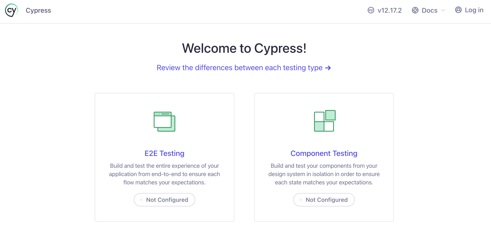
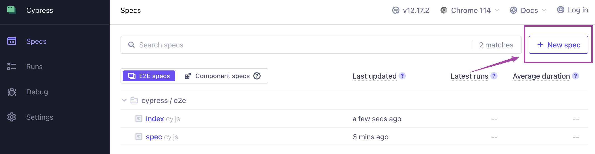
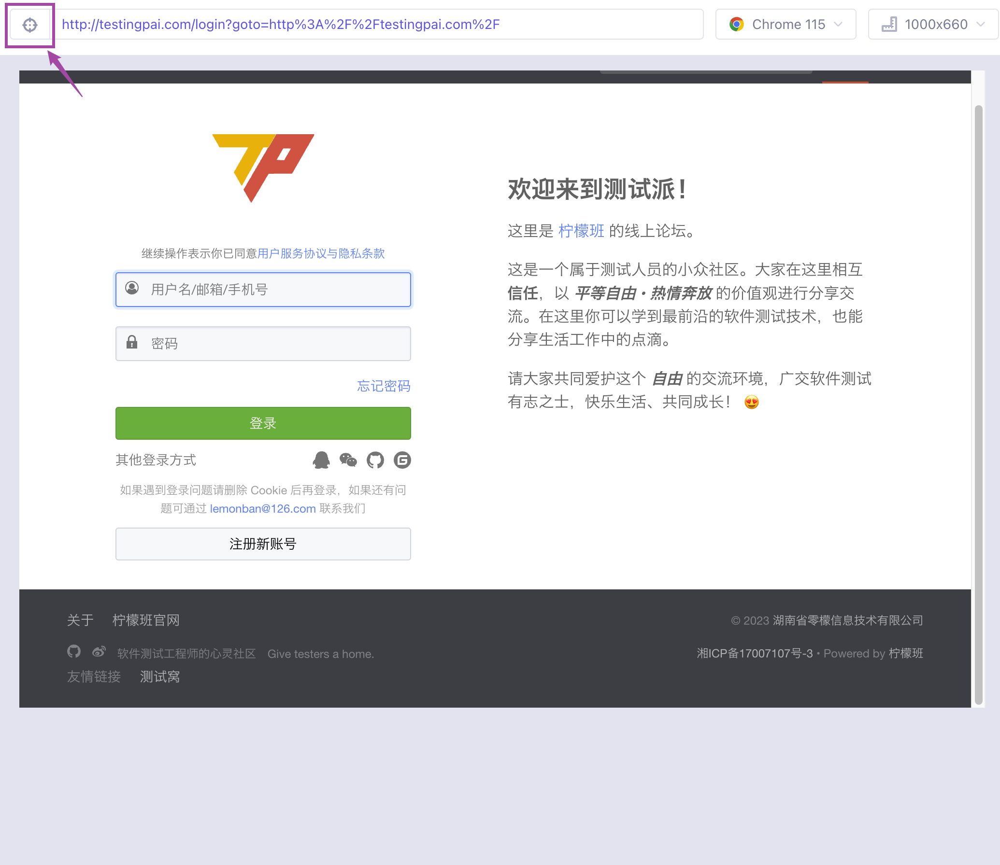
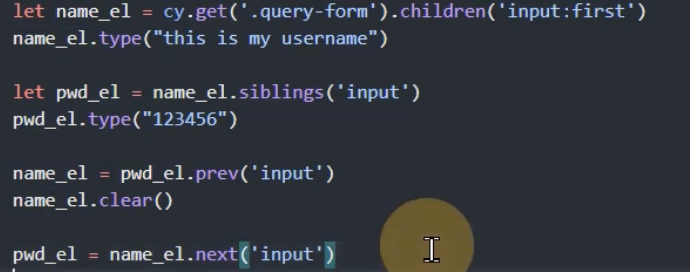

# Cypress E2E测试框架
```s
https://docs.cypress.io

https://docs.cypress.io/api/table-of-contents
```

Cypress主要是做端对端测试的, 也就是我们常说的UI界面测试 它使用了JS 内部使用的是流行的JS测试框架mocha & chai

- mocha: 主要完成浏览器的操作
- chai: 主要是用来做断言的

<br><br>

## 架构不同于 selenium
selenium是一套非常流行的自动化测试框架, 它几乎是行业的标准

cypress对标的是selenium的下一代测试框架, selenium在中间有一个叫做webdriver提供一个驱动 该驱动最终会转化为js的指令

cypress中是没有webdriver作为中间的桥梁的 它们中间是直接通过js控制的 所以cypress会比selenium要快一些

<br><br>

## 为什么不学习 selenium 而要学习cypress
selenium的生态系统非常的完善 它制定的一系列标准也被很多框架沿用 有很多的框架都是基于selenium来开发的 我们学习 cypress 主要是对比和 selenium 操作的不同, cypress很快速和方便

<br>

### cypress 的特有功能
- 时间旅行:   
在我们执行自动化测试代码后 是不需要人盯着界面去执行 等代码跑完了之后 我们可以直接打开它的界面 它可以重现当时的运行场景

- 实时加载:  
cypress里面使用了异步编程思想

- 结果一致性:  
selenium会因为网络 可以导致结果不一致

- 调试功能:  
内置了debug工具

- 自动等待:  

- 网络控制:  
selenium不能控制请求 它只能看结果

- 截图和视频:  
cypress在遇到异常的时候 会自动截图和录屏

<br><br>

# Cypress的安装 和 使用

### 安装:
```s
npm init -y
npm i cypress -D
```

<br>

### 查看 cypress 命令
我们要想运行 cypress 的相关指令的话 都需要进入到 ``./node_modules/.bin/`` 下

```s
sudo ./node_modules/.bin/cypress --help
```
```s
help               Shows CLI help and exits
version [options]  prints Cypress version
open [options]     Opens Cypress in the interactive GUI.
run [options]      Runs Cypress tests from the CLI without the GUI
open-ct [options]  Opens Cypress component testing interactive mode. Deprecated: use "open
                    --component"
run-ct [options]   Runs all Cypress component testing suites. Deprecated: use "run --component"
install [options]  Installs the Cypress executable matching this package's version
verify [options]   Verifies that Cypress is installed correctly and executable
cache [options]    Manages the Cypress binary cache
info [options]     Prints Cypress and system information
```

<br>

### 打开 cypress 界面
```s
sudo ./node_modules/.bin/cypress open
```

<br>



<br>

我们会在这个界面 选择类型
1. 测试整个项目
2. 测试单个组件

<br><br>

## cypress项目结构
我们通过 npm 安装完 cypress 后 我们的项目结构就变成了如下的样子 其中没有的目录可以自行创建
```s
| - Cypress
  | - node_modules
  | - cypress
    # 存放测试需要的数据, 测试数据 账号等
    | - fixtures
      - example.json

    # 测试用例都会存放在该文件夹下 如果没有则自己创建
    | - integration
      # 自动化测试的使用用例 算是教程 其它版本中创建项目后自带
      | - examples
      | - login # 比如我们自己创建一个login的文件 表明我们这里要测试所有关于login模块的用例
        - demo.spec.js
    
    # 我们写的模块和依赖会放在该文件夹中
    | - plugins

    # 我们可以封装一些方法放到这里
    | - support
      # 我们定义自己的指令
      - commands.js
      # 导入我们定义的指令 比如 import './commands'
      - index.js

  # cypress项目配置
  - cypress.config.json
  - package.json
```

<br>

### 注意:
我们的Cypress项目创建好后 内部的cypress目录是没有写权限的 所以我们要执行如下的命令
```s
sudo chmod -R 777 cypress

# e2e目录下的所有文件也不让写 啊啊啊啊
sudo chmod -R 777 e2e
```

<br>

### 发现: e2e目录/测试用例
新版的cypress是通过ui界面来创建目录 和 测试文件的, 比如我们通过ui界面创建测试文件的时候 它好像默认是在如下目录下创建文件
```s
cypress/e2e/测试文件名.cy.js
```

<br>

整不好我们文件的创建 删除都是通过UI界面来完成的

<br><br>

## 编写测试用例
我们在 /cypress/integration/ 目录下创建 ``demo.spec.js`` 文件 编写代码

**最新版:**  
使用的是UI界面的方式 才创建测试文件 同时对文件的命名也有效果, 如果我们自行创建测试文件则没有权限对其进行修改

1. 目录: 默认目录为 /cypress/e2e/
2. 文件名: 模块名.cy.js

上述两点应该都可以通过配置文件来设置

<br>

### 需求:
我们要运行一个简单的命令 打开浏览器访问一个url地址

<br>

### 编写代码:
```js
describe("demo", () => {
  // 测试用例 it()
  it("test_case_1", () => {
    // visit() 访问url
    cy.visit("http://www.baidu.com")
  })
})
```

<br>

### 进入到 cypress 界面 进行测试
```s
# 方式1: 找到 bin 下的cypress 来执行
sudo ./node_modules/.bin/cypress open

# package中的配置
"open": "echo 2020 | sudo ./node_modules/.bin/cypress open"

# 方式2: 使用 npx 来执行
sudo npx cypress open
"open": "echo 2020 | sudo npx cypress open"
```

1. 打开界面后 我们选择左边的
2. 下一个界面来选择浏览器
3. 然后进入到测试界面 选择我们的 spec.js 文件进行测试

<br>

### 常用命令
```s
# 运行所有的测试用例
npx cypress run

### 切换有头 / 无头: 无头模式是不会出现浏览器界面的
npx cypress run --headed  # 有头: 会出现浏览器界面

# 运行指定的spec
npx cypress run --spec "cypress/integration/demo.spec.js"

### 指定浏览器
npx cypress run --browser=chrome
```

<br><br>

## 让vscode有cypress的提示功能

### 方式1: 以注释的方式表明我们写的是cypress的代码 (测试好用)
每个js文件上方都要使用该注释 使用该方式后 我们再写cypress的时候 就有代码提示了
```js
/// <reference types="Cypress" />
describe('template spec', () => {
  it('passes', () => {
    cy.visit('https://www.baidu.com')
  })
})
```

<br>

### 方式2: 根目录下创建 jsconfig.json 文件
include包含的目录下的js文件都会有cypress的代码提示
```s
{
  "include": [
    "/node_modules/cypress",
    "cypress/**/*.js"
  ]
}
```

<br>

**代码片段: 官方插件**  
它内部提供了类似 rsc 之类的代码片段

<br><br>

# Cypress完整的自动化测试用例

1. UI界面选择 new spec


2. 测试文件命名规则 模块名.cy.js

3. 编写代码
```js
sudo chmod -R 777 e2e


/// <reference types="Cypress" />

// describe表示某个测试场景
describe('测试首页', () => {
  // it() 表示测试用例
  it('首页点击登录', () => {
    // 1. 访问首页
    cy.visit('http://testingpai.com/')

    // 2. 点击登录按钮 (通过css选择器 找到元素)
    // cy.get(".mnav").eq(0).click()
    cy.get("#navLogin").click()
    
    // 等待页面完全加载
    cy.wait(3000);

    // 3. 断言: 点击登录按钮后会出现什么结果 比如点击按钮会跳转到指定页面 https://news.baidu.com/
    // cy.url({ timeout: 2000 }).should("include", "news")
    cy.url().should("include", "login")
    cy.title().should("include", "登录")
    // cy.contains("热点要闻").should("be.visible")
  })
})
```

<br>

### 要点1: 
### **<font color='#C2185B'>cy.get(元素选择器)</font>**
获取指定的元素

该方法就是jq中的语法, 所以我们要获取指定的元素有多种的方式如:
```js
cy.get(".classname1.classname2")

cy.get("[data-test='element']")

cy.get(".parent-element").find(".mnav")

cy.get(".mnav + .sibling-element")

// 如果元素上有特定的文本内容，你可以尝试使用contains来选择元素
cy.contains("Button Text")

// 索引位置：如果元素在特定位置，你可以使用索引选择器来定位元素
cy.get(".mnav").eq(0)

// 有时候元素可能会在页面加载后才出现, 这将等待10秒钟，直到元素可见为止
cy.get(".mnav", { timeout: 10000 }).should("be.visible")
```

<br>

### 要点2: 指定等待的超时时间
如果我们测试中可以等待4s后 没有响应就结束了 直接失败, 这时我们可以定义等待的时长

1. 在 /cypress/support/index.js 中定义
```js
// cypress/support/index.js

Cypress.on("window:before:load", (win) => {
  win.pageLoadTimeout = 10000; // 设置超时时间（以毫秒为单位）
});

```

<br>

### 要点3: 访问页面 
### **<font color='#C2185B'>cy.visit('http://testingpai.com/')</font>**  

<br>

### 要点4: 获取指定元素
### **<font color='#C2185B'>cy.get("#navLogin").click()</font>**

<br>

### 要点5: 等待页面加载完成
### **<font color='#C2185B'>cy.wait(3000)</font>**

<br>

### 要点6: 断言
获取前面的内容 如下面我们获取了
- url: cy.url()
- title: cy.title()

然后我们使用了 **<font color='#C2185B'>should()</font>** 方法来进行断言

<br>

### **<font color='#C2185B'>cy.url().should("include", "login")</font>**  
断言点击按钮后下一步的动作 断言url是否包含什么

```js
// 还可以传入超时时长
cy.url({ timeout: 2000 }).should("include", "news")
```

<br>

### **<font color='#C2185B'>cy.url().should("include", "login")</font>**
断言url中包含什么

<br>

### **<font color='#C2185B'>cy.contains("热点要闻").should("be.visible")</font>**
断言页面有 热点要闻 的指定内容

<br>

### **<font color='#C2185B'>cy.get(".element-selector").should("exist");</font>**
断言该元素是否存在

<br>

### 页面状态断言
有时候页面可能会有特定的状态，例如成功消息、错误提示等。你可以根据页面上的状态元素进行断言。

```js
cy.get(".success-message").should("be.visible");
cy.get(".error-message").should("not.exist");
```

<br><br>

# 简单使用: mocha测试框架 和 chai断言库
如果我们不是使用 cypress 进行UI测试的时候, 只是希望使用mocha来进行类似功能测试, 
则我们需要安装单独的安装两个库 同时在使用库中的api的时候 也需要导入后才能使用, 因为

1. cypress是运行在浏览器环境下的 而普通的功能测试需要运行在 mocha 环境下
2. cypress里面集成了 mocha 和 chai 所以在cypress里面使用api的时候不用导入

<br><br>

### 安装:
我们通过 chai 来进行断言, 再通过 mocha 框架运行测试用例
```s
npm i mocha chai
```

<br>

### 测试文件命名规则
我们使用 mocha chai 来写普通的测试用例的时候 我们可以将文件名写成任意的格式 如: ``test01.js``

<br>

### 编写测试用例:
```js
// 通过 mocha框架 编写测试化用例

// 1. 导入should
const should = require("chai").should()

// describe用来描述一个测试场景
describe('测试变量', () => {

  let str = "sam"

  // 编写测试用例
  it('测试用例名称: str是一个字符串', () => {
    // 断言: 测试 str 是 字符串
    str.should.be.a("string")
  });

  it('str是sam', () => {
    str.should.eq("sam")
  });
  
});
``` 

<br>

### 通过 mocha 运行测试用例
```s
npx mocha 测试文件名
```

<br><br>

# Cypress: 浏览器页面导航相关
### **<font color='#C2185B'>cy.visit()</font>** 
访问url地址

我们访问的页面返回的必须是一个html文档, 如果url返回的是json格式的话 它是访问不到的

<br>

### **<font color='#C2185B'>cy.go(-1, "back", 1, "forward")</font>** 
前进后退

<br>

### **<font color='#C2185B'>cy.reload()</font>** 
刷新

默认刷新会使用缓存, 如果不想使用缓存而是强制刷新 使用 ``cy.reload(true)``

<br>

### **<font color='#C2185B'>cy.title()</font>** 
获取页面标题

<br>

### **<font color='#C2185B'>cy.url()</font>** 
获取页面url

<br>

```js
describe("", () => {
  it("测试浏览器导航", () => {
    // 访问url
    cy.visit("www.baidu.com")
    cy.visit("news.baidu.com")
    // 测试 后退 前进 和 刷新
    cy.go(-1)
    cy.go(1)
    cy.reload()
    // 测试最终页面应该是 新闻页面 通过title和url来测试
    const url = cy.url()
    const title = cy.title()
    console.log(url, title)
  })
})
```

<br><br>

# Cypress: 元素定位
我们在浏览器中查找要操作的元素的过程就是 元素定位

```s
可以打开网站 - F12 - 找到元素 - 右键 - copy - 元素选择器
```

<br>

### cypress 自带元素定位获取工具


<br>

当我们在 ui界面上 通过 cy.visit() 打开一个页面的时候 我们在右侧网页部分的url左边 可以看到一个 ``瞄准器`` 

<br>

**使用方式:**  
1. 编写 cy.visit("url") 代码
2. cypress open 打开UI界面
3. 运行测试用例
4. 点击瞄准器
5. 将瞄准器放到目标元素上
6. 观察 cy.get 部分 那是直接生成的 获取定位元素的代码 我们可以直接复制
```s
cy.get('#nameOrEmail')
```

<br>

### 向文本框内输入数据
### **<font color='#C2185B'>cy.type("要输入的内容", {配置})</font>**  

当你使用cy.type()命令时，默认情况下Cypress会检查目标元素
- 是否可见
- 是否可交互
- 是否被禁用

如果元素是只读的或者被禁用的，Cypress会拒绝尝试输入文本，以避免对不可编辑元素进行操作

<br>

**强制输入:**
```js
cy.get('#loginPassword').type('your_password', { force: true });
```

<br>

### **<font color='#C2185B'>cy.get('#loginPassword').focus().type("admin")</font>**  
元素.focus() 就用来聚焦的

当我们输入完用户名后, 我们的光标需要移动到密码框上, 如果是页面的话 我们可以通过 tab 或者 鼠标点击 让 密码框进行聚焦

如果是通过代码的话, 我们就要使用 ``元素.focus()`` 来进行聚焦

<br>

### **<font color='#C2185B'>表单元素.clear()</font>**  
清空表单元素  

<br>

### 练习: 输入内容 点击登录
```js
describe('柠檬派测试', () => {
  it('输入 uname pwd 提交', () => {
    cy.visit('http://testingpai.com/login')
    
    // 向表单项输入内容: type()
    cy.get('#nameOrEmail').type("admin")
    // 输入密码之前 要让密码input获取到焦点(相当于我们点击了密码框)
    cy.get('#loginPassword').focus().type("admin")
    cy.get('#loginPassword').click()
  })
})
```

<br><br>

## 元素定位: 通过 API
### **<font color='#C2185B'>cy.get()</font>**
### **<font color='#C2185B'>元素.children()</font>** 
### **<font color='#C2185B'>元素.parent()</font>** 
### **<font color='#C2185B'>元素.prev()</font>** 
### **<font color='#C2185B'>元素.next()</font>** 



<br>

### 指定作用域范围
我们通过 within 来指定目标的作用域范围

<br>

### **<font color='#C2185B'>cy.get().within((父元素) => { ... })</font>**  
语法中的 cy.get() 获取的是父级元素哦, 回调函数中的形参就是父元素本身, 供在回调中使用

<br>

比如 我们有一个表单 里面有 用户名 和 密码 的input
```s
| 用户名 |
| 密码 |
```

我们通过上面的api 分别获取表单元素
```js
// 获取表单的wrap 也就是parent本身就是父元素
const parent = cy.get(".query-form")
// 获取 用户名 和 密码 input
parent.first().type("sam")
parent.last().type("123")
```

但是如果我们想**同时获取** 用户名 和 密码 这两个input框, 如果我们想通过一个父元素 同时获取它内部的多个子元素 我们就需要使用 within()

<br>

**作用:**  
within()是一个非常有用的函数，用于将操作限制在特定的DOM元素内部。它的主要作用是帮助你在更深层次的DOM结构中进行定位和操作

也就是说我们以后想在一个特定的父元素在对它的子元素进行操作的时候就可以使用 within

<br>

**场景:**  
1. 复杂的嵌套结构:
```s
当页面有复杂的嵌套结构，你需要在其中一个特定的父元素范围内执行操作时，可以使用within()函数。它可以帮助你在指定的父元素内查找子元素，而无需编写绝对选择器。
```

2. 可重用的组件: **这个不错**
```s
如果你在页面上有一些可重用的组件，而这些组件可能在多个地方被使用，你可以使用within()函数来定位和操作这些组件，而不用担心它们是否存在于不同的页面位置。
```

<br>

```js
// 获取父元素
const parent = cy.get(".query-form")
parent.within(parent => {
  /*
    这里就相当于 父元素中的的领域

    这时我们使用 cy.get() 来获取元素的时候, 仅是在 parent 作用域下获取 不会获取到作用域之外的元素
  */
  cy.get("input:first").type("username")
  cy.get("input:last").type("password")
})
```

<br>

### 通过文本来进行定位
### **<font color='#C2185B'>cy.contains("文本")</font>**  
通过指定的文本 获取到元素

<br>

### 扩展: 时间回溯功能 before after
我们点击时间点的时候 应该能看到 before 和 after 按钮 点击它们可以看到 之前 和 之后的状态

<br><br>

# 元素的输入操作
对表单项的一些操作

- type():
- clear():
- focus():
- blur():
- submit(): 通过 表单.submit
- click():
- dbclick(): 双击
- rightclick(): 右击

<br>

### **<font color='#C2185B'>cy.get().focus().type()</font>**  
聚焦, 聚焦后输入


<br>

### **<font color='#C2185B'>cy.get().type().blur()</font>**  
失焦, 输入后失焦

<br><br>

# 元素选择操作:
也就是对 单选框 和 多选框 和 下拉框 操作

<br><br>

## 单选 和 多选的情况:

### 多选框操作
### **<font color='#C2185B'>cy.get(多选框元素).check()</font>**
```js
cy.get("[type=checkbox]").check()
```

<br>

**注意:**  
1. check只能选择可以选择的 如果设置了 disabled 会报错, 所以要改成点击没有 disabled 这个属性的 单选框
```js
cy.get("[type=checkbox]").not("[disabled]").check()
```

2. 如果我们想 disabled 的checkbox 也被get获取到和可以被点击 可以加上 force: true
```js
// 选择所有的checkbox 就算属性是disabled也没关系
cy.get("[type=checkbox]").check({force: true})
```

2. 如果我们的选择器 指定了某一个checkbox 那么只能对这一个checkbox 进行操作 我们应该获取一堆checkbox, 相当于我们应该使用 document.querySelectAll, 如果是选择器的话 我们可以 ``cy.get("父元素 [type=checkbox]")``

<br>

### 选择单个的checkbox
上面我们是通过选择器 将指定父元素下的所有checkbox都选择了 同时操作所有checkbox的选中 和 不选中状态

如果我们只想选中 6个checkbox中的一个 或者 两个时候 我们可以通过下面的方式

<br>

### **<font color='#C2185B'>cy.get(多选框元素).check("checkbox的value值")</font>**  
如果我们给一个 ``<checkbox value="apple">`` 指定了value值的时候, 它就会被选中, 我们通过代码想让一个checkbox被选中的时候 可以在check()方法里面传入 ``<checkbox value>`` value值作为参数
```js
cy.get("[type=checkbox]").check("apple")

// 选择多个
cy.get("[type=checkbox]").check(["apple", "origin"])
```

<br>

### 单选框操作:
### **<font color='#C2185B'>cy.get(多选框元素).check("radio元素的value值")</font>**  
还是调用 check() 方法 传入单选的value值
```js
cy.get("[type=radio]").check("male")
```

<br>

### 取消选择
### **<font color='#C2185B'>cy.get(单选框 / 多选框元素).uncheck()</font>**
```js
cy.get("[type=checkbox]").uncheck()
cy.get("[type=checkbox]").uncheck({force: true})
```

<br><br>

## 下拉框的操作
下拉框菜单也分别两种情况 这时我么控制的是 select元素的 multiple 属性来做到的
1. 下拉项单选
2. 下拉项多选

我们选择一个下拉项的时候 也有两种方式
1. 通过 option元素的value值 ``<option value="apple">``
2. 通过 option元素的标签体

<br>

比如我们要选择下拉框中的一项
```s
| - 水果
  - 苹果
  - 香蕉
```

<br>

### **<font color='#C2185B'>cy.get(select元素).select("option元素的value值 | 它的标签体")</font>**

我们需要先获取到 下拉框元素
```js
// 1. 获取下拉框元素 通过文本内容选择下拉项
cy.get(".action-select").select("banana")
// 通过value属性选择下拉项
cy.get(".action-select").select("fr-banana")


// 获取多选的下拉项
cy.get(".action-select").select(["fr-banana", "fr-apple"])
```

<br><br>

# 窗口滚动操作

### 将某一个元素滚动到可视范围之内
### **<font color='#C2185B'>元素.scrollIntoView()</font>**
比如 我们访问一个网页 有一个元素在 ``top: 1000px`` 的位置, 我们是不是要先拖动滚动条到目标元素的位置, 这个动作就是 ``scrollIntoView()``
```js
cy.visit("https:..//example.com")
// 将输入框滚动到可视范围内 然后输入文字
cy.get("#input-el").scrollIntoView().type("hello")
cy.wait(2000)
```

<br>

### 滚动整个窗口到指定位置
### **<font color='#C2185B'>cy.scrollTo("bottom")</font>**  
### **<font color='#C2185B'>cy.scrollTo(0, 250)</font>**  
### **<font color='#C2185B'>cy.scrollTo("0%", "25%")</font>**  
不用获取元素 因为我们滚动的就是整个窗口

<br>

### 具有滚动条的指定元素的滚动
scrollTo()方法是滚动页面的位置, 但是如有页面中还有子页面或者子元素 它们也有滚动条**怎么办?**

<br>

### **<font color='#C2185B'>cy.get().scrollTo("bottom")</font>**  
我们找到这个可滚动的元素, 然后通过 ``元素.scrollTo()`` 方法进行滚动

```js
cy.visit("https://example.com")
// 将元素滚动到可视范围内 然后让它滚动 不到可视范围 我们也看不见
cy.get("#el").scrollIntoView().scrollTo("right")
```