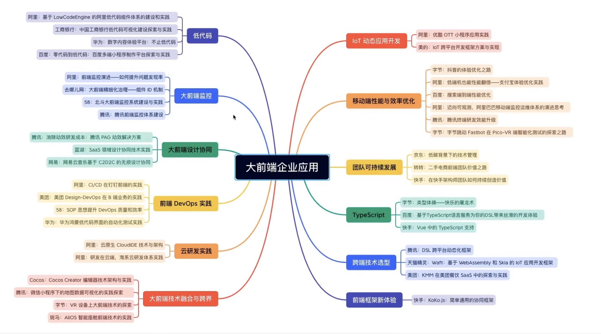

# TechnologyStack

### 目录:
```
| - golang
  - go

| - python
  - python

| - test
  - test
  - jest

| - backend
  - docker
  - java
  - javaweb
  - jdbc
  - linux
  - maven
  - mongodb
  - mybatis
  - mybatis-plus
  - mysql
  - nestjs
  - nginx
  - nodejs
  - prisma
  - rabbitmq
  - redis
  - rust
  - shell
  - spring
  - springboot
  - springbootproduct
  - springcache
  - springmvc
  - springsecurity

| - basic
  | - 前端缓存
    - cache 

  | - 前端优化
    - 代码优化
    - 性能优化

  | - 前端知识
    - cookie_session_token
    - cors
    - cors_domain
    - iframe
    - summary
    - token保存场所
    - token持久化
    - xss_csrf

  | - 数据分析
  | - 数据结构与算法
  | - 网路安全
  
  - animejs
  - aws
  - babel
  - cdn
  - debug
  - echarts
  - env
  - eslint
  - fiddler
  - git
  - glob
  - http
  - i18n
  - ie
  - japn
  - konva
  - markdown
  - mock
  - p-queue
  - package
  - pm2
  - postman
  - pwa
  - restful
  - style_resources_loader
  - sweet_scroll
  - swiper
  - template
  - veevalidate
  - vpn
  - vuelayload
  - watermark

| - front
  | - ajax
    - ajax
    - axios
    - axios2次封装
  
  - antd
  - canvas

  | - css
    - less
    - scss
    - animejs

  - drag

  - element ui
  
  | - js
    - jq
    - js技巧
    - js设计模式
    - 闭包
    - 函数式编程 & lodash
    - 节流 & 防抖
    - 模块化标准
    - 瀑布流
    - 扩展知识点
    - 异步编程
    - 长列表优化
    - event_loop
    - index规律
    - js案例
    - js笔记
    - jsAPI
    - js效果
    - js注意点
    - js装饰器
    - js自定义函数
    - js_bom
    - js_es6
    - media
    - regexp
    - webworkers

  - next
  - nuxt
  - promise
  - pug

  | - react
    - 函数式组件
    - 类式组件
    - 路由

  | - vue
    - pinia
    - vue2
    - vue3
    - 权限管理
    - 装饰器
    - 知识点收集
    - 测试
    - excel
  
  - svelte
  - ts
  - vuetify
  - webpack
  - web_rtc
```

<br><br>

## 待学整理:


以前的话可以说前端是比较简单的工作 但是现在来说不能同日而语了 它里面的东西是比较复杂的 比如原生开发 和 后台的mvc在前端都是有很多应用场景的 如果前端想精还是比较难得

<br>

### 小程序:

**多端开发:**  
小程序各个端都有 比如如下的小程序 我们会使用多端的开发工具来开发小程序 uniapp taro 等 我们只需要开发一套就可以

- 微信
- 阿里
- 钉钉
- 字节跳动 
- qq轻应用

<br>

### Electron桌面技术:
之前我们开发桌面应用都需要使用java c++ 现在比较流行的桌面开发就是electron 

它可以开发类似 .exe 软件

- electron
  - 网易音乐
  - 飞书
   
- nw

<br>

### 移动应用开发:
- ReactNative
- Flutter
- nativeScript

<br>

### 微前端:
之前我们的模块都是在本地 通过webpack等打包工具 将我们本地的模块打成一个包

微前端可以将我们服务包放在线上互联网上在各个应用之间通过互联网去调用这些模块

一般微前端技术都有一些实现了 比如阿里集团 他们就可以利用已经开发好的一些模块的基础上我们继续开发

<br>

### 低代码技术:
我们可以开发一个平台 然后我们通过拖拖拽拽 就可以实现一个平台系统 对于耗费人力的cv工作 我们就可以通过低代码平台来解决

<br>

### CICD:
- jenkins
- codecov
- circleci
- travisci

<br><br>

## 目标:

### 查缺补漏列表
```s
# Http
https://www.bilibili.com/video/BV1xK411U7ac/?spm_id_from=333.337.search-card.all.click&vd_source=66d9d28ceb1490c7b37726323336322b


# JS设计模式
https://www.bilibili.com/video/BV1MP4y127kd/?buvid=XXE6242E19723025F66D46043A729D5536AFB&is_story_h5=false&mid=vGlgMoo3NUmI%2BpMgdy1sOA%3D%3D&p=1&plat_id=116&share_from=ugc&share_medium=android&share_plat=android&share_session_id=a354d195-e8c3-4f53-b56d-c7025967b321&share_source=WEIXIN&share_tag=s_i&timestamp=1685613693&unique_k=yQ3Vu16&up_id=146668655


# uniapp
https://www.bilibili.com/video/BV1mT411K7nW/?p=5&spm_id_from=333.880.my_history.page.click&vd_source=66d9d28ceb1490c7b37726323336322b


# 微信小程序
https://www.bilibili.com/video/BV12K411A7A2/?spm_id_from=333.337.search-card.all.click&vd_source=66d9d28ceb1490c7b37726323336322b


# ES6
https://www.bilibili.com/video/BV1w8411s7g3/?p=46&spm_id_from=pageDriver&vd_source=66d9d28ceb1490c7b37726323336322b


# 数据结构与算法
https://www.bilibili.com/video/BV1ay4y1X7xd/?spm_id_from=333.337.search-card.all.click&vd_source=66d9d28ceb1490c7b37726323336322b


# React kerwin
https://www.bilibili.com/video/BV1z8411Z7Wt/?spm_id_from=333.999.0.0&vd_source=66d9d28ceb1490c7b37726323336322b


# React 扩展 kerwin
https://www.bilibili.com/video/BV1BG4y1b74H/?spm_id_from=333.999.0.0&vd_source=66d9d28ceb1490c7b37726323336322b


# React 超哥
https://www.bilibili.com/video/BV1bS4y1b7NV/?spm_id_from=333.880.my_history.page.click&vd_source=66d9d28ceb1490c7b37726323336322b
```

<br>

### 目标:
- [ ] 课程录制 + 日语学习 + 前后台相关知识复习
  - [ ] 复习过程中: 补充 React函数式组件
  - [ ] 复习过程中: 补充 ReactNative
  - [ ] 复习过程中: 补充 Ts
  - [ ] 复习过程中: 补充 Http
  - [ ] 复习过程中: 补充 JS设计模式
  - [ ] 复习过程中: 补充 微信小程序
  - [ ] 复习过程中: 补充 uniapp

- [ ] RabbitMQ
- [ ] SpringCloud
- [ ] OAuth2.0
- [ ] K8S

- [ ] Redis下篇
- [ ] 数据库下篇
- [ ] Maven下篇
- [ ] Docker进阶视频

- [ ] Commonjs Es6module深入剖析
- [ ] 虚拟滚动
- [ ] 长列表优化
- [ ] requestIdleCallback
- [ ] eval()
- [ ] passive修饰符
- [ ] PostgreSQL
- [ ] Prisma
- [ ] React源码 
- [ ] Lodash源码

- [x] SpringBoot黑马
- [x] springSecurity
- [x] React笔记整理 (类式 函数式)
- [x] Docker
- [x] SpringBoot项目
- [x] MyBatisPlus
- [x] SimpleProject
- [x] ServiceWorker
- [x] Nginx复习
- [x] Vue源码
- [x] nest
- [x] echarts
